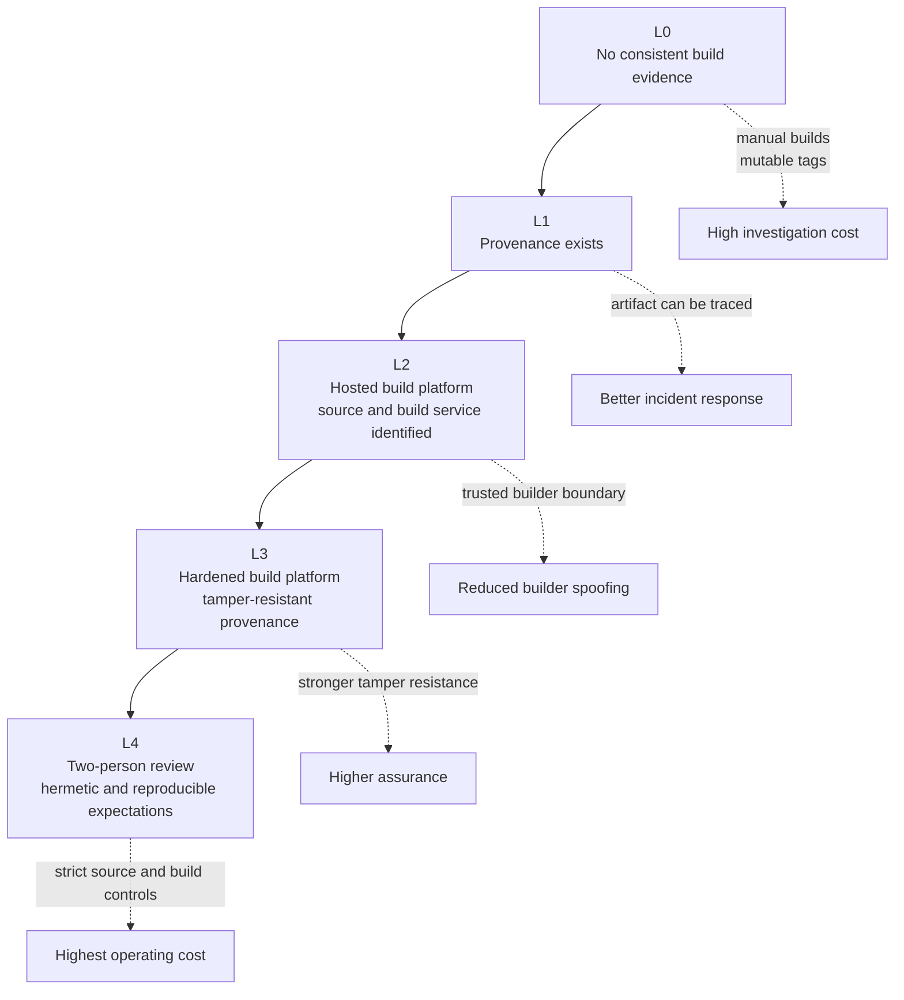

# Module 4.4: Supply Chain Threats

> **Complexity**: `[MEDIUM]` - threat modeling, evidence design, and Kubernetes policy enforcement.
>
> **Time to Complete**: 70-85 minutes.
>
> **Prerequisites**: [Module 4.3: Container Escape](../module-4.3-container-escape/), container image basics, CI/CD vocabulary, and basic Kubernetes admission control terminology.
>
> **Kubernetes target**: 1.35+. All command examples use the full `kubectl` binary name.

---

## Learning Outcomes

After completing this module, you will be able to:

- **Map** the Kubernetes software supply chain from source commit to running Pod and identify where tampering, tag mutation, dependency confusion, or registry compromise can occur.
- **Evaluate** SBOMs, image signatures, SLSA provenance, and in-toto attestations as complementary evidence instead of interchangeable security labels.
- **Design** Kubernetes admission policies that enforce trusted registries, digest pinning, signed images, and provenance requirements without blocking emergency response.
- **Diagnose** CI/CD and GitOps weaknesses that allow compromised actions, maintainers, build runners, or deployment repositories to create trusted-looking artifacts.
- **Implement** hands-on checks for SBOM generation, image signing, vulnerability scanning, and admission policy enforcement using Syft, Cosign, Trivy, and Kyverno.

## Why This Module Matters

In March 2024, the XZ Utils incident showed how close a patient upstream compromise could come to ordinary Linux systems. The public CVE record for [CVE-2024-3094](https://cveawg.mitre.org/api/cve/CVE-2024-3094) describes malicious code in the upstream xz release tarballs for versions 5.6.0 and 5.6.1, and CISA told affected users to downgrade to an uncompromised version while distributions investigated the exposure. The lesson for Kubernetes operators is not that one compression library matters more than every other dependency. The lesson is that clusters run artifacts assembled from many upstream decisions, and a cluster cannot infer that history from a Pod manifest alone.

Kubernetes makes supply chain mistakes operationally expensive because it automates trust at scale. A Deployment references an image; the kubelet pulls the image; the controller keeps the desired replica count alive; the service account, network policy, and secrets attached to the workload shape what the code can reach. If a compromised build pipeline signs a malicious image, or a GitOps repository accepts a mutated tag, the cluster may faithfully run attacker-controlled code while every runtime control sees a normal workload. Supply chain security is the discipline of forcing artifacts to carry evidence before the cluster gives them CPU, network, secrets, and identity.

The KCSA objective is not asking you to become a cryptographer or a registry maintainer. It is asking whether you can reason about the path from source to runtime, recognize common attack vectors, and name defensive controls that fit Kubernetes. This module treats supply chain security as an evidence chain: source review, dependency resolution, build isolation, image identity, registry integrity, signing, provenance, admission policy, and runtime detection. If one link is missing, you should be able to explain what attack becomes easier and which operational control would reduce the blast radius.

## 1. Define the Kubernetes Supply Chain

A Kubernetes supply chain is the full set of people, systems, packages, credentials, and automation that turn source material into a running workload. It includes the application repository, base images, language packages, Helm charts, operators, CI actions, build runners, artifact registries, GitOps controllers, deployment manifests, admission webhooks, and runtime inventory. This broad definition matters because attackers do not need to defeat Kubernetes directly if they can compromise something Kubernetes is configured to trust.

The most useful mental model is a route map with a question at every handoff. Source asks who changed the code and whether review rules were enforced. Dependencies ask which package names, versions, hashes, and registries were resolved. The build asks which workflow and runner produced the image. The registry asks whether a tag points to the same immutable digest as yesterday. Admission asks whether the digest has the expected signatures and attestations. Runtime asks whether the running Pod still matches the evidence that was accepted at deploy time.

```mermaid
flowchart LR
    source[Source repo\ncommits and reviews] --> deps[Dependencies\npackages and base images]
    deps --> build[Build system\nCI runner and workflow]
    build --> registry[Registry\nOCI image and metadata]
    registry --> gitops[GitOps or release repo\nHelm and manifests]
    gitops --> admission[Kubernetes admission\npolicy decision]
    admission --> runtime[Runtime\nPod, identity, network]

    source -. "compromised account\nor review bypass" .-> build
    deps -. "typosquatting\ndependency confusion" .-> build
    build -. "secret exposure\nmalicious action" .-> registry
    registry -. "tag mutation\nunauthorized push" .-> admission
    gitops -. "chart or operator drift" .-> admission
    admission -. "policy gap\nfail-open webhook" .-> runtime
```



Notice that the artifact changes form along the route. A developer thinks in commits and pull requests. A package manager thinks in names, versions, registry URLs, and hashes. A container registry thinks in tags, manifests, layers, signatures, and attestations. Kubernetes thinks in PodSpecs and image references. A strong platform links those views with stable identifiers, especially commit SHAs and image digests, so an incident responder can move from a running Pod back to the exact source and build that produced it.

Kubernetes image references are a good example of this distinction. The official Kubernetes documentation explains that tags are movable labels while digests identify immutable image content; when both a tag and digest are present, the digest is what Kubernetes uses for pulling. A manifest that says `ghcr.io/example/api:v1.2.3` depends on the registry's current answer for that tag. A manifest that says `ghcr.io/example/api@sha256:...` identifies exact content, which is why digest-based deployment is a foundation for signing, provenance, and reliable rollback.

Supply chain controls are also scoped differently. A vulnerability scanner can tell you whether a known vulnerable package appears in an image, but it cannot prove that the image came from an approved workflow. A signature can prove that a trusted identity signed a digest, but it cannot prove that the code was reviewed or free of known vulnerabilities. A SLSA provenance statement can describe how the artifact was built, but it still needs a policy engine to decide whether that builder is allowed for that namespace. Treat each control as one piece of evidence, not as a universal answer.

The Kubernetes-specific attack surface extends beyond application images. Helm charts can render privileged workloads or unexpected RBAC. Operators can reconcile new objects continuously after a one-time admission decision. GitOps repositories can become the real production control plane if every merged manifest is applied automatically. Base images and sidecars can carry shells, package managers, credential helpers, and debugging tools that do not belong in production. The exam may ask for broad concepts, but real clusters require you to inventory all of these inputs.

Pause and predict: if a team requires images to come from `registry.internal.example` but does not require digests, signatures, or provenance, what happens after an attacker steals a registry push token? The policy still blocks random public images, which is useful, but it may accept a malicious image pushed to the trusted registry under a familiar tag. Registry allow-lists reduce exposure; they do not prove that the artifact was built by the trusted pipeline.

## 2. Real Incidents and What They Teach

The supply chain incidents most relevant to Kubernetes share one property: the compromised component looked normal to downstream automation. The [2020 SolarWinds trusted-update backdoor](../../../../prerequisites/modern-devops/module-1.3-cicd-pipelines/) <!-- incident-xref: solarwinds-2020 --> is the foundational enterprise example — trusted software updates carried attacker-controlled code into ~18,000 customer environments. [3CXDesktopApp](https://www.cisa.gov/news-events/alerts/2023/03/30/supply-chain-attack-against-3cxdesktopapp) showed a user-facing desktop application being trojanized and distributed through a vendor's normal channel. These cases are outside Kubernetes, but they explain why artifact provenance matters before software reaches a cluster.

NotPetya is the canonical enterprise warning for trusted-update risk. In June 2017, an update delivered through M.E.Doc, a widely used Ukrainian accounting package, carried the initial payload. Attackers used that trusted update path to spread a destructive payload that behaved like ransomware but had no realistic recovery mechanism; the malicious process overwrote critical data structures in a way that made large-scale decryption infeasible even after paying ransom demands. The operational lesson is visible in the blast radius: global logistics, manufacturing, and logistics-adjacent firms, including Maersk, Merck, and FedEx, were disrupted because the malware moved with trusted enterprise update and authentication trust rather than purely by direct compromise. For Kubernetes supply-chain defense, the point is not only “don’t trust updates,” but to pair every update trust boundary with provenance checks, signed/attested immutability, and fast rollback to a known-good artifact state. [CISA Alert TA17-181A](https://www.cisa.gov/ncas/alerts/TA17-181A) documents these details from the NotPetya episode.

The XZ Utils incident is especially useful for cloud-native learners because it separates the source repository from the release artifact. The CVE record says the malicious code appeared in upstream tarballs and modified the liblzma build process through obfuscated steps. That pattern matters for containers because an image build often starts from published release archives, package repositories, or base layers rather than from a repository that your team reviews directly. If your evidence chain begins only after the image is built, you may miss compromise that occurred before the Dockerfile ran.

GitHub Actions incidents make the problem more immediate for CI/CD. CISA's alert for [tj-actions/changed-files, CVE-2025-30066](https://www.cisa.gov/news-events/alerts/2025/03/18/supply-chain-compromise-third-party-tj-actionschanged-files-cve-2025-30066-and-reviewdogaction), describes a compromised third-party action that exposed secrets in workflow logs and was later added to the Known Exploited Vulnerabilities Catalog. The GitHub Advisory Database entry [GHSA-mrrh-fwg8-r2c3](https://github.com/advisories/GHSA-mrrh-fwg8-r2c3) identifies affected versions through 45.0.7 and patched version 46.0.1. For Kubernetes teams, the prescriptive lesson is to pin actions to reviewed full commit SHAs, scope workflow permissions, avoid broad secrets on untrusted jobs, and rotate credentials after exposure.

The 2026 actions-cool incident is the same class of failure expressed through tag mutation. StepSecurity reported on May 18, 2026, that every tag for `actions-cool/issues-helper` had been redirected to imposter commits, and that `actions-cool/maintain-one-comment` was affected by a similar pattern. The local repository rule for GitHub Actions security points to this incident as the reason Dependabot cooldowns and full-SHA `uses:` references are mandatory here. The defensive takeaway is simple: a tag is a mutable pointer, so a workflow that says `owner/action@v3` is trusting future tag state, while a workflow pinned to a known-good full SHA is trusting one reviewed commit.

The npm ecosystem has provided older but still useful case studies. The npm team's archived post on the [event-stream incident](https://blog.npmjs.org/post/180565383195/details-about-the-event-stream-incident) says a malicious `flatmap-stream` dependency was added to `event-stream@3.3.6` after a maintainer handoff, and that npm removed the affected packages and took ownership of the package to prevent further abuse. The [ua-parser-js advisory record](https://github.com/advisories/GHSA-pjwm-rvh2-c87w) covers malicious versions published through a maintainer account compromise. These examples explain why lockfiles, package provenance, maintainer hygiene, and install-script controls belong in Kubernetes conversations even when the compromised package never mentions Kubernetes.

The safe way to use these incidents in a security curriculum is to focus on defensive invariants rather than exploit mechanics. Mutated tags teach immutable references. Compromised maintainers teach least privilege and trusted publishing. Poisoned release tarballs teach independent provenance and reproducible builds. Registry compromise teaches digest pinning and admission verification. CI secret exposure teaches job-scoped permissions and runner isolation. You do not need to reproduce the attacks to understand the control each incident makes necessary.

## 3. Attack Vectors from Source to Cluster

Typosquatting abuses human expectation. An attacker publishes a package, image, Helm chart, or action whose name differs from a trusted component by a small spelling change, visual similarity, namespace trick, or punctuation change. In Kubernetes, the danger is magnified by automation: a copied Dockerfile, generated chart value, or quick workflow edit can pull the wrong component without anyone noticing during review. Defenses include private mirrors, approved registries, package scopes, dependency review, and policy that rejects unapproved namespaces.

Dependency confusion abuses resolver behavior rather than spelling. A build system may have access to both an internal registry and a public registry, and it may choose a higher public version of a package name that the organization intended to keep private. The result is not a suspicious Pod called `malware`; it is normal application code built into a normal image. Good controls make package source explicit, reserve internal namespaces, fail closed when a private package is missing, and record resolved package URLs and hashes in the build evidence.

Tag mutation abuses mutable names. Git tags, container image tags, and action version tags are convenient for humans, but they can move if the hosting system permits it or an attacker gains the right credential. The tj-actions and actions-cool incidents made this visible for GitHub Actions, while container registries have the same basic risk for `latest`, release tags, and staging tags. Digest pins and full commit SHAs do not remove the need for updates; they move updates into a deliberate review process where a person or bot can show exactly what content changed.

Compromised maintainers are hard because the attacker may use legitimate permissions. A maintainer can publish a package, push a tag, approve a release, or change workflow code. If their account is compromised, downstream systems may see valid metadata from a trusted identity. Mature defenses reduce the blast radius with mandatory MFA, short-lived publishing tokens, trusted publishing through OIDC, protected release environments, multiple maintainers for critical actions, package cooldowns, and monitoring for unusual publish behavior.

Build-system compromise is the most dangerous pivot for Kubernetes because the builder often has access to source, secrets, signing credentials, registry push permissions, and deployment automation. A malicious action or script can read environment variables, alter generated artifacts, publish images, or sign the result if the job is overprivileged. The defense is to treat CI as production: pin third-party actions, set job-level permissions, separate build and deploy jobs, use ephemeral runners, prevent untrusted pull requests from receiving secrets, and make signing identity depend on protected branches and environments.

Registry compromise turns distribution into the attack path. If an attacker can push to a trusted registry or replace a tag, every cluster that pulls by tag can receive different bytes without a source change. Registries should enforce immutability for promoted tags, require authenticated pushes, log push events, support malware scanning where available, and store signatures and attestations next to the digest. Kubernetes admission should verify digest-level evidence instead of trusting the registry hostname alone.

GitOps and Helm introduce a second source of truth. A chart can embed a mutable image tag, a values file can override a registry, and an operator can create Pods after the original custom resource was admitted. The policy engine must inspect the rendered PodSpec or the resources that will create Pods, not only the Git repository path. This is why tools such as Kyverno and Sigstore Policy Controller enforce against PodSpec-bearing resources by default and why release reviews should include generated manifests.

## 4. Evidence: SBOMs, Signatures, and Provenance

An SBOM is an inventory, not a verdict. It helps you answer whether a released artifact contains a component, version, package URL, license, or relationship that matters during an incident. CycloneDX and SPDX are common formats; CycloneDX is often used in application security workflows, while SPDX is widely used for license and package metadata exchange. The operational requirement is that the SBOM be generated from the exact artifact digest that may run in production and stored where responders can search it later.

SBOM quality depends on timing and scope. A source-directory SBOM can be useful during development, but it may miss operating system packages, base image layers, or generated artifacts. An image SBOM sees the filesystem that ships, but it may still miss dynamically downloaded plugins, runtime package installation, or external services. For Kubernetes, the practical baseline is to generate an image SBOM in CI, attach or attest it to the digest, index it for incident response, and regenerate when the image is rebuilt rather than editing the SBOM by hand.

Vulnerability scanning consumes package evidence and vulnerability databases. Tools such as Trivy and Grype compare detected packages against advisory data, then report known vulnerabilities with severities and fix information. This is valuable, but it is not the same as exploitability. A package may be present but unreachable; a vulnerability may have no fixed version; a scanner may disagree with a vendor advisory; a newly disclosed CVE can appear after the release. Good release gates combine severity, fix availability, exposure, exploit activity, and exception records rather than treating every scanner row as equally urgent.

Image signing establishes a binding between an identity and an immutable artifact digest. Sigstore's Cosign can sign OCI images and verify signatures, and Sigstore's keyless model uses OIDC identities and short-lived certificates so teams do not need to manage long-lived signing keys in ordinary CI. The important policy question is not just whether an image is signed. It is whether the signature identity matches the expected builder, repository, workflow, branch, and issuer for the workload being admitted.

Provenance describes how an artifact was produced. SLSA provides a framework for progressively improving build integrity, while in-toto provides a way to record signed statements about supply chain steps and materials. A provenance statement can answer which builder ran, which source was used, which dependencies or materials were declared, and which artifact digest resulted. Kubernetes does not enforce that by itself; admission policy must compare the provenance against what the organization allows for the namespace, environment, or service account.



The SLSA level diagram should not be read as a compliance trophy ladder. Higher levels require process discipline, platform support, and maintenance cost. A small internal service may get most of its risk reduction from digest deployment, SBOMs, signatures, and hosted build provenance. A critical platform component that runs with cluster-wide permissions may justify stricter source review, isolated builders, provenance verification, and admission that rejects images lacking the expected builder identity.

Did you catch the tradeoff? Evidence adds friction when it is introduced late, but it reduces friction during incidents. A team without SBOMs must ask every owner whether they use a component. A team without provenance must guess which builds used a compromised runner. A team without digest records must ask whether a tag moved. The point of supply chain security is to make normal delivery produce the records you will need on the worst day.

## 5. Kubernetes Enforcement Patterns

Kubernetes admission is the main place where supply chain evidence becomes a deploy-time decision. The built-in ImagePolicyWebhook admission controller can call an HTTPS backend to approve or reject images, but it is disabled by default and requires API server configuration. ValidatingAdmissionPolicy uses CEL expressions inside the API server and can enforce simple structural rules such as requiring digests or forbidding `:latest`. Dynamic admission webhooks, Kyverno, Gatekeeper, and Sigstore Policy Controller add richer policy behavior for signatures, attestations, external lookups, and custom workflows.

The simplest enforceable rule is digest pinning. A ValidatingAdmissionPolicy can reject Pod specs whose container images do not include an `@sha256:` digest. That policy does not verify who built the image, but it prevents silent tag drift and makes later evidence checks stable. It is a good first enforcement step because it changes how release manifests are written without requiring every team to adopt signing on day one.

```yaml
apiVersion: admissionregistration.k8s.io/v1
kind: ValidatingAdmissionPolicy
metadata:
  name: require-image-digests
spec:
  failurePolicy: Fail
  matchConstraints:
    resourceRules:
      - apiGroups: [""]
        apiVersions: ["v1"]
        operations: ["CREATE", "UPDATE"]
        resources: ["pods"]
  validations:
    - expression: "object.spec.containers.all(c, c.image.contains('@sha256:'))"
      message: "Container images must be pinned by digest."
---
apiVersion: admissionregistration.k8s.io/v1
kind: ValidatingAdmissionPolicyBinding
metadata:
  name: require-image-digests
spec:
  policyName: require-image-digests
  validationActions: ["Deny"]
```

Signature enforcement is the next step when the organization has a signing flow. Sigstore Policy Controller uses `ClusterImagePolicy` resources to match images and verify signatures or attestations. Kyverno's `verifyImages` rules can also verify signatures and mutate images to digests depending on policy design. The right tool depends on your platform standards, but the policy shape is the same: match the image scope, define trusted authorities, require expected identity, and decide whether violations warn or deny.

```yaml
apiVersion: policy.sigstore.dev/v1beta1
kind: ClusterImagePolicy
metadata:
  name: require-github-actions-signature
spec:
  images:
    - glob: "ghcr.io/example-org/**"
  authorities:
    - name: github-actions-release
      keyless:
        url: https://fulcio.sigstore.dev
        identities:
          - issuer: https://token.actions.githubusercontent.com
            subjectRegExp: "https://github.com/example-org/.+/.github/workflows/release.yaml@refs/heads/main"
        ctlog:
          url: https://rekor.sigstore.dev
```

Vulnerability enforcement is more nuanced because a scanner finding is not always a deployment decision. Blocking every HIGH vulnerability may sound clean, but it can deadlock teams when base image fixes are unavailable or when a scanner produces a false positive. A practical Kyverno policy can require a vulnerability scan result annotation, restrict images to a registry where scan gates already ran, or call an external admission service that understands risk exceptions. The exercise later uses a strict example because it teaches the mechanics, not because every production cluster should copy it unchanged.

```yaml
apiVersion: kyverno.io/v1
kind: ClusterPolicy
metadata:
  name: require-scanned-image-annotation
spec:
  validationFailureAction: Enforce
  background: false
  rules:
    - name: require-scan-result
      match:
        any:
          - resources:
              kinds:
                - Pod
      validate:
        message: "Pods must reference an image scan record before admission."
        pattern:
          metadata:
            annotations:
              security.example.com/trivy-scan: "?*"
```

Admission policy must also have failure semantics. A supply chain webhook that fails open during an outage may silently accept the artifact class it normally blocks. A webhook that fails closed without an emergency process can stop critical remediation. Mature teams define namespace scope, break-glass annotations, ticket requirements, time-limited exceptions, and audit logging before enforcement reaches production. The goal is not to make exceptions impossible; it is to make exceptions visible, accountable, and short-lived.

Runtime detection closes the loop. Admission decides whether a new object is acceptable, but it does not continuously prove that every running Pod still matches current policy. Nodes may cache images, long-running Pods may predate a policy, and a vulnerability may be disclosed after deployment. Runtime inventory should record running image digests, owning workloads, service accounts, namespaces, signatures, SBOM links, and scan status. Continuous attestation compares that inventory to current policy and raises drift findings without waiting for the next deploy.

## 6. CI/CD and GitOps Hardening

The highest-value CI/CD rule is to remove ambient privilege. A workflow that builds an image usually needs source read access and registry push access; it does not automatically need repository write access, cloud administrator credentials, production deployment tokens, and every organization secret. GitHub Actions, GitLab CI, Tekton, Jenkins, and other systems express permissions differently, but the principle is the same: start with read-only defaults, grant write permissions at the job that needs them, and isolate deploy credentials from untrusted code paths.

Third-party CI components are executable dependencies. A GitHub Action referenced by tag can change after review; a Docker-based action can pull a mutable base image; a composite action can run scripts with your job permissions. The local repository rule for GitHub Actions security requires full commit SHA pinning, version comments for Dependabot, `persist-credentials: false` for checkout unless pushing is required, job-scoped permissions, and Dependabot cooldown. Those rules are not ceremony; they are direct mitigations for the tag-mutation and secret-exposure incidents covered earlier.

```yaml
name: release

on:
  push:
    branches: ["main"]

permissions:
  contents: read

jobs:
  build:
    runs-on: ubuntu-latest
    permissions:
      contents: read
      packages: write
      id-token: write
    steps:
      - uses: actions/checkout@1b4b2a8c7f2d7b1e0f4d9a1b6c3e8f9a0b2c4d6e # v4.3.0 example
        with:
          persist-credentials: false
      - name: Build and publish image
        run: |
          echo "Build, push, generate SBOM, sign, and attest in this protected job."
```

The SHA in the example is intentionally labeled as an example, not a recommended pin. In a real workflow you resolve the current upstream tag to a full commit SHA from the upstream repository, review the diff, add a version comment so automated updates remain understandable, and let Dependabot propose later SHA changes after a cooldown window. Do not copy SHAs from random articles or training modules into production workflows.

GitOps hardening starts by recognizing that the deployment repository is part of production. If Argo CD, Flux, or another controller automatically applies changes from a branch, then branch protection, review rules, signed commits, secret scanning, and repository permissions are production controls. The controller's Kubernetes permissions should be scoped to the namespaces and resources it manages. Its automation identity should not have broad cluster-admin access unless the platform explicitly accepts that risk and compensates with strict review and monitoring.

Helm and operator supply chains need extra attention because source review may not show the rendered PodSpec. A chart dependency can update templates; a values file can switch registries; an operator can create Pods after a custom resource is admitted. Policy should evaluate rendered workloads at admission, and release processes should store rendered manifests for review. When an operator needs broad permissions, treat its image, chart, CRDs, and controller permissions as a privileged supply chain, not as ordinary application code.

Cost and operability matter because supply chain evidence can produce a lot of data. SBOMs, scan results, provenance statements, admission audit logs, and runtime inventories consume storage and indexing capacity. At moderate scale, the cost is usually less about the command that generates the evidence and more about retention, search, and duplicate storage across registries, object stores, and security platforms. Control cost by storing evidence once per digest, deduplicating identical base layers where tooling allows, retaining high-value attestations longer than verbose build logs, and sampling noisy runtime telemetry only after preserving admission decisions.

## 7. Operational Maturity Model

At the initial level, teams deploy images by tag, depend on public packages directly, and investigate incidents through repository searches and chat messages. This is common in early clusters because it is fast and understandable. The risk is that nobody can prove which bytes ran after a tag moves, whether a vulnerable dependency was present in production, or which build used a compromised runner. The first maturity step is not buying a platform; it is writing down the artifact path and eliminating the most dangerous mutable references.

At the scanning level, CI generates SBOMs and vulnerability scan results for images. Teams can answer component exposure questions faster, and release gates catch obvious known vulnerabilities before deployment. The weakness is that scanning alone does not prove builder identity or prevent a trusted registry from serving a replaced tag. This level is valuable, but it should not be marketed internally as full supply chain security.

At the signing level, CI signs image digests and the cluster verifies signatures before admission. This blocks unsigned images and makes unauthorized manual pushes easier to detect. The weakness is that vague trust policies can accept the wrong signer, and a compromised signing workflow can still sign malicious output. Strong signing policies name the expected OIDC issuer, workflow identity, repository, branch, and environment.

At the provenance level, releases include SLSA-style provenance and in-toto attestations that connect source, builder, materials, and artifact digest. Admission can require that production images came from protected branches and approved builders. The weakness is complexity: provenance is only useful when policy checks it, responders can find it, and teams know how to fix failures without bypassing the system.

At the continuous-attestation level, the organization compares running workloads against current evidence and policy over time. A newly disclosed CVE can be matched to running digests; a revoked builder identity can trigger a fleet search; an old Pod that predates signature enforcement can be flagged. This level treats admission as one checkpoint in a continuing evidence loop. It costs more to operate, but it is the level that supports fast, fact-based response during large supply chain incidents.

Use this maturity model as a planning tool, not as a badge system. A small team can gain meaningful protection from digest pins, locked package resolution, SBOM generation, action SHA pinning, and narrow CI permissions. A platform team responsible for shared clusters should add signing, provenance, admission enforcement, exception workflows, and runtime inventory. The exam expects you to name these controls; production expects you to sequence them without breaking delivery.

## Learner Check

Exercise scenario: you are reviewing a new namespace for a payments service before it receives production traffic. The application repository uses protected branches, but the release workflow still calls three third-party GitHub Actions by version tag. The image is pushed to an internal registry as `payments:stable`, the GitOps repository deploys that tag, and Trivy runs in CI against the tag before the manifest is merged. The team says the registry is private and the scanner is clean, so supply chain risk is already handled. Your job is to identify which trust decisions are still implicit.

Start with artifact identity. The scanner result is tied to whatever `payments:stable` meant at scan time, while the cluster will ask the registry what the same tag means at pull time. If the tag moves between those events, the scan, SBOM, signature, and running Pod may describe different content. The minimal fix is to resolve `payments:stable` to a digest during promotion, store that digest in the release record, and deploy the digest through GitOps. That change does not make the image safe by itself, but it gives every later control one stable object to discuss.

Now inspect the CI workflow. A third-party action pinned to `v3` is executable code fetched during the job, and the job may give it access to repository contents, package tokens, cloud credentials, or OIDC tokens. The safer pattern is to resolve each action tag to a reviewed full commit SHA, add a version comment for update tooling, apply a cooldown before adopting new action releases, and reduce job permissions to the exact scopes required. If the workflow signs images, the signing step should run only on protected branches or protected release environments so untrusted pull requests cannot mint trusted artifacts.

Next, connect the evidence. A mature release should produce an SBOM from the image digest, a vulnerability scan result for that same digest, a signature from the release identity, and provenance from the approved builder. These records should be attached to the digest or stored under a digest-keyed release record, not scattered across CI logs. When a new vulnerability appears, responders should be able to ask, "Which running digests contain this component?" rather than asking every repository owner to search their source tree.

Finally, decide what Kubernetes should enforce. For a first production gate, require digest-pinned images from the internal registry and reject `:latest` or unpinned tags. For a stronger gate, verify that the digest has a Sigstore signature from the expected release workflow. For a high-assurance gate, require provenance that names the approved builder and source repository. Keep the policy narrow at first, deploy it in audit or warning mode where possible, fix legitimate failures, and then switch production namespaces to deny mode with an auditable break-glass process.

Pause and answer this before moving on: which single control would you add first if the team can only make one change this week? A strong answer names the control, the attack it reduces, and the evidence it creates for responders. "Add scanning" is not enough if scanning already happens against a mutable tag. "Deploy by digest" is often the first practical move because it stabilizes the object that scanning, signing, SBOMs, provenance, and admission all need to reference.

Exercise scenario: a platform team discovers that a popular base image used by twenty services contains a newly disclosed vulnerability. The team has SBOMs for all built images, but those SBOMs are named by service and version rather than digest. Some services rebuild nightly, some rebuild only on release, and several pods have been running for weeks. This is a detection problem, not just a build problem, because the team must connect source evidence to runtime state.

The investigation should begin by normalizing everything to image digests. Query the registry for current tags, query the clusters for running Pod image IDs, and map those digests to the SBOM records that were generated during builds. If an SBOM is missing for a running digest, treat that as an evidence gap even if the current source tree looks clean. Source state today does not prove what was inside an image built last month, and rebuilding the image today may produce a different dependency set if inputs were not pinned.

After mapping digests, triage by exposure. A vulnerable package in a base image may be unreachable in one service and reachable in another, but you need evidence before making that judgment. Consider whether the affected library is loaded by the application, whether the container includes a shell or package manager that increases attacker utility, whether the Pod has sensitive service account permissions, and whether network policy limits inbound and outbound paths. SBOMs accelerate the search; runtime context decides urgency.

The response should also update prevention. If the base image is centrally owned, publish a fixed digest and trigger downstream rebuilds. If teams choose base images independently, add policy that restricts production images to approved base families or requires base-image provenance labels. If the cluster admits old digests forever, add continuous inventory so stale workloads are visible. Supply chain security is strongest when an incident improves the delivery path instead of producing a one-time spreadsheet.

Exercise scenario: an operator installed from a Helm chart creates Pods in multiple namespaces. The operator image is signed, but the chart also grants broad RBAC and reconciles custom resources into privileged workloads. A reviewer says the image signature proves the operator is safe. This is a category error. The signature can tell you who signed a particular image digest; it does not prove that the chart's RBAC is least privilege, that the CRDs cannot be abused, or that the reconciled Pods comply with your namespace policy.

The right review splits the artifact types. Verify the operator image digest and signer identity. Review the chart templates and rendered manifests for RBAC, webhooks, Pod security settings, namespace selectors, and default values. Apply admission policy to the Pods the operator creates, not only to the chart installation request. Monitor the operator's service account because compromise of a controller with broad reconciliation rights can become a persistent supply chain foothold inside the cluster.

By now you should have a repeatable diagnostic question: "What evidence would convince the cluster to trust this artifact, and what evidence would convince a responder that the trust was justified?" If the answer is a registry hostname, the design is weak. If the answer is a digest, SBOM, vulnerability result, signer identity, provenance statement, policy decision, and runtime inventory record, the design is much stronger. The KCSA exam tests the vocabulary, but real platform work tests whether you can connect those pieces without making delivery impossible.

## Did You Know?

- NIST SP 800-218, the Secure Software Development Framework, was published in February 2022 and organizes secure development work into Prepare the Organization, Protect the Software, Produce Well-Secured Software, and Respond to Vulnerabilities.
- Kubernetes has documented keyless Sigstore verification for its own release artifacts since the v1.26-era signed-artifact task, which means Kubernetes itself is a useful example of signed release evidence.
- The GitHub Advisory Database entry for tj-actions/changed-files lists patched version 46.0.1, while CISA added CVE-2025-30066 to the Known Exploited Vulnerabilities Catalog on March 26, 2025.
- The StepSecurity actions-cool report says `actions-cool/issues-helper` had 53 tags moved to imposter commits and `actions-cool/maintain-one-comment` had 15 tags moved, which is why full-SHA pinning beats tag trust for CI actions.

## Common Mistakes

| Mistake | Why It Happens | How to Fix It |
|---|---|---|
| Treating a registry allow-list as provenance | The hostname looks like a trust boundary, but a stolen push token can still publish to that registry | Require image digests, signatures, and builder identity checks for production namespaces |
| Signing mutable tags instead of digests | Tags are easier for humans to read and are common in release notes | Resolve tags to digests during promotion and sign the digest that Kubernetes will pull |
| Letting CI jobs share broad secrets | It is convenient to put all release credentials at repository or organization scope | Scope permissions per job, split build and deploy, and keep secrets away from untrusted pull request paths |
| Enforcing scanner output without exception design | Teams want a simple HIGH-or-better gate | Include exploitability, fix availability, business exposure, expiry dates, and documented approvals in the policy |
| Verifying that an image is signed by anyone | The first rollout often checks only for the presence of a signature | Match signer identity, OIDC issuer, repository, workflow, branch, and expected registry path |
| Trusting Helm charts without rendered review | Reviewers inspect chart source but not the generated PodSpec | Store rendered manifests, run policy tests in CI, and enforce admission on generated workloads |
| Keeping SBOMs in CI logs only | The build generated evidence, but responders cannot search it later | Attach or attest SBOMs to the image digest and index them in a searchable inventory |
| Making admission fail open by default | Operators fear deployment outages caused by policy-service downtime | Define fail-closed scope for production, report-only rollout for new policies, and auditable break-glass paths |

## Quiz

<details>
<summary>Question 1: A team deploys `registry.internal/payments:v2.8.0` and scans that tag before release. Two days later the same tag points to a different digest. Which control would have made the deployment evidence stable?</summary>

The stable control is digest-based deployment, preferably combined with signing and provenance for that digest. A scan result for a tag describes what the tag pointed to at scan time, not what it points to later. If the manifest used `registry.internal/payments@sha256:...`, the cluster would ask for exact content and the scan, SBOM, signature, and provenance could all refer to the same artifact. Registry tag immutability helps too, but Kubernetes policy should still prefer immutable digests for production.
</details>

<details>
<summary>Question 2: Your CI workflow signs every image, but admission accepts any image that has any valid Sigstore signature. What is the weakness?</summary>

The weakness is that the policy checks signature presence but not trusted identity. An attacker could sign an image with their own unrelated identity and satisfy a vague signed-image rule. Production policy should match the expected OIDC issuer, repository, workflow path, branch or environment, and registry scope. Signatures are useful only when the verifier knows which signer is authorized for the workload.
</details>

<details>
<summary>Question 3: A new CVE is announced for a package that may exist in several base images. Your team has SBOMs attached to image digests but no runtime inventory. What can you answer, and what is still missing?</summary>

The SBOM store can answer which released image digests contain the package and version, assuming the SBOMs were generated from the shipped images. What is missing is a reliable map from running Pods to those digests across clusters and namespaces. You may know which artifacts are affected but not whether they are currently running, where they run, or which service owners must respond. Runtime inventory closes that gap by recording image digests, owners, namespaces, and workload identities.
</details>

<details>
<summary>Question 4: A GitHub Actions workflow uses `owner/action@v3`, has repository write permission, and can read cloud deployment secrets. Which supply chain incident pattern does this resemble, and what are the first fixes?</summary>

It resembles the tag-mutation and compromised-action pattern seen in tj-actions/changed-files and actions-cool. The first fixes are full commit SHA pinning for `uses:` references, job-level least privilege, secret isolation, and Dependabot cooldown for action updates. Repository write and cloud deployment permissions should not be available to a third-party action unless the job truly needs them. If the action may have run during a compromise window, rotate exposed credentials and inspect workflow logs.
</details>

<details>
<summary>Question 5: A product team wants to block every image with a HIGH vulnerability at admission. Why might that be unsafe as the only production rule?</summary>

It can be unsafe because scanner severity does not always equal exploitable production risk, and some vulnerabilities may have no available fix when an emergency deployment is required. A hard gate with no exception path can stop security patches or incident response releases. A better policy combines severity, fix availability, exploit activity, runtime exposure, namespace criticality, and time-limited exceptions. Strict blocking can still be useful for CRITICAL known-exploited vulnerabilities when the organization has a documented break-glass process.
</details>

<details>
<summary>Question 6: A GitOps controller has cluster-admin and applies every merge to `main`. The application images are signed and scanned. What supply chain risk remains?</summary>

The deployment repository and GitOps controller are still a production control plane. A malicious chart value, RBAC object, operator custom resource, or namespace-wide policy change could be applied even if the application image itself is clean. Branch protection, review rules, controller RBAC minimization, rendered manifest checks, and admission policy are still required. Image evidence protects the container artifact; it does not automatically protect every Kubernetes object that deploys it.
</details>

<details>
<summary>Question 7: An image has an SBOM, a clean vulnerability scan, and a valid signature, but no provenance. What question remains hard to answer?</summary>

It remains hard to answer how the artifact was built and whether the approved builder and source revision produced it. The SBOM describes contents, the scan compares those contents to vulnerability data, and the signature binds an identity to the digest. Provenance connects source, build workflow, builder identity, materials, and output digest. Without it, responders have weaker evidence when a build runner, dependency source, or release process is suspected.
</details>

## Hands-On Practice

The exercises are designed to run in a local learning environment with Docker or a compatible container engine, Syft, Cosign, Trivy, and a disposable Kubernetes cluster such as kind. Use a registry namespace you control for signing and verification because public examples cannot grant you push permission. If you cannot push images, read the commands and run the local SBOM and scan steps; the policy examples still teach the control design.

### Exercise 1: Generate a CycloneDX SBOM with Syft

Build a small image, generate a CycloneDX SBOM from the image, and inspect the component list. The goal is to see the difference between application dependencies and base-image packages before you rely on the SBOM during an incident.

```bash
mkdir -p supply-chain-lab
cd supply-chain-lab

cat > app.py <<'PY'
from http.server import BaseHTTPRequestHandler, HTTPServer

class Handler(BaseHTTPRequestHandler):
    def do_GET(self):
        self.send_response(200)
        self.end_headers()
        self.wfile.write(b"ok\n")

HTTPServer(("127.0.0.1", 8080), Handler).serve_forever()
PY

cat > Dockerfile <<'EOF'
FROM python:3.12-slim
WORKDIR /app
COPY app.py .
CMD ["python", "app.py"]
EOF

docker build -t supply-chain-lab:v1 .
syft supply-chain-lab:v1 -o cyclonedx-json > sbom.cdx.json
jq '.components[] | {name: .name, version: .version, type: .type}' sbom.cdx.json | head
```

Success criteria:

- [ ] `sbom.cdx.json` exists and is valid JSON.
- [ ] The SBOM contains both application-level and operating-system-level components.
- [ ] You can explain why generating the SBOM from the image gives stronger runtime evidence than scanning only the source directory.

<details>
<summary>Solution notes</summary>

The command `syft supply-chain-lab:v1 -o cyclonedx-json` inventories the built image, including packages inherited from `python:3.12-slim`. If `jq` shows only a few records, inspect the full file and verify that Syft recognized the image source. In production, store this SBOM by image digest rather than by the local tag `supply-chain-lab:v1`, because the tag can be rebuilt with different content.
</details>

### Exercise 2: Sign and Verify an Image with Cosign

Push the image to a registry you control, resolve its digest, sign that digest with Cosign, and verify the signature. Keyless signing is the preferred modern workflow when your identity provider and registry support it; key-based signing is useful for an isolated lab.

```bash
export REGISTRY_IMAGE="ghcr.io/YOUR_ORG/supply-chain-lab:v1"

docker tag supply-chain-lab:v1 "$REGISTRY_IMAGE"
docker push "$REGISTRY_IMAGE"

export DIGEST_REF="$(docker buildx imagetools inspect "$REGISTRY_IMAGE" \
  --format '{{json .Manifest.Digest}}' | tr -d '"')"
export IMAGE_REF="ghcr.io/YOUR_ORG/supply-chain-lab@$DIGEST_REF"

cosign sign --yes "$IMAGE_REF"
cosign verify "$IMAGE_REF"
```

Success criteria:

- [ ] The image is pushed to a registry namespace you control.
- [ ] The value in `IMAGE_REF` uses `@sha256:` rather than a mutable tag.
- [ ] `cosign verify` returns signature information for the digest you signed.
- [ ] You can state which identity should be checked in a production admission policy.

<details>
<summary>Solution notes</summary>

If keyless signing prompts for authentication, complete the browser flow for your lab identity. In CI, the equivalent should use an OIDC identity from a protected release workflow rather than a long-lived private key stored as a secret. Production verification should not stop at "a signature exists"; it should check the expected issuer and signer identity for your release workflow.
</details>

### Exercise 3: Scan an Image and Enforce a Simple Kyverno Gate

Scan the image with Trivy, save the result, then apply a Kyverno policy that requires a scan annotation before Pods are admitted. This exercise uses an annotation gate because a self-contained cluster cannot call your scanner's risk database without extra infrastructure.

```bash
trivy image --severity HIGH,CRITICAL --format json \
  --output trivy-report.json supply-chain-lab:v1

kubectl create namespace supply-chain-lab

cat > require-scan-annotation.yaml <<'EOF'
apiVersion: kyverno.io/v1
kind: ClusterPolicy
metadata:
  name: require-trivy-scan-annotation
spec:
  validationFailureAction: Enforce
  background: false
  rules:
    - name: require-trivy-scan-annotation
      match:
        any:
          - resources:
              kinds:
                - Pod
              namespaces:
                - supply-chain-lab
      validate:
        message: "Set security.example.com/trivy-scan to the approved scan record before deploying."
        pattern:
          metadata:
            annotations:
              security.example.com/trivy-scan: "?*"
EOF

kubectl apply -f require-scan-annotation.yaml
```

Now try a rejected Pod and an accepted Pod. Replace the image with a digest reference from your own registry if you completed the signing exercise.

```bash
cat > unsigned-demo-pod.yaml <<'EOF'
apiVersion: v1
kind: Pod
metadata:
  name: unsigned-demo
  namespace: supply-chain-lab
spec:
  restartPolicy: Never
  containers:
    - name: app
      image: supply-chain-lab:v1
EOF

kubectl apply -f unsigned-demo-pod.yaml
```

```bash
cat > scanned-demo-pod.yaml <<'EOF'
apiVersion: v1
kind: Pod
metadata:
  name: scanned-demo
  namespace: supply-chain-lab
  annotations:
    security.example.com/trivy-scan: "trivy-report.json reviewed for lab"
spec:
  restartPolicy: Never
  containers:
    - name: app
      image: supply-chain-lab:v1
EOF

kubectl apply -f scanned-demo-pod.yaml
kubectl get pod scanned-demo -n supply-chain-lab
```

Success criteria:

- [ ] Trivy produced trivy-report.json.
- [ ] The Pod without `security.example.com/trivy-scan` is rejected by admission.
- [ ] The annotated Pod is accepted in the lab namespace.
- [ ] You can explain why a production HIGH-severity gate should use scan evidence from a trusted service rather than a free-form annotation alone.

<details>
<summary>Solution notes</summary>

The strict annotation policy proves admission mechanics, not production-grade vulnerability enforcement. A real policy would verify that the scan record belongs to the same image digest, was produced by the approved scanner, is fresh enough for the environment, and has no unapproved HIGH or CRITICAL findings according to your risk policy. The key learning is that CI scan evidence and Kubernetes admission must be connected; otherwise a scan can pass in CI while a different image is deployed.
</details>

## Sources

- [NIST SP 800-218 Secure Software Development Framework](https://csrc.nist.gov/pubs/sp/800/218/final)
- [CNCF Software Supply Chain Security Paper](https://tag-security.cncf.io/community/working-groups/supply-chain-security/supply-chain-security-paper/CNCF_SSCP_v1.pdf)
- [SLSA specification](https://slsa.dev/spec/latest/)
- [Sigstore project](https://www.sigstore.dev/)
- [Sigstore Cosign repository](https://github.com/sigstore/cosign)
- [in-toto framework](https://in-toto.io/)
- [CVE-2024-3094 CVE record](https://cveawg.mitre.org/api/cve/CVE-2024-3094)
- [CISA: Reported Supply Chain Compromise Affecting XZ Utils](https://www.cisa.gov/news-events/alerts/2024/03/29/reported-supply-chain-compromise-affecting-xz-utils-data-compression-library-cve-2024-3094)
- [GitHub Advisory: XZ Utils malicious code](https://github.com/advisories/GHSA-rxwq-x6h5-x525)
- [GitHub Advisory: tj-actions/changed-files CVE-2025-30066](https://github.com/advisories/GHSA-mrrh-fwg8-r2c3)
- [CISA: tj-actions/changed-files and reviewdog/action-setup compromise](https://www.cisa.gov/news-events/alerts/2025/03/18/supply-chain-compromise-third-party-tj-actionschanged-files-cve-2025-30066-and-reviewdogaction)
- [StepSecurity: actions-cool/issues-helper compromised](https://www.stepsecurity.io/blog/actions-cool-issues-helper-github-action-compromised-all-tags-point-to-imposter-commit-that-exfiltrates-ci-cd-credentials)
- [CISA: Supply Chain Attack Against 3CXDesktopApp](https://www.cisa.gov/news-events/alerts/2023/03/30/supply-chain-attack-against-3cxdesktopapp)
- [npm: Details about the event-stream incident](https://blog.npmjs.org/post/180565383195/details-about-the-event-stream-incident)
- [GitHub Advisory: malicious ua-parser-js versions](https://github.com/advisories/GHSA-pjwm-rvh2-c87w)
- [Kubernetes documentation: Images](https://kubernetes.io/docs/concepts/containers/images/)
- [Kubernetes documentation: Admission controllers and ImagePolicyWebhook](https://kubernetes.io/docs/reference/access-authn-authz/admission-controllers/)
- [Kubernetes documentation: ValidatingAdmissionPolicy](https://kubernetes.io/docs/reference/access-authn-authz/validating-admission-policy/)
- [Kubernetes documentation: Verify Signed Kubernetes Artifacts](https://kubernetes.io/docs/tasks/administer-cluster/verify-signed-artifacts/)
- [Sigstore Policy Controller overview](https://docs.sigstore.dev/policy-controller/overview/)
- [Kyverno verifyImages documentation](https://kyverno.io/docs/policy-types/cluster-policy/verify-images/overview/)
- [Syft SBOM tool repository](https://github.com/anchore/syft)
- [Grype vulnerability scanner repository](https://github.com/anchore/grype)
- [Trivy vulnerability scanner documentation](https://trivy.dev/docs/latest/scanner/vulnerability/)
- [CycloneDX specification overview](https://cyclonedx.org/specification/overview/)
- [SPDX specification](https://spdx.github.io/spdx-spec/v3.0/)

## Next Module

Continue to [Module 4.5: Threat Modeling & Supply Chain Theory](../module-4.5-threat-modeling-supply-chain-theory/) to connect supply chain evidence with runtime signals, audit trails, and incident response.
