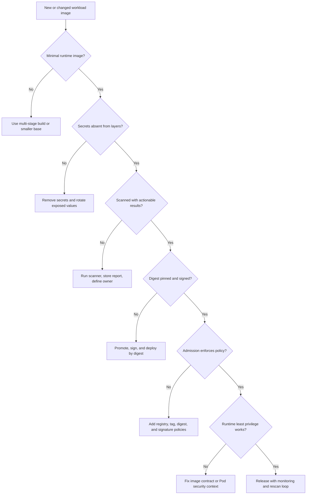

# Module 5.1: Image Security

> **Complexity**: `[MEDIUM]` - Core knowledge for engineers who can read Pod YAML and now need to evaluate image risk across build, registry, admission, and runtime boundaries.
>
> **Time to Complete**: 35-40 minutes, including the audit exercise and the policy reasoning needed to connect Dockerfile choices to Kubernetes 1.35+ controls.
>
> **Prerequisites**: [Module 4.4: Supply Chain Threats](/k8s/kcsa/part4-threat-model/module-4.4-supply-chain/), especially the parts about artifact tampering, compromised build systems, and dependency trust.

## What You'll Be Able to Do

After completing this module, you will be able to apply the following skills during design reviews, incident triage, platform policy discussions, and KCSA-style scenarios:

1. **Evaluate** container image security across the build-store-deploy-run lifecycle and decide where each control belongs.
2. **Design** hardened images that use minimal bases, multi-stage builds, non-root users, and predictable dependency inputs.
3. **Diagnose** vulnerable image patterns such as mutable tags, unscanned registries, embedded secrets, and privileged runtime defaults.
4. **Implement** image scanning, signing, admission control, and Kubernetes 1.35+ runtime safeguards as a defense-in-depth pipeline.

## Why This Module Matters

In 2019, a large financial technology company traced a production compromise back to a container image that looked ordinary in Kubernetes but carried an outdated web framework, a leaked package token in an image layer, and a debugging shell that should never have shipped. The cluster controls were not obviously broken: Pods were scheduled normally, the registry required authentication, and the Deployment had passed a basic CI job. The loss came from treating the image as a delivery box instead of a security boundary, and the cleanup cost grew because every node that pulled the image had cached evidence, dependencies, and secrets in different places.

That pattern is common because Kubernetes makes images feel routine. A Pod specification names an image, kubelet pulls it, and the workload starts; the dangerous parts happened earlier, when the base image was chosen, dependencies were installed, files were copied, tags were assigned, and scan results were interpreted. An attacker does not need to break the Kubernetes API if the image already contains a vulnerable package, a root process, writable filesystem paths, or a mutable tag that can be replaced after approval. Image security is therefore not one tool or one scan report; it is a chain of decisions from build to store to deploy to run.

KCSA expects you to reason about that chain rather than memorize a single product. In this module, you will follow an image through its lifecycle, compare hardening choices, interpret vulnerability scanning results, protect private registries, apply admission policies, and map runtime controls back to the Dockerfile. The examples use `kubectl` through the short alias `k`; if your shell does not already define it, run `alias k=kubectl` before trying the Kubernetes commands.

## Image Security Lifecycle

Container image security begins with a simple idea: a Kubernetes image is both software artifact and operational contract. The artifact contains bytes, packages, metadata, layers, entrypoints, users, labels, and sometimes mistakes. The contract tells the cluster what it will run, where it can be pulled from, and which assumptions the runtime must accept. When a team says "we scanned the image," ask which part of that contract was actually checked and which part remained based on trust.

The lifecycle model helps because it separates responsibilities that often get blurred together. Build controls reduce what enters the image. Store controls protect where the image lives and who can mutate it. Deploy controls decide whether the cluster should accept that image at all. Run controls limit the damage if the image contains a flaw that no scanner, reviewer, or admission policy found. Pause and predict: if a team scans only during CI, what happens when a new Critical CVE is published three days after the release is deployed?

Imagine one release moving through the pipeline. The developer opens a pull request that changes a dependency, CI builds an image, the registry stores the resulting layers, a GitOps controller updates a Deployment, and kubelet pulls the digest onto a node. Each step produces evidence or loses evidence. If CI records the scan result but deployment tools later substitute a tag, the evidence no longer matches the running artifact. If the registry scans the digest but no inventory links that digest to Pods, the team may know about a vulnerability without knowing which business service is exposed.

That is why image security reviews should always ask for the artifact identity. "The checkout service is on version v2.0" is useful for humans, but "the checkout Deployment is running digest sha256:..." is useful for security decisions. Digests let you connect build logs, SBOMs, signatures, scan reports, registry events, admission decisions, and runtime inventory. Once those records point to the same content identity, incident response becomes a search problem instead of a guessing exercise.

```
┌─────────────────────────────────────────────────────────────┐
│              IMAGE SECURITY LIFECYCLE                       │
├─────────────────────────────────────────────────────────────┤
│                                                             │
│  BUILD                                                     │
│  ├── Choose secure base image                              │
│  ├── Minimize installed packages                           │
│  ├── Don't include secrets                                 │
│  ├── Use multi-stage builds                                │
│  └── Scan for vulnerabilities                              │
│                                                             │
│  STORE                                                     │
│  ├── Use private registry                                  │
│  ├── Sign images                                           │
│  ├── Enable vulnerability scanning                         │
│  ├── Use immutable tags                                    │
│  └── Implement access controls                             │
│                                                             │
│  DEPLOY                                                    │
│  ├── Verify signatures                                     │
│  ├── Enforce allowed registries                            │
│  ├── Block vulnerable images                               │
│  ├── Pull by digest                                        │
│  └── Use image pull secrets                                │
│                                                             │
│  RUN                                                       │
│  ├── Continuous vulnerability monitoring                   │
│  ├── Runtime threat detection                              │
│  ├── Read-only filesystem                                  │
│  └── Non-root execution                                    │
│                                                             │
└─────────────────────────────────────────────────────────────┘
```

Notice that the lifecycle is not strictly linear in real operations. A runtime alert may force a rebuild, a registry scan may block promotion, and an admission policy may teach developers that the build stage is still leaking root defaults. Strong teams design feedback loops between phases, so every rejected image produces a clear fix path instead of a mysterious "security says no" ticket. That feedback loop is what turns image security from gatekeeping into engineering practice.

For KCSA reasoning, the important skill is deciding where a control is strongest. A private registry is useful, but it does not prove that an image is safe. A signed digest proves provenance and integrity, but it does not prove that the signed image has no exploitable package. A non-root container limits impact, but it does not make a vulnerable library disappear. The right answer is usually layered because each control answers a different question: who built it, what is inside it, who can change it, should the cluster admit it, and how much damage can it do once running?

There is also a social reason to use the lifecycle model. Application teams own Dockerfiles and dependencies, platform teams own registry conventions and admission policies, security teams own vulnerability response rules, and operations teams own runtime monitoring. When the model is explicit, each team can improve its part without pretending to own everything. When the model is implicit, every image problem becomes a confused meeting where people debate tools before agreeing what failed.

## Building Secure Images

The build phase is where image security has the highest leverage because mistakes removed here never need to be chased in the registry or cluster. Think of the Dockerfile as a recipe that can either keep the final meal clean or leave every kitchen tool on the plate. Development images often need compilers, package managers, shells, test frameworks, and debugging tools, but production images usually need only the application and a small runtime. A hardened build makes that distinction explicit instead of hoping the runtime environment will compensate.

A useful mental model is "runtime debt." Every package copied into the final image becomes something the team must patch, scan, explain, and defend for as long as the image is deployable. A package manager is convenient during development, but in production it is another binary with vulnerabilities and another way for an attacker to modify the container after gaining code execution. A shell is useful during debugging, but it also makes manual exploration and payload execution easier after compromise. Hardened builds reduce runtime debt before it reaches the cluster.

### Base Image Selection

Base image choice determines your starting attack surface before your application code is copied. A full operating system base may feel comfortable because it includes familiar tools, but every extra package creates more vulnerability records, patch obligations, and post-exploitation options. Minimal images reduce that surface, although they also remove conveniences such as shells, package managers, and common diagnostic utilities. The tradeoff is not "small good, large bad"; the question is whether production needs the extra software at runtime.

Compatibility is the main reason teams cannot always jump straight to scratch or distroless. Native extensions, certificate handling, DNS behavior, fonts, timezone data, and libc expectations can all surface only after the image is deployed under real traffic. That is why the migration path usually starts with inventory and tests: measure what the current image uses, move build tools into a builder stage, choose the smallest compatible runtime base, and run smoke tests that cover network calls, file access, health checks, and graceful shutdown.

```
┌─────────────────────────────────────────────────────────────┐
│              BASE IMAGE COMPARISON                          │
├─────────────────────────────────────────────────────────────┤
│                                                             │
│  IMAGE TYPE           SIZE      CVEs    USE CASE            │
│  ───────────────────────────────────────────────────────    │
│  ubuntu:22.04        ~77MB     100+    Development          │
│  debian:bookworm     ~50MB     50+     General purpose      │
│  alpine:3.19         ~7MB      10-20   Lightweight apps     │
│  distroless/static   ~2MB      0-5     Static binaries      │
│  scratch             0MB       0       Go/Rust binaries     │
│                                                             │
│  RECOMMENDATIONS:                                          │
│  ├── Production: Distroless or Alpine                      │
│  ├── Static binaries: Scratch or distroless/static         │
│  ├── Need shell: Alpine (smaller) or Debian (compatible)   │
│  └── Avoid: Full OS images (Ubuntu, CentOS) in production  │
│                                                             │
│  DISTROLESS BENEFITS:                                      │
│  • No shell (harder for attackers)                         │
│  • No package manager                                      │
│  • Minimal attack surface                                  │
│  • Smaller size = faster pulls                             │
│                                                             │
└─────────────────────────────────────────────────────────────┘
```

Distroless and scratch images are easiest to justify for compiled applications with clear runtime dependencies. A Go or Rust service may not need a shell, package manager, or dynamic linker at all, so shipping those tools only helps an attacker after compromise. For interpreted languages, the calculation is more nuanced because the runtime itself must be present, native modules may need compatible libraries, and debugging may depend on observable logs rather than shell access. Before running this, what output do you expect from a scanner when you compare a full OS base with a distroless runtime for the same binary?

> **Stop and think**: A Go application compiled as a static binary has zero runtime dependencies. Why would you still choose `gcr.io/distroless/static` over `scratch` as the base image?

The answer is that "empty" is not always "operationally complete." A scratch image may lack certificate roots, timezone data, user metadata, or other small files your application quietly assumes. Distroless static images preserve a minimal runtime environment while still removing the shell and package manager. That is a good example of security engineering rather than checklist thinking: choose the smallest base that still supports the workload's real behavior, then verify those assumptions with tests and scans.

For interpreted workloads, the best target may be a language-specific distroless image or a slim distribution rather than scratch. The point is to avoid turning the production image into a general-purpose workstation. If your service needs Node, ship Node and the production dependencies; do not ship the package manager cache, editor, download tools, test runner, and every transitive build artifact. That distinction matters because the scanner and the attacker both see what you actually shipped, not what you intended to use.

### Multi-Stage Builds

Multi-stage builds solve the most common production-image mistake: confusing build-time needs with runtime needs. The builder stage can contain compilers, dependency managers, source code, test fixtures, and cache directories because it is not shipped as the final image. The runtime stage copies only the artifact that must execute. This lets developers keep a productive build environment without forcing production to carry every tool that was useful during compilation.

Layer ordering also affects both security and operations. Copying dependency manifests before source files lets build systems reuse dependency layers when application code changes, which reduces build time and makes dependency changes more visible in review. Copying the whole repository early is convenient, but it hides what enters the build context and increases the chance of including local files. A careful Dockerfile narrows each copy step so reviewers can tell whether dependency manifests, source files, generated assets, and runtime configuration are handled separately.

```dockerfile
# Build stage - has all build tools
FROM golang:1.21 AS builder
WORKDIR /app
COPY go.mod go.sum ./
RUN go mod download
COPY . .
RUN CGO_ENABLED=0 go build -o /app/myapp

# Runtime stage - minimal image
FROM gcr.io/distroless/static:nonroot
COPY --from=builder /app/myapp /myapp
USER nonroot:nonroot
ENTRYPOINT ["/myapp"]
```

The security value is not only smaller size. Source code left in an image can reveal internal package names, feature flags, comments, test credentials, and implementation shortcuts. Compilers and shells left in an image can make post-exploitation easier because an attacker can fetch tools, inspect the filesystem, or compile helper programs from inside the container. Multi-stage builds remove those conveniences by making the final stage a deliberate handoff rather than a copy of the developer workstation.

```
┌─────────────────────────────────────────────────────────────┐
│              MULTI-STAGE BUILD BENEFITS                     │
├─────────────────────────────────────────────────────────────┤
│                                                             │
│  WITHOUT MULTI-STAGE:                                      │
│  Final image includes:                                     │
│  • Build tools (gcc, make, etc.)                          │
│  • Source code                                             │
│  • Intermediate artifacts                                  │
│  • Test dependencies                                       │
│  Result: Large image with unnecessary attack surface       │
│                                                             │
│  WITH MULTI-STAGE:                                         │
│  Final image includes:                                     │
│  • Only the compiled binary                                │
│  • Minimal runtime dependencies                            │
│  Result: Small image with minimal attack surface           │
│                                                             │
│  SIZE COMPARISON EXAMPLE:                                  │
│  Go app with build tools: ~800MB                          │
│  Go app multi-stage:      ~20MB                           │
│  Go app on scratch:       ~10MB                           │
│                                                             │
└─────────────────────────────────────────────────────────────┘
```

A realistic war story: a platform team once blocked a service because its image scanner found Critical CVEs in `gcc` and `make`, even though the application never invoked either binary at runtime. The application team argued that the findings were false positives because the vulnerable packages were "only build tools." The platform response was correct: if the packages are in the runtime image, they are runtime packages, regardless of intent. Moving the compiler into a builder stage removed the findings, reduced pull time, and made the production container easier to reason about.

Multi-stage builds are not a license to ignore the builder stage. A compromised compiler, package manager plugin, or build script can still affect the artifact copied into the runtime stage. That is why secure teams combine multi-stage builds with pinned dependency inputs, locked package manifests, controlled build networks, and provenance records. The builder stage may not ship to production, but it still has influence over the bytes that do ship.

### Dockerfile Best Practices

A secure Dockerfile is boring in the best way: pinned inputs, narrow copies, deterministic installs, explicit users, and no credentials. Pinning a base image by digest prevents an upstream tag from changing after review, although teams usually retain a human-readable tag in comments or metadata for operational clarity. Copying specific files prevents `.git`, local configuration, test fixtures, and `.env` files from drifting into the image. Running as a non-root user makes Kubernetes runtime policies easier to enforce because the image already agrees with the Pod security intent.

```
┌─────────────────────────────────────────────────────────────┐
│              DOCKERFILE SECURITY PRACTICES                  │
├─────────────────────────────────────────────────────────────┤
│                                                             │
│  DO:                                                       │
│  ✓ Pin base image to digest                                │
│    FROM alpine@sha256:abc123...                            │
│                                                             │
│  ✓ Run as non-root user                                    │
│    USER nonroot:nonroot                                    │
│                                                             │
│  ✓ Use COPY instead of ADD                                 │
│    COPY --chown=nonroot:nonroot app /app                   │
│                                                             │
│  ✓ Minimize layers and clean up                            │
│    RUN apt-get update && apt-get install -y pkg \          │
│        && rm -rf /var/lib/apt/lists/*                     │
│                                                             │
│  DON'T:                                                    │
│  ✗ Include secrets in image                                │
│    ENV API_KEY=secret123  # BAD                           │
│                                                             │
│  ✗ Use latest tag                                          │
│    FROM nginx:latest  # BAD                               │
│                                                             │
│  ✗ Run as root                                             │
│    USER root  # BAD for production                        │
│                                                             │
│  ✗ Install unnecessary packages                            │
│    RUN apt-get install vim curl wget  # Avoid if unused   │
│                                                             │
└─────────────────────────────────────────────────────────────┘
```

Secrets deserve special attention because image layers are historical, not just final filesystem snapshots. If a Dockerfile writes a password in one layer and deletes it in the next, the earlier layer still exists in the image history and registry storage. The same problem appears when `COPY . /app` includes a local `.env` file or a package manager config with a token. The secure pattern is to keep secrets out of the build context, pass sensitive values only through approved secret mechanisms, and inject runtime configuration through Kubernetes Secrets or an external secret manager.

Here is a compact build-time review checklist that maps directly to outcomes you can diagnose in KCSA scenarios. First, inspect the base image and ask whether every runtime package is needed. Second, inspect the copy boundaries and decide whether the Dockerfile could accidentally include local or generated files. Third, inspect the user, entrypoint, and filesystem expectations so the Pod security context can be strict without breaking the app. Finally, inspect dependency installation for lockfiles, repeatability, and cleanup.

Build hardening should be enforced close to developers, not saved for a final security audit. Dockerfile linters, secret scanners, dependency lockfile checks, and image scans can all run in pull requests before an image ever reaches the shared registry. That early feedback changes behavior because the author still has context and can fix the problem in the same change. Late rejection at deployment time is still necessary for cluster protection, but it is the most expensive place to teach basic Dockerfile hygiene.

## Image Scanning and Vulnerability Interpretation

Image scanning is a decision-support control, not a magic safety certificate. A scanner compares the packages and files inside an image against vulnerability databases, secret patterns, misconfiguration rules, and sometimes software bill of materials data. The result tells you what is known today, with the database and detection logic the scanner has today. That is useful enough to block obvious risk, but it is not the same as exploitability analysis, provenance verification, or runtime behavior monitoring.

Scanners also depend on image transparency. If an application vendor ships a binary blob with no package metadata, scanner coverage may be weaker than it looks. If a build statically links libraries, the scanner may need language or binary analysis rather than only operating-system package records. If a distroless image contains very few packages, scan totals may look excellent while application dependencies still carry risk. The practical response is to understand what the scanner can see and to supplement it with SBOMs, dependency scans, and provenance data.

### Vulnerability Scanning

The most practical scanning programs use multiple scan points. Build-time scanning catches problems before they enter the registry. Registry scanning detects new vulnerabilities in images that already exist. Runtime scanning or inventory correlation identifies running workloads affected by a newly published CVE. Each point answers a different operational question, so relying on only one point creates blind spots that look acceptable until the vulnerability timeline moves.

```
┌─────────────────────────────────────────────────────────────┐
│              IMAGE SCANNING TOOLS                           │
├─────────────────────────────────────────────────────────────┤
│                                                             │
│  TRIVY (Aqua Security)                                     │
│  ├── OS packages and language dependencies                 │
│  ├── Misconfigurations                                     │
│  ├── Secrets detection                                     │
│  └── SBOM generation                                       │
│                                                             │
│  GRYPE (Anchore)                                           │
│  ├── Fast vulnerability scanning                           │
│  ├── Multiple DB sources                                   │
│  └── CI/CD integration                                     │
│                                                             │
│  CLAIR (CoreOS/Red Hat)                                    │
│  ├── API-based scanning                                    │
│  ├── Registry integration                                  │
│  └── Continuous monitoring                                 │
│                                                             │
│  SCAN TIMING:                                              │
│  • Build time: Fail builds with critical CVEs              │
│  • Registry: Continuous scanning of stored images          │
│  • Runtime: Alert on new CVEs in running images            │
│                                                             │
└─────────────────────────────────────────────────────────────┘
```

Severity is the beginning of triage, not the end. A Critical OpenSSL vulnerability in an internet-facing ingress component is different from the same package sitting unused in a one-shot internal job, but both deserve investigation. Mature teams combine severity with reachability, exposure, compensating controls, fix availability, and business criticality. The mistake is treating scanner output as either absolute truth or meaningless noise; it is a signal that must be connected to inventory and ownership.

Ownership is often the hardest part of vulnerability management. A registry can find a vulnerable digest, but someone must know which repository built it, which service owns it, which environments run it, and what release path can replace it. Labels, annotations, image metadata, SBOM references, and CI build links all help because they turn a scanner finding into a routed engineering task. Without ownership metadata, the platform team may know the cluster is exposed while still being unable to move quickly.

### Trivy Example

```bash
# Scan image for vulnerabilities
trivy image nginx:1.25

# Scan with severity filter
trivy image --severity HIGH,CRITICAL nginx:1.25

# Fail if critical CVEs found (for CI)
trivy image --exit-code 1 --severity CRITICAL nginx:1.25

# Generate SBOM
trivy image --format spdx-json -o sbom.json nginx:1.25

# Scan Dockerfile for misconfigurations
trivy config Dockerfile
```

In CI, a simple `--exit-code 1 --severity CRITICAL` rule is a reasonable first gate because it is easy to explain and cheap to automate. It is still incomplete. Some Critical findings have no fixed version, some are not reachable in your workload, and some High findings may be more urgent because the affected service is exposed and actively exploited. A better pipeline stores the full scan result, blocks the highest-risk cases, and gives teams a documented exception process for findings that are not exploitable or not fixable yet.

Exceptions should be treated as temporary risk records, not comments in a pipeline file. A good exception includes the digest, CVE, affected component, service owner, exposure analysis, compensating control, expiry date, and reviewer. When the exception expires, the system should force a fresh decision because vulnerability context changes. This keeps scanners useful by avoiding both extremes: blocking every unfixed finding forever or normalizing permanent ignore lists that nobody revisits.

### Scan Results Interpretation

```
┌─────────────────────────────────────────────────────────────┐
│              TRIVY SCAN OUTPUT                              │
├─────────────────────────────────────────────────────────────┤
│                                                             │
│  nginx:1.25 (debian 12.2)                                  │
│  Total: 142 (UNKNOWN: 0, LOW: 85, MEDIUM: 45, HIGH: 10,   │
│              CRITICAL: 2)                                  │
│                                                             │
│  ┌────────────┬──────────────┬──────────┬─────────────┐    │
│  │  LIBRARY   │     CVE      │ SEVERITY │   STATUS    │    │
│  ├────────────┼──────────────┼──────────┼─────────────┤    │
│  │ openssl    │ CVE-2024-111 │ CRITICAL │ fixed 3.1.5 │    │
│  │ curl       │ CVE-2024-YYY │ HIGH     │ fixed 8.5.0 │    │
│  │ zlib       │ CVE-2023-ZZZ │ MEDIUM   │ no fix      │    │
│  └────────────┴──────────────┴──────────┴─────────────┘    │
│                                                             │
│  RESPONSE:                                                 │
│  CRITICAL: Block deployment, patch immediately             │
│  HIGH: Schedule patch within days                          │
│  MEDIUM: Include in regular updates                        │
│  LOW/UNKNOWN: Track, address opportunistically             │
│                                                             │
└─────────────────────────────────────────────────────────────┘
```

The example output shows why a scan report must be interpreted in context. The OpenSSL finding has a fixed version, so rebuilding from a patched base image may solve it quickly. The zlib finding has no fix, so the response may require exposure analysis, compensating controls, or acceptance with a review date. The total number is less important than the combination of severity, fixability, and workload exposure. Which approach would you choose here and why: block all images with any High finding, or block only Critical findings while routing High findings through service-owner triage?

SBOMs make this process less reactive because they preserve a machine-readable inventory of what each image contains. When a vulnerability is announced, the platform team can ask "which running images include this component?" instead of asking every application owner to run a new scan manually. SBOMs do not replace scans, signatures, or admission controls, but they improve the speed and accuracy of impact analysis. In security operations, knowing your inventory quickly is often what separates a manageable patch cycle from a frantic incident.

One worked example ties this together. Suppose a scanner reports a Critical library in a batch job image that runs with no network egress, no secrets, and a short execution window. The team should still patch it, but the emergency priority may be lower than a High vulnerability in an internet-facing API with active exploit reports. That does not mean severity labels are ignored; it means severity is combined with exposure, reachability, and business impact so scarce engineering time goes to the most dangerous running risk first.

## Registry Security and Image Integrity

The registry is where image security becomes a shared platform concern. If anyone can push any tag to any repository, the cluster's careful Pod policies are already downstream of chaos. A private registry gives you authentication, authorization, scanning integration, audit logs, retention rules, and promotion workflows. The goal is not secrecy for its own sake; the goal is controlled mutation, traceability, and a trusted path from source to cluster.

Promotion is the registry pattern that makes trust concrete. An external image is not used directly just because it exists upstream; it is imported, scanned, optionally rebuilt or mirrored, signed by an approved workflow, and exposed through a registry path that admission allows. Internal images follow a similar path from build repository to staging repository to production repository. This keeps production pulls predictable and gives the organization one place to enforce retention, immutability, scanning, and access policy.

### Private Registry Configuration

Private registry design should separate push rights from pull rights. CI systems may push signed release candidates, deployment service accounts may pull approved digests, and humans may have read access for investigation without broad write permissions. Per-repository permissions matter because a compromised low-risk team credential should not be able to replace a platform-sidecar image used across the cluster. Audit logs also matter because image incidents often require reconstructing who pushed what, when, and from which pipeline.

```
┌─────────────────────────────────────────────────────────────┐
│              REGISTRY SECURITY                              │
├─────────────────────────────────────────────────────────────┤
│                                                             │
│  ACCESS CONTROL                                            │
│  ├── Authentication required for all operations            │
│  ├── Role-based access (push vs pull)                      │
│  ├── Per-repository permissions                            │
│  └── Service account integration                           │
│                                                             │
│  IMAGE INTEGRITY                                           │
│  ├── Content trust (signing)                               │
│  ├── Immutable tags                                        │
│  ├── Vulnerability scanning integration                    │
│  └── Image promotion workflows                             │
│                                                             │
│  NETWORK SECURITY                                          │
│  ├── TLS encryption required                               │
│  ├── Private endpoints (no public access)                  │
│  ├── VPC/network isolation                                 │
│  └── Audit logging                                         │
│                                                             │
│  CLOUD REGISTRIES:                                         │
│  • AWS: ECR (Elastic Container Registry)                   │
│  • GCP: Artifact Registry                                  │
│  • Azure: Container Registry                               │
│  • Self-hosted: Harbor, Quay                               │
│                                                             │
└─────────────────────────────────────────────────────────────┘
```

Tags are human-friendly names, but digests are content identities. If `myapp:v2.0` points to one image at noon and a different image later, a reviewer who approved the tag did not necessarily approve the bytes that a new node pulls. Immutable tags reduce that risk, but digest references remove the ambiguity at deployment time. The practical pattern is to let CI publish readable tags for discovery while promotion systems record and deploy the exact digest that passed scanning and signing.

Registry network placement matters too. A private endpoint or VPC-connected registry can reduce exposure, but it should not become an excuse for weak identity. Nodes, CI systems, and deployment controllers should authenticate with narrowly scoped identities rather than shared long-lived credentials. Pull failures should be visible because they may indicate expired credentials, blocked promotions, or attempted use of an unapproved image. Registry security is strongest when access control, auditability, and artifact integrity reinforce one another.

### Image Pull Secrets

Kubernetes uses image pull secrets to give kubelet credentials for private registries. The secret type shown below stores Docker registry credentials, and the Pod or ServiceAccount references it when pulling images. This solves access to private images, but it does not prove that the image is trusted. Treat pull credentials as one control in a broader chain: access allows the pull, scanning evaluates contents, signing verifies provenance, and admission policies decide whether the pull should be permitted for that namespace.

```yaml
# Create registry secret
apiVersion: v1
kind: Secret
metadata:
  name: registry-credentials
  namespace: production
type: kubernetes.io/dockerconfigjson
data:
  .dockerconfigjson: <base64-encoded-docker-config>
---
# Use in pod
apiVersion: v1
kind: Pod
metadata:
  name: private-app
spec:
  imagePullSecrets:
  - name: registry-credentials
  containers:
  - name: app
    image: myregistry.io/myapp:v1.0
```

```yaml
# Or attach to ServiceAccount
apiVersion: v1
kind: ServiceAccount
metadata:
  name: app-sa
imagePullSecrets:
- name: registry-credentials
```

Attaching pull secrets to a ServiceAccount is usually more maintainable than copying the same secret reference into every Pod template. It lets a namespace-level platform convention say "workloads using this ServiceAccount may pull from this registry" without editing every Deployment. Be careful with scope, though: a broadly reused ServiceAccount with broad registry pull access can turn one namespace compromise into access to many internal images. Least privilege applies to pull credentials just as much as to Kubernetes RBAC.

> **Pause and predict**: Your CI pipeline scans images and blocks builds with Critical CVEs. But images already in your registry develop new Critical CVEs as new vulnerabilities are discovered. How do you handle this gap between build-time and runtime scanning?

The correct response is continuous scanning plus ownership-aware notification. Registry scans should re-evaluate stored images as vulnerability databases change, and runtime inventory should connect affected digests to running workloads. The platform can automatically alert owners, mark images as blocked for new deployments, trigger rebuilds where safe, and escalate internet-facing or privileged workloads. Human judgment is still needed for emergency rollout decisions, but the system should provide current evidence instead of asking teams to rediscover it manually.

Image pull secrets also create an incident-response question: what happens when registry credentials are exposed? The answer should include credential rotation, audit review for unusual pulls, and assessment of which images the credential could access. If credentials were broad, the incident scope is broad. If each namespace or workload uses narrowly scoped pull permissions, the investigation can be smaller and the remediation less disruptive.

## Admission Control for Images

Admission control is where the cluster enforces the image rules that humans and pipelines agreed to earlier. Without admission, a developer can accidentally deploy from a public registry, use a mutable tag, bypass a scan, or reference a local test image in production. Admission policies turn those expectations into Kubernetes API decisions. They are especially useful because they fail before the workload starts, which is easier to handle than discovering a bad image after the Pod is already running on several nodes.

The most effective admission policies are written with developer ergonomics in mind. A denial message should tell the user which image failed, which rule failed, and what supported path fixes it. "Images must be from trusted registries" is better than a generic validation failure, but "mirror external images through the platform promotion workflow and deploy the resulting digest" is better still. A policy that teaches the next step reduces support load and makes enforcement politically sustainable.

### Policy Enforcement

Good image admission policies are specific enough to reduce risk and clear enough that developers can fix violations. "Only use trusted registries" is a useful rule when the registry has scanning and promotion controls. "No latest tag" is useful because it removes a class of non-repeatable deployments. "Require digest" is stronger because it pins content identity, although it usually needs tooling support so humans are not hand-editing long hashes. "Require signature" adds provenance and tamper evidence, but it depends on key management and trustworthy build identities.

```
┌─────────────────────────────────────────────────────────────┐
│              IMAGE ADMISSION POLICIES                       │
├─────────────────────────────────────────────────────────────┤
│                                                             │
│  POLICY EXAMPLES:                                          │
│                                                             │
│  1. ALLOWED REGISTRIES                                     │
│     Allow: gcr.io/my-project/*, myregistry.io/*           │
│     Deny: docker.io/*, *                                   │
│                                                             │
│  2. NO LATEST TAG                                          │
│     Allow: image:v1.0, image@sha256:...                   │
│     Deny: image:latest, image (no tag)                    │
│                                                             │
│  3. REQUIRE DIGEST                                         │
│     Allow: image@sha256:abc123...                         │
│     Deny: image:v1.0 (tag only)                           │
│                                                             │
│  4. SIGNATURE REQUIRED                                     │
│     Allow: Images signed by trusted key                    │
│     Deny: Unsigned images                                  │
│                                                             │
│  5. NO CRITICAL CVES                                       │
│     Allow: Images with no critical vulnerabilities         │
│     Deny: Images with CRITICAL severity CVEs               │
│                                                             │
│  ENFORCEMENT TOOLS:                                        │
│  • Kyverno                                                 │
│  • OPA/Gatekeeper                                          │
│  • Connaisseur (signature verification)                    │
│                                                             │
└─────────────────────────────────────────────────────────────┘
```

Policy design should include rollout mode, exceptions, and observability. Enforcing every rule on day one can break legitimate deployments if teams do not yet have tooling to mirror images, pin digests, or sign outputs. Audit mode helps measure impact, but staying in audit mode forever creates a policy theater problem. A practical rollout starts with audit, fixes the highest-volume violations, adds clear exception labels or namespace selectors where justified, and then moves the rule to enforcement for production namespaces.

Admission can also protect against incomplete Pod specifications that bypass the main container list. Init containers can pull separate images before the application starts, and ephemeral containers may be used for debugging. A policy that checks only `spec.containers` leaves gaps that attackers or rushed operators can exploit. Production-grade image policies should cover all relevant container fields and should be tested with representative manifests before enforcement.

### Kyverno Policy Example

```yaml
apiVersion: kyverno.io/v1
kind: ClusterPolicy
metadata:
  name: require-trusted-registry
spec:
  validationFailureAction: Enforce
  rules:
  - name: validate-registry
    match:
      any:
      - resources:
          kinds:
          - Pod
    validate:
      message: "Images must be from trusted registries"
      pattern:
        spec:
          containers:
          - image: "gcr.io/my-project/* | myregistry.io/*"
```

This policy is intentionally simple because the concept matters more than the exact syntax. It validates Pod image references and rejects images outside the trusted registry list. In a real cluster, you would also cover init containers and ephemeral containers, define namespace exceptions for system workloads, and pair the registry rule with digest and signature checks. The security outcome is strongest when the policy points developers toward a promotion path, such as mirroring an approved external image into the private registry after scanning and signing.

A common operational failure is allowing admission rules to drift away from pipeline rules. If CI signs images but admission does not verify signatures, signing becomes a compliance artifact rather than a cluster control. If admission requires private registries but the registry allows arbitrary pushes by humans, the policy proves only location, not trust. The engineering target is consistency: the build pipeline creates evidence, the registry stores evidence and artifacts, and admission checks that evidence before Kubernetes accepts the workload.

Another failure is making exceptions invisible. There are valid reasons to exempt system namespaces, emergency break-glass workflows, or vendor-managed controllers, but every exemption should have an owner and rationale. Invisible exemptions weaken the control because teams learn that policy is negotiable through side channels. Visible exemptions let reviewers ask whether the reason still applies and whether the workload can move back onto the standard path.

## Runtime Image Security

Runtime controls assume that prevention will sometimes fail. A scanner may miss a vulnerability, a signed image may still contain a bug, and a minimal image may still expose an application flaw. Kubernetes cannot rewrite the image after it is pulled, but it can constrain how the container process runs. These controls reduce the blast radius of image mistakes by limiting identity, filesystem writes, Linux capabilities, privilege escalation, and unexpected runtime behavior.

The runtime phase is also where image claims meet reality. A Dockerfile can declare `USER nonroot`, but the process may still fail if directories are owned incorrectly. A Pod can request a read-only root filesystem, but the application may still assume it can write caches next to its binary. A scanner can say the image is clean, but runtime telemetry may show suspicious child processes or unexpected outbound connections. Strong platforms compare declared intent with observed behavior.

```
┌─────────────────────────────────────────────────────────────┐
│              RUNTIME IMAGE SECURITY                         │
├─────────────────────────────────────────────────────────────┤
│                                                             │
│  READ-ONLY FILESYSTEM                                      │
│  securityContext:                                          │
│    readOnlyRootFilesystem: true                           │
│  • Prevents writing to image filesystem                    │
│  • Blocks many attack techniques                           │
│  • Use emptyDir for writable paths                         │
│                                                             │
│  NON-ROOT EXECUTION                                        │
│  securityContext:                                          │
│    runAsNonRoot: true                                     │
│    runAsUser: 1000                                        │
│  • Limits privilege if container compromised               │
│  • Image must support non-root                             │
│                                                             │
│  DROP CAPABILITIES                                         │
│  securityContext:                                          │
│    capabilities:                                          │
│      drop: ["ALL"]                                        │
│  • Remove unnecessary Linux capabilities                   │
│  • Reduce attack surface                                   │
│                                                             │
│  CONTINUOUS MONITORING                                     │
│  • Alert on new CVEs in running images                     │
│  • Track image drift (unexpected changes)                  │
│  • Audit image pull events                                 │
│                                                             │
└─────────────────────────────────────────────────────────────┘
```

The image and Pod specification must agree. If the Dockerfile runs as root and writes logs under `/var/log/app`, a strict Pod security context may prevent the container from starting. That is not a reason to weaken runtime policy; it is evidence that the image contract was incomplete. A secure image declares or supports a non-root user, writes only to known writable paths, and does not require ambient Linux capabilities. The Pod then enforces those assumptions with `runAsNonRoot`, `readOnlyRootFilesystem`, dropped capabilities, and explicit writable volumes.

```yaml
apiVersion: v1
kind: Pod
metadata:
  name: hardened-web
  namespace: production
spec:
  containers:
  - name: app
    image: myregistry.io/webapp@sha256:def456...
    ports:
    - containerPort: 3000
    securityContext:
      runAsNonRoot: true
      runAsUser: 1000
      allowPrivilegeEscalation: false
      readOnlyRootFilesystem: true
      capabilities:
        drop: ["ALL"]
    volumeMounts:
    - name: tmp
      mountPath: /tmp
  volumes:
  - name: tmp
    emptyDir: {}
```

When debugging a hardened image, resist the urge to ship a permanent shell just to make incidents easier. Kubernetes supports debug workflows that can attach a temporary diagnostic container to a Pod when policy allows it, while the production image remains minimal. That separation matters because debugging tools are powerful after compromise. The safer design is to make the app observable through logs, metrics, health endpoints, and traces, then use controlled debug containers for rare deep inspection.

Continuous runtime monitoring completes the image story because image risk changes after deployment. Nodes cache images, registries discover new CVEs, and attackers may exploit application flaws unrelated to package scanners. Runtime tools can detect unexpected process execution, file writes, outbound connections, or privilege attempts that contradict the image's expected behavior. For KCSA, remember the division of labor: image hardening reduces what is shipped, admission reduces what is accepted, and runtime monitoring detects what actually happens.

Runtime controls should be tested before they become policy requirements. A staging namespace can enforce non-root, read-only root filesystem, dropped capabilities, and restricted Pod security settings so teams find image-contract problems before production. The feedback should be specific: which path needed a writable volume, which user lacked permissions, or which capability was actually required. This turns runtime hardening into a normal compatibility test instead of a last-minute outage risk.

## Patterns & Anti-Patterns

Patterns are useful because they turn security intent into repeatable engineering behavior. The best image-security patterns are boring enough for application teams to follow every day and strict enough for platform teams to enforce in production. They also make exceptions visible: when a workload cannot use a minimal base or read-only filesystem, the exception should explain the runtime need and the compensating control rather than quietly bypassing the standard.

| Pattern | When to Use | Why It Works | Scaling Considerations |
|---------|-------------|--------------|------------------------|
| Multi-stage build with minimal runtime | Compiled services, Node builds, Java services with packaged artifacts | Separates build tools from runtime contents and removes unnecessary packages | Provide shared Dockerfile templates so teams do not reinvent the pattern differently |
| Private registry promotion | Any use of external base images, sidecars, or vendor images | Scans, signs, mirrors, and pins third-party images before production use | Automate refresh jobs so mirrored images do not become stale |
| Digest plus signature enforcement | Production namespaces and regulated workloads | Pins exact content and verifies trusted build identity before admission | Use deployment tooling to resolve digests automatically so manifests stay maintainable |
| Runtime policy matched to image contract | Workloads governed by Kubernetes 1.35+ Pod security expectations | Forces non-root, read-only, and low-capability execution to match image design | Test security contexts in CI or staging to catch startup failures before production |

Anti-patterns usually come from local convenience becoming platform default. A developer keeps `curl` for troubleshooting, a team uses `latest` because it is easy during early testing, or a registry grants broad push rights because initial setup was rushed. Those choices feel small at first, but Kubernetes scales them across replicas, nodes, namespaces, and teams. The safer alternative is to make the secure path easier than the insecure shortcut.

| Anti-Pattern | What Goes Wrong | Better Alternative |
|--------------|-----------------|--------------------|
| Shipping a debug image to production | Attackers inherit shells, package managers, and network tools | Use minimal runtime images and controlled ephemeral debug containers |
| Treating a private registry as proof of safety | Bad images can still be pushed by trusted users or compromised CI | Combine registry controls with scanning, signatures, immutable tags, and admission |
| Pinning only tags | New nodes can pull different bytes under the same reviewed tag | Deploy by digest and keep readable tags as metadata |
| Ignoring runtime write paths | Read-only filesystems fail because the app writes into the image layer | Design explicit writable paths with `emptyDir` or persistent volumes |

## Decision Framework

Use this framework when you evaluate an image security design or answer a KCSA scenario. Start with the image contents because unnecessary packages and embedded secrets are easiest to fix before release. Then verify the registry path because a clean image can still be replaced if tags are mutable or push rights are broad. After that, check admission and runtime settings because Kubernetes must enforce the intent at deploy time and limit impact at run time.



The framework deliberately asks practical questions instead of naming tools first. If the image still carries a secret, choosing between Kyverno and Gatekeeper is premature. If the registry allows anyone to overwrite production tags, a beautiful Dockerfile is not enough. If the Pod cannot start under non-root and read-only settings, the image is not ready for strict namespaces. Good image security is the sequence of closing those gaps in the order where fixes are cheapest and evidence is strongest.

| Decision | Prefer This | When an Alternative Is Reasonable | Risk to Watch |
|----------|-------------|-----------------------------------|---------------|
| Base image | Distroless or slim runtime | Full OS image for legacy apps with documented dependencies | More packages mean more CVEs and more patch work |
| Reference style | Digest in production manifests | Tags in development or human-facing release notes | Mutable tags can break repeatability |
| External images | Mirror into private registry | Direct pull only in low-risk sandboxes | Upstream outages, rate limits, and unreviewed changes |
| Scan gate | Block Critical and triage High | Temporary exception when no fix exists and exposure is low | Exception drift without owner and expiry |
| Debugging | Ephemeral debug container | Shell in staging-only debug image | Debug tools shipped to production |

## Did You Know?

- **The average container image has 300+ packages** and 100+ known vulnerabilities. Minimal base images can reduce this by 90%.

- **Distroless images have no shell**; if an attacker gets code execution, they cannot easily run ordinary shell commands. This is defense in depth.

- **Google's distroless images** are rebuilt frequently and include only what is needed to run a specific language runtime or static binary.

- **Image layers are cached and shared**. A vulnerability in a base layer affects every derived image until those images are rebuilt and redeployed.

## Common Mistakes

| Mistake | Why It Happens | How to Fix It |
|---------|----------------|---------------|
| Using `:latest` in production | Tags feel convenient during testing, but they are mutable and make rollbacks hard to reason about | Promote immutable digests and let release tooling record the digest that passed scans |
| Building production images from full OS bases | Teams keep familiar package managers and shells for debugging | Move tools into a builder or debug image, then use Alpine, slim, distroless, or scratch where appropriate |
| Running containers as root | The Dockerfile works locally, so no one checks the runtime identity | Add a non-root `USER`, test `runAsNonRoot`, and set explicit writable paths |
| Scanning only in CI | The team assumes a clean build stays clean forever | Rescan registry images, correlate findings to running workloads, and alert owners on new CVEs |
| Embedding credentials in Dockerfiles or copied files | Local `.env` files and package tokens accidentally enter the build context | Use `.dockerignore`, narrow `COPY`, build secrets, Kubernetes Secrets, and immediate rotation after exposure |
| Trusting the private registry by location alone | People confuse access control with image integrity | Require scans, signatures, immutable tags, digest references, and registry audit logs |
| Enforcing admission policies without a promotion path | Developers need external images and work around unclear rules | Mirror, scan, sign, and document a supported request process for third-party images |
| Enabling read-only filesystems without testing paths | The image writes caches or temp files into the root layer | Add explicit `emptyDir` mounts or fix the app to write only to approved directories |

## Quiz

<details><summary>1. An application team deploys an image based on `ubuntu:22.04` with 146 known CVEs and two Critical findings. They say they need Ubuntu for `apt-get` access during debugging. How would you reduce the attack surface while addressing their debugging needs?</summary>

Use a multi-stage build so the build or debug stage can contain Ubuntu and tools, while the runtime stage contains only the application and required runtime files. For production debugging, prefer logs, metrics, traces, and controlled ephemeral debug containers instead of shipping a permanent shell and package manager. If a shell is genuinely required for a short period, use a separate staging-only debug variant with clear policy boundaries. The key reasoning is that runtime images should not carry tools merely because they are convenient during development.

</details>

<details><summary>2. Your admission controller blocks images outside your private registry. A developer pushes `myregistry.io/app:v2.0` in the afternoon, and later a new node pulls the same tag after an attacker has replaced the tag. Would the new node get the compromised image, and what prevents this?</summary>

Yes, if the deployment references only the mutable tag, the new node can pull whatever bytes the tag points to at pull time. Private registry location does not protect against tag replacement by a compromised credential or overly broad push permission. The stronger controls are immutable tags, deployment by digest, and signature verification tied to trusted build identity. Digest references prevent the content from changing silently because the image name identifies the exact bytes.

</details>

<details><summary>3. Your Dockerfile once contained a database password in an `ENV` instruction, then a later layer removed it. The password has since been rotated. Is the old value still a security concern?</summary>

Yes, because image layers preserve history rather than only the final filesystem view. The old value may remain in the image layer data, registry storage, node image caches, build logs, and any exported image artifacts. Rotation reduces live database risk, but it does not erase the leaked historical artifact. The fix is to remove the secret from the Dockerfile and build context, rotate affected credentials, purge or quarantine the image where possible, and move runtime configuration into Kubernetes Secrets or an external secret manager.

</details>

<details><summary>4. Your registry scan is clean in the morning, but a new Critical CVE is published after lunch and the next scan finds the vulnerable library in thirty stored images. What should happen automatically, and what requires human decision?</summary>

Automation should update scan records, identify running workloads by digest, notify owners, mark affected images as blocked for new promotion where policy requires it, and trigger rebuilds for services with safe automated rebuild paths. Human decision is still needed for exploitability, emergency rollout priority, customer impact, and whether compensating controls are acceptable while waiting for a fixed dependency. The important point is that build-time scanning cannot predict future CVEs. Continuous registry and runtime inventory closes that time gap.

</details>

<details><summary>5. A Kyverno policy requires images to come from `gcr.io/my-project/*`, but a team needs an open-source Envoy sidecar currently published on Docker Hub. How do you handle this without weakening the registry restriction?</summary>

Mirror the required Envoy image into the trusted registry through the same promotion process used for internal images. That process should pull the upstream digest, scan it, sign or attest to the promoted artifact, and publish a private-registry reference for the team. The admission policy remains intact because production still pulls from the trusted registry. This also improves availability and repeatability because the cluster no longer depends directly on Docker Hub behavior during deployment.

</details>

<details><summary>6. A Pod fails after you enable `readOnlyRootFilesystem: true`. The application logs show it cannot create files under `/tmp/cache`. Do you remove the read-only setting?</summary>

Removing the read-only setting should not be the first fix because the failure revealed an image contract problem. Add an explicit writable volume such as `emptyDir` for `/tmp/cache`, or change the application to write to a documented writable path. Then keep `readOnlyRootFilesystem: true` so attackers cannot persist changes into the image layer. This preserves the security control while giving the application the narrow write access it actually needs.

</details>

<details><summary>7. A signed image has no Critical scanner findings, but the Dockerfile runs as root and the Pod drops no Linux capabilities. Is the image-security pipeline complete?</summary>

No, signing and scanning answer only part of the problem. Signing verifies trusted provenance and integrity, while scanning checks known package and configuration issues. Running as root with broad capabilities increases blast radius if the application is exploited, even when the image was built by a trusted pipeline. A complete pipeline also tests and enforces runtime least privilege through the image `USER`, Pod `securityContext`, admission policies, and namespace security standards.

</details>

## Hands-On Exercise: Image Security Audit

In this exercise, you will audit a deliberately weak Dockerfile and Pod specification, then design a safer replacement. You do not need to build the image to complete the reasoning, but the commands are written so you can test the Kubernetes parts in a disposable namespace if you have a Kubernetes 1.35+ cluster. The goal is to connect each finding to a lifecycle phase: build, store, deploy, or run.

**Scenario**: You have joined a platform review for a web application that has been running successfully in development, but the production namespace will soon enforce image and Pod security policies. Audit this Dockerfile and Pod specification before the team promotes it:

```dockerfile
FROM ubuntu:latest
RUN apt-get update && apt-get install -y curl wget vim nodejs npm
ENV DATABASE_PASSWORD=supersecret123
COPY . /app
WORKDIR /app
RUN npm install
EXPOSE 3000
CMD ["node", "server.js"]
```

```yaml
apiVersion: v1
kind: Pod
metadata:
  name: webapp
spec:
  containers:
  - name: app
    image: myregistry/webapp:latest
    ports:
    - containerPort: 3000
```

### Tasks

- [ ] Classify every issue in the Dockerfile as a build, store, deploy, or run concern, and explain the risk in one sentence per issue.
- [ ] Rewrite the Dockerfile conceptually using a multi-stage build, a smaller runtime image, deterministic dependency installation, and a non-root runtime.
- [ ] Rewrite the Pod specification so it references an immutable digest and uses a restrictive `securityContext`.
- [ ] Add the Kubernetes objects needed to supply the database password at runtime without baking it into the image.
- [ ] Describe which admission policies would block the original Pod and which scan or registry controls would catch the original image.

```bash
alias k=kubectl
k create namespace image-security-lab
k config set-context --current --namespace=image-security-lab
```

The namespace setup is intentionally small because the security reasoning matters more than deploying a vulnerable sample. If you do create objects, keep them in this namespace and delete the namespace when finished. The first command also satisfies the module convention that all later Kubernetes commands use the `k` alias instead of spelling out the full command.

```yaml
apiVersion: v1
kind: Secret
metadata:
  name: db-creds
  namespace: image-security-lab
type: Opaque
stringData:
  password: change-me-in-your-lab
```

```bash
k apply -f db-secret.yaml
k get secret db-creds
```

The secret example uses a harmless lab value, not a production credential. In a real environment, you would normally integrate an external secret manager or sealed secret workflow rather than committing secret YAML to a repository. The key image-security lesson is that the secret enters the container at runtime through Kubernetes, not during the image build where it would become part of the artifact history.

Use the solution below to compare your findings with a complete review that separates Dockerfile problems from Kubernetes runtime problems and explains the safer replacement:

<details>
<summary>Security Issues and Fixes</summary>

**Dockerfile Issues:**

1. **FROM ubuntu:latest**
   - Large image, mutable tag
   - Fix: `FROM node:20-alpine@sha256:...` or distroless

2. **Installing unnecessary packages**
   - curl, wget, vim not needed at runtime
   - Fix: Remove or use multi-stage build

3. **Secret in ENV**
   - DATABASE_PASSWORD exposed in image
   - Fix: Use Kubernetes secrets at runtime

4. **COPY . /app**
   - May copy sensitive files (.env, .git)
   - Fix: Use .dockerignore, copy specific files

5. **Running as root**
   - No USER instruction
   - Fix: Add `USER node` or create non-root user

6. **npm install without lockfile**
   - Inconsistent dependencies
   - Fix: `COPY package*.json` first, use `npm ci`

**Pod Spec Issues:**

7. **image:latest tag**
   - Mutable, unpredictable
   - Fix: Use specific version or digest

8. **No securityContext**
   - Running as root, writable filesystem
   - Fix: Add securityContext

**Secure Dockerfile:**
```dockerfile
FROM node:20-alpine@sha256:abc123 AS builder
WORKDIR /app
COPY package*.json ./
RUN npm ci --only=production
COPY src/ ./src/

FROM gcr.io/distroless/nodejs20:nonroot
COPY --from=builder /app /app
WORKDIR /app
USER nonroot
EXPOSE 3000
CMD ["server.js"]
```

**Secure Pod Spec:**
```yaml
apiVersion: v1
kind: Pod
metadata:
  name: webapp
spec:
  containers:
  - name: app
    image: myregistry/webapp@sha256:def456...
    ports:
    - containerPort: 3000
    securityContext:
      runAsNonRoot: true
      readOnlyRootFilesystem: true
      allowPrivilegeEscalation: false
      capabilities:
        drop: ["ALL"]
    env:
    - name: DATABASE_PASSWORD
      valueFrom:
        secretKeyRef:
          name: db-creds
          key: password
```

</details>

### Success Criteria

- [ ] The rewritten Dockerfile separates build-time and runtime dependencies.
- [ ] The rewritten image design avoids root execution and avoids credentials in image layers.
- [ ] The rewritten Pod references a digest rather than a mutable tag.
- [ ] The rewritten Pod uses `runAsNonRoot`, `readOnlyRootFilesystem`, `allowPrivilegeEscalation: false`, and dropped capabilities.
- [ ] The explanation connects scanning, signing, private registries, admission control, and runtime policy into one defense-in-depth chain.

## Summary

Image security spans the entire lifecycle, and each phase answers a different security question that should be tied back to image identity and workload ownership:

| Phase | Key Controls |
|-------|-------------|
| **Build** | Minimal base, multi-stage, no secrets, scan |
| **Store** | Private registry, signing, immutable tags |
| **Deploy** | Verify signatures, allowed registries, digest |
| **Run** | Read-only FS, non-root, continuous scanning |

The durable lesson is that no single image control carries the whole burden. Smaller images reduce package and tool exposure, but they still need scanning. Digests make deployments repeatable, but they still need trusted provenance. Signatures prove who built an artifact, but the artifact still needs runtime least privilege. Admission policies prevent obvious unsafe deployments, but runtime monitoring still matters after the workload starts. Treat every phase as a separate question, then connect the answers into an evidence-backed release path.

For exam scenarios, look for the weak link in the chain. If the image uses `latest`, focus on immutability and digest references. If the image contains secrets, focus on build context hygiene and runtime injection. If the registry is public or broadly writable, focus on promotion and access control. If the Pod runs as root with a writable filesystem, focus on the image contract and security context. KCSA rewards that operational reasoning because real clusters fail through combinations of small shortcuts.

## Sources

- [Kubernetes: Images](https://kubernetes.io/docs/concepts/containers/images/)
- [Kubernetes: Pull an Image from a Private Registry](https://kubernetes.io/docs/tasks/configure-pod-container/pull-image-private-registry/)
- [Kubernetes: Configure a Security Context](https://kubernetes.io/docs/tasks/configure-pod-container/security-context/)
- [Kubernetes: Pod Security Standards](https://kubernetes.io/docs/concepts/security/pod-security-standards/)
- [Kubernetes: Admission Controllers](https://kubernetes.io/docs/reference/access-authn-authz/admission-controllers/)
- [Docker Docs: Multi-stage builds](https://docs.docker.com/build/building/multi-stage/)
- [GoogleContainerTools: Distroless images](https://github.com/GoogleContainerTools/distroless)
- [Aqua Security: Trivy](https://github.com/aquasecurity/trivy)
- [Sigstore Cosign: Signing containers](https://docs.sigstore.dev/cosign/signing/signing_with_containers/)
- [Kyverno: Validate Rules](https://kyverno.io/docs/policy-types/cluster-policy/validate/)
- [Open Policy Agent: Kubernetes Admission Control](https://www.openpolicyagent.org/docs/latest/kubernetes-introduction/)
- [SLSA: Supply-chain Levels for Software Artifacts](https://slsa.dev/spec/v1.1/)

## Next Module

[Module 5.2: Security Observability](../module-5.2-observability/) continues the runtime side of this discussion by showing how teams monitor and detect security threats in Kubernetes after workloads are admitted.
