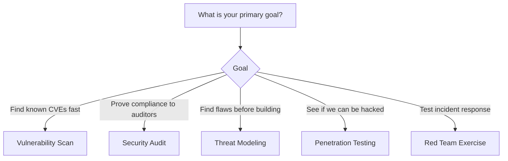
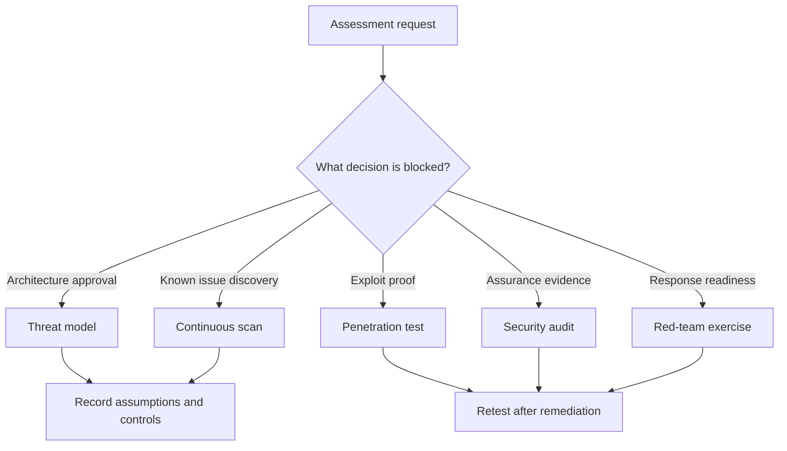

# Module 6.3: Security Assessments

> **Complexity**: `[MEDIUM]` - Conceptual knowledge with practical triage
>
> **Time to Complete**: 45-60 minutes
>
> **Prerequisites**: [Module 6.2: CIS Benchmarks](../module-6.2-cis-benchmarks/)

## Learning Outcomes

After completing this module, you will be able to perform the assessment work that KCSA scenarios expect: selecting the right assessment method, collecting useful evidence, ranking findings by risk, and designing a repeatable program rather than a one-time report.

1. **Compare** vulnerability scanning, penetration testing, security auditing, threat modeling, and red-team exercises by the question each assessment is designed to answer.
2. **Evaluate** a Kubernetes 1.35 security posture by mapping components, trust boundaries, controls, and evidence into a structured assessment method.
3. **Assess** security findings by likelihood, impact, exploit path, compensating controls, and remediation evidence instead of relying on severity labels alone.
4. **Design** an ongoing assessment program that combines automated checks, manual review, metrics, remediation tracking, and periodic validation.
## Why This Module Matters

In 2018, attackers breached Tesla's cloud environment and used exposed Kubernetes infrastructure to mine cryptocurrency. The public reporting focused on the unauthorized mining because it was unusual and easy to explain, but the more important lesson was quieter: a reachable management surface, weak access control, and insufficient detection gave an attacker enough room to turn a configuration problem into a real incident. No single assessment type would have solved that story by itself. A vulnerability scan could have noticed exposure, an audit could have questioned authentication, a threat model could have challenged the trust boundary, and a penetration test could have proved the blast radius before an intruder did.

Security assessments are how a team turns confidence into evidence. A cluster can have RBAC, audit logs, NetworkPolicies, image scanning, Pod Security admission, and encrypted Secrets, yet still be unsafe if those controls are incomplete, mis-scoped, or never tested under realistic conditions. The operational question is not whether the diagram contains a control box. The question is whether an ordinary engineering change can bypass the control, whether an attacker can chain two small findings together, and whether the team can prove the fix remained effective after the next deployment.

KCSA expects you to recognize the major assessment types, but real platform work requires a deeper habit: choose the assessment that matches the decision you need to make. If leadership asks whether the cluster satisfies a compliance framework, a red-team exercise is probably the wrong first step. If engineers are designing a new service that handles customer data, waiting for an annual audit is too late. This module teaches the assessment vocabulary, then connects it to Kubernetes attack paths, evidence quality, remediation planning, and the metrics that keep security work from becoming a once-a-year ceremony.
## Assessment Types

Different assessments answer different questions. You would not hire a lockpicker to check whether a bank's blueprints separate the public lobby from the vault, and you would not ask an architect to prove that a specific lock can be opened with a bypass tool. Kubernetes security has the same distinction. Automated scanners are fast at finding known issues, audits are good at comparing reality to a rule set, threat models reveal design flaws before they harden into production architecture, penetration tests prove exploitability, and red-team exercises test whether detection and response can survive a realistic campaign.

The practical mistake is treating these assessments as maturity levels, as if scanning is for beginners and penetration testing is for advanced teams. Mature teams use several of them together because they produce different evidence. A scanner may flag an image CVE, but it cannot always tell whether the vulnerable package is reachable at runtime. A penetration tester may prove that a pod can reach the kubelet API, but the tester may not review every RBAC binding across every namespace. An audit may confirm that policy exists, but it may not explore whether a clever workload can chain allowed permissions into privilege escalation.

| Assessment Type | Purpose | Coverage | Skill Required | Cost | False Positives |
|-----------------|---------|----------|----------------|------|-----------------|
| **Vulnerability Scanning** | Find known CVEs and bad configs | High (automated) | Low | Low | Medium-High |
| **Security Audit** | Verify policy/compliance | Broad | Medium | Medium | Low |
| **Penetration Testing** | Exploit flaws to prove risk | Targeted | High | High | Low |
| **Threat Modeling** | Find design flaws early | Architecture | Medium | Low | N/A |
| **Red Teaming** | Test detection & response | Deep | Very High | Very High | Low |

The table is useful only when you read it as a decision aid rather than a ranking. Vulnerability scanning has high coverage because machines can inspect many manifests, images, and settings quickly, but that same scale produces more noise and more context gaps. Penetration testing has lower coverage because skilled humans spend time following plausible attack paths, but the findings often carry more persuasive weight because they demonstrate consequences. Threat modeling has no false-positive rate in the same sense because it is not checking a live system; it is surfacing assumptions that need design decisions.

### Choosing the Right Assessment



The flowchart protects you from starting with a tool because it is familiar. If the goal is "find known CVEs fast," a scanner belongs early because speed and repeatability matter more than creative exploitation. If the goal is "prove compliance," the assessment must collect evidence against specific criteria, such as CIS Kubernetes Benchmark controls, access review records, audit log retention, and documented remediation. If the goal is "find flaws before building," the best return comes from threat modeling because changing a trust boundary in a design document is cheaper than redesigning production traffic after customers depend on it.

Pause and predict: your team has three requests in the same week. A product team wants to launch a service that stores payment metadata, the compliance team needs evidence for an annual customer review, and the platform team wants to know whether a suspected kubelet exposure is exploitable from workload pods. Which assessment would you choose first for each request, and what evidence would convince you that the result is useful rather than merely complete?

The expected answer is not a single universal sequence. The payment service needs threat modeling before the design stabilizes, because the most valuable output is a set of changed assumptions, boundaries, and controls. The customer review needs a security audit, because evidence must map to stated requirements. The kubelet exposure needs targeted validation, which may begin with a scanner but should include a controlled penetration-test style check that proves whether authentication, authorization, and network segmentation actually stop access.

Kubernetes assessments also differ by the layer they inspect. A cluster can fail because the API server accepts anonymous requests, because workloads run with hostPath mounts, because CI publishes unsigned images, because a namespace lacks default-deny egress, or because teams do not react to audit events. A useful assessment program therefore looks across the control plane, nodes, workloads, network paths, supply chain, identities, logging, and operating process. The same cluster may score well in one layer and poorly in another, which is why a single score should never replace the finding narrative.

When you compare assessment types for KCSA, anchor the comparison in the decision each one supports. Scanning supports backlog creation and regression detection. Auditing supports assurance and accountability. Threat modeling supports design decisions. Penetration testing supports exploitability proof and risk persuasion. Red-team work supports detection, response, and organizational readiness. A senior security engineer can explain why a specific method is enough for a specific question and where it leaves blind spots that another method must cover later.
## Threat Modeling

Think of threat modeling like reviewing the architectural blueprints of a bank before pouring the concrete. It is a systematic analysis of potential threats, allowing you to identify and fix design flaws when they are cheapest to address. In Kubernetes, this matters because many severe findings are not isolated mistakes; they are predictable consequences of unclear trust boundaries, overbroad identities, reachable infrastructure APIs, and workloads that treat every internal network path as friendly.

The first discipline in a threat model is decomposition. You name the components, draw the data flows, and mark the places where trust changes. In a Kubernetes service, that means identifying ingress controllers, Services, pods, ServiceAccounts, Secrets, ConfigMaps, persistent volumes, external databases, cloud metadata endpoints, CI/CD systems, and human operators. A threat model that says "the backend talks to the database" is too vague to guide security decisions. A useful one asks which identity the backend uses, where the credential lives, whether traffic is encrypted, which namespace can reach the database, and what audit trail exists when the credential is read.

### STRIDE Framework

STRIDE is a mnemonic developed at Microsoft that helps you categorize different types of threats. The value of STRIDE is not that every system has exactly one threat in each category. The value is that it forces the team to ask six different styles of question, which prevents an assessment from focusing only on the attacks that the loudest person in the room already knows. A platform team that naturally thinks about privilege escalation may overlook repudiation, while an application team that thinks about input validation may overlook spoofing through workload identity.

| Category | What it means | Kubernetes Example | Mitigation |
|----------|---------------|--------------------|------------|
| **S**poofing | Pretending to be someone else | Forging a ServiceAccount token | Strong auth, mTLS |
| **T**ampering | Modifying data or code | Altering a container image | Image signing, read-only root FS |
| **R**epudiation | Denying actions were performed | Deleting audit logs | Immutable audit logging |
| **I**nformation Disclosure | Unauthorized data access | Reading Secrets via API | Secrets encryption, RBAC |
| **D**enial of Service | Making system unavailable | CPU exhaustion by a pod | ResourceQuotas, Limits |
| **E**levation of Privilege | Gaining unauthorized access | Container escape to host | Pod Security Standards |

Each STRIDE category becomes more useful when you tie it to a concrete Kubernetes object. Spoofing is not merely "someone pretends to be someone else"; it might be a compromised pod using an automatically mounted ServiceAccount token to call the API as a trusted workload. Tampering might be an attacker changing an image tag in a Deployment, modifying a ConfigMap that controls authentication behavior, or pushing a malicious image into a registry used by production. Repudiation might be an administrator deleting a namespace without audit logs preserved outside the cluster. The category gives you a starting question; the object and data flow make it actionable.

Stop and think: STRIDE identifies threats but does not tell you which are most dangerous. If you applied STRIDE to a Kubernetes ingress controller and found threats in all six categories, how would you decide which to address first? A useful answer weighs likelihood and impact, but it also considers control strength, attacker path length, detectability, and whether one finding unlocks several others. An elevation-of-privilege issue that grants cluster-admin may outrank a common denial-of-service concern even when both are plausible, because the former changes the attacker's options across the entire cluster.

Threat modeling should happen at design time, but it should not stay frozen in a design wiki. Kubernetes systems change too quickly for a one-time model to remain accurate. A new controller adds permissions, a new admission policy changes deployment behavior, a new external dependency changes the data flow, and a new namespace may create a path that did not exist before. The best teams update the model at major architecture changes, incident reviews, and assessment cycles, then connect findings to backlog work rather than leaving them as diagrams with no owner.

### Threat Modeling Process

1. **Decompose the System**: Identify components (pods, services), map data flows, and define trust boundaries.
2. **Identify Threats**: Apply STRIDE to each component and document assumptions.
3. **Assess Risks**: Calculate Likelihood x Impact and prioritize findings.
4. **Mitigate**: Implement controls or explicitly accept/transfer the risk.
5. **Validate**: Verify the controls actually work and update the model as the architecture evolves.

The process looks simple because the hard part is not memorizing the steps; the hard part is asking specific enough questions. "Use NetworkPolicy" is not a mitigation until you know which namespace, which pod selector, which destination, and which egress path are required. "Encrypt Secrets" is not complete until you know whether encryption at rest is enabled, who can read the Secret through the API, how rotation happens, and whether application logs accidentally print sensitive values. Assessment quality comes from turning broad concerns into testable claims.

Worked threat models should always end with validation. If the mitigation says "pods cannot reach the kubelet API," someone should test that claim from a representative pod. If the mitigation says "developers cannot bind cluster-admin," someone should run `k auth can-i bind clusterroles/cluster-admin --as=user@example.com` in a safe environment and preserve the result as evidence. That is why threat modeling and testing are partners, not rivals. Modeling predicts where risk should exist, and testing confirms whether the predicted control actually holds.
## Kubernetes Attack Paths

When attackers breach a cluster, they typically follow a predictable lifecycle. Understanding these paths helps you place security controls at critical chokepoints. The stages are not magic, and they do not always happen in the same order, but they give assessors a map for asking better questions. Initial access gets the attacker into some part of the environment, lateral movement helps them find useful identities or network paths, privilege escalation increases control, and cluster compromise turns a workload incident into a platform incident.

1. **External -> Initial Access**:
   - Exposed dashboard (no auth)
   - Vulnerable application (e.g., Log4j)
   - Misconfigured Ingress or compromised credentials
2. **Pod -> Lateral Movement**:
   - Using a mounted ServiceAccount token to query the API
   - Scanning the internal network to reach other pods
   - Reading unencrypted secrets from shared volumes
3. **Pod -> Privilege Escalation**:
   - Escaping a privileged container to access the underlying host node
   - Abusing RBAC to create a new, privileged pod
4. **Node -> Cluster Compromise**:
   - Accessing the Kubelet API to control all pods on that node
   - Stealing node credentials to pivot into the broader cloud environment (AWS/GCP/Azure)
   - Accessing the `etcd` datastore to dump all cluster secrets

This path structure explains why assessors care about findings that seem harmless in isolation. A pod that can reach the kubelet API may not be able to authenticate today, yet the reachable endpoint still expands the blast radius of future credential theft or an authentication bypass vulnerability. A default ServiceAccount with read-only permissions may look minor until the same namespace contains Secrets that unlock a database. A permissive egress policy may look operationally convenient until an SSRF flaw lets an attacker reach the cloud metadata service.

War Story: In the 2019 Capital One breach, an attacker exploited a Server-Side Request Forgery vulnerability in a web application. The app was running with an overprivileged IAM role, which is the cloud equivalent of giving a Kubernetes workload more ServiceAccount authority than it needs. The attacker used the SSRF to query the cloud metadata service, stole the role's credentials, and synced large amounts of data from S3. The Kubernetes lesson is direct: initial access plus overprivileged workload identity creates a blast radius that application firewalls alone cannot contain.

Pause and predict: an attacker finds an exposed Jenkins dashboard, runs a malicious build job, accesses the pod's default ServiceAccount token, and uses it to read Secrets in the `default` namespace. Which phases of the attack path did they just execute, and which controls would have broken the chain earliest? The exposed dashboard is initial access, the malicious build job is code execution inside the environment, and the token use is lateral movement through Kubernetes identity. The earliest control might be authentication on Jenkins, but strong ServiceAccount defaults, namespace isolation, and RBAC would reduce the damage if the first control failed.

Attack paths are also useful for communicating with non-specialists because they explain why chained risk matters. A severity label often hides the story. "Medium: pod can reach kubelet" sounds abstract, while "a compromised application pod can talk directly to a node management API that controls workloads on that node" makes the operational concern clearer. A good assessment report links each technical finding to the next step an attacker would attempt, the control that should interrupt the path, and the evidence that proves whether the interruption works.

For Kubernetes 1.35 and modern managed clusters, the most important attack path questions often revolve around identities and admission. Which ServiceAccounts are automatically mounted, which roles can create pods, which users can bind roles they do not already hold, which controllers can mutate workloads, and which namespaces can schedule privileged pods? You can have strong image scanning and still lose if a low-privilege user can create a pod that mounts the host filesystem. You can have strict Pod Security and still lose if a controller with broad permissions accepts untrusted input.

Assessors should therefore work from both ends of the path. From the outside, ask how an attacker first reaches code, credentials, or a management surface. From the inside, assume a single workload is already compromised and ask what it can do next. The second exercise is especially valuable because it removes false comfort. Every internet-facing service can eventually have a vulnerability, so the cluster must be designed so that one compromised pod does not become a compromised platform.
## Penetration Testing and Security Audits

If threat modeling is reviewing the blueprints, penetration testing is hiring a professional locksmith to break into your own building. It involves active exploitation attempts to simulate a real attacker. In Kubernetes, a penetration test should have a clear scope because reckless testing can disrupt shared control planes, managed provider infrastructure, or production workloads. The goal is not to run every aggressive tool and see what breaks. The goal is to prove or disprove specific attack paths under agreed rules of engagement.

### Kubernetes Penetration Testing Scope

| Scope Area | Target Examples | Key Objectives |
|------------|-----------------|----------------|
| **External Testing** | API Server, Ingress, NodePorts | Unauthenticated access, exposed dashboards |
| **Internal Testing** | Pod-to-Pod network, Kubelet API | Lateral movement, SSRF, service discovery |
| **Escalation** | Pod Security, Container Runtime | Container escape, RBAC abuse, host access |
| **Config Review** | RBAC manifests, NetworkPolicies | Find misconfigurations that enable the above |

A good scope answers three questions before testing begins. First, which assets are in scope: the API server, ingress endpoints, worker nodes, namespaces, cloud accounts, registries, and CI/CD systems may have different owners. Second, which techniques are allowed: passive review, authenticated testing, limited exploitation, denial-of-service testing, and social engineering have very different risk profiles. Third, which evidence is acceptable: a screenshot, a command transcript, a sanitized token proof, a reproduced `forbidden` response, or a written reasoning chain may be appropriate depending on the finding.

### Tools of the Trade: kube-hunter

`kube-hunter` is an open-source tool that hunts for security weaknesses in Kubernetes clusters, and it is useful here because its output illustrates the difference between raw discovery and assessment judgment.

```bash
# Remote scanning (from outside cluster)
kube-hunter --remote 10.0.0.1

# Internal scanning (from inside pod)
kube-hunter --pod

# Network scanning
kube-hunter --cidr 10.0.0.0/24

# Active exploitation (use carefully!)
kube-hunter --active

# Output formats
kube-hunter --report json
kube-hunter --report yaml
```

The tool commands are intentionally simple, but the interpretation is not. A remote scan that finds an exposed API server does not automatically prove compromise, because authentication and authorization may still hold. An internal pod scan that finds a kubelet endpoint does not automatically mean remote code execution, because anonymous authentication may be disabled and webhook authorization may block requests. The assessor's job is to turn tool output into a finding with context: exposure, required credentials, control behavior, exploitability, business impact, and recommended remediation.

The sample output below is intentionally terse because many tools report evidence in compact form; your assessment report must add the missing context about exposure, exploitability, and remediation.

```text
Vulnerabilities
------------------------------------------------------
ID      : KHV001
Title   : Exposed API server
Category: Information Disclosure
Severity: Medium
Evidence: https://10.0.0.1:6443
------------------------------------------------------
ID      : KHV005
Title   : Exposed Kubelet API
Category: Remote Code Execution
Severity: High
Evidence: https://10.0.0.2:10250/pods
------------------------------------------------------
```

Before running this, what output do you expect from a hardened cluster: no reachable management endpoints, reachable endpoints that reject unauthenticated access, or a mix of both? The best answer depends on the test location. From the public internet, management endpoints should usually be unreachable except through approved administrative paths. From inside a workload namespace, some endpoints may be routable because of network design, but authorization should still deny access. The stronger posture is to combine both controls: do not expose infrastructure APIs to workloads that have no operational need, and still require authentication if a network rule is accidentally loosened.

Security audits have a different center of gravity. While a pentest proves what an attacker can do, an audit proves that your organization is following its own rules and external compliance frameworks. Auditors look for repeatable evidence that controls are designed, implemented, and operating over time. That difference matters because a cluster can pass a point-in-time exploitation attempt and still fail an audit if access reviews are not performed, audit logs are not retained, or remediation exceptions are approved informally with no expiration.

### Audit Process

1. **Planning**: Define the scope, identify stakeholders, and gather documentation.
2. **Evidence Gathering**: Review configurations, analyze logs, and run automated tools.
3. **Analysis**: Compare the current state against requirements to identify gaps.
4. **Reporting**: Document findings, executive summaries, and remediation timelines.
5. **Remediation**: Create action plans, implement fixes, and verify closure.

The audit process rewards preparation. If your team manages RBAC in Git, uses policy-as-code for admission, stores audit logs outside the cluster, and tracks findings in a system with owners and dates, evidence collection becomes a controlled export rather than a scramble. If access changes happen through ad hoc console work and exceptions live in chat messages, the audit becomes a reconstruction exercise. The difference is not merely bureaucratic; poor evidence makes it harder to prove whether security controls actually protected the cluster during the period under review.

### What Auditors Look For

- [ ] **Access Control**: RBAC follows least privilege; no anonymous API access.
- [ ] **Data Protection**: Secrets are encrypted at rest; TLS is enforced everywhere.
- [ ] **Logging & Monitoring**: Audit logs are enabled, retained securely, and monitored.
- [ ] **Network Security**: Default-deny NetworkPolicies are in place; API server is not public.
- [ ] **Vulnerability Management**: Images are scanned in CI/CD; patching procedures are followed.
- [ ] **Incident Response**: Procedures are documented and evidence preservation is established.

Pause and predict: a penetration test finds that `kube-hunter` can reach the kubelet API from inside a pod. The kubelet has anonymous authentication disabled and uses webhook authorization. Is this still a finding, or has the defense worked as intended? It is still a finding, but the finding should be written carefully. The defense blocked unauthorized access, which is good evidence. The exposure still violates least privilege because ordinary workloads do not need to reach node management APIs, and a future credential leak or kubelet bug would have a shorter path to impact.

The healthiest assessment reports separate "control failed" from "control held but exposure remains." That distinction improves remediation. If anonymous kubelet access succeeds, the team must fix authentication and authorization immediately. If authentication blocks access but the endpoint is reachable from every pod, the team should add network segmentation and test egress policy. Both deserve tracking, but they do not carry the same urgency or proof. This is why assessment writing is an engineering skill, not just a scanner export.
## Risk Assessment, Remediation, and Metrics

Not all vulnerabilities are created equal. You must calculate risk to decide what to fix today, what to fix next sprint, and what to accept with explicit ownership. The simplest expression is useful as a teaching tool: risk equals likelihood multiplied by impact. In practice, the assessment should explain why likelihood and impact were chosen, because a "High" label without reasoning rarely survives challenge from an application owner who understands the service context better than the assessor.

For this module, use the simple model that risk equals likelihood multiplied by impact, then write down the reasoning that supports each side of that equation.

* **Likelihood Factors**: Threat actor motivation, attack complexity, existing controls, exposure level.
* **Impact Factors**: Data sensitivity, system criticality, financial and reputational damage.

Likelihood in Kubernetes depends heavily on reachability and required privilege. A critical CVE in a package that is not loaded by the running process may deserve a different remediation path than a high-severity bug in an internet-facing ingress controller. A dangerous RBAC permission assigned to a break-glass group may be lower likelihood if access is tightly monitored and rarely used, while the same permission on a default ServiceAccount in a busy namespace may be urgent. Impact depends on what the compromised component can reach, what data it handles, and whether the cluster boundary protects or exposes other systems.

### The Risk Matrix

| | Low Impact | Medium Impact | High Impact |
|---|---|---|---|
| **High Likelihood** | Medium Risk | High Risk | Critical Risk |
| **Medium Likelihood** | Low Risk | Medium Risk | High Risk |
| **Low Likelihood** | Low Risk | Low Risk | Medium Risk |

Response SLAs translate risk into operational expectations, so the assessment report should make them visible before teams negotiate dates and exceptions.

* **Critical**: Immediate action required.
* **High**: Action within days.
* **Medium**: Action within weeks.
* **Low**: Accept the risk or plan for the future.

Pause and predict: you have three findings. A critical CVE exists in an internal backend image with strict NetworkPolicies and no reachable vulnerable code path. The Kubernetes Dashboard is exposed to the internet without authentication. A developer's read-only kubeconfig is leaked, but it only allows viewing pods in a development namespace. The dashboard belongs at the top because likelihood and impact are both high. The image CVE may still require action, but compensating controls and unreachable code reduce likelihood. The kubeconfig leak needs cleanup and monitoring, yet its limited permissions reduce immediate impact.

Once you have a prioritized list of risks, you need a plan. For each finding, understand the vulnerability, write the attack scenario, identify the affected assets, choose the fix, test the change away from production when possible, deploy carefully, verify the original issue no longer reproduces, and preserve evidence. The verification step is where many teams lose value. Closing a ticket because a manifest was changed is weaker than closing it because a test now shows the formerly allowed path receives a denied response.

Remediation planning also has to respect production reality. Some findings can be fixed by changing a single RoleBinding or NetworkPolicy. Others require application changes, new platform defaults, or coordination with cloud provider settings. The assessment should distinguish quick risk reduction from durable correction. Disabling automount of ServiceAccount tokens in one namespace may reduce risk quickly, while redesigning workload identity and CI templates prevents the same issue from returning across teams.

Security metrics help you track whether your assessment program is improving over time. Metrics are dangerous when they become vanity numbers, but they are valuable when they reveal delay, recurrence, and control weakness. Mean time to remediate shows whether findings are being fixed within the risk window. Reopened finding rate shows whether remediations are durable. Policy violation trends show whether teams are learning the expected deployment shape. False-positive rate shows whether tooling is wasting engineering attention.

### [ Security Posture Dashboard - Example ]

| Critical Vulnerabilities | Mean Time To Remediate (MTTR) | CIS Benchmark Score |
|:---:|:---:|:---:|
| **3** (Down 2 from last week) | **14 Days** (Target: < 7 Days) | **85%** (Up 5% this month) |

### Top Failing Policies (Operational Metrics)

1. `require-ro-rootfs` (42 violations)
2. `disallow-default-namespace` (15 violations)

### Recent Incidents (Incident Metrics)

- *Mean Time to Detect (MTTD):* 45 mins
- *Mean Time to Respond (MTTR):* 2 hours
- *False Positive Rate:* 12%

Stop and think: a new zero-day vulnerability is announced, your team scrambles to patch it, and it takes three weeks to update all clusters. Which operational security metric will this negatively impact the most? The answer is mean time to remediate, because the vulnerability is known and the clock starts when the team becomes responsible for action. Tracking MTTR helps justify investment in faster image rebuilds, safer rollout automation, and better ownership mapping.

Metrics should lead to decisions, not status theater. If MTTR is high because every fix waits for manual application approval, the security improvement may be a deployment workflow change rather than another scanner. If the same policy violation appears every week, the durable fix may be a template change or an admission policy, not repeated reminders. If critical findings remain open because ownership is unclear, the program has a governance problem. Assessment programs mature when metrics expose the bottleneck and leaders fund the work that removes it.
## Worked Example: Threat Modeling the API Server

Before you do it yourself, let's look at how a security engineer actually applies STRIDE to a specific component: the Kubernetes API server. The API server is a good teaching target because nearly every cluster action flows through it, yet many teams treat it as an invisible managed service. A threat model makes the hidden assumptions visible. Who can authenticate, which clients can reach it, which requests are audited, which admission controls mutate or reject objects, and which identities can change authorization rules?

Assume this is a Kubernetes 1.35 cluster where administrators use OIDC, workloads use ServiceAccounts, audit logs are exported to a centralized system, and the platform team manages RBAC through Git. We still do not declare the API server safe by default. Instead, we walk STRIDE and ask whether a plausible scenario exists, which control should stop it, and what evidence would prove the control works. The following example preserves the original scenarios while adding the reasoning an assessor would document.

1. **Spoofing**: Can someone pretend to be a valid user?
   *Scenario*: An attacker steals a developer's kubeconfig file.
   *Control*: We require OIDC authentication with MFA. (Mitigated).
2. **Tampering**: Can someone alter data?
   *Scenario*: An attacker intercepts API traffic to change a deployment manifest.
   *Control*: The API server strictly requires TLS for all connections. (Mitigated).
3. **Repudiation**: Can someone do something malicious and deny it?
   *Scenario*: An admin deletes a production namespace and blames a glitch.
   *Control*: Kubernetes Audit Logging is enabled and shipped to an immutable SIEM. (Mitigated).
4. **Information Disclosure**: Can someone see things they shouldn't?
   *Scenario*: A user with read access to the cluster views Secrets.
   *Control*: RBAC is configured, but developers currently have the `view` cluster role, which exposes some metadata. (Action Item: Review and tighten RBAC).
5. **Denial of Service**: Can someone crash the API?
   *Scenario*: A misconfigured CI/CD pipeline spams the API server with millions of requests.
   *Control*: API Priority and Fairness (APF) is enabled to rate-limit service accounts. (Mitigated).
6. **Elevation of Privilege**: Can a low-level user gain admin rights?
   *Scenario*: A user modifies a `ClusterRoleBinding` to give themselves `cluster-admin`.
   *Control*: RBAC explicitly denies `bind` and `escalate` permissions. (Mitigated).

The example shows a common pattern: several threats are mitigated, but one becomes an action item because the evidence is incomplete or the permission model is too broad. The information disclosure finding does not say "RBAC exists"; it asks whether the specific people who have read access can read data or metadata that the business considers sensitive. In Kubernetes, the built-in `view` role intentionally avoids reading Secrets, but custom roles, aggregated roles, and application-specific resources can change the practical exposure. The assessor should test representative identities rather than relying on role names alone.

Here is a minimal evidence collection sequence using the required `k` alias for `kubectl`. Run this only in a lab or authorized assessment environment, and adjust identities to match your cluster. The command sequence is not a penetration test by itself; it is a small validation that turns a threat-model claim into observable evidence.

```bash
alias k=kubectl

k auth can-i get secrets --as=developer@example.com --namespace=payments
k auth can-i bind clusterroles/cluster-admin --as=developer@example.com
k auth can-i create pods --as=system:serviceaccount:payments:backend --namespace=payments
k get networkpolicy -n payments
```

If the first command says `yes`, the information disclosure finding deserves immediate attention because a developer identity can read Kubernetes Secrets in the namespace. If the second command says `yes`, the elevation-of-privilege control has failed because the user can bind a role that grants more authority. If the third command says `yes`, the result is not automatically wrong, but it changes the attack path because a compromised backend identity may be able to create a new pod. If no NetworkPolicy exists in the namespace, the model should not assume pod-to-pod or pod-to-node segmentation.

The key teaching point is that assessment evidence must match the claim. A diagram proves architecture intent. A manifest proves configured state. An authorization check proves how the API answers a specific identity request. An audit log proves that an action was recorded. A controlled exploit proves that an attacker can chain steps. Mature assessment work selects the lightest evidence that answers the question without causing unnecessary risk, then records enough detail for another engineer to reproduce the conclusion.
## Patterns & Anti-Patterns

Assessment programs succeed when they become part of engineering flow rather than a separate event that appears only before renewal paperwork. The patterns below are not vendor features; they are operating habits. They connect automated checks, human reasoning, and remediation ownership so that findings do not disappear after the report meeting. They also help security teams avoid overwhelming developers with unprioritized scanner output that competes with production work and gradually loses credibility.

| Pattern | When to Use It | Why It Works | Scaling Consideration |
|---------|----------------|--------------|-----------------------|
| Assessment portfolio | When one cluster supports many teams or risk profiles | Matches each question to the right evidence type | Standardize intake so teams request the right assessment early |
| Attack-path validation | When a finding could be chained into larger impact | Shows realistic consequence instead of isolated severity | Keep tests controlled and approved, especially in production-like clusters |
| Evidence-as-code | When audits repeat across clusters | Keeps RBAC, policy, scans, and exceptions reviewable | Store generated artifacts outside code PRs when they are runtime state |
| Risk-based remediation | When findings exceed available capacity | Fixes the highest business risk first | Require explicit owners and dates for accepted residual risk |

The strongest pattern is the assessment portfolio. A platform team may run image and manifest scanning continuously, perform threat models during service design reviews, audit control evidence quarterly, and schedule targeted penetration tests for high-risk changes. That does not mean every team gets every assessment every month. It means the organization knows which evidence each decision requires. A low-risk internal tool may need automated guardrails and light review, while a public payment service needs design modeling, stricter validation, and stronger audit evidence.

| Anti-Pattern | What Goes Wrong | Why Teams Fall Into It | Better Alternative |
|--------------|-----------------|------------------------|--------------------|
| Scanner as the program | Tool output becomes the whole security conversation | Automated reports are easy to produce and measure | Pair scanners with threat modeling, triage, and validation |
| Annual-only testing | Misconfigurations live for months between reviews | Audit calendars drive security work | Add continuous checks and event-triggered reassessment |
| Severity without context | Teams argue labels instead of fixing risk | CVSS and tool ratings feel objective | Explain exploit path, exposure, controls, and business impact |
| No closure evidence | Tickets close when someone says the fix landed | Delivery pressure rewards fast status updates | Retest the original path and attach reproducible evidence |

The most damaging anti-pattern is severity without context. A "Critical" scanner finding can be a lower operational risk if the vulnerable code is unreachable, and a "Medium" configuration issue can be urgent if it gives every workload a path to infrastructure APIs. This does not mean severity scores are useless. They are starting points. The assessment program earns trust when it can explain why a finding moves up or down after considering reachability, exploitability, compensating controls, affected data, and attacker chaining.

Another frequent anti-pattern is closing findings without proving closure. A RoleBinding change may look correct in a pull request, but the cluster may still have an older binding, an aggregated role, or a different namespace with the same exposure. A NetworkPolicy may look restrictive, but the CNI plugin may implement egress differently than expected. Closure evidence should reproduce the original test and show the new result. If the original finding was "backend pod can reach kubelet," the closure evidence should include a pod-based test that now fails or receives a controlled denial.
## Decision Framework

Use this framework when someone asks, "What assessment should we run?" Start with the decision that must be made, then choose the evidence that can support it. This keeps the team from confusing activity with assurance. A hundred pages of scanner output cannot answer whether a new architecture has the right trust boundaries, and a beautiful threat model cannot prove that a live cluster rejects a forbidden RBAC action.

| Decision Needed | Best First Assessment | Follow-Up Evidence | Tradeoff |
|-----------------|----------------------|-------------------|----------|
| Can we launch this new service design? | Threat modeling | Targeted control tests before production | Fast and cheap early, but depends on honest assumptions |
| Are clusters drifting from policy? | Vulnerability and configuration scanning | Trend reports and exception review | Broad coverage, but requires triage to reduce noise |
| Can an attacker exploit this path? | Penetration testing | Reproduction steps and retest after remediation | Persuasive evidence, but narrower coverage and higher risk |
| Can we prove compliance? | Security audit | Control samples, logs, access reviews, tickets | Strong assurance, but can lag behind live risk |
| Can we detect and respond? | Red-team exercise | Alerts, timelines, incident review actions | Tests the whole organization, but costly and disruptive |



The framework also helps you decide when not to assess more deeply. If a scanner finds a public unauthenticated dashboard, you do not need a week-long penetration test to justify disabling access. The evidence is already sufficient for immediate remediation. Conversely, if a team says a sensitive service is safe because it passed image scanning, you should challenge the conclusion because the evidence does not address data flow, identity, network reachability, or application authorization. Good assessment selection is partly about avoiding under-testing and partly about avoiding expensive proof for obvious fixes.

When findings arrive, classify them by response type. Some findings require immediate containment, such as public administrative access or credentials with high privilege. Some require planned engineering, such as replacing overbroad ServiceAccounts across deployments. Some require compensating controls while a durable fix is built, such as alerting on a dangerous action until a platform template can be changed. Some require explicit risk acceptance, but acceptance should name the owner, expiration, business reason, and monitoring plan. "We accept this forever because it is hard" is not risk management.

For KCSA exam thinking, remember the relationship between method and output. Threat modeling outputs assumptions, threats, mitigations, and residual risk. Vulnerability scanning outputs findings that need validation and prioritization. Penetration testing outputs exploit evidence and remediation guidance. Auditing outputs control evidence and gaps against requirements. Metrics output trends that guide program improvement. A strong answer chooses the method that creates the evidence the scenario asks for.
## Did You Know?

- **STRIDE was developed at Microsoft** in 1999 and remains one of the most widely used threat modeling frameworks because it gives teams a repeatable vocabulary for design review.
- **Kubernetes API Priority and Fairness reached stable status in Kubernetes 1.29**, which matters for assessments because denial-of-service review can include request fairness controls instead of only resource limits.
- **Managed Kubernetes penetration testing often has provider-specific rules**, so teams should check AWS, Google Cloud, and Azure policies before testing infrastructure they do not fully own.
- **Most Kubernetes assessment findings are configuration and process failures rather than exotic zero-days**, which is why continuous policy checks usually reduce more risk than rare heroic testing.
## Common Mistakes

| Mistake | Why It Happens | How to Fix It |
|---------|----------------|---------------|
| Treating scanner output as final risk | Tools report technical severity without full business context | Triage each important finding for reachability, exploit path, data exposure, and controls |
| Running only annual assessments | Compliance calendars become the security schedule | Add continuous scanning, event-triggered threat-model updates, and periodic control retests |
| Ignoring low findings forever | Small exposures can become steps in a larger attack chain | Track all findings with owners, due dates, and explicit decisions about residual risk |
| Closing tickets without retesting | Teams confuse a merged change with verified remediation | Reproduce the original test and attach evidence showing the path is blocked |
| Threat modeling without system decomposition | Teams jump to mitigations before naming flows and boundaries | Map components, identities, data flows, and trust boundaries before listing threats |
| Auditing configuration but not operation | Static manifests show intent, not whether controls work over time | Collect logs, denied requests, access reviews, policy reports, and remediation records |
| Allowing assessment tools in production without scope | Active tests can disrupt workloads or violate provider rules | Define rules of engagement, allowed techniques, contacts, and rollback plans before testing |
## Quiz

<details><summary>Your team is launching a new service that stores customer PII, and the architecture review is tomorrow. A developer asks whether a vulnerability scan is enough evidence for approval. What do you recommend?</summary>

A vulnerability scan is useful, but it is not enough for design approval because it cannot evaluate trust boundaries, data flow, identity assumptions, or residual risk in an architecture that may not exist yet. Start with a threat model that decomposes the service, marks where PII crosses boundaries, applies STRIDE, and records mitigations. Follow with targeted validation before production, such as RBAC checks, NetworkPolicy tests, and Secret access tests. The scan still belongs in the program, but it answers the known-issues question rather than the design-safety question.

</details>

<details><summary>A scanner reports an exposed kubelet API from inside a workload pod, but authentication blocks unauthenticated requests. The application owner says there is no risk because access is denied. How should you assess the finding?</summary>

The control partially works because unauthenticated access is blocked, so the finding should not be written as confirmed kubelet compromise. It still represents unnecessary exposure because ordinary pods usually do not need to reach node management APIs, and a leaked credential or future bypass would have a shorter path to impact. The remediation should combine network segmentation with continued kubelet authentication and authorization. The report should distinguish "access denied today" from "attack surface reachable from too many places."

</details>

<details><summary>An annual penetration test finds that the default ServiceAccount in a namespace can read Secrets, and the issue existed for months. Which assessment program change would prevent the same detection gap?</summary>

The detection gap shows that periodic testing is not enough for high-risk configuration drift. Add continuous policy checks or admission controls that reject dangerous default ServiceAccount permissions, and manage RBAC through reviewed manifests so privilege changes are visible before they reach the cluster. Audit log alerts can detect suspicious RoleBinding or Secret access behavior shortly after it happens. A future penetration test remains valuable, but it should validate the program rather than serve as the first line of detection.

</details>

<details><summary>An auditor asks for evidence that access controls are effective, and you provide only Role and RoleBinding YAML. Why is that insufficient, and what would improve the evidence package?</summary>

Role and RoleBinding YAML show intended configuration, but they do not prove operational effectiveness over time. Stronger evidence includes `k auth can-i` results for representative identities, audit logs showing denied and allowed requests, access review records, policy reports, and remediation tickets for removed permissions. If the control protects sensitive namespaces, include samples that show users without a need cannot read Secrets or create privileged pods. Auditors need proof that the control is both configured and operating, not just present in Git.

</details>

<details><summary>You have three critical image CVEs, seven high RBAC findings, and many medium NetworkPolicy gaps. Leadership wants everything fixed in one sprint. How do you build a credible remediation plan?</summary>

Start by ranking findings by exploit path and business impact rather than by count alone. Fix anything with public exposure, sensitive data access, or privilege escalation first, then group similar RBAC findings into a platform-level change if possible. For work that cannot fit in the sprint, define compensating controls, owners, dates, and explicit risk acceptance where appropriate. A credible plan explains what risk is reduced immediately, what durable fixes follow, and how each fix will be retested.

</details>

<details><summary>A product team says its service is safe because every image is scanned in CI and no critical CVEs are present. Which assessment blind spots should you challenge?</summary>

Image scanning addresses known package and image vulnerabilities, but it does not prove that the service has safe authorization, narrow ServiceAccount permissions, protected Secrets, restricted network paths, or useful audit evidence. You should challenge identity, data flow, ingress exposure, egress reachability, admission policy, and operational monitoring. A clean image scan is a good signal for supply-chain hygiene, not a complete Kubernetes security assessment. The next step depends on the decision: threat model for design risk, configuration review for posture, or targeted testing for exploitability.

</details>

<details><summary>After a NetworkPolicy remediation, the ticket owner attaches the merged YAML and asks to close the finding. What evidence do you require before closure?</summary>

The merged YAML is useful, but it proves only that a desired configuration was changed in source control. Require a retest from a representative pod showing that the previously allowed connection is now blocked, plus confirmation that required application traffic still works. If the finding involved access to infrastructure APIs, test the specific destination and port that were originally reachable. Closure evidence should reproduce the original assessment path and show a different result, because that is what proves remediation rather than intention.

</details>
## Hands-On Exercise: Threat Model

This exercise uses a simple architecture so you can practice the assessment mindset without needing a live cluster. You will preserve the original component model, apply STRIDE, turn threats into ranked findings, and write validation steps that could be executed in an authorized lab. The point is not to produce the longest possible list. The point is to produce a useful assessment artifact that connects components, attack paths, controls, evidence, and remediation.

Your scenario is to create a simple threat model for this architecture, then use it to show how an assessment moves from diagram review to prioritized findings and validation evidence.

```
                    Internet
                        │
                   [Ingress]
                        │
            ┌───────────┴───────────┐
            │                       │
        [Frontend]             [Backend]
            │                       │
            └───────────┬───────────┘
                        │
                   [Database]
                        │
                    Secrets
```

Before you start, decide what you will treat as a trust boundary. The internet-to-ingress boundary is obvious, but the frontend-to-backend boundary may also matter if the frontend handles untrusted browser input and the backend has database authority. The backend-to-database boundary matters because credentials and sensitive data cross it. The Secret access path matters because Kubernetes API permissions may be more important than network access. A good threat model makes those boundaries visible before it lists threats.

### Tasks

- [ ] Draw or describe the components, data flows, identities, and trust boundaries in the architecture.
- [ ] Apply STRIDE to Ingress, Frontend, Backend, Database, and Secrets, using at least one realistic threat per category where applicable.
- [ ] Select the top three risks by likelihood and impact, and explain the attack chain behind each one.
- [ ] Write one validation step for each top risk, such as a `k auth can-i` check, a NetworkPolicy reachability test, or an audit-log evidence query.
- [ ] Write a remediation plan that names the control, owner, evidence of closure, and follow-up metric for each top risk.

### Solution Guide

<details markdown="1">
<summary>Threat Model</summary>

**INGRESS:**

| Threat | Example | Mitigation |
|--------|---------|------------|
| S | Fake SSL cert | Valid certs, certificate pinning |
| T | Header injection | WAF, input validation |
| R | No access logs | Enable access logging |
| I | TLS downgrade | Force TLS 1.2+, HSTS |
| D | Request flooding | Rate limiting |
| E | Path traversal | Restrict paths, validate |

**FRONTEND:**

| Threat | Example | Mitigation |
|--------|---------|------------|
| S | Session hijacking | Secure cookies, short sessions |
| T | XSS | CSP, input sanitization |
| R | User denies actions | Audit logging |
| I | Source code exposure | Build optimization |
| D | Resource exhaustion | Resource limits |
| E | SA token abuse | No API access needed |

**BACKEND:**

| Threat | Example | Mitigation |
|--------|---------|------------|
| S | Stolen SA token | Disable auto-mount |
| T | Code injection | Input validation, parameterized queries |
| R | Missing audit trail | Application logging |
| I | Error message exposure | Generic errors |
| D | Query complexity attack | Query limits |
| E | RBAC escalation | Minimal permissions |

**DATABASE:**

| Threat | Example | Mitigation |
|--------|---------|------------|
| S | Credential theft | Rotate credentials, Vault |
| T | Data modification | Integrity constraints |
| R | Data changes | Database audit logs |
| I | SQL injection | Parameterized queries |
| D | Connection exhaustion | Connection pooling |
| E | Privilege escalation | Least privilege DB user |

**SECRETS:**

| Threat | Example | Mitigation |
|--------|---------|------------|
| S | Stolen credentials | Rotate regularly |
| T | Secret modification | RBAC, audit |
| R | Access without logs | Audit logging |
| I | Secret in logs | Scrub logs, don't log secrets |
| D | N/A | N/A |
| E | RBAC to read secrets | Minimal secret access |

**TOP RISKS:**
1. SA token leads to API access -> Disable auto-mount
2. Database credentials exposed -> Use Vault, rotate
3. No network isolation -> NetworkPolicy
4. Missing audit logs -> Enable audit logging

</details>

<details><summary>Example validation commands for an authorized lab</summary>

```bash
alias k=kubectl

k auth can-i get secrets --as=system:serviceaccount:app:backend --namespace=app
k auth can-i create pods --as=system:serviceaccount:app:backend --namespace=app
k get networkpolicy -n app
k logs -n ingress-nginx deploy/ingress-nginx-controller --since=1h
```

The first two commands validate whether the backend ServiceAccount can read Secrets or create pods, which changes the privilege-escalation path. The NetworkPolicy command shows whether any declared segmentation exists, but it should be paired with a reachability test in a real lab. The log command is a reminder that repudiation controls require preserved evidence, not only application behavior. Replace namespace and deployment names with your own lab values.

</details>

### Success Criteria

- [ ] Your threat model names at least four trust boundaries or identity assumptions.
- [ ] Each top risk includes an attack path, not only a generic vulnerability label.
- [ ] Each remediation has a matching validation step that could prove closure.
- [ ] Your final priority order explains likelihood, impact, and compensating controls.
- [ ] Your assessment notes distinguish configured controls from operational evidence.
## Sources

- [Kubernetes Documentation: Authorization Overview](https://kubernetes.io/docs/reference/access-authn-authz/authorization/)
- [Kubernetes Documentation: Using RBAC Authorization](https://kubernetes.io/docs/reference/access-authn-authz/rbac/)
- [Kubernetes Documentation: Auditing](https://kubernetes.io/docs/tasks/debug/debug-cluster/audit/)
- [Kubernetes Documentation: Pod Security Standards](https://kubernetes.io/docs/concepts/security/pod-security-standards/)
- [Kubernetes Documentation: Network Policies](https://kubernetes.io/docs/concepts/services-networking/network-policies/)
- [Kubernetes Documentation: Secrets](https://kubernetes.io/docs/concepts/configuration/secret/)
- [Kubernetes Documentation: API Priority and Fairness](https://kubernetes.io/docs/concepts/cluster-administration/flow-control/)
- [CIS Kubernetes Benchmark](https://www.cisecurity.org/benchmark/kubernetes)
- [Microsoft Security Development Lifecycle: Threat Modeling](https://www.microsoft.com/en-us/securityengineering/sdl/threatmodeling)
- [OWASP Threat Modeling Cheat Sheet](https://cheatsheetseries.owasp.org/cheatsheets/Threat_Modeling_Cheat_Sheet.html)
- [OWASP Kubernetes Top Ten](https://owasp.org/www-project-kubernetes-top-ten/)
- [Aqua Security kube-hunter](https://github.com/aquasecurity/kube-hunter)
## Next Module

[Next: KCSA Overview](../) - Review the full KCSA path, identify weak areas, and turn these assessment habits into exam preparation and day-to-day platform practice.
