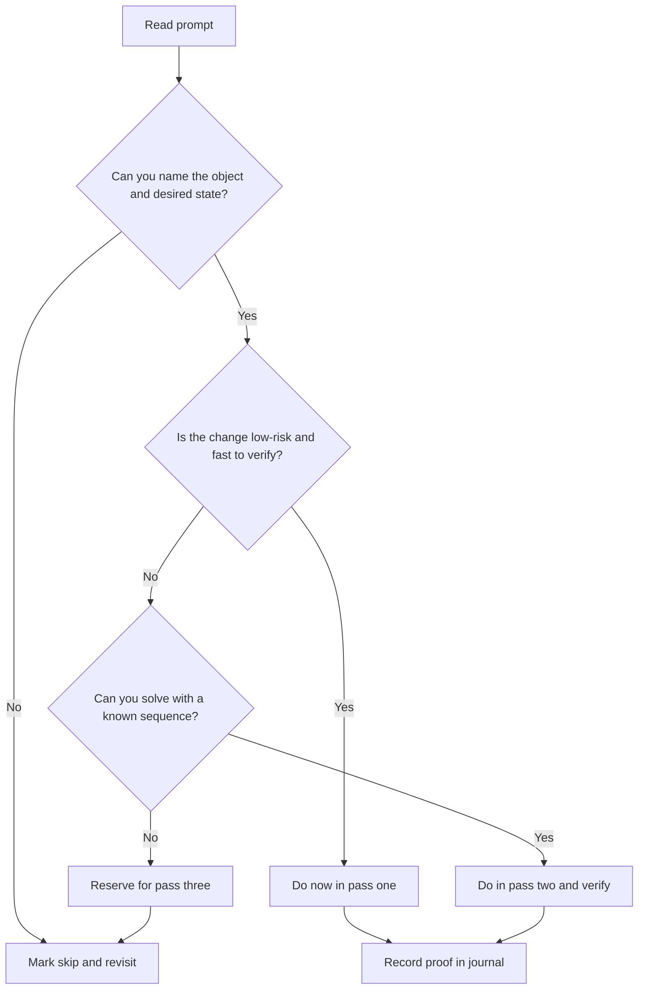

# LFCS Exam Strategy and Workflow

Complexity: `[MEDIUM]` | Time: 1-2 hours | Prerequisites: familiarity with the LFCS hub, Linux command-line fundamentals, and enough shell confidence to create files, inspect services, and read manual pages without a graphical helper. KubeDojo's Kubernetes certification material targets Kubernetes 1.35+, but this LFCS module is focused on Linux administration habits that transfer into every later terminal-heavy track.

## Learning Outcomes

- Evaluate LFCS task prompts and choose a three-pass exam strategy that protects easy points before heavy work.
- Design a terminal-first practice workflow that converts KubeDojo reading into timed Linux administration drills.
- Diagnose verification gaps by matching each configuration change to an observable system state.
- Implement a time-boxed task journal for skipped, completed, and needs-verify work during a performance exam.

## Why This Module Matters

Hypothetical scenario: you begin an LFCS practice run feeling reasonably prepared because you have read the Linux track, watched several demonstrations, and recognized most of the commands in review notes. The first task asks you to adjust ownership and permissions on a directory tree, the second asks you to ensure a service survives reboot, and the third asks you to make a storage change persistent. None of these ideas is new, yet the session becomes uncomfortable because you keep re-reading prompts, switching commands without a plan, and moving on before you can prove that the machine is actually in the requested state.

That scenario captures the central LFCS trap. The exam is not mainly a memory contest, and it is not a theory quiz where recognition is enough. The Linux Foundation describes LFCS as an online, proctored, performance-based exam where candidates solve command-line tasks on Linux systems, so the scoring pressure is operational: produce the required state, verify it, and spend the remaining time on the next state. A learner who can explain `systemd` beautifully but cannot quickly check whether a unit is enabled has not yet converted knowledge into exam performance.

This module turns the broad LFCS track into an exam-day operating method. You will learn how to triage prompts, decide which tasks deserve immediate attention, build a lightweight scratch journal, and use verification commands as part of the work rather than as an optional cleanup step. The result is not a shortcut around Linux fundamentals; it is a way to make your fundamentals scoreable under a timed terminal environment.

## What LFCS Actually Rewards

The LFCS mental model starts with the difference between answer recognition and state production. In a multiple-choice exam, the prompt and options often carry enough context to jog your memory, and partial recognition can still help you eliminate poor choices. In a performance exam, the machine is the answer sheet. If a service is supposed to be enabled, a user is supposed to belong to a group, or a mount is supposed to persist after reboot, the scorer does not care whether you knew the right concept in conversation. It can only inspect the final system state.

That is why the original short version of this module emphasized the sentence "change, verify, move on." The phrase is simple, but it should shape every minute of your preparation. You should practice tasks in a way that forces recall, execution, and proof in the same loop. Reading a command table can introduce vocabulary, but it does not teach your hands to recover from a mistyped option, recognize a misleading success message, or decide whether a reload is enough when the prompt asked for persistence.

The official LFCS instructions also matter because they make the exam feel more like a constrained administration shift than a classroom exercise. Current Linux Foundation candidate-facing material describes a remotely proctored session, a two-hour time box, and performance-based command-line tasks. Those constraints mean you must prepare for attention management as seriously as command syntax. A candidate who spends too long polishing one fragile task can lose points elsewhere even if the eventual fix is correct.

Think of LFCS as a queue of small operational tickets. Each ticket names an object, such as a file, user, service, process, network setting, or filesystem entry. Each ticket also implies a desired state, such as present, absent, owned by a user, executable by a group, running now, enabled later, reachable, mounted, or recoverable. Your job is to translate the prompt into that object-state pair, choose the safest command sequence, and then prove that the pair exists before you leave.

The distribution-independent flavor of LFCS preparation reinforces this workflow. You may practice on one distribution and encounter slightly different package names, service defaults, or helper tools elsewhere, but the exam still rewards general Linux administration competence. For example, `systemctl status` and `journalctl` habits transfer across many modern distributions, while package-manager muscle memory may vary. Strong preparation therefore balances command fluency with the ability to read local help, inspect current state, and adapt without panic.

This is also why you should avoid building your plan around exam folklore. Candidate reports can be useful for understanding stress, but they are not a stable source of task content, and they can push you toward memorizing someone else's sequence instead of learning an adaptable workflow. The durable skill is the ability to enter any ordinary Linux environment, observe what is true, and move the system toward a requested state with commands you can justify.

Here is the compact operating model you should keep in your head while studying. It is intentionally more like a runbook than a syllabus because LFCS preparation is about doing, not collecting definitions.

```text
+------------------+     +-------------------+     +-------------------+
| Read the prompt  | --> | Name object/state | --> | Choose safe path  |
+------------------+     +-------------------+     +-------------------+
          |                         |                         |
          v                         v                         v
+------------------+     +-------------------+     +-------------------+
| Execute change   | --> | Verify observable | --> | Mark journal      |
+------------------+     +-------------------+     +-------------------+
```

Pause and predict: if a prompt says a service must start automatically after reboot, what observable state would convince you that the requirement is satisfied right now, and what second observable state would convince you that the requirement survives later? A strong answer separates "running" from "enabled" because an already running service can still be disabled, and an enabled service can still be stopped at the moment you inspect it.

## Reading Prompts as State Requirements

Most LFCS anxiety begins when a learner treats each prompt as a search for the "right command" instead of a request for a final system state. The right command depends on the current state, and the current state is often the first thing you should inspect. If a prompt asks you to make a directory writable by a group, you need to know whether the group exists, who owns the directory now, whether inheritance matters for new files, and whether the requested behavior is about immediate access or future collaboration.

The simplest reliable habit is to rewrite the prompt mentally as "object plus desired state plus proof." The object might be `/srv/app`, user `mira`, unit `sshd.service`, process `nginx`, interface `eth0`, or a line in `/etc/fstab`. The desired state is the condition the scorer can check. The proof is the command output you would trust before moving on. This habit reduces guesswork because it forces you to decide what success looks like before editing anything.

Consider a permissions task. A weak candidate might jump straight to `chmod -R 777` because it seems to remove access problems quickly, but that command often creates a security problem and may not satisfy ownership requirements. A stronger candidate identifies the directory, the required user or group, the intended permissions, and the persistence of future file behavior. Then the candidate uses targeted `chown`, `chmod`, `find`, or access-control commands only as needed, followed by `ls -ld`, `namei -l`, or a test as the relevant user.

The same object-state habit applies to services. If the prompt says a service must be active now and enabled at boot, there are two separate states to verify. Running `systemctl start` may satisfy the immediate condition but not the boot condition. Running `systemctl enable` may satisfy the boot condition but not the immediate condition. The prompt's wording should drive the command sequence, and the verification should match every state the wording requested.

Before running this, what output do you expect from each command, and which output would make you stop and inspect logs before changing anything else?

```bash
systemctl is-active sshd.service
systemctl is-enabled sshd.service
journalctl -u sshd.service --no-pager -n 20
```

Those commands are not magic phrases to memorize. They are examples of a larger verification pattern: use a direct state query first, then use logs only when the state is not what you expected. If `is-active` reports `active` and the prompt only required the service to be running now, you are probably done. If it reports `failed`, the next useful question is not "what other command can I try?" but "what did the service report when it failed?"

Storage tasks reward the same discipline even more strongly because temporary success is easy to mistake for complete success. Mounting a filesystem manually may make a path usable during the session, but a prompt that mentions persistence requires an `/etc/fstab` entry or an equivalent distribution-supported mechanism. A verification habit for storage must therefore include current mount state, filesystem identifiers when relevant, and a safe test of the persistence configuration before you assume the task is complete.

The following small checklist is worth internalizing because it works across LFCS domains. It keeps your attention on proof instead of command performance theater.

| Prompt signal | Object to inspect | State to prove | Example proof command |
|---|---|---|---|
| "Create" | User, group, file, directory, link | Object exists with requested attributes | `getent`, `ls -l`, `stat` |
| "Ensure running" | Service or process | Active now | `systemctl is-active`, `ps`, `ss` |
| "Enable at boot" | Service | Enabled for future boot | `systemctl is-enabled` |
| "Persist mount" | Filesystem and mount point | Mounted now and declared for reboot | `findmnt`, `mount -a --fake --verbose` |
| "Allow access" | User, group, path, port | Correct permission or listener state | `id`, `namei -l`, `ss -lntup` |
| "Schedule" | Cron or timer entry | Job exists in the right scope | `crontab -l`, `systemctl list-timers` |

Notice how the proof command is often shorter than the change command. That is useful under pressure. If you build the proof into your normal rhythm, you can leave each task with a clearer conscience and a cleaner journal. If you postpone proof until the end, you turn the final minutes into a stressful archaeology exercise where you must rediscover what you changed and whether the machine still agrees with your memory.

Prompt reading also helps you decide when a command should be avoided. If the task asks for a specific owner, mode, or group relationship, a broad recursive operation can accidentally touch objects that were never part of the requirement. If the prompt asks for a service to be available, replacing the entire unit file is usually riskier than checking the existing unit, enabling it, and reading the first failure message. The safer path is often narrower than the path your memory reaches for first.

## The Three-Pass Exam Strategy

A performance exam should not be approached as a sacred linear sequence. The question order may be convenient, but it is not necessarily optimized for your confidence, speed, or current recall. The original module proposed three passes: quick wins, medium tasks, and heavy or fragile tasks. That strategy remains the backbone of this rewrite because it protects throughput without encouraging careless skipping.

Pass one is for obvious, low-risk, fast-to-verify work. These tasks usually involve creating users or groups, adjusting straightforward permissions, creating files or links, inspecting requested state, or making small command-line changes where the failure surface is limited. The purpose is not merely emotional comfort, though confidence does matter. The purpose is to reduce the number of untouched prompts quickly, collect points that should not be left on the table, and warm up your command recall on tasks where a mistake is easy to see.

Pass two is for tasks that need several commands and one deliberate verification step. Service enablement, cron jobs, simple network inspection, process control, archive handling, and routine filesystem operations often live here. These tasks are not terrifying, but they deserve enough attention that you should not rush them while your brain is still adapting to the exam interface. During pass two, your journal becomes important because you may mark a task as "needs verify" when the change is probably right but the proof requires one more check.

Pass three is for heavy, ambiguous, or fragile work. Storage changes, complicated networking fixes, recovery tasks, and anything involving a config file with strict syntax can consume time unpredictably. Leaving these tasks for deliberate focus is not avoidance. It is a scoring decision. If a fragile task breaks and requires cleanup, you want that cleanup to happen after you have already secured the tasks that were easy and medium for you.

The tradeoff is that skipping must be disciplined. A candidate who skips whenever a task feels uncomfortable may create a final pass full of medium tasks that should have been solved earlier. A candidate who never skips may donate too much time to the first confusing prompt. The goal is to create a time-box that is short enough to prevent fixation and long enough to let genuine recall happen. A practical rule is to give a task one calm read, one current-state inspection, and one reasonable command path before deciding whether it belongs in the current pass.

The three-pass strategy becomes stronger when you rehearse it before the exam rather than inventing it under pressure. During practice, deliberately shuffle tasks from different domains so the session forces routing decisions. If every practice block is grouped by topic, you always know what kind of task is coming next, and the exam-day skill of switching context remains undertrained. Mixed practice teaches you to identify task shape quickly and choose a pass without needing the surrounding lesson title as a clue.

Use this flow when you need to decide whether to stay or move. It is intentionally conservative because LFCS rewards completed states, not heroic struggle.



The phrase "known sequence" deserves care. It does not mean you remember every option perfectly. It means you know the shape of the solution well enough to inspect local help quickly, choose a safe path, and verify the result. If you need to research the basic object model from scratch during the exam, the task probably belongs later unless it is very small. If you only need to confirm one flag, it may still be a pass-two task.

This strategy also helps you recover from mistakes. Suppose you edit a config file, reload a service, and the reload fails. Without a pass strategy, you may keep trying random edits because leaving feels like failure. With a pass strategy, you can mark the task as "broken, revisit logs," restore or minimize the change if needed, and move to a task where your next five minutes are more likely to produce points. That is not giving up; it is incident-style time management.

## Verification as the Real Exam Skill

Many candidates think LFCS preparation is mostly about knowing commands. Command knowledge matters, but it is incomplete because commands are only the means of changing or inspecting state. The real exam skill is the loop that turns a prompt into a proven result: read, inspect, change, verify, record, and move. If any step is missing, you are relying on luck or memory at the exact moment the exam is trying to measure administration performance.

Verification should be specific to the task type. After creating a user, `getent passwd username` proves the account exists, while `id username` helps prove group membership. After changing ownership, `stat` or `ls -ld` proves metadata on the object you touched. After enabling a service, `systemctl is-enabled` proves boot intent, and `systemctl is-active` proves current runtime state. After editing a mount, `findmnt` proves current mount state, while a cautious `mount -a` test can reveal syntax errors before a reboot.

The key is to verify the requirement, not the command. A command can succeed while the requirement remains incomplete. For example, `usermod -aG wheel mira` can exit successfully, but the prompt may have asked for a different group, a newly created group, or immediate shell access that requires a fresh login session. `systemctl restart nginx` can exit successfully, but the prompt may have asked for enablement at boot. `chmod 640 file` can exit successfully, but the directory path may still block access because execute permission is missing on a parent.

A useful study exercise is to write the proof command before the change command. If you cannot name the proof, you have not fully understood the prompt. This is similar to writing a test before changing application code: the test clarifies the expected behavior, prevents a vague definition of done, and gives you a fast signal when your change has or has not worked. In LFCS preparation, the proof command is your tiny test suite.

Here is a minimal verification worksheet you can use during practice. It is not something to bring into the exam as external notes; it is a pattern to rehearse until it becomes natural.

```text
+----------------------+----------------------+----------------------+
| Prompt object        | Desired state        | Proof command        |
+----------------------+----------------------+----------------------+
| user or group        | exists, member, uid  | getent, id           |
| file or directory    | owner, mode, type    | stat, ls -ld         |
| service              | active, enabled      | systemctl is-*       |
| process or socket    | running, listening   | ps, pgrep, ss        |
| filesystem           | mounted, persistent  | findmnt, mount -a    |
| scheduled job        | installed, scoped    | crontab, timers      |
+----------------------+----------------------+----------------------+
```

Exercise scenario: a prompt asks you to ensure that `backup.service` is enabled and running. You run `systemctl enable backup.service`, receive no error, and feel ready to move on. The better workflow pauses because enablement and runtime are different states. You would still check `systemctl is-enabled backup.service` and `systemctl is-active backup.service`, and if the service is not active you would inspect `journalctl -u backup.service --no-pager -n 20` before guessing at fixes.

This mindset prevents over-verification as well as under-verification. You do not need to write a novel after every task. You need one or two commands that prove exactly what the prompt asked. Under time pressure, excessive inspection can become another form of procrastination. The skill is choosing a proof that is strong enough to trust and small enough to fit the clock.

Verification also reveals when you should stop changing the machine. If a proof command shows the desired state, move on unless the prompt includes another requirement. Do not keep "improving" a working solution by adding broad permissions, extra services, or unrelated cleanup. LFCS tasks are scored on requested states, and unnecessary changes increase the chance that you create a side effect. The safest exam solution is usually the smallest one that satisfies and proves the requirement.

One useful practice habit is to record failed proofs, not just failed commands. A failed command may mean you chose the wrong syntax, but a failed proof means the desired state is still absent. That distinction keeps your postmortem honest. If `systemctl restart` failed, you may need command or service debugging. If `systemctl is-enabled` failed after a successful start, the gap is persistence. The proof tells you which concept needs practice, so your next study block becomes targeted instead of vague.

## Building a Tiny Task Journal

The original module recommended a tiny task journal because cognitive load becomes the enemy during hands-on exams. That advice is easy to underestimate until you experience a timed terminal session with multiple half-finished tasks. Your memory starts mixing prompt numbers, file paths, service names, and suspected fixes. A journal gives your attention a control surface so you do not waste time rediscovering what you already decided.

The journal should be small enough that it does not become a second exam. You only need the task identifier, a status, and one useful detail such as a path, unit, user, device, or verification gap. The statuses can be simple: `done`, `needs verify`, `skip`, and `broken/revisit`. The detail should be whatever lets you resume the task without rereading the full prompt from zero. If the journal takes more than a few seconds to update, it is too elaborate.

Because exam rules can restrict external writing materials, train the habit in a terminal-safe way and follow the current exam instructions for what is allowed in the actual environment. During practice, a plain text file inside your lab VM is enough. The point is not the file itself; the point is learning to externalize task state without losing momentum. If the real exam provides an internal scratch area or allows terminal-local notes, you adapt the habit there. If it does not, the same mental statuses still help you decide what to revisit.

Here is a practice-only journal format that stays compact and easy to scan.

```bash
cat > lfcs-journal.txt <<'EOF'
1 done user mira in wheel verified with id
2 needs verify backup.service active yes enabled unknown
3 skip fstab entry for /data review UUID
4 broken nginx reload failed inspect journal
EOF

sed -n '1,120p' lfcs-journal.txt
```

You should practice keeping this journal while doing tasks, not after the fact. If you wait until the end of a study session, you are only writing a summary. The exam value comes from using the journal to decide where your next minute goes. A good journal tells you which task can be closed with one proof command, which task should stay skipped, and which task might be risky enough to leave until after easier work is complete.

The journal also reduces the emotional cost of skipping. Without a record, skipping can feel like dropping a task into a void. With a record, skipping becomes a planned revisit. That difference matters because panic often appears when a candidate interprets a confusing prompt as a sign that the whole exam is going badly. A journal replaces that story with a queue: this item is parked, this item is done, this item needs one proof, and the next item is available.

There is a second benefit that shows up during final review. If you have ten minutes left, a journal lets you target unfinished work instead of scrolling through every prompt again. You can close `needs verify` items quickly, revisit a skipped task with fresh attention, or decide that a fragile task is not worth destabilizing a mostly complete machine. That is a better final pass than randomly checking the last commands in your shell history.

Journal discipline also reveals whether your study plan is balanced. If every practice run ends with storage skipped, storage is no longer merely a pass-three topic; it is a training priority. If every service task is marked needs verify, your weakness may not be `systemd` syntax but the difference between active, enabled, failed, masked, and reloaded states. The journal gives you evidence about your preparation, and evidence is more useful than a general feeling that Linux is going well or badly.

## Turning KubeDojo into Terminal-First Practice

KubeDojo can give you topic coverage, but LFCS readiness comes from converting that coverage into repeated terminal work. The original module warned against treating the hub as the only prep asset. That warning matters because reading feels productive even when it does not build recall. A certification training system must turn each module into tasks, each task into commands, and each command sequence into verified system state.

The practice loop should be simple. Read or review a mapped module, extract a few concrete administration tasks, perform them in a clean shell, verify each result, and repeat the tasks that felt slow or uncertain. If a topic does not become a task, it remains passive knowledge. If a task does not include verification, it trains you to trust command output instead of system state. If a practice session has no time limit, it may build depth but it will not fully prepare you for exam pacing.

For example, a users and permissions study block should not end with "I reviewed ownership." It should end with a sequence such as creating a user, creating a group, adding the user to the group, preparing a shared directory, applying the intended mode, creating a test file, and proving access. A services block should not end with "I read about systemd." It should end with starting, stopping, enabling, disabling, checking logs, and explaining the difference between runtime state and boot state.

The following practice plan keeps the original module's weekly prep loop but makes it more operational. Each session combines review, execution, timing, and postmortem because those parts reinforce different skills. Review gives you vocabulary, execution builds recall, timing exposes hesitation, and postmortem turns mistakes into the next session's target.

| Session | Primary goal | Practice shape | Postmortem question |
|---|---|---|---|
| Session 1 | One LFCS domain review | Four small tasks with proof commands | Which proof did I forget first? |
| Session 2 | Another domain review | Four tasks on a clean VM or container | Which command required lookup? |
| Session 3 | Mixed-domain timed run | Six tasks in a random order | Which task should I have skipped sooner? |
| Session 4 | Recovery and weak spots | Repeat failed tasks from memory | What state did I fail to inspect? |

A clean environment is valuable because it removes accidental familiarity. If you always practice on the same long-lived machine, past changes can make tasks easier than they should be. A fresh VM, cloud instance, or disposable lab environment forces you to create the state from scratch and notice missing prerequisites. The environment does not need to be fancy. It needs to be real enough that services, users, filesystems, logs, and network inspection behave like Linux rather than like isolated snippets.

The official Linux Foundation training ecosystem includes exam simulator access for several performance-based certifications, including LFCS, and that detail is a signal about preparation. Simulator value is not only content similarity; it is interface and timing familiarity. Use simulator attempts deliberately. A first simulator run can expose pacing and workflow problems, while a later run should measure whether your three-pass strategy, journal habit, and verification loop improved.

Which approach would you choose here and why: spend an extra hour reading the next storage chapter, or spend that hour repeating three storage tasks from memory on a clean machine? If your goal is exam readiness, the second option is usually better once you have enough theory to avoid destructive guessing. Reading adds concepts, but repeated verified work converts concepts into response time.

You should still read manual pages and installed documentation during practice because the exam environment may allow local distribution documentation while restricting unrelated external resources. The goal is not to memorize every flag. The goal is to become fast at narrowing help output to the option you need. Practice commands such as `man systemctl`, `/enable`, `n`, and `q` inside the pager so help lookup becomes a practiced skill rather than a stressful detour.

The most important practice metric is not how many pages you consumed. It is how many tasks you can perform from a cold prompt, with a proof command, inside a reasonable time box. Keep a simple log of slow tasks and repeat them until they become routine. LFCS rewards operational fluency, and fluency is built by doing the same families of work until the basic moves no longer consume your full attention.

Do not confuse repetition with mindless drilling. A good repeat run changes one variable at a time: a different username, a different directory, a different service, a fresh machine, or a tighter time box. That variation prevents your hands from memorizing one exact transcript while your judgment stays weak. The aim is to make the workflow portable, so when the prompt changes, you still know how to read the object, inspect the state, choose the change, prove the result, and record the outcome.

## Handling Ambiguity and Recovery

Ambiguous prompts are not rare in real administration, and exam prompts can feel ambiguous when your mental model is still forming. The best response is to slow down for a moment, not to start guessing. Restate the required end state in plain language, identify the object, inspect current state, and choose the smallest change that moves the object toward the requested state. If you cannot name the object, the task belongs in the skip column until another pass.

Panic often turns ambiguity into command thrashing. A candidate tries one command, sees output they did not expect, tries another command, edits a file, restarts a service, and then forgets which change mattered. This is how a manageable task becomes a broken system. A better recovery pattern is to stop after the first unexpected result and ask whether the failure is about syntax, permissions, missing packages, current state, or an incorrect assumption about the object.

Logs are part of recovery, but they should be used with a question in mind. If a service failed, logs can tell you whether the config file is invalid, a port is already in use, a path is missing, or a dependency is unavailable. If a mount failed, error output can distinguish a bad filesystem type from a missing device or a malformed `/etc/fstab` line. The exam skill is not reading every log line; it is finding the line that explains why the desired state did not appear.

Backups and minimal edits matter most when you touch configuration files. You do not need an elaborate backup strategy during an exam task, but you should avoid turning a one-line change into a broad rewrite. Copying a config file before a risky edit can be useful during practice, and learning to validate syntax before restarting a service can save time. More importantly, edit with intent. If you cannot explain why a line is changing, you may be expanding the blast radius.

Here is a compact recovery sequence for a service task. It is not a universal answer, but it demonstrates the order of thought: inspect state, read recent logs, validate likely config, make the smallest fix, then verify the exact requested state again.

```bash
systemctl status example.service --no-pager
journalctl -u example.service --no-pager -n 30
systemctl cat example.service
systemctl restart example.service
systemctl is-active example.service
```

The placeholder unit name `example.service` is deliberately generic. In real practice, substitute a service that exists in your lab environment, such as `sshd.service`, `cron.service`, `crond.service`, or another distribution-provided unit. Avoid copying service commands blindly from a module into a machine where the unit name differs. LFCS preparation should teach you to inspect local reality, not to assume every distribution has the same names.

Recovery also includes knowing when not to continue. If a task has consumed several minutes and every command reveals a deeper prerequisite, mark it for pass three and move. If the task is already partially changed, leave yourself a journal note that says what you changed and what proof is missing. That note may let you complete it quickly later, or it may warn you not to destabilize a working system during final review.

A calm recovery habit should be part of normal practice, not something reserved for bad days. Intentionally include one task where you expect a first attempt to fail, such as checking a service name that may differ by distribution or testing a mount entry in a disposable environment. The point is not to manufacture chaos. The point is to teach your nervous system that unexpected output is information, and that information can be routed through the same inspect, decide, verify, and journal loop as every other task.

## Patterns & Anti-Patterns

Patterns are habits that repeatedly improve exam performance because they reduce uncertainty and protect time. Anti-patterns are habits that feel productive in the moment but make the system harder to reason about. Treat this table as a practical diagnostic for your study sessions. If a practice run feels chaotic, one of the anti-patterns is usually present.

| Pattern | When to Use It | Why It Works | Scaling Consideration |
|---|---|---|---|
| Object-state-proof reading | Every prompt, especially ambiguous ones | It converts wording into a verifiable target before commands begin | Works across users, files, services, networking, storage, and scheduling |
| Three-pass triage | Timed mixed-domain sessions | It protects easy points and reserves fragile tasks for deliberate focus | Requires honest skip decisions rather than avoidance |
| Proof-before-move habit | After every meaningful change | It prevents temporary or partial success from being mistaken for completion | Keep proof commands short enough for exam pacing |
| Tiny task journal | Any session with multiple tasks | It externalizes skipped and needs-verify work | Use terse statuses so note-taking does not consume the session |
| Clean-environment repetition | Weekly practice blocks | It prevents old lab state from hiding missing steps | Rotate domains so familiarity does not become memorization of one machine |

Anti-patterns usually enter through understandable pressure. Under a clock, broad commands feel faster, skipping feels risky, and extra edits can feel like diligence. The better alternative is rarely more effort. It is usually a smaller loop with clearer proof.

| Anti-pattern | What Goes Wrong | Why Candidates Fall Into It | Better Alternative |
|---|---|---|---|
| Linear fixation | One hard prompt consumes time while easier prompts remain untouched | The visible question order feels authoritative | Use the three-pass strategy and mark skips deliberately |
| Command-first thinking | Commands succeed but requested state remains incomplete | Recognition of a familiar command feels like readiness | Write the proof command mentally before changing state |
| Broad permission fixes | Access works by accident while security and ownership requirements fail | `chmod -R` appears to solve many symptoms quickly | Inspect ownership, parent traversal, and exact requested access |
| End-only verification | Final review becomes stressful and incomplete | Verification feels like cleanup rather than part of the task | Verify each meaningful change before moving on |
| Elaborate notes | The journal becomes a distraction | Detailed notes feel safer under pressure | Record only task, status, and one resume detail |
| Tool dependence | Practice collapses when the assisted environment disappears | IDEs and web searches hide terminal weaknesses | Practice in a terminal-first, GUI-free environment |

## Decision Framework

Use this framework when you are deciding what to do with the next prompt during a timed LFCS run. It combines triage, risk, and verification into one decision rather than treating them as separate concerns. The most important question is not "Can I eventually solve this?" but "Is this the best next use of my limited exam time?"

| Decision Question | If Yes | If No | Risk to Watch |
|---|---|---|---|
| Can I name the object and desired state? | Continue to inspect current state | Skip and revisit after easier prompts | Guessing before object identification |
| Is the task low-risk and fast to verify? | Do it in pass one | Consider pass two or three | Underestimating persistence requirements |
| Do I know a safe command sequence? | Execute and verify now | Use local help briefly or skip | Turning help lookup into research drift |
| Does the proof command match every requirement? | Mark done | Mark needs verify | Proving runtime state but missing boot state |
| Did the first attempt fail unexpectedly? | Inspect logs or current state once | Move to recovery later | Repeating random command variations |

The framework deliberately separates "skip" from "abandon." Skipping is a routing decision inside a queue. Abandoning is what happens when you run out of time or choose not to risk a fragile change. You want many deliberate skips early if prompts are mixed in difficulty, but you want very few accidental abandonments caused by losing track of work.

For practice, time-box each prompt family differently. Quick file and user tasks might deserve only a few minutes before a skip, while storage or service recovery tasks may deserve longer once quick wins are secured. The exact numbers are less important than the habit of deciding before you are frustrated. A time-box chosen calmly is a strategy; a time-box discovered after ten minutes of thrashing is just damage control.

## Did You Know?

- Current Linux Foundation LFCS instructions describe the exam as 17-20 performance-based tasks, which is enough task variety that queue discipline matters as much as isolated command recall.
- The LFCS passing score is listed as 67 percent in Linux Foundation candidate-facing instructions, so leaving easy tasks untouched can be more damaging than making one hard task perfect.
- Linux Foundation announced included simulator attempts for LFCS and several Kubernetes certifications in 2023, with each simulator activation providing 36 hours of access.
- Linux Foundation certification material describes certificates as valid for 24 months, which makes LFCS a renewable proof of working skill rather than a lifetime badge.

## Common Mistakes

| Mistake | Why It Happens | How to Fix It |
|---|---|---|
| Treating LFCS like a theory quiz | Reading and video review feel productive, but the exam scores final machine state | Convert each study topic into a live task with a proof command |
| Starting with the hardest prompt | The first visible task feels like the required first task | Use three passes: quick wins, medium work, then fragile tasks |
| Verifying only command exit status | A zero exit code can still leave part of the requirement incomplete | Verify the requested state directly with `id`, `stat`, `systemctl`, `findmnt`, or similar tools |
| Forgetting persistence | A runtime change looks correct during the session but disappears later | Separate immediate state from boot or reload state in your proof |
| Over-editing configuration files | Under pressure, broad rewrites feel more decisive than targeted changes | Make the smallest explainable edit and validate before restarting when possible |
| Keeping no task journal | Short-term memory gets overloaded by skipped prompts and half-finished work | Track task number, status, and one resume detail in a tiny scratch workflow |
| Practicing only in assisted environments | IDEs, web searches, and old lab state hide terminal weaknesses | Use clean terminal-first sessions and rehearse local manual-page lookup |

## Quiz

<details><summary>Question 1: You read an LFCS prompt asking you to make a service active now and enabled after reboot. You can remember only one command confidently. What should your workflow protect against?</summary>

The workflow should protect against proving only one of the two requested states. Starting the service does not prove boot enablement, and enabling the service does not prove that it is active right now. A strong answer names both proof checks, such as `systemctl is-active` and `systemctl is-enabled`, before calling the task done. This directly evaluates the LFCS task prompt and uses the three-pass strategy only after the desired state is clear.

</details>

<details><summary>Question 2: During a timed practice run, the first storage task looks risky and you are not sure which device identifier to use. What is the best next move?</summary>

The best next move is to inspect enough current state to decide whether the task is solvable now, then skip deliberately if it remains uncertain. Storage work can create cleanup time when done carelessly, so it often belongs in pass three unless the path is clear. Marking the task in a journal with the device or mount point lets you return later without losing context. This is not avoidance; it is a time-boxed strategy for protecting easier points.

</details>

<details><summary>Question 3: Your practice session includes a user-management task, and the command exits successfully. What verification gap might still remain?</summary>

The command may have changed one part of account state while leaving the actual requirement unproven. For example, creating a user does not prove group membership, shell choice, home-directory state, or file ownership requested by the prompt. You should match the proof command to the desired state, using tools such as `getent`, `id`, `ls -ld`, or `stat`. The lesson is to diagnose verification gaps rather than trusting a successful command as complete evidence.

</details>

<details><summary>Question 4: You have read three KubeDojo modules this week but have not touched a shell. Why is that weak LFCS preparation?</summary>

It builds vocabulary without building timed execution. LFCS is performance-based, so readiness requires recalling commands, applying them to real state, handling unexpected output, and proving the result from the terminal. A stronger workflow extracts concrete tasks from each module and repeats them in a clean environment. That design turns KubeDojo from a reading library into a practice system.

</details>

<details><summary>Question 5: Five prompts are complete, two are marked needs verify, and one is skipped. You have a few minutes left in a practice run. How should the task journal guide you?</summary>

The journal should send you first to the items that can be closed with quick proof commands, because those are likely points waiting for verification. After that, you can decide whether the skipped item is still worth attempting based on risk and remaining time. Without the journal, you might reread every prompt or repeat already completed work. The value of the journal is that it turns final review into a targeted queue.

</details>

<details><summary>Question 6: A config reload fails after your edit, and you feel tempted to keep changing nearby lines. What recovery behavior should you use?</summary>

Stop broad editing and inspect the failure signal. Use status output, recent logs, or a config validation command when the service provides one, then make the smallest explainable correction. If the task starts consuming too much time, mark it as broken or revisit and move to work with better scoring odds. This behavior prevents command thrashing from turning one failed reload into multiple unknown changes.

</details>

<details><summary>Question 7: A learner says, "I know the command, so I do not need to practice the environment." What is missing from that reasoning?</summary>

The environment affects timing, help lookup, service names, package availability, and the stress of working without external assistance. Knowing a command in isolation does not prove that the learner can inspect current state, adapt to local differences, and recover from mistakes. Terminal-first practice adds those missing skills by forcing execution and verification under realistic constraints. That is why simulator or clean-lab practice has value beyond topic review.

</details>

## Hands-On Exercise

This exercise builds an LFCS practice system rather than asking you to memorize a new command family. Use any disposable Linux VM, cloud instance, or local lab machine where you are allowed to create files and inspect services. If a command references a service that does not exist on your distribution, substitute a real service and record the substitution in your journal. The goal is to rehearse prompt reading, proof selection, triage, and journal updates.

Exercise scenario: you have a 35-minute study block and want to practice the first module's workflow without depending on exact exam content. You will create a small task queue, classify each task by pass, perform the safe tasks first, and write proof commands before marking anything complete. Treat the exercise as a rehearsal for attention management. The technical tasks are intentionally modest so the workflow remains the main skill.

### Setup

Create a temporary practice directory and a journal file. These commands avoid privileged paths, but some service inspection commands later may require a service that exists on your machine.

```bash
mkdir -p "$HOME/lfcs-workflow-practice"
cd "$HOME/lfcs-workflow-practice"
printf '%s\n' "task status detail" > journal.txt
```

### Tasks

- [ ] Evaluate LFCS task prompts and classify the following practice tasks into quick, medium, or fragile before running commands.
- [ ] Design a terminal-first practice workflow by choosing four tasks from a KubeDojo Linux module and writing a proof command for each one.
- [ ] Diagnose verification gaps by completing one file-permission task and one service-inspection task with explicit proof output.
- [ ] Implement a time-boxed task journal that records `done`, `needs verify`, and `skip` statuses during the run.
- [ ] Revisit one skipped or needs-verify item and decide whether to finish it, defer it, or mark it too risky for the current time box.

<details><summary>Solution guidance</summary>

Start by writing the object, desired state, and proof command for each practice task. A file-permission task might use `mkdir`, `touch`, `chmod`, and `stat`, while a service-inspection task might use `systemctl is-active` and `systemctl is-enabled` against a unit that exists on your distribution. Keep the journal short: task number, status, and one detail such as the file path or unit name. When a proof command does not match the prompt, mark `needs verify` rather than pretending the task is done. At the end, review the journal and write one sentence about which task deserved an earlier skip.

</details>

### Success Criteria

- [ ] Every practice task has an object, desired state, and proof command.
- [ ] The quick tasks are attempted before fragile tasks.
- [ ] At least one task is marked `needs verify` or `skip` before final review.
- [ ] The final journal lets you resume unfinished work without rereading every prompt.
- [ ] Your postmortem names one verification gap and one pacing improvement for the next session.

## Sources

- [Linux Foundation Certified System Administrator LFCS](https://training.linuxfoundation.org/certification/lfcs)
- [Linux Foundation LFCS important instructions](https://docs.linuxfoundation.org/tc-docs/certification/instructions-lfcs-and-lfce)
- [Linux Foundation certification candidate handbook](https://docs.linuxfoundation.org/tc-docs/certification/lf-handbook1)
- [Linux Foundation candidate requirements](https://docs.linuxfoundation.org/tc-docs/certification/lf-handbook1/candidate-requirements)
- [Linux Foundation exam rules and policies](https://docs.linuxfoundation.org/tc-docs/certification/lf-handbook2/exam-rules-and-policies)
- [Linux Foundation certificates and certification](https://docs.linuxfoundation.org/tc-docs/certification/lf-handbook2/certificates-and-certification)
- [Linux Foundation exam simulators announcement](https://training.linuxfoundation.org/blog/exam-simulators/)
- [Linux man-pages chmod manual](https://man7.org/linux/man-pages/man1/chmod.1.html)
- [systemd systemctl manual](https://www.freedesktop.org/software/systemd/man/latest/systemctl.html)
- [systemd journalctl manual](https://www.freedesktop.org/software/systemd/man/latest/journalctl.html)
- [Linux man-pages ip manual](https://man7.org/linux/man-pages/man8/ip.8.html)
- [Linux man-pages fstab manual](https://man7.org/linux/man-pages/man5/fstab.5.html)

## Next Module

Continue to [LFCS Essential Commands Practice](./module-1.2-essential-commands-practice/) to turn this strategy into repeated file, text, permissions, and shell-navigation drills.
