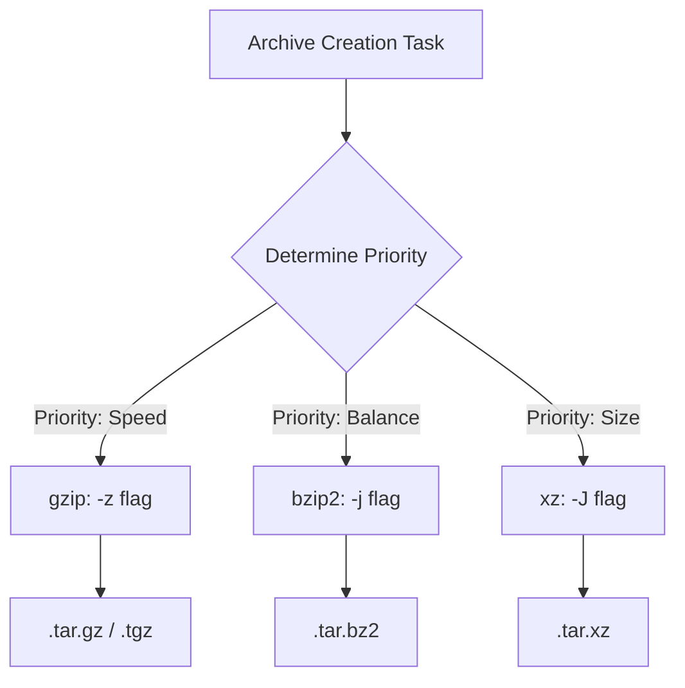

> **LFCS Track** | Complexity: `[MEDIUM]` | Time: 45-60 min | Kubernetes context: 1.35+

## Prerequisites

- **Required**: [LFCS Exam Strategy and Workflow](./module-1.1-exam-strategy-and-workflow/) for the pacing model
- **Required**: [Module 1.3: Filesystem Hierarchy](/linux/foundations/system-essentials/module-1.3-filesystem-hierarchy/) for paths, links, and file layout
- **Helpful**: [Module 7.2: Text Processing](/linux/operations/shell-scripting/module-7.2-text-processing/) for pipes, filters, and search

## Learning Outcomes

- Evaluate command-line tools to select the fastest, safest utility for system state modification under pressure.
- Implement robust file search and metadata inspection using precision tools like `find`, `grep`, and `stat`.
- Diagnose shell redirection ordering issues and correct pipeline output failures before they hide errors.
- Compare archive compression algorithms to balance execution speed, restoration safety, and storage efficiency.
- Implement pre-execution and post-execution verification habits that eliminate assumptions about system state.

## Why This Module Matters

In January 2017, GitLab published a detailed post-incident account after a destructive database maintenance command removed production data from the wrong host. The public write-up is valuable for system administrators because the failure was not exotic: the operator was working under pressure, multiple terminals were involved, replication state was confusing, and a dangerous filesystem command reached the primary database before the mistake was stopped. The lesson for LFCS preparation is direct. A shell command is not just syntax; it is an operational decision made against a specific path, host, filesystem, and stream of output.

The LFCS exam compresses that same style of pressure into a controlled environment. You are not asked to admire Linux commands from a distance; you are asked to alter a live system, preserve what must be preserved, remove only what should be removed, and prove the resulting state. A candidate who can recite `tar` flags but cannot verify where an archive will extract is still gambling. A candidate who knows `grep` but launches it recursively from `/` may waste minutes reading irrelevant data while the real task remains untouched.

This module turns the essential command set into a deliberate operating method. You will practice choosing between tools, quoting patterns so the shell does not reinterpret your intent, inspecting metadata instead of guessing, redirecting output without losing errors, and building archives that can actually be restored. The goal is not to memorize a long command catalog. The goal is to build a repeatable rhythm: inspect the current state, run the narrowest safe command, then verify the result before moving to the next task.

## Strategic Tool Selection: Choose by State, Not by Habit

Most LFCS command mistakes begin before the command is typed. The candidate sees a familiar noun such as "file," "log," or "backup" and reaches for the first tool that comes to mind. Expert administrators start one step earlier: they ask what part of the system state they are trying to change or observe. If the problem is directory metadata, reading file payloads is wasteful. If the problem is content inside a known file set, walking every inode on the machine is wasteful. If the problem is preserving a configuration file before editing, a move is the wrong mental model because it removes the original path.

Think of the command line as a set of instruments rather than a single hammer. `cp` duplicates data and often creates a new inode, so it is appropriate when you need an independent backup or a parallel copy with preserved ownership. `mv` changes directory entries when the source and destination are on the same filesystem, so it is the right tool for renaming and restructuring without reading the file payload. That distinction matters when the file is tiny, but it matters even more when the file is tens of gigabytes and the exam clock is moving.

The operational habit is to identify the boundary that controls the command's behavior. For `mv`, the boundary is the filesystem; inside the same filesystem, the operation is usually a metadata update, while across filesystems it becomes copy-then-remove. For `cp`, the boundary is the preservation requirement; a plain copy may lose ownership and timestamp details that matter to services. For `find`, the boundary is the search root; starting too high creates noise and risk. For `grep`, the boundary is content scope; it is powerful after you have narrowed the directory, but expensive when used as a blind discovery tool.

```bash
pwd
ls -lah
cd /path/to/dir
mkdir -p /srv/app/{config,data,logs}
cp source.txt dest.txt
mv oldname.txt newname.txt
rm -r temp-dir
touch /tmp/checkpoint
```

The commands above are simple enough that many learners underestimate them. `pwd` protects you from acting in the wrong directory, `ls -lah` gives a fast view of hidden names and human-sized file lengths, and `mkdir -p` lets you create nested paths without failing when a parent is missing. Brace expansion in `/srv/app/{config,data,logs}` is a shell feature, not a `mkdir` feature, so the shell expands it into three concrete paths before `mkdir` runs. That is convenient when you intend it, and dangerous when you forget that the shell edits the argument list first.

Pause and predict: if `/srv/app` does not exist, what changes when you remove `-p` from the `mkdir` command above? The command no longer creates missing parents, so the nested directory creation fails before any useful state exists. That tiny flag is the difference between an idempotent setup command and a brittle command that only works after manual preparation. In an exam, prefer commands that are safe to rerun when rerunning makes sense, because rerunnable commands reduce the cost of correcting a typo or repeating a lab step.

Copying and moving also deserve more precision than their names suggest. A plain `cp source.txt dest.txt` creates or overwrites a destination file using the invoking user's context, which is fine for scratch data but risky for service configuration. When ownership, permissions, timestamps, links, and recursive directory contents matter, `cp -a` is usually the safer administrative copy because it preserves more metadata. By contrast, `mv oldname.txt newname.txt` is the cleanest rename inside one filesystem, but it should not be treated as a backup because the original path disappears.

The fast decision rule is not "always use the shorter command." Use `mv` when the intended state is one path replacing another path. Use `cp` when the intended state is two independent paths, especially before editing a file under `/etc`. Use `rm` only after a path inspection step, and prefer removing a precisely named test directory over broad globs. The LFCS grading system sees final state, but your process controls whether that final state is the one you meant to create.

## Globbing, Quoting, and the Shell's First Move

Before `ls`, `rm`, `find`, or almost any other external command receives its arguments, the shell gets the first move. It expands wildcards, performs brace expansion, removes quotes, and passes the resulting argument vector to the program. That ordering is powerful because it lets you express many paths compactly. It is also one of the easiest ways to issue a command that no longer means what you thought it meant.

The important mental model is that a glob is not a pattern handed to every tool automatically. An unquoted `*.log` belongs to the shell first. If files in the current directory match, the shell replaces the pattern with those local filenames before `find` or `tar` sees anything. If no files match, many shells leave the literal pattern in place, which means the same command can behave differently depending on the current directory. That context sensitivity is why unquoted patterns are a frequent exam-time trap.

- `*`: Matches zero or more characters. For example, `*.log` matches `error.log` and `.log`.
- `?`: Matches exactly one character. For example, `file?.txt` matches `file1.txt` but not `file10.txt`.
- `[abc]`: Matches any one character listed inside the brackets.
- `[!abc]` or `[^abc]`: Matches any one character not listed inside the brackets.

When you type `find /var/log -name *.log`, you are asking the current shell to decide whether `*.log` should expand before `find` starts. If your current directory contains `local.log`, the command becomes `find /var/log -name local.log`. If it contains `alpha.log` and `beta.log`, the command becomes `find /var/log -name alpha.log beta.log`, which can produce an error because `find` does not expect several separate arguments after `-name`. The fix is to quote patterns that are meant for the target command: `find /var/log -name "*.log"`.

The same concept explains why broad deletion commands need an inspection step. If a directory contains files named `app.js`, `server.js`, and `-rf`, the shell expansion for `rm *` can place `-rf` in the argument list as if you typed an option. Many tools provide defensive flags such as `--` to mark the end of options, and careful administrators also use `ls -la` or `printf '%s\n' ./*` to inspect names before removal. The practical lesson is not fear of wildcards; it is respect for who interprets them first.

Exercise scenario: You are asked to clean only generated logs under `/tmp/lfcs-glob`, and the directory contains files from a previous practice run. A safe workflow is to list the match, quote patterns when the called tool should handle matching, and remove only after the displayed paths match your intent. This is the same workflow you will use when dealing with Kubernetes 1.35+ node logs or container runtime files on a Linux host: first make the shell's expansion visible, then act.

```bash
mkdir -p /tmp/lfcs-glob
touch /tmp/lfcs-glob/app.log /tmp/lfcs-glob/server.log /tmp/lfcs-glob/notes.txt
find /tmp/lfcs-glob -type f -name "*.log" -print
rm -- /tmp/lfcs-glob/app.log /tmp/lfcs-glob/server.log
```

Before running this, what output do you expect from the `find` command, and why does `rm --` include the double dash? The expected output is the two `.log` files because the quoted pattern is evaluated by `find` against names under `/tmp/lfcs-glob`, not by the shell against your current directory. The `--` tells `rm` that following arguments are operands, not options, which protects you when a filename begins with a dash. It is a small habit with a large safety payoff.

Globbing also interacts with brace expansion in ways that can help you build structures quickly. The command `mkdir -p /srv/app/{config,data,logs}` is not three `mkdir` invocations; it is one invocation with three path arguments produced by the shell. That is efficient when you need a predictable tree. It is not a substitute for reading the resulting tree, because the shell will happily expand exactly what you wrote, including spelling mistakes.

```bash
mkdir -p /tmp/drill1/{dir1,dir2,dir3}
touch /tmp/drill1/dir1/file1.txt /tmp/drill1/dir2/file2.txt /tmp/drill1/dir3/file3.txt
ln /tmp/drill1/dir1/file1.txt /tmp/drill1/dir1/hardlink.txt
ln -s /tmp/drill1/dir2/file2.txt /tmp/drill1/dir2/symlink.txt
ls -li /tmp/drill1/dir1  # Note identical inode numbers for file1 and hardlink
readlink /tmp/drill1/dir2/symlink.txt
```

This preserved drill does more than create a toy tree. It lets you see how directory entries relate to inodes, which is the foundation for understanding why hard links and symbolic links behave differently. When `ls -li` shows identical inode numbers for `file1.txt` and `hardlink.txt`, you are not looking at two independent file payloads. You are looking at two names for the same underlying inode, and that fact drives both the power and the constraints of hard links.

## Search, Metadata, and Text Extraction

Search commands become reliable when you separate three questions: where should the search start, what kind of object should match, and whether you are matching metadata or file content. `find` answers metadata questions by walking directory entries and testing names, types, sizes, times, ownership, and permissions. `grep` answers content questions by opening files and scanning bytes. `stat` answers identity and metadata questions for a specific path. Mixing those roles is how a simple lookup turns into a slow system-wide scan.

When you do not know where a file is located, start with `find` and constrain the start path. Searching from `/` may cross virtual filesystems such as `/proc` and `/sys`, descend into mount points you did not intend to touch, and print many permission errors. In an exam, that noise burns time and hides the signal. Starting at `/etc`, `/var/log`, `/srv`, or a task-specific directory usually gives enough coverage without turning discovery into a full-machine crawl.

```bash
find /var/log -name "*.log"
find /etc -type f -mtime -1
grep -R "error" /var/log
sed -n '1,20p' /etc/fstab
awk '{print $1, $3}' /etc/passwd
```

The first two commands ask metadata questions: which names end in `.log`, and which regular files under `/etc` changed recently. The `grep` command asks a content question, so it opens files under `/var/log` and searches for the string `error`. The `sed` command prints a controlled line range without opening an editor, and the `awk` command prints selected fields from each input line. These tools overlap at the edges, but their strengths are distinct enough that choosing well saves both time and mistakes.

For LFCS work, `stat` is the tool that turns suspicion into evidence. `ls -l` is designed for human scanning, which means its output can be locale-sensitive and visually compressed. `stat` exposes exact permission modes, inode numbers, link counts, ownership, size, and timestamps in a form that is much better for verification. When a task says a file must have mode `0640`, the fastest reliable check is not to squint at `rw-r-----`; it is to ask `stat` for the numeric mode.

```bash
ln file-a file-a.hardlink
ln -s /etc/systemd/system/my.service /tmp/my.service
stat /etc/hosts
file /bin/ls
```

Hard links and symbolic links are a useful test of whether you are inspecting state precisely. A hard link is another directory entry pointing to the same inode, so it cannot cross filesystem boundaries and ordinary users cannot hard link directories. A symbolic link is a separate file whose content is a path to another path, so it can cross filesystems and point at directories, but it can dangle if the target moves. `readlink`, `ls -li`, and `stat` let you prove which case you are looking at instead of guessing from the filename.

Text extraction has the same principle: use the tool that matches the amount of change you need. Opening a large file in an interactive editor to copy lines 15 through 30 is slower and riskier than streaming the selected range with `sed`. Using `awk` to print fields from a structured file is clearer than chaining several fragile cuts when the delimiter is known. These commands are not merely shorter; they reduce the number of manual cursor movements and hidden assumptions in the operation.

```bash
find /etc -name "*.conf"
grep -R "root" /var/log
sed -n '1,10p' /etc/passwd
awk -F':' '{print $1, $3}' /etc/passwd
```

That preserved drill is intentionally ordinary because ordinary commands are what you execute under pressure. The better version of `grep -R "root" /var/log` would often add `--binary-files=without-match` or narrow the path further, but the central point remains: use recursive content search only after the directory is small enough to justify opening files. If the task is merely to locate configuration filenames, `find /etc -name "*.conf"` avoids reading every configuration file payload.

Pause and predict: if `/etc` contains both files and directories modified during the last day, what does `find /etc -mtime -1` return compared with `find /etc -type f -mtime -1`? The first command can return any filesystem object that passes the time test, while the second returns only regular files. That `-type f` predicate is small, but it removes false positives and keeps later commands from accidentally treating directories as files.

The exam habit is to chain discovery and verification carefully. A common pattern is `find` to identify candidates, `stat` to inspect the exact candidate, `sed` or `awk` to extract a small proof, and then a final `ls`, `stat`, or checksum after a change. You do not need a complex script for every task. You need a reliable sequence that narrows the system state until the next command is obvious.

## Redirection and Pipelines Without Losing Evidence

Linux commands communicate through file descriptors, and redirection changes where those descriptors point. Standard output is descriptor 1, standard error is descriptor 2, and standard input is descriptor 0. The distinction matters because a command can produce useful results on stdout while reporting failures on stderr at the same time. If you capture one stream and lose the other, your log may look successful while the terminal quietly displayed the error that explains the failure.

```bash
command > out.txt
command 2> err.txt
command >> append.txt
command | grep -i warning
cat input.txt | sort | uniq -c | sort -nr
```

The shell processes redirections from left to right. `command > file.log 2>&1` first points stdout at `file.log`, then points stderr at the place stdout currently points, which is also `file.log`. The visually similar `command 2>&1 > file.log` does something different. It first points stderr at the current stdout, which is the terminal, and only then points stdout at the file. The result is a log that captures normal output while errors remain on screen.

This ordering rule is a frequent source of false confidence because the file exists and contains something. A candidate sees `output.log`, assumes the script was fully captured, and moves on while the meaningful failure scrolled by. The safe workflow is to decide whether you need separate streams, combined streams, or terminal visibility before running the command. For diagnostics, separate files can be clearer; for audit trails, combined streams in correct order may be better.

```bash
ls /tmp > output.txt
ls /fake-directory 2> error.txt
echo "More output" >> output.txt
cat output.txt | grep -i data | wc -l
```

Pipelines introduce another subtlety: by default, each command receives the previous command's stdout, not its stderr. If the left side fails and writes only to stderr, the right side may process no input while the overall line still leaves you with a misleading impression. In interactive practice, that is a nuisance. In exam work, it can hide the reason your later file is empty. When the error stream matters, redirect it intentionally or inspect it separately.

The example `cat output.txt | grep -i data | wc -l` is deliberately simple because it teaches the shape of a pipeline. In daily administration, you would often write `grep -i data output.txt | wc -l` and skip the extra `cat`, but the full chain is useful for seeing how data flows. The key is that each stage should have a reason. If a stage does not transform, filter, count, or format the stream, remove it.

Before running this, what will be different between `ls /fake-directory > both.log 2>&1` and `ls /fake-directory 2>&1 > both.log`? In the first command, the error message lands in `both.log`; in the second, the error message stays on the terminal because stderr was copied before stdout moved. This is the same left-to-right rule every time, and practicing it with a harmless missing directory makes the rule memorable without damaging the system.

Pipelines are also a place where verification should be explicit. If you build a report with `sort | uniq -c | sort -nr`, check whether the resulting file is non-empty, whether the top lines make sense, and whether stderr was captured or reviewed. A correct pipeline is one whose inputs, transformations, and outputs you can explain. If you cannot explain where errors went, you have not finished the command.

## Archives, Compression, and Restore Safety

Archive tasks test more than flag memory. They test whether you can create a portable bundle, choose an appropriate compression tradeoff, list the contents before extraction, and restore into the intended directory. `tar` bundles files into one archive, but compression is selected separately with flags such as `-z`, `-j`, or `-J`. The `-C` option changes directory before reading or writing archive paths, which makes it one of the most important safety flags in the LFCS archive workflow.

```bash
# gzip (fastest, most common)
tar -czf backup.tar.gz /etc/myapp
tar -xzf backup.tar.gz -C /tmp/restore

# bzip2 (smaller archives, slower)
tar -cjf backup.tar.bz2 /etc/myapp
tar -xjf backup.tar.bz2 -C /tmp/restore

# xz (smallest archives, slowest)
tar -cJf backup.tar.xz /etc/myapp
tar -xJf backup.tar.xz -C /tmp/restore
```

The preserved examples show the three common compression families, but a production-quality command usually improves the path handling. Creating an archive from `/etc/myapp` can store absolute path information or emit warnings depending on the implementation. A cleaner pattern is to change into the parent directory and archive the relative child name: `tar -czf backup.tar.gz -C /etc myapp`. That way, extraction creates `myapp` under the chosen restore directory instead of trying to recreate a path rooted at `/`.

```bash
gzip file.txt          # produces file.txt.gz, removes original
gunzip file.txt.gz     # restores file.txt
bzip2 file.txt         # produces file.txt.bz2
bunzip2 file.txt.bz2
xz file.txt            # produces file.txt.xz
unxz file.txt.xz
```

Standalone compression tools transform one file at a time and usually replace the original with the compressed version. That behavior surprises learners who expected a copy to remain. `tar` is different because it produces a separate archive file while leaving the source tree intact unless you add unusual options. When preserving the source matters, know whether your tool bundles, compresses in place, or both.

```bash
zip -r backup.zip /srv/data
unzip backup.zip -d /tmp/restore
```

`zip` and `unzip` are common in mixed environments because the format is widely understood outside Unix-like systems. They are not usually the first choice for Linux service backups, but LFCS candidates should recognize the syntax and know how to direct extraction with `-d`. The restore destination matters more than the format name. A clean extraction path prevents archive contents from spilling into your current working directory.

```bash
find /etc/myapp -print | cpio -ov > backup.cpio
cpio -idv < backup.cpio
```

`cpio` appears less often in day-to-day administration, yet it remains part of the traditional Unix archive family and can appear in exam objectives. Its mental model is pipeline-oriented: one command supplies a list of pathnames, and `cpio` writes or reads an archive based on that list. That makes input accuracy critical. If the `find` command is too broad, the archive faithfully contains too much.

| Flag | Compressor | Extension |
|------|-----------|-----------|
| `-z` | gzip | `.tar.gz` / `.tgz` |
| `-j` | bzip2 | `.tar.bz2` |
| `-J` | xz | `.tar.xz` |



The decision graph is intentionally simple because archive choice often starts with a single dominant constraint. `gzip` is usually the fastest practical default and is broadly supported. `bzip2` may produce smaller output at the cost of speed. `xz` often compresses smaller still, but the compression time can be noticeably higher. In an exam, the requested extension or command may decide for you; in operations, the restore time and available CPU matter as much as the final archive size.

```bash
tar -tzf backup.tar.gz             # list contents without extracting
tar -tjf backup.tar.bz2
tar -tJf backup.tar.xz
md5sum backup.tar.gz > backup.md5  # create checksum
md5sum -c backup.md5               # verify later
```

Listing before extraction is the archive equivalent of checking `pwd` before removal. It tells you whether the archive contains `myapp/file.conf`, `/etc/myapp/file.conf`, or an unexpected top-level directory. Checksums answer a different question: whether the archive bytes later match the archive bytes you recorded. Neither step proves application-level correctness by itself, but together they catch many avoidable failures before you overwrite or restore anything.

```bash
mkdir -p /tmp/drill3/source && echo "data" > /tmp/drill3/source/file1.txt
tar -czf /tmp/drill3/backup.tar.gz -C /tmp/drill3 source
tar -tzf /tmp/drill3/backup.tar.gz
mkdir -p /tmp/drill3/restore-gz
tar -xzf /tmp/drill3/backup.tar.gz -C /tmp/drill3/restore-gz
diff /tmp/drill3/source/file1.txt /tmp/drill3/restore-gz/source/file1.txt
```

This first restore round trains the complete lifecycle rather than only archive creation. The `-C /tmp/drill3 source` combination stores a relative `source` directory in the archive. The `tar -tzf` line proves the archive layout before extraction, and the `diff` line proves restored content against the original file. That last proof is the habit many candidates skip because the archive command seemed to succeed.

```bash
tar -cjf /tmp/drill3/backup.tar.bz2 -C /tmp/drill3 source
tar -tjf /tmp/drill3/backup.tar.bz2
mkdir -p /tmp/drill3/restore-bz2
tar -xjf /tmp/drill3/backup.tar.bz2 -C /tmp/drill3/restore-bz2
```

```bash
tar -cJf /tmp/drill3/backup.tar.xz -C /tmp/drill3 source
tar -tJf /tmp/drill3/backup.tar.xz
mkdir -p /tmp/drill3/restore-xz
tar -xJf /tmp/drill3/backup.tar.xz -C /tmp/drill3/restore-xz
```

```bash
find /tmp/drill3/restore-gz -type f | wc -l
md5sum /tmp/drill3/source/file1.txt /tmp/drill3/restore-gz/source/file1.txt
```

The bzip2 and xz rounds preserve the same structure while changing only the compression flag and listing flag. That repetition is deliberate. You want your hands to remember that `-j` pairs with bzip2 and `-J` pairs with xz, while your mind stays focused on archive layout and verification. The final file count and checksum commands are not decorative; they force you to prove that extraction produced files and that at least one restored payload matches the source.

## Verification as an Operating Loop

Verification is not a final checklist stapled onto the end of system administration. It is a loop that surrounds every risky command: observe state, choose the narrow command, execute, observe state again, and only then proceed. The loop is especially important for essential commands because they are often destructive or silent when successful. `mv` may print nothing, `rm` may print nothing, and `tar` may create an archive that looks plausible until restore time.

For LFCS practice, treat every command as having a precondition and a postcondition. The precondition for `rm -r temp-dir` is that `temp-dir` is truly the intended directory and not a glob-expanded surprise. The postcondition is that the directory is gone and no unrelated path changed. The precondition for `tar -xzf backup.tar.gz -C /tmp/restore` is that `/tmp/restore` exists and the archive contains the layout you expect. The postcondition is that the restored tree exists under the restore directory and contains the expected files.

An effective verification loop is short and specific. Use `pwd` to confirm the working directory, `ls -la` to inspect path names including hidden files, `stat -c '%a %U %G %n'` to check mode and ownership, `find ... -type f | wc -l` to count restored files, and `diff` or checksums to compare critical content. Avoid long verification commands that are harder to trust than the original operation. The proof should reduce uncertainty, not create a second debugging problem.

Exercise scenario: You need to change a service configuration file and keep a rollback copy. A safe loop is to inspect the file, copy it with preserved metadata, verify the backup exists, make the edit, and compare the result. This is not slower than improvising when you count the cost of recovering from a bad edit. It also mirrors the discipline expected when you later administer Kubernetes 1.35+ nodes, where a Linux host change can affect workloads above it.

```bash
stat /etc/hosts
cp -p /etc/hosts /tmp/hosts.backup
stat /tmp/hosts.backup
sed -n '1,20p' /etc/hosts
```

The example uses `/etc/hosts` because it exists on ordinary Linux systems and is safe to inspect, while the backup lands in `/tmp` rather than replacing system configuration. `cp -p` preserves mode, ownership where permitted, and timestamps more carefully than a plain copy. `stat` before and after gives you evidence that the source and backup exist with the metadata you expect. `sed -n '1,20p'` gives a bounded content view without opening an editor.

This loop also protects you from the seductive speed of muscle memory. Fast typing is useful only when the command is correct for the current host, path, and filesystem. The best LFCS candidates build speed by reducing choices, not by skipping checks. They know which proof command belongs after each operation, so verification becomes part of the workflow rather than a separate ceremony.

## Exam-Paced Command Rehearsal

Command rehearsal is different from casual command review. In casual review, you read a command, nod because it looks familiar, and move on. In rehearsal, you force the command to carry a specific operational question: what state exists before the command, what state should exist afterward, and what evidence will prove the change. This framing turns essential commands into a compact diagnostic language rather than a pile of isolated recipes.

A good rehearsal round starts with a clean workspace and a timer, but the timer is not there to reward reckless speed. It exists to reveal which decisions still require too much conscious effort. If you pause every time you choose between `find` and `grep`, the remedy is not to memorize more flags; the remedy is to practice classifying the question as metadata or content. If you pause every time you create an archive, the remedy is to practice naming the parent directory and child path before typing `tar`.

The strongest practice sessions also include small failures on purpose. Run a harmless command with the redirection order reversed, inspect where stderr landed, then correct it. Create an archive with an awkward path layout, list it, and explain why you would not restore it over an important directory. Make a symbolic link, move the target, and use `readlink` plus `stat` to diagnose the dangling path. Controlled mistakes build recognition without turning your real system into the classroom.

When you practice file search, do not only search for names that exist. Search for a name that does not exist and observe the shape of clean failure. Search under a directory that has both files and subdirectories, then add `-type f` and compare the candidate set. Search for content in a deliberately small log directory, then explain why the same `grep -R` would be inappropriate from `/`. These contrasts make the decision boundaries concrete enough to recall during the exam.

When you practice metadata inspection, make yourself say what `stat` will prove before you run it. It might prove that two hard-linked names share an inode, that a copied backup preserved a mode, or that a restored file has the expected owner. The point is to avoid treating inspection commands as decorative output. If the proof does not answer a question, sharpen the question until the command result changes your confidence.

Archive rehearsal should always include restoration because creation alone is only half of the job. A candidate who can produce `backup.tar.gz` but cannot predict its extraction layout has not demonstrated backup skill. List the archive, restore it into a dedicated directory, compare at least one file, and remove the practice tree only after you can describe the precondition and postcondition. This habit prevents a false sense of safety around files that merely have plausible names.

You can also rehearse command selection by writing one-line intentions before command lines. For example: "relocate this path without keeping the original," "duplicate this configuration with metadata," "find regular files changed recently," or "capture stdout and stderr together." Then choose `mv`, `cp -p`, `find -type f -mtime`, or correct redirection syntax to match the intention. This exercise is useful because LFCS prompts often describe desired state in prose, not in command names.

Do not overlook cleanup as part of rehearsal. Removing a practice directory safely means confirming the path, using an exact directory name, and proving removal afterward. That is the same discipline you need before deleting stale logs, temporary restore trees, or failed extraction directories. Cleanup is where tired candidates often use the broadest command of the session, so it deserves the same inspection loop as setup and restore.

Finally, rehearse with your own explanations. After each round, explain why each command was the narrowest safe tool, which boundary controlled its behavior, and what verification proved. If the explanation sounds vague, repeat the round with a smaller example until it becomes precise. The LFCS exam does not grade your explanation, but the explanation is how you train the decision-making that produces the graded final state.

One useful closing drill is to replay a task from the end back to the beginning. Start with the proof you want, such as a matching checksum, an expected file count, or a `stat` line showing the right mode, then work backward to the command that would create that state. This reverse planning exposes missing directories, wrong archive roots, and weak search predicates before you execute anything. It also trains you to see commands as state transitions, which is the core skill behind safe Linux administration. When the proof is clear first, the command becomes a controlled means to an observable result rather than a hopeful guess every time you practice under exam pressure.

## Patterns & Anti-Patterns

The patterns in this module are small, but they scale because they encode how reliable operators think. A safe `find` command on a practice directory uses the same judgment as a safe `find` command on a production node: choose the narrow root, express the predicate clearly, and inspect output before piping it into a destructive command. A safe archive workflow on `/tmp` uses the same judgment as a real backup: control the stored path layout, list before extraction, and verify restored content.

| Pattern | When to Use | Why It Works | Scaling Consideration |
|---------|-------------|--------------|-----------------------|
| Inspect before destructive action | Before `rm`, overwrite redirects, archive extraction, or recursive moves | It confirms the command target while correction is still cheap | Use concise proof commands so verification remains fast under pressure |
| Metadata-first search | When locating files by name, age, type, ownership, or size | `find` avoids reading file payloads and can narrow candidates efficiently | Start at the smallest credible directory to avoid virtual and remote filesystems |
| Relative archive layout with `-C` | When creating portable archives for restore elsewhere | It stores predictable paths and avoids accidental extraction into absolute locations | Standardize archive roots so restore drills and automation match |
| Stream extraction for bounded reads | When inspecting ranges or fields in large files | `sed` and `awk` avoid interactive editor risk and use predictable input/output | Add delimiters and exact ranges so commands stay readable to reviewers |

Anti-patterns usually come from trying to save a few seconds while spending hidden risk. Running recursive content search from `/` feels decisive, but it asks the system to open far more data than the task requires. Extracting an archive into the current directory feels convenient, but it makes cleanup and proof harder. Redirecting output without thinking about stderr feels tidy, but it can hide the only message that explains failure.

| Anti-Pattern | What Goes Wrong | Better Alternative |
|--------------|-----------------|--------------------|
| Blind recursive search from root | The command wastes time on irrelevant trees and emits noisy permission errors | Start with `find` under a task-specific directory and add predicates |
| Unquoted search patterns | The shell expands patterns against the current directory before the tool runs | Quote patterns intended for tools, such as `find . -name "*.conf"` |
| Archive creation without restore proof | A syntactically valid archive may contain the wrong root path or miss files | List with `tar -t...`, extract to a test directory, then compare |
| Combined logs with wrong redirection order | Errors remain on the terminal while stdout goes to the file | Use `> file.log 2>&1` when both streams must land in one file |

## Decision Framework

Use this framework when a task prompt feels like "do something with files" but does not immediately reveal the safest command. First, classify the desired state: observe, duplicate, relocate, transform, remove, or bundle. Second, identify the boundary that changes behavior: filesystem boundary for `mv`, metadata preservation for `cp`, search root for `find`, stream choice for redirection, and path layout for `tar`. Third, choose the proof command before you execute the change, because knowing how you will verify often exposes a weak plan.

| Task Shape | Prefer | Avoid | Verification |
|------------|--------|-------|--------------|
| Rename or restructure inside one filesystem | `mv` | `cp` followed by manual cleanup | `ls -li`, `stat`, or path-specific `test -e` checks |
| Preserve a file before editing | `cp -p` or `cp -a` | `mv` as a "backup" | `stat` source and backup, then compare content if needed |
| Locate paths by name, type, age, owner, or size | `find` | `grep -R` as discovery | Print candidates first, then narrow with additional predicates |
| Extract known lines or fields | `sed`, `awk`, `grep` | Opening huge files interactively | Count or display bounded output and redirect intentionally |
| Bundle and compress a tree | `tar -C parent -c... child` | Archiving absolute paths without checking layout | `tar -t...`, test extraction, file count, checksum, or `diff` |

```text
+-------------------------------+
| Read the task as desired state |
+-------------------------------+
                |
                v
+-------------------------------+
| Pick the narrowest safe tool   |
| observe / copy / move / search |
| transform / archive / remove   |
+-------------------------------+
                |
                v
+-------------------------------+
| Identify the behavior boundary |
| filesystem / glob / stream /   |
| metadata / archive root        |
+-------------------------------+
                |
                v
+-------------------------------+
| Execute, then prove final state|
| with stat, find, tar -t, diff, |
| checksum, or bounded output    |
+-------------------------------+
```

The framework is intentionally compact because you should be able to apply it during the exam without stopping to write notes. If a prompt asks you to "move" data, check whether it truly means relocate one path or preserve a copy. If a prompt asks you to "find" something, decide whether the name, metadata, or content is the searchable property. If a prompt asks you to "backup" something, treat restore proof as part of the task, not as extra credit.

## Did You Know?

- In 1984, the standard `tar` utility was formally codified by POSIX, though the Unix `tar` program originated in the late 1970s for writing archives to sequential magnetic tape.
- The `xz` file format appeared in 2009 and uses the LZMA2 compression algorithm, which often improves size compared with `gzip` while trading away compression speed.
- A Linux directory is conceptually a mapping from filenames to inode numbers, which is why a hard link can make two names refer to one underlying file object.
- The standard `cp` command was present in early Unix history, and its modern administrative value comes from metadata-preserving options such as `-p` and `-a`.

## Common Mistakes

| Mistake | Why It Happens | How to Fix It |
|---------|----------------|---------------|
| Unquoted wildcards in `find` | The shell expands `*.txt` to local filenames before `find` runs, causing syntax errors or wrong matches when multiple files match locally. | Always quote wildcards that belong to search tools: `find . -name "*.txt"` |
| `tar` extracts absolute paths | Creating an archive without controlling the working directory can preserve awkward path structure, making clean restore harder. | Use `tar -C /var/www -czf archive.tar.gz html/app` and list the archive before extraction. |
| `2>&1 > file.log` ordering | Placing `2>&1` before the output redirect sends stderr to the terminal and stdout to the file. | Order matters: `> file.log 2>&1` ensures both streams point to the file. |
| Hard linking directories | Users attempt to hard link a directory to save space or create a shortcut, but the OS blocks it to prevent traversal loops. | Use symbolic links for directories: `ln -s /source /dest` and verify the target with `readlink`. |
| Using `grep -R` from `/` | Attempting to find a lost file by content from root causes `grep` to read binaries, virtual filesystems, and mounted trees. | Narrow the scope with `find`, or restrict recursive content search to a credible directory such as `/etc`. |
| Assuming `cp` preserves ownership | A standard copy can create a new file owned by the executing user, breaking services that depend on specific metadata. | Use `cp -p` or `cp -a`, then verify mode and ownership with `stat`. |
| Extracting archives into the current directory | The archive may create unexpected top-level paths or overwrite local files where you happen to be working. | Create a dedicated restore directory, list contents with `tar -t...`, then extract with `-C`. |
| Treating silent success as proof | Many Unix commands print nothing when successful, so the operator moves on without confirming final state. | Pair each change with a short proof command such as `stat`, `find`, `diff`, `tar -t`, or a checksum. |

## Knowledge Check

<details>
<summary>1. A junior engineer runs `find /var/log -name *.log` and receives an error stating "find: paths must precede expression". Why did this happen and how do you fix it?</summary>

This error occurs because the shell expands the unquoted `*.log` glob into a list of filenames present in the current directory before executing `find`. If the current directory contains `error.log` and `access.log`, the command can become `find /var/log -name access.log error.log`, which gives `find` more arguments than the `-name` predicate expects. The correct fix is to quote the glob as `find /var/log -name "*.log"` so `find` receives the pattern and applies it under `/var/log`. This diagnoses a quoting failure, not a missing log directory.
</details>

<details>
<summary>2. You need to move a 50GB database file from `/data1` to `/data2`. Both directories reside on the same XFS partition. Will this operation consume heavy CPU or I/O, and why?</summary>

No, the operation should be nearly instantaneous compared with copying the payload because the source and destination are on the same filesystem. In that case, `mv` updates directory entries so the existing inode is reachable at the new path, rather than reading and writing 50GB of file data. You should still verify the filesystem assumption because crossing a mount boundary changes the behavior into copy-then-remove. The right proof is to inspect mounts or device identifiers before the move and verify the final path after it.
</details>

<details>
<summary>3. You execute a backup script using `script.sh 2>&1 > output.log`. You expect all execution errors to be written to the log, but the errors appear on your terminal. Why?</summary>

The shell processes redirections from left to right, so `2>&1` first points stderr at the current stdout, which is still the terminal. The later `> output.log` changes stdout only; it does not revisit stderr and move it into the file. The correct combined-log form is `script.sh > output.log 2>&1` because stdout is redirected first and stderr is then copied to the new stdout destination. This is a redirection ordering problem, not a problem with the script itself.
</details>

<details>
<summary>4. You are under time pressure to archive a web directory located at `/var/www/app`. You want the archive to extract cleanly. You use `tar -czf backup.tar.gz -C /backup /var/www/app`. Will this work as intended?</summary>

No, this command is structurally flawed because `-C /backup` tells `tar` to change into `/backup` before looking for the source path. Unless `/backup/var/www/app` exists, the command fails or captures something other than the intended tree. A cleaner command is `tar -czf backup.tar.gz -C /var/www app`, followed by `tar -tzf backup.tar.gz` to verify that the archive contains a relative `app` directory. The important idea is to control archive layout before you need to restore it.
</details>

<details>
<summary>5. A service fails after you copied its configuration file into place. `ls -l` looks close enough, but the service still cannot read the file. What should you inspect next?</summary>

Use `stat` to inspect the exact mode, owner, group, inode, and timestamps for the source and destination files. `ls -l` is useful for human scanning, but it is not the strongest verification tool when a service depends on exact metadata. If the destination was created by plain `cp`, ownership or mode may differ from the original, so a metadata-preserving copy such as `cp -p` or `cp -a` may be needed. The fix should be followed by another `stat` check rather than another visual guess.
</details>

<details>
<summary>6. You create a symbolic link to a configuration file, then move the original file to a new directory. The link remains visible but the service reports that the file is missing. What happened?</summary>

A symbolic link is its own filesystem object containing a path to the target, so moving the target can leave the link dangling. The visible link name does not prove that the target path still exists. You can diagnose this with `readlink` to display the stored path and `stat` or `test -e` to verify the target. The repair is to recreate the symbolic link with the new target path or move the target back to the path the link references.
</details>

<details>
<summary>7. You need to extract configuration lines 15 through 30 from a massive 10GB log file and redirect them to a new file. Why should you use `sed` instead of opening the file in an interactive editor?</summary>

An interactive editor may spend time and memory building buffers for a huge file, and manual selection creates unnecessary error risk under pressure. A stream editor such as `sed -n '15,30p' file.log > output.txt` reads predictably and writes only the requested range. This implements the extraction with a command that can be repeated, reviewed, and redirected cleanly. The right follow-up is to check the output file with `wc -l` or a bounded `sed -n` display.
</details>

## Hands-On Exercise

This exercise builds a disposable practice area under `/tmp` and walks through the command families from this module. The tasks are progressive: create and inspect a tree, distinguish link types, search safely, practice redirection, and produce verified archives. Run these commands on a practice machine or lab VM, not on a production host, and read each solution only after you have tried the task yourself.

### Setup

```bash
rm -rf /tmp/lfcs-essential-practice
mkdir -p /tmp/lfcs-essential-practice/{source,restore,logs}
printf 'alpha\nbeta\ngamma\n' > /tmp/lfcs-essential-practice/source/app.conf
printf 'error: disk\nwarning: cpu\ninfo: ready\n' > /tmp/lfcs-essential-practice/logs/app.log
```

### Tasks

- [ ] Evaluate command-line tools for the practice tree, then select the safest utility for creating directories, copying a rollback file, moving one file, and removing only an exact temporary path.
- [ ] Locate `.log` files under the practice tree using a quoted pattern, then search those logs for the word `error` without starting from `/`.
- [ ] Extract a bounded range from a file with `sed`, extract fields with `awk`, and redirect normal output and errors into separate files.
- [ ] Compare archive compression algorithms by creating gzip, bzip2, and xz `tar` archives with `-C`, then note the speed, restoration safety, and file-size tradeoff you observed.
- [ ] List each archive before extraction, restore at least one archive into a dedicated directory, and prove the restored file matches the source.
- [ ] Write a short verification note for yourself that names the precondition and postcondition for the archive restore.

<details>
<summary>Solution: file tree and links</summary>

```bash
mkdir -p /tmp/drill1/{dir1,dir2,dir3}
touch /tmp/drill1/dir1/file1.txt /tmp/drill1/dir2/file2.txt /tmp/drill1/dir3/file3.txt
ln /tmp/drill1/dir1/file1.txt /tmp/drill1/dir1/hardlink.txt
ln -s /tmp/drill1/dir2/file2.txt /tmp/drill1/dir2/symlink.txt
ls -li /tmp/drill1/dir1  # Note identical inode numbers for file1 and hardlink
readlink /tmp/drill1/dir2/symlink.txt
```

The hard link and original file show the same inode number because they are two directory entries for the same underlying file object. The symbolic link has its own inode and stores a path to the target, which `readlink` displays. If the target path moves, the symbolic link can remain visible while no longer resolving successfully.
</details>

<details>
<summary>Solution: search and text extraction</summary>

```bash
find /etc -name "*.conf"
grep -R "root" /var/log
sed -n '1,10p' /etc/passwd
awk -F':' '{print $1, $3}' /etc/passwd
```

For the disposable practice tree, adapt the same pattern by replacing `/etc` and `/var/log` with `/tmp/lfcs-essential-practice`. Keep the `*.conf` or `*.log` pattern quoted so the shell does not expand it from your current directory. Use `-type f` when you want only files, especially before piping paths into commands that expect file operands.
</details>

<details>
<summary>Solution: redirection drills</summary>

```bash
ls /tmp > output.txt
ls /fake-directory 2> error.txt
echo "More output" >> output.txt
cat output.txt | grep -i data | wc -l
```

This solution keeps stdout and stderr separate so you can inspect each stream deliberately. To combine both streams into one log, use `ls /fake-directory > combined.log 2>&1`, with stdout redirected before stderr is copied. Verify by reading the resulting files rather than assuming silence means success.
</details>

<details>
<summary>Solution: archive and restore lifecycle</summary>

```bash
mkdir -p /tmp/drill3/source && echo "data" > /tmp/drill3/source/file1.txt
tar -czf /tmp/drill3/backup.tar.gz -C /tmp/drill3 source
tar -tzf /tmp/drill3/backup.tar.gz
mkdir -p /tmp/drill3/restore-gz
tar -xzf /tmp/drill3/backup.tar.gz -C /tmp/drill3/restore-gz
diff /tmp/drill3/source/file1.txt /tmp/drill3/restore-gz/source/file1.txt
```

```bash
tar -cjf /tmp/drill3/backup.tar.bz2 -C /tmp/drill3 source
tar -tjf /tmp/drill3/backup.tar.bz2
mkdir -p /tmp/drill3/restore-bz2
tar -xjf /tmp/drill3/backup.tar.bz2 -C /tmp/drill3/restore-bz2
```

```bash
tar -cJf /tmp/drill3/backup.tar.xz -C /tmp/drill3 source
tar -tJf /tmp/drill3/backup.tar.xz
mkdir -p /tmp/drill3/restore-xz
tar -xJf /tmp/drill3/backup.tar.xz -C /tmp/drill3/restore-xz
```

```bash
find /tmp/drill3/restore-gz -type f | wc -l
md5sum /tmp/drill3/source/file1.txt /tmp/drill3/restore-gz/source/file1.txt
```

The precondition is that the restore directory exists and the archive listing shows the expected relative `source` path. The postcondition is that the restored tree exists under the restore directory and at least one restored file matches the source by content comparison or checksum. Repeat the same proof pattern for the bzip2 and xz archives if you want more practice.
</details>

## Sources

- [GitLab.com database incident overview](https://about.gitlab.com/blog/2017/02/01/gitlab-dot-com-database-incident/)
- [GNU Coreutils manual: cp invocation](https://www.gnu.org/software/coreutils/manual/html_node/cp-invocation.html)
- [GNU Coreutils manual: mv invocation](https://www.gnu.org/software/coreutils/manual/html_node/mv-invocation.html)
- [GNU Coreutils manual: ln invocation](https://www.gnu.org/software/coreutils/manual/html_node/ln-invocation.html)
- [GNU Coreutils manual: stat invocation](https://www.gnu.org/software/coreutils/manual/html_node/stat-invocation.html)
- [GNU Findutils manual: find expressions](https://www.gnu.org/software/findutils/manual/html_node/find_html/Find-Expressions.html)
- [GNU Grep manual](https://www.gnu.org/software/grep/manual/grep.html)
- [GNU Sed manual](https://www.gnu.org/software/sed/manual/sed.html)
- [GNU Gawk manual](https://www.gnu.org/software/gawk/manual/gawk.html)
- [GNU Tar manual](https://www.gnu.org/software/tar/manual/tar.html)
- [GNU Gzip manual](https://www.gnu.org/software/gzip/manual/gzip.html)
- [XZ Utils documentation](https://tukaani.org/xz/)
- [GNU Cpio manual](https://www.gnu.org/software/cpio/manual/cpio.html)

## Next Module

Next, apply these command habits to the filesystem itself in [Module 1.3: Filesystem Hierarchy](/linux/foundations/system-essentials/module-1.3-filesystem-hierarchy/), where you will map critical Linux paths to the services and data they contain.
