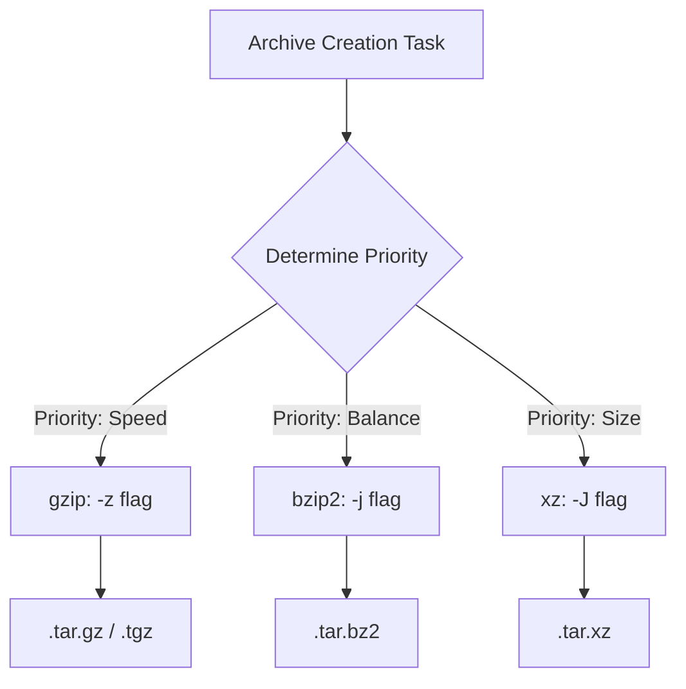

> **LFCS Track** | Complexity: `[MEDIUM]` | Time: 45-60 min

**Reading Time**: 45-60 minutes

## Prerequisites

Before starting this module:
- **Required**: [LFCS Exam Strategy and Workflow](./module-1.1-exam-strategy-and-workflow/) for the pacing model
- **Required**: [Module 1.3: Filesystem Hierarchy](/linux/foundations/system-essentials/module-1.3-filesystem-hierarchy/) for paths, links, and file layout
- **Helpful**: [Module 7.2: Text Processing](/linux/operations/shell-scripting/module-7.2-text-processing/) for pipes, filters, and search

## What You'll Be Able to Do

After completing this module, you will be able to:
- Evaluate command-line tools to select the fastest, safest utility for system state modification under pressure.
- Implement robust file search and metadata inspection using precision tools like find, grep, and stat.
- Diagnose shell redirection ordering issues and correct pipeline output failures.
- Compare archive compression algorithms to balance execution speed with storage efficiency.
- Implement pre-execution and post-execution verification habits to eliminate assumptions about system state.

## Why This Module Matters

In January 2017, GitLab suffered a catastrophic database incident that brought their production services to a halt. An engineer intended to clear a rogue database directory on a secondary replication node to fix a synchronization issue. However, due to terminal multiplexer confusion and muscle memory bypassing verification checks, they executed a destructive removal command on the primary database cluster. Over 300GB of live production data was erased before the engineer noticed the mistake and interrupted the process. This single command error resulted in 18 hours of total downtime, significant financial damage, and intense public scrutiny. 

This incident highlights the brutal reality of system administration and the exact conditions simulated by the LFCS exam environment. Knowing basic command syntax is merely the baseline; you must possess the situational awareness to verify state before executing destructive commands. When the pressure spikes, outages drag on, and time is running out, relying on slow manual GUI tools, generic commands, or guessing at command-line flags leads directly to failure. System administrators do not get partial credit for almost typing the right path.

In the LFCS exam, you are judged solely by your terminal velocity and the accuracy of the resulting system state. This module transitions you from passively understanding commands to actively dominating the shell. You will drill the exact verification habits, redirection ordering, and compression tradeoffs required to manipulate system state rapidly and safely. By the end of these exercises, executing the right command with the correct flags will be automatic, reserving your cognitive load for solving the actual architectural problems presented in the exam.

## Strategic Tool Selection: Choosing the Right Command

The difference between a passing and failing LFCS candidate often comes down to tool selection. Using a broad tool for a narrow problem wastes precious time and introduces risk.

### Copying vs. Moving: cp vs. mv
The `cp` command allocates a new inode, reads the source data, and writes it to a new location. This consumes CPU, I/O bandwidth, and time, especially for large files. It also requires careful handling of permissions and ownership using flags like `-p` or `-a`.

The `mv` command operates fundamentally differently depending on the destination. If you move a file within the same filesystem partition, `mv` does not touch the file data at all. It simply rewrites the directory entry to point to the existing inode. This operation is nearly instantaneous, even for a 100GB file. However, if you move a file across filesystem boundaries (e.g., from `/` to an NFS mount or a different disk), `mv` silently falls back to behaving like `cp`, followed by an `rm` of the source file. 

**Rule**: Always use `mv` for restructuring within a filesystem. Use `cp` when you need an explicit backup before modifying a critical configuration file.

### Locating Files vs. Locating Content: find vs. grep
A common mistake under pressure is using `grep -R` from the root directory to find a file. While `grep` is powerful, its recursive mode is designed to open and read the content of every single file it encounters. Running this against `/` or `/var` will cause it to read massive binary files, potentially get stuck in symbolic link loops, and consume massive amounts of time.

Conversely, `find` operates strictly on filesystem metadata (inodes, names, modification times, permissions, and sizes) without reading the file payload. 

**Rule**: If you are searching for a filename, a file modified in the last day, or files owned by a specific user, use `find`. If you must search for a specific text string inside a configuration file, navigate as close to the target directory as possible, then use `grep`.

### Precision Editing: sed vs. vi/nano
When an exam task asks you to extract the first 20 lines of a file, or replace a single IP address in a configuration file, opening the file in `vi` or `nano` introduces manual risk. You might accidentally delete a character, or waste time navigating thousands of lines.

The `sed` (stream editor) command allows surgical precision from the command line. You can isolate lines, perform substitutions, and redirect the output instantly without entering an interactive buffer.

**Rule**: Use `vi` for complex, multi-line structural edits. Use `sed` for targeted extractions, automated replacements, and pipeline filtering.

## Shell Globbing and Pattern Expansion

Before any command (like `ls`, `rm`, or `find`) executes, the shell intercepts the command line and expands wildcard characters. This process is called globbing. Understanding this is critical because a misunderstood glob can destroy a filesystem.

### Core Globbing Operators
- `*`: Matches zero or more characters. (e.g., `*.log` matches `error.log` and `.log`).
- `?`: Matches exactly one character. (e.g., `file?.txt` matches `file1.txt` but not `file10.txt`).
- `[abc]`: Matches any one character listed inside the brackets.
- `[!abc]` or `[^abc]`: Matches any one character NOT listed inside the brackets.

### Quoting Pitfalls and Expanding Safety
When you type a command like `find /var/log -name *.log`, you are trusting the shell. If your current working directory contains a file named `local.log`, the shell expands your command to `find /var/log -name local.log` before `find` even starts running. If the current directory contains multiple log files, it expands to `find /var/log -name alpha.log beta.log`, which causes a syntax error because `find` does not expect multiple arguments after `-name`.

To prevent the shell from expanding the glob and instead pass the raw wildcard directly to the tool, you must quote the pattern. 

**Correct execution:** `find /var/log -name "*.log"`

> **Stop and think**: If you are in a directory containing files named `app.js`, `server.js`, and `-rf`, what happens if you type `rm *`? The shell expands the asterisk to the list of files, resulting in `rm -rf app.js server.js`. The wildcard unintentionally passed a dangerous flag to the remove command!

## The Command Families You Must Own

### Files and Directories

The foundation of command line operations is moving around and managing the directory structure rapidly. 

```bash
pwd
ls -lah
cd /path/to/dir
mkdir -p /srv/app/{config,data,logs}
cp source.txt dest.txt
mv oldname.txt newname.txt
rm -r temp-dir
touch /tmp/checkpoint
```

**Gotcha**: When using `mkdir`, the `-p` flag is mandatory for nested directories. Without it, `mkdir /srv/app/config` fails if `/srv/app` does not exist. The brace expansion `{config,data,logs}` allows you to create multiple parallel directories instantly without repeating the base path.

### Links and File Metadata

Understanding links is critical for configuring services that expect files in specific locations without duplicating data.

```bash
ln file-a file-a.hardlink
ln -s /etc/systemd/system/my.service /tmp/my.service
stat /etc/hosts
file /bin/ls
```

**Hard Link Constraints**: A hard link is a secondary directory entry pointing to the exact same underlying inode on the disk. Because inodes are unique only within a single filesystem, hard links cannot cross partition boundaries or mount points. Furthermore, standard users cannot create hard links to directories to prevent infinite loops in filesystem traversal.

**Symlink Gotchas**: A symbolic link (`-s`) is essentially a small text file containing the path to the target. It can cross filesystems and link to directories. However, if the target file is deleted or moved, the symlink becomes a "dangling link" and breaks. Always verify the target exists after moving files.

**Rationale for stat**: While `ls -l` shows basic permissions and a rounded timestamp, `stat` reveals the raw octal permissions (essential for chmod), the exact inode number, and precise timestamps down to the nanosecond for Access, Modify, and Change events.

### Search and Read

When you do not know where a configuration file is located, these tools are your primary reconnaissance methods.

```bash
find /var/log -name "*.log"
find /etc -type f -mtime -1
grep -R "error" /var/log
sed -n '1,20p' /etc/fstab
awk '{print $1, $3}' /etc/passwd
```

**Gotcha with find**: Always narrow the starting directory. Searching from `/` will traverse remote network mounts, virtual filesystems like `/proc` and `/sys`, and generate hundreds of "Permission denied" errors. Use `-type f` to ensure you only get files, not directories that happen to match the name.

### Redirection and Pipes

Managing the flow of data between commands and files is central to Linux operations. 

```bash
command > out.txt
command 2> err.txt
command >> append.txt
command | grep -i warning
cat input.txt | sort | uniq -c | sort -nr
```

**The Redirection Ordering Trap**: 
Standard output is file descriptor 1. Standard error is file descriptor 2. 
If you want to redirect both output and errors to a file, the order of redirection matters fundamentally.
The syntax `command > file.log 2>&1` works correctly. It first redirects descriptor 1 to `file.log`, then redirects descriptor 2 to point to wherever descriptor 1 is currently pointing (which is now `file.log`).

> **Pause and predict**: What happens if you type `command 2>&1 > file.log`? 
> **Answer**: It fails to capture errors in the file. It first redirects descriptor 2 to wherever descriptor 1 is pointing (the terminal screen). Then it redirects descriptor 1 to `file.log`. As a result, standard output goes to the file, but errors still print to your screen.

### Archives and Compression

LFCS tests several archive formats. Know the flags cold — you will not have time to look them up in the man pages. 

The `tar` command bundles multiple files into a single archive, but it does not compress them by default. You must pair it with a compression algorithm. 

**tar with different compressors:**

```bash
# gzip (fastest, most common)
tar -czf backup.tar.gz /etc/myapp
tar -xzf backup.tar.gz -C /tmp/restore

# bzip2 (smaller archives, slower)
tar -cjf backup.tar.bz2 /etc/myapp
tar -xjf backup.tar.bz2 -C /tmp/restore

# xz (smallest archives, slowest)
tar -cJf backup.tar.xz /etc/myapp
tar -xJf backup.tar.xz -C /tmp/restore
```

**Why `tar -C` Matters**: The `-C` (change directory) flag is vital. When extracting, it dictates where the files land. Without it, they extract into your current working directory, creating a mess. When creating an archive, using `-C` avoids capturing the absolute path (like `/var/www/html`) inside the archive, which makes restoring the archive to a different machine much cleaner.

**Standalone compression tools:**

```bash
gzip file.txt          # produces file.txt.gz, removes original
gunzip file.txt.gz     # restores file.txt
bzip2 file.txt         # produces file.txt.bz2
bunzip2 file.txt.bz2
xz file.txt            # produces file.txt.xz
unxz file.txt.xz
```

**zip/unzip (sometimes tested):**

```bash
zip -r backup.zip /srv/data
unzip backup.zip -d /tmp/restore
```

**cpio (rare but in the blueprint):**

```bash
find /etc/myapp -print | cpio -ov > backup.cpio
cpio -idv < backup.cpio
```

**Quick reference — compression flag in tar:**

| Flag | Compressor | Extension |
|------|-----------|-----------|
| `-z` | gzip | `.tar.gz` / `.tgz` |
| `-j` | bzip2 | `.tar.bz2` |
| `-J` | xz | `.tar.xz` |



**Archive verification — always prove the archive before moving on:**

```bash
tar -tzf backup.tar.gz             # list contents without extracting
tar -tjf backup.tar.bz2
tar -tJf backup.tar.xz
md5sum backup.tar.gz > backup.md5  # create checksum
md5sum -c backup.md5               # verify later
```

## Did You Know?

- In 1984, the standard `tar` (tape archive) utility was formally codified by POSIX, though it was originally developed in 1979 for Version 7 AT&T UNIX to write data to sequential magnetic tape drives.
- The `xz` compression format, introduced in 2009, relies on the LZMA2 algorithm. It can take up to 10 times longer to compress files compared to `gzip`, but often reduces file sizes by an additional 30 percent, saving massive bandwidth costs for distribution systems.
- A Linux directory is conceptually just a special file that maps string filenames to inode numbers; the hard link limit on standard ext4 filesystems is strictly capped at 65,000 links per file to prevent inode reference counter overflow.
- The standard `cp` command dates all the way back to 1971 in the first edition of Unix. It originally only copied a single file and required an assembler rewrite by Dennis Ritchie to support multiple file targets.

## Common Mistakes

| Mistake | Why it happens | How to Fix |
|---------|---------------|------------|
| Unquoted wildcards in `find` | The shell expands `*.txt` to local filenames before `find` runs, causing syntax errors if multiple files match locally. | Always quote wildcards in search tools: `find . -name "*.txt"` |
| `tar` extracts absolute paths | Creating an archive without `-C` preserves the full path (e.g., `/var/www/html/app`), making it difficult to restore cleanly elsewhere. | Use `tar -C /var/www -czf archive.tar.gz html/app` |
| `2>&1 > file.log` ordering | Placing `2>&1` before the output redirect sends stderr to the terminal, and stdout to the file. | Order matters: `> file.log 2>&1` ensures both streams go to the file. |
| Hard linking directories | Users attempt to hard link a directory to save space or create a shortcut. The OS blocks this to prevent filesystem infinite loops. | Use symbolic links for directories: `ln -s /source /dest` |
| Using `grep -R` from `/` | Attempting to find a lost file by its content starting from root causes grep to read massive binaries and network mounts. | Narrow the scope with `find`, or at least restrict grep's starting path: `grep -R "text" /etc` |
| Assuming `cp` preserves ownership | A standard copy operation creates a new file owned by the executing user, breaking service permissions. | Use `cp -p` or `cp -a` to preserve timestamps, ownership, and mode. |

## Knowledge Check

<details>
<summary>1. A junior engineer runs `find /var/log -name *.log` and receives an error stating "find: paths must precede expression". Why did this happen and how do you fix it?</summary>
This error occurs because the shell expands the unquoted `*.log` glob into a list of filenames present in the current directory before executing `find`. If the current directory contains `error.log` and `access.log`, the command becomes `find /var/log -name access.log error.log`. The `find` command expects only a single argument after `-name`, resulting in a syntax failure. The fix is to quote the glob: `find /var/log -name "*.log"`.
</details>

<details>
<summary>2. You need to move a 50GB database file from `/data1` to `/data2`. Both directories reside on the same XFS partition. Will this operation consume heavy CPU/IO, and why?</summary>
No, the operation will be nearly instantaneous and consume negligible IO. Because the source and destination are on the identical filesystem, the `mv` command does not read or write the 50GB of payload data. It simply updates the directory structures, assigning the existing inode to the new path `/data2` and removing the reference from `/data1`.
</details>

<details>
<summary>3. You execute a backup script using the syntax `script.sh 2>&1 > output.log`. You expect all execution errors to be written to the log, but instead, the errors appear on your terminal screen. Why?</summary>
The shell processes redirections strictly from left to right. When it sees `2>&1`, it points standard error to wherever standard output is currently pointing, which is the terminal screen. Then, it sees `> output.log` and redirects standard output to the file. Standard error is never updated to point to the file, so it remains directed at the screen. The correct syntax is `> output.log 2>&1`.
</details>

<details>
<summary>4. You are under time pressure to archive a web directory located at `/var/www/app`. You want the archive to extract cleanly. You use `tar -czf backup.tar.gz -C /backup /var/www/app`. Will this work as intended?</summary>
No, this command is structurally flawed. The `-C /backup` flag instructs `tar` to change into the `/backup` directory before looking for the source files to archive. Unless there is a literal `/backup/var/www/app` directory, the command will fail with a "file not found" error. The `-C` flag should point to the parent directory of the source: `tar -czf backup.tar.gz -C /var/www app`.
</details>

<details>
<summary>5. Why is the `stat` command strongly preferred over `ls -l` in shell scripting and automated automation checks?</summary>
The `ls -l` command formats output for human readability, combining permissions into strings (like `rwxr-xr-x`) and rounding timestamps. It is difficult to parse reliably using text processing tools. The `stat` command provides raw machine data, such as precise octal permissions (e.g., `755`) and exact nanosecond epoch timestamps. This exactness prevents bugs when scripts need to compare file ages or assert specific security modes.
</details>

<details>
<summary>6. What is the primary operational difference and constraint when deciding between a symbolic link and a hard link?</summary>
A hard link creates a new directory entry pointing directly to the exact same inode as the original file, meaning both files are indistinguishable and the data persists until all hard links are deleted. Hard links cannot span across different filesystem partitions. A symbolic link is a separate file containing a text path to the target. It can span filesystems and point to directories, but it becomes broken (dangling) if the target is moved or deleted.
</details>

<details>
<summary>7. You need to extract configuration lines 15 through 30 from a massive 10GB log file and redirect them to a new file. Why should you use `sed` instead of opening the file in an interactive editor like `vi` or `nano`?</summary>
Interactive editors like `vi` or `nano` attempt to load file buffers into memory or swap space, which can severely lag or crash the system when handling a 10GB file. Furthermore, manual extraction introduces the risk of human error under pressure. Using a stream editor like `sed -n '15,30p' file.log > output.txt` processes the file line-by-line using minimal memory and stops execution predictably without human intervention.
</details>

## Practice Drills

### Drill 1: File Tree Recovery
Set up a small directory tree, then recreate it from memory:
- make three directories under `/tmp`
- place one text file in each
- create one hard link and one symbolic link
- confirm the difference with `ls -li` and `readlink`

What this trains: Filesystem navigation, link semantics, fast metadata checking.

<details>
<summary>View Solution</summary>

```bash
mkdir -p /tmp/drill1/{dir1,dir2,dir3}
touch /tmp/drill1/dir1/file1.txt /tmp/drill1/dir2/file2.txt /tmp/drill1/dir3/file3.txt
ln /tmp/drill1/dir1/file1.txt /tmp/drill1/dir1/hardlink.txt
ln -s /tmp/drill1/dir2/file2.txt /tmp/drill1/dir2/symlink.txt
ls -li /tmp/drill1/dir1  # Note identical inode numbers for file1 and hardlink
readlink /tmp/drill1/dir2/symlink.txt
```
</details>

### Drill 2: Search Under Pressure
Use `find`, `grep`, `sed`, and `awk` on a live system:
- locate a file by name safely
- search for a string in a log directory
- print the first 10 lines of a config file
- extract one field from a colon-delimited file

What this trains: Pattern recognition, text filtering, choosing the right tool.

<details>
<summary>View Solution</summary>

```bash
find /etc -name "*.conf"
grep -R "root" /var/log
sed -n '1,10p' /etc/passwd
awk -F':' '{print $1, $3}' /etc/passwd
```
</details>

### Drill 3: Archive and Restore Under Time Pressure

Practice the full backup lifecycle with each major format. Note the critical verification step: you must create destination directories before extracting if using the `-C` flag.

**Round 1 — gzip:**

```bash
mkdir -p /tmp/drill3/source && echo "data" > /tmp/drill3/source/file1.txt
tar -czf /tmp/drill3/backup.tar.gz -C /tmp/drill3 source
tar -tzf /tmp/drill3/backup.tar.gz
mkdir -p /tmp/drill3/restore-gz
tar -xzf /tmp/drill3/backup.tar.gz -C /tmp/drill3/restore-gz
diff /tmp/drill3/source/file1.txt /tmp/drill3/restore-gz/source/file1.txt
```

**Round 2 — bzip2:**

```bash
tar -cjf /tmp/drill3/backup.tar.bz2 -C /tmp/drill3 source
tar -tjf /tmp/drill3/backup.tar.bz2
mkdir -p /tmp/drill3/restore-bz2
tar -xjf /tmp/drill3/backup.tar.bz2 -C /tmp/drill3/restore-bz2
```

**Round 3 — xz:**

```bash
tar -cJf /tmp/drill3/backup.tar.xz -C /tmp/drill3 source
tar -tJf /tmp/drill3/backup.tar.xz
mkdir -p /tmp/drill3/restore-xz
tar -xJf /tmp/drill3/backup.tar.xz -C /tmp/drill3/restore-xz
```

**Verification pass (always do this):**

```bash
find /tmp/drill3/restore-gz -type f | wc -l
md5sum /tmp/drill3/source/file1.txt /tmp/drill3/restore-gz/source/file1.txt
```

What this trains: Flag muscle memory for compression formats, the list-before-extract habit, ensuring target paths exist, and rapid validation without skipping proof.

### Drill 4: Redirect Correctly
Practice writing output and errors separately:
- send normal output to a file
- send errors to a different file
- append to an existing file
- combine multiple commands in a pipeline

What this trains: Exam-style shell control and debugging output without losing terminal context.

<details>
<summary>View Solution</summary>

```bash
ls /tmp > output.txt
ls /fake-directory 2> error.txt
echo "More output" >> output.txt
cat output.txt | grep -i data | wc -l
```
</details>

## Verification Checklist

Before you move on to more advanced system administration topics, confirm:
- [ ] You can explain the technical execution differences between `cp` and `mv`.
- [ ] You know how to safely quote shell globbing patterns.
- [ ] You can find a file by name without traversing the entire root filesystem.
- [ ] You can inspect exact file metadata using `stat`.
- [ ] You can create a compressed archive, list its contents, and extract it safely to a dedicated directory without looking up syntax.

## Exam Habit

When a task looks simple, do not rush past verification. A correct command that produced the wrong state is still wrong. 

The fastest LFCS candidates are not the ones who type the most characters per minute. They are the ones who use a small set of commands very deliberately, understand the side effects of wildcards, and can prove the result immediately. Always double-check your path, confirm your variables, and verify the output.

## Summary

Essential commands are not the whole exam, but they form the base operational layer that keeps every other task from becoming expensive and error-prone. If you can navigate, inspect, search, transform, and archive comfortably, then the rest of the LFCS track becomes a sequence of straightforward administrative problems instead of a frustrating syntax quiz.

**Next up**: Take these skills and apply them to the filesystem directly. Proceed to [Module 1.3: Filesystem Hierarchy](/linux/foundations/system-essentials/module-1.3-filesystem-hierarchy/) to master where system data lives and how the OS organizes critical configuration paths.