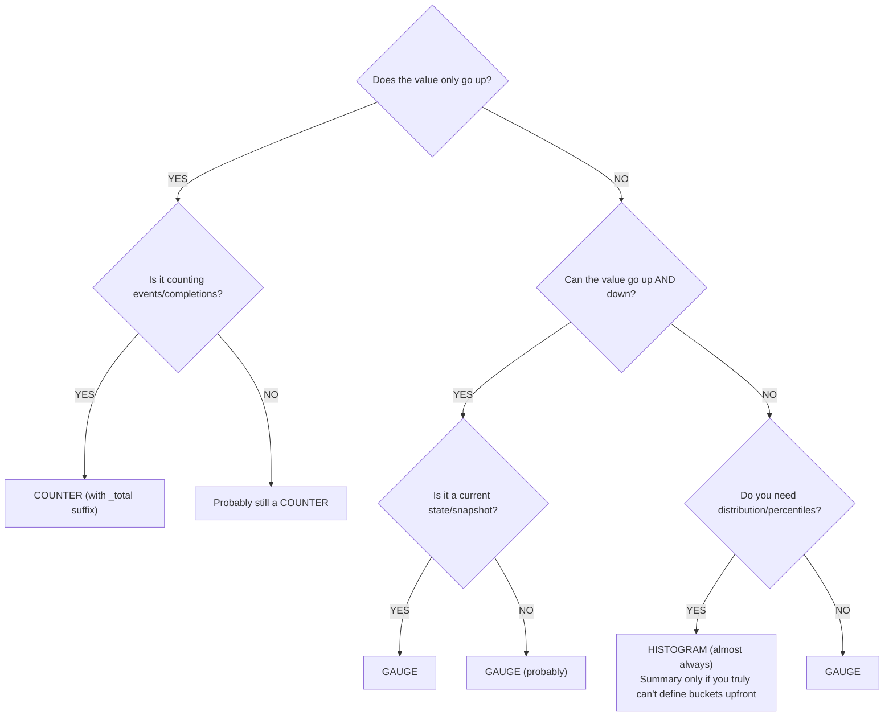
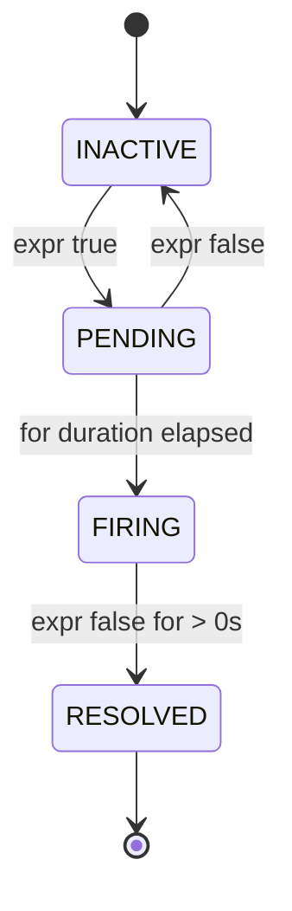
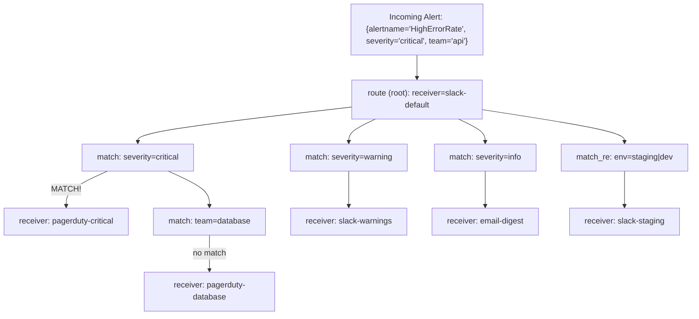
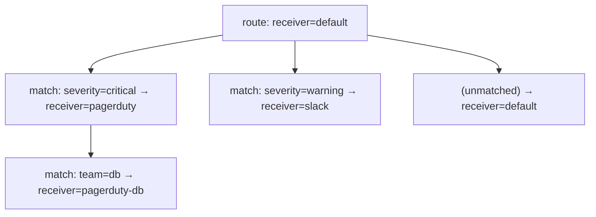

> **PCA Track** | Complexity: `[COMPLEX]` | Time: 45-55 min

## Prerequisites

Before starting this module:
- [Prometheus Module](/platform/toolkits/observability-intelligence/observability/module-1.1-prometheus/) — architecture, metric types, basic alerting
- [PromQL Deep Dive](../module-1.1-promql-deep-dive/) — query fundamentals
- [Observability 3.3: Instrumentation Principles](/platform/foundations/observability-theory/module-3.3-instrumentation-principles/)
- Basic Go, Python, or Java knowledge (for client library examples)

---

## Learning Outcomes

After completing this module, you will be able to:

1. **Implement** application instrumentation using Prometheus client libraries, selecting the correct metric type (counter, gauge, histogram, summary) for distinct telemetry signals.
2. **Design** metric naming schemas and label taxonomies that enforce cardinality boundaries and adhere strictly to OpenMetrics standards.
3. **Evaluate** alerting rules utilizing appropriate `for` durations and severity routing to minimize false positives during transient infrastructure spikes.
4. **Diagnose** notification routing topologies within Alertmanager to ensure critical pages reach on-call responders while informational alerts route asynchronously.

---

## Why This Module Matters

A team can ship a custom latency metric that looks fine in development but later causes serious problems because its name and unit do not follow Prometheus naming conventions. 

Later, another team tried to combine that database latency metric with an existing HTTP latency metric in a shared SLO dashboard, assuming the units were compatible:

```promql
histogram_quantile(0.99,
  sum by (le)(rate(http_request_duration_seconds_bucket[5m]))
)
+
histogram_quantile(0.99,
  sum by (le)(rate(db_query_duration_milliseconds_bucket[5m]))
)
```

A unit mismatch like this can make a latency dashboard report nonsense values, trigger bad operational decisions, and take time to diagnose. The underlying problem is simple: one metric is in seconds while the other is in milliseconds. The math still runs, but the result is operationally meaningless. 

A metric naming and unit mistake can impose real operational cleanup costs because dashboards, alerts, and deployments may all depend on the old metric. Prometheus naming conventions exist to reduce that risk. Instrumentation and alerting are also core practical skills for operating a reliable observability stack.

---

## Did You Know?

- Prometheus has official client libraries for several major languages and a large ecosystem of third-party libraries.
- The widely used `node_exporter` exposes a wide variety of host metrics on Linux systems, including CPU, memory, filesystem, and network measurements.
- Alertmanager uses a hierarchical routing tree so one configuration can route alerts to different receivers based on labels.
- For OpenMetrics 1.0 compatibility, counter sample names use the `_total` suffix.

---

## The Four Metric Types

Every piece of data stored in Prometheus begins as one of four fundamental metric types. Choosing the correct type is the most critical decision you will make when instrumenting code.

### Counter

A counter is a cumulative metric that represents a single monotonically increasing value. Think of a counter like the odometer in your car; it only goes up, and it only resets to zero if the engine is completely replaced (or the pod restarts). 

```text
COUNTER: Monotonically increasing value
──────────────────────────────────────────────────────────────

Value over time:
  0 → 1 → 5 → 12 → 30 → 0 → 3 → 15 → 28
                          ↑
                     restart/reset

USE WHEN:
  [YES] Counting events (requests, errors, bytes sent)
  [YES] Counting completions (jobs finished, items processed)
  [YES] Anything that only goes up during normal operation

DON'T USE WHEN:
  [NO] Value can decrease (temperature, queue size)
  [NO] Value represents current state (active connections)

ALWAYS QUERY WITH rate() or increase():
  rate(http_requests_total[5m])      ← per-second rate
  increase(http_requests_total[1h])  ← total in last hour
```

### Gauge

A gauge is a metric that represents a single numerical value that can arbitrarily go up and down. Think of a gauge like the speedometer in your car; it tells you exactly what is happening right this second, but without historical context, you cannot determine how far you have traveled.

```text
GAUGE: Current value that can increase or decrease
──────────────────────────────────────────────────────────────

Value over time:
  42 → 38 → 55 → 71 → 63 → 48 → 52

USE WHEN:
  [YES] Current state (temperature, queue depth, active connections)
  [YES] Snapshots (memory usage, disk space, goroutine count)
  [YES] Values that go up AND down

DON'T USE WHEN:
  [NO] Counting events (use Counter)
  [NO] Measuring distributions (use Histogram)

QUERY DIRECTLY (no rate needed):
  node_memory_MemAvailable_bytes     ← current available memory
  kube_deployment_spec_replicas      ← desired replica count
```

### Histogram

A histogram samples individual observations (usually things like request durations or response sizes) and counts them in configurable buckets. Histograms are the backbone of latency measurement and Service Level Objectives.

```text
HISTOGRAM: Distribution of values in buckets
──────────────────────────────────────────────────────────────

Generates 3 types of series:
  metric_bucket{le="0.1"}   = 24054    ← cumulative count ≤ 0.1s
  metric_bucket{le="0.5"}   = 129389   ← cumulative count ≤ 0.5s
  metric_bucket{le="+Inf"}  = 144927   ← total count (all observations)
  metric_sum                 = 53423.4  ← sum of all observed values
  metric_count               = 144927   ← total number of observations

USE WHEN:
  [YES] Request latency (the primary use case)
  [YES] Response sizes
  [YES] Any distribution where you need percentiles
  [YES] SLO calculations (bucket at your SLO target)

ADVANTAGES:
  [YES] Aggregatable across instances (can sum buckets)
  [YES] Can calculate any percentile after the fact
  [YES] Can compute average (sum / count)

TRADE-OFFS:
  [NO] Fixed bucket boundaries chosen at instrumentation time
  [NO] Each bucket is a separate time series (cardinality cost)
  [NO] Percentile accuracy depends on bucket granularity
```

### Summary

Summaries, like histograms, calculate distributions of observed events. However, summaries calculate streaming quantiles directly on the client side rather than relying on server-side Prometheus calculations. 

```text
SUMMARY: [Client-computed quantiles](https://prometheus.io/docs/practices/histograms/)
──────────────────────────────────────────────────────────────

Generates series like:
  metric{quantile="0.5"}   = 0.042    ← median
  metric{quantile="0.9"}   = 0.087    ← P90
  metric{quantile="0.99"}  = 0.235    ← P99
  metric_sum                = 53423.4  ← sum of all observed values
  metric_count              = 144927   ← total number of observations

USE WHEN:
  [YES] You need exact quantiles from a single instance
  [YES] You can't choose histogram bucket boundaries upfront
  [YES] Streaming quantile algorithms are acceptable

DON'T USE WHEN (most of the time):
  [NO] You need to aggregate across instances
     (cannot add quantiles meaningfully!)
  [NO] You need flexible percentile calculation at query time
  [NO] You need SLO calculations

Prefer histograms for most distributed-service latency and SLO use cases; use summaries only when you specifically need client-side quantiles.
```

### Decision Framework: Which Type?

Choosing a metric type shouldn't be guesswork. Use the following logical tree when writing your instrumentation code.



```text
CHOOSING A METRIC TYPE
──────────────────────────────────────────────────────────────

Does the value only go up?
├── YES → Is it counting events/completions?
│         ├── YES → COUNTER (with _total suffix)
│         └── NO  → Probably still a COUNTER
└── NO  → Can the value go up AND down?
          ├── YES → Is it a current state/snapshot?
          │         ├── YES → GAUGE
          │         └── NO  → GAUGE (probably)
          └── Do you need distribution/percentiles?
                    ├── YES → HISTOGRAM (almost always)
                    │         └── Summary only if you truly
                    │             can't define buckets upfront
                    └── NO  → GAUGE
```

> **Pause and predict**: If you need to track the number of items currently sitting in a Redis processing queue, which metric type must you use? A Counter or a Gauge? 
> *Think about whether a queue depth can ever go down.*

---

## Client Library Instrumentation

Exposing metrics from your application requires utilizing a Prometheus client library. These libraries handle the complex threading and performance optimizations required to track thousands of events per second without slowing down your core business logic. 

### Go (Reference Implementation)

```go
package main

import (
    "net/http"
    "time"

    "github.com/prometheus/client_golang/prometheus"
    "github.com/prometheus/client_golang/prometheus/promauto"
    "github.com/prometheus/client_golang/prometheus/promhttp"
)

var (
    // Counter: total HTTP requests
    httpRequestsTotal = promauto.NewCounterVec(
        prometheus.CounterOpts{
            Name: "myapp_http_requests_total",
            Help: "Total number of HTTP requests.",
        },
        []string{"method", "status", "path"},
    )

    // Histogram: request latency
    httpRequestDuration = promauto.NewHistogramVec(
        prometheus.HistogramOpts{
            Name:    "myapp_http_request_duration_seconds",
            Help:    "HTTP request latency in seconds.",
            Buckets: []float64{.005, .01, .025, .05, .1, .25, .5, 1, 2.5, 5},
        },
        []string{"method", "path"},
    )

    // Gauge: active connections
    activeConnections = promauto.NewGauge(
        prometheus.GaugeOpts{
            Name: "myapp_active_connections",
            Help: "Number of currently active connections.",
        },
    )
)

func handler(w http.ResponseWriter, r *http.Request) {
    start := time.Now()
    activeConnections.Inc()
    defer activeConnections.Dec()

    // ... handle request ...
    w.WriteHeader(http.StatusOK)

    duration := time.Since(start).Seconds()
    httpRequestsTotal.WithLabelValues(r.Method, "200", r.URL.Path).Inc()
    httpRequestDuration.WithLabelValues(r.Method, r.URL.Path).Observe(duration)
}

func main() {
    http.HandleFunc("/", handler)
    http.Handle("/metrics", promhttp.Handler())
    http.ListenAndServe(":8080", nil)
}
```

### Python

```python
from prometheus_client import Counter, Histogram, Gauge, start_http_server
import time

# Counter: total HTTP requests
REQUEST_COUNT = Counter(
    'myapp_http_requests_total',
    'Total number of HTTP requests.',
    ['method', 'status', 'path']
)

# Histogram: request latency
REQUEST_LATENCY = Histogram(
    'myapp_http_request_duration_seconds',
    'HTTP request latency in seconds.',
    ['method', 'path'],
    buckets=[.005, .01, .025, .05, .1, .25, .5, 1, 2.5, 5]
)

# Gauge: active connections
ACTIVE_CONNECTIONS = Gauge(
    'myapp_active_connections',
    'Number of currently active connections.'
)

def handle_request(method, path):
    ACTIVE_CONNECTIONS.inc()
    start = time.time()

    # ... handle request ...
    status = "200"

    duration = time.time() - start
    REQUEST_COUNT.labels(method=method, status=status, path=path).inc()
    REQUEST_LATENCY.labels(method=method, path=path).observe(duration)
    ACTIVE_CONNECTIONS.dec()

# Start metrics server on port 8000
start_http_server(8000)

# For Flask/FastAPI, use middleware instead:
# from prometheus_flask_instrumentator import Instrumentator
# Instrumentator().instrument(app).expose(app)
```

### Java (Micrometer / simpleclient)

```java
import io.prometheus.client.Counter;
import io.prometheus.client.Histogram;
import io.prometheus.client.Gauge;
import io.prometheus.client.exporter.HTTPServer;

public class MyApp {
    // Counter: total HTTP requests
    static final Counter requestsTotal = Counter.build()
        .name("myapp_http_requests_total")
        .help("Total number of HTTP requests.")
        .labelNames("method", "status", "path")
        .register();

    // Histogram: request latency
    static final Histogram requestDuration = Histogram.build()
        .name("myapp_http_request_duration_seconds")
        .help("HTTP request latency in seconds.")
        .labelNames("method", "path")
        .buckets(.005, .01, .025, .05, .1, .25, .5, 1, 2.5, 5)
        .register();

    // Gauge: active connections
    static final Gauge activeConnections = Gauge.build()
        .name("myapp_active_connections")
        .help("Number of currently active connections.")
        .register();

    public void handleRequest(String method, String path) {
        activeConnections.inc();
        Histogram.Timer timer = requestDuration
            .labels(method, path)
            .startTimer();

        try {
            // ... handle request ...
            requestsTotal.labels(method, "200", path).inc();
        } finally {
            timer.observeDuration();
            activeConnections.dec();
        }
    }

    public static void main(String[] args) throws Exception {
        // Expose metrics on port 8000
        HTTPServer server = new HTTPServer(8000);
    }
}
```

---

## Metric Naming Conventions

### The Rules

Metric names should describe exactly what is being measured using a standardized schema. This creates predictability across massive organizations.

```text
PROMETHEUS NAMING CONVENTION
──────────────────────────────────────────────────────────────

Format: <namespace>_<name>_<unit>_<suffix>

namespace  = application or library name (myapp, http, node)
name       = what is being measured (requests, duration, size)
unit       = [base unit (seconds, bytes, meters — NEVER milli/kilo)](https://prometheus.io/docs/practices/naming/)
suffix     = metric type indicator ([_total for counters, _info for info](https://prometheus.io/docs/specs/om/open_metrics_spec/))

GOOD:
  myapp_http_requests_total              ← counter, counts requests
  myapp_http_request_duration_seconds    ← histogram, duration in seconds
  myapp_http_response_size_bytes         ← histogram, size in bytes
  node_memory_MemAvailable_bytes         ← gauge, memory in bytes
  process_cpu_seconds_total              ← counter, CPU time in seconds

BAD:
  myapp_requests                         ← missing unit, missing _total
  http_request_duration_milliseconds     ← use seconds, not milliseconds
  db_query_time_ms                       ← abbreviation, non-base unit
  MyApp_HTTP_Requests                    ← camelCase/PascalCase, use snake_case
  request_latency                        ← vague, missing namespace and unit
```

### Unit Rules

| Measurement | Base Unit | Suffix | Example |
|-------------|-----------|--------|---------|
| Time/Duration | seconds | `_seconds` | `http_request_duration_seconds` |
| Data size | bytes | `_bytes` | `http_response_size_bytes` |
| Temperature | celsius | `_celsius` | `room_temperature_celsius` |
| Voltage | volts | `_volts` | `power_supply_volts` |
| Energy | joules | `_joules` | `cpu_energy_joules` |
| Weight | grams | `_grams` | `package_weight_grams` |
| Ratios | ratio | `_ratio` | `cache_hit_ratio` |
| Percentages | ratio (0-1) | `_ratio` | Use 0-1, not 0-100 |

### Suffix Rules

| Type | Suffix | Example |
|------|--------|---------|
| Counter | `_total` | `http_requests_total` |
| Counter (created timestamp) | `_created` | `http_requests_created` |
| Histogram | `_bucket`, `_sum`, `_count` | `http_request_duration_seconds_bucket` |
| Summary | `_sum`, `_count` | `rpc_duration_seconds_sum` |
| Info metric | `_info` | `build_info{version="1.2.3"}` |
| Gauge | (no suffix) | `node_memory_MemAvailable_bytes` |

### Label Best Practices

Adding labels to metrics allows for deep dimensionality, but there is a hidden cost. [Every unique combination of labels creates an entirely new time series stored in the Prometheus memory TSDB](https://prometheus.io/docs/practices/naming/). While exact cardinality limits depend on your infrastructure's available memory, a general industry guideline warns against allowing unbounded cardinality vectors.

```text
LABEL DO'S AND DON'TS
──────────────────────────────────────────────────────────────

DO:
  [YES] Use labels for dimensions you'll filter/aggregate by
  [YES] Keep cardinality bounded (status codes: ~5 values)
  [YES] Use consistent names: "method" not "http_method" in one
    place and "request_method" in another

DON'T:
  [NO] user_id (millions of values = millions of series)
  [NO] request_id (unbounded, every request creates a series)
  [NO] email (PII + unbounded cardinality)
  [NO] url with path parameters (/users/12345 = unique per user)
  [NO] error_message (free-form text = unbounded)
  [NO] timestamp as label (infinite cardinality)

RULE OF THUMB:
  If a label can take many distinct values or grow without a clear bound,
  it probably shouldn't be a label.
  Each unique label combination = one time series in memory.
```

---

## Exporters

For software you do not directly control (like the Linux kernel, MySQL, or Nginx), you cannot inject client libraries. Instead, you deploy "exporters"—small sidecar applications that read native metrics and translate them into the Prometheus OpenMetrics format.

### node_exporter (Hardware & OS Metrics)

```bash
# Install via binary
wget https://github.com/prometheus/node_exporter/releases/download/v1.8.1/node_exporter-1.8.1.linux-amd64.tar.gz
tar xvfz node_exporter-*.tar.gz
./node_exporter

# Or via Kubernetes DaemonSet (kube-prometheus-stack includes it)
helm install monitoring prometheus-community/kube-prometheus-stack
```

**Key metrics from node_exporter:**

```promql
# CPU utilization
1 - avg by (instance)(rate(node_cpu_seconds_total{mode="idle"}[5m]))

# Memory utilization
1 - (node_memory_MemAvailable_bytes / node_memory_MemTotal_bytes)

# Disk space usage
1 - (node_filesystem_avail_bytes{mountpoint="/"} / node_filesystem_size_bytes{mountpoint="/"})

# Network throughput
rate(node_network_receive_bytes_total{device="eth0"}[5m])
rate(node_network_transmit_bytes_total{device="eth0"}[5m])

# Disk I/O
rate(node_disk_read_bytes_total[5m])
rate(node_disk_written_bytes_total[5m])
```

### blackbox_exporter (Probing)

The [`blackbox_exporter` probes external endpoints over HTTP, HTTPS, DNS, TCP, and ICMP](https://github.com/prometheus/blackbox_exporter). It is invaluable for observing synthetic user workflows and tracking external dependencies.

```yaml
# blackbox-exporter config
modules:
  http_2xx:
    prober: http
    timeout: 5s
    http:
      valid_http_versions: ["HTTP/1.1", "HTTP/2.0"]
      valid_status_codes: [200]
      follow_redirects: true

  http_post_2xx:
    prober: http
    http:
      method: POST

  tcp_connect:
    prober: tcp
    timeout: 5s

  dns_lookup:
    prober: dns
    dns:
      query_name: "kubernetes.default.svc.cluster.local"
      query_type: "A"

  icmp_ping:
    prober: icmp
    timeout: 5s
```

**Prometheus scrape config for blackbox_exporter:**

```yaml
scrape_configs:
  - job_name: 'blackbox-http'
    metrics_path: /probe
    params:
      module: [http_2xx]
    static_configs:
      - targets:
        - https://example.com
        - https://api.myservice.com/health
    relabel_configs:
      # Pass the target URL as a parameter
      - source_labels: [__address__]
        target_label: __param_target
      # Store original target as a label
      - source_labels: [__param_target]
        target_label: instance
      # Point to the blackbox exporter
      - target_label: __address__
        replacement: blackbox-exporter:9115
```

**Key blackbox metrics:**

```promql
# Is the endpoint up?
probe_success{job="blackbox-http"}

# SSL certificate expiry (days)
(probe_ssl_earliest_cert_expiry - time()) / 86400

# HTTP response time
probe_http_duration_seconds

# DNS lookup time
probe_dns_lookup_time_seconds
```

> **Stop and think**: If you rely on a third-party managed database that does not expose a metrics endpoint, how might you use `blackbox_exporter` to ensure it remains reachable from your application tier?

### Other Common Exporters

| Exporter | Purpose | Key Metrics |
|----------|---------|-------------|
| **mysqld_exporter** | MySQL databases | Queries/sec, connections, replication lag |
| **postgres_exporter** | PostgreSQL databases | Active connections, transaction rate, table sizes |
| **redis_exporter** | Redis | Commands/sec, memory usage, connected clients |
| **kafka_exporter** | Apache Kafka | Consumer lag, topic offsets, partition count |
| **nginx_exporter** | Nginx | Active connections, requests/sec, response codes |
| **kube-state-metrics** | Kubernetes objects | Pod status, deployment replicas, node conditions |
| **cadvisor** | Containers | CPU, memory, network per container |

---

## Alertmanager Deep Dive

Collecting metrics is only half the battle. When systems degrade, alerts must reliably route to human operators. Alertmanager handles deduplication, grouping, silencing, and routing of alerts generated by Prometheus.

### Alert Lifecycle

Alerts move through explicit states to prevent transient network hiccups from paging engineers.



```text
ALERT STATES
──────────────────────────────────────────────────────────────

  INACTIVE  ──→  PENDING  ──→  FIRING  ──→  RESOLVED
     ↑              │             │              │
     │              │             │              │
     │  expr false  │  for: 5m   │  expr false  │
     └──────────────┘  elapsed   │  for > 0s    │
                                 │              │
                                 └──────────────┘

INACTIVE: Alert expression evaluates to false. No action.

PENDING:  Alert expression evaluates to true.
          Waiting for ["for" duration to elapse](https://prometheus.io/docs/prometheus/latest/configuration/alerting_rules/).
          Won't fire yet — prevents noise from brief spikes.

FIRING:   Alert has been true for at least "for" duration.
          Sent to Alertmanager for routing and notification.

RESOLVED: Alert was firing, now expression is false.
          Alertmanager sends "resolved" notification.
```

### Alerting Rules

```yaml
groups:
  - name: application-alerts
    rules:
      # HIGH SEVERITY: Service completely down
      - alert: ServiceDown
        expr: up == 0
        for: 1m
        labels:
          severity: critical
          team: platform
        annotations:
          summary: "{{ $labels.job }} is down"
          description: "{{ $labels.instance }} has been unreachable for >1 minute."
          runbook_url: "https://wiki.example.com/runbooks/service-down"

      # HIGH SEVERITY: Error rate spike
      - alert: HighErrorRate
        expr: |
          sum by (service)(rate(http_requests_total{status=~"5.."}[5m]))
          /
          sum by (service)(rate(http_requests_total[5m]))
          > 0.05
        for: 5m
        labels:
          severity: critical
        annotations:
          summary: "High error rate on {{ $labels.service }}"
          description: "Error rate is {{ $value | humanizePercentage }}."

      # MEDIUM SEVERITY: Slow responses
      - alert: HighLatency
        expr: |
          histogram_quantile(0.99,
            sum by (le, service)(rate(http_request_duration_seconds_bucket[5m]))
          ) > 2
        for: 10m
        labels:
          severity: warning
        annotations:
          summary: "High P99 latency on {{ $labels.service }}"
          description: "P99 latency is {{ $value | humanizeDuration }}."

      # LOW SEVERITY: Certificate expiring
      - alert: SSLCertExpiringSoon
        expr: (probe_ssl_earliest_cert_expiry - time()) / 86400 < 30
        for: 1h
        labels:
          severity: warning
        annotations:
          summary: "SSL cert for {{ $labels.instance }} expires in {{ $value | humanize }} days"

      # CAPACITY: Disk filling up
      - alert: DiskSpaceLow
        expr: |
          (node_filesystem_avail_bytes{mountpoint="/"} / node_filesystem_size_bytes{mountpoint="/"})
          < 0.15
        for: 15m
        labels:
          severity: warning
        annotations:
          summary: "Disk space below 15% on {{ $labels.instance }}"

      # SLO-BASED: Error budget burn rate
      - alert: ErrorBudgetBurnRate
        expr: |
          job:http_error_ratio:rate5m > (14.4 * 0.001)
        for: 5m
        labels:
          severity: critical
        annotations:
          summary: "Error budget burning too fast for {{ $labels.job }}"
          description: "At current rate, error budget will be exhausted in <1 hour."
```

### Alertmanager Configuration

The configuration defines where alerts go. A single configuration handles everything from an informational email to an immediate PagerDuty call.

```yaml
# alertmanager.yml — complete production example
global:
  resolve_timeout: 5m
  smtp_smarthost: 'smtp.example.com:587'
  smtp_from: 'alertmanager@example.com'
  smtp_auth_username: 'alertmanager'
  smtp_auth_password: '<secret>'
  slack_api_url: 'https://hooks.slack.com/services/T00/B00/xxxx'
  pagerduty_url: 'https://events.pagerduty.com/v2/enqueue'

# TEMPLATES: customize notification format
templates:
  - '/etc/alertmanager/templates/*.tmpl'

# ROUTING TREE: determines where alerts go
route:
  # Default receiver for unmatched alerts
  receiver: 'slack-default'

  # Group alerts by these labels (reduces noise)
  group_by: ['alertname', 'service']

  # Wait before sending first notification for a group
  group_wait: 30s

  # Wait before sending updates to an existing group
  group_interval: 5m

  # Wait before re-sending a firing alert
  repeat_interval: 4h

  # Child routes (evaluated top-to-bottom, first match wins)
  routes:
    # Critical alerts → PagerDuty (wake someone up)
    - match:
        severity: critical
      receiver: 'pagerduty-critical'
      repeat_interval: 1h
      routes:
        # Database team owns DB alerts
        - match:
            team: database
          receiver: 'pagerduty-database'

    # Warning alerts → Slack channel
    - match:
        severity: warning
      receiver: 'slack-warnings'
      repeat_interval: 4h

    # Info alerts → email digest
    - match:
        severity: info
      receiver: 'email-digest'
      group_wait: 10m
      repeat_interval: 24h

    # Regex matching: any alert from staging
    - match_re:
        environment: staging|dev
      receiver: 'slack-staging'
      repeat_interval: 12h

# RECEIVERS: notification targets
receivers:
  - name: 'slack-default'
    slack_configs:
      - channel: '#alerts'
        send_resolved: true
        title: '{{ .Status | toUpper }}: {{ .CommonLabels.alertname }}'
        text: >-
          {{ range .Alerts }}
          *{{ .Labels.alertname }}* ({{ .Labels.severity }})
          {{ .Annotations.description }}
          {{ end }}

  - name: 'pagerduty-critical'
    pagerduty_configs:
      - routing_key: '<pagerduty-integration-key>'
        severity: critical
        description: '{{ .CommonLabels.alertname }}: {{ .CommonAnnotations.summary }}'

  - name: 'pagerduty-database'
    pagerduty_configs:
      - routing_key: '<database-team-key>'
        severity: critical

  - name: 'slack-warnings'
    slack_configs:
      - channel: '#alerts-warnings'
        send_resolved: true

  - name: 'slack-staging'
    slack_configs:
      - channel: '#alerts-staging'
        send_resolved: false

  - name: 'email-digest'
    email_configs:
      - to: 'team@example.com'
        send_resolved: false

# INHIBITION RULES: suppress dependent alerts
inhibit_rules:
  # If a critical alert fires, suppress warnings for the same service
  - source_match:
      severity: critical
    target_match:
      severity: warning
    equal: ['alertname', 'service']

  # If a node is down, suppress all pod alerts on that node
  - source_match:
      alertname: NodeDown
    target_match_re:
      alertname: Pod.*
    equal: ['node']

  # If cluster is unreachable, suppress everything
  - source_match:
      alertname: ClusterUnreachable
    target_match_re:
      alertname: .+
    equal: ['cluster']
```

### Routing Tree Visual

The alert routing mechanism operates logically as an evaluation tree.



```text
ALERTMANAGER ROUTING TREE
──────────────────────────────────────────────────────────────

Incoming Alert: {alertname="HighErrorRate", severity="critical", team="api"}

route (root):                          receiver: slack-default
├── match: severity=critical           receiver: pagerduty-critical  ← MATCH!
│   └── match: team=database           receiver: pagerduty-database  (no match)
├── match: severity=warning            receiver: slack-warnings
├── match: severity=info               receiver: email-digest
└── match_re: env=staging|dev          receiver: slack-staging

Result: Alert goes to pagerduty-critical (first matching child route)

NOTE: By default, [routing stops at first match](https://prometheus.io/docs/alerting/latest/configuration/).
      Add "continue: true" on a route to keep matching subsequent routes.
```

### Inhibition Rules Explained

Inhibition solves the problem of "alert storms" where a single root-cause failure (like a node crashing) triggers hundreds of downstream symptom alerts (like pods failing, services degrading, endpoints timing out).

```text
INHIBITION: Suppressing dependent alerts
──────────────────────────────────────────────────────────────

Scenario: Node goes down → all pods on that node fail

WITHOUT inhibition:
  Alert: NodeDown (node-1)              ← root cause
  Alert: PodCrashLooping (pod-a)        ← symptom
  Alert: PodCrashLooping (pod-b)        ← symptom
  Alert: PodCrashLooping (pod-c)        ← symptom
  Alert: HighErrorRate (service-x)      ← symptom
  = 5 pages for one problem!

WITH inhibition:
  inhibit_rules:
    - source_match: {alertname: NodeDown}
      target_match_re: {alertname: "Pod.*|HighErrorRate"}
      equal: [node]

  Alert: NodeDown (node-1)              ← only this fires
  (all dependent alerts suppressed)
  = 1 page for one problem!
```

### Silences

[Silences temporarily mute alerts during planned maintenance](https://prometheus.io/docs/alerting/latest/alertmanager/), preventing active paging while operators execute known risky updates.

```bash
# Create a silence via amtool CLI
amtool silence add \
  --alertmanager.url=http://localhost:9093 \
  --author="jane@example.com" \
  --comment="Planned database maintenance window" \
  --duration=2h \
  service="database" severity="warning"

# List active silences
amtool silence query --alertmanager.url=http://localhost:9093

# Expire (remove) a silence
amtool silence expire --alertmanager.url=http://localhost:9093 <silence-id>
```

### Recording Rules for Alerting

Evaluating massive histogram queries on every evaluation tick can crash a Prometheus server. Recording rules [pre-compute expensive expressions, saving them back as entirely new time series data](https://prometheus.io/docs/prometheus/latest/configuration/recording_rules/). Your alerting rules then evaluate the lightweight, pre-computed metrics.

```yaml
groups:
  - name: recording_rules
    interval: 30s
    rules:
      # Pre-compute error ratio per service
      - record: service:http_error_ratio:rate5m
        expr: |
          sum by (service)(rate(http_requests_total{status=~"5.."}[5m]))
          /
          sum by (service)(rate(http_requests_total[5m]))

      # Pre-compute P99 latency per service
      - record: service:http_latency_p99:rate5m
        expr: |
          histogram_quantile(0.99,
            sum by (le, service)(rate(http_request_duration_seconds_bucket[5m]))
          )

      # Pre-compute CPU utilization per node
      - record: node:cpu_utilization:ratio_rate5m
        expr: |
          1 - avg by (node)(rate(node_cpu_seconds_total{mode="idle"}[5m]))

  - name: alerting_rules
    rules:
      # NOW alerting rules can use the pre-computed values
      - alert: HighErrorRate
        expr: service:http_error_ratio:rate5m > 0.05
        for: 5m
        labels:
          severity: critical
        annotations:
          summary: "Error rate {{ $value | humanizePercentage }} on {{ $labels.service }}"

      - alert: HighLatency
        expr: service:http_latency_p99:rate5m > 2
        for: 10m
        labels:
          severity: warning

      - alert: HighCPU
        expr: node:cpu_utilization:ratio_rate5m > 0.9
        for: 15m
        labels:
          severity: warning
```

---

## Common Mistakes

| Mistake | Problem | Solution |
|---------|---------|----------|
| Using milliseconds for duration | Unit mismatch with other metrics | Always use base units: `_seconds`, not `_milliseconds` |
| Counter without `_total` suffix | Violates OpenMetrics standard | Always append `_total` to counter names |
| High-cardinality labels (user_id) | Memory explosion, slow queries | Remove unbounded labels; aggregate at application level |
| Missing `Help` text on metrics | Hard to understand; fails lint checks | Always add descriptive Help strings |
| Alerting without `for` duration | Flapping alerts from transient spikes | Use `for: 5m` minimum for most alerts |
| No inhibition rules | Alert storms during major incidents | Suppress symptoms when root-cause alert fires |
| Silencing without comments | Nobody knows why alerts were muted | Always add author, comment, and expiry |
| Summary instead of Histogram | Cannot aggregate across instances | Use Histogram unless you have a specific reason not to |
| Missing runbook_url in annotations | On-call engineer has no guidance | Always link to a runbook explaining diagnosis/fix |
| Too many receivers | Alert fatigue, nobody reads channels | Consolidate: critical → page, warning → Slack, info → email |

---

## Quiz

<details>
<summary>1. You are reviewing a pull request for a new microservice. The developer used a Summary metric to track latency across 50 container replicas. Evaluate this implementation choice: What are the four types, and what architectural feedback do you provide?</summary>

**Answer**:

1. **Counter**: Monotonically increasing value. Resets on restart.
   - Example: `http_requests_total` — total HTTP requests served

2. **Gauge**: Value that can go up and down.
   - Example: `node_memory_MemAvailable_bytes` — currently available memory

3. **Histogram**: Observations bucketed by value, with cumulative counts.
   - Example: `http_request_duration_seconds` — request latency distribution

4. **Summary**: Client-computed streaming quantiles.
   - Example: `go_gc_duration_seconds` — garbage collection pause duration with pre-computed percentiles

Feedback: You must reject the PR. Summaries compute exact quantiles natively in the application memory. Because of this, it is mathematically impossible to aggregate Summary percentiles across 50 instances. The developer must refactor to use a Histogram, which allows aggregation (summing buckets) across all replicas to calculate a true global percentile.
</details>

<details>
<summary>2. Your team lead proposes standardizing all system duration metrics to milliseconds because "it makes the Grafana dashboards easier for junior engineers to read natively." Why does Prometheus strongly advise against this?</summary>

**Answer**:

Base units prevent catastrophic unit mismatch errors when combining telemetry from disparate systems. If one team uses `_milliseconds` and another uses `_seconds`, joining or adding these metrics produces nonsensical results that break automated scaling and SLO calculations.

Specific reasons:
- **Consistency**: All duration metrics are in seconds, so `rate(a_seconds[5m]) + rate(b_seconds[5m])` works when the metrics are otherwise compatible
- **PromQL functions**: `histogram_quantile()` returns values in the metric's unit — if metrics are in seconds, the result is in seconds
- **Grafana handles display**: Grafana natively converts seconds to "2.5ms" or "1.3h" for human display automatically. You should store raw data in base units, formatting strictly at display time.
- **OpenMetrics standard**: Requires base units for interoperability across tools

The foundational rule is: **store in base units, display in human units**.
</details>

<details>
<summary>3. During an incident response, an alert fires but routes to the default email digest instead of triggering the DBA team pager. Based on the routing tree snippet below, analyze how Alertmanager processes routing decisions.</summary>



```text
route: receiver=default
├── match: severity=critical → receiver=pagerduty
│   └── match: team=db → receiver=pagerduty-db
├── match: severity=warning → receiver=slack
└── (unmatched) → receiver=default
```

**Answer**:

The routing tree acts as a top-to-bottom evaluation hierarchy:

1. **Every alert enters at the root route** (the top-level `route:` configuration).
2. **Child routes are evaluated top-to-bottom** — the first matching sibling child terminates evaluation and wins the route.
3. **Matching utilizes `match` (exact string match) or `match_re` (regular expressions)** against the alert's assigned labels.
4. **If no child configuration matches**, the alert safely falls back to the root route's default receiver (in this case, the email digest).
5. **If `continue: true`** is specified on a route, Alertmanager ignores the termination rule and continues checking subsequent sibling routes.
6. **Child routes can possess deep children** — this nesting allows fine-grained team routing. 

To fix the missing DBA page, ensure the alert is labeled strictly with `severity=critical` and `team=db`.

`group_by`, `group_wait`, `group_interval`, and `repeat_interval` control batching:
- `group_by`: Labels to group alerts by (reduces notification count)
- `group_wait`: How long to buffer before sending the first notification
- `group_interval`: Minimum time between updates to a group
- `repeat_interval`: How often to re-send a firing alert
</details>

<details>
<summary>4. A massive underlying node failure causes 50 distinct application Pod alerts and 1 core Node alert to trigger simultaneously. Differentiate between inhibition and silencing, and identify which solves this pager storm.</summary>

**Answer**:

**Inhibition** (automatic, rule-based):
- Suppresses target alerts when a source alert is concurrently firing.
- Configured durably in `inhibit_rules` within `alertmanager.yml`.
- Happens autonomously — requiring absolutely zero human intervention.
- Example: The NodeDown rule inhibits all downstream PodCrashLooping alerts originating on that specific node.
- Purpose: Prevent alert storms caused by massive cascading dependency failures.

**Silencing** (manual, time-based):
- Temporarily mutes alerts matching explicit label permutations.
- Created dynamically via the Alertmanager UI or the `amtool` CLI.
- Demands human action — a responder deliberately decides to mute the system.
- Enforces a strictly defined expiration timeframe.
- Example: Silence all noisy alerts matching `service="database"` during a planned schema migration maintenance window.
- Purpose: Suppress expected noise during active manual operational tasks.

Key difference: Inhibition solves the pager storm by intelligently recognizing dependency mapping (Node down = Pods down). Silencing is a blunt, manual override for human operators executing planned work.
</details>

<details>
<summary>5. You are architecting the instrumentation for a new logistics microservice. The service consists of a synchronous HTTP API for client communication and an asynchronous background job processing queue. Design the required metrics, explicitly selecting the types and naming schemas.</summary>

**Answer**:

**HTTP API metrics:**
```text
myservice_http_requests_total{method, status, path}        — Counter
myservice_http_request_duration_seconds{method, path}      — Histogram
myservice_http_request_size_bytes{method, path}            — Histogram
myservice_http_response_size_bytes{method, path}           — Histogram
myservice_http_active_requests{method}                     — Gauge
```

**Background job metrics:**
```text
myservice_jobs_processed_total{queue, status}              — Counter
myservice_job_duration_seconds{queue}                      — Histogram
myservice_jobs_queued{queue}                               — Gauge (current queue depth)
myservice_job_last_success_timestamp_seconds{queue}        — Gauge
```

**Runtime metrics (auto-exposed by most client libraries):**
```text
process_cpu_seconds_total                                  — Counter
process_resident_memory_bytes                              — Gauge
go_goroutines (if Go)                                      — Gauge
```

Design decisions:
- `path` label should map directly to parameterized route patterns (e.g., `/users/{id}`), not raw external paths (e.g., `/users/12345`). Raw paths create catastrophic cardinality explosions.
- Histogram buckets for HTTP API latency should map tightly to typical human-scale interactions: `[.005, .01, .025, .05, .1, .25, .5, 1, 2.5, 5]`.
- Histogram buckets for background jobs should map to massive systemic asynchronous boundaries: `[.1, .5, 1, 5, 10, 30, 60, 300]` (jobs are typically much slower).
</details>

<details>
<summary>6. On-call engineers are experiencing severe burnout because their pagers trigger repeatedly for 10-second CPU utilization spikes that immediately self-resolve. Evaluate the purpose of the `for` field within an alerting rule, and explain the architectural impact of omitting it.</summary>

**Answer**:

The `for` field acts as an explicit debouncing mechanism, specifying exactly how long a raw alert expression must be continuously true before the system promotes the alert state from **pending** to formally **firing**.

```yaml
- alert: HighErrorRate
  expr: error_rate > 0.05
  for: 5m        # Must be true for 5 minutes before firing
```

**Without `for`** (or implicitly `for: 0s`):
- The alert triggers and dispatches to Alertmanager the precise second the PromQL expression evaluates to true.
- If the next scrape cycle evaluates to false, the system immediately resolves the alert.
- This creates systemic **alert flapping**: brief, harmless infrastructure spikes trigger and resolve notifications rapidly.
- Human engineers are maliciously paged for transient conditions that resolve themselves before a laptop can even be opened.

**With `for: 5m`**:
- Brief telemetry spikes (lasting under 5 minutes) are held in a pending state and quietly ignored when they drop below the threshold.
- Only sustained, actionable degradation triggers human notifications.
- This drastically reduces false positives and preserves on-call sanity.

**Guidelines**:
- `for: 1m` — Critical infrastructure binary alerts (e.g., ServiceDown, NodeOffline)
- `for: 5m` — Volatile throughput and latency errors
- `for: 15m` — Gradual capacity degradation
- `for: 1h` — Slow-burn proactive warnings (e.g., expiring TLS certificates, projected disk volume exhaustion)
</details>

---

## Hands-On Exercise: Instrument, Export, Alert

In this exercise, you will establish a complete observability loop: instrument a raw application, deploy it, enforce scraping via a ServiceMonitor, and validate triggering alert rules.

### Task 1: Environment Setup

Spin up a clean environment and initialize the Prometheus stack. Ensure you are targeting a v1.35+ Kubernetes environment.

```bash
# Ensure you have a cluster with Prometheus
# (Use the setup from Module 1's hands-on, or:)
kind create cluster --name pca-lab
helm repo add prometheus-community https://prometheus-community.github.io/helm-charts
helm repo update
helm install monitoring prometheus-community/kube-prometheus-stack \
  --namespace monitoring --create-namespace
```

### Task 2: Deploy an Instrumented Application

Deploy a custom Python application utilizing native Prometheus client libraries. Note that this file contains a `ConfigMap`, a `Deployment`, and a `Service` separated by standard YAML document boundaries (`---`).

```yaml
# instrumented-app.yaml
apiVersion: v1
kind: ConfigMap
metadata:
  name: app-code
  namespace: monitoring
data:
  app.py: |
    from prometheus_client import Counter, Histogram, Gauge, start_http_server
    import random, time, threading

    REQUESTS = Counter('myapp_http_requests_total', 'Total HTTP requests', ['method', 'status'])
    LATENCY = Histogram('myapp_http_request_duration_seconds', 'Request latency',
                        buckets=[.01, .025, .05, .1, .25, .5, 1, 2.5, 5])
    QUEUE_SIZE = Gauge('myapp_queue_size', 'Current items in queue')
    JOBS = Counter('myapp_jobs_processed_total', 'Jobs processed', ['status'])

    def simulate_traffic():
        while True:
            method = random.choice(['GET', 'GET', 'GET', 'POST', 'PUT'])
            latency = random.expovariate(10)  # ~100ms average
            status = '200' if random.random() > 0.03 else '500'
            REQUESTS.labels(method=method, status=status).inc()
            LATENCY.observe(latency)
            time.sleep(0.1)

    def simulate_queue():
        while True:
            QUEUE_SIZE.set(random.randint(0, 50))
            if random.random() > 0.1:
                JOBS.labels(status='success').inc()
            else:
                JOBS.labels(status='failure').inc()
            time.sleep(1)

    if __name__ == '__main__':
        start_http_server(8000)
        threading.Thread(target=simulate_traffic, daemon=True).start()
        threading.Thread(target=simulate_queue, daemon=True).start()
        print("Metrics server running on :8000")
        while True:
            time.sleep(1)

---
apiVersion: apps/v1
kind: Deployment
metadata:
  name: instrumented-app
  namespace: monitoring
spec:
  replicas: 2
  selector:
    matchLabels:
      app: instrumented-app
  template:
    metadata:
      labels:
        app: instrumented-app
    spec:
      containers:
        - name: app
          image: python:3.11-slim
          command: ["sh", "-c", "pip install prometheus_client && python /app/app.py"]
          ports:
            - containerPort: 8000
              name: metrics
          volumeMounts:
            - name: code
              mountPath: /app
      volumes:
        - name: code
          configMap:
            name: app-code

---
apiVersion: v1
kind: Service
metadata:
  name: instrumented-app
  namespace: monitoring
  labels:
    app: instrumented-app
spec:
  selector:
    app: instrumented-app
  ports:
    - port: 8000
      targetPort: 8000
      name: metrics
```

```bash
kubectl apply -f instrumented-app.yaml
```

### Task 3: Establish the ServiceMonitor

Create the `ServiceMonitor` Custom Resource. The Prometheus operator will automatically detect this and reconfigure its scraping loop dynamically.

```yaml
# servicemonitor.yaml
apiVersion: monitoring.coreos.com/v1
kind: ServiceMonitor
metadata:
  name: instrumented-app
  namespace: monitoring
  labels:
    release: monitoring  # Must match Prometheus selector
spec:
  selector:
    matchLabels:
      app: instrumented-app
  endpoints:
    - port: metrics
      interval: 15s
      path: /metrics
```

```bash
kubectl apply -f servicemonitor.yaml
```

### Task 4: Validate Data Ingestion

Execute a port-forward directly to the Prometheus UI to validate the ingestion stream.

```bash
# Port-forward to Prometheus
kubectl port-forward -n monitoring svc/monitoring-kube-prometheus-prometheus 9090:9090
```

Open your browser to `http://localhost:9090/targets` to confirm `instrumented-app` appears in the target inventory. Proceed to the query tab and execute the following verifications:

```promql
# Verify metrics are flowing
myapp_http_requests_total

# Request rate
rate(myapp_http_requests_total[5m])

# Error rate
sum(rate(myapp_http_requests_total{status="500"}[5m]))
/ sum(rate(myapp_http_requests_total[5m]))

# P99 latency
histogram_quantile(0.99, sum by (le)(rate(myapp_http_request_duration_seconds_bucket[5m])))

# Queue depth
myapp_queue_size
```

### Task 5: Configure Alert Rules

Inject the rule topology that leverages the ingested metrics. 

```yaml
# alerting-rules.yaml
apiVersion: monitoring.coreos.com/v1
kind: PrometheusRule
metadata:
  name: instrumented-app-alerts
  namespace: monitoring
  labels:
    release: monitoring
spec:
  groups:
    - name: instrumented-app
      rules:
        - alert: MyAppHighErrorRate
          expr: |
            sum(rate(myapp_http_requests_total{status=~"5.."}[5m]))
            / sum(rate(myapp_http_requests_total[5m]))
            > 0.05
          for: 2m
          labels:
            severity: warning
          annotations:
            summary: "High error rate on instrumented-app"
            description: "Error rate is {{ $value | humanizePercentage }}"

        - alert: MyAppHighLatency
          expr: |
            histogram_quantile(0.99,
              sum by (le)(rate(myapp_http_request_duration_seconds_bucket[5m]))
            ) > 1
          for: 5m
          labels:
            severity: warning
          annotations:
            summary: "High P99 latency on instrumented-app"

        - record: myapp:http_error_ratio:rate5m
          expr: |
            sum(rate(myapp_http_requests_total{status=~"5.."}[5m]))
            / sum(rate(myapp_http_requests_total[5m]))
```

```bash
kubectl apply -f alerting-rules.yaml
```

Navigate to `http://localhost:9090/alerts` to confirm the rules engine has indexed the files. Because the simulation script incorporates random failures, you will eventually witness the `MyAppHighErrorRate` traverse from the `Inactive` to `Pending` state.

### Success Checklist

You have mastered this practical exercise when you can successfully verify:
- [ ] You observe custom `myapp_*` metrics actively indexing in Prometheus.
- [ ] You can flawlessly run PromQL queries computing rates and generating P99 latency distributions.
- [ ] The `ServiceMonitor` status under Targets shows a healthy `UP` state.
- [ ] Alert rules display accurately inside the Prometheus alerting interface.
- [ ] The custom recording rule `myapp:http_error_ratio:rate5m` reliably pre-computes data.
- [ ] You understand the structural layout and distinct data footprints of the Counter, Gauge, and Histogram code provided in the application.

---

## Next Module

Now that you have learned to natively instrument code and orchestrate alert routing, the next step is visualizing that complex data structure. In **[Module 1.3: Grafana Dashboarding](/platform/toolkits/observability-intelligence/observability/module-1.3-grafana/)**, we dive into translating raw TSDB metrics into compelling visual interfaces that non-engineers can rely on.

---

## Key Links
- [Prometheus Module](/platform/toolkits/observability-intelligence/observability/module-1.1-prometheus/)
- [PromQL Deep Dive](../module-1.1-promql-deep-dive/)
- [Observability 3.3: Instrumentation Principles](/platform/foundations/observability-theory/module-3.3-instrumentation-principles/)
- [Prometheus Client Libraries](https://prometheus.io/docs/instrumenting/clientlibs/)
- [Writing Exporters](https://prometheus.io/docs/instrumenting/writing_exporters/)
- [Alertmanager Configuration](https://prometheus.io/docs/alerting/latest/configuration/)
- [Instrumentation Best Practices](https://prometheus.io/docs/practices/instrumentation/)
- [Metric and Label Naming](https://prometheus.io/docs/practices/naming/)
- [Prometheus Fundamentals](/platform/toolkits/observability-intelligence/observability/module-1.1-prometheus/)
- [Grafana](/platform/toolkits/observability-intelligence/observability/module-1.3-grafana/)

## Sources

- [Prometheus Metric Types](https://prometheus.io/docs/concepts/metric_types/) — Primary reference for counter, gauge, histogram, and summary semantics.
- [Histograms and Summaries](https://prometheus.io/docs/practices/histograms/) — Explains client-side quantiles, bucketed observations, and histogram aggregation tradeoffs.
- [Metric and Label Naming](https://prometheus.io/docs/practices/naming/) — Covers base units, naming structure, and label-cardinality guidance.
- [OpenMetrics Specification](https://prometheus.io/docs/specs/om/open_metrics_spec/) — Defines canonical suffix conventions for counters, info metrics, histograms, and summaries.
- [blackbox_exporter](https://github.com/prometheus/blackbox_exporter) — Upstream documentation for supported probe protocols and exporter behavior.
- [Prometheus Alerting Rules](https://prometheus.io/docs/prometheus/latest/configuration/alerting_rules/) — Documents alert expressions and how the `for` clause delays firing.
- [Alertmanager Configuration](https://prometheus.io/docs/alerting/latest/configuration/) — Describes routing trees, match evaluation, batching timers, and receiver setup.
- [Alertmanager Overview](https://prometheus.io/docs/alerting/latest/alertmanager/) — Explains silences, inhibition, grouping, and notification flow.
- [Prometheus Recording Rules](https://prometheus.io/docs/prometheus/latest/configuration/recording_rules/) — Describes precomputing expressions into new series for faster later queries.
