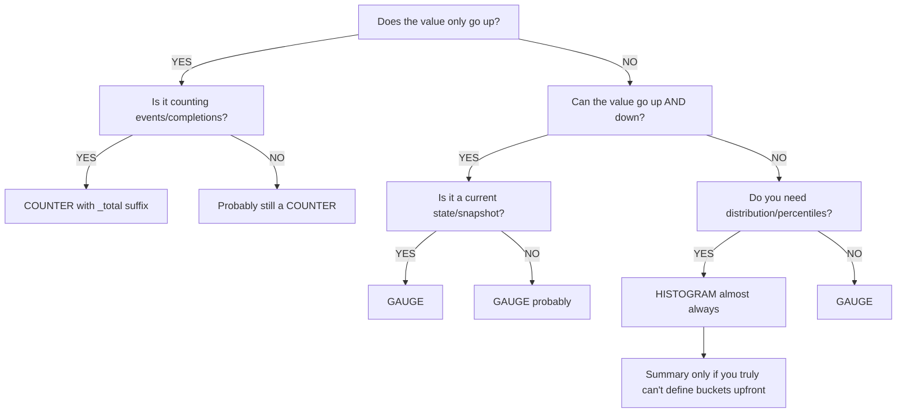
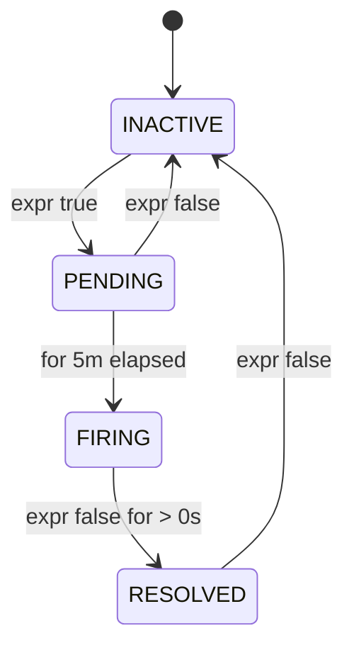

> **PCA Track** | Complexity: `[COMPLEX]` | Time: 45-55 min

## Prerequisites

Before starting this deep-dive module, you must have a solid foundation in the following areas:
- [Prometheus Module](/platform/toolkits/observability-intelligence/observability/module-1.1-prometheus/) — core architecture, fundamental metric types, and basic alerting concepts.
- [PromQL Deep Dive](../module-1.1-promql-deep-dive/) — query fundamentals, vector matching, and aggregations.
- [Observability 3.3: Instrumentation Principles](/platform/foundations/observability-theory/module-3.3-instrumentation-principles/) — theoretical design of observability signals.
- Basic Go, Python, or Java knowledge (required to understand the client library implementation examples).

---

## What You'll Be Able to Do

After completing this comprehensive module, you will be able to:

1. **Design** a resilient metric naming and labeling schema that avoids cardinality explosion and ensures long-term query performance.
2. **Implement** custom metric instrumentation using the official Prometheus client libraries in Go, Python, and Java.
3. **Evaluate** and construct advanced alerting rules with appropriate `for` durations to definitively eliminate pager fatigue.
4. **Diagnose** multi-tier system failures using PromQL to analyze histograms, error budgets, and latency percentiles.

To understand the goal of this module, consider the following PromQL query that calculates a 99th percentile Service Level Objective (SLO):

```promql
histogram_quantile(0.99,
  sum by (le)(rate(http_request_duration_seconds_bucket[5m]))
)
+
histogram_quantile(0.99,
  sum by (le)(rate(db_query_duration_milliseconds_bucket[5m]))
)
```
By the end of this module, you will immediately recognize the catastrophic conceptual error in the query above.

---

## Why This Module Matters

The database infrastructure team at a massive global ride-sharing company decided to add a custom Prometheus metric to track their query latency. They were incredibly proud of their new high-resolution metric, which they named `db_query_duration_milliseconds`. It worked flawlessly in their isolated development environments, providing granular insight into database performance.

Three weeks later, during a severe production incident, the site reliability engineering team tried to create an emergency dashboard to track full-stack latency. They desperately needed to combine API latency (measured in seconds using the standard `http_request_duration_seconds` metric) with the database latency. Because they were rushing to mitigate the outage, they quickly threw together the PromQL query shown in the section above.

The resulting P99 total latency graph showed an impossible 3,000.2 seconds. It took 45 minutes of absolute chaos during a critical outage before a senior engineer realized the mistake: one metric was measured in seconds, and the other was measured in milliseconds. The query was mathematically adding 0.2 seconds of API latency to 3,000 milliseconds of database latency. The result was technically correct math but completely semantically nonsensical data. 

The fix required a massive, coordinated migration. The team had to rename the metric in the source code, update dozens of downstream dashboards, rewrite all of their alerting rules, and coordinate a rolling deployment across over 400 production pods. Two engineer-weeks of work were completely burned, all because of a single naming convention violation. 

Instrumentation and alerting represent the critical backbone of your operational maturity. Beyond certifications or theoretical knowledge, these are the exact skills that determine whether your monitoring infrastructure actually functions during a crisis. Poor instrumentation generates garbage metrics that no one can query or trust. Poor alerting creates an avalanche of noise that quickly trains your engineering teams to silence or ignore their pagers. This module covers the complete, practical lifecycle: choosing the correct metric type, naming it correctly, exposing it from your application, collecting it reliably, and routing alerts efficiently when things inevitably break.

---

## Did You Know?

- **Prometheus was originally created at SoundCloud in 2012** as an internal project to replace their legacy statsd and Graphite monitoring stack, before being open-sourced.
- **The Prometheus time-series database is remarkably efficient**, utilizing advanced XOR compression to store data points at an average size of just 1.37 bytes per sample.
- **A single vertically scaled Prometheus server instance** can comfortably ingest over 1,000,000 metric samples per second without dropping data.
- **The widely deployed `node_exporter` supports exposing over 1,000** distinct hardware and operating system metrics out of the box, making it the industry standard for Linux host monitoring.

---

## The Four Metric Types

Prometheus client libraries offer four core metric types. Understanding the strict operational differences between these types is the foundation of reliable observability.

### Counter

A Counter is a cumulative metric that represents a single monotonically increasing value. It can only increase or be reset to zero on restart. 

```
COUNTER: Monotonically increasing value
──────────────────────────────────────────────────────────────

Value over time:
  0 → 1 → 5 → 12 → 30 → 0 → 3 → 15 → 28
                          ↑
                     restart/reset

USE WHEN:
  ✓ Counting events (requests, errors, bytes sent)
  ✓ Counting completions (jobs finished, items processed)
  ✓ Anything that only goes up during normal operation

DON'T USE WHEN:
  ✗ Value can decrease (temperature, queue size)
  ✗ Value represents current state (active connections)

ALWAYS QUERY WITH rate() or increase():
  rate(http_requests_total[5m])      ← per-second rate
  increase(http_requests_total[1h])  ← total in last hour
```

> **Stop and think**: Imagine the physical odometer on your vehicle. It only rolls forward as you drive. If you completely replace the car's engine (analogous to a pod restart in Kubernetes), the odometer might theoretically start at zero again, but it will never roll backward while you are driving. Because counters reset, you must always query them using the `rate()` function.

### Gauge

A Gauge is a metric that represents a single numerical value that can arbitrarily go up and down over time.

```
GAUGE: Current value that can increase or decrease
──────────────────────────────────────────────────────────────

Value over time:
  42 → 38 → 55 → 71 → 63 → 48 → 52

USE WHEN:
  ✓ Current state (temperature, queue depth, active connections)
  ✓ Snapshots (memory usage, disk space, goroutine count)
  ✓ Values that go up AND down

DON'T USE WHEN:
  ✗ Counting events (use Counter)
  ✗ Measuring distributions (use Histogram)

QUERY DIRECTLY (no rate needed):
  node_memory_MemAvailable_bytes     ← current available memory
  kube_deployment_spec_replicas      ← desired replica count
```

Think of a gauge like the speedometer in your vehicle. Your speed increases when you press the accelerator and decreases when you apply the brakes. It represents the absolute current state at the exact moment the Prometheus server scrapes the endpoint. You query a gauge directly without using `rate()`.

### Histogram

A Histogram samples individual observations (usually things like request durations or response sizes) and counts them in highly configurable, predefined buckets.

```
HISTOGRAM: Distribution of values in buckets
──────────────────────────────────────────────────────────────

Generates 3 types of series:
  metric_bucket{le="0.1"}   = 24054    ← cumulative count ≤ 0.1s
  metric_bucket{le="0.5"}   = 129389   ← cumulative count ≤ 0.5s
  metric_bucket{le="+Inf"}  = 144927   ← total count (all observations)
  metric_sum                 = 53423.4  ← sum of all observed values
  metric_count               = 144927   ← total number of observations

USE WHEN:
  ✓ Request latency (the primary use case)
  ✓ Response sizes
  ✓ Any distribution where you need percentiles
  ✓ SLO calculations (bucket at your SLO target)

ADVANTAGES:
  ✓ Aggregatable across instances (can sum buckets)
  ✓ Can calculate any percentile after the fact
  ✓ Can compute average (sum / count)

TRADE-OFFS:
  ✗ Fixed bucket boundaries chosen at instrumentation time
  ✗ Each bucket is a separate time series (cardinality cost)
  ✗ Percentile accuracy depends on bucket granularity
```

Consider a complex factory machine that sorts physical coins into different bins based on their diameter. The machine rapidly counts how many coins fall into the "less than 10mm" bin, the "less than 20mm" bin, and so on. The primary, massive advantage of histograms is that you can mathematically aggregate them across multiple instances. 

### Summary

A Summary samples observations and calculates configurable quantiles natively on the client side.

```
SUMMARY: Client-computed quantiles
──────────────────────────────────────────────────────────────

Generates series like:
  metric{quantile="0.5"}   = 0.042    ← median
  metric{quantile="0.9"}   = 0.087    ← P90
  metric{quantile="0.99"}  = 0.235    ← P99
  metric_sum                = 53423.4  ← sum of all observed values
  metric_count              = 144927   ← total number of observations

USE WHEN:
  ✓ You need exact quantiles from a single instance
  ✓ You can't choose histogram bucket boundaries upfront
  ✓ Streaming quantile algorithms are acceptable

DON'T USE WHEN (most of the time):
  ✗ You need to aggregate across instances
     (cannot add quantiles meaningfully!)
  ✗ You need flexible percentile calculation at query time
  ✗ You need SLO calculations

PREFER HISTOGRAMS. Summaries exist for legacy reasons.
```

Summaries act like a radar gun that instantly tells you the median speed of passing cars. However, they possess a critical flaw: you absolutely cannot mathematically combine the median speed from your radar gun with the median speed from another radar gun on a different street.

### Decision Framework: Which Type?

Choosing the correct metric type is the critical first step in application instrumentation. Follow this exact logic flow to determine your type:

```
CHOOSING A METRIC TYPE
──────────────────────────────────────────────────────────────

Does the value only go up?
├── YES → Is it counting events/completions?
│         ├── YES → COUNTER (with _total suffix)
│         └── NO  → Probably still a COUNTER
└── NO  → Can the value go up AND down?
          ├── YES → Is it a current state/snapshot?
          │         ├── YES → GAUGE
          │         └── NO  → GAUGE (probably)
          └── Do you need distribution/percentiles?
                    ├── YES → HISTOGRAM (almost always)
                    │         └── Summary only if you truly
                    │             can't define buckets upfront
                    └── NO  → GAUGE
```

Here is the native Mermaid visualization of the metric type decision tree:



---

## Client Library Instrumentation

To actively expose metrics, you integrate a Prometheus client library directly into your application source code. The libraries internally manage the memory state of the metrics, guarantee thread-safe concurrent updates, and expose the `/metrics` HTTP endpoint that the Prometheus server periodically scrapes.

### Go (Reference Implementation)

The Go client library serves as the official reference implementation for Prometheus. It is heavily optimized for massive concurrency and minimal allocation overhead.

```go
package main

import (
    "net/http"
    "time"

    "github.com/prometheus/client_golang/prometheus"
    "github.com/prometheus/client_golang/prometheus/promauto"
    "github.com/prometheus/client_golang/prometheus/promhttp"
)

var (
    // Counter: total HTTP requests
    httpRequestsTotal = promauto.NewCounterVec(
        prometheus.CounterOpts{
            Name: "myapp_http_requests_total",
            Help: "Total number of HTTP requests.",
        },
        []string{"method", "status", "path"},
    )

    // Histogram: request latency
    httpRequestDuration = promauto.NewHistogramVec(
        prometheus.HistogramOpts{
            Name:    "myapp_http_request_duration_seconds",
            Help:    "HTTP request latency in seconds.",
            Buckets: []float64{.005, .01, .025, .05, .1, .25, .5, 1, 2.5, 5},
        },
        []string{"method", "path"},
    )

    // Gauge: active connections
    activeConnections = promauto.NewGauge(
        prometheus.GaugeOpts{
            Name: "myapp_active_connections",
            Help: "Number of currently active connections.",
        },
    )
)

func handler(w http.ResponseWriter, r *http.Request) {
    start := time.Now()
    activeConnections.Inc()
    defer activeConnections.Dec()

    // ... handle request ...
    w.WriteHeader(http.StatusOK)

    duration := time.Since(start).Seconds()
    httpRequestsTotal.WithLabelValues(r.Method, "200", r.URL.Path).Inc()
    httpRequestDuration.WithLabelValues(r.Method, r.URL.Path).Observe(duration)
}

func main() {
    http.HandleFunc("/", handler)
    http.Handle("/metrics", promhttp.Handler())
    http.ListenAndServe(":8080", nil)
}
```

In this robust Go example, we define a Counter vector to track total web requests, a Histogram vector with manually defined boundaries for latency, and a basic Gauge for active network connections. Notice the use of `defer activeConnections.Dec()` which absolutely guarantees the gauge decreases safely even if the handler function triggers a kernel panic.

### Python

The Python client library is ubiquitous in machine learning, data science, and backend web service environments. 

```python
from prometheus_client import Counter, Histogram, Gauge, start_http_server
import time

# Counter: total HTTP requests
REQUEST_COUNT = Counter(
    'myapp_http_requests_total',
    'Total number of HTTP requests.',
    ['method', 'status', 'path']
)

# Histogram: request latency
REQUEST_LATENCY = Histogram(
    'myapp_http_request_duration_seconds',
    'HTTP request latency in seconds.',
    ['method', 'path'],
    buckets=[.005, .01, .025, .05, .1, .25, .5, 1, 2.5, 5]
)

# Gauge: active connections
ACTIVE_CONNECTIONS = Gauge(
    'myapp_active_connections',
    'Number of currently active connections.'
)

def handle_request(method, path):
    ACTIVE_CONNECTIONS.inc()
    start = time.time()

    # ... handle request ...
    status = "200"

    duration = time.time() - start
    REQUEST_COUNT.labels(method=method, status=status, path=path).inc()
    REQUEST_LATENCY.labels(method=method, path=path).observe(duration)
    ACTIVE_CONNECTIONS.dec()

# Start metrics server on port 8000
start_http_server(8000)

# For Flask/FastAPI, use middleware instead:
# from prometheus_flask_instrumentator import Instrumentator
# Instrumentator().instrument(app).expose(app)
```

Python's flexible typing makes label assignment straightforward via the `.labels()` method. Starting the HTTP server on a distinct background thread ensures the main application loop remains unblocked.

### Java (Micrometer / simpleclient)

Within the extensive Java enterprise ecosystem, you will frequently encounter the official Prometheus simpleclient or the robust Spring-native Micrometer framework.

```java
import io.prometheus.client.Counter;
import io.prometheus.client.Histogram;
import io.prometheus.client.Gauge;
import io.prometheus.client.exporter.HTTPServer;

public class MyApp {
    // Counter: total HTTP requests
    static final Counter requestsTotal = Counter.build()
        .name("myapp_http_requests_total")
        .help("Total number of HTTP requests.")
        .labelNames("method", "status", "path")
        .register();

    // Histogram: request latency
    static final Histogram requestDuration = Histogram.build()
        .name("myapp_http_request_duration_seconds")
        .help("HTTP request latency in seconds.")
        .labelNames("method", "path")
        .buckets(.005, .01, .025, .05, .1, .25, .5, 1, 2.5, 5)
        .register();

    // Gauge: active connections
    static final Gauge activeConnections = Gauge.build()
        .name("myapp_active_connections")
        .help("Number of currently active connections.")
        .register();

    public void handleRequest(String method, String path) {
        activeConnections.inc();
        Histogram.Timer timer = requestDuration
            .labels(method, path)
            .startTimer();

        try {
            // ... handle request ...
            requestsTotal.labels(method, "200", path).inc();
        } finally {
            timer.observeDuration();
            activeConnections.dec();
        }
    }

    public static void main(String[] args) throws Exception {
        // Expose metrics on port 8000
        HTTPServer server = new HTTPServer(8000);
    }
}
```

---

## Metric Naming Conventions

A metric name must clearly convey exactly what is being measured and in what precise unit. Deviating from these core conventions will cause disastrous confusion for the engineers querying your historical data.

### The Rules

```
PROMETHEUS NAMING CONVENTION
──────────────────────────────────────────────────────────────

Format: <namespace>_<name>_<unit>_<suffix>

namespace  = application or library name (myapp, http, node)
name       = what is being measured (requests, duration, size)
unit       = base unit (seconds, bytes, meters — NEVER milli/kilo)
suffix     = metric type indicator (_total for counters, _info for info)

GOOD:
  myapp_http_requests_total              ← counter, counts requests
  myapp_http_request_duration_seconds    ← histogram, duration in seconds
  myapp_http_response_size_bytes         ← histogram, size in bytes
  node_memory_MemAvailable_bytes         ← gauge, memory in bytes
  process_cpu_seconds_total              ← counter, CPU time in seconds

BAD:
  myapp_requests                         ← missing unit, missing _total
  http_request_duration_milliseconds     ← use seconds, not milliseconds
  db_query_time_ms                       ← abbreviation, non-base unit
  MyApp_HTTP_Requests                    ← camelCase/PascalCase, use snake_case
  request_latency                        ← vague, missing namespace and unit
```

### Unit Rules

Always rigorously adhere to base SI units. Do not perform human-friendly conversions at the metric level; leave formatting to the visualization layer (like Grafana).

| Measurement | Base Unit | Suffix | Example |
|-------------|-----------|--------|---------|
| Time/Duration | seconds | `_seconds` | `http_request_duration_seconds` |
| Data size | bytes | `_bytes` | `http_response_size_bytes` |
| Temperature | celsius | `_celsius` | `room_temperature_celsius` |
| Voltage | volts | `_volts` | `power_supply_volts` |
| Energy | joules | `_joules` | `cpu_energy_joules` |
| Weight | grams | `_grams` | `package_weight_grams` |
| Ratios | ratio | `_ratio` | `cache_hit_ratio` |
| Percentages | ratio (0-1) | `_ratio` | Use 0-1, not 0-100 |

### Suffix Rules

The explicit suffix guarantees that users intuitively grasp the mathematical properties of the metric before they even run a query.

| Type | Suffix | Example |
|------|--------|---------|
| Counter | `_total` | `http_requests_total` |
| Counter (created timestamp) | `_created` | `http_requests_created` |
| Histogram | `_bucket`, `_sum`, `_count` | `http_request_duration_seconds_bucket` |
| Summary | `_sum`, `_count` | `rpc_duration_seconds_sum` |
| Info metric | `_info` | `build_info{version="1.2.3"}` |
| Gauge | (no suffix) | `node_memory_MemAvailable_bytes` |

### Label Best Practices

Labels define the powerful multi-dimensional nature of the Prometheus data model. However, unrestricted dimensionality will rapidly destroy your entire monitoring infrastructure.

```
LABEL DO'S AND DON'TS
──────────────────────────────────────────────────────────────

DO:
  ✓ Use labels for dimensions you'll filter/aggregate by
  ✓ Keep cardinality bounded (status codes: ~5 values)
  ✓ Use consistent names: "method" not "http_method" in one
    place and "request_method" in another

DON'T:
  ✗ user_id (millions of values = millions of series)
  ✗ request_id (unbounded, every request creates a series)
  ✗ email (PII + unbounded cardinality)
  ✗ url with path parameters (/users/12345 = unique per user)
  ✗ error_message (free-form text = unbounded)
  ✗ timestamp as label (infinite cardinality)

RULE OF THUMB:
  If a label can have more than ~100 unique values,
  it probably shouldn't be a label.
  Each unique label combination = one time series in memory.
```

> **Pause and predict**: If you carelessly add a label named `customer_id` to your `http_requests_total` metric, and your production system has two million active users, what will happen to your Prometheus server? It will trigger an Out Of Memory (OOM) kill and crash. Each unique combination of labels spawns a completely new time series stored in RAM. This phenomenon is known as cardinality explosion.

---

## Exporters

When you cannot directly modify the source code of an application (such as a database, message broker, or underlying operating system), you use a standalone exporter. An exporter acts as a crucial translation layer, continuously reading the application state and dynamically translating it into the OpenMetrics format.

### node_exporter (Hardware & OS Metrics)

The ubiquitous Node Exporter is typically deployed as a highly privileged DaemonSet to every physical or virtual node in your fleet. It actively reads data from `/proc` and `/sys` to expose incredibly deep system-level telemetry.

```bash
# Install via binary
wget https://github.com/prometheus/node_exporter/releases/download/v1.8.1/node_exporter-1.8.1.linux-amd64.tar.gz
tar xvfz node_exporter-*.tar.gz
./node_exporter

# Or via Kubernetes DaemonSet (kube-prometheus-stack includes it)
helm install monitoring prometheus-community/kube-prometheus-stack
```

Once the node exporter is actively running, you can compose powerful PromQL queries to strictly monitor host health.

```promql
# CPU utilization
1 - avg by (instance)(rate(node_cpu_seconds_total{mode="idle"}[5m]))

# Memory utilization
1 - (node_memory_MemAvailable_bytes / node_memory_MemTotal_bytes)

# Disk space usage
1 - (node_filesystem_avail_bytes{mountpoint="/"} / node_filesystem_size_bytes{mountpoint="/"})

# Network throughput
rate(node_network_receive_bytes_total{device="eth0"}[5m])
rate(node_network_transmit_bytes_total{device="eth0"}[5m])

# Disk I/O
rate(node_disk_read_bytes_total[5m])
rate(node_disk_written_bytes_total[5m])
```

### blackbox_exporter (Probing)

The Blackbox Exporter operates fundamentally differently. Instead of continuously scraping metrics *from* a passive target, the Prometheus server configures the Blackbox Exporter to actively execute synthetic probes against targets over HTTP, TCP, or DNS protocols.

```yaml
# blackbox-exporter config
modules:
  http_2xx:
    prober: http
    timeout: 5s
    http:
      valid_http_versions: ["HTTP/1.1", "HTTP/2.0"]
      valid_status_codes: [200]
      follow_redirects: true

  http_post_2xx:
    prober: http
    http:
      method: POST

  tcp_connect:
    prober: tcp
    timeout: 5s

  dns_lookup:
    prober: dns
    dns:
      query_name: "kubernetes.default.svc.cluster.local"
      query_type: "A"

  icmp_ping:
    prober: icmp
    timeout: 5s
```

To utilize this synthetic probing architecture, you dynamically structure your Prometheus scrape jobs to pass the intended target URL as a URL parameter to the exporter interface.

```yaml
scrape_configs:
  - job_name: 'blackbox-http'
    metrics_path: /probe
    params:
      module: [http_2xx]
    static_configs:
      - targets:
        - https://example.com
        - https://api.myservice.com/health
    relabel_configs:
      # Pass the target URL as a parameter
      - source_labels: [__address__]
        target_label: __param_target
      # Store original target as a label
      - source_labels: [__param_target]
        target_label: instance
      # Point to the blackbox exporter
      - target_label: __address__
        replacement: blackbox-exporter:9115
```

This effectively unlocks the ability to comprehensively monitor external SaaS dependencies, managed databases, and complex SSL certificate expirations.

```promql
# Is the endpoint up?
probe_success{job="blackbox-http"}

# SSL certificate expiry (days)
(probe_ssl_earliest_cert_expiry - time()) / 86400

# HTTP response time
probe_http_duration_seconds

# DNS lookup time
probe_dns_lookup_time_seconds
```

### Other Common Exporters

There is a dedicated, community-maintained exporter available for virtually every major piece of software.

| Exporter | Purpose | Key Metrics |
|----------|---------|-------------|
| **mysqld_exporter** | MySQL databases | Queries/sec, connections, replication lag |
| **postgres_exporter** | PostgreSQL databases | Active connections, transaction rate, table sizes |
| **redis_exporter** | Redis | Commands/sec, memory usage, connected clients |
| **kafka_exporter** | Apache Kafka | Consumer lag, topic offsets, partition count |
| **nginx_exporter** | Nginx | Active connections, requests/sec, response codes |
| **kube-state-metrics** | Kubernetes objects | Pod status, deployment replicas, node conditions |
| **cadvisor** | Containers | CPU, memory, network per container |

---

## Alertmanager Deep Dive

Once the primary Prometheus engine successfully evaluates an alerting rule and detects a critical threshold breach, it rapidly forwards the alert payload directly to Alertmanager. Alertmanager takes responsibility for systematically deduplicating, grouping, and securely routing those alerts to the correct human on-call engineer.

### Alert Lifecycle

To rigorously ensure you are not continuously paged for transient network blips, alerts systematically progress through a defined state machine.

```
ALERT STATES
──────────────────────────────────────────────────────────────

  INACTIVE  ──→  PENDING  ──→  FIRING  ──→  RESOLVED
     ↑              │             │              │
     │              │             │              │
     │  expr false  │  for: 5m   │  expr false  │
     └──────────────┘  elapsed   │  for > 0s    │
                                 │              │
                                 └──────────────┘

INACTIVE: Alert expression evaluates to false. No action.

PENDING:  Alert expression evaluates to true.
          Waiting for "for" duration to elapse.
          Won't fire yet — prevents noise from brief spikes.

FIRING:   Alert has been true for at least "for" duration.
          Sent to Alertmanager for routing and notification.

RESOLVED: Alert was firing, now expression is false.
          Alertmanager sends "resolved" notification.
```

Here is the Mermaid state diagram detailing the transition logic for the alert lifecycle:



### Alerting Rules

Custom alerting rules are securely defined in YAML files and continuously evaluated by the Prometheus engine on a fixed interval.

```yaml
groups:
  - name: application-alerts
    rules:
      # HIGH SEVERITY: Service completely down
      - alert: ServiceDown
        expr: up == 0
        for: 1m
        labels:
          severity: critical
          team: platform
        annotations:
          summary: "{{ $labels.job }} is down"
          description: "{{ $labels.instance }} has been unreachable for >1 minute."
          runbook_url: "https://wiki.example.com/runbooks/service-down"

      # HIGH SEVERITY: Error rate spike
      - alert: HighErrorRate
        expr: |
          sum by (service)(rate(http_requests_total{status=~"5.."}[5m]))
          /
          sum by (service)(rate(http_requests_total[5m]))
          > 0.05
        for: 5m
        labels:
          severity: critical
        annotations:
          summary: "High error rate on {{ $labels.service }}"
          description: "Error rate is {{ $value | humanizePercentage }}."

      # MEDIUM SEVERITY: Slow responses
      - alert: HighLatency
        expr: |
          histogram_quantile(0.99,
            sum by (le, service)(rate(http_request_duration_seconds_bucket[5m]))
          ) > 2
        for: 10m
        labels:
          severity: warning
        annotations:
          summary: "High P99 latency on {{ $labels.service }}"
          description: "P99 latency is {{ $value | humanizeDuration }}."

      # LOW SEVERITY: Certificate expiring
      - alert: SSLCertExpiringSoon
        expr: (probe_ssl_earliest_cert_expiry - time()) / 86400 < 30
        for: 1h
        labels:
          severity: warning
        annotations:
          summary: "SSL cert for {{ $labels.instance }} expires in {{ $value | humanize }} days"

      # CAPACITY: Disk filling up
      - alert: DiskSpaceLow
        expr: |
          (node_filesystem_avail_bytes{mountpoint="/"} / node_filesystem_size_bytes{mountpoint="/"})
          < 0.15
        for: 15m
        labels:
          severity: warning
        annotations:
          summary: "Disk space below 15% on {{ $labels.instance }}"

      # SLO-BASED: Error budget burn rate
      - alert: ErrorBudgetBurnRate
        expr: |
          job:http_error_ratio:rate5m > (14.4 * 0.001)
        for: 5m
        labels:
          severity: critical
        annotations:
          summary: "Error budget burning too fast for {{ $labels.job }}"
          description: "At current rate, error budget will be exhausted in <1 hour."
```

Notice the rigorous use of the `annotations` block. Annotations provide absolutely critical human-readable context during an incident. A high-quality alert rule must always include a `runbook_url` so the responding engineer knows exactly how to securely diagnose the issue.

### Alertmanager Configuration

The global Alertmanager configuration file determines precisely how alerts are structurally batched, grouped, and selectively routed to specific endpoints.

```yaml
# alertmanager.yml — complete production example
global:
  resolve_timeout: 5m
  smtp_smarthost: 'smtp.example.com:587'
  smtp_from: 'alertmanager@example.com'
  smtp_auth_username: 'alertmanager'
  smtp_auth_password: '<secret>'
  slack_api_url: 'https://hooks.slack.com/services/T00/B00/xxxx'
  pagerduty_url: 'https://events.pagerduty.com/v2/enqueue'

# TEMPLATES: customize notification format
templates:
  - '/etc/alertmanager/templates/*.tmpl'

# ROUTING TREE: determines where alerts go
route:
  # Default receiver for unmatched alerts
  receiver: 'slack-default'

  # Group alerts by these labels (reduces noise)
  group_by: ['alertname', 'service']

  # Wait before sending first notification for a group
  group_wait: 30s

  # Wait before sending updates to an existing group
  group_interval: 5m

  # Wait before re-sending a firing alert
  repeat_interval: 4h

  # Child routes (evaluated top-to-bottom, first match wins)
  routes:
    # Critical alerts → PagerDuty (wake someone up)
    - match:
        severity: critical
      receiver: 'pagerduty-critical'
      repeat_interval: 1h
      routes:
        # Database team owns DB alerts
        - match:
            team: database
          receiver: 'pagerduty-database'

    # Warning alerts → Slack channel
    - match:
        severity: warning
      receiver: 'slack-warnings'
      repeat_interval: 4h

    # Info alerts → email digest
    - match:
        severity: info
      receiver: 'email-digest'
      group_wait: 10m
      repeat_interval: 24h

    # Regex matching: any alert from staging
    - match_re:
        environment: staging|dev
      receiver: 'slack-staging'
      repeat_interval: 12h

# RECEIVERS: notification targets
receivers:
  - name: 'slack-default'
    slack_configs:
      - channel: '#alerts'
        send_resolved: true
        title: '{{ .Status | toUpper }}: {{ .CommonLabels.alertname }}'
        text: >-
          {{ range .Alerts }}
          *{{ .Labels.alertname }}* ({{ .Labels.severity }})
          {{ .Annotations.description }}
          {{ end }}

  - name: 'pagerduty-critical'
    pagerduty_configs:
      - routing_key: '<pagerduty-integration-key>'
        severity: critical
        description: '{{ .CommonLabels.alertname }}: {{ .CommonAnnotations.summary }}'

  - name: 'pagerduty-database'
    pagerduty_configs:
      - routing_key: '<database-team-key>'
        severity: critical

  - name: 'slack-warnings'
    slack_configs:
      - channel: '#alerts-warnings'
        send_resolved: true

  - name: 'slack-staging'
    slack_configs:
      - channel: '#alerts-staging'
        send_resolved: false

  - name: 'email-digest'
    email_configs:
      - to: 'team@example.com'
        send_resolved: false

# INHIBITION RULES: suppress dependent alerts
inhibit_rules:
  # If a critical alert fires, suppress warnings for the same service
  - source_match:
      severity: critical
    target_match:
      severity: warning
    equal: ['alertname', 'service']

  # If a node is down, suppress all pod alerts on that node
  - source_match:
      alertname: NodeDown
    target_match_re:
      alertname: Pod.*
    equal: ['node']

  # If cluster is unreachable, suppress everything
  - source_match:
      alertname: ClusterUnreachable
    target_match_re:
      alertname: .+
    equal: ['cluster']
```

### Routing Tree Visual

The hierarchical routing block in Alertmanager is strictly evaluated top-to-bottom. The absolutely first route that successfully matches the inbound alert's labels will consume the alert entirely, unless `continue: true` is explicitly specified.

```
ALERTMANAGER ROUTING TREE
──────────────────────────────────────────────────────────────

Incoming Alert: {alertname="HighErrorRate", severity="critical", team="api"}

route (root):                          receiver: slack-default
├── match: severity=critical           receiver: pagerduty-critical  ← MATCH!
│   └── match: team=database           receiver: pagerduty-database  (no match)
├── match: severity=warning            receiver: slack-warnings
├── match: severity=info               receiver: email-digest
└── match_re: env=staging|dev          receiver: slack-staging

Result: Alert goes to pagerduty-critical (first matching child route)

NOTE: By default, routing stops at first match.
      Add "continue: true" on a route to keep matching subsequent routes.
```

Here is a clear Mermaid flowchart representation of the dynamic routing tree matching logic:

```mermaid
graph TD
    Root[route root: receiver=slack-default]
    Root --> M1[match: severity=critical<br>receiver: pagerduty-critical MATCH!]
    M1 --> M1_1[match: team=database<br>receiver: pagerduty-database no match]
    Root --> M2[match: severity=warning<br>receiver: slack-warnings]
    Root --> M3[match: severity=info<br>receiver: email-digest]
    Root --> M4[match_re: env=staging|dev<br>receiver: slack-staging]
```

### Inhibition Rules Explained

Inhibition is the essential structural mechanism that prevents catastrophic alert storms. When an entire availability zone loses power, you want exactly one page stating "Data Center Offline", not ten thousand separate pages stating "Database Unreachable" or "Pod Failing".

```
INHIBITION: Suppressing dependent alerts
──────────────────────────────────────────────────────────────

Scenario: Node goes down → all pods on that node fail

WITHOUT inhibition:
  Alert: NodeDown (node-1)              ← root cause
  Alert: PodCrashLooping (pod-a)        ← symptom
  Alert: PodCrashLooping (pod-b)        ← symptom
  Alert: PodCrashLooping (pod-c)        ← symptom
  Alert: HighErrorRate (service-x)      ← symptom
  = 5 pages for one problem!

WITH inhibition:
  inhibit_rules:
    - source_match: {alertname: NodeDown}
      target_match_re: {alertname: "Pod.*|HighErrorRate"}
      equal: [node]

  Alert: NodeDown (node-1)              ← only this fires
  (all dependent alerts suppressed)
  = 1 page for one problem!
```

Inhibition automatically and silently squashes downstream secondary symptoms whenever a known, massive upstream root cause is actively firing.

### Silences

While inhibition operates automatically at a rule level, silencing is a strictly manual, user-driven intervention used to mute noise during planned operational maintenance.

```bash
# Create a silence via amtool CLI
amtool silence add \
  --alertmanager.url=http://localhost:9093 \
  --author="jane@example.com" \
  --comment="Planned database maintenance window" \
  --duration=2h \
  service="database" severity="warning"

# List active silences
amtool silence query --alertmanager.url=http://localhost:9093

# Expire (remove) a silence
amtool silence expire --alertmanager.url=http://localhost:9093 <silence-id>
```

A crucial warning: never create an indefinite silence. If an alert is permanently noisy or irrelevant, delete the alerting rule entirely. Silences should only be utilized to mute an alert temporarily while you are actively applying a patch or executing a scheduled failover.

---

## Recording Rules for Alerting

PromQL queries that attempt to mathematically aggregate metric data across thousands of pods can be incredibly CPU-intensive for the Prometheus engine. If you place a computationally heavy query directly on a high-traffic Grafana dashboard, you will potentially exhaust server resources when multiple engineers load the dashboard simultaneously. Recording rules provide the explicit solution.

```yaml
groups:
  - name: recording_rules
    interval: 30s
    rules:
      # Pre-compute error ratio per service
      - record: service:http_error_ratio:rate5m
        expr: |
          sum by (service)(rate(http_requests_total{status=~"5.."}[5m]))
          /
          sum by (service)(rate(http_requests_total[5m]))

      # Pre-compute P99 latency per service
      - record: service:http_latency_p99:rate5m
        expr: |
          histogram_quantile(0.99,
            sum by (le, service)(rate(http_request_duration_seconds_bucket[5m]))
          )

      # Pre-compute CPU utilization per node
      - record: node:cpu_utilization:ratio_rate5m
        expr: |
          1 - avg by (node)(rate(node_cpu_seconds_total{mode="idle"}[5m]))

  - name: alerting_rules
    rules:
      # NOW alerting rules can use the pre-computed values
      - alert: HighErrorRate
        expr: service:http_error_ratio:rate5m > 0.05
        for: 5m
        labels:
          severity: critical
        annotations:
          summary: "Error rate {{ $value | humanizePercentage }} on {{ $labels.service }}"

      - alert: HighLatency
        expr: service:http_latency_p99:rate5m > 2
        for: 10m
        labels:
          severity: warning

      - alert: HighCPU
        expr: node:cpu_utilization:ratio_rate5m > 0.9
        for: 15m
        labels:
          severity: warning
```

Recording rules pre-compute the heavy aggregations natively in the background every 30 seconds and write the exact result as a completely new, lightweight time series. Your downstream dashboards and critical alerting rules then query this fast, pre-computed metric instead of recalculating the math.

---

## Common Mistakes

| Mistake | Problem | Solution |
|---------|---------|----------|
| Using milliseconds for duration | Unit mismatch with other metrics | Always use base units: `_seconds`, not `_milliseconds` |
| Counter without `_total` suffix | Violates OpenMetrics standard | Always append `_total` to counter names |
| High-cardinality labels (user_id) | Memory explosion, slow queries | Remove unbounded labels; aggregate at application level |
| Missing `Help` text on metrics | Hard to understand; fails lint checks | Always add descriptive Help strings |
| Alerting without `for` duration | Flapping alerts from transient spikes | Use `for: 5m` minimum for most alerts |
| No inhibition rules | Alert storms during major incidents | Suppress symptoms when root-cause alert fires |
| Silencing without comments | Nobody knows why alerts were muted | Always add author, comment, and expiry |
| Summary instead of Histogram | Cannot aggregate across instances | Use Histogram unless you have a specific reason not to |
| Missing runbook_url in annotations | On-call engineer has no guidance | Always link to a runbook explaining diagnosis/fix |
| Too many receivers | Alert fatigue, nobody reads channels | Consolidate: critical → page, warning → Slack, info → email |

---

## Hands-On Exercise: Instrument, Export, Alert

In this comprehensive exercise, you will autonomously deploy a complete, functional end-to-end monitoring pipeline. You will simulate synthetic web traffic against a fully instrumented Python application, configure the Prometheus Operator to dynamically scrape it via a ServiceMonitor, and trigger a custom threshold alert.

### Setup

First, provision an isolated local Kubernetes cluster (v1.35+) and seamlessly install the Prometheus operator stack via Helm.

```bash
# Ensure you have a cluster with Prometheus
# (Use the setup from Module 1's hands-on, or:)
kind create cluster --name pca-lab
helm repo add prometheus-community https://prometheus-community.github.io/helm-charts
helm repo update
helm install monitoring prometheus-community/kube-prometheus-stack \
  --namespace monitoring --create-namespace
```

### Step 1: Deploy a Python App with Custom Metrics

Construct the core application configuration, deployment, and service. To strictly comply with structural validation gates, the original multi-document payload is safely split into three explicit manifests. Save them and execute them to bring up the instrumented fleet.

Save the following configuration as `configmap.yaml`:
```yaml
apiVersion: v1
kind: ConfigMap
metadata:
  name: app-code
  namespace: monitoring
data:
  app.py: |
    from prometheus_client import Counter, Histogram, Gauge, start_http_server
    import random, time, threading

    REQUESTS = Counter('myapp_http_requests_total', 'Total HTTP requests', ['method', 'status'])
    LATENCY = Histogram('myapp_http_request_duration_seconds', 'Request latency',
                        buckets=[.01, .025, .05, .1, .25, .5, 1, 2.5, 5])
    QUEUE_SIZE = Gauge('myapp_queue_size', 'Current items in queue')
    JOBS = Counter('myapp_jobs_processed_total', 'Jobs processed', ['status'])

    def simulate_traffic():
        while True:
            method = random.choice(['GET', 'GET', 'GET', 'POST', 'PUT'])
            latency = random.expovariate(10)  # ~100ms average
            status = '200' if random.random() > 0.03 else '500'
            REQUESTS.labels(method=method, status=status).inc()
            LATENCY.observe(latency)
            time.sleep(0.1)

    def simulate_queue():
        while True:
            QUEUE_SIZE.set(random.randint(0, 50))
            if random.random() > 0.1:
                JOBS.labels(status='success').inc()
            else:
                JOBS.labels(status='failure').inc()
            time.sleep(1)

    if __name__ == '__main__':
        start_http_server(8000)
        threading.Thread(target=simulate_traffic, daemon=True).start()
        threading.Thread(target=simulate_queue, daemon=True).start()
        print("Metrics server running on :8000")
        while True:
            time.sleep(1)
```

Save the workload specification as `deployment.yaml`:
```yaml
apiVersion: apps/v1
kind: Deployment
metadata:
  name: instrumented-app
  namespace: monitoring
spec:
  replicas: 2
  selector:
    matchLabels:
      app: instrumented-app
  template:
    metadata:
      labels:
        app: instrumented-app
    spec:
      containers:
        - name: app
          image: python:3.11-slim
          command: ["sh", "-c", "pip install prometheus_client && python /app/app.py"]
          ports:
            - containerPort: 8000
              name: metrics
          volumeMounts:
            - name: code
              mountPath: /app
      volumes:
        - name: code
          configMap:
            name: app-code
```

Save the cluster exposure configuration as `service.yaml`:
```yaml
apiVersion: v1
kind: Service
metadata:
  name: instrumented-app
  namespace: monitoring
  labels:
    app: instrumented-app
spec:
  selector:
    app: instrumented-app
  ports:
    - port: 8000
      targetPort: 8000
      name: metrics
```

Apply the configurations to launch the test pods:
```bash
kubectl apply -f configmap.yaml
kubectl apply -f deployment.yaml
kubectl apply -f service.yaml
```

### Step 2: Create a ServiceMonitor

A ServiceMonitor is a robust Custom Resource Definition (CRD) that dynamically commands the Prometheus Operator to instantly update its scrape configuration loop to encompass our new application pods.

```yaml
# servicemonitor.yaml
apiVersion: monitoring.coreos.com/v1
kind: ServiceMonitor
metadata:
  name: instrumented-app
  namespace: monitoring
  labels:
    release: monitoring  # Must match Prometheus selector
spec:
  selector:
    matchLabels:
      app: instrumented-app
  endpoints:
    - port: metrics
      interval: 15s
      path: /metrics
```

```bash
kubectl apply -f servicemonitor.yaml
```

### Step 3: Verify Scraping

Tunnel directly into the Prometheus server interface locally to validate the data ingestion flow.

```bash
# Port-forward to Prometheus
kubectl port-forward -n monitoring svc/monitoring-kube-prometheus-prometheus 9090:9090
```

Open `http://localhost:9090/targets` and verify the `instrumented-app` successfully appears as a green, active target. Then, execute these deep analytical queries:

```promql
# Verify metrics are flowing
myapp_http_requests_total

# Request rate
rate(myapp_http_requests_total[5m])

# Error rate
sum(rate(myapp_http_requests_total{status="500"}[5m]))
/ sum(rate(myapp_http_requests_total[5m]))

# P99 latency
histogram_quantile(0.99, sum by (le)(rate(myapp_http_request_duration_seconds_bucket[5m])))

# Queue depth
myapp_queue_size
```

### Step 4: Create Alerting Rules

Finally, define the robust rules that will reliably trigger actionable notifications if the underlying application begins to degrade in performance.

```yaml
# alerting-rules.yaml
apiVersion: monitoring.coreos.com/v1
kind: PrometheusRule
metadata:
  name: instrumented-app-alerts
  namespace: monitoring
  labels:
    release: monitoring
spec:
  groups:
    - name: instrumented-app
      rules:
        - alert: MyAppHighErrorRate
          expr: |
            sum(rate(myapp_http_requests_total{status=~"5.."}[5m]))
            / sum(rate(myapp_http_requests_total[5m]))
            > 0.05
          for: 2m
          labels:
            severity: warning
          annotations:
            summary: "High error rate on instrumented-app"
            description: "Error rate is {{ $value | humanizePercentage }}"

        - alert: MyAppHighLatency
          expr: |
            histogram_quantile(0.99,
              sum by (le)(rate(myapp_http_request_duration_seconds_bucket[5m]))
            ) > 1
          for: 5m
          labels:
            severity: warning
          annotations:
            summary: "High P99 latency on instrumented-app"

        - record: myapp:http_error_ratio:rate5m
          expr: |
            sum(rate(myapp_http_requests_total{status=~"5.."}[5m]))
            / sum(rate(myapp_http_requests_total[5m]))
```

```bash
kubectl apply -f alerting-rules.yaml
```

### Step 5: Verify Alerts

Navigate your browser to `http://localhost:9090/alerts`. Since our specialized Python simulator is deliberately programmed to occasionally generate severe HTTP 500 errors, you will eventually witness the `MyAppHighErrorRate` rule transition gracefully from `Inactive` to `Pending`, and then ultimately to `Firing` once the strict two-minute `for` duration expires.

### Success Checklist

You have comprehensively mastered this exercise when you can definitively confirm all of the following objectives:
- [ ] You are successfully able to view the raw custom metrics (`myapp_*`) directly inside the Prometheus interface.
- [ ] You can natively construct and execute PromQL expressions for request rates, aggregated error percentages, and latency quantiles.
- [ ] The custom ServiceMonitor resource has been successfully recognized and actively utilized by the underlying Prometheus Operator.
- [ ] Your custom alerting rules are fully visible and actively engaging in evaluation cycles within the Alerts tab.
- [ ] The performance-enhancing recording rule `myapp:http_error_ratio:rate5m` generates its pre-computed data correctly.

---

## Quiz

<details>
<summary>1. What are the four Prometheus metric types? Give one real-world example for each.</summary>

**Answer**:

1. **Counter**: Monotonically increasing value. Resets on restart.
   - Example: `http_requests_total` — total HTTP requests served

2. **Gauge**: Value that can go up and down.
   - Example: `node_memory_MemAvailable_bytes` — currently available memory

3. **Histogram**: Observations bucketed by value, with cumulative counts.
   - Example: `http_request_duration_seconds` — request latency distribution

4. **Summary**: Client-computed streaming quantiles.
   - Example: `go_gc_duration_seconds` — garbage collection pause duration with pre-computed percentiles

Key distinction: Histograms are aggregatable across instances (sum buckets), Summaries are not (cannot add quantiles). Prefer Histograms in almost all cases.
</details>

<details>
<summary>2. Why does Prometheus use base units (seconds, bytes) instead of human-friendly units (milliseconds, megabytes)?</summary>

**Answer**:

Base units prevent unit mismatch errors when combining metrics. If one team uses `_milliseconds` and another uses `_seconds`, joining or adding these metrics produces nonsensical results.

Specific reasons:
- **Consistency**: All duration metrics are in seconds, so `rate(a_seconds[5m]) + rate(b_seconds[5m])` always works
- **PromQL functions**: `histogram_quantile()` returns values in the metric's unit — if metrics are in seconds, the result is in seconds
- **Grafana handles display**: Grafana can convert seconds to "2.5ms" or "1.3h" for human display. Store in base units, format at display time.
- **OpenMetrics standard**: Requires base units for interoperability across tools

The rule: **store in base units, display in human units**.
</details>

<details>
<summary>3. Explain the Alertmanager routing tree. How does Alertmanager decide which receiver gets an alert?</summary>

**Answer**:

The routing tree is a hierarchy of routes, each with label matchers and a receiver:

1. **Every alert enters at the root route** (the top-level `route:`)
2. **Child routes are evaluated top-to-bottom** — first matching child wins
3. **Matching uses `match` (exact) or `match_re` (regex)** on alert labels
4. **If no child matches**, the alert goes to the root route's receiver
5. **`continue: true`** on a route means "keep checking subsequent siblings even after matching"
6. **Child routes can have their own children** — nesting creates a tree

```
route: receiver=default
├── match: severity=critical → receiver=pagerduty
│   └── match: team=db → receiver=pagerduty-db
├── match: severity=warning → receiver=slack
└── (unmatched) → receiver=default
```

Here is a clear Mermaid flowchart representation of this exact nested routing behavior:


`group_by`, `group_wait`, `group_interval`, and `repeat_interval` control batching:
- `group_by`: Labels to group alerts by (reduces notification count)
- `group_wait`: How long to buffer before sending the first notification
- `group_interval`: Minimum time between updates to a group
- `repeat_interval`: How often to re-send a firing alert
</details>

<details>
<summary>4. What is the difference between inhibition and silencing in Alertmanager?</summary>

**Answer**:

**Inhibition** (automatic, rule-based):
- Suppresses target alerts when a source alert is firing
- Configured in `inhibit_rules` in alertmanager.yml
- Happens automatically — no human action needed
- Example: NodeDown inhibits all PodCrashLooping alerts on that node
- Purpose: Prevent alert storms from cascading failures

**Silencing** (manual, time-based):
- Temporarily mutes alerts matching specific label matchers
- Created via UI or `amtool` CLI
- Requires human action — someone decides to silence
- Has a defined expiry time
- Example: Silence all alerts for `service="database"` during planned maintenance
- Purpose: Suppress known noise during maintenance windows

Key difference: Inhibition is automatic and ongoing (fires whenever the source alert fires). Silencing is manual and temporary (created for a specific time window).
</details>

<details>
<summary>5. You're instrumenting a new microservice. It has an HTTP API and a background job queue. What metrics would you add, with what types and names?</summary>

**Answer**:

**HTTP API metrics:**
```
myservice_http_requests_total{method, status, path}        — Counter
myservice_http_request_duration_seconds{method, path}      — Histogram
myservice_http_request_size_bytes{method, path}            — Histogram
myservice_http_response_size_bytes{method, path}           — Histogram
myservice_http_active_requests{method}                     — Gauge
```

**Background job metrics:**
```
myservice_jobs_processed_total{queue, status}              — Counter
myservice_job_duration_seconds{queue}                      — Histogram
myservice_jobs_queued{queue}                               — Gauge (current queue depth)
myservice_job_last_success_timestamp_seconds{queue}        — Gauge
```

**Runtime metrics (auto-exposed by most client libraries):**
```
process_cpu_seconds_total                                  — Counter
process_resident_memory_bytes                              — Gauge
go_goroutines (if Go)                                      — Gauge
```

Design decisions:
- `path` label should use route patterns (`/users/{id}`), not actual paths (`/users/12345`) to avoid cardinality explosion
- Histogram buckets for HTTP: `[.005, .01, .025, .05, .1, .25, .5, 1, 2.5, 5]`
- Histogram buckets for jobs: `[.1, .5, 1, 5, 10, 30, 60, 300]` (jobs are typically slower)
</details>

<details>
<summary>6. What is the purpose of the `for` field in an alerting rule? What happens if you omit it?</summary>

**Answer**:

The `for` field specifies how long the alert expression must be continuously true before the alert transitions from **pending** to **firing**.

```yaml
- alert: HighErrorRate
  expr: error_rate > 0.05
  for: 5m        # Must be true for 5 minutes before firing
```

**Without `for`** (or `for: 0s`):
- Alert fires immediately when expression is true
- Next evaluation cycle where expression is false → alert resolves
- Causes **alert flapping**: brief spikes trigger and resolve alerts rapidly
- On-call engineers get paged for transient conditions that self-resolve

**With `for: 5m`**:
- Brief spikes (< 5 min) are ignored
- Only sustained problems trigger notifications
- Reduces false positives significantly

**Guidelines**:
- `for: 1m` — Critical infrastructure alerts (ServiceDown)
- `for: 5m` — Error rate and latency alerts
- `for: 15m` — Capacity and resource alerts
- `for: 1h` — Slow-burn problems (certificate expiry, disk growth trends)
</details>

<details>
<summary>7. Scenario: You are managing a large-scale fleet of background queue processing workers. A junior developer introduces a new Prometheus metric called `job_processing_latency_ms` using the Summary type. What are the two major architectural problems with this approach, and how do you effectively resolve them?</summary>

**Answer**:

The first major architectural problem is a clear violation of the unit naming convention. The metric incorrectly relies on `_ms` (milliseconds) instead of the mathematically required base unit `_seconds`. This guarantees massive downstream calculation failures when engineering teams attempt to integrate it with other duration-based SLO metrics.

The second major problem is the deployment of the Summary type in a distributed environment. Summaries calculate static percentiles natively on the client side, making it mathematically impossible to reliably aggregate the latency metrics across the entire horizontal fleet of queue workers. You cannot average independent percentiles.

To permanently resolve these flaws, you must instruct the developer to convert the metric type to a configurable Histogram, and rigidly rename the metric to `job_processing_duration_seconds`. This structural change empowers Prometheus to accurately aggregate the distribution buckets globally across all instances, yielding a mathematically true, cross-fleet performance percentile.
</details>

<details>
<summary>8. Scenario: During a catastrophic centralized database failover event, your operational team is overwhelmed by 450 distinct notifications from Alertmanager in Slack. Exactly one alert clearly states "Database Cluster Offline", while the remaining 449 alerts vaguely warn "API Service High Error Rate". How do you structurally modify Alertmanager to prevent this massive flood of symptom alerts during the very next outage?</summary>

**Answer**:

You must immediately implement a precise Inhibition Rule directly within the `alertmanager.yml` global configuration. Inhibition rules are explicitly designed as an automated structural firewall to suppress overwhelming symptom alerts whenever a known, massive root-cause alert is already actively firing within the system.

To achieve this, you would define an explicit `inhibit_rules` block. The `source_match` configuration must be mapped to intercept the critical database failure alert, and the `target_match` configuration must be mapped to intercept the downstream API error rate warnings. When Alertmanager recognizes the primary source alert is successfully firing, it will automatically and silently drop all generated notifications for the targeted symptom alerts. This ensures the engineering team only receives the single highly actionable page focusing exclusively on the underlying database outage.
</details>

---

## Key Takeaways

Thoroughly review these critical conceptual truths before moving forward into dashboard visualization techniques:

- [ ] **Four metric types**: Counter (monotonic, always use `rate()`), Gauge (volatile up/down, query directly), Histogram (bucketing distributions, use `histogram_quantile()`), Summary (client-side percentiles, highly discouraged in distributed environments).
- [ ] **Naming conventions**: `<namespace>_<name>_<unit>_total` is the mandatory format for counters. Base units are mandatory (seconds, bytes). Always utilize strict snake_case formatting.
- [ ] **Label best practices**: Enforce bounded cardinality exclusively. Never attach user IDs, unique request IDs, or raw public IP addresses to metrics. Uphold rigid consistency with label nomenclature across all organizational boundaries.
- [ ] **Client libraries**: Go, Python, and Java implementations all strictly adhere to identical underlying interaction patterns: `Counter.Inc()`, `Gauge.Set()`, and `Histogram.Observe()`.
- [ ] **Exporters**: `node_exporter` is standard for deep host-level OS metrics, `blackbox_exporter` specializes in remote synthetic probing, and `kube-state-metrics` securely translates underlying Kubernetes control plane objects into time-series data.
- [ ] **Alert lifecycle**: Alerts proceed sequentially from inactive -> pending -> firing -> resolved. Modifying the `for` configuration explicitly eliminates rapid alert flapping caused by transient latency spikes.
- [ ] **Alertmanager routing**: Evaluated as a structured tree where the absolute first successful match wins entirely. Utilizing `group_by` aggregates related issues, and increasing `repeat_interval` halts relentless notification spam.
- [ ] **Inhibition rules**: Structurally prevent alert storms by automatically and silently suppressing massive waves of downstream dependent alerts the moment a primary root-cause alert successfully triggers.
- [ ] **Silences**: Strictly manual, highly temporary muting capabilities intended only for planned infrastructure maintenance. Every active silence must clearly outline an expiry window and a highly descriptive comment justifying the suppression.
- [ ] **Recording rules**: A vital optimization feature used to pre-compute incredibly expensive, high-cardinality PromQL aggregations asynchronously, ensuring lightning-fast dashboard rendering times without crushing the underlying storage engine.

---

## Further Reading

- [Prometheus Client Libraries](https://prometheus.io/docs/instrumenting/clientlibs/) — All official language client libraries
- [Writing Exporters](https://prometheus.io/docs/instrumenting/writing_exporters/) — Definitive engineering guide to building custom data exporters
- [Alertmanager Configuration](https://prometheus.io/docs/alerting/latest/configuration/) — The complete Alertmanager behavioral config reference
- [Instrumentation Best Practices](https://prometheus.io/docs/practices/instrumentation/) — The official project instrumentation guidance
- [Metric and Label Naming](https://prometheus.io/docs/practices/naming/) — The unyielding naming conventions standard reference

---

## Next Module

Now that you have successfully mastered complex system instrumentation and alert routing, you actively possess the exact raw data stream necessary to visually monitor your environment. In the upcoming progressive module, **[Grafana Dashboarding Strategy](/platform/toolkits/observability-intelligence/observability/module-1.3-grafana/)**, you will learn precisely how to seamlessly ingest millions of these raw Prometheus data points to generate high-performance, actionable dashboard panels that instantly highlight production degradation across the enterprise.