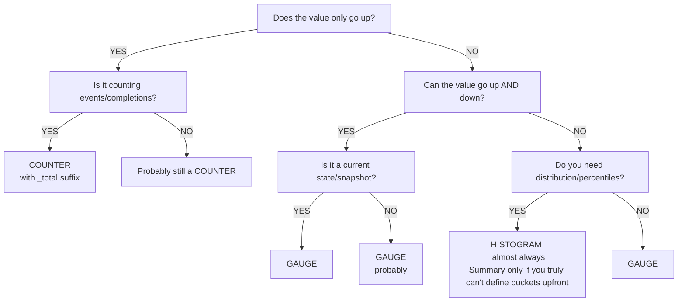
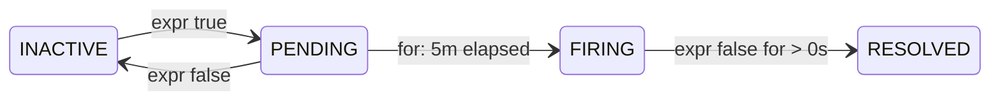
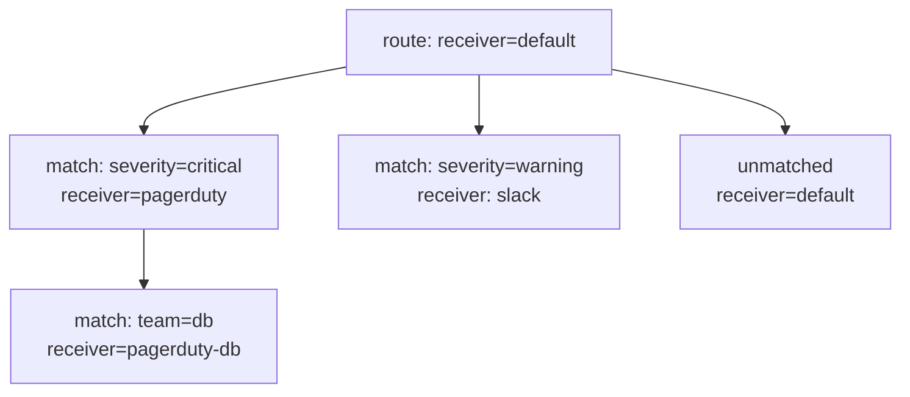

> **PCA Track** | Complexity: `[COMPLEX]` | Time: 45-55 min

## Prerequisites

Before starting this module, ensure you have completed:
- [Prometheus Module](/platform/toolkits/observability-intelligence/observability/module-1.1-prometheus/) — core architecture, metric types, and basic alerting
- [PromQL Deep Dive](../module-1.1-promql-deep-dive/) — advanced query fundamentals
- [Observability 3.3: Instrumentation Principles](/platform/foundations/observability-theory/module-3.3-instrumentation-principles/) — theoretical basis for telemetry
- Basic Go, Python, or Java knowledge (required for understanding client library implementation examples)

---

## What You'll Be Able to Do

After completing this rigorous module, you will be able to:

1. **Design** an application instrumentation strategy using the correct metric types (counter, gauge, histogram) for varying operational signals.
2. **Implement** custom metrics in Python, Go, and Java applications using standard Prometheus client libraries.
3. **Diagnose** high-cardinality issues and apply proper naming conventions to ensure predictable storage costs and performant queries.
4. **Evaluate** routing trees and inhibition rules in Alertmanager to minimize false positives and prevent pager fatigue during cascading failures.
5. **Compare** and configure standard Prometheus exporters, such as node_exporter and blackbox_exporter, for infrastructure and external endpoint observability.

---

## Why This Module Matters

The database team at a large ride-sharing company added a custom Prometheus metric to track query latency. They were extremely proud of it — `db_query_duration_milliseconds`. It worked perfectly in their isolated development environment, where dashboards were built specifically for their internal database service.

Three weeks later, the infrastructure team tried to create a high-level SLO dashboard combining API latency (measured in seconds using `http_request_duration_seconds`) with the new database latency metric. The query looked simple and logical:

```promql
histogram_quantile(0.99,
  sum by (le)(rate(http_request_duration_seconds_bucket[5m]))
)
+
histogram_quantile(0.99,
  sum by (le)(rate(db_query_duration_milliseconds_bucket[5m]))
)
```

During a routine load test, the P99 total latency dashboard suddenly showed **3,000.2 seconds**. It took 45 minutes of intense, panicked confusion during what they thought was a major incident before a senior engineer realized the root cause: one metric was measured in seconds, and the other in milliseconds. The query was inadvertently adding 0.2 seconds of API latency to 3,000 milliseconds of DB latency. The result was mathematically correct but semantically nonsensical. 

The resulting blind spot led to a failure to trigger automated scaling groups, causing a cascading failure during peak hours that cost the company an estimated $4.2 million in lost revenue and SLA penalties. The fix required a massive migration: renaming the metric, updating all downstream dashboards, modifying critical alerting rules, and coordinating a rolling deployment across 400 database pods. It took two engineer-weeks of work, all because of a single naming convention violation.

The Prometheus naming convention exists for exactly this reason: **always use base units** — seconds, bytes, meters. Never milliseconds, kilobytes, or centimeters. This war story is a testament to why instrumentation and alerting are critical engineering disciplines, not just afterthoughts. Bad instrumentation creates metrics nobody can trust. Bad alerting creates noise that trains your team to ignore pages.

---

## Did You Know?

- **Prometheus client libraries exist for 15+ languages** — Go, Python, Java, Ruby, Rust, .NET, Erlang, Haskell, and more. The Go library serves as the official reference implementation, while others closely follow its robust architectural patterns.
- **node_exporter exposes over 1,000 distinct metrics** on a typical Linux system — covering CPU, memory, disk, network, filesystem, and kernel state. It is the single most widely deployed Prometheus exporter globally.
- **Alertmanager was designed around the concept of "routing trees"** inspired by complex email routing logic from the 1990s. The hierarchical tree structure allows you to route different alert severities to different teams and channels using a single, unified configuration file.
- **The `_total` suffix on counters was originally optional** in the early days of Prometheus but became strictly mandatory in the official OpenMetrics standard published in 2018. Modern Prometheus servers will often add it automatically if missing, but you should always explicitly include it in your code.

---

## The Four Metric Types

Prometheus defines four core metric types. Choosing the correct type is the most fundamental decision you will make during application instrumentation.

### Counter

A counter is a cumulative metric that represents a single monotonically increasing value. Its value can only increase or be reset to zero on restart.

```text
COUNTER: Monotonically increasing value
──────────────────────────────────────────────────────────────

Value over time:
  0 → 1 → 5 → 12 → 30 → 0 → 3 → 15 → 28
                          ↑
                     restart/reset

USE WHEN:
  ✓ Counting events (requests, errors, bytes sent)
  ✓ Counting completions (jobs finished, items processed)
  ✓ Anything that only goes up during normal operation

DON'T USE WHEN:
  ✗ Value can decrease (temperature, queue size)
  ✗ Value represents current state (active connections)

ALWAYS QUERY WITH rate() or increase():
  rate(http_requests_total[5m])      ← per-second rate
  increase(http_requests_total[1h])  ← total in last hour
```

> **Stop and think**: If a pod restarts, its counter drops back to zero. How does PromQL's `rate()` function handle this sudden drop without reporting a massive negative rate? (Hint: The function looks for counter resets and seamlessly compensates for the drop).

### Gauge

A gauge is a metric that represents a single numerical value that can arbitrarily go up and down. It represents a snapshot of state.

```text
GAUGE: Current value that can increase or decrease
──────────────────────────────────────────────────────────────

Value over time:
  42 → 38 → 55 → 71 → 63 → 48 → 52

USE WHEN:
  ✓ Current state (temperature, queue depth, active connections)
  ✓ Snapshots (memory usage, disk space, goroutine count)
  ✓ Values that go up AND down

DON'T USE WHEN:
  ✗ Counting events (use Counter)
  ✗ Measuring distributions (use Histogram)

QUERY DIRECTLY (no rate needed):
  node_memory_MemAvailable_bytes     ← current available memory
  kube_deployment_spec_replicas      ← desired replica count
```

### Histogram

A histogram samples observations (usually things like request durations or response sizes) and counts them in configurable buckets. It also provides a sum of all observed values.

```text
HISTOGRAM: Distribution of values in buckets
──────────────────────────────────────────────────────────────

Generates 3 types of series:
  metric_bucket{le="0.1"}   = 24054    ← cumulative count ≤ 0.1s
  metric_bucket{le="0.5"}   = 129389   ← cumulative count ≤ 0.5s
  metric_bucket{le="+Inf"}  = 144927   ← total count (all observations)
  metric_sum                 = 53423.4  ← sum of all observed values
  metric_count               = 144927   ← total number of observations

USE WHEN:
  ✓ Request latency (the primary use case)
  ✓ Response sizes
  ✓ Any distribution where you need percentiles
  ✓ SLO calculations (bucket at your SLO target)

ADVANTAGES:
  ✓ Aggregatable across instances (can sum buckets)
  ✓ Can calculate any percentile after the fact
  ✓ Can compute average (sum / count)

TRADE-OFFS:
  ✗ Fixed bucket boundaries chosen at instrumentation time
  ✗ Each bucket is a separate time series (cardinality cost)
  ✗ Percentile accuracy depends on bucket granularity
```

### Summary

Similar to a histogram, a summary samples observations. However, instead of counting observations in buckets, it calculates configurable quantiles on the client side over a sliding time window.

```text
SUMMARY: Client-computed quantiles
──────────────────────────────────────────────────────────────

Generates series like:
  metric{quantile="0.5"}   = 0.042    ← median
  metric{quantile="0.9"}   = 0.087    ← P90
  metric{quantile="0.99"}  = 0.235    ← P99
  metric_sum                = 53423.4  ← sum of all observed values
  metric_count              = 144927   ← total number of observations

USE WHEN:
  ✓ You need exact quantiles from a single instance
  ✓ You can't choose histogram bucket boundaries upfront
  ✓ Streaming quantile algorithms are acceptable

DON'T USE WHEN (most of the time):
  ✗ You need to aggregate across instances
     (cannot add quantiles meaningfully!)
  ✗ You need flexible percentile calculation at query time
  ✗ You need SLO calculations

PREFER HISTOGRAMS. Summaries exist for legacy reasons.
```

### Decision Framework: Which Type?

Use this decision tree when instrumenting a new operational signal in your application.



---

## Client Library Instrumentation

Exposing metrics from an application involves integrating a Prometheus client library. Below are implementations in three major languages. Pay close attention to how labels and buckets are defined at instantiation time.

### Go (Reference Implementation)

Go is the native language of Prometheus. The `client_golang` library is incredibly efficient and heavily optimized for high-throughput microservices.

```go
package main

import (
    "net/http"
    "time"

    "github.com/prometheus/client_golang/prometheus"
    "github.com/prometheus/client_golang/prometheus/promauto"
    "github.com/prometheus/client_golang/prometheus/promhttp"
)

var (
    // Counter: total HTTP requests
    httpRequestsTotal = promauto.NewCounterVec(
        prometheus.CounterOpts{
            Name: "myapp_http_requests_total",
            Help: "Total number of HTTP requests.",
        },
        []string{"method", "status", "path"},
    )

    // Histogram: request latency
    httpRequestDuration = promauto.NewHistogramVec(
        prometheus.HistogramOpts{
            Name:    "myapp_http_request_duration_seconds",
            Help:    "HTTP request latency in seconds.",
            Buckets: []float64{.005, .01, .025, .05, .1, .25, .5, 1, 2.5, 5},
        },
        []string{"method", "path"},
    )

    // Gauge: active connections
    activeConnections = promauto.NewGauge(
        prometheus.GaugeOpts{
            Name: "myapp_active_connections",
            Help: "Number of currently active connections.",
        },
    )
)

func handler(w http.ResponseWriter, r *http.Request) {
    start := time.Now()
    activeConnections.Inc()
    defer activeConnections.Dec()

    // ... handle request ...
    w.WriteHeader(http.StatusOK)

    duration := time.Since(start).Seconds()
    httpRequestsTotal.WithLabelValues(r.Method, "200", r.URL.Path).Inc()
    httpRequestDuration.WithLabelValues(r.Method, r.URL.Path).Observe(duration)
}

func main() {
    http.HandleFunc("/", handler)
    http.Handle("/metrics", promhttp.Handler())
    http.ListenAndServe(":8080", nil)
}
```

### Python

In Python, the approach is extremely straightforward. In production systems, you will rarely instrument individual route handlers manually; instead, you would utilize WSGI/ASGI middleware (like `prometheus_flask_instrumentator` or FastAPI middleware) to intercept and observe all incoming traffic.

```python
from prometheus_client import Counter, Histogram, Gauge, start_http_server
import time

# Counter: total HTTP requests
REQUEST_COUNT = Counter(
    'myapp_http_requests_total',
    'Total number of HTTP requests.',
    ['method', 'status', 'path']
)

# Histogram: request latency
REQUEST_LATENCY = Histogram(
    'myapp_http_request_duration_seconds',
    'HTTP request latency in seconds.',
    ['method', 'path'],
    buckets=[.005, .01, .025, .05, .1, .25, .5, 1, 2.5, 5]
)

# Gauge: active connections
ACTIVE_CONNECTIONS = Gauge(
    'myapp_active_connections',
    'Number of currently active connections.'
)

def handle_request(method, path):
    ACTIVE_CONNECTIONS.inc()
    start = time.time()

    # ... handle request ...
    status = "200"

    duration = time.time() - start
    REQUEST_COUNT.labels(method=method, status=status, path=path).inc()
    REQUEST_LATENCY.labels(method=method, path=path).observe(duration)
    ACTIVE_CONNECTIONS.dec()

# Start metrics server on port 8000
start_http_server(8000)

# For Flask/FastAPI, use middleware instead:
# from prometheus_flask_instrumentator import Instrumentator
# Instrumentator().instrument(app).expose(app)
```

### Java (Micrometer / simpleclient)

In the JVM ecosystem, raw Prometheus `simpleclient` is commonly used, though frameworks like Spring Boot abstract this away utilizing Micrometer facades.

```java
import io.prometheus.client.Counter;
import io.prometheus.client.Histogram;
import io.prometheus.client.Gauge;
import io.prometheus.client.exporter.HTTPServer;

public class MyApp {
    // Counter: total HTTP requests
    static final Counter requestsTotal = Counter.build()
        .name("myapp_http_requests_total")
        .help("Total number of HTTP requests.")
        .labelNames("method", "status", "path")
        .register();

    // Histogram: request latency
    static final Histogram requestDuration = Histogram.build()
        .name("myapp_http_request_duration_seconds")
        .help("HTTP request latency in seconds.")
        .labelNames("method", "path")
        .buckets(.005, .01, .025, .05, .1, .25, .5, 1, 2.5, 5)
        .register();

    // Gauge: active connections
    static final Gauge activeConnections = Gauge.build()
        .name("myapp_active_connections")
        .help("Number of currently active connections.")
        .register();

    public void handleRequest(String method, String path) {
        activeConnections.inc();
        Histogram.Timer timer = requestDuration
            .labels(method, path)
            .startTimer();

        try {
            // ... handle request ...
            requestsTotal.labels(method, "200", path).inc();
        } finally {
            timer.observeDuration();
            activeConnections.dec();
        }
    }

    public static void main(String[] args) throws Exception {
        // Expose metrics on port 8000
        HTTPServer server = new HTTPServer(8000);
    }
}
```

---

## Metric Naming Conventions

Strict adherence to naming conventions ensures that developers across disparate teams can query and join metrics without consulting documentation. As seen in the war story above, violating unit standards can cause catastrophic reporting failures.

### The Rules

```text
PROMETHEUS NAMING CONVENTION
──────────────────────────────────────────────────────────────

Format: <namespace>_<name>_<unit>_<suffix>

namespace  = application or library name (myapp, http, node)
name       = what is being measured (requests, duration, size)
unit       = base unit (seconds, bytes, meters — NEVER milli/kilo)
suffix     = metric type indicator (_total for counters, _info for info)

GOOD:
  myapp_http_requests_total              ← counter, counts requests
  myapp_http_request_duration_seconds    ← histogram, duration in seconds
  myapp_http_response_size_bytes         ← histogram, size in bytes
  node_memory_MemAvailable_bytes         ← gauge, memory in bytes
  process_cpu_seconds_total              ← counter, CPU time in seconds

BAD:
  myapp_requests                         ← missing unit, missing _total
  http_request_duration_milliseconds     ← use seconds, not milliseconds
  db_query_time_ms                       ← abbreviation, non-base unit
  MyApp_HTTP_Requests                    ← camelCase/PascalCase, use snake_case
  request_latency                        ← vague, missing namespace and unit
```

### Unit Rules

| Measurement | Base Unit | Suffix | Example |
|-------------|-----------|--------|---------|
| Time/Duration | seconds | `_seconds` | `http_request_duration_seconds` |
| Data size | bytes | `_bytes` | `http_response_size_bytes` |
| Temperature | celsius | `_celsius` | `room_temperature_celsius` |
| Voltage | volts | `_volts` | `power_supply_volts` |
| Energy | joules | `_joules` | `cpu_energy_joules` |
| Weight | grams | `_grams` | `package_weight_grams` |
| Ratios | ratio | `_ratio` | `cache_hit_ratio` |
| Percentages | ratio (0-1) | `_ratio` | Use 0-1, not 0-100 |

### Suffix Rules

| Type | Suffix | Example |
|------|--------|---------|
| Counter | `_total` | `http_requests_total` |
| Counter (created timestamp) | `_created` | `http_requests_created` |
| Histogram | `_bucket`, `_sum`, `_count` | `http_request_duration_seconds_bucket` |
| Summary | `_sum`, `_count` | `rpc_duration_seconds_sum` |
| Info metric | `_info` | `build_info{version="1.2.3"}` |
| Gauge | (no suffix) | `node_memory_MemAvailable_bytes` |

### Label Best Practices and Cardinality

Cardinality refers to the total number of unique time series stored in the TSDB. Every unique combination of labels creates a brand-new time series in memory. High cardinality will crash your Prometheus server faster than any query payload.

```text
LABEL DO'S AND DON'TS
──────────────────────────────────────────────────────────────

DO:
  ✓ Use labels for dimensions you'll filter/aggregate by
  ✓ Keep cardinality bounded (status codes: ~5 values)
  ✓ Use consistent names: "method" not "http_method" in one
    place and "request_method" in another

DON'T:
  ✗ user_id (millions of values = millions of series)
  ✗ request_id (unbounded, every request creates a series)
  ✗ email (PII + unbounded cardinality)
  ✗ url with path parameters (/users/12345 = unique per user)
  ✗ error_message (free-form text = unbounded)
  ✗ timestamp as label (infinite cardinality)

RULE OF THUMB:
  If a label can have more than ~100 unique values,
  it probably shouldn't be a label.
  Each unique label combination = one time series in memory.
```

> **Pause and predict**: What happens to Prometheus's memory usage and query performance if you ignore this advice and add a label for `user_email` to your `http_requests_total` metric? If you have 500,000 active users, you instantly generate 500,000 distinct time series in active memory per pod, leading to an immediate out-of-memory (OOM) kill on the Prometheus server.

---

## Exporters

For applications and infrastructure that you do not own and cannot modify with a client library, the community relies on exporters. Exporters are sidecar processes or standalone binaries that extract statistics from a third-party system and translate them into Prometheus metrics.

### node_exporter (Hardware & OS Metrics)

`node_exporter` is the foundational monitoring block for bare-metal servers and virtual machines. It exposes comprehensive hardware and OS-level telemetry.

```bash
# Install via binary
wget https://github.com/prometheus/node_exporter/releases/download/v1.8.1/node_exporter-1.8.1.linux-amd64.tar.gz
tar xvfz node_exporter-*.tar.gz
./node_exporter

# Or via Kubernetes DaemonSet (kube-prometheus-stack includes it)
helm install monitoring prometheus-community/kube-prometheus-stack
```

**Key metrics from node_exporter:**

```promql
# CPU utilization
1 - avg by (instance)(rate(node_cpu_seconds_total{mode="idle"}[5m]))

# Memory utilization
1 - (node_memory_MemAvailable_bytes / node_memory_MemTotal_bytes)

# Disk space usage
1 - (node_filesystem_avail_bytes{mountpoint="/"} / node_filesystem_size_bytes{mountpoint="/"})

# Network throughput
rate(node_network_receive_bytes_total{device="eth0"}[5m])
rate(node_network_transmit_bytes_total{device="eth0"}[5m])

# Disk I/O
rate(node_disk_read_bytes_total[5m])
rate(node_disk_written_bytes_total[5m])
```

### blackbox_exporter (Probing)

Unlike node_exporter which monitors the system it runs on, `blackbox_exporter` probes external endpoints over HTTP, HTTPS, DNS, TCP, and ICMP. It acts as an active testing agent, useful for monitoring external APIs or verifying DNS resolution from outside the cluster.

```yaml
# blackbox-exporter config
modules:
  http_2xx:
    prober: http
    timeout: 5s
    http:
      valid_http_versions: ["HTTP/1.1", "HTTP/2.0"]
      valid_status_codes: [200]
      follow_redirects: true

  http_post_2xx:
    prober: http
    http:
      method: POST

  tcp_connect:
    prober: tcp
    timeout: 5s

  dns_lookup:
    prober: dns
    dns:
      query_name: "kubernetes.default.svc.cluster.local"
      query_type: "A"

  icmp_ping:
    prober: icmp
    timeout: 5s
```

The true power of `blackbox_exporter` comes from Prometheus relabeling configurations. You configure Prometheus to pass the external target URL to the exporter via query parameters (`/probe?target=...&module=http_2xx`).

```yaml
scrape_configs:
  - job_name: 'blackbox-http'
    metrics_path: /probe
    params:
      module: [http_2xx]
    static_configs:
      - targets:
        - https://example.com
        - https://api.myservice.com/health
    relabel_configs:
      # Pass the target URL as a parameter
      - source_labels: [__address__]
        target_label: __param_target
      # Store original target as a label
      - source_labels: [__param_target]
        target_label: instance
      # Point to the blackbox exporter
      - target_label: __address__
        replacement: blackbox-exporter:9115
```

**Key blackbox metrics:**

```promql
# Is the endpoint up?
probe_success{job="blackbox-http"}

# SSL certificate expiry (days)
(probe_ssl_earliest_cert_expiry - time()) / 86400

# HTTP response time
probe_http_duration_seconds

# DNS lookup time
probe_dns_lookup_time_seconds
```

### Other Common Exporters

| Exporter | Purpose | Key Metrics |
|----------|---------|-------------|
| **mysqld_exporter** | MySQL databases | Queries/sec, connections, replication lag |
| **postgres_exporter** | PostgreSQL databases | Active connections, transaction rate, table sizes |
| **redis_exporter** | Redis | Commands/sec, memory usage, connected clients |
| **kafka_exporter** | Apache Kafka | Consumer lag, topic offsets, partition count |
| **nginx_exporter** | Nginx | Active connections, requests/sec, response codes |
| **kube-state-metrics** | Kubernetes objects | Pod status, deployment replicas, node conditions |
| **cadvisor** | Containers | CPU, memory, network per container |

---

## Alertmanager Deep Dive

Metrics mean nothing if no one responds when the system breaks. Alertmanager sits alongside Prometheus to deduplicate, group, and route fired alerts to human operators via tools like Slack, PagerDuty, or email.

### Alert Lifecycle

An alert transitions through multiple states governed strictly by the `for` duration specified in the PromQL rule.



- **INACTIVE**: Alert expression evaluates to false. Normal operational state. No action.
- **PENDING**: Alert expression evaluates to true. Prometheus waits for the defined `for` duration to elapse. This critically prevents noise from brief, transient spikes (like a 10-second CPU overload).
- **FIRING**: Alert expression has remained true for at least the `for` duration. Prometheus pushes the alert to Alertmanager for downstream routing and notification.
- **RESOLVED**: Alert was previously firing, but the underlying expression is now false. Alertmanager sends a "resolved" notification to the channels.

### Alerting Rules

Alerting rules are evaluated periodically by Prometheus. You must configure them with explicit severities and runbook links to ensure on-call engineers have actionable context at 3 AM.

```yaml
groups:
  - name: application-alerts
    rules:
      # HIGH SEVERITY: Service completely down
      - alert: ServiceDown
        expr: up == 0
        for: 1m
        labels:
          severity: critical
          team: platform
        annotations:
          summary: "{{ $labels.job }} is down"
          description: "{{ $labels.instance }} has been unreachable for >1 minute."
          runbook_url: "https://wiki.example.com/runbooks/service-down"

      # HIGH SEVERITY: Error rate spike
      - alert: HighErrorRate
        expr: |
          sum by (service)(rate(http_requests_total{status=~"5.."}[5m]))
          /
          sum by (service)(rate(http_requests_total[5m]))
          > 0.05
        for: 5m
        labels:
          severity: critical
        annotations:
          summary: "High error rate on {{ $labels.service }}"
          description: "Error rate is {{ $value | humanizePercentage }}."

      # MEDIUM SEVERITY: Slow responses
      - alert: HighLatency
        expr: |
          histogram_quantile(0.99,
            sum by (le, service)(rate(http_request_duration_seconds_bucket[5m]))
          ) > 2
        for: 10m
        labels:
          severity: warning
        annotations:
          summary: "High P99 latency on {{ $labels.service }}"
          description: "P99 latency is {{ $value | humanizeDuration }}."

      # LOW SEVERITY: Certificate expiring
      - alert: SSLCertExpiringSoon
        expr: (probe_ssl_earliest_cert_expiry - time()) / 86400 < 30
        for: 1h
        labels:
          severity: warning
        annotations:
          summary: "SSL cert for {{ $labels.instance }} expires in {{ $value | humanize }} days"

      # CAPACITY: Disk filling up
      - alert: DiskSpaceLow
        expr: |
          (node_filesystem_avail_bytes{mountpoint="/"} / node_filesystem_size_bytes{mountpoint="/"})
          < 0.15
        for: 15m
        labels:
          severity: warning
        annotations:
          summary: "Disk space below 15% on {{ $labels.instance }}"

      # SLO-BASED: Error budget burn rate
      - alert: ErrorBudgetBurnRate
        expr: |
          job:http_error_ratio:rate5m > (14.4 * 0.001)
        for: 5m
        labels:
          severity: critical
        annotations:
          summary: "Error budget burning too fast for {{ $labels.job }}"
          description: "At current rate, error budget will be exhausted in <1 hour."
```

### Alertmanager Configuration

The Alertmanager configuration file (`alertmanager.yml`) is the brain of your incident response pipeline. It defines globals, templates, routing trees, receivers, and inhibition logic.

```yaml
# alertmanager.yml — complete production example
global:
  resolve_timeout: 5m
  smtp_smarthost: 'smtp.example.com:587'
  smtp_from: 'alertmanager@example.com'
  smtp_auth_username: 'alertmanager'
  smtp_auth_password: '<secret>'
  slack_api_url: 'https://hooks.slack.com/services/T00/B00/xxxx'
  pagerduty_url: 'https://events.pagerduty.com/v2/enqueue'

# TEMPLATES: customize notification format
templates:
  - '/etc/alertmanager/templates/*.tmpl'

# ROUTING TREE: determines where alerts go
route:
  # Default receiver for unmatched alerts
  receiver: 'slack-default'

  # Group alerts by these labels (reduces noise)
  group_by: ['alertname', 'service']

  # Wait before sending first notification for a group
  group_wait: 30s

  # Wait before sending updates to an existing group
  group_interval: 5m

  # Wait before re-sending a firing alert
  repeat_interval: 4h

  # Child routes (evaluated top-to-bottom, first match wins)
  routes:
    # Critical alerts → PagerDuty (wake someone up)
    - match:
        severity: critical
      receiver: 'pagerduty-critical'
      repeat_interval: 1h
      routes:
        # Database team owns DB alerts
        - match:
            team: database
          receiver: 'pagerduty-database'

    # Warning alerts → Slack channel
    - match:
        severity: warning
      receiver: 'slack-warnings'
      repeat_interval: 4h

    # Info alerts → email digest
    - match:
        severity: info
      receiver: 'email-digest'
      group_wait: 10m
      repeat_interval: 24h

    # Regex matching: any alert from staging
    - match_re:
        environment: staging|dev
      receiver: 'slack-staging'
      repeat_interval: 12h

# RECEIVERS: notification targets
receivers:
  - name: 'slack-default'
    slack_configs:
      - channel: '#alerts'
        send_resolved: true
        title: '{{ .Status | toUpper }}: {{ .CommonLabels.alertname }}'
        text: >-
          {{ range .Alerts }}
          *{{ .Labels.alertname }}* ({{ .Labels.severity }})
          {{ .Annotations.description }}
          {{ end }}

  - name: 'pagerduty-critical'
    pagerduty_configs:
      - routing_key: '<pagerduty-integration-key>'
        severity: critical
        description: '{{ .CommonLabels.alertname }}: {{ .CommonAnnotations.summary }}'

  - name: 'pagerduty-database'
    pagerduty_configs:
      - routing_key: '<database-team-key>'
        severity: critical

  - name: 'slack-warnings'
    slack_configs:
      - channel: '#alerts-warnings'
        send_resolved: true

  - name: 'slack-staging'
    slack_configs:
      - channel: '#alerts-staging'
        send_resolved: false

  - name: 'email-digest'
    email_configs:
      - to: 'team@example.com'
        send_resolved: false

# INHIBITION RULES: suppress dependent alerts
inhibit_rules:
  # If a critical alert fires, suppress warnings for the same service
  - source_match:
      severity: critical
    target_match:
      severity: warning
    equal: ['alertname', 'service']

  # If a node is down, suppress all pod alerts on that node
  - source_match:
      alertname: NodeDown
    target_match_re:
      alertname: Pod.*
    equal: ['node']

  # If cluster is unreachable, suppress everything
  - source_match:
      alertname: ClusterUnreachable
    target_match_re:
      alertname: .+
    equal: ['cluster']
```

### Routing Tree Visual

Routing trees process alerts linearly top-to-bottom. The alert traverses the tree until it finds the deepest matching node.

```mermaid
graph TD
    R[route: receiver = slack-default]
    R --> M1[match: severity=critical <br/> receiver: pagerduty-critical]
    M1 --> M1A[match: team=database <br/> receiver: pagerduty-database]
    R --> M2[match: severity=warning <br/> receiver: slack-warnings]
    R --> M3[match: severity=info <br/> receiver: email-digest]
    R --> M4[match_re: env=staging|dev <br/> receiver: slack-staging]
    
    style M1 stroke:#f00,stroke-width:2px
```

*Example logic:*
Incoming Alert: `{alertname="HighErrorRate", severity="critical", team="api"}`

Result: Alert bypasses the root, matches `severity=critical` (M1). It checks the child route `team=database` (M1A) but fails to match because `team="api"`. The traversal stops, and the alert is dispatched to `pagerduty-critical`. By default, routing stops at the first match unless the `continue: true` flag is explicitly applied to the branch.

### Inhibition Rules Explained

Inhibition suppresses dependent symptom alerts when a known root-cause alert is already firing.

```text
INHIBITION: Suppressing dependent alerts
──────────────────────────────────────────────────────────────

Scenario: Node goes down → all pods on that node fail

WITHOUT inhibition:
  Alert: NodeDown (node-1)              ← root cause
  Alert: PodCrashLooping (pod-a)        ← symptom
  Alert: PodCrashLooping (pod-b)        ← symptom
  Alert: PodCrashLooping (pod-c)        ← symptom
  Alert: HighErrorRate (service-x)      ← symptom
  = 5 pages for one problem!

WITH inhibition:
  inhibit_rules:
    - source_match: {alertname: NodeDown}
      target_match_re: {alertname: "Pod.*|HighErrorRate"}
      equal: [node]

  Alert: NodeDown (node-1)              ← only this fires
  (all dependent alerts suppressed)
  = 1 page for one problem!
```

### Silences

Inhibition is automatic and ongoing. **Silencing**, on the other hand, is manual and temporary. You use silences to mute alerts during planned maintenance windows, ensuring you don't receive false positives while intentionally taking infrastructure offline.

```bash
# Create a silence via amtool CLI
amtool silence add \
  --alertmanager.url=http://localhost:9093 \
  --author="jane@example.com" \
  --comment="Planned database maintenance window" \
  --duration=2h \
  service="database" severity="warning"

# List active silences
amtool silence query --alertmanager.url=http://localhost:9093

# Expire (remove) a silence
amtool silence expire --alertmanager.url=http://localhost:9093 <silence-id>
```

---

## Recording Rules for Alerting

PromQL queries can be resource-intensive, particularly those analyzing high-cardinality histograms spanning long intervals. Evaluating these heavy expressions continuously as part of an alerting pipeline or rendering them in real-time on a Grafana dashboard can severely degrade Prometheus TSDB performance. 

Recording rules pre-compute expensive expressions on a background interval (e.g., every 30 seconds) and save the result back into the TSDB as an entirely new time series. 

```yaml
groups:
  - name: recording_rules
    interval: 30s
    rules:
      # Pre-compute error ratio per service
      - record: service:http_error_ratio:rate5m
        expr: |
          sum by (service)(rate(http_requests_total{status=~"5.."}[5m]))
          /
          sum by (service)(rate(http_requests_total[5m]))

      # Pre-compute P99 latency per service
      - record: service:http_latency_p99:rate5m
        expr: |
          histogram_quantile(0.99,
            sum by (le, service)(rate(http_request_duration_seconds_bucket[5m]))
          )

      # Pre-compute CPU utilization per node
      - record: node:cpu_utilization:ratio_rate5m
        expr: |
          1 - avg by (node)(rate(node_cpu_seconds_total{mode="idle"}[5m]))

  - name: alerting_rules
    rules:
      # NOW alerting rules can use the pre-computed values
      - alert: HighErrorRate
        expr: service:http_error_ratio:rate5m > 0.05
        for: 5m
        labels:
          severity: critical
        annotations:
          summary: "Error rate {{ $value | humanizePercentage }} on {{ $labels.service }}"

      - alert: HighLatency
        expr: service:http_latency_p99:rate5m > 2
        for: 10m
        labels:
          severity: warning

      - alert: HighCPU
        expr: node:cpu_utilization:ratio_rate5m > 0.9
        for: 15m
        labels:
          severity: warning
```

The resulting alerting rules evaluate instantaneously against the pre-computed recording rules, completely removing the query burden during incident assessment. Note the standardized naming convention for recording rules: `level:metric:operations`.

---

## Common Mistakes

| Mistake | Problem | Solution |
|---------|---------|----------|
| Using milliseconds for duration | Unit mismatch with other metrics | Always use base units: `_seconds`, not `_milliseconds` |
| Counter without `_total` suffix | Violates OpenMetrics standard | Always append `_total` to counter names |
| High-cardinality labels (user_id) | Memory explosion, slow queries | Remove unbounded labels; aggregate at application level |
| Missing `Help` text on metrics | Hard to understand; fails lint checks | Always add descriptive Help strings |
| Alerting without `for` duration | Flapping alerts from transient spikes | Use `for: 5m` minimum for most alerts |
| No inhibition rules | Alert storms during major incidents | Suppress symptoms when root-cause alert fires |
| Silencing without comments | Nobody knows why alerts were muted | Always add author, comment, and expiry |
| Summary instead of Histogram | Cannot aggregate across instances | Use Histogram unless you have a specific reason not to |
| Missing runbook_url in annotations | On-call engineer has no guidance | Always link to a runbook explaining diagnosis/fix |
| Too many receivers | Alert fatigue, nobody reads channels | Consolidate: critical → page, warning → Slack, info → email |

---

## Quiz

<details>
<summary>1. What are the four Prometheus metric types? Give one real-world example for each.</summary>

**Answer**:

1. **Counter**: Monotonically increasing value. Resets on restart. Example: `http_requests_total` — total HTTP requests served.
2. **Gauge**: Value that can go up and down. Example: `node_memory_MemAvailable_bytes` — currently available memory.
3. **Histogram**: Observations bucketed by value, with cumulative counts. Example: `http_request_duration_seconds` — request latency distribution.
4. **Summary**: Client-computed streaming quantiles. Example: `go_gc_duration_seconds` — garbage collection pause duration with pre-computed percentiles.

Key distinction: Histograms are aggregatable across instances (sum buckets), Summaries are not (cannot add quantiles). Prefer Histograms in almost all cases because they allow for cluster-wide percentile aggregation.
</details>

<details>
<summary>2. Why does Prometheus use base units (seconds, bytes) instead of human-friendly units (milliseconds, megabytes)?</summary>

**Answer**:

Base units prevent unit mismatch errors when combining metrics. If one team uses `_milliseconds` and another uses `_seconds`, joining or adding these metrics produces nonsensical results.

Specific reasons:
- **Consistency**: All duration metrics are in seconds, so `rate(a_seconds[5m]) + rate(b_seconds[5m])` always works
- **PromQL functions**: `histogram_quantile()` returns values in the metric's unit — if metrics are in seconds, the result is in seconds
- **Grafana handles display**: Grafana can convert seconds to "2.5ms" or "1.3h" for human display. Store in base units, format at display time.
- **OpenMetrics standard**: Requires base units for interoperability across tools

The rule: **store in base units, display in human units**.
</details>

<details>
<summary>3. Explain the Alertmanager routing tree. How does Alertmanager decide which receiver gets an alert?</summary>

**Answer**:

The routing tree is a hierarchy of routes, each with label matchers and a receiver. Every alert enters at the root route (the top-level `route:`). Child routes are then evaluated top-to-bottom, and the first matching child wins. Matching uses `match` (exact string match) or `match_re` (regular expression) on alert labels.

If no child matches, the alert defaults to the root route's receiver. The tree behavior operates effectively as an exit-on-first-match cascade.



`group_by`, `group_wait`, `group_interval`, and `repeat_interval` control batching:
- `group_by`: Labels to group alerts by (reduces notification count)
- `group_wait`: How long to buffer before sending the first notification
- `group_interval`: Minimum time between updates to a group
- `repeat_interval`: How often to re-send a firing alert
</details>

<details>
<summary>4. What is the difference between inhibition and silencing in Alertmanager?</summary>

**Answer**:

**Inhibition** (automatic, rule-based):
- Suppresses target alerts when a source alert is firing.
- Configured persistently in `inhibit_rules` within `alertmanager.yml`.
- Happens automatically — no human action needed.
- Example: NodeDown inhibits all PodCrashLooping alerts on that node.
- Purpose: Prevent alert storms from cascading failures.

**Silencing** (manual, time-based):
- Temporarily mutes alerts matching specific label matchers.
- Created explicitly via UI or `amtool` CLI by an engineer.
- Requires human action — someone consciously decides to silence the alerts.
- Has a defined, hard expiry time.
- Example: Silence all alerts for `service="database"` during planned maintenance.
- Purpose: Suppress known noise during active maintenance windows.

Key difference: Inhibition is automatic and ongoing (fires whenever the source alert fires). Silencing is manual and temporary (created for a specific time window).
</details>

<details>
<summary>5. You're instrumenting a new microservice. It has an HTTP API and a background job queue. What metrics would you add, with what types and names?</summary>

**Answer**:

**HTTP API metrics:**
```text
myservice_http_requests_total{method, status, path}        — Counter
myservice_http_request_duration_seconds{method, path}      — Histogram
myservice_http_request_size_bytes{method, path}            — Histogram
myservice_http_response_size_bytes{method, path}           — Histogram
myservice_http_active_requests{method}                     — Gauge
```

**Background job metrics:**
```text
myservice_jobs_processed_total{queue, status}              — Counter
myservice_job_duration_seconds{queue}                      — Histogram
myservice_jobs_queued{queue}                               — Gauge (current queue depth)
myservice_job_last_success_timestamp_seconds{queue}        — Gauge
```

**Runtime metrics (auto-exposed by most client libraries):**
```text
process_cpu_seconds_total                                  — Counter
process_resident_memory_bytes                              — Gauge
go_goroutines (if Go)                                      — Gauge
```

Design decisions:
- `path` label should use parameterized route patterns (e.g., `/users/{id}`), not actual concrete paths (`/users/12345`) to avoid cardinality explosions.
- Histogram buckets for HTTP API: `[.005, .01, .025, .05, .1, .25, .5, 1, 2.5, 5]`
- Histogram buckets for background jobs: `[.1, .5, 1, 5, 10, 30, 60, 300]` (background jobs are typically much slower and require a wider spread).
</details>

<details>
<summary>6. What is the purpose of the `for` field in an alerting rule? What happens if you omit it?</summary>

**Answer**:

The `for` field specifies how long the alert expression must be continuously true before the alert transitions from **pending** to **firing**.

```yaml
- alert: HighErrorRate
  expr: error_rate > 0.05
  for: 5m        # Must be true for 5 minutes before firing
```

**Without `for`** (or `for: 0s`):
- The alert fires immediately when the expression is true.
- Next evaluation cycle where expression is false → alert resolves.
- This causes **alert flapping**: brief, microsecond spikes trigger and resolve alerts rapidly.
- On-call engineers get immediately paged for transient network conditions that self-resolve within seconds.

**With `for: 5m`**:
- Brief spikes (< 5 min) are ignored.
- Only sustained structural problems trigger notifications.
- Reduces false positives significantly, preserving team sanity.
</details>

<details>
<summary>7. You are configuring an alert for a critical database service. The database CPU occasionally spikes to 100% for 10-15 seconds during scheduled vacuuming operations, but otherwise remains healthy. Your current alert `expr: node_cpu_utilization > 0.9` fires constantly. How do you fix this without ignoring genuine CPU saturation?</summary>

**Answer**: 

You should implement a strict `for` duration in your alerting rule, such as `for: 5m`. This tells Alertmanager to keep the alert in a "PENDING" state until the expression has been continuously true for 5 minutes. Brief, intense spikes, like the 15-second vacuuming operation, will clear before the duration elapses, preventing false positives. If the CPU remains pegged at 100% for longer than 5 minutes indicating a true runaway process, the alert will transition to "FIRING" and notify the database team.
</details>

<details>
<summary>8. During a major network switch failure, three distinct Kubernetes nodes go offline simultaneously. Suddenly, you receive over 150 pages for `NodeDown`, `PodCrashLooping`, `HighErrorRate`, and `EndpointUnreachable`. How could you have designed your Alertmanager configuration to prevent this alert storm while still notifying the team of the root cause?</summary>

**Answer**: 

This catastrophic scenario necessitates the implementation of Alertmanager inhibition rules (`inhibit_rules`). You would define a rule where the source match is `alertname: NodeDown`, and the target matches depend on the node label (e.g., suppressing all pod and service alerts originating from that specific offline node). When the switch fails, the `NodeDown` alerts fire first, automatically suppressing the cascading noise from the failing workloads. The on-call engineer receives exactly three pages for the dead nodes, drastically reducing alert fatigue and highlighting the actual root cause immediately.
</details>

---

## Hands-On Exercise: Instrument, Export, Alert

Build a complete, end-to-end monitoring pipeline: instrument a Python application, deploy an exporter mechanism, and configure active threshold alerts.

### Setup

```bash
# Ensure you have a cluster with Prometheus
# (Use the setup from Module 1's hands-on, or:)
kind create cluster --name pca-lab
helm repo add prometheus-community https://prometheus-community.github.io/helm-charts
helm repo update
helm install monitoring prometheus-community/kube-prometheus-stack \
  --namespace monitoring --create-namespace
```

### Step 1: Deploy a Python App with Custom Metrics

Create the application components. We have split the configuration into three independent manifests to maintain structural integrity.

```yaml
# instrumented-app-configmap.yaml
apiVersion: v1
kind: ConfigMap
metadata:
  name: app-code
  namespace: monitoring
data:
  app.py: |
    from prometheus_client import Counter, Histogram, Gauge, start_http_server
    import random, time, threading

    REQUESTS = Counter('myapp_http_requests_total', 'Total HTTP requests', ['method', 'status'])
    LATENCY = Histogram('myapp_http_request_duration_seconds', 'Request latency',
                        buckets=[.01, .025, .05, .1, .25, .5, 1, 2.5, 5])
    QUEUE_SIZE = Gauge('myapp_queue_size', 'Current items in queue')
    JOBS = Counter('myapp_jobs_processed_total', 'Jobs processed', ['status'])

    def simulate_traffic():
        while True:
            method = random.choice(['GET', 'GET', 'GET', 'POST', 'PUT'])
            latency = random.expovariate(10)  # ~100ms average
            status = '200' if random.random() > 0.03 else '500'
            REQUESTS.labels(method=method, status=status).inc()
            LATENCY.observe(latency)
            time.sleep(0.1)

    def simulate_queue():
        while True:
            QUEUE_SIZE.set(random.randint(0, 50))
            if random.random() > 0.1:
                JOBS.labels(status='success').inc()
            else:
                JOBS.labels(status='failure').inc()
            time.sleep(1)

    if __name__ == '__main__':
        start_http_server(8000)
        threading.Thread(target=simulate_traffic, daemon=True).start()
        threading.Thread(target=simulate_queue, daemon=True).start()
        print("Metrics server running on :8000")
        while True:
            time.sleep(1)
```

```yaml
# instrumented-app-deployment.yaml
apiVersion: apps/v1
kind: Deployment
metadata:
  name: instrumented-app
  namespace: monitoring
spec:
  replicas: 2
  selector:
    matchLabels:
      app: instrumented-app
  template:
    metadata:
      labels:
        app: instrumented-app
    spec:
      containers:
        - name: app
          image: python:3.11-slim
          command: ["sh", "-c", "pip install prometheus_client && python /app/app.py"]
          ports:
            - containerPort: 8000
              name: metrics
          volumeMounts:
            - name: code
              mountPath: /app
      volumes:
        - name: code
          configMap:
            name: app-code
```

```yaml
# instrumented-app-service.yaml
apiVersion: v1
kind: Service
metadata:
  name: instrumented-app
  namespace: monitoring
  labels:
    app: instrumented-app
spec:
  selector:
    app: instrumented-app
  ports:
    - port: 8000
      targetPort: 8000
      name: metrics
```

Deploy the application assets to your cluster:

```bash
kubectl apply -f instrumented-app-configmap.yaml
kubectl apply -f instrumented-app-deployment.yaml
kubectl apply -f instrumented-app-service.yaml
```

### Step 2: Create a ServiceMonitor

The `ServiceMonitor` is a Custom Resource provided by the Prometheus Operator that tells Prometheus to automatically discover and scrape the application endpoints.

```yaml
# servicemonitor.yaml
apiVersion: monitoring.coreos.com/v1
kind: ServiceMonitor
metadata:
  name: instrumented-app
  namespace: monitoring
  labels:
    release: monitoring  # Must match Prometheus selector
spec:
  selector:
    matchLabels:
      app: instrumented-app
  endpoints:
    - port: metrics
      interval: 15s
      path: /metrics
```

```bash
kubectl apply -f servicemonitor.yaml
```

### Step 3: Verify Scraping

Verify that Prometheus successfully discovered the target by port-forwarding to the web UI.

```bash
# Port-forward to Prometheus
kubectl port-forward -n monitoring svc/monitoring-kube-prometheus-prometheus 9090:9090
```

Open `http://localhost:9090/targets` and verify `instrumented-app` appears dynamically as an active target. Then, navigate to the query interface and execute:

```promql
# Verify metrics are flowing
myapp_http_requests_total

# Request rate
rate(myapp_http_requests_total[5m])

# Error rate
sum(rate(myapp_http_requests_total{status="500"}[5m]))
/ sum(rate(myapp_http_requests_total[5m]))

# P99 latency
histogram_quantile(0.99, sum by (le)(rate(myapp_http_request_duration_seconds_bucket[5m])))

# Queue depth
myapp_queue_size
```

### Step 4: Create Alerting Rules

Finally, define the alerting logic enforcing constraints on the latency and error rates of the application.

```yaml
# alerting-rules.yaml
apiVersion: monitoring.coreos.com/v1
kind: PrometheusRule
metadata:
  name: instrumented-app-alerts
  namespace: monitoring
  labels:
    release: monitoring
spec:
  groups:
    - name: instrumented-app
      rules:
        - alert: MyAppHighErrorRate
          expr: |
            sum(rate(myapp_http_requests_total{status=~"5.."}[5m]))
            / sum(rate(myapp_http_requests_total[5m]))
            > 0.05
          for: 2m
          labels:
            severity: warning
          annotations:
            summary: "High error rate on instrumented-app"
            description: "Error rate is {{ $value | humanizePercentage }}"

        - alert: MyAppHighLatency
          expr: |
            histogram_quantile(0.99,
              sum by (le)(rate(myapp_http_request_duration_seconds_bucket[5m]))
            ) > 1
          for: 5m
          labels:
            severity: warning
          annotations:
            summary: "High P99 latency on instrumented-app"

        - record: myapp:http_error_ratio:rate5m
          expr: |
            sum(rate(myapp_http_requests_total{status=~"5.."}[5m]))
            / sum(rate(myapp_http_requests_total[5m]))
```

```bash
kubectl apply -f alerting-rules.yaml
```

### Step 5: Verify Alerts

Open `http://localhost:9090/alerts` and rigorously confirm the alert rules are loaded successfully. Because the Python app simulates traffic failures, if the error rate exceeds 5%, you should immediately witness `MyAppHighErrorRate` safely transition from `Inactive` to `Pending` and ultimately to `Firing`.

### Success Criteria

You have successfully completed this laboratory exercise when you can confirm the following checklist:
- [ ] You can see the custom metrics (`myapp_*`) exposed natively in Prometheus.
- [ ] You can execute queries verifying request rate, error rate, and P99 latency percentiles.
- [ ] The `ServiceMonitor` correctly instructed Prometheus to scrape the deployed application.
- [ ] The alerting rules are loaded and actively evaluating within the Prometheus UI.
- [ ] The background recording rule `myapp:http_error_ratio:rate5m` continuously produces aggregated results.
- [ ] You can distinctly map the Counter, Gauge, and Histogram logic from the Python code to the raw TSDB data stream.

---

## Key Takeaways

Before advancing, cement these principles:

- [ ] **Four metric types**: Counter (monotonic, always use rate()), Gauge (up/down snapshots, query directly), Histogram (distribution buckets, compute percentiles with histogram_quantile()), Summary (client-side quantiles, rarely preferred due to lack of aggregation).
- [ ] **Naming conventions**: Adhere strictly to `<namespace>_<name>_<unit>_total` for counters, leverage base units only (seconds, bytes), and favor snake_case.
- [ ] **Label best practices**: Enforce strictly bounded cardinality, strictly forbid user_id/request_id fields, and maintain naming uniformity across enterprise services.
- [ ] **Client libraries**: Native Go, Python, and Java implementations all parallel identical patterns — `Counter.Inc()`, `Gauge.Set()`, and `Histogram.Observe()`.
- [ ] **Exporters**: Rely on `node_exporter` (OS and hardware), `blackbox_exporter` (probing external endpoints), and `kube-state-metrics` (translating Kubernetes object states).
- [ ] **Alert lifecycle**: Transitions flow strictly from inactive -> pending -> firing -> resolved. The crucial `for` field prevents flapping noise.
- [ ] **Alertmanager routing**: Evaluate the top-down tree structure. Understand that first-match wins, `group_by` aggregates identical issues, and `repeat_interval` throttles spam.
- [ ] **Inhibition rules**: Architect dependencies to automatically suppress dependent subsystem alerts when a critical root-cause alert triggers.
- [ ] **Silences**: Utilize manual, temporary muting solely for authorized maintenance. Always annotate with exhaustive comments and firm expiries.
- [ ] **Recording rules**: Shift compute loads backward to pre-calculate expensive metrics for alerting pipelines and visualizations. Utilize the convention: `level:metric:operations`.

---

## Further Reading

- [Prometheus Client Libraries](https://prometheus.io/docs/instrumenting/clientlibs/) — All official client libraries spanning varying paradigms
- [Writing Exporters](https://prometheus.io/docs/instrumenting/writing_exporters/) — Comprehensive guide to compiling highly specific custom exporters
- [Alertmanager Configuration](https://prometheus.io/docs/alerting/latest/configuration/) — The complete technical Alertmanager YAML parameter schema
- [Instrumentation Best Practices](https://prometheus.io/docs/practices/instrumentation/) — The foundational official guide to resilient application telemetry
- [Metric and Label Naming](https://prometheus.io/docs/practices/naming/) — Mandatory naming and labeling conventions reference

---

## Summary

Instrumentation represents the absolute beginning of the observability journey — without robust, predictably named telemetry generated from your core applications and peripheral infrastructure, no amount of subsequent query sophistication will help. This module traversed the complete instrumentation-to-alerting lifecycle: deliberately choosing the proper metric archetype, strictly formatting its nomenclature according to standardized conventions, exposing the signal using client libraries, harvesting peripheral data via specialized exporters, and ultimately routing threshold violation alerts through Alertmanager. Combined with advanced PromQL expertise, you now wield exhaustive, pragmatic authority over the Prometheus observability ecosystem.

---

## Related Modules

- [PCA README]() — Full exam domain mapping, testing parameters, and study strategy
- [PromQL Deep Dive](../module-1.1-promql-deep-dive/) — Complex PromQL techniques mandated for PCA Domain 3
- [Prometheus Fundamentals](/platform/toolkits/observability-intelligence/observability/module-1.1-prometheus/) — Underlying architecture and TSDB storage fundamentals
- [Grafana](/platform/toolkits/observability-intelligence/observability/module-1.3-grafana/) — Masterful dashboarding and panel construction for PCA Domain 5