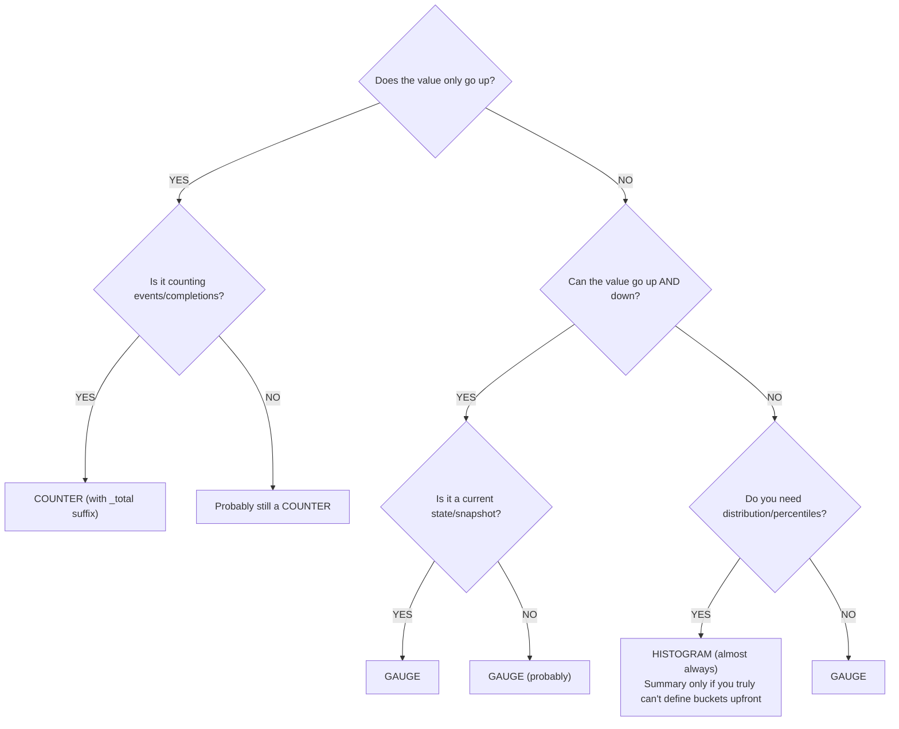
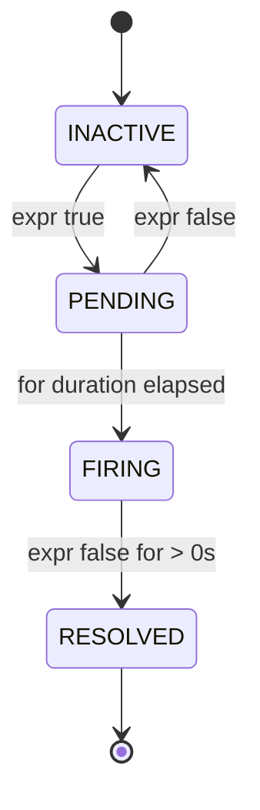
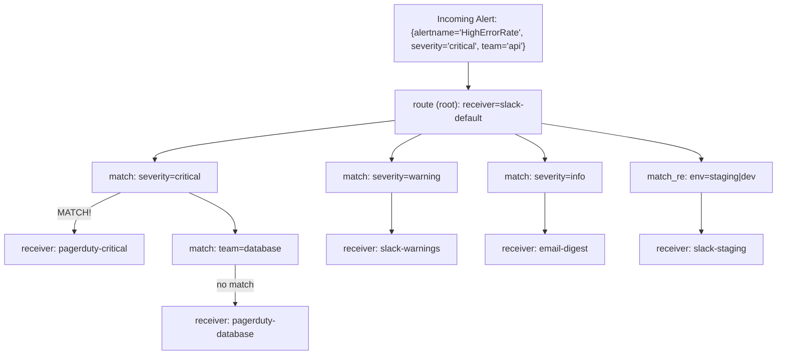
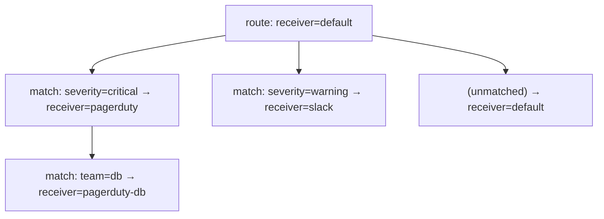

> **PCA Track** | Complexity: `[COMPLEX]` | Time: 45-55 min

## Prerequisites

Before starting this module:
- [Prometheus Module](/platform/toolkits/observability-intelligence/observability/module-1.1-prometheus/) — architecture, metric types, basic alerting
- [PromQL Deep Dive](../module-1.1-promql-deep-dive/) — query fundamentals
- [Observability 3.3: Instrumentation Principles](/platform/foundations/observability-theory/module-3.3-instrumentation-principles/)
- Basic Go, Python, or Java knowledge (for client library examples)

---

## Learning Outcomes

After completing this module, you will be able to:

1. **Implement** application instrumentation using Prometheus client libraries, selecting the correct metric type (counter, gauge, histogram, summary) for distinct telemetry signals.
2. **Design** metric naming schemas and label taxonomies that enforce cardinality boundaries and adhere strictly to OpenMetrics standards.
3. **Evaluate** alerting rules utilizing appropriate `for` durations and severity routing to minimize false positives during transient infrastructure spikes.
4. **Diagnose** notification routing topologies within Alertmanager to ensure critical pages reach on-call responders while informational alerts route asynchronously.

---

## Why This Module Matters

A team can ship a custom latency metric that looks perfectly acceptable in development, and still cause serious operational pain in production if the metric name or unit does not follow Prometheus conventions. 
Because metrics are the common language between application teams, dashboards, alerts, and SLO math, the quality of those definitions directly determines how reliably teams can make decisions.
Later in this module’s example, another team combined a database latency metric with an existing HTTP latency metric in the same SLO dashboard, assuming the units were compatible:

```promql
histogram_quantile(0.99,
  sum by (le)(rate(http_request_duration_seconds_bucket[5m]))
)
+
histogram_quantile(0.99,
  sum by (le)(rate(db_query_duration_milliseconds_bucket[5m]))
)
```

A unit mismatch like this can make a latency dashboard report nonsense values, trigger bad operational decisions, and take hours to diagnose.
The underlying problem is simple: one metric is in seconds while the other is in milliseconds.
The arithmetic still evaluates, but the result is operationally meaningless, so dashboards and alerts can start lying about true latency.
That means your team is effectively running alerts against the wrong unit system.

A metric naming and unit mistake can impose real cleanup costs because dashboards, alerts, and even autoscaling automation may all depend on the old metric definition.
Prometheus naming conventions are a shared contract to reduce that risk, not optional style guidance.
Because we are operating production platforms where every extra incident review is expensive, instrumentation and alerting are core practical skills for reliability, not just exam trivia.

---

## Did You Know?

- Prometheus has official client libraries for several major languages and a large ecosystem of third-party libraries.
- The widely used `node_exporter` exposes a wide variety of host metrics on Linux systems, including CPU, memory, filesystem, and network measurements.
- Alertmanager uses a hierarchical routing tree so one configuration can route alerts to different receivers based on labels.
- For OpenMetrics 1.0 compatibility, counter sample names use the `_total` suffix.

---

## The Four Metric Types

Every piece of data stored in Prometheus begins as one of four fundamental metric types.
Choosing the correct type is the most critical decision you will make when instrumenting code, because once a metric is emitted, switching later means changing dashboards, alerts, and runbooks.
In practice, the best approach is to decide type from business meaning first and let implementation details follow.

### Counter
A counter is a cumulative metric that represents a single monotonically increasing value, and it should only reset when the underlying process restarts.
Because counters represent totals, they are ideal whenever you need to observe how much happened since process startup, and they should almost never be used to represent current state.
That is why the same metric name can be queried repeatedly with `rate()` or `increase()` to answer throughput and change questions over time.

A counter is a cumulative metric that represents a single monotonically increasing value. Think of a counter like the odometer in your car; it only goes up, and it only resets to zero if the engine is completely replaced (or the pod restarts).

```text
COUNTER: Monotonically increasing value
──────────────────────────────────────────────────────────────

Value over time:
  0 → 1 → 5 → 12 → 30 → 0 → 3 → 15 → 28
                          ↑
                     restart/reset

USE WHEN:
  [YES] Counting events (requests, errors, bytes sent)
  [YES] Counting completions (jobs finished, items processed)
  [YES] Anything that only goes up during normal operation

DON'T USE WHEN:
  [NO] Value can decrease (temperature, queue size)
  [NO] Value represents current state (active connections)

ALWAYS QUERY WITH rate() or increase():
  rate(http_requests_total[5m])      ← per-second rate
  increase(http_requests_total[1h])  ← total in last hour
```

### Gauge
A gauge is a numeric value that can move in both directions.
The key idea is that gauges answer current-state questions (“how many now?”) rather than accumulation questions (“how many total?”), so they can drop and rise with load, queue, or resource consumption.
For this reason, gauges are the right fit for active connections, memory pressure, or replica counts, where context at a specific moment matters.

A gauge is a metric that represents a single numerical value that can arbitrarily go up and down.
Think of a gauge like the speedometer in your car; it tells you exactly what is happening right this second, but without historical context, you cannot determine how far you have traveled.

```text
GAUGE: Current value that can increase or decrease
──────────────────────────────────────────────────────────────

Value over time:
  42 → 38 → 55 → 71 → 63 → 48 → 52

USE WHEN:
  [YES] Current state (temperature, queue depth, active connections)
  [YES] Snapshots (memory usage, disk space, goroutine count)
  [YES] Values that go up AND down

DON'T USE WHEN:
  [NO] Counting events (use Counter)
  [NO] Measuring distributions (use Histogram)

QUERY DIRECTLY (no rate needed):
  node_memory_MemAvailable_bytes     ← current available memory
  kube_deployment_spec_replicas      ← desired replica count
```

### Histogram

A histogram samples individual observations (usually things like request durations or response sizes) and counts them in configurable buckets.
Histograms are the backbone of latency measurement and Service Level Objectives because they preserve enough information to estimate percentiles after the fact.
As a design pattern, if you care about “how often does this operation violate a target,” you usually need histogram buckets around user-facing SLO thresholds.

```text
HISTOGRAM: Distribution of values in buckets
──────────────────────────────────────────────────────────────

Generates 3 types of series:
  metric_bucket{le="0.1"}   = 24054    ← cumulative count ≤ 0.1s
  metric_bucket{le="0.5"}   = 129389   ← cumulative count ≤ 0.5s
  metric_bucket{le="+Inf"}  = 144927   ← total count (all observations)
  metric_sum                 = 53423.4  ← sum of all observed values
  metric_count               = 144927   ← total number of observations

USE WHEN:
  [YES] Request latency (the primary use case)
  [YES] Response sizes
  [YES] Any distribution where you need percentiles
  [YES] SLO calculations (bucket at your SLO target)

ADVANTAGES:
  [YES] Aggregatable across instances (can sum buckets)
  [YES] Can calculate any percentile after the fact
  [YES] Can compute average (sum / count)

TRADE-OFFS:
  [NO] Fixed bucket boundaries chosen at instrumentation time
  [NO] Each bucket is a separate time series (cardinality cost)
  [NO] Percentile accuracy depends on bucket granularity
```

### Summary

Summaries, like histograms, calculate distributions of observed events.
However, summaries calculate streaming quantiles directly on the client side rather than relying on server-side Prometheus calculations.
This can be useful when you cannot centrally tune bucket boundaries, but it changes aggregation behavior later in the pipeline.

```text
SUMMARY: [Client-computed quantiles](https://prometheus.io/docs/practices/histograms/)
──────────────────────────────────────────────────────────────

Generates series like:
  metric{quantile="0.5"}   = 0.042    ← median
  metric{quantile="0.9"}   = 0.087    ← P90
  metric{quantile="0.99"}  = 0.235    ← P99
  metric_sum                = 53423.4  ← sum of all observed values
  metric_count              = 144927   ← total number of observations

USE WHEN:
  [YES] You need exact quantiles from a single instance
  [YES] You can't choose histogram bucket boundaries upfront
  [YES] Streaming quantile algorithms are acceptable

DON'T USE WHEN (most of the time):
  [NO] You need to aggregate across instances
     (cannot add quantiles meaningfully!)
  [NO] You need flexible percentile calculation at query time
  [NO] You need SLO calculations

Prefer histograms for most distributed-service latency and SLO use cases; use summaries only when you specifically need client-side quantiles.
```

### Decision Framework: Which Type?

Choosing a metric type shouldn't be guesswork.
A good decision starts with the variable’s semantic meaning, then checks whether it is directional, stateful, or distributive over a set of observations.
Use the following logical tree when writing your instrumentation code, and keep `_total` in mind for counters so downstream tooling can interpret the series consistently.


```mermaid
flowchart TD
    Start{"Does the value only go up?"}
    Start -- YES --> Q2{"Is it counting events/completions?"}
    Q2 -- YES --> C1["COUNTER (with _total suffix)"]
    Q2 -- NO --> C2["Probably still a COUNTER"]
    Start -- NO --> Q3{"Can the value go up AND down?"}
    Q3 -- YES --> Q4{"Is it a current state/snapshot?"}
    Q4 -- YES --> G1["GAUGE"]
    Q4 -- NO --> G2["GAUGE (probably)"]
    Q3 -- NO --> Q5{"Do you need distribution/percentiles?"}
    Q5 -- YES --> H1["HISTOGRAM (almost always)<br>Summary only if you truly can't define buckets upfront"]
    Q5 -- NO --> G3["GAUGE"]
```

```text
CHOOSING A METRIC TYPE
──────────────────────────────────────────────────────────────

Does the value only go up?
├── YES → Is it counting events/completions?
│         ├── YES → COUNTER (with _total suffix)
│         └── NO  → Probably still a COUNTER
└── NO  → Can the value go up AND down?
          ├── YES → Is it a current state/snapshot?
          │         ├── YES → GAUGE
          │         └── NO  → GAUGE (probably)
          └── Do you need distribution/percentiles?
                    ├── YES → HISTOGRAM (almost always)
                    │         └── Summary only if you truly
                    │             can't define buckets upfront
                    └── NO  → GAUGE
```

> **Pause and predict**: If you need to track the number of items currently sitting in a Redis processing queue, which metric type must you use? A Counter or a Gauge? 
> *Think about whether a queue depth can ever go down.*

---

## Client Library Instrumentation

Exposing metrics from your application requires utilizing a Prometheus client library.
These libraries handle the complex threading and performance optimizations required to track high event rates without slowing down core business logic.
In practice, that means you do not need to reinvent synchronization, histogram bucketing, or metric registration before you can reason clearly about the behavior you care about.

### Go (Reference Implementation)

```go
package main

import (
    "net/http"
    "time"

    "github.com/prometheus/client_golang/prometheus"
    "github.com/prometheus/client_golang/prometheus/promauto"
    "github.com/prometheus/client_golang/prometheus/promhttp"
)

var (
    // Counter: total HTTP requests
    httpRequestsTotal = promauto.NewCounterVec(
        prometheus.CounterOpts{
            Name: "myapp_http_requests_total",
            Help: "Total number of HTTP requests.",
        },
        []string{"method", "status", "path"},
    )

    // Histogram: request latency
    httpRequestDuration = promauto.NewHistogramVec(
        prometheus.HistogramOpts{
            Name:    "myapp_http_request_duration_seconds",
            Help:    "HTTP request latency in seconds.",
            Buckets: []float64{.005, .01, .025, .05, .1, .25, .5, 1, 2.5, 5},
        },
        []string{"method", "path"},
    )

    // Gauge: active connections
    activeConnections = promauto.NewGauge(
        prometheus.GaugeOpts{
            Name: "myapp_active_connections",
            Help: "Number of currently active connections.",
        },
    )
)

func handler(w http.ResponseWriter, r *http.Request) {
    start := time.Now()
    activeConnections.Inc()
    defer activeConnections.Dec()

    // ... handle request ...
    w.WriteHeader(http.StatusOK)

    duration := time.Since(start).Seconds()
    httpRequestsTotal.WithLabelValues(r.Method, "200", r.URL.Path).Inc()
    httpRequestDuration.WithLabelValues(r.Method, r.URL.Path).Observe(duration)
}

func main() {
    http.HandleFunc("/", handler)
    http.Handle("/metrics", promhttp.Handler())
    http.ListenAndServe(":8080", nil)
}
```

### Python

```python
from prometheus_client import Counter, Histogram, Gauge, start_http_server
import time

# Counter: total HTTP requests
REQUEST_COUNT = Counter(
    'myapp_http_requests_total',
    'Total number of HTTP requests.',
    ['method', 'status', 'path']
)

# Histogram: request latency
REQUEST_LATENCY = Histogram(
    'myapp_http_request_duration_seconds',
    'HTTP request latency in seconds.',
    ['method', 'path'],
    buckets=[.005, .01, .025, .05, .1, .25, .5, 1, 2.5, 5]
)

# Gauge: active connections
ACTIVE_CONNECTIONS = Gauge(
    'myapp_active_connections',
    'Number of currently active connections.'
)

def handle_request(method, path):
    ACTIVE_CONNECTIONS.inc()
    start = time.time()

    # ... handle request ...
    status = "200"

    duration = time.time() - start
    REQUEST_COUNT.labels(method=method, status=status, path=path).inc()
    REQUEST_LATENCY.labels(method=method, path=path).observe(duration)
    ACTIVE_CONNECTIONS.dec()

# Start metrics server on port 8000
start_http_server(8000)

# For Flask/FastAPI, use middleware instead:
# from prometheus_flask_instrumentator import Instrumentator
# Instrumentator().instrument(app).expose(app)
```

### Java (Micrometer / simpleclient)

```java
import io.prometheus.client.Counter;
import io.prometheus.client.Histogram;
import io.prometheus.client.Gauge;
import io.prometheus.client.exporter.HTTPServer;

public class MyApp {
    // Counter: total HTTP requests
    static final Counter requestsTotal = Counter.build()
        .name("myapp_http_requests_total")
        .help("Total number of HTTP requests.")
        .labelNames("method", "status", "path")
        .register();

    // Histogram: request latency
    static final Histogram requestDuration = Histogram.build()
        .name("myapp_http_request_duration_seconds")
        .help("HTTP request latency in seconds.")
        .labelNames("method", "path")
        .buckets(.005, .01, .025, .05, .1, .25, .5, 1, 2.5, 5)
        .register();

    // Gauge: active connections
    static final Gauge activeConnections = Gauge.build()
        .name("myapp_active_connections")
        .help("Number of currently active connections.")
        .register();

    public void handleRequest(String method, String path) {
        activeConnections.inc();
        Histogram.Timer timer = requestDuration
            .labels(method, path)
            .startTimer();

        try {
            // ... handle request ...
            requestsTotal.labels(method, "200", path).inc();
        } finally {
            timer.observeDuration();
            activeConnections.dec();
        }
    }

    public static void main(String[] args) throws Exception {
        // Expose metrics on port 8000
        HTTPServer server = new HTTPServer(8000);
    }
}
```

---

## Metric Naming Conventions

### The Rules
The naming rules are not cosmetic; they are how teams encode observability ownership and machine readability.
A disciplined naming schema reduces query complexity, allows automated alert policy generation, and avoids painful refactors when new teams reuse a metric family.

Metric names should describe exactly what is being measured using a standardized schema. This creates predictability across massive organizations.

```text
PROMETHEUS NAMING CONVENTION
──────────────────────────────────────────────────────────────

Format: <namespace>_<name>_<unit>_<suffix>

namespace  = application or library name (myapp, http, node)
name       = what is being measured (requests, duration, size)
unit       = [base unit (seconds, bytes, meters — NEVER milli/kilo)](https://prometheus.io/docs/practices/naming/)
suffix     = metric type indicator ([_total for counters, _info for info](https://prometheus.io/docs/specs/om/open_metrics_spec/))

GOOD:
  myapp_http_requests_total              ← counter, counts requests
  myapp_http_request_duration_seconds    ← histogram, duration in seconds
  myapp_http_response_size_bytes         ← histogram, size in bytes
  node_memory_MemAvailable_bytes         ← gauge, memory in bytes
  process_cpu_seconds_total              ← counter, CPU time in seconds

BAD:
  myapp_requests                         ← missing unit, missing _total
  http_request_duration_milliseconds     ← use seconds, not milliseconds
  db_query_time_ms                       ← abbreviation, non-base unit
  MyApp_HTTP_Requests                    ← camelCase/PascalCase, use snake_case
  request_latency                        ← vague, missing namespace and unit
```

### Unit Rules
Unit consistency keeps joins and calculations predictable, because PromQL and alert logic often combine metrics that may originate in different teams and languages.
Pick the base unit from the table for every metric, then use the corresponding suffix to make the intended interpretation explicit.
That is the practical reason Prometheus guidance strongly discourages `ms` or `kb` in favor of canonical base units.

| Measurement | Base Unit | Suffix | Example |
|-------------|-----------|--------|---------|
| Time/Duration | seconds | `_seconds` | `http_request_duration_seconds` |
| Data size | bytes | `_bytes` | `http_response_size_bytes` |
| Temperature | celsius | `_celsius` | `room_temperature_celsius` |
| Voltage | volts | `_volts` | `power_supply_volts` |
| Energy | joules | `_joules` | `cpu_energy_joules` |
| Weight | grams | `_grams` | `package_weight_grams` |
| Ratios | ratio | `_ratio` | `cache_hit_ratio` |
| Percentages | ratio (0-1) | `_ratio` | Use 0-1, not 0-100 |

### Suffix Rules
The suffix communicates both how a series is interpreted and how query tooling can safely aggregate it.
When suffixes are applied consistently, SLO and alert rule authors can build expressions from reusable templates instead of custom special cases per team.

| Type | Suffix | Example |
|------|--------|---------|
| Counter | `_total` | `http_requests_total` |
| Counter (created timestamp) | `_created` | `http_requests_created` |
| Histogram | `_bucket`, `_sum`, `_count` | `http_request_duration_seconds_bucket` |
| Summary | `_sum`, `_count` | `rpc_duration_seconds_sum` |
| Info metric | `_info` | `build_info{version="1.2.3"}` |
| Gauge | (no suffix) | `node_memory_MemAvailable_bytes` |

### Label Best Practices
Adding labels to metrics allows for deep dimensionality, but there is a hidden cost. [Every unique combination of labels creates an entirely new time series stored in the Prometheus memory TSDB](https://prometheus.io/docs/practices/naming/). While exact cardinality limits depend on your infrastructure's available memory, a general industry guideline warns against allowing unbounded cardinality vectors.
Adding labels to metrics allows for deep dimensionality, but there is a hidden cost.
Every unique combination of labels creates an entirely new time series stored in the Prometheus memory TSDB, so label design is a reliability concern as much as an analytics one.
In practice, treat label sets as bounded dimensions first, then validate that each dimension maps to a stable operational question before expanding instrumentation.
While exact cardinality limits depend on your infrastructure's available memory, a general industry guideline warns against allowing unbounded cardinality vectors.

```text
LABEL DO'S AND DON'TS
──────────────────────────────────────────────────────────────

DO:
  [YES] Use labels for dimensions you'll filter/aggregate by
  [YES] Keep cardinality bounded (status codes: ~5 values)
  [YES] Use consistent names: "method" not "http_method" in one
    place and "request_method" in another

DON'T:
  [NO] user_id (millions of values = millions of series)
  [NO] request_id (unbounded, every request creates a series)
  [NO] email (PII + unbounded cardinality)
  [NO] url with path parameters (/users/12345 = unique per user)
  [NO] error_message (free-form text = unbounded)
  [NO] timestamp as label (infinite cardinality)

RULE OF THUMB:
  If a label can take many distinct values or grow without a clear bound,
  it probably shouldn't be a label.
  Each unique label combination = one time series in memory.
```

---

## Exporters

For software you do not directly control (like the Linux kernel, MySQL, or Nginx), you cannot inject client libraries.
Instead, you deploy "exporters"—small sidecar-style services that read native process and subsystem signals and translate them into the Prometheus OpenMetrics format.
This pattern lets you keep observability coverage broad while still centralizing query and alert logic in one stack.

### node_exporter (Hardware & OS Metrics)
Node-level primitives are not application logic, so a host-focused collector like node_exporter is the usual source of truth for CPU, memory, and disk telemetry.
Use it to gain a baseline of infrastructure health before you start interpreting higher-level app-specific metrics, because host saturation is usually the first contributor to cascading service failure.

```bash
# Install via binary
wget https://github.com/prometheus/node_exporter/releases/download/v1.8.1/node_exporter-1.8.1.linux-amd64.tar.gz
tar xvfz node_exporter-*.tar.gz
./node_exporter

# Or via Kubernetes DaemonSet (kube-prometheus-stack includes it)
helm install monitoring prometheus-community/kube-prometheus-stack
```

**Key metrics from node_exporter:**
Use these expressions as examples of the same shape pattern repeated across hosts; each expression returns infrastructure context that is reused by runbooks and capacity alerts.

```promql
# CPU utilization
1 - avg by (instance)(rate(node_cpu_seconds_total{mode="idle"}[5m]))

# Memory utilization
1 - (node_memory_MemAvailable_bytes / node_memory_MemTotal_bytes)

# Disk space usage
1 - (node_filesystem_avail_bytes{mountpoint="/"} / node_filesystem_size_bytes{mountpoint="/"})

# Network throughput
rate(node_network_receive_bytes_total{device="eth0"}[5m])
rate(node_network_transmit_bytes_total{device="eth0"}[5m])

# Disk I/O
rate(node_disk_read_bytes_total[5m])
rate(node_disk_written_bytes_total[5m])
```

### blackbox_exporter (Probing)

The [`blackbox_exporter` probes external endpoints over HTTP, HTTPS, DNS, TCP, and ICMP](https://github.com/prometheus/blackbox_exporter). It is invaluable for observing synthetic user workflows and tracking external dependencies.
Use it when a dependency does not expose native Prometheus metrics, or when you want to continuously verify expected behavior such as availability, handshake quality, and TLS expiration.
Because probes emulate real traffic patterns, blackbox checks are often better than periodic manual smoke tests at catching drift between teams and environments.

```yaml
# blackbox-exporter config
modules:
  http_2xx:
    prober: http
    timeout: 5s
    http:
      valid_http_versions: ["HTTP/1.1", "HTTP/2.0"]
      valid_status_codes: [200]
      follow_redirects: true

  http_post_2xx:
    prober: http
    http:
      method: POST

  tcp_connect:
    prober: tcp
    timeout: 5s

  dns_lookup:
    prober: dns
    dns:
      query_name: "kubernetes.default.svc.cluster.local"
      query_type: "A"

  icmp_ping:
    prober: icmp
    timeout: 5s
```

**Prometheus scrape config for blackbox_exporter:**
Scrape configuration tells Prometheus how to pass each target through the selected module, preserve identity labels, and keep the check path inside the blackbox service itself.

```yaml
scrape_configs:
  - job_name: 'blackbox-http'
    metrics_path: /probe
    params:
      module: [http_2xx]
    static_configs:
      - targets:
        - https://example.com
        - https://api.myservice.com/health
    relabel_configs:
      # Pass the target URL as a parameter
      - source_labels: [__address__]
        target_label: __param_target
      # Store original target as a label
      - source_labels: [__param_target]
        target_label: instance
      # Point to the blackbox exporter
      - target_label: __address__
        replacement: blackbox-exporter:9115
```

**Key blackbox metrics:**

```promql
# Is the endpoint up?
probe_success{job="blackbox-http"}

# SSL certificate expiry (days)
(probe_ssl_earliest_cert_expiry - time()) / 86400

# HTTP response time
probe_http_duration_seconds

# DNS lookup time
probe_dns_lookup_time_seconds
```

> **Stop and think**: If you rely on a third-party managed database that does not expose a metrics endpoint, how might you use `blackbox_exporter` to ensure it remains reachable from your application tier?

### Other Common Exporters

| Exporter | Purpose | Key Metrics |
|----------|---------|-------------|
| **mysqld_exporter** | MySQL databases | Queries/sec, connections, replication lag |
| **postgres_exporter** | PostgreSQL databases | Active connections, transaction rate, table sizes |
| **redis_exporter** | Redis | Commands/sec, memory usage, connected clients |
| **kafka_exporter** | Apache Kafka | Consumer lag, topic offsets, partition count |
| **nginx_exporter** | Nginx | Active connections, requests/sec, response codes |
| **kube-state-metrics** | Kubernetes objects | Pod status, deployment replicas, node conditions |
| **cadvisor** | Containers | CPU, memory, network per container |

---

## Alertmanager Deep Dive

Collecting metrics is only half the battle. When systems degrade, alerts must reliably route to human operators. Alertmanager handles deduplication, grouping, silencing, and routing of alerts generated by Prometheus.
Collecting metrics is only half the battle.
When systems degrade, alerts must reliably route to human operators, and that delivery path has to remain stable under duress.
Alertmanager handles deduplication, grouping, silencing, and routing of alerts generated by Prometheus, which is why it sits at the center of incident communication hygiene.

### Alert Lifecycle

Alerts move through explicit states to prevent transient network hiccups from paging engineers.
Each state exists to separate noise from signal, and the `for` window is the core mechanism that turns a brief spike into a pending warning instead of an immediate page.
That distinction keeps operators focused on sustained degradation instead of one-off packet jitter.


```mermaid
stateDiagram-v2
    [*] --> INACTIVE
    INACTIVE --> PENDING : expr true
    PENDING --> FIRING : for duration elapsed
    PENDING --> INACTIVE : expr false
    FIRING --> RESOLVED : expr false for > 0s
    RESOLVED --> [*]
```

```text
ALERT STATES
──────────────────────────────────────────────────────────────

  INACTIVE  ──→  PENDING  ──→  FIRING  ──→  RESOLVED
     ↑              │             │              │
     │              │             │              │
     │  expr false  │  for: 5m   │  expr false  │
     └──────────────┘  elapsed   │  for > 0s    │
                                 │              │
                                 └──────────────┘

INACTIVE: Alert expression evaluates to false. No action.

PENDING:  Alert expression evaluates to true.
          Waiting for ["for" duration to elapse](https://prometheus.io/docs/prometheus/latest/configuration/alerting_rules/).
          Won't fire yet — prevents noise from brief spikes.

FIRING:   Alert has been true for at least "for" duration.
          Sent to Alertmanager for routing and notification.

RESOLVED: Alert was firing, now expression is false.
          Alertmanager sends "resolved" notification.
```

### Alerting Rules

```yaml
groups:
  - name: application-alerts
    rules:
      # HIGH SEVERITY: Service completely down
      - alert: ServiceDown
        expr: up == 0
        for: 1m
        labels:
          severity: critical
          team: platform
        annotations:
          summary: "{{ $labels.job }} is down"
          description: "{{ $labels.instance }} has been unreachable for >1 minute."
          runbook_url: "https://wiki.example.com/runbooks/service-down"

      # HIGH SEVERITY: Error rate spike
      - alert: HighErrorRate
        expr: |
          sum by (service)(rate(http_requests_total{status=~"5.."}[5m]))
          /
          sum by (service)(rate(http_requests_total[5m]))
          > 0.05
        for: 5m
        labels:
          severity: critical
        annotations:
          summary: "High error rate on {{ $labels.service }}"
          description: "Error rate is {{ $value | humanizePercentage }}."

      # MEDIUM SEVERITY: Slow responses
      - alert: HighLatency
        expr: |
          histogram_quantile(0.99,
            sum by (le, service)(rate(http_request_duration_seconds_bucket[5m]))
          ) > 2
        for: 10m
        labels:
          severity: warning
        annotations:
          summary: "High P99 latency on {{ $labels.service }}"
          description: "P99 latency is {{ $value | humanizeDuration }}."

      # LOW SEVERITY: Certificate expiring
      - alert: SSLCertExpiringSoon
        expr: (probe_ssl_earliest_cert_expiry - time()) / 86400 < 30
        for: 1h
        labels:
          severity: warning
        annotations:
          summary: "SSL cert for {{ $labels.instance }} expires in {{ $value | humanize }} days"

      # CAPACITY: Disk filling up
      - alert: DiskSpaceLow
        expr: |
          (node_filesystem_avail_bytes{mountpoint="/"} / node_filesystem_size_bytes{mountpoint="/"})
          < 0.15
        for: 15m
        labels:
          severity: warning
        annotations:
          summary: "Disk space below 15% on {{ $labels.instance }}"

      # SLO-BASED: Error budget burn rate
      - alert: ErrorBudgetBurnRate
        expr: |
          job:http_error_ratio:rate5m > (14.4 * 0.001)
        for: 5m
        labels:
          severity: critical
        annotations:
          summary: "Error budget burning too fast for {{ $labels.job }}"
          description: "At current rate, error budget will be exhausted in <1 hour."
```

### Alertmanager Configuration

The configuration defines where alerts go. A single configuration handles everything from an informational email to an immediate PagerDuty call.

```yaml
# alertmanager.yml — complete production example
global:
  resolve_timeout: 5m
  smtp_smarthost: 'smtp.example.com:587'
  smtp_from: 'alertmanager@example.com'
  smtp_auth_username: 'alertmanager'
  smtp_auth_password: '<secret>'
  slack_api_url: 'https://hooks.slack.com/services/T00/B00/xxxx'
  pagerduty_url: 'https://events.pagerduty.com/v2/enqueue'

# TEMPLATES: customize notification format
templates:
  - '/etc/alertmanager/templates/*.tmpl'

# ROUTING TREE: determines where alerts go
route:
  # Default receiver for unmatched alerts
  receiver: 'slack-default'

  # Group alerts by these labels (reduces noise)
  group_by: ['alertname', 'service']

  # Wait before sending first notification for a group
  group_wait: 30s

  # Wait before sending updates to an existing group
  group_interval: 5m

  # Wait before re-sending a firing alert
  repeat_interval: 4h

  # Child routes (evaluated top-to-bottom, first match wins)
  routes:
    # Critical alerts → PagerDuty (wake someone up)
    - match:
        severity: critical
      receiver: 'pagerduty-critical'
      repeat_interval: 1h
      routes:
        # Database team owns DB alerts
        - match:
            team: database
          receiver: 'pagerduty-database'

    # Warning alerts → Slack channel
    - match:
        severity: warning
      receiver: 'slack-warnings'
      repeat_interval: 4h

    # Info alerts → email digest
    - match:
        severity: info
      receiver: 'email-digest'
      group_wait: 10m
      repeat_interval: 24h

    # Regex matching: any alert from staging
    - match_re:
        environment: staging|dev
      receiver: 'slack-staging'
      repeat_interval: 12h

# RECEIVERS: notification targets
receivers:
  - name: 'slack-default'
    slack_configs:
      - channel: '#alerts'
        send_resolved: true
        title: '{{ .Status | toUpper }}: {{ .CommonLabels.alertname }}'
        text: >-
          {{ range .Alerts }}
          *{{ .Labels.alertname }}* ({{ .Labels.severity }})
          {{ .Annotations.description }}
          {{ end }}

  - name: 'pagerduty-critical'
    pagerduty_configs:
      - routing_key: '<pagerduty-integration-key>'
        severity: critical
        description: '{{ .CommonLabels.alertname }}: {{ .CommonAnnotations.summary }}'

  - name: 'pagerduty-database'
    pagerduty_configs:
      - routing_key: '<database-team-key>'
        severity: critical

  - name: 'slack-warnings'
    slack_configs:
      - channel: '#alerts-warnings'
        send_resolved: true

  - name: 'slack-staging'
    slack_configs:
      - channel: '#alerts-staging'
        send_resolved: false

  - name: 'email-digest'
    email_configs:
      - to: 'team@example.com'
        send_resolved: false

# INHIBITION RULES: suppress dependent alerts
inhibit_rules:
  # If a critical alert fires, suppress warnings for the same service
  - source_match:
      severity: critical
    target_match:
      severity: warning
    equal: ['alertname', 'service']

  # If a node is down, suppress all pod alerts on that node
  - source_match:
      alertname: NodeDown
    target_match_re:
      alertname: Pod.*
    equal: ['node']

  # If cluster is unreachable, suppress everything
  - source_match:
      alertname: ClusterUnreachable
    target_match_re:
      alertname: .+
    equal: ['cluster']
```

### Routing Tree Visual

The alert routing mechanism operates logically as an evaluation tree.


```mermaid
flowchart TD
    Alert["Incoming Alert: {alertname='HighErrorRate', severity='critical', team='api'}"] --> Root["route (root): receiver=slack-default"]
    Root --> C1["match: severity=critical"]
    C1 --> |MATCH!| C1_Rec["receiver: pagerduty-critical"]
    C1 --> C1_Child["match: team=database"]
    C1_Child --> |no match| C1_Child_Rec["receiver: pagerduty-database"]
    Root --> C2["match: severity=warning"]
    C2 --> C2_Rec["receiver: slack-warnings"]
    Root --> C3["match: severity=info"]
    C3 --> C3_Rec["receiver: email-digest"]
    Root --> C4["match_re: env=staging|dev"]
    C4 --> C4_Rec["receiver: slack-staging"]
```

```text
ALERTMANAGER ROUTING TREE
──────────────────────────────────────────────────────────────

Incoming Alert: {alertname="HighErrorRate", severity="critical", team="api"}

route (root):                          receiver: slack-default
├── match: severity=critical           receiver: pagerduty-critical  ← MATCH!
│   └── match: team=database           receiver: pagerduty-database  (no match)
├── match: severity=warning            receiver: slack-warnings
├── match: severity=info               receiver: email-digest
└── match_re: env=staging|dev          receiver: slack-staging

Result: Alert goes to pagerduty-critical (first matching child route)

NOTE: By default, [routing stops at first match](https://prometheus.io/docs/alerting/latest/configuration/).
      Add "continue: true" on a route to keep matching subsequent routes.
```

### Inhibition Rules Explained

Inhibition solves the problem of "alert storms" where a single root-cause failure (like a node crashing) triggers hundreds of downstream symptom alerts (like pods failing, services degrading, endpoints timing out).
Because this behavior is automatic and deterministic, it lets responders focus on the true source of trouble rather than triaging symptom cascades manually.
In practice, inhibition should model dependency boundaries that your team already uses in runbooks.

```text
INHIBITION: Suppressing dependent alerts
──────────────────────────────────────────────────────────────

Scenario: Node goes down → all pods on that node fail

WITHOUT inhibition:
  Alert: NodeDown (node-1)              ← root cause
  Alert: PodCrashLooping (pod-a)        ← symptom
  Alert: PodCrashLooping (pod-b)        ← symptom
  Alert: PodCrashLooping (pod-c)        ← symptom
  Alert: HighErrorRate (service-x)      ← symptom
  = 5 pages for one problem!

WITH inhibition:
  inhibit_rules:
    - source_match: {alertname: NodeDown}
      target_match_re: {alertname: "Pod.*|HighErrorRate"}
      equal: [node]

  Alert: NodeDown (node-1)              ← only this fires
  (all dependent alerts suppressed)
  = 1 page for one problem!
```

### Silences

[Silences temporarily mute alerts during planned maintenance](https://prometheus.io/docs/alerting/latest/alertmanager/), preventing active paging while operators execute known risky updates.
Silences temporarily mute alerts during planned maintenance, preventing active paging while operators execute known risky updates.
Use them for short, explicit operational windows where people intentionally accept temporary observability blindness for a bounded blast radius.
They should always be documented with author, intent, and expiry so that every engineer can understand who muted what and why.

```bash
# Create a silence via amtool CLI
amtool silence add \
  --alertmanager.url=http://localhost:9093 \
  --author="jane@example.com" \
  --comment="Planned database maintenance window" \
  --duration=2h \
  service="database" severity="warning"

# List active silences
amtool silence query --alertmanager.url=http://localhost:9093

# Expire (remove) a silence
amtool silence expire --alertmanager.url=http://localhost:9093 <silence-id>
```

### Recording Rules for Alerting

Evaluating massive histogram queries on every evaluation tick can crash a Prometheus server.
Recording rules [pre-compute expensive expressions, saving them back as entirely new time series data](https://prometheus.io/docs/prometheus/latest/configuration/recording_rules/), which is why they are a standard latency- and cost-reduction pattern.
Your alerting rules then evaluate lightweight, pre-computed metrics, so you spend less CPU evaluating the same computation repeatedly and more time on true anomalies.

```yaml
groups:
  - name: recording_rules
    interval: 30s
    rules:
      # Pre-compute error ratio per service
      - record: service:http_error_ratio:rate5m
        expr: |
          sum by (service)(rate(http_requests_total{status=~"5.."}[5m]))
          /
          sum by (service)(rate(http_requests_total[5m]))

      # Pre-compute P99 latency per service
      - record: service:http_latency_p99:rate5m
        expr: |
          histogram_quantile(0.99,
            sum by (le, service)(rate(http_request_duration_seconds_bucket[5m]))
          )

      # Pre-compute CPU utilization per node
      - record: node:cpu_utilization:ratio_rate5m
        expr: |
          1 - avg by (node)(rate(node_cpu_seconds_total{mode="idle"}[5m]))

  - name: alerting_rules
    rules:
      # NOW alerting rules can use the pre-computed values
      - alert: HighErrorRate
        expr: service:http_error_ratio:rate5m > 0.05
        for: 5m
        labels:
          severity: critical
        annotations:
          summary: "Error rate {{ $value | humanizePercentage }} on {{ $labels.service }}"

      - alert: HighLatency
        expr: service:http_latency_p99:rate5m > 2
        for: 10m
        labels:
          severity: warning

      - alert: HighCPU
        expr: node:cpu_utilization:ratio_rate5m > 0.9
        for: 15m
        labels:
          severity: warning
```

---

## Common Mistakes

| Mistake | Problem | Solution |
|---------|---------|----------|
| Using milliseconds for duration | Unit mismatch with other metrics | Always use base units: `_seconds`, not `_milliseconds` |
| Counter without `_total` suffix | Violates OpenMetrics standard | Always append `_total` to counter names |
| High-cardinality labels (user_id) | Memory explosion, slow queries | Remove unbounded labels; aggregate at application level |
| Missing `Help` text on metrics | Hard to understand; fails lint checks | Always add descriptive Help strings |
| Alerting without `for` duration | Flapping alerts from transient spikes | Use `for: 5m` minimum for most alerts |
| No inhibition rules | Alert storms during major incidents | Suppress symptoms when root-cause alert fires |
| Silencing without comments | Nobody knows why alerts were muted | Always add author, comment, and expiry |
| Summary instead of Histogram | Cannot aggregate across instances | Use Histogram unless you have a specific reason not to |
| Missing runbook_url in annotations | On-call engineer has no guidance | Always link to a runbook explaining diagnosis/fix |
| Too many receivers | Alert fatigue, nobody reads channels | Consolidate: critical → page, warning → Slack, info → email |

---

## Quiz

<details>
<summary>1. You are reviewing a pull request for a new microservice. The developer used a Summary metric to track latency across 50 container replicas. Evaluate this implementation choice: What are the four types, and what architectural feedback do you provide?</summary>

**Answer**:

1. **Counter**: Monotonically increasing value. Resets on restart.
   - Example: `http_requests_total` — total HTTP requests served

2. **Gauge**: Value that can go up and down.
   - Example: `node_memory_MemAvailable_bytes` — currently available memory

3. **Histogram**: Observations bucketed by value, with cumulative counts.
   - Example: `http_request_duration_seconds` — request latency distribution

4. **Summary**: Client-computed streaming quantiles.
   - Example: `go_gc_duration_seconds` — garbage collection pause duration with pre-computed percentiles

Feedback: You must reject the PR. Summaries compute exact quantiles natively in the application memory. Because of this, it is mathematically impossible to aggregate Summary percentiles across 50 instances. The developer must refactor to use a Histogram, which allows aggregation (summing buckets) across all replicas to calculate a true global percentile.
</details>

<details>
<summary>2. Your team lead proposes standardizing all system duration metrics to milliseconds because "it makes the Grafana dashboards easier for junior engineers to read natively." Why does Prometheus strongly advise against this?</summary>

**Answer**:

Base units prevent catastrophic unit mismatch errors when combining telemetry from disparate systems. If one team uses `_milliseconds` and another uses `_seconds`, joining or adding these metrics produces nonsensical results that break automated scaling and SLO calculations.

Specific reasons:
- **Consistency**: All duration metrics are in seconds, so `rate(a_seconds[5m]) + rate(b_seconds[5m])` works when the metrics are otherwise compatible
- **PromQL functions**: `histogram_quantile()` returns values in the metric's unit — if metrics are in seconds, the result is in seconds
- **Grafana handles display**: Grafana natively converts seconds to "2.5ms" or "1.3h" for human display automatically. You should store raw data in base units, formatting strictly at display time.
- **OpenMetrics standard**: Requires base units for interoperability across tools

The foundational rule is: **store in base units, display in human units**.
</details>

<details>
<summary>3. During an incident response, an alert fires but routes to the default email digest instead of triggering the DBA team pager. Based on the routing tree snippet below, analyze how Alertmanager processes routing decisions.</summary>


```mermaid
flowchart TD
    Root["route: receiver=default"]
    Root --> C1["match: severity=critical → receiver=pagerduty"]
    C1 --> C1_Child["match: team=db → receiver=pagerduty-db"]
    Root --> C2["match: severity=warning → receiver=slack"]
    Root --> C3["(unmatched) → receiver=default"]
```

```text
route: receiver=default
├── match: severity=critical → receiver=pagerduty
│   └── match: team=db → receiver=pagerduty-db
├── match: severity=warning → receiver=slack
└── (unmatched) → receiver=default
```

**Answer**:

The routing tree acts as a top-to-bottom evaluation hierarchy:

1. **Every alert enters at the root route** (the top-level `route:` configuration).
2. **Child routes are evaluated top-to-bottom** — the first matching sibling child terminates evaluation and wins the route.
3. **Matching utilizes `match` (exact string match) or `match_re` (regular expressions)** against the alert's assigned labels.
4. **If no child configuration matches**, the alert safely falls back to the root route's default receiver (in this case, the email digest).
5. **If `continue: true`** is specified on a route, Alertmanager ignores the termination rule and continues checking subsequent sibling routes.
6. **Child routes can possess deep children** — this nesting allows fine-grained team routing. 

To fix the missing DBA page, ensure the alert is labeled strictly with `severity=critical` and `team=db`.

`group_by`, `group_wait`, `group_interval`, and `repeat_interval` control batching:
- `group_by`: Labels to group alerts by (reduces notification count)
- `group_wait`: How long to buffer before sending the first notification
- `group_interval`: Minimum time between updates to a group
- `repeat_interval`: How often to re-send a firing alert
</details>

<details>
<summary>4. A massive underlying node failure causes 50 distinct application Pod alerts and 1 core Node alert to trigger simultaneously. Differentiate between inhibition and silencing, and identify which solves this pager storm.</summary>

**Answer**:

**Inhibition** (automatic, rule-based):
- Suppresses target alerts when a source alert is concurrently firing.
- Configured durably in `inhibit_rules` within `alertmanager.yml`.
- Happens autonomously — requiring absolutely zero human intervention.
- Example: The NodeDown rule inhibits all downstream PodCrashLooping alerts originating on that specific node.
- Purpose: Prevent alert storms caused by massive cascading dependency failures.

**Silencing** (manual, time-based):
- Temporarily mutes alerts matching explicit label permutations.
- Created dynamically via the Alertmanager UI or the `amtool` CLI.
- Demands human action — a responder deliberately decides to mute the system.
- Enforces a strictly defined expiration timeframe.
- Example: Silence all noisy alerts matching `service="database"` during a planned schema migration maintenance window.
- Purpose: Suppress expected noise during active manual operational tasks.

Key difference: Inhibition solves the pager storm by intelligently recognizing dependency mapping (Node down = Pods down). Silencing is a blunt, manual override for human operators executing planned work.
</details>

<details>
<summary>5. You are architecting the instrumentation for a new logistics microservice. The service consists of a synchronous HTTP API for client communication and an asynchronous background job processing queue. Design the required metrics, explicitly selecting the types and naming schemas.</summary>

**Answer**:

**HTTP API metrics:**
```text
myservice_http_requests_total{method, status, path}        — Counter
myservice_http_request_duration_seconds{method, path}      — Histogram
myservice_http_request_size_bytes{method, path}            — Histogram
myservice_http_response_size_bytes{method, path}           — Histogram
myservice_http_active_requests{method}                     — Gauge
```

**Background job metrics:**
```text
myservice_jobs_processed_total{queue, status}              — Counter
myservice_job_duration_seconds{queue}                      — Histogram
myservice_jobs_queued{queue}                               — Gauge (current queue depth)
myservice_job_last_success_timestamp_seconds{queue}        — Gauge
```

**Runtime metrics (auto-exposed by most client libraries):**
```text
process_cpu_seconds_total                                  — Counter
process_resident_memory_bytes                              — Gauge
go_goroutines (if Go)                                      — Gauge
```

Design decisions:
- `path` label should map directly to parameterized route patterns (e.g., `/users/{id}`), not raw external paths (e.g., `/users/12345`). Raw paths create catastrophic cardinality explosions.
- Histogram buckets for HTTP API latency should map tightly to typical human-scale interactions: `[.005, .01, .025, .05, .1, .25, .5, 1, 2.5, 5]`.
- Histogram buckets for background jobs should map to massive systemic asynchronous boundaries: `[.1, .5, 1, 5, 10, 30, 60, 300]` (jobs are typically much slower).
</details>

<details>
<summary>6. On-call engineers are experiencing severe burnout because their pagers trigger repeatedly for 10-second CPU utilization spikes that immediately self-resolve. Evaluate the purpose of the `for` field within an alerting rule, and explain the architectural impact of omitting it.</summary>

**Answer**:

The `for` field acts as an explicit debouncing mechanism, specifying exactly how long a raw alert expression must be continuously true before the system promotes the alert state from **pending** to formally **firing**.

```yaml
- alert: HighErrorRate
  expr: error_rate > 0.05
  for: 5m        # Must be true for 5 minutes before firing
```

**Without `for`** (or implicitly `for: 0s`):
- The alert triggers and dispatches to Alertmanager the precise second the PromQL expression evaluates to true.
- If the next scrape cycle evaluates to false, the system immediately resolves the alert.
- This creates systemic **alert flapping**: brief, harmless infrastructure spikes trigger and resolve notifications rapidly.
- Human engineers are maliciously paged for transient conditions that resolve themselves before a laptop can even be opened.

**With `for: 5m`**:
- Brief telemetry spikes (lasting under 5 minutes) are held in a pending state and quietly ignored when they drop below the threshold.
- Only sustained, actionable degradation triggers human notifications.
- This drastically reduces false positives and preserves on-call sanity.

**Guidelines**:
- `for: 1m` — Critical infrastructure binary alerts (e.g., ServiceDown, NodeOffline)
- `for: 5m` — Volatile throughput and latency errors
- `for: 15m` — Gradual capacity degradation
- `for: 1h` — Slow-burn proactive warnings (e.g., expiring TLS certificates, projected disk volume exhaustion)
</details>

---

## Hands-On Exercise: Instrument, Export, Alert

In this exercise, you will establish a complete observability loop: instrument a raw application, deploy it, enforce scraping via a ServiceMonitor, and validate triggering alert rules.
Treat it as an end-to-end rehearsal for production incidents, where each stage either adds confidence or reveals an assumption you need to fix before pager tests.
The expected outcome is not only passing queries, but being able to explain why each stage exists and what failure mode it protects against.

The practical benefit of this sequence is that each step produces a measurable artifact:
once instrumentation works, you get query confidence; once scraping works, you get ingestion confidence; once alerting works, you get response confidence.
When you can validate all three artifacts, the same pattern applies to any production service because it removes guesswork from incident triage.

At high level, this module is a discipline game.
You are repeatedly forcing a hypothesis to become observable and then repeatedly proving whether the signal survives each pipeline stage.
That repeated proving is what turns random troubleshooting into a predictable operations system.

### Task 1: Environment Setup
Begin by provisioning a Kubernetes control environment and then deploying the operator stack that will own Prometheus, Alertmanager, and scrape discovery.
This sequence keeps your Prometheus resources co-located with the namespaces you will observe and avoids ad-hoc install drift.

Spin up a clean environment and initialize the Prometheus stack. Ensure you are targeting a v1.35+ Kubernetes environment.

```bash
# Ensure you have a cluster with Prometheus
# (Use the setup from Module 1's hands-on, or:)
kind create cluster --name pca-lab
helm repo add prometheus-community https://prometheus-community.github.io/helm-charts
helm repo update
helm install monitoring prometheus-community/kube-prometheus-stack \
  --namespace monitoring --create-namespace
```

### Task 2: Deploy an Instrumented Application

Deploy a custom Python application utilizing native Prometheus client libraries. Note that this file contains a `ConfigMap`, a `Deployment`, and a `Service` separated by standard YAML document boundaries (`---`).
Deploy a custom Python application utilizing native Prometheus client libraries, and keep the manifests in one YAML document set so the scraping path stays obvious.
The file includes a `ConfigMap`, `Deployment`, and `Service` separated by standard YAML boundaries (`---`) so you can apply everything atomically.

```yaml
# instrumented-app.yaml
apiVersion: v1
kind: ConfigMap
metadata:
  name: app-code
  namespace: monitoring
data:
  app.py: |
    from prometheus_client import Counter, Histogram, Gauge, start_http_server
    import random, time, threading

    REQUESTS = Counter('myapp_http_requests_total', 'Total HTTP requests', ['method', 'status'])
    LATENCY = Histogram('myapp_http_request_duration_seconds', 'Request latency',
                        buckets=[.01, .025, .05, .1, .25, .5, 1, 2.5, 5])
    QUEUE_SIZE = Gauge('myapp_queue_size', 'Current items in queue')
    JOBS = Counter('myapp_jobs_processed_total', 'Jobs processed', ['status'])

    def simulate_traffic():
        while True:
            method = random.choice(['GET', 'GET', 'GET', 'POST', 'PUT'])
            latency = random.expovariate(10)  # ~100ms average
            status = '200' if random.random() > 0.03 else '500'
            REQUESTS.labels(method=method, status=status).inc()
            LATENCY.observe(latency)
            time.sleep(0.1)

    def simulate_queue():
        while True:
            QUEUE_SIZE.set(random.randint(0, 50))
            if random.random() > 0.1:
                JOBS.labels(status='success').inc()
            else:
                JOBS.labels(status='failure').inc()
            time.sleep(1)

    if __name__ == '__main__':
        start_http_server(8000)
        threading.Thread(target=simulate_traffic, daemon=True).start()
        threading.Thread(target=simulate_queue, daemon=True).start()
        print("Metrics server running on :8000")
        while True:
            time.sleep(1)

---
apiVersion: apps/v1
kind: Deployment
metadata:
  name: instrumented-app
  namespace: monitoring
spec:
  replicas: 2
  selector:
    matchLabels:
      app: instrumented-app
  template:
    metadata:
      labels:
        app: instrumented-app
    spec:
      containers:
        - name: app
          image: python:3.11-slim
          command: ["sh", "-c", "pip install prometheus_client && python /app/app.py"]
          ports:
            - containerPort: 8000
              name: metrics
          volumeMounts:
            - name: code
              mountPath: /app
      volumes:
        - name: code
          configMap:
            name: app-code

---
apiVersion: v1
kind: Service
metadata:
  name: instrumented-app
  namespace: monitoring
  labels:
    app: instrumented-app
spec:
  selector:
    app: instrumented-app
  ports:
    - port: 8000
      targetPort: 8000
      name: metrics
```

```bash
kubectl apply -f instrumented-app.yaml
```

### Task 3: Establish the ServiceMonitor

Create the `ServiceMonitor` Custom Resource. The Prometheus operator will automatically detect this and reconfigure its scraping loop dynamically.
The Prometheus operator watches for these objects and automatically updates scrape jobs, so no manual target registration is needed when the service is present.
This is the key step that turns a manual lab into an operator-driven control flow.

```yaml
# servicemonitor.yaml
apiVersion: monitoring.coreos.com/v1
kind: ServiceMonitor
metadata:
  name: instrumented-app
  namespace: monitoring
  labels:
    release: monitoring  # Must match Prometheus selector
spec:
  selector:
    matchLabels:
      app: instrumented-app
  endpoints:
    - port: metrics
      interval: 15s
      path: /metrics
```

```bash
kubectl apply -f servicemonitor.yaml
```

### Task 4: Validate Data Ingestion

Execute a port-forward directly to the Prometheus UI and then check both targets and queries because both need to be correct for this workflow to close correctly.
If either target registration or query shape is wrong, the exercise fails late and masks where the real breakage occurred.

```bash
# Port-forward to Prometheus
kubectl port-forward -n monitoring svc/monitoring-kube-prometheus-prometheus 9090:9090
```

Open your browser to `http://localhost:9090/targets` to confirm `instrumented-app` appears in the target inventory. Proceed to the query tab and execute the following verifications:

```promql
# Verify metrics are flowing
myapp_http_requests_total

# Request rate
rate(myapp_http_requests_total[5m])

# Error rate
sum(rate(myapp_http_requests_total{status="500"}[5m]))
/ sum(rate(myapp_http_requests_total[5m]))

# P99 latency
histogram_quantile(0.99, sum by (le)(rate(myapp_http_request_duration_seconds_bucket[5m])))

# Queue depth
myapp_queue_size
```

### Task 5: Configure Alert Rules

Inject the rule topology that leverages the ingested metrics, then observe how `for` and threshold conditions convert raw observations into operational decisions.
You want the same simulation data to drive a realistic state transition path from inactive to pending to firing, so this verifies the whole chain from instrumentation to action.

```yaml
# alerting-rules.yaml
apiVersion: monitoring.coreos.com/v1
kind: PrometheusRule
metadata:
  name: instrumented-app-alerts
  namespace: monitoring
  labels:
    release: monitoring
spec:
  groups:
    - name: instrumented-app
      rules:
        - alert: MyAppHighErrorRate
          expr: |
            sum(rate(myapp_http_requests_total{status=~"5.."}[5m]))
            / sum(rate(myapp_http_requests_total[5m]))
            > 0.05
          for: 2m
          labels:
            severity: warning
          annotations:
            summary: "High error rate on instrumented-app"
            description: "Error rate is {{ $value | humanizePercentage }}"

        - alert: MyAppHighLatency
          expr: |
            histogram_quantile(0.99,
              sum by (le)(rate(myapp_http_request_duration_seconds_bucket[5m]))
            ) > 1
          for: 5m
          labels:
            severity: warning
          annotations:
            summary: "High P99 latency on instrumented-app"

        - record: myapp:http_error_ratio:rate5m
          expr: |
            sum(rate(myapp_http_requests_total{status=~"5.."}[5m]))
            / sum(rate(myapp_http_requests_total[5m]))
```

```bash
kubectl apply -f alerting-rules.yaml
```

Navigate to `http://localhost:9090/alerts` to confirm the rules engine has indexed the files. Because the simulation script incorporates random failures, you will eventually witness the `MyAppHighErrorRate` traverse from the `Inactive` to `Pending` state.

## Practical Design Lens

Before moving to the checklist, pause and trace the conceptual path your telemetry takes from process to page:

- A metric is declared with a name, labels, and type.
- That declaration is exposed on an endpoint.
- Prometheus discovers or is told how to scrape it.
- Raw signals become queryable series.
- Queries feed recording rules, alerting rules, and dashboards.
- Alertmanager routes alerts with policy, not assumption.

This sequence matters because every break in that chain is a potential source of false alarms or blind spots.
If your chain fails, you will likely still get some data, which can make problems harder to spot.
For example, good labels with a bad scrape interval can still produce graphs that look plausible but lose precision around spikes, while good scrape discovery with poor `for` settings still pages on noise.
In short, observability success is not one configuration; it is composition quality across the full path.

The first quality check happens at the metric edge.
If a team uses a `Counter` to represent a stateful value, every downstream percent calculation and alert rule inherits that semantic error before you even have enough data to fix it.
If a team uses the wrong base unit, a single conversion bug can make alerting thresholds appear both correct and wrong at the same time because dashboards may hide mismatches.
This is why this module strongly emphasizes type and naming discipline in the first half before alert topology.

The second check happens at query ergonomics.
Query design should remain readable for someone who did not author the instrumenter.
When names follow conventions, operations can infer meaning from names and suffixes without reading application code.
When labels are bounded and meaningful, joins remain tractable in on-call windows.
When labels are unbounded, your platform team pays the cost first through TSDB memory pressure and then through rescue work that is never listed in SLOs.

The third check happens at alert policy design.
Alert rules are only as reliable as the state transition semantics they codify.
Short spikes should remain informative but non-actionable.
Sustained issues should escalate quickly with high confidence.
When `for` windows, grouping behavior, and routing are tuned together, operations can avoid both missed incidents and alert storms.

These checks are interconnected rather than independent.
Changing a histogram bucket strategy affects alert burn-rate calculations; changing label cardinality affects route dimensions; changing route priorities changes who gets paged first.
That interdependence is why the module recommends reviewing instrumentation and alerting as one design surface, not two isolated tasks.

If you are preparing this workflow for a real platform, apply this practical sequencing every time:

1. Decide metric semantics before coding.
2. Validate naming, suffix, and label budgets with one explicit review.
3. Verify scrape, query, and cardinality behavior in a staging namespace.
4. Add alert rules with conservative `for` durations and explicit severity intent.
5. Rehearse failure scenarios and confirm routing still matches on-call responsibilities.

This sequence creates a repeatable baseline you can explain and defend.
When an incident happens, the postmortem should cite a known design rule, not a one-off patch.

## Team Communication by Alert Shape

Alerting is also a language problem, not only a metrics problem.
A `critical` alert with no team label is often less useful than a correctly scoped informational alert because routing automation cannot infer accountability.
This is why routing trees should encode ownership boundaries explicitly and keep match precedence deterministic.
In this module, child routes and `match`/`match_re` rules are examples of that ownership model.

When you design routes, begin from the highest consequence path.
First, guarantee that emergency alerts can never disappear into a digest.
Second, ensure warning and informational traffic remains visible but asynchronous enough not to interrupt immediate incident response.
Third, ensure environment-specific routes do not accidentally override production intent.
Fourth, add `continue` and child routing only when the organization explicitly needs fan-out behavior.

It is tempting to solve every case with more nested routes.
In practice, complexity often increases maintenance overhead and delay.
A flatter route tree with strict label discipline is usually easier to verify under pressure.
This is especially true when multiple platform teams share the same `Alertmanager` instance and each team assumes a different match precedence style.

Silencing and inhibition serve different communication goals.
Inhibition is architectural: it automates suppression based on known dependencies.
Silencing is operational: it temporarily accepts risk while humans execute planned changes.
When these are confused, teams either lose useful context during maintenance or keep receiving storms they should not have to triage.
Use both, but define a strict process for each so that one does not become an accidental substitute for the other.

For every alert topology you implement, define one reviewer rule:
if a new metric, route, or label appears, ask, "Which operator action does this make easier or safer?"
If the answer is vague, the design is too early to ship.
If the answer is clear, and testable from dashboard or CLI, the design likely belongs in the system.

This framing turns "monitoring work" into shared infrastructure standards and helps teams preserve calm during events.

## Layer-by-Layer Incident Readiness

Observability is useful only if it changes operator behavior under pressure.
That is why each layer in this module should be treated as a separate interface with explicit ownership, explicit failure mode, and explicit remediation path.
When teams skip these explicit contracts, production incidents degrade from a technical event into a communication event, because no one is sure where truth is sourced from.

At the metric edge, ownership belongs to the service team that writes business code.
They define semantic meaning through metric names and labels, and they choose whether each signal is a cumulative total, instantaneous state, or sampled distribution.
The most expensive failures in this layer are subtle because they pass code review; they are not syntax errors.
Instead they are ambiguity errors, like a counter used as a gauge or a latency metric tracked as milliseconds in one service and seconds in another.
Those choices are hard to spot in static review, which is why this module insists on conventions before optimization.

At the scrape and storage layer, ownership shifts toward platform teams because that layer has to scale across namespaces and failures.
If service names, namespaces, or release selectors are inconsistent, Prometheus will still run but your target inventory becomes unreliable.
If scrape intervals are too aggressive for cardinality-heavy workloads, storage cost rises before alert quality improves.
If scrape intervals are too sparse for bursty indicators, short events are invisible right where operators expect early warning.
The lesson is not that one interval is universally correct; the lesson is that this layer requires explicit policy tied to workload profiles.

At the query layer, ownership returns to both application and platform because this is where semantics are interpreted and converted into operational signals.
Query logic is where teams accidentally encode assumptions that do not hold during spikes, such as dividing rates from incomparable namespaces or averaging values that should be compared by percentiles.
It is also where a lot of hidden complexity appears: label choices made upstream become join constraints downstream, and cardinality decisions made earlier suddenly become computational cost.
For this reason, query design should be reviewable by an engineer who did not write the originating code but can still trace every part of the expression.
If not, the expression is almost certainly too brittle for on-call use.

At the alerting and routing layer, ownership is operationally shared.
Alert rules answer “what is wrong,” while routing rules answer “who acts next.”
If an alert has a perfect expression but wrong receiver strategy, the whole loop fails at the same speed as a missing severity label.
If routing precedence is too broad, you get noisy pages and alert fatigue.
If routing precedence is too narrow, one team misses critical signals and the same issue hits another team without context.
This is why the examples in this module include both severity and team labels, explicit grouping settings, and inheritance order.

An actionable way to operationalize this model is to rehearse a failure with each layer:

1. Break one instrumented metric at source by changing a label cardinality pattern.
2. Keep the scrape target and alert rules unchanged, then confirm whether cardinality growth is visible as a source of degradation.
3. Restore label behavior, then inject a query-level mistake (for example an invalid denominator assumption), and observe whether the rule turns actionable alerts into noise.
4. Restore query behavior, then send a production-like critical event and confirm routing by environment and team.
5. Finally, remove and reapply a silence during maintenance to verify runbook clarity and expiry behavior.

This exercise demonstrates a key concept: each layer can fail independently, but recovery plans should be coordinated.
If a platform team only fixes storage tuning but ignores query semantics, false alerts remain.
If an app team fixes query semantics but keeps labels unbounded, every future sprint will pay the cost.
If operations fix routing without fixing the underlying alert quality, pages arrive later with the same ambiguity.
Layered rehearsals prevent that trap.

The same concept appears when scaling from one namespace to many.
In small systems, an individual engineer can manually reconcile signal shape, query design, and routing.
In larger clusters, that workflow does not scale because each minute of incident response is already consumed by context switching.
With this module’s model, you move to a standard:

- semantic contracts at source,
- discoverability contracts in scrape registration,
- computational contracts in query and recording layers,
- and ownership contracts in routing and notification.

When all four contracts are explicit, teams spend less time arguing about where the bug began and more time preventing repeated breakage.

That is one reason the module uses real-world primitives like Alertmanager match trees and recording rules instead of hypothetical wrappers.
Those primitives are where failures are expensive, and also where disciplined configuration has the highest return.
In incident response language, this module teaches you not only what broke, but why it broke and where to patch it with the least downstream disturbance.

You can also use this same layer model as a governance artifact.
Define one short section in your internal standards document and require each service team to map any new telemetry to those four contracts before merge.
If the mapping is missing, you catch errors before dashboards and on-call rotations absorb them.
If the mapping is present, your runbooks remain easier to execute because each alert has a known owner and known dependencies.
No one needs to memorize the whole stack in an emergency; each person owns one layer and can escalate to adjacent layers with confidence.

For operators who already run production systems, this mindset turns alert design from an ad-hoc response to a repeatable control loop.
Telemetry becomes a deliberate contract, not a side effect.
Alerting becomes a tested communication path, not a hope.
And incidents become less about blame and more about recovering to normal by design.

## Advanced Failure Drills and Triage Contracts

The core design in this module scales better when teams test how signal quality degrades, not just when everything is healthy.
Healthy dashboards can mask systemic fragility because every happy-path path appears intact until a rare combination of restart, traffic burst, and dependency fault appears.
This is why the strongest teams rehearse failure assumptions for each layer, not only baseline observability.

Scenario planning should start at the first signal definition.
Assume a pod restarts under load after a memory pressure event: if a queue depth metric is accidentally modeled as a gauge with no upper-bound constraints, the jump from a normal state to zero after restart can look like recovery while backlog is still processing.
If that metric is then aggregated with labels that include an unbounded request identifier, no useful aggregate appears, because cardinality explodes before the recovery window closes.
In this exact case, your first fix is not to add more alerting, but to enforce stable labels and restart semantics.
This is also where the counter/gauge distinction is not theoretical; it decides whether dashboards represent current capacity or total historical behavior.

Scenario planning should then move to the query layer.
Suppose a team adds P99 latency using raw counters plus ad-hoc arithmetic.
The query may pass unit tests, but if the denominator changes shape across namespaces, the resulting error rate appears artificially stable for exactly the intervals that matter.
This makes a false signal: a service can be degraded, but the rule never fires because query ingredients became inconsistent.
The fix is not a new threshold every sprint; it is preserving query compatibility contracts and documenting expected label sets.
Treat each query as a contract and keep a changelog of intended outputs, not just changed source files.

A third scenario is routing path drift during incident concurrency.
Imagine a staging synthetic alert accidentally matches `severity=warning` first because a new route was inserted above the critical branch and no `continue` was added.
The critical alert reaches an email digest, the DB team misses a paging, and incident response begins later with no clear root cause signal in on-call channels.
Everything in this module exists to prevent that specific cascade:
consistent labels upstream, deterministic route order, and regular drills that validate first-match behavior.
A good pre-mortem for routing is to simulate one critical alert and one environment-specific warning at the same time, then verify recipients and grouping behavior.

Teams often underestimate how quickly these issues combine.
If a high-cardinality label issue, a permissive scrape interval, and an overloaded route tree happen simultaneously, each problem hides the other.
The on-call engineer no longer sees a clear causal path because every signal has noise.
In that environment, the shortest path to recovery is usually to simplify to a temporary minimal rule set:
- disable non-essential alerts,
- narrow labels on the fewest critical services,
- increase `for` windows on brittle rules,
- and restore baseline query validity.
This temporary reduction is a safe pattern because it reduces cognitive load while preserving critical visibility.

Your drills should include one exercise where only one layer changes and one where all three layers change at once.
For the single-layer drill, modify only one label or one route condition and verify the observed behavior against expected outputs.
For the multi-layer drill, perform a realistic fault that includes rollout timing, scrape continuity, and route precedence changes.
This two-level approach prevents teams from overfitting to a single incident type.
Single-layer drills train precision; multi-layer drills train triage behavior under ambiguity.

Documentation quality matters as much as config quality.
For every new metric, write one sentence explaining:
- what changed physically in the system,
- why this metric type was selected,
- what unit and suffix convention it follows,
- and who owns which alert derived from it.
For every new alert, add one explicit runbook snippet to your annotation block, and include the smallest set of actions that on-call should execute first.
That documentation is what allows a human to convert signal to action under time pressure.

For high-velocity teams, this module also implies a versioning discipline for observability contracts.
If a metric name is changed, version the dashboard and alert references in the same change.
If a label is renamed, include migration notes and a temporary dual-emission window only if downstream systems truly depend on old labels.
If a route condition changes, run at least one dry run in a staging namespace and share expected outputs with affected responders.
This avoids the common failure where production routing is updated before all teams even know the change landed.

Another practical exercise is to separate "noise-safe" and "breakglass" pages.
Noise-safe pages correspond to short-lived or warning paths where missing one is costly but not existential.
Breakglass pages correspond to service down and certificate expiry windows where missing one can exceed SLA.
The technical difference is not only severity; it is operational expectation.
`for` durations, grouping behavior, and repeat intervals should reflect these expectations.
This is also why this module’s examples include different `for` suggestions in comments: they encode expected risk tolerance.

If your system already has service-level dashboards, instrumented app metrics should not replace them.
They should be layered with them.
Dashboards are narrative state; alerts are action triggers.
When a metric is useful in a dashboard but too costly or noisy as an alert, keep it in visualization only.
When a metric maps directly to an SLO or dependency contract, promote it into alerting logic.
That distinction is often where teams accidentally over-alert and under-observe.

The final discipline is to run this material as a continuous loop.
At the end of each sprint, pick one previous alert and ask what changed in the system since it was written.
Ask whether the metric type still matches the signal, whether naming still matches the metric owner, and whether routing still maps to today’s on-call boundaries.
If any part fails, update all layers together, not just one.
The result is not just fewer false positives; the result is less ambiguity when incident minutes matter.

Treat this module less as a one-time implementation and more as a recurring control pattern.
The same pattern keeps observability reliable as traffic patterns, teams, and dependency maps evolve.
When teams treat it as recurring, the platform remains stable through growth; when they treat it as one-off, complexity compounds faster than alerts can be corrected.
You can evaluate this pattern with one last routine check.
Before locking any observability change, confirm that the new signal has a clear metric owner, a stable type and naming convention, a query expression that matches intended scope, and a route path that preserves the expected on-call contract.
If any of those four checks is weak, defer rollout and fix the gap first, because every subsequent optimization will otherwise encode the same ambiguity.
When you finish this review, pause long enough to capture one sentence of explicit ownership for the next on-call engineer, so the module’s changes remain useful after context switches.

### Success Checklist

You have mastered this practical exercise when you can successfully verify:
- [ ] You observe custom `myapp_*` metrics actively indexing in Prometheus.
- [ ] You can flawlessly run PromQL queries computing rates and generating P99 latency distributions.
- [ ] The `ServiceMonitor` status under Targets shows a healthy `UP` state.
- [ ] Alert rules display accurately inside the Prometheus alerting interface.
- [ ] The custom recording rule `myapp:http_error_ratio:rate5m` reliably pre-computes data.
- [ ] You understand the structural layout and distinct data footprints of the Counter, Gauge, and Histogram code provided in the application.

---

## Next Module

Now that you have learned to natively instrument code and orchestrate alert routing, the next step is visualizing that complex data structure. In **[Module 1.3: Grafana Dashboarding](/platform/toolkits/observability-intelligence/observability/module-1.3-grafana/)**, we dive into translating raw TSDB metrics into compelling visual interfaces that non-engineers can rely on.

---

## Key Links
- [Prometheus Module](/platform/toolkits/observability-intelligence/observability/module-1.1-prometheus/)
- [PromQL Deep Dive](../module-1.1-promql-deep-dive/)
- [Observability 3.3: Instrumentation Principles](/platform/foundations/observability-theory/module-3.3-instrumentation-principles/)
- [Prometheus Client Libraries](https://prometheus.io/docs/instrumenting/clientlibs/)
- [Writing Exporters](https://prometheus.io/docs/instrumenting/writing_exporters/)
- [Alertmanager Configuration](https://prometheus.io/docs/alerting/latest/configuration/)
- [Instrumentation Best Practices](https://prometheus.io/docs/practices/instrumentation/)
- [Metric and Label Naming](https://prometheus.io/docs/practices/naming/)
- [Prometheus Fundamentals](/platform/toolkits/observability-intelligence/observability/module-1.1-prometheus/)
- [Grafana](/platform/toolkits/observability-intelligence/observability/module-1.3-grafana/)

## Sources

- [Prometheus Metric Types](https://prometheus.io/docs/concepts/metric_types/) — Primary reference for counter, gauge, histogram, and summary semantics.
- [Histograms and Summaries](https://prometheus.io/docs/practices/histograms/) — Explains client-side quantiles, bucketed observations, and histogram aggregation tradeoffs.
- [Metric and Label Naming](https://prometheus.io/docs/practices/naming/) — Covers base units, naming structure, and label-cardinality guidance.
- [OpenMetrics Specification](https://prometheus.io/docs/specs/om/open_metrics_spec/) — Defines canonical suffix conventions for counters, info metrics, histograms, and summaries.
- [blackbox_exporter](https://github.com/prometheus/blackbox_exporter) — Upstream documentation for supported probe protocols and exporter behavior.
- [Prometheus Alerting Rules](https://prometheus.io/docs/prometheus/latest/configuration/alerting_rules/) — Documents alert expressions and how the `for` clause delays firing.
- [Alertmanager Configuration](https://prometheus.io/docs/alerting/latest/configuration/) — Describes routing trees, match evaluation, batching timers, and receiver setup.
- [Alertmanager Overview](https://prometheus.io/docs/alerting/latest/alertmanager/) — Explains silences, inhibition, grouping, and notification flow.
- [Prometheus Recording Rules](https://prometheus.io/docs/prometheus/latest/configuration/recording_rules/) — Describes precomputing expressions into new series for faster later queries.
