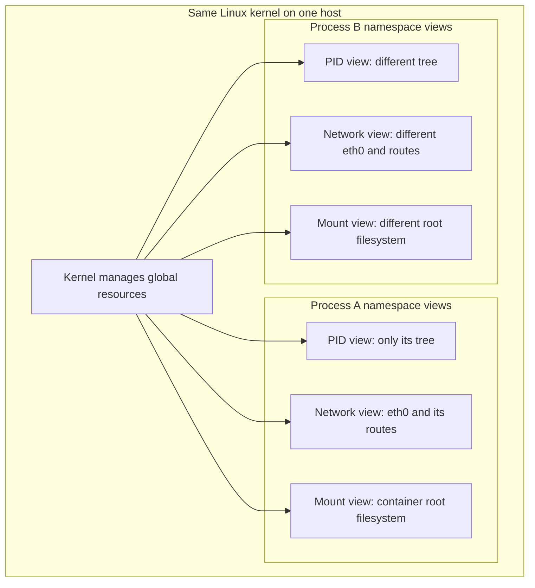
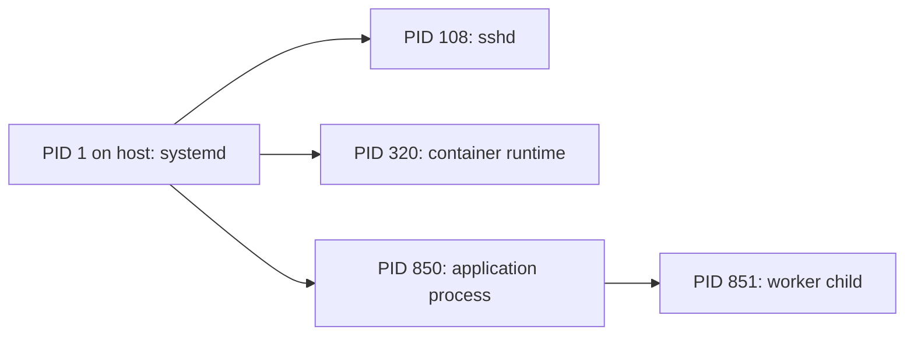
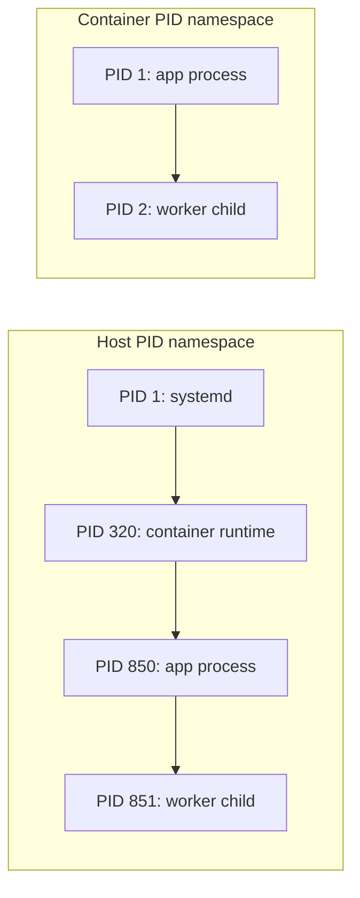
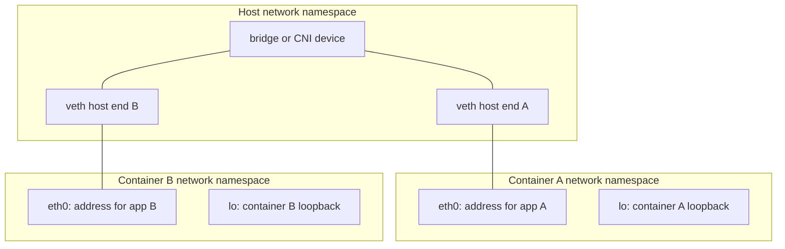
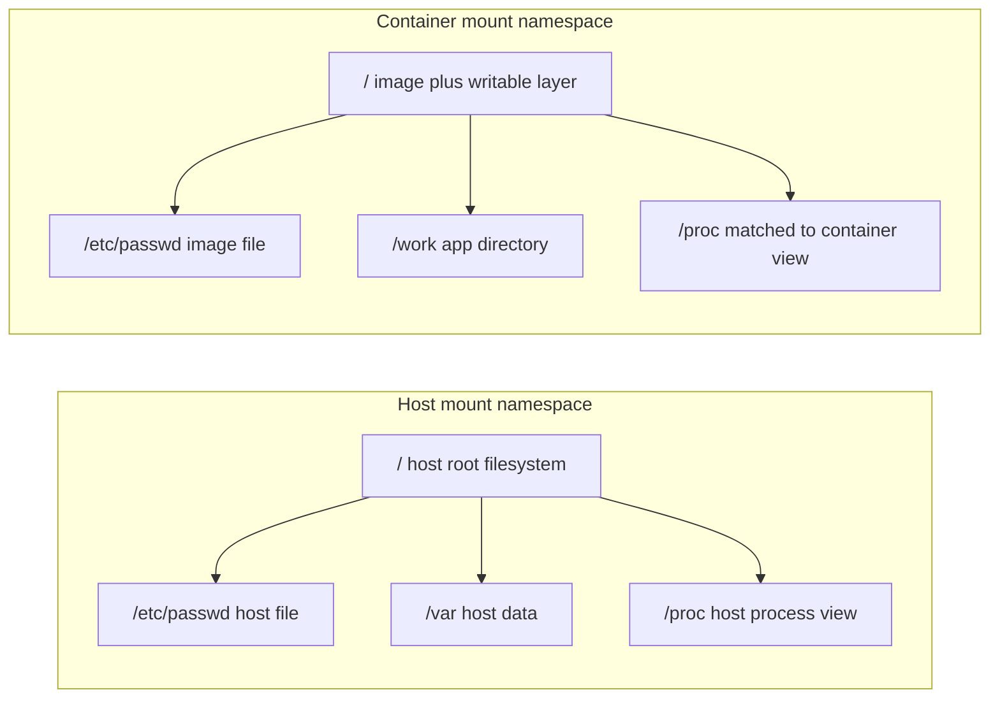
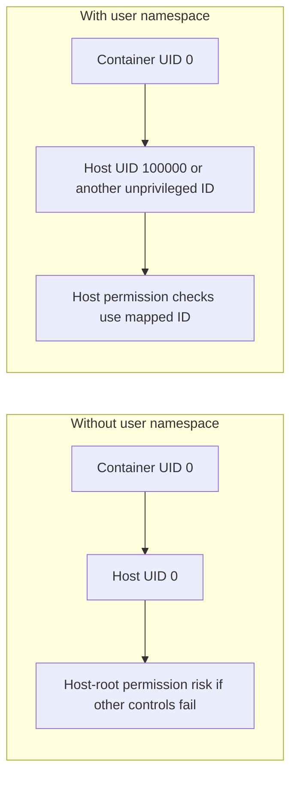
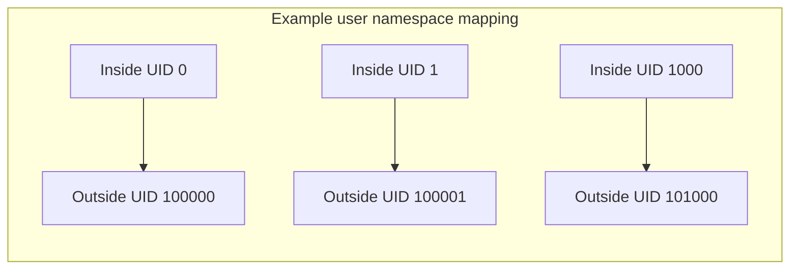
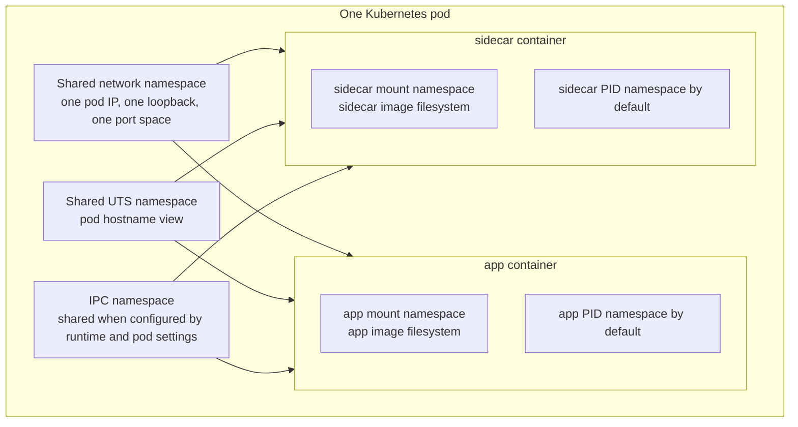

> **Linux Foundations** | Complexity: `[MEDIUM]` | Time: 35-45 min

## Prerequisites

Before starting this module, you should be comfortable reading Linux process output, using `sudo` for administrative commands, and interpreting basic network terms such as interface, address, route, and port.

Required preparation includes [Module 1.1: Kernel & Architecture](/linux/foundations/system-essentials/module-1.1-kernel-architecture/) because namespaces are implemented by the kernel, not by Docker, Kubernetes, or a shell trick.

Required preparation also includes [Module 1.2: Processes & systemd](/linux/foundations/system-essentials/module-1.2-processes-systemd/) because PID namespaces only make sense when you already know that Linux organizes running programs as processes.

A helpful but not mandatory prerequisite is basic networking vocabulary, especially loopback, virtual interfaces, routing tables, and the difference between binding a port inside a network stack and publishing a port on a host.

---

## Learning Outcomes

After this module, you will be able to:

- **Debug** container isolation problems by comparing namespace identities in `/proc/<pid>/ns` and choosing which namespace boundary is relevant to the symptom.
- **Create** isolated PID, mount, UTS, IPC, and network environments with `unshare`, `ip netns`, and `nsenter`, then verify the effect with Linux inspection commands.
- **Compare** host, container, and Kubernetes pod namespace layouts so you can explain why some resources are shared while others remain private.
- **Evaluate** when namespace sharing options such as `hostNetwork`, `hostPID`, shared process namespaces, or user namespaces improve an operation and when they weaken isolation.
- **Design** a practical troubleshooting workflow for a minimal container image by entering selected namespaces from the host without changing the running workload.

---

## Why This Module Matters

A platform engineer is called into an incident after a routine rollout turns messy. The application container is healthy according to Kubernetes, but it cannot connect to its database. The image is intentionally minimal, so it has no `ip`, no `ping`, no package manager, and no shell that feels useful. The team can see a process, a pod, a node, and a service, but nobody can tell which network view the failing process actually has.

Another engineer tries to help by running the same command on the node, but it succeeds there. That result is misleading because the node and the container are not using the same network namespace. A third engineer checks the application logs and sees only connection timeouts, which proves the symptom but not the boundary. The real question is not "does the node have networking?" but "what does this process see as its network stack?"

Namespaces are the kernel mechanism that makes this question precise. Containers are ordinary Linux processes with carefully selected namespace memberships, cgroups, capabilities, and filesystem setup. Kubernetes builds pods by deciding which of those views are shared between containers and which are separate. If you can inspect namespace boundaries directly, container behavior stops feeling magical and starts becoming debuggable.

The senior-level skill is not memorizing the eight namespace names. The useful skill is mapping a symptom to the namespace that can explain it, entering that namespace without damaging the workload, and knowing which isolation guarantees still hold after a runtime or Kubernetes option changes the default layout. This module teaches that workflow from first principles.

---

## What Namespaces Change

A namespace gives a process a particular view of a global kernel-managed resource. The resource still belongs to the same running kernel, but the process sees a scoped version of it. That scoped view might include a different hostname, a different process tree, a different mount table, a different network stack, or a different user ID mapping.

This distinction matters because a namespace is not a virtual machine. A virtual machine runs a separate guest kernel with its own hardware abstraction. A containerized process usually shares the host kernel while receiving isolated views of selected resources. That is why containers can start quickly, consume fewer resources than virtual machines, and still leak risk when the wrong boundary is assumed.

The easiest mental model is "same kernel, different windows." Two processes can sit on the same host and still look through different windows at process IDs, routes, mounted filesystems, or hostnames. Debugging begins by asking which window the process is looking through, then comparing that window to the host or to another process.



A namespace boundary answers a very practical question: "would two processes see the same thing if they ran the same inspection command?" If two processes share a network namespace, `ip addr` and `ip route` describe the same network stack for both. If two processes use different mount namespaces, the path `/etc/passwd` can refer to different files even when the path string is identical.

> **Active learning prompt:** A container can resolve DNS but cannot connect to `127.0.0.1:5432`, while the database listens on `127.0.0.1:5432` on the node. Before reading further, decide which namespace boundary most likely explains the failure and why the loopback address is a clue.

Loopback is a strong clue because `127.0.0.1` always means "this network namespace," not "this physical machine." If the database listens on node loopback and the application runs inside a different network namespace, the application is connecting to itself, not to the node service. The fix might involve a service address, a host gateway, or `hostNetwork`, but the diagnosis starts by recognizing the namespace boundary.

The kernel exposes namespace membership through symbolic links under `/proc/<pid>/ns`. Each link points to a namespace object with a stable identity while it exists. Two processes are in the same namespace of a given type when the corresponding links point to the same object. That check is more reliable than guessing from container names or Kubernetes labels.

```bash
ls -l /proc/$$/ns
```

A typical output includes entries such as `mnt`, `uts`, `ipc`, `pid`, `net`, `user`, `cgroup`, and sometimes `time`, depending on the kernel and tool versions. The exact numeric identifiers vary across systems, so treat them as identities to compare, not values to memorize.

The namespace types you will meet most often in container troubleshooting are summarized below. The table is a map for diagnosis: start with the symptom, then choose the namespace type that controls the resource involved.

| Namespace | Resource view it isolates | Practical symptom it can explain | Common inspection command |
|-----------|---------------------------|-----------------------------------|---------------------------|
| Mount (`mnt`) | Mount points and visible filesystem tree | A file exists in one container but not another | `findmnt`, `mount`, `ls` |
| UTS (`uts`) | Hostname and NIS domain name | A process reports a container hostname instead of the node name | `hostname` |
| IPC (`ipc`) | System V IPC and POSIX message queues | Shared memory or semaphores are visible unexpectedly | `ipcs` |
| PID (`pid`) | Process ID tree and process visibility | A container sees its app as PID 1 and cannot see node processes | `ps`, `/proc` |
| Network (`net`) | Interfaces, addresses, routes, firewall view, and port space | A port works in one container but not from the node | `ip addr`, `ip route`, `ss` |
| User (`user`) | UID and GID mappings plus capability ownership | Root inside a container is not root on the host | `id`, `/proc/<pid>/uid_map` |
| Cgroup (`cgroup`) | Cgroup root path visibility | A process sees a scoped resource-control hierarchy | `/proc/self/cgroup` |
| Time (`time`) | Selected monotonic and boot-time clock offsets | A containerized process sees adjusted monotonic time | `/proc/self/timens_offsets` |

Namespaces are only one part of container isolation. Capabilities control which privileged operations a process can perform. Seccomp filters system calls. Linux Security Modules such as AppArmor or SELinux enforce policy. Cgroups limit and account for resource usage. You should think of namespaces as "what the process can see," not as a complete answer to "what the process can do."

---

## Inspecting Namespace Membership

The fastest safe inspection technique is comparing namespace links for two processes. You do not need to enter the namespace, restart the container, or install tools in the image. You only need the host PID of the target process and permission to inspect `/proc`.

Start with your current shell because it gives you a baseline. The shell variable `$$` expands to the current shell process ID. When you list `/proc/$$/ns`, Linux shows namespace links for that process. The link target includes the namespace type and an identifier, which can be compared against another process.

```bash
ls -l /proc/$$/ns
```

Now compare your shell to PID 1 on the host. On a normal node, PID 1 is the system init process, often `systemd`. A regular shell usually shares many namespaces with PID 1 unless it is already running inside a container, a user namespace, or a special service sandbox.

```bash
sudo ls -l /proc/1/ns
ls -l /proc/$$/ns
```

The command `lsns` provides a summarized view of namespace objects known to the system. It is useful when you want to see which process owns a namespace or when several containers are running and you need a broad map before focusing on one target.

```bash
lsns
lsns -t net
lsns -t pid
```

A strong troubleshooting habit is to record the target process first, then inspect only the relevant namespace type. For a network symptom, compare `net`. For a process visibility symptom, compare `pid`. For a file visibility symptom, compare `mnt`. This keeps the investigation narrow enough to avoid chasing unrelated isolation mechanisms.

```bash
target_pid=1
readlink /proc/$$/ns/net
sudo readlink /proc/${target_pid}/ns/net
```

If the link targets differ, the two processes do not share that network namespace. If they match, a network difference is probably not caused by namespace separation between those two processes, and you should move to routes, firewall rules, DNS, or service configuration.

> **Active learning prompt:** Your teammate says, "The container cannot be isolated because I can see its process from the host with `ps`." Decide whether that statement proves the container lacks a PID namespace. What would you compare in `/proc/<pid>/ns` to make the claim precise?

Seeing a container process from the host does not prove the container lacks a PID namespace. The host PID namespace is the parent view and can usually see descendant processes. The more important question is what the process sees from inside its own PID namespace. Compare `/proc/<host-pid>/ns/pid` with `/proc/1/ns/pid`, then enter the target PID namespace or inspect from inside the container if you need to verify the internal process view.

The following small diagnostic pattern is safe on a lab machine because it only reads namespace identities. It compares the current shell with a target PID and prints the namespace types that differ. Use it as a reading exercise before copying it into your own notes.

```bash
target_pid=1

for ns in cgroup ipc mnt net pid user uts; do
  mine=$(readlink "/proc/$$/ns/${ns}")
  target=$(sudo readlink "/proc/${target_pid}/ns/${ns}")
  if [ "$mine" = "$target" ]; then
    printf "%-8s shared    %s\n" "$ns" "$mine"
  else
    printf "%-8s different mine=%s target=%s\n" "$ns" "$mine" "$target"
  fi
done
```

This pattern also teaches the senior workflow: compare first, enter second. Entering a namespace is powerful, but it changes your perspective and can lead to accidental commands in the wrong context. A read-only comparison gives you a map before you step through any boundary.

---

## PID Namespaces: Process Trees and PID 1

A PID namespace isolates process ID numbers and process visibility. The host can usually see processes in child PID namespaces, but a process inside a child namespace sees only processes in its own namespace and descendants. That asymmetric visibility is the source of many container debugging misunderstandings.

Without a PID namespace, every process participates in the same host process tree. A process listing from a regular shell can show system services, runtime processes, and application processes together. The process IDs are unique within that shared view.



With a PID namespace, the same application can have one PID from the host perspective and a different PID inside the namespace. The first process inside the namespace becomes PID 1 in that namespace, even though the host sees it as an ordinary process with a different number. Both views are correct because they are views from different namespaces.



PID 1 has special responsibilities. It receives orphaned child processes, must reap zombies, and has special default signal behavior. A program that works well as a normal process can behave poorly as PID 1 if it does not forward signals or reap children. That is why production containers often use a tiny init process such as `tini` or `dumb-init`.

The worked example below creates a new PID namespace and mounts a matching `/proc` view. The `--fork` flag matters because `unshare --pid` creates a new PID namespace for child processes, not for the already-running `unshare` process itself. The `--mount-proc` flag makes `ps` and `/proc` reflect the new PID namespace instead of the host process view.

```bash
sudo unshare --pid --fork --mount-proc bash
```

Inside the new shell, run these commands. You should see a small process list and a low PID for the shell because this namespace has its own process numbering. The output will vary, but the pattern should be clear.

```bash
ps -ef
echo "namespace shell PID is $$"
ls /proc | head
exit
```

If you omit `--mount-proc`, many learners get confused because `ps` may still read the old `/proc` mount and appear to show host processes. That does not mean the PID namespace failed. It means your filesystem view still points tools at a `/proc` mount that does not match your new PID view. This is the first place where PID and mount namespaces interact.

A senior debugger watches for this kind of cross-namespace mismatch. Tools are just processes reading files and making system calls. If the tool's mount namespace points at one `/proc` view while the process runs in another PID namespace, the output can mislead you. Good debugging means checking both the tool's namespace and the data source it reads.

---

## Network Namespaces: Interfaces, Routes, and Port Space

A network namespace isolates the network stack. Each network namespace has its own interfaces, addresses, loopback device, routing tables, neighbor table, firewall view, and listening port space. Two processes can both listen on TCP port `80` when they are in different network namespaces because each namespace has its own port table.

A newly created network namespace is intentionally lonely. It normally contains only a loopback interface, and that loopback interface may be down until you bring it up. There is no default route, no `eth0`, and no automatic path to the internet. Container runtimes add connectivity by creating virtual Ethernet pairs, moving one end into the container namespace, and connecting the host end to a bridge, overlay, or other network backend.



Create a named network namespace with `ip netns`. Named namespaces are convenient for learning because the `ip` tool stores bind mounts under `/var/run/netns`, making the namespace easy to list, enter, and delete. This is not exactly how every container runtime manages namespaces, but it teaches the same kernel mechanism.

```bash
sudo ip netns add lab-net
ip netns list
sudo ip netns exec lab-net ip addr
```

The loopback interface is usually present but down. Bring it up and inspect the route table. You should still have no external connectivity because a loopback device is not a path to any other network namespace.

```bash
sudo ip netns exec lab-net ip link set lo up
sudo ip netns exec lab-net ip addr show lo
sudo ip netns exec lab-net ip route
```

Now try a ping from inside the namespace. This command is expected to fail on many systems because there is no route out, and some environments also block ICMP. The failure is useful because it proves that creating a namespace alone does not create connectivity.

```bash
sudo ip netns exec lab-net ping -c 1 8.8.8.8
```

Delete the namespace when you finish the observation. Cleaning up matters because named network namespaces persist until deleted. Leaving lab namespaces behind can confuse later experiments and make `ip netns list` look like a production state.

```bash
sudo ip netns delete lab-net
```

> **Active learning prompt:** Two containers in the same pod can both reach an application on `localhost`, but two containers in different pods cannot use `localhost` to reach each other. Decide which namespace sharing decision explains the difference before reading the Kubernetes section.

The answer is network namespace sharing. Containers in the same Kubernetes pod share one network namespace by default, so `localhost` refers to the same network stack for those containers. Containers in different pods have different network namespaces, so each pod has its own loopback device and port space. They must communicate through pod IPs, Services, or another network path.

The network namespace is also why host-level checks can be false reassurance. A successful `curl` from the node proves the node namespace has connectivity. It does not prove the target container namespace has the same route, DNS configuration, firewall behavior, or source address. When the symptom is network-specific, run the network inspection from the target namespace.

---

## Mount Namespaces: Filesystem Views Without Separate Kernels

A mount namespace isolates the set of mount points a process sees. It does not magically copy every file, and it does not require a separate disk. Instead, it lets the kernel present a different mounted filesystem tree to different processes. Container runtimes combine mount namespaces with image layers, writable container layers, bind mounts, and special filesystems such as `/proc`.

The key debugging question is whether two processes see the same mount table. If they do not, the same path can mean different things. The path `/etc/hosts` inside a container may be a runtime-generated file. The path `/var/log/app.log` inside one container may not exist in a sidecar unless a shared volume is mounted into both containers.



The worked example below creates a mount namespace and mounts a temporary filesystem under `/tmp/ns-mount-lab`. The temporary mount exists only inside the namespace unless mount propagation settings intentionally share it. The file you create is real while the namespace exists, but the host mount table does not gain the same mount point.

```bash
sudo unshare --mount bash
```

Inside the new shell, run these commands. The `findmnt` output shows that `/tmp/ns-mount-lab` is a mount point in this namespace. The file write proves that the mounted tmpfs is usable.

```bash
mkdir -p /tmp/ns-mount-lab
mount -t tmpfs tmpfs /tmp/ns-mount-lab
echo "visible only through this mount namespace" > /tmp/ns-mount-lab/message.txt
findmnt /tmp/ns-mount-lab
cat /tmp/ns-mount-lab/message.txt
exit
```

Back on the host, inspect the same path. Depending on whether the directory existed before and how your system handles cleanup, the directory may exist, but the tmpfs mount and its file should not be visible from the host namespace. The important observation is the mount table difference, not the directory name alone.

```bash
findmnt /tmp/ns-mount-lab || true
cat /tmp/ns-mount-lab/message.txt
```

Mount namespaces interact heavily with security. Accidentally bind-mounting sensitive host paths into a container can defeat filesystem isolation even when the container has its own mount namespace. The namespace controls the view; the mounts placed into that view determine what data is exposed. A private view containing `/var/run/docker.sock` is still dangerous because the socket grants control over the container runtime.

Mount propagation is the senior-level wrinkle. Some mounts can propagate between namespaces when configured as shared, slave, or private. Kubernetes volume behavior and privileged storage agents sometimes depend on propagation settings. When a mount appears or disappears unexpectedly, inspect `findmnt -o TARGET,PROPAGATION` instead of assuming mount namespaces are absolute walls.

```bash
findmnt -o TARGET,PROPAGATION /
findmnt -o TARGET,PROPAGATION /tmp
```

---

## UTS and IPC Namespaces: Small Boundaries With Big Effects

The UTS namespace isolates the hostname and domain name visible to a process. It is simple compared with network or mount namespaces, but it matters because many applications report host identity in logs, metrics, prompts, and cluster membership. A container can have a hostname that matches its pod name without changing the node hostname.

Try a UTS namespace by changing the hostname inside an isolated shell. The hostname change should not affect the host after you exit. This is a safe example because it demonstrates the namespace boundary without altering networking or filesystems.

```bash
sudo unshare --uts bash
hostname namespace-lab
hostname
exit
hostname
```

IPC namespaces isolate inter-process communication objects such as System V shared memory, semaphores, message queues, and POSIX message queues. Most web workloads do not expose IPC details directly, but databases, legacy applications, and high-performance local systems sometimes rely on shared memory. Isolation prevents unrelated containers from reading or interfering with each other's IPC objects.

```bash
ipcs
sudo unshare --ipc bash
ipcs
exit
```

In Kubernetes, IPC sharing is a deliberate pod-level design choice. Containers in a pod may share IPC depending on runtime and pod configuration, while containers in separate pods should not. This can be useful for tightly coupled sidecars but risky if one container is less trusted than another. Shared memory is not just a performance feature; it is also a data exposure surface.

A useful decision rule is to treat UTS and IPC as "small surface, sharp edge" namespaces. UTS rarely causes deep incidents by itself, but wrong host identity can confuse observability and clustering. IPC is invisible until an application depends on it, and then it can become either a required coupling mechanism or an unexpected security risk.

---

## User Namespaces: Root Inside Is Not Always Root Outside

A user namespace isolates user and group ID mappings. Inside the namespace, a process may believe it is UID `0`, but the kernel maps that identity to a different unprivileged UID outside the namespace. This is the core idea behind rootless containers and an important mitigation when a process is compromised inside a container.

Without a user namespace, UID `0` inside a container is also UID `0` from the host kernel's perspective, although capabilities and other controls may still limit what it can do. With a user namespace, UID `0` inside can map to a high unprivileged host UID. Permission checks against host files then use the mapped outside identity.



You can inspect mapping files through `/proc`. The current process mapping may be simple on a normal host shell. In a rootless container or user namespace, these files show how inside IDs map to outside IDs. The columns represent inside ID start, outside ID start, and length.

```bash
cat /proc/self/uid_map
cat /proc/self/gid_map
```

A typical subordinate ID configuration grants a user a range of host IDs that can be used for mappings. The exact values are system-specific. The important idea is that a runtime can map many container IDs to a controlled host range instead of granting real host root.

```bash
grep "^$(id -un):" /etc/subuid /etc/subgid 2>/dev/null || true
```

The mapping below shows the concept without requiring your system to use the same numbers. UID `0` inside maps to an unprivileged host UID. UID `1` inside maps to the next host UID in the range. Application users inside the container also map into the same outside range.



User namespaces improve the blast-radius story, but they do not make every container safe. A process still shares the host kernel, can still consume resources unless cgroups limit it, and can still access any host path deliberately mounted with compatible permissions. Security comes from layered controls, not from one namespace type.

The operational trade-off is compatibility. Some workloads, volume permissions, device access patterns, and older tooling assume that container UID values match host UID values. Rootless designs may require explicit ownership planning for persistent volumes and build caches. The senior decision is not "always use user namespaces" but "use them where the permission model and operational tooling can support them."

---

## Cgroup and Time Namespaces: Less Visible, Still Relevant

The cgroup namespace isolates the view of cgroup paths. It does not create resource limits by itself; cgroups do that. The namespace controls what a process sees as the root of its cgroup hierarchy. This matters when software reads `/proc/self/cgroup` or cgroup filesystem paths and assumes it understands its place on the host.

```bash
cat /proc/self/cgroup
readlink /proc/$$/ns/cgroup
```

In containers, cgroup namespaces reduce information leakage about the host's full cgroup layout. They also make the process's environment look more self-contained. When debugging CPU or memory limits, remember that the cgroup namespace affects visibility while the cgroup controllers enforce limits and accounting. The next module covers cgroups in depth.

The time namespace can offset certain clocks, especially monotonic and boot-time clocks, for processes inside the namespace. It is less common in day-to-day Kubernetes debugging than network, PID, or mount namespaces. It matters for checkpoint and restore workflows, tests that need controlled time views, and specialized runtime behavior.

```bash
readlink /proc/$$/ns/time 2>/dev/null || true
cat /proc/self/timens_offsets 2>/dev/null || true
```

The senior takeaway is to avoid overfitting your mental model to the most famous namespaces. Network, PID, and mount boundaries explain many incidents, but cgroup, user, IPC, UTS, and time namespaces can still appear in edge cases. When a symptom involves identity, clocks, resource visibility, shared memory, or hostnames, inspect the corresponding namespace before assuming the runtime is broken.

---

## Worked Example: Debug a Minimal Container Without Installing Tools

This worked example demonstrates the core practitioner workflow: find the target process, compare namespace membership, enter only the namespace you need, and run host tools from that perspective. The example uses Docker commands where available, but the Linux concept is the same for containerd, CRI-O, and Kubernetes after you identify the target PID.

Imagine a container named `web-app` cannot connect to a dependency. The image has no `ip`, no `ss`, and no `tcpdump`. Rebuilding the image during an incident would be slow and would change the thing you are trying to observe. Entering the network namespace lets you keep the workload unchanged while borrowing host tools.

First, find the host PID of the container's main process. Docker exposes it through `docker inspect`. In Kubernetes environments, you might obtain a container ID through `crictl ps` and inspect it with `crictl inspect`, but the goal is the same: get the host PID that anchors the namespaces.

```bash
PID=$(docker inspect --format '{{.State.Pid}}' web-app)
echo "Container host PID: ${PID}"
sudo readlink "/proc/${PID}/ns/net"
readlink /proc/$$/ns/net
```

If the network namespace differs from your shell, use `nsenter` to run a host binary inside that namespace. The `-t` option selects the target process, and `-n` means enter its network namespace. This command does not use the container filesystem unless you ask for the mount namespace too, so it can run the host's `ip` binary against the container's network stack.

```bash
sudo nsenter -t "${PID}" -n ip addr
sudo nsenter -t "${PID}" -n ip route
sudo nsenter -t "${PID}" -n ss -lntp
```

If you need packet capture and the host has `tcpdump`, run it the same way. This observes the target network namespace without installing anything in the image. Choose a narrow filter so the capture answers a specific question instead of producing noise.

```bash
sudo nsenter -t "${PID}" -n tcpdump -i any -nn 'tcp port 5432'
```

Now reason about the result. If the route table has no default route, the problem is namespace-local network configuration. If DNS fails but raw IP connectivity works, the next boundary may be resolver configuration in the mount namespace, such as `/etc/resolv.conf`. If the container listens on `127.0.0.1`, the service is local to the pod or container network namespace unless a proxy or port mapping exposes it elsewhere.

This example also shows why `nsenter` is safer when used selectively. Entering every namespace with `--all` can put you into the target filesystem, PID view, UTS name, IPC view, and user mapping at once. That can be useful, but it also increases confusion and risk. Enter the smallest set of namespaces that explains the symptom.

| Symptom | Namespace to inspect first | Useful host-side command | What a mismatch suggests |
|---------|----------------------------|---------------------------|--------------------------|
| Container cannot reach dependency | Network | `nsenter -t "$PID" -n ip route` | Different route, interface, or firewall view |
| Sidecar cannot read app file | Mount | `nsenter -t "$PID" -m findmnt` | Missing shared volume or wrong mount path |
| App ignores termination | PID | `nsenter -t "$PID" -p ps -ef` | App is PID 1 and lacks init behavior |
| Hostname in logs is surprising | UTS | `nsenter -t "$PID" -u hostname` | Container hostname differs from node |
| Shared memory appears missing | IPC | `nsenter -t "$PID" -i ipcs` | Processes do not share IPC namespace |
| Root cannot read host-mounted file | User | `cat /proc/"$PID"/uid_map` | Container root maps to unprivileged host UID |

After the incident, translate the observation into a durable fix. Do not leave a workload depending on a manual namespace entry. A missing route belongs in the CNI or pod network configuration. A missing file belongs in a Kubernetes volume mount. A PID 1 signal problem belongs in the image entrypoint or pod spec. Namespace debugging should shorten the path to the real configuration change.

---

## Kubernetes Pod Namespace Layout

Kubernetes uses namespaces to make a pod feel like one deployable unit while still running one or more containers. The most important default is that containers in the same pod share a network namespace. This is why they have the same pod IP and can communicate through `localhost`. It is also why two containers in the same pod cannot both bind the same TCP port on the same address.



The mount namespace story is different. Containers in a pod usually have separate root filesystems because each container comes from its own image. They share files only through volumes that Kubernetes mounts into both containers. This is why a logging sidecar cannot read an application file merely because it is in the same pod. Both containers need a shared volume mounted at agreed paths.

```yaml
apiVersion: v1
kind: Pod
metadata:
  name: shared-volume-demo
spec:
  containers:
  - name: app
    image: busybox:1.36
    command: ["sh", "-c", "while true; do date >> /var/log/app/app.log; sleep 5; done"]
    volumeMounts:
    - name: app-logs
      mountPath: /var/log/app
  - name: sidecar
    image: busybox:1.36
    command: ["sh", "-c", "tail -f /logs/app.log"]
    volumeMounts:
    - name: app-logs
      mountPath: /logs
  volumes:
  - name: app-logs
    emptyDir: {}
```

Kubernetes can also share the process namespace inside a pod when `shareProcessNamespace: true` is set. This lets containers see each other's processes, which can help sidecars send signals or collect diagnostics. It also weakens process isolation inside the pod, so it should be an explicit design decision rather than a default assumption.

```yaml
apiVersion: v1
kind: Pod
metadata:
  name: process-share-demo
spec:
  shareProcessNamespace: true
  containers:
  - name: app
    image: busybox:1.36
    command: ["sh", "-c", "sleep 3600"]
  - name: inspector
    image: busybox:1.36
    command: ["sh", "-c", "ps -ef; sleep 3600"]
```

Host namespace options are stronger exceptions. `hostNetwork: true` places the pod in the node's network namespace. `hostPID: true` gives the pod visibility into node processes. `hostIPC: true` shares host IPC. These options are legitimate for some system agents, but they are dangerous defaults for application workloads because they remove important boundaries.

```yaml
apiVersion: v1
kind: Pod
metadata:
  name: host-namespace-debug
spec:
  hostNetwork: true
  hostPID: true
  hostIPC: true
  containers:
  - name: debug
    image: busybox:1.36
    command: ["sh", "-c", "sleep 3600"]
    securityContext:
      privileged: true
```

A careful reviewer asks what problem each host namespace option solves. Node network agents may need `hostNetwork` because they configure or observe node-level networking. Process inspectors may need `hostPID` during controlled debugging. General application pods usually do not need either. If the reason is "it made the error go away," the team has hidden the boundary rather than understood it.

> **Active learning prompt:** A sidecar needs to scrape an admin endpoint from the main container. The team proposes `hostNetwork: true` because `localhost` worked during a node test. Evaluate that proposal and choose a safer pod-level design.

The safer design is usually to keep the shared pod network namespace and have the sidecar call `localhost:<admin-port>` inside the pod. `hostNetwork` is unnecessary for container-to-container communication within one pod because they already share the pod network namespace. Enabling host networking would expose the pod to node port conflicts and reduce isolation without solving a real namespace problem.

---

## Debugging Patterns by Symptom

Namespace debugging becomes faster when you classify the symptom first. A file problem is rarely solved by staring at routes. A port conflict is rarely explained by UID mapping. The table below is intentionally practical: it connects the observed failure to the first boundary worth checking.

| Observed failure | First namespace hypothesis | Verification step | Likely configuration fix |
|------------------|----------------------------|-------------------|--------------------------|
| App can reach `localhost` in one container but not another pod | Network namespace differs across pods | Compare pod IPs and run `ip addr` in each pod | Use a Service, pod IP, or sidecar pattern |
| Sidecar cannot see app log file | Mount namespaces are separate | Inspect volume mounts and `findmnt` in each container | Mount the same volume into both containers |
| Container exits slowly during rollout | PID 1 is not handling signals | Check process tree inside PID namespace | Add an init process or signal handling |
| Container root cannot modify a host-mounted path | User namespace remaps UID | Inspect `uid_map` and host file ownership | Align ownership, permissions, or runtime mapping |
| Debug command works on node but fails in container | Command ran in wrong namespace | Run inspection through `nsenter` or `kubectl exec` | Fix namespace-local route, DNS, or mount |
| Host port reports already in use with `hostNetwork` | Pod uses host network port space | Check `ss -lntp` on the node | Use pod networking or choose a free host port |
| Process monitor misses app children | PID namespace hides process tree | Compare PID namespaces and `shareProcessNamespace` | Enable process sharing only when justified |

A disciplined sequence prevents accidental changes. First, identify the target process or pod. Second, choose the namespace type based on the symptom. Third, compare namespace identities. Fourth, enter only the required namespace if you need live inspection. Fifth, map the observation back to a runtime, image, Kubernetes, or node configuration change.

This sequence is slower than guessing for the first five minutes and faster for the rest of the incident. It also produces evidence that another engineer can review. "The app has no default route inside its network namespace" is more actionable than "networking seems broken." "The sidecar has a different mount namespace and no shared volume at `/logs`" is more actionable than "the file disappeared."

---

## Did You Know?

- **Namespaces existed before modern container platforms.** The mount namespace appeared years before Docker popularized containers, and later namespace types filled in process, network, user, cgroup, and time isolation needs.

- **A Kubernetes pod is not a tiny virtual machine.** It is a coordinated set of containers where Kubernetes and the runtime decide which namespace views are shared and which remain per-container.

- **`nsenter` can combine perspectives deliberately.** You can use the target process's network namespace while keeping the host filesystem and host debugging binaries, which is valuable for minimal or distroless images.

- **User namespaces change permission meaning.** UID `0` inside a namespace can map to an unprivileged UID outside, so "root in the container" and "root on the host" are not always the same identity.

---

## Common Mistakes

| Mistake | Why it causes trouble | Better practice |
|---------|----------------------|-----------------|
| Treating namespaces as complete security isolation | Namespaces isolate views, but the kernel is still shared and other controls still matter | Combine namespaces with cgroups, capabilities, seccomp, and LSM policy |
| Running host commands and assuming they reflect the container | The host shell may use different network, mount, PID, or user namespaces | Run inspections through `kubectl exec`, `crictl`, or `nsenter` against the target process |
| Forgetting that PID 1 behaves differently | Applications may ignore signals, fail to reap children, or delay shutdown | Use a minimal init process or implement correct signal and child handling |
| Assuming pod containers share files automatically | Same-pod containers share networking but usually have separate mount namespaces | Use Kubernetes volumes such as `emptyDir` for intentional file sharing |
| Enabling `hostNetwork` to fix unknown network failures | It removes network isolation and introduces node-level port conflicts | Diagnose routes, DNS, and Services before choosing host networking |
| Confusing container root with host root | User namespace mappings and capabilities change what UID `0` can actually do | Inspect `uid_map`, capabilities, and mounted host paths before judging privilege |
| Entering every namespace at once during debugging | A full namespace entry can hide which boundary mattered and increases accidental change risk | Enter the smallest namespace set needed for the symptom |
| Leaving lab network namespaces or mounts behind | Persistent named namespaces and mounts can pollute later tests | Delete `ip netns` labs and unmount temporary filesystems after experiments |

---

## Quiz

### Question 1

Your team deploys a web container that normally shuts down cleanly on a developer laptop. In Kubernetes, rolling updates wait for the grace period and then kill the container. Inside the container, `ps` shows the application process as PID 1. What namespace-related behavior should you investigate, and what change would you recommend?

<details>
<summary>Show answer</summary>

The process is running as PID 1 inside its PID namespace, so it has init-like responsibilities and special signal behavior. The investigation should check whether the application handles `SIGTERM` and reaps child processes correctly when it is PID 1. A practical fix is to add a minimal init such as `tini` or `dumb-init`, or to update the application entrypoint so it handles termination and children correctly. This recommendation aligns the Kubernetes shutdown path with Linux PID namespace behavior instead of simply increasing the grace period.

</details>

### Question 2

A database listens on `127.0.0.1:5432` on a node. A container on that node tries to connect to `127.0.0.1:5432` and gets connection refused. A teammate says the node firewall must be blocking loopback traffic. What namespace concept should you apply before changing firewall rules?

<details>
<summary>Show answer</summary>

Apply the network namespace concept. `127.0.0.1` refers to loopback inside the caller's current network namespace, not to the physical node in every context. If the container is in its own network namespace, it is connecting to its own loopback interface, not the node's loopback listener. You should inspect the container's network namespace with `nsenter -t <pid> -n` or a container exec command, then choose a real reachable address, Service, host gateway pattern, or deliberate `hostNetwork` design if justified.

</details>

### Question 3

An application container writes `/var/log/app/current.log`. A sidecar in the same pod tails `/var/log/app/current.log` but reports that the file does not exist. Both containers share the same pod IP. Which assumption is wrong, and how would you fix the pod design?

<details>
<summary>Show answer</summary>

The wrong assumption is that same-pod containers automatically share their filesystem view. They share the pod network namespace, but they usually have separate mount namespaces and separate image filesystems. The fix is to define a Kubernetes volume, such as `emptyDir`, mount it into the application at the path where logs are written, and mount the same volume into the sidecar at the path it tails. That makes file sharing explicit instead of relying on network namespace sharing.

</details>

### Question 4

A minimal production image has no `ip`, `ss`, `tcpdump`, package manager, or useful shell. The service cannot connect to an upstream endpoint, and rebuilding the image would take too long. How can you inspect the container's routes and sockets without modifying the image?

<details>
<summary>Show answer</summary>

Find the host PID of the container's main process, then use `nsenter` to enter only its network namespace while running host-installed tools. For example, `sudo nsenter -t "$PID" -n ip route` and `sudo nsenter -t "$PID" -n ss -lntp` use the host binaries against the target network namespace. This preserves the running workload and avoids installing packages in the image. If the route table or socket state differs from the host, you have evidence that the issue is namespace-local.

</details>

### Question 5

A security review finds that a compromised process is UID `0` inside a container. However, when it tries to read a host-mounted file owned by real host root, the kernel denies access. What should the reviewer inspect before concluding the denial is accidental?

<details>
<summary>Show answer</summary>

The reviewer should inspect the container process's user namespace mapping, especially `/proc/<pid>/uid_map` and `/proc/<pid>/gid_map`. With user namespaces, UID `0` inside the container can map to an unprivileged host UID outside the container. Host filesystem permission checks use the mapped outside identity, so access to files owned by host root can be denied even though the process appears as root inside. The reviewer should also check capabilities and mount configuration before making a complete security judgment.

</details>

### Question 6

A node-level monitoring agent needs to see host processes and network interfaces. An engineer suggests running it as a normal pod and mounting `/proc` from the host. Another engineer suggests enabling both `hostPID` and `hostNetwork`. How would you evaluate these options?

<details>
<summary>Show answer</summary>

The requirement maps to PID and network namespace visibility, so `hostPID` and possibly `hostNetwork` may be justified for a node-level agent. Mounting host `/proc` alone can create a misleading or partial view if the process namespace and `/proc` mount do not match the tool's expectations. However, host namespace sharing weakens isolation and should be limited to trusted system agents with appropriate security controls. The evaluation should state the exact observations the agent needs, enable only the required host namespaces, and document the security trade-off.

</details>

### Question 7

You run `unshare --pid bash` expecting the shell to become PID 1, but the process view does not look isolated. A teammate says PID namespaces are disabled on the machine. What should you check about the command before accepting that conclusion?

<details>
<summary>Show answer</summary>

Check whether the command used `--fork` and whether `/proc` was remounted for the new PID namespace. With `unshare --pid`, the new PID namespace applies to child processes, so `--fork` is needed for the shell to start inside it as the first process. Tools such as `ps` also read `/proc`, so `--mount-proc` is often needed to make the process listing match the new PID namespace. A better test is `sudo unshare --pid --fork --mount-proc bash`, followed by `ps -ef` and `echo $$`.

</details>

### Question 8

A team enables `hostNetwork: true` on an application pod because it fixes a connection problem during a deadline. The next deployment fails because another pod on the same node already uses the required port. What namespace lesson should guide the rollback and permanent fix?

<details>
<summary>Show answer</summary>

`hostNetwork: true` moved the pod into the node's network namespace, so the pod now shares the node's port space instead of getting an isolated pod network namespace. The port conflict is an expected consequence of removing network isolation. The rollback should restore normal pod networking if the application does not truly need host networking. The permanent fix should diagnose the original connection problem inside the pod network namespace, then correct DNS, routing, NetworkPolicy, Service configuration, or application target addresses.

</details>

---

## Hands-On Exercise

### Objective

Create and inspect several namespace types, then use the observations to explain a realistic container troubleshooting workflow. This exercise is designed for a Linux lab machine where you have `sudo`. Do not run it on a production node.

### Part 1: Build a Namespace Baseline

Begin by inspecting your current shell. The goal is not to memorize identifiers, but to learn how namespace identities are represented and compared. Save the output mentally or in a scratch note so later differences are easy to recognize.

```bash
ls -l /proc/$$/ns
readlink /proc/$$/ns/net
readlink /proc/$$/ns/pid
readlink /proc/$$/ns/mnt
lsns | head
```

Now compare your shell with PID 1. Some namespace links may match, and some may differ depending on whether your shell is already inside a container, terminal sandbox, or service environment. Treat the comparison itself as the skill.

```bash
sudo ls -l /proc/1/ns
for ns in mnt uts ipc pid net user cgroup; do
  printf "%s\n" "namespace: ${ns}"
  printf "  shell: "
  readlink "/proc/$$/ns/${ns}"
  printf "  pid1 : "
  sudo readlink "/proc/1/ns/${ns}"
done
```

Success criteria for Part 1:

- [ ] You can identify where Linux exposes namespace membership for a process.
- [ ] You can compare two processes and decide whether a namespace type is shared.
- [ ] You can explain why matching network namespace links matter more than matching process names during network debugging.

### Part 2: Create a PID Namespace

Create a PID namespace with a matching `/proc` view. The flags are part of the lesson: `--pid` creates the namespace for children, `--fork` starts the child inside it, and `--mount-proc` gives process tools a matching `/proc`.

```bash
sudo unshare --pid --fork --mount-proc bash
```

Inside the namespace, inspect the process tree. You should see a small process view. The shell should have a low PID because it is at the root of this namespace's process tree.

```bash
ps -ef
echo "inside PID namespace, shell PID is $$"
ls /proc | head
exit
```

Success criteria for Part 2:

- [ ] You created a PID namespace using `--pid --fork --mount-proc`.
- [ ] You verified that the process view inside the namespace is smaller than the host view.
- [ ] You can explain why PID 1 behavior matters for container shutdown.

### Part 3: Create a Network Namespace

Create a named network namespace and inspect its default state. Expect isolation, not connectivity. A new namespace with only loopback and no route is working as designed.

```bash
sudo ip netns add kd-lab-net
ip netns list
sudo ip netns exec kd-lab-net ip addr
sudo ip netns exec kd-lab-net ip route
```

Bring up loopback and try a connectivity test. The ping may fail because there is still no external route. That failure is useful evidence that namespaces do not automatically create network plumbing.

```bash
sudo ip netns exec kd-lab-net ip link set lo up
sudo ip netns exec kd-lab-net ip addr show lo
sudo ip netns exec kd-lab-net ping -c 1 8.8.8.8
```

Clean up the named namespace. Confirm it no longer appears in the list.

```bash
sudo ip netns delete kd-lab-net
ip netns list
```

Success criteria for Part 3:

- [ ] You created and deleted a named network namespace.
- [ ] You observed that a new network namespace does not automatically have an external route.
- [ ] You can explain why `localhost` changes meaning across network namespaces.

### Part 4: Create a Mount Namespace

Create a mount namespace and mount a temporary filesystem. This demonstrates that a process can see a mount that the host shell does not see in the same way.

```bash
sudo unshare --mount bash
```

Inside the namespace, create and inspect the mount. The file exists through this namespace's mount table.

```bash
mkdir -p /tmp/kd-mnt-lab
mount -t tmpfs tmpfs /tmp/kd-mnt-lab
echo "namespace mount data" > /tmp/kd-mnt-lab/data.txt
findmnt /tmp/kd-mnt-lab
cat /tmp/kd-mnt-lab/data.txt
exit
```

Back on the host, check whether the mount exists. The expected result is that the tmpfs mount is not present in your original mount namespace.

```bash
findmnt /tmp/kd-mnt-lab || true
cat /tmp/kd-mnt-lab/data.txt
```

Success criteria for Part 4:

- [ ] You created a mount namespace and mounted a tmpfs inside it.
- [ ] You observed that mount visibility depends on the mount namespace.
- [ ] You can explain why same-pod containers need shared volumes for shared files.

### Part 5: Create UTS and IPC Namespaces

Create a UTS namespace and change the hostname inside it. The host hostname should remain unchanged after you exit.

```bash
sudo unshare --uts bash
hostname kd-namespace-lab
hostname
exit
hostname
```

Create an IPC namespace and compare IPC object visibility. Many lab systems have few IPC objects, so the important observation is that `ipcs` runs against a scoped IPC view.

```bash
ipcs
sudo unshare --ipc bash
ipcs
exit
```

Success criteria for Part 5:

- [ ] You changed a hostname inside a UTS namespace without changing the host hostname.
- [ ] You ran `ipcs` inside an IPC namespace.
- [ ] You can describe when UTS and IPC namespaces matter in Kubernetes troubleshooting.

### Part 6: Practice a Targeted Debugging Decision

Choose one of the scenarios below and write a three-step debugging plan in your own notes. You do not need to run Kubernetes for this part. The goal is to align symptom, namespace, and inspection method.

Scenario A: A pod sidecar cannot read a file written by the app container, but both containers share the same pod IP.

Scenario B: A container can connect to a dependency by pod IP but not through `localhost`, even though a node-level test to `localhost` succeeds.

Scenario C: An application runs as root inside a container but cannot write to a host-mounted directory owned by root.

Scenario D: A minimal image has no network tools, but you need to inspect its route table during an incident.

Success criteria for Part 6:

- [ ] Your plan names the first namespace type you would inspect.
- [ ] Your plan includes one concrete Linux command or Kubernetes inspection step.
- [ ] Your plan separates observation from configuration change.
- [ ] Your plan explains why the chosen namespace boundary fits the symptom.

### Final Exercise Success Criteria

- [ ] You inspected namespace membership through `/proc/<pid>/ns`.
- [ ] You created PID, network, mount, UTS, and IPC namespaces in a lab.
- [ ] You cleaned up the named network namespace after use.
- [ ] You explained at least one interaction between two namespace types.
- [ ] You designed a targeted debugging plan for a realistic container symptom.

---

## Next Module

Continue to [Module 2.2: Control Groups (cgroups)](/linux/foundations/container-primitives/module-2.2-cgroups/) to learn how Linux limits, accounts for, and reports resource usage for the same containerized processes that namespaces isolate.
