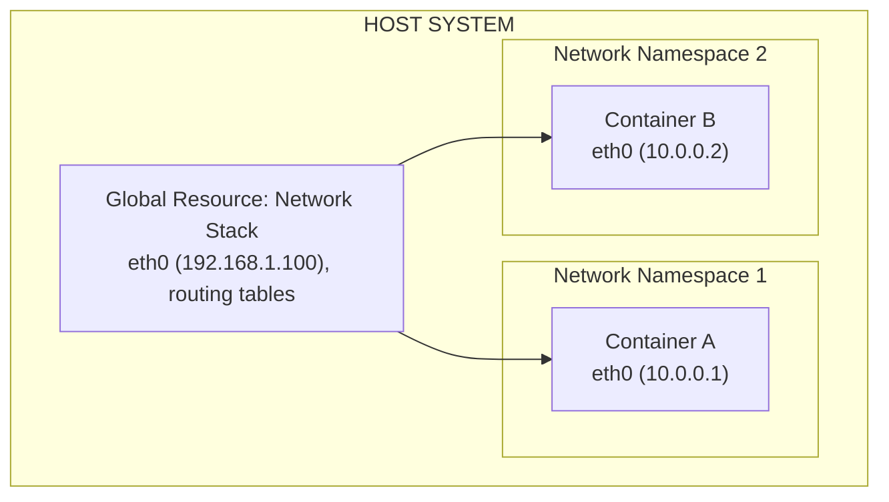
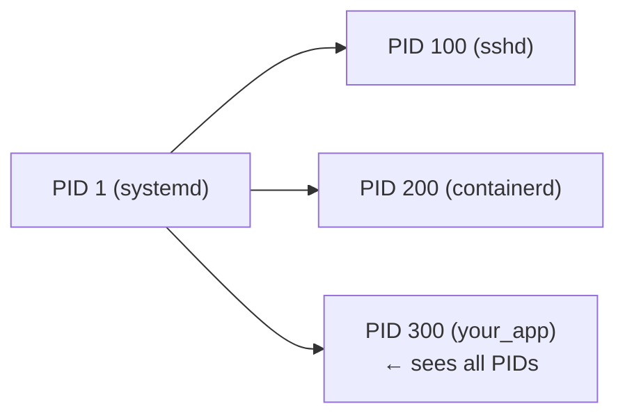
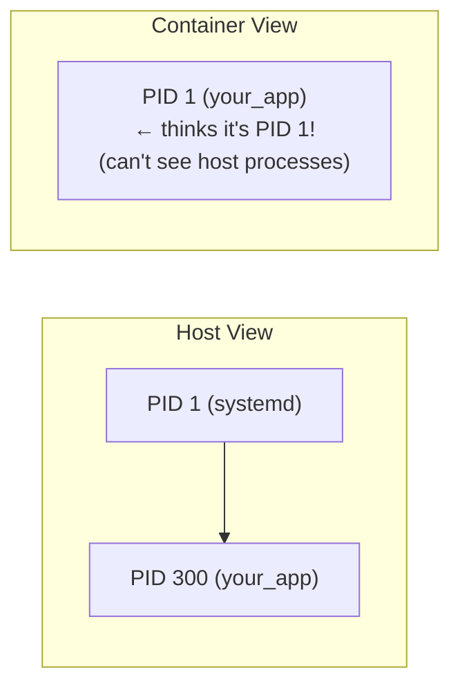
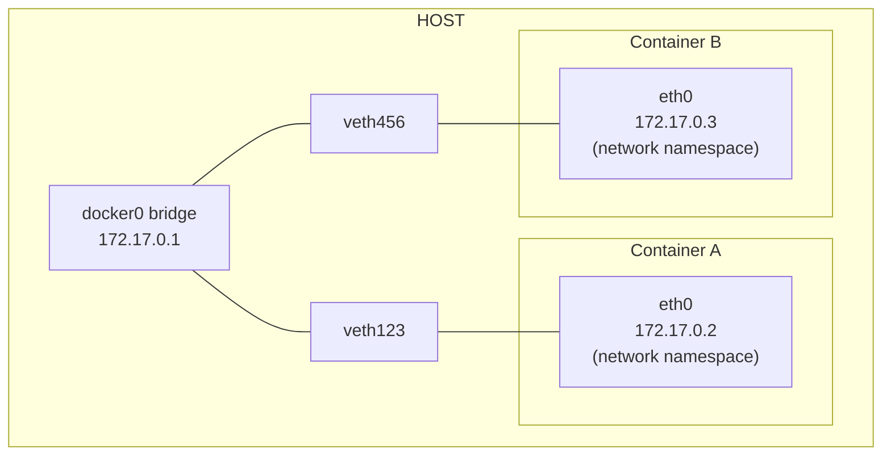

> **Linux Foundations** | Complexity: `[MEDIUM]` | Time: 30-35 min

## Prerequisites

Before starting this module:
- **Required**: [Module 1.1: Kernel & Architecture](/linux/foundations/system-essentials/module-1.1-kernel-architecture/)
- **Required**: [Module 1.2: Processes & systemd](/linux/foundations/system-essentials/module-1.2-processes-systemd/)
- **Helpful**: Basic understanding of networking concepts

---

## What You'll Be Able to Do

After this module, you will be able to:
- **Explain** what Linux namespaces are and how they enable container isolation
- **Create** and inspect namespaces using `unshare` and `nsenter`
- **Trace** which namespaces a container uses and how they differ from the host
- **Debug** container networking issues by examining network namespace configuration

---

## Why This Module Matters

Namespaces are the **foundation of container isolation**. When you run a Docker container or a Kubernetes pod, namespaces create the illusion of a separate system.

Understanding namespaces helps you:

- **Debug container networking** — Why can't my container reach the host?
- **Understand pod isolation** — How do containers in a pod share resources?
- **Troubleshoot PID conflicts** — Why does my container see only its own processes?
- **Implement security** — What isolation actually exists (and doesn't)?

When `kubectl exec` doesn't behave as expected, or containers can "see" each other when they shouldn't, you need to understand namespaces.

---

## Did You Know?

- **Namespaces predate Docker by years** — The first namespace (mount) was added to Linux in 2002. Docker (2013) just made them accessible through a friendly interface.

- **Kubernetes pods share namespaces** — Containers in the same pod share network and IPC namespaces by default. This is why they can communicate via localhost and share memory.

- **User namespaces enable rootless containers** — By mapping UID 0 inside the container to an unprivileged UID outside, you can run "root" processes without actual root privileges.

- **There are 8 namespace types** — Mount, UTS, IPC, PID, Network, User, Cgroup, and Time (added in Linux 5.6). Each isolates a different aspect of the system.

---

## What Are Namespaces?

A **namespace** wraps a global system resource in an abstraction that makes it appear to processes within the namespace that they have their own isolated instance.

> **Pause and predict**: If a process is placed in a new network namespace, what network interfaces will it see by default?



Each namespace type isolates a specific resource:

| Namespace | Isolates | Flag | Added |
|-----------|----------|------|-------|
| Mount (mnt) | Filesystem mount points | CLONE_NEWNS | 2002 |
| UTS | Hostname and domain | CLONE_NEWUTS | 2006 |
| IPC | Inter-process communication | CLONE_NEWIPC | 2006 |
| PID | Process IDs | CLONE_NEWPID | 2008 |
| Network (net) | Network stack | CLONE_NEWNET | 2009 |
| User | User and group IDs | CLONE_NEWUSER | 2013 |
| Cgroup | Cgroup root directory | CLONE_NEWCGROUP | 2016 |
| Time | System clocks | CLONE_NEWTIME | 2020 |

---

## Viewing Namespaces

Every process belongs to a set of namespaces:

```bash
# View your shell's namespaces
ls -la /proc/$$/ns/

# Output:
# lrwxrwxrwx 1 user user 0 Dec  1 10:00 cgroup -> 'cgroup:[4026531835]'
# lrwxrwxrwx 1 user user 0 Dec  1 10:00 ipc -> 'ipc:[4026531839]'
# lrwxrwxrwx 1 user user 0 Dec  1 10:00 mnt -> 'mnt:[4026531840]'
# lrwxrwxrwx 1 user user 0 Dec  1 10:00 net -> 'net:[4026531992]'
# lrwxrwxrwx 1 user user 0 Dec  1 10:00 pid -> 'pid:[4026531836]'
# lrwxrwxrwx 1 user user 0 Dec  1 10:00 user -> 'user:[4026531837]'
# lrwxrwxrwx 1 user user 0 Dec  1 10:00 uts -> 'uts:[4026531838]'
```

The numbers in brackets are inode numbers—unique identifiers for each namespace instance.

```bash
# Compare namespaces between processes
sudo ls -la /proc/1/ns/     # PID 1 (init)
sudo ls -la /proc/$$/ns/    # Your shell

# Use lsns for a summary
lsns
```

---

## PID Namespace

Makes processes see their own PID tree, with PID 1 as their init.

### Without PID Namespace



### With PID Namespace



### Try This: Create PID Namespace

```bash
# Run a shell in a new PID namespace
sudo unshare --pid --fork --mount-proc bash

# Inside the new namespace:
ps aux
# Only shows processes in this namespace

echo $$
# Shows 1 (or a low number) - you're PID 1 in this namespace!

# Exit
exit
```

### Why PID 1 Matters in Containers

In a PID namespace:
- Your process becomes PID 1
- PID 1 has special signal handling (SIGTERM ignored by default)
- PID 1 must reap zombie children
- If PID 1 dies, all processes in the namespace are killed

This is why containers use init systems like `tini` or `dumb-init`.

---

## Network Namespace

Creates an isolated network stack: interfaces, routing, firewall rules.

### What's Isolated

Each network namespace has its own:
- Network interfaces (eth0, lo, etc.)
- IP addresses
- Routing tables
- Firewall rules (iptables)
- /proc/net
- Port space (each namespace can have its own :80)

### Try This: Create Network Namespace

```bash
# Create a network namespace
sudo ip netns add test-ns

# List namespaces
ip netns list

# Run command in namespace
sudo ip netns exec test-ns ip addr
# Only shows loopback (down)

# Bring up loopback
sudo ip netns exec test-ns ip link set lo up

# Run a shell in the namespace
sudo ip netns exec test-ns bash

# Inside: no network connectivity to outside
ping 8.8.8.8  # Fails - no route

exit

# Clean up
sudo ip netns delete test-ns
```

### How Containers Get Network Access



Virtual ethernet pairs (veth) connect container namespaces to host bridges.

---

## Debugging with `nsenter`

When a container lacks debugging tools (like `ip`, `ping`, or `tcpdump`), you can use `nsenter` to run the host's debugging tools *inside* the container's namespaces. This is a critical workflow for troubleshooting "distroless" or stripped-down containers.

> **Stop and think**: If a container image doesn't have `tcpdump` installed, how can you capture its network traffic without modifying the image or installing packages?

### Scenario: Debugging a Container's Network

Imagine you have a container named `web-app` that cannot reach the database. The container image is minimal and lacks networking tools.

1. **Find the container's main PID:**
   First, you need the process ID (PID) of the container's main process as seen from the host system.
   ```bash
   # For Docker
   PID=$(docker inspect --format '{{.State.Pid}}' web-app)
   
   # For containerd / Kubernetes (using crictl)
   # PID=$(crictl inspect <container_id> | jq .info.pid)
   
   echo "Container PID on host: $PID"
   ```

2. **Enter the network namespace:**
   Use `nsenter` to run a command (e.g., `ip route`) using the target process's network namespace, but relying on the host's filesystem and binaries.
   ```bash
   # Enter ONLY the network namespace (-n or --net)
   sudo nsenter -t $PID -n ip route
   ```

3. **Run a packet capture:**
   Because you are using the host's binaries, you can run `tcpdump` directly inside the container's isolated network stack:
   ```bash
   sudo nsenter -t $PID -n tcpdump -i eth0 port 80
   ```

By selectively entering specific namespaces, you effectively combine the container's environment (its network stack) with the host's tooling (the `tcpdump` binary), allowing deep inspection without altering the container itself.

---

## Mount Namespace

Isolates filesystem mount points—each namespace sees different mounts.

> **Stop and think**: If you mount a new volume inside a container, will the host system automatically be able to access the contents of that mount?

### What's Isolated

- Mount points
- What filesystems are visible
- Allows private /tmp, /proc, etc.

### Try This: Mount Namespace

```bash
# Create mount namespace with private /tmp
sudo unshare --mount bash

# Inside: create a private mount
mount -t tmpfs tmpfs /tmp
echo "secret" > /tmp/hidden.txt

# This /tmp is only visible in this namespace!
cat /tmp/hidden.txt

exit

# Back on host: /tmp/hidden.txt doesn't exist
cat /tmp/hidden.txt  # No such file
```

### Container Filesystem Isolation

```
Host filesystem:
/
├── etc/passwd  (host users)
├── var/        (host data)
└── ...

Container mount namespace:
/                     (overlay mount of image + container layer)
├── etc/passwd        (container users - different file!)
├── var/              (container data)
└── ...
```

---

## UTS Namespace

Isolates hostname and domain name.

```bash
# Create UTS namespace with different hostname
sudo unshare --uts bash

# Change hostname (only in this namespace)
hostname container-host
hostname
# Shows: container-host

exit

hostname
# Shows: original hostname (unchanged)
```

This is how containers have their own hostnames without affecting the host.

---

## User Namespace

Maps UIDs inside the namespace to different UIDs outside.

> **Pause and predict**: If you run a rootless container and execute a process as UID 0 inside it, what UID will that process appear as if you inspect it from the host system?

### Why User Namespaces Matter

```
Without user namespace:
Container UID 0 (root) = Host UID 0 (root)  ← DANGEROUS!

With user namespace:
Container UID 0 (root) → Host UID 100000 (unprivileged)
```

### Rootless Containers

```bash
# Check if your system supports user namespaces
cat /proc/sys/kernel/unprivileged_userns_clone
# 1 = enabled

# Podman uses user namespaces by default for rootless containers
podman run --rm alpine id
# uid=0(root) gid=0(root)  ← root INSIDE container
# but mapped to your UID on the host
```

### Mapping Example

```
/etc/subuid: user:100000:65536

Meaning: user "user" can use UIDs 100000-165535

Inside container:    Outside (host):
UID 0           →    UID 100000
UID 1           →    UID 100001
UID 1000        →    UID 101000
```

---

## IPC Namespace

Isolates inter-process communication: shared memory, semaphores, message queues.

### Why It Matters

Without IPC namespace isolation:
- Containers could access each other's shared memory
- A malicious container could interfere with others

```bash
# Create IPC namespace
sudo unshare --ipc bash

# List IPC objects
ipcs
# Empty - isolated from host IPC

exit

ipcs
# May show host IPC objects
```

---

## Kubernetes and Namespaces

### Pod Namespace Sharing

```yaml
apiVersion: v1
kind: Pod
metadata:
  name: multi-container
spec:
  containers:
  - name: web
    image: nginx
  - name: sidecar
    image: busybox
    command: ["sh", "-c", "while true; do wget -q -O- localhost; sleep 5; done"]
```

Both containers share:
- **Network namespace** — Can reach each other via localhost
- **IPC namespace** — Can use shared memory
- **UTS namespace** — Same hostname

Each container has its own:
- **PID namespace** (by default, can be shared)
- **Mount namespace** — Separate filesystems
- **User namespace** — Separate user mappings

### Sharing Host Namespaces

```yaml
apiVersion: v1
kind: Pod
spec:
  hostNetwork: true      # Use host network namespace
  hostPID: true          # Use host PID namespace
  hostIPC: true          # Use host IPC namespace
  containers:
  - name: debug
    image: busybox
```

**Warning**: This breaks isolation! Only use for debugging or system pods.

---

## Common Mistakes

| Mistake | Problem | Solution |
|---------|---------|----------|
| Assuming complete isolation | Namespaces don't isolate everything (kernel, time) | Use additional security (seccomp, AppArmor) |
| Running as root without user namespace | Container escape = host root | Use rootless containers or user namespaces |
| hostNetwork without need | Breaks network isolation | Only use when truly necessary |
| Not understanding PID 1 | Signal handling issues, zombies | Use proper init (tini, dumb-init) |
| Shared mounts without intent | Data leaks between containers | Use proper volume configurations |

---

## Quiz

### Question 1
**Scenario**: You deploy a Node.js application containerized without an init process like `dumb-init`. When Kubernetes tries to terminate the pod during a rolling update, the container ignores the `SIGTERM` signal, hangs for 30 seconds, and is eventually forcefully killed with `SIGKILL`. Why did the Node.js process ignore `SIGTERM`?

<details>
<summary>Show Answer</summary>

**The Node.js process was running as PID 1 inside its isolated PID namespace.** In Linux, PID 1 is the `init` process and receives special treatment from the kernel, including ignoring signals like `SIGTERM` unless the application explicitly registers a signal handler for them. Because Node.js doesn't natively handle `SIGTERM` as an init system would, the signal is dropped, and Kubernetes is forced to wait for the grace period to expire before sending an uncatchable `SIGKILL`. Wrapping the application with a minimal init system like `tini` or `dumb-init` ensures it runs as a normal PID and properly receives and forwards termination signals.

</details>

### Question 2
**Scenario**: You run an Nginx container bound to port 80 and an Apache container also bound to port 80 on the same Linux host using Docker. Both start successfully and serve traffic without a "port already in use" error. How is the Linux kernel able to allow both processes to listen on port 80 simultaneously?

<details>
<summary>Show Answer</summary>

**Each container is running in its own isolated Network namespace.** A network namespace provides a completely independent network stack, including its own interfaces, routing tables, and port space. Because Nginx and Apache are in different network namespaces, Container A's port 80 is logically separate from Container B's port 80. The container runtime (like Docker) then uses port forwarding (NAT rules via `iptables`) on the host to map different external host ports to port 80 inside each respective isolated namespace.

</details>

### Question 3
**Scenario**: You have a Kubernetes pod containing an application container and a logging sidecar container. The application container writes logs to a local file, but the sidecar cannot find or read that file, even though both are in the exact same pod. What namespace-related concept explains why the sidecar cannot see the file, and how is this normally resolved in Kubernetes?

<details>
<summary>Show Answer</summary>

**Containers in a pod do not share Mount namespaces by default.** While Kubernetes pods share Network, IPC, and UTS namespaces, each container still receives its own isolated Mount namespace, meaning they have completely separate root filesystems. To allow the sidecar to see the application's log files, you must configure a shared Kubernetes `Volume` (like an `emptyDir`) and mount it into both containers. Because the volume is mounted into both isolated Mount namespaces, it provides a shared directory they can both access.

</details>

### Question 4
**Scenario**: You are debugging a malfunctioning container. From the host system, you run a command to spawn a new bash shell that shares the exact same process tree view as the malfunctioning container, allowing you to see its internal processes. You used a command with the flags `--pid --fork`. Why was the `--fork` flag necessary when entering or creating this new PID namespace?

<details>
<summary>Show Answer</summary>

**The `--fork` flag ensures the new process becomes PID 1 inside the newly created PID namespace.** When you use `unshare --pid`, the unshare process itself does not enter the new PID namespace; only its children do. By adding `--fork`, `unshare` forks a new child process (like `bash`) which correctly enters the new namespace and acts as the initial process (PID 1). Without `--fork`, the command would run in the original PID namespace, failing to provide the isolated process view you intended to create.

</details>

### Question 5
**Scenario**: A vulnerability is discovered in your web application that allows an attacker to execute arbitrary code inside the container as `root` (UID 0). However, when the attacker attempts to read sensitive files on the host filesystem that were accidentally mounted, they get a "Permission denied" error. The files on the host are owned by `root`. What Linux feature prevented the attacker from accessing the host files?

<details>
<summary>Show Answer</summary>

**The container runtime is using User namespaces to map the container's root user to an unprivileged host user.** With user namespaces enabled, a process can have UID 0 (root) inside the container, but the kernel maps this to a high, unprivileged UID (like 100000) on the host machine. When the attacker tried to access the host files owned by the real host root, the kernel evaluated their permissions based on the mapped unprivileged UID, resulting in a denial. This mapping ensures that even if a container escape occurs, the attacker has no actual administrative privileges on the underlying host.

</details>

---

## Hands-On Exercise

### Exploring Namespaces

**Objective**: Create and explore different namespace types.

**Environment**: Linux system with root access

#### Part 1: View Current Namespaces

```bash
# 1. Your shell's namespaces
ls -la /proc/$$/ns/

# 2. Compare with PID 1
sudo ls -la /proc/1/ns/

# 3. List all namespaces on system
lsns

# 4. Find namespace types
lsns -t net
lsns -t pid
```

#### Part 2: PID Namespace

```bash
# 1. Create PID namespace
sudo unshare --pid --fork --mount-proc bash

# 2. Explore inside
ps aux
echo "My PID: $$"

# 3. Try to see host processes
ls /proc/  # Only see processes in this namespace

# 4. Exit
exit
```

#### Part 3: Network Namespace

```bash
# 1. Create namespace
sudo ip netns add myns

# 2. List it
ip netns list

# 3. Check network inside
sudo ip netns exec myns ip addr
# Only lo, and it's down

# 4. Bring up loopback
sudo ip netns exec myns ip link set lo up
sudo ip netns exec myns ip addr

# 5. Try to ping outside
sudo ip netns exec myns ping -c 1 8.8.8.8
# Fails - no connectivity

# 6. Clean up
sudo ip netns delete myns
```

#### Part 4: Mount Namespace

```bash
# 1. Create mount namespace
sudo unshare --mount bash

# 2. Create private mount
mkdir -p /tmp/ns-test
mount -t tmpfs tmpfs /tmp/ns-test
echo "namespace secret" > /tmp/ns-test/secret.txt

# 3. Verify it exists
cat /tmp/ns-test/secret.txt

# 4. Exit
exit

# 5. Check from host
cat /tmp/ns-test/secret.txt
# File not found - mount was namespace-private!
```

#### Part 5: UTS Namespace

```bash
# 1. Create UTS namespace
sudo unshare --uts bash

# 2. Change hostname
hostname my-container
hostname

# 3. Exit and check host
exit
hostname  # Unchanged!
```

### Success Criteria

- [ ] Listed namespaces for current process
- [ ] Created PID namespace and verified isolation
- [ ] Created network namespace and explored it
- [ ] Created mount namespace with private mount
- [ ] Changed hostname in isolated UTS namespace

---

## Key Takeaways

1. **Namespaces create isolated views** — Each type isolates a specific resource

2. **8 namespace types** — PID, Network, Mount, UTS, IPC, User, Cgroup, Time

3. **Containers = processes + namespaces** — That's the core abstraction

4. **Pod containers share namespaces** — Network and IPC by default

5. **User namespaces enable rootless** — UID mapping is key to secure containers

---

## What's Next?

In **Module 2.2: Control Groups (cgroups)**, you'll learn how Linux limits and accounts for resource usage—the enforcement behind Kubernetes resource requests and limits.

---

## Further Reading

- [Linux Namespaces man page](https://man7.org/linux/man-pages/man7/namespaces.7.html)
- [Namespaces in Operation (LWN series)](https://lwn.net/Articles/531114/)
- [Container Security by Liz Rice](https://www.oreilly.com/library/view/container-security/9781492056690/)
- [What Are Namespaces and cgroups (Red Hat)](https://www.redhat.com/sysadmin/cgroups-part-one)