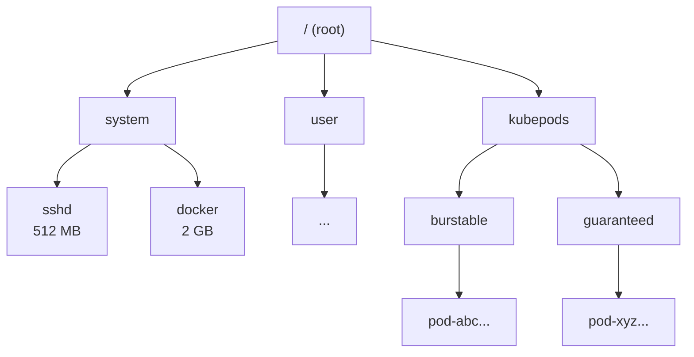
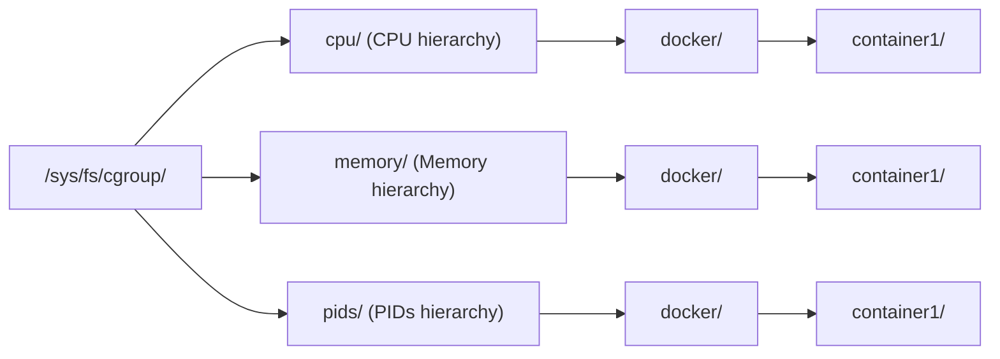
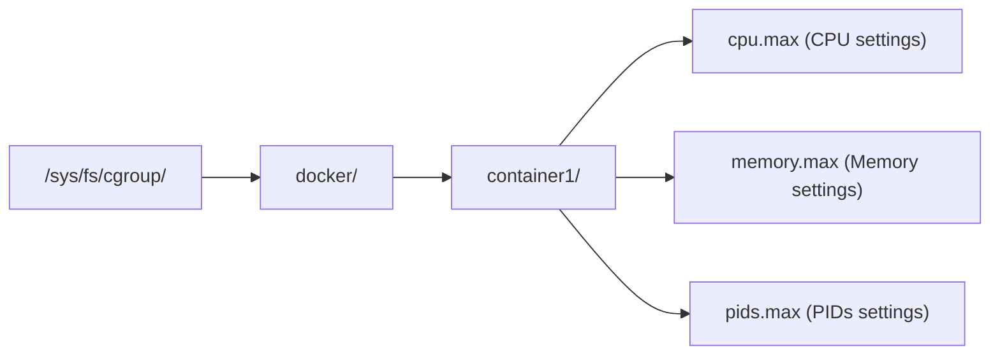
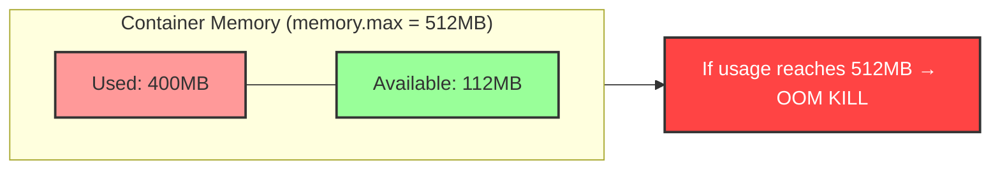
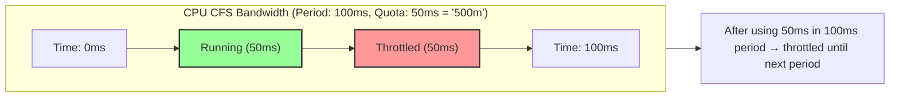
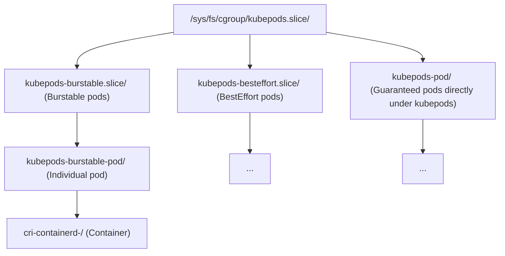
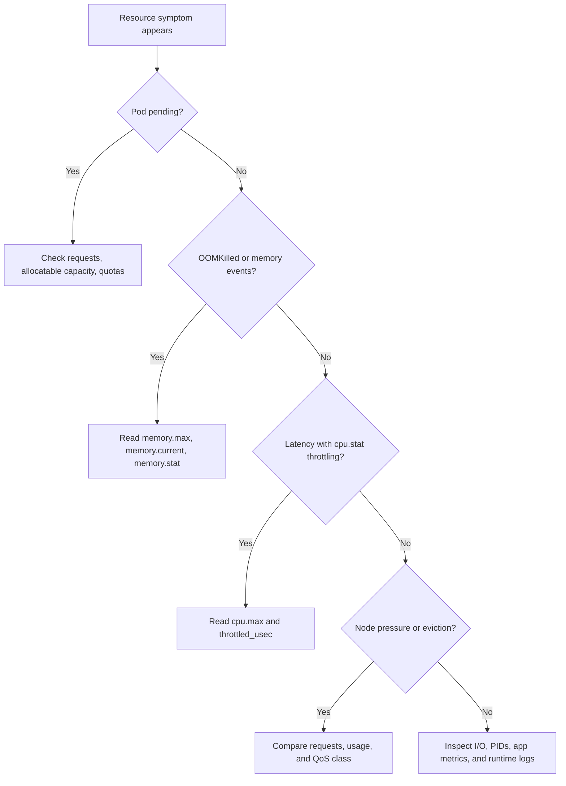

# Module 2.2: Control Groups (cgroups)

> **Linux Foundations** | Complexity: `[MEDIUM]` | Time: 30-35 min. This medium-depth lesson assumes you can already read basic Linux commands and Kubernetes pod output, and it focuses on turning cgroup files into practical operational decisions.

## Prerequisites

Before starting this module, make sure the namespace model from the previous lesson is comfortable enough that you can separate visibility isolation from resource enforcement while reading examples.

- **Required**: [Module 2.1: Linux Namespaces](../module-2.1-namespaces/)
- **Helpful**: Understanding of CPU and memory concepts

## Learning Outcomes

After this module, you will be able to perform resource diagnosis and design work that can be checked against real cgroup files, Kubernetes status, and lab evidence.

- **Diagnose** OOMKilled containers by reading cgroup memory accounting, Kubernetes events, and kernel logs.
- **Compare** cgroups v1 and v2 by tracing where CPU, memory, I/O, and PIDs controllers live.
- **Implement** CPU, memory, PID, and I/O limits with raw cgroups, systemd units, and Kubernetes resources.
- **Evaluate** Kubernetes requests, limits, and QoS classes when designing node capacity for production workloads.

## Why This Module Matters

At 02:18 on a Monday, a payments team at a regional marketplace watched checkout latency climb from ordinary to unusable in under seven minutes. The database was healthy, the application pods were still marked `Running`, and the node dashboards showed enough total CPU left that the first incident commander suspected a network problem. The real fault sat lower in the stack: a new video thumbnail worker had a strict CPU limit, burned through its cgroup quota early in every scheduling period, and then spent half of each period paused by the kernel while queues backed up behind it.

The same company had seen a different failure the previous quarter when a Java service disappeared during a holiday promotion. Its heap was set to the same size as its container memory limit, so the heap, thread stacks, native buffers, JIT metadata, page cache, and kernel accounting together crossed the hard cgroup boundary. The application never caught an exception, never flushed its final log line, and never ran a graceful shutdown handler because the kernel sent `SIGKILL`. Namespaces explained why the process could not see the host, but cgroups explained why the process could not keep running.

Control groups are the Linux mechanism behind the resource promises that platform teams make every day. Every Kubernetes memory limit, many CPU throttling mysteries, most pod QoS tradeoffs, and a surprising amount of systemd service behavior eventually reduce to files under `/sys/fs/cgroup`. This module teaches cgroups as an operational tool rather than as a kernel trivia topic: you will follow the hierarchy, translate Kubernetes YAML into kernel controls, read memory and CPU accounting when an incident is live, and decide when a limit protects the node versus when it quietly damages application behavior.

## cgroups as the Other Half of Containers

Namespaces and cgroups solve different halves of the container problem. A namespace changes what a process can see, such as its process tree, network devices, mounts, hostname, or user IDs. A cgroup changes how much a process can consume, such as CPU time, memory, I/O bandwidth, process IDs, and device access. If namespaces are like putting a team in a private workshop with its own labeled shelves, cgroups are the facility rules that say how much electricity, floor space, and tool time that workshop may use before someone else is harmed.

Control groups organize processes into hierarchical groups whose resource usage can be limited, monitored, and controlled. The hierarchy matters because limits can be applied at different levels: a service can have an overall memory ceiling, child processes can have narrower limits, and Kubernetes can place pods into QoS-specific branches that express scheduling and eviction priorities. The kernel enforces these controls without asking the application for permission, which is why cgroups are powerful during overload and unforgiving when engineers set values without understanding the full process footprint.



The diagram shows a simplified resource tree, not a separate miniature operating system for each container. The process still runs under the same host kernel as every other process, but its resource accounting is charged to a particular branch. When a container runtime starts a workload, it joins the workload's processes to a cgroup, writes controller files such as `memory.max` or `cpu.max`, and lets the kernel enforce the rule on every allocation, fork, and CPU scheduling decision that follows.

The hierarchy also gives operators a way to reason about inherited pressure. A parent cgroup can represent a slice, a service, or a pod, while child cgroups represent narrower units beneath it. If the parent has a tight ceiling, every child competes inside that ceiling even when each child looks reasonable alone. This is why inspecting only a container's leaf directory can miss a service-level or slice-level cap above it. In a real incident, climb the tree until you understand the nearest limit that could constrain the process.

| Resource | Controller | What It Controls |
|----------|------------|------------------|
| CPU | cpu, cpuset | CPU time, CPU cores |
| Memory | memory | RAM usage, swap |
| I/O | io (v2), blkio (v1) | Disk bandwidth |
| PIDs | pids | Number of processes |
| Network | net_cls, net_prio | Network priority (limited) |
| Devices | devices | Access to devices |
| Freezer | freezer | Suspend/resume processes |

Several controllers are easy to underestimate because they do not appear in the first incident graph. The `pids` controller prevents fork bombs and runaway process creation, which matters for shell-heavy jobs and language runtimes that spawn workers. The `io` controller can protect latency-sensitive services from batch workloads that saturate storage. The devices controller limits access to host devices, and systemd also uses cgroups so ordinary Linux services can be controlled with the same kernel machinery that containers use.

Resource controllers are not all equally portable across orchestration layers, so you should distinguish kernel capability from platform exposure. The kernel may support a controller, systemd may expose a friendly unit property for it, and Kubernetes may or may not provide a direct per-pod field for the same control. That layering matters when a teammate asks why a limit can be set in a systemd unit but not in a Deployment manifest. The answer is often not "Linux cannot do it"; it is "this control plane has chosen a narrower API."

Pause and predict: if a process is in a private PID namespace but has no useful cgroup limit, what stops it from consuming all memory on the node? The answer is almost nothing at the namespace layer; visibility isolation does not imply resource fairness. A container can have a tidy process tree and still pressure the host into reclaim, eviction, or kernel OOM behavior if its cgroup configuration leaves the workload unbounded.

## cgroups v1, cgroups v2, and Why the Hierarchy Changed

cgroups v1 grew controller by controller, and that history leaked into the operational model. CPU, memory, block I/O, PIDs, and other controllers could each have their own mount and their own tree. A process could effectively appear in one branch for CPU accounting and another branch for memory accounting, which made simple questions surprisingly awkward: "Which resource group is this container in?" sometimes required checking several files and reconciling different paths.



That split hierarchy made early container implementations possible, but it also encouraged tooling to hardcode controller-specific paths such as `/sys/fs/cgroup/memory/memory.usage_in_bytes`. Those paths were never a portable application API; they were a reflection of how a particular host mounted cgroup v1. When a team upgrades nodes and an old DaemonSet cannot find the memory hierarchy, the failure is usually not a missing package. It is a tool that assumed the old topology would exist forever.

cgroups v2 fixes the topology by using one unified hierarchy. A process belongs to one cgroup path, and controllers expose their files in that same directory. Instead of looking under separate CPU and memory trees, an operator can inspect one directory and find `cpu.max`, `cpu.stat`, `memory.current`, `memory.max`, `memory.stat`, `pids.current`, and other controller files together. The unified model also improves delegation, pressure reporting, and consistency, which is why modern distributions and Kubernetes deployments have moved toward it.



For Kubernetes 1.35 and newer training environments, treat cgroup v2 as the expected node baseline. The original operational warning remains important: starting with Kubernetes 1.35, cgroup v1 support is disabled by default in this curriculum's target environment, and kubelet startup should be validated against a cgroup v2 host. If an older node image still reports cgroup v1, upgrade the operating system or boot configuration before blaming kubelet, containerd, or the CNI plugin.

```bash
# Check cgroup version
mount | grep cgroup

# v1 shows: cgroup on /sys/fs/cgroup/cpu type cgroup
# v2 shows: cgroup2 on /sys/fs/cgroup type cgroup2

# Or check directly
cat /sys/fs/cgroup/cgroup.controllers 2>/dev/null && echo "v2" || echo "v1 or mixed"
```

The fastest check on a modern Linux host is `stat -fc %T /sys/fs/cgroup`, which should return `cgroup2fs` for a pure v2 hierarchy. `mount | grep cgroup` gives more context, especially on mixed systems, but the direct filesystem type check is easier to put into a node validation runbook. A cluster upgrade plan should include this check for every node pool, because one stale image can create confusing behavior when kubelet, CRI, and monitoring tools disagree about expected paths.

| Feature | v1 | v2 |
|---------|----|----|
| Hierarchy | Multiple (per controller) | Single (unified) |
| Process membership | Can be in different groups per controller | One group for all controllers |
| Memory pressure | Not available | Available (memory.pressure) |
| I/O control | Limited (blkio) | Better (io) |
| Kubernetes support | Legacy | Default (1.25+) |

The table captures the high-level migration, but the operational consequence is more concrete: your diagnostic commands must match the hierarchy that the host actually runs. In v1, memory usage might be in `memory.usage_in_bytes`; in v2, current usage is in `memory.current`. In v1, CPU quota files often appear as `cpu.cfs_quota_us` and `cpu.cfs_period_us`; in v2, the same idea is represented by `cpu.max`. A good incident response note always starts by naming the cgroup version before listing paths.

Mixed fleets deserve special care because cgroup migration usually happens through operating-system images, boot options, container runtime configuration, and kubelet configuration together. One node pool may be fully v2 while another still exposes legacy paths because it uses an older distribution or a different image pipeline. Monitoring that silently falls back to zeros can hide that split until an incident. A safer migration plan includes an explicit node check, a DaemonSet or bootstrap script that reports the detected hierarchy, and an inventory of agents that read cgroup files directly.

Before running this on a node, predict which paths your runtime will use: systemd slices, CRI container scopes, or a distribution-specific pod layout. Then inspect `/proc/<pid>/cgroup` for a real process and compare your prediction with the kernel's answer. That small exercise catches many false assumptions, especially on hosts that moved from Docker-managed paths to containerd with systemd cgroup drivers.

## Memory Limits and OOM Diagnosis

Memory is the cgroup controller that teaches the hardest lesson because its failure mode is abrupt. CPU can be delayed, disk I/O can queue, and PIDs can refuse a new fork, but a process that crosses a hard memory limit may be killed without a graceful shutdown path. The kernel is not negotiating with the runtime or the language VM at that moment. It is enforcing a boundary that the container runtime wrote into the workload's cgroup.



The most common beginner mistake is thinking that an application memory setting and a container memory limit describe the same thing. A Java heap, Python object graph, Go heap target, or database buffer pool is only part of the process footprint. Native allocations, thread stacks, memory-mapped files, shared memory, TLS buffers, JIT metadata, page cache charged to the cgroup, and kernel memory can all contribute to the cgroup's current usage. If the limit equals the application heap, the real workload may have no room to breathe.

Stop and think: if a Java application with a 512MB heap size is placed in a container with a 512MB cgroup memory limit, it will almost certainly be OOMKilled. The heap is not the whole process, and the memory controller charges more than the object space that the JVM flag describes. The safer engineering question is not "Can the heap fit?" but "Can the whole process, its runtime overhead, and its worst normal request shape fit with headroom?"

When memory exceeds the limit, the sequence is short and harsh. The kernel invokes OOM handling for the constrained cgroup, chooses a victim process within that context, sends `SIGKILL`, and the container runtime reports termination to Kubernetes. Kubernetes may restart the container according to the pod restart policy, but the process that was killed cannot catch `SIGKILL`, flush final application logs, or finish an in-flight request. This is why OOMKilled incidents often have an empty application log and a much more useful kernel or Kubernetes event trail.

```bash
# Check if OOM killed
dmesg | grep -i "oom"
# or
journalctl -k | grep -i "oom"

# In Kubernetes
kubectl describe pod <pod-name> | grep -i oom
# Look for: OOMKilled
```

This module uses the Kubernetes shorthand `k` for later commands. Define it once in your shell before you use the Kubernetes examples, then prefer the alias in incident notes so commands stay readable under pressure.

In the upstream Kubernetes documentation, the full command name is `kubectl`; in this curriculum, the local shorthand is introduced beside that first mention so every later `k get`, `k describe`, or `k logs` example is unambiguous.

```bash
alias k=kubectl
k describe pod <pod-name> | grep -i oom
```

The raw cgroup files tell you whether the kernel had room left inside the cgroup, not just whether the node had free memory somewhere else. On cgroup v2, `memory.max` is the hard ceiling, `memory.current` is current charged usage, and `memory.stat` breaks that usage into categories such as anonymous memory, file cache, kernel memory, and shared memory. Reading those files near the time of failure helps distinguish a heap leak from cache growth, shared memory abuse, or a workload that was simply sized without enough overhead.

```bash
# v2
cat /sys/fs/cgroup/user.slice/user-1000.slice/memory.max
cat /sys/fs/cgroup/user.slice/user-1000.slice/memory.current

# For a container (path varies)
# Find container cgroup
find /sys/fs/cgroup -name "memory.max" 2>/dev/null | head -5
```

Paths vary because cgroups are a kernel mechanism used by several managers. A desktop shell may live under `user.slice`, a system service under `system.slice`, and a Kubernetes container under a pod-specific scope created by the runtime and systemd. The dependable method is to start from a process ID, read `/proc/<pid>/cgroup`, and then append the returned path to `/sys/fs/cgroup` on a v2 host. That avoids guessing whether the runtime uses Docker-style scopes, CRI containerd scopes, or a distribution-specific naming convention.

```bash
# v2 memory statistics
cat /sys/fs/cgroup/user.slice/memory.stat

# Key values:
# anon - anonymous memory (heap, stack)
# file - file cache
# kernel - kernel memory
# shmem - shared memory
```

Interpreting `memory.stat` is more useful than memorizing every field. High `anon` usually points toward heap, stack, or private allocations. High `file` can be page cache charged to the cgroup, which may be reclaimable but still competes with the limit under pressure. High `shmem` can reveal tmpfs or shared-memory patterns, and kernel memory growth can point toward networking buffers or filesystem behavior. The right fix differs by category, so the diagnosis should identify the dominant charge before changing YAML.

A practical OOM runbook should join three sources of evidence. Kubernetes status tells you the container state and restart count, kernel logs tell you whether OOM handling selected a victim, and cgroup files tell you what limit and usage accounting applied to the process. If all three agree, you can move from "the pod vanished" to a defensible action: raise the memory limit, reduce application footprint, adjust heap-to-container ratios, set a request that reflects steady-state use, or redesign the workload so one request cannot allocate the entire limit.

Memory pressure can also be a node-level story rather than a single-container story. A pod may be below its own `memory.max` and still be evicted because the node is short on available memory and the pod is using more than it requested. That distinction is the difference between "the kernel killed a process inside this cgroup" and "kubelet reclaimed resources according to eviction policy." The evidence looks different: cgroup OOM diagnosis focuses on a hard limit and container termination reason, while eviction diagnosis focuses on node conditions, QoS class, request honesty, and pressure thresholds.

When setting memory limits, leave room for the worst ordinary request, not only the quiet baseline. Many outages happen after a feature launch because a new code path creates larger temporary buffers, opens more concurrent connections, or warms a cache faster than before. The cgroup does not know that the spike is temporary or business-critical. It only sees charged bytes crossing a limit. A good load test therefore records `memory.current` and selected `memory.stat` fields during startup, warmup, steady state, and peak traffic rather than sampling a single happy moment.

## CPU Quotas, Weights, and Throttling

CPU limits are less dramatic than memory limits because they usually slow a workload instead of killing it. The Linux scheduler accounts for how much CPU time a cgroup consumes within a period, and if the group reaches its quota early, runnable tasks in that group can be throttled until the next period begins. To an application owner, this can look like a slow service with idle node CPU, which feels contradictory until you remember that the cgroup is a local budget, not a measurement of the whole machine.



The quota-period model explains why a single-threaded service with a half-CPU limit can suffer high tail latency during bursts. If it needs more than its allotted runtime early in the period, the kernel can pause it even though other cores are physically idle. For batch jobs, that may be acceptable because total throughput is intentionally capped. For latency-sensitive request handlers, a CPU limit can create sawtooth execution where the process runs, stalls, runs again, and produces long response-time outliers.

Pause and predict: if you set a CPU limit of `0.5` for a single-threaded Node.js application and it receives a massive traffic spike, what happens to response time? The container does not crash just because it wants more CPU. The scheduler throttles the cgroup after the quota is spent, so response time rises, event-loop delay grows, and dashboards may show the process below total node CPU capacity because the limit is doing exactly what it was configured to do.

| Kubernetes | Meaning | cgroup quota/period |
|------------|---------|---------------------|
| 1 | 1 full CPU | 100000/100000 |
| 500m | 0.5 CPU (50%) | 50000/100000 |
| 100m | 0.1 CPU (10%) | 10000/100000 |
| 2 | 2 full CPUs | 200000/100000 |

Kubernetes CPU requests and limits map to different cgroup concepts. A CPU request influences scheduling and relative CPU weight, which decides how the workload competes when CPU is contended. A CPU limit creates a hard bandwidth cap through `cpu.max` on cgroup v2. Requests are a fairness and placement signal; limits are an enforcement mechanism. Treating them as the same knob is one of the fastest ways to create either noisy-neighbor risk or unnecessary throttling.

```bash
# v2 CPU controls
cat /sys/fs/cgroup/cpu.max
# Format: quota period
# "50000 100000" = 50ms per 100ms = 50%

# Check throttling stats (v2)
cat /sys/fs/cgroup/cpu.stat
# Look for:
# nr_throttled - number of times throttled
# throttled_usec - total time throttled
```

The important file for throttling diagnosis is `cpu.stat`, especially `nr_throttled` and `throttled_usec`. `nr_throttled` tells you how often the cgroup was throttled, while `throttled_usec` tells you how much time was lost to throttling. A few events during a batch spike may be harmless, but a steadily increasing throttled time during normal request load is evidence that the limit is shaping user-visible latency. Pair that data with application latency and queue metrics before declaring the node healthy.

```bash
# Run a CPU-intensive process
stress --cpu 1 --timeout 30 &

# Watch throttling (in another terminal)
watch -n1 'cat /sys/fs/cgroup/user.slice/cpu.stat | grep throttled'
```

This experiment is useful because it separates desire for CPU from permission to use CPU. The `stress` process will remain runnable, and the scheduler will still enforce the cgroup budget. If your shell is not inside a constrained cgroup, you may not see throttling in `user.slice`; on a containerized system, repeat the same idea inside the target container's cgroup path. The lesson is not the exact path but the accounting behavior: CPU pressure becomes elapsed time, not a catchable error.

For production services, the decision to set CPU limits should be workload-specific. Hard caps can protect nodes from runaway CPU consumption and keep batch work within a purchased envelope. They can also damage latency-sensitive services that handle bursts better when allowed to borrow idle CPU. Many platform teams set CPU requests everywhere, use limits selectively, and monitor throttling as a first-class signal rather than assuming low CPU utilization means the application is not CPU constrained.

CPU weights are the quieter sibling of CPU quotas. When there is no hard limit, weights influence relative fairness under contention: a service with a larger request receives a stronger share when multiple cgroups want CPU at the same time. That is very different from a quota, which can stop a workload even if nobody else is asking for the core. During design review, ask whether you need priority during contention or an absolute ceiling. Choosing the wrong mechanism can make a workload either too aggressive toward neighbors or too constrained during harmless bursts.

Latency analysis should include the shape of throttling, not just whether throttling exists. A background compiler that accumulates throttled time for minutes may still meet its service-level objective, while an API that accumulates short throttling bursts during every peak second may violate user-facing latency. The same raw `throttled_usec` counter can therefore mean different things for different workloads. Combine it with request duration histograms, queue depth, runtime scheduler metrics, and autoscaling events before deciding that the limit is the root cause or merely a contributing factor.

## Kubernetes Requests, Limits, QoS, and Raw cgroups

Kubernetes does not replace cgroups; it generates and manages them through kubelet, the container runtime, and the host's cgroup driver. When you write a resource request or limit in a pod spec, you are writing an intent that Kubernetes translates into scheduling decisions and kernel settings. The scheduler uses requests to decide where the pod can fit, while the runtime uses limits to set cgroup controls after the container starts. That split is central to debugging because the scheduler and kernel answer different questions.

```yaml
resources:
  requests:        # Scheduling guarantee
    memory: "256Mi"
    cpu: "250m"
  limits:          # Hard limit (cgroup)
    memory: "512Mi"
    cpu: "500m"
```

| Setting | Purpose | cgroup Behavior |
|---------|---------|-----------------|
| request.memory | Scheduling | Not directly enforced by cgroup |
| request.cpu | Scheduling | Sets cpu.weight (shares) |
| limit.memory | Hard limit | memory.max |
| limit.cpu | Throttling | cpu.max |

Memory requests are often misunderstood because they affect placement and eviction priority, not a soft memory reservation that the kernel hands to the container. A pod can use more than its memory request if the node has capacity and its memory limit allows it. Under node pressure, however, kubelet eviction logic considers QoS and whether pods exceed requests. That means a Burstable pod using far above its request can become a better eviction candidate than a Guaranteed pod that set requests equal to limits and stayed within its declared footprint.



QoS classes are not decorative labels. A Guaranteed pod has CPU and memory requests equal to limits for every container, which gives it the strongest eviction posture but no burst room beyond its limit. A Burstable pod has at least one request but does not meet the Guaranteed rule, giving it flexibility while making its excess usage less protected under pressure. A BestEffort pod has no requests or limits, which is convenient for experiments and dangerous for production because it receives the weakest scheduling and eviction guarantees.

```bash
# Find cgroup for a container
# 1. Get container ID
docker ps
crictl ps

# 2. Find its cgroup
cat /proc/<container-pid>/cgroup

# 3. Or search
find /sys/fs/cgroup -name "*<container-id-prefix>*" 2>/dev/null
```

On a Kubernetes node, a precise investigation usually starts with Kubernetes and ends with the kernel. Use `k get pod -o wide` to identify the node, `k describe pod` to read requests, limits, QoS class, restart history, and events, and then inspect the host's cgroup path for the container process. The YAML explains what Kubernetes intended, while `/sys/fs/cgroup` shows what the kernel is enforcing. If those differ, look at kubelet configuration, the runtime cgroup driver, and whether you are inspecting the correct container process.

```bash
k get pod <pod-name> -o wide
k describe pod <pod-name>
k get pod <pod-name> -o jsonpath='{.status.qosClass}{"\n"}'
```

Which approach would you choose here and why: raise a pod's memory limit, raise its memory request, or reduce the application footprint? A correct answer depends on the evidence. If the pod is OOMKilled while the node is healthy, the hard cgroup limit or process footprint is the direct problem. If the pod is evicted under node pressure while above its request, the request may be too low for the workload's real steady state. If `memory.stat` shows avoidable cache or heap growth, changing code or runtime settings may be better than buying more memory.

I/O and PID controls follow the same pattern even when Kubernetes exposes them differently across environments. The kernel can limit process creation through `pids.max`, and cgroup v2 provides `io.max` and related files for storage control. Kubernetes commonly surfaces PID limits through kubelet and runtime configuration rather than per-pod YAML in the same way as CPU and memory. That distinction matters because an operator may need to inspect both pod specs and node-level kubelet settings before concluding that a controller is missing.

Requests and limits also feed capacity planning conversations because they turn application behavior into a scheduling contract. If requests are too low, the scheduler can pack too many pods onto a node, and kubelet may later evict workloads when reality exceeds the paper plan. If requests are too high, the cluster buys capacity that sits unused because the scheduler believes the nodes are full. cgroup evidence helps calibrate that contract. A month of `memory.current`, CPU usage, throttling, and eviction data is more persuasive than one engineer's guess in a manifest review.

The most mature teams review resource settings the same way they review API contracts. They ask what changed since the last sizing decision, whether the service has new request shapes, whether runtime upgrades changed memory behavior, and whether autoscaling policies still match observed bottlenecks. They also separate user-facing services from batch, agents, caches, and databases because each class responds differently to throttling and OOM risk. A single cluster-wide template is convenient, but cgroups reward workload-specific honesty.

## systemd and cgroups on Ordinary Linux Hosts

Containers are not the only users of cgroups. systemd places services, sessions, and slices into cgroups so the init system can start, stop, account for, and constrain ordinary Linux workloads. This is why cgroup paths on modern Kubernetes nodes often contain `.slice` and `.scope` names: kubelet, containerd, and systemd cooperate to keep service supervision and resource control in one hierarchy. If you ignore systemd, pod cgroup paths can look mysterious even when the kernel is behaving normally.

```bash
# See cgroup hierarchy
systemd-cgls

# Resource usage by service
systemd-cgtop

# Specific service resources
systemctl show docker.service | grep -E "(Memory|CPU)"
```

`systemd-cgls` is a structural view, while `systemd-cgtop` is a live usage view. The first helps you answer "where is this process attached?" and the second helps you answer "which service or slice is consuming resources right now?" On a host with kubelet and containerd, those commands can quickly reveal whether a suspected workload is actually in a Kubernetes pod, a runtime service, a user session, or a separate system daemon that happens to share the node.

```ini
# /etc/systemd/system/myapp.service
[Service]
MemoryMax=512M
CPUQuota=50%
TasksMax=100

# Apply
systemctl daemon-reload
systemctl restart myapp
```

systemd names are friendlier than raw cgroup files, but the enforcement still flows through cgroups. `MemoryMax` becomes a memory limit, `CPUQuota` becomes CPU bandwidth control, and `TasksMax` constrains the number of tasks. This is valuable for host-level agents, side services, and legacy workloads that are not packaged as containers. It also means that a service can be throttled or killed by systemd-managed cgroup rules even when no Kubernetes pod is involved.

```bash
# Set runtime limit
sudo systemctl set-property docker.service MemoryMax=2G

# View current settings
systemctl show docker.service -p MemoryMax
```

Runtime property changes are excellent for controlled experiments and emergency containment, but they should be treated as configuration changes that need ownership. If you set a temporary `MemoryMax` on a service during an incident and never codify or remove it, the next responder may see unexplained behavior weeks later. The same discipline applies to Kubernetes limits: every resource rule should have an owner, an expected workload shape, and monitoring that can prove whether the rule protects the system or harms it.

One useful worked example is a node-level log forwarder that occasionally spikes CPU while compressing backlog. If it is an ordinary systemd service, you can set `CPUQuota` to protect kubelet and containerd from starvation, then watch `systemd-cgtop` and service latency to confirm the cap is acceptable. If the same forwarder runs as a DaemonSet, you would inspect pod requests, limits, QoS, and the pod's cgroup files instead. The kernel mechanism is shared, but the control plane you should edit depends on who owns the workload.

This shared mechanism is also why host daemons deserve resource budgets on Kubernetes nodes. Kubelet, containerd, log agents, metrics collectors, security agents, and backup tools can all compete with pods for CPU, memory, and I/O. If those services are unmanaged, a pod incident can become a node incident, or a node agent can become the noisy neighbor that hurts pods. systemd slices give platform engineers a host-level budget boundary that complements, rather than replaces, pod-level cgroups.

## Patterns & Anti-Patterns

Good cgroup practice starts with measuring the workload before setting hard boundaries. For memory, measure steady state, startup spikes, request spikes, runtime overhead, and page cache behavior, then leave enough headroom that ordinary variation does not become an OOM. For CPU, set requests to express normal need, add limits only when the workload should truly be capped, and alert on throttling instead of treating it as an invisible implementation detail.

| Pattern | When to Use | Why It Works | Scaling Consideration |
|---------|-------------|--------------|-----------------------|
| Requests everywhere, CPU limits selectively | Latency-sensitive services with bursty traffic | Scheduler gets a placement signal without forcing avoidable throttling | Requires throttling and node saturation monitoring |
| Memory limits with runtime headroom | JVM, Python, Go, database, and cache workloads | The cgroup covers heap plus native, stack, cache, and kernel charges | Revisit after runtime upgrades or traffic shape changes |
| Start diagnosis from `/proc/<pid>/cgroup` | Mixed Docker, containerd, and systemd hosts | The kernel tells you the actual cgroup path instead of relying on naming guesses | Automate path discovery in node runbooks |
| Use systemd properties for host services | Agents and daemons outside Kubernetes | Keeps non-pod workloads from starving kubelet, runtime, or storage agents | Keep runtime changes synchronized with unit files |

The matching anti-pattern is setting limits because a template required values rather than because the workload was profiled. A CPU limit copied from a sample manifest can quietly throttle a service for months, while a memory limit copied from a heap flag can turn harmless overhead into an OOM loop. Another anti-pattern is diagnosing from Kubernetes YAML alone. The YAML is necessary context, but cgroups are enforced by the kernel, so a serious investigation must inspect the host's actual accounting when the symptom is resource behavior.

| Anti-Pattern | What Goes Wrong | Better Alternative |
|--------------|-----------------|--------------------|
| Memory limit equals application heap | Runtime overhead crosses `memory.max` and the kernel sends `SIGKILL` | Size heap below the cgroup limit and validate with `memory.stat` |
| CPU limit on every service by default | Bursty request handlers suffer throttling despite idle node CPU | Use CPU requests broadly and limits where a hard cap is intentional |
| Hardcoded v1 cgroup paths in agents | Monitoring breaks on cgroup v2 nodes | Detect filesystem type and read version-appropriate files |
| Ignoring QoS during capacity design | Critical Burstable pods can be evicted while using above request | Use Guaranteed QoS for workloads that must be protected under pressure |

The most reliable pattern is to make the resource contract explicit in both directions. The platform declares what a workload can consume, and the workload owner declares what the application normally needs. When those two claims are checked against cgroup evidence, the conversation becomes concrete: "This pod requested 256Mi, normally uses 430Mi, was limited to 512Mi, and OOMKilled when `anon` plus `file` reached the boundary." That beats arguing from dashboards that only show node totals.

Another strong pattern is to preserve the path from symptom to file in the runbook. A note that says "check cgroups" is too vague for a stressed responder. A better note says to get the container process ID, read `/proc/<pid>/cgroup`, inspect `memory.max` and `memory.current` in the returned v2 path, then compare `cpu.max` with `cpu.stat` if latency is the symptom. That sequence teaches the next engineer how to reproduce the reasoning instead of copying a command that may only work on one node image.

## Decision Framework

Use this framework when you are deciding whether to change a request, change a limit, or change the workload. Start with the symptom, then choose the control that matches the enforcement point. A pod that cannot schedule is a request and capacity problem. A pod that is OOMKilled is a memory limit or footprint problem. A pod that is slow while `cpu.stat` throttling rises is a CPU limit problem. A node under pressure with evictions is a placement, request, QoS, or workload mix problem.



| Decision | Choose It When | Tradeoff |
|----------|----------------|----------|
| Increase memory limit | The process is legitimately bounded too tightly and node capacity exists | Reduces OOM risk but can reduce density or hide leaks |
| Increase memory request | The pod is regularly above request and should be protected during pressure | Improves scheduling honesty but may require more nodes |
| Remove or raise CPU limit | Throttling drives latency and the workload can safely borrow idle CPU | Requires node saturation controls elsewhere |
| Keep CPU limit | Batch work or noisy workloads must stay inside a hard budget | Predictable sharing may reduce burst performance |
| Change application behavior | `memory.stat`, profiles, or queue metrics show wasteful allocation or concurrency | Fixes root cause but takes engineering time |
| Change QoS class | A critical workload needs stronger eviction posture | Guaranteed QoS removes burst room unless sized carefully |

For a production incident, do not start by asking which knob is fashionable. Start by asking which actor enforced the failure. The scheduler enforces placement using requests, kubelet makes eviction decisions using pressure and QoS, the kernel enforces memory and CPU limits through cgroups, and the application runtime controls its own heap, thread, cache, and concurrency behavior. Good fixes line up with the actor that actually caused the symptom.

For a design review, work in the opposite direction. Decide how important the workload is, how bursty it is, how predictable its memory footprint is, and what kind of node failure you are trying to prevent. Then choose requests and limits that encode those decisions. A critical database might deserve Guaranteed QoS and conservative memory headroom, while a best-effort analytics job might accept throttling and eviction. cgroups do not decide that policy for you; they enforce the policy you wrote.

The framework also helps prevent overcorrection after incidents. If a service was OOMKilled once, the fix is not automatically "double the memory limit forever." First identify whether the service crossed a hard limit because the limit was wrong, because the application leaked, because a new request shape was unbounded, or because node pressure made an eviction look similar in dashboards. Then pick the smallest durable change that addresses the actual enforcement point. cgroups are precise enough that your remediation can be precise too, if you gather the evidence before editing manifests.

## Did You Know?

- **cgroups were originally developed by Google** engineers Paul Menage and Rohit Seth in 2006. They wanted a way to control resource usage in their massive data centers.
- **Kubernetes memory limits trigger the OOM killer**. When a container exceeds its memory limit, the kernel's Out-Of-Memory killer terminates it; there is no gradual slowdown or catchable application exception.
- **CPU limits use CFS bandwidth control**. A container can use less than a full host CPU under load because it is throttled after spending its quota within a scheduling period.
- **cgroups v2 is now the default direction for Kubernetes nodes**. Kubernetes has supported cgroup v2 by default since the 1.25 era, and Kubernetes 1.35+ environments in this curriculum should be validated as cgroup v2 hosts.

## Common Mistakes

| Mistake | Why It Happens | How to Fix It |
|---------|----------------|---------------|
| No memory limit on production pods | Teams want burst capacity and forget that an unbounded pod can pressure the whole node | Set limits from measured peaks plus runtime headroom, then watch OOM and memory pressure events |
| Limit equals request for every workload | Templates reward Guaranteed QoS even when the service needs safe burst room | Use Guaranteed QoS for critical predictable services and Burstable sizing for workloads with measured variation |
| Ignoring CPU throttling | Dashboards show low total node CPU, so engineers blame networking or storage | Read `cpu.stat`, compare `throttled_usec` with latency, and revisit CPU limits |
| Reading v1 paths on v2 hosts | Older tools expect `/sys/fs/cgroup/memory/...` because they were written before unified hierarchy adoption | Detect `cgroup2fs` and use files such as `memory.current`, `memory.max`, and `cpu.max` |
| Expecting an OOM log from the application | Developers assume the runtime can catch memory exhaustion inside the container | Check Kubernetes state, events, kernel logs, and cgroup memory files because `SIGKILL` is not catchable |
| Setting Java heap equal to container memory | The heap flag is mistaken for the whole process footprint | Leave room for native memory, stacks, page cache, JIT metadata, and kernel charges |
| Changing systemd cgroup limits during an incident and leaving them undocumented | Runtime containment feels temporary, but the setting may persist or be repeated manually | Record the owner, codify the unit setting, or remove the emergency property after validation |

## Quiz

<details><summary>1. Your database pod has a 4Gi memory request and an 8Gi memory limit. During a launch event it reaches 6Gi while the node enters memory pressure. What do you check before deciding whether this is an OOMKilled event, an eviction risk, or acceptable burst?</summary>

Start with `k describe pod` because Kubernetes will show the QoS class, restart history, events, requests, and limits in one place. The pod is below its hard memory limit, so a pure cgroup OOM is not guaranteed, but it is above its request and may be a weaker candidate under node pressure than a Guaranteed pod. Then inspect node pressure events and, if you have host access, the pod's `memory.current`, `memory.max`, and `memory.stat` files. The reasoning matters because raising the limit helps a hard cgroup OOM, while raising the request or changing QoS addresses eviction exposure.

</details>

<details><summary>2. A video encoder runs slowly, but the node dashboard shows only moderate total CPU usage. The pod has a `500m` CPU limit. Which cgroup evidence would confirm CPU throttling, and why can the node still look underused?</summary>

Read the container cgroup's `cpu.max` to confirm the quota and period, then read `cpu.stat` for `nr_throttled` and `throttled_usec`. The node can look underused because the cgroup budget is local to that workload; after it spends its quota, the scheduler can throttle it even if other CPU capacity exists on the host. This is a limit enforcement issue rather than a hardware utilization issue. The fix might be raising or removing the CPU limit, but only after checking whether the cap was protecting other workloads.

</details>

<details><summary>3. A Python batch container with a 512Mi memory limit loads a dataset larger than the limit and restarts without printing a final exception. Why did the application not catch the failure?</summary>

The cgroup memory limit is enforced by the kernel, not by the Python interpreter's exception machinery. When charged memory crosses `memory.max`, the kernel can select the process for OOM handling and send `SIGKILL`. That signal cannot be caught, blocked, or handled by Python, so the process has no opportunity to log a friendly `MemoryError` or run cleanup code. You diagnose it through Kubernetes termination state, events, kernel logs, and cgroup memory accounting rather than through application logs alone.

</details>

<details><summary>4. After a node upgrade, a monitoring DaemonSet cannot find `/sys/fs/cgroup/memory/memory.usage_in_bytes`. What changed, and how should the tool adapt?</summary>

The tool is assuming a cgroups v1 split hierarchy where the memory controller has its own mount and v1-specific filenames. On a cgroups v2 host, the process belongs to one unified cgroup path, and memory files such as `memory.current`, `memory.max`, and `memory.stat` live in that single directory. The tool should detect the filesystem type or the presence of `cgroup.controllers`, then choose v2 paths when the host uses `cgroup2fs`. Hardcoding v1 paths makes the agent fragile across modern Kubernetes nodes.

</details>

<details><summary>5. You need to implement limits for a host-level log forwarder that is managed by systemd, not Kubernetes. Which controls would you use, and what should you verify afterward?</summary>

Use systemd resource properties such as `MemoryMax`, `CPUQuota`, and `TasksMax` in the service unit or through `systemctl set-property` for a controlled runtime experiment. Those settings map to cgroup controls, so verification should include `systemctl show`, `systemd-cgls`, `systemd-cgtop`, and the relevant files under `/sys/fs/cgroup`. You should also watch the forwarder's delivery latency and error rate because a protective cap can become a data-loss or backlog problem. Finally, document or codify the setting so the next responder understands why the service is constrained.

</details>

<details><summary>6. Your platform template sets CPU requests and limits to the same value for every service. A latency-sensitive API shows rising event-loop delay and increasing `throttled_usec`. How would you evaluate whether to change the template?</summary>

The evidence points toward CPU bandwidth throttling, so first confirm the pod's `cpu.max`, `cpu.stat`, traffic pattern, and node saturation. If the node has headroom and the service benefits from short bursts, a strict CPU limit may be harming latency without protecting the system. A better template may keep CPU requests for scheduling honesty while making CPU limits optional or workload-specific. The decision should also include guardrails such as node saturation alerts, HPA behavior, and separate rules for batch or untrusted workloads that do need hard CPU caps.

</details>

<details><summary>7. A team wants Guaranteed QoS for a cache service, but its memory usage varies widely during warmup. What tradeoff should you explain before they set requests equal to limits?</summary>

Guaranteed QoS improves eviction posture because Kubernetes treats the pod as having a clear, fully declared resource contract. The tradeoff is that setting request equal to limit removes burst room beyond the hard cgroup memory boundary, so warmup variation can become OOMKilled if the limit does not include enough headroom. For a cache, you should measure warmup, steady state, and failure-mode memory behavior before choosing the values. Guaranteed QoS is useful when the workload is important and predictable enough to size honestly; it is dangerous when the limit is guessed.

</details>

## Hands-On Exercise

### Exploring cgroups

This lab keeps the original hands-on idea but turns it into a repeatable incident-style workflow. You will identify the cgroup version, inspect your shell's current resource group, read memory and CPU accounting, connect Kubernetes-style thinking to raw kernel files, and optionally create a small cgroup on a disposable Linux host. Run the commands on a test machine, not on a production node, because moving shells between cgroups and writing limits can affect your session.

**Objective**: Understand cgroup structure, limits, and throttling well enough to explain which file proves each diagnosis and which control plane should own the fix.

**Environment**: Use a Linux system with cgroups v1 or v2, preferably a disposable VM or lab node where systemd and cgroup inspection commands are safe to run.

#### Part 1: Identify cgroup Version

```bash
# 1. Check mount type
mount | grep cgroup

# 2. Check for v2
if [ -f /sys/fs/cgroup/cgroup.controllers ]; then
    echo "cgroups v2"
    cat /sys/fs/cgroup/cgroup.controllers
else
    echo "cgroups v1 or mixed"
    ls /sys/fs/cgroup/
fi
```

<details><summary>Solution notes for Part 1</summary>

On a cgroup v2 host you should see `cgroup2` mounted at `/sys/fs/cgroup`, and `/sys/fs/cgroup/cgroup.controllers` should list available controllers. On a v1 or mixed host you may see several controller-specific mounts instead. Record the version before continuing because every later path depends on this answer.

</details>

#### Part 2: Explore cgroup Hierarchy

```bash
# 1. Your process's cgroup
cat /proc/$$/cgroup

# 2. View hierarchy (v2)
ls /sys/fs/cgroup/

# 3. See systemd slices
systemd-cgls | head -50

# 4. Resource usage
systemd-cgtop
```

<details><summary>Solution notes for Part 2</summary>

The `/proc/$$/cgroup` command shows where your current shell is attached. On v2, the line usually starts with `0::` followed by a path in the unified hierarchy. Compare that path with `systemd-cgls` so you can connect process membership, systemd slices, and resource accounting.

</details>

#### Part 3: Memory cgroup

```bash
# 1. Find memory settings (v2)
cat /sys/fs/cgroup/user.slice/memory.max 2>/dev/null || \
cat /sys/fs/cgroup/memory/memory.limit_in_bytes 2>/dev/null

# 2. Current usage
cat /sys/fs/cgroup/user.slice/memory.current 2>/dev/null || \
cat /sys/fs/cgroup/memory/memory.usage_in_bytes 2>/dev/null

# 3. Memory statistics
cat /sys/fs/cgroup/user.slice/memory.stat 2>/dev/null | head -10
```

<details><summary>Solution notes for Part 3</summary>

If `memory.max` prints `max`, the cgroup has no hard memory ceiling at that level. If it prints a number, the value is bytes. Use `memory.current` for current charged usage and `memory.stat` to see whether anonymous memory, file cache, shared memory, or kernel memory dominates the charge.

</details>

#### Part 4: CPU cgroup

```bash
# 1. CPU settings (v2)
cat /sys/fs/cgroup/user.slice/cpu.max 2>/dev/null

# 2. CPU statistics
cat /sys/fs/cgroup/user.slice/cpu.stat 2>/dev/null

# 3. Check for throttling
cat /sys/fs/cgroup/user.slice/cpu.stat 2>/dev/null | grep throttled
```

<details><summary>Solution notes for Part 4</summary>

If `cpu.max` prints `max 100000`, there is no hard quota at that cgroup level. If it prints two numbers, the first is quota and the second is period. Watch whether `nr_throttled` and `throttled_usec` increase while the workload is active; increasing values mean the cgroup wanted CPU that the quota did not allow.

</details>

#### Part 5: Create a cgroup (v2, requires root)

```bash
# 1. Create a test cgroup
sudo mkdir /sys/fs/cgroup/test-cgroup

# 2. Enable controllers
echo "+memory +cpu" | sudo tee /sys/fs/cgroup/test-cgroup/cgroup.subtree_control

# 3. Set memory limit (100MB)
echo "104857600" | sudo tee /sys/fs/cgroup/test-cgroup/memory.max

# 4. Check it
cat /sys/fs/cgroup/test-cgroup/memory.max

# 5. Move current shell to this cgroup
echo $$ | sudo tee /sys/fs/cgroup/test-cgroup/cgroup.procs

# 6. Verify
cat /proc/$$/cgroup

# 7. Check memory usage
cat /sys/fs/cgroup/test-cgroup/memory.current

# 8. Exit shell to leave cgroup, then cleanup
exit
sudo rmdir /sys/fs/cgroup/test-cgroup
```

<details><summary>Solution notes for Part 5</summary>

This optional exercise should be done only on a disposable host or lab VM. If the shell successfully moves into the new cgroup, `/proc/$$/cgroup` should show the test path and `memory.current` should report memory charged to that group. If cleanup fails, make sure no process remains in the test cgroup before removing the directory.

</details>

### Success Criteria

- [ ] Diagnose OOMKilled containers by identifying the cgroup version and the correct memory accounting files.
- [ ] Compare cgroups v1 and v2 by explaining why the same memory metric appears under different paths.
- [ ] Implement a small v2 cgroup memory limit on a lab host or explain why your environment should not run that optional step.
- [ ] Evaluate CPU throttling by reading `cpu.max`, `cpu.stat`, `nr_throttled`, and `throttled_usec`.
- [ ] Evaluate Kubernetes requests, limits, and QoS class for a pod using `k describe pod` and raw cgroup evidence.

## Sources

- [Linux kernel cgroup v2 documentation](https://www.kernel.org/doc/html/latest/admin-guide/cgroup-v2.html)
- [Linux kernel cgroup v1 documentation](https://www.kernel.org/doc/html/latest/admin-guide/cgroup-v1/index.html)
- [Kubernetes Resource Management for Pods and Containers](https://kubernetes.io/docs/concepts/configuration/manage-resources-containers/)
- [Kubernetes Pod Quality of Service Classes](https://kubernetes.io/docs/concepts/workloads/pods/pod-qos/)
- [Kubernetes Node Pressure Eviction](https://kubernetes.io/docs/concepts/scheduling-eviction/node-pressure-eviction/)
- [Kubernetes cgroup drivers](https://kubernetes.io/docs/setup/production-environment/container-runtimes/#cgroup-drivers)
- [Kubernetes configure default memory requests and limits](https://kubernetes.io/docs/tasks/administer-cluster/manage-resources/memory-default-namespace/)
- [systemd.resource-control manual](https://www.freedesktop.org/software/systemd/man/latest/systemd.resource-control.html)
- [Docker resource constraints documentation](https://docs.docker.com/engine/containers/resource_constraints/)
- [OCI Runtime Specification Linux cgroups](https://github.com/opencontainers/runtime-spec/blob/main/config-linux.md#control-groups)
- [Red Hat cgroups Guide](https://access.redhat.com/documentation/en-us/red_hat_enterprise_linux/8/html/managing_monitoring_and_updating_the_kernel/using-cgroups-v2-to-control-distribution-of-cpu-time-for-applications_managing-monitoring-and-updating-the-kernel)
- [Understanding CFS Bandwidth Throttling](https://engineering.indeedblog.com/blog/2019/12/cpu-throttling-regression-fix/)

## Next Module

[Next Module: Capabilities & LSMs](../module-2.3-capabilities-lsm/) shows how Linux narrows what a process may do even after namespaces shape its view and cgroups constrain its resource use.
