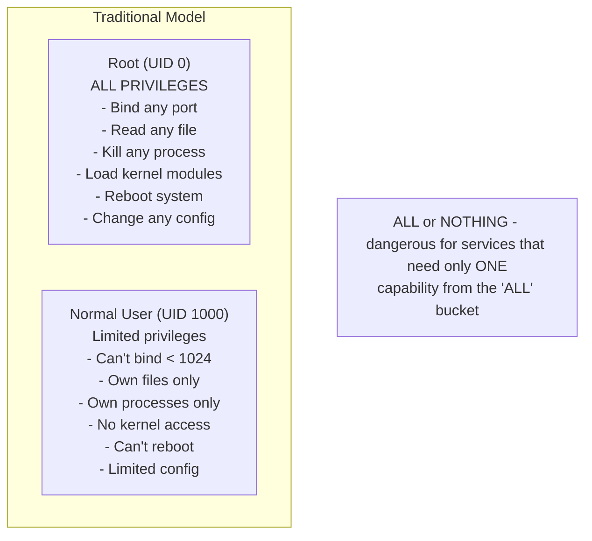
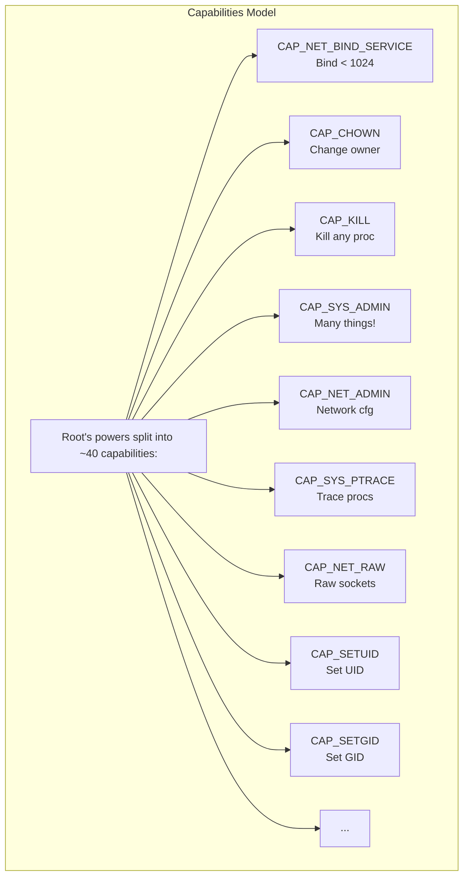
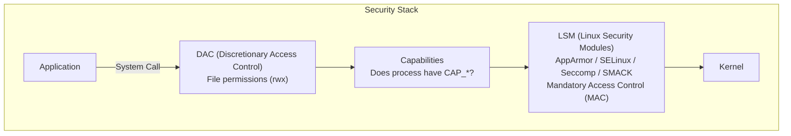
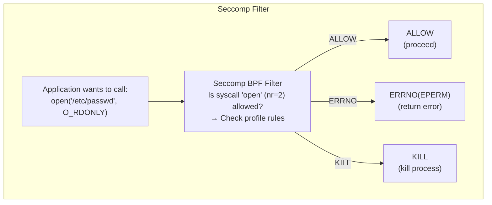

# Module 2.3: Capabilities & Linux Security Modules

> **Linux Foundations** | Complexity: `[MEDIUM]` | Time: 35-45 min | Focus: least-privilege process control for container workloads on shared Linux kernels.

## Prerequisites

Before starting this module, make sure you are comfortable reading Linux permission examples and connecting container runtime settings back to ordinary process behavior.
- **Required**: [Module 1.4: Users & Permissions](/linux/foundations/system-essentials/module-1.4-users-permissions/)
- **Required**: [Module 2.1: Linux Namespaces](../module-2.1-namespaces/)
- **Helpful**: Understanding of basic security concepts

## Learning Outcomes

After this module, you will be able to perform practical security reviews rather than merely recognize the names of the controls involved.
- **Audit** Linux and container capability sets to determine which privileges a workload actually needs.
- **Configure** Kubernetes 1.35 security contexts with least-privilege capabilities, AppArmor, and seccomp profiles.
- **Diagnose** `operation not permitted` failures by separating file permissions, capabilities, and LSM policy decisions.
- **Evaluate** when to use capability dropping, AppArmor, seccomp, or a combination of controls for container hardening.

## Why This Module Matters

In 2019, a public cloud customer learned an expensive lesson from a small convenience flag. Their internal build service ran a helper container with broad Linux privileges because one maintenance script occasionally needed network administration access. When an attacker exploited a vulnerable package download step, the compromised process did not stay boxed inside the intended build environment; it had enough kernel-facing power to inspect host state, manipulate mounts, and reach credentials that should never have been visible to a routine build job. The incident response bill, emergency rebuilds, and delayed product launch cost far more than the original engineering shortcut had saved.

That story is not unusual because containers sit on a narrow line between isolation and shared-kernel reality. Namespaces make a process feel as though it has its own process tree, network stack, mount table, and hostname, but the kernel is still the same kernel that protects the node. If a container keeps too many privileges, then a bug in an ordinary service can become a host-level security event, especially when teams reach for `--privileged`, `CAP_SYS_ADMIN`, or unconfined seccomp profiles during debugging.

This module gives you the vocabulary and judgment to avoid that failure mode. You will learn how Linux capabilities split root into smaller powers, how container runtimes choose default capability sets, how AppArmor and seccomp add mandatory policy checks, and how Kubernetes 1.35 exposes these controls through pod and container security settings. The goal is not to memorize every capability or every system call; the goal is to build a repeatable way to audit what a workload asks for, explain why it succeeds or fails, and remove power that has no operational purpose.

## Linux Capabilities: Root Is Not One Thing

Traditional Unix permissions began with a blunt division: user ID 0 could do almost anything, while ordinary users were constrained by file ownership, mode bits, and process ownership. That model was simple enough to reason about on a small multi-user server, but it became awkward when services needed one narrow administrative action. A web server might need to bind to port 80, a packet tool might need raw sockets, and a backup process might need to preserve ownership metadata, yet none of those jobs should automatically receive the power to load kernel modules or reboot the machine.

Capabilities were introduced to split the old root privilege bucket into named units that the kernel can check independently. Instead of asking only whether a process is UID 0, the kernel can ask whether the process has `CAP_NET_BIND_SERVICE`, `CAP_NET_RAW`, `CAP_CHOWN`, or another specific permission. This does not make a privileged process harmless, but it gives operators and container runtimes a way to grant the small slice of authority a workload requires while withholding unrelated powers that would widen the blast radius after compromise.



The diagram shows why the old model is dangerous in service design. If a process needs one administrative action, the traditional approach tempts you to run it as root and accept every other privilege as collateral damage. In a container, that temptation is even more misleading because UID 0 inside a namespace does not necessarily equal host root, but it can still carry enough capabilities to change kernel-facing state in ways that matter to the node.

Stop and think: if a web server process is compromised, why is it significantly worse if it runs as a traditional root user than if it runs as a non-root user with only `CAP_NET_BIND_SERVICE`? A useful answer names the specific actions that disappear from the attacker's menu, such as changing file ownership broadly, tracing unrelated processes, creating device nodes, or altering network configuration.



The capability model is still imperfect because some capabilities are much broader than their names suggest. `CAP_SYS_ADMIN` is the classic example: it covers a large collection of operations and has historically absorbed features that did not fit cleanly elsewhere. Treat it as a high-risk administrative bundle, not as a harmless way to make mysterious permission errors disappear. When a container request includes `CAP_SYS_ADMIN`, your review should slow down until the team can name the exact kernel operation they need and prove that a narrower control will not work.

| Capability | What It Allows | Used By |
|------------|----------------|---------|
| CAP_NET_BIND_SERVICE | Bind to ports < 1024 | Web servers |
| CAP_NET_RAW | Raw sockets, ping | ping, network tools |
| CAP_NET_ADMIN | Network configuration | Network management |
| CAP_SYS_ADMIN | Many admin operations | Container escapes! |
| CAP_CHOWN | Change file ownership | File management |
| CAP_SETUID/SETGID | Change process UID/GID | su, sudo |
| CAP_KILL | Send signals to any process | Process management |
| CAP_SYS_PTRACE | Trace/debug processes | Debuggers, strace |
| CAP_MKNOD | Create device nodes | Device setup |
| CAP_DAC_OVERRIDE | Bypass file permissions | Full file access |

This table is not a complete reference, but it covers the capabilities you will most often see during container reviews. Notice the difference between capabilities that support a narrow application need and capabilities that reshape the environment around the process. Binding a low port is narrow. Reconfiguring interfaces, tracing processes, bypassing file permissions, or performing miscellaneous system administration operations can change what the process is able to observe or control beyond its own application directory.

Linux does not store capabilities as one simple yes-or-no value. Each process has several capability sets, and those sets answer different questions about what the process currently has, what it could activate, what it can pass through an `execve()` transition, and what the kernel will never allow it to gain. This is why capability debugging often starts with `/proc/<pid>/status`; the process may appear to be root, but its effective or bounding set can still remove the power you expected.

```bash
# View capabilities of current process
cat /proc/$$/status | grep Cap

# Decode capability hex values
capsh --decode=0000003fffffffff

# View capabilities of a file
getcap /usr/bin/ping

# View capabilities of running process
getpcaps $$

# List all capabilities
capsh --print
```

The commands above give you three useful perspectives. `/proc/$$/status` shows the kernel's view of the current shell, `capsh --decode` translates a hexadecimal mask into names humans can review, and `getcap` shows whether a file carries capabilities that can be activated when executed. When these disagree with your expectation, resist the urge to change several security settings at once; isolate whether the missing privilege is absent from the effective set, excluded by the bounding set, or blocked later by an LSM profile.

| Set | Purpose |
|-----|---------|
| Permitted | Maximum capabilities available |
| Effective | Currently active capabilities |
| Inheritable | Can be passed to children |
| Bounding | Limits what can be gained |
| Ambient | Preserved across execve() |

The permitted set is like a wallet of privileges the process may be able to use, while the effective set is the subset currently being presented to kernel checks. The bounding set is especially important in containers because it limits what a process can regain later, even if a file capability or helper binary would otherwise grant it. Ambient capabilities solve a different problem: preserving selected capabilities across program execution for non-root processes, which is useful but easy to misunderstand if you do not inspect all sets together.

```bash
# View all sets
cat /proc/$$/status | grep Cap
# CapInh: Inheritable
# CapPrm: Permitted
# CapEff: Effective
# CapBnd: Bounding
# CapAmb: Ambient
```

A practical capability audit usually starts with the effective and bounding sets because they answer the immediate operational question: what can this process do now, and what has the runtime permanently ruled out? If a workload fails to bind a privileged port, for example, `CAP_NET_BIND_SERVICE` must be present where the kernel expects it. If a workload cannot create a raw socket, `CAP_NET_RAW` may be missing, but seccomp or AppArmor can also be involved, so the capability view is one layer of evidence rather than the whole investigation.

```bash
# Give a program capability without setuid
sudo setcap 'cap_net_bind_service=+ep' /path/to/program

# Verify
getcap /path/to/program

# Remove capabilities
sudo setcap -r /path/to/program
```

File capabilities are the safer replacement for many historical setuid-root programs. The `ping` command is the standard example: it can receive `CAP_NET_RAW` for the raw socket operation it needs without becoming an all-powerful root process. That distinction is operationally important because an exploitable bug in a file-capability program inherits a smaller privilege set than an exploitable setuid-root program, reducing the number of post-exploitation moves available to an attacker.

## Container Capabilities and Kubernetes SecurityContext

Containers inherit Linux capability behavior because they are Linux processes, not miniature virtual machines. A container image can say `USER root`, a Kubernetes container can run as UID 0, and a Docker shell prompt can look like root, but the runtime may still remove capabilities from the bounding set before the process starts. This is one of the reasons "it works on a VM as root" does not prove that it will work in a container, and it is also why "it runs as root" does not automatically mean the container has every host-level privilege.

Docker and Kubernetes rely on runtime defaults that remove several dangerous capabilities while keeping a set that preserves compatibility with common application behavior. The result is a compromise: many images continue to work without special configuration, but the container is not granted every administrative power available to host root. Your job as an operator is to tighten that compromise for workloads you control, usually by dropping everything and adding back only the named capability that has a demonstrated purpose.

```text
Default Docker capabilities:
- CAP_CHOWN
- CAP_DAC_OVERRIDE
- CAP_FSETID
- CAP_FOWNER
- CAP_MKNOD
- CAP_NET_RAW
- CAP_SETGID
- CAP_SETUID
- CAP_SETFCAP
- CAP_SETPCAP
- CAP_NET_BIND_SERVICE
- CAP_SYS_CHROOT
- CAP_KILL
- CAP_AUDIT_WRITE

NOT included (dangerous):
- CAP_SYS_ADMIN    ← Container escape risk!
- CAP_NET_ADMIN    ← Network manipulation
- CAP_SYS_PTRACE   ← Debug other processes
- CAP_SYS_MODULE   ← Load kernel modules
```

The default list explains many surprising behaviors. A container may be able to change ownership inside its writable layer because it has `CAP_CHOWN`, but it cannot reconfigure the host's networking because `CAP_NET_ADMIN` is absent. It may run `ping` because `CAP_NET_RAW` is present, but a hardened workload often does not need raw sockets at all. Least privilege begins when you stop accepting the default set as a fact of life and instead ask which entries the process actually exercises during normal startup, readiness, and shutdown.

```bash
# Drop all capabilities
docker run --cap-drop=ALL nginx

# Add specific capability
docker run --cap-drop=ALL --cap-add=NET_BIND_SERVICE nginx

# Run privileged (ALL capabilities - dangerous!)
docker run --privileged nginx
```

The `--cap-drop=ALL` pattern is a strong default because it turns privilege review into an allow-list exercise. If the container fails afterward, the failure is a signal to identify the specific operation that needs kernel privilege, not a reason to restore the entire default set. The dangerous opposite is `--privileged`, which grants broad capabilities, relaxes device isolation, and commonly disables or bypasses other runtime protections. It is a troubleshooting shortcut that often survives into production because it makes the symptom disappear while hiding the security debt.

Pause and predict: if you run a container with `--cap-drop=ALL` but keep the process as UID 0, will that root user be able to modify a file owned by another user? The right answer depends on ordinary file permissions and ownership first, then on whether the missing capability would have been needed to bypass those checks. This is why capability debugging should always separate identity, discretionary access control, capability checks, and LSM policy instead of treating all permission failures as one category.

Kubernetes exposes capability configuration through `securityContext`, and Kubernetes 1.35 still expects you to reason about privileges at both the pod and container levels. For command examples in Kubernetes modules, KubeDojo uses the shell alias `alias k=kubectl`; define it once in your shell before using shortened commands in a lab. The manifest below demonstrates the important habit: drop `ALL` first, then add back the single capability the application can justify.

```yaml
apiVersion: v1
kind: Pod
metadata:
  name: secure-app
spec:
  containers:
  - name: app
    image: nginx
    securityContext:
      capabilities:
        drop:
          - ALL                    # Drop everything first
        add:
          - NET_BIND_SERVICE       # Add only what's needed
```

This configuration is most valuable when it is paired with non-root execution, a read-only root filesystem, and runtime defaults for seccomp. Capabilities are not a replacement for user separation; they are a way to avoid giving root-shaped powers to a process that should have only one exceptional permission. In review, ask the owner to show the application behavior that needs the added capability, the command or syscall that fails without it, and the reason a less privileged design is not available.

War story: a platform team once spent an afternoon chasing a failed sidecar deployment because the application log said only `operation not permitted` during startup. One engineer wanted to add `privileged: true`, another wanted to change the container user, and a third suspected a read-only filesystem issue. The actual failure was narrower: the process needed to bind a low port while running as a non-root user, so adding `NET_BIND_SERVICE` after dropping all other capabilities solved the incident without granting network administration, ptrace, or broad filesystem bypass powers.

## Linux Security Modules: Mandatory Policy After Permissions

Capabilities answer the question "does this process have a named kernel privilege," but they do not express a full application policy. A process with ordinary file permissions might still be forbidden from reading a sensitive path by AppArmor, and a process with the right user ID might still be prevented from invoking a dangerous system call by seccomp. Linux Security Modules provide these additional checks so that access can be constrained by policy even when discretionary permissions or capabilities would otherwise allow the action.

This distinction matters because container hardening is a layered design. Discretionary access control asks whether the owner, group, and mode bits allow an operation. Capabilities ask whether the process has a special named privilege when normal permissions are not enough. LSMs add mandatory controls that the application cannot opt out of from inside the container. When those layers disagree, the most restrictive applicable layer wins, which is exactly what you want when a compromised application begins doing things its normal design never required.



Read this diagram from the application downward. The process asks the kernel to do something, the kernel checks ordinary ownership and mode rules, capability checks may be consulted for privileged operations, and LSM hooks can then apply policy that is independent of the process owner's preferences. This is why a container can fail even when `ls -l` appears permissive and even when the process is UID 0; an LSM profile may intentionally forbid the path, network family, mount operation, or system call.

| LSM | Distribution | Approach |
|-----|-------------|----------|
| SELinux | RHEL, CentOS, Fedora | Label-based, complex |
| AppArmor | Ubuntu, Debian, SUSE | Path-based, simpler |
| Seccomp | All (filter) | System call filtering |
| SMACK | Embedded systems | Simplified labels |

SELinux and AppArmor are often discussed together because both enforce mandatory access control, but they model resources differently. SELinux relies heavily on labels and type enforcement, which can be extremely precise but intimidating when you first encounter it. AppArmor is path-oriented, which makes many profiles easier to read for application operators, though path-based policy has its own tradeoffs around filesystem layout and abstraction. Seccomp is different again: it filters system calls rather than files or labels, making it a strong control for reducing kernel attack surface.

```bash
# Which LSM is active
cat /sys/kernel/security/lsm

# AppArmor status
sudo aa-status

# SELinux status
sestatus
getenforce
```

These commands give you the host context you need before blaming a container manifest. If AppArmor is not loaded, an AppArmor profile reference will not protect the workload. If SELinux is enforcing, a denial may appear in audit logs rather than in the application message. If seccomp is enabled for the process, `/proc/<pid>/status` can show that a filter is active, but it will not by itself tell you which exact syscall was denied. Good diagnosis means checking the layer that could plausibly make the decision.

Before running this, what output do you expect from `/sys/kernel/security/lsm` on an Ubuntu node compared with a Fedora or RHEL-family node? Make a prediction before you check, because that habit trains you to connect distribution defaults with the policy language you will actually see during incidents.

## AppArmor: Path-Based Containment

AppArmor profiles describe what a confined program may do by naming paths, access modes, and selected resource permissions. This is approachable because application owners already think in paths: configuration lives under `/etc`, logs live under `/var/log`, web content lives under `/var/www`, and temporary data belongs somewhere else. The security value comes from denying filesystem and resource access that the application has no legitimate reason to use, even if a compromised process can run code inside the allowed program.

Path-based policy is not magic, and it should be designed around stable application layout. If a service writes logs to one directory today and a chart update silently moves them tomorrow, a strict profile can break startup in a way that looks like a filesystem permission bug. That is not a reason to avoid AppArmor; it is a reason to version profiles with the workload, test them in complain mode, and treat denied access as evidence that the application contract has changed.

| Mode | Behavior |
|------|----------|
| Enforce | Blocks and logs violations |
| Complain | Logs but doesn't block |
| Unconfined | No restrictions |

Enforce mode is what protects production, but complain mode is useful while building or updating a profile because it records policy violations without stopping the application. Unconfined mode should be treated as an explicit exception because it removes the profile from the security story. A mature rollout often starts in complain mode during realistic testing, reviews the logs for expected behavior, tightens noisy rules, and then moves the profile to enforce mode before production traffic depends on it.

```bash
# List profiles
sudo aa-status

# Sample output:
# apparmor module is loaded.
# 32 profiles are loaded.
# 30 profiles are in enforce mode.
#    /usr/bin/evince
#    /usr/sbin/cups-browsed
#    docker-default

# View a profile
cat /etc/apparmor.d/usr.bin.evince
```

The `aa-status` output is useful because it distinguishes profiles that merely exist from profiles that actively confine processes. A profile file on disk does not protect a workload until it is loaded, and a loaded profile does not block anything if it is in complain mode. In container environments, you also need to know whether the runtime has attached the expected profile to the container process, because the profile name in your manifest and the profile loaded on the node must line up.

```text
# /etc/apparmor.d/usr.sbin.nginx
#include <tunables/global>

/usr/sbin/nginx {
  #include <abstractions/base>
  #include <abstractions/nameservice>

  # Allow network access
  network inet tcp,
  network inet udp,

  # Allow reading config
  /etc/nginx/** r,

  # Allow writing logs
  /var/log/nginx/** rw,

  # Allow web root
  /var/www/** r,

  # Deny everything else by default
}
```

The sample profile shows the mindset AppArmor encourages. Instead of allowing the process to wander across the filesystem and hoping Unix permissions are enough, the profile names the areas Nginx needs for configuration, logs, network use, and web content. The rule for `/var/www/** r` is deliberately read-only, so the web server can serve files but not overwrite them. That matters after compromise because an attacker who gains code execution inside the process still has to pass the profile's policy checks.

Stop and think: if an attacker gains code execution inside this Nginx process and attempts to overwrite an HTML file in `/var/www/`, what will AppArmor do based on the profile above? The important reasoning step is that AppArmor can deny the write even if the Unix owner and mode bits would otherwise allow it, because mandatory policy is evaluated as an additional gate rather than as a suggestion to the application.

```bash
# Docker default profile
docker run --security-opt apparmor=docker-default nginx

# Custom profile
docker run --security-opt apparmor=my-custom-profile nginx

# No AppArmor (dangerous!)
docker run --security-opt apparmor=unconfined nginx
```

Container runtimes commonly apply a default AppArmor profile on distributions where AppArmor is available. That default profile is better than nothing, but it is generic by design, so it cannot know that your application never needs to write outside one data directory or never needs a particular network family. A custom profile gives stronger containment when the application behavior is stable enough to describe, while `apparmor=unconfined` should require a clear exception record and a plan to remove it.

```yaml
apiVersion: v1
kind: Pod
metadata:
  name: secure-nginx
spec:
  containers:
  - name: app
    image: nginx
    securityContext:
      appArmorProfile:
        type: Localhost
        localhostProfile: my-profile
```

Kubernetes profile configuration is node-sensitive because a `Localhost` profile must exist on the node where the pod runs. If your cluster schedules across mixed node pools, the same manifest can succeed on one node and fail or run without the intended protection on another unless profile distribution is part of node provisioning. That operational detail is why AppArmor is both a security control and a platform engineering responsibility: policy has to be shipped, loaded, named consistently, and monitored like any other runtime dependency.

## Seccomp: Reducing Kernel Attack Surface

Seccomp, short for secure computing mode, filters system calls before the kernel performs the requested operation. This is a different kind of control from AppArmor. AppArmor might allow or deny a read of `/etc/shadow` based on path policy, while seccomp can deny the syscall family used to mount filesystems, load another kernel, or reboot the machine regardless of the path involved. The practical value is attack-surface reduction: if a process never needs a dangerous syscall, the kernel should reject it before an exploit can use it.

The tradeoff is that syscalls are lower-level than application intentions. Developers usually think "create a directory" or "start a subprocess," while seccomp profiles think in syscall names and actions. Modern runtimes solve part of this problem with default profiles that allow common application behavior and deny uncommon high-risk operations. Custom profiles are strongest when you can observe the workload under realistic conditions and avoid blocking syscalls that libraries or language runtimes use during normal operation.



The filter result matters for reliability as much as security. Returning an error lets the application handle a denied syscall like any other failed operation, while killing the process makes the violation loud and immediate. Logging can help with profile development, but a log-only posture does not enforce containment. Choose actions deliberately: production profiles often favor predictable errors for expected denials and harsher actions for behavior that should never occur in a healthy workload.

```json
{
  "defaultAction": "SCMP_ACT_ERRNO",
  "syscalls": [
    {
      "names": ["accept", "accept4", "access", "..."],
      "action": "SCMP_ACT_ALLOW"
    }
  ],
  "blocked": [
    "kexec_load",
    "reboot",
    "mount",
    "ptrace",
    "...40+ others"
  ]
}
```

Docker's default seccomp profile is an allow-list with an error default, which means unlisted syscalls fail instead of silently proceeding. The profile blocks high-risk operations such as loading a new kernel with `kexec_load`, rebooting the host, mounting filesystems, and tracing processes in ways that ordinary application containers should not need. This is why disabling seccomp for convenience should feel like removing a guardrail from the shared kernel rather than like flipping a harmless compatibility setting.

| Action | Effect |
|--------|--------|
| SCMP_ACT_ALLOW | Allow syscall |
| SCMP_ACT_ERRNO | Return error code |
| SCMP_ACT_KILL | Kill process |
| SCMP_ACT_KILL_PROCESS | Kill all threads |
| SCMP_ACT_LOG | Allow but log |
| SCMP_ACT_TRACE | Notify tracer |

The action table is small, but it encodes important operational choices. `SCMP_ACT_ERRNO` is usually easier to debug because the application receives a failure code and may log the call site. `SCMP_ACT_KILL_PROCESS` is stronger when a syscall indicates exploit-like behavior rather than a legitimate compatibility miss. `SCMP_ACT_LOG` can be useful during profile design, but it is not a protection by itself, and noisy logs become easy to ignore unless someone owns the tuning work.

```bash
# Use default profile (recommended)
docker run nginx

# Custom profile
docker run --security-opt seccomp=/path/to/profile.json nginx

# No seccomp (dangerous!)
docker run --security-opt seccomp=unconfined nginx
```

Runtime defaults are the right starting point for most teams because they cover common compatibility needs without opening the entire syscall surface. A custom profile makes sense when a workload is stable, high-risk, or exposed enough that tighter syscall control justifies the testing cost. `seccomp=unconfined` should be rare, temporary, and documented because it removes a kernel-level deny list that protects the node from whole classes of container escape techniques.

```yaml
apiVersion: v1
kind: Pod
metadata:
  name: secure-app
spec:
  securityContext:
    seccompProfile:
      type: RuntimeDefault  # Use container runtime's default
  containers:
  - name: app
    image: nginx
    securityContext:
      seccompProfile:
        type: Localhost
        localhostProfile: profiles/my-profile.json
```

Kubernetes lets you declare seccomp at the pod level and override it at the container level. `RuntimeDefault` is usually the baseline you want because it asks the container runtime to apply its standard profile instead of leaving the process unconfined. `Localhost` profiles are powerful, but they create the same distribution challenge as local AppArmor profiles: the profile must exist on every node that might run the pod, and the filename in the manifest must match the node's profile location.

Which approach would you choose here and why: a custom seccomp profile for every application, or `RuntimeDefault` for most workloads with custom profiles only for exposed services? A defensible answer weighs risk, test coverage, platform maturity, and the cost of diagnosing failures caused by runtime libraries that make unexpected syscalls during startup or shutdown.

## Patterns & Anti-Patterns

The strongest pattern is "drop first, add only with evidence." Start every container capability review from `drop: [ALL]`, run the workload through startup and representative behavior, then add a named capability only when you can point to the exact failing operation. This scales well because it produces small, reviewable exceptions. It also turns future drift into visible configuration changes, since a new capability request has to explain what changed in the application contract.

A second reliable pattern is "pair controls that answer different questions." Capabilities are good for named kernel privileges, AppArmor is good for path and resource policy, and seccomp is good for syscall filtering. None of them replaces the others. A hardened web service might run as non-root, drop all capabilities except `NET_BIND_SERVICE`, use an AppArmor profile that makes the document root read-only, and rely on `RuntimeDefault` seccomp to block unusual kernel operations.

A third pattern is "debug by layer, not by guesswork." When a container reports `operation not permitted`, inspect identity and file permissions first, then capability sets, then LSM status and audit logs. This order prevents the common mistake of adding `CAP_SYS_ADMIN` to solve an AppArmor denial or disabling seccomp to solve a missing filesystem permission. The symptom is generic; the cause is usually specific if you collect evidence from the right layer.

The most damaging anti-pattern is using `--privileged` or `privileged: true` as a compatibility tool. Teams fall into it because it creates a fast green build or a passing smoke test, especially for VPNs, device plugins, build systems, and old monitoring agents. The better alternative is to identify the precise device, mount, capability, or syscall that is required, then grant that one thing with an explicit review note and a removal plan if the workload can be redesigned.

Another anti-pattern is treating runtime defaults as a completed security design. Docker's default capabilities and default seccomp profile are valuable, but they are generic compromises meant to keep many images working. If a service does not need raw sockets, ownership changes, or device node creation, carrying those powers is unnecessary attack surface. Defaults are the floor you inherit, not the ceiling you should celebrate.

A final anti-pattern is deploying local LSM profiles without managing node consistency. A Kubernetes manifest that references an AppArmor or seccomp `Localhost` profile assumes that every eligible node has the same profile name and content. If platform automation does not enforce that assumption, pods can fail scheduling, start without the expected protection, or behave differently across node pools. Treat local profiles like node configuration artifacts with versioning, rollout checks, and monitoring.

## Decision Framework

Begin with the workload behavior rather than with the security mechanism. If the application needs one privileged kernel operation, such as binding to a low port, solve that with the narrow capability and keep the rest dropped. If the application should be prevented from reading or writing specific filesystem paths, use AppArmor or SELinux depending on the node family. If the concern is kernel attack surface from dangerous syscall families, use seccomp, usually starting with `RuntimeDefault` and tightening only when you can test the workload realistically.

When you evaluate a request, ask four questions in order. First, what exact operation fails without the requested privilege? Second, which layer normally controls that operation: discretionary permissions, a capability, AppArmor or SELinux, or seccomp? Third, can the application be changed to avoid the privileged operation entirely, such as listening on a high port behind a Service instead of binding directly to port 80? Fourth, if an exception remains necessary, how will you prove it stays narrow during future releases?

Use capability changes for clear kernel privileges, not for broad uncertainty. Use AppArmor when you can describe allowed paths and resource behavior in language the application team understands. Use seccomp when you want to remove syscall families that ordinary application code should never need. Use multiple controls when the workload is exposed, multi-tenant, or difficult to patch quickly, because a bypass or misconfiguration in one layer should not automatically leave the shared kernel undefended.

The decision that usually needs the most pushback is `CAP_SYS_ADMIN`. If someone asks for it, require them to replace "the application needs admin" with a specific operation and a failed command or syscall. Sometimes the request is legitimate for specialized infrastructure software, but most application containers should not need it. In Kubernetes review, a `CAP_SYS_ADMIN` request should be treated as a design discussion, not as a routine YAML edit.

There is also a timing decision to make during hardening work. Early in development, broad runtime defaults may keep teams moving while the service behavior is still changing every day, but that phase should produce observations you can later convert into explicit policy. Before production, the platform owner should know which ports are opened, which directories are read or written, which child processes are expected, and which kernel-facing features are actually exercised. Without that inventory, hardening becomes guesswork, and guesswork usually leads either to broken deployments or to exceptions so broad that they erase the value of the security review.

For existing services, avoid turning a security improvement into a surprise outage by staging controls in an order that gives you evidence. Start by recording current capability masks and LSM status, then drop obviously unnecessary capabilities in a non-production environment, then move AppArmor profiles through complain mode before enforcing them, and finally consider custom seccomp only after runtime defaults are stable. That sequence is slower than adding one large restriction set, but it makes each failure explainable. A team that can explain a denial can fix the right layer instead of backing out every protection under deadline pressure.

The same framework applies during incident response, but the priority changes from design elegance to containment with minimal uncertainty. If a compromised workload is still running, first determine whether it has broad capabilities, unconfined seccomp, or an unconfined AppArmor profile, because those facts shape the possible host impact. Then preserve enough evidence to understand which layer allowed or blocked suspicious behavior. A narrow denial in AppArmor or seccomp can be valuable proof that defense-in-depth worked, while a privileged container with `CAP_SYS_ADMIN` forces a much wider node investigation.

## Did You Know?

- **Linux currently defines more than 40 named capabilities** in modern kernels, and the list has grown over time as kernel developers split overloaded powers into smaller pieces such as `CAP_BPF` and `CAP_CHECKPOINT_RESTORE`.
- **Docker's default seccomp profile has historically blocked around four dozen high-risk syscalls** while allowing the common calls needed by ordinary Linux applications, which is why many containers run safely without custom seccomp files.
- **The `ping` command moved away from setuid-root designs on many distributions** by using `CAP_NET_RAW`, which narrows the privilege needed to send ICMP packets instead of granting every root privilege.
- **Kubernetes has supported seccomp as a stable pod security feature since v1.19**, and Kubernetes 1.35 still treats `RuntimeDefault` as the practical baseline for reducing kernel attack surface in normal workloads.

## Common Mistakes

| Mistake | Why It Happens | How to Fix It |
|---------|----------------|---------------|
| Running containers as privileged | A failing workload starts working immediately, so the broad flag looks like a harmless compatibility fix. | Identify the exact failing operation, grant only the required capability or device, and keep AppArmor and seccomp enabled. |
| Not dropping capabilities | Teams assume runtime defaults are already least privilege because the container is isolated by namespaces. | Start from `drop: [ALL]`, test representative behavior, and add back only named capabilities with a reason. |
| Disabling seccomp | A blocked syscall produces a vague permission error, and the fastest workaround is `seccomp=unconfined`. | Use `RuntimeDefault`, inspect logs or traces for the denied syscall, and write a targeted custom profile only when needed. |
| Ignoring AppArmor or SELinux | File permissions look correct, so engineers overlook mandatory access control denials. | Check LSM status and audit logs whenever ordinary DAC checks do not explain a denial. |
| Adding `CAP_SYS_ADMIN` for convenience | The capability appears to fix many unrelated problems because it contains a broad set of administrative powers. | Require a specific operation, prefer narrower capabilities or design changes, and review the request as high risk. |
| Confusing UID 0 with full host root | A shell prompt inside the container says root, so the team expects every administrative operation to work. | Inspect `/proc/<pid>/status`, decode capability masks, and remember that the runtime bounding set can remove powers permanently. |
| Shipping local profiles without node management | A manifest references a profile name that exists on one node but not on another. | Distribute AppArmor and seccomp profiles through node provisioning, label eligible nodes, and monitor profile loading. |

## Quiz

<details>
<summary>Your team needs to audit container capability sets for a new Nginx deployment that runs as non-root but must listen on port 80. What should you ask for, and what should you reject?</summary>

Ask for evidence that the only privileged operation is binding to a low port, then configure the container to drop all capabilities and add `NET_BIND_SERVICE`. Reject `privileged: true`, reject `CAP_SYS_ADMIN`, and reject restoring the whole runtime default set without a workload reason. The reasoning is that the service has a narrow network binding requirement, not a need to administer the node, trace processes, or change filesystem ownership broadly.
</details>

<details>
<summary>A developer says the container is already safe because it runs as UID 0 only inside a namespace. How do you diagnose whether that root process still has dangerous powers?</summary>

Inspect the process capability sets through `/proc/<pid>/status` or from inside the container, then decode the effective and bounding masks with `capsh`. Namespaces change what the process can see, but capabilities still decide whether privileged kernel operations are allowed. A root process with a reduced bounding set is very different from a privileged container with broad capabilities and relaxed LSM protections.
</details>

<details>
<summary>You configure AppArmor for an application, and it starts failing when writing logs even though Unix file permissions allow the write. What layer is most likely responsible, and how should you proceed?</summary>

AppArmor is the likely layer because mandatory path policy can deny a write even when DAC permissions allow it. Check whether the profile is loaded, whether the process is confined by that profile, and whether the log path has the needed write mode in the profile. The fix is not to make the file world-writable; it is to update the profile deliberately or move the application's log output to an already allowed path.
</details>

<details>
<summary>A workload fails after enabling `RuntimeDefault` seccomp, and the owner wants to set `seccompProfile.type: Unconfined`. How do you evaluate that request?</summary>

Treat the unconfined request as a temporary exception, not as the fix. Identify the denied syscall through logs, tracing, or runtime diagnostics, then decide whether the syscall is truly required during normal operation. If it is legitimate and the default profile is too strict for this workload, a targeted local seccomp profile is safer than removing syscall filtering entirely.
</details>

<details>
<summary>A containerized VPN client needs a tunnel device and network configuration access, and `--privileged` makes it work. What safer design should you propose?</summary>

Start by granting only the specific device and capability the VPN requires, commonly `/dev/net/tun` plus `CAP_NET_ADMIN`, instead of granting every capability and exposing all host devices. Keep seccomp and AppArmor enabled unless there is a separate, documented denial that requires tuning. This approach acknowledges that the workload is special while still preserving isolation boundaries unrelated to tunnel creation.
</details>

<details>
<summary>You need to configure Kubernetes 1.35 security context settings for a workload that should use AppArmor and seccomp. What operational dependency must you verify before rollout?</summary>

Verify that every eligible node has the referenced local AppArmor or seccomp profile installed, loaded, and named exactly as the manifest expects. Kubernetes can attach the profile only if the node runtime can find it, so node consistency is part of the security configuration. A rollout plan should include profile distribution, node labeling if needed, and a failure-mode check for pods scheduled onto nodes without the profile.
</details>

<details>
<summary>An incident ticket says only `operation not permitted` after a hardening change. How do you evaluate whether capabilities, AppArmor, or seccomp caused it?</summary>

Work by layer instead of guessing. Confirm the process user and file permissions, inspect capability sets for the specific privilege involved, check AppArmor or SELinux denials for path or label policy, and review seccomp status or logs for syscall filtering. The same error text can come from different kernel decisions, so the correct fix depends on which layer produced the denial.
</details>

## Hands-On Exercise

### Capabilities and Security Modules

This exercise walks through the same evidence path you should use during real reviews: inspect capability sets, observe how file capabilities replace setuid-style privilege, check AppArmor state, check seccomp state, and then compare Docker capability behavior if Docker is available. The commands are intentionally local and incremental, so you can stop after any part that your workstation or lab VM supports. If you are also testing Kubernetes examples, define the normal KubeDojo alias with `alias k=kubectl` before running Kubernetes commands in your own cluster.

**Objective**: Explore capabilities, AppArmor, and seccomp.

**Environment**: Linux system (Ubuntu/Debian for AppArmor examples)

#### Part 1: Viewing Capabilities

Start with your current shell because it gives you a safe baseline before you inspect containers. The effective set shows what the shell can use right now, while the bounding set shows what it cannot regain later. If `capsh` is not installed, install the distribution package that provides it, usually `libcap2-bin` on Debian and Ubuntu systems.

```bash
# 1. Your process capabilities
cat /proc/$$/status | grep Cap

# 2. Decode them
capsh --decode=$(grep CapEff /proc/$$/status | cut -f2)

# 3. Check a common program
getcap /usr/bin/ping 2>/dev/null || getcap /bin/ping

# 4. List all files with capabilities
getcap -r / 2>/dev/null | head -20
```

<details>
<summary>Solution notes for Part 1</summary>

You should see hexadecimal capability masks in `/proc/$$/status`, and `capsh --decode` should translate at least some masks into names if the shell has capabilities. The `ping` binary may show `cap_net_raw` on distributions that no longer rely on setuid-root for ICMP. A recursive `getcap` scan can produce permission errors on protected directories, which is why the command redirects errors before showing a short sample.
</details>

#### Part 2: File Capabilities (requires root)

This small C program demonstrates why file capabilities are useful: the binary needs one privileged network action, not a full root identity. On some modern systems, unprivileged low-port binding may be configured differently, so focus on the inspection flow even if your local kernel setting changes the exact failure. The important habit is to verify the file capability before and after `setcap`, then remove the test binary and source file when you are done.

```bash
# 1. Create a test program
cat > /tmp/test-bind.c << 'EOF'
#include <stdio.h>
#include <sys/socket.h>
#include <netinet/in.h>

int main() {
    int sock = socket(AF_INET, SOCK_STREAM, 0);
    struct sockaddr_in addr = {
        .sin_family = AF_INET,
        .sin_port = htons(80),
        .sin_addr.s_addr = INADDR_ANY
    };
    if (bind(sock, (struct sockaddr*)&addr, sizeof(addr)) < 0) {
        perror("bind failed");
        return 1;
    }
    printf("Successfully bound to port 80!\n");
    return 0;
}
EOF

# 2. Compile
gcc /tmp/test-bind.c -o /tmp/test-bind

# 3. Try as normal user (should fail)
/tmp/test-bind
# bind failed: Permission denied

# 4. Add capability
sudo setcap 'cap_net_bind_service=+ep' /tmp/test-bind

# 5. Verify
getcap /tmp/test-bind

# 6. Try again (should work)
/tmp/test-bind

# 7. Clean up
rm /tmp/test-bind /tmp/test-bind.c
```

<details>
<summary>Solution notes for Part 2</summary>

The expected lesson is that a file can carry a narrow capability so the executed program receives the specific privilege it needs. If your system allows unprivileged low-port binding, the first run may not fail, but `getcap` should still show whether the capability was attached after `setcap`. In a production review, this pattern is safer than making a helper binary setuid-root because the resulting process receives a smaller privilege set.
</details>

#### Part 3: AppArmor (Ubuntu/Debian)

Now switch from capabilities to mandatory policy. AppArmor may not be enabled on every distribution, so a missing command or unloaded module is a useful finding rather than a failed exercise. If AppArmor is active, compare loaded profiles, enforce mode, and complain mode, because those details decide whether policy is only being logged or actually blocking the process.

```bash
# 1. Check AppArmor status
sudo aa-status

# 2. List profiles
ls /etc/apparmor.d/

# 3. View a profile
cat /etc/apparmor.d/usr.sbin.tcpdump 2>/dev/null || \
    cat /etc/apparmor.d/usr.bin.firefox 2>/dev/null | head -50
```

<details>
<summary>Solution notes for Part 3</summary>

On an Ubuntu or Debian system with AppArmor enabled, `aa-status` should report that the module is loaded and show profile counts by mode. The profile contents should read like path and resource policy rather than like Unix file permissions. If the system does not use AppArmor, record that fact and connect it back to the decision framework: you cannot rely on a profile mechanism that the node does not enforce.
</details>

#### Part 4: Seccomp Information

Seccomp inspection starts with kernel support and process status. The kernel configuration check tells you whether seccomp was built into the running kernel, while `/proc/$$/status` tells you whether your current process is already under a seccomp mode. If Docker is installed, the container check gives you a quick look at whether the runtime applies a default filter to PID 1 inside a normal container.

```bash
# 1. Check if seccomp is enabled
grep SECCOMP /boot/config-$(uname -r)

# 2. View process seccomp status
grep Seccomp /proc/$$/status

# 3. If Docker installed, view default profile
docker run --rm alpine cat /proc/1/status | grep Seccomp
```

<details>
<summary>Solution notes for Part 4</summary>

Kernel configuration output should include seccomp support on mainstream distributions, and process status should show a numeric mode. A Docker container usually reports seccomp filtering when the default profile is active. If the container reports unconfined behavior, investigate runtime configuration before assuming your workload is protected by syscall filtering.
</details>

#### Part 5: Container Capabilities (if Docker available)

The final part compares default container capabilities with a container that has all capabilities dropped, then tests a capability-dependent command. `ping` is convenient because it commonly depends on raw socket behavior, which maps to `CAP_NET_RAW`. If your environment blocks outbound ICMP for network reasons, the capability mask comparison is still the main evidence.

```bash
# 1. Default capabilities
docker run --rm alpine sh -c 'cat /proc/1/status | grep Cap'

# 2. Drop all capabilities
docker run --rm --cap-drop=ALL alpine sh -c 'cat /proc/1/status | grep Cap'

# 3. Try privileged operations
docker run --rm alpine ping -c 1 8.8.8.8  # Works (CAP_NET_RAW)
docker run --rm --cap-drop=ALL alpine ping -c 1 8.8.8.8  # Fails
docker run --rm --cap-drop=ALL --cap-add=NET_RAW alpine ping -c 1 8.8.8.8  # Works
```

<details>
<summary>Solution notes for Part 5</summary>

The default container should show nonzero capability masks, while the `--cap-drop=ALL` container should show a much smaller or empty effective set. The `ping` comparison demonstrates why adding a single capability is more defensible than restoring broad defaults. If your network blocks ICMP, decode the masks instead and verify that `NET_RAW` appears only when explicitly added.
</details>

### Success Criteria

- [ ] Audited and decoded Linux process capability sets from `/proc/$$/status`.
- [ ] Found programs with file capabilities and explained why that is safer than setuid-root.
- [ ] Configured and verified a test file capability with `setcap`, or documented why your system behavior differed.
- [ ] Diagnosed AppArmor availability, loaded profile status, and enforce versus complain mode.
- [ ] Evaluated seccomp support and runtime default filtering through process status.
- [ ] Compared Docker default capabilities with `--cap-drop=ALL` and a targeted capability add-back.

## Next Module

[Module 2.4: Union Filesystems](../module-2.4-union-filesystems/) shows how container images use layered filesystems for efficient storage, sharing, and rollback-friendly image construction.

## Sources

- [Linux Capabilities man page](https://man7.org/linux/man-pages/man7/capabilities.7.html)
- [AppArmor Documentation](https://gitlab.com/apparmor/apparmor/-/wikis/Documentation)
- [Docker Security](https://docs.docker.com/engine/security/)
- [Kubernetes Security Context](https://kubernetes.io/docs/tasks/configure-pod-container/security-context/)
- [Seccomp BPF](https://www.kernel.org/doc/html/latest/userspace-api/seccomp_filter.html)
- [Docker AppArmor security profiles](https://docs.docker.com/engine/security/apparmor/)
- [Docker seccomp security profiles](https://docs.docker.com/engine/security/seccomp/)
- [Kubernetes Linux kernel security constraints](https://kubernetes.io/docs/concepts/security/linux-kernel-security-constraints/)
- [Kubernetes Pod Security Standards](https://kubernetes.io/docs/concepts/security/pod-security-standards/)
- [seccomp Linux manual page](https://man7.org/linux/man-pages/man2/seccomp.2.html)
- [SELinux project documentation](https://selinuxproject.org/page/Main_Page)
