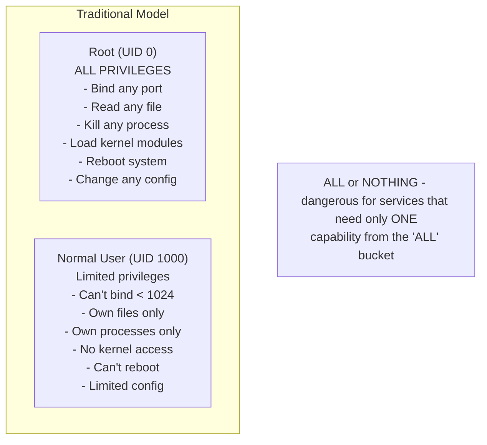
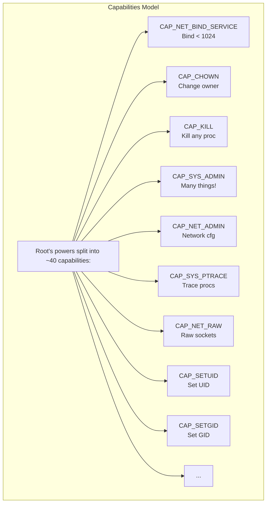
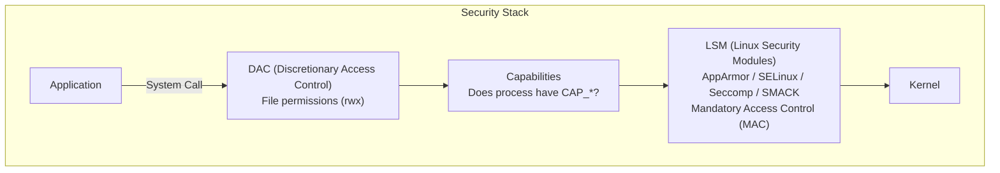
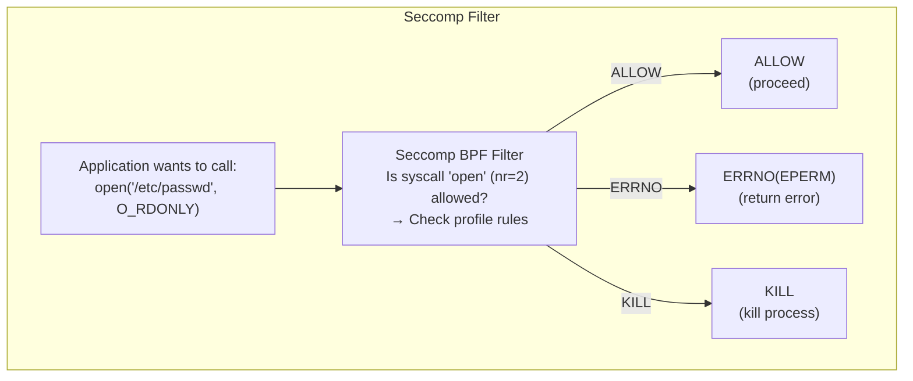

> **Linux Foundations** | Complexity: `[MEDIUM]` | Time: 25-30 min

## Prerequisites

Before starting this module:
- **Required**: [Module 1.4: Users & Permissions](/linux/foundations/system-essentials/module-1.4-users-permissions/)
- **Required**: [Module 2.1: Linux Namespaces](../module-2.1-namespaces/)
- **Helpful**: Understanding of basic security concepts

---

## What You'll Be Able to Do

After this module, you will be able to:
- **Explain** Linux capabilities as fine-grained alternatives to running as root
- **Audit** a container's capabilities and identify which are unnecessary
- **Configure** AppArmor and seccomp profiles to restrict container system calls
- **Evaluate** the security trade-offs between dropping capabilities vs using LSM profiles

---

## Why This Module Matters

Traditional Unix had a simple security model: root can do everything, everyone else is restricted. This all-or-nothing approach is dangerous—why give a process full root power when it only needs to bind to port 80?

**Capabilities** break root's superpowers into granular pieces. **Linux Security Modules (LSMs)** add mandatory access controls beyond discretionary permissions.

Understanding these helps you:

- **Secure containers** — Drop unnecessary capabilities
- **Debug permission errors** — Why can't my container do X?
- **Implement least privilege** — Give only the access needed
- **Understand Kubernetes security** — SecurityContext, PodSecurityPolicies, seccomp

When your container fails with "operation not permitted" despite running as root, capabilities are usually the answer.

---

## Did You Know?

- **There are over 40 different capabilities** in modern Linux. CAP_NET_ADMIN alone controls dozens of networking operations, from configuring interfaces to modifying routing tables.

- **Docker drops many capabilities by default** — A container with "root" is missing CAP_SYS_ADMIN, CAP_NET_ADMIN, and others. This is why root in a container isn't the same as root on the host.

- **The `ping` command used to require setuid root** — Now it uses CAP_NET_RAW capability instead. This is much safer because ping can only send raw packets, not do everything root can.

- **seccomp can block over 300 system calls** — Kubernetes and Docker apply a default seccomp profile that blocks dangerous syscalls like `kexec_load` (which loads a new kernel) and `reboot`.

---

## Linux Capabilities

### The Problem with Root

Traditional Unix:



> **Stop and think**: If a web server process is compromised, why might it be significantly worse if it was running as a traditional root user compared to running as a non-root user that has only been granted the `CAP_NET_BIND_SERVICE` capability? What specific actions could an attacker take in the first scenario that are blocked in the second?

### Capabilities: Granular Privileges



### Common Capabilities

| Capability | What It Allows | Used By |
|------------|----------------|---------|
| CAP_NET_BIND_SERVICE | Bind to ports < 1024 | Web servers |
| CAP_NET_RAW | Raw sockets, ping | ping, network tools |
| CAP_NET_ADMIN | Network configuration | Network management |
| CAP_SYS_ADMIN | Many admin operations | Container escapes! |
| CAP_CHOWN | Change file ownership | File management |
| CAP_SETUID/SETGID | Change process UID/GID | su, sudo |
| CAP_KILL | Send signals to any process | Process management |
| CAP_SYS_PTRACE | Trace/debug processes | Debuggers, strace |
| CAP_MKNOD | Create device nodes | Device setup |
| CAP_DAC_OVERRIDE | Bypass file permissions | Full file access |

### Viewing Capabilities

```bash
# View capabilities of current process
cat /proc/$$/status | grep Cap

# Decode capability hex values
capsh --decode=0000003fffffffff

# View capabilities of a file
getcap /usr/bin/ping

# View capabilities of running process
getpcaps $$

# List all capabilities
capsh --print
```

### Capability Sets

Each process has multiple capability sets:

| Set | Purpose |
|-----|---------|
| Permitted | Maximum capabilities available |
| Effective | Currently active capabilities |
| Inheritable | Can be passed to children |
| Bounding | Limits what can be gained |
| Ambient | Preserved across execve() |

```bash
# View all sets
cat /proc/$$/status | grep Cap
# CapInh: Inheritable
# CapPrm: Permitted
# CapEff: Effective
# CapBnd: Bounding
# CapAmb: Ambient
```

### Setting File Capabilities

```bash
# Give a program capability without setuid
sudo setcap 'cap_net_bind_service=+ep' /path/to/program

# Verify
getcap /path/to/program

# Remove capabilities
sudo setcap -r /path/to/program
```

---

## Container Capabilities

### Docker Default Capabilities

Docker containers run with a restricted set:

```
Default Docker capabilities:
- CAP_CHOWN
- CAP_DAC_OVERRIDE
- CAP_FSETID
- CAP_FOWNER
- CAP_MKNOD
- CAP_NET_RAW
- CAP_SETGID
- CAP_SETUID
- CAP_SETFCAP
- CAP_SETPCAP
- CAP_NET_BIND_SERVICE
- CAP_SYS_CHROOT
- CAP_KILL
- CAP_AUDIT_WRITE

NOT included (dangerous):
- CAP_SYS_ADMIN    ← Container escape risk!
- CAP_NET_ADMIN    ← Network manipulation
- CAP_SYS_PTRACE   ← Debug other processes
- CAP_SYS_MODULE   ← Load kernel modules
```

### Modifying Container Capabilities

```bash
# Drop all capabilities
docker run --cap-drop=ALL nginx

# Add specific capability
docker run --cap-drop=ALL --cap-add=NET_BIND_SERVICE nginx

# Run privileged (ALL capabilities - dangerous!)
docker run --privileged nginx
```

> **Pause and predict**: If you run a container with `--cap-drop=ALL` but do not change the user, the processes inside will still technically be running as user ID 0 (root). If this containerized root user attempts to modify a file owned by another user, will the operation succeed? Why or why not?

### Kubernetes SecurityContext

```yaml
apiVersion: v1
kind: Pod
spec:
  containers:
  - name: app
    securityContext:
      capabilities:
        drop:
          - ALL                    # Drop everything first
        add:
          - NET_BIND_SERVICE       # Add only what's needed
```

---

## Linux Security Modules (LSMs)

Beyond DAC (discretionary access control) and capabilities, LSMs provide **mandatory access control (MAC)**.

### LSM Architecture



### Available LSMs

| LSM | Distribution | Approach |
|-----|-------------|----------|
| SELinux | RHEL, CentOS, Fedora | Label-based, complex |
| AppArmor | Ubuntu, Debian, SUSE | Path-based, simpler |
| Seccomp | All (filter) | System call filtering |
| SMACK | Embedded systems | Simplified labels |

### Check What's Active

```bash
# Which LSM is active
cat /sys/kernel/security/lsm

# AppArmor status
sudo aa-status

# SELinux status
sestatus
getenforce
```

---

## AppArmor

Path-based mandatory access control. Simpler than SELinux.

### Profile Modes

| Mode | Behavior |
|------|----------|
| Enforce | Blocks and logs violations |
| Complain | Logs but doesn't block |
| Unconfined | No restrictions |

### Viewing Profiles

```bash
# List profiles
sudo aa-status

# Sample output:
# apparmor module is loaded.
# 32 profiles are loaded.
# 30 profiles are in enforce mode.
#    /usr/bin/evince
#    /usr/sbin/cups-browsed
#    docker-default

# View a profile
cat /etc/apparmor.d/usr.bin.evince
```

### AppArmor Profile Structure

```
# /etc/apparmor.d/usr.sbin.nginx
#include <tunables/global>

/usr/sbin/nginx {
  #include <abstractions/base>
  #include <abstractions/nameservice>

  # Allow network access
  network inet tcp,
  network inet udp,

  # Allow reading config
  /etc/nginx/** r,

  # Allow writing logs
  /var/log/nginx/** rw,

  # Allow web root
  /var/www/** r,

  # Deny everything else by default
}
```

> **Stop and think**: If an attacker successfully gains code execution inside your Nginx process and attempts to overwrite an HTML file in `/var/www/`, what will AppArmor do based on the profile above? Will standard Linux file permissions (DAC) even be evaluated?

### Container AppArmor

```bash
# Docker default profile
docker run --security-opt apparmor=docker-default nginx

# Custom profile
docker run --security-opt apparmor=my-custom-profile nginx

# No AppArmor (dangerous!)
docker run --security-opt apparmor=unconfined nginx
```

### Kubernetes AppArmor

```yaml
apiVersion: v1
kind: Pod
metadata:
  annotations:
    container.apparmor.security.beta.kubernetes.io/app: localhost/my-profile
spec:
  containers:
  - name: app
    image: nginx
```

---

## Seccomp

**Secure Computing Mode** — Filters system calls at the kernel level.

### How Seccomp Works



### Default Docker Seccomp Profile

Docker blocks ~44 syscalls by default:

```json
{
  "defaultAction": "SCMP_ACT_ERRNO",
  "syscalls": [
    {
      "names": ["accept", "accept4", "access", "..."],
      "action": "SCMP_ACT_ALLOW"
    }
  ],
  "blocked": [
    "kexec_load",        // Load new kernel
    "reboot",            // Reboot system
    "mount",             // Mount filesystems (by default)
    "ptrace",            // Trace processes (often blocked)
    "...40+ others"
  ]
}
```

### Seccomp Actions

| Action | Effect |
|--------|--------|
| SCMP_ACT_ALLOW | Allow syscall |
| SCMP_ACT_ERRNO | Return error code |
| SCMP_ACT_KILL | Kill process |
| SCMP_ACT_KILL_PROCESS | Kill all threads |
| SCMP_ACT_LOG | Allow but log |
| SCMP_ACT_TRACE | Notify tracer |

### Container Seccomp

```bash
# Use default profile (recommended)
docker run nginx

# Custom profile
docker run --security-opt seccomp=/path/to/profile.json nginx

# No seccomp (dangerous!)
docker run --security-opt seccomp=unconfined nginx
```

### Kubernetes Seccomp

```yaml
apiVersion: v1
kind: Pod
spec:
  securityContext:
    seccompProfile:
      type: RuntimeDefault  # Use container runtime's default
  containers:
  - name: app
    securityContext:
      seccompProfile:
        type: Localhost
        localhostProfile: profiles/my-profile.json
```

---

## Common Mistakes

| Mistake | Problem | Solution |
|---------|---------|----------|
| Running containers as privileged | Full capabilities, escape risk | Use specific capabilities instead |
| Not dropping capabilities | Unnecessary attack surface | Drop ALL, add only needed |
| Disabling seccomp | Allows dangerous syscalls | Use RuntimeDefault or custom profile |
| Ignoring AppArmor/SELinux | Missing MAC protection | Keep enabled, use container profiles |
| CAP_SYS_ADMIN "for convenience" | Major security risk | Find specific capability needed |
| No capabilities understanding | Can't debug permission issues | Learn common capabilities |

---

## Quiz

### Question 1
You are auditing a Kubernetes cluster and notice a Pod specification where the developer has requested the `CAP_SYS_ADMIN` capability "just in case" they need to debug network issues later. What is the actual security risk of allowing this capability in a container environment?

<details>
<summary>Show Answer</summary>

`CAP_SYS_ADMIN` is often referred to as "the new root" because it is a massive catch-all capability that grants a wide array of powerful administrative privileges. If a container has this capability, a compromised process within the container can potentially mount filesystems, manipulate namespaces, and use `ptrace` on other processes. This drastically increases the likelihood of a container escape, allowing the attacker to gain full control over the underlying host node. Therefore, it violates the principle of least privilege and should never be granted merely for convenience or debugging.

</details>

### Question 2
Your team wants to secure a legacy application container. One engineer suggests using AppArmor to prevent the application from reading `/etc/shadow`, while another suggests using seccomp to block the `execve` system call so it can't spawn a shell. How do these two security mechanisms fundamentally differ in their approach to restricting the container?

<details>
<summary>Show Answer</summary>

AppArmor and seccomp operate at different layers of the Linux security stack to provide complementary protections. AppArmor is a Mandatory Access Control (MAC) system that uses path-based rules to restrict which files, directories, and network resources an application can access, making it ideal for blocking reads to specific locations like `/etc/shadow`. In contrast, seccomp filters at a lower level by restricting the actual system calls (like `execve`, `open`, or `kill`) that a process is allowed to make to the kernel, regardless of the target file path. Using both together provides defense-in-depth: AppArmor controls *what* resources can be touched, while seccomp controls *how* the process can interact with the kernel.

</details>

### Question 3
You are deploying an Nginx reverse proxy container that needs to listen on port 80. By default, the container runs as root, which your security team has flagged as a policy violation. You change the user to a non-root user in the Dockerfile, but now Nginx crashes on startup because it cannot bind to the port. How should you configure the container's capabilities to solve this securely?

<details>
<summary>Show Answer</summary>

To securely allow the non-root container to bind to a privileged port (under 1024), you should explicitly drop all default capabilities and only add `NET_BIND_SERVICE`. In Docker, this is done using the flags `--cap-drop=ALL --cap-add=NET_BIND_SERVICE`, and in Kubernetes, it is configured within the `securityContext.capabilities` block of the manifest. This approach adheres to the principle of least privilege by stripping away the default set of capabilities (like `CAP_CHOWN` or `CAP_KILL`) that Nginx does not actually need to function as a web server. By doing this, even if the Nginx process is compromised, the attacker's ability to pivot or escalate privileges is severely limited.

</details>

### Question 4
A developer is struggling to get a containerized VPN client to work because it needs to create virtual network interfaces (`tun`/`tap` devices). Frustrated, they add the `--privileged` flag to their `docker run` command, which immediately solves the problem. Why must you reject this pull request and require a different approach?

<details>
<summary>Show Answer</summary>

The `--privileged` flag effectively disables almost all of the security isolation mechanisms that make containers safe to run on a shared host. It grants the container all available Linux capabilities, removes AppArmor and seccomp filtering, and exposes all host devices to the container. If the VPN client in this container is compromised, the attacker essentially has full root access to the underlying Docker host and can trivially escape the container boundary. Instead of using `--privileged`, the developer should identify the exact capability needed (like `CAP_NET_ADMIN`) and explicitly add only that capability, perhaps alongside exposing only the specific `/dev/net/tun` device.

</details>

### Question 5
You have applied a strict seccomp profile to your application container that blocks the `mkdir` system call. The application has a bug and attempts to create a directory for caching on startup. What exactly happens to the application process when it makes this system call, assuming the seccomp rule is configured with the `SCMP_ACT_ERRNO` action?

<details>
<summary>Show Answer</summary>

When the application attempts to invoke the blocked `mkdir` system call, the kernel's seccomp BPF filter intercepts the request and evaluates it against the loaded profile. Because the action is defined as `SCMP_ACT_ERRNO`, the kernel immediately blocks the system call from executing and returns a standard permission error (typically `EPERM` or `EACCES`) back to the application. The application process itself is not automatically killed by the kernel; it merely receives a failure code from the system call. It is then up to the application's internal error handling logic to decide whether to gracefully shut down, log the error and continue, or crash ungracefully.

</details>

---

## Hands-On Exercise

### Capabilities and Security Modules

**Objective**: Explore capabilities, AppArmor, and seccomp.

**Environment**: Linux system (Ubuntu/Debian for AppArmor examples)

#### Part 1: Viewing Capabilities

```bash
# 1. Your process capabilities
cat /proc/$$/status | grep Cap

# 2. Decode them
capsh --decode=$(grep CapEff /proc/$$/status | cut -f2)

# 3. Check a common program
getcap /usr/bin/ping 2>/dev/null || getcap /bin/ping

# 4. List all files with capabilities
getcap -r / 2>/dev/null | head -20
```

#### Part 2: File Capabilities (requires root)

```bash
# 1. Create a test program
cat > /tmp/test-bind.c << 'EOF'
#include <stdio.h>
#include <sys/socket.h>
#include <netinet/in.h>

int main() {
    int sock = socket(AF_INET, SOCK_STREAM, 0);
    struct sockaddr_in addr = {
        .sin_family = AF_INET,
        .sin_port = htons(80),
        .sin_addr.s_addr = INADDR_ANY
    };
    if (bind(sock, (struct sockaddr*)&addr, sizeof(addr)) < 0) {
        perror("bind failed");
        return 1;
    }
    printf("Successfully bound to port 80!\n");
    return 0;
}
EOF

# 2. Compile
gcc /tmp/test-bind.c -o /tmp/test-bind

# 3. Try as normal user (should fail)
/tmp/test-bind
# bind failed: Permission denied

# 4. Add capability
sudo setcap 'cap_net_bind_service=+ep' /tmp/test-bind

# 5. Verify
getcap /tmp/test-bind

# 6. Try again (should work)
/tmp/test-bind

# 7. Clean up
rm /tmp/test-bind /tmp/test-bind.c
```

#### Part 3: AppArmor (Ubuntu/Debian)

```bash
# 1. Check AppArmor status
sudo aa-status

# 2. List profiles
ls /etc/apparmor.d/

# 3. View a profile
cat /etc/apparmor.d/usr.sbin.tcpdump 2>/dev/null || \
    cat /etc/apparmor.d/usr.bin.firefox 2>/dev/null | head -50
```

#### Part 4: Seccomp Information

```bash
# 1. Check if seccomp is enabled
grep SECCOMP /boot/config-$(uname -r)

# 2. View process seccomp status
grep Seccomp /proc/$$/status

# 3. If Docker installed, view default profile
docker run --rm alpine cat /proc/1/status | grep Seccomp
```

#### Part 5: Container Capabilities (if Docker available)

```bash
# 1. Default capabilities
docker run --rm alpine sh -c 'cat /proc/1/status | grep Cap'

# 2. Drop all capabilities
docker run --rm --cap-drop=ALL alpine sh -c 'cat /proc/1/status | grep Cap'

# 3. Try privileged operations
docker run --rm alpine ping -c 1 8.8.8.8  # Works (CAP_NET_RAW)
docker run --rm --cap-drop=ALL alpine ping -c 1 8.8.8.8  # Fails
docker run --rm --cap-drop=ALL --cap-add=NET_RAW alpine ping -c 1 8.8.8.8  # Works
```

### Success Criteria

- [ ] Viewed and decoded process capabilities
- [ ] Found programs with file capabilities
- [ ] (Optional) Set and used file capabilities
- [ ] Explored AppArmor status
- [ ] Understood seccomp status
- [ ] (Docker) Tested capability dropping

---

## Key Takeaways

1. **Capabilities split root power** — 40+ specific privileges instead of all-or-nothing

2. **Drop ALL, add specific** — Best practice for container security

3. **LSMs add MAC** — Beyond DAC, mandatory controls enforce policy

4. **AppArmor = paths, seccomp = syscalls** — Complementary security layers

5. **--privileged is dangerous** — Gives ALL capabilities, disables protections

---

## What's Next?

In **Module 2.4: Union Filesystems**, you'll learn how container images use layered filesystems for efficient storage and sharing.

---

## Further Reading

- [Linux Capabilities man page](https://man7.org/linux/man-pages/man7/capabilities.7.html)
- [AppArmor Documentation](https://gitlab.com/apparmor/apparmor/-/wikis/Documentation)
- [Docker Security](https://docs.docker.com/engine/security/)
- [Kubernetes Security Context](https://kubernetes.io/docs/tasks/configure-pod-container/security-context/)
- [Seccomp BPF](https://www.kernel.org/doc/html/latest/userspace-api/seccomp_filter.html)