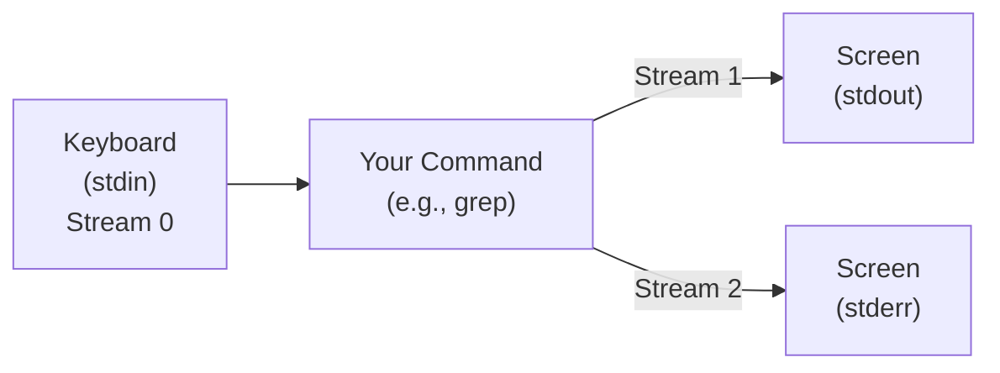
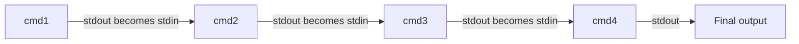

# Module 0.1: The CLI Power User (Search & Streams)

**Complexity:** [QUICK]. **Time to Complete:** 45 minutes. **Prerequisites:** Zero to Terminal (Module 0.8). This module assumes you can open a shell, move through directories, and run basic commands, then shows how those small skills become repeatable investigation workflows.

## Learning Outcomes

After this module, you will be able to:

- **Chain** commands with pipes, redirects, and subshells to build reliable one-line investigations.
- **Search** files and content efficiently using `find`, `grep`, and `xargs` without losing results to shell expansion.
- **Process** text streams with `cut`, `sort`, `uniq`, `awk`, and `sed` for log analysis.
- **Redirect** stdout, stderr, and combined streams for scripting, debugging, and audit trails.

## Why This Module Matters

At 2:13 AM, an on-call engineer at a midsize payments company gets paged because checkout latency has crossed the incident threshold and support is reporting failed card attempts. The application still responds to health checks, the database is reachable, and the dashboard shows only that error rates are climbing. Somewhere in a large directory of rotated logs is the difference between a customer-facing outage and a noisy alert, but opening files one at a time would waste the most expensive minutes of the incident.

The engineer does not need a new observability platform in that moment; they need enough command-line fluency to turn raw text into evidence. A focused pipeline can search across files, keep the database-related failures, and show the latest matches in seconds. That speed matters because incident response is usually a sequence of narrowing questions: which service failed, when did it start, which host saw it first, and whether the symptom is still happening.

```bash
grep -ri "error" /var/log/app/ | grep -i "database" | tail -20
```

This module teaches the habits behind that one line. You will learn how the shell expands patterns before a command starts, how stdin, stdout, and stderr move through a process, how redirection keeps evidence instead of burying it on the screen, and how small Unix tools become an investigation chain. The goal is not memorizing flags; the goal is learning to ask sharper questions of files, streams, logs, and command output.

The same skills carry directly into Kubernetes work even though this is a Linux foundations module. In KubeDojo labs for Kubernetes 1.35+, you will often define `alias k=kubectl`, and commands such as `k get pods --all-namespaces | grep CrashLoopBackOff` use the same stream model as every Linux pipeline in this lesson. If you can reason about what flows through each command, you can debug a local log file today and a cluster-wide symptom tomorrow.

## 1. Wildcards: Pattern Matching for the Impatient

Typing full file names is slow, but the real danger is not boredom; it is making a selective operation broader than you intended. Wildcards, also called globs, let the shell match filenames using patterns before the command starts. That timing is the key idea: `ls`, `rm`, `cp`, and many other programs usually receive the already-expanded file list, not the pattern you typed.

The asterisk is the broadest everyday wildcard because it matches zero or more characters. That makes it useful for safe listing, careful copying, and quick filtering, but it also makes it dangerous with destructive commands. Treat `*.log` like a request to the shell: "please replace this pattern with every matching filename in the current directory before the command receives its arguments."

```bash
# List every .txt file in the current directory
ls *.txt
# Matches: notes.txt, readme.txt, a.txt
# Does NOT match: notes.txt.bak (doesn't end with .txt)

# List every file that starts with "report"
ls report*
# Matches: report.pdf, report_2024.csv, report-final.docx, reports/

# Remove all JPEG images
rm *.jpg
# Matches: photo.jpg, screenshot.jpg, a.jpg

# Copy all Python files to a backup directory
cp *.py ~/backup/

# List files with "config" anywhere in the name
ls *config*
# Matches: config.yaml, app-config.json, myconfig, config_backup.tar.gz
```

The question mark is stricter because it matches exactly one character. That precision is helpful when filenames follow a stable rotation scheme, such as `app.log.1` through `app.log.9`, and harmful when you silently assume it means "any amount." If a pattern does not match a file, most commands never hear about that file at all, so wrong assumptions can look like missing data.

```bash
# List files like file1.txt, file2.txt, fileA.txt
ls file?.txt
# Matches: file1.txt, fileA.txt, filex.txt
# Does NOT match: file12.txt (two characters where ? expects one)
# Does NOT match: file.txt (zero characters where ? expects one)

# Match two-character extensions
ls *.??
# Matches: archive.gz, image.py, data.js
# Does NOT match: readme.txt (three-character extension)

# Match log files with single-digit rotation number
ls app.log.?
# Matches: app.log.1, app.log.2, app.log.9
# Does NOT match: app.log.10
```

Square brackets give you controlled choice for a single character position. They are useful when the naming scheme is predictable but not identical, such as numbered shards, region suffixes, or generated files that use single-letter channels. When you negate a set with `!` or `^`, slow down and test with `ls` first, because negative matching is easy to read backward during a cleanup.

```bash
# Match specific characters
ls file[abc].txt
# Matches: filea.txt, fileb.txt, filec.txt
# Does NOT match: filed.txt

# Match a range of characters
ls data[0-9].csv
# Matches: data0.csv, data1.csv, ... data9.csv

# Match uppercase letters
ls report[A-Z].pdf
# Matches: reportA.pdf, reportB.pdf, ... reportZ.pdf

# Combine ranges
ls log[0-9a-f].txt
# Matches: log0.txt, loga.txt, logf.txt
# Does NOT match: logg.txt (g is outside the range)

# Negate with ! or ^ -- match anything EXCEPT these
ls file[!0-9].txt
# Matches: filea.txt, fileZ.txt
# Does NOT match: file1.txt, file9.txt
```

Brace expansion looks similar to wildcard matching, but it is generation rather than discovery. The shell creates every listed string whether or not the files already exist, which makes braces excellent for repeated setup commands and risky if you believe they are checking the filesystem. This is why `cp config.yaml{,.bak}` works even before `config.yaml.bak` exists: the shell simply produces two arguments.

```bash
# Create multiple files at once
touch report_{jan,feb,mar}.txt
# Creates: report_jan.txt, report_feb.txt, report_mar.txt

# Backup a file with a new extension
cp config.yaml{,.bak}
# Expands to: cp config.yaml config.yaml.bak

# Create a directory structure
mkdir -p project/{src,tests,docs}
# Creates three subdirectories inside project/
```

Pause and predict: if you type `echo file_{1,2,3}.txt`, what exact string will the shell print, and does any file need to exist for that output to appear? The useful mental model is that the shell prepares the argument list first, then the command runs with that prepared list. Once you see that boundary, many confusing wildcard failures become explainable instead of mysterious.

The practical workflow is to preview broad patterns before combining them with commands that change state. Use `ls`, `printf '%s\n'`, or another harmless command to inspect what the shell will pass onward, then run the destructive or expensive operation only after the target set looks right. This is the same discipline engineers use with database migrations: inspect the selected rows before issuing the write.

## 2. Streams: How Data Flows Through Commands

Every Linux command works with three standard streams, and almost every power-user technique in this module is just stream routing with better vocabulary. Standard input is where a command reads data, standard output is where it sends normal results, and standard error is where it sends diagnostics. They usually appear together in your terminal, but Linux keeps them separate so you can make different decisions about evidence and noise.



The stream numbers matter because redirection syntax uses them. Stream 0 is stdin, stream 1 is stdout, and stream 2 is stderr. When you write a plain `>` redirection, the shell treats it as shorthand for redirecting stream 1, which is why normal output can vanish into a file while permission errors still appear on the screen.

Pause and predict: if a command prints valid results and also prints permission errors, then you redirect only stream 1 with `> results.txt`, what remains visible in the terminal? The answer tells you whether you are controlling the command's success path, its diagnostic path, or both. This distinction is essential when you want a clean report but still want the shell to warn you about directories it could not read.

The separation exists because scripts and humans need different information at different times. During a manual investigation, seeing stderr can be useful because it warns you that a search skipped data. During a scheduled report, mixing stderr into the report can corrupt the file that another tool expects to parse. Good shell work is often the discipline of deciding which stream should be stored, which should be displayed, and which should be discarded.

## 3. Redirection: Controlling Where Output Goes

Redirection lets you choose where streams go before the command runs. The command itself usually does not know whether its output is landing on your terminal, a file, another process, or a device such as `/dev/null`; it writes to its standard streams and the shell handles the plumbing. This is why redirection is so composable: you can add it to commands you already know without learning a new logging API.

The overwrite operator is useful when the file is a snapshot, not a history. A directory listing, a current hostname, or a generated inventory should often replace the previous version because the old version would be misleading. The sharp edge is that the shell truncates the target file before the command writes, so a typo can destroy useful content even if the command later fails.

```bash
# Save a directory listing to a file
ls -la /etc > etc_contents.txt

# Save the current date and time
date > timestamp.txt

# Save your system's hostname
hostname > server_info.txt
```

Append redirection is safer for logs because it preserves earlier evidence. When a health check runs every hour, each line is a new observation in a timeline, and replacing the file would erase the pattern you are trying to study. The tradeoff is that append-only files can grow without bound, so long-running systems still need rotation or cleanup.

```bash
# Build a log file over time
echo "=== Deploy started ===" >> deploy.log
echo "Version: 2.4.1" >> deploy.log
echo "=== Deploy finished ===" >> deploy.log

# Append today's disk usage to a daily report
df -h >> /var/log/daily_disk_report.txt
```

In a real script, append mode turns individual command output into an operational journal. The line below is simple, but it shows a useful pattern: generate a timestamp at the moment of success, attach a short message, and write that observation to a place the next shift can inspect. Even a small log line becomes valuable when it is consistent.

```bash
# Every time this script runs, it appends a timestamped entry
echo "$(date): Backup completed successfully" >> /var/log/backup.log
```

Redirecting stderr is what keeps a broad search readable. If you search from the filesystem root as a regular user, many directories are intentionally off limits, and each denied path can produce an error line. Sending stream 2 somewhere else does not make the command more privileged; it only prevents diagnostics from drowning out valid matches on stream 1.

```bash
# Try listing a directory you can't access -- send errors to a file
ls /root 2> errors.log
# The "Permission denied" error goes to errors.log, not your screen

# Run find without being spammed by permission errors
find / -name "nginx.conf" 2> /dev/null
# /dev/null is Linux's black hole -- errors vanish, results appear on screen
```

Sometimes you want the complete story, especially when debugging a build, a deployment, or a migration that may fail in several places. Redirecting both streams into one file gives you a chronological transcript of normal progress and errors together. That transcript is not ideal for machine parsing, but it is excellent for a human who needs to replay what happened.

```bash
# Capture all output from a build process
make build &> build_output.log

# Run a script and capture everything for debugging
./deploy.sh &> deploy_full_log.txt
```

Input redirection is less dramatic but just as important. It lets a command read from a file as if the file were typed into the keyboard, which is useful for commands that are naturally stream-oriented. In practice, many commands can take a filename directly, but input redirection teaches the deeper idea that programs can consume stdin without caring where that data originated.

```bash
# Count lines, words, and characters in a file
wc < report.txt

# Sort the contents of a file
sort < unsorted_names.txt

# Send an email with file contents as the body (if mail is configured)
mail -s "Report" admin@example.com < report.txt
```

Combining redirections is where careful stream thinking pays off. A command can send successful matches to one file while sending diagnostics to another file, or it can keep results and discard expected errors. The important part is to decide intentionally, because a clean-looking result file may hide skipped directories if you suppressed stderr without first understanding it.

```bash
# Save output to one file and errors to another
find / -name "*.conf" > results.txt 2> errors.txt

# Save output to a file, throw away errors
grep -r "TODO" /project > todos.txt 2> /dev/null
```

The `/dev/null` pattern is the shell's discard chute, and it is useful when output has no diagnostic value for the current question. It is also easy to overuse. During early troubleshooting, prefer saving errors to a file so you can inspect what was skipped; once you know the errors are expected and irrelevant, discarding them becomes reasonable.

```bash
# Run a command silently -- no output, no errors
command_that_is_noisy > /dev/null 2>&1

# Check if a command succeeds without caring about output
if grep -q "ready" status.txt 2> /dev/null; then
    echo "System is ready"
fi
```

## 4. Pipes: The Assembly Line

Pipes connect the stdout of one command to the stdin of the next command. That sounds small until you realize it lets each program stay simple: one command lists, another filters, another counts, another sorts, and another trims the final result. The power comes from composing reliable pieces rather than waiting for one giant tool to know every investigation you will ever need.



The factory analogy works because each station should do one clear transformation. A pipeline that lists files, filters by name, counts lines, and sorts by size is easier to debug than a single opaque script that does everything at once. If the final answer looks wrong, you can run the first two commands, inspect the intermediate stream, then add the next stage only when the data shape is correct.

Stop and think: if `cmd2` prints an error message on stderr, does that error flow into `cmd3`, or does only stdout move through the pipe? This question matters during incidents because error messages can appear on the terminal even though the downstream command never processed them. A pipeline may look noisy while still producing a valid result, or it may look clean because errors were redirected away.

```bash
# List files and scroll through the output page by page
ls -la /etc | less

# Count how many files are in a directory
ls /etc | wc -l

# Show only the first 5 largest files
du -sh /var/log/* | sort -rh | head -5
```

Simple two-command pipes are the best way to practice because the input and output are still easy to inspect. When you run `ps aux | grep nginx`, the process list becomes searchable text. When you run `du -sh /home/* | sort -rh`, rough disk usage becomes a ranked list. The commands are not magical; they are just agreeing to exchange plain text.

```bash
# Find all running processes containing "nginx"
ps aux | grep nginx

# Show disk usage sorted by size (largest first)
du -sh /home/* | sort -rh

# List only directories in the current location
ls -la | grep "^d"

# Show unique shells used on the system
cat /etc/passwd | cut -d: -f7 | sort -u
```

Longer pipelines should still be read as a sequence of small transformations. The web log example starts with raw lines, extracts the first field, groups identical addresses, counts the groups, sorts the counts, and keeps the largest results. If you can narrate each stage in plain language, you can usually debug the pipeline when it gives an unexpected answer.

```bash
# Find the 5 IP addresses that hit your web server most often
cat /var/log/nginx/access.log | awk '{print $1}' | sort | uniq -c | sort -rn | head -5
# Step by step:
# 1. cat: read the log file
# 2. awk '{print $1}': extract the first field (IP address) from each line
# 3. sort: sort the IPs alphabetically (required for uniq)
# 4. uniq -c: count consecutive duplicate lines
# 5. sort -rn: sort by count, numerically, in reverse (highest first)
# 6. head -5: show only the top 5

# Find which processes are using the most memory
ps aux | sort -k4 -rn | head -10 | awk '{print $4"% "$11}'
# Shows: memory percentage and command name for top 10 processes

# Count how many times each HTTP status code appears in a log
cat access.log | awk '{print $9}' | sort | uniq -c | sort -rn
# Output might look like:
# 15234 200
#  2341 304
#   187 404
#    23 500
```

Before running the access-log pipeline, predict what would break if the `sort` before `uniq -c` were removed. `uniq` only counts adjacent duplicate lines, so identical IP addresses scattered throughout the file would be counted as separate groups. The pipeline depends on ordering before counting, which is a common pattern in command-line analysis.

The contrast with temporary files shows why pipes changed daily Unix work. Temporary files can be useful when you need to preserve intermediate evidence, but they create cleanup chores and stale data risks. Pipes keep the stream moving through memory, so the final answer reflects the current command output rather than yesterday's forgotten scratch file.

```bash
# Step 1: Save all process info to a temp file
ps aux > /tmp/all_processes.txt
# Step 2: Search that file for python
grep python /tmp/all_processes.txt > /tmp/python_processes.txt
# Step 3: Count the lines
wc -l /tmp/python_processes.txt
# Step 4: Clean up temp files
rm /tmp/all_processes.txt /tmp/python_processes.txt
```

```bash
ps aux | grep python | wc -l
```

The one-line version is not automatically better in every context. If you are doing a forensic investigation, saving an intermediate file may preserve evidence that later changes. For normal operational questions, however, pipes reduce friction enough that you can ask several sharper questions quickly instead of turning the first idea into a small manual project.

## 5. `find`: Locating Files Like a Detective

The `find` command searches a directory tree recursively and evaluates tests against each path it encounters. Unlike shell wildcards, which expand only in the current command line before the program starts, `find` walks through directories while it runs. That makes it the right tool when the target may be buried several levels down or when you need to combine name, type, size, and time criteria.

Think of `find` as a filesystem query engine. You provide where to look and what conditions a path must satisfy, then `find` streams matching paths to stdout. The basic syntax is `find [where to look] [what to match]`, but the real skill is combining tests until the result set is narrow enough to trust.

```bash
# Find a file named exactly "config.yaml" starting from current directory
find . -name "config.yaml"

# Find all YAML files (case-sensitive)
find . -name "*.yaml"

# Find all YAML files (case-insensitive -- also matches .YAML, .Yaml)
find . -iname "*.yaml"

# Find in a specific directory
find /etc -name "*.conf"
```

Quoting patterns is non-negotiable with `find`. If you write `find . -name *.yaml`, the shell may expand `*.yaml` using files in your current directory before `find` ever starts, which changes a recursive query into a confusing exact-name search. By writing `find . -name "*.yaml"`, you protect the pattern until `find` can apply it to every path it visits.

```bash
# Find only directories
find . -type d

# Find only regular files (not directories, not symlinks)
find . -type f

# Find only symbolic links
find . -type l

# Find all directories named "test"
find . -type d -name "test"
```

Type filters are a practical safety feature. Many outages involve directories, symlinks, sockets, and regular files living together under a shared path, especially below `/var`, `/tmp`, or application release directories. Adding `-type f` before a destructive or expensive action tells future you that the command was meant for files only, not for directories that happen to match a name pattern.

```bash
# Find files larger than 100 MB (hunting disk space hogs)
find /var -type f -size +100M

# Find files larger than 1 GB
find / -type f -size +1G 2> /dev/null

# Find small files (less than 1 KB) -- possible empty or junk files
find . -type f -size -1k

# Find files exactly 0 bytes (empty files)
find . -type f -empty
```

Size filters are often the fastest path from "disk is full" to a useful lead. A full filesystem rarely requires reading every file; it requires finding the few files large enough to matter. Combine size with a path that matches the symptom, and add stderr handling when the search crosses permission boundaries, so the valid results stay visible.

```bash
# Find files modified in the last 24 hours
find /var/log -type f -mtime -1

# Find files modified in the last 30 minutes
find . -type f -mmin -30

# Find files NOT modified in the last 90 days (stale files)
find /home -type f -mtime +90

# Find files accessed in the last hour
find . -type f -amin -60
```

Time filters answer a different incident question: what changed around the time the symptom began? A file modified in the last half hour may be more interesting than the largest file on disk, and a stale file may explain why a configuration update never took effect. When you combine time with name and type, `find` becomes a change detector rather than a simple locator.

Pause and predict: if you want to find log files older than 30 days and delete them, what exact tests should come before the delete action so the command cannot remove a directory or a non-log file? A safe answer starts by listing the matches, then adds the deletion only after the search criteria are narrow enough to defend.

```bash
# Delete all .tmp files (BE CAREFUL -- no undo!)
find /tmp -name "*.tmp" -delete

# Run a command on each file found (-exec)
find . -name "*.log" -exec wc -l {} \;
# {} is replaced with each filename found
# \; marks the end of the -exec command

# Change permissions on all shell scripts
find . -name "*.sh" -exec chmod +x {} \;

# Print results with details (like ls -l)
find . -name "*.conf" -ls
```

Actions are where `find` shifts from observation to change. The `-exec` action is explicit and readable because each matched path is substituted at `{}`, while `-delete` is compact but unforgiving. On production systems, the professional habit is to run the same search without the action first, review the output, and only then add the operation that changes files.

## 6. `grep`: Searching Inside Files

Where `find` locates paths, `grep` searches the contents of text streams and files. It prints lines that match a pattern, which means its natural unit of evidence is a line of text. Logs, configuration files, process listings, environment variables, package lists, and command histories all become searchable once you remember that they are just streams of lines.

The basic syntax is `grep [options] "pattern" file`, but effective use starts with choosing the right scope. Searching one file is simple; searching many files requires either naming them, using a shell wildcard, asking `grep` to recurse, or combining `find` with `grep`. Each option expresses a different assumption about where the evidence may live.

```bash
# Find lines containing "error" in a log file
grep "error" /var/log/syslog

# Case-insensitive search (matches Error, ERROR, error, eRRoR)
grep -i "error" /var/log/syslog

# Search multiple files at once
grep "timeout" server1.log server2.log server3.log

# Search all files in a directory recursively
grep -r "password" /etc/
# CAUTION: this can reveal sensitive information -- use responsibly
```

Case sensitivity is a choice about signal and noise. During early triage, `grep -i` helps catch inconsistent capitalization across tools and languages. During a precise audit, case-sensitive matching may be safer because it avoids unrelated words. The point is not that one flag is always right; the point is to choose based on the question you are asking.

Context flags turn isolated matches into useful evidence. A timeout line by itself may not show the user ID, request path, transaction ID, or retry that caused it. By asking for lines before, after, or around the match, you let `grep` preserve the nearby timeline without opening a large file in an editor.

```bash
# Show 3 lines AFTER each match (A = After)
grep -A 3 "Exception" app.log
# Great for seeing stack traces that follow an error

# Show 2 lines BEFORE each match (B = Before)
grep -B 2 "failed" deploy.log
# Great for seeing what command caused a failure

# Show 3 lines before AND after each match (C = Context)
grep -C 3 "timeout" app.log
# The full picture around each match

# Combine with case-insensitive
grep -i -C 5 "critical" /var/log/syslog
```

Counting and listing modes help when the question is about scope rather than content. If every application host has a few errors, the incident looks different from one host producing thousands. If only one configuration file contains a deprecated endpoint, the fix can be targeted instead of becoming a broad search-and-replace across the whole repository.

```bash
# Count matching lines (instead of showing them)
grep -c "404" access.log
# Output: 187 (just the number)

# Show only filenames that contain a match (not the lines themselves)
grep -rl "TODO" /project/src/
# Output: list of files, one per line

# Show line numbers alongside matches
grep -n "def main" *.py
# Output: main.py:42:def main():
```

Inversion and anchors are the beginning of pattern discipline. Removing `DEBUG` lines can make an operational log readable, while `^#` targets comments and `\.conf$` targets filenames that end in a specific extension. These are still simple regular expressions, but they teach the habit of describing positions and whole words instead of matching every accidental substring.

```bash
# Show lines that do NOT match (invert)
grep -v "DEBUG" app.log
# Shows everything except debug lines -- great for reducing noise

# Match whole words only (not partial matches)
grep -w "error" app.log
# Matches "error" but NOT "errors" or "error_handler"

# Match at the start or end of a line
grep "^#" config.conf     # Lines starting with # (comments)
grep "\.conf$" filelist    # Lines ending with .conf
```

`grep` becomes especially powerful when it filters the output of commands that were not designed as search tools. Process listings, package inventories, socket reports, and environment dumps all produce text. Once that text enters stdout, `grep` can narrow it, and the next command can count, sort, or display it.

```bash
# Find running processes by name
ps aux | grep nginx

# Filter command history
history | grep "docker"

# Find listening network ports for a specific service
ss -tlnp | grep 8080

# Check if a package is installed (Debian/Ubuntu)
dpkg -l | grep "nginx"

# Find environment variables related to Java
env | grep -i java
```

Stop and think: if you use `grep -v "INFO" app.log | grep -v "DEBUG"`, which log levels are you attempting to isolate, and what useful lines might you accidentally remove? Negative filters are good at reducing noise, but every exclusion is also a bet about what does not matter. Review the remaining output before treating it as the whole truth.

## 7. The Power Combo: `find` + `grep` + Pipes

Experienced Linux users rarely think of `find`, `grep`, pipes, and redirection as separate topics. They combine them into small evidence-gathering systems. The best combinations start with a narrow file set, search only those files for relevant text, shape the output into a readable form, and save the result when it becomes evidence worth sharing.

```bash
find /etc -name "*.conf" -exec grep -l "db.example.com" {} \;
```

This command finds configuration files under `/etc`, searches each one for a database host, and prints only the filenames that contain a match. It is deliberately conservative: `find` controls the file set, `grep -l` reports names instead of matching lines, and `-exec` keeps each path tied to the command that acts on it. That clarity is valuable when a wrong match could send you to the wrong configuration file.

```bash
find . -name "*.py" | xargs grep -n "def process_order"
```

The second pattern uses `xargs` to convert a stream of filenames into command arguments. This is faster for large file sets because `grep` can search many files per process instead of starting once per file. The tradeoff is filename safety: ordinary `xargs` splits on whitespace, so files with spaces or unusual characters require the safer null-delimited pattern in production-grade scripts.

The `-exec` and `xargs` choice is a performance and safety decision, not a style preference. `find ... -exec ... \;` is straightforward and handles unusual filenames well, but it can start thousands of processes if thousands of files match. `xargs` batches work efficiently, but you must use the null-delimited form when filenames might contain spaces, newlines, or characters that a shell pipeline would otherwise misread.

Pause and predict: if ten thousand files match and you use `find -exec grep ... \;`, how many separate `grep` processes will the system start and stop? That overhead is usually invisible with a dozen files and painfully visible with a large repository, a vendor directory, or a filesystem scan during an incident. Scale changes which perfectly valid command becomes the better command.

```bash
find /var/log -name "*.log" -size +10M -mtime -1 -exec ls -lh {} \;
```

This search combines name, size, and modification time to answer a realistic disk-pressure question. It is not asking for every log and it is not asking for every large file; it is asking for large log files that changed recently. That kind of query is much closer to an operational hypothesis, which makes the result easier to act on.

```bash
find . -name "*.js" -o -name "*.ts" | xargs grep -c "TODO" | grep -v ":0$"
```

The task-marker example is useful even though the exact command has a subtle teaching point. Without grouping, `find` expression precedence can surprise you as commands become more complex, so serious scripts often use parentheses around related `-name` tests. As a learning example, it still shows the stream: find candidate source files, count matching markers, then remove files with zero matches from the final report.

```bash
ps aux | grep "[r]unaway_script" | awk '{print $2}' | xargs kill
```

The runaway-process command is compact, but it deserves respect because the final stage changes system state. The bracket trick prevents `grep` from matching its own process, `awk` extracts the PID column, and `xargs` passes those PIDs to `kill`. A careful operator would first run the pipeline without `xargs kill`, verify the selected process IDs, and only then add the terminating action.

### War Story: The 3 AM Log Hunt

A junior engineer once joined an incident where payment processing had stopped for a subset of customers. They SSH'd into the host, opened `/var/log/app.log` in a terminal editor, and began searching manually. The file was several gigabytes, the editor became sluggish, and each attempt to jump around the file added more frustration than evidence.

A senior engineer joined the call and reduced the question to a stream problem: find payment-related lines, keep the error lines, and show only the latest few matches. The command was not fancy, but it matched the incident shape perfectly. Instead of reading the whole file, the team asked the file for the lines that could explain the symptom.

```bash
grep -i "payment" /var/log/app.log | grep -i "error" | tail -20
```

The answer appeared quickly: a third-party payment gateway endpoint had changed, and the local configuration still pointed at the old path. The fix was a one-line configuration update, but the real lesson was about time-to-evidence. Knowing how to search streams did not replace application knowledge; it allowed the engineers to reach the application clue before the incident grew worse.

There is another lesson hidden in that story: command-line work is strongest when it follows a hypothesis. The senior engineer did not search for every possible failure string, and they did not start by reading unrelated system logs. They took the symptom, payment failures, combined it with the likely severity marker, errors, and asked for recent evidence. That is the same diagnostic loop you should practice: state the question, choose the smallest stream that could answer it, then widen only if the result is empty.

You can apply that loop to configuration drift as well as incidents. Suppose a team believes one host still points at an old database address after a migration. A weak approach is to open random files and search manually until something appears. A stronger approach is to use `find` to select likely configuration files, use `grep` to locate the old address, and save the filenames to an evidence file that can be attached to the incident ticket or reviewed in a change meeting.

The discipline also prevents false confidence. A command that returns nothing is not the same as proof that the problem does not exist; it only proves that your search did not find a match in the places and streams you selected. When a zero-result search matters, inspect the scope: did the wildcard match files, did `find` walk the right tree, did permissions hide directories, and did the pattern match the way the application logs the concept?

As you build longer pipelines, read them aloud from left to right using data-shape language. "This stage emits filenames, this stage emits matching lines, this stage emits one field per line, this stage emits counts." That habit catches mistakes such as piping filenames into a command that expects file contents, or piping log lines into a command that expects process IDs. Most broken one-liners fail because two neighboring stages disagree about what kind of text is flowing between them.

The other useful habit is saving the exact command that produced an operational conclusion. In a calm learning environment, a pipeline can be disposable. In an incident, a migration, or a security review, the command is part of the reasoning trail. If a teammate asks how you know the old endpoint appears in only one file, the answer should be reproducible from the terminal history or the report, not reconstructed from memory after the fact.

## Patterns & Anti-Patterns

A reliable pattern is to preview before changing state. Use `find` without `-delete`, run a process-selection pipeline without `kill`, and print wildcard matches before adding `rm`. This works because shell mistakes usually become expensive at the final stage, so verifying the stream just before that stage catches many errors while the command is still harmless.

Another strong pattern is to keep each pipeline stage responsible for one transformation. A readable investigation might list candidate files, search matching content, extract one field, count repeated values, then sort the counts. When each stage has a single job, you can test the pipeline from left to right and explain the result to a teammate under pressure.

A third pattern is to save evidence when the output becomes part of a decision. During exploration, printing to the terminal is fine. When you are about to hand findings to another engineer, compare before and after states, or document an incident timeline, redirect the final output to a file and keep stderr separate unless the diagnostic messages are part of the evidence.

Use another pattern when dealing with filenames from untrusted or messy sources: prefer null-delimited handoff for production automation. Human-created filenames can contain spaces, quotes, and other characters that simple whitespace splitting treats as separators. While this module uses the shorter `xargs` form for readability, a hardened script should use the safer family of options that preserve each filename as one item from producer to consumer.

For text processing, prefer field extraction only after you understand the input format. `awk '{print $1}'` is perfect for logs where the first field is reliably an IP address, but it is wrong when quoted strings, variable whitespace, or multiline records change the meaning of fields. Before trusting a field-based report, sample a few raw lines and verify that the column you extracted really represents the concept you plan to count.

The most common anti-pattern is using a broad wildcard or recursive search as if it were already reviewed. People fall into this because the command looks familiar, not because the target set is safe. The better alternative is to make the command first produce a list of targets, inspect that list, and only then attach the action that copies, removes, changes permissions, or kills processes.

Another anti-pattern is building a pipeline that nobody can read after the incident. A long one-liner can be appropriate, but if you cannot explain what each stage receives and emits, the line is too opaque for a shared operational record. Break it into smaller commands while learning, or write a short note above it in a runbook that explains the data shape at each stage.

The last anti-pattern is discarding stderr too early. Redirecting errors to `/dev/null` can make a command look clean while hiding permission failures, missing files, or broken assumptions. During the first pass, save stderr to a file or leave it visible; after you understand the expected diagnostics, suppressing them becomes a deliberate cleanup rather than accidental blindness.

Be especially cautious with commands copied from history. History preserves syntax, not intent, and a command that was safe yesterday may be wrong in a different directory or after a deployment changed file names. Before reusing a pipeline, identify its input scope, its filtering assumptions, and its final action. If any part is unclear, rerun the harmless prefix first and rebuild confidence before adding the rest.

## When You'd Use This vs Alternatives

Use shell pipelines when the input is line-oriented text, the question can be answered by filtering or reshaping that text, and the answer is needed quickly. Logs, process lists, package inventories, small reports, and configuration trees are ideal. These commands are also good when you are connected over SSH with limited tooling, because the standard utilities are present on almost every Unix-like system.

Use a script when the workflow has branching logic, needs retries, must be run repeatedly by other people, or has enough quoting and error handling that a one-liner becomes fragile. A one-liner is a great exploration tool, but a maintained automation should make assumptions explicit. The moment you need tests, parameters, or robust handling for unusual filenames, a small script may be the clearer engineering choice.

Use application-level observability when the question depends on structured events, request traces, metrics, or distributed context that plain text cannot reliably reconstruct. The CLI is excellent for local evidence and quick triage, but it does not replace tracing systems, log aggregation, or dashboards in complex services. The practical skill is knowing when the shell can answer the next question and when the next question belongs in a purpose-built system.

Use an editor when you are changing a file or studying a small amount of context closely. The command line is not a moral contest where pipelines must replace every visual tool. A strong operator reaches for `grep` to locate the right evidence quickly, then may open the exact file and line in an editor to understand surrounding code, comments, or configuration. Search narrows the problem; careful reading still finishes many fixes.

Use a purpose-built parser when the input is structured data such as JSON, YAML, or CSV with quoting rules. Plain text tools can handle many quick questions, but they can also produce misleading answers when delimiters appear inside values. The power-user move is not forcing every format through `awk`; it is recognizing when a stream is simple enough for line tools and when a parser will be more accurate.

## Did You Know?

1. **The name `grep` is an acronym.** It stands for "Global Regular Expression Print" and comes from the `ed` text editor command `g/re/p`. Ken Thompson wrote the standalone tool in 1973, and its core behavior remains recognizable because the line-matching model was already strong.
2. **Pipes arrived early in Unix history.** Doug McIlroy proposed connecting programs together at Bell Labs, and the idea became one of the defining features of Unix command design. The vertical bar became the visible sign of a deeper philosophy: small tools should cooperate through streams.
3. **`/dev/null` behaves like a writable discard device.** Data written there is accepted and thrown away, which is why shell users use it to silence output intentionally. The device is useful precisely because programs can write to it normally without needing special code.
4. **`find` can express questions a file manager cannot answer quickly.** A request such as "files larger than 5 MB, modified in the last week, below this tree" becomes a single command. The value is not just speed; it is repeatability when another engineer asks how you found the evidence.

## Common Mistakes

| Mistake | Why It Happens | How to Fix It |
|:---|:---|:---|
| Using `>` when you meant `>>` | You wanted to append to a log file but accidentally overwrote it, destroying previous entries. | Ask whether the file is a snapshot or a history before pressing Enter. Use `>>` for timelines and `>` only when replacing the previous contents is intentional. |
| Forgetting quotes around wildcards in `find` | The shell expands `*.txt` in the current directory before `find` can apply the pattern recursively. | Always quote patterns that belong to `find`, such as `find . -name "*.txt"`, so `find` receives the pattern unchanged. |
| Piping into commands that ignore stdin | Commands such as `ls`, `cd`, and `rm` primarily expect arguments, so piped text may be ignored. | Use `xargs` when you need to convert stdin into arguments, and preview the generated command targets before changing state. |
| Searching from `/` without managing errors | A regular user cannot read many system directories, so permission diagnostics overwhelm useful matches. | Redirect stderr to a file during investigation, or use `2> /dev/null` only after you know the skipped paths are irrelevant. |
| Using `grep` without recursion and expecting directory search | Naming a directory is not the same as asking `grep` to walk every file below it. | Use `grep -r "pattern" directory/` for recursive content search, or combine `find` with `grep` when you need tighter file selection. |
| Confusing `find -name` with `find -path` | `-name` matches only the final filename component, not the full directory path. | Use `-path "*/src/config.yaml"` when the directory structure matters, and use `-name "config.yaml"` when only the basename matters. |
| Trusting a destructive pipeline without previewing the stream | The final command may delete files or kill processes selected by a flawed earlier stage. | Run the pipeline up to the final stage first, inspect the selected paths or PIDs, then add the destructive action only after the target set is correct. |

## Quiz

**Test your understanding. Try to answer before revealing the solution.**

<details>
<summary>1. <strong>Scenario:</strong> You are cleaning up a directory filled with backup files. You have <code>backup_1.tar</code>, <code>backup_12.tar</code>, and <code>backup_final.tar</code>. You run <code>rm backup_?.tar</code>. Which files are deleted and why?</summary>

Only `backup_1.tar` is deleted in this scenario. This happens because the `?` wildcard strictly matches exactly one character, no more and no less. Since `1` is a single character, it perfectly matches the pattern. However, `12` is two characters and `final` is five characters, meaning `backup_12.tar` and `backup_final.tar` are ignored. If you had used the `*` wildcard instead, which matches zero or more characters of any kind, all three files would have matched.
</details>

<details>
<summary>2. <strong>Scenario:</strong> You have a script that checks system health every hour. You want to record the output of <code>uptime</code> into <code>/var/log/health.log</code> so you can review the history at the end of the week. Which redirection operator should you use and why?</summary>

You should use the append operator `>>` for this task. When you use `>>`, the shell opens the target file and adds the new output to the end, preserving the existing historical data. If you used `>`, the shell would truncate the file before writing, so you would keep only the most recent observation. Logging is a timeline, so append mode protects the evidence you are collecting.
</details>

<details>
<summary>3. <strong>Scenario:</strong> You are running <code>find / -name "secret.key"</code> as a regular user. Your screen is flooded with "Permission denied" lines, making it impossible to see whether the file was found. How do you fix this command and why does the fix work?</summary>

You fix it by appending `2> /dev/null`, or by redirecting stderr to a file if you want to review skipped paths later. The command's valid matches travel on stdout, while permission diagnostics travel on stderr. Redirecting stream 2 leaves stream 1 visible, so an actual match still appears on the terminal. The fix works because Linux separates normal output from diagnostics before the shell decides where each stream should go.
</details>

<details>
<summary>4. <strong>Scenario:</strong> Your web server's primary disk is nearly full. You suspect rotated log files in <code>/var/log</code> have grown out of control, specifically files over 50 Megabytes. How do you locate just these large files?</summary>

Use `find /var/log -type f -name "*.log" -size +50M`. This command combines tests so that every result must be a regular file, have a log-style name, and exceed the specified size. That combination is much safer than listing everything under `/var/log` and scanning manually. If permission errors appear, redirect stderr separately so the valid matches remain readable.
</details>

<details>
<summary>5. <strong>Scenario:</strong> A customer reported a timeout at exactly 14:32. You search <code>app.log</code> for "timeout" and find the error, but it does not show which user triggered it. You need the lines immediately before the error to find the user ID. What command do you use?</summary>

Use `grep -B 3 -i "timeout" app.log`, adjusting the number if your log format needs more context. The `-B` option prints lines before each match, which is often where request IDs, user IDs, and route information appear. You could use `-C 3` if you also need the lines after the error. The reasoning is that the matching line is only the symptom; the nearby lines often contain the cause.
</details>

<details>
<summary>6. <strong>Scenario:</strong> You inherit a server and see this command in history: <code>cat access.log | awk '{print $1}' | sort | uniq -c | sort -rn | head -10</code>. The previous admin used it during a traffic spike. What was this command helping them discover?</summary>

The command was identifying the IP addresses making the most requests. It extracts the first field from each access-log line, sorts the addresses so duplicates become adjacent, counts those adjacent duplicates, ranks the counts from highest to lowest, and keeps the top results. That is exactly the kind of evidence needed when deciding whether a spike comes from a few sources or broad normal traffic. The pipeline is useful because each stage performs one easy-to-check transformation.
</details>

<details>
<summary>7. <strong>Scenario:</strong> You are in a directory containing <code>script.py</code>, <code>utils.py</code>, and <code>data.csv</code>. You want to find Python files in subdirectories. You run <code>find . -name *.py</code>, and the results are confusing. Why did this fail?</summary>

It failed because the `*.py` pattern was not quoted. Since Python files already existed in the current directory, the shell expanded the wildcard before `find` received the command line. That means `find` did not get the pattern you intended it to apply recursively. Writing `find . -name "*.py"` protects the asterisk so `find` can evaluate it against every path it visits.
</details>

<details>
<summary>8. <strong>Scenario:</strong> You are running a long database migration script with <code>./migrate.sh</code>. You want successful progress messages in <code>progress.txt</code>, but critical failures should be saved separately in <code>alerts.txt</code>. How do you run the script?</summary>

Run `./migrate.sh > progress.txt 2> alerts.txt`. The first redirection captures stdout, which is where normal progress messages should go, and the second captures stderr, where failures should be reported. Keeping the streams separate prevents alerts from being buried inside routine progress output. It also gives you two files with different purposes: a timeline of normal work and a focused diagnostic file.
</details>

## Hands-On Exercise: The Server Investigation

In this exercise, you are a junior SRE investigating a reported outage on a small server. The practice environment gives you three log files and a few supporting files, then asks you to narrow the evidence using wildcards, redirection, pipes, `find`, and `grep`. Work through the tasks in order because each one builds the habit of asking a narrower question than the last.

First, create the practice environment. The generated log lines are intentionally small enough to inspect, but they mimic real signals: database timeouts, memory pressure, gateway trouble, and recovery messages. After setup, resist the urge to open every file manually; the point is to make the shell answer targeted questions for you.

```bash
# Create the investigation directory
mkdir -p ~/investigation/logs

# Create simulated log files with realistic content
cat > ~/investigation/logs/web.log << 'EOF'
2024-03-15 08:01:12 INFO Request received: GET /api/users
2024-03-15 08:01:13 INFO Response sent: 200 OK
2024-03-15 08:02:44 ERROR Connection to database timed out
2024-03-15 08:02:45 ERROR Failed to process request: GET /api/orders
2024-03-15 08:03:01 WARN Retry attempt 1 for database connection
2024-03-15 08:03:02 INFO Database connection restored
2024-03-15 08:05:30 INFO Request received: GET /api/products
2024-03-15 08:07:15 ERROR OutOfMemoryError: heap space exhausted
2024-03-15 08:07:16 ERROR Service crashed - restarting
EOF

cat > ~/investigation/logs/db.log << 'EOF'
2024-03-15 08:00:00 INFO Database server started
2024-03-15 08:02:40 WARN Connection pool exhausted (max: 100)
2024-03-15 08:02:42 ERROR Too many connections - rejecting new requests
2024-03-15 08:02:43 ERROR Query timeout: SELECT * FROM orders WHERE status='pending'
2024-03-15 08:03:00 INFO Connection pool recovered
2024-03-15 08:06:00 INFO Routine backup started
2024-03-15 08:07:10 ERROR Disk space critical: /var/lib/mysql at 98%
EOF

cat > ~/investigation/logs/app.log << 'EOF'
2024-03-15 08:00:05 INFO Application started on port 8080
2024-03-15 08:01:10 INFO Health check passed
2024-03-15 08:02:44 ERROR Upstream service unavailable: payment-gateway
2024-03-15 08:02:50 WARN Circuit breaker opened for payment-gateway
2024-03-15 08:04:00 INFO Circuit breaker closed for payment-gateway
2024-03-15 08:07:14 ERROR Memory usage exceeded threshold: 95%
2024-03-15 08:07:15 ERROR Initiating graceful shutdown
2024-03-15 08:07:16 INFO Shutdown complete
EOF

# Create a text file to make find exercises interesting
echo "This is a config file" > ~/investigation/config.txt
echo "Important notes here" > ~/investigation/notes.txt
```

Complete each task using the tools from the module before opening the solution. The success criteria use unchecked boxes because the verifier expects a learner-facing checklist, and because you should be able to mark each item only after your local command proves it. If your output differs because your home directory is printed differently, focus on the file names and contents rather than the exact prefix.

**Task 1:** Use a wildcard to list only the `.log` files in `~/investigation/logs/`.

<details>
<summary>Solution</summary>

```bash
ls ~/investigation/logs/*.log
```
</details>

**Task 2:** Use `grep` to find all lines containing "ERROR" across all log files. Save the results to `~/investigation/all_errors.txt`.

<details>
<summary>Solution</summary>

```bash
grep "ERROR" ~/investigation/logs/*.log > ~/investigation/all_errors.txt
```
</details>

**Task 3:** Count how many ERROR lines exist in each log file without showing the lines themselves.

<details>
<summary>Solution</summary>

```bash
grep -c "ERROR" ~/investigation/logs/*.log
```

Expected output:
```
/home/user/investigation/logs/app.log:3
/home/user/investigation/logs/db.log:3
/home/user/investigation/logs/web.log:4
```
</details>

**Task 4:** Find all errors related to "database" or "memory" case-insensitively, showing one line of context before each match.

<details>
<summary>Solution</summary>

```bash
grep -i -B 1 "database\|memory" ~/investigation/logs/*.log
```

Or using two greps with a pipe:

```bash
cat ~/investigation/logs/*.log | grep -i -B 1 -E "database|memory"
```
</details>

**Task 5:** Use `find` to locate all `.txt` files in the `~/investigation` directory.

<details>
<summary>Solution</summary>

```bash
find ~/investigation -name "*.txt"
```
</details>

**Task 6 (The Boss Level):** Write a single pipeline that reads all log files, filters only ERROR lines, sorts them by timestamp, takes the last 5 most recent errors, and saves them to `~/investigation/recent_critical.txt`.

<details>
<summary>Solution</summary>

```bash
cat ~/investigation/logs/*.log | grep "ERROR" | sort | tail -5 > ~/investigation/recent_critical.txt
```

Verify with:

```bash
cat ~/investigation/recent_critical.txt
```

You should see the 5 most recent ERROR entries sorted by timestamp.
</details>

You have completed this exercise when:

- [ ] `~/investigation/all_errors.txt` exists and contains only ERROR lines from all three log files.
- [ ] You can explain why Task 3 prints counts instead of matching log lines.
- [ ] `~/investigation/recent_critical.txt` contains exactly 5 sorted error lines.
- [ ] You completed each task using commands from this module rather than GUI tools.

## Next Module

Next up: [Module 0.2: Environment & Permissions](../module-0.2-environment-permissions/) teaches how Linux knows who you are, how shell configuration shapes your working environment, and how permissions protect shared systems.

## Sources

- [GNU Bash Manual: Filename Expansion](https://www.gnu.org/software/bash/manual/html_node/Filename-Expansion.html)
- [GNU Bash Manual: Redirections](https://www.gnu.org/software/bash/manual/html_node/Redirections.html)
- [GNU Bash Manual: Pipelines](https://www.gnu.org/software/bash/manual/html_node/Pipelines.html)
- [GNU grep Manual](https://www.gnu.org/software/grep/manual/grep.html)
- [GNU findutils Manual](https://www.gnu.org/software/findutils/manual/html_node/find_html/index.html)
- [GNU findutils Manual: xargs options](https://www.gnu.org/software/findutils/manual/html_node/find_html/xargs-options.html)
- [GNU awk User's Guide](https://www.gnu.org/software/gawk/manual/gawk.html)
- [GNU sed Manual](https://www.gnu.org/software/sed/manual/sed.html)
- [GNU Coreutils Manual: sort invocation](https://www.gnu.org/software/coreutils/manual/html_node/sort-invocation.html)
- [Linux man-pages: find(1)](https://man7.org/linux/man-pages/man1/find.1.html)
- [Linux man-pages: xargs(1)](https://man7.org/linux/man-pages/man1/xargs.1.html)
- [Kubernetes Documentation: Install and Set Up kubectl](https://kubernetes.io/docs/tasks/tools/)
