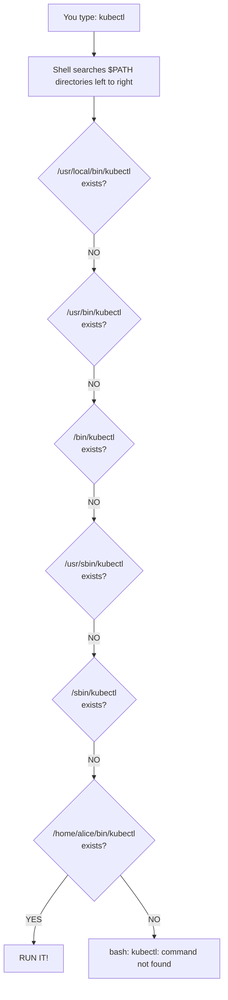
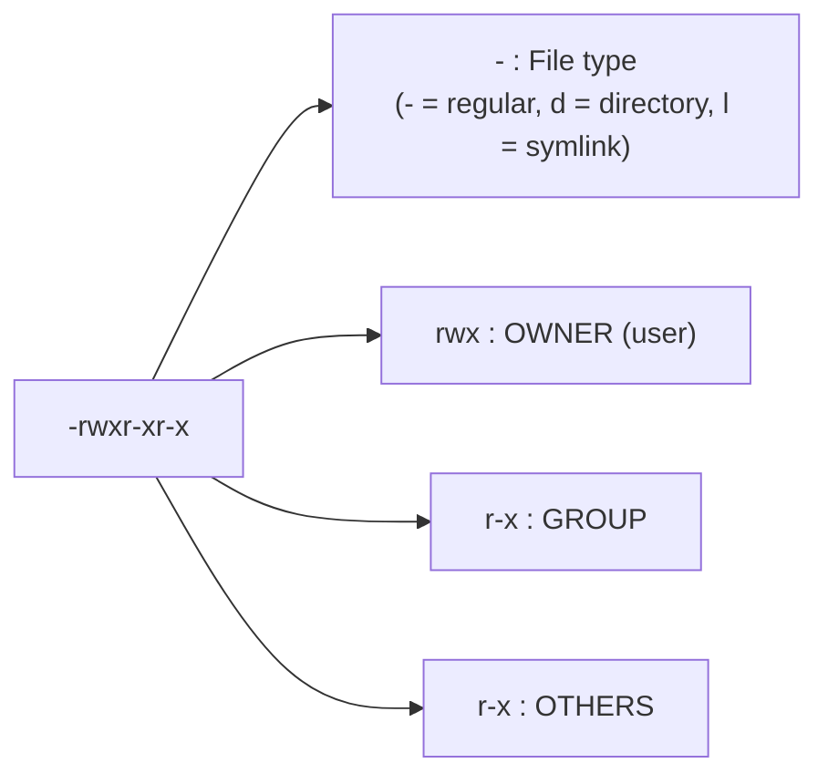

# Module 0.2: Environment & Permissions (Who You Are & Where You Are)

> **Everyday Use** | Complexity: `[QUICK]` | Time: 45 min | This practical lesson focuses on diagnosing the identity, lookup, inheritance, and permission failures that make everyday Linux work feel unpredictable.

## Prerequisites

Before starting this module, make sure you can move around the filesystem, run simple commands, and edit a user-owned text file without using elevated privileges.

- **Required**: [Module 0.1: The CLI Power User](../module-0.1-cli-power-user/)
- **Environment**: Any Linux system, including a VM, WSL, or native install
- **Helpful**: Basic comfort with `cd`, `ls`, command history, and editing a text file

## Learning Outcomes

After this module, you will be able to perform these troubleshooting tasks in a terminal session and explain the reasoning behind each repair.

- **Configure** shell environment variables such as `PATH`, `HOME`, `PS1`, `EDITOR`, and `KUBECONFIG` so child commands inherit the settings you intend.
- **Debug** command lookup failures by tracing how the shell searches `PATH`, resolves aliases, and treats explicit paths such as `./deploy.sh`.
- **Evaluate** file permission strings and numeric modes so you can choose least-privilege settings for scripts, directories, SSH material, and shared project files.
- **Diagnose** ownership and privilege problems with `ls -l`, `chmod`, `chown`, `chgrp`, and targeted `sudo` commands without turning a small fix into a root-owned mess.

## Why This Module Matters

In 2024, a small platform team lost most of a release window because a deployment helper existed on disk, passed code review, and still refused to run on the production jump host. The engineer on call tried `deploy.sh` and got one error, tried `./deploy.sh` and got another, then escalated to a root shell because the clock was moving and the rollback window was closing. The immediate outage cost was measured in delayed customer migrations rather than a public headline, but the internal post-incident review found a familiar chain: unclear `PATH`, missing execute permission, a file edited with `sudo`, and a service account that could no longer read its own configuration.

```text
bash: ./deploy.sh: Permission denied
```

```text
bash: deploy.sh: command not found
```

Those symptoms feel unrelated when you are new to Linux. "Command not found" sounds like a missing file, "Permission denied" sounds like a hostile operating system, and `sudo` feels like a universal escape hatch. In reality, all three are usually signs that Linux is doing exactly what it was designed to do: separating identity, location, inheritance, and authority. The shell needs a search path before it can find a command by name, the kernel needs an execute bit before it can run a file as a program, and privileged operations need an accountable way to borrow root power.

The same mental model follows you into Kubernetes 1.35 and newer. A container still runs as a user, a mounted Secret still has file modes, a ServiceAccount still needs scoped authority, and a command launched with a broken environment still behaves like any other child process. This module gives you a practical way to reason about those failures before the pressure is high. You will learn to ask who is running, where the command is found, which variables are inherited, which permission bit is missing, and whether `sudo` is solving the actual problem or hiding it.

## 1. The Environment Is a Contract Between Parent and Child

Environment variables are not magic shell decorations. They are name-value pairs that a process carries around and optionally passes to the processes it starts. Your terminal shell has an environment, every command you run receives an environment, and each child process gets a copy rather than a live connection back to the parent. That copy-on-start behavior is why environment bugs can be confusing: a value may look correct in your current prompt while a script, editor, daemon, or test process sees something different.

Think of the environment like the settings sheet handed to a contractor at the start of a job. It says where home base is, which editor to open, what language to use, where commands are searched, and which cluster configuration should be read. If the sheet is wrong or never handed over, the contractor does not know your intentions. Linux will not guess that a deployment script needs your unexported variable, and it will not search your Downloads folder just because you recently saved a binary there.

The basic inspection commands are deliberately simple. `env` and `printenv` show exported environment variables, while `echo $NAME` asks the shell to expand a specific variable before the command runs. The dollar sign matters because it tells the shell, not the program, to substitute the variable's value. That distinction becomes important later when you debug scripts that behave differently from the commands you type by hand.

```bash
# See ALL your environment variables (there are a lot!)
env

# Or use printenv for the same thing
printenv

# See just one specific variable - the $ says "give me the value"
echo $USER
echo $HOME
```

The most useful variables are not useful because they are exotic; they are useful because so many tools quietly depend on them. `$HOME` tells programs where to store user-level configuration, `$SHELL` explains which shell was assigned to your account, `$PWD` tracks the current working directory, and `$PATH` determines how command names become executable files. `$EDITOR` and `$KUBECONFIG` are especially common in operations work because tools need to know which editor to launch and which Kubernetes cluster configuration to read.

| Variable | What It Stores | Example Value |
| :--- | :--- | :--- |
| `$USER` | Your current username | `alice` |
| `$HOME` | Path to your home directory | `/home/alice` |
| `$SHELL` | Your default shell program | `/bin/bash` |
| `$PWD` | Your current working directory | `/home/alice/projects` |
| `$EDITOR` | Your preferred text editor | `vim` or `nano` |
| `$LANG` | Your language and encoding | `en_US.UTF-8` |
| `$HOSTNAME` | The name of this machine | `web-server-01` |
| `$TERM` | Your terminal type | `xterm-256color` |
| `$PATH` | Where to find commands | A colon-separated directory list |

Run a few checks on your own machine and read the output as a status report, not as trivia. If `$HOME` is unexpected, tools may write config in a surprising place. If `$SHELL` is not the shell whose startup file you edited, your aliases may never load. If `$PWD` is not where you think you are, relative paths will point to the wrong files. These checks are small, but they build the habit of confirming assumptions before reaching for broader fixes.

```bash
echo "Hello, $USER! You are on $HOSTNAME."
echo "Your home is $HOME and your shell is $SHELL."
echo "You are currently in $PWD."
```

Pause and predict: if a script prints an empty value for `$PROJECT_NAME` but your prompt prints the expected value, what process boundary should you investigate first? The right answer is usually not "the script is broken." It is usually "the variable exists in the parent shell but was never exported to the child process," or "the command was launched from a different shell that never loaded the same configuration."

`PS1` deserves special mention because it proves that environment and shell settings overlap but are not identical. `PS1` controls the interactive prompt in shells such as Bash, and changing it can help you display the current directory, cluster name, or user. However, prompt changes are a convenience for humans, not a permission control. A prompt that says `prod` does not prove your commands target production, and a prompt that says `dev` does not protect you from a dangerous `KUBECONFIG`.

When you set a variable in the current shell without `export`, the shell can expand it, but child processes do not automatically receive it. When you export a variable, you mark it for inheritance so future child processes receive a copy at startup. The distinction is easy to demonstrate and worth practicing until it becomes instinctive, because many deployment failures are caused by a local value that never left the parent shell.

```bash
# Setting a variable WITHOUT export
GREETING="Hello from parent"
echo $GREETING        # Works! Prints: Hello from parent
bash                  # Start a child shell (a new process)
echo $GREETING        # Nothing! Empty! The child does not know about it
exit                  # Return to parent shell

# Setting a variable WITH export
export GREETING="Hello from parent"
echo $GREETING        # Works! Prints: Hello from parent
bash                  # Start a child shell
echo $GREETING        # Works! Prints: Hello from parent
exit                  # Return to parent shell
```

Use unexported variables for values that only your current shell needs, such as a temporary file name used in one interactive sequence. Use exported variables for values that programs need to read after they start. Kubernetes work commonly uses exported `KUBECONFIG`, editor tooling commonly uses exported `EDITOR`, and language toolchains often use exported variables such as `JAVA_HOME`. The rule is not about importance; it is about whether a child process must see the value.

```bash
# Common exports you will see in Kubernetes work
export KUBECONFIG=~/.kube/config
export EDITOR=vim
export JAVA_HOME=/usr/lib/jvm/java-17

# Quick throwaway - no export needed
BACKUP_DATE=$(date +%Y-%m-%d)
echo "Backing up for $BACKUP_DATE"
```

If a value should no longer exist, remove it instead of setting it to a blank value and hoping every tool interprets that blank the same way. `unset` deletes the variable from the current shell, and future children will not inherit it unless you set it again. This is especially useful when you stop using a temporary cluster config or a one-off build flag and want to return to normal behavior.

```bash
# Remove a variable entirely
unset GREETING
echo $GREETING    # Nothing - it is gone
```

## 2. PATH Turns Command Names Into Files

When you type `ls`, the shell does not search your entire disk. It walks through the directories listed in `$PATH`, from left to right, and runs the first executable file with the matching name. This is a performance decision and a security decision. It keeps command lookup predictable, and it prevents arbitrary files in random directories from being treated as commands just because they happen to share a name with something you typed.

```bash
echo $PATH
```

You will usually see a colon-separated list. Each directory is a place the shell is allowed to search by command name. The order matters because the first match wins, which is why putting a custom directory before `/usr/bin` can intentionally override a system command, while putting it after `/usr/bin` keeps the system command as the default.

```text
/usr/local/bin:/usr/bin:/bin:/usr/sbin:/sbin:/home/alice/bin
```

Here is the lookup process when you type a command such as `kubectl`. In KubeDojo labs we define the standard shortcut with `alias k=kubectl` or the quoted form `alias k='kubectl'`, and after that point you can use commands such as `k get pods` when the module asks you to inspect Kubernetes resources. The alias is a shell shortcut, but the underlying lookup still depends on an executable named `kubectl` being found in `PATH`.



This explains why `./deploy.sh` and `deploy.sh` can fail differently while referring to the same file. `deploy.sh` is only a command name, so the shell searches `PATH` and does not automatically include the current directory. `./deploy.sh` is an explicit relative path, so the shell skips `PATH` lookup and asks the kernel to run the file at that location. If the file exists but lacks execute permission, the problem has moved from command lookup to file mode.

```bash
# which - shows the full path of a command
which ls
# Output: /usr/bin/ls

which python3
# Output: /usr/bin/python3

# type - shows what the shell thinks a command is
type ls
# Output: ls is aliased to 'ls --color=auto'   (if aliased)
# Output: ls is /usr/bin/ls                    (if not)

type cd
# Output: cd is a shell builtin                (built into bash itself)
```

`which` is useful, but `type` is often better during shell debugging because it can reveal aliases, functions, and builtins. If `type k` says the command is an alias, the shell expands it before normal lookup continues. If `type cd` says the command is a builtin, there is no external executable to find. This layered resolution model is why "command not found" is only one possible failure among several, and why the first diagnostic step should be identifying what the shell believes the word means.

Adding a personal script directory to `PATH` is normal, but the placement is a deliberate choice. Put your directory at the front when you intentionally want your tool to win over a system tool with the same name. Put it at the end when you want system tools to keep priority. In either case, use an absolute or home-relative directory, and make the change permanent only after you have tested the temporary export in the current shell.

```bash
# Temporary - lasts until you close the terminal
export PATH="$HOME/bin:$PATH"

# Verify it worked
echo $PATH
# Now /home/alice/bin appears at the front
```

Do not add the current directory, `.`, to the beginning of `PATH`. The convenience looks harmless until you stand in a directory controlled by someone else. A malicious executable named `ls`, `ssh`, or `kubectl` can then win command lookup simply because the shell checks the current directory first. Saving two characters with `./` is not worth allowing untrusted directories to become command sources.

War Story: a team inherited an old build host where root's `PATH` began with `.` because an administrator wanted local helper scripts to feel convenient. During an incident, a temporary directory contained a file named `ls` from a failed tool extraction. A root shell entered that directory and ran `ls`, which executed the local file instead of `/usr/bin/ls`. The compromise was contained quickly, but the root cause was not an advanced exploit; it was command lookup order combined with unnecessary root authority.

Before running this, what output do you expect from `type deploy.sh` when `deploy.sh` exists in the current directory but no directory in `PATH` contains that name? If you expect "command not found," you are tracking the shell's perspective correctly. Existence in the current directory is not enough for name-based lookup, and the shell does not treat visible files as commands unless the path rules say it should.

## 3. Startup Files Make Settings Persistent

Interactive shell changes disappear when the shell exits because they live in process memory. To keep aliases, exports, prompt settings, and `PATH` additions across new terminals, you place them in startup files that your shell reads when it begins. The confusing part is that "a new shell" does not always mean the same kind of shell. SSH sessions, graphical terminal tabs, login shells, and non-login interactive shells can read different files depending on the shell program and operating system defaults.

```mermaid
flowchart TD
    subgraph Login ["LOGIN SHELL (SSH session, first terminal on Linux)"]
        L1["Runs: /etc/profile<br/>then the FIRST one found of:<br/>~/.bash_profile<br/>~/.bash_login<br/>~/.profile"]
        L2>Think: "Welcome! Let me set up your entire session."]
        L1 --> L2
    end

    subgraph NonLogin ["INTERACTIVE NON-LOGIN SHELL (new terminal tab/window on desktop)"]
        N1["Runs: ~/.bashrc"]
        N2>Think: "Just another shell, here are your shortcuts."]
        N1 --> N2
    end
```

For Bash users, the common operational pattern is to keep interactive settings in `~/.bashrc` and make `~/.bash_profile` source it. That way, login shells and non-login interactive shells converge on the same practical configuration. For Zsh users, especially on macOS, `~/.zshrc` is the usual place for interactive aliases and exports. The exact file matters less than verifying which shell you use and which startup path it actually reads.

```bash
# Contents of ~/.bash_profile
if [ -f ~/.bashrc ]; then
    source ~/.bashrc
fi
```

Reloading matters because editing a startup file does not change the environment of the already-running shell. A shell reads its startup files at startup, then continues with its in-memory state. If you add `export PATH="$HOME/bin:$PATH"` to `~/.bashrc`, the current prompt will not notice until you source the file or start a new interactive shell. This detail explains many "I edited the file but nothing changed" reports.

```bash
# Reload .bashrc immediately
source ~/.bashrc

# Shorthand (does the same thing)
. ~/.bashrc
```

Aliases are expanded by the interactive shell before the command is executed. They are excellent for repeatable shortcuts, but they are not a replacement for scripts when logic becomes conditional or multi-line. In this module, the important alias is `k='kubectl'`, which is the short form used throughout KubeDojo after the alias has been defined. If a lab says `k get pods`, it means the shell expands `k` to `kubectl` before command execution, and Kubernetes 1.35 command behavior comes from the real CLI.

```bash
# Create an alias
alias ll='ls -la'
alias ..='cd ..'
alias ...='cd ../..'
alias cls='clear'
alias ports='ss -tulnp'
alias myip='curl -s ifconfig.me'
```

These aliases are typical because they shorten commands people run constantly, but they also show the boundary of alias usefulness. `ll` is a harmless display preference, while `rm='rm -i'` changes safety behavior and deserves a team convention. Aliases are personal shell features, so they should never be required for automation unless the script defines its own behavior explicitly. A CI job should call the real command or a committed wrapper script, not depend on someone's private `.bashrc`.

```bash
# Kubernetes - the k alias is used throughout KubeDojo
alias k='kubectl'
alias kgp='kubectl get pods'
alias kgs='kubectl get svc'
alias kgn='kubectl get nodes'
alias kaf='kubectl apply -f'
alias kdel='kubectl delete -f'
alias klog='kubectl logs -f'

# Docker
alias dps='docker ps'
alias dimg='docker images'
alias dex='docker exec -it'

# Safety nets - ask before overwriting
alias cp='cp -i'
alias mv='mv -i'
alias rm='rm -i'

# Quick system info
alias meminfo='free -h'
alias diskinfo='df -h'
alias cpuinfo='lscpu'
```

Make aliases permanent by placing them in your startup file, then reload the file in the current shell. If an alias works immediately after you type it but disappears tomorrow, persistence is the issue. If an alias still does not work after sourcing the file, inspect the shell type, the startup file path, and whether a later line redefines or removes it.

```bash
# Open your .bashrc and add aliases at the bottom
nano ~/.bashrc

# After adding aliases, reload
source ~/.bashrc
```

You also need to know how to inspect and bypass aliases, because they can hide the real command during debugging. A backslash before a command disables alias expansion for that invocation, while `command ls` asks the shell to run the command without shell functions. This is useful when a safety alias or display alias makes output differ from a script, another user's terminal, or a production host.

```bash
# See all your current aliases
alias

# See what a specific alias expands to
alias ll
# Output: alias ll='ls -la'

# Temporarily bypass an alias (use the real command)
\ls
command ls

# Remove an alias for this session
unalias ll
```

Which approach would you choose here and why: add `~/downloads` to `PATH`, move one trusted binary into `~/bin`, or run it by explicit path from `~/downloads`? For a one-time tool, explicit path is usually clearest. For a trusted personal tool you use every week, `~/bin` is reasonable. Adding a general downloads directory to `PATH` is weak because downloads are often unreviewed and cluttered.

---

## 4. Permissions Decide What Identity Can Do

Linux permissions exist because Linux is a multi-user operating system even when only one human logs in. System services run as separate users such as `www-data`, `postgres`, or `systemd-network`, and those identities limit damage when one process is compromised. A web server should not read your SSH private key, a database should not rewrite your shell startup file, and a deployment script should not become editable by every account on the machine.

```bash
ls -l /etc/passwd /bin/ls /home

# Output looks like:
# -rwxr-xr-x 1 root root  142144 Sep 5 2023 /bin/ls
# -rw-r--r-- 1 root root    2775 Mar 10 14:22 /etc/passwd
# drwxr-xr-x 3 root root    4096 Mar 10 14:22 /home
```

The first column in `ls -l` is a compact permission report. The first character tells you the file type, and the next nine characters are grouped into owner, group, and others. Each group has read, write, and execute positions. That string is not just display text; it is the fastest way to decide whether the user running a command has the authority needed for the action being attempted.



File and directory permissions use the same letters, but the directory meanings are different enough to cause real bugs. Read on a directory lets you list names. Execute on a directory lets you traverse into it and access known names. Write on a directory lets you create, delete, and rename entries inside it. That means a file can be writable while the containing directory blocks deletion, or a directory can be enterable while its contents cannot be listed.

| Permission | On a File | On a Directory |
| :--- | :--- | :--- |
| `r` (read) | View the file contents with `cat` or `less` | List the directory contents with `ls` |
| `w` (write) | Modify or overwrite the file | Create, rename, or delete files inside it |
| `x` (execute) | Run the file as a program | Enter the directory with `cd` |
| `-` (none) | Cannot do the action | Cannot do the action |

The directory distinction is why `Permission denied` can appear even when a file itself looks readable. If you cannot traverse one parent directory on the path, Linux cannot reach the file on your behalf. A directory without execute permission is like a locked hallway. A directory with execute but without read is like a hallway you can walk through only if you already know the exact door name.

| String | Owner | Group | Others | Meaning |
| :--- | :--- | :--- | :--- | :--- |
| `-rwxr-xr-x` | rwx | r-x | r-x | Typical program: everyone can run it, only owner can edit |
| `-rw-r--r--` | rw- | r-- | r-- | Typical config file: everyone can read, only owner can edit |
| `-rw-------` | rw- | --- | --- | Private file: only owner can read and write |
| `-rwx------` | rwx | --- | --- | Private script: only owner can run it |
| `drwxr-xr-x` | rwx | r-x | r-x | Typical directory: everyone can enter and list, only owner can modify |
| `drwx------` | rwx | --- | --- | Private directory: only owner can enter |

`chmod` changes the mode, which is the permission bit pattern. Symbolic mode is readable and minimizes mistakes when you only need one adjustment, such as adding execute permission for the owner. Numeric mode is compact and precise when you want to set the full owner, group, and others pattern in one operation. Both are valid; the operational skill is choosing the one that makes the intended change obvious.

```bash
# Make a script executable for the owner
chmod u+x deploy.sh

# Remove write permission from group and others
chmod go-w config.yaml

# Give everyone read permission
chmod a+r README.md

# Set exact permissions - owner gets rwx, everyone else gets nothing
chmod u=rwx,go= secret-script.sh

# Add execute for everyone
chmod +x run-tests.sh        # Without specifying who, + applies to all

# Remove all permissions from others
chmod o= private-notes.txt   # = with nothing after it means "set to nothing"
```

Numeric mode comes from adding read as 4, write as 2, and execute as 1 for each of owner, group, and others. A 7 means all three bits, a 6 means read plus write, a 5 means read plus execute, and a 0 means no permission. Once you see the bits, values such as `755`, `644`, `600`, and `700` become descriptions rather than memorized magic numbers.

```text
Permission  Binary  Decimal
---------   -----   -------
  ---        000       0     (no permissions)
  --x        001       1     (execute only)
  -w-        010       2     (write only)
  -wx        011       3     (write + execute)
  r--        100       4     (read only)
  r-x        101       5     (read + execute)
  rw-        110       6     (read + write)
  rwx        111       7     (read + write + execute)
```

```bash
# 755 - owner: rwx (7), group: r-x (5), others: r-x (5)
# Standard for scripts and programs
chmod 755 deploy.sh

# 644 - owner: rw- (6), group: r-- (4), others: r-- (4)
# Standard for regular files
chmod 644 config.yaml

# 600 - owner: rw- (6), group: --- (0), others: --- (0)
# Private files (SSH keys, passwords)
chmod 600 ~/.ssh/id_rsa

# 700 - owner: rwx (7), group: --- (0), others: --- (0)
# Private directories, private scripts
chmod 700 ~/.ssh

# 444 - owner: r-- (4), group: r-- (4), others: r-- (4)
# Read-only for everyone
chmod 444 important-record.txt
```

Pause and predict: you have a directory where users should be able to enter and list files but must not create or delete anything. Which bits are required on the directory, and which bit must be absent? Read plus execute are required for listing and traversal, while write must be absent. For owner-only access that pattern is `500`; for a typical shared read-only directory it may appear as `755` when the owner still needs write permission.

| Pattern | Numeric | Use Case |
| :--- | :--- | :--- |
| `rwxr-xr-x` | `755` | Programs, scripts, directories |
| `rw-r--r--` | `644` | Regular files, config files |
| `rw-------` | `600` | SSH private keys, secret-like local files |
| `rwx------` | `700` | SSH directory, private scripts |
| `rwxrwxr-x` | `775` | Shared project directories |
| `rw-rw-r--` | `664` | Shared project files |

The wrong reflex is `chmod 777` because it appears to fix everything at once. It does, but by granting every user read, write, and execute access. On a shared host, that means another account can replace your script before you run it. In a container image, it can turn a minor application compromise into persistent tampering. Least privilege is not ceremony; it is the discipline of granting the missing bit to the identity that actually needs it.

## 5. Ownership, Groups, and Sudo Connect Identity to Authority

Every file has an owner and a group, and permissions are evaluated against the identity of the process trying to act. If the process user is the owner, owner bits apply. If the process is not the owner but belongs to the file's group, group bits apply. If neither condition matches, the others bits apply. This is why changing ownership can be more secure than widening "others" permissions for everyone on the system.

```bash
# Check ownership
ls -l myfile.txt
# -rw-r--r-- 1 alice developers 1024 Mar 10 14:22 myfile.txt
#               ^^^^^  ^^^^^^^^^^
#               owner  group
```

Changing a file's owner usually requires root authority because ownership affects disk quotas, accountability, and access control. If any user could give large files to someone else, they could evade quotas or frame another account for storage usage. Group changes are sometimes allowed without `sudo` when you own the file and belong to the target group, but ownership changes should still be treated as security decisions rather than routine cleanup.

```bash
# Change owner (requires sudo because you are giving away a file)
sudo chown bob myfile.txt
```

When a team shares project files, the group is often the cleanest unit of access. You can keep the owner as the human or service that manages the file, then set the group to `developers`, `webteam`, or another role-specific group. The file mode can grant the group read or write permission without opening access to every other account. This pattern maps well to services because system accounts can be placed in narrow groups rather than being given broad world-readable access.

```bash
# Change group only
sudo chgrp developers myfile.txt

# Change both at once - user:group
sudo chown bob:developers myfile.txt

# Change ownership of a directory and EVERYTHING inside it (-R = recursive)
sudo chown -R alice:webteam /var/www/mysite

# Change only the group (useful if you are a member of the target group)
chgrp devops deployment.yaml     # No sudo needed if you belong to "devops"
```

Recursive ownership changes deserve extra caution because they turn one command into hundreds or thousands of file changes. If the target path is wrong, `-R` spreads the mistake quickly. Before using `sudo chown -R`, run `ls -ld` on the directory, confirm the path, and consider whether only one subdirectory actually needs the change. When a service cannot read a file, the better first question is "which identity is the service using?" rather than "how do I make everything writable?"

Linux has one special user named `root`, with user ID 0. Root can override normal permissions, manage services, install packages, bind privileged ports, and change system configuration. That power is necessary for administration, but it is also why routine work as root is dangerous. A typo that merely fails as a normal user can destroy important files as root, and a root-owned file accidentally created in your home directory can break applications that later run under your normal account.

```bash
# Install a package (requires root)
sudo apt update
sudo apt install nginx

# Edit a system file (requires root)
sudo nano /etc/hosts

# Restart a service (requires root)
sudo systemctl restart nginx

# See who you become when you use sudo
sudo whoami
# Output: root
```

`sudo` is the preferred way to borrow root authority for a specific command because it leaves an audit trail and keeps the privileged action narrow. It asks for your password because it is verifying the authorized user at the keyboard, not because it knows or needs the root password. A targeted `sudo systemctl restart nginx` is much safer than starting a long-lived root shell and then forgetting which prompt is privileged.

```bash
# See your sudo privileges
sudo -l

# Common output shows something like:
# (ALL : ALL) ALL         - you can do anything as any user
# (ALL) NOPASSWD: ALL     - you can do anything without a password (common on cloud VMs)
```

The `/etc/sudoers` policy controls who may use `sudo`, and it should be edited with `visudo` rather than a normal editor. `visudo` checks syntax before saving because a broken sudoers file can lock administrators out of privileged access. On Debian and Ubuntu systems, membership in the `sudo` group usually grants sudo access. On RHEL, CentOS, and Fedora families, the equivalent group is often `wheel`.

```bash
# Check what groups you belong to
groups
# Output: alice sudo docker

# If "sudo" or "wheel" is in the list, you can use sudo
```

Safe sudo usage starts by asking whether privilege is actually required. Reading your own file, editing your own notes, and running a script in your home directory should not need root. If you use `sudo vim notes.txt`, the file may be created or saved as root-owned, leaving your normal account unable to edit it later. This is one of the most common self-inflicted permission problems on development machines.

```bash
# DO: Use sudo for specific commands that need it
sudo systemctl restart nginx

# DO NOT: Start a root shell and work in it
sudo -i        # Avoid this - you lose the safety net of per-command authorization
sudo su -      # Avoid this too - same problem

# DO NOT: Use sudo for things that do not need it
sudo cat myfile.txt    # If you own the file, just use cat!
sudo vim notes.txt     # The file will end up owned by root - now YOU cannot edit it
```

War Story: a junior engineer once ran `sudo vim` to edit a config file in their home directory because they had recently used sudo for a system service and stayed in the habit. The file became owned by root. Hours later, an application running as the normal user crashed with `Permission denied` while reading that config, and the team investigated application code before noticing ownership. The fix was one `chown`, but the lesson was sharper: use privilege for the command that needs it, then put it down.

There is one more sudo trap worth knowing early. Shell redirection happens in your current shell before `sudo` runs the command, so `sudo echo "line" >> /etc/hosts` still asks the unprivileged shell to open `/etc/hosts` for appending. Use `sudo tee -a /etc/hosts` instead when the privileged operation is the write itself. That pattern keeps the privilege narrow while moving it to the process that opens the protected file.

## Patterns & Anti-Patterns

The healthy pattern across environment and permissions work is to diagnose in the same layer where the failure occurs. If a command name fails, inspect `type`, `which`, and `PATH` before changing permissions. If an explicit path fails, inspect `ls -l` and parent directory traversal before using `sudo`. If a service cannot read a file, inspect the service user and group before broadening access for everyone. This layered approach avoids the common habit of applying root authority to every unknown error.

For personal shell setup, prefer small, reviewable startup file changes. Add `~/bin` to `PATH` only when it contains tools you trust and maintain. Keep aliases in one startup file, source it intentionally, and use `type` to confirm what the shell will execute. If a shortcut becomes part of a team workflow, move it into documentation or a committed script so the behavior does not depend on one person's terminal history.

For file permissions, prefer symbolic changes when the current mode is mostly right and numeric modes when the target state must be exact. `chmod u+x script.sh` communicates "make this executable for the owner" without disturbing group and others bits. `chmod 600 ~/.ssh/id_rsa` communicates "set this private key to owner read-write only" and avoids accidental leftover access. Both are precise because they say what problem they solve.

For shared access, prefer groups over world permissions. A project directory owned by `alice:developers` with group write can support collaboration without giving every local account the same authority. If the group approach becomes hard to reason about, write down the intended identities: who edits, who reads, who executes, and who only traverses. Permissions are easier when they reflect a real role model instead of a sequence of emergency chmod commands.

The major anti-pattern is treating `sudo` as a debugging tool rather than an authority boundary. `sudo` can make a command succeed by bypassing permission checks, but that does not prove the original user had the right access, and it can leave root-owned files behind. Another anti-pattern is widening permissions until the error disappears, especially with `777`. The error disappearing is not the same as the system being correct; it may mean the system is now too open to notice the original mistake.

Another anti-pattern is hiding security-sensitive assumptions in shell startup files. A `.bashrc` that silently changes `KUBECONFIG`, prepends untrusted directories to `PATH`, or aliases destructive commands to unexpected behavior can make one terminal behave differently from another. Keep important context visible, confirm it before sensitive actions, and remember that scripts and non-interactive shells often do not read the same files as your interactive prompt.

## Decision Framework

Start with the error boundary. If the shell says `command not found`, ask whether you typed a command name or a path. For command names, run `type name`, inspect `PATH`, and decide whether the tool belongs in an existing searched directory, a trusted personal directory, or should be run by explicit path. Do not use `chmod` to fix a lookup problem, because execute permission is irrelevant until the shell has resolved the file to execute.

If the shell found the file but the kernel says `Permission denied`, inspect `ls -l file` and `ls -ld` on the parent directories. Add execute permission only when the file should be runnable, and add directory execute permission only when users should traverse that directory. If the file is owned by the wrong user or group, correct ownership instead of granting broad access. If the operation touches system paths, use a targeted `sudo` command rather than opening a root shell.

For persistence questions, separate "works now" from "loads later." A command typed at the prompt changes only the current shell unless it edits a startup file. A startup file change affects future shells only after startup or an explicit `source`. If a child process cannot see a variable, check `export`. If a new terminal cannot see an alias, check which shell started and which startup file it read. This framework keeps fixes small and reversible.

Use the following mental flow during incidents: first identify the actor, then identify the path, then identify the permission bit, then identify whether privilege is necessary. The actor is the process user, not necessarily you. The path may be explicit or found through `PATH`. The bit may belong to a file or a directory. Privilege is the last step, not the first, because root can hide the evidence you need to make the lasting fix.

When the failure involves Kubernetes tooling, keep the same sequence instead of treating the cluster as a different universe. If `k get pods` fails before contacting the API server, the problem may be the local alias, the `kubectl` binary lookup, or the exported `KUBECONFIG` value. If a pod starts but cannot read a mounted file, inspect the container user, `runAsUser`, `runAsGroup`, filesystem mode, and directory traversal bits before changing application code. If an operation reaches the API server and returns an authorization error, you have moved beyond Unix file permissions into ServiceAccount and RBAC policy, but the diagnostic habit is still the same: name the actor, name the resource, then inspect the rule that connects them.

During reviews, ask for the smallest command that proves the theory. `type command` proves lookup. `env | grep NAME` proves exported process environment better than a shell-only echo. `ls -ld parent child` proves directory traversal and file bits together. `id` proves user and group membership. `sudo -l` proves privilege policy without changing any files. These checks are boring in the best possible way, because they narrow the problem before anyone changes ownership, widens mode bits, or starts a privileged shell.

If you are unsure which branch of the framework applies, reproduce the failure with the most explicit command you can write. Replace a command name with an absolute path, replace a shell-only variable check with an exported child-process check, and replace a broad permission change with a read-only inspection command. Each substitution removes one possible explanation without mutating the system. That discipline is what separates controlled troubleshooting from accidental configuration drift. Keep a short incident note beside each command.

## Did You Know?

- The `$PATH` variable became a standard part of Unix practice early in Unix history, and Unix Version 7 from 1979 is a common reference point for the environment model many modern shells still resemble. Before command search paths became normal, users had to type more full paths or rely on a smaller set of built-in conventions.
- Numeric permissions such as `755` are octal, which means each digit represents three binary bits. Read, write, and execute are simply `4`, `2`, and `1`, so `7` is not a mysterious privilege level; it is the sum of all three allowed actions.
- `sudo` normally logs invocations through the system logging stack, commonly into authentication logs such as `/var/log/auth.log` on Debian and Ubuntu or `/var/log/secure` on RHEL-family systems. The command is designed for accountable privilege, not invisible privilege.
- The root user's home directory is normally `/root`, not `/home/root`. That path difference is a practical reminder that root is a special administrative identity, not just another regular user with a higher number of permissions.

## Common Mistakes

| Mistake | Why It Happens | How to Fix It |
| :--- | :--- | :--- |
| "command not found" for a script in the current directory | The current directory `.` is not in `$PATH`, so typing `script.sh` makes the shell search only configured directories. | Run it with `./script.sh` for an explicit path, or move a trusted reusable script into a directory already listed in `$PATH`. |
| "Permission denied" when running a script | The file exists, but it does not have execute permission for the user, group, or others category that applies to your process. | Run `ls -l script.sh`, then use `chmod u+x script.sh` or a precise numeric mode such as `755` when that matches the intended sharing model. |
| Alias disappears after closing the terminal | The alias was defined only in the running shell process, so the next shell starts without it. | Add the `alias` line to the correct startup file such as `~/.bashrc` or `~/.zshrc`, then run `source ~/.bashrc` or open a new terminal. |
| Exported value does not reach a program | The value was assigned without `export`, or the program was launched from a different shell that never received the value. | Use `export NAME=value` before starting the child process, or pass a one-command environment assignment such as `NAME=value command`. |
| Using `sudo vim` to edit files you own | The editor runs as root and can create or save files with root ownership in your working tree or home directory. | Edit files you own without `sudo`; if damage already happened, inspect with `ls -l` and repair ownership with a targeted `sudo chown $USER file`. |
| Running as root all the time with `sudo -i` or `sudo su -` | A root shell feels convenient because it avoids repeated prompts, but it removes the per-command pause that catches mistakes. | Use `sudo` for the specific command that needs privilege, then return to normal user operations immediately. |
| Applying `chmod 777` to "fix" permissions | It removes the error by granting everyone full access, including users who should never edit or execute the file. | Determine the missing bit and the affected identity, then grant the narrowest useful mode such as `u+x`, `644`, `755`, `600`, or a group-specific setting. |
| Forgetting directory permissions during file debugging | The file mode looks correct, but one parent directory lacks execute permission or the containing directory blocks creation and deletion. | Check each relevant directory with `ls -ld`, remember that directory write controls create/delete, and adjust the directory mode rather than the file mode when appropriate. |

## Quiz

<details><summary><strong>Q1 [Outcome: Debug command lookup]</strong>: A junior developer downloads a binary named <code>kubens</code> into <code>~/downloads</code>. They type <code>kubens</code> and get "command not found", even though <code>ls ~/downloads</code> shows the file. What do you check, and what fix would you choose?</summary>

The shell is searching `PATH`, not every directory where files happen to exist, and `~/downloads` is normally not in `PATH`. First run `type kubens` or inspect `echo $PATH` to confirm the lookup failure. For one-time use, run the binary by explicit path such as `~/downloads/kubens`; for a trusted tool used regularly, move it into `~/bin` or another searched directory. Adding a general downloads directory to `PATH` is weaker because downloads often contain unreviewed files.
</details>

<details><summary><strong>Q2 [Outcome: Configure inherited environment]</strong>: You set <code>PROJECT_NAME=kubedojo-lab</code>, confirm that <code>echo $PROJECT_NAME</code> works, and then a child script prints an empty value. Why can both observations be true?</summary>

The current shell can expand a variable that exists only in its own shell state, but child processes inherit only exported variables. The script starts as a separate process, so it receives a copy of the exported environment at launch time. If `PROJECT_NAME` was not exported, the script has no value to read even though the parent prompt can still echo it. Use `export PROJECT_NAME=kubedojo-lab` before starting the script when the child process must see it.
</details>

<details><summary><strong>Q3 [Outcome: Evaluate permissions]</strong>: A script has mode <code>-rw-r--r--</code>. Running <code>script.sh</code> returns "command not found", while running <code>./script.sh</code> returns "Permission denied". Explain both failures and the smallest likely fix.</summary>

The first command uses name-based lookup, so the shell searches `PATH` and does not automatically search the current directory. The second command provides an explicit relative path, so lookup succeeds, but the kernel refuses to execute the file because no execute bit is set. The smallest likely fix is `chmod u+x script.sh` if only the owner should run it, followed by `./script.sh`. Moving the file into `PATH` is a separate decision and should be reserved for trusted reusable commands.
</details>

<details><summary><strong>Q4 [Outcome: Diagnose directory permission]</strong>: A directory is <code>drwxr-x---</code> and owned by <code>root:devops</code>. Bob belongs to <code>devops</code> and can list the directory, but <code>touch /opt/scripts/new.sh</code> fails. Which bit is missing?</summary>

Bob is using the group permission triplet because he is a member of `devops`, and that triplet is `r-x`. Read lets him list names, and execute lets him traverse into the directory, but write is required to create, delete, or rename entries inside the directory. The missing bit is group write on the directory, not on a file that does not exist yet. A fix such as `sudo chmod g+w /opt/scripts` may be appropriate only if the group should truly manage entries there.
</details>

<details><summary><strong>Q5 [Outcome: Use sudo narrowly]</strong>: You need to append one line to <code>/etc/hosts</code>. Why does <code>sudo echo "10.0.0.5 myserver" >> /etc/hosts</code> still fail, and what should you run instead?</summary>

The shell performs `>> /etc/hosts` before `sudo` starts `echo`, so the unprivileged shell is the process trying to open the protected file for writing. `sudo` only applies to `echo`, which is not the operation being denied. A safer fix is `echo "10.0.0.5 myserver" | sudo tee -a /etc/hosts`, because `tee` runs with privilege and performs the append. This keeps the privileged operation narrow without opening a full root shell.
</details>

<details><summary><strong>Q6 [Outcome: Diagnose ownership]</strong>: After editing a project config with <code>sudo vim</code>, your normal application process can no longer update the file. <code>ls -l</code> shows the owner is <code>root</code>. What happened, and how do you recover without making the file world-writable?</summary>

The editor ran as root and saved the file with root ownership, so the normal application user no longer matches the owner permissions. Making the file world-writable would hide the symptom while granting unnecessary authority to every local account. Inspect the intended owner and group, then use a targeted command such as `sudo chown alice:developers config.yaml` or the appropriate service identity. After ownership is correct, set a narrow mode such as `640`, `644`, or `660` depending on who should read and write it.
</details>

<details><summary><strong>Q7 [Outcome: Choose least privilege]</strong>: A web service running as <code>www-data</code> needs to read <code>app.conf</code>, currently owned by <code>alice:developers</code> with mode <code>-rw-r-----</code>. The service is not in <code>developers</code>. What is better than <code>chmod o+r app.conf</code>?</summary>

`chmod o+r` would let every local user read the file, which may be too broad for configuration that contains internal details. A better fix is to align ownership or group membership with the service identity. For example, set the group to one that includes `www-data`, or use `sudo chown alice:www-data app.conf` if that group model is appropriate, while keeping the group read bit and leaving others at zero. The key is to grant read access to the service role, not to the entire machine.
</details>

<details><summary><strong>Q8 [Outcome: Configure PATH precedence]</strong>: You compiled a newer <code>python3</code> in <code>/opt/custom/bin</code>, but <code>python3 --version</code> still reports the system version from <code>/usr/bin</code>. How do you debug and correct the environment?</summary>

Run `type python3` to see what the shell resolves first, then inspect the order of directories in `echo $PATH`. The shell stops at the first matching executable, so `/usr/bin` winning means your custom directory is absent or appears later. To intentionally prefer the custom build in interactive shells, add `export PATH="/opt/custom/bin:$PATH"` to the correct startup file and source it. Be careful with this kind of override because system tools may expect the distribution-provided interpreter.
</details>

## Hands-On Exercise: Environment and Permissions Boot Camp

You are setting up a development environment on a new server. The goal is not to memorize commands; it is to practice identifying which layer owns each failure. You will inspect inherited environment values, make a shell shortcut persistent, create a script that fails for a real permission reason, repair it narrowly, and secure a local config file without using `sudo` for files you own.

### Setup

Use a regular user account in a disposable VM, WSL session, or lab environment. Do not run this exercise from a root shell. If you already have a heavily customized `~/.bashrc`, read the commands first and adapt the alias block so you do not overwrite personal settings. The commands append a clearly marked section that you can remove after the lab.

### Task 1: Inspect and Export Environment State

Run the commands, then explain why the first child process cannot see `PROJECT_NAME` and the second child process can. This confirms the parent-child inheritance model from the core lesson.

```bash
# 1. Display your current username, home directory, and shell
echo "User: $USER"
echo "Home: $HOME"
echo "Shell: $SHELL"

# 2. See your entire $PATH, one directory per line (easier to read)
echo $PATH | tr ':' '\n'

# 3. Set a variable WITHOUT export - verify it does not reach child processes
PROJECT_NAME="kubedojo-lab"
echo $PROJECT_NAME
bash -c 'echo $PROJECT_NAME'

# 4. Now export it and verify the child process CAN see it
export PROJECT_NAME="kubedojo-lab"
bash -c 'echo $PROJECT_NAME'
```

<details><summary>Solution notes for Task 1</summary>

The unexported value exists only in the current shell, so `echo $PROJECT_NAME` works before the child starts. `bash -c 'echo $PROJECT_NAME'` starts a child shell, and that child receives only exported environment variables. After `export PROJECT_NAME="kubedojo-lab"`, the child shell receives a copy and prints the expected value. This is the same reason deployment tools, test runners, and Kubernetes helpers may miss variables that look correct in your prompt.
</details>

### Task 2: Persist Aliases Safely

Append a small alias block to `~/.bashrc`, reload it, and verify the shell expands your shortcut. The `k` alias is included because KubeDojo uses it after explaining that it expands to `kubectl`.

```bash
# 5. Add useful aliases to your .bashrc
cat >> ~/.bashrc << 'EOF'

# --- KubeDojo Lab Aliases ---
alias ll='ls -la'
alias cls='clear'
alias ..='cd ..'
alias k='kubectl'
EOF

# 6. Reload your config and test
source ~/.bashrc
ll
type k
```

<details><summary>Solution notes for Task 2</summary>

`source ~/.bashrc` runs the file in the current shell, so you do not need to close the terminal. `ll` should expand to `ls -la`, and `type k` should report that `k` is aliased to `kubectl` if no later line overrides it. If `type k` does not show the alias, confirm you are using Bash and confirm that the alias block was appended to the file you sourced. In a Zsh shell, place the same alias in `~/.zshrc` instead.
</details>

### Task 3: Create and Repair a Script Permission Failure

Create a project script, attempt to run it, inspect the failure, and add only the permission bit required for the owner to execute it. The point is to distinguish "file exists" from "file is executable."

```bash
# 7. Create a project directory structure
mkdir -p ~/lab-project/{scripts,config,secrets}

# 8. Create a deploy script
cat > ~/lab-project/scripts/deploy.sh << 'EOF'
#!/bin/bash
echo "Deploying $PROJECT_NAME..."
echo "Deploy complete at $(date)"
EOF

# 9. Try to run it - observe the error
~/lab-project/scripts/deploy.sh
# Expected: Permission denied

# 10. Check current permissions
ls -l ~/lab-project/scripts/deploy.sh
# Expected: -rw-r--r-- or -rw-rw-r-- (no x anywhere)

# 11. Add execute permission for the owner only
chmod u+x ~/lab-project/scripts/deploy.sh

# 12. Verify the permission changed
ls -l ~/lab-project/scripts/deploy.sh
# Expected: -rwxr--r-- (x added for owner)

# 13. Run it successfully
~/lab-project/scripts/deploy.sh
# Expected: "Deploying kubedojo-lab..." and timestamp
```

<details><summary>Solution notes for Task 3</summary>

The file exists and the path is explicit, so `PATH` is not the failure layer in this task. The failure happens because the file mode lacks execute permission, and the kernel refuses to run it as a program. `chmod u+x` adds execute only for the owner and leaves group and others unchanged, which is narrower than `chmod 777`. If the script still prints an empty project name, return to Task 1 and confirm that `PROJECT_NAME` is exported in the same shell.
</details>

### Task 4: Secure Local Files Without Sudo

Create a local file that represents sensitive configuration and lock it down with owner-only file and directory modes. This is not a real credential, but the permission pattern is the same one you will use for SSH keys and local secret-like development files.

```bash
# 14. Create a local config file
echo "DB_PASSWORD=example-password" > ~/lab-project/secrets/db.env

# 15. Lock it down - only you can read and write (numeric mode)
chmod 600 ~/lab-project/secrets/db.env

# 16. Verify
ls -l ~/lab-project/secrets/db.env
# Expected: -rw------- (only owner has rw)

# 17. Set the secrets directory so only you can enter it
chmod 700 ~/lab-project/secrets/

# 18. Verify the full structure
ls -la ~/lab-project/
ls -la ~/lab-project/scripts/
ls -la ~/lab-project/secrets/
```

<details><summary>Solution notes for Task 4</summary>

The file mode `600` gives the owner read and write while giving group and others no access. The directory mode `700` lets only the owner list, create, delete, and traverse entries in that directory. No `sudo` is required because you created these files under your own home directory and already own them. If you accidentally used `sudo` and the files became root-owned, repair the ownership with a targeted `sudo chown -R "$USER":"$(id -gn)" ~/lab-project`.
</details>

### Success Criteria

- [ ] **[Outcome: Debug command lookup]** You can explain what `PATH` does and why `./script.sh` works differently from `script.sh`.
- [ ] **[Outcome: Configure inherited environment]** You can show that exported `PROJECT_NAME` reaches a child shell while an unexported value does not.
- [ ] **[Outcome: Evaluate permissions]** `deploy.sh` has execute permission for the owner and you can justify why `chmod u+x` was narrower than `chmod 777`.
- [ ] **[Outcome: Diagnose ownership and sudo]** You completed the lab without using `sudo` for files you own, and you can explain when a targeted sudo command would be appropriate.
- [ ] **[Outcome: Secure local files]** `db.env` is locked down to owner-only access with `600`, and the `secrets/` directory is locked to owner-only traversal with `700`.

### Cleanup

Remove the lab directory when you are finished. If you do not want to keep the aliases, open your startup file, remove the marked KubeDojo block, and run `source ~/.bashrc` again. If you use Zsh, make the equivalent cleanup in `~/.zshrc`.

```bash
rm -rf ~/lab-project
```

## Sources

- [GNU Bash Manual: Shell Variables](https://www.gnu.org/software/bash/manual/bash.html#Shell-Variables)
- [GNU Bash Manual: Bash Startup Files](https://www.gnu.org/software/bash/manual/bash.html#Bash-Startup-Files)
- [GNU Bash Manual: Aliases](https://www.gnu.org/software/bash/manual/bash.html#Aliases)
- [Linux man-pages: environ(7)](https://man7.org/linux/man-pages/man7/environ.7.html)
- [Linux man-pages: chmod(1)](https://man7.org/linux/man-pages/man1/chmod.1.html)
- [Linux man-pages: chown(1)](https://man7.org/linux/man-pages/man1/chown.1.html)
- [Linux man-pages: sudo(8)](https://man7.org/linux/man-pages/man8/sudo.8.html)
- [sudo project documentation](https://www.sudo.ws/docs/)
- [Kubernetes documentation: Configure a Security Context](https://kubernetes.io/docs/tasks/configure-pod-container/security-context/)
- [Kubernetes documentation: ServiceAccounts](https://kubernetes.io/docs/concepts/security/service-accounts/)
- [Kubernetes documentation: RBAC](https://kubernetes.io/docs/reference/access-authn-authz/rbac/)

## Next Module

[Module 0.3: Process & Resource Survival Guide](../module-0.3-processes-resources/) teaches you how to inspect running processes, monitor resource pressure, and stop runaway work before it damages a Linux host or Kubernetes node.
