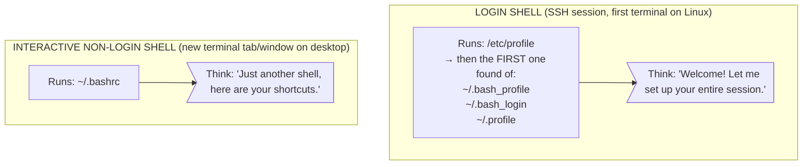
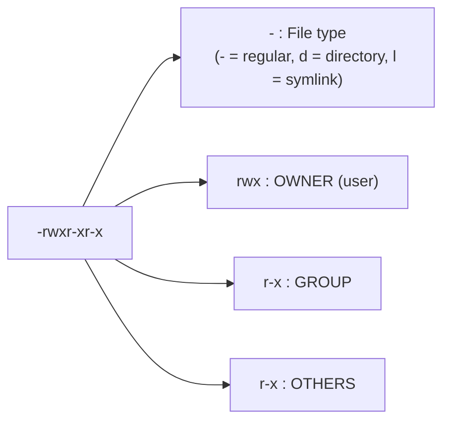

> **Everyday Use** | Complexity: `[QUICK]` | Time: 45 min

## Prerequisites

Before starting this module:
- **Required**: [Module 0.1: The CLI Power User](../module-0.1-cli-power-user/)
- **Environment**: Any Linux system (VM, WSL, or native)

---

## What You'll Be Able to Do

After this module, you will be able to:
- **Configure** shell environment variables (PATH, HOME, PS1) and explain how they're inherited
- **Debug** "command not found" errors by tracing the PATH variable
- **Use** sudo safely and explain why running as root is dangerous
- **Manage** file ownership and permissions across users and groups

---

## Why This Module Matters

Picture this. You download a script from a tutorial. You type `./deploy.sh`. The terminal spits back:

```
bash: ./deploy.sh: Permission denied
```

So you try again with `deploy.sh` (without the `./`). Now you get:

```
bash: deploy.sh: command not found
```

You stare at the screen. The file is *right there*. You can see it with `ls`. Why does Linux pretend it does not exist? And why, when you point directly at it, does Linux refuse to run it?

These two errors — "Permission denied" and "command not found" — are probably the most common frustrations for Linux beginners. They feel random and unfair. But they are not random at all. They come from two systems that are working exactly as designed:

1. **The Environment** — a collection of settings that tells your shell where to find programs, who you are, and how to behave
2. **Permissions** — a security system that controls who can read, write, and execute every single file on the system

Once you understand these two systems, those cryptic errors transform from brick walls into helpful signposts. You will know *exactly* what is wrong and *exactly* how to fix it. More importantly, when you start working with Kubernetes, you will understand why containers run as non-root, why ServiceAccounts exist, and why RBAC matters — because they are all built on these same permission concepts.

---

## Did You Know?

1. The `$PATH` variable was introduced in Unix Version 7 in 1979. Before that, you had to type the full path to every single command — imagine typing `/usr/bin/ls` every time you wanted to list files.

2. The numeric permission system (like `chmod 755`) is based on **octal** (base-8) numbers. Each digit represents three binary bits — one for read, one for write, one for execute. It is literally binary math you can do in your head.

3. The `sudo` command logs every single invocation to `/var/log/auth.log` (or `/var/log/secure` on RHEL-based systems). Your sysadmin can see exactly what you ran and when. There are no secrets with `sudo`.

4. On most Linux distributions, the root user's home directory is `/root`, not `/home/root`. Root is so special it does not even live in the same neighborhood as regular users.

---

## 1. Environment Variables: Your Terminal's Settings Panel

Think of environment variables like the **Settings app on your phone**. Your phone stores your language preference, your default browser, your wallpaper choice — all so that every app knows how to behave without asking you each time. Environment variables do the same thing for your terminal and every program that runs inside it.

An environment variable is simply a **name=value pair** stored in memory. By convention, the names use ALL_CAPS with underscores:

```bash
# See ALL your environment variables (there are a lot!)
env

# Or use printenv for the same thing
printenv

# See just one specific variable — the $ says "give me the value"
echo $USER
echo $HOME
```

### The Essential Variables You Should Know

| Variable | What It Stores | Example Value |
| :--- | :--- | :--- |
| `$USER` | Your current username | `alice` |
| `$HOME` | Path to your home directory | `/home/alice` |
| `$SHELL` | Your default shell program | `/bin/bash` |
| `$PWD` | Your current working directory | `/home/alice/projects` |
| `$EDITOR` | Your preferred text editor | `vim` or `nano` |
| `$LANG` | Your language and encoding | `en_US.UTF-8` |
| `$HOSTNAME` | The name of this machine | `web-server-01` |
| `$TERM` | Your terminal type | `xterm-256color` |
| `$PATH` | Where to find commands | (see next section) |

Try them right now:

```bash
echo "Hello, $USER! You are on $HOSTNAME."
echo "Your home is $HOME and your shell is $SHELL."
echo "You are currently in $PWD."
```

---

## 2. $PATH — The Most Important Variable You Will Ever Meet

When you type `ls` and press Enter, how does your shell know where the `ls` program lives? It does not search the entire hard drive — that would take forever. Instead, it checks a specific list of directories, in order, and runs the first match it finds. That list is your `$PATH`.

```bash
echo $PATH
```

You will see something like this (directories separated by colons):

```
/usr/local/bin:/usr/bin:/bin:/usr/sbin:/sbin:/home/alice/bin
```

Here is how the shell uses it when you type a command:

```
You type: kubectl

Shell searches $PATH directories left to right:

  /usr/local/bin/kubectl  → does this exist? NO  → keep looking
  /usr/bin/kubectl        → does this exist? NO  → keep looking
  /bin/kubectl            → does this exist? NO  → keep looking
  /usr/sbin/kubectl       → does this exist? NO  → keep looking
  /sbin/kubectl           → does this exist? NO  → keep looking
  /home/alice/bin/kubectl → does this exist? YES → RUN IT!

If nothing found in any directory:
  → "bash: kubectl: command not found"
```

> **Pause and predict**: If you type `kubectl` and the shell searches through all directories in your `$PATH` but doesn't find it, what exact error message will it print?

This is why `./deploy.sh` works but `deploy.sh` does not. The current directory (`.`) is **not** in your `$PATH` by default. When you type `deploy.sh`, the shell looks through every `$PATH` directory, never finds it, and gives up. When you type `./deploy.sh`, you are giving an explicit path — you are saying "run the file right here" — so the shell does not need `$PATH` at all.

### Finding Where Commands Live

```bash
# which — shows the full path of a command
which ls
# Output: /usr/bin/ls

which python3
# Output: /usr/bin/python3

# type — shows what the shell thinks a command is
type ls
# Output: ls is aliased to 'ls --color=auto'   (if aliased)
# Output: ls is /usr/bin/ls                      (if not)

type cd
# Output: cd is a shell builtin                  (built into bash itself)
```

### Adding a Directory to $PATH

Say you put custom scripts in `~/bin`. You need to add that directory to your `$PATH`:

```bash
# Temporary — lasts until you close the terminal
export PATH="$HOME/bin:$PATH"

# Verify it worked
echo $PATH
# Now /home/alice/bin appears at the front
```

Putting your directory at the **front** means your custom scripts get found first, before system commands with the same name. Putting it at the **end** means system commands take priority.

To make it permanent, add the `export PATH=...` line to your shell config file (covered in Section 4).

### Trade-off: Convenience vs. Security in $PATH

It might be tempting to add the current directory (`.`) to your `$PATH` like this: `export PATH=".:$PATH"`. This way, you could just type `deploy.sh` instead of `./deploy.sh`.

**War Story**: A sysadmin once added `.` to the *beginning* of their root user's `$PATH` for convenience. An attacker created a malicious script named `ls` and placed it in a world-writable directory like `/tmp`. When the sysadmin `cd`'d into `/tmp` and typed `ls`, the shell searched `.` first, found the malicious script, and executed it as root. The server was instantly compromised. The trade-off is clear: saving two keystrokes (`./`) is never worth giving an attacker an easy execution vector. Always keep `.` out of your `$PATH` and use explicit paths for local files.

---

## 3. Setting Variables: `export` vs No `export`

This distinction trips up almost everyone. 

> **Stop and think**: If you set `API_KEY="12345"` in your terminal without `export`, and then run a deployment script that needs to read `$API_KEY`, will the script succeed? Why or why not?

Watch carefully:

```bash
# Setting a variable WITHOUT export
GREETING="Hello from parent"
echo $GREETING        # Works! Prints: Hello from parent
bash                   # Start a child shell (a new process)
echo $GREETING        # Nothing! Empty! The child does not know about it
exit                   # Return to parent shell

# Setting a variable WITH export
export GREETING="Hello from parent"
echo $GREETING        # Works! Prints: Hello from parent
bash                   # Start a child shell
echo $GREETING        # Works! Prints: Hello from parent
exit                   # Return to parent shell
```

Why does this matter? Because every command you run is a **child process** of your shell. When you run a Python script, a Docker command, or kubectl, they are all child processes. If you set a variable without `export`, those programs cannot see it.

The rule is simple:

- **No `export`**: Variable exists only in your current shell session. Use this for quick throwaway values.
- **With `export`**: Variable is inherited by every child process. Use this for settings that programs need to see (like `$KUBECONFIG`, `$EDITOR`, `$JAVA_HOME`).

```bash
# Common exports you will see in Kubernetes work
export KUBECONFIG=~/.kube/config
export EDITOR=vim
export JAVA_HOME=/usr/lib/jvm/java-17

# Quick throwaway — no export needed
BACKUP_DATE=$(date +%Y-%m-%d)
echo "Backing up for $BACKUP_DATE"
```

### Unsetting Variables

```bash
# Remove a variable entirely
unset GREETING
echo $GREETING    # Nothing — it is gone
```

---

## 4. Shell Config Files: Making Changes Permanent

Every change you make in the terminal is **temporary** — it vanishes when you close the window. To make environment variables, aliases, and `$PATH` changes permanent, you need to add them to a **shell config file** that runs automatically when a new shell starts.

But which file? This is where it gets confusing, because there are several and they run at different times.

### When Each File Runs



In practice, most people want their settings in **every** shell. The standard trick is:

1. Put all your settings in `~/.bashrc`
2. Have `~/.bash_profile` source it:

```bash
# Contents of ~/.bash_profile
if [ -f ~/.bashrc ]; then
    source ~/.bashrc
fi
```

This way, login shells load `.bashrc` too, and you only maintain one file.

**For Zsh users** (default on macOS): The equivalent is `~/.zshrc`. Zsh reads it for every interactive shell, login or not — much simpler.

### Reloading After Changes

After editing your config file, you do NOT need to close and reopen the terminal:

```bash
# Reload .bashrc immediately
source ~/.bashrc

# Shorthand (does the same thing)
. ~/.bashrc
```

---

## 5. Aliases: Your Custom Shortcut Commands

An alias is a custom shortcut that expands into a longer command. They save you keystrokes every single day.

```bash
# Create an alias
alias ll='ls -la'
alias ..='cd ..'
alias ...='cd ../..'
alias cls='clear'
alias ports='ss -tulnp'
alias myip='curl -s ifconfig.me'
```

### Practical Aliases for DevOps and Kubernetes

```bash
# Kubernetes — the k alias is used throughout KubeDojo
alias k='kubectl'
alias kgp='kubectl get pods'
alias kgs='kubectl get svc'
alias kgn='kubectl get nodes'
alias kaf='kubectl apply -f'
alias kdel='kubectl delete -f'
alias klog='kubectl logs -f'

# Docker
alias dps='docker ps'
alias dimg='docker images'
alias dex='docker exec -it'

# Safety nets — ask before overwriting
alias cp='cp -i'
alias mv='mv -i'
alias rm='rm -i'

# Quick system info
alias meminfo='free -h'
alias diskinfo='df -h'
alias cpuinfo='lscpu'
```

To make aliases permanent, add them to your `~/.bashrc`:

```bash
# Open your .bashrc and add aliases at the bottom
nano ~/.bashrc

# After adding aliases, reload
source ~/.bashrc
```

### Checking and Removing Aliases

```bash
# See all your current aliases
alias

# See what a specific alias expands to
alias ll
# Output: alias ll='ls -la'

# Temporarily bypass an alias (use the real command)
\ls          # The backslash skips the alias
command ls   # Another way to skip

# Remove an alias for this session
unalias ll
```

---

## 6. File Permissions: The rwx System

Linux is a **multi-user** operating system. Even if you are the only human using the machine, there are dozens of system users (like `www-data` for your web server, `postgres` for your database). Permissions ensure that your web server cannot read your SSH keys and your database cannot modify your application code.

Run `ls -l` in any directory:

```bash
ls -l /etc/passwd /bin/ls /home

# Output looks like:
# -rwxr-xr-x 1 root root  142144 Sep 5 2023 /bin/ls
# -rw-r--r-- 1 root root    2775 Mar 10 14:22 /etc/passwd
# drwxr-xr-x 3 root root    4096 Mar 10 14:22 /home
```

Let us decode that first column character by character:



### What r, w, x Actually Mean

| Permission | On a File | On a Directory |
| :--- | :--- | :--- |
| `r` (read) | View the file contents (`cat`, `less`) | List the directory contents (`ls`) |
| `w` (write) | Modify or overwrite the file | Create, rename, or delete files inside it |
| `x` (execute) | Run the file as a program | Enter the directory (`cd`) |
| `-` (none) | Cannot do the action | Cannot do the action |

The directory permissions catch people off guard. A directory without `x` is like a room with a locked door — you cannot walk in, even if you know what is inside. A directory without `r` but with `x` is like a dark room — you can walk in and grab files if you know their names, but you cannot turn on the lights to see what is there.

### Reading Permission Strings — Practice

| String | Owner | Group | Others | Meaning |
| :--- | :--- | :--- | :--- | :--- |
| `-rwxr-xr-x` | rwx | r-x | r-x | Typical program — everyone can run it, only owner can edit |
| `-rw-r--r--` | rw- | r-- | r-- | Typical config file — everyone can read, only owner can edit |
| `-rw-------` | rw- | --- | --- | Private file — only owner can read and write |
| `-rwx------` | rwx | --- | --- | Private script — only owner can run it |
| `drwxr-xr-x` | rwx | r-x | r-x | Typical directory — everyone can enter and list, only owner can modify |
| `drwx------` | rwx | --- | --- | Private directory — only owner can enter |

---

## 7. Changing Permissions with `chmod`

`chmod` (change mode) modifies permissions. You can use it in two ways.

### Symbolic Mode — Human-Readable

Format: `chmod [who][operator][permission] file`

- **Who**: `u` (user/owner), `g` (group), `o` (others), `a` (all three)
- **Operator**: `+` (add), `-` (remove), `=` (set exactly)
- **Permission**: `r`, `w`, `x`

```bash
# Make a script executable for the owner
chmod u+x deploy.sh

# Remove write permission from group and others
chmod go-w config.yaml

# Give everyone read permission
chmod a+r README.md

# Set exact permissions — owner gets rwx, everyone else gets nothing
chmod u=rwx,go= secret-script.sh

# Add execute for everyone
chmod +x run-tests.sh        # Without specifying who, + applies to all

# Remove all permissions from others
chmod o= private-notes.txt   # = with nothing after it means "set to nothing"
```

### Numeric Mode — Fast and Precise

Each permission has a number: **read = 4, write = 2, execute = 1**. Add them up for each position (owner, group, others).

```
Permission  Binary  Decimal
---------   -----   -------
  ---        000       0     (no permissions)
  --x        001       1     (execute only)
  -w-        010       2     (write only)
  -wx        011       3     (write + execute)
  r--        100       4     (read only)
  r-x        101       5     (read + execute)
  rw-        110       6     (read + write)
  rwx        111       7     (read + write + execute)
```

You specify three digits: owner, group, others.

```bash
# 755 — owner: rwx (7), group: r-x (5), others: r-x (5)
# Standard for scripts and programs
chmod 755 deploy.sh

# 644 — owner: rw- (6), group: r-- (4), others: r-- (4)
# Standard for regular files
chmod 644 config.yaml

# 600 — owner: rw- (6), group: --- (0), others: --- (0)
# Private files (SSH keys, passwords)
chmod 600 ~/.ssh/id_rsa

# 700 — owner: rwx (7), group: --- (0), others: --- (0)
# Private directories, private scripts
chmod 700 ~/.ssh

# 444 — owner: r-- (4), group: r-- (4), others: r-- (4)
# Read-only for everyone (like a museum exhibit — look but do not touch)
chmod 444 important-record.txt
```

> **Pause and predict**: You have a directory. You want users to be able to `cd` into it and `ls` its contents, but NOT be able to create or delete files. What is the numeric `chmod` value for this exact set of permissions?

### The Most Common Permission Patterns

| Pattern | Numeric | Use Case |
| :--- | :--- | :--- |
| `rwxr-xr-x` | `755` | Programs, scripts, directories |
| `rw-r--r--` | `644` | Regular files, config files |
| `rw-------` | `600` | SSH private keys, secrets |
| `rwx------` | `700` | SSH directory, private scripts |
| `rwxrwxr-x` | `775` | Shared project directories |
| `rw-rw-r--` | `664` | Shared project files |

---

## 8. Ownership with `chown` and `chgrp`

Every file has two ownership attributes: a **user** (owner) and a **group**.

```bash
# Check ownership
ls -l myfile.txt
# -rw-r--r-- 1 alice developers 1024 Mar 10 14:22 myfile.txt
#               ^^^^^  ^^^^^^^^^^
#               owner    group
```

### Changing Ownership

```bash
# Change owner (requires sudo because you are giving away a file)
sudo chown bob myfile.txt

# Change group only
sudo chgrp developers myfile.txt

# Change both at once — user:group
sudo chown bob:developers myfile.txt

# Change ownership of a directory and EVERYTHING inside it (-R = recursive)
sudo chown -R alice:webteam /var/www/mysite

# Change only the group (useful if you are a member of the target group)
chgrp devops deployment.yaml     # No sudo needed if you belong to "devops"
```

### Why Ownership Matters for Kubernetes

When a container runs, it runs as a specific user (often root by default, which is a security risk). Kubernetes `securityContext` lets you set `runAsUser` and `runAsGroup` — the exact same user/group ownership concept you are learning here, just applied inside a container.

---

## 9. The Root User and `sudo`

### Root: The All-Powerful Superuser

Linux has one special user called `root` (UID 0). Root can:

- Read, write, and execute any file regardless of permissions
- Kill any process
- Modify any system configuration
- Bind to privileged ports (below 1024)
- Format disks, mount filesystems, do absolutely anything

This is why running as root is **dangerous**. A typo like `rm -rf /` (instead of `rm -rf ./`) would wipe the entire system. There is no "Are you sure?" prompt, no recycle bin, no undo.

### sudo: Borrow Root Power Safely

`sudo` stands for "superuser do." It lets an authorized regular user run a single command with root privileges:

```bash
# Install a package (requires root)
sudo apt update
sudo apt install nginx

# Edit a system file (requires root)
sudo nano /etc/hosts

# Restart a service (requires root)
sudo systemctl restart nginx

# See who you become when you use sudo
sudo whoami
# Output: root
```

When you run `sudo`, it asks for **your** password (not root's password). This confirms that the person at the keyboard is actually you and not someone who walked up to your unlocked laptop.

### The sudoers File

Not everyone can use `sudo`. The file `/etc/sudoers` controls who is allowed. You should **never** edit it directly — always use the special `visudo` command, which checks for syntax errors before saving (a broken sudoers file can lock you out of root access entirely).

```bash
# See your sudo privileges
sudo -l

# Common output shows something like:
# (ALL : ALL) ALL         — you can do anything as any user
# (ALL) NOPASSWD: ALL     — you can do anything without a password (common on cloud VMs)
```

On most systems, you get sudo access by being in a specific group:

- **Ubuntu/Debian**: The `sudo` group
- **RHEL/CentOS/Fedora**: The `wheel` group

```bash
# Check what groups you belong to
groups
# Output: alice sudo docker

# If "sudo" or "wheel" is in the list, you can use sudo
```

### Best Practices with sudo

```bash
# DO: Use sudo for specific commands that need it
sudo systemctl restart nginx

# DO NOT: Start a root shell and work in it
sudo -i        # Avoid this — you lose the safety net of per-command authorization
sudo su -      # Avoid this too — same problem

# DO NOT: Use sudo for things that do not need it
sudo cat myfile.txt    # If you own the file, just use cat!
sudo vim notes.txt     # The file will end up owned by root — now YOU cannot edit it
```

**War Story**: A junior engineer once ran `sudo vim` to edit a config file in their home directory. The file's ownership changed to root. Later, the application that needed to read that config file (running as a normal user) got "Permission denied" and crashed in production. The fix was a simple `chown`, but finding the cause took hours of debugging. The lesson: only use `sudo` when you actually need root privileges.

---

## Common Mistakes

| Mistake | Why It Happens | How to Fix It |
| :--- | :--- | :--- |
| "command not found" for a script in the current directory | The current directory `.` is not in `$PATH`. Typing `script.sh` makes the shell search `$PATH` only. | Run it with `./script.sh` (explicit path) or add its directory to `$PATH`. |
| "Permission denied" when running a script | The file does not have execute (`x`) permission. Linux requires it explicitly. | Run `chmod u+x script.sh` then try again. |
| Alias disappears after closing the terminal | You defined it in the shell but not in `~/.bashrc`. Shell settings do not persist automatically. | Add the `alias` line to `~/.bashrc` and run `source ~/.bashrc`. |
| `export` in `.bashrc` does not take effect | You edited the file but did not reload it. The running shell does not watch for file changes. | Run `source ~/.bashrc` or open a new terminal. |
| Using `sudo vim` to edit files you own | Creates the file as root-owned. Now your normal user cannot modify it. | Use `vim` without `sudo`. If already owned by root, run `sudo chown $USER file`. |
| Running as root all the time (`sudo su -`) | Feels convenient but removes all safety nets. One wrong `rm` can destroy everything. | Use `sudo` per command. Exit root shells immediately when done. |
| `chmod 777` on everything to "fix" permission errors | Gives everyone full access — a massive security hole. | Figure out which specific permission is missing and grant only that. Usually `chmod 755` or `644` is correct. |
| Forgetting the `-R` flag with `chown` or `chmod` | Only changes the directory itself, not the files inside it. | Use `-R` for recursive: `sudo chown -R alice:devs /project`. |

---

## Quiz (Testing Your Outcomes)

**Test yourself.** Try to answer before revealing the solution.

<details>
<summary><strong>Q1 [Outcome: Debug "command not found"]</strong>: You are helping a junior developer. They downloaded a binary called <code>kubens</code> into <code>~/downloads</code> and typed <code>kubens</code>. The terminal returns "command not found". They prove the file is there by running <code>ls ~/downloads</code> and seeing <code>kubens</code> listed. Why did this happen and how do they fix it?</summary>

The shell only looks for commands in the directories listed in the `$PATH` environment variable. By default, `~/downloads` is not in `$PATH`, and the current directory (`.`) is also not checked automatically for security reasons. Because of this, the shell cannot resolve the command name to the actual file location on disk. To fix this, the developer must either provide the explicit relative or absolute path (e.g., `./kubens` or `~/downloads/kubens`) or move the binary to a directory that is already in `$PATH`, like `/usr/local/bin`.
</details>

<details>
<summary><strong>Q2 [Outcome: Configure environment]</strong>: You set a database password using <code>DB_PASS=secret</code> in your terminal. You then run a Python script <code>python3 connect.py</code> that reads the <code>DB_PASS</code> environment variable, but the script crashes complaining that the variable is missing. You type <code>echo $DB_PASS</code> and see "secret". What is happening?</summary>

The variable was set locally in the current shell, but it was not exported to the environment. When you run a script or program, it spawns as a child process of your current shell. Child processes only inherit environment variables that have been explicitly flagged with the `export` command. Because it was missing, the Python script spawned with an environment that did not contain `DB_PASS`. To fix this, you need to run `export DB_PASS=secret` before running the Python script, or pass it inline like `DB_PASS=secret python3 connect.py`.
</details>

<details>
<summary><strong>Q3 [Outcome: Manage permissions]</strong>: A web server running as the user <code>www-data</code> needs to read a configuration file <code>app.conf</code>. The file is currently owned by <code>alice:developers</code> with permissions <code>-rw-r-----</code>. The <code>www-data</code> user is not part of the <code>developers</code> group. What is the most secure way to grant the web server read access without exposing the file to every user on the system?</summary>

The most secure approach is to change the group ownership of the file to a group that `www-data` already belongs to, or change the owner directly to `www-data`. You should avoid using broad permissions like `chmod 777` or `chmod o+r` (which results in `644`), as these would allow any other user on the system to read the potentially sensitive configuration. By using a command like `chown alice:www-data app.conf` (assuming `www-data` acts as a group), the group permissions (`r--`) will apply exclusively to the web server. This keeps the "others" permissions at zero (`---`), ensuring the principle of least privilege is maintained.
</details>

<details>
<summary><strong>Q4 [Outcome: Manage permissions]</strong>: You have a directory <code>/opt/scripts/</code> with permissions <code>drwxr-x---</code> owned by <code>root:devops</code>. You are logged in as <code>bob</code>, who is a member of the <code>devops</code> group. You try to create a new script inside this directory using <code>touch /opt/scripts/new.sh</code>, but you receive a "Permission denied" error. Why?</summary>

File creation within a Linux directory is governed by the write (`w`) permission of the directory itself, not the permissions of the files inside it. As a member of the `devops` group, the directory's group permissions `r-x` apply to your user. The `r` (read) allows you to list the directory contents, and the `x` (execute) allows you to enter the directory using the `cd` command. However, since the group lacks the `w` (write) permission, you are forbidden from modifying the directory's inventory, which means you cannot create, delete, or rename files within it.
</details>

<details>
<summary><strong>Q5 [Outcome: Use sudo safely]</strong>: You need to append a new line to a protected system file <code>/etc/hosts</code>. You try running <code>sudo echo "10.0.0.5 myserver" >> /etc/hosts</code>, but you get a "Permission denied" error, even though you used <code>sudo</code>. Why did this fail, and how do you fix it?</summary>

The failure happens because the shell handles output redirection (`>>`) before `sudo` ever executes the command. As a result, `sudo` only applies to the `echo` command itself, while your current, unprivileged shell attempts to open `/etc/hosts` for writing, which it lacks the permissions to do. To fix this safely without switching entirely to a root shell, you can use the `tee` command combined with `sudo`. Running `echo "10.0.0.5 myserver" | sudo tee -a /etc/hosts` executes `tee` with root privileges, allowing it to successfully append the text to the protected file.
</details>

<details>
<summary><strong>Q6 [Outcome: Use sudo safely]</strong>: An application running on your server is crashing, and the logs are in <code>/var/log/app/error.log</code>, which is owned by <code>root:root</code> with <code>-rw-------</code> permissions. You type <code>sudo vim /var/log/app/error.log</code> to investigate. Why is this a bad practice, and what should you do instead?</summary>

Using an interactive editor like `vim` with `sudo` simply to view a file is highly dangerous because it runs the entire editor program with root privileges. If you accidentally bump the keyboard, you might unintentionally modify critical system logs or configuration files. Furthermore, if the editor contains vulnerabilities or automatically executes macros, those actions will execute with full system-level authority. Instead, you should always use commands specifically designed for read-only viewing, such as `sudo less`, `sudo cat`, or `sudo tail`, which eliminate the risk of accidental modification or privilege escalation.
</details>

<details>
<summary><strong>Q7 [Outcome: Manage permissions]</strong>: You downloaded a bash script <code>setup.sh</code> that automates a complex installation. When you run <code>./setup.sh</code>, the system says "Permission denied". You run <code>ls -l</code> and see <code>-rw-r--r--</code>. You are tempted to run <code>chmod 777 setup.sh</code> to get it working quickly. What is the numeric permission you should actually use, and why is <code>777</code> a bad idea?</summary>

The correct numeric permission for a script you want to run is `755` (or simply `chmod u+x` if only the owner needs to execute it). Using `chmod 777` is a massive security risk because it grants read, write, and execute permissions to every single user on the entire system. This means any other user could maliciously modify the script to inject harmful commands, which you would unknowingly execute the next time you ran it. By using `755` (`-rwxr-xr-x`), you ensure that only the owner can modify the file, while everyone else is restricted to merely reading and executing it.
</details>

<details>
<summary><strong>Q8 [Outcome: Configure environment]</strong>: You want to override the system's version of <code>python3</code> (located in <code>/usr/bin/python3</code>) with a newer version you compiled yourself and placed in <code>/opt/custom/bin/python3</code>. However, when you type <code>python3 --version</code>, it still shows the old system version. How do you modify your environment to fix this?</summary>

The shell searches through the directories listed in your `$PATH` variable from left to right and immediately stops at the first matching executable it finds. Because `/usr/bin` is already present in your default `$PATH` and your custom directory is not (or is placed at the very end), the shell discovers the system version first. To override this behavior, you must prepend your custom directory to the absolute front of the `$PATH` by adding a line like `export PATH="/opt/custom/bin:$PATH"` to your `~/.bashrc`. This guarantees that the shell evaluates `/opt/custom/bin` prior to `/usr/bin`, allowing your custom compiled version to take precedence.
</details>

---

## Hands-On Exercise: Environment and Permissions Boot Camp

**Scenario**: You are setting up a development environment on a new server. You need to configure your shell, create a project with proper permissions, and set up scripts that your team can use.

### Part 1: Environment Variables

```bash
# 1. Display your current username, home directory, and shell
echo "User: $USER"
echo "Home: $HOME"
echo "Shell: $SHELL"

# 2. See your entire $PATH, one directory per line (easier to read)
echo $PATH | tr ':' '\n'

# 3. Set a variable WITHOUT export — verify it does not reach child processes
PROJECT_NAME="kubedojo-lab"
echo $PROJECT_NAME         # Should print: kubedojo-lab
bash -c 'echo $PROJECT_NAME'   # Should print nothing (empty)

# 4. Now export it and verify the child process CAN see it
export PROJECT_NAME="kubedojo-lab"
bash -c 'echo $PROJECT_NAME'   # Should print: kubedojo-lab
```

### Part 2: Shell Configuration

```bash
# 5. Add useful aliases to your .bashrc
cat >> ~/.bashrc << 'EOF'

# --- KubeDojo Lab Aliases ---
alias ll='ls -la'
alias cls='clear'
alias ..='cd ..'
alias k='kubectl'
EOF

# 6. Reload your config and test
source ~/.bashrc
ll       # Should show detailed listing with hidden files
```

### Part 3: Permissions

```bash
# 7. Create a project directory structure
mkdir -p ~/lab-project/{scripts,config,secrets}

# 8. Create a deploy script
cat > ~/lab-project/scripts/deploy.sh << 'EOF'
#!/bin/bash
echo "Deploying $PROJECT_NAME..."
echo "Deploy complete at $(date)"
EOF

# 9. Try to run it — observe the error
~/lab-project/scripts/deploy.sh
# Expected: Permission denied

# 10. Check current permissions
ls -l ~/lab-project/scripts/deploy.sh
# Expected: -rw-r--r-- or -rw-rw-r-- (no x anywhere)

# 11. Add execute permission for the owner only
chmod u+x ~/lab-project/scripts/deploy.sh

# 12. Verify the permission changed
ls -l ~/lab-project/scripts/deploy.sh
# Expected: -rwxr--r-- (x added for owner)

# 13. Run it successfully
~/lab-project/scripts/deploy.sh
# Expected: "Deploying kubedojo-lab..." and timestamp
```

### Part 4: Securing Files

```bash
# 14. Create a "secret" config file
echo "DB_PASSWORD=supersecret123" > ~/lab-project/secrets/db.env

# 15. Lock it down — only you can read and write (numeric mode)
chmod 600 ~/lab-project/secrets/db.env

# 16. Verify
ls -l ~/lab-project/secrets/db.env
# Expected: -rw------- (only owner has rw)

# 17. Set the secrets directory so only you can enter it
chmod 700 ~/lab-project/secrets/

# 18. Verify the full structure
ls -la ~/lab-project/
ls -la ~/lab-project/scripts/
ls -la ~/lab-project/secrets/
```

### Success Criteria

You have completed this exercise successfully if you can demonstrate the following module outcomes:

- [ ] **[Outcome: Debug "command not found"]** You can explain what `$PATH` does and why `./script.sh` works but `script.sh` does not.
- [ ] **[Outcome: Configure environment]** Your aliases and environment variables are saved in `~/.bashrc` and persist after running `source ~/.bashrc`.
- [ ] **[Outcome: Manage permissions]** `deploy.sh` has execute permission for the owner (`-rwxr--r--` or similar).
- [ ] **[Outcome: Manage permissions]** `db.env` is locked down to owner-only access (`-rw-------` / `600`) and the `secrets/` directory is locked to owner-only (`drwx------` / `700`).
- [ ] **[Outcome: Use sudo safely]** You did not use `sudo` for anything in this exercise, proving you understand it is not needed for files you own.

### Cleanup

```bash
# When you are done experimenting
rm -rf ~/lab-project
# Optionally remove the aliases from ~/.bashrc if you do not want them
```

---

**Next Up:** [Module 0.3: Process & Resource Survival Guide](../module-0.3-processes-resources/) — Learn how to find running processes, monitor system resources, and stop runaway programs before they cause trouble.