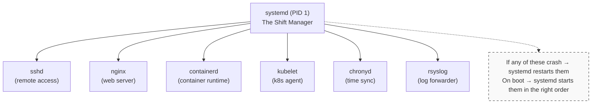
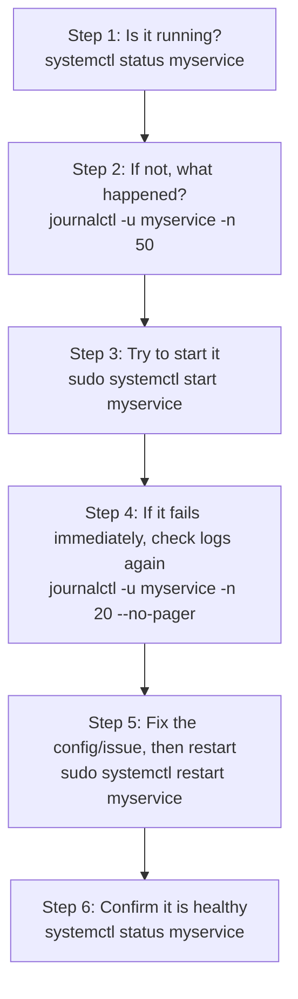

> **Everyday Linux Use** | Complexity: `[QUICK]` | Time: 40 min

## Prerequisites

Before starting this module:
- **Required**: [Module 0.3: Process & Resource Survival Guide](../module-0.3-processes-resources/)
- **Helpful**: Have a Linux system available (VM, WSL, or native) with `sudo` access

---

## What You'll Be Able to Do

After this module, you will be able to:
- **Manage** services with systemctl (start, stop, enable, status) and read their configuration
- **Query** logs with journalctl using time ranges, units, and priority filters
- **Diagnose** a service that fails to start by reading journal entries and unit file dependencies
- **Explain** the relationship between systemd, journald, and syslog

---

## Why This Module Matters

In the previous module, you learned how to see what is running on your system and how to stop runaway processes. But here is the thing: most of the important programs on a server are not started by typing a command in a terminal. They run quietly in the background, starting automatically when the machine boots and restarting themselves if they crash.

These background programs are called **services** (or daemons), and they are the backbone of every Linux server. Your web server, your database, your container runtime, your SSH server -- they are all services managed by a system called **systemd**.

Understanding services and logs helps you:

- **Keep things running** -- Start, stop, and restart services without rebooting
- **Survive on-call** -- When something breaks at 2 AM, logs tell you what happened
- **Debug Kubernetes** -- kubelet, containerd, and etcd are all systemd services under the hood
- **Deploy confidently** -- Know how to ensure your application starts on boot and stays running

This module bridges the gap from "I can run a command" to "I can manage a production service."

---

## Did You Know?

- **The word "daemon" comes from Greek mythology** -- Maxwell's daemon was a thought experiment about a helpful spirit that worked in the background. BSD Unix adopted the term in the 1960s for background processes. The BSD mascot is literally a daemon with a pitchfork. Systemd's Lennart Poettering once joked that systemd is "the daemon to rule all daemons."

- **systemd manages far more than services** -- It handles your network configuration (systemd-networkd), DNS resolution (systemd-resolved), time synchronization (systemd-timesyncd), login sessions (systemd-logind), and even temporary file cleanup (systemd-tmpfiles). On a typical Linux server, systemd manages over 100 units.

- **journald can store logs across reboots** -- By default on many distributions, journal logs are volatile (lost on reboot). But with persistent storage enabled (`Storage=persistent` in `/etc/systemd/journald.conf`), you can go back and check what happened before the last crash. Kubernetes node troubleshooting often depends on this.

- **A single misconfigured service can prevent your system from booting** -- If a service marked as `required` by the boot target fails and is set to block startup, you could end up at an emergency shell. This is why understanding `enable`/`disable` and service dependencies actually matters in production.

---

## From Processes to Services

In Module 0.3, you ran commands like `sleep 300 &` to put a process in the background. That works for quick tasks, but it has serious problems for real applications:

| Running a Command | Running a Service |
|-------------------|-------------------|
| Dies when you close the terminal | Survives terminal closure and reboots |
| No automatic restart on crash | Restarts automatically if it fails |
| Logs go to your terminal (and get lost) | Logs captured and stored by journald |
| You have to manage it manually | systemd manages it for you |
| No dependency ordering | Starts after its dependencies are ready |

Think of it this way: running `python app.py &` is like asking a friend to hold the door open. Running a systemd service is like installing an automatic door -- it works whether anyone is standing there or not.

### What Is a Daemon?

A **daemon** is just a process that runs in the background without a terminal attached. By convention, daemon names often end with the letter "d":

- `sshd` -- the SSH daemon (handles remote connections)
- `httpd` -- the HTTP daemon (Apache web server)
- `containerd` -- the container daemon (runs containers for Kubernetes)
- `kubelet` -- technically not ending in "d", but it is a daemon too

### What Is systemd?

**systemd** is the init system and service manager on virtually all modern Linux distributions. It is the very first process that starts (PID 1), and it is responsible for:

1. **Starting services** in the correct order at boot
2. **Supervising services** and restarting them if they crash
3. **Collecting logs** from all services into one place (journald)
4. **Managing dependencies** -- ensuring a database starts before the app that needs it

Think of systemd as the **shift manager** at a restaurant. It does not cook or serve food, but it makes sure the cooks and servers show up on time, in the right order, and gets replacements if someone calls in sick.



---

## Managing Services with systemctl

`systemctl` is the command you use to talk to systemd. It is your primary tool for managing services.

### Checking Service Status

The most common thing you will do is check whether a service is running:

```bash
# Check if nginx is running
systemctl status nginx
```

Example output:

```
● nginx.service - A high performance web server
     Loaded: loaded (/lib/systemd/system/nginx.service; enabled; preset: enabled)
     Active: active (running) since Mon 2026-03-24 10:00:00 UTC; 2h ago
       Docs: man:nginx(8)
    Process: 1234 ExecStartPre=/usr/sbin/nginx -t -q -g daemon on;... (code=exited, status=0/SUCCESS)
   Main PID: 1235 (nginx)
      Tasks: 3 (limit: 4677)
     Memory: 5.2M
        CPU: 32ms
     CGroup: /system.slice/nginx.service
             ├─1235 "nginx: master process /usr/sbin/nginx ..."
             ├─1236 "nginx: worker process" "" "" "" "" "" ...
             └─1237 "nginx: worker process" "" "" "" "" "" ...
```

> **Pause and predict**: Look at the "Active:" line in the output above. It says "active (running)". If a service had crashed, what do you think this line would say? How would the "Main PID" field change?

Let's break this down:

| Field | What It Tells You |
|-------|-------------------|
| `Loaded: loaded` | The unit file exists and was read successfully |
| `enabled` | Will start automatically on boot |
| `Active: active (running)` | Currently running right now |
| `Main PID: 1235` | The main process ID |
| `Tasks: 3` | Number of processes/threads |
| `Memory: 5.2M` | Current memory usage |
| `CGroup` | The process tree for this service |

The colored dot at the beginning tells you the health at a glance:

- Green `●` -- active and running
- White `○` -- inactive (stopped)
- Red `●` -- failed

### Starting, Stopping, and Restarting

> **Stop and think**: If you restart a web server, it stops the main process and starts a new one, terminating all active user downloads. Is there a way to tell the server to just re-read its configuration file without dropping current users?

```bash
# Start a stopped service
sudo systemctl start nginx

# Stop a running service
sudo systemctl stop nginx

# Restart (stop + start) -- use when config changes need a full restart
sudo systemctl restart nginx

# Reload -- gracefully reload config without dropping connections
# Not all services support this
sudo systemctl reload nginx

# Restart only if already running (safe in scripts)
sudo systemctl try-restart nginx
```

**When to use restart vs reload:**

- **restart** kills the process and starts a new one. Connections are dropped. Use when you need a clean slate.
- **reload** sends a signal (usually SIGHUP) telling the process to re-read its config. Existing connections stay alive. Use when you just changed a config file and the service supports it.

> **Tip**: Not sure if a service supports reload? Use `systemctl reload-or-restart nginx` -- it will try reload first and fall back to restart.

### Enabling and Disabling on Boot

> **Pause and predict**: If you run `systemctl enable nginx`, does it start the service immediately? What exactly changes on the system to ensure it starts on the next boot?

Starting a service makes it run *right now*. Enabling a service makes it start *automatically on boot*:

```bash
# Enable nginx to start on boot
sudo systemctl enable nginx

# Disable -- won't start on boot (but still running if already started)
sudo systemctl disable nginx

# Enable AND start in one command
sudo systemctl enable --now nginx

# Disable AND stop in one command
sudo systemctl disable --now nginx

# Check if a service is enabled
systemctl is-enabled nginx
# Output: enabled  (or: disabled, static, masked)
```

**What does "enable" actually do?** It creates a symbolic link. When you run `systemctl enable nginx`, systemd creates:

```
/etc/systemd/system/multi-user.target.wants/nginx.service →
  /lib/systemd/system/nginx.service
```

This link tells systemd: "when the system reaches the multi-user target (normal boot), also start nginx."

### Listing Services

```bash
# Show all running services
systemctl list-units --type=service --state=running

# Show all failed services (great for troubleshooting)
systemctl --failed

# Show all installed services (running and stopped)
systemctl list-unit-files --type=service
```

---

## Why systemd and Not Just nohup?

You might wonder: "Can't I just use `nohup python app.py &` to run something in the background?" You can, but you should not in production. Here is why:

```bash
# The nohup approach -- fragile
nohup python /opt/myapp/app.py > /var/log/myapp.log 2>&1 &

# What happens when it crashes at 3 AM?
# Nothing. It stays dead. You get paged. You cry.
```

```bash
# The systemd approach -- robust
sudo systemctl start myapp

# What happens when it crashes at 3 AM?
# systemd restarts it automatically.
# Logs are captured in journald.
# You sleep peacefully.
```

| Feature | nohup | systemd Service |
|---------|-------|-----------------|
| Survives logout | Yes | Yes |
| Survives reboot | No | Yes (if enabled) |
| Auto-restart on crash | No | Yes |
| Log management | Manual | Automatic (journald) |
| Resource limits | Manual (ulimit) | Built-in (cgroups) |
| Dependency ordering | None | Full support |
| Status monitoring | `ps` + guessing | `systemctl status` |

**Bottom line**: `nohup` is fine for a quick one-off task. For anything that matters, use a systemd service.

---

## Reading Unit Files (Not Writing, Just Reading)

Every service has a **unit file** that tells systemd how to manage it. You do not need to write these yet, but you should be able to read them because they tell you exactly how a service behaves.

```bash
# View the unit file for nginx
systemctl cat nginx
```

```ini
[Unit]
Description=A high performance web server and reverse proxy server
Documentation=man:nginx(8)
After=network.target remote-fs.target nss-lookup.target
StartLimitIntervalSec=0

[Service]
Type=forking
PIDFile=/run/nginx.pid
ExecStartPre=/usr/sbin/nginx -t -q -g 'daemon on; master_process on;'
ExecStart=/usr/sbin/nginx -g 'daemon on; master_process on;'
ExecReload=/bin/sh -c "/bin/kill -s HUP $MAINPID"
ExecStop=-/sbin/start-stop-daemon --quiet --stop --retry QUIT/5 --pidfile /run/nginx.pid
TimeoutStopSec=5
KillMode=mixed

[Install]
WantedBy=multi-user.target
```

Here is what each section means:

### [Unit] Section -- Identity and Dependencies

| Directive | Meaning |
|-----------|---------|
| `Description` | Human-readable name shown in `systemctl status` |
| `After` | Start this service *after* these other units |
| `Documentation` | Where to find help |

### [Service] Section -- How to Run

| Directive | Meaning |
|-----------|---------|
| `Type` | How systemd tracks the process (`simple`, `forking`, `oneshot`) |
| `ExecStart` | The command to run |
| `ExecStartPre` | Command to run before starting (e.g., config test) |
| `ExecReload` | Command for `systemctl reload` |
| `ExecStop` | Command for `systemctl stop` |
| `Restart` | When to auto-restart (`always`, `on-failure`, `no`) |

### [Install] Section -- Boot Behavior

| Directive | Meaning |
|-----------|---------|
| `WantedBy` | Which target pulls in this service (usually `multi-user.target`) |

> **Key insight**: The `Restart=` directive is what makes systemd services self-healing. If you see `Restart=always` or `Restart=on-failure`, the service will come back automatically after a crash. This is why Kubernetes node components like kubelet use systemd -- they must never stay dead.

---

## Viewing Logs with journalctl

Every service managed by systemd sends its output (stdout and stderr) to **journald**, the systemd log collector. You access these logs with `journalctl`.

### Basic Usage

```bash
# View ALL logs (careful -- this can be huge)
journalctl

# View logs and jump to the end (most recent)
journalctl -e

# Follow logs in real time (like tail -f)
journalctl -f
```

### Filtering by Service (the -u Flag)

This is the flag you will use most often. The `-u` stands for "unit":

```bash
# Logs for nginx only
journalctl -u nginx

# Logs for ssh daemon
journalctl -u sshd

# Follow nginx logs in real time
journalctl -u nginx -f
```

> **Try It Now**: Run `journalctl -b -p err` on your system. This shows all error-level logs since your last boot. Are there any unexpected failures hiding in your system's background?

### Limiting Output (the -n Flag)

```bash
# Show only the last 20 log lines
journalctl -u nginx -n 20

# Show only the last 50 lines and follow new ones
journalctl -u nginx -n 50 -f
```

### Filtering by Time (the --since Flag)

```bash
# Logs from the last hour
journalctl -u nginx --since "1 hour ago"

# Logs from today
journalctl -u nginx --since today

# Logs from a specific time range
journalctl -u nginx --since "2026-03-24 09:00" --until "2026-03-24 10:00"

# Logs since last boot
journalctl -u nginx -b
```

### Combining Flags

The real power comes from combining these flags:

```bash
# Last 30 nginx log lines from today, then follow new ones
journalctl -u nginx --since today -n 30 -f

# All error-level logs for any service in the last hour
journalctl -p err --since "1 hour ago"
```

### Priority Levels

journald stores log priority, so you can filter by severity:

```bash
# Only errors and above
journalctl -p err

# Only warnings and above
journalctl -p warning

# Critical and above
journalctl -p crit
```

| Priority | Keyword | What It Means |
|----------|---------|---------------|
| 0 | emerg | System is unusable |
| 1 | alert | Immediate action needed |
| 2 | crit | Critical conditions |
| 3 | err | Error conditions |
| 4 | warning | Warning conditions |
| 5 | notice | Normal but significant |
| 6 | info | Informational |
| 7 | debug | Debug-level messages |

### Output Formatting

```bash
# No pager -- good for piping to other commands
journalctl -u nginx --no-pager

# JSON output -- good for parsing with jq
journalctl -u nginx -o json-pretty -n 5

# Short output with precise timestamps
journalctl -u nginx -o short-precise
```

---

## Putting It All Together: A Troubleshooting Workflow

When something goes wrong with a service, here is the pattern experienced Linux admins follow:



This workflow applies to debugging kubelet issues, containerd problems, etcd failures -- any systemd-managed service follows the same pattern.

---

## Common Mistakes

| Mistake | Problem | Solution |
|---------|---------|----------|
| Forgetting `sudo` for start/stop | `systemctl start` fails with permission denied | Always use `sudo` for state-changing operations |
| Confusing `enable` with `start` | "I enabled it but it is not running!" | `enable` is for boot; `start` is for right now. Use `enable --now` for both |
| Not checking logs after a failure | Guessing at the cause instead of reading the answer | Always run `journalctl -u service -n 30` after a failure |
| Using `kill` instead of `systemctl stop` | systemd does not know the service stopped, may restart it | Always use `systemctl stop` to stop services cleanly |
| Editing a unit file without daemon-reload | Changes are ignored until systemd re-reads them | Run `sudo systemctl daemon-reload` after modifying unit files |
| Running production apps with nohup | No auto-restart, no log management, no boot persistence | Create a proper systemd service unit |
| Not knowing if a service starts on boot | Server reboots and the service is gone | Check with `systemctl is-enabled service` |

---

## Quiz

### Question 1
**Scenario**: You just installed a new monitoring agent (`datadog-agent`) on a production database server. You ran `systemctl start datadog-agent` and confirmed it is collecting metrics. A week later, the server is rebooted for kernel patching. When it comes back online, the monitoring dashboard shows the server is completely down, but you can SSH in and see the database is running perfectly. What did you forget to do, and why did this happen?

<details>
<summary>Show Answer</summary>

You forgot to run `systemctl enable datadog-agent`. Running `systemctl start` only launches the service for the current session; it does not configure systemd to start it automatically upon the next boot. When the server rebooted, systemd brought up the enabled services (like the database and SSH), but ignored the monitoring agent because the symlinks in the `multi-user.target.wants` directory were never created. To fix this and prevent future occurrences, you must use the `enable` command, or `enable --now` to do both at once.

</details>

### Question 2
**Scenario**: You are managing an HAProxy load balancer handling thousands of active user sessions. You just added a new backend server to the `haproxy.cfg` file. You need HAProxy to start routing traffic to this new server immediately. A junior admin suggests running `systemctl restart haproxy`. Why is this a bad idea, and what command should you run instead?

<details>
<summary>Show Answer</summary>

Restarting the service is a bad idea because `systemctl restart haproxy` will completely kill the existing process and start a new one, which will abruptly drop all thousands of active user sessions. Instead, you should use `systemctl reload haproxy`. The reload command sends a specific signal (like SIGHUP) to the master process, instructing it to gracefully re-read its configuration file and start routing new requests according to the updated rules. The existing worker processes are allowed to finish their current connections before terminating, ensuring zero downtime for your users.

</details>

### Question 3
**Scenario**: Developers report that the `payment-processor` service occasionally throws an exception when communicating with the bank, but they aren't sure when it happens. You need to watch the logs live as the developers run a series of test transactions. What exact command would you use to view only the last 20 lines of context and then stream new logs as they arrive?

<details>
<summary>Show Answer</summary>

You should run `journalctl -u payment-processor -n 20 -f`. The `-u payment-processor` flag filters the massive system journal down to only the logs generated by that specific service unit. The `-n 20` argument provides the last 20 lines of historical context so you can see the immediate state before the tests begin. Finally, the `-f` (follow) flag keeps the stream open, outputting new log entries in real-time exactly like `tail -f`, allowing you to watch the transaction results as the developers trigger them.

</details>

### Question 4
**Scenario**: The `backup-worker` service is configured to run with 512MB of memory, but it keeps running out of memory and crashing. You edit `/etc/systemd/system/backup-worker.service` using vim and change `MemoryLimit=512M` to `MemoryLimit=2G`. You save the file and run `systemctl restart backup-worker`. However, when you check `systemctl status backup-worker`, it still shows the 512M limit and crashes again. Why didn't your changes take effect, and what step did you miss?

<details>
<summary>Show Answer</summary>

Your changes didn't take effect because systemd loads unit files into memory when it starts, and it does not automatically monitor them for changes on disk to save performance. Even though you edited the file on disk, systemd is still using the old configuration cached in its memory. You must run `systemctl daemon-reload` to force systemd to re-read all unit files from disk. After running that command, you can restart the service, and it will pick up the new 2G memory limit.

</details>

### Question 5
**Scenario**: Your web server stopped responding at some point during the night. You look at `journalctl -u nginx --since yesterday`, but it outputs 50,000 lines of normal HTTP access requests, making it impossible to find the actual crash event. You need to filter out the noise. What command would you use to view only the critical failures and errors from yesterday?

<details>
<summary>Show Answer</summary>

You should use `journalctl -u nginx --since yesterday -p err`. The `-p err` (priority error) flag is the critical addition here. It filters the journal output to only show messages logged at the `error` level (level 3) or higher severity, such as `critical`, `alert`, and `emerg`. By applying this filter, you strip away all the informational (level 6) access logs and warnings, immediately isolating the exact error messages that explain why the web server crashed.

</details>

### Question 6
**Scenario**: You have written a custom Python service called `data-fetcher` that downloads files from an external API on boot. However, every time you reboot the server, `data-fetcher` fails with a "Network is unreachable" error. If you manually restart it 5 minutes later, it works perfectly. You check the unit file and see `WantedBy=multi-user.target`. What is structurally missing from your unit file, and how does it explain this boot failure?

<details>
<summary>Show Answer</summary>

Your unit file is missing dependency ordering, specifically an `After=network-online.target` directive in the `[Unit]` section. During boot, systemd starts services in parallel as aggressively as possible to minimize boot time. Because you didn't specify that `data-fetcher` requires the network to be fully initialized, systemd starts it at the exact same time it brings up the network interfaces. The script executes before the IP address is assigned or routing is established, causing the "Network unreachable" error. Adding the `After=` directive forces systemd to wait for network connectivity before launching your service.

</details>

### Question 7
**Scenario**: A legacy Java application `inventory-sync` is consuming 100% CPU and ignoring normal requests. A junior developer logs into the server, finds the process ID using `htop`, and runs `kill -9 4512` to terminate it. Five seconds later, the process is back, consuming 100% CPU again with a new PID. The developer is confused. Explain to them why `kill` didn't permanently stop the application and what they should have done instead.

<details>
<summary>Show Answer</summary>

The `kill` command didn't permanently stop the application because systemd is actively supervising the service. When the developer killed the process, systemd detected that its main PID terminated unexpectedly and, acting on the `Restart=always` or `Restart=on-failure` directive in the unit file, immediately spawned a replacement process to heal the system. To intentionally stop a service, the developer should have run `systemctl stop inventory-sync`. This command tells systemd itself to gracefully shut down the service and marks it as intentionally inactive, ensuring the supervisor does not attempt to restart it.

</details>

---

## Hands-On Exercise

### Managing nginx from Boot to Logs

**Objective**: Install nginx, manage its lifecycle with systemctl, and investigate its logs with journalctl.

**Environment**: Any Linux system with `apt` (Ubuntu/Debian). If using a different distribution, replace `apt install` with your package manager.

> **Note**: If you are working on a system where you cannot install packages, you can substitute any existing service (like `sshd` or `cron`) for the status/log exercises and skip the install step.

#### Step 1: Install nginx

```bash
# Update package lists and install nginx
sudo apt update && sudo apt install -y nginx
```

#### Step 2: Check the Status

```bash
# See if nginx is running after install
systemctl status nginx
```

You should see `Active: active (running)`. On Debian/Ubuntu, nginx starts automatically after installation.

#### Step 3: Stop nginx

```bash
# Stop the service
sudo systemctl stop nginx

# Verify it stopped
systemctl status nginx
# Should show: Active: inactive (dead)

# Confirm nothing is listening on port 80
sudo ss -tlnp | grep :80
# Should show no output
```

#### Step 4: Start nginx

```bash
# Start it again
sudo systemctl start nginx

# Verify it is running
systemctl status nginx
# Should show: Active: active (running)

# Confirm port 80 is open
sudo ss -tlnp | grep :80
# Should show nginx listening
```

#### Step 5: Restart nginx

```bash
# Restart (stop + start)
sudo systemctl restart nginx

# Check the PID changed (proves it actually restarted)
systemctl status nginx
# Note the Main PID -- it should be different from Step 4
```

#### Step 6: View Recent Logs

```bash
# Show the last 20 log entries for nginx
journalctl -u nginx -n 20

# You should see entries for the stop, start, and restart you just did
# Look for lines like:
#   Stopping A high performance web server...
#   Stopped A high performance web server.
#   Starting A high performance web server...
#   Started A high performance web server.
```

#### Step 7: Follow Logs in Real Time

```bash
# In one terminal, follow nginx logs
journalctl -u nginx -f

# In another terminal, restart nginx to see live log entries
sudo systemctl restart nginx

# You should see the restart events appear in real time
# Press Ctrl+C to stop following
```

#### Step 8: Enable on Boot

```bash
# Check if nginx is currently enabled for boot
systemctl is-enabled nginx
# On Ubuntu, this likely shows "enabled" (installed services are often enabled by default)

# If it shows "disabled", enable it:
sudo systemctl enable nginx

# Verify
systemctl is-enabled nginx
# Should show: enabled
```

#### Step 9: View the Unit File

```bash
# Read nginx's unit file to understand how it is managed
systemctl cat nginx

# Look for:
#   - What command it runs (ExecStart)
#   - What it depends on (After=)
#   - How it handles reload (ExecReload)
```

### Success Criteria

- [ ] nginx installed and initially running
- [ ] Successfully stopped nginx and verified it was inactive
- [ ] Successfully started nginx and verified it was active
- [ ] Restarted nginx and confirmed the PID changed
- [ ] Viewed the last 20 log entries with `journalctl -u nginx -n 20`
- [ ] Followed logs in real time with `journalctl -u nginx -f` and saw restart events
- [ ] Confirmed nginx is enabled on boot with `systemctl is-enabled nginx`
- [ ] Read the unit file with `systemctl cat nginx` and identified ExecStart

---

## Key Takeaways

1. **Services are background processes managed by systemd** -- They survive reboots, restart on failure, and have their logs captured automatically

2. **systemctl is your service remote control** -- `start`, `stop`, `restart`, `status`, `enable`, `disable` cover 90% of what you need

3. **enable vs start is a crucial distinction** -- `enable` is about boot; `start` is about right now. Confusing them is one of the most common mistakes

4. **journalctl -u is your best friend** -- When a service misbehaves, the answer is almost always in `journalctl -u servicename`

5. **Use systemd, not nohup, for production** -- Anything that needs to run reliably belongs in a systemd service, not a background shell command

---

## What's Next?

In **[Module 0.5: Everyday Networking Tools](../module-0.5-networking-tools/)**, you will learn how to check network connectivity, inspect open ports, and troubleshoot DNS -- the essential networking commands every Linux user needs.

---

## Further Reading

- [systemd for Administrators (Lennart Poettering's Blog Series)](https://0pointer.de/blog/projects/systemd-for-admins-1.html)
- [journalctl Man Page](https://www.freedesktop.org/software/systemd/man/journalctl.html)
- [systemctl Man Page](https://www.freedesktop.org/software/systemd/man/systemctl.html)
- [Understanding Systemd Units and Unit Files (DigitalOcean)](https://www.digitalocean.com/community/tutorials/understanding-systemd-units-and-unit-files)