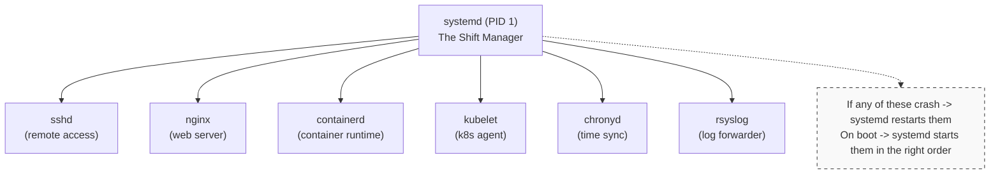
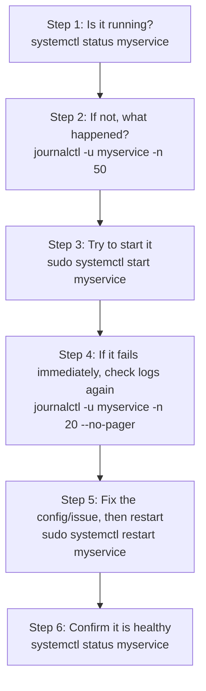

# Module 0.4: Services & Logs Demystified

This is an **Everyday Linux Use** module with `[QUICK]` complexity and an estimated completion time of 40 minutes. It assumes you can already inspect processes, read basic command output, and use `sudo` carefully when a command changes system state.

## Prerequisites

Before starting this module, make sure the process and resource survival skills from the previous lesson are fresh enough that service output will feel connected to the processes underneath it.
- **Required**: [Module 0.3: Process & Resource Survival Guide](../module-0.3-processes-resources/)
- **Helpful**: Have a Linux system available (VM, WSL, or native) with `sudo` access

## Learning Outcomes

After this module, you will be able to perform these service operations and explain your reasoning in a troubleshooting note, not merely repeat command syntax from memory.
- **Diagnose** a failing service by combining `systemctl status`, unit-file clues, and recent `journalctl` entries.
- **Compare** one-off background commands with supervised systemd services and choose the safer operating model.
- **Evaluate** whether a service should be started, stopped, enabled, disabled, restarted, or reloaded for a given scenario.
- **Implement** a repeatable log-investigation workflow using unit, boot, time-range, priority, and output-format filters.
- **Explain** how systemd, unit files, journald, syslog forwarding, and Kubernetes v1.35+ node services fit together during troubleshooting.

## Why This Module Matters

At a regional payment processor, an overnight kernel patch looked routine until the monitoring dashboard went silent for a cluster of database hosts. The databases were still accepting connections, SSH worked, and disk space was healthy, but the monitoring agent had been started manually during a previous incident and never enabled for boot. For two hours, the team had no reliable host-level metrics while a busy settlement window was underway, and the incident report estimated more than $180,000 in delayed reconciliation work, overtime, and customer-support churn from a failure that came down to one missing systemd command.

That kind of failure feels unfair when you are new to Linux because the machine looks alive from the outside. A shell command can start a program, `ps` can show a process, and a quick smoke test can pass, yet the service may still be absent after a reboot or may die silently after a crash. Production Linux work depends on a different mental model: important background programs are not merely processes, they are supervised services with explicit lifecycle rules, dependency ordering, restart behavior, resource controls, and logs captured in a central journal.

This module bridges the gap from "I can run a command" to "I can operate a server." You will learn how systemd acts as the service manager, how unit files describe what systemd should do, and how journald records the evidence you need when something fails. The same habits apply when debugging classic services like nginx and SSH, and they also apply when a Kubernetes v1.35+ node has kubelet or containerd problems underneath the cluster API.

The practical payoff is speed under pressure. When a service is down, you will not need to search the web for random restart recipes or copy commands from an old chat thread. You will know which layer owns the process, where the declared behavior lives, and which log query can prove whether your fix worked. That confidence matters because service outages usually combine a technical fault with a time constraint.

## From Processes to Services

In Module 0.3, you learned to inspect running processes and stop the ones that were wasting CPU or memory. That skill is still essential, but it is only half of the operational story because most server programs are meant to outlive your terminal. A web server, database, SSH daemon, log forwarder, container runtime, or kubelet should start during boot, keep running without a human session, report its output somewhere durable, and restart according to a clear policy when it crashes.

Running a command in the background is like leaving a note on the kitchen counter that says dinner is in the oven. It may work while everyone remembers the note, but it gives you no guarantee that the oven is still on after a power loss, no record of who changed the temperature, and no one assigned to notice if dinner burns. A service manager is closer to a restaurant shift manager: it knows who is scheduled, when dependencies are ready, where logs go, and what to do when a worker disappears.

| Running a Command | Running a Service |
|-------------------|-------------------|
| Dies when you close the terminal | Survives terminal closure and reboots |
| No automatic restart on crash | Restarts automatically if it fails |
| Logs go to your terminal (and get lost) | Logs captured and stored by journald |
| You have to manage it manually | systemd manages it for you |
| No dependency ordering | Starts after its dependencies are ready |

The table is not saying that background commands are useless. They are fine for short experiments, temporary diagnostics, or a one-time copy job where a human is watching the result. The danger starts when a team treats a shell trick as if it were an operating contract, because the shell trick does not encode boot behavior, health supervision, dependency ordering, or log retention in a way another operator can inspect at three in the morning.

A **daemon** is just a background process that does not need an interactive terminal. The traditional Unix naming convention often adds a trailing `d`, which is why you see `sshd` for remote access, `httpd` for Apache, `containerd` for containers, and `journald` for logs. The naming pattern is helpful, but it is not a rule; `kubelet` does not end in `d`, yet on a Kubernetes node it behaves like a critical daemon supervised by systemd.

The useful distinction is ownership. A process is something the kernel is currently executing, while a service is an operating-system promise about how that process should be launched, tracked, stopped, and observed. If the process exits, the kernel can report that fact, but systemd decides whether the exit was expected and whether another process should replace it. That is why process skills and service skills reinforce each other instead of competing.

**systemd** is the init system and service manager on most modern Linux distributions. It starts as PID 1, which means it is the first userspace process created by the kernel, and then it becomes responsible for bringing the machine from early boot into a usable operating state. It starts services, tracks their process groups, records status, applies configured resource controls, coordinates dependencies, and exposes a management interface through the `systemctl` command.



The diagram shows why service troubleshooting is a root skill for higher-level platforms. When Kubernetes says a node is `NotReady`, the visible symptom may be a cluster condition, but the underlying cause is often a Linux service such as kubelet, containerd, a CNI helper, or a DNS resolver. If you alias `kubectl` as `k`, as many operators do with `alias k=kubectl`, remember that `k logs` helps with pod output while `journalctl -u kubelet` helps with the node agent itself; those are related views, not replacements for each other.

Pause and predict: if `k get nodes` reports that a Kubernetes v1.35+ node is not ready, but `systemctl status kubelet` says the service is failed, which layer should you investigate first and why? The practical answer is the Linux service layer, because the cluster API is reporting a symptom from above while systemd and journald can show why the node agent stopped reporting in the first place.

```bash
alias k=kubectl
k get nodes
```

This mental model also explains why service names matter. When you ask systemd for `nginx`, it resolves that request to a unit named `nginx.service`, reads the unit metadata, and manages the processes that belong to that unit. You are no longer hunting for a random PID and guessing what launched it; you are asking the supervisor for the declared object that owns the lifecycle.

There is also a documentation benefit. A named service gives teammates a shared handle they can use in runbooks, alerts, dashboards, and postmortems. "Check `nginx.service`" is clearer than "find the web process and see if it looks right." Clear names reduce handoff friction because everyone can ask systemd the same question and compare the same fields.

## Managing Services with systemctl

`systemctl` is the command-line control surface for systemd, and most daily service work starts with a status check. A good status check is not just a yes-or-no question; it tells you whether the unit file loaded correctly, whether the service is enabled for boot, whether the process is currently active, which PID systemd considers the main process, and which recent log lines may explain the current state. Treat `systemctl status` as the service's medical chart, not just a traffic light.

```bash
# Check if nginx is running
systemctl status nginx
```

The example output below is worth reading slowly because each field answers a different operational question. Do not worry about memorizing every line; focus on learning where systemd reports load state, current activity, process identity, resource usage, and the cgroup tree that ties related processes together.

```
● nginx.service - A high performance web server
     Loaded: loaded (/lib/systemd/system/nginx.service; enabled; preset: enabled)
     Active: active (running) since Mon 2026-03-24 10:00:00 UTC; 2h ago
       Docs: man:nginx(8)
    Process: 1234 ExecStartPre=/usr/sbin/nginx -t -q -g daemon on;... (code=exited, status=0/SUCCESS)
   Main PID: 1235 (nginx)
      Tasks: 3 (limit: 4677)
     Memory: 5.2M
        CPU: 32ms
     CGroup: /system.slice/nginx.service
             ├─1235 "nginx: master process /usr/sbin/nginx ..."
             ├─1236 "nginx: worker process" "" "" "" "" "" ...
             └─1237 "nginx: worker process" "" "" "" "" "" ...
```

Pause and predict: look at the `Active:` line in the output above. It says `active (running)`, so what would you expect to see if the process had crashed during startup, and how would the `Main PID` field change? A crashed service usually moves toward `failed`, `inactive`, or an exited state, and the main PID may be absent because systemd has no live process to supervise.

| Field | What It Tells You |
|-------|-------------------|
| `Loaded: loaded` | The unit file exists and was read successfully |
| `enabled` | Will start automatically on boot |
| `Active: active (running)` | Currently running right now |
| `Main PID: 1235` | The main process ID |
| `Tasks: 3` | Number of processes/threads |
| `Memory: 5.2M` | Current memory usage |
| `CGroup` | The process tree for this service |

The colored dot at the start of the status output is useful when you are scanning quickly, but the text beside it is the part you should trust in notes and incident reports. Green active output means the current service process is running, white inactive output means it is stopped without necessarily being broken, and red failed output means systemd tried something and recorded a failure. In all three cases, the next question is not "what color is it" but "what state transition got us here."

Status output can also mislead you if you stop at the headline. A service may be active but unhealthy at the application layer, or failed because a pre-start validation command caught a bad configuration before the main process launched. Read the few journal lines embedded in status, then use `journalctl` for more context. The status page points you toward the evidence; it does not replace the evidence.

State-changing commands should be chosen based on the operational effect you want, not based on habit. Starting a service creates a current process if it is stopped, stopping a service intentionally removes it from service, restarting stops and starts it as a hard lifecycle transition, and reloading asks a running process to re-read configuration without necessarily dropping active work. Those verbs sound similar until you operate a load balancer, database, or API that has real users connected.

```bash
# Start a stopped service
sudo systemctl start nginx

# Stop a running service
sudo systemctl stop nginx

# Restart (stop + start) -- use when config changes need a full restart
sudo systemctl restart nginx

# Reload -- gracefully reload config without dropping connections
# Not all services support this
sudo systemctl reload nginx

# Restart only if already running (safe in scripts)
sudo systemctl try-restart nginx
```

Before running a restart during a real incident, ask what kind of work the service is holding. A stateless metrics sidecar may tolerate a quick restart, while a web server serving long downloads, an HAProxy process with thousands of active sessions, or a database accepting writes deserves more care. If the unit exposes `ExecReload`, a reload often lets the service adopt configuration changes while preserving existing connections, although support depends on the service design.

The restart-versus-reload decision is a small example of operational judgment. Use the bullets below as a starting rule, then check the unit file and service documentation when the service carries user traffic or state that could be disrupted.

- **restart** kills the process and starts a new one. Connections are dropped. Use when you need a clean slate.
- **reload** sends a signal, usually SIGHUP, telling the process to re-read its config. Existing connections stay alive. Use when you just changed a config file and the service supports it.

```bash
# Tip: try graceful reload first and fall back to restart
sudo systemctl reload-or-restart nginx
```

Enabling and starting are the pair that most often confuses new operators because one affects the current boot and the other affects future boots. `systemctl start nginx` makes nginx run now, but it says nothing about what should happen next Tuesday after the kernel is patched and the server reboots. `systemctl enable nginx` creates the boot-time relationship, but it does not have to create a running process immediately unless you add `--now`.

```bash
# Enable nginx to start on boot
sudo systemctl enable nginx

# Disable -- won't start on boot (but still running if already started)
sudo systemctl disable nginx

# Enable AND start in one command
sudo systemctl enable --now nginx

# Disable AND stop in one command
sudo systemctl disable --now nginx

# Check if a service is enabled
systemctl is-enabled nginx
# Output: enabled  (or: disabled, static, masked)
```

What does "enable" actually do? It creates a symbolic link in the directory for a target such as `multi-user.target`, which is the normal multi-user server state. The link tells systemd that when the system reaches that target, this service should be pulled in too, so boot behavior becomes visible on disk instead of living in someone's memory. That is why an incident review should check both `systemctl status` and `systemctl is-enabled` when a service matters after reboot.

```
/etc/systemd/system/multi-user.target.wants/nginx.service →
  /lib/systemd/system/nginx.service
```

Listing commands help you move from one service to the whole machine. During an incident, `systemctl --failed` is often the fastest way to discover that the visible application problem is not isolated, while `list-units` and `list-unit-files` distinguish running service instances from installed unit definitions. That distinction matters when a service exists on disk but is intentionally disabled, masked, templated, or only activated by another unit.

A useful operator habit is to ask two questions whenever you touch a service. First, what state do I want right now? Second, what state do I want after the next boot? Those questions map directly to `start` or `stop` for the current moment and `enable` or `disable` for future boot behavior. Many service incidents are really mismatches between those two answers.

```bash
# Show all running services
systemctl list-units --type=service --state=running

# Show all failed services (great for troubleshooting)
systemctl --failed

# Show all installed services (running and stopped)
systemctl list-unit-files --type=service
```

The key habit is to record both the service action and its intent. "Restarted nginx" is less useful than "reloaded nginx to apply a backend change without dropping existing sessions" or "disabled the experimental worker so it does not return after reboot." Service commands are small, but the intent behind them is what keeps handoffs clear and prevents the same outage from repeating after the next maintenance window.

War story: a platform team once chased a flaky internal dashboard for several days because the service looked healthy whenever someone checked it manually. The real issue appeared only after weekly host reboots, when a disabled metrics proxy failed to return. The fix was one enablement command, but the lesson was larger. A service can pass a live check and still fail the operational requirement if nobody verifies boot behavior.

## Why systemd and Not Just nohup?

`nohup` and a trailing ampersand are tempting because they let you walk away from a terminal while a command continues running. For a personal compile, a long archive operation, or a quick experiment on a lab machine, that may be acceptable. For a production application, it leaves too many questions unanswered: who restarts the process after a crash, where does output go, what starts it after reboot, what resource controls apply, and how does the next operator discover the intended lifecycle?

```bash
# The nohup approach -- fragile
nohup python /opt/myapp/app.py > /var/log/myapp.log 2>&1 &

# What happens when it crashes at 3 AM?
# Nothing. It stays dead. You get paged. You cry.
```

The fragile part is not that `nohup` is technically broken. The fragile part is that it converts a service decision into an unstructured shell side effect. The PID is not tied to a named unit, a restart policy is not encoded, boot ordering is not declared, and logging depends on redirection that might be mistyped, rotated incorrectly, or overwritten by a future command.

```bash
# The systemd approach -- robust
sudo systemctl start myapp

# What happens when it crashes at 3 AM?
# systemd restarts it automatically.
# Logs are captured in journald.
# You sleep peacefully.
```

| Feature | nohup | systemd Service |
|---------|-------|-----------------|
| Survives logout | Yes | Yes |
| Survives reboot | No | Yes (if enabled) |
| Auto-restart on crash | No | Yes |
| Log management | Manual | Automatic (journald) |
| Resource limits | Manual (ulimit) | Built-in (cgroups) |
| Dependency ordering | None | Full support |
| Status monitoring | `ps` + guessing | `systemctl status` |

The comparison is also about team cognition. When an operator sees a systemd unit, they can inspect it, ask whether it is enabled, read recent logs, and reason about dependencies in a standard format. When they see a bare process launched from an old shell, they have to reconstruct intent from history files, open file descriptors, process ancestry, or guesswork, and those clues are often gone by the time the incident begins.

This is why many teams treat service units as part of deployment hygiene. Even a small internal tool benefits from a clear start command, a working directory, environment handling, restart limits, and journal integration. Those details may feel formal for a small script, but they make the tool boring to operate. Boring is what you want from background software that supports something more important.

The bottom line is practical: `nohup` is fine for a quick one-off task, but anything that matters should be a service. That does not mean you need to write a custom unit in this module, but you do need to recognize when a background command is being asked to carry production reliability. If a program must survive reboot, restart after failure, preserve logs, or coordinate with the network, it belongs under systemd supervision.

## Reading Unit Files Without Writing Them Yet

Every service has a **unit file** that tells systemd how to manage it, and reading that file is one of the fastest ways to stop guessing. The unit file answers questions that status output only hints at: what command starts the service, what command validates configuration first, what signal reload uses, what dependencies influence ordering, and which target pulls the service in during boot. You do not need to write unit files yet, but you should be able to read one calmly during troubleshooting.

```bash
# View the unit file for nginx
systemctl cat nginx
```

```ini
[Unit]
Description=A high performance web server and reverse proxy server
Documentation=man:nginx(8)
After=network.target remote-fs.target nss-lookup.target
StartLimitIntervalSec=0

[Service]
Type=forking
PIDFile=/run/nginx.pid
ExecStartPre=/usr/sbin/nginx -t -q -g 'daemon on; master_process on;'
ExecStart=/usr/sbin/nginx -g 'daemon on; master_process on;'
ExecReload=/bin/sh -c "/bin/kill -s HUP $MAINPID"
ExecStop=-/sbin/start-stop-daemon --quiet --stop --retry QUIT/5 --pidfile /run/nginx.pid
TimeoutStopSec=5
KillMode=mixed

[Install]
WantedBy=multi-user.target
```

The `[Unit]` section describes identity and ordering. `Description` is the human label you see in status output, `Documentation` points to the manual or project docs, and `After` tells systemd to order this service after other units. A common beginner mistake is to treat `After=` as if it means "requires"; it does not. Ordering says when to start relative to another unit, while requirement relationships such as `Wants=` or `Requires=` describe what should be pulled in.

Think of ordering like a boarding line and requirements like an invitation list. `After=network.target` says this unit should board after the network target in the same transaction, but it does not automatically invite the network target to the transaction. Requirement directives decide what gets pulled in. Ordering directives decide relative timing once the participants are present.

| Directive | Meaning |
|-----------|---------|
| `Description` | Human-readable name shown in `systemctl status` |
| `After` | Start this service *after* these other units |
| `Documentation` | Where to find help |

The `[Service]` section describes execution. `ExecStart` is the command systemd runs, `ExecStartPre` is a pre-flight check, `ExecReload` is how reload works if the service supports it, and `Restart=` controls automatic recovery behavior. When a service fails quickly after a configuration edit, `ExecStartPre` is often the clue because many packages run a syntax check before replacing a working process with a broken one.

| Directive | Meaning |
|-----------|---------|
| `Type` | How systemd tracks the process (`simple`, `forking`, `oneshot`) |
| `ExecStart` | The command to run |
| `ExecStartPre` | Command to run before starting (e.g., config test) |
| `ExecReload` | Command for `systemctl reload` |
| `ExecStop` | Command for `systemctl stop` |
| `Restart` | When to auto-restart (`always`, `on-failure`, `no`) |

The `[Install]` section explains boot behavior. If the unit says `WantedBy=multi-user.target`, enabling the service creates a link from the target's `.wants` directory to the unit file. That is why the install section matters even though it does not directly start the current process: it declares how the unit participates in future boots.

| Directive | Meaning |
|-----------|---------|
| `WantedBy` | Which target pulls in this service (usually `multi-user.target`) |

The `Restart=` directive deserves special attention because it is the difference between a process that dies once and a service that tries to heal itself. `Restart=on-failure` is common for long-running daemons because a nonzero exit, signal, timeout, or watchdog failure should trigger recovery, while an intentional `systemctl stop` should not be treated as a crash. `Restart=always` is more aggressive and can be useful, but it can also hide crash loops if you do not watch the journal.

Restart policies should be paired with observability. Automatic recovery is valuable when a transient network error or rare crash would otherwise leave a service dead, but a rapid restart loop can consume CPU, flood logs, or mask a broken release. The journal will usually show repeated start attempts and failures. When you see that pattern, stop treating restart as a fix and start treating it as evidence.

Before running this on a real host, what output do you expect from `systemctl cat sshd` or `systemctl cat cron` on your distribution? Try to predict which command starts the service, which target enables it at boot, and whether reload is supported. Then compare your prediction to the unit file and notice how much operational behavior is declared in plain text.

When you edit a unit file later in your Linux journey, you will need `sudo systemctl daemon-reload` before systemd uses the changed file. This module focuses on reading rather than authoring, but the reload step appears in troubleshooting because operators often fix a unit on disk and then wonder why the old resource limit or command still appears in status. The reason is simple: systemd cached the unit definition and must be told to re-read it.

## Viewing Logs with journalctl

Services are much easier to diagnose when their output goes somewhere predictable, and journald is the collector that systemd uses for service stdout, stderr, kernel messages, and structured metadata. You read that journal with `journalctl`, which can feel overwhelming at first because it can show everything the machine has recorded. The trick is to narrow the journal by unit, boot, time, priority, and output format until the evidence matches the question you are asking.

```bash
# View ALL logs (careful -- this can be huge)
journalctl

# View logs and jump to the end (most recent)
journalctl -e

# Follow logs in real time (like tail -f)
journalctl -f
```

Starting with all logs is rarely the best move during an outage because the machine may have thousands of unrelated messages. The most useful filter for service work is `-u`, which means unit, because it connects logs to the same systemd object you inspected with `systemctl status`. Once you filter by unit, the log stream becomes an incident timeline for that service instead of a haystack of every kernel, cron, SSH, package, and application message on the host.

Good log reading starts with a hypothesis. If you think a service failed during boot, use `-b` and a unit filter. If you think a deployment broke it ten minutes ago, use a short `--since` window. If you think noisy access logs are hiding a crash, add a priority filter. Each filter should remove irrelevant information while preserving the evidence needed to confirm or reject your hypothesis.

```bash
# Logs for nginx only
journalctl -u nginx

# Logs for ssh daemon
journalctl -u sshd

# Follow nginx logs in real time
journalctl -u nginx -f
```

Try it now: run `journalctl -b -p err` on your system. This shows error-level logs since your last boot, which often reveals failed timers, denied permissions, or services that recovered before you noticed them. If you find entries you do not understand, resist the urge to fix everything at once; first connect each error to a unit and decide whether it is current, historical, harmless, or part of the symptom you are investigating.

Limiting output prevents log reading from becoming scrolling theater. `-n` gives you recent context, `-f` keeps the stream open for live observation, and `--no-pager` makes output friendlier for scripts or copy-paste into incident notes. A common workflow is to read the last small chunk, perform one service action, then follow new entries to verify whether the expected state transition happened.

```bash
# Show only the last 20 log lines
journalctl -u nginx -n 20

# Show only the last 50 lines and follow new ones
journalctl -u nginx -n 50 -f
```

Time filters are how you turn "something broke overnight" into a bounded question. `--since "1 hour ago"` is useful during active incidents, `--since today` works for daily checks, and explicit ranges are better for postmortems because they make your evidence reproducible. `-b` narrows the view to the current boot, which is often exactly what you want after a restart because it removes stale failures from previous operating sessions.

```bash
# Logs from the last hour
journalctl -u nginx --since "1 hour ago"

# Logs from today
journalctl -u nginx --since today

# Logs from a specific time range
journalctl -u nginx --since "2026-03-24 09:00" --until "2026-03-24 10:00"

# Logs since last boot
journalctl -u nginx -b
```

Combining filters is where `journalctl` becomes an investigative tool rather than a log viewer. If nginx has been running all day, a unit filter alone might still show access noise, reload messages, worker lifecycle messages, and routine notices. Adding a time window, a line limit, and sometimes a priority filter gives you the smallest useful evidence set, which is exactly what you want when another engineer needs to review your reasoning.

```bash
# Last 30 nginx log lines from today, then follow new ones
journalctl -u nginx --since today -n 30 -f

# All error-level logs for any service in the last hour
journalctl -p err --since "1 hour ago"
```

Priority filtering works because log entries carry severity metadata. The names map to numeric syslog levels where `emerg` is the highest severity and `debug` is the most verbose. `journalctl -p err` includes errors and more severe entries, so it is useful when you need to cut through informational noise without losing critical failure evidence.

| Priority | Keyword | What It Means |
|----------|---------|---------------|
| 0 | emerg | System is unusable |
| 1 | alert | Immediate action needed |
| 2 | crit | Critical conditions |
| 3 | err | Error conditions |
| 4 | warning | Warning conditions |
| 5 | notice | Normal but significant |
| 6 | info | Informational |
| 7 | debug | Debug-level messages |

Output format matters when the audience changes. Human-readable short output is comfortable in a terminal, precise timestamps are better when correlating events with monitoring, and JSON output is useful when another tool needs to parse fields reliably. Do not reach for JSON because it looks advanced; reach for it when the next step is structured filtering with a tool such as `jq` or when a postmortem needs exact timestamps and metadata.

```bash
# No pager -- good for piping to other commands
journalctl -u nginx --no-pager

# JSON output -- good for parsing with jq
journalctl -u nginx -o json-pretty -n 5

# Short output with precise timestamps
journalctl -u nginx -o short-precise
```

There is one more operational wrinkle: journald can be volatile or persistent depending on distribution defaults and configuration. If logs are stored only in memory, a reboot removes older journal entries, which can make post-crash diagnosis painful. Persistent journal storage keeps records under `/var/log/journal`, and many teams enable it on servers where boot failures, node crashes, or intermittent hardware events need to be investigated after the machine returns.

Persistent logging has tradeoffs, so it is still an engineering choice. Stored journals consume disk space, need retention controls, and may contain sensitive operational details that deserve the same access discipline as other logs. The value is that you can investigate what happened before the reboot that cleared the symptom. For servers with on-call expectations, that evidence is usually worth managing deliberately.

## Putting It All Together: A Troubleshooting Workflow

Experienced Linux operators tend to debug services in a loop, not in a single command. They first ask systemd for current state, then ask journald for recent evidence, then make the smallest reasonable change, then check state and logs again. This rhythm prevents two common incident mistakes: guessing from memory without reading evidence, and making multiple changes before you know which one mattered.



The flowchart is intentionally simple because a reliable troubleshooting loop beats a clever one-liner. `systemctl status` tells you what systemd thinks, `journalctl -u` tells you what the service reported, a start or restart tests whether the condition is still present, and a final status check confirms the service reached the intended state. If the unit fails immediately, the second journal read is usually more useful than the first because it captures the fresh failure caused by your test.

Consider a realistic nginx failure after someone edits configuration. The status output may say the service failed, while the unit file shows an `ExecStartPre` syntax check, and the journal shows the exact config line that failed validation. If you jump straight to restarting repeatedly, you create noise; if you read the unit and journal together, you learn that the service is protecting you from replacing a known-good process with a broken configuration.

The same workflow applies to kubelet, containerd, etcd, chronyd, sshd, and custom application services. The names change, but the questions do not: is the service loaded, is it enabled when it needs to survive reboot, is it active now, what command starts it, what dependencies matter, what did it log recently, and what changed immediately before failure? Those questions keep your debugging grounded when dashboards, alerts, and human pressure are all competing for attention.

Use the loop even when the fix seems obvious. If a service is stopped, start it, but then read the logs that explain why it stopped. If a service is failed, restart it, but then confirm whether the failure returns. If a reload succeeds, read enough journal output to prove the new configuration was accepted. The loop turns command execution into diagnosis.

For postmortems, write the loop as a short timeline. Include the initial status, the most relevant journal line, the command you ran, and the verification result. That style avoids vague phrases like "service was broken" and replaces them with facts another engineer can audit. It also teaches future responders which observation mattered most.

## Patterns & Anti-Patterns

For this introductory module, the most useful pattern is evidence-first service operation. Start by reading `systemctl status`, then read the unit-specific journal, then choose the least disruptive lifecycle action that matches the evidence. This works because it ties every command to a question, which means your incident notes can explain why you reloaded instead of restarted, enabled instead of started, or inspected the unit file instead of killing a PID.

The pattern scales because it is independent of service complexity. A tiny cron replacement, an nginx reverse proxy, and kubelet on a Kubernetes node all expose status, unit metadata, and journal output through the same manager. You will still need service-specific knowledge for deeper fixes, but the first pass stays consistent. Consistency is valuable when incidents cross team boundaries.

The matching anti-pattern is process hunting without supervisor context. Teams fall into it when they are comfortable with `ps`, `top`, and `kill`, but have not internalized that systemd may intentionally restart a process they kill manually. The better alternative is to manage intentional state through `systemctl`, then use process tools as supporting evidence when you need CPU, memory, file descriptor, or cgroup details.

Another pattern is to treat boot behavior as a separate acceptance criterion. After installing a service, verify both the current state and the enabled state, because "running now" and "returns after maintenance" are different promises. The anti-pattern is celebrating a successful manual start while forgetting that a future reboot will erase the apparent fix, which is exactly how monitoring agents, backup workers, and custom data collectors disappear after patch windows.

## When You'd Use This vs Alternatives

Use systemd when a program must behave like part of the server: it should start at boot, restart according to policy, log through the journal, expose status, and coordinate with dependencies. Use a shell background job only when the task is temporary, low risk, and supervised by the person who launched it. Use a terminal multiplexer such as `tmux` when you need an interactive long-running session, but do not confuse that with production service management.

Use `systemctl reload` when the service explicitly supports a graceful configuration reload and preserving connections matters. Use `systemctl restart` when the service needs a clean process, when reload is unsupported, or when the change affects startup-only behavior. Use `journalctl -u service` when you need service evidence, and use application-specific logs or `k logs` when the failure is inside a pod or program that writes its own separate log stream.

Use `systemctl cat` when the question is about declared behavior rather than current behavior. Status tells you what happened recently, but the unit file tells you what should happen by design. That difference matters for dependency failures, reload support, restart policy, working directories, and boot targets. Many investigations become shorter once you stop guessing and read the contract.

Which approach would you choose here and why: a data collector starts successfully after installation, must run after every reboot, and occasionally exits when a remote API times out. A plain background command can launch it today, but a systemd unit with enablement, dependency ordering, journald logs, and a measured restart policy is the right operational answer because the requirement is reliability over time, not just execution once.

## Did You Know?

- **The word "daemon" comes from Greek mythology and early Unix culture.** Maxwell's daemon was an 1860s thought experiment about a tiny background worker, and BSD Unix later adopted the term for background processes; that is why names like `sshd`, `httpd`, and `systemd-journald` still carry the convention.
- **systemd manages much more than services.** On a typical server it may coordinate login sessions, temporary files, timers, mounts, sockets, DNS resolution, network setup, time synchronization, and more than 100 units, which is why `systemctl list-units` often shows far more than application daemons.
- **journald can preserve logs across reboots when persistent storage is enabled.** With `Storage=persistent` or an existing `/var/log/journal` directory, journal records can survive restart, which is critical when the important clue happened before the last crash.
- **A boot-time dependency mistake can look like an application bug.** If a service starts before networking is online, it may fail with "Network is unreachable" and then work perfectly when restarted later, because the root problem is startup ordering rather than code.

## Common Mistakes

| Mistake | Why It Happens | How to Fix It |
|---------|----------------|---------------|
| Forgetting `sudo` for start/stop | State-changing operations require privileges, so `systemctl start` fails with permission denied | Use `sudo systemctl start service` or `sudo systemctl stop service` for lifecycle changes |
| Confusing `enable` with `start` | "Running now" and "starts on boot" sound similar but are stored differently | Use `systemctl enable --now service` when you need both current execution and boot persistence |
| Not checking logs after a failure | People guess from the last change instead of reading the service's recorded evidence | Run `journalctl -u service -n 30 --no-pager` immediately after a failed start or restart |
| Using `kill` instead of `systemctl stop` | systemd may interpret the process exit as a crash and restart it under the unit policy | Use `sudo systemctl stop service` when the desired state is intentionally stopped |
| Editing a unit file without daemon-reload | systemd keeps the old unit definition in memory until told to re-read unit files | Run `sudo systemctl daemon-reload`, then restart the service and verify the new status |
| Running production apps with nohup | A shell trick does not encode restart policy, boot behavior, dependency ordering, or journal integration | Create or use a proper systemd service unit for anything that must operate reliably |
| Ignoring reload support | Restarting a busy service can drop active work when a graceful reload would have applied the change | Check `systemctl cat service` for `ExecReload`, then use `reload-or-restart` when appropriate |

## Quiz

<details><summary>Scenario 1: You started `datadog-agent` manually, the host rebooted after patching, and monitoring disappeared even though SSH and the database are healthy. What did you forget, and why did the failure wait until reboot?</summary>

You forgot to enable the service for boot with `systemctl enable datadog-agent`, or to use `systemctl enable --now datadog-agent` when installing it. `systemctl start` only creates a running process during the current boot, while enablement creates the target relationship systemd reads during future boots. The failure waited until reboot because nothing was wrong with the running process before maintenance; the missing part was the boot contract. A good post-fix check verifies both `systemctl status datadog-agent` and `systemctl is-enabled datadog-agent`.

</details>

<details><summary>Scenario 2: HAProxy is serving thousands of active sessions, and you just added a backend server to its configuration. Why is a blind `systemctl restart haproxy` risky, and what should you try first?</summary>

A restart stops the current process and starts a new one, which can interrupt active sessions even if the new configuration is valid. If HAProxy supports reload on that system, `sudo systemctl reload haproxy` or `sudo systemctl reload-or-restart haproxy` is the safer first move because it asks the service to re-read configuration more gracefully. You should still check the unit file for `ExecReload` and read recent journal entries afterward. The reasoning is not that restart is always bad; it is that the lifecycle action should match the traffic risk.

</details>

<details><summary>Scenario 3: Developers can reproduce a `payment-processor` error only during test transactions. Which journal command gives you recent context and then streams new unit logs live?</summary>

Use `journalctl -u payment-processor -n 20 -f`. The unit filter removes unrelated machine logs, the line limit gives immediate context before the test starts, and follow mode keeps the terminal open for new entries. This is better than `journalctl -f` alone because a busy host may be writing many unrelated events at the same time. After the test, you can rerun with `--since` and `--until` if you need a bounded record for an incident note.

</details>

<details><summary>Scenario 4: You edited `/etc/systemd/system/backup-worker.service` to raise a memory limit, restarted the service, and status still shows the old value. What step did you miss?</summary>

You missed `sudo systemctl daemon-reload`. systemd reads unit definitions into memory, so editing the file on disk does not automatically replace the manager's cached view. After `daemon-reload`, restart the service again and verify the status or cgroup settings reflect the new limit. The important lesson is to separate "file saved" from "service manager re-read the file" when unit behavior changes.

</details>

<details><summary>Scenario 5: nginx stopped overnight, but `journalctl -u nginx --since yesterday` shows a huge amount of routine traffic. How do you narrow the evidence to likely failures?</summary>

Add a priority filter, such as `journalctl -u nginx --since yesterday -p err`. The `-p err` option includes error-level entries and more severe messages, which removes normal informational noise while preserving likely failure evidence. If the output is still too broad, add an explicit `--until` time based on monitoring or user reports. You are narrowing by unit, time, and severity so the remaining entries answer the incident question.

</details>

<details><summary>Scenario 6: A custom `data-fetcher` fails during boot with "Network is unreachable" but works when restarted later. What is structurally missing from the unit file?</summary>

The unit likely lacks network ordering such as `After=network-online.target`, and depending on distribution setup it may also need a relationship that pulls the online target into the boot transaction. systemd starts independent services in parallel to boot quickly, so a network-using program can run before routes or addresses are ready if no ordering is declared. The later manual restart succeeds because the network has finished coming up by then. This is a service dependency problem, not necessarily an application bug.

</details>

<details><summary>Scenario 7: A developer kills a runaway `inventory-sync` PID with `kill -9`, but the process returns with a new PID seconds later. Why did that happen, and what command expresses the intended state?</summary>

systemd was supervising the service and interpreted the killed process as an unexpected failure, so the unit's restart policy created a replacement process. `kill -9` only talks to the process; it does not tell the service manager that the desired state is stopped. The correct command is `sudo systemctl stop inventory-sync`, followed by `systemctl status inventory-sync` to verify it is intentionally inactive. If it must not return after reboot either, also disable it.

</details>

## Hands-On Exercise

### Managing nginx from Boot to Logs

**Objective**: Install nginx, manage its lifecycle with systemctl, investigate its logs with journalctl, and connect every command you run to a specific service-management question.

**Environment**: Any Linux system with `apt` (Ubuntu/Debian). If using a different distribution, replace `apt install` with your package manager.

This exercise deliberately uses nginx because it has visible status changes, a real unit file, reload behavior, and journal entries that are easy to observe. If you cannot install packages on your current machine, use an existing service such as `sshd`, `cron`, or `systemd-resolved` for the read-only status and journal tasks, then skip the install and port-listening checks. The learning goal is not nginx itself; the goal is to practice the lifecycle and evidence loop until the commands feel connected.

Take notes as you work. For each step, write the command, the state you expected, and the evidence that confirmed or contradicted it. This slows the lab slightly, but it makes the practice far more useful. Real troubleshooting is not measured by how many commands you can run; it is measured by whether each command reduces uncertainty.

#### Step 1: Install nginx

```bash
# Update package lists and install nginx
sudo apt update && sudo apt install -y nginx
```

#### Step 2: Check the Status

```bash
# See if nginx is running after install
systemctl status nginx
```

You should see `Active: active (running)` on a normal Debian or Ubuntu installation because nginx starts automatically after installation. If your system shows a different state, read the recent journal entries before continuing, because the difference itself is useful practice.

#### Step 3: Stop nginx

```bash
# Stop the service
sudo systemctl stop nginx

# Verify it stopped
systemctl status nginx
# Should show: Active: inactive (dead)

# Confirm nothing is listening on port 80
sudo ss -tlnp | grep :80
# Should show no output
```

#### Step 4: Start nginx

```bash
# Start it again
sudo systemctl start nginx

# Verify it is running
systemctl status nginx
# Should show: Active: active (running)

# Confirm port 80 is open
sudo ss -tlnp | grep :80
# Should show nginx listening
```

#### Step 5: Restart nginx

```bash
# Restart (stop + start)
sudo systemctl restart nginx

# Check the PID changed (proves it actually restarted)
systemctl status nginx
# Note the Main PID -- it should be different from Step 4
```

#### Step 6: View Recent Logs

```bash
# Show the last 20 log entries for nginx
journalctl -u nginx -n 20

# You should see entries for the stop, start, and restart you just did
# Look for lines like:
#   Stopping A high performance web server...
#   Stopped A high performance web server.
#   Starting A high performance web server...
#   Started A high performance web server.
```

#### Step 7: Follow Logs in Real Time

```bash
# In one terminal, follow nginx logs
journalctl -u nginx -f

# In another terminal, restart nginx to see live log entries
sudo systemctl restart nginx

# You should see the restart events appear in real time
# Press Ctrl+C to stop following
```

#### Step 8: Enable on Boot

```bash
# Check if nginx is currently enabled for boot
systemctl is-enabled nginx
# On Ubuntu, this likely shows "enabled" (installed services are often enabled by default)

# If it shows "disabled", enable it:
sudo systemctl enable nginx

# Verify
systemctl is-enabled nginx
# Should show: enabled
```

#### Step 9: View the Unit File

```bash
# Read nginx's unit file to understand how it is managed
systemctl cat nginx

# Look for:
#   - What command it runs (ExecStart)
#   - What it depends on (After=)
#   - How it handles reload (ExecReload)
```

### Solutions

<details><summary>Solution guidance for lifecycle checks</summary>

The exact process IDs and timestamps will differ on every system, so judge success by state transitions rather than matching output byte for byte. After stopping nginx, `systemctl status nginx` should show an inactive state and `ss` should not show nginx listening on port 80. After starting or restarting nginx, status should return to active and `ss` should show a listener. The restart step should produce a different main PID because restart replaces the process.

</details>

<details><summary>Solution guidance for log checks</summary>

The journal should show stop, start, and restart messages generated by systemd and nginx around the time you performed the actions. If you do not see entries, add `--since "10 minutes ago"` or `--no-pager` to make the output easier to inspect. In follow mode, new entries should appear immediately after the second terminal restarts nginx. The important habit is to connect each service action to the evidence it leaves behind.

</details>

<details><summary>Solution guidance for unit-file reading</summary>

In the unit output, find `ExecStart` for the command that launches nginx, `ExecReload` for graceful reload behavior, and `WantedBy=multi-user.target` for boot enablement. You may also see `ExecStartPre`, which validates configuration before the main service starts. If your distribution stores units in a different path, trust `systemctl cat nginx` because it shows the active unit content systemd uses.

</details>

### Success Criteria

- [ ] nginx installed and initially running
- [ ] Successfully stopped nginx and verified it was inactive
- [ ] Successfully started nginx and verified it was active
- [ ] Restarted nginx and confirmed the PID changed
- [ ] Viewed the last 20 log entries with `journalctl -u nginx -n 20`
- [ ] Followed logs in real time with `journalctl -u nginx -f` and saw restart events
- [ ] Confirmed nginx is enabled on boot with `systemctl is-enabled nginx`
- [ ] Read the unit file with `systemctl cat nginx` and identified ExecStart

When you finish, write down the shortest reliable troubleshooting loop you used. It should include a status check, a unit-specific journal query, one lifecycle action, and a verification step. That note becomes your personal runbook pattern for the next service you investigate, whether it is nginx on a lab VM or kubelet on a Kubernetes node.

## Next Module

In **[Module 0.5: Everyday Networking Tools](../module-0.5-networking-tools/)**, you will learn how to check network connectivity, inspect open ports, and troubleshoot DNS, which are the essential networking commands every Linux user needs after they can manage services and read logs.

## Further Reading

- [systemd for Administrators (Lennart Poettering's Blog Series)](https://0pointer.de/blog/projects/systemd-for-admins-1.html)
- [journalctl Man Page](https://www.freedesktop.org/software/systemd/man/journalctl.html)
- [systemctl Man Page](https://www.freedesktop.org/software/systemd/man/systemctl.html)
- [Understanding Systemd Units and Unit Files (DigitalOcean)](https://www.digitalocean.com/community/tutorials/understanding-systemd-units-and-unit-files)
- [systemd.unit Man Page](https://www.freedesktop.org/software/systemd/man/systemd.unit.html)
- [systemd.service Man Page](https://www.freedesktop.org/software/systemd/man/systemd.service.html)
- [journald.conf Man Page](https://www.freedesktop.org/software/systemd/man/journald.conf.html)
- [systemd.special Man Page](https://www.freedesktop.org/software/systemd/man/systemd.special.html)
- [Ubuntu Manpage: systemctl](https://manpages.ubuntu.com/manpages/noble/man1/systemctl.1.html)
- [Red Hat Enterprise Linux: Managing systemd](https://docs.redhat.com/en/documentation/red_hat_enterprise_linux/9/html/configuring_basic_system_settings/managing-systemd_configuring-basic-system-settings)
- [Kubernetes Node Components](https://kubernetes.io/docs/concepts/overview/components/#node-components)
