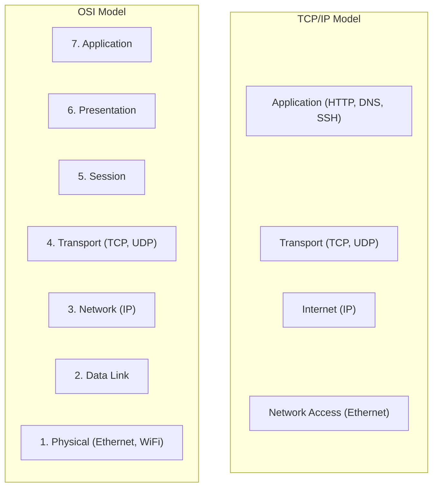
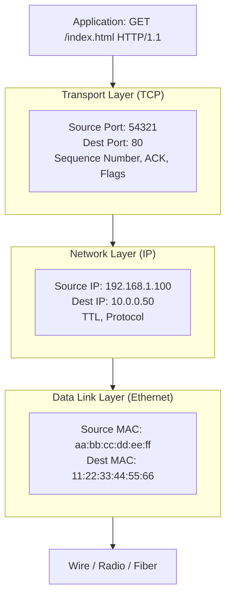
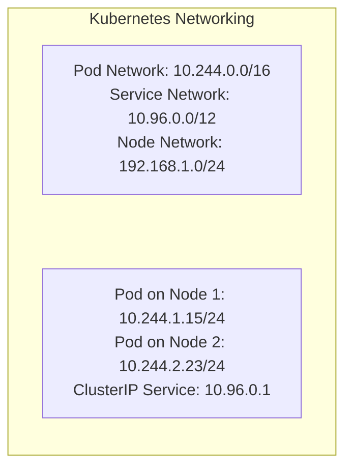
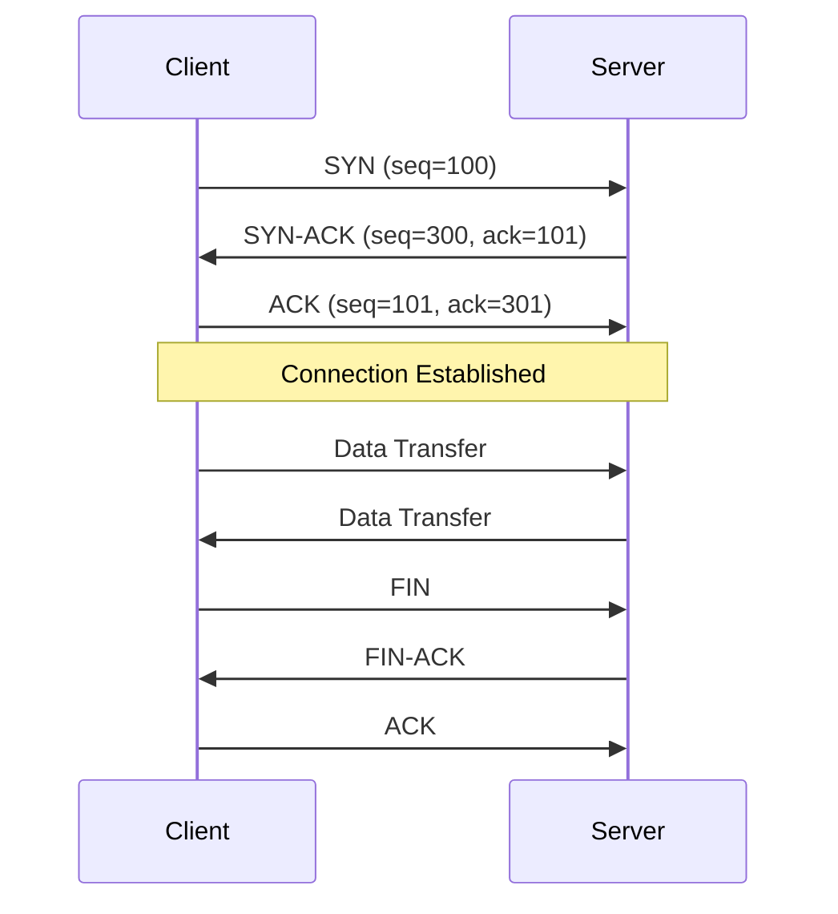
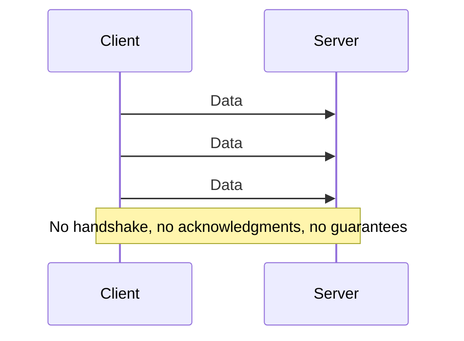
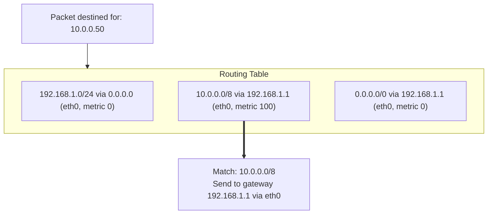

> **Linux Foundations** | Complexity: `[MEDIUM]` | Time: 30-35 min

## Prerequisites

Before starting this module:
- **Required**: Basic understanding of what networks are
- **Helpful**: [Module 1.1: Kernel & Architecture](/linux/foundations/system-essentials/module-1.1-kernel-architecture/)

---

## What You'll Be Able to Do

After this module, you will be able to:
- **Trace** a TCP connection from SYN to FIN and explain what happens at each step
- **Calculate** subnet ranges from CIDR notation and determine if two IPs are on the same network
- **Diagnose** network issues by interpreting ping, traceroute, and ss output
- **Explain** how Linux routing tables determine where packets go

---

## Why This Module Matters

Every Kubernetes pod, every service, every ingress request—they all ride on TCP/IP. When networking doesn't work, you need to understand the fundamentals.

Understanding TCP/IP helps you:

- **Debug connectivity** — Why can't my pod reach this service?
- **Understand Kubernetes networking** — How do Services, NodePorts, LoadBalancers work?
- **Troubleshoot performance** — Is it latency? Packet loss? Wrong routing?
- **Configure networks** — Subnets, CIDR, routes

When `curl` hangs, when packets disappear, when latency spikes—you need TCP/IP knowledge.

---

## Did You Know?

- **TCP was designed to survive nuclear war** — The Internet's predecessor, ARPANET, was funded by DARPA. TCP/IP's ability to route around failures comes from this military origin.

- **The 3-way handshake (SYN, SYN-ACK, ACK) takes 1.5 round trips** — This is why TCP connections have higher latency than UDP. For a 100ms RTT, that's 150ms just to establish a connection.

- **Linux can handle millions of concurrent TCP connections** — With proper tuning (see sysctl settings), a single Linux server can maintain millions of connections. The kernel's networking stack is remarkably efficient.

- **IP addresses are just 32 bits (IPv4) or 128 bits (IPv6)** — That's it! All the routing magic happens with these simple numbers. IPv4's 32 bits give us ~4.3 billion addresses, which we've exhausted, hence IPv6.

---

## The Network Stack

### OSI Model vs TCP/IP Model



### How Data Flows



---

## IP Addressing

### IPv4 Address Structure

```text
IP Address: 192.168.1.100
Binary:     11000000.10101000.00000001.01100100

Subnet Mask: 255.255.255.0 (or /24)
Binary:      11111111.11111111.11111111.00000000

Network:     192.168.1.0   (first 24 bits)
Host:        .100          (last 8 bits)
Broadcast:   192.168.1.255 (all host bits = 1)
```

> **Stop and think**: If your pod gets the IP address 10.244.1.15/24, what is the highest IP address that can exist in that exact same subnet before traffic needs to go through a router?

### CIDR Notation

| CIDR | Subnet Mask | Hosts | Common Use |
|------|-------------|-------|------------|
| /32 | 255.255.255.255 | 1 | Single host |
| /24 | 255.255.255.0 | 254 | Small network |
| /16 | 255.255.0.0 | 65,534 | Medium network |
| /8 | 255.0.0.0 | 16M | Large network |

### Private IP Ranges

| Range | CIDR | Class | Use |
|-------|------|-------|-----|
| 10.0.0.0 - 10.255.255.255 | 10.0.0.0/8 | A | Large orgs |
| 172.16.0.0 - 172.31.255.255 | 172.16.0.0/12 | B | Medium orgs |
| 192.168.0.0 - 192.168.255.255 | 192.168.0.0/16 | C | Home/small |

### Kubernetes IP Ranges



### Viewing IP Configuration

```bash
# Show all interfaces
ip addr

# Show specific interface
ip addr show eth0

# Legacy command
ifconfig

# Show IPv4 only
ip -4 addr

# Brief format
ip -br addr
```

---

## TCP vs UDP

> **Pause and predict**: If a client sends a SYN packet to a server, but the server's application has crashed and isn't listening on that port, what will the server's OS network stack send back?

### TCP: Reliable, Ordered



TCP Features:
- **Reliable** — Retransmits lost packets
- **Ordered** — Packets delivered in sequence
- **Connection-oriented** — Handshake required
- **Flow control** — Sender adjusts to receiver capacity
- **Congestion control** — Adapts to network conditions

### UDP: Fast, Simple



UDP Features:
- **Fast** — No connection overhead
- **Simple** — Just send data
- **Unreliable** — Packets can be lost
- **Unordered** — Packets can arrive out of order
- **No flow control** — Sender can overwhelm receiver

### When to Use Which

| TCP | UDP |
|-----|-----|
| HTTP/HTTPS | DNS (queries) |
| SSH | DHCP |
| Database connections | Video streaming |
| API calls | Gaming |
| File transfer | VoIP |

---

## Routing

> **Stop and think**: If a Linux server has two network interfaces (eth0 and eth1) and receives a request on eth0, does it always send the reply back out through eth0?

### How Routing Works



### Viewing Routes

```bash
# Show routing table
ip route

# Legacy command
route -n
netstat -rn

# Example output:
# default via 192.168.1.1 dev eth0 proto dhcp metric 100
# 10.244.0.0/16 via 10.244.0.0 dev cni0
# 192.168.1.0/24 dev eth0 proto kernel scope link src 192.168.1.100
```

### Kubernetes Routing

```bash
# Pod-to-pod routing on same node
10.244.1.0/24 dev cni0  # Local pods

# Pod-to-pod routing across nodes (example with Flannel)
10.244.2.0/24 via 192.168.1.102 dev eth0  # Pods on node2

# Default route for external traffic
default via 192.168.1.1 dev eth0
```

### Adding Routes

```bash
# Add route
sudo ip route add 10.0.0.0/8 via 192.168.1.1

# Add default gateway
sudo ip route add default via 192.168.1.1

# Delete route
sudo ip route del 10.0.0.0/8

# Routes are not persistent! Use netplan/NetworkManager for persistence
```

---

## Ports and Sockets

> **Pause and predict**: If you run a Node.js app as a standard non-root user and tell it to listen on port 80, what will happen when you start the app?

### Port Ranges

| Range | Name | Use |
|-------|------|-----|
| 0-1023 | Well-known | System services (requires root) |
| 1024-49151 | Registered | Applications |
| 49152-65535 | Dynamic/Ephemeral | Client connections |

### Common Ports

| Port | Service | Protocol |
|------|---------|----------|
| 22 | SSH | TCP |
| 53 | DNS | UDP/TCP |
| 80 | HTTP | TCP |
| 443 | HTTPS | TCP |
| 6443 | Kubernetes API | TCP |
| 10250 | Kubelet | TCP |
| 2379 | etcd | TCP |

### Viewing Connections

```bash
# Show all listening ports
ss -tlnp
# t=TCP, l=listening, n=numeric, p=process

# Show all connections
ss -tanp

# Legacy netstat
netstat -tlnp

# Find what's using a port
ss -tlnp | grep :80
lsof -i :80
```

---

## Practical Diagnostics

### Connectivity Testing

```bash
# Basic ping
ping -c 4 8.8.8.8

# TCP connectivity test
nc -zv 10.0.0.50 80
# or
curl -v telnet://10.0.0.50:80

# Test with timeout
timeout 5 bash -c "</dev/tcp/10.0.0.50/80" && echo "Open" || echo "Closed"
```

### Path Discovery

```bash
# Trace route
traceroute 8.8.8.8
# or
mtr 8.8.8.8

# TCP traceroute (for firewalled networks)
traceroute -T -p 443 8.8.8.8
```

### Interface Statistics

```bash
# Interface stats
ip -s link

# Detailed stats
cat /proc/net/dev

# Watch in real-time
watch -n1 'cat /proc/net/dev'
```

---

## Common Mistakes

| Mistake | Problem | Solution |
|---------|---------|----------|
| Wrong subnet mask | Can't reach hosts | Verify CIDR notation |
| Missing default route | Can't reach internet | Add default gateway |
| Firewall blocking | Connection refused/timeout | Check iptables/firewalld |
| Port already in use | Service won't start | Find and stop conflicting service |
| MTU mismatch | Connection hangs mid-transfer | Ensure consistent MTU |
| DNS but no route | Resolves but can't connect | Check routing table |

---

## Quiz

### Question 1
You are troubleshooting a connection issue between two Kubernetes nodes. Node A has the IP `192.168.1.50/24` and Node B has the IP `192.168.2.10/16`. Node A is trying to reach Node B directly without going through the default gateway, but the connection is failing. Why is this happening, and how does the subnet mask explain the failure?

<details>
<summary>Show Answer</summary>

Node A and Node B have mismatched subnet masks, leading to a one-way routing black hole. When Node A (`/24`) looks at Node B's IP (`192.168.2.10`), it calculates that Node B is on a different network (since the `/24` means Node A only considers `192.168.1.X` as local). Therefore, Node A sends the traffic to its default gateway. However, Node B (`/16`) considers any `192.168.X.X` address to be on its local network. If Node B tries to reply, it skips the gateway and tries to reach Node A directly via ARP, which may fail if they are physically on different broadcast domains.

</details>

### Question 2
You deploy a new metrics collection daemon to your cluster that streams thousands of tiny telemetry data points per second to a central server. You notice that when the network gets slightly congested, the daemon's memory usage spikes dramatically and it eventually crashes. The daemon is currently configured to use TCP. Why might switching to UDP solve this specific crash, and what tradeoff would you be making?

<details>
<summary>Show Answer</summary>

The crash is likely caused by TCP's reliability and congestion control mechanisms queuing up data in memory when the network slows down. TCP guarantees delivery, so if packets are dropped due to congestion, the operating system holds unacknowledged data in buffers until it can successfully retransmit them. By switching to UDP, you eliminate these buffers because UDP simply fires the packets onto the network and forgets them, regardless of network conditions. This prevents the memory spike and crash, but the tradeoff is that you will permanently lose some telemetry data points during periods of network congestion.

</details>

### Question 3
You are configuring a custom Linux router for a bare-metal Kubernetes cluster. You have added a route `10.244.0.0/16 via 192.168.1.50` to handle Pod traffic, and you have a default route `default via 192.168.1.1`. A packet arrives destined for `10.244.5.10`. How does the Linux kernel decide which route to use, and where does the packet go?

<details>
<summary>Show Answer</summary>

The Linux kernel routes the packet to `192.168.1.50` because it always uses the "longest prefix match" rule. Even though the default route (`0.0.0.0/0`) technically covers the destination IP, the `10.244.0.0/16` route is more specific because its subnet mask is longer (16 bits vs 0 bits). The kernel evaluates all available routes, finds the one with the most specific matching network block, and ignores broader routes. If the destination had been `10.245.5.10`, it would have missed the `/16` route and fallen back to the default gateway at `192.168.1.1`.

</details>

### Question 4
You are trying to start a new Nginx ingress controller on a Linux node, but it instantly fails with a "bind: address already in use" error for port 443. You run `ping localhost` and get a response, so the network stack is up. What exact command would you run to find the culprit, and what specific information in the output tells you which process to kill?

<details>
<summary>Show Answer</summary>

You should run `ss -tlnp | grep :443` (as root or with sudo) to find the conflicting process. The `-t` flag filters for TCP, `-l` shows only listening sockets, `-n` prevents slow DNS resolution of IP addresses, and `-p` shows the process information. In the output, you must look at the far right column for the `users:` section, which will display the process name (like `apache2` or `haproxy`) and its exact Process ID (PID). You can then use that specific PID with the `kill` command to terminate the conflicting service and free up port 443.

</details>

### Question 5
An application team complains that their web app on `10.0.5.50` is unreachable from a client machine. You run `ping 10.0.5.50` from the client, and it works perfectly. However, when the client tries to use `curl http://10.0.5.50`, it hangs indefinitely until it times out. Based on the OSI model and TCP/IP stack, what is the most likely cause of this discrepancy, and what tool should you use next?

<details>
<summary>Show Answer</summary>

The most likely cause is a network firewall or security group that is allowing ICMP (ping) traffic but dropping TCP traffic on port 80. Ping operates at the Network Layer (Layer 3) using the ICMP protocol, which proves that routing and basic IP connectivity are fully functional. However, `curl` uses HTTP over TCP at the Transport Layer (Layer 4), which is subject to port-specific firewall rules. To verify this, you should use `nc -zv 10.0.5.50 80` or `traceroute -T -p 80 10.0.5.50` to specifically test TCP port 80 connectivity and see where the packets are being dropped or blocked.

</details>

---

## Hands-On Exercise

### TCP/IP Exploration

**Objective**: Understand IP configuration, routing, and connectivity testing.

**Environment**: Any Linux system

#### Part 1: IP Configuration

```bash
# 1. View your IP addresses
ip addr

# 2. Note your main interface name and IP
ip -4 -br addr

# 3. View interface details
ip addr show eth0 || ip addr show ens33 || ip addr show enp0s3

# 4. Check MAC address
ip link show | grep ether
```

#### Part 2: Routing

```bash
# 1. View routing table
ip route

# 2. Find default gateway
ip route | grep default

# 3. Trace route to internet
traceroute -m 10 8.8.8.8 || tracepath 8.8.8.8

# 4. Check which interface reaches a destination
ip route get 8.8.8.8
```

#### Part 3: Connectivity Testing

```bash
# 1. Ping local gateway
GATEWAY=$(ip route | grep default | awk '{print $3}')
ping -c 4 $GATEWAY

# 2. Ping external
ping -c 4 8.8.8.8

# 3. Test TCP connectivity
nc -zv google.com 443 || timeout 5 bash -c "</dev/tcp/google.com/443" && echo "Open"

# 4. Time a connection
time curl -s -o /dev/null https://google.com
```

#### Part 4: Port Investigation

```bash
# 1. List listening ports
ss -tlnp

# 2. List all TCP connections
ss -tanp | head -20

# 3. Check a specific port
ss -tlnp | grep :22

# 4. Count connections by state
ss -tan | awk 'NR>1 {print $1}' | sort | uniq -c
```

#### Part 5: Interface Statistics

```bash
# 1. View packet counts
ip -s link show eth0 || ip -s link show $(ip route | grep default | awk '{print $5}')

# 2. Check for errors
ip -s link | grep -A2 errors

# 3. View detailed stats
cat /proc/net/dev
```

### Success Criteria

- [ ] Identified your IP address and subnet
- [ ] Found your default gateway
- [ ] Successfully traced a route
- [ ] Tested TCP connectivity
- [ ] Listed listening ports on your system

---

## Key Takeaways

1. **TCP/IP is the foundation** — Every network communication in Kubernetes uses it

2. **CIDR defines networks** — /24, /16, /8 determine how many hosts and which IPs

3. **Routing decides the path** — The routing table determines where packets go

4. **TCP vs UDP tradeoffs** — Reliability vs speed, choose based on use case

5. **Diagnostic tools are essential** — ip, ss, ping, traceroute are your friends

---

## What's Next?

In **Module 3.2: DNS in Linux**, you'll learn how names become IP addresses—essential for understanding Kubernetes service discovery.

---

## Further Reading

- [TCP/IP Illustrated](https://www.amazon.com/TCP-Illustrated-Vol-Addison-Wesley-Professional/dp/0201633469) by W. Richard Stevens
- [Linux Network Administrator's Guide](https://tldp.org/LDP/nag2/index.html)
- [iproute2 Documentation](https://wiki.linuxfoundation.org/networking/iproute2)
- [Kubernetes Networking Guide](https://kubernetes.io/docs/concepts/cluster-administration/networking/)