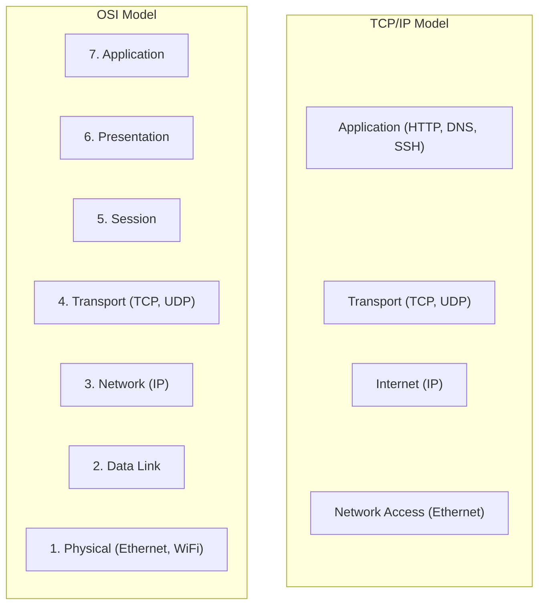
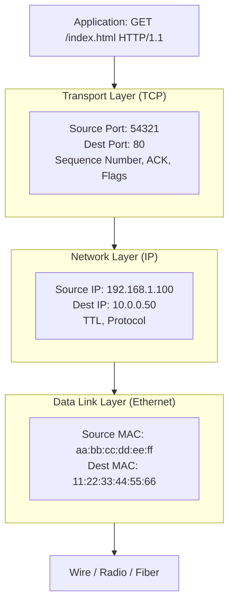
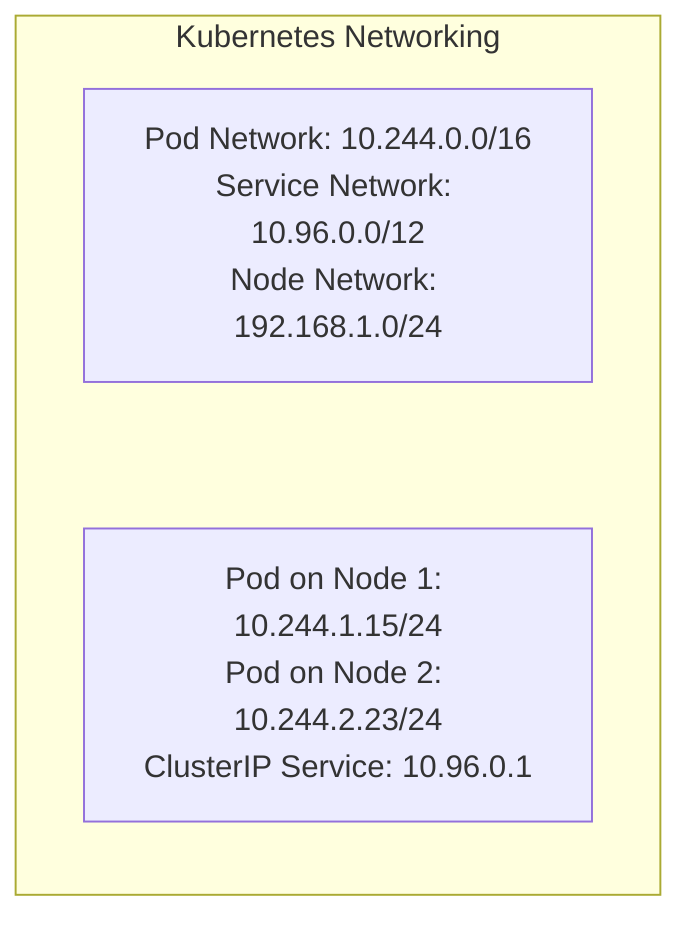
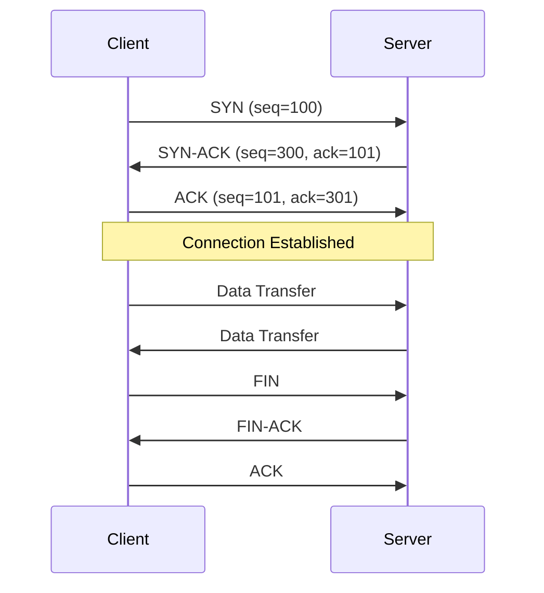
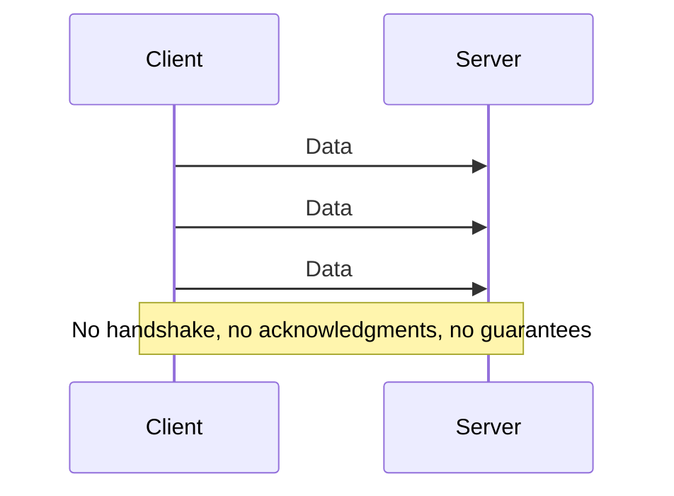
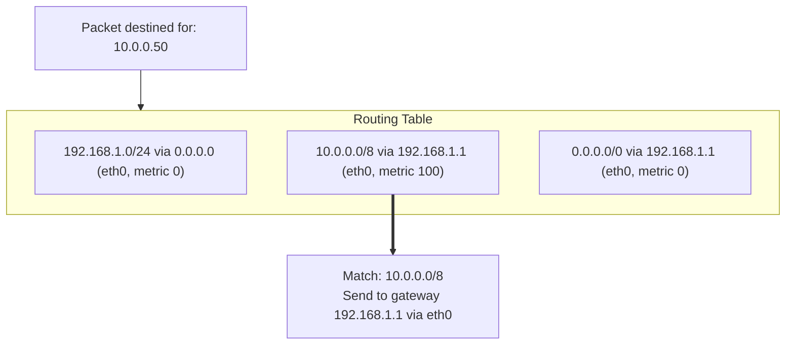

# Module 3.1: TCP/IP Essentials

> **Linux Foundations** | Complexity: `[MEDIUM]` | Time: 30-35 min

## Prerequisites

Before starting this module:
- **Required**: Basic understanding of what networks are
- **Helpful**: [Module 1.1: Kernel & Architecture](/linux/foundations/system-essentials/module-1.1-kernel-architecture/)

For Kubernetes examples in this networking track, define the short alias once with `alias k=kubectl` and then use commands such as `k get pods -o wide` when you need cluster context. This module is mostly about Linux itself, but the same routing, socket, and transport behavior explains why Kubernetes 1.35+ pods, Services, NodePorts, and ingress controllers behave the way they do during an incident.

## Learning Outcomes

After this module, you will be able to:
- **Trace** TCP connection behavior from SYN through FIN and diagnose reset, timeout, and listener failures.
- **Calculate** CIDR subnet boundaries and compare whether two hosts share the same local network.
- **Diagnose** Linux connectivity by interpreting `ping`, `traceroute`, `ss`, `ip route`, and interface statistics together.
- **Evaluate** TCP versus UDP tradeoffs and choose the right transport behavior for Linux and Kubernetes services.
- **Design** routing checks for Kubernetes 1.35+ pod, Service, and node networks using longest-prefix match reasoning.

## Why This Module Matters

At 02:18 on a trading platform's busiest morning of the quarter, the dashboard said the application was healthy while customers saw spinning browsers and failed checkout requests. The pods were running, the Service existed, and the ingress controller had not restarted, so the first team on call kept looking upward at the application logs. Forty minutes later, a network engineer found the real fault: one node had learned a more specific route for the pod CIDR through the wrong gateway, so replies were taking a path the firewall silently dropped. The incident cost the company a six-figure revenue window, but the technical cause was not exotic; it was ordinary TCP/IP behavior misunderstood under pressure.

Linux networking rewards engineers who can move from symptom to layer without guessing. A successful `ping` proves that one kind of packet can make a round trip, but it does not prove that a TCP handshake to port 443 can complete, that the server process is listening, that the reply route is symmetric, or that the MTU lets application payloads pass. Kubernetes adds useful abstractions, yet every packet still leaves a namespace through an interface, matches a route, crosses a transport protocol, and lands on a socket. When those basics are clear, the difference between "DNS is broken," "the port is closed," "the firewall is dropping SYN packets," and "the wrong subnet mask created an ARP problem" becomes visible.

This module builds the mental model you need before the later DNS, namespace, and firewall modules. You will trace what Linux adds to application data, calculate what a CIDR mask really means, compare TCP and UDP as engineering choices, read routing tables using longest-prefix match, and connect ports to processes with `ss`. The goal is not to memorize commands in isolation; it is to learn how to test one hypothesis at a time until the packet path makes sense.

## The Network Stack: What Linux Adds Before Bytes Leave

The easiest mistake in network debugging is to treat "the network" as a single opaque thing. Linux does not send a web request as one magical object; it wraps application bytes in several layers of headers, and each layer answers a different operational question. The application layer asks what the program wants to say, the transport layer asks which process conversation this belongs to, the internet layer asks which machine should receive it, and the network access layer asks how to put the next frame on the local link. When you debug with that structure, you stop asking broad questions like "is the network down?" and start asking testable questions like "did the SYN reach a listener?" or "did the reply choose the expected interface?"

The OSI model and the TCP/IP model describe the same practical reality at different levels of detail. OSI separates presentation and session concerns because it is a teaching and architecture model, while the TCP/IP model groups those responsibilities around the protocols Linux actually uses every day. For KubeDojo work, the TCP/IP model is usually the sharper tool because it maps directly to the commands you run: `ss` shows transport-layer sockets, `ip route` shows internet-layer decisions, and `ip link` shows network-access interfaces.



Picture a request to `http://10.0.0.50/index.html`. The application produces HTTP bytes, TCP wraps those bytes with source and destination ports plus sequencing state, IP wraps the segment with source and destination addresses, and Ethernet wraps the packet with source and destination MAC addresses for the next hop. The destination MAC might be the final server on the same LAN, or it might be the router's MAC when the final IP is elsewhere. That distinction is why an IP address can stay the same across a trip while the MAC address changes at every routed hop.



The practical consequence is that every diagnostic tool reveals only a slice of the trip. `ping` tests ICMP reachability at the IP layer, but it does not prove that a TCP service accepts connections. `curl` proves more because it exercises DNS if a name is used, routing, TCP, TLS when HTTPS is involved, and the application response. `ss` looks inward at local sockets, which makes it ideal when you need to prove whether the kernel has a listener for a given port. A good investigation combines these views rather than trusting any one command as a verdict.

In Kubernetes, the stack is still there even when the packet begins inside a pod network namespace. A pod sends from its own IP address, the node routes that traffic through a CNI-created interface, kube-proxy or an eBPF dataplane may translate a Service IP, and the physical node network carries the frame toward another node or an external gateway. If you run `k get pods -o wide`, the pod IPs you see are not decoration; they are addresses Linux must route. The cluster abstraction changes who creates the interfaces and routes, not the fact that packets obey the kernel's networking rules.

Pause and predict: if `ping 10.0.0.50` works from a client but `curl http://10.0.0.50` hangs, which layer has been proven healthy and which layer still needs a direct test? Write down your answer before continuing, because this exact distinction separates many quick fixes from long incident calls.

A useful worked example starts with a web server that fails from a client but appears healthy locally. First, `ip addr` confirms the host owns the expected source address; then `ip route get 10.0.0.50` predicts which interface and gateway Linux will use; then `nc -zv 10.0.0.50 80` tests the TCP port directly; finally `ss -tlnp` on the server checks whether a process is listening. Each command narrows the search by one layer. If the route is wrong, restarting the app is irrelevant; if no socket is listening, changing the gateway will not help.

## IP Addressing and CIDR: Deciding What Is Local

An IPv4 address is a 32-bit number usually written as four decimal octets because humans prefer `192.168.1.100` to a long string of bits. The subnet mask says how many leading bits describe the network portion and how many trailing bits describe host addresses inside that network. Linux uses that split to decide whether a destination is local enough to reach directly on the link or remote enough to send to a router. When the split is wrong, two machines can make opposite decisions about the same conversation, which creates asymmetric failures that look confusing until you calculate the masks.

```text
IP Address: 192.168.1.100
Binary:     11000000.10101000.00000001.01100100

Subnet Mask: 255.255.255.0 (or /24)
Binary:      11111111.11111111.11111111.00000000

Network:     192.168.1.0   (first 24 bits)
Host:        .100          (last 8 bits)
Broadcast:   192.168.1.255 (all host bits = 1)
```

With `192.168.1.100/24`, the first twenty-four bits are the network, so addresses from `192.168.1.1` through `192.168.1.254` are usable host addresses in the same subnet. The network address, `192.168.1.0`, identifies the subnet itself, and the broadcast address, `192.168.1.255`, targets every host on that subnet. This is why a host at `192.168.2.10/24` is not local to `192.168.1.100/24`, even though the first two octets match. The mask, not the visual similarity of the address, defines the boundary.

CIDR notation exists because classful network labels stopped being flexible enough for real deployments. A `/32` identifies a single host route, a `/24` is common for a small LAN, and a `/16` can cover many smaller subnets under one route summary. The number after the slash is not a count of hosts; it is a count of fixed network bits. To find the number of host addresses, you count the remaining bits, raise two to that power, and subtract the reserved network and broadcast addresses for traditional IPv4 subnets.

| CIDR | Subnet Mask | Hosts | Common Use |
|------|-------------|-------|------------|
| /32 | 255.255.255.255 | 1 | Single host |
| /24 | 255.255.255.0 | 254 | Small network |
| /16 | 255.255.0.0 | 65,534 | Medium network |
| /8 | 255.0.0.0 | 16M | Large network |

Private address ranges matter because most lab networks, home networks, cloud VPCs, and Kubernetes clusters use them internally. These ranges are not routed on the public internet, so organizations can reuse them behind NAT, VPNs, and private WAN links. The flexibility is useful, but overlap becomes painful when two networks need to talk. A cluster pod CIDR of `10.244.0.0/16` can collide with an existing corporate route if the organization already uses that block, and the resulting failures usually look like partial connectivity rather than a clean outage.

| Range | CIDR | Class | Use |
|-------|------|-------|-----|
| 10.0.0.0 - 10.255.255.255 | 10.0.0.0/8 | A | Large orgs |
| 172.16.0.0 - 172.31.255.255 | 172.16.0.0/12 | B | Medium orgs |
| 192.168.0.0 - 192.168.255.255 | 192.168.0.0/16 | C | Home/small |

Kubernetes usually separates node, pod, and Service address ranges because they mean different things. Node IPs belong to the underlying machine network, pod IPs belong to the CNI-managed overlay or routed pod network, and ClusterIP Service addresses are virtual destinations handled by the cluster dataplane. A Service IP is not normally assigned to a physical interface the way a node IP is. That difference matters when you use Linux tools: `ip route` explains how a node reaches pod networks, while Service translation may happen through iptables, IPVS, or eBPF rules depending on the cluster implementation.



When you inspect a Linux host, start by identifying addresses, interfaces, and the prefix length attached to each address. The `ip` command replaced older tools because it exposes the kernel's current networking model more accurately, though you will still see `ifconfig` in older runbooks. The brief view is often enough during an incident, while the full view shows flags, scope, MAC addresses, and secondary addresses. If the expected source IP is missing here, later tests against routing or sockets are likely to mislead you.

```bash
# Show all interfaces
ip addr

# Show specific interface
ip addr show eth0

# Legacy command
ifconfig

# Show IPv4 only
ip -4 addr

# Brief format
ip -br addr
```

Consider a bare-metal Kubernetes node with `192.168.1.50/24` and a second node configured as `192.168.2.10/16`. The first node sees `192.168.2.10` as remote because its `/24` only includes `192.168.1.0` through `192.168.1.255`, so it sends traffic through a gateway. The second node sees `192.168.1.50` as local because its `/16` includes all of `192.168.0.0` through `192.168.255.255`, so it may try direct ARP on a link where the first node is not actually present. This mismatch creates one-way assumptions, and one-way assumptions create outages that feel random until you compare both masks.

Stop and think: if your pod gets the IP address `10.244.1.15/24`, what is the highest IP address that can exist in that exact same subnet before traffic needs a route beyond the local pod network segment? The answer is not the largest address inside `10.244.0.0/16`; it is the largest usable address inside the pod's own `/24`, because the prefix length defines the local boundary.

## TCP and UDP: Choosing Reliability, Latency, and Failure Behavior

TCP and UDP are not simply "safe" and "fast" versions of each other. They represent different contracts between an application and the network. TCP creates a connection, numbers bytes, acknowledges delivery, retransmits loss, manages receiver capacity, and slows down when congestion appears. UDP sends independent datagrams with a smaller contract: the kernel will try to place the datagram on the network, but it will not establish a session, resend missing packets, or reorder arrivals for the application. The better protocol depends on what kind of failure the application can tolerate.

TCP begins with a handshake because both sides need initial sequence numbers and connection state before reliable byte delivery can work. The client sends SYN, the server replies with SYN-ACK if a listener accepts the port, and the client returns ACK. Only then does normal data transfer begin. If the server host exists but nothing listens on the destination port, the kernel commonly sends a reset, which tells the client the host was reachable but the port was closed. If a firewall drops the SYN without answering, the client waits and retries until it times out.



This handshake gives you useful diagnostic signals. "Connection refused" usually means a reset came back, so routing to the host worked and the destination stack rejected the port. "Connection timed out" often means packets or replies disappeared, so you investigate firewalls, routes, security groups, or host reachability. "No route to host" points even earlier, toward the local route lookup or neighbor discovery. Treat these messages as evidence, not decoration; they are the kernel telling you where the conversation broke.

TCP Features:
- **Reliable** — Retransmits lost packets
- **Ordered** — Packets delivered in sequence
- **Connection-oriented** — Handshake required
- **Flow control** — Sender adjusts to receiver capacity
- **Congestion control** — Adapts to network conditions

UDP has less machinery, which can be exactly the right design. DNS commonly uses UDP for small queries because a short request and response should not pay the cost of a connection setup. Streaming, telemetry, voice, and some game traffic may prefer fresh data over guaranteed old data. If a monitoring agent emits thousands of samples per second and a congested link drops some, UDP lets the application continue with newer samples instead of building an ever-larger reliable backlog. The tradeoff is that loss becomes an application concern rather than a transport guarantee.



UDP Features:
- **Fast** — No connection overhead
- **Simple** — Just send data
- **Unreliable** — Packets can be lost
- **Unordered** — Packets can arrive out of order
- **No flow control** — Sender can overwhelm receiver

The transport choice also affects load balancers and Kubernetes Services. A TCP Service can observe connection state and often has clearer health semantics because a backend either accepts a connection or it does not. A UDP Service must rely on datagrams and timeout behavior, which makes some failures harder to distinguish from quiet applications. Kubernetes supports both, but the operational evidence changes. If you expose a UDP game server or DNS service, you need probes, metrics, and packet captures that reflect datagram behavior instead of expecting TCP-style connection logs.

| TCP | UDP |
|-----|-----|
| HTTP/HTTPS | DNS (queries) |
| SSH | DHCP |
| Database connections | Video streaming |
| API calls | Gaming |
| File transfer | VoIP |

Pause and predict: if a client sends a SYN packet to a server, but the server's application has crashed and is not listening on that port, what should the server's operating system send back when no firewall interferes? Now compare that with the case where a firewall silently drops the same SYN. The difference between a reset and a timeout is one of the fastest ways to separate "host reachable, service absent" from "path or policy is blocking the packet."

A practical war story from platform teams involves metrics pipelines during congestion. A TCP-based collector can protect data integrity by retrying every sample, but that same guarantee can create memory pressure when downstream storage slows down. The sender keeps buffers full of unacknowledged bytes, retries increase, and a process that looked efficient during normal traffic can crash under backpressure. UDP would avoid that buffer growth, but it would also lose samples. The engineering decision is not "which protocol is better"; it is whether accurate historical completeness or graceful lossy behavior matters more for that workload.

## Routing: Longest Prefix Match and the Next Hop

Once Linux knows the destination IP, it must decide where to send the packet next. The routing table is the kernel's decision list, and the most important rule is longest prefix match. If `10.244.2.23` matches both a broad default route and a more specific pod-network route, the route with the longer prefix wins because it describes a smaller, more exact destination set. Metrics decide between otherwise comparable routes, but specificity comes first. This is why a single accidental `/32` host route can override a default gateway and break one destination while everything else works.



Routes can point directly to a device for locally connected networks or to a next-hop gateway for remote networks. A route such as `192.168.1.0/24 dev eth0` says hosts in that subnet are on the local link, so Linux can use neighbor discovery or ARP to find the next frame destination. A route such as `10.0.0.0/8 via 192.168.1.1 dev eth0` says the final destination is remote, but the next hop is the gateway at `192.168.1.1`. In both cases, the packet keeps the final destination IP while the link-layer frame targets the next hop.

```bash
# Show routing table
ip route

# Legacy command
route -n
netstat -rn

# Example output:
# default via 192.168.1.1 dev eth0 proto dhcp metric 100
# 10.244.0.0/16 via 10.244.0.0 dev cni0
# 192.168.1.0/24 dev eth0 proto kernel scope link src 192.168.1.100
```

In Kubernetes, node routes and CNI routes decide how pod CIDRs are reached. A simple Flannel-style setup might route local pods through `cni0` and remote node pod CIDRs through the node network. Other CNIs may use overlays, BGP, eBPF, or cloud route tables, but Linux still needs a next-hop decision somewhere in the datapath. When pod-to-pod traffic fails across nodes but works on the same node, the likely fault is not the application protocol. It is often the route to the remote pod CIDR, encapsulation, forwarding, firewall policy, or return path.

```bash
# Pod-to-pod routing on same node
10.244.1.0/24 dev cni0  # Local pods

# Pod-to-pod routing across nodes (example with Flannel)
10.244.2.0/24 via 192.168.1.102 dev eth0  # Pods on node2

# Default route for external traffic
default via 192.168.1.1 dev eth0
```

Adding routes by hand is useful in a lab because it shows cause and effect, but it is dangerous as a production fix unless you know how persistence is managed. Commands entered with `ip route add` modify the running kernel table, and those changes usually disappear after reboot or network service restart. On Ubuntu, persistence may live in netplan or NetworkManager; in cloud environments, route tables may live outside the host; in Kubernetes, the CNI agent may reconcile routes continuously. A manual route that fights the owner of the network will not stay fixed.

```bash
# Add route
sudo ip route add 10.0.0.0/8 via 192.168.1.1

# Add default gateway
sudo ip route add default via 192.168.1.1

# Delete route
sudo ip route del 10.0.0.0/8

# Routes are not persistent! Use netplan/NetworkManager for persistence
```

The best route diagnostic is often `ip route get`, because it asks the kernel to predict the actual decision for one destination. Instead of reading a table and mentally sorting prefixes, you give Linux an address and inspect the selected interface, source address, and gateway. If an application binds to a specific source IP, or if policy routing is involved, that prediction may differ from a simple glance at `ip route`. During incidents, the exact question "how would this host route to that IP right now?" is more useful than a general route dump.

Stop and think: if a Linux server has two network interfaces, `eth0` and `eth1`, and it receives a request on `eth0`, does the reply always leave through `eth0`? The answer is no. Linux routes replies according to the destination of the reply and its routing policy, so asymmetric routing can happen unless routes, source addresses, and policy rules are designed to keep the path consistent.

A routing failure becomes clearer when you follow both directions. Suppose a client reaches a node IP through the default gateway, but the node has a more specific route back to the client network through a VPN tunnel. The inbound packet arrives successfully, the service processes it, and the reply leaves another interface where a firewall drops it as invalid or unexpected. From the client side, the connection times out. From the server side, the application may look healthy. The fix is not in the app; it is in route symmetry, firewall state, or policy routing.

## Ports, Sockets, and Local Listeners

An IP address identifies a host or interface, but a port identifies a conversation endpoint on that host. When an application listens on TCP port 443, it asks the kernel to accept connection attempts for that port and hand established connections to the process. When a client opens a connection, the client side usually uses an ephemeral source port chosen from a high-numbered range. The complete TCP conversation is identified by source IP, source port, destination IP, destination port, and protocol, which is why one web server can handle many clients on the same destination port at once.

| Range | Name | Use |
|-------|------|-----|
| 0-1023 | Well-known | System services (requires root) |
| 1024-49151 | Registered | Applications |
| 49152-65535 | Dynamic/Ephemeral | Client connections |

Well-known ports are convention rather than magic, but the convention matters because clients expect services in predictable places. SSH normally listens on TCP 22, HTTP on TCP 80, HTTPS on TCP 443, the Kubernetes API on TCP 6443, kubelet on TCP 10250, and etcd on TCP 2379. DNS is a special everyday example because small queries often use UDP 53 while larger transfers and zone operations may use TCP 53. The port table is not a substitute for discovery, but it gives you a useful first hypothesis when a service is unreachable.

| Port | Service | Protocol |
|------|---------|----------|
| 22 | SSH | TCP |
| 53 | DNS | UDP/TCP |
| 80 | HTTP | TCP |
| 443 | HTTPS | TCP |
| 6443 | Kubernetes API | TCP |
| 10250 | Kubelet | TCP |
| 2379 | etcd | TCP |

The `ss` command shows sockets from the kernel's point of view, which makes it one of the fastest ways to distinguish network reachability from local service state. A process can be running and still not listening on the expected address, especially if it bound only to `127.0.0.1` instead of `0.0.0.0` or the node IP. A firewall can allow a port, but the kernel will still reject a connection if no listener exists. Conversely, a listener can be perfect while an upstream route or policy drops packets before they arrive.

```bash
# Show all listening ports
ss -tlnp
# t=TCP, l=listening, n=numeric, p=process

# Show all connections
ss -tanp

# Legacy netstat
netstat -tlnp

# Find what's using a port
ss -tlnp | grep :80
lsof -i :80
```

The flags are worth reading once so the output becomes less mysterious. `-t` filters TCP sockets, `-l` shows listeners, `-n` keeps addresses numeric so troubleshooting does not depend on DNS, and `-p` adds process information when permissions allow. For established connections, the state column tells you whether a socket is listening, established, waiting to close, or stuck in another transition. If you see many connections in SYN-SENT from a client, outbound SYN packets may not be receiving replies. If you see SYN-RECV on a server, SYNs are arriving but handshakes may not be completing.

Pause and predict: if you run a Node.js app as a standard non-root user and tell it to listen on port 80, what will happen on a typical Linux system? The likely failure is a permission error because ports below 1024 are privileged unless the process has the needed capability or a supervisor binds the port on its behalf. Containers and systemd units can change the packaging, but the kernel rule is still the starting point.

In Kubernetes, ports appear in several places that beginners often mix together. A container port documents where the process listens inside the pod, a Service port exposes a stable port on the Service IP, a targetPort points to the backend pod port, and a NodePort opens a port on each node. Those are cluster abstractions, yet each ultimately maps back to sockets, packet translation, and routing. When an ingress controller fails with `bind: address already in use`, the fastest local test is still `ss -tlnp | grep :443` on the node or inside the relevant namespace.

## Practical Diagnostics: Build Evidence One Layer at a Time

Network troubleshooting should feel like controlled narrowing, not command roulette. Start with the symptom, name the layer you are testing, and decide what result would confirm or reject your hypothesis. If an application cannot reach a remote API by name, first decide whether you are testing name resolution, IP routing, TCP connectivity, TLS, or HTTP behavior. Jumping straight to packet captures can be useful for deep cases, but most incidents are solved faster by combining `ip addr`, `ip route get`, `ping`, `nc`, `curl`, `traceroute`, `ss`, and interface counters in a deliberate sequence.

```bash
# Basic ping
ping -c 4 8.8.8.8

# TCP connectivity test
nc -zv 10.0.0.50 80
# or
curl -v telnet://10.0.0.50:80

# Test with timeout
timeout 5 bash -c "</dev/tcp/10.0.0.50/80" && echo "Open" || echo "Closed"
```

`ping` is useful because it is simple, but it is also frequently overinterpreted. A successful ping means ICMP echo requests and replies made the round trip; it does not mean TCP port 80 is open, DNS is correct, or an HTTP service is healthy. A failed ping also does not always mean the host is down, because many firewalls block ICMP while allowing application traffic. Use ping to test basic reachability and latency, then switch to a protocol-specific test before drawing conclusions about the application.

TCP connectivity tests answer a different question. `nc -zv 10.0.0.50 80` attempts a connection without sending an application request, so it can show whether the port accepts a handshake. `curl -v telnet://10.0.0.50:80` can provide similar evidence when netcat is unavailable. For HTTPS or HTTP services, ordinary `curl -v` goes further by showing DNS resolution, connect timing, TLS negotiation, headers, and response status. The extra detail is valuable, but it also means more layers are involved, so read the output in order.

```bash
# Trace route
traceroute 8.8.8.8
# or
mtr 8.8.8.8

# TCP traceroute (for firewalled networks)
traceroute -T -p 443 8.8.8.8
```

Path discovery tools use TTL behavior to learn about hops between source and destination. Standard traceroute may use UDP or ICMP depending on implementation, which means firewalls can treat it differently from your actual application traffic. TCP traceroute with `-T -p 443` is often more relevant for web services because it probes the path using TCP toward the port you care about. Missing hops are not always failures, since some routers decline to answer TTL-expired probes, but changes in the path can reveal where traffic leaves the expected network.

Interface statistics help when symptoms suggest packet loss, duplex problems, driver issues, or MTU trouble. Counters for errors, drops, overruns, and carrier changes can explain why a service works at low volume but fails during transfers. MTU mismatches are especially frustrating because small packets pass while larger payloads stall or fragment poorly. If `curl` connects but hangs during a larger response, and interface counters show errors or drops, the problem may be below the application even though the initial handshake looked fine.

```bash
# Interface stats
ip -s link

# Detailed stats
cat /proc/net/dev

# Watch in real-time
watch -n1 'cat /proc/net/dev'
```

A disciplined diagnostic sequence for a Kubernetes 1.35+ node starts outside the cluster abstraction and then moves inward. Confirm the node interface and route, test the remote node or pod IP, check whether the service port accepts TCP, inspect listeners with `ss`, and only then inspect Service rules or CNI state. `k get pods -o wide` can tell you where a pod lives and which IP it has, but Linux decides how to reach that IP. If you treat the pod IP as a real routing destination, the cluster becomes much easier to reason about.

Before running the next command in a real incident, ask what output you expect. If you expect `ip route get 10.244.2.23` to choose `eth0` via another node and it chooses the default internet gateway instead, you have found a routing issue before touching the application. If you expect `ss -tlnp` to show Nginx on `0.0.0.0:443` and it shows only `127.0.0.1:443`, remote clients cannot connect even though local curl tests may pass. Prediction turns commands into experiments.

## Patterns & Anti-Patterns

Good network operations use patterns that reduce ambiguity. The first pattern is layered testing: prove local configuration, then route selection, then transport reachability, then application behavior. This works because each layer depends on the one below it, and the tests produce evidence you can share. It also scales well across teams because an application engineer, platform engineer, and network engineer can agree on which layer failed instead of arguing from different tool outputs.

The second pattern is source-and-destination pairing. Always inspect both sides of a conversation when you can, because one-way evidence is incomplete. A client timeout may be caused by an outbound firewall, an inbound firewall, a missing server listener, a broken reply route, or an MTU problem after the handshake. Checking the server's `ss` output, route back to the client, and interface counters often turns a vague timeout into a specific mismatch.

The third pattern is route prediction before route editing. Use `ip route get` to ask the kernel what it will do, then compare that prediction with the intended design. If you must add a route in a lab, record why it is needed and where it should be made persistent. In production, identify the owner of the route, such as netplan, NetworkManager, the cloud VPC, or the CNI agent, before making changes. Temporary route commands are useful scalpels, not configuration management.

Common anti-patterns usually come from overtrusting one piece of evidence. Treating ping as proof of application health is the classic example because ICMP and TCP can be allowed, blocked, routed, or prioritized differently. Another anti-pattern is fixing a Kubernetes Service before checking whether the backend process is listening, which wastes time when the real fault is a bind address or port conflict. A third is changing firewall rules before calculating subnets and routes, because policy can look guilty when the packet is simply going to the wrong next hop.

## Decision Framework

Use the symptom to choose the first layer, then move only when the result justifies it. If the host has no expected IP address, stay with interface configuration. If the IP exists but the route prediction is wrong, stay with routing. If the route is correct but a TCP connection is refused, check the listener. If the connection times out, compare path, firewall, and return route. If the TCP connection succeeds but the application fails, move upward to TLS, HTTP, authentication, or application logs. This framework keeps you from changing three variables at once.

When the symptom includes Kubernetes, separate the cluster object from the packet path. A Service can exist while no pod is ready, a pod can be ready while the process listens on the wrong port, and both can be correct while the node cannot route to a remote pod CIDR. Start with the object that names the intended destination, then verify the Linux evidence underneath it. For example, use `k get pods -o wide` to find the pod IP and node, but use `ip route get` and `ss` to prove how the node handles that destination and port.

Choose TCP when the application needs ordered, reliable byte delivery and can tolerate connection setup and retransmission behavior. Choose UDP when the application can tolerate loss, values freshness over completeness, or implements its own reliability semantics. Choose a route change only when route prediction proves the packet path is wrong, and choose a socket fix only when `ss` proves the process is not listening where clients connect. The decision is strongest when it names both the evidence and the layer.

## Did You Know?

- **TCP was standardized before Kubernetes existed by decades** — modern TCP is maintained through IETF RFCs, and RFC 9293 consolidated core TCP behavior in 2022 after many years of updates.
- **The 3-way handshake costs at least one round trip before request bytes flow** — on a 100 ms round-trip path, connection setup alone can noticeably affect short-lived requests.
- **IPv4 has about 4.3 billion possible addresses** — private ranges, NAT, and IPv6 adoption exist because that 32-bit space was not enough for global growth.
- **Linux can track very large numbers of sockets when tuned carefully** — limits such as file descriptors, ephemeral ports, memory, and conntrack often become the practical ceiling before the protocol design does.

## Common Mistakes

| Mistake | Why It Happens | How to Fix It |
|---------|----------------|---------------|
| Trusting ping as proof that an app works | ICMP reachability does not test TCP ports, TLS, HTTP, or application listeners | Follow ping with `nc -zv`, `curl -v`, and `ss -tlnp` on the destination |
| Using the wrong subnet mask | Teams compare dotted addresses visually and forget that the prefix length defines locality | Calculate the CIDR range on both hosts and make the masks consistent |
| Missing or incorrect default route | A host can reach local addresses but has no next hop for remote destinations | Check `ip route`, then add the gateway through the persistent network manager |
| Ignoring longest-prefix match | A specific route overrides the default route even when the default looks correct | Use `ip route get <destination>` to inspect the actual selected route |
| Assuming a listener binds every address | Apps often bind only `127.0.0.1`, a pod IP, or one node address | Use `ss -tlnp` and bind to the intended address or `0.0.0.0` when appropriate |
| Treating TCP and UDP failures the same | UDP has no handshake, so timeout evidence is less explicit than TCP connection states | Test with protocol-specific tools and add application-level health signals for UDP |
| Making temporary route fixes permanent by accident | Manual `ip route add` commands change running state but not necessarily owned config | Document the owner, then update netplan, NetworkManager, cloud routes, or CNI config |
| Overlooking MTU and interface errors | Small probes pass while larger packets fail, making the application look guilty | Inspect `ip -s link`, path MTU behavior, and encapsulation overhead |

## Knowledge Check

<details><summary>Your team deploys a Kubernetes 1.35+ API service, and clients report `connection refused` to the Service backend port while `ping` to the node works. What do you check first, and why?</summary>

Start by checking whether the backend process has a TCP listener on the expected address and port with `ss -tlnp`, then verify the pod or node port mapping. `connection refused` usually means the SYN reached a host stack and the stack returned a reset because no listener accepted that port. Ping only proves ICMP reachability and does not test the TCP socket. If the listener exists, the next checks are Service targetPort mapping and firewall policy, but the refusal message makes socket state the strongest first hypothesis.

</details>

<details><summary>A node has `192.168.1.50/24`, another has `192.168.2.10/16`, and pod traffic fails only in one direction. How do you calculate the likely subnet problem?</summary>

Calculate each node's local range from its prefix length. The `/24` node treats only `192.168.1.0` through `192.168.1.255` as local, while the `/16` node treats `192.168.0.0` through `192.168.255.255` as local. That means the two nodes may make different routing and ARP decisions for replies. The fix is to make the subnet design consistent with the real broadcast domains and then verify both directions with `ip route get`.

</details>

<details><summary>A packet for `10.244.2.23` matches both `10.244.0.0/16 via 192.168.1.102` and `default via 192.168.1.1`. Which route wins, and what diagnostic proves it?</summary>

The `10.244.0.0/16` route wins because Linux uses longest-prefix match before it falls back to broader routes. The default route is `0.0.0.0/0`, so it matches everything but is less specific than the pod CIDR route. Run `ip route get 10.244.2.23` to ask the kernel which route, source address, gateway, and interface it will actually use. This is more reliable than visually scanning the route table during an incident.

</details>

<details><summary>A telemetry daemon sends tiny samples over TCP and crashes when the network slows because memory grows quickly. Would UDP help, and what tradeoff are you accepting?</summary>

UDP could help if the crash is caused by TCP buffering unacknowledged data while congestion prevents timely delivery. With UDP, the sender does not maintain a reliable byte stream or retransmission queue in the same way, so old samples can be dropped instead of accumulating. The tradeoff is permanent data loss during congestion, plus the need for application-level monitoring that understands loss. This is acceptable for some freshness-oriented telemetry but not for audit logs or transactions.

</details>

<details><summary>An ingress controller fails with `bind: address already in use` on port 443. Which command identifies the culprit, and what part of the output matters?</summary>

Run `ss -tlnp | grep :443` with sufficient privileges on the relevant host or namespace. The listening socket line shows the local address and port, while the process column identifies the program and PID when permissions allow it. That evidence tells you whether another ingress, web server, proxy, or leftover process already owns the port. Killing or reconfiguring the correct process is safer than changing firewall rules, because the failure is local socket binding.

</details>

<details><summary>A client can `curl` a small health endpoint but large downloads hang, and interface counters show drops. Which layer should you investigate next?</summary>

Investigate the link and path behavior below the application, especially MTU, encapsulation overhead, driver errors, and packet drops. A successful small request proves routing, TCP setup, and basic application handling, but it does not prove larger payloads can traverse the path cleanly. `ip -s link`, path MTU tests, and packet captures around the failing transfer can reveal whether frames are being dropped or fragmented incorrectly. Restarting the application would not address evidence of interface-level loss.

</details>

<details><summary>You run `k get pods -o wide` and see a backend pod at `10.244.2.23` on another node, but the current node routes that IP to the default gateway. What design check follows?</summary>

Check the pod CIDR routing design for the CNI and confirm that the current node has a route for the remote pod range through the correct node, overlay device, or CNI dataplane. A pod IP is still a real destination from Linux's perspective, so sending it to the ordinary default gateway is usually wrong unless the environment deliberately routes pod CIDRs there. Use `ip route get 10.244.2.23` and compare the result with the CNI's intended route model. Then inspect the CNI agent or cloud route table that owns those routes.

</details>

## Hands-On Exercise

This lab turns the module's concepts into a repeatable investigation. Use any Linux system where you can run standard networking tools; a disposable VM or lab node is ideal because route and interface output varies by environment. Do not worry if your interface is not named `eth0`; modern Linux systems often use names such as `ens33`, `enp0s3`, or cloud-specific names. The point is to identify what your host really uses, then connect each command to one layer of evidence.

### Task 1: Inspect IP Configuration

Run the interface commands and record your primary IPv4 address, prefix length, and interface name. Then calculate the local subnet range from that prefix before looking at any route output. This makes the routing table easier to read because you already know which destinations should be directly connected.

```bash
# 1. View your IP addresses
ip addr

# 2. Note your main interface name and IP
ip -4 -br addr

# 3. View interface details
ip addr show eth0 || ip addr show ens33 || ip addr show enp0s3

# 4. Check MAC address
ip link show | grep ether
```

<details><summary>Solution notes</summary>

Your primary interface is usually the one with an IPv4 address that is not `127.0.0.1` and that has the default route in the next task. The prefix length appears after the slash, such as `/24`, and defines the local network boundary. If the explicit interface names fail, use the interface shown by `ip -4 -br addr` and rerun `ip addr show <name>`. The MAC address belongs to the link layer and is used for the next hop on the local network.

</details>

### Task 2: Predict and Verify Routing

Before running the route commands, predict which gateway your host should use for an internet destination and which route should cover your local subnet. Then compare that prediction with the kernel's route table and a specific route lookup. If the output surprises you, explain whether the surprise comes from a more specific route, a metric, or a different interface.

```bash
# 1. View routing table
ip route

# 2. Find default gateway
ip route | grep default

# 3. Trace route to internet
traceroute -m 10 8.8.8.8 || tracepath 8.8.8.8

# 4. Check which interface reaches a destination
ip route get 8.8.8.8
```

<details><summary>Solution notes</summary>

The default route normally appears as `default via <gateway> dev <interface>`, and `ip route get 8.8.8.8` should select that gateway unless a more specific route exists. The connected subnet usually appears as a route directly attached to your primary interface. Traceroute output may hide some hops because routers are not required to answer probes. The selected route is still valuable even when the path display is incomplete.

</details>

### Task 3: Compare ICMP and TCP Connectivity

Test the gateway with ICMP, then test an external IP and a TCP port. Treat each result as evidence for a different layer rather than a general pass or fail. If ICMP fails but TCP works, note that policy may treat protocols differently. If TCP fails while ICMP works, focus on port policy, listener state, or application reachability rather than basic routing alone.

```bash
# 1. Ping local gateway
GATEWAY=$(ip route | grep default | awk '{print $3}')
ping -c 4 $GATEWAY

# 2. Ping external
ping -c 4 8.8.8.8

# 3. Test TCP connectivity
nc -zv google.com 443 || timeout 5 bash -c "</dev/tcp/google.com/443" && echo "Open"

# 4. Time a connection
time curl -s -o /dev/null https://google.com
```

<details><summary>Solution notes</summary>

A gateway ping checks local reachability to the next hop, while the external ping checks a wider route and ICMP policy. The TCP test to port 443 proves more about web-style connectivity than ping does because it attempts a transport handshake. The `time curl` result adds application-layer and TLS behavior, so failures there need to be read carefully. If DNS resolution affects the command, repeat with a known IP or save DNS analysis for the next module.

</details>

### Task 4: Map Ports to Processes

List listening TCP sockets, identify one service that is listening, and explain whether it is bound to loopback, all addresses, or a specific interface address. Then count current TCP states to see what the host is doing right now. This task connects the abstract idea of ports to concrete kernel socket state.

```bash
# 1. List listening ports
ss -tlnp

# 2. List all TCP connections
ss -tanp | head -20

# 3. Check a specific port
ss -tlnp | grep :22

# 4. Count connections by state
ss -tan | awk 'NR>1 {print $1}' | sort | uniq -c
```

<details><summary>Solution notes</summary>

Look at the local address column first. `127.0.0.1:22` would mean only local clients can connect, while `0.0.0.0:22` means the listener accepts connections on all IPv4 addresses unless firewall policy blocks them. The process information may require root privileges, so missing process names do not necessarily mean no process exists. Connection states such as LISTEN, ESTAB, SYN-SENT, and TIME-WAIT describe where sockets are in their lifecycle.

</details>

### Task 5: Inspect Interface Health

Read packet and error counters for your primary interface, then decide whether the interface evidence supports or weakens a network-layer hypothesis. The goal is not to memorize every counter; it is to notice when drops, errors, or carrier changes point below TCP and the application. Repeat the command while generating traffic if you want to see counters move.

```bash
# 1. View packet counts
ip -s link show eth0 || ip -s link show $(ip route | grep default | awk '{print $5}')

# 2. Check for errors
ip -s link | grep -A2 errors

# 3. View detailed stats
cat /proc/net/dev
```

<details><summary>Solution notes</summary>

Most quiet lab systems show low or zero error counters, which is fine. In production, rising errors, drops, or overruns can explain slow transfers, retransmissions, and intermittent application symptoms. If your interface is not `eth0`, the fallback command uses the interface from the default route. Interface evidence should be combined with route, socket, and protocol tests rather than used alone.

</details>

### Success Criteria

- [ ] Calculated your IP address and subnet boundary from CIDR notation.
- [ ] Found your default gateway and verified route selection with `ip route get`.
- [ ] Compared ICMP and TCP connectivity instead of treating ping as a full application test.
- [ ] Used `ss` to map a listening port to a local socket and, where permitted, a process.
- [ ] Interpreted interface statistics as evidence for or against link-layer packet loss.
- [ ] Explained how the same checks apply to a Kubernetes 1.35+ pod IP found with `k get pods -o wide`.

## Next Module

Next, continue to [Module 3.2: DNS in Linux](/linux/foundations/networking/module-3.2-dns-linux/) to learn how names become IP addresses and why resolver behavior is essential for Kubernetes service discovery.

## Further Reading

- [TCP/IP Illustrated](https://www.amazon.com/TCP-Illustrated-Vol-Addison-Wesley-Professional/dp/0201633469) by W. Richard Stevens
- [Linux Network Administrator's Guide](https://tldp.org/LDP/nag2/index.html)
- [iproute2 Documentation](https://wiki.linuxfoundation.org/networking/iproute2)
- [Kubernetes Networking Guide](https://kubernetes.io/docs/concepts/cluster-administration/networking/)
- [RFC 9293: Transmission Control Protocol](https://www.rfc-editor.org/rfc/rfc9293)
- [RFC 791: Internet Protocol](https://www.rfc-editor.org/rfc/rfc791)
- [RFC 4632: Classless Inter-domain Routing](https://www.rfc-editor.org/rfc/rfc4632)
- [Linux ip-route manual](https://man7.org/linux/man-pages/man8/ip-route.8.html)
- [Linux ip-address manual](https://man7.org/linux/man-pages/man8/ip-address.8.html)
- [Linux ss manual](https://man7.org/linux/man-pages/man8/ss.8.html)
- [Linux kernel IP sysctl documentation](https://docs.kernel.org/networking/ip-sysctl.html)
- [Kubernetes Services, Load Balancing, and Networking](https://kubernetes.io/docs/concepts/services-networking/service/)
