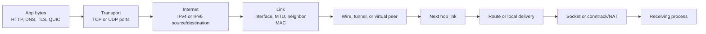
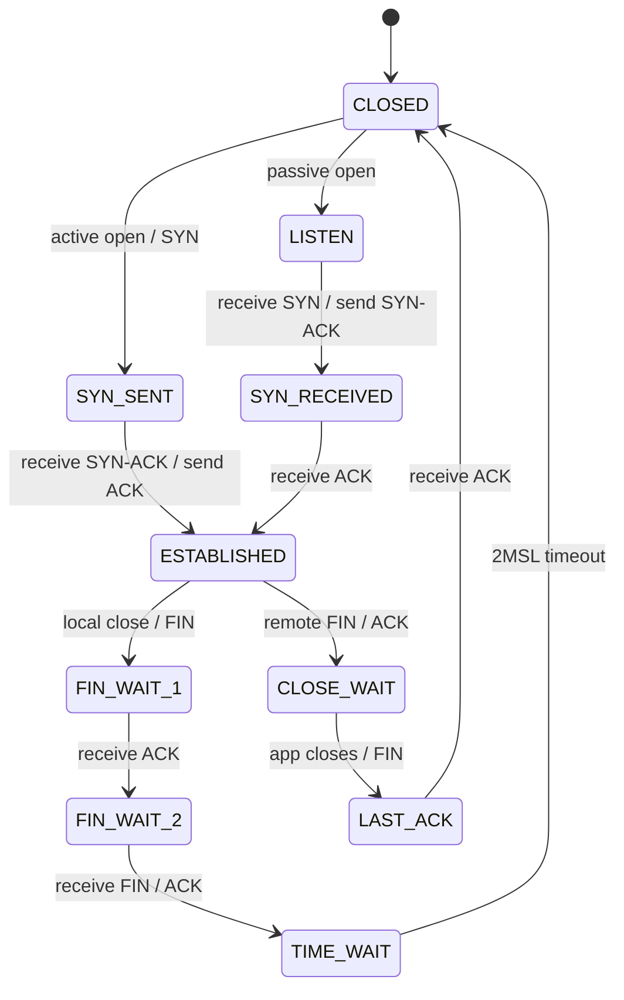
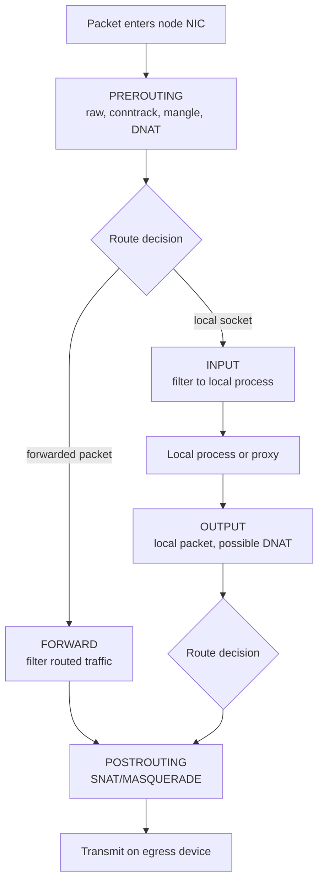

# Module 3.1: TCP/IP Essentials

> **Linux Foundations** | Complexity: `[MEDIUM]` | Time: 35-40 min. This is the operator-grade packet model that later modules use for DNS, namespaces, veth pairs, iptables, and Kubernetes Service debugging.

## Prerequisites

Before starting this module:

- **Required**: Basic comfort with Linux shells and process troubleshooting.
- **Helpful**: [Module 1.1: Kernel & Architecture](/linux/foundations/system-essentials/module-1.1-kernel-architecture/)
- **Next bridge**: [Module 3.3: Network Namespaces & veth](../module-3.3-network-namespaces/) uses the same addressing, routing, neighbor, and MTU model inside isolated network stacks.

For Kubernetes examples, define `alias k=kubectl` once. The lesson is Linux-first, but the goal is Kubernetes 1.35+ operations: pod IPs, Service virtual IPs, CNI routes, ingress sockets, egress NAT, and DNS all collapse to kernel packet decisions during troubleshooting.

## What You'll Be Able to Do

After completing this module, you will be able to reason about TCP/IP as an operated Linux system rather than as a vocabulary list.

1. **Analyze** a failing Kubernetes or host connection by separating link, neighbor, route, transport, conntrack, DNS, and application evidence.
2. **Calculate** IPv4 and IPv6 prefix boundaries, then decide whether a pod, node, Service, gateway, or VIP is local, routed, or virtual.
3. **Trace** TCP connection state from `SYN-SENT` through `TIME-WAIT` and use `ss -tan` output to distinguish refusal, timeout, backlog, close, and keepalive symptoms.
4. **Diagnose** Service and ingress failures by connecting Linux conntrack, DNAT, netfilter hooks, sockets, and kube-proxy proxy modes.
5. **Design** a triage sequence for MTU, DNS, ARP/NDP, routing, and transport incidents without falling back to legacy net-tools.

## Why This Module Matters

At 02:11, a platform team sees checkout requests timing out through an ingress controller. Pods are Ready, the Service exists, CoreDNS is healthy, and the application logs show no errors. The first useful clue comes from a node: `ip route get <pod-ip>` chooses the wrong interface, `ss -tan` shows many client sockets in `SYN-SENT`, and `conntrack -L` shows stale translated Service flows. Nothing in that evidence is Kubernetes-specific. Kubernetes supplied the objects, but Linux made the packet decisions.

A platform engineer who cannot reason about TCP state machines, MTU, ARP/NDP, routes, and conntrack is blind during real outages. Service IPs are virtual addresses, CNI plugins may use overlays or direct routing, ingress may terminate TCP or QUIC, egress often rewrites source addresses, and active-active VIPs rely on neighbor behavior. The abstraction is useful only when you can descend through it to a packet-on-the-wire decision. Kubernetes documents that Services get cluster IPs through a virtual IP mechanism, and kube-proxy programs Linux packet forwarding rules in iptables, nftables, or IPVS modes depending on configuration. ([Kubernetes Services](https://v1-35.docs.kubernetes.io/docs/concepts/services-networking/service/), [Kubernetes Virtual IPs and Service Proxies](https://v1-35.docs.kubernetes.io/docs/reference/networking/virtual-ips/))

Treat every network failure as a claim about one layer of evidence. `ping` may prove ICMP reachability but not a TCP listener. `dig` may prove DNS resolution but not routing to the answer. `ss` may prove a local socket exists but not that a remote firewall lets SYN packets through. `tcpdump` may prove a packet arrived at one interface while the real drop happens later in netfilter or in an overlay MTU mismatch. The discipline is to ask: which kernel decision did I just prove?

## Layers as Kernel Decisions

OSI is useful vocabulary, but Linux operators usually debug the TCP/IP model because it maps to kernel surfaces. RFC 1122 organizes host requirements across link, internet, and transport layers; RFC 9293 is the current consolidated TCP specification and obsoletes the original RFC 793 as the core TCP reference. In Linux, each layer corresponds to objects you can inspect: links, neighbors, routes, sockets, conntrack entries, and resolver configuration. ([RFC 1122](https://www.rfc-editor.org/rfc/rfc1122), [RFC 793](https://www.rfc-editor.org/rfc/rfc793), [RFC 9293](https://www.rfc-editor.org/rfc/rfc9293))

| OSI view | TCP/IP view | Kernel-level operator question |
|---|---|---|
| Physical / Data link | Link | Is the interface up, what MTU applies, and which neighbor MAC receives the next frame? |
| Network | Internet | Which source address, route, policy table, and next hop does the kernel select? |
| Transport | Transport | Which local socket owns the port, and what TCP/UDP state is visible? |
| Session / Presentation / Application | Application | Which resolver, TLS, HTTP, DNS, or QUIC behavior produced the bytes above transport? |

| TCP/IP layer | Kernel decision | Linux evidence | Kubernetes anchor |
|---|---|---|---|
| Link | Which local interface and next-hop MAC can carry the frame? | `ip link`, `ip -s link`, `ip neigh`, `tcpdump -i <if>` | veth, bridge, CNI device, node NIC |
| Internet | Which source address, prefix, route, and policy table apply? | `ip addr`, `ip route get`, `ip rule show` | pod CIDR, node CIDR, Service CIDR, dual-stack family |
| Transport | Which socket, port, sequence state, and protocol contract apply? | `ss -tanp`, `ss -uanp`, `/proc/sys/net/ipv4/tcp_*` | containerPort, Service port, NodePort, ingress listener |
| Application | Which name, TLS, HTTP, gRPC, DNS, or QUIC behavior is active? | `dig`, `curl -v`, app logs, ingress logs | CoreDNS, Service DNS, Gateway/Ingress routing |

Packet headers are nested, but operational responsibility is not purely nested. A Kubernetes ClusterIP packet may be routed toward a virtual destination, hit netfilter in `PREROUTING` or `OUTPUT`, be DNATed to an endpoint pod IP, then be routed again. A pod-to-pod packet may leave a namespace through a veth, cross a bridge or eBPF datapath, enter VXLAN, and finally leave the node NIC. The layer model helps because each step leaves different evidence.


```mermaid
flowchart LR
    App[App bytes<br/>HTTP, DNS, TLS, QUIC] --> L4[Transport<br/>TCP or UDP ports]
    L4 --> L3[Internet<br/>IPv4 or IPv6 source/destination]
    L3 --> L2[Link<br/>interface, MTU, neighbor MAC]
    L2 --> Wire[Wire, tunnel, or virtual peer]
    Wire --> L2b[Next hop link]
    L2b --> L3b[Route or local delivery]
    L3b --> L4b[Socket or conntrack/NAT]
    L4b --> Appb[Receiving process]
```

The diagram is not just teaching art. It is a triage map. If `ip route get` selects the wrong egress interface, the TCP state is a consequence, not the root cause. If a listener is bound to `127.0.0.1:8080`, a Service cannot make remote clients reach it without a process listening on the pod or node address. If VXLAN reduces the usable inner MTU, HTTP may connect and then hang only on larger responses. Each symptom points to a decision surface.

## Addressing: IPv4, IPv6, and Kubernetes CIDRs

IPv4 addresses are 32-bit values; IPv6 addresses are 128-bit values. CIDR notation says how many leading bits form the network prefix. RFC 1918 defines the familiar private IPv4 ranges, RFC 4193 defines IPv6 Unique Local Addresses, and RFC 8200 specifies IPv6 itself. The operator move is to calculate the boundary instead of comparing dotted strings by sight. ([RFC 1918](https://www.rfc-editor.org/rfc/rfc1918), [RFC 4193](https://www.rfc-editor.org/rfc/rfc4193), [RFC 8200](https://www.rfc-editor.org/rfc/rfc8200), [RFC 4632](https://www.rfc-editor.org/rfc/rfc4632))

```text
10.244.2.37/24
network bits: 24
host bits:     8
network:       10.244.2.0
usable range:  10.244.2.1 - 10.244.2.254
broadcast:     10.244.2.255
```

A Kubernetes cluster normally has at least three address domains. Node IPs belong to the underlay: cloud VPC, bare-metal VLAN, or host network. Pod IPs come from CNI-managed ranges and must be reachable according to the cluster networking design. Service ClusterIPs come from a Service CIDR and are virtual destinations that kube-proxy or another dataplane captures and redirects. Kubernetes states that normal Services resolve to cluster IPs, while headless Services return endpoint IPs instead of relying on virtual IP forwarding. ([Kubernetes DNS for Services and Pods](https://v1-35.docs.kubernetes.io/docs/concepts/services-networking/dns-pod-service/), [Kubernetes Services](https://v1-35.docs.kubernetes.io/docs/concepts/services-networking/service/))

| Address domain | Example | What it means | First Linux check |
|---|---:|---|---|
| Node CIDR / node IPs | `192.168.10.0/24` | Real host network reachability between nodes and gateways | `ip addr`, `ip route get <node-ip>` |
| Pod CIDR | `10.244.0.0/16` | Workload addresses routed, bridged, overlaid, or eBPF-forwarded by CNI | `k get pods -o wide`, `ip route get <pod-ip>` |
| Service CIDR | `10.96.0.0/12` | Virtual Service destinations selected and rewritten to endpoints | `k get svc`, `nft list ruleset` or `iptables-save` |
| IPv6 ULA | `fd00:10:244::/56` | Private IPv6-style cluster or site addressing | `ip -6 addr`, `ip -6 route get <addr>` |

The common overlap problem is simple to miss. If the corporate WAN uses `10.244.0.0/16` and a new cluster also uses `10.244.0.0/16` for pods, some destinations become ambiguous. Linux will choose the most specific matching route; humans may see only that both are "10 dot" networks. Calculate the prefixes, then ask the kernel for the actual lookup.

```bash
ip -br addr
ip route get 10.244.2.37
ip -6 route get fd00:10:244::37
k get pods -A -o wide
k get svc -A -o wide
```

Do not treat a Service IP as if it must appear on an interface. In kube-proxy iptables mode, Kubernetes documents that kube-proxy installs rules redirecting virtual IP traffic to endpoint rules, and those endpoint rules use destination NAT to backend pods. In nftables mode, kube-proxy uses the kernel netfilter subsystem through nftables instead. The Linux debugging surface is therefore routes plus packet-filter state, not only `ip addr`. ([Kubernetes Virtual IPs and Service Proxies](https://v1-35.docs.kubernetes.io/docs/reference/networking/virtual-ips/))

## Neighbor Discovery: ARP, NDP, and VIPs

Routing chooses the next-hop IP and egress device; neighbor discovery finds the link-layer destination for that next hop. IPv4 commonly uses ARP, standardized in RFC 826. IPv6 uses Neighbor Discovery Protocol, specified in RFC 4861. Linux exposes both through the neighbor table, so `ip neigh` is the modern inspection tool. ([RFC 826](https://www.rfc-editor.org/rfc/rfc826), [RFC 4861](https://www.rfc-editor.org/rfc/rfc4861), [ip-neighbour(8)](https://man7.org/linux/man-pages/man8/ip-neighbour.8.html))

```bash
ip neigh show
ip neigh show dev eth0
ip -6 neigh show
sudo ip neigh flush dev eth0 nud failed
```

Neighbor state matters when the failure looks like "same subnet but no traffic." If a node believes `192.168.10.44` is on-link, it will ARP for that address instead of sending the packet to a gateway. If no host answers, packets queue and then fail below TCP. If the wrong host answers, traffic goes to the wrong MAC. Active-active VIP systems amplify this risk: two nodes advertising the same virtual IP can create neighbor cache flapping, especially when gratuitous ARP or unsolicited NDP announcements are misconfigured.

Use neighbor evidence before changing routes. A route such as `192.168.10.0/24 dev eth0` can be correct while a stale neighbor entry points to an old MAC after failover. Conversely, a failed neighbor lookup may be the symptom of a bad prefix: the host is ARPing because it incorrectly thinks the destination is local. This is why CIDR and ARP/NDP must be read together.

## Routing: FIB, RIB, Longest Prefix, and Policy Rules

Linux uses route tables to populate forwarding decisions. Network teams often say RIB for routing information base and FIB for forwarding information base; in day-to-day Linux triage, `ip route` shows the installed route entries the kernel can use, while `ip route get` asks for a concrete forwarding decision. The `ip-route` manual describes route table management, route types, next hops, route metrics, MTU attributes, and the special `default` prefix. ([ip-route(8)](https://man7.org/linux/man-pages/man8/ip-route.8.html))

Longest prefix match is the core rule. A `/32` host route beats a `/24`, a `/24` beats a `/16`, and all of them beat `default` (`0.0.0.0/0` or `::/0`). Metrics matter after comparable matches; they do not make a broad default route beat a specific pod route. Policy routing adds another layer: `ip rule` can select a different table based on source address, fwmark, incoming interface, or other selectors. ([ip-rule(8)](https://man7.org/linux/man-pages/man8/ip-rule.8.html))

```bash
ip route show
ip route get 10.244.2.37
ip route get 203.0.113.10 from 192.168.10.25
ip rule show
ip route show table all
```

Kubernetes makes this visible on every node. A directly routed CNI may install one route per remote pod CIDR. An overlay CNI may route pod traffic into a VXLAN, IPIP, or WireGuard device. A cloud CNI may rely on VPC route tables rather than visible host routes for every pod. The check remains the same: ask the node how it would reach the pod IP, then compare that answer with the CNI design.

Policy routing explains asymmetric outages on multi-homed nodes. A request can arrive on `eth0`, but the reply lookup may select `eth1` because the destination client network is more specific through another table. Stateful firewalls and cloud security systems often drop that reply as unexpected. During triage, inspect both directions: route from client to server, and route from server back to client.

## TCP: Handshake, State, Close, and Keepalive

TCP is a reliable byte stream with connection state, sequence numbers, acknowledgments, retransmission, flow control, and congestion control. RFC 9293 is the current TCP specification, and Linux exposes many TCP behaviors through `ss`, `/proc/sys/net/ipv4/tcp_*`, and socket state. A TCP incident is often just a state-machine question hidden under application language. ([RFC 9293](https://www.rfc-editor.org/rfc/rfc9293), [tcp(7)](https://man7.org/linux/man-pages/man7/tcp.7.html), [ss(8)](https://man7.org/linux/man-pages/man8/ss.8.html))

Ports are part of the transport evidence, not application folklore. IANA maintains the service name and transport protocol port registry, which is why operators recognize TCP 22 for SSH, TCP 443 for HTTPS, UDP/TCP 53 for DNS, and Kubernetes control-plane ports such as TCP 6443 as conventions to verify rather than assumptions to trust blindly. A Service `port`, `targetPort`, `nodePort`, and container listener may all differ, so the reliable question is still: which tuple did the kernel see, and which process or NAT rule owned it? ([IANA Service Name and Transport Protocol Port Number Registry](https://www.iana.org/assignments/service-names-port-numbers/service-names-port-numbers.xhtml), [Kubernetes Ports and Protocols](https://v1-35.docs.kubernetes.io/docs/reference/networking/ports-and-protocols/))


```mermaid
stateDiagram-v2
    [*] --> CLOSED
    CLOSED --> SYN_SENT: active open / SYN
    CLOSED --> LISTEN: passive open
    LISTEN --> SYN_RECEIVED: receive SYN / send SYN-ACK
    SYN_SENT --> ESTABLISHED: receive SYN-ACK / send ACK
    SYN_RECEIVED --> ESTABLISHED: receive ACK
    ESTABLISHED --> FIN_WAIT_1: local close / FIN
    ESTABLISHED --> CLOSE_WAIT: remote FIN / ACK
    FIN_WAIT_1 --> FIN_WAIT_2: receive ACK
    FIN_WAIT_2 --> TIME_WAIT: receive FIN / ACK
    CLOSE_WAIT --> LAST_ACK: app closes / FIN
    LAST_ACK --> CLOSED: receive ACK
    TIME_WAIT --> CLOSED: 2MSL timeout
```

Read `ss -tan` as evidence. `SYN-SENT` on a client means SYN packets left or are queued but no SYN-ACK has completed the handshake. `SYN-RECV` on a server means SYNs arrived and replies were attempted, but the final ACK did not complete or accept queue pressure exists. `ESTAB` proves the handshake completed. `CLOSE-WAIT` means the peer closed and the local application has not closed its side. `TIME-WAIT` is normal on the side that actively closed; it prevents old duplicate segments from corrupting a later connection using the same tuple.

```bash
ss -tan
ss -tlnp
ss -tan state syn-sent
ss -tan state time-wait '( sport = :443 or dport = :443 )'
sysctl net.ipv4.tcp_keepalive_time net.ipv4.tcp_keepalive_intvl net.ipv4.tcp_keepalive_probes
```

Keepalive is not a health check. Linux TCP keepalive probes can eventually detect a dead idle peer, but defaults are often far longer than application SLOs. If a load balancer, NAT gateway, or conntrack table expires idle flows earlier than application traffic resumes, the next write can fail after a long quiet period. Tune application timeouts, ingress timeouts, TCP keepalive, and conntrack timeouts as one design, not as independent knobs. The Linux kernel documents TCP sysctls such as keepalive and path MTU behavior in `ip-sysctl`. ([Linux IP sysctl](https://docs.kernel.org/networking/ip-sysctl.html))

A useful interpretation rule is refusal versus timeout. A refused connection usually means a RST came back: the host stack was reachable, but no listener accepted that destination port or policy actively rejected it. A timeout means SYNs, SYN-ACKs, or later packets disappeared. That points toward firewall, routing, neighbor, MTU, conntrack, or security group behavior before it points toward application code.

## UDP and QUIC: Connectionless Kernel, Stateful Userspace

UDP gives applications datagrams, ports, and checksums without a kernel-managed connection state machine. The kernel can show UDP sockets, queue pressure, drops, and ICMP errors, but it does not turn a UDP exchange into `ESTABLISHED` the way TCP does. RFC 1122 covers UDP host requirements, and the Linux `udp(7)` page documents Linux UDP socket behavior. ([RFC 1122](https://www.rfc-editor.org/rfc/rfc1122), [udp(7)](https://man7.org/linux/man-pages/man7/udp.7.html))

```bash
ss -uanp
ss -uap state established 2>/dev/null || true
tcpdump -ni any udp port 53
tcpdump -ni any udp port 443
```

QUIC deliberately uses UDP while implementing streams, connection IDs, loss recovery, encryption, and path migration in the protocol above UDP. RFC 9000 defines QUIC as a UDP-based multiplexed and secure transport. For operators, this means a QUIC or HTTP/3 ingress on UDP/443 will not appear as TCP `ESTAB` sockets. You inspect UDP sockets, packet captures, ingress HTTP/3 or QUIC metrics, and load balancer UDP handling. ([RFC 9000](https://www.rfc-editor.org/rfc/rfc9000))

The Kubernetes implication is direct. A TCP Service gives you handshake evidence; a UDP Service often gives you request/response silence unless the application logs or metrics expose protocol-level state. If DNS works intermittently in-cluster, packet loss, conntrack expiry, CoreDNS saturation, and resolver search behavior can all look like "UDP timeout." Use packet captures and application counters instead of expecting TCP-style states.

## Conntrack, NAT, and Service Rewrites

Connection tracking records flows so stateful filtering and NAT can handle replies consistently. Netfilter documentation describes conntrack as fundamental to NAT, and the kernel documents conntrack sysctls such as maximum entries and protocol timeout controls. Kubernetes Services rely on this machinery in Linux kube-proxy modes: iptables mode redirects Service virtual IP traffic to endpoints using destination NAT, and nftables mode uses the nftables API of the same netfilter subsystem. ([Netfilter Hacking HOWTO](https://www.netfilter.org/documentation/HOWTO/netfilter-hacking-HOWTO-3.html), [Netfilter NAT HOWTO](https://www.netfilter.org/documentation/HOWTO/NAT-HOWTO-5.html), [Linux nf_conntrack sysctl](https://docs.kernel.org/networking/nf_conntrack-sysctl.html), [Kubernetes Virtual IPs and Service Proxies](https://v1-35.docs.kubernetes.io/docs/reference/networking/virtual-ips/))


```mermaid
flowchart TD
    NIC[Packet enters node NIC] --> PRE[PREROUTING<br/>raw, conntrack, mangle, DNAT]
    PRE --> R{Route decision}
    R -->|local socket| IN[INPUT<br/>filter to local process]
    R -->|forwarded packet| FWD[FORWARD<br/>filter routed traffic]
    FWD --> POST[POSTROUTING<br/>SNAT/MASQUERADE]
    IN --> PROC[Local process or proxy]
    PROC --> OUT[OUTPUT<br/>local packet, possible DNAT]
    OUT --> R2{Route decision}
    R2 --> POST
    POST --> DEV[Transmit on egress device]
```

| Path | Hook order you should expect | Typical Kubernetes example | First inspection |
|---|---|---|---|
| Remote client to local listener | `PREROUTING` -> route -> `INPUT` | NodePort or hostNetwork ingress socket | `ss -tlnp`, firewall rules |
| Forwarded pod or Service traffic | `PREROUTING` -> route -> `FORWARD` -> `POSTROUTING` | pod-to-pod, Service to endpoint, egress NAT | `conntrack -L`, ruleset, route |
| Local process to Service IP | `OUTPUT` -> route -> `POSTROUTING` | node process curls ClusterIP | output DNAT rules, conntrack |
| Pod egress with masquerade | `PREROUTING` -> route -> `FORWARD` -> `POSTROUTING` SNAT | pod to internet through node | MASQUERADE rule, reply tuple |

A conntrack entry is a memory of a tuple and its translated tuple. For a ClusterIP flow, the client may believe it is talking to `10.96.12.34:443`, while conntrack remembers the DNAT to `10.244.2.37:8443` so replies can be mapped back. If the table is full, timeouts are wrong, or a rule changes while long-lived flows remain, symptoms can appear as resets, black holes, or one backend receiving traffic after it should have drained.

```bash
sudo conntrack -L -p tcp 2>/dev/null | sed -n '1,40p'
sudo conntrack -L -p udp 2>/dev/null | sed -n '1,40p'
sudo cat /proc/net/nf_conntrack 2>/dev/null | sed -n '1,40p'
sysctl net.netfilter.nf_conntrack_max net.netfilter.nf_conntrack_count 2>/dev/null
```

Do not flush conntrack as a reflex. It can repair stale NAT state in a lab, but in production it can also drop legitimate long-lived connections across the node. First prove the mismatch: packet capture before and after NAT, ruleset selection, route decision, and conntrack entry. Then decide whether the correct fix is endpoint draining, kube-proxy sync, firewall rule repair, timeout tuning, or a targeted conntrack deletion.

## MTU, Fragmentation, and Overlay Penalties

MTU is the maximum frame payload a link can carry without fragmentation at that layer. IPv4 supports fragmentation, but Path MTU Discovery tries to avoid it by learning the smallest usable path size. IPv6 relies on source fragmentation and Packet Too Big signaling rather than router fragmentation. RFC 1191 covers IPv4 PMTUD, RFC 8201 covers IPv6 PMTUD, and Linux exposes MTU on links and routes. ([RFC 1191](https://www.rfc-editor.org/rfc/rfc1191), [RFC 8201](https://www.rfc-editor.org/rfc/rfc8201), [ip-link(8)](https://man7.org/linux/man-pages/man8/ip-link.8.html), [Linux IP sysctl](https://docs.kernel.org/networking/ip-sysctl.html))

```bash
ip link show
ip -d link show vxlan.calico 2>/dev/null || true
ip route get 10.244.2.37
tracepath 10.244.2.37
ping -M do -s 1472 192.168.10.20
```

Overlay networking makes MTU visible because encapsulation adds outer headers. VXLAN runs over UDP and Linux documents VXLAN devices as tunnel devices; IPIP, GRE, Geneve, WireGuard, and cloud fabrics have their own overhead. If the physical NIC MTU is 1500 and the overlay adds headers, the pod-facing MTU must usually be smaller. Otherwise small health checks pass while larger TLS records, image pulls, or gRPC responses stall. ([Linux VXLAN documentation](https://docs.kernel.org/networking/vxlan.html))

The operational clue is size sensitivity. A TCP handshake succeeds, small requests work, and larger payloads hang or retransmit. Packet captures may show ICMP Fragmentation Needed or IPv6 Packet Too Big messages, or they may show silence if a firewall drops those control messages. Fixing the app will not help if the path cannot carry the packet size the app emits.

## DNS Resolution: From Pod Name to Packet

Name resolution begins before packets leave the process. glibc uses NSS (`/etc/nsswitch.conf`) to decide whether `hosts` lookups consult files, DNS, systemd modules, or other providers. The resolver reads `/etc/resolv.conf` for nameservers, search domains, timeout behavior, attempts, and `ndots`. systemd-resolved may replace `/etc/resolv.conf` with a local stub file, which Kubernetes explicitly calls out as a node DNS consideration. ([nsswitch.conf(5)](https://man7.org/linux/man-pages/man5/nsswitch.conf.5.html), [resolv.conf(5)](https://man7.org/linux/man-pages/man5/resolv.conf.5.html), [Kubernetes Debugging DNS Resolution](https://v1-35.docs.kubernetes.io/docs/tasks/administer-cluster/dns-debugging-resolution/))

```bash
cat /etc/nsswitch.conf
cat /etc/resolv.conf
resolvectl status 2>/dev/null || true
dig kubernetes.default.svc.cluster.local A
dig +search my-service
nslookup my-service.default.svc.cluster.local
```

Kubernetes configures pod DNS so containers can resolve Services by name. The v1.35 DNS docs show the pod search list and `options ndots:5`; they also explain that a short name like `data` can expand through namespace and cluster search domains. This is useful, but it can multiply queries. A pod that resolves `api.github.com` with `ndots:5` may first try cluster search variants before the absolute public name, depending on resolver behavior and trailing dots. ([Kubernetes DNS for Services and Pods](https://v1-35.docs.kubernetes.io/docs/concepts/services-networking/dns-pod-service/), [resolv.conf(5)](https://man7.org/linux/man-pages/man5/resolv.conf.5.html))

DNS is therefore not one thing. A failure may be NSS order, `/etc/hosts`, systemd-resolved forwarding, CoreDNS, upstream DNS, UDP loss, TCP fallback, search path expansion, or Service record generation. The packet tools enter only after you know what nameserver and query name the resolver actually used.

## Operator Triage Toolkit

Use modern tools that match the kernel model. Legacy net-tools such as `ifconfig`, `route`, and `netstat` still appear in old runbooks, but this course uses `ip`, `ss`, and protocol-specific tools because they expose namespaces, policy routing, modern socket state, and link attributes more directly.

| Use when you need to know... | Command | What it proves | What it does not prove |
|---|---|---|---|
| Which addresses and links exist | `ip -br addr`, `ip -s link` | Interface state, MTU, counters | Remote reachability |
| Which next hop Linux will use | `ip route get <ip>` | Route, source, device, gateway | Firewall or listener state |
| Whether ARP/NDP resolved | `ip neigh show` | Next-hop MAC state | Correct higher-layer protocol |
| Which TCP/UDP sockets exist | `ss -tlnp`, `ss -tan`, `ss -uanp` | Local listeners and socket state | Remote path correctness |
| Whether packets hit an interface | `tcpdump -ni <if> <filter>` | Observed packets at that point | What happened elsewhere |
| Whether DNS answers exist | `dig`, `nslookup` | Query path and records | Application can connect |
| Whether a TCP port handshakes | `nc -vz <host> <port>` | Transport reachability | TLS or HTTP success |
| Where path loss or latency appears | `mtr`, `tracepath` | Hop pattern, PMTU clues | Stateful firewall verdicts |

A strong triage sequence is short. Identify the name and IP, ask Linux for the route, check neighbor state if the next hop is local, test the transport, inspect local sockets, then capture at the boundary where your evidence splits. In Kubernetes, add `k get pod -o wide`, `k get svc -o wide`, and endpoint inspection to map object names to real addresses before you run Linux tools.

```bash
TARGET=10.244.2.37
PORT=8443
ip route get "$TARGET"
ip neigh show nud failed,stale,reachable
nc -vz "$TARGET" "$PORT"
ss -tan "( dport = :$PORT or sport = :$PORT )"
sudo tcpdump -ni any "host $TARGET and tcp port $PORT"
```

## Decision Patterns and Anti-Patterns

Use routes before rules. If `ip route get` chooses the wrong interface, firewall changes may only hide the real problem. Use sockets before Services. If no process listens on the target port inside the pod or node namespace, Service edits cannot create an application listener. Use packet size before retries. If only large responses fail, MTU and PMTUD deserve attention before client retry tuning.

Avoid command roulette. Running `tcpdump`, `dig`, `nc`, `curl`, `mtr`, and `ss` without a hypothesis creates transcripts, not evidence. Before each command, write down what result would move you up or down the stack. If the observed result contradicts your model, keep that contradiction; it is often the fastest path to the fault.

Also avoid "Kubernetes object equals packet path." A Ready pod can have a broken route. A Service can have endpoints and still fail because DNAT, conntrack, or firewall state is wrong. A NetworkPolicy can be correct while the underlay drops encapsulated packets. Kubernetes gives intent; Linux still executes the path.

## Scenario Checks

<details><summary>Question 1: A client gets `connection refused` to a ClusterIP Service, but `k get endpoints` shows ready pods. What is your first split?</summary>

Separate Service translation from backend socket state. `connection refused` usually means a RST returned, so inspect whether the selected backend pod actually has a listener on the targetPort with `ss -tlnp` in the correct namespace or debug container. Then inspect Service port to targetPort mapping and kube-proxy rules. Do not start with MTU or DNS; the refusal is transport evidence.

</details>

<details><summary>Question 2: Pod-to-pod traffic works on the same node but fails across nodes after enabling VXLAN. Small probes pass, large responses hang. Which layer do you test next?</summary>

Test MTU and PMTUD. VXLAN adds outer headers, so the inner pod MTU must leave room for encapsulation. Use `ip link show`, `tracepath`, packet captures for ICMP Fragmentation Needed or IPv6 Packet Too Big, and a size-controlled ping where appropriate. The same-node path may avoid the overlay overhead, which explains the split.

</details>

<details><summary>Question 3: A node has `192.168.10.20/24`, and a teammate adds `192.168.11.30/16` to another node on a different VLAN. Why can return traffic fail?</summary>

The two nodes disagree about what is local. The `/16` node treats `192.168.10.20` as on-link and may ARP instead of using a gateway, while the `/24` node treats `192.168.11.30` as remote. That creates asymmetric route and neighbor behavior. Calculate both prefixes, then prove each direction with `ip route get` and `ip neigh`.

</details>

<details><summary>Question 4: An ingress enables HTTP/3 on UDP/443. `ss -tan` shows no established connections for those clients, but traffic is flowing. Is that wrong?</summary>

No. QUIC runs over UDP, so TCP state output is the wrong evidence surface. Inspect `ss -uanp`, UDP packet captures on port 443, ingress HTTP/3 or QUIC metrics, and load balancer UDP health. TCP `ESTAB` sockets are relevant for HTTPS over TCP, not for QUIC connections carried in UDP datagrams.

</details>

<details><summary>Question 5: A pod resolves `api.example.com` slowly, and CoreDNS logs show multiple failed cluster-suffix queries first. What configuration explains this?</summary>

Kubernetes pod DNS commonly includes search domains and `options ndots:5`. A name with fewer dots than the threshold can be tried through search domains before an absolute query, depending on resolver behavior. Inspect the pod's `/etc/resolv.conf`, repeat with a trailing dot (`api.example.com.`), and decide whether the application, pod `dnsConfig`, or resolver strategy should change.

</details>

<details><summary>Question 6: A Service worked before a rolling update, but some long-lived clients now reset against the ClusterIP. What Linux state should you inspect before deleting pods?</summary>

Inspect conntrack and kube-proxy rules. Long-lived Service flows may keep translated tuples while endpoints change, and Service translation still depends on Linux packet-filter and NAT state. Use `conntrack -L` with the Service and endpoint tuples, check kube-proxy sync health, and compare packet captures before and after DNAT. A blind pod delete may erase useful evidence.

</details>

## Hands-On Exercise

Use a disposable Linux VM, lab node, or Kubernetes worker where you have permission to inspect networking state. Capture outputs in a scratch note and label each one with the layer it proves.

### Task 1: Map Your Current Packet Path

```bash
ip -br addr
ip route get 1.1.1.1
ip neigh show
ss -tlnp
```

Explain which interface, source address, gateway, and local listeners are involved. If the route uses a gateway, identify the neighbor entry for that gateway.

### Task 2: Compare Refusal and Timeout

```bash
nc -vz 127.0.0.1 1
nc -vz 203.0.113.1 443
ss -tan state syn-sent
```

Record whether you saw refusal, timeout, or immediate local error. Tie each result to TCP state or route evidence rather than to a generic "network broken" label.

### Task 3: Inspect Kubernetes Addresses

```bash
k get pods -A -o wide
k get svc -A -o wide
POD_IP=<choose-a-pod-ip>
ip route get "$POD_IP"
```

Classify the selected pod IP as local-node, remote-node, overlay, or unknown based on route output and your CNI design. If you choose a ClusterIP, explain why `ip route get` alone may not show the eventual backend pod.

### Task 4: Trace DNS to a Packet

```bash
cat /etc/resolv.conf
dig kubernetes.default.svc.cluster.local A
dig +search kubernetes.default
sudo tcpdump -ni any port 53 -c 10
```

Identify the nameserver, search behavior, query name, and transport protocol. If your node uses systemd-resolved, compare `/etc/resolv.conf` with `resolvectl status`.

### Task 5: Check MTU Evidence

```bash
ip link show
tracepath 1.1.1.1
ip route get 1.1.1.1
```

Find the egress interface MTU and any PMTU clue from `tracepath`. If you are on an overlay node, compare the pod-facing device MTU with the physical NIC MTU and account for encapsulation overhead.

### Success Criteria

- [ ] Calculated at least one IPv4 or IPv6 prefix boundary instead of guessing from address strings.
- [ ] Used `ip route get` and `ip neigh` to separate routing from link-layer resolution.
- [ ] Interpreted at least three TCP states from `ss -tan` output.
- [ ] Explained how a Kubernetes ClusterIP flow can be DNATed to a pod endpoint and tracked by conntrack.
- [ ] Connected DNS resolver configuration to actual DNS packets.
- [ ] Chose modern `ip`, `ss`, `tcpdump`, `dig`, `mtr`, `nc`, and `conntrack` tools instead of legacy net-tools.

## Next Module

Next, continue to [Module 3.2: DNS in Linux](../module-3.2-dns-linux/) to go deeper on resolver behavior, CoreDNS interactions, and the failure modes behind Service discovery.

## Sources

- [RFC 1122: Requirements for Internet Hosts - Communication Layers](https://www.rfc-editor.org/rfc/rfc1122)
- [RFC 9293: Transmission Control Protocol](https://www.rfc-editor.org/rfc/rfc9293)
- [RFC 1918: Address Allocation for Private Internets](https://www.rfc-editor.org/rfc/rfc1918)
- [RFC 4193: Unique Local IPv6 Unicast Addresses](https://www.rfc-editor.org/rfc/rfc4193)
- [RFC 826: Address Resolution Protocol](https://www.rfc-editor.org/rfc/rfc826)
- [RFC 4861: Neighbor Discovery for IPv6](https://www.rfc-editor.org/rfc/rfc4861)
- [RFC 1191: Path MTU Discovery](https://www.rfc-editor.org/rfc/rfc1191)
- [RFC 8201: Path MTU Discovery for IPv6](https://www.rfc-editor.org/rfc/rfc8201)
- [RFC 9000: QUIC](https://www.rfc-editor.org/rfc/rfc9000)
- [IANA Service Name and Transport Protocol Port Number Registry](https://www.iana.org/assignments/service-names-port-numbers/service-names-port-numbers.xhtml)
- [Linux ip-route manual](https://man7.org/linux/man-pages/man8/ip-route.8.html)
- [Linux ip-rule manual](https://man7.org/linux/man-pages/man8/ip-rule.8.html)
- [Linux ip-neighbour manual](https://man7.org/linux/man-pages/man8/ip-neighbour.8.html)
- [Linux ss manual](https://man7.org/linux/man-pages/man8/ss.8.html)
- [Linux kernel conntrack sysctl documentation](https://docs.kernel.org/networking/nf_conntrack-sysctl.html)
- [Linux kernel IP sysctl documentation](https://docs.kernel.org/networking/ip-sysctl.html)
- [Linux kernel VXLAN documentation](https://docs.kernel.org/networking/vxlan.html)
- [Kubernetes v1.35 Virtual IPs and Service Proxies](https://v1-35.docs.kubernetes.io/docs/reference/networking/virtual-ips/)
- [Kubernetes v1.35 DNS for Services and Pods](https://v1-35.docs.kubernetes.io/docs/concepts/services-networking/dns-pod-service/)
