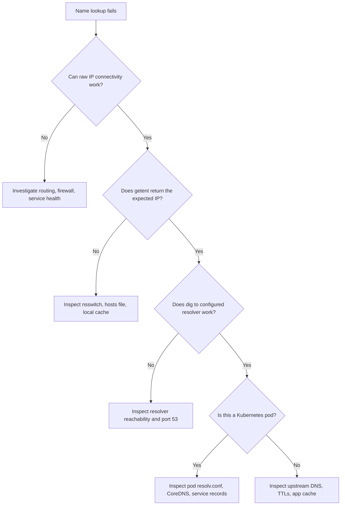

# Module 3.2: DNS in Linux

> **Linux Foundations** | Complexity: `[HIGH]` | Time: 45-60 min

## Prerequisites

Before starting this module, you should have completed [Module 3.1: TCP/IP Essentials](../module-3.1-tcp-ip-essentials/) and be comfortable reading command-line output, editing configuration files safely, and distinguishing an IP connectivity problem from an application error. A helpful background is basic networking vocabulary: hostname, IP address, port, UDP, TCP, and service discovery.

For Kubernetes examples, this module assumes a Kubernetes 1.35+ cluster and the common `kubectl` shortcut. Define it once with `alias k=kubectl`, then use commands such as `k get pods` and `k logs` during troubleshooting. The alias keeps examples compact, but the operational habit is more important: always test DNS from the same environment where the failing process runs.

## Learning Outcomes

After completing this module, you will be able to:

- **Diagnose** Linux DNS resolution failures by comparing `/etc/hosts`, `/etc/nsswitch.conf`, `/etc/resolv.conf`, resolver caches, and direct DNS query results.
- **Debug** Kubernetes DNS failures by inspecting pod resolver configuration, CoreDNS health, service records, and the query path used by applications.
- **Evaluate** the performance and correctness impact of `ndots`, search domains, fully qualified names, TTLs, and DNS caching in Linux and Kubernetes environments.
- **Implement** a repeatable DNS investigation workflow that separates local overrides, resolver behavior, CoreDNS behavior, upstream DNS behavior, and stale-cache symptoms.

## Why This Module Matters

In October 2021, Meta lost access to Facebook, Instagram, WhatsApp, Messenger, and internal operational tooling for nearly six hours after a network configuration change disconnected its data centers from the rest of the internet. Public reporting and Meta's own engineering account described a cascading failure where BGP withdrawal made authoritative DNS names unreachable, which meant users and even employees could not find the services that still existed behind the names. Outside estimates put the revenue impact around one hundred million dollars, but the more important lesson for operators was sharper: when name resolution collapses, every other layer looks broken at once.

The same pattern appears at smaller scale inside Linux fleets and Kubernetes clusters. A database migration succeeds, the new service IP is healthy, and the application still connects to the old address because a local cache ignored the intended TTL. A pod can reach `8.8.8.8` by IP, yet it fails every request to `api.partner.example` because the resolver burns time trying cluster search suffixes first. A developer proves that `dig` returns the right answer, but the application keeps using a stale `/etc/hosts` override because applications do not necessarily resolve names the same way diagnostic DNS tools do.

This module teaches DNS as an operational path rather than as a memorized definition. You will start with the Linux resolver contract, move through `/etc/hosts`, `/etc/nsswitch.conf`, and `/etc/resolv.conf`, compare the tools that observe different layers, and then carry the same reasoning into Kubernetes CoreDNS. By the end, a "name or service not known" message should feel less like a vague networking failure and more like a structured investigation with named checkpoints and evidence.

## The Pillars of Linux DNS Resolution

DNS resolution on Linux is not simply "ask a DNS server and get an IP address." Most applications call a resolver library, usually glibc on general-purpose distributions or musl on Alpine-based images, and that library follows local policy before it sends a packet to a name server. This policy matters because local files, name service switch ordering, search domains, resolver options, caches, and network DNS servers can all produce different answers for the same text name.

The first habit of DNS debugging is to ask which resolver path produced the symptom. A command such as `dig example.com` talks like a DNS specialist, while an application often talks through `getaddrinfo`, Name Service Switch, `/etc/hosts`, and `/etc/resolv.conf`. Those paths usually agree, but when they do not, the disagreement is the clue. If you only test one path, you can accidentally prove that DNS infrastructure is healthy while missing the exact path the workload uses.

```mermaid
graph TD
    A[Application: "Connect to api.example.com"] --> B{1. Check /etc/hosts};
    B -- Not found --> C{2. Check /etc/resolv.conf for DNS server};
    B -- Found --> E[Application connects to 192.168.1.10];
    C --> D[3. Query DNS server (10.96.0.10)];
    D --> F[4. DNS server returns: 93.184.216.34];
    F --> E[5. Application connects to 93.184.216.34];

    subgraph etc_hosts_lookup [/etc/hosts content]
        H1["127.0.0.1 localhost"]
        H2["192.168.1.10 api.example.com"]
    end
    subgraph resolv_conf_content [/etc/resolv.conf content]
        R1["nameserver 10.96.0.10"]
        R2["search default.svc.cluster.local ..."]
    end
    B -- Check --> H1;
    B -- Check --> H2;
    C -- Read --> R1;
    C -- Read --> R2;
```

The diagram shows the normal shape of the lookup path, but the important operational detail is the early exit. If `/etc/hosts` maps `api.example.com` to `192.168.1.10`, the resolver does not need to ask the DNS server, even if public DNS now returns `93.184.216.34`. That local override can be a deliberate migration technique, a development convenience, or a stale artifact from last year's incident. The resolver does not know intent; it follows configured order.

The Name Service Switch file decides that order for several databases, including hostnames. Most Linux systems use `files dns` for host lookups, which means local files are checked before DNS. Some environments add `mdns`, `myhostname`, LDAP, or other sources, and each addition changes the evidence you need to collect. When you troubleshoot a production host, do not assume the resolver order from memory; read it from the machine that is failing.

```bash
cat /etc/nsswitch.conf | grep hosts

# Output: hosts: files dns
# Meaning: Check files (/etc/hosts) first, then DNS
```

`/etc/hosts` is intentionally simple: an IP address followed by one or more names. That simplicity is why it is still useful and still dangerous. It is useful because you can create a fast local override without waiting for DNS publication, but dangerous because it bypasses central DNS policy and can outlive the migration or test that created it. Treat every unexpected `/etc/hosts` entry as a configuration decision that deserves an owner.

```bash
# /etc/hosts
127.0.0.1       localhost
::1             localhost
192.168.1.100   myserver.local myserver
10.0.0.50       database.internal db
```

Local overrides are especially common in development, staging cutovers, and emergency mitigation. A team may point `legacy-api.example.com` at a replacement IP before the authoritative DNS change is ready, or they may block a domain by mapping it to loopback. Those are valid tactics when they are documented and short-lived. The failure mode begins when an override becomes invisible background state and the team keeps debugging DNS servers that never receive the query.

```bash
# In a Kubernetes pod
cat /etc/hosts

# Output:
127.0.0.1       localhost
10.244.1.5      my-pod-name
```

Kubernetes also writes `/etc/hosts` inside pods, usually for `localhost` and the pod's own hostname. That file does not replace CoreDNS service discovery, but it does mean the same principle applies inside containers: the local resolver may consult local files before the cluster DNS service. If you are diagnosing a pod, inspect the file from inside that pod rather than assuming it matches the node or another workload.

Pause and predict: an application server has `10.0.0.150 legacy-api.example.com` in `/etc/hosts`, while authoritative DNS now points `legacy-api.example.com` at `10.0.0.151`. What address will the application use, and what single command would you run to prove whether the system resolver agrees with the stale local override?

The answer should point you toward `getent hosts legacy-api.example.com`, not only `dig`. `dig` can prove what DNS servers say, but `getent` proves what the Name Service Switch path hands to applications. That difference is the basis of many Linux DNS investigations: compare the specialist tool, the system resolver, and the application's actual runtime environment.

## `/etc/resolv.conf`, Search Domains, and `ndots`

Once the resolver decides to ask DNS, `/etc/resolv.conf` tells it where to send the query and how to expand names that are not already absolute. On older systems this file might be edited directly, while on modern distributions it is commonly generated by NetworkManager, netplan, DHCP clients, or `systemd-resolved`. Either way, the file is still the compact summary most troubleshooters inspect first because it exposes name servers, search domains, and resolver options in one place.

```bash
# /etc/resolv.conf

# DNS servers to query (up to 3)
nameserver 10.96.0.10    # Primary DNS
nameserver 8.8.8.8       # Secondary DNS

# Domain search list
search default.svc.cluster.local svc.cluster.local cluster.local

# Options
options ndots:5 timeout:2 attempts:2
```

| Directive  | Purpose                                           | Example                     |
|------------|---------------------------------------------------|-----------------------------|
| `nameserver` | IP address of a DNS server to query. Up to 3 can be listed. | `nameserver 8.8.8.8`        |
| `search`   | List of domain suffixes to append to unqualified hostnames. | `search example.com corp.internal` |
| `domain`   | Default domain name; overridden by `search` if both are present. | `domain example.com`        |
| `options`  | Various resolver options, like `ndots`, `timeout`, `attempts`. | `options ndots:5`           |

The `nameserver` entries tell the resolver where to send DNS traffic, and most traditional resolvers use up to three. The `search` directive is a convenience feature that makes short names work inside an organization or cluster. The `options` directive changes resolver behavior, and `ndots` is the option that most often surprises Kubernetes users because it changes whether a name is tried as absolute first or expanded through the search list first.

```text
ndots:5 means:
- If hostname has < 5 dots -> try search domains first
- If hostname has >= 5 dots -> try as absolute first

Example with ndots:5 and search: default.svc.cluster.local

Query: "api" (0 dots < 5)
  Try: api.default.svc.cluster.local  <- First!
  Try: api.svc.cluster.local
  Try: api.cluster.local
  Try: api  (absolute)

Query: "api.example.com" (2 dots < 5)
  Try: api.example.com.default.svc.cluster.local  <- Wastes time!
  Try: api.example.com.svc.cluster.local
  Try: api.example.com.cluster.local
  Try: api.example.com  <- What we wanted

Query: "a.b.c.d.example.com" (4 dots < 5)
  Still tries search domains first! (need 5+ dots)
```

The trailing dot is the clean escape hatch when you mean "this name is already complete." In DNS notation, `api.example.com.` is absolute, while `api.example.com` may still be treated as a candidate for search expansion depending on resolver settings. That final dot looks odd in application configuration, but it can remove several failed queries per outbound request in clusters that use `ndots:5`. The tradeoff is readability and compatibility; some application libraries accept absolute names cleanly, while a few configuration validators reject the trailing dot.

Kubernetes uses this behavior deliberately. A pod in the `default` namespace can connect to a Service named `payments` by using the short name `payments`, because the pod search list expands it into `payments.default.svc.cluster.local`, then broader service and cluster domains. This is ergonomic for internal calls, but the same ergonomics can punish external calls such as `api.external-partner.com`, which contains fewer dots than the Kubernetes default threshold and may trigger cluster-suffix attempts before the external query.

```bash
# In a Kubernetes pod
cat /etc/resolv.conf

# Output:
nameserver 10.96.0.10
search default.svc.cluster.local svc.cluster.local cluster.local
options ndots:5
```

Before running this in a pod, predict the query order for `db-service` from namespace `staging` when the search list is `staging.svc.cluster.local svc.cluster.local cluster.local`. You should expect the resolver to try `db-service.staging.svc.cluster.local`, then `db-service.svc.cluster.local`, then `db-service.cluster.local`, and only then the bare name. That prediction is not trivia; it tells you which Service namespace, CoreDNS record, or search-suffix assumption to inspect first.

Timeout and attempt settings are the second half of the performance story. A single failed lookup can become several network packets multiplied by search suffixes, retry attempts, and name server fallbacks. In a busy service mesh or API-heavy workload, that multiplication can look like application latency, connection pool pressure, or intermittent partner timeouts. Good DNS tuning is not only about making names resolve; it is about limiting how much work the resolver does before it reaches the name you intended.

## The DNS Debugger's Toolkit

Linux gives you several DNS tools because each one answers a slightly different question. `dig` is best when you want to interrogate DNS protocol behavior, choose a specific server, inspect TTLs, or trace delegation. `nslookup` and `host` are convenient for quick human checks, especially on minimal systems. `getent` is the critical bridge back to application behavior because it asks through the system's configured Name Service Switch path.

```bash
# Basic query: Resolves A record for example.com using default DNS server
dig example.com

# Query specific record type: Fetch only IPv4 address
dig example.com A

# Query specific record type: Fetch only IPv6 address
dig example.com AAAA

# Query specific record type: Fetch Mail Exchanger records
dig example.com MX

# Query specific record type: Fetch Name Server records
dig example.com NS

# Query specific record type: Fetch Text records (often used for SPF, DKIM, DMARC)
dig example.com TXT

# Query specific record type: Fetch Canonical Name record
dig example.com CNAME

# Short output: Displays only the answer section (useful for scripting)
dig +short example.com

# Use specific DNS server: Query Google's public DNS (8.8.8.8)
dig @8.8.8.8 example.com

# Trace full resolution path: Shows iterative queries from root servers down
dig +trace example.com

# Reverse lookup: Resolves IP address to hostname (PTR record)
dig -x 8.8.8.8
```

Use `dig` when you need to know what a DNS server says and how it says it. The status code, flags, answer section, authority section, query time, and responding server all matter. `NOERROR` with zero answers means something different from `NXDOMAIN`, and a response from an unexpected resolver points toward local configuration, DHCP, VPN, or pod DNS policy. Do not reduce `dig` output to "it works" or "it fails"; read the metadata.

```bash
dig example.com

; <<>> DiG 9.16.1 <<>> example.com
;; global options: +cmd
;; Got answer:
;; ->>HEADER<<- opcode: QUERY, status: NOERROR, id: 12345
;; flags: qr rd ra; QUERY: 1, ANSWER: 1, AUTHORITY: 0, ADDITIONAL: 1

;; QUESTION SECTION:
;example.com.                   IN      A

;; ANSWER SECTION:
example.com.            3600    IN      A       93.184.216.34

;; Query time: 25 msec
;; SERVER: 10.96.0.10#53(10.96.0.10)
;; WHEN: Mon Dec 01 10:00:00 UTC 2024
;; MSG SIZE  rcvd: 56
```

In this sample, the answer is not just `93.184.216.34`. The TTL is `3600`, which tells caches how long they may reuse the answer. The server is `10.96.0.10`, which is a clue that the query came through a Kubernetes cluster DNS service rather than a public resolver. The query time is low enough to rule out a broad timeout problem for this lookup, but it does not prove that application lookups with search expansion are equally fast.

```bash
dig example.com
# ... lots of output ...
# example.com.  3600  IN  A  93.184.216.34
# ... query time, server, etc ...

dig +short example.com
# 93.184.216.34
```

`dig +short` is useful for scripts and quick comparisons, but the concise form hides the details you need during incidents. A senior troubleshooting pattern is to start concise when you only need an answer, then switch to full output when the answer conflicts with application behavior. If the short output and full output both look healthy, the next question is whether the application uses the same resolver path.

```bash
# Basic lookup: Resolves example.com using default DNS server
nslookup example.com

# Use specific server: Query Google's public DNS (8.8.8.8)
nslookup example.com 8.8.8.8

# Reverse lookup: Resolves IP address to hostname
nslookup 8.8.8.8
```

`nslookup` remains common because it is widely installed and easy to remember. It is fine for a first pass, but it is less expressive than `dig` when you need flags, delegation traces, or repeatable output for an incident note. If you use it, write down which server answered and whether the failure was a DNS error or a transport timeout. Those details determine whether you investigate records, resolver reachability, or network policy.

```bash
# Basic lookup: Resolves example.com
host example.com

# Reverse lookup: Resolves IP address to hostname
host 8.8.8.8

# Find mail servers: Queries MX records
host -t MX example.com
```

`host` is the terse human-readable option. It is handy when you want to confirm a record family quickly, such as A, AAAA, MX, or PTR. The limitation is the same as with every direct DNS client: it can tell you what DNS says, but it may not tell you what a glibc-linked application receives after local files, resolver policy, and caching are considered.

```bash
# Resolve like applications do: Checks /etc/hosts, then DNS, respecting nsswitch.conf
getent hosts example.com

# This command is crucial because it mimics the behavior of system calls that applications make.
# If 'getent' succeeds where 'dig' fails, it often points to an issue with /etc/hosts or search domains.
```

`getent hosts` is often the decisive command on Linux hosts because it follows the configured Name Service Switch. If `dig api.internal` returns the new address and `getent hosts api.internal` returns the old address, the system resolver path is different from direct DNS. That usually points to `/etc/hosts`, NSS configuration, a local resolver cache, or a generated resolver file that differs from what you expected.

Which approach would you choose here and why: a user reports that `curl https://service.internal` fails, `dig service.internal` succeeds, and `getent hosts service.internal` returns a different address than `dig`? The best next move is not to restart the application. It is to inspect `/etc/nsswitch.conf`, `/etc/hosts`, and local resolver cache state because you have already proven the direct DNS answer and the application-style answer diverge.

## Kubernetes DNS and CoreDNS

Kubernetes turns DNS from a host convenience into the primary service discovery mechanism. Pods are ephemeral, Service ClusterIPs are stable within the cluster, and application configuration usually points to names instead of raw pod addresses. CoreDNS is the default DNS server for modern Kubernetes clusters, and kubelet writes each pod's resolver configuration so that short names can resolve through the cluster's service naming scheme.

```mermaid
graph TD
    P[Pod Query: "my-service.default.svc.cluster.local"] --> C(CoreDNS);
    C -- Cluster queries: *.cluster.local --> K[Answer from Kubernetes API];
    C -- External queries: *.* --> U[Forward to upstream DNS];
    K --> R[Returns: 10.96.45.123 (Service ClusterIP)];
    U --> R;

    subgraph CoreDNS_Server [CoreDNS (10.96.0.10)]
        C
    end
```

CoreDNS has two major responsibilities in this path. For cluster names under the configured cluster domain, it answers from Kubernetes state, which means Services and some pod records become DNS records without hand-maintained zone files. For external names, it forwards to upstream resolvers according to its Corefile. When internal lookups fail and external lookups work, suspect Kubernetes record generation, service existence, namespace assumptions, or CoreDNS Kubernetes plugin behavior. When both internal and external lookups fail, suspect CoreDNS health, service routing, network policy, node DNS configuration, or upstream reachability.

```mermaid
graph TD
    A[Service Fully Qualified Domain Name (FQDN)] --> B("my-service.namespace.svc.cluster.local")
    B --> C{Components of the FQDN}
    C --> D[Service Name: my-service]
    C --> E[Namespace: namespace]
    C --> F[Service Type Indicator: svc]
    C --> G[Cluster Domain: cluster.local]
```

The fully qualified Service name encodes four useful facts: service name, namespace, record type marker, and cluster domain. The short name `my-service` only works when the resolver search list expands it to the namespace you intended. That is convenient inside a single namespace and risky across namespace boundaries. A production incident often begins with a service moved from `default` to `payments`, while clients still use a short name that now expands inside the wrong namespace first.

```bash
# Run a temporary busybox pod to test DNS resolution
k run dnstest --image=busybox --rm -it --restart=Never -- sh

# Inside the pod:
# 1. Resolve the Kubernetes API service (short name)
nslookup kubernetes

# 2. Resolve the Kubernetes API service (fully qualified name)
nslookup kubernetes.default.svc.cluster.local

# 3. Inspect the pod's resolv.conf
cat /etc/resolv.conf

# 4. Test external DNS resolution
nslookup google.com

# 5. Exit the busybox pod
exit
```

Testing from inside a temporary pod is valuable because it reproduces pod DNS policy, service routing, container image resolver behavior, and network restrictions more closely than a node shell. A node may resolve through `systemd-resolved` or corporate DNS while pods resolve through CoreDNS. A developer laptop may resolve through a VPN while the cluster forwards through node resolvers. If the failing application lives in a pod, your first trustworthy DNS test should live in a pod too.

```bash
# Issue: "nslookup: can't resolve 'kubernetes'"

# Debug steps:
# 1. Check if CoreDNS pods are running and healthy
k get pods -n kube-system -l k8s-app=kube-dns

# 2. Check CoreDNS pod logs for any errors or configuration issues
k logs -n kube-system -l k8s-app=kube-dns

# 3. Verify the kube-dns service exists and has a ClusterIP
k get svc -n kube-system kube-dns

# 4. Verify that the pod can reach the CoreDNS service IP (typically 10.96.0.10) on port 53 (UDP/TCP)
# This uses netcat (nc) from a busybox pod to test connectivity
k run test --image=busybox --rm -it -- \
  nc -zv 10.96.0.10 53
```

This sequence separates control-plane state, CoreDNS workload health, service discovery for the DNS service itself, and network reachability to port 53. The port test has a subtle limitation: many `nc` builds test TCP more naturally than UDP, while most DNS queries use UDP unless responses are large or truncated. Still, proving basic reachability to the service IP is useful because a completely unreachable DNS service causes broader symptoms than a single missing Service record.

```bash
# Option 1: Exec into the pod and check its resolv.conf
k exec pod-name -- cat /etc/resolv.conf

# Option 2: Get the ClusterIP of the kube-dns service
k get svc -n kube-system kube-dns -o wide

# The 'nameserver' entry in the pod's resolv.conf should match the 'ClusterIP' of the kube-dns service.
```

The pod's `nameserver` should normally match the `kube-dns` Service ClusterIP, even when the backing pods are CoreDNS. If it does not, inspect the pod `dnsPolicy`, any `dnsConfig`, and kubelet configuration on the node. A custom `dnsPolicy: None` can be correct for specialized workloads, but it also removes the default cluster service discovery behavior unless the replacement configuration is complete.

```bash
dig kubernetes.default.svc.cluster.local  # Works by directly querying the FQDN
dig +search kubernetes                      # Explicitly tells dig to use search domains
getent hosts kubernetes                     # Uses the system resolver, respecting /etc/hosts and search domains
```

The comparison between `dig`, `dig +search`, and `getent` is one of the most useful Kubernetes DNS lessons. A direct FQDN query tests whether CoreDNS can answer the exact cluster record. A search-enabled `dig` test shows whether suffix expansion works for that command. `getent hosts kubernetes` is closer to what many applications do, although minimal images may lack `getent` or use musl resolver behavior. When these commands disagree, the disagreement tells you which resolver layer to inspect next.

## DNS Caching, TTLs, and Freshness

Caching is the reason DNS scales and the reason DNS changes can feel haunted during migrations. Every DNS answer carries a Time To Live, and resolvers are allowed to reuse that answer until the TTL expires. Caches may live in browsers, language runtimes, operating system services, local stub resolvers, CoreDNS, upstream recursive resolvers, and application connection pools. The operational question is not "is there a cache?" but "which cache is still serving the old answer?"

TTL planning is a deployment skill. If a service is going to move next week, lowering the TTL ahead of time gives caches time to age out under the shorter policy before the cutover. Lowering the TTL at the moment of migration helps future responses but does not force every existing cache to forget old answers immediately. That is why DNS change plans should include timing, cache flush options, rollback names, and application behavior, especially for clients that maintain long-lived connections or their own DNS caches.

Pause and predict: a database record changes from an old IP to a new IP, the authoritative record now has a TTL of 60 seconds, and five minutes later one Ubuntu web server still connects to the old IP while `dig db.internal` returns the new one. Which layer is most suspicious, and what evidence would you collect before restarting application processes?

```bash
# Check the current status of systemd-resolved
systemd-resolve --status

# Flush the DNS cache maintained by systemd-resolved
systemd-resolve --flush-caches

# Display statistics about systemd-resolved operations
systemd-resolve --statistics
```

Many modern Linux distributions use `systemd-resolved` as a local resolver and cache. Depending on distribution version and configuration, applications may send queries to a local stub address, and `/etc/resolv.conf` may be a generated file that points at that stub rather than directly at upstream DNS servers. In that model, editing `/etc/resolv.conf` by hand is often the wrong fix because the file is regenerated by the network stack. Use the owning tool to change configuration, and use resolver-specific commands to inspect and flush cache state.

```bash
# Check if systemd-resolved is active
systemctl status systemd-resolved

# View statistics (cache hits, misses, current cache size)
resolvectl statistics

# Flush cache (clears all cached entries)
sudo resolvectl flush-caches

# View current DNS servers and domains configured
resolvectl status
```

`resolvectl status` is a better modern habit than only reading the symlink target of `/etc/resolv.conf`. It shows per-link DNS servers and routing domains, which matters on laptops, VPN-connected hosts, and servers with multiple interfaces. A host can send corporate domains to one resolver and public domains to another. If the wrong link owns the domain route, DNS symptoms may appear only for a subset of names.

```bash
# Symptom: An application connects to an old IP address for a domain, even after DNS records have been updated.

# Solutions:
# 1. Flush the local DNS cache (if systemd-resolved is in use)
sudo systemd-resolve --flush-caches
# Or using resolvectl
sudo resolvectl flush-caches

# 2. Check the Time To Live (TTL) of the DNS record to understand how long it's designed to be cached
dig example.com | grep -E "^example.*IN.*A"
# The number after 'IN' in the ANSWER SECTION is the TTL in seconds. A low TTL means changes propagate faster.

# 3. In Kubernetes, if CoreDNS is caching stale external records, you might need to restart its pods to force a refresh
k rollout restart deployment coredns -n kube-system
```

Restarting CoreDNS is a blunt instrument and should not be the first move for every stale answer. It can clear CoreDNS cache state, but it also affects cluster-wide name resolution and may hide the original cause if the stale answer lived in an application runtime or node-local cache instead. Use it when evidence points to CoreDNS caching or a CoreDNS configuration problem, and record what you observed before the restart. During an incident, evidence gathered before mutation is often more valuable than a lucky fix.

## Building a DNS Incident Workflow

A repeatable DNS workflow starts with the failing name, the failing environment, and the expected destination. Those three facts sound basic, but many incidents skip one of them and drift into vague claims. A short Service name inside a pod, a public FQDN from a node, and a corporate split-DNS name from a VPN-connected host are different cases. Write the exact name and the exact place where it failed before collecting commands, because the rest of the evidence only has meaning in that context.

The second step is to decide whether the symptom is name resolution or post-resolution connectivity. If a log says `connection refused`, the name may have resolved correctly and the remote service may be rejecting connections. If a log says `temporary failure in name resolution`, the resolver path is still suspicious. If a TLS client rejects a certificate, DNS may have sent the client to an unexpected endpoint, but the immediate evidence lives in certificate identity and connection destination. Good DNS debugging does not absorb every network symptom; it proves or clears the name-to-address step.

Raw IP tests are useful when you already know the expected address, but they must be interpreted carefully. Reaching an IP address does not prove DNS is healthy, and failing to reach an IP address does not prove DNS is broken. The value is separation. If `curl http://10.96.45.123` reaches a Service while `curl http://payments` does not, the name path deserves attention. If both fail, DNS may still be wrong, but service routing, endpoints, network policy, or application health are at least as likely.

After that separation, compare direct DNS with application-style resolution. A direct query to the configured resolver answers "what does this DNS server say?" while `getent hosts` answers "what does this Linux resolver path return?" If those two results differ, you have a local policy problem, not a generic DNS outage. If they agree, the next question is whether the application runtime uses that same resolver path or maintains its own cache and connection behavior.

On hosts, collect `/etc/nsswitch.conf`, `/etc/hosts`, `/etc/resolv.conf`, and resolver service status together. Reading only one file can mislead you because generated resolver files often point at local stubs, and local stubs may route different domains to different upstream servers. A useful incident note says, "NSS is `files dns`; no hosts override exists; resolved routes this suffix to resolver X; `getent` returns address Y." That sentence gives the next engineer a coherent model instead of a pile of commands.

On Kubernetes, collect the pod namespace, pod DNS policy, pod `/etc/resolv.conf`, CoreDNS Service ClusterIP, CoreDNS pod status, and a lookup from the affected context. These facts let you distinguish a missing Service record from a broken DNS service path. A short name failing while the fully qualified name works points toward search domains or namespace assumptions. Both names failing while external names work points toward Kubernetes record generation or service existence. Everything failing points toward CoreDNS health, service routing, or network reachability to the DNS service.

When external names are slow inside Kubernetes, inspect query shape before scaling DNS. A workload that calls `api.partner.example` without a trailing dot may force the resolver to try several cluster-suffixed names first. CoreDNS metrics may show high QPS, but the root cause can be client-side expansion. Scaling CoreDNS may reduce immediate pain, yet it leaves wasted queries in place. The better fix might be an absolute FQDN, a pod-specific DNS option, or application connection reuse that reduces lookup frequency.

When DNS answers are correct but applications still use old addresses, shift from record correctness to cache ownership. The stale answer may live in `systemd-resolved`, CoreDNS, a recursive resolver, a browser, a JVM, a Go process, or a connection pool. Each owner has different visibility and different clearing behavior. Restarting every component is tempting, but it destroys evidence and broadens impact. Start with the narrowest cache you can prove, then widen only if before-and-after checks show the stale answer remains.

The most useful DNS timeline includes TTL changes. If a team lowered a TTL after the cutover started, old caches may still hold answers from the earlier longer TTL. If a name was created moments before clients started, negative caching may explain why some clients briefly keep receiving failure. If a rollback reused the same name, clients with cached answers may reach different backends until their caches expire. Timelines convert "propagation is weird" into concrete cache and query events.

Do not ignore IPv6 during modern investigations. Some clients ask for AAAA records, prefer IPv6 when available, or race IPv4 and IPv6 connections. A service can have a healthy A record and a broken AAAA record, causing only some clients or networks to fail. When symptoms vary by environment, query both A and AAAA records and compare the connection path each address family uses. This is especially important in cloud and corporate networks where IPv6 enablement may be partial.

CNAME chains deserve similar attention. A friendly application name may point to a regional name, which points to a load balancer name, which finally returns address records. Each step can have its own TTL and ownership boundary. If the first record is correct but the target name fails, the incident belongs to the next link in the chain. `dig` output that shows CNAMEs is not noise; it is a map of delegation and responsibility.

Authoritative and recursive DNS are different operational layers. Authoritative servers publish the truth for a zone, while recursive resolvers cache and chase answers on behalf of clients. If an authoritative query returns the expected record but a recursive resolver returns the old one, the record change is not necessarily wrong; the recursive cache may still be within TTL. If authoritative servers disagree with each other, the zone publication process or delegation is suspicious. Matching your test to the layer prevents premature escalations.

VPN and split-DNS environments add another decision point. A name may intentionally resolve only when a VPN link is active, or it may resolve differently depending on the interface that owns the suffix. On laptops, `resolvectl status` often reveals routing domains that explain why a name works in one terminal session and fails after network changes. On servers, DHCP or cloud-init may rewrite DNS configuration after reboot. Treat network attachment as part of resolver state.

Containers add filesystem and image differences. A pod may mount a generated `/etc/resolv.conf`, but the application image determines which resolver library and tools are available. Alpine-based images using musl can behave differently from Debian-based images using glibc in edge cases around search behavior and options. Debug images are useful, but they are not identical to application images. If a debug pod succeeds and the application fails, inspect the application image, runtime, and process environment before declaring the cluster healthy.

A good incident workflow also includes mutation discipline. Before you remove a hosts entry, flush a cache, restart CoreDNS, or change pod DNS config, capture the evidence that justified the change. After the change, rerun the same command from the same environment. That before-and-after pair proves whether your action affected the suspicious layer. Without it, a temporary recovery may leave the team unsure whether the fix was causal or coincidental.

Logging and metrics can turn one-off command output into fleet evidence. CoreDNS query counts, response codes, latency histograms, and cache metrics reveal whether a problem is isolated or cluster-wide. Application logs that include resolved addresses can show whether only one replica is stale. Host resolver statistics can show cache behavior over time. Use commands for fast diagnosis, but use metrics to decide scope and urgency.

There is also a security angle to resolver evidence. Search domains can leak internal-looking names to resolvers that should never see them if configuration is wrong. Hosts-file overrides can bypass centrally monitored DNS controls. Unexpected upstream resolvers can expose query patterns outside the intended trust boundary. When you inspect DNS during an incident, note not only whether the answer works, but also whether the query traveled through the expected resolver path.

Change management should treat DNS settings as application dependencies. A deployment that introduces a new external API name, a new cross-namespace Service name, or a custom pod DNS policy is changing how the workload discovers the network. Review those changes with the same seriousness as endpoint URLs and firewall rules. The cost of a bad DNS assumption often appears later, during load, failover, or migration, when the name path is suddenly exercised at scale.

For post-incident follow-up, convert the lesson into a reusable check. If a stale hosts entry caused the outage, add a configuration-management rule or audit. If `ndots` expansion created latency, add a guideline for external FQDNs in cluster workloads. If CoreDNS saturation was involved, add metrics and alerts that distinguish response codes, latency, and cache behavior. A DNS incident that only produces a one-time fix is likely to repeat with a different name.

The workflow is intentionally evidence-heavy because DNS failures are easy to overgeneralize. A single name can pass from local files, to stub resolvers, to recursive resolvers, to authoritative servers, and back through caches before an application ever opens a socket. Each layer can be healthy while another layer is wrong. Your job during debugging is to find the first layer where expectation and observation diverge, then make the smallest change that corrects that layer.

Keep the human workflow calm as well. DNS incidents often involve platform, networking, security, and application engineers at the same time, and each group sees a different slice of the path. A concise resolver timeline gives everyone a shared map. It reduces repeated tests, prevents broad restarts, and makes the final fix easier to review after service is restored.

Finally, write the conclusion in layer-specific language. "DNS is broken" is less useful than "pod `web-2` in namespace `staging` has `dnsPolicy: None` and lacks the cluster search domains, while CoreDNS answers the fully qualified Service name correctly." The second sentence identifies the failing layer, clears CoreDNS for that record, and points to the owning configuration. That is the standard you should aim for when communicating DNS findings during real operations.

## Patterns & Anti-Patterns

Reliable DNS operations come from testing the same path the workload uses, keeping local overrides visible, and making resolver behavior explicit when performance matters. The patterns below are less about memorizing commands and more about narrowing the investigation without losing context. DNS failures often cross team boundaries, so a good diagnostic note should state which layer was tested, from where, with which resolver, and what answer was observed.

| Pattern | When to Use It | Why It Works | Scaling Consideration |
|---|---|---|---|
| Compare `dig` with `getent` | Application behavior disagrees with direct DNS tests | It separates DNS server answers from Linux resolver policy | Automate both checks in host diagnostics so incidents collect comparable evidence |
| Test from the workload namespace | Pods, containers, VPN hosts, and multi-interface servers fail differently | The failing process may see different `/etc/resolv.conf`, routes, and caches | Standardize debug images and document how to launch them safely |
| Use absolute names for external dependencies in Kubernetes | Cluster workloads call stable external APIs | Trailing dots bypass search suffix expansion and reduce wasted queries | Validate that application config accepts absolute DNS names before broad rollout |
| Plan TTL changes before migrations | Service IPs, load balancers, or database endpoints will move | Caches need time to age out under shorter TTLs before the cutover | Include rollback names and cache-flush instructions in change plans |

Anti-patterns usually start as shortcuts during pressure. A local hosts entry fixes a migration, a CoreDNS restart clears a symptom, or a team changes `ndots` without measuring the effect on internal service lookups. Each shortcut can be valid when it is deliberate, but it becomes risky when it replaces the investigation. The better alternative is to name the layer, make the change reversible, and leave enough evidence for the next engineer.

| Anti-Pattern | What Goes Wrong | Better Alternative |
|---|---|---|
| Editing `/etc/resolv.conf` directly on managed systems | NetworkManager, DHCP, netplan, or `systemd-resolved` overwrites the file | Change DNS through the owning network configuration tool |
| Treating `dig` success as application success | `dig` may bypass `/etc/hosts`, NSS order, search behavior, or local caches | Compare `dig`, `dig +search`, `getent hosts`, and application logs |
| Restarting CoreDNS first | It disrupts cluster DNS and can hide whether the problem was records, network, or cache | Inspect CoreDNS pods, service, logs, Corefile, and a pod-level lookup before mutation |
| Leaving emergency hosts entries behind | Future DNS changes are ignored locally and failures look mysterious | Add expiry notes, config management ownership, and post-incident cleanup tasks |

## Decision Framework

DNS debugging is fastest when you decide which layer can still be guilty after each observation. Start close to the failing process, then move outward. If the application says a name does not resolve, do not begin at the registrar or public authoritative servers unless the workload actually uses them directly. Begin with the runtime view, then compare resolver policy, local cache, DNS server behavior, and upstream reachability.



Use this flow as a forcing function rather than a rigid script. If raw IP connectivity fails, DNS may be innocent because the name resolved to an address the host cannot reach. If `getent` fails while `dig` succeeds, local resolver policy is suspicious. If `dig` to the configured resolver fails but `dig @8.8.8.8` succeeds, the configured resolver or path to it is suspicious. If everything resolves correctly but the application still fails, inspect application DNS caching, connection pooling, TLS name validation, and the actual destination address in logs.

| Symptom | First Check | Likely Layer | Common Fix |
|---|---|---|---|
| `dig` returns new IP, app uses old IP | `getent hosts name` and local cache stats | `/etc/hosts`, NSS, or OS cache | Remove stale override or flush the owning cache |
| Pod resolves internal Service but external name is slow | Pod `/etc/resolv.conf` and `ndots` behavior | Search suffix expansion | Use an absolute external FQDN or tune pod DNS config carefully |
| Pod cannot resolve `kubernetes.default` | CoreDNS pods, kube-dns Service, pod resolver file | Cluster DNS service path | Restore CoreDNS health or service reachability |
| Only one node's pods have DNS failures | Compare pod resolver files and node DNS config | Kubelet or node resolver configuration | Repair node config and recycle affected pods if needed |
| DNS changed but clients vary by region | TTLs and recursive resolver answers | Distributed caching | Wait for TTL, lower future TTL earlier, or use staged endpoints |

## Did You Know?

- **DNS was created in 1983** by Paul Mockapetris to replace the HOSTS.TXT file, a manually distributed flat file that listed every hostname on the ARPANET. That architectural shift let naming become hierarchical and delegated instead of centrally copied to every host.
- **Kubernetes' CoreDNS can handle millions of queries per hour** in large clusters, and every short Service lookup, external API lookup, and failed search-suffix attempt adds to that load. DNS is often invisible until query volume turns a small configuration choice into measurable latency.
- **The `search` directive is both convenience and risk** because it lets applications use short names like `my-service`, but it also creates extra candidate names and can route surprising queries through internal DNS infrastructure. Search domains are helpful only when engineers remember they exist.
- **DNS primarily uses UDP port 53, but TCP port 53 still matters** for large responses, truncation, DNSSEC, and some operational workflows. Firewalls that allow UDP while blocking TCP can create intermittent failures that look random until packet size or truncation enters the investigation.

## Common Mistakes

| Mistake | Why It Happens | How to Fix It |
|---|---|---|
| Modifying `/etc/resolv.conf` directly on a managed host | The file looks authoritative, but another service may regenerate it after DHCP renewal, link changes, or reboot | Identify the owner with `ls -l /etc/resolv.conf` and `resolvectl status`, then change DNS through NetworkManager, netplan, DHCP, or resolved configuration |
| Ignoring `/etc/hosts` during application incidents | Direct DNS tools bypass local overrides, so engineers trust the DNS answer and miss the resolver path | Run `getent hosts <name>` and inspect `/etc/nsswitch.conf` plus `/etc/hosts` before blaming upstream DNS |
| Using external names without a trailing dot in Kubernetes hot paths | `ndots:5` makes names with fewer dots try cluster search suffixes before the intended external name | Use an absolute external FQDN where supported, measure lookup latency, and avoid changing cluster defaults without testing internal lookups |
| Restarting CoreDNS for every DNS symptom | It is visible and easy, while application caches and node resolver state are less obvious | Prove whether CoreDNS is serving the stale or failed answer before restarting, and capture logs and query evidence first |
| Testing only from a node shell for pod failures | Nodes and pods can have different resolver files, DNS policies, routes, and network policies | Launch a temporary debug pod or exec into the affected pod to test from the workload environment |
| Forgetting TCP port 53 in firewall rules | Teams remember DNS as UDP and miss fallback behavior for larger or truncated responses | Allow and monitor both UDP and TCP port 53 between clients and approved resolvers |
| Treating low TTL as immediate propagation | Existing caches may already hold the previous answer until their stored TTL expires | Lower TTL ahead of planned migrations and include cache-flush or waiting periods in the change plan |

## Quiz

<details><summary>Your Node.js service connects to `api.internal.corp` at `192.168.1.200`, but `dig api.internal.corp` returns `10.50.0.100`. What do you check first, and why?</summary>

Check `getent hosts api.internal.corp`, `/etc/nsswitch.conf`, and `/etc/hosts` on the same host where the service runs. `dig` proves what a DNS server returns, but the application likely uses the system resolver path, which may consult local files first. If `getent` returns `192.168.1.200`, you have evidence that local resolver policy or a stale hosts entry is overriding DNS. The fix is to remove or update the local override through the system's managed configuration process.

</details>

<details><summary>A Kubernetes 1.35+ workload calls `api.external-partner.com` during load tests, and DNS latency is high even though upstream resolvers answer quickly. What resolver behavior is likely responsible?</summary>

The likely cause is `ndots:5` combined with Kubernetes search domains in the pod's `/etc/resolv.conf`. The name has fewer than five dots, so the resolver may try cluster-suffixed candidates before the intended external name. Each failed candidate adds latency and DNS load, which becomes visible under concurrency. If the application accepts it, configuring the dependency as `api.external-partner.com.` tells the resolver the name is absolute and bypasses the search path.

</details>

<details><summary>A pod cannot resolve `kubernetes.default.svc.cluster.local`, but it can reach an external IP address. What sequence separates DNS from general networking?</summary>

First inspect the pod's `/etc/resolv.conf` to confirm the nameserver points at the `kube-dns` Service ClusterIP. Then check CoreDNS pods, CoreDNS logs, and the `kube-dns` Service in `kube-system`. Finally test lookup from a temporary pod and, if needed, basic reachability to port 53 on the DNS service. This sequence matters because raw IP connectivity proves the pod has some network path, while DNS failure can still come from resolver configuration, CoreDNS health, or service routing.

</details>

<details><summary>A database DNS record moved to a new IP with a 60-second TTL, but one Ubuntu web server still uses the old IP five minutes later while `dig` returns the new IP. What is the probable layer and response?</summary>

The probable layer is a local resolver cache, application DNS cache, or stale local override rather than authoritative DNS. Compare `getent hosts db.internal` with `dig db.internal`, inspect `resolvectl statistics`, and check `/etc/hosts` before restarting services. If `systemd-resolved` is serving stale data, `sudo resolvectl flush-caches` is the targeted fix. If the application maintains its own DNS cache or long-lived connections, you may need an application reload after collecting evidence.

</details>

<details><summary>Your team added `dnsPolicy: None` to a pod for a special resolver, and now short Service names no longer work. What design issue should you evaluate?</summary>

`dnsPolicy: None` replaces the default pod DNS behavior, so the pod may no longer receive the CoreDNS nameserver, cluster search domains, or `ndots` options needed for short Service discovery. Evaluate whether the workload truly needs custom DNS or only needs an additional nameserver or option. If custom policy is required, provide a complete `dnsConfig` that preserves cluster search behavior where appropriate. Otherwise, revert to the default policy and solve the special resolver need outside the application pod.

</details>

<details><summary>A firewall change allows UDP port 53 to CoreDNS but blocks TCP port 53. Most lookups work, yet some domains fail intermittently. Why is this plausible?</summary>

DNS commonly uses UDP, but TCP is required when responses are truncated, large, or affected by features such as DNSSEC. Small A record lookups may work while larger TXT, DNSSEC-related, or multi-record responses fail. The intermittent nature comes from response size and record type rather than random resolver behavior. The fix is to allow both UDP and TCP port 53 between clients and approved resolvers, then retest the failing record types.

</details>

<details><summary>A production incident note says "DNS is broken because `nslookup service` fails on my laptop." What evidence is missing before you accept that conclusion?</summary>

The test was not run from the failing environment, so it may not use the same resolver, search domains, VPN route, or network policy as the workload. You need lookup results from the affected host or pod, the local resolver configuration, and a comparison between `getent` and direct DNS queries. In Kubernetes, you also need the pod namespace and whether the service name was short or fully qualified. Without that context, the laptop test is only a clue, not proof.

</details>

## Hands-On Exercise

In this exercise, you will build a small DNS investigation worksheet from real commands. Use a disposable Linux host, VM, or lab environment, and use a Kubernetes 1.35+ cluster only for the Kubernetes-specific tasks. Do not change production resolver settings while practicing; the goal is to observe, compare, and explain the resolver path before making changes.

### Task 1: Compare direct DNS with system resolver behavior

- [ ] Run `dig example.com`, `dig +short example.com`, and `getent hosts example.com` on the same Linux host.
- [ ] Record the responding DNS server from full `dig` output and the address returned by `getent`.
- [ ] Explain whether the direct DNS answer and application-style resolver answer agree.

<details><summary>Solution notes</summary>

The full `dig` output should show a server line, query status, answer section, and TTL. `dig +short` should show a concise answer but hide the metadata. `getent hosts` may return an IPv4 or IPv6 answer depending on host configuration, but the key comparison is whether it follows the same expected name-to-address mapping. If results differ, inspect `/etc/nsswitch.conf`, `/etc/hosts`, and local resolver services.

</details>

### Task 2: Inspect local resolver policy

- [ ] Read the `hosts` line from `/etc/nsswitch.conf`.
- [ ] Inspect `/etc/hosts` for any non-localhost mappings.
- [ ] Inspect `/etc/resolv.conf` and identify nameservers, search domains, and `options`.

<details><summary>Solution notes</summary>

The common `hosts: files dns` order means local files are checked before DNS. Non-localhost hosts entries should be treated as intentional overrides and documented. In `/etc/resolv.conf`, nameserver entries show where DNS queries go, search entries show how short names are expanded, and options such as `ndots`, `timeout`, and `attempts` explain retry and expansion behavior.

</details>

### Task 3: Observe cache tooling on a modern Linux host

- [ ] Run `systemctl status systemd-resolved` or the equivalent for your distribution.
- [ ] Run `resolvectl status` and identify per-link DNS servers or routing domains.
- [ ] If safe in your lab, run `sudo resolvectl flush-caches` and then `resolvectl statistics`.

<details><summary>Solution notes</summary>

If `systemd-resolved` is active, `resolvectl status` usually gives better operational context than reading `/etc/resolv.conf` alone. Per-link DNS and routing domains can explain why corporate or VPN names behave differently from public names. Flushing caches in a lab should clear local resolver state, but it will not clear application-level caches, browser caches, CoreDNS caches, or upstream recursive resolver caches.

</details>

### Task 4: Test Kubernetes DNS from a pod

- [ ] Define `alias k=kubectl` in your shell if you have not already.
- [ ] Start a temporary BusyBox pod and resolve `kubernetes` and `kubernetes.default.svc.cluster.local`.
- [ ] Read the pod's `/etc/resolv.conf` and compare the nameserver to the `kube-dns` Service ClusterIP.

<details><summary>Solution notes</summary>

Use a command such as `k run dnstest --image=busybox --rm -it --restart=Never -- sh`, then run `nslookup kubernetes`, `nslookup kubernetes.default.svc.cluster.local`, and `cat /etc/resolv.conf` inside the pod. In another shell, `k get svc -n kube-system kube-dns -o wide` should show the ClusterIP that appears as the pod nameserver. If short and fully qualified lookups differ, focus on search domains and `ndots`.

</details>

### Task 5: Build a DNS incident note

- [ ] Write a short note that states the failing name, failing environment, resolver configuration, direct DNS result, system resolver result, cache status, and next action.
- [ ] Include one sentence explaining which layer is still suspicious and which layer has been ruled out.
- [ ] Avoid changing configuration until the note contains enough evidence for another engineer to reproduce your conclusion.

<details><summary>Solution notes</summary>

A good note might say: "From pod `web` in namespace `staging`, `getent hosts db-service` fails, `nslookup db-service.staging.svc.cluster.local` succeeds, and `/etc/resolv.conf` search domains are missing `staging.svc.cluster.local`; CoreDNS is healthy for the FQDN, so pod DNS policy or custom `dnsConfig` is suspicious." That sentence is more useful than "DNS broken" because it names the environment, test path, evidence, and next layer.

</details>

### Success Criteria

- [ ] You can explain the difference between `dig` and `getent hosts` using evidence from your own host.
- [ ] You can identify the active nameserver, search domains, and `ndots` setting for a Linux host or pod.
- [ ] You can test Kubernetes DNS from inside a pod and compare the pod nameserver with the `kube-dns` Service.
- [ ] You can describe a stale-cache scenario without blaming authoritative DNS prematurely.
- [ ] You can write a DNS incident note that names the resolver layer still under investigation.

## Next Module

Next, continue to **[Module 3.3: Network Namespaces & veth](../module-3.3-network-namespaces/)**, where you will trace how Linux creates isolated network stacks for containers and why pod networking starts with namespaces before it reaches Services.

## Sources

- [Meta Engineering: More details about the October 4 outage](https://engineering.fb.com/2021/10/05/networking-traffic/outage-details/)
- [RFC 1034: Domain Names - Concepts and Facilities](https://www.rfc-editor.org/rfc/rfc1034)
- [RFC 1035: Domain Names - Implementation and Specification](https://www.rfc-editor.org/rfc/rfc1035)
- [Linux man-pages: resolv.conf](https://man7.org/linux/man-pages/man5/resolv.conf.5.html)
- [Linux man-pages: nsswitch.conf](https://man7.org/linux/man-pages/man5/nsswitch.conf.5.html)
- [Linux man-pages: hosts](https://man7.org/linux/man-pages/man5/hosts.5.html)
- [Linux man-pages: getent](https://man7.org/linux/man-pages/man1/getent.1.html)
- [Kubernetes DNS for Services and Pods](https://kubernetes.io/docs/concepts/services-networking/dns-pod-service/)
- [Kubernetes Debugging DNS Resolution](https://kubernetes.io/docs/tasks/administer-cluster/dns-debugging-resolution/)
- [Kubernetes Pod DNS Config](https://kubernetes.io/docs/concepts/services-networking/dns-pod-service/#pod-dns-config)
- [CoreDNS Kubernetes Plugin](https://coredns.io/plugins/kubernetes/)
- [systemd-resolved service documentation](https://www.freedesktop.org/software/systemd/man/latest/systemd-resolved.service.html)
