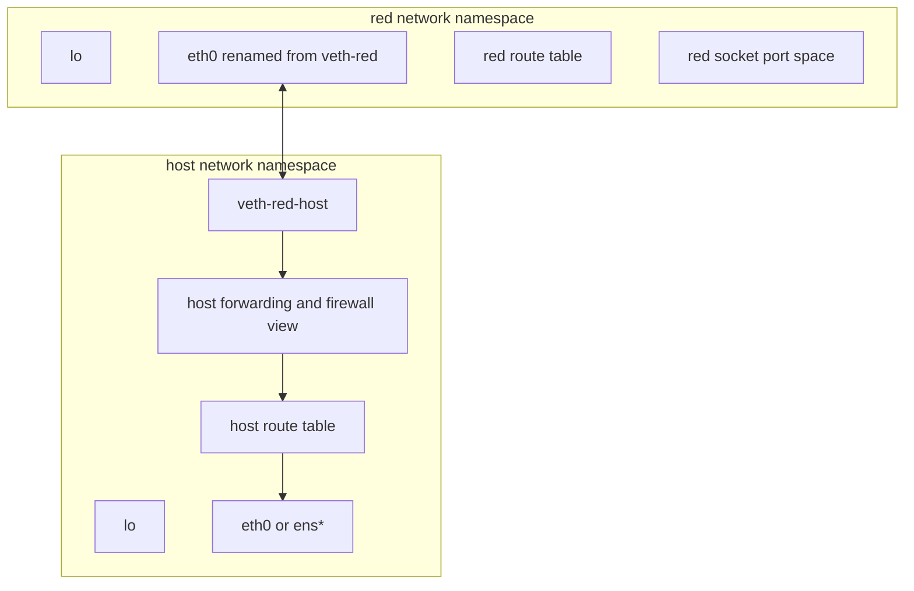
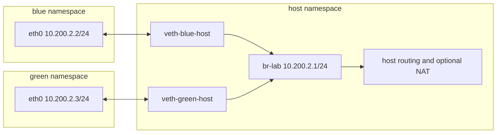
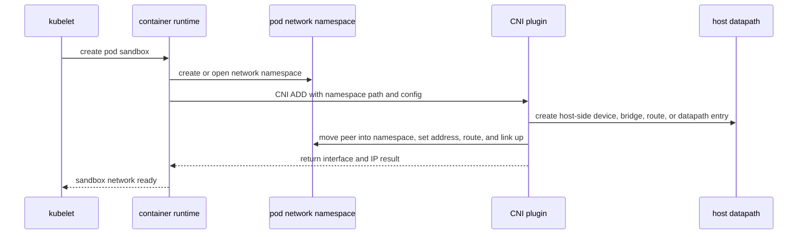

> **Linux Foundations** | Complexity: `[MEDIUM]` | Time: 40-50 min. This module turns container networking from a black box into a set of Linux objects you can inspect, repair, and explain during Kubernetes node incidents.

## Prerequisites

Before starting this module, complete [Module 2.1: Linux Namespaces](/linux/foundations/container-primitives/module-2.1-namespaces/), [Module 3.1: TCP/IP Essentials](../module-3.1-tcp-ip-essentials/), and [Module 3.2: DNS in Linux](../module-3.2-dns-linux/). You should already be comfortable reading `ip addr`, `ip route`, and `ss` output on a normal Linux host, because this lesson applies the same tools inside isolated network stacks instead of introducing a different troubleshooting language.

The hands-on sections assume an Ubuntu Linux VM with `iproute2`, `ping`, `bridge`, `iptables` or `nft` compatibility packages, and `sudo` access. The commands use documentation-backed primitives from `network_namespaces(7)`, `ip-netns(8)`, `veth(4)`, and `ip-link(8)`, so they map directly to what container runtimes automate rather than to a vendor-specific wrapper. If your VM is remote, keep a separate management session open before changing forwarding or firewall state.

## Learning Outcomes

- **Model** a Linux network namespace as a complete network stack with its own interfaces, routes, neighbor cache, port space, and firewall view.
- **Build** a working veth topology that connects isolated namespaces through direct links and a Linux bridge.
- **Trace** packets from a namespace through link state, ARP or neighbor discovery, routing, bridge forwarding, host forwarding, and optional source NAT.
- **Relate** manual namespace and veth operations to Kubernetes pod networking, CNI plugin calls, and practical node troubleshooting.

## Why This Module Matters

Kubernetes networking problems often look like application problems at first contact. A request times out, a readiness probe flips, or a pod can reach its sidecar but cannot reach a database. The YAML may look fine, DNS may resolve, and the Service may have endpoints, yet the packet still has to cross ordinary Linux machinery on the node. It must leave the pod network namespace, traverse a virtual Ethernet peer, enter a bridge or routing path, pass forwarding policy, and return through a path that the kernel can match to the original flow.

That path is easy to ignore because Kubernetes presents a clean network model. Each pod gets an IP address, containers in the same pod share `localhost`, and pod-to-pod communication is supposed to work without manual port coordination. The model is real, but Linux still implements it with namespaces, devices, routes, and plugin actions. When a container runtime asks a CNI plugin to attach a pod to the network, the plugin has to manipulate the same primitives you can create with `ip netns`, `ip link`, `ip addr`, and bridge commands.

The operational payoff is speed under pressure. If you can describe where a packet is supposed to be at each step, you can decide which namespace to enter, which interface to inspect, which route table matters, and which counters should move. Without that model, node networking becomes a pile of names such as `eth0`, `cni0`, `docker0`, `veth1234`, and `flannel.1`. With the model, those names become evidence that either confirms or rejects a specific packet path.

This module also prepares you for the next lesson on iptables and netfilter. Namespace and veth debugging tells you whether the packet reached the host forwarding path. Netfilter debugging tells you what the host did with the packet after it arrived there. Keeping those questions separate prevents random fixes, such as changing a Service when the pod's interface is down, or flushing firewall rules when the namespace has no default route.

## Did You Know

- A named network namespace created by `ip netns add` is kept alive through a bind mount under `/var/run/netns`, which is why it can outlive the shell that created it.
- A physical network device can belong to only one network namespace at a time, while a veth pair provides two virtual ends that can be split across namespaces.
- A newly created network namespace has its own loopback device, but loopback is administratively down until you bring it up.
- Kubernetes pods share one network namespace across the containers in the pod, which is why containers in the same pod share an IP address and port space.

## Namespace Mental Model: A Complete Network Stack

A Linux network namespace is not just a label on an interface. It is an isolated instance of the networking resources that a process sees: network devices, IPv4 and IPv6 protocol stacks, route tables, neighbor tables, socket port numbers, selected `/proc` and `/sys` networking views, and firewall state. The `network_namespaces(7)` manual describes that isolation as a partition of networking resources, and the practical result is that two processes in different network namespaces can both bind TCP port 8080 without colliding.

The default host namespace is simply the namespace where normal system services start. When you run `ip addr` in an ordinary shell, you are looking at the devices and addresses in that default namespace. When you run `ip netns exec red ip addr`, you are asking the same `ip` tool to inspect a different network stack. The command did not change the meaning of addresses, routes, or links; it changed the network universe that those objects belong to.

That distinction matters most when a failure report says "the node has a route" or "the interface is up." Which namespace owns the route, and which namespace owns the interface? A pod process does not use the host's route table unless it is running in the host network namespace. A host shell does not see the pod's renamed `eth0` directly after the pod end of the veth pair is moved. Correct troubleshooting starts by locating the relevant process, then inspecting the network namespace that process actually uses.

Named namespaces are convenient for learning because `ip netns` gives them stable names. Production containers often use anonymous namespaces tied to process lifetime, and tooling reaches them through paths such as `/proc/<pid>/ns/net`. The same rules apply in both cases. A namespace can be entered, inspected, connected, and removed, but no packet can cross the isolation boundary unless a device, route, socket, or kernel facility creates a path.



The diagram shows the key separation. The host owns its ordinary external interface and host-side virtual interface. The namespace owns its loopback, container-facing interface, route table, and port space. A packet from the namespace must first leave through `eth0`, appear on the host-side veth, and then be handled by the host bridge or routing path. If any one of those objects is absent, down, or incorrectly addressed, the next object in the chain never sees the packet.

The namespace is also a security boundary, but it is not a complete security policy by itself. It prevents ordinary processes in one namespace from seeing and binding network resources in another namespace. It does not decide which traffic should be allowed between namespaces once you connect them. That job belongs to link configuration, routing, bridge behavior, firewall rules, network policy implementations, and capability boundaries such as whether a process can create or move network devices.

## Inspecting and Managing Namespaces

The `ip-netns(8)` interface gives administrators a readable workflow for named network namespaces. `ip netns add red` creates a namespace and a named handle. `ip netns list` shows handles known to the `iproute2` namespace directory. `ip netns exec red COMMAND` runs a command with the network namespace changed for that process. These commands are wrappers around kernel namespace concepts, but the wrapper is useful because it keeps lab work repeatable.

Start every namespace inspection with link state, address state, and routes in that order. Link state answers whether the kernel would attempt to transmit on the interface. Address state answers whether the namespace has a usable source address on that link. Route state answers where the namespace will send a destination. If you skip directly to `ping`, you receive one failure message that could represent many causes, and you still have to walk backward through those layers.

Loopback deserves special attention because it is easy to forget. A new namespace has a loopback device, but it is down. That means a local service test against `127.0.0.1` can fail even before you have made any external network design mistakes. Container runtimes bring loopback up during setup because applications expect it. In a manual lab, you must do that yourself, and seeing that step makes the runtime's work less mysterious.

Namespace lifetime can also surprise people. A named namespace remains available while the bind mount under `/var/run/netns` exists, even if no user shell is currently inside it. A namespace tied only to a process disappears when the final process using it exits. Devices follow their own lifetime rules: physical devices move back to the initial namespace when the namespace is freed, while veth devices inside a freed namespace are destroyed with it. That difference is important when cleanup leaves some interfaces visible and others gone.

> **Pause and predict**: if a process in namespace A binds port 80, does namespace B see anything on port 80?

```bash
sudo ip netns add red
sudo ip netns exec red ip link show
sudo ip netns exec red ip link set lo up
sudo ip netns exec red ip addr show
sudo ip netns exec red ip route show
sudo ip netns delete red
```

Read the output as a state report rather than as proof of connectivity. A namespace with only loopback up can reach itself but nothing outside itself. A namespace with an Ethernet interface up but no IP address can exchange Ethernet frames but cannot originate ordinary IPv4 traffic. A namespace with an address but no matching route may answer traffic on the same subnet while failing every off-subnet destination. Each observation narrows the search.

For production pods, the named namespace may not exist. You can still identify the network namespace through the workload process. Container runtimes and CRI tools expose the sandbox process in different ways, but the kernel path is always visible once you have the process ID: `/proc/<pid>/ns/net`. Tools such as `nsenter` can enter that namespace, and CNI runtimes pass namespace paths to plugins so the plugin knows where to place the container-side interface.

## Veth Pairs: The Namespace Boundary Cable

A veth pair is a pair of virtual Ethernet interfaces created together. The `veth(4)` manual describes the pair as a mechanism where packets transmitted on one device are immediately received on the other. That behavior makes a veth pair feel like a short cable with two plugs. Put one plug in the namespace and keep the other on the host, and the isolated stack now has a Layer 2 path to something outside itself.

The pair itself does not assign IP addresses, create default routes, provide DNS, or choose firewall policy. It only transports frames between its two ends. This simplicity is useful because it lets you test the boundary in small pieces. If a namespace cannot ping the host-side veth address on the same subnet, the problem is likely link state, addressing, neighbor discovery, or the veth relationship. You do not need to investigate DNS, Services, or external routers yet.

Names can be misleading during veth debugging. You might create `veth-red` and `veth-host`, then move `veth-red` into the namespace and rename it `eth0`. The host no longer shows `veth-red` by that name because that end is now owned by a different namespace. Container runtimes often generate host-side names that look random. During troubleshooting, use peer relationships, interface indexes, MAC addresses, bridge membership, and packet counters rather than trusting that names will be friendly.

Deleting either end of a veth pair deletes the pair. Moving one end does not delete it; it only changes namespace ownership. Bringing one end up does not automatically bring the other end up. A complete direct-link setup needs both ends up, compatible addresses on the same subnet, and routes that match the intended traffic. For a two-node lab, that may be all you need. For multiple namespaces or internet egress, you need a bridge or routing path beyond the host-side end.

```bash
sudo ip netns add red
sudo ip link add veth-red-host type veth peer name veth-red
sudo ip link set veth-red netns red
sudo ip netns exec red ip link set veth-red name eth0
sudo ip addr add 10.200.1.1/24 dev veth-red-host
sudo ip link set veth-red-host up
sudo ip netns exec red ip addr add 10.200.1.2/24 dev eth0
sudo ip netns exec red ip link set lo up
sudo ip netns exec red ip link set eth0 up
sudo ip netns exec red ping -c 3 10.200.1.1
```

> **Stop and think**: why must veth pairs be created in PAIRS, not as singletons?

This direct-link pattern is the smallest useful namespace network. The namespace can reach the host-side veth address because both ends are on the same subnet and both links are up. The host can reach the namespace address for the same reason. Nothing in that setup says the namespace can reach the internet or another namespace. A default route and a forwarding path would still be required for off-subnet destinations.

Troubleshooting a direct veth link should be mechanical. In the namespace, check `ip -br link`, `ip -br addr`, `ip route`, and `ip neigh`. On the host, check the host-side veth link, address, and packet counters with `ip -s link show dev veth-red-host`. If transmitted packets increase on the namespace side but received packets do not increase on the host side, you likely have the wrong interface or a down peer. If counters move but ARP remains incomplete, inspect addresses and subnet masks.

## Bridges: Scaling One Link into a Segment

A direct veth pair is useful for one namespace, but container hosts usually need many isolated workloads on the same node. A Linux bridge provides that shared Layer 2 segment. The kernel bridge documentation describes a bridge as a device that connects network segments and forwards frames based on destination MAC addresses. In a container topology, the bridge is the local switch, and each host-side veth end is a switch port.

The bridge pattern changes the host-side veth role. Instead of assigning an IP address to every host-side veth, you attach each host-side veth to the bridge. The bridge receives the gateway address for the namespace subnet, and each namespace points its default route at that bridge address. This is the pattern behind names such as `docker0` and `cni0`, although production plugins add IP address management, firewall rules, overlay or routing integration, and cleanup logic.

Layer 2 forwarding and Layer 3 routing are different jobs. A bridge can forward a frame from one namespace port to another namespace port when both namespaces are on the same bridge subnet. The host must route and forward if the destination is outside that subnet. If the destination is beyond the host, source NAT may also be required so return traffic knows how to get back. A working bridge ping does not prove that egress routing and NAT are correct.



The bridge also creates new debugging evidence. `bridge link` shows which interfaces are enslaved to the bridge. `bridge fdb show br br-lab` shows forwarding database entries learned from frames. `ip addr show br-lab` confirms the gateway address. If two namespaces on the same bridge cannot ping each other, inspect bridge membership and FDB learning before investigating the upstream route. Their traffic should not need to leave the bridge subnet.

Bridge timing can cause brief confusion. A Linux bridge may learn MAC addresses only after traffic flows, and spanning tree settings can influence forwarding state if enabled. In most container bridge topologies, spanning tree is disabled and ports forward quickly. Even then, the first ping may trigger ARP or neighbor discovery, so watch both `ip neigh` and counters. The useful question is whether each object learns the next object's address at the moment traffic tries to cross it.

## Routes, Neighbor Tables, and Forwarding

IP routing inside a namespace follows the same rules as IP routing on a host. The kernel chooses an output interface and next hop based on the route table visible inside that namespace. A route such as `default via 10.200.2.1 dev eth0` says that off-subnet traffic should leave through the namespace interface and use the bridge address as the next hop. If that route is missing, traffic to external destinations fails before it ever reaches host forwarding.

Neighbor discovery is the Layer 2 lookup that makes the route usable. For IPv4, the namespace must resolve the next-hop IP address to a MAC address with ARP. For IPv6, it uses Neighbor Discovery. If `ip route` looks correct but `ip neigh` shows `FAILED` or `INCOMPLETE`, the packet is stuck before Layer 3 forwarding. In a bridge topology, that usually points to a down link, wrong subnet, missing bridge membership, or filtering that blocks ARP or neighbor discovery frames.

Host forwarding is separate from namespace routing. A namespace can have a default route to the bridge, and the host can receive the packet, but the host still needs forwarding enabled to route between interfaces. On Linux, IPv4 forwarding is controlled by `net.ipv4.ip_forward`, and the kernel networking sysctl documentation treats forwarding as the switch that permits packets to move between interfaces. Kubernetes node setup normally handles this through distribution, kubelet, or plugin configuration, but manual labs make the dependency visible.

NAT is another separate question. If a namespace uses a private lab subnet and sends traffic to a network that has no route back to that subnet, replies will not return unless the host rewrites the source address or the upstream network learns the route. Container bridge setups commonly use masquerade for egress from private container ranges. Kubernetes pod networking usually aims for direct pod-to-pod routing inside the cluster model, but plugins may still use NAT for egress, Services, or special traffic paths.

Troubleshooting improves when you avoid mixing these layers. Ask first whether the namespace can reach its gateway. If not, inspect links, addresses, bridge membership, and neighbor state. Ask next whether the host forwards the packet. If not, inspect forwarding sysctls and firewall policy. Ask last whether replies can return. If not, inspect routes on the far side or the NAT policy on the host. This sequence keeps a single timeout from turning into a broad search across every networking component.

The same sequence works for IPv6, but the details change. IPv6 forwarding, router advertisements, neighbor discovery, and source address selection have their own sysctls and operational expectations. Do not assume an IPv4 bridge lab proves IPv6 behavior. In Kubernetes clusters that run dual-stack networking, each pod can have addresses for more than one family, and the plugin must satisfy the routing and policy model for each configured family.

Route lookup commands are especially useful because they force the kernel to tell you the decision it would make for a specific destination. Inside a namespace, `ip route get 10.200.2.1` answers the gateway case, while `ip route get 1.1.1.1` answers the off-subnet case. The output includes the chosen device, selected source address, and sometimes the cached path. If that output contradicts your diagram, fix the route model before collecting packet captures.

Neighbor table output gives you the next lower layer of evidence. A correct route to a directly connected next hop still needs a resolved link-layer destination. In an IPv4 lab, an incomplete neighbor entry for the bridge gateway means the namespace tried to resolve the gateway MAC but did not receive an ARP answer. That points to bridge membership, link state, subnet mismatch, or filtering of ARP frames. It does not point to DNS or a Kubernetes Service, because the packet has not reached those layers.

## CNI and Kubernetes: Automation of the Same Primitives

Kubernetes defines the network model, but it delegates much of the node-level implementation to the container runtime and network plugin. The official Kubernetes networking documents describe pods as having their own private network namespace shared by containers in the pod, and the CNI specification defines an execution contract between runtimes and plugins. In practical terms, the runtime creates or identifies the pod sandbox namespace, then calls a plugin with enough information for the plugin to attach that namespace to the node network.

CNI is intentionally about interfaces and connectivity rather than about every possible cluster behavior. The spec defines operations such as `ADD`, `DEL`, and `CHECK`, along with environment variables and JSON configuration. A plugin can create a veth pair, move one end into the pod namespace, configure addresses and routes, attach the host side to a bridge or routing datapath, and return the resulting interface information. More advanced plugins may program routes, eBPF maps, encapsulation devices, or policy objects, but the namespace boundary still has to be connected.

This is why pod troubleshooting often begins below Kubernetes objects. A pod can exist in the API while its sandbox network is not configured correctly on the node. The kubelet may report plugin errors when CNI setup fails, but sometimes the symptom appears later as a data-plane issue. If you know the manual pattern, you can inspect whether the pod namespace has an interface, whether the host side exists, whether the route is correct, and whether the plugin-created bridge or datapath knows about the endpoint.



The sequence diagram is not a promise that every plugin uses a Linux bridge. Some plugins route directly, some use overlays, some use eBPF forwarding, and some integrate with cloud provider networking. The stable lesson is the boundary. A pod process needs a network namespace, an interface inside that namespace, an address, and a route. The host or datapath needs a corresponding endpoint and forwarding behavior. If those facts are not true, higher-level Kubernetes objects cannot make packets move.

Kubernetes also changes how you think about port conflicts. Containers within the same pod share one network namespace, so they share one port space. Two containers in the same pod cannot both bind the same IP and TCP port unless they use different addresses or socket options that allow it. Containers in different pods can bind the same port because they live in different pod namespaces. This behavior is a direct consequence of network namespace isolation, not a special Service feature.

## A Practical Packet Trace

When a pod or lab namespace cannot reach a destination, trace the packet as a set of ownership transitions. First, the process sends through the namespace socket table. Second, the namespace route table chooses an output device and next hop. Third, the namespace resolves the neighbor and transmits through its veth end. Fourth, the host-side peer receives the frame. Fifth, the bridge or host route path forwards it. Sixth, firewall and NAT policy may accept, drop, or rewrite it. Finally, the return packet must find a valid reverse path.

Each transition has a command that answers one narrow question. `ss -lntup` inside the namespace answers whether a service is listening in the namespace's port space. `ip route get DEST` inside the namespace answers which interface and source address the kernel would choose. `ip neigh` answers whether the next hop resolved. `ip -s link` on both veth ends answers whether packets and errors are moving. `bridge link` and `bridge fdb` answer whether a bridge sees the host-side port and learned MAC addresses.

For routed or egress traffic, move to host-level evidence only after the namespace evidence says the packet left. `sysctl net.ipv4.ip_forward` answers whether IPv4 forwarding is enabled. Firewall counters answer whether policy sees and handles the packet. NAT counters answer whether source rewriting is occurring. A packet capture on the bridge, veth, or external interface can prove which step is last visible, but captures are most useful after you have predicted what each interface should see.

This prediction-first habit is the difference between debugging and browsing output. Before running a command, say what result would confirm your model and what result would reject it. If the namespace route says traffic should leave `eth0`, counters on `eth0` should increase. If the host-side veth is attached to `br-lab`, bridge FDB entries should appear after traffic. If the bridge is the namespace default gateway, ARP for the gateway should resolve to the bridge MAC. If the far network has no route back, NAT or route propagation must explain return traffic.

Production plugins add names and abstractions, but they do not remove the trace. The pod's `eth0` may be a veth peer, an IPVLAN or MACVLAN interface, or another plugin-specific endpoint. The host datapath may be a bridge, routes, tunnels, or eBPF programs. The debugging method still asks who owns the namespace, which interface carries the packet, how the next hop is resolved, what datapath receives it, and where policy or routing changes the outcome.

## Reading Node Evidence Without Guessing

Good namespace troubleshooting is evidence-driven, but the evidence is useful only when you know which question each command answers. `ip -br link` is not a connectivity test; it is a link inventory. `ip -br addr` is not a routing test; it is an address inventory. `ip route get` is not proof that a destination replied; it is the kernel's planned forwarding decision. `ping` is only a later confirmation that several lower-level facts are already true.

Counters help when output looks correct but traffic still fails. The `ip -s link` command can show whether packets are leaving one end of a veth pair and arriving on the other. If namespace transmit counters increase but host receive counters do not, the peer relationship or interface selection is wrong. If both counters increase but higher-layer connectivity fails, move upward to neighbor state, routing, bridge forwarding, firewall policy, or the return path.

Packet captures are powerful, but they are easy to misuse. Capturing on every interface at once creates noise and can hide the missing step. A better approach is to predict the next interface that should see the packet, then capture there. For a bridge lab, start inside the namespace or on the namespace veth, then move to the host-side peer, then to the bridge, then to the external interface if routing is involved. The first quiet capture after a noisy one marks the broken transition.

Be careful with names copied from examples. Real nodes may use `cni0`, `docker0`, `br0`, a cloud-provider interface name, or no bridge at all. The name is less important than ownership and function. Ask whether the device is inside the workload namespace or the host namespace, whether it is a peer, bridge port, bridge device, tunnel, or external interface, and whether its counters match the traffic you are generating. That classification survives across distributions and plugins.

Finally, separate persistent desired state from observed Linux state. Kubernetes objects describe what the control plane wants. The `ip` and `bridge` commands show what the node kernel currently has. During an incident, those states can diverge because a plugin failed, cleanup was incomplete, or a node reboot restored only part of the configuration. You need both views, but do not let a valid Deployment, Pod, or Service manifest convince you that the node datapath is correct.

## Failure Patterns You Should Recognize

The most common beginner failure is an interface that exists but is down. The namespace has `eth0`, the address looks correct, and the route looks plausible, but the link state prevents transmission. Bring both ends of the veth pair up and confirm state from both namespaces. Do not assume that assigning an IP address brought the link up, because address configuration and administrative link state are separate operations.

The second common failure is a missing default route. Same-subnet pings work, which creates confidence, but off-subnet traffic fails. That is expected if the namespace has no route to destinations beyond its local prefix. Add a default route through the bridge or host-side gateway, then confirm with `ip route get`. If `ip route get` still chooses no path or the wrong path, route priority or prefix selection is still wrong.

The third common failure is bridge membership. The host-side veth exists and is up, but it is not enslaved to the expected bridge. The namespace can transmit into its veth peer, yet no other namespace on the bridge sees frames from it. `bridge link` and `ip link show master br-lab` are direct checks for this condition. If the interface is attached to the wrong bridge, packet captures on the intended bridge will be quiet because the frames never arrived there.

The fourth common failure is forwarding or filtering on the host. The namespace reaches its gateway, and maybe same-node peers work, but traffic beyond the host fails. At that point, inspect IP forwarding and firewall rules in the host namespace. The next module covers netfilter in depth, but this module's boundary is simple: a bridge can connect local namespace ports, while a routed path through the host needs forwarding policy that permits the flow.

The fifth common failure is return-path asymmetry. A packet leaves the namespace and reaches a destination, but replies never come back because the destination or upstream router does not know the namespace subnet. NAT can solve that for egress, and routed pod networks can solve it by advertising pod CIDRs or programming cloud routes. The correct fix depends on the cluster design. The troubleshooting observation is the same: outbound visibility without return traffic points to reverse routing, NAT, or stateful filtering.

## Security and Isolation Boundaries

Network namespaces reduce accidental and intentional interference between workloads. One namespace cannot directly see another namespace's ordinary interfaces, sockets, routes, or port bindings. That is why two pods can both run a web server on TCP port 8080 and why a sidecar can share `localhost` only with containers in its own pod. Isolation gives each workload a smaller network view and gives runtimes a place to apply per-workload configuration.

Isolation does not automatically create least privilege. A process with enough capabilities in the owning user namespace may create network devices, change addresses, or alter routes inside its network namespace. A connected veth pair also creates a real communication path, so policy still matters. Kubernetes NetworkPolicy, CNI plugin policy engines, host firewalls, and cloud security controls exist because namespace separation by itself says where objects live, not which flows are acceptable.

Operational cleanup is part of security. A stale namespace, leftover veth, or orphaned bridge can preserve unexpected connectivity or confuse future debugging. Manual labs should include cleanup commands, and production runtimes must handle `DEL` or garbage collection paths carefully. The CNI specification includes cleanup-oriented operations because adding connectivity is only half of the lifecycle. Removing stale resources is what keeps the node's real state aligned with the orchestrator's desired state.

## Common Mistakes

| Mistake | Symptom | Better Practice |
|---|---|---|
| Inspecting only the host namespace | Host routes look correct while the pod or lab namespace still cannot connect | Enter the workload namespace and inspect links, addresses, routes, and neighbors there first |
| Forgetting to bring loopback up | Local tests against `127.0.0.1` fail inside a new namespace | Run `ip link set lo up` during manual namespace setup |
| Bringing up only one veth end | The interface exists, but pings do not leave or counters stay flat | Confirm both peers are administratively up and have the intended names |
| Assigning an address to the host-side veth when using a bridge | Traffic bypasses the intended bridge gateway model or behaves inconsistently | Put the gateway address on the bridge and enslave host-side veth ends to it |
| Missing a default route inside the namespace | Same-subnet traffic works, but off-subnet traffic fails | Add and verify a namespace route through the bridge or gateway address |
| Debugging NAT before proving local reachability | Time is spent on firewall rules while the namespace cannot reach its gateway | Prove namespace-to-gateway connectivity before inspecting host forwarding and NAT |
| Leaving lab resources behind | Later exercises show unexpected bridges, routes, or veth names | Use deterministic names and run cleanup commands at the end of each lab |

## Knowledge Check

<details>
<summary>1. Why can two pods on the same node both bind TCP port 8080 without conflicting?</summary>

They can bind the same port when they are in different network namespaces because each namespace has its own socket port space. Containers inside the same pod are different: they share one pod network namespace, so they also share the same IP address and port space.

</details>

<details>
<summary>2. A namespace can ping its bridge gateway but cannot reach an external IP. Which layer should you inspect next?</summary>

The successful gateway ping proves the namespace interface, local address, neighbor resolution, veth pair, and bridge gateway are probably working. Next inspect host forwarding, host firewall policy, host routes, and any required NAT or upstream return route.

</details>

<details>
<summary>3. What does a veth pair provide, and what does it not provide?</summary>

A veth pair provides a Layer 2 path where frames transmitted on one end appear on the other end. It does not automatically provide IP addresses, routes, DNS, forwarding, firewall policy, NAT, or bridge membership.

</details>

<details>
<summary>4. Why is `ip netns exec red ip route` more useful than host `ip route` for a process running in `red`?</summary>

The process in `red` uses the route table in the `red` network namespace, not the host namespace route table. The host route table may be correct for host processes while the namespace route table is empty or points at the wrong gateway.

</details>

<details>
<summary>5. In a bridge topology, where should the gateway IP usually live?</summary>

The gateway IP usually lives on the bridge device, such as `br-lab`, because the bridge represents the shared Layer 2 segment for the attached namespace ports. Host-side veth ends are normally bridge ports rather than separate gateways.

</details>

<details>
<summary>6. What information does a CNI plugin need in order to attach a pod sandbox to the network?</summary>

At minimum, the plugin needs the target network namespace path, network configuration, container identity, and operation type such as `ADD` or `DEL`. With that information it can create or configure interfaces, move a peer into the namespace, assign addresses and routes, and update the host datapath.

</details>

<details>
<summary>7. Why can a packet leave a namespace successfully but still never receive a reply?</summary>

The outbound path and return path are separate. Replies can fail if the far network lacks a route back to the namespace subnet, if NAT is missing for private egress, if stateful firewall policy drops the return packet, or if asymmetric routing sends the reply somewhere else.

</details>

## Hands-On Practice

Run these exercises in a disposable Linux VM. The names use a `kd-` prefix so cleanup is predictable. If a command fails because an object already exists, run the cleanup block for that exercise and repeat the setup. The goal is not to memorize the commands; the goal is to predict which namespace owns each object and then prove your prediction with `ip` and `bridge` output.

- [ ] **Exercise 1: Create a direct veth link between the host and one namespace.** Build the smallest possible namespace network, prove host-to-namespace connectivity, and identify which route table is used for each ping. Notice that the namespace can reach only its directly connected subnet until you add a default route and host forwarding path.

```bash
sudo ip netns del kd-red 2>/dev/null || true
sudo ip link del kd-red-host 2>/dev/null || true

sudo ip netns add kd-red
sudo ip link add kd-red-host type veth peer name kd-red-eth
sudo ip link set kd-red-eth netns kd-red
sudo ip netns exec kd-red ip link set kd-red-eth name eth0

sudo ip addr add 10.210.1.1/24 dev kd-red-host
sudo ip link set kd-red-host up
sudo ip netns exec kd-red ip addr add 10.210.1.2/24 dev eth0
sudo ip netns exec kd-red ip link set lo up
sudo ip netns exec kd-red ip link set eth0 up

ip -br addr show kd-red-host
sudo ip netns exec kd-red ip -br addr
sudo ip netns exec kd-red ip route get 10.210.1.1
sudo ip netns exec kd-red ping -c 3 10.210.1.1
ping -c 3 10.210.1.2

sudo ip netns del kd-red
```

After the final delete, run `ip link show kd-red-host`. It is gone because `kd-red-host` is the host-side peer of `eth0` inside the namespace. When the kernel destroys the namespace-side peer on namespace deletion, the linked host-side peer is destroyed with it.

- [ ] **Exercise 2: Connect two namespaces through a Linux bridge.** Build a miniature container bridge, attach two host-side veth ends, and prove namespace-to-namespace communication. Read the bridge membership and forwarding database before and after the first ping so you can see the bridge learn where MAC addresses live.

```bash
sudo ip netns del kd-blue 2>/dev/null || true
sudo ip netns del kd-green 2>/dev/null || true
sudo ip link del kd-br0 2>/dev/null || true

sudo ip link add kd-br0 type bridge
sudo ip addr add 10.210.2.1/24 dev kd-br0
sudo ip link set kd-br0 up

sudo ip netns add kd-blue
sudo ip link add kd-blue-host type veth peer name kd-blue-eth
sudo ip link set kd-blue-eth netns kd-blue
sudo ip link set kd-blue-host master kd-br0
sudo ip link set kd-blue-host up
sudo ip netns exec kd-blue ip link set kd-blue-eth name eth0
sudo ip netns exec kd-blue ip addr add 10.210.2.2/24 dev eth0
sudo ip netns exec kd-blue ip link set lo up
sudo ip netns exec kd-blue ip link set eth0 up
sudo ip netns exec kd-blue ip route add default via 10.210.2.1

sudo ip netns add kd-green
sudo ip link add kd-green-host type veth peer name kd-green-eth
sudo ip link set kd-green-eth netns kd-green
sudo ip link set kd-green-host master kd-br0
sudo ip link set kd-green-host up
sudo ip netns exec kd-green ip link set kd-green-eth name eth0
sudo ip netns exec kd-green ip addr add 10.210.2.3/24 dev eth0
sudo ip netns exec kd-green ip link set lo up
sudo ip netns exec kd-green ip link set eth0 up
sudo ip netns exec kd-green ip route add default via 10.210.2.1

bridge link show master kd-br0
bridge fdb show br kd-br0
sudo ip netns exec kd-blue ping -c 3 10.210.2.3
bridge fdb show br kd-br0

sudo ip netns del kd-blue
sudo ip netns del kd-green
sudo ip link del kd-br0
```

If the ping fails, do not change routes first. Both namespaces are on the same subnet, so the direct bridge path should be enough. Inspect whether each host-side veth is attached to `kd-br0`, whether both namespace interfaces are up, and whether ARP entries appear with `ip neigh` inside the namespaces. The first broken object in that list is usually the cause.

- [ ] **Exercise 3: Add controlled egress and then remove it.** Extend the bridge lab so a namespace has a default route through the bridge, enable host forwarding temporarily, and add a source NAT rule if your VM uses iptables compatibility. Record the original forwarding value first, and restore it during cleanup so the VM returns to its previous state.

```bash
sudo ip netns del kd-egress 2>/dev/null || true
sudo ip link del kd-egbr0 2>/dev/null || true

ORIGINAL_FORWARD=$(sysctl -n net.ipv4.ip_forward)
OUT_IF=$(ip route show default | awk '/default/ {print $5; exit}')
if [ -z "$OUT_IF" ]; then
  echo "no default route; cannot NAT" >&2
  exit 1
fi

sudo ip link add kd-egbr0 type bridge
sudo ip addr add 10.210.3.1/24 dev kd-egbr0
sudo ip link set kd-egbr0 up

sudo ip netns add kd-egress
sudo ip link add kd-eg-host type veth peer name kd-eg-eth
sudo ip link set kd-eg-eth netns kd-egress
sudo ip link set kd-eg-host master kd-egbr0
sudo ip link set kd-eg-host up
sudo ip netns exec kd-egress ip link set kd-eg-eth name eth0
sudo ip netns exec kd-egress ip addr add 10.210.3.2/24 dev eth0
sudo ip netns exec kd-egress ip link set lo up
sudo ip netns exec kd-egress ip link set eth0 up
sudo ip netns exec kd-egress ip route add default via 10.210.3.1

sudo sysctl -w net.ipv4.ip_forward=1
sudo iptables -t nat -A POSTROUTING -s 10.210.3.0/24 -o "$OUT_IF" -j MASQUERADE

sudo ip netns exec kd-egress ip route get 1.1.1.1
sudo ip netns exec kd-egress ping -c 3 1.1.1.1

sudo iptables -t nat -D POSTROUTING -s 10.210.3.0/24 -o "$OUT_IF" -j MASQUERADE
sudo sysctl -w net.ipv4.ip_forward="$ORIGINAL_FORWARD"
sudo ip netns del kd-egress
sudo ip link del kd-egbr0
```

If external ping is blocked by your environment, the exercise is still useful. Confirm that `ip route get 1.1.1.1` inside the namespace selects `eth0` and the bridge gateway, then inspect host counters or run a packet capture if your environment permits it. The key lesson is that namespace routing, host forwarding, and return-path handling are independent checks.

## Learner Check

You are ready to move on when you can draw a pod-like namespace topology from memory and label the owner of every object. The namespace owns `lo`, its `eth0`, its addresses, and its route table. The host owns the peer interface, bridge or routing datapath, forwarding settings, and host-level firewall or NAT rules. If you cannot decide which namespace owns an object, pause and prove ownership with `ip netns exec`, `/proc/<pid>/ns/net`, `ip link`, and `bridge link`.

Use this self-assessment after the labs: explain why loopback must be brought up, explain why a veth pair disappears when the namespace end is destroyed, explain why the bridge usually receives the gateway IP, explain why same-subnet namespace pings do not prove internet egress, and explain how a CNI `ADD` operation maps to the manual setup commands. Each explanation should include a command you would run to verify the claim on a Linux VM.

For incident practice, take a timeout symptom and split it into three questions. Did the packet leave the workload namespace? Did the host datapath forward or transform it? Did the reply have a valid path back? If your notes answer those questions with evidence instead of guesses, you have the mental model needed for the iptables and netfilter module.

## Next Module

Continue to [Module 3.4: iptables & netfilter](../module-3.4-iptables-netfilter/), where you will inspect the host packet-filtering and NAT decisions that often sit immediately after the namespace, veth, and bridge path.

## Sources

- network_namespaces(7), Linux man-pages: https://man7.org/linux/man-pages/man7/network_namespaces.7.html
- ip-netns(8), Linux man-pages: https://man7.org/linux/man-pages/man8/ip-netns.8.html
- veth(4), Linux man-pages: https://man7.org/linux/man-pages/man4/veth.4.html
- ip-link(8), Linux man-pages: https://man7.org/linux/man-pages/man8/ip-link.8.html
- ip-address(8), Linux man-pages: https://man7.org/linux/man-pages/man8/ip-address.8.html
- namespaces(7), Linux man-pages: https://man7.org/linux/man-pages/man7/namespaces.7.html
- Namespaces, Linux kernel documentation: https://docs.kernel.org/admin-guide/namespaces/index.html
- Ethernet Bridging, Linux kernel documentation: https://docs.kernel.org/networking/bridge.html
- IP sysctl, Linux kernel documentation: https://docs.kernel.org/networking/ip-sysctl.html
- Namespaces in operation, part 7: Network namespaces, LWN: https://lwn.net/Articles/580893/
- Namespaces in operation, part 1: namespaces overview, LWN: https://lwn.net/Articles/531114/
- Kubernetes Services, Load Balancing, and Networking: https://kubernetes.io/docs/concepts/services-networking/
- Kubernetes Cluster Networking: https://kubernetes.io/docs/concepts/cluster-administration/networking/
- CNI specification on GitHub: https://github.com/containernetworking/cni/blob/main/SPEC.md
- iproute2 `ip netns` source on kernel.org: https://git.kernel.org/pub/scm/network/iproute2/iproute2.git/tree/ip/ipnetns.c
- iproute2 veth link source on kernel.org: https://git.kernel.org/pub/scm/network/iproute2/iproute2.git/tree/ip/link_veth.c
