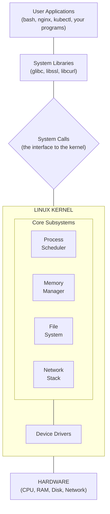
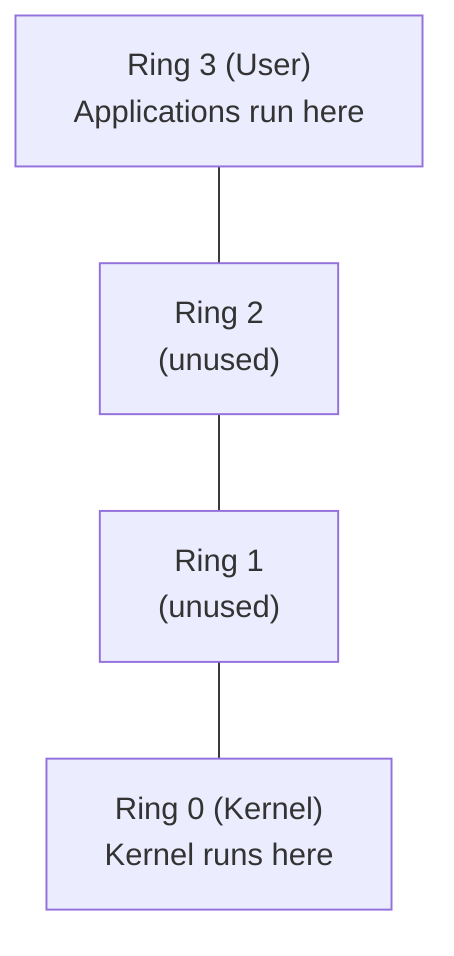
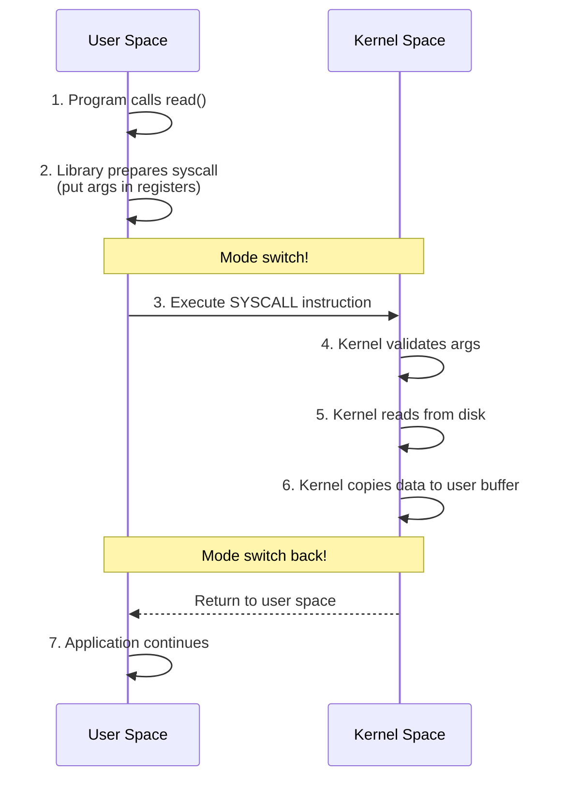
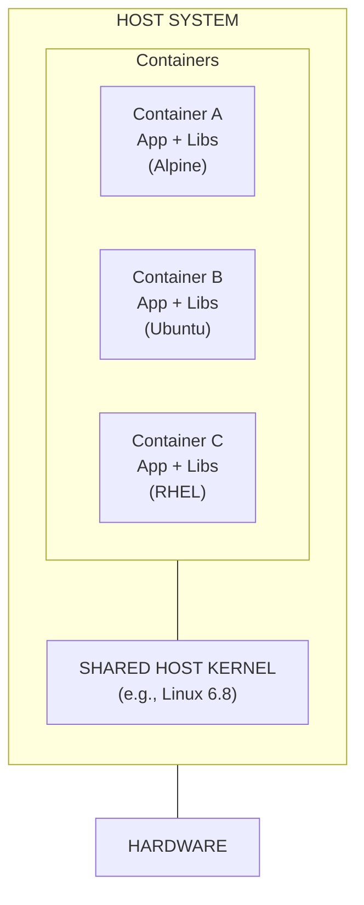
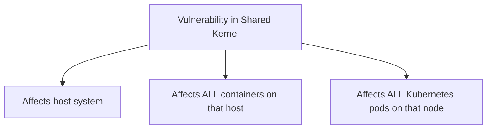

> **Linux Foundations** | Complexity: `[MEDIUM]` | Time: 25-30 min

## Prerequisites

Before starting this module:
- **Required**: Basic familiarity with using a terminal
- **Helpful**: Have a Linux system available (VM, WSL, or native)

---

## What You'll Be Able to Do

After this module, you will be able to:
- **Explain** the role of the Linux kernel as the interface between hardware and software
- **Trace** the boot process from BIOS/UEFI through kernel initialization to systemd
- **Compare** monolithic vs microkernel architectures and explain why Linux chose monolithic
- **Use** kernel information tools (`uname`, `/proc`, `dmesg`) to inspect a running system

---

## Why This Module Matters

Every container you run, every Kubernetes pod you deploy, every Linux server you manage—they all depend on **one piece of software**: the Linux kernel.

Understanding the kernel isn't just academic. It's practical:

- **Container security** depends on kernel isolation
- **Performance tuning** requires understanding kernel behavior
- **Troubleshooting** often traces back to kernel-level issues
- **Kubernetes node problems** are frequently kernel problems

When someone says "containers share the host kernel," do you really understand what that means? By the end of this module, you will.

---

## Did You Know?

- **The Linux kernel has over 30 million lines of code**, making it one of the largest open-source projects ever. Yet it boots in seconds and runs on everything from Raspberry Pis to supercomputers.

- **Linus Torvalds wrote the first Linux kernel in 1991** as a hobby project. His famous post to a newsgroup began: "I'm doing a (free) operating system (just a hobby, won't be big and professional like gnu)."

- **Over 95% of the world's top supercomputers run Linux**. All 500 of the TOP500 supercomputers use Linux as their operating system.

- **The kernel is re-entrant**, meaning multiple processes can be executing kernel code simultaneously. This is essential for multicore systems and is one reason Linux scales so well.

---

## What Is the Kernel?

The **kernel** is the core of the operating system. It's the software that:
- Talks directly to hardware
- Manages memory
- Schedules processes
- Provides isolation between programs
- Handles I/O operations

Think of it as the **supreme manager** of your computer. Every program runs with the kernel's permission and under its supervision.



---

## Kernel Space vs User Space

This is the most important concept in this module.

### Two Worlds

Linux divides memory into two distinct spaces:

| Kernel Space | User Space |
|-------------|------------|
| Protected memory area | Regular memory area |
| Full hardware access | No direct hardware access |
| Runs with elevated privileges | Runs with restricted privileges |
| Kernel and drivers live here | Applications live here |
| Crash = entire system crash | Crash = just that application |

### Why the Separation?

**Protection.** If any program could access hardware directly, a bug in Firefox could corrupt your disk. A malicious program could read any process's memory.

The separation ensures:
- Programs can't interfere with each other
- Programs can't crash the system
- Programs can't access unauthorized resources

### The CPU Enforces This

Modern CPUs have **privilege rings** (x86) or **exception levels** (ARM):



Linux uses only Ring 0 (kernel) and Ring 3 (user). When a process tries to execute a privileged instruction from Ring 3, the CPU generates an exception.

---

## System Calls: The Bridge

If user space can't access hardware, how does anything work?

**System calls** (syscalls) are the answer. They're the **only** way for user programs to request kernel services.

### Common System Calls

| Category | System Calls | Purpose |
|----------|-------------|---------|
| Process | fork, exec, exit, wait | Create and manage processes |
| File | open, read, write, close | File operations |
| Network | socket, bind, connect, send | Network operations |
| Memory | mmap, brk, mprotect | Memory management |
| System | ioctl, sysinfo, uname | System information |

### How a System Call Works



> **Pause and predict**: If an application enters an infinite loop performing mathematical calculations on data already in memory, without reading files or sending network packets, will it generate any system calls during that loop?

### Try This: Count System Calls

```bash
# Count system calls when running ls
strace -c ls /tmp

# Output shows syscall count and time
% time     seconds  usecs/call     calls    errors syscall
------ ----------- ----------- --------- --------- ----------------
 25.00    0.000050           4        12           openat
 20.00    0.000040           3        14           close
 15.00    0.000030           2        13           fstat
...
```

Every `openat`, `read`, `write`, and `close` is a journey from user space to kernel space and back.

---

## Kernel Modules

The Linux kernel is **modular**. Not everything is compiled in—some functionality is loaded on demand.

### Why Modules?

- **Flexibility**: Load only what you need
- **Memory efficiency**: Don't waste RAM on unused drivers
- **Hot-plugging**: Load drivers when devices connect
- **Development**: Test new code without rebooting

### Managing Modules

```bash
# List loaded modules
lsmod

# Example output:
# Module                  Size  Used by
# overlay               151552  0
# br_netfilter           32768  0
# bridge                311296  1 br_netfilter
# nf_conntrack          176128  1 br_netfilter

# Get info about a module
modinfo overlay

# Load a module (requires root)
sudo modprobe br_netfilter

# Remove a module
sudo modprobe -r br_netfilter

# Show module dependencies
modprobe --show-depends overlay
```

### Kubernetes-Relevant Modules

| Module | Purpose | Why K8s Needs It |
|--------|---------|-----------------|
| `overlay` | OverlayFS support | Container image layers |
| `br_netfilter` | Bridge netfilter | Network policies, kube-proxy |
| `ip_vs` | IPVS load balancing | kube-proxy IPVS mode |
| `nf_conntrack` | Connection tracking | Service routing |

If these modules aren't loaded, Kubernetes features won't work:

```bash
# Check if required modules are loaded
for mod in overlay br_netfilter ip_vs nf_conntrack; do
    lsmod | grep -q "^$mod" && echo "$mod: loaded" || echo "$mod: NOT loaded"
done
```

---

## The Kernel and Containers

Now for the crucial insight: **containers share the host kernel**.

### What This Means



Each container has its own filesystem and libraries, but they all use **the same kernel**.

### Implications

| Aspect | Implication |
|--------|-------------|
| **Performance** | No kernel overhead (unlike VMs) |
| **Security** | Kernel vulnerability affects ALL containers |
| **Compatibility** | Container must be compatible with host kernel |
| **Features** | Container can only use host kernel's capabilities |

> **Stop and think**: If a newly released container image relies on a system call that was introduced in Linux kernel 6.8, what happens when you attempt to run this container on a host running Ubuntu with kernel 5.15?

### Try This: Same Kernel, Different "OS"

```bash
# On your host
uname -r  # Shows: 6.8.0-generic (example)

# Inside an Alpine container
docker run --rm alpine uname -r  # Shows: 6.8.0-generic (SAME!)

# Inside an Ubuntu container
docker run --rm ubuntu uname -r  # Shows: 6.8.0-generic (SAME!)
```

The "OS" in container images is just **userspace tools and libraries**. The kernel is always from the host.

### Security Implications

A kernel exploit affects EVERYTHING:



This is why:
- Kernel updates are critical
- Node isolation matters
- Some workloads need dedicated nodes
- gVisor/Kata Containers exist (they add kernel isolation)

---

## Kernel Versions and Compatibility

### Version Numbering

```bash
uname -r
# Output: 6.8.0-generic

# Breaking down: 6.8.0-generic
# 6      = Major version
# 8      = Minor version (features added)
# 0      = Patch level (bug fixes)
# generic = Distribution-specific suffix
```

### Checking Kernel Information

```bash
# Kernel version
uname -r

# All system information
uname -a

# Detailed kernel info
cat /proc/version

# Kernel boot parameters
cat /proc/cmdline
```

### Why Version Matters for Kubernetes

Different kernel versions have different features:

| Feature | Minimum Kernel | Used By |
|---------|---------------|---------|
| Namespaces | 2.6.24+ | Container isolation |
| cgroups v1 | 2.6.24+ | Resource limits |
| cgroups v2 | 4.5+ | Modern resource management |
| eBPF (basic) | 3.15+ | Cilium, Falco |
| eBPF (advanced) | 4.14+ | Full Cilium features |
| User namespaces | 3.8+ | Rootless containers |

```bash
# Check cgroup version
mount | grep cgroup
# cgroup2 on /sys/fs/cgroup type cgroup2 = v2
# cgroup on /sys/fs/cgroup type cgroup = v1
```

---

## Common Mistakes

| Mistake | Problem | Solution |
|---------|---------|----------|
| Ignoring kernel updates | Security vulnerabilities | Regular kernel updates with testing |
| Wrong kernel modules | K8s features don't work | Check module requirements for your setup |
| Assuming container isolation is complete | Security breach affects all containers | Defense in depth, consider gVisor for untrusted workloads |
| Not checking kernel compatibility | Features don't work | Verify kernel version supports needed features |
| Modifying kernel params without understanding | System instability | Research sysctl changes thoroughly |

---

## Quiz

Test your understanding:

### Question 1
**Scenario**: A developer writes a C program that attempts to read a file by directly addressing the hard drive's memory controller, bypassing the standard library functions. When executed, the program immediately crashes with a segmentation fault. What mechanism caused this crash?

<details>
<summary>Show Answer</summary>

**CPU privilege levels (rings)**. The CPU hardware enforces the separation between Kernel Space (Ring 0) and User Space (Ring 3). When the user-space program attempts to execute a privileged memory instruction to access the disk controller directly, the CPU hardware intercepts this illegal action and generates an exception. The kernel then handles this exception by terminating the offending process with a segmentation fault. This hardware-level enforcement is what prevents user applications from bypassing security and crashing the system.

</details>

### Question 2
**Scenario**: You are migrating a legacy application running on an old CentOS 7 virtual machine to a container. The application team insists they need a specific old kernel version (3.10) for their app to work. You deploy the CentOS 7 container image onto your modern Kubernetes cluster running Ubuntu 24.04. When the app checks the kernel version, it crashes. Why did the container fail to provide the requested kernel?

<details>
<summary>Show Answer</summary>

**Containers share the host kernel**. Unlike virtual machines which run their own complete operating system including a kernel, containers are simply isolated processes running on the host OS. When a process inside the container requests the kernel version or attempts to use kernel features, that request goes straight to the single, shared host kernel. The container image provides only the user-space file system (libraries and binaries), meaning it cannot downgrade or supply its own kernel to satisfy the application's legacy requirements.

</details>

### Question 3
**Scenario**: You are troubleshooting a high-latency database application. Using performance tools, you notice the CPU is spending 60% of its time in "system" (kernel space) rather than "user" space. The database is constantly reading small chunks of data from disk. What boundary is the application repeatedly crossing that is causing this performance overhead, and why must it cross it?

<details>
<summary>Show Answer</summary>

**The boundary between User Space and Kernel Space via system calls**. User-space applications are strictly restricted from directly interacting with hardware, including hard drives, to ensure system stability and security. To read data, the application must request that the kernel perform the action on its behalf via a system call, which involves an expensive context switch from Ring 3 to Ring 0 and back. The high CPU overhead is caused by the constant switching required for many small reads; optimizing the application to read larger chunks per system call would significantly reduce this overhead.

</details>

### Question 4
**Scenario**: You have just provisioned a minimal Linux server to act as a Kubernetes node. When kube-proxy starts, it logs an error stating "cannot initialize IPVS: module not loaded" and falls back to iptables mode. The containers also cannot communicate with each other. Which components of the kernel are likely missing or disabled, and how do they affect the cluster?

<details>
<summary>Show Answer</summary>

**Kernel modules**. The server is missing specific kernel modules, which are pieces of code that can be dynamically loaded into the kernel to extend its functionality. Specifically, `ip_vs` is required for kube-proxy's efficient IPVS load balancing mode, and modules like `overlay` or `br_netfilter` are necessary for container filesystems and networking. Because the Linux kernel is modular, many features are not loaded into memory by default to save resources. If these required modules are not enabled or loaded on the host system, Kubernetes components will fail to initialize properly.

</details>

### Question 5
**Scenario**: A critical vulnerability (CVE) is announced in the Linux kernel's networking stack that allows remote code execution. Your security team says "We run all our apps in isolated containers without root access, so we don't need to patch the host immediately." Is the security team's assessment correct?

<details>
<summary>Show Answer</summary>

**No, the assessment is dangerously incorrect**. Because containers do not run their own kernel, they rely entirely on the shared host kernel for all operations, including network processing. If a remote code execution vulnerability exists in the host kernel's networking stack, any malicious traffic processed by the host can trigger the exploit, regardless of container isolation. Once an attacker exploits the vulnerability to compromise the host kernel (Ring 0), they instantly bypass all user-space container isolation mechanisms and gain full, unrestricted control over every container running on that node.

</details>

---

## Hands-On Exercise

### Exploring Kernel Space and User Space

**Objective**: Understand the boundary between kernel and user space through practical exploration.

**Environment**: Any Linux system (VM, WSL2, or native)

#### Part 1: Examine Kernel Information

```bash
# 1. Check your kernel version
uname -r
uname -a

# 2. See detailed kernel info
cat /proc/version

# 3. Check kernel boot parameters
cat /proc/cmdline
```

**Questions to answer:**
- What kernel version are you running?
- Was your kernel compiled with any special options?

#### Part 2: Explore Kernel Modules

```bash
# 1. List all loaded modules
lsmod | head -20

# 2. Count total modules
lsmod | wc -l

# 3. Find container-related modules
lsmod | grep -E 'overlay|bridge|netfilter|ip_vs'

# 4. Get info about a specific module
modinfo overlay 2>/dev/null || modinfo ext4
```

**Questions to answer:**
- How many modules are loaded?
- Which container-related modules are present?

#### Part 3: Trace System Calls

```bash
# 1. Trace system calls for a simple command
strace -c ls /tmp 2>&1 | head -20

# 2. Trace specific syscalls
strace -e openat cat /etc/hostname

# 3. Count syscalls for a more complex operation
strace -c curl -s https://example.com > /dev/null 2>&1 || \
  strace -c wget -q https://example.com -O /dev/null 2>&1
```

**Questions to answer:**
- Which system calls does `ls` use most frequently?
- How many times did the command cross the user/kernel boundary?

#### Part 4: Container Kernel Sharing (if Docker available)

```bash
# 1. Check host kernel
echo "Host kernel: $(uname -r)"

# 2. Check kernel inside containers
docker run --rm alpine uname -r
docker run --rm ubuntu uname -r
docker run --rm centos:7 uname -r 2>/dev/null || \
  docker run --rm amazonlinux uname -r
```

**Questions to answer:**
- Are the kernel versions the same?
- What does this prove about container architecture?

### Success Criteria

- [ ] Identified your kernel version and boot parameters
- [ ] Listed loaded kernel modules and found container-related ones
- [ ] Traced system calls and understood the user/kernel boundary
- [ ] (If Docker available) Demonstrated kernel sharing between containers

---

## Key Takeaways

1. **The kernel is the core** — It manages hardware, memory, processes, and provides isolation

2. **User space vs kernel space** — CPU-enforced separation protects the system from buggy or malicious programs

3. **System calls bridge the gap** — The only way for programs to request kernel services

4. **Modules provide flexibility** — Load features on demand, especially important for container and network functionality

5. **Containers share the host kernel** — Major performance benefit but significant security consideration

---

## What's Next?

In **Module 1.2: Processes & systemd**, you'll learn how the kernel manages processes—the foundation for understanding how containers are really just isolated processes.

---

## Further Reading

- [Linux Kernel Documentation](https://www.kernel.org/doc/html/latest/)
- [The Linux Programming Interface](https://man7.org/tlpi/) by Michael Kerrisk
- [Linux Insides](https://0xax.gitbooks.io/linux-insides/) — Deep dive into kernel internals
- [Container Security](https://www.oreilly.com/library/view/container-security/9781492056690/) by Liz Rice — Excellent coverage of kernel security features