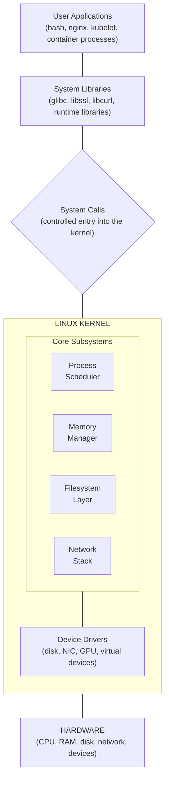
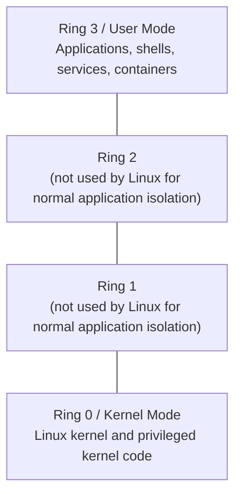
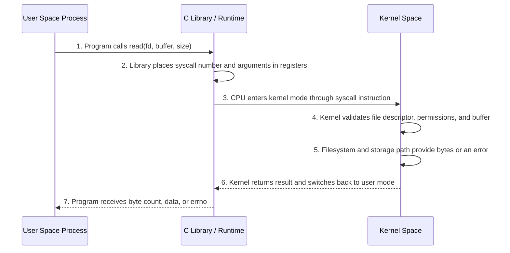
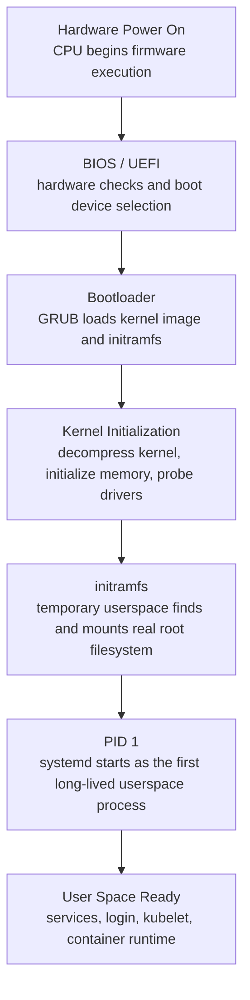
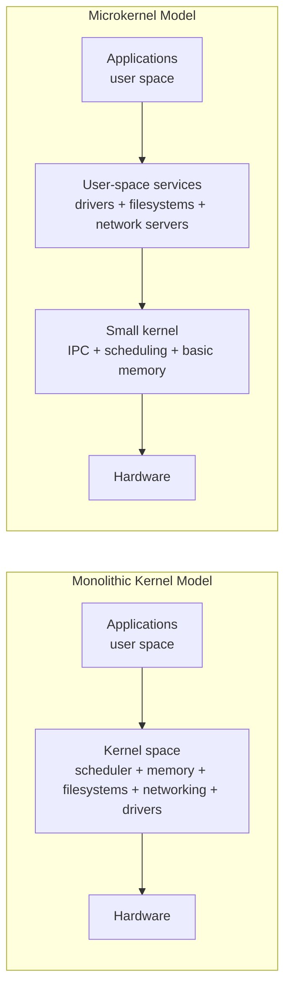
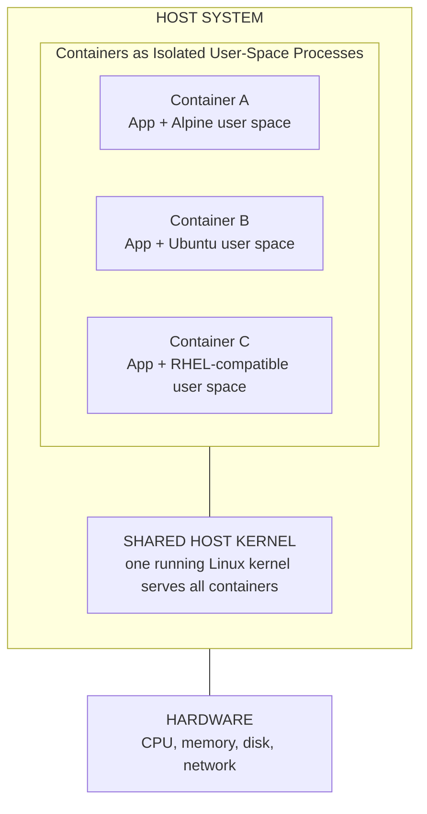
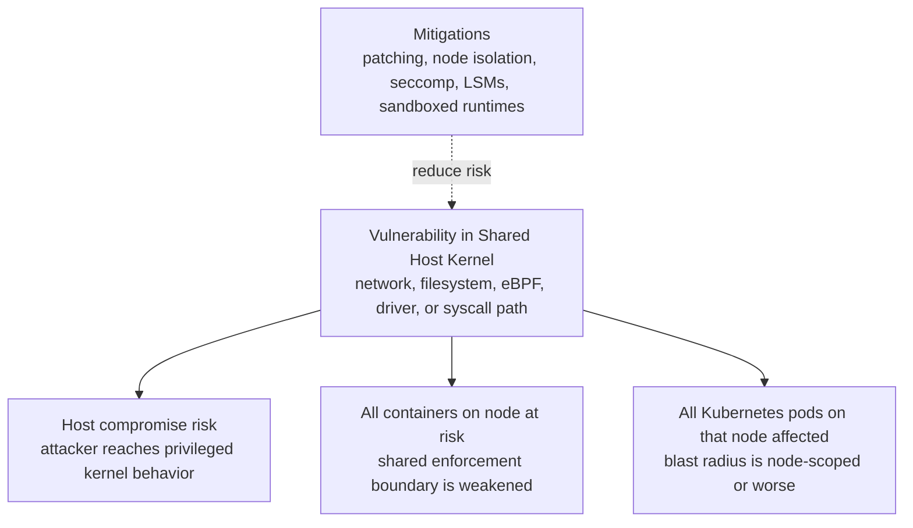

> **Linux Foundations** | Complexity: `[MEDIUM]` | Time: 35-45 min

## Prerequisites

Before starting this module, you should be comfortable opening a terminal and running commands that inspect the local system. You do not need kernel-development experience, and you do not need to compile anything in this module.

You will get the most value if you have access to one Linux environment such as a virtual machine, WSL2, a cloud instance, or a native Linux workstation. Docker or another container runtime is helpful for one optional comparison, but the core learning does not require containers.

You should already understand that an operating system runs programs, stores files, and manages hardware. This module turns that general idea into an operational model you can use when a Kubernetes node, container workload, or Linux host behaves in a surprising way.

## Learning Outcomes

After this module, you will be able to:

- **Analyze** how the Linux kernel mediates between applications, hardware, and protected resources when a program reads files, opens sockets, or allocates memory.
- **Trace** a Linux boot sequence from firmware through bootloader, kernel initialization, `initramfs`, PID 1, and user-space service startup.
- **Compare** monolithic, modular monolithic, and microkernel designs using concrete trade-offs around performance, fault isolation, driver behavior, and operational risk.
- **Diagnose** kernel-adjacent failures by choosing and interpreting tools such as `uname`, `/proc`, `dmesg`, `lsmod`, `modinfo`, `strace`, and `systemd-analyze`.
- **Evaluate** container and Kubernetes node compatibility by reasoning about shared host kernels, kernel modules, cgroups, namespaces, eBPF, and kernel-version-dependent features.

## Why This Module Matters

At 03:10, an SRE is paged because a Kubernetes node has stopped admitting pods after a routine reboot. The kubelet is running, the container runtime starts, and the application team insists nothing changed in their manifests. The useful clues are lower in the stack: a missing kernel module, a different boot parameter, and a networking path that no longer behaves the way kube-proxy expects.

That situation is not rare. Linux problems often present themselves as application problems because every application eventually depends on the kernel. A database that performs thousands of tiny reads becomes a system-call problem. A container image that runs on one node but fails on another becomes a kernel compatibility problem. A node that drops network traffic becomes a packet-filtering or connection-tracking problem.

This module teaches the kernel as an operating contract, not as trivia. You will build a mental model for where user space ends, where kernel space begins, how programs cross that boundary, and why containers are fast but not fully isolated like virtual machines. The goal is not to become a kernel developer; the goal is to recognize when the kernel is part of the incident and know which evidence to collect before guessing.

## 1. The Kernel as the System Contract

The Linux kernel is the privileged program that owns the hardware-facing decisions on a running system. Applications do not get to write directly to disks, program network cards, remap physical memory, or schedule themselves on CPU cores. They ask the kernel to do those things, and the kernel decides whether the request is valid, safe, and possible.

That contract matters because a Linux host is shared by many competing pieces of software. A shell, a web server, a container runtime, a monitoring agent, and the kubelet may all run at the same time. Without a central authority, one faulty process could overwrite another process's memory, monopolize the CPU, or corrupt the filesystem.

The kernel provides that central authority through subsystems. The scheduler decides which runnable task gets CPU time. The memory manager maps virtual memory to physical memory and enforces isolation. Filesystem code turns file operations into block-device operations. The network stack turns sockets into packets. Drivers translate kernel requests into hardware-specific actions.



A useful way to reason about the kernel is to ask, "Who owns the resource?" The application owns its intent, such as "read this file" or "listen on this port." The kernel owns the authority to make that intent real. It checks permissions, coordinates hardware, records accounting data, and returns either a result or an error.

This is why ordinary commands reveal kernel behavior. When `cat /etc/hostname` prints a short string, the interesting part is not the text output; the interesting part is the chain of kernel-mediated work. The process opens a file, the kernel checks permissions, the filesystem finds the inode, the storage path returns bytes, and the kernel copies those bytes back into the process.

```bash
cat /etc/hostname
```

If the command succeeds, the kernel has permitted and completed a file read. If it fails with `Permission denied`, the kernel has refused the request after evaluating permissions. If it hangs because storage is unhealthy, the application may look stuck, but the cause may live below the application in the kernel's I/O path.

> **Active learning prompt**: Before you run diagnostic commands, predict which part of the kernel contract is involved. If an application cannot bind to port 80, is the likely evidence in file permissions, networking permissions, process scheduling, or storage I/O?

The answer is networking permissions and process privilege. Binding to a low-numbered privileged port requires authority the kernel does not grant to ordinary processes by default. A good diagnosis starts by matching the symptom to the kernel subsystem most likely to enforce or fail that request.

| User-Space Request | Kernel Subsystem Involved | Evidence to Collect | Practical Interpretation |
|---|---|---|---|
| Read or write a file | Filesystem and block I/O | `strace`, `mount`, file permissions | The process crosses into the kernel to access storage-backed data. |
| Open a TCP connection | Network stack and routing | `ss`, `ip route`, `strace` | The kernel owns sockets, ports, packet routing, and connection state. |
| Start a new process | Process scheduler and memory manager | `ps`, `strace`, cgroup data | The kernel creates task structures and address spaces for execution. |
| Allocate memory | Virtual memory manager | `/proc/<pid>/maps`, `free`, `vmstat` | The process receives virtual memory mappings, not raw physical RAM. |
| Load a device driver | Module loader and driver subsystem | `lsmod`, `modinfo`, `dmesg` | Kernel capabilities can change when modules are loaded or absent. |
| Enforce a container limit | cgroups and namespaces | `/proc`, `/sys/fs/cgroup`, runtime logs | Container behavior depends on kernel isolation and accounting features. |

The table is not a command reference; it is a diagnostic map. When a symptom appears, you choose tools based on the boundary being crossed. That is the difference between collecting evidence and running random commands until something looks suspicious.

## 2. Kernel Space, User Space, and System Calls

Linux separates execution into user space and kernel space because trust levels are different. User-space programs are expected to be numerous, replaceable, and sometimes buggy. Kernel-space code is trusted with the whole system, so the CPU and operating system enforce a boundary around it.

Kernel space has direct access to privileged CPU instructions, device registers, low-level memory management, and interrupt handling. User space does not. A browser tab, a database process, and a containerized workload all run with restrictions, even when they are important business applications.

| Kernel Space | User Space |
|---|---|
| Runs with high CPU privilege and can execute protected instructions. | Runs with restricted CPU privilege and must request protected operations. |
| Contains the kernel core, many drivers, and in-kernel subsystems. | Contains shells, services, libraries, tools, and containerized processes. |
| A severe fault can panic or destabilize the entire host. | A severe fault usually terminates only the offending process. |
| Owns hardware-facing decisions and global resource arbitration. | Owns application logic, user workflows, and service-specific behavior. |
| Exposes controlled entry points through system calls and interrupts. | Uses libraries and runtime code that eventually invoke system calls. |

The CPU helps enforce this separation. On common x86 systems, Linux uses Ring 0 for the kernel and Ring 3 for user processes. The exact naming differs on other CPU architectures, but the principle is the same: privileged code and ordinary application code do not run with the same authority.



System calls are the controlled bridge across that boundary. When a process calls a library function such as `read()`, `write()`, or `socket()`, the library prepares arguments and executes a CPU instruction that enters the kernel in a defined way. The kernel validates the request, performs the work if allowed, and returns control to the process.



The boundary crossing has cost, but it also has value. It costs CPU cycles because the processor changes privilege mode, the kernel validates data, and control returns to the application. It provides safety because the kernel can prevent invalid memory access, unauthorized file reads, and unsafe hardware operations.

### Worked Example: Use `strace` to See the Boundary

Suppose a developer says, "My command just lists a directory, so it should not involve the kernel much." That assumption is wrong because directory listing is a filesystem operation, and filesystems are kernel-mediated. We can demonstrate the boundary instead of debating it.

Run the command below on a Linux system that has `strace` installed. If `strace` is missing on a Debian or Ubuntu machine, install it with `sudo apt-get update && sudo apt-get install -y strace` in a disposable learning environment.

```bash
strace -c ls /tmp
```

A typical summary includes calls such as `openat`, `newfstatat`, `getdents64`, `mmap`, `close`, and `write`. The exact counts vary by distribution, filesystem, library version, locale, and shell environment, so do not memorize the numbers. Focus on the pattern: even a simple command crosses into the kernel many times.

```bash
strace -e openat,newfstatat,getdents64,write ls /tmp
```

That filtered trace is easier to read because it keeps only a few relevant calls. `openat` opens files relative to a directory file descriptor. `getdents64` reads directory entries. `write` sends output to the terminal. Each call is a request from user space to kernel space.

Now apply the same method to a command that reads one file. The output makes it clear that `cat` does not "own" disk access; it asks the kernel to open and read the file.

```bash
strace -e openat,read,write,close cat /etc/hostname
```

If you are diagnosing latency, this technique helps distinguish application compute from kernel-mediated work. A process burning CPU in pure calculation may make few system calls during the hot loop. A process that constantly reads tiny chunks from storage may spend significant time crossing the user-kernel boundary and waiting on I/O.

> **Active learning prompt**: Predict the difference between `strace -c true` and `strace -c find /usr -maxdepth 1 -type f`. Which one should make more filesystem-related system calls, and why would that matter during performance analysis?

The `find` command should make more filesystem-related calls because it must inspect directory entries and file metadata. That does not make `find` bad; it tells you what work is being requested from the kernel. In production, this same reasoning helps explain why metadata-heavy workloads can stress storage even when they read little file content.

| Diagnostic Goal | Command | What You Are Testing | How to Interpret the Result |
|---|---|---|---|
| Confirm kernel release | `uname -r` | Which running kernel serves all local processes | Match features and known issues to the actual running kernel, not just the distribution name. |
| See syscall categories | `strace -c <command>` | How often a command crosses into the kernel | High syscall counts can explain overhead for tiny repeated operations. |
| Inspect process mappings | `cat /proc/<pid>/maps` | How the kernel maps virtual memory for a process | Use it when debugging libraries, memory layout, or unexpected file-backed mappings. |
| Review boot and driver messages | `dmesg` | What the kernel reported while initializing hardware and modules | Useful for storage, network, driver, and early boot failures. |
| See loaded modules | `lsmod` | Which optional kernel components are active | Missing modules can break networking, storage, container, or security features. |
| Time boot phases | `systemd-analyze` | How long firmware, kernel, and user-space startup took | Separates kernel initialization delays from service startup delays. |

The key habit is to connect each tool to a question. `uname` is not "kernel trivia"; it answers which kernel implements the contract. `strace` is not "debug noise"; it shows boundary crossings. `dmesg` is not "a long log"; it is where the kernel reports hardware and driver events.

## 3. Boot: From Firmware to a Usable System

A Linux system does not begin with `systemd`, SSH, or Kubernetes. It begins with firmware that initializes enough hardware to find a bootloader. The bootloader then loads the kernel and an initial filesystem image so the kernel can finish discovering hardware and mount the real root filesystem.

This sequence matters operationally because different failures happen at different stages. A system stuck in firmware setup has not reached the bootloader. A system at a `grub>` prompt has not loaded the kernel correctly. A system showing `VFS: Unable to mount root fs` has reached the kernel but cannot mount the root filesystem. A system with a login prompt but no kubelet has booted the OS but failed in user-space service startup.



The bootloader is small compared with the kernel, but its role is critical. It knows where the kernel image is, which boot parameters to pass, and which `initramfs` image to load. When kernel updates go wrong, a broken bootloader entry can leave a machine unable to start even though the disk still contains a valid operating system.

The `initramfs` stage is easy to overlook because it is temporary. It contains just enough userspace tooling and drivers to locate the real root filesystem. Encrypted disks, complex storage controllers, logical volumes, and network boot setups often depend on this stage. If the kernel lacks the required driver or the `initramfs` lacks required tooling, the root filesystem may never mount.

Once the real root filesystem is available, the kernel starts PID 1. On most modern Linux distributions, PID 1 is `systemd`. From there, user-space startup begins: mounts are finalized, devices are managed, networking starts, logging begins, and services such as SSH, container runtime components, and kubelet are launched.

You can inspect these stages after a successful boot. These commands do not repair a broken boot, but they teach you where evidence normally lives.

```bash
uname -r
cat /proc/cmdline
dmesg | head -n 30
systemd-analyze
systemd-analyze blame | head -n 15
```

`/proc/cmdline` is especially important because it shows the boot parameters the kernel actually received. Parameters can affect cgroup behavior, console output, security modules, filesystem handling, CPU mitigations, and other low-level behavior. When two nodes have the same package versions but different boot parameters, they may not behave the same.

```bash
cat /proc/cmdline
```

On some systems you might see parameters related to the root filesystem, console, quiet boot output, security modules, or cgroup hierarchy. Do not edit boot parameters casually. Treat them like infrastructure configuration: record the current state, understand the change, test on one node, and keep a rollback path.

> **Active learning prompt**: A server reaches `systemd emergency mode` after a kernel update, but the bootloader menu appears normally and the kernel starts printing messages. Which stage is probably working, and which stage should you inspect next?

The firmware and bootloader stages are probably working because the kernel has started. The next investigation should focus on kernel initialization, `initramfs`, root filesystem mounting, and early user-space dependencies. Evidence is likely in the console messages, `dmesg`, filesystem checks, mount configuration, storage drivers, or boot parameters.

| Startup Symptom | Likely Stage | Useful Evidence | First Diagnostic Question |
|---|---|---|---|
| Machine never shows a boot menu | Firmware or boot device selection | Console, firmware settings, disk presence | Did firmware find a bootable device at all? |
| System drops to `grub>` prompt | Bootloader | GRUB config, kernel image path, boot partition | Can the bootloader find its configuration and kernel image? |
| Kernel panic before mounting root | Kernel or `initramfs` | Console output, `initramfs` contents, driver support | Can the kernel access the storage path for the root filesystem? |
| Emergency mode after root mount | Early userspace | `journalctl -xb`, mount units, `/etc/fstab` | Did user space fail to mount or start a required dependency? |
| Login works but kubelet does not | Normal userspace service startup | `systemctl status kubelet`, logs, runtime status | Did the OS boot, while the Kubernetes service path failed later? |
| Boot is slow but succeeds | Timing across stages | `systemd-analyze`, `dmesg` timestamps | Is the delay in firmware, kernel initialization, or service startup? |

This stage-based approach prevents a common mistake: treating every startup failure as a "Linux is broken" event. A boot problem is more diagnosable when you can name the last stage that worked and the next stage that failed.

## 4. Architecture Choices: Monolithic, Modular, and Microkernel Designs

Operating systems make different choices about where services should run. A monolithic kernel places major operating-system services in kernel space. A microkernel keeps the privileged kernel very small and moves many services, such as drivers and filesystems, into user-space servers. Linux is commonly described as monolithic, but in practice it is a modular monolithic kernel.

In a pure monolithic design, core services can call each other directly inside the same privileged address space. That is fast because it avoids many message-passing and context-switching costs. The downside is blast radius: a severe bug in privileged code can damage the whole system.

In a microkernel design, many services run outside the privileged kernel. That can improve fault isolation because a driver crash may be handled more like a service crash. The downside is that operations involving multiple services may require more messages and more transitions between protection domains. For workloads with heavy I/O or packet processing, that overhead can matter.

Linux chose the performance and implementation advantages of a monolithic design while adding flexibility through loadable kernel modules. A module can add a driver, filesystem, packet-filtering feature, or other capability to the running kernel without requiring every possible feature to be built into the base kernel image. This makes Linux adaptable across laptops, cloud instances, embedded systems, and Kubernetes nodes.



The practical lesson is not that one architecture is always better. The lesson is to evaluate architecture by workload and failure mode. If a device driver crashes often, isolation is valuable. If a system must process packets at very high throughput, avoiding repeated protection-domain crossings may be valuable. If a platform must support many hardware combinations, modularity is valuable.

| Architecture | Where Major OS Services Run | Strength | Cost | Operational Question |
|---|---|---|---|---|
| Monolithic kernel | Mostly kernel space | Fast internal calls and mature integrated subsystems | Large privileged codebase means larger blast radius | Can you manage kernel updates, driver quality, and host isolation well? |
| Microkernel | Minimal kernel plus user-space services | Stronger service isolation and restart boundaries | More IPC and context-switch overhead for some paths | Is fault isolation more important than raw I/O path performance? |
| Modular monolithic kernel | Kernel space with loadable components | Linux-style balance of performance and runtime flexibility | Loaded module bugs still run with kernel privilege | Are required modules present, trusted, and version-compatible? |

Kernel modules are powerful because they change what the kernel can do. They are also risky because they run with kernel privilege once loaded. A faulty module is not like a faulty user-space process. It can corrupt memory, crash the system, or expose privileged attack surface.

You can inspect loaded modules with `lsmod`. The output shows the module name, approximate size, and usage count. Usage count is not a complete safety proof, but it helps explain dependency relationships.

```bash
lsmod | head -n 20
```

You can inspect a module with `modinfo`. This often shows the filename, license, description, author, aliases, dependencies, and supported parameters. Some distributions split module packages from the main kernel package, so `modinfo` can also reveal whether the module exists on disk even if it is not loaded.

```bash
modinfo overlay 2>/dev/null || modinfo ext4
```

Loading and unloading modules usually requires administrative privileges. Use these commands only in a safe lab or on a system you are allowed to administer. Removing an active driver or network module on a production system can interrupt services.

```bash
sudo modprobe br_netfilter
sudo modprobe -r br_netfilter
```

A useful diagnostic pattern is to separate "module absent on disk" from "module present but not loaded." If `modinfo overlay` fails, the module may not be installed for the running kernel. If `modinfo overlay` succeeds but `lsmod` does not show it, the module exists but is not currently active.

```bash
if modinfo overlay >/dev/null 2>&1; then
  echo "overlay module exists for this running kernel"
else
  echo "overlay module metadata not found for this running kernel"
fi

if lsmod | grep -q '^overlay'; then
  echo "overlay module is loaded"
else
  echo "overlay module is not currently loaded"
fi
```

> **Active learning prompt**: A Kubernetes node has the same Linux distribution as the rest of the fleet, but `modinfo overlay` fails only on that node. Would you investigate Kubernetes manifests first, or the installed kernel package and module directory for the running kernel?

Start with the running kernel and module directory. Kubernetes may report the failure, but the missing capability is below Kubernetes. A node can have the correct user-space packages and still lack modules for the kernel it actually booted.

## 5. Kubernetes-Relevant Kernel Capabilities

Kubernetes is often described as a container orchestrator, but the Linux kernel does much of the enforcement. Container runtimes use namespaces for isolation, cgroups for resource accounting and limits, filesystem features for image layers, and networking features for pod and service traffic. Kubernetes schedules pods, but the node kernel makes many of the promises real.

That means node readiness is partly a kernel-readiness problem. If the required filesystem driver is missing, container image layers may not mount. If bridge packet filtering is disabled, pod networking may not behave as expected. If cgroups are configured differently across nodes, resource behavior can diverge even when Kubernetes manifests are identical.

| Kernel Capability | Common Linux Mechanism | Kubernetes or Container Use | Failure Pattern |
|---|---|---|---|
| Filesystem layering | `overlay` / OverlayFS | Container image layers and writable container filesystems | Containers fail to start or fall back to unsupported storage behavior. |
| Network bridge filtering | `br_netfilter` and netfilter hooks | Pod networking, kube-proxy, and some CNI expectations | Pod-to-pod or service traffic behaves inconsistently. |
| Connection tracking | `nf_conntrack` | Service routing, NAT, and stateful packet handling | Connections reset, NAT breaks, or service traffic becomes unreliable. |
| IPVS load balancing | `ip_vs` family modules | kube-proxy IPVS mode | kube-proxy falls back or fails to initialize expected mode. |
| Resource control | cgroups v1 or v2 | Pod CPU, memory, and process accounting | Limits, metrics, or runtime behavior differ across nodes. |
| Process and network isolation | namespaces | Container PID, mount, network, IPC, and user isolation | Containers leak visibility or fail to start with expected isolation. |
| Observability and policy hooks | eBPF support | Cilium, Falco, tracing, and security tooling | Advanced networking or runtime detection features are unavailable. |

The exact module list depends on your distribution, kernel build, container runtime, and CNI plugin. Do not cargo-cult one checklist into every environment. Instead, learn to connect the symptom to the feature. Overlay problems point toward filesystem support. Service-routing problems point toward netfilter, IPVS, connection tracking, routing, or CNI configuration.

The following command checks a small set of modules that commonly matter on Kubernetes nodes. It is intentionally a starting point, not a universal certification test.

```bash
for mod in overlay br_netfilter ip_vs nf_conntrack; do
  if lsmod | grep -q "^${mod}"; then
    echo "${mod}: loaded"
  else
    echo "${mod}: not loaded"
  fi
done
```

Some kernel features are built directly into the kernel instead of loaded as modules. In that case, `lsmod` will not show a module even though the feature exists. That is why a robust diagnosis combines module checks with runtime behavior, kernel configuration where available, and component logs.

You can inspect cgroup layout with mount information. On modern distributions, cgroups v2 is common, and many Kubernetes environments now expect it. Mixed cgroup modes across nodes can cause confusing differences in metrics, limits, and runtime behavior.

```bash
mount | grep cgroup
stat -fc %T /sys/fs/cgroup
```

If the filesystem type reports `cgroup2fs`, the system is using the unified cgroups v2 hierarchy at that mount point. If you see multiple `cgroup` mounts for separate controllers, you are likely looking at cgroups v1 or a hybrid arrangement. The Kubernetes version target for this curriculum is 1.35+, so you should expect modern clusters to be designed around current runtime and cgroup behavior.

Kernel logs can show module loading, driver errors, network warnings, and boot-time configuration. On many systems, unprivileged users can read some logs, but hardened systems may restrict `dmesg`. If access is denied, use an administrative account or `journalctl -k` where policy permits.

```bash
dmesg | grep -Ei 'overlay|br_netfilter|conntrack|ip_vs|cgroup' | tail -n 30
journalctl -k --no-pager | grep -Ei 'overlay|br_netfilter|conntrack|ip_vs|cgroup' | tail -n 30
```

### Worked Diagnosis: kube-proxy Cannot Use IPVS

Imagine kube-proxy logs say it cannot initialize IPVS mode on one node. A weak response is to restart kube-proxy repeatedly. A stronger response is to test whether the kernel can provide the IPVS capability that kube-proxy requested.

First, check whether IPVS-related modules are loaded. The exact module names vary with protocol and scheduler support, but `ip_vs` is the core signal.

```bash
lsmod | grep '^ip_vs'
```

If nothing appears, check whether the module exists for the running kernel. This distinguishes "not loaded yet" from "not installed or unavailable for this kernel."

```bash
modinfo ip_vs
```

If `modinfo` succeeds, load the module in a controlled maintenance context and watch for kernel messages. If `modinfo` fails, inspect the kernel package and module directory for the running kernel instead of changing Kubernetes resources.

```bash
sudo modprobe ip_vs
dmesg | tail -n 20
```

Finally, re-check kube-proxy logs and confirm the selected mode. The key is that the Kubernetes symptom is verified through kernel evidence. You are not guessing that IPVS is missing; you are proving whether the running kernel can supply it.

> **Active learning prompt**: If a node's kube-proxy falls back from IPVS to iptables mode, what could still be healthy about the node, and what would you verify before declaring the node broken?

The node may still run pods and pass basic readiness checks because iptables mode is a valid kube-proxy mode in many environments. You would verify the intended cluster configuration, kube-proxy logs, kernel module availability, service-routing behavior, and whether the fallback violates the platform's performance or consistency requirements.

## 6. Containers Share the Host Kernel

A container image contains user-space files: application binaries, libraries, package metadata, shells, and configuration. It does not carry its own Linux kernel in the way a virtual machine carries its own guest operating-system kernel. When a process inside a Linux container makes a system call, it enters the host kernel.

That is the central reason containers are lightweight. There is no separate guest kernel booting for each container. The same host kernel schedules container processes, enforces cgroups, applies namespaces, handles sockets, and provides filesystem operations. Container isolation is real, but it is isolation implemented by one shared kernel.



You can observe this directly if Docker or a compatible runtime is available. The kernel release printed inside different Linux containers should match the host because `uname` asks the running kernel for its release. The container image changes user-space tools, not the kernel underneath.

```bash
echo "Host kernel: $(uname -r)"

docker run --rm alpine uname -r
docker run --rm ubuntu uname -r
```

If Docker is unavailable, the concept still applies to Linux containers in general. The important point is that the system call path goes from the containerized process into the host kernel. A container can have an old user-space distribution and still run on a new host kernel, or it can have a new user-space distribution and fail because the host kernel lacks a needed feature.

| Runtime Model | Kernel Ownership | Isolation Boundary | Practical Consequence |
|---|---|---|---|
| Bare process | Host kernel | Normal process boundaries | Fastest and simplest, with no container packaging boundary. |
| Linux container | Shared host kernel | Namespaces, cgroups, capabilities, seccomp, LSMs | Lightweight, but kernel bugs and missing kernel features affect containers. |
| Virtual machine | Guest kernel plus host hypervisor | Hardware virtualization boundary | Stronger kernel separation, with more overhead and operational complexity. |
| Sandboxed container runtime | Extra mediation or lightweight VM depending on technology | Runtime-specific isolation layer | Useful for untrusted workloads, with compatibility and performance trade-offs. |

This shared-kernel model has security implications. If a container escape exploits a kernel vulnerability, the attacker is not just escaping one application directory. They are attacking the component that enforces isolation for the whole host. That is why kernel patching, workload isolation, node pools, seccomp, AppArmor or SELinux, and runtime hardening all matter.



Compatibility is the other major implication. A container image may include binaries that expect a newer syscall, a filesystem behavior, or a cgroup interface that the host kernel does not support. In that case, changing the image alone may not solve the problem. The host kernel is the component that implements the missing behavior.

| Feature Area | Why Kernel Version Matters | Example Operational Decision |
|---|---|---|
| Namespaces | Container isolation depends on namespace support and maturity. | Validate rootless or user-namespace features before promising tenant isolation. |
| cgroups | Resource enforcement differs between cgroups v1 and v2. | Standardize node pools so runtime and kubelet expectations match. |
| eBPF | Advanced networking and security tools depend on kernel verifier and helper support. | Check Cilium or Falco requirements against the actual node kernel. |
| Filesystems | Container image layers and volumes depend on kernel filesystem behavior. | Confirm OverlayFS and storage-driver support before adding nodes. |
| Network filtering | Service routing and policy depend on netfilter, nftables, IPVS, or eBPF paths. | Align kube-proxy, CNI, and kernel capability choices across the cluster. |
| Security controls | seccomp, AppArmor, SELinux, and capabilities rely on kernel enforcement. | Treat disabled security features as platform risk, not merely runtime configuration. |

A senior-level habit is to evaluate the node as the product of distribution, kernel release, boot parameters, loaded modules, runtime configuration, and Kubernetes settings. The distribution name alone is too vague. "Ubuntu" or "RHEL-compatible" does not tell you which kernel is running, which modules are available, or how cgroups are mounted.

Use this compact inspection sequence when you need a first-pass node profile. It does not replace deeper debugging, but it quickly answers whether the node looks like its peers.

```bash
echo "Kernel release: $(uname -r)"
echo "Kernel command line:"
cat /proc/cmdline

echo
echo "Cgroup filesystem type:"
stat -fc %T /sys/fs/cgroup

echo
echo "Selected modules:"
for mod in overlay br_netfilter ip_vs nf_conntrack; do
  lsmod | grep -q "^${mod}" && echo "${mod}: loaded" || echo "${mod}: not loaded"
done

echo
echo "Recent kernel messages mentioning container-adjacent features:"
dmesg 2>/dev/null | grep -Ei 'overlay|cgroup|conntrack|br_netfilter|ip_vs' | tail -n 20
```

> **Active learning prompt**: A vendor says their container requires Linux kernel 6.8 or newer because it uses a newer kernel feature. Your cluster has mixed node pools. What would you check before deploying the workload widely?

Check the actual running kernel on every eligible node pool, not only the operating-system image name. Then verify boot parameters, required modules, cgroup mode, runtime configuration, and any feature-specific vendor requirements. If only some nodes qualify, constrain scheduling through labels, taints, tolerations, runtime classes, or separate node pools rather than relying on chance.

## Did You Know?

- **Linux is modular without being a microkernel.** Loadable kernel modules let Linux add drivers and features at runtime, but loaded module code still runs with kernel privilege and can affect the whole host.

- **A container's `uname -r` reports the host kernel.** The user-space distribution inside the image may look like Alpine, Ubuntu, or another distribution, but system calls still reach the node's running kernel.

- **PID 1 is special because the kernel starts it directly.** If PID 1 exits unexpectedly, the system cannot behave like an ordinary service failure because the first user-space process anchors the rest of startup.

- **`/proc` is not a normal directory of stored files.** It is a kernel-provided view into live system and process state, which is why values under `/proc` can change while the system runs.

## Common Mistakes

| Mistake | Problem | Better Practice |
|---|---|---|
| Treating the distribution name as the kernel version | Two nodes can run the same distribution release while booting different kernel releases or parameters. | Check `uname -r`, `/proc/cmdline`, module availability, and cgroup mode on the running node. |
| Assuming containers provide their own kernels | A container image cannot downgrade or replace the host kernel for its processes. | Validate host kernel compatibility before deploying images that need specific syscalls or kernel features. |
| Restarting Kubernetes components before checking kernel evidence | kubelet or kube-proxy may report symptoms caused by missing modules, boot parameters, or cgroup differences. | Use `lsmod`, `modinfo`, `dmesg`, and runtime logs to confirm the underlying capability. |
| Loading or removing modules casually on production nodes | Kernel modules run with high privilege, and unloading active modules can disrupt storage, networking, or security. | Test module changes in a lab, document dependencies, and roll changes through controlled node maintenance. |
| Reading `dmesg` as random noise | Kernel logs contain driver, boot, security, and hardware evidence that may explain node-level failures. | Filter logs by subsystem and correlate messages with the time of the failure or reboot. |
| Ignoring the user-kernel boundary in performance work | Many tiny reads, writes, stats, or network calls can spend time crossing into the kernel repeatedly. | Use `strace -c`, profiling tools, and application batching changes to reduce unnecessary boundary crossings. |
| Weakening isolation assumptions because containers feel lightweight | Containers are isolated by shared-kernel features, so a kernel vulnerability can affect all workloads on a node. | Combine patching, least privilege, seccomp, Linux security modules, node isolation, and sandboxed runtimes where risk demands it. |

## Quiz

### Question 1

**Scenario**: A developer moves a legacy service from a CentOS-based virtual machine into a CentOS-based container image. The service checks `uname -r`, sees the host's modern kernel instead of the old release it expected, and refuses to start. How would you diagnose the mismatch, and what design decision should the team make next?

<details>
<summary>Show Answer</summary>

The container is using the host kernel because Linux containers package user space, not a separate guest kernel. Verify this by comparing `uname -r` on the host and inside the container, then explain that the container image cannot provide the old kernel ABI by itself. The team should either update the application to support the host kernel, run it on a compatible node pool if that is safe, or keep it in a virtual machine if it truly requires its own older guest kernel.

</details>

### Question 2

**Scenario**: After a node image update, kube-proxy logs that it cannot initialize IPVS mode and falls back to another mode. Pods still start, so one engineer argues the alert can be ignored. What evidence would you collect before deciding whether this is acceptable?

<details>
<summary>Show Answer</summary>

Check the intended kube-proxy configuration, then inspect whether IPVS kernel support exists and is loaded with `lsmod | grep '^ip_vs'` and `modinfo ip_vs`. Review kube-proxy logs and kernel messages for module or permission failures. If the platform standard requires IPVS for performance or consistency, the fallback is a configuration drift even if pods start. If the cluster intentionally supports another mode, the event may be lower severity, but the node should still match the documented design.

</details>

### Question 3

**Scenario**: A database workload shows high CPU time in system mode, while application metrics show thousands of tiny file reads per second. The team wants to add more CPU cores immediately. How would you analyze whether the kernel boundary is part of the problem?

<details>
<summary>Show Answer</summary>

Use tools such as `strace -c` on a representative process or a safe reproduction to count filesystem-related system calls such as `read`, `pread64`, `openat`, and metadata calls. High system time with many small reads suggests the workload repeatedly crosses into the kernel and waits on I/O path work. Adding CPU might help only partially. A better fix may include batching reads, improving caching, changing access patterns, or tuning storage behavior after confirming the evidence.

</details>

### Question 4

**Scenario**: A bare-metal server reboots after a kernel update and stops at a `grub>` prompt. Another engineer starts investigating kubelet configuration because the node disappeared from the cluster. Which boot stage failed, and why is kubelet investigation premature?

<details>
<summary>Show Answer</summary>

The failure is at the bootloader stage. Firmware found a boot path and reached GRUB, but GRUB could not proceed to load the configured kernel image, `initramfs`, or configuration. Kubelet has not started because the kernel and user-space service startup have not completed. The correct investigation starts with bootloader configuration, boot partition contents, kernel image paths, and `initramfs` availability.

</details>

### Question 5

**Scenario**: A security team proposes delaying a host kernel patch because all workloads run as non-root containers with restricted Linux capabilities. The vulnerability is in the host kernel networking stack. How would you evaluate that risk?

<details>
<summary>Show Answer</summary>

The assessment is unsafe because the networking stack is part of the shared host kernel that enforces isolation for every container on the node. Non-root containers and restricted capabilities reduce risk, but they do not remove the vulnerable kernel path. Evaluate exploitability, exposure, available mitigations, and maintenance windows, but treat kernel patching as node-level security work rather than an optional application-container update.

</details>

### Question 6

**Scenario**: A node boots successfully and accepts SSH, but containers fail to start with storage-driver errors after a custom minimal kernel package was installed. What kernel evidence would you collect, and what outcome would confirm your hypothesis?

<details>
<summary>Show Answer</summary>

Check the running kernel with `uname -r`, inspect whether OverlayFS support exists with `modinfo overlay`, and check whether it is loaded with `lsmod | grep '^overlay'`. Review `dmesg` or `journalctl -k` for filesystem and module messages. If `modinfo overlay` fails for the running kernel or kernel logs show OverlayFS support missing, the failure is likely a kernel capability problem rather than a container image problem.

</details>

### Question 7

**Scenario**: A platform team wants to deploy an eBPF-based networking and security tool across a cluster with mixed kernel versions. The vendor documentation says advanced features require newer kernel helpers. What rollout plan would demonstrate senior-level judgment?

<details>
<summary>Show Answer</summary>

First inventory actual running kernels, boot parameters, cgroup mode, and required kernel configuration across node pools. Then map vendor feature requirements to the node inventory and create labels or separate pools for compatible nodes. Roll out to a small compatible pool, verify tool health and workload networking, and prevent scheduling on incompatible nodes until they are upgraded or explicitly excluded. The key is to treat kernel capability as a scheduling and platform-design constraint.

</details>

## Hands-On Exercise

### Objective

Build a kernel evidence report for a Linux host and use it to reason about containers, boot, system calls, modules, and Kubernetes-relevant capabilities. The exercise is designed to be safe on a lab machine; do not load or remove modules on production systems unless you have explicit operational approval.

### Part 1: Identify the Running Kernel and Boot Parameters

Start by recording the kernel that is actually running. This is the kernel serving local processes and any containers on the host, regardless of which kernel packages may also be installed on disk.

```bash
uname -r
uname -a
cat /proc/version
cat /proc/cmdline
```

Write down the kernel release, the distribution suffix if present, and any boot parameters that look related to cgroups, security modules, console output, root filesystem, or CPU mitigations. If you do not understand a parameter yet, mark it as "needs investigation" rather than guessing.

### Part 2: Inspect Kernel Logs from Boot

Review early kernel messages and then search for messages related to memory, storage, networking, cgroups, and container-adjacent features. Some systems restrict `dmesg`; use `journalctl -k` if that is how your environment exposes kernel logs.

```bash
dmesg | head -n 40
dmesg | grep -Ei 'memory|storage|network|cgroup|overlay|conntrack|br_netfilter|ip_vs' | tail -n 40
journalctl -k --no-pager | grep -Ei 'memory|storage|network|cgroup|overlay|conntrack|br_netfilter|ip_vs' | tail -n 40
```

Answer these questions in your notes: What hardware or virtual hardware did the kernel detect early? Did the kernel report anything about cgroups or container-related modules? Are there warnings that would matter if this host were a Kubernetes node?

### Part 3: Map Loaded and Available Modules

List loaded modules and inspect at least one module that exists on your system. Then test whether common container or Kubernetes-related modules are loaded or merely available.

```bash
lsmod | head -n 30
lsmod | wc -l

for mod in overlay br_netfilter ip_vs nf_conntrack; do
  echo "== ${mod} =="
  if lsmod | grep -q "^${mod}"; then
    echo "loaded"
  else
    echo "not loaded"
  fi

  if modinfo "${mod}" >/dev/null 2>&1; then
    echo "available on disk for this kernel"
  else
    echo "module metadata not found for this kernel"
  fi
done
```

Interpret the results carefully. A module that is not loaded may still be available. A feature may also be built into the kernel and therefore not appear as a loaded module. Your report should distinguish what you proved from what remains uncertain.

### Part 4: Trace System Calls for Simple Commands

Use `strace` to compare a tiny command with a filesystem-oriented command. If `strace` is not installed, install it only on a disposable lab system or skip this part and record why.

```bash
strace -c true
strace -c ls /tmp
strace -e openat,read,write,close cat /etc/hostname
```

Answer these questions: Which command crossed the user-kernel boundary more often? Which calls were related to file or directory access? How would this evidence change your thinking about an application that performs many tiny filesystem operations?

### Part 5: Check cgroup Mode

Inspect how cgroups are mounted. This matters because Kubernetes, container runtimes, and observability tools depend on cgroup behavior for resource limits and accounting.

```bash
mount | grep cgroup
stat -fc %T /sys/fs/cgroup
```

Record whether the host appears to use cgroups v2, cgroups v1, or a hybrid arrangement. If you are preparing Kubernetes nodes, explain why mixed cgroup behavior across node pools could cause operational surprises.

### Part 6: Demonstrate Shared Kernel Behavior with Containers

If Docker or another compatible container runtime is available, compare the host kernel with the kernel reported from multiple container images. Skip this part if you do not have a container runtime, but keep the reasoning in your notes.

```bash
echo "Host kernel: $(uname -r)"
docker run --rm alpine uname -r
docker run --rm ubuntu uname -r
```

Explain what stayed the same and what changed. The kernel release should stay the same because containers use the host kernel. The user-space files and tools differ because the images provide their own filesystem contents.

### Part 7: Build a Node Readiness Judgment

Use the evidence you collected to write a short judgment as if this host were being considered for a Kubernetes node pool. Your judgment should be specific enough that another engineer could challenge it with evidence.

Include these points in your judgment: the running kernel release, relevant boot parameters, cgroup mode, module observations, notable kernel log warnings, and any risk that would require follow-up before running production workloads.

### Success Criteria

- [ ] Identified the running kernel release and recorded boot parameters from `/proc/cmdline`.
- [ ] Collected kernel log evidence from `dmesg` or `journalctl -k` and connected at least one message to a subsystem.
- [ ] Listed loaded modules and distinguished loaded modules from modules available on disk.
- [ ] Used `strace` to compare user-kernel boundary crossings for at least two commands, or documented why `strace` was unavailable.
- [ ] Determined whether the system appears to use cgroups v1, cgroups v2, or a hybrid layout.
- [ ] If a container runtime was available, demonstrated that containers report the host kernel release.
- [ ] Wrote a short Kubernetes node readiness judgment grounded in kernel evidence rather than distribution name alone.
- [ ] Identified one follow-up action you would take before trusting this host for production workloads.

## Next Module

Continue to [Module 1.2: Processes & systemd](./module-1.2-processes-systemd/), where you will connect the kernel's process model to services, PID 1, supervision, and the way containers behave as isolated Linux processes.
