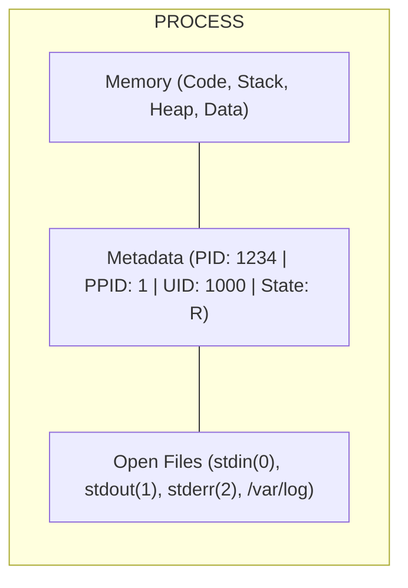
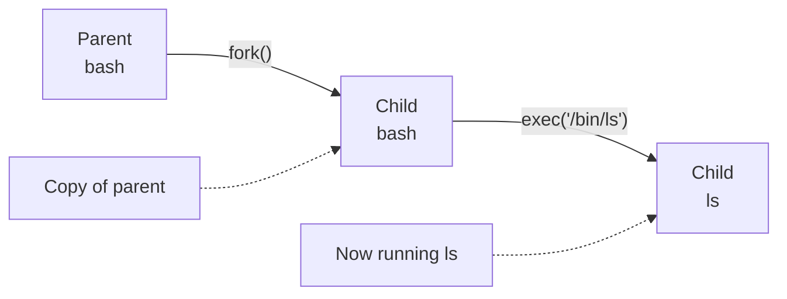
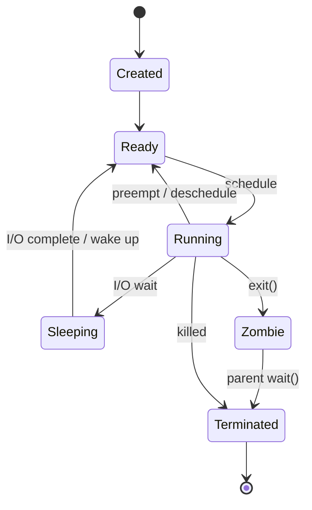
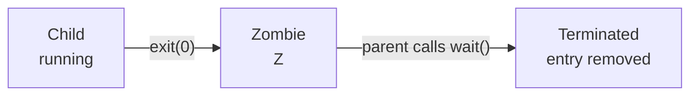
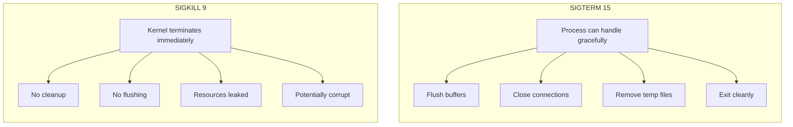
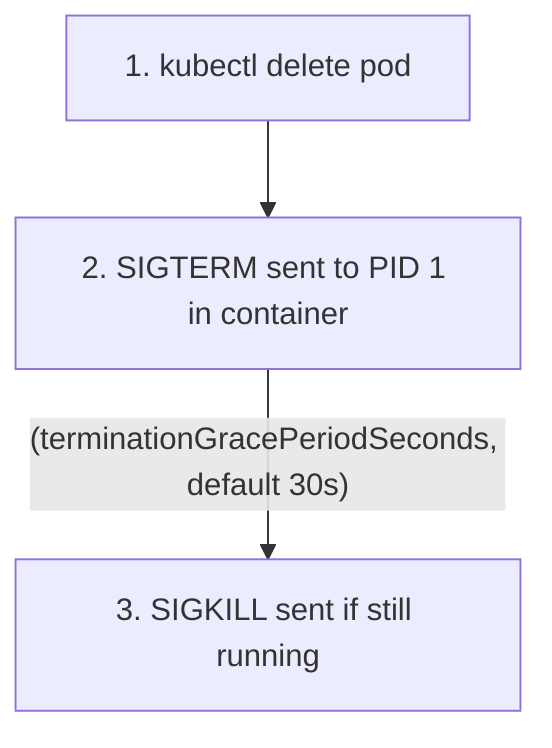
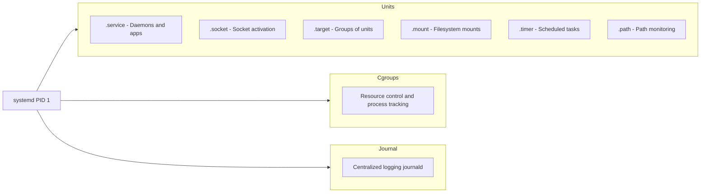
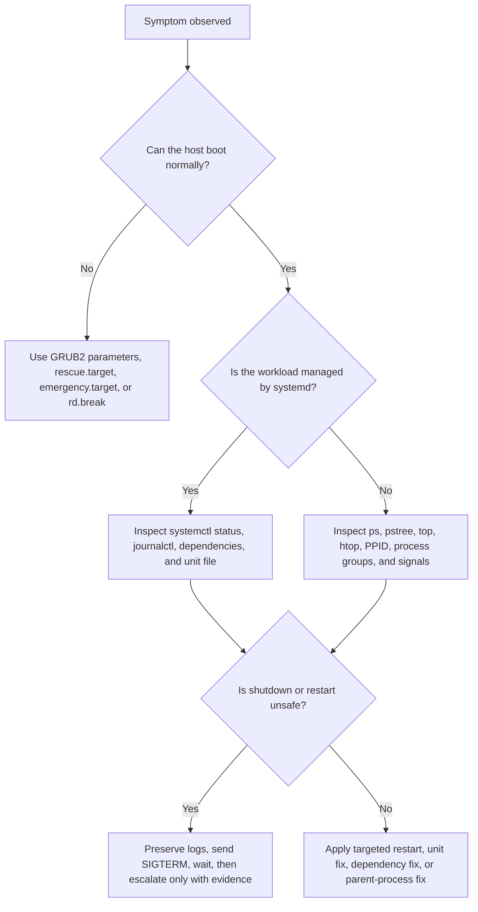

# Module 1.2: Processes & systemd

> **Linux Foundations** | Complexity: `[MEDIUM]` | Time: 30-35 min with a hands-on process, signal, boot, and systemd service lab.

## Prerequisites

Before starting this module, make sure you can describe the kernel's role from the previous architecture lesson and open a Linux shell where process tools are available.
- **Required**: [Module 1.1: Kernel & Architecture](../module-1.1-kernel-architecture/)
- **Helpful**: Have a Linux system available (VM, WSL, or native)

## Learning Outcomes

After this module, you will be able to apply process-management concepts to realistic service failures, container shutdown behavior, and boot-time recovery decisions.
- **Diagnose** process state, parent-child relationships, and resource symptoms using `ps`, `top`, `htop`, `pstree`, and `/proc`-backed clues.
- **Implement** signal-aware process management for shell jobs, long-running services, and Kubernetes 1.35+ containers after setting `alias k=kubectl`.
- **Design** systemd unit files with appropriate dependencies, service types, restart behavior, least-privilege execution, and log inspection paths.
- **Evaluate** boot and rescue workflows that involve GRUB2, kernel parameters, rescue targets, emergency targets, and systemd's role as PID 1.

## Why This Module Matters

In 2021, a payments company lost a full evening of card settlement traffic because a small Java worker ignored termination signals during a routine rollout. The orchestrator sent a graceful stop, waited for the configured grace period, and then killed the process while it still held work in memory. The incident review did not find an exotic kernel bug or a failed cloud region; it found a team that could deploy containers but could not explain what happened to PID 1, child processes, or signal delivery when the platform asked the application to stop.

That pattern shows up outside containers too. A boot-time database migration can block the whole host if its unit dependencies are wrong, a zombie leak can exhaust the process table while CPU and memory dashboards look calm, and a service can restart forever because systemd is faithfully applying a policy that nobody read closely. Linux gives you excellent inspection tools, but those tools only help when you know which layer is responsible for process creation, scheduling, signal handling, service supervision, and boot recovery.

This module teaches those layers as one operational system rather than as disconnected commands. You will start with the kernel's view of a process, follow the fork-exec-wait lifecycle, practice reading process state, connect signals to Kubernetes pod termination, and then move into systemd as the service manager that turns individual processes into reliable boot-time services. The goal is not to memorize flags; the goal is to diagnose why a process exists, why it is stuck, who owns it, what will happen when you signal it, and how to make the host bring it back safely after a reboot.

For Kubernetes work, keep one convention in mind early: define `alias k=kubectl` in your shell if you use the shorter command form. KubeDojo examples use `k` after that point because Kubernetes 1.35+ operations often happen under time pressure, and the alias matches common exam and production habits while still referring to the standard `kubectl` client.

## What Is a Process?

A process is a running instance of a program, but that definition is only useful if you notice the word running. The program is the file on disk, such as `/usr/bin/nginx`; the process is what the kernel creates when that file's instructions, memory mappings, open file descriptors, credentials, scheduling state, and parent relationship come together at runtime. Two processes can execute the same program and still behave differently because they have different PIDs, environments, working directories, limits, and open connections.

The kernel tracks a process as a managed object with code, memory, resources, and metadata. When an engineer says "the app is down," the next useful question is usually more specific: is the process absent, sleeping, blocked in I/O, stopped by a signal, restarting under systemd, or alive but serving no traffic? Those states are different failure modes, and treating all of them as "restart it" hides the evidence you need for a durable fix.



The diagram is deliberately compact because the operational lesson is compact: a process is not just a command name. Its file descriptors may point at terminals, sockets, pipes, deleted files, or log files; its metadata decides whether it can send signals, bind ports, and survive logout; and its memory contains both your application state and the libraries mapped into the process. When a process leaks file descriptors or holds a deleted log file open, the command name alone will not explain the symptom.

The same process model also explains why container debugging can feel familiar once you look past the packaging. A container runtime gives a process different namespaces, cgroups, mounts, and network views, but the kernel still schedules processes and records states. If a workload is blocked in disk sleep, leaking children, or ignoring termination, the container label changes where you inspect ownership, not the fundamental lifecycle. This is why strong Linux process skills transfer directly into Kubernetes troubleshooting.

### Process vs Program

| Program | Process |
|---------|---------|
| File on disk | Running in memory |
| Passive | Active |
| One copy | Many instances possible |
| `/usr/bin/nginx` | PIDs 1234, 1235, 1236 |

Think of a program as a recipe and a process as a cook actively using a kitchen. The same recipe can be used by multiple cooks, but each cook has separate ingredients, tools, timing, and mistakes. That analogy matters when you inspect a production host because killing one `nginx` worker does not remove `/usr/bin/nginx`, changing a unit file does not affect a running process until systemd reloads its view, and editing a script on disk does not rewrite the memory of a process that already executed it.

Every process has a PID and almost every process has a parent PID. The parent-child relationship is not decoration; it controls job management, exit status collection, orphan adoption, and often the logging path that explains how the process was launched. If you can read that family tree, you can tell whether a command came from an interactive shell, a systemd service, a cron-like scheduler, a container runtime shim, or a debugging session that someone forgot to clean up.

### PIDs and PPIDs

Every process exposes identity and ownership metadata, and these two fields are the minimum clues you need before deciding who started it or who should stop it.
- **PID** (Process ID) - Unique identifier
- **PPID** (Parent PID) - Who created this process

```bash
# See your current shell's PID
echo $$
# Output: 1234

# See parent PID
echo $PPID
# Output: 1000

# Detailed view
ps -p $$ -o pid,ppid,cmd
```

The `$$` and `$PPID` variables are a useful first lab because they make the shell's own process identity visible. From there, `ps -p $$ -o pid,ppid,cmd` ties the shell variable back to kernel-backed process metadata. That tiny chain is the same chain you use on a host when you ask whether a worker process belongs to a service, whether it was started manually, or whether a process survived after the terminal that launched it disappeared.

### The Process Tree

All processes form a tree rooted at PID 1, and that tree turns a flat process list into a launch history you can reason about during incidents.

```bash
# View process tree
pstree -p

# Output example:
systemd(1)─┬─sshd(800)───sshd(1200)───bash(1234)───pstree(5678)
           ├─containerd(500)─┬─containerd-shim(600)───nginx(601)
           │                 └─containerd-shim(700)───python(701)
           └─kubelet(400)
```

Read a process tree from left to right as a story of responsibility. In the example, `bash` did not come directly from systemd; it came from `sshd`, which means an interactive login created it. The `nginx` process under `containerd-shim` did not come from a host-level `nginx.service`; it came from the container runtime, which changes how you inspect logs, signals, cgroups, and restart policy. The same binary name can mean different operational ownership depending on where it sits in the tree.

Pause and predict: you run `pstree` and notice your application is a child of `containerd-shim` rather than `systemd`. What does that tell you about the control plane that will restart it, where you should look for container logs, and why `systemctl restart` may not touch it?

### Special PIDs

| PID | Name | Purpose |
|-----|------|---------|
| 0 | Swapper/Idle | Kernel scheduler |
| 1 | Init/systemd | Parent of all user processes |
| 2 | kthreadd | Parent of kernel threads |

PID 1 deserves special attention because it is the first user-space process and the ancestor that adopts orphaned user processes. On most modern distributions PID 1 is systemd, so systemd is both the boot-time service manager and the final parent that reaps abandoned children. Inside a container, however, the application may become PID 1 inside its PID namespace, which is why signal handling and child reaping suddenly become application concerns rather than something a full host init system handles for you.

The container case is a common source of surprise for developers who test locally with a shell and deploy with a minimal image. A shell often forwards signals and waits on children in ways the application never implemented. A container entrypoint that runs the application directly as PID 1 must handle `SIGTERM`, reap children, and exit with meaningful status, or the platform will eventually use force instead of cooperation.

## Process Lifecycle: fork, exec, wait, and exit

Linux process creation is usually described as `fork()` followed by `exec()`, and that sequence explains a surprising amount of day-to-day behavior. `fork()` creates a new process that initially looks like the parent, while `exec()` replaces that child's program image with a new executable. A shell launching `ls` does not turn itself into `ls`; it creates a child, lets the child become `ls`, and then waits for the child to finish so it can show another prompt.

This split gives Unix-like systems enormous flexibility. The parent can change the child's environment, working directory, file descriptors, user identity, or process group between fork and exec, which is how redirection, pipelines, privilege dropping, and daemon startup patterns work. The cost is that process launch is not a single magic event; failures can happen before exec, during exec, or after the new program starts, and each point leaves different evidence.

### Birth: fork() and exec()

New processes are created in two related steps, and separating those steps helps you locate whether a launch failure happened before the target program started or after it began running.



1. **fork()** - Creates a copy of the parent process
2. **exec()** - Replaces the process image with a new program

```bash
# You can see this in action
strace -f -e fork,execve bash -c 'ls' 2>&1 | grep -E 'fork|exec'
```

The `strace` command makes the boundary visible without requiring you to write C code. If fork succeeds but exec fails, you usually have a path, permission, interpreter, mount, or architecture problem. In containers, a missing interpreter on the shebang line can look like "file not found" even when the script file is present, because the kernel is really telling you that the interpreter named by the script could not be executed.

After a child exits, the parent must call a wait-family system call to collect the exit status. Until that happens, the child becomes a zombie: dead as an executing program, but still present as a small process table entry so the parent can learn how it ended. A few short-lived zombies are normal on a busy system; a growing pile of zombies means a parent process is not doing its job.

This parent responsibility is why supervisors matter. systemd, shells, runtimes, and application master processes all need to notice children that exit and decide whether that exit was expected. A web server master may intentionally replace workers; a job runner may mark a task failed; a shell may return an exit code to the terminal; and PID 1 may adopt abandoned children. The same exit event can be normal or critical depending on the parent that interprets it.

### Process States

Processes cycle through observable states, and each state narrows the next useful command instead of leaving you to guess from a process name alone.



The state diagram is a map for choosing the next diagnostic step. A running process may be consuming CPU, a sleeping process may simply be waiting for a socket or timer, and a process in uninterruptible disk sleep is usually waiting inside the kernel for I/O that may not return. You do not debug those states with the same command sequence, and you definitely do not assume `kill -9` is a universal escape hatch.

### State Codes in ps/top

| State | Meaning | Description |
|-------|---------|-------------|
| R | Running | Currently executing or ready to run |
| S | Sleeping | Waiting for an event (interruptible) |
| D | Disk sleep | Waiting for I/O (uninterruptible) |
| Z | Zombie | Terminated but not reaped by parent |
| T | Stopped | Stopped by signal (Ctrl+Z) |
| t | Tracing | Being debugged |

```bash
# See process states
ps aux | awk '{print $8}' | sort | uniq -c | sort -rn
```

State letters are not an exam trick; they are a triage shortcut. If a host has many `R` processes and high load, you may have CPU contention or runaway work. If it has many `D` processes, storage, NFS, block devices, or kernel drivers become more likely suspects. If it has many `Z` processes, the parent process needs inspection because the dead children themselves cannot be fixed by killing them again.

### Death: exit() and wait()



The exit code is the child's last message to the parent, and systemd, shells, CI runners, and Kubernetes all build policy on top of that small integer. A service configured with `Restart=on-failure` cares whether the main process exits cleanly or with an error. A shell script with `set -e` may stop on a nonzero child exit. A container runtime reports the application exit status back to the orchestrator, which may turn it into a CrashLoopBackOff or a completed job depending on workload type.

Before running the next command in a real incident, ask yourself which lifecycle boundary you are testing. Are you proving that the process was created, that the target executable was found, that the new program stayed alive, that the parent waited, or that the supervisor interpreted the exit correctly? That question keeps you from collecting random command output and helps you build a timeline from evidence.

## Signals, Job Control, and Container Shutdown

Signals are software interrupts used for inter-process communication. They are intentionally small messages, not rich APIs: a signal usually says "stop," "continue," "reload," "interrupt," or "a child changed state." The receiving process may handle many signals, ignore some, or be unable to catch a few special ones, which is why the same `kill` command can cause graceful cleanup in one application and abrupt data loss in another.

Shell job control is built on the same model. When you press Ctrl+C, the terminal sends `SIGINT` to the foreground process group; when you press Ctrl+Z, it sends `SIGTSTP` to stop that group; when you use `bg` or `fg`, the shell manipulates stopped jobs and process groups. `nohup` changes hangup behavior so a process can survive terminal logout, but it does not magically turn the process into a managed service with restart policy, dependencies, or structured logs.

That distinction is worth practicing before you need it. A background job launched from your shell still belongs to your login session unless you deliberately detach it or hand it to a supervisor. If the terminal closes, a hangup can still matter; if the process crashes, nobody may restart it; and if logs go to a redirected file, central service logs may not contain the failure. systemd exists partly to replace that fragile collection of shell habits with an explicit service contract.

### Common Signals

| Signal | Number | Default Action | Purpose |
|--------|--------|----------------|---------|
| SIGHUP | 1 | Terminate | Hangup (reload config) |
| SIGINT | 2 | Terminate | Interrupt (Ctrl+C) |
| SIGQUIT | 3 | Core dump | Quit with dump |
| SIGKILL | 9 | Terminate | Force kill (cannot be caught) |
| SIGTERM | 15 | Terminate | Graceful shutdown |
| SIGSTOP | 19 | Stop | Pause process (cannot be caught) |
| SIGCONT | 18 | Continue | Resume stopped process |
| SIGCHLD | 17 | Ignore | Child status changed |

### Sending Signals

```bash
# Send SIGTERM (default)
kill 1234

# Send SIGKILL
kill -9 1234
kill -KILL 1234

# Send SIGHUP (often reloads config)
kill -HUP 1234

# Send signal to process group
kill -TERM -1234  # Note the minus

# Kill by name
pkill nginx
killall nginx
```

The minus sign before a process ID in `kill -TERM -1234` is easy to miss, but it changes the target from one process to a process group. That distinction matters for pipelines, shells, and daemons that spawn workers. If you terminate only the parent, workers may keep running; if you terminate the group, you can stop related processes together, assuming they are in the group you intend.

`SIGTERM` should be your default because it gives the process a chance to close listeners, finish in-flight requests, flush buffers, remove locks, and write final logs. `SIGKILL` is necessary when a process refuses or cannot handle graceful shutdown, but it is a kernel-enforced stop with no cleanup path. If you reach for `SIGKILL` first, you trade a fast-looking command for higher risk of partial writes, abandoned temporary state, and missing diagnostic evidence.

### The SIGTERM vs SIGKILL Debate



Best practice is to send `SIGTERM`, wait long enough for the application and workload to shut down, inspect state if it does not exit, and use `SIGKILL` only when the operational risk of waiting is worse than the risk of abrupt termination. A database that ignores `SIGTERM` may be flushing or stuck in I/O; a stateless worker may be safe to kill sooner; a process in `D` state may not disappear even after `SIGKILL` because it cannot return from the kernel path where it is blocked.

Pause and predict: you sent `SIGTERM` to a misbehaving database process, but it is still running after 10 seconds. Which `ps` state would make you wait and inspect storage before using stronger force, and which logs would you collect before changing tactics?

### Signals in Kubernetes

When Kubernetes terminates a pod, it maps the high-level deletion request onto ordinary Linux signal behavior inside the container namespace.



This is why your containerized applications must handle SIGTERM. Kubernetes asks for graceful shutdown first, and after the grace period it stops asking. If the process running as PID 1 ignores the signal, fails to forward it to children, or never reaps child processes, the cluster symptom may look like slow pod deletion, stuck rollouts, connection resets, or repeated forceful termination rather than a neat application error.

In Kubernetes 1.35+ operations, the alias convention can make the lifecycle clearer without changing the underlying tool: `alias k=kubectl`, then commands such as `k delete pod web-0` or `k logs web-0` still use the Kubernetes API through `kubectl`. The Linux concept is unchanged inside the container. The kubelet and runtime are arranging namespaces and cgroups, but PID 1 inside the container still receives signals, exits, and leaves status for the runtime to report.

## systemd: The Modern Init

systemd is the init system and service manager for most Linux distributions. As PID 1 on a full host, it starts services, tracks processes with cgroups, captures logs through journald, coordinates dependencies, and provides a consistent control plane through `systemctl`. The practical advantage is that a service can be described declaratively instead of being hidden inside a fragile shell script that depends on timing and convention.

The important mental shift is that systemd does not merely launch a process and forget it. It owns a unit, tracks the processes in that unit's cgroup, records the main PID when it can identify it, applies restart policy, starts dependencies, enforces resource and security controls, and exposes state through commands that are designed for operations. When you edit a unit file, you are editing the contract systemd will enforce, not just documenting how a process might start.

A service contract should answer questions that a tired operator will ask at 03:00. What user runs this process? Which directory is it allowed to write? Which service must be ready first? Should failure restart it or leave it stopped for inspection? Where are the logs? If those answers live only in a wiki page or in someone's shell history, the host cannot enforce them. A unit file makes those decisions executable.

### Why systemd?

| Old Init (SysV) | systemd |
|-----------------|---------|
| Sequential boot | Parallel boot |
| Shell scripts | Declarative units |
| Manual dependencies | Automatic dependencies |
| PID files | Cgroups tracking |
| No socket activation | Socket activation |

Parallel boot is useful, but dependency correctness is the bigger operational win. A database service can express that it needs a filesystem mount and network target, a web service can state that it wants a cache but requires a database, and a socket unit can activate a service only when traffic arrives. That model reduces arbitrary sleeps, which are one of the most common reasons boot workflows pass in testing and fail on slower or busier machines.

### systemd Concepts



Units are systemd's vocabulary for managed things. A `.service` unit describes a daemon or task, a `.socket` unit can listen before the service is started, a `.target` groups other units into boot states, a `.timer` replaces many cron-style schedules, and a `.mount` represents filesystem state. You will mostly write service units at this stage, but knowing the broader vocabulary prevents you from forcing every problem into a long-running daemon.

Cgroups are the reason systemd can track a service more reliably than old PID-file approaches. A traditional daemon might fork, write a stale PID file, or spawn children that outlive the parent. With cgroups, systemd can see the process group that belongs to the unit, apply resource controls, and clean up related processes. This is also the conceptual bridge to containers, because container runtimes use cgroups to isolate and account for workloads.

journald completes the feedback loop by attaching logs to units and boot sessions. Instead of searching every possible log file first, you can ask for the logs of the unit that failed and then expand outward if needed. The journal is not a replacement for application observability, but it is usually the fastest way to learn whether systemd could execute the binary, apply the configured user, satisfy dependencies, and observe the process exit status.

### Essential systemctl Commands

```bash
# Service management
systemctl start nginx          # Start service
systemctl stop nginx           # Stop service
systemctl restart nginx        # Restart service
systemctl reload nginx         # Reload config (if supported)
systemctl status nginx         # Show status

# Enable/disable at boot
systemctl enable nginx         # Start on boot
systemctl disable nginx        # Don't start on boot
systemctl is-enabled nginx     # Check if enabled

# View all services
systemctl list-units --type=service
systemctl list-units --type=service --state=running

# Failed services
systemctl --failed

# System targets
systemctl get-default          # Current default target
systemctl list-units --type=target
```

The difference between `start` and `enable` is one of the most useful systemd distinctions. `start` changes the current runtime state, while `enable` creates the boot-time relationship that pulls the service into a target later. A service can be started but not enabled, enabled but currently stopped, disabled but manually running, or failed and waiting for you to inspect the journal. Treat those as separate questions during diagnosis.

### Anatomy of a Unit File

```ini
# /etc/systemd/system/myapp.service
[Unit]
Description=My Application
Documentation=https://example.com/docs
After=network.target           # Start after network
Wants=redis.service            # Soft dependency
Requires=postgresql.service    # Hard dependency

[Service]
Type=simple                    # forking, oneshot, notify, idle
ExecStart=/usr/bin/myapp
ExecReload=/bin/kill -HUP $MAINPID
ExecStop=/bin/kill -TERM $MAINPID
Restart=always                 # on-failure, on-abnormal, on-abort
RestartSec=5
User=myapp
Group=myapp
WorkingDirectory=/opt/myapp

# Security hardening
NoNewPrivileges=true
ProtectSystem=strict
ProtectHome=true
PrivateTmp=true

[Install]
WantedBy=multi-user.target     # Enable for this target
```

A unit file has three common sections for this kind of service. `[Unit]` explains ordering and dependency relationships, `[Service]` explains how to run and supervise the workload, and `[Install]` explains how enabling should connect the unit to a target. Ordering and dependency are related but not identical: `After=` controls sequence, while `Requires=` and `Wants=` control whether another unit is pulled in and how failure propagates.

The security options are not decoration. Running as a dedicated user reduces blast radius, `NoNewPrivileges=true` prevents privilege escalation through exec, `ProtectSystem=strict` makes most of the filesystem read-only to the service, `ProtectHome=true` hides home directories, and `PrivateTmp=true` gives the service a private temporary directory. These settings are not free because applications sometimes need write paths or shared temp files, but they make the service contract explicit and reviewable.

### Service Types

| Type | Description | Use When |
|------|-------------|----------|
| simple | Process started is the main process | Most applications |
| forking | Process forks and parent exits | Traditional daemons |
| oneshot | Process expected to exit | Scripts, setup tasks |
| notify | Like simple, sends notification | systemd-aware apps |
| idle | Like simple, waits for jobs | Low priority |

Choosing the wrong `Type=` is a classic reason for confusing service state. A `simple` service is considered started as soon as the process is launched; a `oneshot` service is expected to finish; a `notify` service can tell systemd when it is actually ready; and a `forking` service preserves compatibility with older daemons that parent-exit after startup. Readiness matters when dependent services start too early and fail because a socket, database schema, or cache is not actually ready yet.

Stop and think: you are creating a script that must run once during boot to initialize a database schema, and other services must wait until it finishes before they can start. Which systemd service `Type` should you choose, and which dependent units should order themselves after it?

### Try This: Create a Service

```bash
# Create a simple service
sudo tee /etc/systemd/system/hello.service << 'EOF'
[Unit]
Description=Hello World Service
After=network.target

[Service]
Type=simple
ExecStart=/bin/bash -c 'while true; do echo "Hello at $(date)"; sleep 10; done'
Restart=always

[Install]
WantedBy=multi-user.target
EOF

# Reload systemd
sudo systemctl daemon-reload

# Start and check
sudo systemctl start hello
sudo systemctl status hello

# View logs
journalctl -u hello -f

# Cleanup
sudo systemctl stop hello
sudo systemctl disable hello
sudo rm /etc/systemd/system/hello.service
sudo systemctl daemon-reload
```

This tiny service is intentionally simple because it demonstrates the full control loop. You create a unit, reload systemd's manager configuration, start the unit, inspect status, read logs from the journal, stop it, disable it, remove the file, and reload again. Forgetting `daemon-reload` is like changing a recipe after the kitchen has already started cooking from the old card; systemd will keep using the version it has loaded until you tell it to reread unit files.

## Bootloader and Rescue Workflows

GRUB2 (GRand Unified Bootloader) is the first software that runs when a Linux system boots. It loads the kernel and initial ramdisk into memory, then the kernel starts user space and systemd becomes PID 1. Most process work happens after boot, but a broken kernel parameter, missing root filesystem, failed password recovery, or incorrect default target can prevent you from ever reaching a normal login prompt.

You do not need to become a bootloader specialist to be effective, but you should know the handoff chain. Firmware starts the bootloader, the bootloader loads the kernel and initrd, the kernel mounts enough of the system to start user space, and systemd brings the machine toward a target. When a host cannot boot normally, your rescue choices are about changing that chain temporarily and then making the smallest permanent fix.

The safest recovery mindset is to separate temporary boot changes from permanent configuration changes. Editing a GRUB menu entry for one boot is a controlled experiment; editing `/etc/default/grub` and regenerating configuration changes future boots. Similarly, entering `rescue.target` gives you a chance to repair a unit, filesystem, credential, or kernel parameter without pretending the host is healthy. Recovery is still engineering work, so preserve notes about exactly which parameter you changed and why.

### How the Boot Process Works


### GRUB2 Configuration

```bash
# The main config file is generated — NEVER edit it directly
# /boot/grub/grub.cfg (Debian/Ubuntu)
# /boot/grub2/grub.cfg (RHEL/Rocky)

# Instead, edit the defaults file:
sudo vi /etc/default/grub
```

Key settings in `/etc/default/grub` define boot-menu timing, default entry selection, and kernel command-line parameters for future generated configurations.

```bash
GRUB_TIMEOUT=5                          # Seconds to wait at boot menu
GRUB_DEFAULT=0                          # Boot first entry by default
GRUB_CMDLINE_LINUX_DEFAULT="quiet"      # Kernel params for default entry
GRUB_CMDLINE_LINUX=""                   # Kernel params for ALL entries
GRUB_DISABLE_RECOVERY="false"           # Show recovery mode entries
```

The generated GRUB configuration is not the place for routine edits because package updates and regeneration commands can overwrite it. The safer workflow is to edit defaults, regenerate the configuration, and keep a rollback path in mind. That discipline mirrors systemd work: edit the source of truth, ask the manager or generator to reload, then verify the runtime behavior rather than assuming a file edit changed the active system.

### Regenerating GRUB Config

```bash
# After editing /etc/default/grub, regenerate the config:
sudo update-grub                        # Debian/Ubuntu
sudo grub2-mkconfig -o /boot/grub2/grub.cfg   # RHEL/Rocky

# Install GRUB to a disk (e.g., after replacing boot disk)
sudo grub-install /dev/sda              # Debian/Ubuntu (BIOS)
sudo grub2-install /dev/sda             # RHEL/Rocky (BIOS)
```

GRUB commands differ across distribution families, so the safest production habit is to confirm the host family before copying a command from memory. The concept is stable even when the command names differ: update the generated bootloader configuration after changing defaults, and install the bootloader to the correct disk only when you are repairing or replacing boot media. Installing to the wrong disk can turn a recoverable boot issue into a longer outage.

### Editing Kernel Parameters at Boot

Sometimes you need to change kernel parameters at boot time - for example, to boot into single-user mode or troubleshoot a broken system:

1. Reboot the system and hold **Shift** (BIOS) or press **Esc** (UEFI) to show the GRUB menu
2. Select the kernel entry and press **e** to edit
3. Find the line starting with `linux` and append parameters at the end:
   - `single` or `1` - Boot into single-user/rescue mode
   - `systemd.unit=rescue.target` - systemd rescue mode
   - `systemd.unit=emergency.target` - Emergency shell (minimal)
   - `rd.break` - Break into initramfs before root is mounted (for password reset)
4. Press **Ctrl+X** or **F10** to boot with the modified parameters

Temporary boot edits are powerful because they let you change the next boot without committing to a permanent configuration. `systemd.unit=rescue.target` gives you a controlled rescue environment with more of the system available, while `emergency.target` is smaller and useful when normal dependencies are broken. `rd.break` interrupts the boot inside the initramfs, before the real root filesystem is fully mounted, which is why it is useful for root password recovery on some distributions.

### Rescue Mode and Password Recovery

```bash
# If you've lost the root password:
# 1. Boot with rd.break (edit GRUB line as above)
# 2. At the initramfs prompt:
mount -o remount,rw /sysroot
chroot /sysroot
passwd root
touch /.autorelabel    # Required on SELinux systems
exit
reboot
```

The SELinux relabel step is not optional on systems that enforce SELinux labels. Changing the root password from an initramfs context can leave labels inconsistent, and `touch /.autorelabel` asks the system to relabel on the next boot. The operation may take time, but skipping it can leave you with a password that changed and a system that still fails in confusing ways because security context metadata no longer matches expectations.

Exam tip: the LFCS may ask you to change default kernel parameters or recover a system with a lost root password, but the production value is broader. Any time a host fails before normal services start, the boot chain gives you a structured way to ask where control stopped: firmware, bootloader, kernel, initrd, systemd target, or a specific unit dependency.

## Viewing and Diagnosing Processes

`ps`, `top`, and `htop` answer different versions of the same question. `ps` gives you a point-in-time snapshot that is excellent for scripts, sorting, and exact formatting. `top` gives you a live view of changing CPU, memory, load, and process state. `htop` adds a friendlier interactive interface, tree view, filters, and signal sending, which makes it useful during exploratory diagnosis on a host you can access directly.

The trap is to treat these tools as dashboards instead of evidence collectors. A high CPU process, a high RSS process, a process in `D` state, and a growing process count all lead to different hypotheses. Your job is to connect the tool output back to the lifecycle and ownership model: what started the process, what state is it in, what resources does it hold, what supervisor will restart it, and what logs record its last transition?

### ps Command

```bash
# Standard snapshot
ps aux

# Custom format
ps -eo pid,ppid,user,%cpu,%mem,stat,cmd --sort=-%mem | head

# Process tree
ps auxf

# For specific user
ps -u nginx

# Find specific process
ps aux | grep nginx
pgrep -a nginx
```

Custom `ps` formats are worth learning because they reduce noise during incidents. `pid`, `ppid`, `stat`, and `cmd` explain identity and state; `%cpu`, `%mem`, `rss`, and elapsed time explain resource symptoms; and sorting lets you turn a crowded host into a ranked investigation. `pgrep -a` is often cleaner than `ps aux | grep name` because it avoids matching the grep command itself and shows full command lines for matching processes.

### Understanding ps Output

```
USER   PID  %CPU %MEM    VSZ   RSS TTY   STAT START   TIME COMMAND
root     1   0.0  0.1 171584 13324 ?     Ss   Dec01   0:15 /sbin/init
nginx  100   0.5  2.0 500000 40000 ?     S    Dec01   1:30 nginx: worker
```

| Column | Meaning |
|--------|---------|
| VSZ | Virtual memory size (includes shared libs) |
| RSS | Resident Set Size (actual memory used) |
| TTY | Terminal (? = daemon) |
| STAT | Process state |
| TIME | CPU time consumed |

VSZ and RSS are often misunderstood. VSZ includes virtual address space that may not be physically resident, including shared libraries and mapped regions, while RSS is closer to the memory currently resident in RAM for that process. Even RSS needs context because shared pages can be counted in multiple processes. For practical triage, look for changes over time, compare similar workers, and confirm whether cgroups or service resource limits explain the observed behavior.

### top and htop

```bash
# Basic top
top

# Sort by memory
top -o %MEM

# For specific user
top -u nginx

# Interactive htop (recommended)
htop
```

### Inside htop

```
  1  [||||||||                    32.0%]   Tasks: 143, 412 thr; 2 running
  2  [||                           4.0%]   Load average: 0.52 0.58 0.59
  Mem[|||||||||||||||      1.21G/7.77G]   Uptime: 15 days, 02:14:37
  Swp[                         0K/0K]

    PID USER      PRI  NI  VIRT   RES   SHR S CPU% MEM%   TIME+  Command
   1234 nginx      20   0  500M   40M  8192 S  0.5  2.0  1:30.00 nginx: worker
```

Key htop shortcuts:
- `F5` - Tree view
- `F6` - Sort by column
- `F9` - Send signal (kill)
- `k` - Kill process
- `u` - Filter by user
- `/` - Search

The htop screen compresses several diagnostic threads into one view. Load average tells you how much runnable or uninterruptible work exists relative to CPU capacity, task and thread counts hint at fan-out or leaks, memory and swap show pressure, and each process line gives you state plus resource use. If a host has low CPU but high load, look for `D` state tasks; if memory is rising while process count is stable, inspect RSS growth and open files; if process count is rising, inspect parent PIDs and service restart loops.

For service-backed processes, pair process tools with `systemctl status` and `journalctl`. `ps` may show you a command line, but systemd status shows the unit state, main PID, recent logs, cgroup membership, exit status, and restart count. The journal gives the surrounding timeline: configuration reloads, permission errors, failed exec paths, dependency failures, and the final messages emitted before the process exited.

For container-backed processes, pair host process tools with runtime or Kubernetes views. A host `ps` command may show runtime shims, pause processes, or containerized workloads depending on namespace visibility, while `k describe pod` and `k logs` explain what the kubelet and controller observed. The two views are not competitors. The Linux view tells you what the kernel is doing, and the Kubernetes view tells you what the orchestration layer believes should happen next.

## Patterns & Anti-Patterns

Process and service work becomes much easier when you use repeatable patterns instead of one-off commands. The best patterns keep ownership clear, preserve evidence, and make restart behavior explicit. The worst anti-patterns optimize for making a symptom disappear quickly while increasing the chance that the same failure returns under worse conditions.

| Pattern | When to Use | Why It Works | Scaling Consideration |
|---------|-------------|--------------|-----------------------|
| Inspect the parent chain before acting | A process is unexpected, duplicated, or hard to stop | The PPID and tree reveal whether the owner is a shell, systemd, a runtime shim, or another supervisor | Automate snapshots with `ps -eo pid,ppid,stat,cmd` during incident capture |
| Prefer graceful signal escalation | Stopping databases, workers, web servers, and queues | `SIGTERM` preserves cleanup paths before `SIGKILL` is considered | Tune grace periods to workload behavior, not to impatience |
| Put long-running workloads under systemd | A process must survive logout, boot, and transient failure | Units provide dependencies, restart policy, logs, identity, and resource controls | Use templates and hardening defaults for fleets |
| Use cgroup-aware service limits | A service can consume too much CPU, memory, or process count | systemd resource controls constrain the unit instead of relying on manual cleanup | Align host limits with container and application limits |

| Anti-Pattern | Why Teams Fall Into It | Better Alternative |
|--------------|------------------------|--------------------|
| Starting production daemons with `nohup` | It is quick during debugging and seems to survive logout | Promote the command into a systemd unit with logs and restart policy |
| Killing by process name during incidents | The name is visible while ownership is not | Confirm PID, PPID, cgroup, and unit before sending signals |
| Treating zombies as CPU leaks | Zombie rows look alarming in process lists | Fix or restart the parent that failed to call `wait()` |
| Adding sleeps to boot scripts | Races are hard to model under time pressure | Express dependencies and readiness with systemd ordering and service types |

A good process-management pattern also makes handoff easier. When another engineer joins the incident, "I sent SIGTERM to PID 1234 after confirming it belonged to `web.service`, saw it enter stop-sigterm, collected `journalctl -u web -n 80`, and then systemd restarted it because of `Restart=on-failure`" is a useful timeline. "I killed nginx and it came back" is a symptom with most of the evidence removed.

## Decision Framework

Use the following framework when a process or service behaves badly. Start by deciding whether the problem is an individual process symptom, a service-manager symptom, or a boot-time symptom. Then choose the tool that can observe the layer that owns the state, because lower-level commands can show that a process exists while higher-level commands explain why it exists and what will happen next.



| Situation | First Question | Primary Tool | Safer Action |
|-----------|----------------|--------------|--------------|
| Process is consuming CPU | Is it expected work or a runaway loop? | `top`, `ps -eo`, application logs | Capture stack/log evidence before terminating |
| Process is in `D` state | What I/O path is blocked? | `ps`, storage logs, kernel logs | Fix storage or reboot if recovery is impossible |
| Service starts manually but not after reboot | Is it enabled for a target? | `systemctl is-enabled`, unit `[Install]` | Enable the unit and verify target relationship |
| Pod takes 30 seconds to stop | Does PID 1 handle `SIGTERM`? | `k logs`, app signal handler, pod spec | Add signal handling or an init process, then retest |
| Host cannot reach multi-user boot | Which boot stage failed? | GRUB edit, rescue target, journal after boot | Boot temporarily, repair config, regenerate if needed |

This framework deliberately avoids a universal "restart first" rule. Restarts are valid when you understand ownership and blast radius, but they are a poor substitute for diagnosis when the failure may be caused by storage, dependency order, missing permissions, signal handling, or a bootloader setting. The more critical the system, the more important it is to collect state before you change it.

## Did You Know?

- **Process ID 1 is special** - It is the init system on a full Linux host, usually systemd, and it is the ancestor that adopts orphaned user processes. If PID 1 exits on a normal host, the kernel has no user-space init to return to and the machine cannot continue normally.
- **Linux can have over 4 million PIDs** - The maximum PID is controlled by `/proc/sys/kernel/pid_max`, and common values include 32768 and 4194304 depending on system age and architecture. PID exhaustion prevents new processes from starting even when CPU and memory are available.
- **Fork bombs are simple but devastating** - The classic `:(){ :|:& };:` recursively creates processes until limits stop it or the host becomes unusable. Per-user process limits, cgroup limits, and careful shell access policies exist partly to reduce that risk.
- **Zombie processes do not consume CPU or normal memory** - They are process table entries waiting for a parent to collect exit status. The danger is not CPU burn; the danger is PID-table pressure and evidence that the parent process is broken.

## Common Mistakes

| Mistake | Why It Happens | How to Fix It |
|---------|----------------|---------------|
| Using `kill -9` first | It appears decisive and hides the waiting period that graceful shutdown requires | Send `SIGTERM`, inspect state and logs, then use `SIGKILL` only when evidence justifies it |
| Ignoring zombies because CPU looks normal | Zombies do not burn CPU, so dashboards may look healthy | Find the parent with `ps -o pid,ppid,stat,cmd`, then fix or restart the parent process |
| Not handling SIGTERM in containers | Local testing often runs under a shell that masks PID 1 behavior | Add signal handlers, forward signals to children, or use a minimal init process |
| Running services as root by default | It avoids permission work during setup but increases blast radius | Create dedicated users and use `User=`, `Group=`, and systemd hardening options |
| Forgetting `daemon-reload` after unit edits | The file changed on disk but systemd is still using its loaded manager state | Run `sudo systemctl daemon-reload`, then restart or reload the affected unit |
| Confusing `start` with `enable` | Runtime state and boot-time target relationships look similar at first | Use `start` for now, `enable` for boot, and `is-enabled` to verify persistence |
| Treating `D` state as a normal kill problem | `SIGKILL` sounds absolute, but the process is blocked inside the kernel | Investigate storage, network filesystems, or drivers, and plan a controlled reboot if needed |

## Quiz

<details>
<summary>Your team sees high PID usage, normal CPU, and hundreds of `Z` state entries. What do you diagnose first?</summary>

The first suspect is a parent process that is failing to reap terminated children with `wait()`. The zombies themselves are not consuming CPU, so killing them is not the fix; they are already dead from an execution perspective. Use `ps -eo pid,ppid,stat,cmd` or `pstree -p` to identify the parent, then inspect or restart that parent under the correct supervisor. This tests whether you can connect process state to parent-child lifecycle rather than chasing a misleading resource graph.
</details>

<details>
<summary>A database ignores `SIGTERM` for 10 seconds during maintenance. What evidence should you collect before escalating?</summary>

Check the process state, recent logs, open I/O symptoms, and whether the process belongs to a systemd unit or a container runtime. If the state is `D`, `SIGKILL` may not remove it because the process is blocked in an uninterruptible kernel path, so storage or filesystem evidence matters more than stronger signals. If it is sleeping or running normally, graceful shutdown may simply need more time or may be stuck in application cleanup. The reasoning matters because escalation can trade a controlled stop for data loss.
</details>

<details>
<summary>A new `web-app.service` starts manually but is absent after reboot. Which systemd concept explains the failure?</summary>

The service was probably started but not enabled. `systemctl start web-app` changes the current runtime state, while `systemctl enable web-app` creates the target relationship that starts it during boot. Inspect `systemctl is-enabled web-app` and the unit's `[Install]` section, especially `WantedBy=multi-user.target`. This distinguishes immediate process management from persistent boot configuration.
</details>

<details>
<summary>A container in Kubernetes 1.35+ always takes the full grace period to stop after `k delete pod`. What Linux behavior is likely missing?</summary>

The process running as PID 1 inside the container is likely not handling `SIGTERM` or not forwarding it to child processes. Kubernetes asks the workload to stop gracefully first, waits for the grace period, and then uses a forceful stop if the process is still alive. The fix is to implement signal handling, ensure children are reaped, or use a lightweight init process when the application launches child processes. This connects pod termination behavior to ordinary Linux signal and PID namespace mechanics.
</details>

<details>
<summary>A service unit uses `Type=simple` for a boot-time schema initialization script, and dependent services fail randomly. What would you change?</summary>

A script that must finish before other units proceed should normally use `Type=oneshot`, with dependent services ordered after it and requiring or wanting it according to failure policy. `Type=simple` marks the unit as started when the process launches, not when the initialization work has completed. That can let dependents race ahead and fail against a half-prepared database. The fix is to model the work as a completion-based unit and express dependencies in systemd rather than adding sleeps.
</details>

<details>
<summary>During boot recovery, the host cannot reach normal multi-user mode. How do you evaluate whether to use `rescue.target`, `emergency.target`, or `rd.break`?</summary>

Choose based on how early the boot chain appears to fail and how much of the system you need. `rescue.target` gives a more complete single-user environment, while `emergency.target` is smaller and useful when normal dependencies are broken. `rd.break` stops in the initramfs before the real root is fully mounted, which is appropriate for some password recovery and early root filesystem repairs. The reasoning is to interrupt the boot at the layer where the failure can still be corrected safely.
</details>

<details>
<summary>A process tree shows `nginx` below `containerd-shim`, but an engineer tries `systemctl restart nginx`. Why is that the wrong owner?</summary>

The process tree indicates that the container runtime, not a host-level `nginx.service`, launched and owns that process. A host `systemctl restart nginx` would affect a systemd unit with that name if one exists, but it would not necessarily restart the containerized workload. You should inspect the container, pod, runtime, or Kubernetes controller that owns the workload, then use `k logs`, `k describe`, or the relevant deployment operation. This answer tests whether you can use parentage to find the real control plane.
</details>

## Hands-On Exercise

### Process Management Deep Dive

**Objective**: Master process viewing, signal handling, systemd management, and boot-recovery reasoning on a Linux system where you can safely run commands.

**Environment**: Any Linux system with systemd. Use a VM, WSL distribution with systemd enabled, or a disposable lab machine rather than a production host.

This lab starts with observation before modification because that is the habit you need in real operations. You will first identify your own shell and process tree, then send reversible signals to a harmless background process, create a short-lived zombie for learning, inspect service state through systemd, and finally repair an intentionally broken unit. Keep notes on which command answers identity, state, ownership, logs, and persistence.

#### Part 1: Process Exploration

```bash
# 1. Find your shell's process info
echo "PID: $$, PPID: $PPID"
ps -p $$ -o pid,ppid,user,stat,cmd

# 2. View full process tree
pstree -p | head -30

# 3. Find all processes by state
ps aux | awk 'NR>1 {states[$8]++} END {for(s in states) print s, states[s]}'

# 4. Find processes consuming most memory
ps aux --sort=-%mem | head -10
```

<details>
<summary>Solution notes for Part 1</summary>

Your shell should appear with a PID, a PPID, a user, a state, and a command. In the tree view, follow the parent chain upward until you reach systemd, a terminal, WSL infrastructure, or an SSH session depending on your environment. The state summary may show mostly sleeping processes on an idle machine, which is normal. The memory sort should help you distinguish RSS from command identity.
</details>

#### Part 2: Signals in Action

```bash
# 1. Start a background process
sleep 300 &
PID=$!
echo "Started sleep with PID: $PID"

# 2. Check its state
ps -p $PID -o pid,stat,cmd

# 3. Stop it (SIGSTOP)
kill -STOP $PID
ps -p $PID -o pid,stat,cmd  # Should show T

# 4. Continue it (SIGCONT)
kill -CONT $PID
ps -p $PID -o pid,stat,cmd  # Should show S

# 5. Terminate gracefully
kill -TERM $PID

# 6. Verify it's gone
ps -p $PID 2>/dev/null || echo "Process terminated"
```

<details>
<summary>Solution notes for Part 2</summary>

The stopped process should show a `T` state after `SIGSTOP`, then return to a sleeping state after `SIGCONT` because `sleep` is waiting on a timer. `SIGTERM` should remove it cleanly because `sleep` has no complex cleanup path. The exercise proves that signals change process state before they change files or services.
</details>

#### Part 3: Create a Zombie (Educational!)

```bash
# Create a script that creates a zombie
cat > /tmp/zombie_creator.sh << 'EOF'
#!/bin/bash
# Child process
(
    echo "Child PID: $$"
    exit 0
) &

# Parent sleeps without waiting
echo "Parent PID: $$"
echo "Check for zombie with: ps aux | grep defunct"
sleep 60
EOF

chmod +x /tmp/zombie_creator.sh

# Run it
/tmp/zombie_creator.sh &

# Check for zombie (in another terminal)
ps aux | grep defunct

# Cleanup
pkill -f zombie_creator
rm /tmp/zombie_creator.sh
```

<details>
<summary>Solution notes for Part 3</summary>

The child exits quickly, while the parent keeps sleeping without collecting the child's exit status. During that window, you may see a defunct process. The important observation is that the parent is the process to investigate, because the zombie is only waiting for reaping.
</details>

#### Part 4: systemd Service Management

```bash
# 1. List running services
systemctl list-units --type=service --state=running | head -20

# 2. Check a specific service
systemctl status sshd || systemctl status ssh

# 3. View service logs
journalctl -u sshd -n 20 || journalctl -u ssh -n 20

# 4. Find failed services
systemctl --failed

# 5. View service dependencies
systemctl list-dependencies sshd || systemctl list-dependencies ssh
```

<details>
<summary>Solution notes for Part 4</summary>

Some distributions name the SSH unit `sshd`, while others use `ssh`, which is why the command tries both. Focus on the unit state, main PID, recent log lines, and dependencies. If your lab system has no SSH service, repeat the pattern with another running service.
</details>

#### Part 5: Diagnose a Broken Service

```bash
# 1. Create an intentionally broken service
sudo tee /etc/systemd/system/broken-web.service << 'EOF'
[Unit]
Description=Broken Web Service
After=network.target

[Service]
Type=simple
ExecStart=/usr/bin/python3 -m http.server 80
User=nobody
Restart=on-failure

[Install]
WantedBy=multi-user.target
EOF

# 2. Reload and try to start
sudo systemctl daemon-reload
sudo systemctl start broken-web

# 3. Diagnose the failure!
# Check the status - what does the active state say?
systemctl status broken-web

# Check the logs - what specific error prevented it from running?
journalctl -u broken-web -n 10 --no-pager

# 4. Fix the service
# Hint: Port 80 requires root privileges, but this service runs as 'nobody'
# Edit the file to use port 8080 instead:
# ExecStart=/usr/bin/python3 -m http.server 8080
sudo vi /etc/systemd/system/broken-web.service

# 5. Apply the fix and verify
sudo systemctl daemon-reload
sudo systemctl start broken-web
systemctl status broken-web

# 6. Cleanup
sudo systemctl stop broken-web
sudo systemctl disable broken-web
sudo rm /etc/systemd/system/broken-web.service
sudo systemctl daemon-reload
```

<details>
<summary>Solution notes for Part 5</summary>

The unit asks an unprivileged user to bind a privileged port, so the service should fail until you move it to a higher port or change the privilege model. The better learning move is to confirm the exact failure in `systemctl status` and `journalctl` before editing. After changing the unit, `daemon-reload` is required because systemd must reread the unit file before the next start uses the new command.
</details>

### Success Criteria

- [ ] Found your shell's PID and PPID, then traced its parent chain.
- [ ] Identified process states across the system and explained at least one non-running state.
- [ ] Successfully sent STOP, CONT, and TERM signals to a harmless process.
- [ ] Created and observed a zombie process, then identified the parent process responsible for cleanup.
- [ ] Used `systemctl status`, `journalctl`, and dependency inspection to explore services.
- [ ] Diagnosed and fixed a broken systemd service using evidence rather than guessing.
- [ ] Explained how the same signal behavior applies to Kubernetes 1.35+ pod termination with the `k` alias.

## Sources

- [systemd Documentation](https://www.freedesktop.org/software/systemd/man/)
- [The Linux Process Journey](https://blog.packagecloud.io/the-definitive-guide-to-linux-system-calls/)
- [Signals in Linux](https://man7.org/linux/man-pages/man7/signal.7.html)
- [Understanding Zombie Processes](https://blog.phusion.nl/2015/01/20/docker-and-the-pid-1-zombie-reaping-problem/)
- [systemd.service manual](https://www.freedesktop.org/software/systemd/man/latest/systemd.service.html)
- [systemd.exec manual](https://www.freedesktop.org/software/systemd/man/latest/systemd.exec.html)
- [systemd.kill manual](https://www.freedesktop.org/software/systemd/man/latest/systemd.kill.html)
- [systemctl manual](https://www.freedesktop.org/software/systemd/man/latest/systemctl.html)
- [journalctl manual](https://www.freedesktop.org/software/systemd/man/latest/journalctl.html)
- [Linux signal(7) manual page](https://man7.org/linux/man-pages/man7/signal.7.html)
- [Linux proc_pid_stat(5) manual page](https://man7.org/linux/man-pages/man5/proc_pid_stat.5.html)
- [Kubernetes Pod lifecycle](https://kubernetes.io/docs/concepts/workloads/pods/pod-lifecycle/)
- [Kubernetes container lifecycle hooks](https://kubernetes.io/docs/concepts/containers/container-lifecycle-hooks/)
- [GNU GRUB manual](https://www.gnu.org/software/grub/manual/grub/grub.html)

## Next Module

[Module 1.3: Filesystem Hierarchy](../module-1.3-filesystem-hierarchy/) shows where Linux puts configuration, runtime state, logs, virtual filesystems, and the `/proc` data that makes process diagnosis possible.
