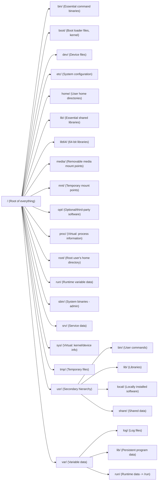
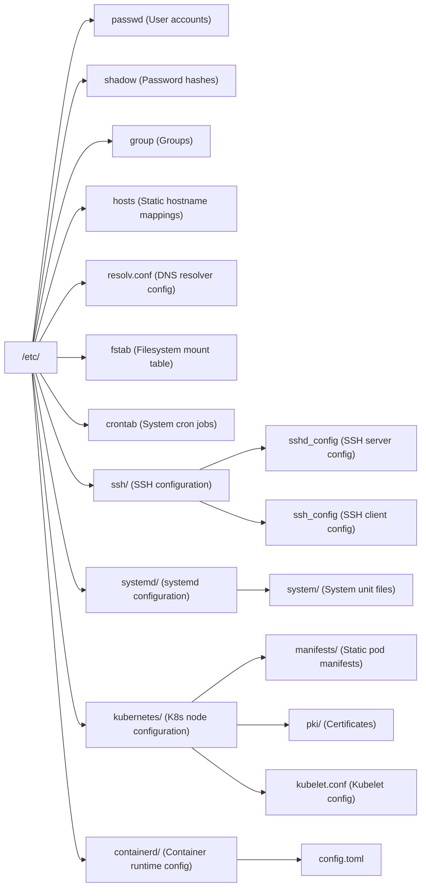
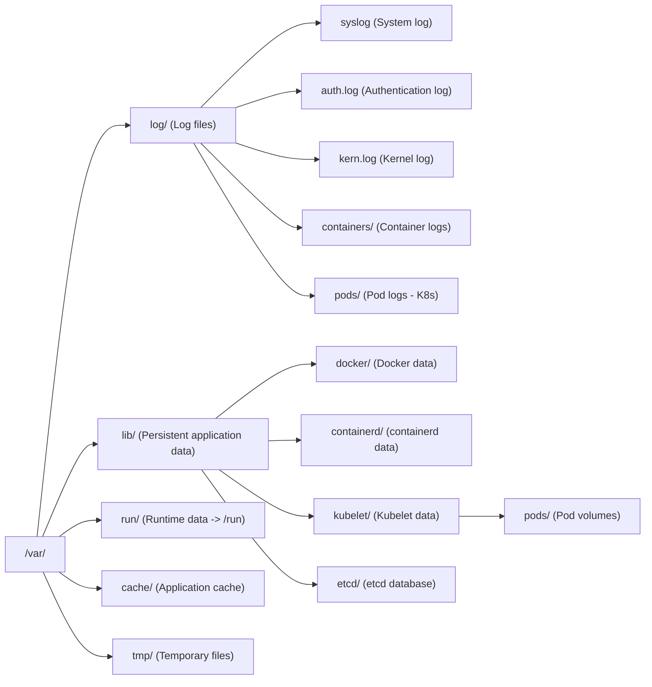
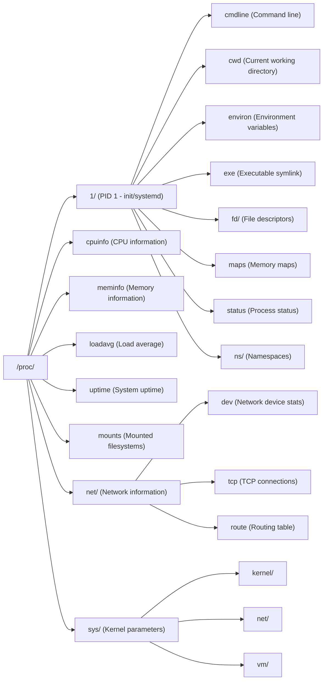
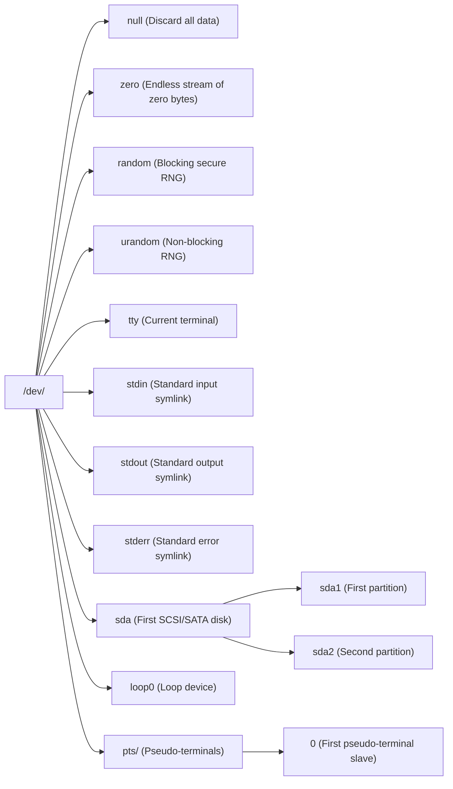
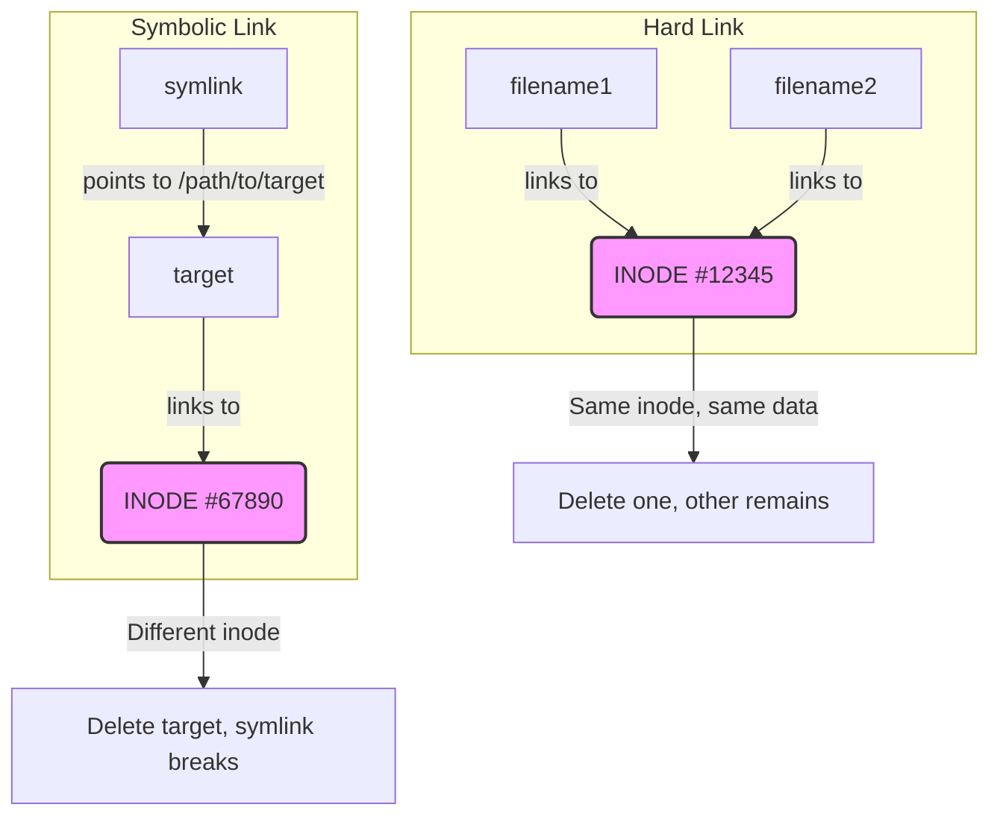
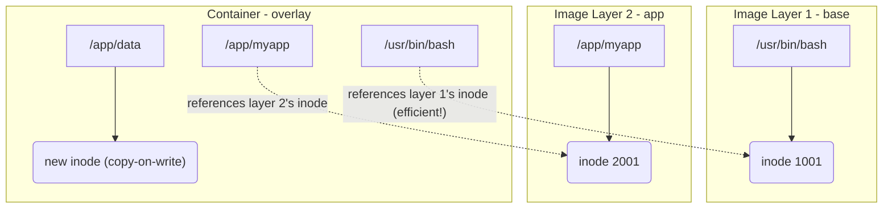

# Module 1.3: Filesystem Hierarchy

**Complexity**: Intermediate<br>
**Time to complete**: 45 minutes<br>
**Prerequisites**: [Module 1.1: Kernel & Architecture](../module-1.1-kernel-architecture/) and [Module 1.2: Processes & systemd](../module-1.2-processes-systemd/)

## Learning Outcomes

Upon completing this module, you will be able to:

- **Diagnose** filesystem-related incidents by interpreting the operational roles of `/etc`, `/var`, `/proc`, `/sys`, and `/dev`.
- **Evaluate** file placement decisions for persistent data, runtime state, temporary files, logs, and security-sensitive configuration.
- **Implement** repeatable techniques for locating configuration files, logs, runtime data, inode pressure, and mount details across Linux distributions.
- **Compare** hard links, symbolic links, inodes, and copy-on-write behavior when debugging host and container filesystems.
- **Debug** mount-related problems by identifying filesystem types, mount options, namespace boundaries, and Kubernetes node paths.

## Why This Module Matters

During a major retail sale, a payments team watched healthy application pods restart until checkout traffic collapsed. The application code had not changed, the cluster control plane was available, and CPU graphs looked ordinary, so the first responders spent valuable time chasing deployment history and network policies. The failure lived lower in the stack: container logs had grown until `/var/log` on several nodes had no usable space, kubelet could not rotate or write the files it needed, and a storage choice that had looked harmless during testing turned into a revenue incident measured in millions of dollars.

That kind of outage feels unfair until you know how Linux organizes the machine. The filesystem hierarchy is not a decorative directory tree; it is an operating contract between the kernel, boot process, service manager, package manager, container runtime, Kubernetes components, and administrators. When `/etc` is treated like a scratchpad, configuration drift becomes invisible. When `/var` is treated like an unlimited bucket, logs and runtime data can starve the node. When `/proc` and `/sys` are mistaken for ordinary directories, an operator can misread live kernel state or write a dangerous runtime setting.

This module teaches the hierarchy as an operational map rather than a memorization exercise. You will connect directory purpose to incident response, practice reading virtual filesystems, reason about inodes and links, and trace how Kubernetes 1.35 node behavior depends on familiar Linux paths. In Kubernetes examples, define `alias k=kubectl` once in your shell and then use `k` for commands such as `k get pods`, because the rest of this course uses that shorthand consistently.

## The Filesystem Hierarchy Standard as an Operations Contract

The Filesystem Hierarchy Standard gives Linux distributions a shared vocabulary for where software, configuration, runtime state, and variable data should live. It does not make every distribution identical, and modern systems add compatibility symlinks or distribution-specific directories, but it gives operators a reliable first guess under pressure. If a service is misconfigured, start near `/etc`; if disk usage is growing during normal operation, look under `/var`; if the question is about the live kernel or a running process, reach for `/proc` or `/sys` before assuming the answer is stored on disk.



The root directory `/` is the single visible tree, even when the machine is backed by many filesystems, memory-backed pseudo-filesystems, network mounts, and container overlays. That single tree is one reason Linux is pleasant to automate: a script can open `/etc/hosts`, a service can write `/var/lib/myapp/state.db`, and a diagnostic command can read `/proc/meminfo` without learning a new API for every storage device. The tradeoff is that the tree hides important boundaries, so you must learn which paths are persistent, which are generated by the kernel, and which are mount points that might have their own capacity and options.

Pause and predict: during normal operation, which top-level directories should change frequently and which should remain nearly static? A healthy server usually changes `/var`, `/run`, `/tmp`, selected application data directories, and live virtual trees such as `/proc` and `/sys`; it should not constantly rewrite most of `/usr` or randomly mutate security-sensitive files in `/etc`. That prediction gives you a quick anomaly detector before you run a single specialized tool.

One useful mental model is to treat the hierarchy like a hospital building. The pharmacy, records room, operating rooms, equipment closets, and waiting rooms all belong to the same building, but staff know that each area has a different safety rule. Linux is similar: `/etc` is the records room, `/var` is the active work queue, `/dev` is the equipment interface, and `/proc` plus `/sys` are live monitors connected to the patient. Putting the right file in the right place makes future debugging calmer because the location itself carries meaning.

Compatibility adds a little confusion. Many contemporary distributions merge parts of `/bin`, `/sbin`, and `/lib` into `/usr` while keeping top-level paths as symlinks for older scripts. That does not invalidate the hierarchy; it means the visible path may be a compatibility entrance to a shared backing directory. When investigating, use `ls -l`, `readlink`, `stat`, and `findmnt` to distinguish a directory, a symbolic link, and a mount point instead of assuming the path name tells the whole story.

The hierarchy also helps you decide when a surprising file is actually suspicious. A binary under `/usr/bin` may be ordinary package content, while a new executable hidden under `/tmp` or a writable web directory deserves closer attention. A growing database under `/var/lib` may be expected, while the same database under `/etc` suggests a service is writing into configuration space. This is why experienced responders ask "what is the path telling me?" before they ask "what command should I run?"

## Configuration, Variable Data, and Live Kernel Views

The most common production filesystem investigations start with three questions: where is the desired configuration, where is the changing state, and what does the running kernel currently believe? `/etc`, `/var`, `/proc`, `/sys`, and `/dev` answer those questions from different angles. Learning them together matters because real incidents rarely stay in one directory; a kubelet problem might involve a file under `/etc/kubernetes`, state under `/var/lib/kubelet`, logs under `/var/log`, process details under `/proc`, and device information under `/sys`.

### `/etc` as Configuration Central

The `/etc` directory holds system-wide configuration, identity files, service defaults, boot-time mount declarations, and many node-level Kubernetes artifacts. It should be editable by administrators and configuration management, but it should not be a dumping ground for generated data. When `/etc` changes, the system's intended behavior changes, so every edit deserves a clear owner, a review path, and a rollback story. That is especially true on Kubernetes nodes, where certificates, kubelet configuration, and static pod manifests can affect cluster availability.



You do not need to memorize every file in `/etc`; you need to develop a disciplined search pattern. Start with names that match the service, then inspect file type and ownership before editing. A plain text file such as `/etc/hosts` invites direct reading, while a directory such as `/etc/systemd/system` has its own conventions and reload requirements. The command sequence below is intentionally simple because the safest diagnostic path begins with observation before mutation.

```bash
# Explore /etc and see some common configuration files
ls /etc | head -20

# Identify file types to understand their purpose (e.g., plain text vs. binary)
file /etc/passwd /etc/ssh/sshd_config /etc/hosts
```

A practical example makes the difference concrete. Suppose a node can resolve public names but cannot resolve an internal service name after a base image update. You might check `/etc/resolv.conf`, find that it is managed by systemd-resolved or NetworkManager, and then avoid hand-editing a file that will be regenerated. The important skill is not knowing one distribution's resolver behavior by heart; it is recognizing that `/etc` often contains the configuration interface, while another service may own the final rendered file.

Before running this on a real node, what output do you expect from `file /etc/passwd /etc/ssh/sshd_config /etc/hosts`, and which result would make you slow down? If a supposedly normal configuration file appears as a symlink, device, or binary blob, that is not automatically wrong, but it changes your next move. You would inspect the target, package ownership, and service documentation before replacing it with a local edit.

### `/var` as the Place Where Systems Breathe

The `/var` directory contains data expected to change while the system runs: logs, caches, package databases, spool files, runtime-adjacent state, container runtime storage, kubelet state, and service data. That makes `/var` one of the first places to inspect when a machine becomes unhealthy after hours or days of normal traffic. It also makes `/var` a blast-radius boundary: isolating it on its own filesystem can prevent logs or container layers from consuming the entire root filesystem.



The distinction between `/var/lib`, `/var/log`, `/var/cache`, and `/var/tmp` is operationally useful. Persistent service state belongs under `/var/lib` because it must survive restarts and usually has a defined owner. Logs belong under `/var/log` because rotation, collection, retention, and privacy controls can be applied there. Cache data belongs under `/var/cache` because it can be rebuilt, while `/var/tmp` is for temporary data that may survive a reboot longer than `/tmp` on some systems.

```bash
# Check disk usage in /var to find large directories
du -sh /var/* 2>/dev/null | sort -h

# Find log files larger than 10MB that might need attention
find /var/log -type f -size +10M 2>/dev/null
```

The security angle is easy to underestimate. Logs often contain usernames, internal hostnames, request paths, failed authentication attempts, error payloads, and sometimes accidental secrets from application exceptions. Stop and think: what would happen if a debug log under `/var/log` captured an authorization header or a customer identifier? The fix is not merely deleting one file; you would tighten application logging, rotate and expire existing files, restrict permissions, and send the corrected stream to a controlled logging backend.

For Kubernetes operators, `/var` is also where host-level container reality shows up. Container images, writable layers, pod volumes, kubelet data, and pod log paths often live below `/var/lib` or `/var/log`, depending on the runtime and distribution. If `k get pods` shows restarts but the application metrics are inconclusive, node inspection under `/var/log/containers`, `/var/log/pods`, `/var/lib/containerd`, and `/var/lib/kubelet` can reveal whether the issue is logging pressure, volume pressure, image garbage collection, or a workload writing into its ephemeral layer.

There is an important design habit hidden in that inspection pattern: separate data by how you will repair it. Logs can often be rotated, compressed, shipped, or expired, while persistent service state may need backup restoration or application-level recovery. Container runtime storage may be reclaimed by image garbage collection, but kubelet volume directories might represent active workloads that should not be removed manually. If all of these data classes are mixed together in one unmonitored growth path, incident response becomes a risky guessing exercise.

### `/proc`, `/sys`, and `/dev` as Kernel Interfaces

`/proc` is a pseudo-filesystem generated by the kernel, not a directory full of ordinary disk files. It exposes process directories by PID, system-wide facts such as memory and load, network tables, mount information, and tunable parameters under `/proc/sys`. Reading from `/proc` is often the fastest way to answer "what is true right now?" because the kernel synthesizes the content when you ask. That freshness is powerful, but it also means the output can change between two commands during a busy incident.



The process directories under `/proc` are especially useful when a service wrapper obscures the real command. `/proc/<pid>/cmdline` shows the arguments used to start the process, `/proc/<pid>/fd` shows open file descriptors, `/proc/<pid>/cwd` shows the current working directory, and `/proc/<pid>/status` summarizes identity, memory, and state. Those files can explain why deleting a large log does not immediately free space: a process may still hold an open file descriptor to the deleted inode.

```bash
# Get system information from /proc
cat /proc/cpuinfo | grep "model name" | head -1
cat /proc/meminfo | head -5
cat /proc/loadavg

# Examine your current shell process's information
cat /proc/$$/cmdline | tr '\0' ' '  # Your shell's command line arguments
ls -la /proc/$$/fd                   # List open file descriptors for your shell
cat /proc/$$/status | grep -E "^(Name|State|Pid|PPid|Uid)" # Key process status info
```

`/sys` exposes the kernel's device model in a more structured way than the older process-centered parts of `/proc`. It is where you inspect block devices, network interfaces, cgroup support, driver relationships, and selected kernel attributes. Many files under `/sys` are readable, and some are writable runtime controls. Treat writable entries with the same seriousness you would give to a production control-plane setting, because the apparent file write is actually a request to change kernel behavior.

```mermaid
graph LR
    sys["/sys/"] --> block["block/ (Block devices)"]
    block --> sda["sda/"]
    sda --> size["size (Size in 512-byte sectors)"]
    sda --> queue["queue/ (I/O scheduler settings)"]
    sys --> class["class/ (Device classes)"]
    class --> net["net/ (Network interfaces)"]
    class --> class_block["block/ (Block devices)"]
    sys --> devices["devices/ (Device hierarchy)"]
    sys --> fs["fs/ (Filesystem info)"]
    fs --> cgroup["cgroup/ (Cgroup information)"]
    sys --> kernel["kernel/ (Kernel configuration)"]
    kernel --> mm["mm/ (Memory management settings)"]
```

```bash
# List available network interfaces
ls /sys/class/net

# Get the size of your primary block device (e.g., sda or vda for virtual machines)
cat /sys/block/sda/size 2>/dev/null || cat /sys/block/vda/size

# Check the cgroup version your system is using (important for container runtimes)
cat /sys/fs/cgroup/cgroup.controllers 2>/dev/null && echo "cgroup v2" || echo "cgroup v1 or check manually"
```

`/dev` completes the picture by presenting device files and pseudo-devices as filesystem entries. These entries are not normal documents; they are interfaces to kernel device drivers or kernel services. Writing to `/dev/null` discards data, reading from `/dev/urandom` returns random bytes, and opening a block device such as `/dev/sda` talks to storage through the kernel. This unified file interface is elegant, but it is also why permissions on device files matter so much.



```bash
# Discard unwanted output by redirecting to /dev/null
echo "hello, world!" > /dev/null

# Generate 16 cryptographically secure random bytes and display them in hexadecimal
head -c 16 /dev/urandom | xxd

# Create a 1MB file filled with zeros (useful for testing disk I/O or creating swap files)
dd if=/dev/zero bs=1M count=1 | wc -c  # Counts the bytes written
```

The worked diagnostic pattern is to start with the least invasive read-only interface. If a network interface appears down, inspect `/sys/class/net`, read counters in `/proc/net/dev`, and then check service logs under `/var/log` before writing a sysctl or restarting services. Which approach would you choose first on a production node: changing a kernel setting under `/proc/sys/net`, or collecting `/proc`, `/sys`, and log evidence? The evidence-first approach protects you from turning an unclear incident into a self-inflicted one.

Virtual filesystems also remind you that not every apparent file has the same performance or safety profile. Reading a small text file under `/etc` is usually a disk or page-cache operation, but reading a file under `/proc` may cause the kernel to walk live structures and format a snapshot for you. That is normally cheap, yet high-frequency polling of detailed process or network files can still add overhead on busy machines. Good observability tools sample deliberately, label the source, and avoid confusing a live kernel interface with durable stored history.

## Inodes, Links, and Container Layers

Filenames are convenient for humans, but the filesystem tracks file identity through inodes. An inode stores metadata such as owner, permissions, timestamps, size, link count, and pointers to data blocks; the filename lives in a directory entry that points to that inode. This separation explains behavior that surprises many beginners: two filenames can identify the same file, deleting a name may not delete the data, and a filesystem can run out of inode records even when disk blocks remain available.

```mermaid
graph TD
    inode_box[INODE] --> file_type[File type (regular, directory, etc.)]
    inode_box --> permissions[Permissions (rwx)]
    inode_box --> owner[Owner (UID)]
    inode_box --> group[Group (GID)]
    inode_box --> size[Size]
    inode_box --> timestamps[Timestamps (atime, mtime, ctime)]
    inode_box --> hard_links[Number of hard links]
    inode_box --> data_pointers[Pointers to data blocks]
    inode_box -- "(NOT the filename!)" --> data_blocks[DATA BLOCKS<br>(actual file content)]
```

Inode pressure produces a distinctive failure mode. A filesystem can show gigabytes free in `df -h` while `touch newfile` fails because there are no free inodes left to describe new files. That usually happens in directories full of tiny files: session stores, package cache fragments, mail spools, extracted dependency trees, or application-generated scratch files. Pause and predict: if inode usage is exhausted but space remains, would deleting one huge file solve the problem? Usually not, because the problem is the count of file records, not the amount of stored data.

```bash
# See the inode number of a file using 'ls -li'
ls -li /etc/passwd

# Output example: 123456 -rw-r--r-- 1 root root 2345 Dec 1 /etc/passwd
#         ^^^^^^ = inode number (this number identifies the file to the kernel)

# Get detailed inode information using 'stat'
stat /etc/passwd
```

Hard links and symbolic links are the practical reason every operator should understand inodes. A hard link is another directory entry pointing at the same inode, so both names refer to the same metadata and data blocks. A symbolic link is a separate file with its own inode whose content is a path to another location. That difference affects backups, cleanup scripts, container bind mounts, and recovery steps after accidental deletion.



A hard link cannot normally cross filesystem boundaries because inode numbers are meaningful only inside one filesystem. A symbolic link can cross those boundaries because it stores a path string, but that flexibility is also why it can become dangling. When a deployment process creates symlinks such as `current -> releases/2026-05-02`, it gains cheap rollback by moving a pointer, but it must also handle the case where the target is removed too early or mounted somewhere else inside a container namespace.

```bash
# Create a simple file
echo "original content" > original.txt

# Create a hard link to original.txt
ln original.txt hardlink.txt

# Create a symbolic link to original.txt
ln -s original.txt symlink.txt

# Compare the inode numbers and file types
ls -li original.txt hardlink.txt symlink.txt

# Modify the file through the hard link
echo "modified via hardlink" >> hardlink.txt
cat original.txt  # Observe: original.txt is also modified!

# Delete the original file
rm original.txt
cat hardlink.txt  # Still works! The inode and data still exist because hardlink.txt references it.
cat symlink.txt   # Broken! The target (original.txt) is gone.
```

Container filesystems make inode reasoning more relevant, not less. Image layers are read-only, and a running container usually receives a writable layer above them. When a process modifies a file that came from a lower image layer, the storage driver copies that file into the writable layer and the modified copy receives its own metadata. This copy-on-write behavior makes startup efficient, but it can quietly consume host storage when applications write logs, caches, package updates, or mutable databases into the container layer instead of a volume.



The operational lesson is to separate identity from names and separate intended persistence from accidental persistence. If a deleted file still consumes space, inspect open file descriptors in `/proc`. If a cleanup script removes a symlink target, expect the symlink to break even though the symlink file remains. If a container node slowly loses disk space after workloads start, inspect the runtime's writable layer directories under `/var/lib/containerd` or a distribution-specific equivalent before blaming the application volume.

Backups and migrations are another place where inode knowledge pays off. A backup tool that follows symlinks may copy the target data, while a tool that preserves symlinks records only the path relationship. A tool that preserves hard links can avoid duplicating data, while a naive copy can turn one inode with several names into several separate files that consume more space. When moving application directories, always check whether link relationships are part of the design or just historical clutter, because preserving the wrong relationship can recreate the original failure on the new host.

## Mount Points, Filesystem Types, and Persistence

Mounting is how Linux attaches different storage resources into the one visible directory tree. The resource can be a physical partition, a logical volume, a network filesystem, a memory-backed `tmpfs`, a bind mount, a container overlay, or a pseudo-filesystem such as `/proc`. A mount point is just the directory where that resource appears, but crossing a mount point can change capacity, inode accounting, permissions, filesystem semantics, and durability.

```mermaid
graph TD
    A[/ root<br>ext4 on /dev/sda1]
    A --> B[/boot<br>ext4 on /dev/sda2]
    A --> C[/home<br>xfs on /dev/sda3]
    A --> D[/var<br>ext4 on /dev/sda4]
    C --> E[/home/nfs<br>NFS]
```

In the diagram, `/`, `/boot`, `/home`, and `/var` are visible as ordinary directories, but each may have its own filesystem underneath. That is why `df -h /var` can report a different capacity from `df -h /`, and why a full `/var` partition can break logging without filling the root filesystem. The same boundary explains why hard links cannot cross from `/home` to `/var` if those paths are backed by different filesystems, even though they appear in one tree.

```bash
# Show all mounts (output can be verbose)
mount | head -20

# 'findmnt' provides a more readable, tree-like view of mounts
findmnt

# Filter 'findmnt' output to show only specific filesystem types
findmnt -t ext4

# Inspect mounts directly from the /proc virtual filesystem
cat /proc/mounts | head -10
```

Mount options are as important as mount locations. A filesystem mounted read-only prevents writes regardless of directory permissions. Options such as `noexec`, `nosuid`, and `nodev` can reduce risk on temporary or user-controlled paths, while performance options such as `noatime` can reduce metadata writes for selected workloads. The right choice depends on the path's purpose, because a hardened option that makes sense for `/tmp` might break software under `/var/lib` that legitimately needs device nodes, executable helpers, or precise metadata behavior.

Persistent mounts are usually declared in `/etc/fstab`, which the boot process reads to attach filesystems automatically. A bad entry can slow or block boot, mount a filesystem in the wrong place, or silently apply options that change application behavior. The safest workflow is to test a new mount manually, verify `findmnt` output, use stable identifiers such as UUIDs where appropriate, and run a non-destructive validation before depending on the entry during the next restart.

```bash
# /etc/fstab format:
# <device>       <mount point>  <type>  <options>        <dump> <fsck>
/dev/sda1        /              ext4    defaults         0      1
/dev/sda2        /boot          ext4    defaults         0      2
/dev/sda3        /home          xfs     defaults         0      2
UUID=abc-123     /data          ext4    defaults,noatime 0      2
192.168.1.10:/   /mnt/nfs       nfs     defaults         0      0
```

The six fields in `fstab` describe the device, mount point, filesystem type, options, legacy dump behavior, and filesystem check ordering. Root normally gets check order `1`, other local filesystems often use `2`, and network or virtual filesystems commonly use `0`. The options field is where many subtle bugs hide. For example, mounting an application directory with `noexec` can prevent helper binaries from starting, while omitting a necessary network mount option can make boot wait for infrastructure that is not yet reachable.

Memory-backed filesystems illustrate why the path name alone is not enough. A `tmpfs` mounted at `/tmp/ramdisk` behaves like a directory, but its contents live in memory and disappear when unmounted or rebooted. That makes it useful for fast scratch data and tests, but dangerous for anything that must survive. Before running this, predict what `df -h /tmp/ramdisk` will show after the mount and what `cat /tmp/ramdisk/test.txt` will do after unmounting.

```bash
# Create a directory to serve as the mount point
mkdir -p /tmp/ramdisk
# Mount a tmpfs filesystem, limiting its size to 100MB
sudo mount -t tmpfs -o size=100M tmpfs /tmp/ramdisk

# Verify the mount and its properties
df -h /tmp/ramdisk
mount | grep ramdisk

# Write a file to the RAM disk
echo "This is in RAM and will vanish on reboot or unmount" > /tmp/ramdisk/test.txt
cat /tmp/ramdisk/test.txt

# Unmount the RAM disk (data will be lost)
sudo umount /tmp/ramdisk
```

Containers add another mount concept: namespaces. A process inside a container has its own view of the mount tree, so `/var/log` inside the container is not automatically the host's `/var/log`. Kubernetes volumes, hostPath mounts, projected secrets, ConfigMaps, and runtime overlay mounts are all ways of shaping that view. When a pod cannot see a host file, or when a host path appears empty inside a container, ask which namespace you are observing and whether the mount was actually passed into that namespace.

Mount troubleshooting should therefore pair location with perspective. Run `findmnt` on the host when you care about node storage, inspect the container's mount view when you care about application access, and compare both views when Kubernetes is responsible for wiring them together. A common mistake is to fix permissions on the host path while the pod is actually using a different projected volume, or to edit a file inside the container while the host path remains unchanged. The directory name is only evidence after you know whose mount namespace produced it.

## Kubernetes Node Paths You Must Recognize

Kubernetes is portable at the API level, but a node is still a Linux machine with ordinary directories, device files, mounts, logs, and runtime state. The kubelet watches configuration, manages pod volumes, calls the container runtime, exposes logs, and enforces resource pressure decisions using host filesystem paths. When `k describe node` mentions disk pressure, or `k get pods` shows pods stuck during startup, the fastest path to the root cause often combines Kubernetes API evidence with direct Linux inspection.

| Path | Purpose |
|------|---------|
| `/etc/kubernetes/` | Contains core Kubernetes configuration files for the node (e.g., Kubelet configuration, API server manifests). |
| `/etc/kubernetes/manifests/` | Location for static pod manifests, which are managed by the Kubelet itself rather than the API server. |
| `/etc/kubernetes/pki/` | Stores PKI (Public Key Infrastructure) certificates and keys necessary for secure communication within the cluster. |
| `/var/lib/kubelet/` | Kubelet's persistent data directory, including its internal state, plugin data, and volume information. |
| `/var/lib/kubelet/pods/` | Subdirectory where Kubelet stores data related to running pods, including mounted volumes and temporary files. |
| `/var/lib/containerd/` | Containerd's data directory, holding image layers, container metadata, and writable container layers. |
| `/var/log/pods/` | Directory where Kubernetes stores symlinks to container logs. Each pod has its own subdirectory. |
| `/var/log/containers/` | Contains actual container log files, often symlinked from `/var/log/pods`. |
| `/run/containerd/` | Location for the containerd socket and runtime-specific data, typically transient. |

The table is not a promise that every distribution uses only these paths, but it is the right starting map for kubeadm-style nodes and many common installations. Managed services, hardened images, and custom runtime configurations can move or hide pieces, so your first command should confirm existence and ownership rather than assuming the textbook path is authoritative. If the directory exists, inspect it carefully; if it does not, use service configuration and runtime documentation to find the configured alternative.

```bash
# Check if you're on a Kubernetes node by looking for its configuration directory
ls /etc/kubernetes/ 2>/dev/null || echo "Not a K8s node or directory not found"

# Peek into the Kubelet's pod data directory
ls /var/lib/kubelet/pods/ 2>/dev/null | head -5
```

Static pod manifests under `/etc/kubernetes/manifests` deserve special attention. The kubelet watches that directory directly and creates pods from files found there, which is why control-plane components on kubeadm clusters can run even before the API server is fully healthy. A malformed manifest or accidental file move in that directory can affect critical components without any `kubectl apply` event. That is a filesystem hierarchy lesson with cluster-level consequences: the source of truth for those pods is a host path, not an object originally submitted through the API server.

Logs are similarly split between Linux and Kubernetes abstractions. The Kubernetes API can retrieve container logs, but the node stores container log files under host paths managed by kubelet and the runtime. If `k logs` fails, you may need to inspect `/var/log/pods`, `/var/log/containers`, kubelet logs, and the runtime's own state. When logs are missing after restarts, check whether the application logs to stdout and stderr, whether rotation is too aggressive, whether the container writes into an ephemeral layer, and whether node disk pressure triggered cleanup.

Volume debugging also crosses layers. A pod may declare a PersistentVolumeClaim, but kubelet still stages and mounts data below its data directory, and the container sees a namespace-specific mount inside the pod. If the application reports permission errors, do not stop at the YAML. Compare the pod specification, kubelet volume directories, mount options, filesystem type, ownership, and security context. That chain is how you connect a Kubernetes symptom to a Linux cause without guessing.

The same cross-layer thinking applies to security reviews. A Kubernetes Secret projected into a pod appears as files in the container, while certificate material under `/etc/kubernetes/pki` belongs to the node or control plane. Both are files, but they have different owners, rotation mechanisms, exposure paths, and recovery procedures. Treating them as equivalent because they are readable paths would be a category error. The hierarchy tells you where to begin, and the Kubernetes object model tells you which controller or process is allowed to change the content.

## Patterns & Anti-Patterns

### Pattern: Treat Path Purpose as Part of the Design

A reliable system has an explicit answer for where configuration, persistent state, logs, cache, runtime sockets, and temporary files live. Use `/etc` for host-level configuration, `/var/lib/<service>` for service-owned durable state, `/var/log` for logs, `/run` for runtime sockets and PID files, and temporary directories only for disposable work. This pattern works because it lets operating-system tools, backup jobs, security policies, and human responders reason from path purpose instead of reading application code during an outage.

### Pattern: Separate Growth Domains with Mounts and Monitoring

Put high-growth data such as logs, container runtime storage, and application state on filesystems whose capacity and inode usage can be monitored independently. This does not mean every server needs many partitions, but production nodes should make deliberate choices about `/var`, runtime data, and workload volumes. The scaling benefit is containment: a verbose application should not prevent the machine from reading configuration, starting critical services, or writing audit logs elsewhere on the root filesystem.

### Pattern: Prefer Read-Only Observation Before Runtime Mutation

When investigating kernel or filesystem behavior, first read `/proc`, `/sys`, `findmnt`, `df`, `stat`, logs, and service configuration before writing tunables or restarting daemons. This pattern works because filesystem evidence is often transient, and changing the system too early destroys the state that would have explained the incident. After evidence collection, apply the smallest reversible change, document it, and then make persistence explicit through the correct configuration path rather than relying on an interactive command.

### Anti-Pattern: Using `/tmp` as an Accidental Database

Teams fall into this pattern because `/tmp` is writable, familiar, and easy to use during development. The failure arrives later when cleanup policies, reboots, container restarts, or memory-backed mounts remove data the application quietly depended on. The better alternative is to classify the data honestly: durable service data goes under `/var/lib` or a volume, cache goes under `/var/cache` or an explicit cache volume, and scratch data is the only thing that belongs in a temporary directory.

### Anti-Pattern: Editing Generated Files as Though They Were Source

Files such as resolver configuration, runtime socket links, generated unit fragments, and some Kubernetes node artifacts may be rendered by another service. A manual edit can appear to fix the problem until the owning service rewrites the file and the failure returns. The better alternative is to identify the owner with documentation, package metadata, symlinks, comments, and service configuration, then change the upstream source that renders the file.

### Anti-Pattern: Debugging Containers from Only Inside the Container

A shell inside a container shows the container's mount namespace, not the full host. That view is valuable for application behavior, but it can hide host disk pressure, runtime layer growth, kubelet volume staging, and node-level logs. The better alternative is to compare three views: the Kubernetes API with `k`, the container's namespace, and the host filesystem paths that kubelet and the runtime actually manage. Disagreements between those views are often the clue.

## Decision Framework

When you need to decide where a file belongs, start with the question of lifetime. If the data must survive service restarts and node reboots, it needs a durable location such as `/var/lib/<service>`, a user home when it is truly user-owned, or an explicitly mounted volume. If it is configuration that defines intended behavior, place it in the service's supported configuration path, commonly under `/etc` for host-wide settings. If it is safe to rebuild, a cache path is more honest than a data path; if it is needed only while a process runs, `/run` or an application runtime directory is a better fit.

Next, decide who owns the file. Host configuration should be owned by root or a configuration-management process, service state should be owned by the service account, logs should be readable by the intended operations path and protected from broad disclosure, and device access should be granted narrowly through permissions or container security settings. Ownership choices become debugging signals later. If a process cannot write `/var/lib/myapp`, the answer might be permissions; if it writes freely into `/etc`, the design itself is likely wrong.

Then decide how the data grows and how failure should be contained. Logs and container writable layers can grow rapidly, so they need rotation, quotas, monitoring, or separate filesystems. A mount option such as `noexec` can be excellent for an upload directory but harmful for a directory where a package manager or application legitimately runs helper binaries. A `tmpfs` can make scratch operations fast but moves pressure from disk to memory, which can affect eviction behavior on Kubernetes nodes.

Finally, decide which observation path proves your assumption. Use `stat` and `ls -li` for inode and link questions, `df -h` and `df -i` for capacity and inode pressure, `findmnt` for mount source and options, `/proc/<pid>/fd` for open deleted files, `/proc/mounts` for the kernel's mount view, `/sys` for device and cgroup facts, and Kubernetes commands such as `k describe node` only after the alias has been defined. The best filesystem decisions are testable from both the Linux shell and the orchestration layer.

When two choices both seem plausible, prefer the one that makes failure easier to diagnose later. A service that writes logs to the standard stream and stores durable state under one documented volume is easier to operate than a service that writes rotating files into its image layer and silently creates cache directories under arbitrary paths. A node with monitored `/var` growth and documented runtime storage is easier to repair than a node where every workload shares the root filesystem without quotas or alerts. Filesystem design is not only about today's file placement; it is about tomorrow's incident timeline.

You can use this framework during design review as well as incident response. Ask the team to name the file's owner, lifetime, expected growth pattern, backup requirement, confidentiality level, and mount assumptions before the first deployment. If those answers are vague, the module should not pass review yet, because vague filesystem ownership becomes vague recovery ownership later. A small amount of design discipline prevents the worst kind of production debate, where responders discover during an outage that nobody knows whether a directory is disposable cache, critical state, generated configuration, or runtime scratch space.

## Did You Know?

- **The Filesystem Hierarchy Standard dates back to 1994**: FHS 1.0 appeared in 1994, and FHS 3.0 was published in 2015 to keep core locations predictable across distributions and software packages.
- **Everything really is a file in Linux**: hardware devices can appear under `/dev`, process state appears under `/proc`, and kernel device relationships appear under `/sys`, which gives scripts a common read and write model.
- **`/proc` is not stored on disk**: reading `/proc/meminfo` asks the kernel to synthesize current memory information at that moment, so the file's contents can change immediately between reads.
- **Container images often carry more shared operating-system content than application content**: an image over 200 MB may contain only 20-50 MB of unique application files because layers reuse common Linux directories and libraries.

## Common Mistakes

| Mistake | Why It Happens | How to Fix It |
|---------|----------------|---------------|
| Putting persistent data in `/tmp` | Development tests use writable scratch space, and nobody defines the data's required lifetime before deployment. | Move durable service data to `/var/lib/<service>` or an explicit volume, then keep only disposable scratch files in temporary paths. |
| Filling `/var` or `/var/log` partitions | Logs, runtime layers, package caches, or kubelet data grow during normal traffic until the filesystem has no room for critical writes. | Monitor `df -h` and `df -i`, configure log rotation, isolate high-growth paths where appropriate, and investigate the largest directories with `du`. |
| Modifying files in `/proc` or `/sys` without understanding | The paths look like ordinary files, so operators treat kernel runtime controls as harmless text files. | Prefer read-only inspection first, use documented `sysctl` or driver procedures for changes, and make persistent settings through supported configuration. |
| Confusing hard links with symbolic links | Both appear as names in a directory, but one shares an inode while the other stores a target path. | Use `ls -li`, `stat`, and `ls -l` to inspect inode numbers and link targets before cleanup, backup, or deployment changes. |
| Forgetting mount namespaces in containers | The same absolute path exists on the host and in the container, so teams assume both processes see the same filesystem. | Compare the host view, container view, and Kubernetes volume configuration, then pass required paths through explicit volumes or hostPath mounts. |
| Running out of inodes | Many tiny files consume inode records while block usage still looks healthy, making `df -h` misleading. | Check `df -i`, find directories with excessive file counts, clean the real source, and choose filesystem parameters that match the workload. |
| Editing generated configuration files | A rendered file appears to be the right target, but another service owns and rewrites it. | Identify the generator, change the upstream source, reload the owning service, and document the durable configuration path. |

## Quiz

<details>
<summary>Your Kubernetes 1.35 node reports disk pressure, and several pods are restarting even though application CPU and memory look normal. Which filesystem areas do you inspect first, and why?</summary>

Start with `/var/log`, `/var/log/pods`, `/var/log/containers`, `/var/lib/kubelet`, and `/var/lib/containerd`, then confirm capacity and inode usage with `df -h` and `df -i`. Those paths cover kubelet state, container runtime storage, pod log files, and writable layers, which are common sources of node disk pressure. The reason to inspect them together is that Kubernetes symptoms often reflect host filesystem pressure rather than an application crash by itself. Use `k describe node` to correlate the API-level condition with the Linux evidence.
</details>

<details>
<summary>A service fails after reboot because its cache directory was stored on a memory-backed mount. How do you evaluate the placement decision?</summary>

First classify the data by lifetime: if the service requires the data after reboot, it was not merely cache or scratch data and should not live on `tmpfs`. A memory-backed filesystem is appropriate for fast, disposable work, but it trades persistence for speed and consumes memory rather than disk. The durable alternative is a service-owned directory under `/var/lib/<service>` or an explicit persistent volume. If the data is truly rebuildable, update the service so it rebuilds the cache automatically and documents the expected cold-start behavior.
</details>

<details>
<summary>You delete a large log file, but `df -h` still shows the filesystem as full. What do you check next?</summary>

Check whether a running process still has the deleted file open through `/proc/<pid>/fd` or a tool that reports open deleted files. Deleting a directory entry removes the name, but the inode and data blocks can remain allocated until the last open file descriptor closes. This is an inode and reference-counting issue, not a failure of `rm`. Restarting or signaling the owning process to reopen logs can release the space, but you should first identify the process and preserve any evidence needed for the incident.
</details>

<details>
<summary>A junior administrator wants to hard-link a shared configuration file from `/etc` into `/var/lib/myapp`, but the command fails. What is the likely cause and safer design?</summary>

The likely cause is that `/etc` and `/var/lib/myapp` are on different filesystems, and hard links cannot cross filesystem boundaries because they point to inodes within one filesystem. Even if the command worked, hard-linking configuration into application state would blur ownership and make cleanup risky. A safer design is to keep the authoritative configuration in the supported `/etc` path, then let the service read it directly or render a service-owned copy through a controlled deployment process. If indirection is needed, a symbolic link can cross filesystems, but it must be managed so the target does not disappear unexpectedly.
</details>

<details>
<summary>Your team can read `/proc/net/dev` on a node and sees packet counters increasing, but a container cannot see the host log file you expect under `/var/log`. How do you reason about the difference?</summary>

The two observations involve different namespace and mount questions. `/proc/net/dev` on the host reports the host's kernel network view, while `/var/log` inside a container belongs to the container's mount namespace unless the host path was explicitly mounted. The correct next step is to compare the host path, the pod volume or hostPath configuration, and the path visible inside the container. This avoids assuming that identical absolute path names imply identical backing filesystems.
</details>

<details>
<summary>An application image starts small, but every running container slowly consumes host storage without writing to a mounted volume. Which filesystem mechanism explains this?</summary>

Copy-on-write container storage is the likely mechanism. When the process modifies files from read-only image layers, the runtime copies those files into the container's writable layer, which consumes host storage under the runtime data directory. This often happens when applications write logs, caches, package updates, or mutable state into the container filesystem. Investigate `/var/lib/containerd` or the configured runtime storage path, then move intentional persistence to a volume and disposable output to the expected logging stream.
</details>

<details>
<summary>You need to debug why a filesystem is mounted read-only during boot. Which evidence do you gather before changing configuration?</summary>

Gather the live mount view with `findmnt` and `/proc/mounts`, inspect the relevant `/etc/fstab` entry, check kernel and system logs under `/var/log`, and verify the device identifier with `blkid` or distribution tooling if available. A read-only mount may come from an explicit option, a filesystem error, an emergency remount, or a mismatched device entry. Changing `fstab` blindly can make the next boot worse. The evidence tells you whether to fix options, repair the filesystem, correct the device reference, or adjust service ordering.
</details>

## Hands-On Exercise: Filesystem Deep Dive

**Objective**: Gain practical experience navigating, inspecting, and manipulating files within the Linux filesystem hierarchy.

**Environment**: Any Linux system, such as a local VM, cloud instance, or a container with shell access. If you are on a Kubernetes node, define `alias k=kubectl` before using Kubernetes commands; if you are not on a node, the Linux portions still work and the Kubernetes path checks will report that the directories are absent.

### Part 1: Exploring the FHS Core

In this first pass, you are building a map before making any changes. Look at the root directory, sample key configuration files, and inspect resolver configuration as evidence of how the machine is put together. The exact output will vary by distribution, which is part of the lesson: the hierarchy gives you dependable categories, while packages and services fill those categories differently.

**Tasks**:
1. List the contents of the root directory (`/`).
2. Count the number of items (files and directories) within `/etc`.
3. Display the first 5 lines of `/etc/passwd` and `/etc/hosts`.
4. Identify the DNS servers configured on your system.

```bash
# 1. What's in root?
ls -la /

# 2. Find configuration file count in /etc
ls /etc | wc -l
echo "There are $(ls /etc | wc -l) items in /etc"

# 3. Check important config files
head -5 /etc/passwd
head -5 /etc/hosts

# 4. Find your DNS servers
cat /etc/resolv.conf
```

<details>
<summary>Solution: Part 1</summary>

Your output will vary depending on your specific Linux distribution and installed software. `ls -la /` should show directories such as `bin`, `boot`, `dev`, `etc`, `home`, `lib`, `mnt`, `opt`, `proc`, `root`, `run`, `sbin`, `srv`, `sys`, `tmp`, `usr`, and `var`, although some may be symlinks on merged systems. The `/etc` count is not important by itself; it is a reminder that system configuration is broad and service-specific. The resolver file may be a plain file or a symlink to a managed location, and that ownership detail affects how you would make a durable DNS change.
</details>

### Part 2: Peeking into Virtual Filesystems (`/proc` and `/sys`)

This section uses read-only commands to query live kernel and process state. Notice that the files under `/proc` and `/sys` behave like files from the shell's perspective, but the kernel is generating or exposing live data rather than reading ordinary bytes from disk. That distinction is why these commands are excellent diagnostics and why writes to selected virtual files need careful documentation.

**Tasks**:
1. Determine the system's uptime, load average, and total memory.
2. Find the process ID (PID) of your current shell and list its `/proc` entry details.
3. List the first 5 lines of network device statistics from `/proc`.
4. List all network interfaces reported by `/sys`.

```bash
# 1. System information from /proc
echo "Uptime: $(cat /proc/uptime | cut -d' ' -f1) seconds"
echo "Load: $(cat /proc/loadavg)"
echo "Memory: $(grep MemTotal /proc/meminfo)"

# 2. Your process's view
echo "My PID: $$" # $$ is a special shell variable holding the current PID
ls /proc/$$/
cat /proc/$$/status | head -10

# 3. Network info from /proc
cat /proc/net/dev | head -5

# 4. Kernel parameters from /sys
ls /sys/class/net/
```

<details>
<summary>Solution: Part 2</summary>

The uptime, load average, and memory values depend on the moment you run the commands, which proves that `/proc` is a live view. Your shell PID should match a directory under `/proc`, and the status file should show fields such as name, state, PID, parent PID, and user identity. Network device statistics commonly include loopback and at least one real or virtual interface. `/sys/class/net` should report interface names from the kernel's device model, which may differ between physical machines, virtual machines, and containers.
</details>

### Part 3: Inodes, Hard Links, and Symbolic Links

This exercise demonstrates the difference between file names and file identity. You will create one file, give the same inode a second name with a hard link, create a separate symbolic link that stores a target path, and then delete the original name. The behavior after deletion is the important observation because it shows why backups, cleanup scripts, and release symlinks can behave differently from intuition.

**Tasks**:
1. Create a temporary file named `original.txt` in `/tmp`.
2. Create a hard link named `hardlink.txt` to `original.txt`.
3. Create a symbolic link named `symlink.txt` to `original.txt`.
4. Use `ls -li` to observe the inode numbers of all three files.
5. Modify `original.txt` through `hardlink.txt`, then verify `original.txt` also changed.
6. Delete `original.txt` and then attempt to `cat` `hardlink.txt` and `symlink.txt`. Explain the difference in behavior.
7. Check the inode usage of your root filesystem.

```bash
# 1. Create test files
cd /tmp
echo "original content" > original.txt

# 2. Create hard link
ln original.txt hardlink.txt

# 3. Create symbolic link
ln -s original.txt symlink.txt

# 4. Examine inodes and link types
ls -li original.txt hardlink.txt symlink.txt

# 5. Modify through hard link
echo "modified via hardlink" >> hardlink.txt
cat original.txt  # Observe that original.txt now also contains "modified via hardlink"

# 6. Delete original and observe link behavior
rm original.txt
echo "--- After deleting original.txt ---"
echo "Attempting to cat hardlink.txt:"
cat hardlink.txt   # This should still work!
echo "Attempting to cat symlink.txt:"
cat symlink.txt    # This should fail with "No such file or directory" (broken symlink)

# 7. Check inode usage
df -i / | head -2
```

<details>
<summary>Solution: Part 3</summary>

`original.txt` and `hardlink.txt` should share the same inode number, while `symlink.txt` should have a different inode and a link target. After writing through `hardlink.txt`, reading `original.txt` shows the appended line because both names reference the same file identity. After deleting `original.txt`, the hard link still works because at least one directory entry references the inode. The symbolic link fails because its stored path target no longer exists, which is why symlink-based release and configuration patterns need target cleanup discipline.
</details>

### Part 4: Mount Points and Disk Usage

The last section connects the visible directory tree to mounted filesystems. You will inspect mounted filesystems, compare capacity views, find large directories under `/var`, and read mount options for the root filesystem. This is the same pattern you use during an incident: confirm the mount boundary, check capacity and inodes, then inspect the directory whose behavior matches the symptom.

**Tasks**:
1. Display a tree-like view of all mounted filesystems.
2. Show human-readable disk space usage for all filesystems.
3. Identify the 10 largest directories within `/var`.
4. Display the target, filesystem type, and mount options for your root filesystem.

```bash
# 1. View all mounts
findmnt | head -20

# 2. Human-readable disk space usage
df -h

# 3. Find largest directories in /var (may take a moment)
du -sh /var/* 2>/dev/null | sort -h | tail -10

# 4. Check mount options for root
findmnt -o TARGET,FSTYPE,OPTIONS /
```

<details>
<summary>Solution: Part 4</summary>

`findmnt` should show a hierarchy that may include `/`, `/boot`, `/dev`, `/proc`, `/sys`, and runtime-specific mounts. `df -h` reports capacity by mounted filesystem, so paths in one visible tree can have different backing storage. The largest directories under `/var` often include logs, package caches, container runtime data, or kubelet data on nodes. The root mount options should include a target, filesystem type such as `ext4` or `xfs`, and options such as `rw` and metadata behavior; those options define what applications can actually do despite ordinary directory permissions.
</details>

### Success Criteria

- [ ] Successfully navigated to and inspected content in `/etc`, `/proc`, `/sys`, and `/dev`.
- [ ] Correctly distinguished between and demonstrated the behavior of hard links and symbolic links.
- [ ] Identified inode numbers and explained why inode exhaustion differs from block exhaustion.
- [ ] Verified disk usage, inode usage, filesystem type, and mount options for specific directories.
- [ ] Explained the critical role of `/var`, `/etc`, `/var/lib/kubelet`, and `/var/log/containers` in Linux and Kubernetes operations.

## Sources

- [Filesystem Hierarchy Standard](https://refspecs.linuxfoundation.org/FHS_3.0/fhs/index.html) - The official documentation for the FHS.
- [The `/proc` Filesystem](https://www.kernel.org/doc/html/latest/filesystems/proc.html) - Kernel documentation on the `/proc` interface.
- [Linux Filesystem Explained](https://tldp.org/LDP/Linux-Filesystem-Hierarchy/html/) - A classic guide from The Linux Documentation Project.
- [inode and Links](https://www.howtogeek.com/465350/everything-you-ever-wanted-to-know-about-inodes-on-linux/) - A beginner-friendly explanation of inodes and their role.
- [Linux manual page: procfs](https://man7.org/linux/man-pages/man5/proc.5.html) - Detailed userspace reference for `/proc`.
- [Linux manual page: sysfs](https://man7.org/linux/man-pages/man5/sysfs.5.html) - Userspace reference for `/sys`.
- [Linux manual page: fstab](https://man7.org/linux/man-pages/man5/fstab.5.html) - Field definitions and behavior for persistent mounts.
- [Linux manual page: mount](https://man7.org/linux/man-pages/man8/mount.8.html) - Mount command behavior and options.
- [Kubernetes documentation: Node-pressure eviction](https://kubernetes.io/docs/concepts/scheduling-eviction/node-pressure-eviction/) - How kubelet reacts to node resource pressure.
- [Kubernetes documentation: Logging architecture](https://kubernetes.io/docs/concepts/cluster-administration/logging/) - How Kubernetes handles container and node logs.
- [Kubernetes documentation: Static Pods](https://kubernetes.io/docs/tasks/configure-pod-container/static-pod/) - How kubelet manages static pod manifests.
- [containerd documentation](https://github.com/containerd/containerd/tree/main/docs) - Runtime documentation for containerd behavior and configuration.

## Next Module

Next: [Module 1.4: Users & Permissions](../module-1.4-users-permissions/) shows how Linux decides who can read, write, execute, and administer the filesystem paths you inspected here.
