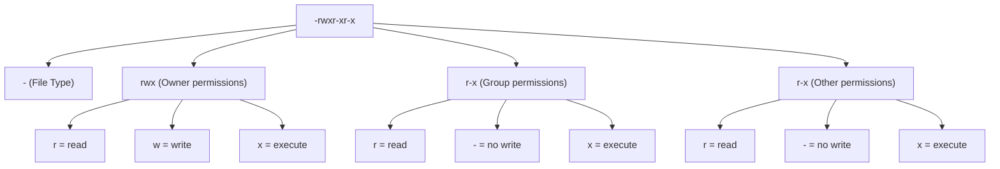
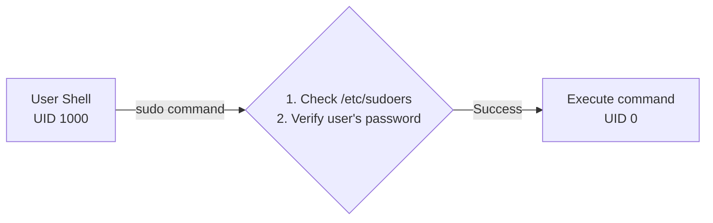
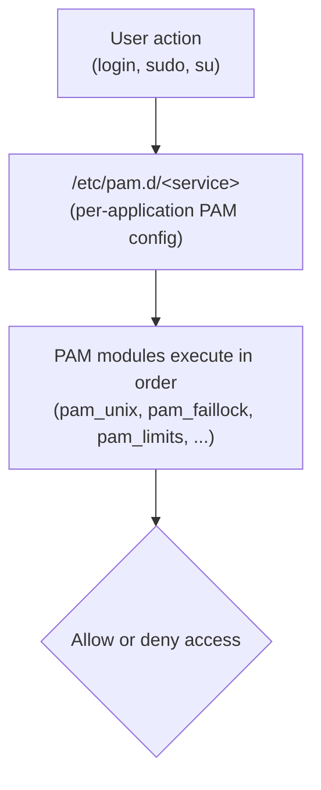
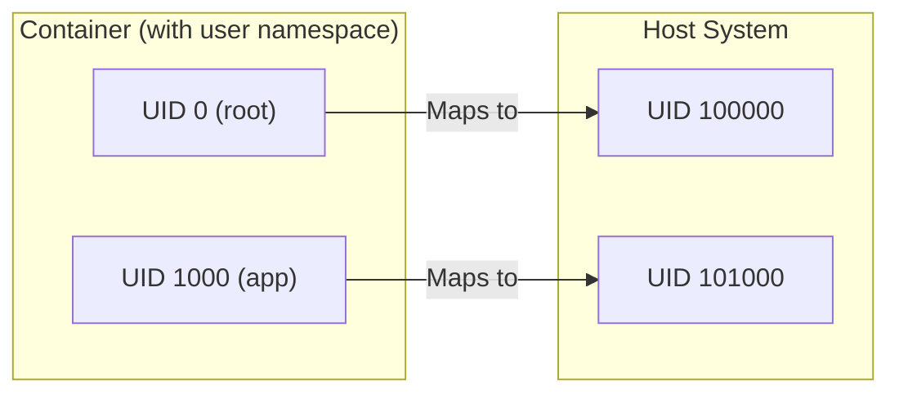

> **Linux Foundations** | Complexity: `[MEDIUM]` | Time: 25-30 min

## Prerequisites

Before starting this module:
- **Required**: [Module 1.3: Filesystem Hierarchy](../module-1.3-filesystem-hierarchy/)
- **Helpful**: Understanding of basic file operations

---

## What You'll Be Able to Do

After this module, you will be able to:
- **Configure** users, groups, and file permissions using chmod, chown, and usermod
- **Design** a permission scheme for a multi-user server with appropriate access controls
- **Debug** "Permission denied" errors by tracing the user → group → permission chain
- **Explain** setuid, setgid, and sticky bits and the security implications of each

---

## Why This Module Matters

Linux is a multi-user system. Every process runs as a user, every file has an owner, and permissions control who can do what.

> **Stop and think**: If a container process runs as UID 1000, and it tries to write to a volume owned by UID 0 with permissions 755, what will happen and why?

Understanding users and permissions is essential because:

- **Container security** — Containers run as users; root in container = dangerous
- **Kubernetes security contexts** — runAsUser, runAsGroup, fsGroup
- **File access** — Why can't my container write to this volume?
- **Least privilege** — Running as root is rarely necessary

When a pod fails with "permission denied" or your container can't read a mounted secret, you need to understand UIDs, GIDs, and permissions.

---

## Did You Know?

- **UID 0 is always root** — regardless of the username. You could rename "root" to "admin" and UID 0 would still have full system access. The kernel doesn't care about names, only numbers.

- **UIDs 1-999 are reserved for system accounts** on most distributions. Human users typically start at UID 1000. This convention helps identify system services vs real users.

- **Kubernetes runs containers as root by default** unless you explicitly set `runAsNonRoot: true` or specify a `runAsUser`. This is a common security mistake.

- **setuid programs are a major attack vector** — Any bug in a setuid root binary is a privilege escalation vulnerability. This is why `ping` no longer requires setuid on modern systems (it uses capabilities instead).

---

## Users and Groups

### User Identification

Every user has:
- **Username** — Human-readable name (nginx, ubuntu, root)
- **UID** — Numeric identifier (what the kernel uses)
- **Home directory** — Default location for user files
- **Default shell** — What runs when they log in

### /etc/passwd — User Database

> **Pause and predict**: If you change the UID of an existing user in `/etc/passwd` from 1000 to 2000, what will happen to the files they previously created?

```bash
cat /etc/passwd | head -5

# Format: username:x:UID:GID:comment:home:shell
root:x:0:0:root:/root:/bin/bash
daemon:x:1:1:daemon:/usr/sbin:/usr/sbin/nologin
nobody:x:65534:65534:nobody:/nonexistent:/usr/sbin/nologin
ubuntu:x:1000:1000:Ubuntu:/home/ubuntu:/bin/bash
```

| Field | Meaning |
|-------|---------|
| username | Login name |
| x | Password stored in /etc/shadow |
| UID | User ID |
| GID | Primary group ID |
| comment | Full name or description |
| home | Home directory |
| shell | Default shell (nologin = can't login) |

### /etc/shadow — Password Storage

```bash
# Only readable by root
sudo cat /etc/shadow | head -3

# Format: username:password_hash:last_change:min:max:warn:inactive:expire
root:$6$abc...:19000:0:99999:7:::
ubuntu:$6$xyz...:19000:0:99999:7:::
```

The password hash uses format `$algorithm$salt$hash`:
- `$1$` = MD5 (legacy, insecure)
- `$5$` = SHA-256
- `$6$` = SHA-512 (recommended)

### Groups

```bash
cat /etc/group | head -5

# Format: groupname:x:GID:members
root:x:0:
sudo:x:27:ubuntu
docker:x:998:ubuntu
```

```bash
# See your groups
groups

# See groups for any user
groups ubuntu

# All group memberships
id ubuntu
# Output: uid=1000(ubuntu) gid=1000(ubuntu) groups=1000(ubuntu),27(sudo),998(docker)
```

### Special UIDs

| UID | User | Purpose |
|-----|------|---------|
| 0 | root | Superuser, full access |
| 1-999 | System | Service accounts |
| 65534 | nobody | Minimal privilege user |
| 1000+ | Regular | Human users |

### Managing Users and Groups

Now that you understand the concepts, here are the essential commands for managing users and groups. (For advanced options like password aging, account expiry, and skeleton directories, see Module 8.3.)

```bash
# Create a user with home directory and bash shell
sudo useradd -m -s /bin/bash newuser

# Set or change a user's password
sudo passwd newuser

# Add user to a supplementary group (without removing existing groups)
sudo usermod -aG docker newuser

# Change a user's default shell
sudo usermod -s /bin/zsh newuser

# Delete a user and their home directory
sudo userdel -r newuser
```

```bash
# Create a group
sudo groupadd developers

# Delete a group
sudo groupdel developers

# Check a user's UID, GID, and all group memberships
id newuser
# Output: uid=1001(newuser) gid=1001(newuser) groups=1001(newuser),998(docker)

# List just group names
groups newuser
```

> **Key flags to remember**: `useradd -m` creates the home directory, `-s` sets the shell, and `usermod -aG` **appends** to groups. Without `-a`, `usermod -G` **replaces** all supplementary groups — a common and dangerous mistake.

---

## File Permissions

### The Permission Model



### Permission Meanings

> **Stop and think**: Why do directories require the execute (`x`) permission just to list their contents? What happens if a directory has `r--` permissions?

| Permission | For Files | For Directories |
|------------|-----------|-----------------|
| r (read) | View contents | List contents |
| w (write) | Modify contents | Create/delete files |
| x (execute) | Run as program | Enter directory |

### Octal Notation

Each permission has a numeric value:
- r = 4
- w = 2
- x = 1

```
rwx = 4+2+1 = 7
r-x = 4+0+1 = 5
r-- = 4+0+0 = 4

Common patterns:
755 = rwxr-xr-x  (executables, directories)
644 = rw-r--r-- (regular files)
700 = rwx------  (private directories)
600 = rw-------  (private files, like SSH keys)
```

### Viewing Permissions

```bash
ls -la
# Output:
# drwxr-xr-x  2 ubuntu ubuntu 4096 Dec  1 10:00 mydir
# -rw-r--r--  1 ubuntu ubuntu  100 Dec  1 10:00 myfile.txt
# lrwxrwxrwx  1 ubuntu ubuntu   10 Dec  1 10:00 mylink -> myfile.txt

# Type indicators:
# - = regular file
# d = directory
# l = symbolic link
# c = character device
# b = block device
# s = socket
# p = named pipe
```

### Changing Permissions

```bash
# Using octal
chmod 755 script.sh
chmod 600 secrets.txt

# Using symbolic
chmod u+x script.sh       # Add execute for user
chmod g-w file.txt        # Remove write for group
chmod o-rwx private.txt   # Remove all for others
chmod a+r public.txt      # Add read for all

# Recursive
chmod -R 755 directory/
```

### Changing Ownership

```bash
# Change owner
chown ubuntu file.txt

# Change owner and group
chown ubuntu:docker file.txt

# Change just group
chgrp docker file.txt

# Recursive
chown -R ubuntu:ubuntu /home/ubuntu/
```

---

## Special Permissions

### setuid (Set User ID)

> **Pause and predict**: If a binary is owned by root and has the setuid bit set (`-rwsr-xr-x`), and a regular user executes it, what UID will the process run as?

When executed, runs as the file's owner (not the caller).

```
-rwsr-xr-x 1 root root /usr/bin/passwd
    ^
    └── setuid bit (s instead of x)
```

```bash
# Find setuid files
find /usr -perm -4000 -type f 2>/dev/null

# Set setuid (rarely needed)
chmod u+s program
chmod 4755 program
```

### setgid (Set Group ID)

For files: Runs as the file's group.
For directories: New files inherit the directory's group.

```bash
# Set setgid on directory
chmod g+s /shared/
chmod 2775 /shared/

# Verify
ls -ld /shared/
# drwxrwsr-x 2 root developers 4096 Dec 1 /shared/
#       ^
#       └── setgid bit
```

### Sticky Bit

Only file owner (or root) can delete files in the directory.

```bash
# Classic example
ls -ld /tmp
# drwxrwxrwt 10 root root 4096 Dec 1 /tmp
#          ^
#          └── sticky bit (t)

# Set sticky bit
chmod +t /shared/
chmod 1777 /shared/
```

---

## sudo and Privilege Escalation

### How sudo Works



### /etc/sudoers Configuration

> **Stop and think**: Why is it dangerous to allow a user to run `sudo vi` or `sudo awk` without a password in `/etc/sudoers`?

```bash
# View sudoers (NEVER edit directly, use visudo)
sudo cat /etc/sudoers

# Format: who where=(as_who) what
root    ALL=(ALL:ALL) ALL
%sudo   ALL=(ALL:ALL) ALL
ubuntu  ALL=(ALL) NOPASSWD: ALL
nginx   ALL=(root) /usr/sbin/nginx, /bin/systemctl restart nginx
```

| Part | Meaning |
|------|---------|
| who | User or %group |
| where | Hostname (usually ALL) |
| as_who | Can sudo as which users |
| what | Allowed commands |

### sudo Best Practices

```bash
# Run single command as root
sudo apt update

# Run as different user
sudo -u nginx whoami

# Edit with sudo
sudo nano /etc/hosts

# Open root shell (use sparingly!)
sudo -i

# Check what you can sudo
sudo -l
```

---

## PAM Configuration

PAM (Pluggable Authentication Modules) is the framework Linux uses for authentication. Every time someone logs in, runs `sudo`, or changes a password, PAM modules handle it. Understanding PAM is essential for password policies and account lockout on the LFCS.

### How PAM Works

> **Pause and predict**: If you lock yourself out of a server because `pam_faillock` triggered after 5 failed attempts, how does the system know when to let you try again?



### /etc/pam.d/ Structure

Each service has its own config file in `/etc/pam.d/`:

```bash
ls /etc/pam.d/
# common-auth  common-password  login  sshd  sudo  su  ...

# Each file has lines in this format:
# <type>  <control>  <module>  [arguments]
```

| Type | Purpose |
|------|---------|
| auth | Verify identity (password, key, biometric) |
| account | Check if access is allowed (expiry, time, host) |
| password | Manage password changes (complexity, history) |
| session | Setup/teardown after auth (limits, env, logging) |

### Common PAM Modules

| Module | Purpose |
|--------|---------|
| pam_unix | Traditional password authentication (/etc/shadow) |
| pam_faillock | Lock accounts after failed login attempts (replaces pam_tally2) |
| pam_limits | Enforce resource limits from /etc/security/limits.conf |
| pam_pwquality | Enforce password complexity rules |
| pam_securetty | Restrict root login to specific terminals |

### Password Policy with pam_pwquality

```bash
# Install (if not present)
sudo apt install -y libpam-pwquality

# Edit password rules
sudo vi /etc/security/pwquality.conf
```

```
# /etc/security/pwquality.conf
minlen = 12          # Minimum password length
dcredit = -1         # Require at least 1 digit
ucredit = -1         # Require at least 1 uppercase
lcredit = -1         # Require at least 1 lowercase
ocredit = -1         # Require at least 1 special character
maxrepeat = 3        # No more than 3 consecutive identical characters
```

### Account Lockout with pam_faillock

```bash
# Add to /etc/pam.d/common-auth (Debian/Ubuntu) or /etc/pam.d/system-auth (RHEL)
# Lock account after 5 failed attempts for 900 seconds (15 min)
auth    required    pam_faillock.so preauth deny=5 unlock_time=900
auth    required    pam_faillock.so authfail deny=5 unlock_time=900

# View failed attempts
faillock --user username

# Unlock a locked account
sudo faillock --user username --reset
```

### Resource Limits with pam_limits

```bash
# /etc/security/limits.conf
# <domain>  <type>  <item>       <value>
*           soft    nofile       65536
*           hard    nofile       131072
@developers soft    nproc        4096
```

> **Exam tip**: PAM questions on the LFCS often involve setting password policies or locking accounts after failed logins. Know pam_pwquality for complexity and pam_faillock for lockout.

---

## Container Security Context

### Why This Matters for Kubernetes

```yaml
# Pod that runs as root (DANGEROUS!)
apiVersion: v1
kind: Pod
spec:
  containers:
  - name: app
    image: nginx
    # No securityContext = runs as root (UID 0)
```

```yaml
# Pod with proper security context
apiVersion: v1
kind: Pod
spec:
  securityContext:
    runAsUser: 1000        # Run as UID 1000
    runAsGroup: 3000       # Primary group GID 3000
    fsGroup: 2000          # Group for mounted volumes
    runAsNonRoot: true     # Refuse to start if image runs as root
  containers:
  - name: app
    image: nginx
    securityContext:
      allowPrivilegeEscalation: false
      readOnlyRootFilesystem: true
      capabilities:
        drop:
          - ALL
```

### UID Mapping



> **Warning**: Without a user namespace configured, Container UID 0 maps directly to Host UID 0, which is extremely dangerous!

### Common Permission Issues in Kubernetes

```bash
# Volume mounted as root
$ ls -la /data
drwxr-xr-x 2 root root 4096 /data

# Container running as UID 1000
# Can read but not write!

# Solution: fsGroup in securityContext
securityContext:
  fsGroup: 1000  # Volumes will be writable by GID 1000
```

---

## Common Mistakes

| Mistake | Problem | Solution |
|---------|---------|----------|
| Running containers as root | Security vulnerability | Use runAsNonRoot: true |
| 777 permissions | Anyone can modify | Use minimal permissions (755 or 644) |
| Storing passwords in /etc/passwd | Exposed to all users | They go in /etc/shadow (automatic) |
| sudo for everything | Accidents happen, audit trails lost | Use sudo only when necessary |
| Ignoring setuid files | Security risk | Audit setuid files regularly |
| Wrong fsGroup | Volumes not writable | Set fsGroup to container's GID |

---

## Quiz

### Question 1
You are deploying a sensitive configuration script on a shared server. You set the permissions of the script to `750`. A junior developer who is a member of the file's group attempts to modify the script to add a new feature, but gets a "Permission denied" error. However, they can still run the script. Why is this happening based on the `750` permission mode?

<details>
<summary>Show Answer</summary>

The permission mode `750` breaks down into `7` (rwx) for the owner, `5` (r-x) for the group, and `0` (---) for others. The junior developer is in the file's group, so the `5` (read and execute) permissions apply to them. They can read the script and execute it, but they lack the `w` (write) permission, which has a value of `2`. In octal notation, write access for the group would require a `6` (rw-) or `7` (rwx) in the middle digit. Therefore, the system correctly denies their attempt to modify the file while allowing execution.

</details>

### Question 2
Your team deploys a third-party application container to your Kubernetes cluster without specifying a `securityContext`. A vulnerability in the application allows an attacker to execute arbitrary commands inside the container. The attacker then discovers a host volume mounted into the container. What UID does the attacker have, and why is this configuration highly dangerous to the node?

<details>
<summary>Show Answer</summary>

By default, Docker and Kubernetes run container processes as root (UID 0) unless `runAsUser` or `runAsNonRoot: true` is specified. Without user namespace remapping, UID 0 inside the container is exactly the same as UID 0 on the host node. If an attacker gains code execution inside this container, they operate with root privileges. When they access the mounted host volume, they can read, modify, or delete any host files as the host's root user, potentially leading to a complete compromise of the underlying Kubernetes node and the cluster itself.

</details>

### Question 3
You have created a private SSH key file `id_rsa` and need to share it securely with a service account named `deployer`. You run `chmod 600 id_rsa` and then tell the `deployer` user to use the key. The `deployer` user reports they cannot read the file. What command is missing, and why did `chmod` alone not solve the problem?

<details>
<summary>Show Answer</summary>

The missing command is `chown deployer id_rsa` (or `chown deployer:deployer id_rsa`). The `chmod 600` command correctly sets the file permissions so that only the owner can read and write to it (rw-------), stripping all access from the group and others. However, `chmod` only changes *what* actions are permitted, not *who* the owner is. Because you created the file, you are still the owner. To allow the `deployer` user to read it under the `600` permission mask, you must change the file's ownership to `deployer` using the `chown` command.

</details>

### Question 4
You notice that a malicious user is filling up the `/tmp` directory with large files. You decide to write a cleanup script running under your own regular user account to delete these files. However, when your script tries to `rm` the malicious user's files in `/tmp`, it fails with "Operation not permitted", even though `/tmp` has `777` (rwxrwxrwx) permissions. Why can't you delete files in a directory where you have write access?

<details>
<summary>Show Answer</summary>

You cannot delete the files because the `/tmp` directory has the sticky bit set (indicated by the `t` in its `drwxrwxrwt` permissions). Normally, write access to a directory allows you to create, delete, or rename any file within it, regardless of who owns the file. However, when the sticky bit is applied to a directory, the kernel enforces a special restriction: only the file's owner, the directory's owner, or the root user can delete or rename files within it. This is crucial for shared directories like `/tmp` so that users can write their own temporary files without being able to destroy other users' data.

</details>

### Question 5
You deploy a Pod that mounts an AWS EBS volume. For security reasons, you configured the Pod to run as `runAsUser: 1000`. When the application tries to write its database files to the volume mount path `/data`, it crashes with "Permission denied". An investigation reveals that the `/data` directory is owned by `root:root` with `755` permissions. How does adding `fsGroup: 2000` to the Pod's `securityContext` fix this exact issue?

<details>
<summary>Show Answer</summary>

Adding `fsGroup: 2000` instructs Kubernetes to automatically change the group ownership of the mounted volume to GID `2000` before starting the containers. It also adds GID `2000` to the list of supplementary groups for the container's process (which is running as UID `1000`). Once the volume's group ownership is updated, the permissions typically look like `root:2000` with `775` (or similar group-writable permissions). Because the container process now effectively belongs to group `2000`, it gains the necessary write access to the volume, resolving the "Permission denied" error while maintaining a non-root execution context.

</details>

---

## Hands-On Exercise

### Users and Permissions Deep Dive

**Objective**: Master Linux users, groups, and permissions.

**Environment**: Any Linux system where you have sudo access

#### Part 1: User Information

```bash
# 1. Who are you?
whoami
id

# 2. What groups are you in?
groups

# 3. Examine user database
cat /etc/passwd | grep -E "^(root|nobody|$(whoami))"

# 4. Check your entry
grep "^$(whoami)" /etc/passwd
```

**Questions to answer:**
- What's your UID?
- What's your primary GID?
- How many groups are you in?

#### Part 2: Permission Practice

```bash
cd /tmp

# 1. Create test files
echo "public data" > public.txt
echo "private data" > private.txt
echo "#!/bin/bash\necho Hello" > script.sh

# 2. Set permissions
chmod 644 public.txt    # rw-r--r--
chmod 600 private.txt   # rw-------
chmod 755 script.sh     # rwxr-xr-x

# 3. Verify
ls -la public.txt private.txt script.sh

# 4. Test execute permission
./script.sh  # Should work

chmod -x script.sh
./script.sh  # Should fail: Permission denied

# 5. Restore and run
chmod +x script.sh
./script.sh
```

#### Part 3: Ownership

```bash
# 1. Check ownership
ls -la /tmp/*.txt

# 2. Create a file for another user (if possible)
echo "test" > /tmp/testfile.txt
ls -la /tmp/testfile.txt

# 3. Try to change owner (requires sudo)
sudo chown root:root /tmp/testfile.txt
ls -la /tmp/testfile.txt

# 4. Can you still write to it?
echo "more data" >> /tmp/testfile.txt  # Will fail

# 5. Cleanup
sudo rm /tmp/testfile.txt
```

#### Part 4: Special Permissions

```bash
# 1. Find setuid binaries
find /usr/bin -perm -4000 2>/dev/null | head -10

# 2. Examine /tmp (sticky bit)
ls -ld /tmp

# 3. Create a sticky directory
mkdir /tmp/sticky-test
chmod 1777 /tmp/sticky-test
ls -ld /tmp/sticky-test

# 4. Understand setgid for directories
mkdir /tmp/shared-group
chmod 2775 /tmp/shared-group
ls -ld /tmp/shared-group

# Cleanup
rmdir /tmp/sticky-test /tmp/shared-group
```

#### Part 5: sudo Exploration

```bash
# 1. What can you sudo?
sudo -l

# 2. Run command as another user
sudo -u nobody whoami

# 3. Check sudoers (read-only)
sudo cat /etc/sudoers | grep -v "^#" | grep -v "^$" | head -20
```

### Success Criteria

- [ ] Identified your UID, GID, and groups
- [ ] Created files with specific permissions (644, 600, 755)
- [ ] Tested execute permission on a script
- [ ] Found setuid binaries on the system
- [ ] Understood sticky bit on /tmp

---

## Key Takeaways

1. **UIDs are what matter** — The kernel uses numbers, not names

2. **Permission triplet: owner-group-other** — Each has read, write, execute

3. **Directories need x to enter** — Even if you have read permission

4. **Containers should NOT run as root** — Use runAsNonRoot and runAsUser

5. **fsGroup solves volume permissions** — Essential for writable mounts in Kubernetes

---

## What's Next?

You've completed **System Essentials**! In the next section, **Container Primitives**, you'll learn how Linux namespaces and cgroups create the illusion of isolated systems—the foundation of all container technology.

---

## Further Reading

- [Linux Users and Groups](https://wiki.archlinux.org/title/users_and_groups)
- [File Permissions](https://www.linux.com/training-tutorials/understanding-linux-file-permissions/)
- [Kubernetes Security Context](https://kubernetes.io/docs/tasks/configure-pod-container/security-context/)
- [Container Security by Liz Rice](https://www.oreilly.com/library/view/container-security/9781492056690/)