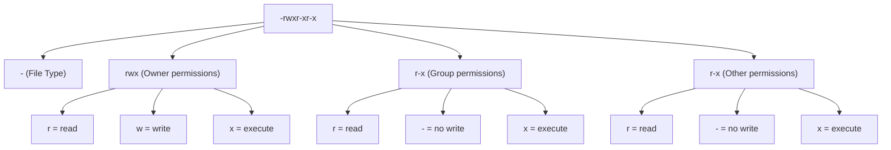
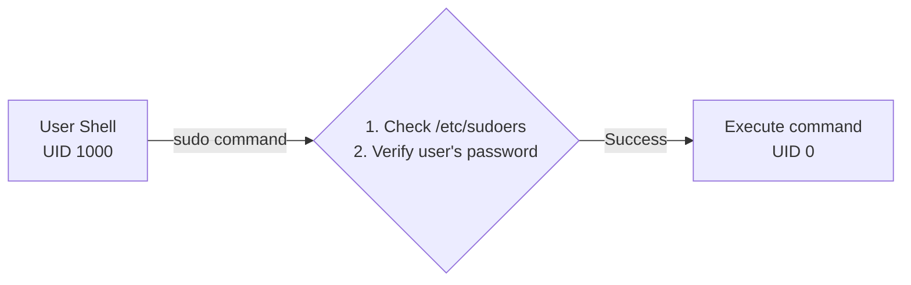
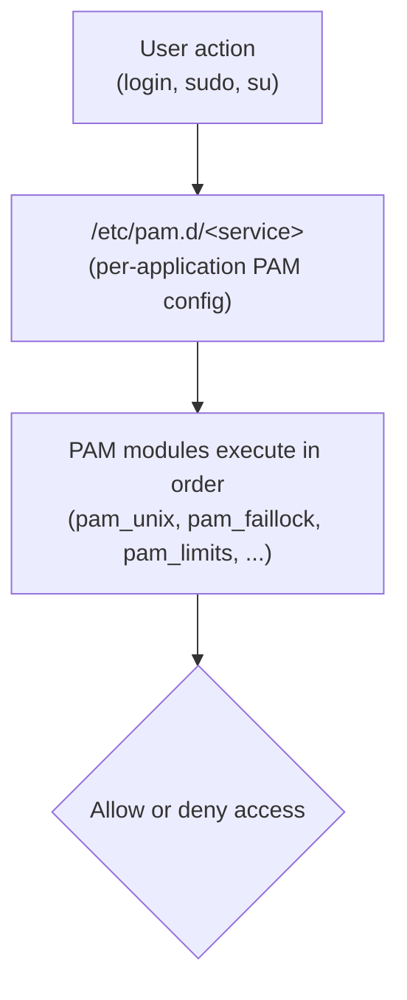
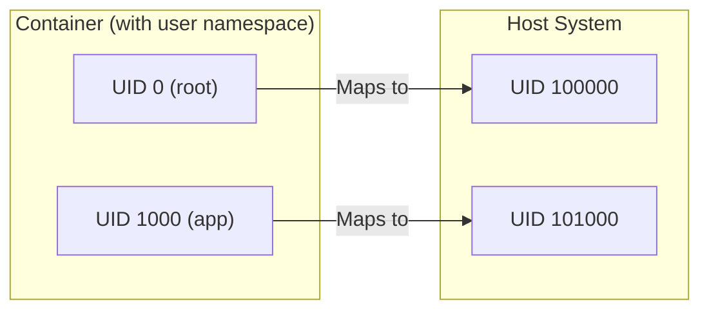
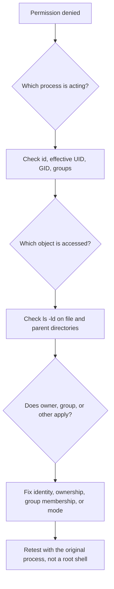

# Module 1.4: Users & Permissions

> **Linux Foundations** | Complexity: `[MEDIUM]` | Time: 25-30 min. This module treats permissions as an operational diagnostic skill, not as a list of commands to memorize.

## Prerequisites

Before starting this module, make sure you can navigate the Linux filesystem, inspect files with `ls`, and run basic shell commands without copying them blindly.

- **Required**: [Module 1.3: Filesystem Hierarchy](../module-1.3-filesystem-hierarchy/)
- **Helpful**: Understanding of basic file operations, shell navigation, and process ownership

## Learning Outcomes

After this module, you will be able to connect Linux identity, file metadata, privilege boundaries, and Kubernetes workload settings into one repeatable troubleshooting method:

- **Configure** Linux users, groups, ownership, and file modes with `useradd`, `usermod`, `chmod`, `chown`, and `chgrp`.
- **Design** least-privilege permission schemes for shared directories, service accounts, sudo rules, and Kubernetes 1.35+ workloads.
- **Diagnose** "Permission denied" failures by tracing the effective UID, primary GID, supplementary groups, directory bits, and mounted volume ownership.
- **Evaluate** special permissions, PAM policy, and container security contexts for operational risk before applying them on production systems.

## Why This Module Matters

In February 2024, a small SaaS company lost most of a business day because a deployment script ran with the wrong user identity on a shared Linux host. The script was supposed to rotate static assets owned by a service account, but it ran from a human administrator's shell after a hurried `sudo -i` session. It changed ownership recursively across the release directory, the web process could no longer read its configuration, and the first symptom was not an elegant error message; it was a customer-facing outage while the team argued over whether the failure belonged to application code, storage, or the deploy pipeline.

That story is common because Linux permissions sit underneath almost every higher-level platform decision. A container that cannot write to a volume, an SSH key rejected as "too open," a backup job that silently skips files, a Pod blocked by `runAsNonRoot`, and a sudo rule that accidentally grants shell escape all reduce to the same chain of facts: which UID is acting, which groups are effective, which object is being accessed, and which permission rule the kernel applies first. When those facts are invisible, teams guess; when they are visible, troubleshooting becomes a short, disciplined investigation.

This module builds that discipline from the bottom up. You will start with the user and group databases, move through ordinary file modes, examine special bits and sudo, connect PAM policy to authentication behavior, and then apply the same mental model to Kubernetes 1.35+ security contexts. The goal is not to memorize octal numbers as trivia. The goal is to look at a failed write, a risky service account, or a shared directory design and explain precisely why the system allows or denies the action.

## Users, Groups, and Kernel Identity

Linux names are for humans, but kernel access checks use numbers. When a process opens a file, the kernel does not ask whether the caller is "ubuntu" or "nginx" in a friendly sense; it compares the process's effective UID and GIDs against the file's owner UID, group GID, and mode bits. That separation is why two machines can both have a user named `app` with different numeric IDs, and why an archive copied between hosts can suddenly look owned by an unfamiliar account. The name is a label attached by local databases, while the number is the durable identity in metadata.

Every login session, system service, cron job, and container entrypoint inherits a user identity. The primary group gives the process one default group, and supplementary groups add extra memberships used for collaborative access. This arrangement gives Linux a compact permission model: a process can be treated as the owner, as a member of the owning group, or as everyone else. The model is old and simple, but it scales surprisingly well when you use service accounts deliberately and reserve privileged groups for narrow operational purposes.

Pause and predict: if a container process runs as UID 1000, and it tries to write to a mounted directory owned by UID 0 and GID 0 with mode `755`, what do you expect the kernel to do? The answer is not "Kubernetes decides" or "Docker decides." Unless a separate mechanism changes ownership or adds a writable group, the process is neither the owner nor a member of the owning group, so it falls into the "other" permission set and has read plus execute, but no write.

The most familiar user database is `/etc/passwd`. Despite the name, modern Linux systems do not store password hashes there because the file is broadly readable. It stores account records that many programs need to resolve names, home directories, login shells, and numeric IDs. When you inspect this file, treat it as a map between human-readable names and kernel-facing identifiers, not as a credential store.

```bash
cat /etc/passwd | head -5

# Format: username:x:UID:GID:comment:home:shell
root:x:0:0:root:/root:/bin/bash
daemon:x:1:1:daemon:/usr/sbin:/usr/sbin/nologin
nobody:x:65534:65534:nobody:/nonexistent:/usr/sbin/nologin
ubuntu:x:1000:1000:Ubuntu:/home/ubuntu:/bin/bash
```

| Field | Meaning |
|-------|---------|
| username | Login name |
| x | Password stored in /etc/shadow |
| UID | User ID |
| GID | Primary group ID |
| comment | Full name or description |
| home | Home directory |
| shell | Default shell (nologin = can't login) |

Changing a UID in `/etc/passwd` is more dangerous than changing a display name because existing files retain numeric ownership. If `ubuntu` changes from UID 1000 to UID 2000, files previously owned by UID 1000 do not magically follow the account; they still carry the old number. On a host where another user later receives UID 1000, those files may appear to belong to the new account. Before running this kind of change, what files would you search for, and which directories would you avoid touching recursively?

Production UID changes should therefore be planned like data migrations rather than cosmetic account edits. Inventory files with `find` by numeric owner, decide whether each path should follow the account or remain with the old identity, and coordinate service restarts so long-running processes do not keep stale identity assumptions. In container environments, this planning also includes image layers and persistent volumes, because a numeric mismatch can survive redeployments even when the username inside the image looks correct.

Password hashes live in `/etc/shadow`, which is readable only by privileged users because password verification needs secrecy around the hash material. The hash entry includes algorithm, salt, and policy fields such as aging and expiry. You should rarely edit this file directly; account tools and PAM-aware password commands exist because a small formatting mistake can lock users out or weaken authentication policy.

```bash
# Only readable by root
sudo cat /etc/shadow | head -3

# Format: username:password_hash:last_change:min:max:warn:inactive:expire
root:$6$abc...:19000:0:99999:7:::
ubuntu:$6$xyz...:19000:0:99999:7:::
```

The password hash uses format `$algorithm$salt$hash`, and recognizing that shape helps you distinguish credential metadata from ordinary account metadata during audits:

- `$1$` = MD5 (legacy, insecure)
- `$5$` = SHA-256
- `$6$` = SHA-512 (recommended)

Groups provide shared access without handing every user the same account. A group can represent a team, a service role, or access to a device such as a container runtime socket. Group membership should be treated as a capability, not as an address book entry, because many groups grant more power than their names suggest. For example, access to a container runtime group can often become root-equivalent on a host, since a user may be able to start a privileged container with host paths mounted.

```bash
cat /etc/group | head -5

# Format: groupname:x:GID:members
root:x:0:
sudo:x:27:ubuntu
docker:x:998:ubuntu
```

The `id` and `groups` commands are the fastest way to stop guessing during permission troubleshooting. `whoami` tells you the current effective username, but `id` shows the numeric UID, primary GID, and supplementary groups that the kernel will evaluate. When a user has just been added to a group, remember that existing login sessions may not pick up the new membership until the user starts a new session.

```bash
# See your groups
groups

# See groups for any user
groups ubuntu

# All group memberships
id ubuntu
# Output: uid=1000(ubuntu) gid=1000(ubuntu) groups=1000(ubuntu),27(sudo),998(docker)
```

| UID | User | Purpose |
|-----|------|---------|
| 0 | root | Superuser, full access |
| 1-999 | System | Service accounts |
| 65534 | nobody | Minimal privilege user |
| 1000+ | Regular | Human users |

UID 0 is special because the kernel treats it as the superuser, regardless of the account name shown in `/etc/passwd`. System accounts usually occupy low numeric ranges so services can own files and run daemons without sharing a human login. The `nobody` account is traditionally used for intentionally minimal privilege, although modern services often create more specific users so logs and file ownership remain meaningful during incident response.

The basic account-management commands are straightforward, but the operational consequences are not. `useradd -m` creates a home directory from skeleton files, `passwd` sets credentials through the configured password stack, and `usermod -aG` appends supplementary groups. The `-a` flag matters because `usermod -G` without append replaces the entire supplementary group set, which is a quick way to remove someone's sudo access or break a service account that depended on a shared group.

```bash
# Create a user with home directory and bash shell
sudo useradd -m -s /bin/bash newuser

# Set or change a user's password
sudo passwd newuser

# Add user to a supplementary group (without removing existing groups)
sudo usermod -aG docker newuser

# Change a user's default shell
sudo usermod -s /bin/zsh newuser

# Delete a user and their home directory
sudo userdel -r newuser
```

Group management deserves the same caution as user management because group ownership can be part of application correctness. A shared release directory might depend on every new file inheriting the `developers` group, and a backup process might depend on membership in a read-only group. Deleting or renaming a group does not rewrite every file on disk; numeric GIDs remain in metadata just like UIDs do.

```bash
# Create a group
sudo groupadd developers

# Delete a group
sudo groupdel developers

# Check a user's UID, GID, and all group memberships
id newuser
# Output: uid=1001(newuser) gid=1001(newuser) groups=1001(newuser),998(docker)

# List just group names
groups newuser
```

A useful working habit is to read identity from the process outward. Ask which process is acting, whether it changed effective identity through sudo or setuid, which groups are actually present in that process, and which file or directory metadata the kernel will compare. This habit prevents a common failure mode in which engineers stare at `chmod` output while ignoring that the process is running as a different user than the deployment guide assumed.

Another habit is to avoid solving account design with one powerful shared login. Shared accounts hide accountability, complicate key rotation, and make it hard to remove one person's access without affecting everyone who uses the account. Named human users with sudo for administrative actions and dedicated service users for automation create cleaner audit trails. They also make incident response faster because file ownership and logs point to a role or person instead of a vague bucket account.

## File Modes, Ownership, and the Permission Decision

File permissions combine ownership with three permission triplets. The first triplet applies when the process UID matches the file owner, the second applies when any effective group matches the file group, and the third applies to everyone else. Linux does not add the owner, group, and other permissions together for a single access check; it selects the applicable class and evaluates that class. This is why a file can be readable by "other" while a group member is denied by a more restrictive group bit in some edge cases.



The execute bit means different things for files and directories, which is one of the first permission details that surprises new operators. On a regular file, execute allows the kernel to run it as a program or script when the format is valid. On a directory, execute means search or traverse; without it, a process cannot enter the directory or resolve names below it, even if read permission would otherwise reveal a listing.

| Permission | For Files | For Directories |
|------------|-----------|-----------------|
| r (read) | View contents | List contents |
| w (write) | Modify contents | Create/delete files |
| x (execute) | Run as program | Enter directory |

Stop and think: why can a directory with read but no execute feel broken even though `r` sounds like enough to list it? Directory read permission allows reading the directory entries, but execute permission allows using those entries as path components. In practice, useful directory access usually needs execute, and many shared directory designs use `rwx` for collaborators or at least `--x` for traversal-only paths.

Octal notation is just a compact sum of the three bits for each class. Read is 4, write is 2, and execute is 1, so `755` means owner `7`, group `5`, and other `5`. The notation is terse enough to be dangerous when used mechanically, so always translate it back to the human meaning before applying it recursively.

```text
rwx = 4+2+1 = 7
r-x = 4+0+1 = 5
r-- = 4+0+0 = 4

Common patterns:
755 = rwxr-xr-x  (executables, directories)
644 = rw-r--r-- (regular files)
700 = rwx------  (private directories)
600 = rw-------  (private files, like SSH keys)
```

The long format from `ls -la` is the main field report for permission work. It shows the file type, mode bits, link count, owner, group, size, timestamp, and name. For a permission incident, the owner and group are as important as the mode. A file with `600` is correct for a private SSH key only when the intended account is the owner; otherwise it is perfectly secure and completely unusable by the account that needs it.

```bash
ls -la
# Output:
# drwxr-xr-x  2 ubuntu ubuntu 4096 Dec  1 10:00 mydir
# -rw-r--r--  1 ubuntu ubuntu  100 Dec  1 10:00 myfile.txt
# lrwxrwxrwx  1 ubuntu ubuntu   10 Dec  1 10:00 mylink -> myfile.txt

# Type indicators:
# - = regular file
# d = directory
# l = symbolic link
# c = character device
# b = block device
# s = socket
# p = named pipe
```

Use `chmod` to change mode bits, and choose symbolic notation when the intent is relative. `chmod g-w file.txt` communicates "remove group write" without caring what the other bits currently are, while `chmod 644 file.txt` declares the entire target state. Both styles are useful, but recursive octal changes deserve extra review because they can accidentally make private files readable or remove execute from directories.

```bash
chmod 755 script.sh
chmod 600 secrets.txt

# Using symbolic
chmod u+x script.sh       # Add execute for user
chmod g-w file.txt        # Remove write for group
chmod o-rwx private.txt   # Remove all for others
chmod a+r public.txt      # Add read for all

# Recursive
chmod -R 755 directory/
```

Ownership changes use `chown` for owner and optionally group, and `chgrp` when only the group should change. These commands are powerful because they alter which permission triplet applies. A support engineer who cannot write to a file may not need broader permissions at all; the file may simply need to be owned by the correct service account or assigned to the shared group that already has write access.

```bash
# Change owner
chown ubuntu file.txt

# Change owner and group
chown ubuntu:docker file.txt

# Change just group
chgrp docker file.txt

# Recursive
chown -R ubuntu:ubuntu /home/ubuntu/
```

A worked example shows the troubleshooting rhythm. Suppose `/srv/reports/output.csv` is owned by `root:reports` with mode `664`, and a job running as `analytics` cannot append to it. You would check `id analytics`, confirm whether `reports` appears in the supplementary groups, inspect the parent directory execute bits, and only then choose a fix. If the group is missing, adding membership may be safer than making the file world-writable; if the directory lacks execute, changing the file mode will not help.

Parent directories are a frequent source of false conclusions because engineers often inspect only the final file. A readable file under `/srv/private/reports` is still unreachable if `/srv/private` lacks execute permission for the acting user or group. When debugging a deep path, walk from the root of the path toward the target and inspect each directory with `ls -ld`. The first directory that denies search permission is the real blocker, even if the final file's mode looks perfect.

This same rhythm matters for Kubernetes volumes because mounted paths are still directories with owners and groups. When an application runs as a non-root UID and receives a volume owned by root, the Linux permission model has not been suspended just because YAML created the mount. You must either make the image and volume ownership agree, use a group-based design such as `fsGroup`, or initialize the volume with a controlled ownership change.

## Special Permissions and Shared Directory Behavior

The ordinary read, write, and execute bits are enough for many systems, but Linux also has special mode bits that change execution or directory behavior. These bits are powerful because they let a file or directory participate in privilege transitions and group inheritance. They are also easy to misunderstand because the same visual position can show `s`, `S`, `t`, or `T` depending on whether the underlying execute bit is present.

The setuid bit makes an executable run with the file owner's effective UID rather than the caller's UID. That behavior exists so carefully written programs can perform narrow privileged operations for ordinary users. The classic example is `passwd`, which must update protected password data but should not give every user a root shell. A setuid program is therefore a controlled crossing point, and bugs in such programs are serious because they may become privilege escalation vulnerabilities.

Pause and predict: if a binary is owned by root and has the setuid bit set as `-rwsr-xr-x`, and a regular user executes it, which UID will the process use while it runs? The effective UID becomes the file owner, so in this case the process runs with root privileges for permission checks. That does not make the caller root everywhere, but it does mean the program's input handling, environment handling, and file access must be designed defensively.

```text
-rwsr-xr-x 1 root root /usr/bin/passwd
    ^
    |__ setuid bit (s instead of x)
```

```bash
# Find setuid files
find /usr -perm -4000 -type f 2>/dev/null

# Set setuid (rarely needed)
chmod u+s program
chmod 4755 program
```

The setgid bit behaves differently on files and directories. On an executable file, it makes the process run with the file group's effective GID, which is less common in modern application design. On a directory, it is extremely useful: new files and subdirectories inherit the directory's group instead of the creator's primary group. That inheritance is the clean way to keep a shared project tree owned by `developers` even when different users create files inside it.

```bash
# Set setgid on directory
chmod g+s /shared/
chmod 2775 /shared/

# Verify
ls -ld /shared/
# drwxrwsr-x 2 root developers 4096 Dec 1 /shared/
#       ^
#       |__ setgid bit
```

The sticky bit protects shared writable directories from becoming deletion free-for-alls. Directory write permission normally allows creating, deleting, and renaming entries in that directory, even if the file itself belongs to someone else. With the sticky bit, only the file owner, directory owner, or root can delete or rename an entry. This is why `/tmp` can be writable by everyone without allowing every user to remove every other user's temporary files.

```bash
# Classic example
ls -ld /tmp
# drwxrwxrwt 10 root root 4096 Dec 1 /tmp
#          ^
#          |__ sticky bit (t)

# Set sticky bit
chmod +t /shared/
chmod 1777 /shared/
```

A practical shared-directory design often combines ordinary permissions with setgid and, when appropriate, the sticky bit. For a team dropbox where everyone may create files but should not delete other people's uploads, `1770` or `1775` with a shared group may be appropriate. For a collaborative source tree where members should edit each other's files, setgid plus a cooperative umask is usually better. The correct answer depends on whether collaboration or isolation is the stronger requirement.

Special bits should appear in security review notes because they change the assumptions of ordinary permission reading. A setuid root binary found in an unexpected location deserves immediate investigation, while a setgid project directory may be a normal collaboration mechanism. The difference is intent, ownership, path, and whether the behavior is documented. Treat `find / -perm -4000` and `find / -perm -2000` as audit tools, not as commands to run and ignore.

When you review special permissions, pair the bit with the file's writability. A setuid binary owned by root is dangerous enough, but a setuid binary that an untrusted user can modify is an emergency because the user can change what privileged code will run. The same reasoning applies to directories: a setgid directory is helpful when group membership is controlled, but it becomes confusing when many unrelated users can create files there with inherited group ownership and inconsistent umasks.

## sudo, PAM, and Privilege Boundaries

Root access is not only a user account; it is also a boundary that administrators cross for specific operations. `sudo` exists to make that crossing auditable and policy-driven. Instead of sharing the root password, a system can allow named users or groups to run selected commands as root or as another account, optionally after password verification. That model is only as strong as the sudoers rules, because a broad rule can turn a single permitted command into a general shell.



The sudoers file should be edited with `visudo` because syntax errors can block administrative access. A rule answers four questions: who may run something, on which host, as which target user or group, and which commands are allowed. `%sudo ALL=(ALL:ALL) ALL` is convenient for administrator groups, but service accounts deserve narrower rules. If an automation user only needs to reload nginx, grant that exact command path rather than broad root access.

```bash
# View sudoers (NEVER edit directly, use visudo)
sudo cat /etc/sudoers

# Format: who where=(as_who) what
root    ALL=(ALL:ALL) ALL
%sudo   ALL=(ALL:ALL) ALL
ubuntu  ALL=(ALL) NOPASSWD: ALL
nginx   ALL=(root) /usr/sbin/nginx, /bin/systemctl restart nginx
```

| Part | Meaning |
|------|---------|
| who | User or %group |
| where | Hostname (usually ALL) |
| as_who | Can sudo as which users |
| what | Allowed commands |

Stop and think: why is it dangerous to allow a user to run `sudo vi` or `sudo awk` without a password in `/etc/sudoers`? Many interactive tools can launch shells, read arbitrary files, or write to privileged paths. A sudo rule that appears to permit one editor may actually permit general root command execution, so the safer design is to use purpose-built commands, restricted arguments, or a root-owned helper script with careful input validation.

```bash
# Run single command as root
sudo apt update

# Run as different user
sudo -u nginx whoami

# Edit with sudo
sudo nano /etc/hosts

# Open root shell (use sparingly!)
sudo -i

# Check what you can sudo
sudo -l
```

PAM, the Pluggable Authentication Modules framework, is the policy engine behind many login and privilege workflows. When someone logs in, runs `sudo`, changes a password, or starts a service that uses PAM, the service-specific file in `/etc/pam.d/` determines which modules run and in what order. This lets distributions and administrators combine password verification, account expiry, lockout, resource limits, and session setup without every application implementing those features alone.



PAM configuration is powerful enough to lock out administrators, so changes should be tested from a second session before closing the first one. The line type says which phase the module participates in: authentication, account checks, password changes, or session setup. The control field decides how success or failure affects the stack, and a small control mistake can turn a required check into an ignored one.

```bash
ls /etc/pam.d/
# common-auth  common-password  login  sshd  sudo  su  ...

# Each file has lines in this format:
# <type>  <control>  <module>  [arguments]
```

| Type | Purpose |
|------|---------|
| auth | Verify identity (password, key, biometric) |
| account | Check if access is allowed (expiry, time, host) |
| password | Manage password changes (complexity, history) |
| session | Setup/teardown after auth (limits, env, logging) |

Common PAM modules map directly to operational policies. `pam_unix` handles traditional local password authentication, `pam_faillock` records failed attempts and enforces lockouts, `pam_pwquality` checks password complexity, and `pam_limits` applies resource limits from configuration. These modules are not abstract exam topics; they are the reason one user can log in, another gets locked out, and a third hits a maximum process limit after authentication succeeds.

| Module | Purpose |
|--------|---------|
| pam_unix | Traditional password authentication (/etc/shadow) |
| pam_faillock | Lock accounts after failed login attempts (replaces pam_tally2) |
| pam_limits | Enforce resource limits from /etc/security/limits.conf |
| pam_pwquality | Enforce password complexity rules |
| pam_securetty | Restrict root login to specific terminals |

Password policy through `pam_pwquality` is a good example of why policy belongs in the authentication stack. Applications should not each invent their own password rules for local accounts. Central policy gives administrators one place to set minimum length, character class requirements, and repetition limits, although modern security guidance also values password length and checks against known compromised passwords more than rigid complexity theater.

```bash
# Install (if not present)
sudo apt install -y libpam-pwquality

# Edit password rules
sudo vi /etc/security/pwquality.conf
```

```text
# /etc/security/pwquality.conf
minlen = 12          # Minimum password length
dcredit = -1         # Require at least 1 digit
ucredit = -1         # Require at least 1 uppercase
lcredit = -1         # Require at least 1 lowercase
ocredit = -1         # Require at least 1 special character
maxrepeat = 3        # No more than 3 consecutive identical characters
```

Account lockout with `pam_faillock` reduces brute-force risk but can create denial-of-service risk if thresholds are too aggressive. A public SSH host with password authentication enabled needs different tuning from a private bastion that already requires hardware-backed keys. Before enabling lockout, decide how administrators will recover access, how monitoring will surface lockout spikes, and whether service accounts should be exempt because they cannot answer an interactive password prompt anyway.

```bash
# Add to /etc/pam.d/common-auth (Debian/Ubuntu) or /etc/pam.d/system-auth (RHEL)
# Lock account after 5 failed attempts for 900 seconds (15 min)
auth    required    pam_faillock.so preauth deny=5 unlock_time=900
auth    required    pam_faillock.so authfail deny=5 unlock_time=900

# View failed attempts
faillock --user username

# Unlock a locked account
sudo faillock --user username --reset
```

Resource limits belong in this lesson because successful authentication does not mean unlimited resource use. `pam_limits` can cap open files, process counts, and related limits at session start, which can protect shared systems from accidental exhaustion. Limits are not a substitute for cgroups or Kubernetes resource controls, but they remain useful on multi-user Linux hosts and bastions where many shells share the same operating system.

```text
# /etc/security/limits.conf
# <domain>  <type>  <item>       <value>
*           soft    nofile       65536
*           hard    nofile       131072
@developers soft    nproc        4096
```

## Container and Kubernetes Permission Boundaries

Containers reuse the Linux permission model; they do not replace it. A container image may define a default user, the runtime may override that user, and Kubernetes may add a Pod or container security context, but the running process still has a UID, a primary GID, supplementary groups, and file mode checks. The confusing part is that image authors, platform engineers, and storage provisioners may each control a different piece of the final identity and filesystem state.

Kubernetes 1.35+ lets you express important identity decisions in `securityContext`. In this module, the first `kubectl` command you should configure in your shell is the standard shorthand `alias k=kubectl`; later examples and cluster work can use `k auth can-i` or `k get pod` after that alias is set. The alias is only a typing shortcut, but writing it consistently keeps your operational notes close to common cluster practice.

```yaml
# Pod that runs as root (DANGEROUS!)
apiVersion: v1
kind: Pod
spec:
  containers:
  - name: app
    image: nginx
    # No securityContext = runs as root (UID 0)
```

Running as root inside a container is risky because root has broad power inside the container and may interact badly with mounted host paths, kernel interfaces, or runtime vulnerabilities. The safer baseline is to require non-root execution, drop Linux capabilities, disable privilege escalation, and make the root filesystem read-only when the application supports it. Those settings do not make a workload invulnerable, but they remove common escalation paths and force the application to declare which writable paths it really needs.

```yaml
# Pod with proper security context
apiVersion: v1
kind: Pod
spec:
  securityContext:
    runAsUser: 1000        # Run as UID 1000
    runAsGroup: 3000       # Primary group GID 3000
    fsGroup: 2000          # Group for mounted volumes
    runAsNonRoot: true     # Refuse to start if image runs as root
  containers:
  - name: app
    image: nginx
    securityContext:
      allowPrivilegeEscalation: false
      readOnlyRootFilesystem: true
      capabilities:
        drop:
          - ALL
```

User namespaces add another layer by mapping container UIDs to different host UIDs. With a user namespace, container UID 0 can map to an unprivileged host UID range, reducing the blast radius if a process escapes part of its container boundary. Without that mapping, UID 0 inside the container may correspond directly to UID 0 on the host for mounted resources, which is why old "root in a container is fine" assumptions age badly in real clusters.



Volume permissions are the place where Linux fundamentals most often reappear in Kubernetes incidents. A Pod can run as UID 1000 and still receive a mounted path owned by `root:root` with mode `755`. The application can traverse and read some content, but it cannot create files. Setting `fsGroup` asks Kubernetes to make the mounted volume accessible to a group and to include that group in the container process's supplementary groups, although exact behavior can vary by volume type and driver.

```bash
# Volume mounted as root
$ ls -la /data
drwxr-xr-x 2 root root 4096 /data

# Container running as UID 1000
# Can read but not write!

# Solution: fsGroup in securityContext
securityContext:
  fsGroup: 1000  # Volumes will be writable by GID 1000
```

The right container fix depends on whether the mismatch comes from the image, the manifest, or the storage layer. If the image writes to `/var/cache/app` but that path is root-owned, fix the image by creating the directory and assigning ownership during build. If the volume is provisioned externally and shared across replicas, use a stable group model or an initialization step with narrow privileges. If the application only needs a temporary scratch path, mount an `emptyDir` with the expected security context rather than weakening the whole container.

There is also a difference between making a container non-root and making it least privilege. A process can run as UID 1000 and still have dangerous Linux capabilities, writable service-account tokens, or access to sensitive host mounts. Start with non-root identity because it removes a large class of mistakes, then continue the review through capabilities, privilege escalation, filesystem mutability, and Kubernetes RBAC. Permissions are one layer in a defense model, not the whole model by themselves.

A practical cluster investigation starts with both Kubernetes and Linux evidence. Use `k get pod` and `k describe pod` to confirm the declared security context, then inspect the running process identity with an exec session if policy allows it. Inside the container, `id`, `ls -ld`, and a small write test will usually reveal the mismatch. The important habit is to connect the manifest field back to UID, GID, and mode bits instead of treating YAML as a separate permission universe.

## Patterns & Anti-Patterns

Pattern: design around service accounts rather than shared human accounts. A service account gives a process a stable UID, a narrow home directory, predictable ownership, and logs that identify which workload acted. This pattern works well for daemons, scheduled jobs, deploy hooks, and backup tasks because it separates operational identity from the person who triggered the work. It also makes later migration into containers easier because the image can run with the same numeric user model.

Pattern: use groups for collaboration, and combine them with setgid directories when new files must stay inside the collaboration boundary. This approach is better than repeatedly running recursive `chown` after every deploy because it makes inheritance part of the directory behavior. Scaling still requires care: large organizations should document group purpose, review membership, and avoid using powerful groups such as `sudo` or container runtime groups as convenience buckets.

Pattern: make Kubernetes security contexts explicit, even when the image already appears to run as non-root. Explicit `runAsNonRoot`, `runAsUser`, `runAsGroup`, and `fsGroup` values turn image assumptions into reviewable platform policy. They also help admission controls and security scanners reason about the workload. The tradeoff is that images with hard-coded root-owned paths may need rebuilding, which is usually the correct pressure to apply.

Anti-pattern: using `chmod 777` as a debugging step and leaving it in place. Teams fall into this because it quickly distinguishes "permission problem" from other failures, but it destroys the evidence needed to choose a least-privilege fix and may expose data to unrelated users or processes. A safer temporary test is to change one dimension at a time, record the result, and revert immediately while designing the real ownership or group correction.

Anti-pattern: granting broad passwordless sudo to automation because one command failed during a deploy. This looks efficient during an outage, but it creates a permanent privilege path that may outlive the incident by years. The better alternative is to identify the exact privileged action, write a constrained sudoers rule or root-owned helper, and log its use. If the command can spawn a shell or edit arbitrary files, it is not constrained enough.

Anti-pattern: fixing Kubernetes volume writes with an always-root init container without asking why the ownership is wrong. Sometimes an init container is the pragmatic answer, especially for legacy storage, but it should be a documented compatibility bridge rather than the default reflex. Prefer image ownership fixes, `fsGroup`, storage-class behavior, or application configuration first. A privileged recursive ownership change over a large volume can be slow, risky, and hard to reason about during recovery.

## Decision Framework

When a permission problem appears, decide which layer owns the mismatch before changing anything. If a process is acting as the wrong identity, fix the service unit, login session, sudo invocation, or Kubernetes security context. If the object belongs to the wrong owner or group, fix ownership with the smallest scope possible. If the mode bits deny the intended class, adjust permissions without broadening unrelated classes. If policy denies authentication or session setup, inspect PAM or sudoers rather than changing file modes.



Use ownership changes when the wrong account owns a file that should clearly belong to another account. Use group changes when multiple accounts need the same access and membership can be reviewed. Use mode changes when the owner and group are already correct but the allowed actions are too narrow. Use sudo only when the operation genuinely requires elevated privilege, and prefer a narrow command over a root shell. Use Kubernetes `fsGroup` when a non-root workload needs group access to a mounted volume and the storage plugin supports the behavior you expect.

The retest step matters because many engineers accidentally prove only that root can do the operation. If the failing process is a systemd service, retest through the service. If the failing process is a Pod, retest through the same container identity. If the failing process is an SSH session that has not picked up new groups, start a fresh session. A fix is complete only when the original actor can perform the intended action and still cannot perform actions outside its responsibility.

Document the final decision in the same language as the diagnostic chain. "Added `releasebot` to `deploy` because `/srv/app/current` is group-writable and the job runs without that supplementary group" is more useful than "fixed permissions." Good notes preserve the identity, object, rule, and verification result, which gives the next engineer a reusable pattern. Over time, this style also exposes recurring design problems that should be solved in images, service units, or platform policy rather than patched one host at a time.

## Did You Know?

- **UID 0 is always root**: the kernel grants superuser treatment to numeric UID 0, not to the string `root`, so renaming the account does not remove its power.
- **Human users commonly start at UID 1000** on many Linux distributions, while lower ranges are usually reserved for system accounts and packaged services.
- **Kubernetes containers can run as root by default** when neither the image nor the Pod sets a non-root user, so `runAsNonRoot: true` is an important review signal.
- **Modern Linux systems often avoid setuid for tools like ping** by using narrower Linux capabilities, reducing the need for full root-equivalent execution.

## Common Mistakes

| Mistake | Why It Happens | How to Fix It |
|---------|----------------|---------------|
| Running containers as root | The image works locally and no one set a `securityContext`, so the cluster inherits the image default. | Set `runAsNonRoot: true`, choose explicit `runAsUser` and `runAsGroup`, and fix image-owned writable paths. |
| Using `777` permissions | It quickly makes a failing write succeed, which can feel like a valid fix during pressure. | Translate the required access into owner, group, and other classes, then use the narrowest mode that supports the workflow. |
| Assuming `chmod 600` grants access to the intended user | The mode is correct for privacy, but the wrong account still owns the file. | Pair mode changes with `chown` or `chgrp` after verifying the process identity with `id`. |
| Editing `/etc/sudoers` directly | A quick text edit seems harmless until a syntax error blocks future sudo access. | Use `visudo`, keep a second privileged session open, and grant exact commands instead of broad shells. |
| Ignoring parent directory execute bits | The file mode looks readable, but path traversal fails before the file is opened. | Check `ls -ld` on every parent directory and ensure the acting user has search permission along the path. |
| Removing group memberships with `usermod -G` | The append flag is forgotten, so supplementary groups are replaced instead of extended. | Use `usermod -aG group user`, then start a fresh login session and verify with `id user`. |
| Treating `fsGroup` as universal storage magic | Some storage drivers or existing permissions do not behave the way the manifest author expects. | Test the mounted path ownership, read the driver behavior, and choose image ownership, init setup, or storage policy when needed. |

## Quiz

<details><summary>1. A deployment job runs as `releasebot` and cannot write `/srv/app/current/config.yml`, which is owned by `root:deploy` with mode `664`. `id releasebot` does not list `deploy`. What do you change first, and why?</summary>

Add `releasebot` to the `deploy` group with `usermod -aG deploy releasebot`, then restart the job's login or service session so the new group is effective. The file already grants write access to the group, so widening the mode to `666` would expose write access to unrelated users. Changing the owner may be wrong if the file is intentionally root-owned. The failure is an identity and group-membership mismatch, not a file-mode problem.

</details>

<details><summary>2. A developer changes a private key to `chmod 600 id_rsa`, but the `deployer` account still cannot read it. The key was created from the developer's shell. What is missing?</summary>

The file owner is still the developer, so `600` gives read and write access only to the developer's UID. The missing correction is ownership, such as `chown deployer:deployer id_rsa`, assuming the key truly belongs to that service account. `chmod` defines which permission classes can act, while `chown` defines which UID receives the owner class. Both dimensions must match the intended reader.

</details>

<details><summary>3. Your team sets `/tmp/project-drop` to `777`, but one user still cannot delete another user's file inside it because the directory mode displays `drwxrwxrwt`. What is protecting the file?</summary>

The sticky bit is protecting entries in the directory. With ordinary directory write permission, a user can delete or rename entries regardless of file ownership, but the sticky bit restricts deletion to the file owner, directory owner, or root. That behavior is intentional for shared temporary locations. If the team wants collaborative deletion, remove the sticky bit only after confirming that users should be able to remove each other's files.

</details>

<details><summary>4. A sudoers rule allows `backup ALL=(root) NOPASSWD: /usr/bin/vi /etc/backup.conf`. Why is this riskier than it first appears?</summary>

`vi` is an interactive editor with shell escape and file-writing capabilities, so permitting it through sudo can become broader root access than the rule suggests. The user may be able to open other files, run commands, or write privileged paths depending on configuration. A safer design is a constrained helper command or a tightly controlled edit workflow. Sudo rules should permit the operation, not a general-purpose tool that can transform into many operations.

</details>

<details><summary>5. A Kubernetes 1.35+ Pod runs as UID 1000 and mounts `/data`, which appears as `root:root` with mode `755`. The application crashes when creating a file. How can `fsGroup` help, and what should you verify?</summary>

`fsGroup` can make the mounted volume accessible through a group and add that group to the container process's supplementary groups. If the volume becomes group-owned and group-writable, the UID 1000 process can create files without running as root. You should verify the actual ownership and mode inside the container because behavior can vary by volume type and driver. You should also confirm the application is not trying to write somewhere else in a root-owned image path.

</details>

<details><summary>6. After adding a user to the `docker` group, their existing terminal still gets permission denied on the runtime socket. The group file looks correct. What is the likely cause?</summary>

The existing login session probably does not include the new supplementary group list. Group membership is captured when the session starts, so editing `/etc/group` or using `usermod -aG` does not always update already-running shells. The user should start a fresh login session or use an approved method such as `newgrp` when appropriate. Verify with `id` in the same shell that will run the command.

</details>

<details><summary>7. A PAM lockout policy starts blocking a shared administrator account after repeated failed SSH attempts. What operational mistake does this reveal, and how should the team respond?</summary>

The team is depending on a shared administrator account and has not planned lockout recovery. PAM lockout can reduce brute-force risk, but it also creates an availability risk when thresholds, monitoring, and recovery paths are not designed. The team should move toward named accounts with sudo, key-based SSH policy, documented break-glass access, and alerting on failed authentication spikes. Then lockout settings can be tuned without making one shared account a single point of failure.

</details>

## Hands-On Exercise

### Users and Permissions Deep Dive

This exercise turns the model into muscle memory on a Linux system where you have sudo access. Work from a normal shell first, and only use sudo where the task explicitly requires it. The point is to observe how the same operation changes when identity, ownership, and mode bits change, so do not skip the verification commands between steps.

#### Part 1: User Information

Start by recording the identity facts that the kernel will use for access checks. `whoami` is useful, but `id` is the command that gives you the full permission context. When you compare its output to `/etc/passwd` and `/etc/group`, you are connecting the friendly account names to the numeric metadata used on disk.

```bash
# 1. Who are you?
whoami
id

# 2. What groups are you in?
groups

# 3. Examine user database
cat /etc/passwd | grep -E "^(root|nobody|$(whoami))"

# 4. Check your entry
grep "^$(whoami)" /etc/passwd
```

Questions to answer after Part 1, using the exact shell session where you will run the later permission tests:

- What is your UID?
- What is your primary GID?
- How many supplementary groups are active in this shell?

#### Part 2: Permission Practice

Now create ordinary files and make their mode bits visible. The script example shows why execute is separate from read: a shell can read a script as text, but the kernel requires execute permission when you invoke it as `./script.sh`. When the failure appears, read the mode bits before fixing them so the error becomes explainable rather than mysterious.

```bash
cd /tmp

# 1. Create test files
echo "public data" > public.txt
echo "private data" > private.txt
echo "#!/bin/bash\necho Hello" > script.sh

# 2. Set permissions
chmod 644 public.txt    # rw-r--r--
chmod 600 private.txt   # rw-------
chmod 755 script.sh     # rwxr-xr-x

# 3. Verify
ls -la public.txt private.txt script.sh

# 4. Test execute permission
./script.sh  # Should work

chmod -x script.sh
./script.sh  # Should fail: Permission denied

# 5. Restore and run
chmod +x script.sh
./script.sh
```

#### Part 3: Ownership

This part separates mode from ownership. A file can have permissive-looking bits and still be inaccessible for the action you want if the relevant permission class is not the one you expected. After changing the file to `root:root`, test as your regular user and explain which permission class applies.

```bash
# 1. Check ownership
ls -la /tmp/*.txt

# 2. Create a file for another user (if possible)
echo "test" > /tmp/testfile.txt
ls -la /tmp/testfile.txt

# 3. Try to change owner (requires sudo)
sudo chown root:root /tmp/testfile.txt
ls -la /tmp/testfile.txt

# 4. Can you still write to it?
echo "more data" >> /tmp/testfile.txt  # Will fail

# 5. Cleanup
sudo rm /tmp/testfile.txt
```

#### Part 4: Special Permissions

Special bits are easiest to learn by looking at real examples before creating temporary directories yourself. Your system likely has a small set of setuid binaries under `/usr/bin`, and `/tmp` almost certainly has the sticky bit. Create test directories only under `/tmp`, inspect the result, and remove them when you are done.

```bash
# 1. Find setuid binaries
find /usr/bin -perm -4000 2>/dev/null | head -10

# 2. Examine /tmp (sticky bit)
ls -ld /tmp

# 3. Create a sticky directory
mkdir /tmp/sticky-test
chmod 1777 /tmp/sticky-test
ls -ld /tmp/sticky-test

# 4. Understand setgid for directories
mkdir /tmp/shared-group
chmod 2775 /tmp/shared-group
ls -ld /tmp/shared-group

# Cleanup
rmdir /tmp/sticky-test /tmp/shared-group
```

#### Part 5: sudo Exploration

Finish by inspecting privilege escalation from the user's point of view. `sudo -l` is a diagnostic tool because it shows what policy grants to the current account. Running a harmless command as `nobody` also reinforces that sudo can target users other than root, which is useful for service-account testing when you do not want to open a privileged shell.

```bash
# 1. What can you sudo?
sudo -l

# 2. Run command as another user
sudo -u nobody whoami

# 3. Check sudoers (read-only)
sudo cat /etc/sudoers | grep -v "^#" | grep -v "^$" | head -20
```

### Solutions

<details><summary>Solution guide for the lab</summary>

Your `id` output should give one UID, one primary GID, and zero or more supplementary groups. The files in `/tmp` should show `public.txt` as `rw-r--r--`, `private.txt` as `rw-------`, and `script.sh` as executable until you remove the execute bit. After `sudo chown root:root /tmp/testfile.txt`, your regular user should not be able to append because the owner class now belongs to root and the group or other class does not grant write. `/tmp` should display a trailing `t`, and `sudo -l` should show the commands your account may run through sudo.

</details>

### Success Criteria

- [ ] Identified your UID, primary GID, and supplementary groups using `id`.
- [ ] Created files with specific permissions `644`, `600`, and `755`, then explained each mode.
- [ ] Tested execute permission on a script and connected the failure to the missing `x` bit.
- [ ] Changed ownership on a test file and predicted which account could still write.
- [ ] Found setuid binaries and identified the sticky bit on `/tmp`.
- [ ] Reviewed sudo privileges with `sudo -l` without editing sudoers directly.

## Next Module

Next: [Container Primitives](../container-primitives/) shows how namespaces, cgroups, capabilities, and filesystems build container isolation on top of the Linux identity and permission model you practiced here.

## Further Reading

- [Linux Users and Groups](https://wiki.archlinux.org/title/users_and_groups)
- [File Permissions](https://www.linux.com/training-tutorials/understanding-linux-file-permissions/)
- [Kubernetes Security Context](https://kubernetes.io/docs/tasks/configure-pod-container/security-context/)
- [Container Security by Liz Rice](https://www.oreilly.com/library/view/container-security/9781492056690/)
- [Linux passwd(5) manual page](https://man7.org/linux/man-pages/man5/passwd.5.html)
- [Linux shadow(5) manual page](https://man7.org/linux/man-pages/man5/shadow.5.html)
- [Linux chmod(1) manual page](https://man7.org/linux/man-pages/man1/chmod.1.html)
- [Linux chown(1) manual page](https://man7.org/linux/man-pages/man1/chown.1.html)
- [Linux sudoers manual](https://www.sudo.ws/docs/man/sudoers.man/)
- [Linux PAM documentation](https://github.com/linux-pam/linux-pam/tree/master/doc)
- [Kubernetes Pod Security Standards](https://kubernetes.io/docs/concepts/security/pod-security-standards/)
- [Kubernetes Configure a Security Context](https://kubernetes.io/docs/tasks/configure-pod-container/security-context/)
