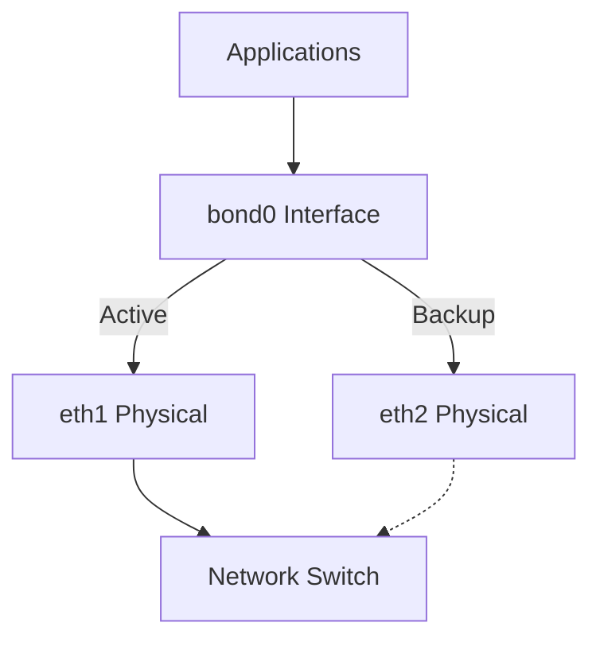
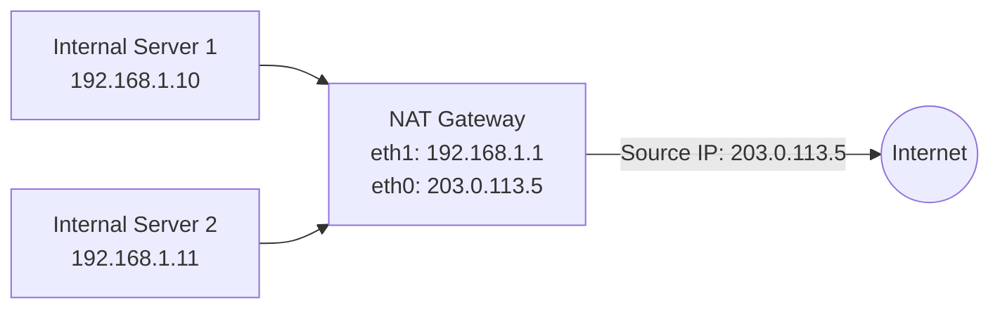

# Module 8.2: Network Administration

> **Operations - LFCS** | Complexity: `[COMPLEX]` | Time: 45-55 min for administrators who already know basic TCP/IP and now need durable host-level operations.

## Prerequisites

Before starting this module, make sure these foundations are fresh enough that you can focus on operational decisions rather than basic packet vocabulary:
- **Required**: [Module 3.1: TCP/IP Essentials](/linux/foundations/networking/module-3.1-tcp-ip-essentials/) for IP addressing, subnets, and routing
- **Required**: [Module 3.4: iptables & netfilter](/linux/foundations/networking/module-3.4-iptables-netfilter/) for packet filtering fundamentals
- **Helpful**: [Module 1.2: Processes & systemd](/linux/foundations/system-essentials/module-1.2-processes-systemd/) for service management

## What You'll Be Able to Do

After this module, you will be able to perform and justify these network administration tasks under realistic maintenance and incident pressure:
- **Configure** network interfaces, routes, and DNS resolution using nmcli and ip commands
- **Secure** SSH access and manage firewall rules with firewalld
- **Implement** network bonding and VLAN tagging for server redundancy
- **Diagnose** network connectivity failures using a systematic approach from link state through DNS and firewall policy

## Why This Module Matters

In October 2021, a major social network disappeared from the internet for several hours after a backbone configuration change removed the routes that told the rest of the world how to reach its DNS systems. Engineers could not simply open a browser, connect through the usual remote tooling, and undo the change, because the failure had damaged the control plane they normally used to reach the machines that could fix it. Public reporting estimated billions of dollars in market value movement and tens of millions in lost advertising revenue, but the operational lesson is even more direct: when network administration fails at the host and routing layer, every higher-level service inherits the blast radius.

A smaller version of that story happens constantly inside ordinary Linux estates. A server receives the correct address but no default route, so local pings succeed while package downloads fail. A firewall rule is added permanently but never loaded into the running ruleset, so the reboot looks correct while live traffic still drops. A password-login hardening change is made before key login is tested, and the only reachable shell disappears. These are not exotic protocol failures; they are routine administration mistakes caused by treating networking as a set of commands instead of a chain of evidence.

This module teaches that chain. You will configure interfaces with NetworkManager, reason about IPv4 and IPv6 addressing, attach routes to persistent connection profiles, build redundant links with bonding, segment traffic with VLANs, synchronize time with chrony, harden SSH, operate firewalld and nftables, enable NAT, and diagnose failures without guessing. When this material shows up beside Kubernetes 1.35+ work, KubeDojo uses the kubectl alias `k`, defined as `alias k=kubectl`; the Linux skill underneath that shortcut is still the same discipline of proving link, address, route, name resolution, policy, and service health in order.

## Persistent Interface Configuration with NetworkManager

Network administration starts with one important distinction: `ip` shows and changes kernel state, while NetworkManager stores intent and replays it when devices appear, services restart, or the machine boots. If you only run `ip addr add` during an incident, you can make a broken host reachable for the moment, but the repair vanishes later. If you change the NetworkManager connection profile with `nmcli`, the operating system has a durable description of the address, gateway, DNS servers, route metrics, and device relationship that should exist every time the interface comes up.

That distinction matters because Linux networking has several layers that can each look partially healthy. A device can be physically connected, have a carrier, and still lack an address. It can have an address and still lack a default route. It can reach an external IP address and still fail every name lookup because DNS points at the wrong resolver. Treat a connection profile like a signed maintenance plan: it should say what the host is supposed to be, not just what happens to be true this minute.

The basic inspection flow should become muscle memory before you change anything. List connection profiles, inspect device state, modify the profile, bring it up, then confirm the kernel learned the resulting addresses and routes. This keeps you from editing the wrong profile on hosts that have renamed interfaces, stale DHCP profiles, bridge ports, bond slaves, or vendor-created cloud-init connections.

```bash
# List connections
nmcli connection show

# Show device status
nmcli device status

# Configure static IPv4
sudo nmcli connection modify "Wired connection 1" \
  ipv4.addresses 192.168.1.100/24 \
  ipv4.gateway 192.168.1.1 \
  ipv4.dns "8.8.8.8 1.1.1.1" \
  ipv4.method manual

# Switch to DHCP
sudo nmcli connection modify "Wired connection 1" \
  ipv4.method auto

# Apply changes
sudo nmcli connection up "Wired connection 1"

# Verify
ip addr show
ip route show
```

Static IPv4 configuration looks simple, but the operational trap is that addresses, gateways, and DNS servers solve different problems. The address and prefix decide what is local. The gateway decides where nonlocal packets go. DNS decides whether human-readable service names become destination addresses at all. If a server can ping another host in `192.168.1.0/24` but cannot reach a public IP, the address is probably not the missing piece; the route table is the first evidence to inspect.

Pause and predict: if your server has an IP address and can reach a neighbor on the same switch, but `ip route show` has no line beginning with `default`, what exactly will happen when the server tries to connect to `8.8.8.8`? Write down whether you expect an ARP request, an ICMP error, or an immediate local routing failure before you test it, because that prediction forces you to separate Layer 2 reachability from Layer 3 forwarding.

IPv6 uses the same habits with different notation and more room for automatic behavior. Router advertisements, link-local addresses, privacy addresses, and DHCPv6 can all create usable-looking state, so do not assume the absence of an IPv4-style gateway line means the host has no path. Inspect `ip -6 addr show` and `ip -6 route show` directly, then decide whether the profile should be fully manual, automatic, or intentionally disabled for a constrained lab.

```bash
# Add static IPv6 address
sudo nmcli connection modify "Wired connection 1" \
  ipv6.addresses "fd00::100/64" \
  ipv6.gateway "fd00::1" \
  ipv6.method manual

# Enable both IPv4 and IPv6
sudo nmcli connection modify "Wired connection 1" \
  ipv4.method manual \
  ipv4.addresses 192.168.1.100/24 \
  ipv6.method manual \
  ipv6.addresses "fd00::100/64"

# Disable IPv6 (if needed)
sudo nmcli connection modify "Wired connection 1" \
  ipv6.method disabled

# Apply
sudo nmcli connection up "Wired connection 1"

# Verify
ip -6 addr show
ip -6 route show
```

Static routes are the difference between "send everything unknown to the default gateway" and "send this destination through a more specific next hop." They are common on jump hosts, lab gateways, storage networks, and segmented enterprise environments where a server must reach a private network through a router that is not its default gateway. Attach the route to the connection profile that owns the source network, because that preserves the relationship between the interface and the next hop.

```bash
# Add a static route
sudo nmcli connection modify "Wired connection 1" \
  +ipv4.routes "10.10.0.0/16 192.168.1.254"

# Add route with metric
sudo nmcli connection modify "Wired connection 1" \
  +ipv4.routes "10.10.0.0/16 192.168.1.254 100"

# Apply
sudo nmcli connection up "Wired connection 1"

# Verify
ip route show
```

A useful worked example is a backup server with one production interface and one storage interface. The default route should stay on production, because software updates, monitoring, and operator SSH sessions arrive there. A static route to `10.10.0.0/16` should point through the storage router, because backup traffic belongs on the storage fabric. If the admin adds a second default route instead, the server may appear to work until return traffic chooses the wrong path, monitoring flaps, or SSH sessions die during a route metric change.

When you review a host after a network change, compare configured intent against observed state. `nmcli connection show` tells you what profiles exist, while `ip addr show` and `ip route show` tell you what the kernel is actually using. That comparison catches stale profiles, typoed interface names, and changes that were written to disk but never activated. It also builds the habit you will reuse in every later section: prove the layer you just changed before moving upward.

## Redundant and Segmented Links with Bonding, Bridges, and VLANs

Single-interface servers are easy to reason about, but production systems often need either redundancy, segmentation, or a Layer 2 attachment point for virtualization. Bonding answers the redundancy question by making several physical links behave like one logical interface. Bridging answers the attachment question by letting virtual machines or containers share a Layer 2 segment. VLAN tagging answers the segmentation question by carrying multiple logical networks across one physical port. The tools overlap, so the design starts with the failure or isolation requirement, not with the command you happen to remember.

Bonding is usually the safest first step for physical server resilience. In active-backup mode, only one link carries traffic at a time, while the other waits as a spare. The bond keeps the logical interface stable as the physical carrier moves, which means applications continue to bind to `bond0` rather than caring whether `eth1` or `eth2` is currently healthy. Throughput-focused modes can be valuable, but they create switch dependencies and hashing behavior that must be designed with the network team.



| Mode | Name | Use Case |
|------|------|----------|
| 0 | balance-rr | Round-robin, increased throughput |
| 1 | active-backup | Failover, one active at a time |
| 2 | balance-xor | Transmit based on hash |
| 4 | 802.3ad (LACP) | Dynamic link aggregation (requires switch support) |
| 6 | balance-alb | Adaptive load balancing |

Mode 1, active-backup, is the most common production choice when the goal is predictable failover with minimal coordination. It does not require the switch to treat two ports as one aggregated channel, so an operating-system administrator can deploy it without waiting for a port-channel change. Mode 4, LACP, can increase aggregate bandwidth and distribute conversations across member links, but it only works correctly when both the server and switch agree on the aggregation group.

```bash
# Create a bond using nmcli
sudo nmcli connection add type bond \
  con-name bond0 \
  ifname bond0 \
  bond.options "mode=active-backup,miimon=100"

# Add slave interfaces to the bond
sudo nmcli connection add type ethernet \
  con-name bond0-slave1 \
  ifname eth1 \
  master bond0

sudo nmcli connection add type ethernet \
  con-name bond0-slave2 \
  ifname eth2 \
  master bond0

# Configure IP on the bond
sudo nmcli connection modify bond0 \
  ipv4.addresses 192.168.1.10/24 \
  ipv4.gateway 192.168.1.1 \
  ipv4.dns "8.8.8.8 8.8.4.4" \
  ipv4.method manual

# Bring up the bond
sudo nmcli connection up bond0

# Verify
cat /proc/net/bonding/bond0
# Shows which slave is active, link status, etc.

# Test failover: bring down one slave
sudo nmcli connection down bond0-slave1
# Traffic continues on bond0-slave2
```

Before running this, what output do you expect in `/proc/net/bonding/bond0` after `bond0-slave1` is brought down? The important fields are not only whether `bond0` exists, but which slave is active, whether MII status is up, and whether the bond driver has recorded a link failure. If your prediction mentions only the logical interface address, you are still looking too high in the stack.

A common war story is the LACP deployment that looked healthy because both Linux interfaces were up and the switch LEDs were green. The team had configured mode 4 on the server, but the switch ports were still independent access ports rather than members of one port channel. Traffic was distributed across links that the switch did not consider a single logical path, causing out-of-order delivery, retransmissions, and intermittent timeouts that looked like an application problem. The fix was a short switch change, but the lesson was larger: link state proves cables, not aggregation semantics.

Bridges solve a different problem. A bridge is a software switch inside the Linux host, and it is most useful when another endpoint needs to appear directly on the same Layer 2 network. Virtual machines use bridges so their virtual NICs can attach to the same broadcast domain as the physical NIC. Containers and hypervisors often create bridges automatically, but LFCS-level administration still expects you to recognize when the host IP belongs on the bridge rather than on the physical port that has become a bridge member.

```bash
# Create a bridge
sudo nmcli connection add type bridge \
  con-name br0 \
  ifname br0

# Add physical interface to bridge
sudo nmcli connection add type ethernet \
  con-name br0-port1 \
  ifname eth1 \
  master br0

# Configure IP on bridge
sudo nmcli connection modify br0 \
  ipv4.addresses 192.168.1.20/24 \
  ipv4.gateway 192.168.1.1 \
  ipv4.method manual

# Bring up
sudo nmcli connection up br0

# Verify
bridge link show
ip addr show br0
```

VLAN tagging is how one physical link can carry several isolated networks without requiring a separate cable for every trust boundary. The tag is a small field in the Ethernet frame that says which logical LAN the frame belongs to. Linux represents that tagged network as an interface such as `eth0.10`, while the switch port must be configured to allow the same VLAN ID on that link. If the server and switch disagree, the Linux configuration can be perfect and the frames will still disappear at the first hop.

```bash
# Create a VLAN interface (VLAN ID 10) on physical interface eth0
sudo nmcli connection add type vlan \
  con-name eth0-vlan10 \
  ifname eth0.10 \
  dev eth0 \
  id 10 \
  ipv4.addresses 10.0.10.50/24 \
  ipv4.method manual

# Bring up the VLAN interface
sudo nmcli connection up eth0-vlan10

# Verify
ip addr show eth0.10
```

Pause and predict: if you configure `eth0.10` correctly on the server but the switch port is not carrying VLAN 10, which checks will pass and which checks will fail? You should expect the Linux interface and address to exist locally, but ARP or neighbor discovery for peers on that VLAN will fail because tagged frames are not being delivered to the matching broadcast domain.

The design sequence for these features is simple even when the topology is not. Decide whether the host needs link failover, virtual-machine attachment, network segmentation, or a combination of those needs. Put the IP address on the logical interface that applications should use, not on a lower-level member that may become subordinate. Then test the failure mode you designed for: unplug the active link in a bond, restart a VM attached to a bridge, or confirm VLAN reachability from a peer on the same tagged segment.

## Time Synchronization and Name Resolution as Network Dependencies

Time synchronization looks like a system administration side quest until it breaks authentication, TLS, logs, and distributed coordination. Kerberos depends on small clock skew. TLS certificate validation depends on the local clock being inside the certificate validity window. Incident response depends on comparing logs from several machines without arguing whether one host was minutes ahead. Network administrators own this because time sync is a network service, and chrony is the modern default on many Linux distributions.

Chrony replaced the older `ntpd` in many environments because it reaches accurate time quickly, handles intermittent connectivity better, and behaves well inside virtual machines where suspend, resume, and host scheduling can create sudden jumps. It can be a client, a local time source, or both. For most servers, the correct goal is modest: choose reliable upstream pools, enable the service, verify tracking, and make sure the timezone is intentional rather than inherited from an image.

```bash
# Install chrony
sudo apt install -y chrony

# Check configuration
cat /etc/chrony/chrony.conf
```

The key configuration in `/etc/chrony/chrony.conf` records upstream pools, drift tracking, optional client access, and startup correction behavior:

```
# NTP servers (pool is preferred — auto-selects nearby servers)
pool ntp.ubuntu.com        iburst maxsources 4
pool 0.ubuntu.pool.ntp.org iburst maxsources 1
pool 1.ubuntu.pool.ntp.org iburst maxsources 1
pool 2.ubuntu.pool.ntp.org iburst maxsources 2

# Record the rate at which the system clock gains/drifts
driftfile /var/lib/chrony/chrony.drift

# Allow NTP clients from local network (if acting as NTP server)
# allow 192.168.1.0/24

# Step the clock if offset is larger than 1 second (first 3 updates)
makestep 1.0 3
```

The `iburst` option is there for operational speed, not decoration. It lets chrony send an initial burst of packets so a newly booted machine can converge quickly instead of waiting through slow polling intervals. The `driftfile` records how the local clock tends to wander, which helps chrony correct smoothly over time. The `allow` directive is commented because acting as a time server expands your responsibility; enable it only when you intend local clients to use this machine.

```bash
# Start and enable
sudo systemctl enable --now chrony

# Check synchronization status
chronyc tracking
# Reference ID    : A9FEA9FE (time.cloudflare.com)
# Stratum         : 3
# Ref time (UTC)  : Sun Mar 22 14:30:00 2026
# System time     : 0.000000123 seconds fast of NTP time
# Last offset     : +0.000000045 seconds

# List NTP sources
chronyc sources -v

# Force immediate sync
sudo chronyc makestep

# Check if chrony is being used
timedatectl
# Look for: NTP service: active
```

Interpreting `chronyc tracking` is more useful than merely checking that the service is active. The stratum tells you how far the source is from a reference clock, the last offset tells you the current correction, and the system time line tells you whether the local clock is fast or slow relative to NTP. A green service with a bad source is still bad time. A service that is active but blocked by a firewall will often show weak or absent source data, which brings you back to the same evidence chain used for every network issue.

```bash
# List timezones
timedatectl list-timezones | grep America

# Set timezone
sudo timedatectl set-timezone UTC

# Verify
timedatectl
date
```

DNS deserves the same treatment. A host can have perfect links, addresses, routes, firewalls, and services, yet fail every user-facing task because name resolution points at a dead resolver or an unreachable split-horizon DNS server. `nmcli` stores DNS servers on connection profiles, and `resolvectl status` shows what systemd-resolved is using at runtime. When `ping 8.8.8.8` works but `ping google.com` fails, the routing path has already given you a clue: stop changing gateways and inspect resolution.

In a production incident, clocks and DNS are often the first systems accused and the last systems checked correctly. Resist both extremes. Do not blame DNS because it is fashionable, and do not ignore it because an IP ping succeeded. Put it in the ordered diagnosis flow: after routes prove that packets can leave, verify that names resolve to the addresses your application actually needs, then test whether policy allows the resulting connection.

## Firewalls, nftables, NAT, and SSH Hardening

Packet filtering is where Linux administrators move from making a host reachable to deciding who is allowed to reach it. Raw iptables and nftables can express almost anything, but production operations usually need safety, readability, and a rollback path as much as raw power. firewalld provides zones, services, runtime changes, permanent changes, and rich rules on top of the kernel packet filtering backend, which lets you test access before committing it across reloads and reboots.

The key mental model is that firewalld has two states. Runtime state is what the kernel is enforcing right now. Permanent state is what firewalld will load later. This split is a safety feature when you are working over SSH: add a runtime rule, test access from another session, then persist only the configuration that worked. It is also a common source of confusion, because `--permanent` does not mean "effective immediately."

```bash
# Install (may already be present)
sudo apt install -y firewalld

# Start and enable
sudo systemctl enable --now firewalld

# Check status
sudo firewall-cmd --state
# running

# Check active zones
sudo firewall-cmd --get-active-zones
# public
#   interfaces: eth0
```

Zones are trust labels applied to interfaces and traffic. A laptop on home Wi-Fi, a server interface on a public network, and an internal storage link should not receive the same incoming policy. Zones make that intent visible, especially when you list a zone and see services, ports, masquerading, forward settings, and rich rules together. The default zone matters because new interfaces often inherit it unless you explicitly assign them elsewhere.

| Zone | Purpose | Default Behavior |
|------|---------|-----------------|
| `drop` | Untrusted networks | Drop all incoming, no reply |
| `block` | Untrusted networks | Reject incoming with ICMP |
| `public` | Public networks (default) | Reject incoming except selected |
| `external` | NAT/masquerading | Masquerade outbound traffic |
| `dmz` | DMZ servers | Limited incoming allowed |
| `work` | Work networks | Trust some services |
| `home` | Home networks | Trust more services |
| `internal` | Internal networks | Similar to work |
| `trusted` | Trust everything | Allow all traffic |

```bash
# List all zones
sudo firewall-cmd --get-zones

# Show default zone
sudo firewall-cmd --get-default-zone
# public

# Change default zone
sudo firewall-cmd --set-default-zone=public

# Assign interface to a zone
sudo firewall-cmd --zone=internal --change-interface=eth1 --permanent
sudo firewall-cmd --reload

# Show zone details
sudo firewall-cmd --zone=public --list-all
```

Services are named rule sets, which makes policy easier to audit than loose port numbers. Allowing `https` communicates intent better than allowing `443/tcp`, even though the effect is similar. Custom ports still belong in the toolbox for internal applications, but be deliberate about naming and documentation because a future operator will have to decide whether that port is still necessary during a hardening review.

```bash
# List available pre-defined services
sudo firewall-cmd --get-services

# List services enabled in current zone
sudo firewall-cmd --list-services
# dhcpv6-client ssh

# Add a service (runtime only — lost on reload)
sudo firewall-cmd --add-service=http
sudo firewall-cmd --add-service=https

# Add a service permanently
sudo firewall-cmd --add-service=http --permanent
sudo firewall-cmd --add-service=https --permanent
sudo firewall-cmd --reload

# Remove a service
sudo firewall-cmd --remove-service=http --permanent
sudo firewall-cmd --reload

# Add a custom port
sudo firewall-cmd --add-port=8080/tcp --permanent
sudo firewall-cmd --add-port=3000-3100/tcp --permanent
sudo firewall-cmd --reload
```

Rich rules are useful when a service-level rule is too broad. You might allow SSH from a management subnet, drop a noisy source, or rate-limit repeated attempts without hand-writing a full nftables ruleset. Keep rich rules targeted and documented because they are easier to overlook than service lists. If a host has many rich rules, that is a signal to review whether the policy belongs in a shared firewall layer instead of being spread across individual machines.

```bash
# Allow SSH only from specific subnet
sudo firewall-cmd --add-rich-rule='rule family="ipv4" source address="192.168.1.0/24" service name="ssh" accept' --permanent

# Block a specific IP
sudo firewall-cmd --add-rich-rule='rule family="ipv4" source address="10.0.0.50" drop' --permanent

# Rate-limit connections (prevent brute force)
sudo firewall-cmd --add-rich-rule='rule family="ipv4" service name="ssh" accept limit value="3/m"' --permanent

# Log and drop traffic from a subnet
sudo firewall-cmd --add-rich-rule='rule family="ipv4" source address="203.0.113.0/24" log prefix="BLOCKED: " level="warning" drop' --permanent

# Apply changes
sudo firewall-cmd --reload

# List rich rules
sudo firewall-cmd --list-rich-rules
```

```bash
# Runtime rule (test it first)
sudo firewall-cmd --add-service=http

# If it works, make it permanent
sudo firewall-cmd --runtime-to-permanent

# Or start over — reload drops runtime-only rules
sudo firewall-cmd --reload

# This workflow prevents lockouts:
# 1. Add rule (runtime)
# 2. Test access
# 3. If good: --runtime-to-permanent
# 4. If bad: --reload to revert
```

Pause and predict: if you add a runtime rich rule that blocks an IP address, then run `sudo firewall-cmd --reload` before making it permanent, what will happen to the block? The answer should follow directly from the two-state model: reload discards runtime-only changes and replaces them with permanent configuration from disk.

nftables is the modern kernel packet filtering framework behind many current Linux firewalls. You do not need to abandon firewalld to understand nftables, but you should recognize the underlying objects: tables group chains, chains attach to hooks such as input or forward, and rules match packet fields before applying verdicts such as accept or drop. That knowledge helps when you are debugging a host where several tools have modified packet policy.

```bash
# Check if nftables is active
sudo nft list ruleset

# List tables
sudo nft list tables

# Create a simple firewall from scratch
sudo nft add table inet filter
sudo nft add chain inet filter input '{ type filter hook input priority 0; policy drop; }'
sudo nft add chain inet filter forward '{ type filter hook forward priority 0; policy drop; }'
sudo nft add chain inet filter output '{ type filter hook output priority 0; policy accept; }'

# Allow established connections
sudo nft add rule inet filter input ct state established,related accept

# Allow loopback
sudo nft add rule inet filter input iifname "lo" accept

# Allow SSH
sudo nft add rule inet filter input tcp dport 22 accept

# Allow ICMP (ping)
sudo nft add rule inet filter input ip protocol icmp accept

# View rules
sudo nft list chain inet filter input

# Save rules persistently
sudo nft list ruleset | sudo tee /etc/nftables.conf
sudo systemctl enable nftables
```

On an LFCS-style Ubuntu system, you may reach for `ufw` or firewalld first, but nftables literacy keeps you from treating the backend as magic. If `firewall-cmd --list-all` looks correct but traffic still behaves strangely, `sudo nft list ruleset` can reveal lower-level rules, generated chains, or another service that installed policy outside the interface you expected. Read it as evidence, not as a reason to mix unmanaged manual rules into a firewalld host casually.

NAT, or Network Address Translation, lets private machines reach outside networks through a gateway. Masquerading is the common dynamic form where outbound packets have their source address rewritten to the gateway address, and connection tracking remembers how replies should be mapped back. This is useful for labs, small office gateways, and internal networks that should not expose every host directly to the internet.



Think of NAT as a front desk for outbound conversations. Internal hosts know their own private addresses, but external services should see the gateway's reachable address. The gateway rewrites the source on the way out and uses connection tracking to deliver replies to the correct internal host. If IP forwarding is disabled, packets can arrive at the gateway and still never cross it, which is why forwarding and firewall masquerade policy must be verified together.

```bash
# Check current status
cat /proc/sys/net/ipv4/ip_forward
# 0 = disabled, 1 = enabled

# Enable temporarily
sudo sysctl -w net.ipv4.ip_forward=1

# Enable permanently
echo "net.ipv4.ip_forward = 1" | sudo tee /etc/sysctl.d/99-ip-forward.conf
sudo sysctl -p /etc/sysctl.d/99-ip-forward.conf
```

```bash
# Enable masquerading on external zone
sudo firewall-cmd --zone=external --add-masquerade --permanent

# Assign external interface to external zone
sudo firewall-cmd --zone=external --change-interface=eth0 --permanent

# Assign internal interface to internal zone
sudo firewall-cmd --zone=internal --change-interface=eth1 --permanent

# Allow forwarding from internal to external
sudo firewall-cmd --zone=internal --add-forward --permanent

sudo firewall-cmd --reload

# Verify masquerading is enabled
sudo firewall-cmd --zone=external --query-masquerade
# yes
```

Port forwarding is the inverse-looking operation that exposes an internal service through a gateway address. It is useful, but it also concentrates risk because an internal service becomes reachable from a less trusted network. Before adding a forward, confirm the service owner, the intended source networks, the logging expectations, and the rollback command. A forwarding rule without a documented owner tends to survive long after the application that needed it is gone.

```bash
# Forward port 8080 on external to internal server 192.168.1.100:80
sudo firewall-cmd --zone=external --add-forward-port=port=8080:proto=tcp:toport=80:toaddr=192.168.1.100 --permanent

sudo firewall-cmd --reload

# Verify
sudo firewall-cmd --zone=external --list-forward-ports
```

SSH hardening belongs in the same section because firewall policy and remote access safety are inseparable. SSH is usually the repair path when something else fails, so every hardening change must preserve a tested administrative path. Key-based authentication, disabled root login, limited users, restricted forwarding, and fail2ban all reduce risk, but applying them in the wrong order can lock out the people who are trying to protect the machine.

```bash
# Generate an SSH key pair (on client machine)
ssh-keygen -t ed25519 -C "admin@company.com"
# Ed25519 is preferred over RSA — shorter, faster, more secure

# Copy public key to server
ssh-copy-id -i ~/.ssh/id_ed25519.pub user@server

# Or manually:
cat ~/.ssh/id_ed25519.pub | ssh user@server "mkdir -p ~/.ssh && chmod 700 ~/.ssh && cat >> ~/.ssh/authorized_keys && chmod 600 ~/.ssh/authorized_keys"

# Test key login
ssh -i ~/.ssh/id_ed25519 user@server
```

Edit `/etc/ssh/sshd_config` deliberately, because every directive below changes either who may authenticate or what a successful SSH session may do:

```bash
# Disable password authentication (key-only)
PasswordAuthentication no

# Disable root login
PermitRootLogin no

# Use only SSH protocol 2
Protocol 2

# Limit to specific users or groups
AllowUsers admin deploy
# Or: AllowGroups sshusers

# Change default port (security through obscurity — helps with noise)
Port 2222

# Disable empty passwords
PermitEmptyPasswords no

# Set idle timeout (disconnect after 5 minutes of inactivity)
ClientAliveInterval 300
ClientAliveCountMax 0

# Limit authentication attempts
MaxAuthTries 3

# Disable X11 forwarding (unless needed)
X11Forwarding no

# Disable TCP forwarding (unless needed)
AllowTcpForwarding no
```

```bash
# Test configuration before restarting
sudo sshd -t
# No output = no errors

# Restart SSH
sudo systemctl restart sshd

# CRITICAL: Test from another terminal BEFORE closing your current session
# If config is wrong, you can still fix it from the existing session
```

The safe order is non-negotiable. Copy the key, test a fresh key-based login, keep the original session open, validate syntax with `sshd -t`, restart the service, and test a second fresh login before closing the first shell. If you change the SSH port, update the firewall in runtime state first and prove the port is reachable, then persist the firewall and service changes. This is one of the few places where careful sequencing is faster than recovery.

```bash
# Install fail2ban
sudo apt install -y fail2ban

# Create local config (never edit jail.conf directly)
sudo cp /etc/fail2ban/jail.conf /etc/fail2ban/jail.local
```

Edit `/etc/fail2ban/jail.local` rather than the vendor default file so package updates do not erase your local ban policy:

```ini
[DEFAULT]
bantime  = 1h
findtime = 10m
maxretry = 5

[sshd]
enabled = true
port    = ssh
logpath = %(sshd_log)s
backend = systemd
maxretry = 3
bantime = 24h
```

```bash
# Start fail2ban
sudo systemctl enable --now fail2ban

# Check status
sudo fail2ban-client status sshd
# Status for the jail: sshd
# |- Filter
# |  |- Currently failed: 0
# |  `- Total failed: 12
# `- Actions
#    |- Currently banned: 2
#    `- Total banned: 5

# Unban an IP
sudo fail2ban-client set sshd unbanip 192.168.1.50

# View banned IPs
sudo fail2ban-client get sshd banned
```

Fail2ban is not a replacement for key authentication or firewall scoping. It is a rate-response layer that watches logs and adds temporary bans when repeated failures match a jail. Use it to reduce brute-force noise and protect exposed SSH, but still prefer management subnets, key-only login, no root login, and audited user access. If a legitimate administrator is banned, the status and unban commands are part of your operational runbook, not an embarrassing exception.

## Systematic Network Diagnosis

When a network connection fails, guessing wastes time because many symptoms overlap. A DNS failure can look like an internet outage to a user. A firewall drop can look like a service crash to an application team. A missing default route can look like a package repository problem. The disciplined response is to move from the bottom of the stack upward, proving each layer before you spend attention on the next one.

The ordered approach is not academic OSI-model theater; it prevents destructive fixes. If the link is down, changing DNS cannot help. If the host has no address, restarting SSH cannot help. If IP reachability works but name resolution fails, opening firewall ports may add risk while leaving the actual failure untouched. Each command below answers a narrow question, and the answer determines the next test.

1. **Link (Layer 1/2)**: Is the cable plugged in? Is the interface up?
   ```bash
   ip link show eth0
   # Look for state UP and NO-CARRIER
   ```
2. **IP Configuration (Layer 3)**: Does the interface have the correct IP and subnet mask?
   ```bash
   ip addr show eth0
   ```
3. **Routing (Layer 3)**: Does the system know how to reach the destination? Is there a default gateway?
   ```bash
   ip route show
   ping -c 4 8.8.8.8  # Test routing to the internet
   ```
4. **DNS (Layer 7)**: Can the system resolve domain names to IP addresses?
   ```bash
   resolvectl status
   dig google.com
   ```
5. **Firewall (Layer 4)**: Is a firewall blocking the traffic locally or remotely?
   ```bash
   sudo firewall-cmd --list-all
   telnet destination_ip port  # Test if the port is open
   ```

Here is a worked example. A developer says a new host cannot clone from a Git server by hostname. You check `ip link show eth0` and see the interface is up with carrier. `ip addr show eth0` shows the expected address and prefix. `ip route show` includes a default route, and `ping -c 4 8.8.8.8` succeeds, proving general outbound routing. `resolvectl status` then shows the profile still points at a retired DNS server, which explains why the hostname fails while the network path itself is healthy.

Which approach would you choose here and why: immediately edit `/etc/resolv.conf`, change the NetworkManager profile DNS setting, or ask the developer to use the Git server IP address? The durable fix is the profile change, because direct edits to resolver files are often overwritten and IP-based workarounds bypass the name-resolution system that other applications still need.

The same pattern works in reverse for inbound services. If a user can ping a server but cannot connect to SSH, link, addressing, and basic routing are already mostly proven. Move to local policy and service state: list the firewalld zone, test whether the port is listening, inspect SSH configuration, and check logs for authentication or authorization failures. Do not rebuild the network profile when the evidence says packets already arrive.

Good incident notes mirror this diagnostic sequence. Record the symptom, the layer tested, the command used, the observed result, and the conclusion. That makes the next engineer faster and protects you from circular troubleshooting where the same hypothesis is rediscovered every half hour. Network administration is as much about preserving evidence as it is about knowing commands.

In real outages, start by defining the failing conversation as a five-part tuple: source host, source address if known, destination name or address, destination port or protocol, and the expected direction of initiation. "The app is down" is not a network symptom yet. "Host `web-01` cannot establish TCP to `db-01` on port 5432 while `web-02` can" is a symptom you can test. That precision prevents a broad firewall change from masking a single bad route, stale DNS answer, or service binding error.

Next, compare one failing path with one working path. If two hosts share the same subnet and gateway but only one fails, the common network infrastructure is less likely than host-local state. If every host behind one gateway fails, the gateway, upstream route, firewall zone, or NAT state becomes more interesting. This comparison is powerful because it reduces the number of plausible layers without requiring privileged access to every device. Good network diagnosis is often the art of choosing the most informative contrast.

When packet loss or intermittent behavior appears, separate reachability from quality. A single successful ping proves very little about sustained TCP behavior, and a failed ping may be blocked by policy while the application port works. Use repeated tests, check interface error counters when available, and inspect bond status if redundant links are involved. If failures correlate with a specific interface, VLAN, or bond slave, you have evidence for a physical or Layer 2 problem. If failures correlate with destination names, DNS or load-balancer answers may be the better lead.

For inbound service failures, confirm where the service is listening before changing firewall policy. A process bound only to `127.0.0.1` will reject remote clients no matter how permissive firewalld becomes, because the application is not listening on the external address. A service listening on IPv6 only may surprise an IPv4 client, and a service listening on a custom port must match both the application configuration and the firewall rule. This is why `ss`, service logs, and firewall inspection belong together in a complete diagnosis.

For outbound failures through a gateway, remember that return traffic matters as much as the first packet. The internal host needs a route to the gateway, the gateway needs forwarding enabled, masquerade or routing policy must be correct, the upstream network must accept the translated source or routed prefix, and replies must map back through connection tracking. If any one of those assumptions is false, the initiating host may report a timeout that looks identical to several other failures. Draw the path on paper if the environment has more than two interfaces.

Avoid changing multiple layers at once during an incident unless the system is already down and you have an explicit rollback plan. If you change DNS, firewall policy, and route metrics in the same minute, the next test cannot tell you which change mattered. Make one change, test the exact failing conversation, and record the result. This slower-looking method is usually faster because it produces a defensible fix instead of a lucky recovery that nobody can safely preserve.

Finally, close the loop by converting temporary evidence into durable configuration. If an emergency route fixed the problem, put the route in the NetworkManager profile or the appropriate routing automation. If a runtime firewall rule fixed access, persist it only after confirming the allowed source and service owner. If a DNS change fixed resolution, update the connection profile or resolver management system rather than leaving a hand-edited file that will be overwritten. The incident is not complete until the host will recover the same working state after reboot.

## Patterns & Anti-Patterns

Reliable Linux networking comes from repeatable patterns, not heroic memory. The best patterns make state visible, preserve a rollback path, and keep ownership boundaries clear between host administrators, network teams, security teams, and application owners. The worst anti-patterns usually save a few seconds during a change and then cost hours during the first reboot, reload, cable pull, or audit.

| Pattern | When to Use | Why It Works | Scaling Considerations |
|---------|-------------|--------------|------------------------|
| Persistent profile first | Static addresses, routes, DNS, VLANs, bonds, and bridges | NetworkManager replays intent after reboot and device changes | Name profiles consistently so automation and runbooks can target them |
| Runtime firewall trial | Remote firewall changes over SSH | Runtime state lets you test access before committing policy | Pair with a second session or console access for high-risk changes |
| Active-backup bonding | Physical server link resilience without switch coordination | The logical interface stays stable while one physical link fails | Document primary links and monitor bond status, not just interface state |
| Layered diagnosis | Any unclear reachability issue | Each test narrows the failure instead of creating new variables | Use the same checklist in incident templates and handoffs |

Anti-patterns often feel practical in the moment because they appear to solve the immediate symptom. Editing the live route table gets a package install working. Opening a wide port range makes a demo succeed. Disabling IPv6 quiets one confusing log line. The problem is that these fixes do not explain themselves later, and they frequently solve the wrong layer.

| Anti-Pattern | What Goes Wrong | Better Alternative |
|--------------|-----------------|--------------------|
| One-off `ip` repairs only | The host breaks again after reboot or connection reload | Make the emergency repair, then encode it in the NetworkManager profile |
| Permanent-only firewall edits during live testing | The rule exists on disk but not in runtime state until reload | Add runtime, test, then use `--runtime-to-permanent` or add permanent and reload deliberately |
| LACP without switch ownership | Interfaces show link while traffic fails unpredictably | Use active-backup unless the switch port channel is confirmed and monitored |
| SSH hardening in one blind edit | A typo or missing key removes the recovery path | Test keys, keep an existing session, run `sshd -t`, then restart and retest |
| Treating DNS as either always guilty or never guilty | Troubleshooting jumps around without proving routing first | Test IP reachability, resolver configuration, lookup result, then application connection |

The practical rule is to leave the next operator with a host that explains itself. A connection profile should reveal addressing and route intent. A firewall zone should reveal trust assumptions. A bond status file should reveal which physical path is active. A diagnosis note should reveal why a layer was accepted or rejected. When the system explains itself, maintenance windows become controlled work instead of archaeology.

## Decision Framework

Network decisions become easier when you start from the operational question instead of the tool name. Ask what must survive, what must be isolated, what must be exposed, and what must be proven. A host that needs cable failure resilience points toward bonding. A host that needs virtual machines on the LAN points toward bridging. A host that needs separate trust zones on one port points toward VLAN tagging. A host that needs private machines to reach the internet points toward forwarding plus masquerade.

| Situation | Primary Tool | First Verification | Main Risk |
|-----------|--------------|--------------------|-----------|
| Static server address and DNS | `nmcli connection modify` | `ip addr show`, `ip route show`, `resolvectl status` | Changing the wrong profile or missing the default route |
| Redundant physical links | Bonding mode 1 or mode 4 | `/proc/net/bonding/bond0` | Assuming LACP works without switch configuration |
| VM or container Layer 2 attachment | Linux bridge | `bridge link show`, `ip addr show br0` | Leaving the IP on a bridge member instead of the bridge |
| Logical network segmentation | VLAN interface | `ip addr show eth0.10`, peer reachability | Missing trunk or allowed VLAN configuration on the switch |
| Host-level allow policy | firewalld zones and services | `firewall-cmd --list-all` | Confusing runtime and permanent state |
| Private network egress | IP forwarding plus masquerade | `sysctl net.ipv4.ip_forward`, masquerade query | Enabling NAT without forwarding or zone assignment |

Use the following operating sequence when the change can affect remote access. First, write down the current known-good path, including the interface, source network, SSH port, and firewall zone. Second, apply the smallest runtime change that should allow the new path. Third, test from outside the host, preferably from the same source network as real users. Fourth, persist only the working change and reload intentionally. Finally, record the verification commands so the next maintenance window starts with facts.

When a choice has a switch-side dependency, treat it as a two-team change even if the Linux commands are short. LACP and VLAN trunking both require the server and switch to agree on semantics. A Linux-only pull request or ticket that creates `bond0` mode 4 or `eth0.10` is incomplete unless it references the matching switch configuration, monitoring expectation, and rollback plan. Active-backup bonding is attractive partly because it removes that dependency for many resilience cases.

For security-sensitive exposure, prefer named services and scoped sources before custom wide-open ports. A public zone that allows `ssh` from everywhere may be acceptable for a disposable lab but not for a production management plane. A rich rule that allows SSH only from the management subnet communicates both the service and the trust boundary. If an application needs a custom port, pair the rule with ownership notes and a retirement review date in your change system.

## Did You Know?

- **firewalld became the default firewall manager in Red Hat Enterprise Linux 7 in 2014**, and modern releases can use nftables as the backend while keeping the `firewall-cmd` workflow administrators recognize.
- **The Linux bonding driver has supported active-backup mode for decades**, and that simple failover mode remains popular because it does not require switch-side link aggregation.
- **Chrony was selected as the default NTP implementation in Red Hat Enterprise Linux 8 and Ubuntu 22.04 installations**, largely because it synchronizes quickly and behaves well on virtualized systems.
- **802.1Q VLAN tags add 4 bytes to an Ethernet frame**, which is why administrators must pay attention to MTU behavior when tagged traffic, tunnels, and storage networks combine.

## Common Mistakes

| Mistake | Why It Happens | How to Fix It |
|---------|----------------|---------------|
| `firewall-cmd` without `--permanent` | The administrator tests a rule successfully in runtime state and assumes it will survive reload or reboot | After testing, run `sudo firewall-cmd --runtime-to-permanent` or add the permanent rule and reload deliberately |
| Blocking SSH before adding an allow rule | The default-deny goal is applied before the remote recovery path is proven | Allow and test SSH from a second session first, then tighten the rest of the policy |
| Bonding mode 4 without switch configuration | Linux accepts the bond settings even though the switch ports are not in a matching LACP group | Use mode 1 for independent failover or coordinate and verify the switch port channel |
| `PasswordAuthentication no` without testing key login | The hardening change is correct in principle but the key path was never proven | Copy the key, open a fresh key-based login, run `sshd -t`, restart, and keep the old session open |
| No `nofail` on network mounts in fstab | Boot waits for a network dependency that may not be available yet | Use `_netdev,nofail` where appropriate and verify boot behavior during maintenance |
| Forgetting `sysctl ip_forward` for NAT | Masquerade rules exist, but the kernel is not allowed to forward packets between interfaces | Set `net.ipv4.ip_forward=1` temporarily and persist it under `/etc/sysctl.d/` |
| Editing `jail.conf` instead of `jail.local` | Package updates can replace the vendor defaults and erase local fail2ban changes | Copy to `jail.local`, edit local overrides, and keep the original file as vendor reference |

## Quiz

<details>
<summary>Question 1: A junior admin configured a server with `nmcli`. It can reach other machines in `10.0.5.0/24`, but it cannot communicate with the internet or any other subnet. What configuration is missing, and how would you verify this?</summary>

The default gateway is the most likely missing configuration. Verify with `ip route show` and look for a route beginning with `default via`, because local subnet communication can succeed without any gateway. The kernel knows that addresses inside `10.0.5.0/24` are directly reachable, but it needs a next hop for destinations outside that prefix. If the default route is absent, fix the NetworkManager profile rather than only adding a temporary route.
</details>

<details>
<summary>Question 2: You add `sudo firewall-cmd --add-port=8443/tcp --permanent`, but clients still cannot connect to the application. What step was forgotten, and why did traffic still fail?</summary>

The missing step is applying the permanent change to runtime state, usually with `sudo firewall-cmd --reload`. The `--permanent` flag writes the rule to disk for future loads, but it does not automatically change what the kernel is enforcing right now. Traffic still failed because the active ruleset did not yet include port `8443/tcp`. A safer live workflow is to add the runtime rule, test the connection, then persist the working runtime configuration.
</details>

<details>
<summary>Question 3: A switch carries guest traffic on VLAN 20 and internal traffic on VLAN 10. Your server must use one physical interface, `eth0`, for the internal network. What should you configure on Linux and what must be true on the switch?</summary>

Configure a VLAN connection with `nmcli` using type `vlan`, parent device `eth0`, and VLAN ID 10, which creates an interface such as `eth0.10`. The Linux host will tag outgoing frames for VLAN 10 and accept incoming frames with that tag. The switch port must also carry VLAN 10, usually as an allowed tagged VLAN on a trunk or equivalent port mode. If the switch is not configured for that VLAN, the Linux interface can exist locally while peer reachability still fails.
</details>

<details>
<summary>Question 4: An application team sees intermittent drops and you suspect a failing cable on `eth1`. You want `eth2` to take over without asking the network team for switch changes. What should you deploy?</summary>

Deploy Linux bonding in mode 1, active-backup. This gives the applications a stable logical interface while only one physical link carries traffic at a time. When the active link fails, the bond can move traffic to the backup link without requiring LACP or a switch port channel. You should verify the result in `/proc/net/bonding/bond0`, because ordinary link-up checks do not prove which slave is active or whether failover occurred.
</details>

<details>
<summary>Question 5: A developer cannot SSH into a new server. Link state, IP address, default route, and ping all work. What are the next components to check, and why?</summary>

Check local firewall policy and the SSH service configuration next. Successful ping proves that basic reachability exists, but it does not prove that TCP port 22 or a custom SSH port is allowed. Use `sudo firewall-cmd --list-all` to inspect the relevant zone, then verify that `sshd` is running and that settings such as `AllowUsers`, `PasswordAuthentication`, and `PermitRootLogin` match the login being attempted. This follows the evidence upward instead of revisiting layers that already passed.
</details>

<details>
<summary>Question 6: A private lab network can reach its Linux gateway, and the gateway can reach the internet, but lab hosts cannot reach external sites. Masquerading is enabled on the external zone. What do you check next?</summary>

Check whether IP forwarding is enabled with `cat /proc/sys/net/ipv4/ip_forward` or `sysctl net.ipv4.ip_forward`. Masquerading rewrites packet addresses, but the kernel still must be allowed to forward packets between the internal and external interfaces. Also confirm that the internal and external interfaces are assigned to the intended firewalld zones and that forwarding is allowed from the internal side. NAT problems often require all three pieces: forwarding, zone assignment, and masquerade policy.
</details>

## Hands-On Exercise: Secure a Server from Scratch

**Objective**: Configure firewall rules, harden SSH, set up NTP, and configure network interfaces while preserving a tested recovery path.

**Environment**: A Linux VM, preferably Ubuntu 22.04 or newer, with at least one network interface and console access. If you are connected over SSH, keep your current session open until every SSH change has been tested from a second terminal.

### Task 1: Configure firewalld

This task creates a restrictive but usable host firewall. You will allow SSH for administration, HTTPS for a normal service, one custom application port, and one test rich rule. The point is not merely to make commands succeed; it is to verify that runtime and permanent policy match your intent after reload.

```bash
# Install and start firewalld
sudo apt install -y firewalld
sudo systemctl enable --now firewalld

# Set default zone to public
sudo firewall-cmd --set-default-zone=public

# Allow only SSH and HTTPS
sudo firewall-cmd --add-service=ssh --permanent
sudo firewall-cmd --add-service=https --permanent

# Add a custom port for your application
sudo firewall-cmd --add-port=8443/tcp --permanent

# Block a test IP with rich rule
sudo firewall-cmd --add-rich-rule='rule family="ipv4" source address="10.99.99.99" drop' --permanent

# Reload and verify
sudo firewall-cmd --reload
sudo firewall-cmd --list-all
```

Expected output: the default zone is public, SSH and HTTPS are listed as services, port `8443/tcp` is listed, and the rich rule blocking `10.99.99.99` appears in the zone details.

<details>
<summary>Solution notes for Task 1</summary>

If the service is not running, check `sudo systemctl status firewalld` before changing rules. If the rich rule is missing after reload, compare the exact quote characters and command syntax because rich rules are sensitive to shell quoting. If the port appears only before reload, you probably added a runtime rule but not a permanent one. The evidence you want is the final `--list-all` output after reload, not a successful exit code from the add command.
</details>

### Task 2: Harden SSH

This task intentionally avoids disabling password authentication with `sed` because that is the lockout-prone step in a remote lab. You will create a key, prove that key material is installed, tighten several safer settings, test syntax, and restart the service. In a real production change, disabling passwords should happen only after a fresh key login succeeds from another terminal.

```bash
# Backup original config
sudo cp /etc/ssh/sshd_config /etc/ssh/sshd_config.bak

# Generate a key pair (if you don't have one)
ssh-keygen -t ed25519 -N "" -f ~/.ssh/id_ed25519

# Add your key to authorized_keys
mkdir -p ~/.ssh && chmod 700 ~/.ssh
cat ~/.ssh/id_ed25519.pub >> ~/.ssh/authorized_keys
chmod 600 ~/.ssh/authorized_keys

# Harden sshd_config
sudo sed -i 's/#PermitRootLogin.*/PermitRootLogin no/' /etc/ssh/sshd_config
sudo sed -i 's/#MaxAuthTries.*/MaxAuthTries 3/' /etc/ssh/sshd_config
sudo sed -i 's/#ClientAliveInterval.*/ClientAliveInterval 300/' /etc/ssh/sshd_config
sudo sed -i 's/X11Forwarding yes/X11Forwarding no/' /etc/ssh/sshd_config

# Test config
sudo sshd -t

# Restart
sudo systemctl restart sshd
```

<details>
<summary>Solution notes for Task 2</summary>

The syntax test must pass silently before restart. If `sshd -t` reports an error, restore the backup or edit the bad directive before touching the running service. After restart, open a second terminal and prove that you can still authenticate. Only then consider stricter changes such as `PasswordAuthentication no`, and only if your lab console or another recovery path is available.
</details>

### Task 3: Configure Time Synchronization

This task makes the host time source explicit. The success condition is not just that chrony is installed, but that chrony is enabled, has tracking data, and the system timezone is intentional.

```bash
# Install and enable chrony
sudo apt install -y chrony
sudo systemctl enable --now chrony

# Set timezone to UTC
sudo timedatectl set-timezone UTC

# Force sync
sudo chronyc makestep

# Verify
chronyc tracking
timedatectl
```

<details>
<summary>Solution notes for Task 3</summary>

If `chronyc tracking` cannot reach a source, check DNS and firewall egress before replacing the time configuration. If `timedatectl` does not show the NTP service as active, verify the service name used by your distribution. UTC is a common server choice because it simplifies log comparison across regions, but the important operational habit is that the choice is deliberate and documented.
</details>

### Task 4: Configure a Static IP with nmcli

This task creates a profile rather than applying a temporary address. If this is your only remote path into the VM, do not activate the new profile until you have console access or a rollback plan, because changing the active address can disconnect your session.

```bash
# Show current connections
nmcli connection show

# Create a new connection with static IP (adjust interface name)
sudo nmcli connection add type ethernet \
  con-name static-eth0 \
  ifname eth0 \
  ipv4.addresses 192.168.1.200/24 \
  ipv4.gateway 192.168.1.1 \
  ipv4.dns "8.8.8.8 1.1.1.1" \
  ipv4.method manual

# Verify (don't activate if this is your only connection over SSH!)
nmcli connection show static-eth0
```

<details>
<summary>Solution notes for Task 4</summary>

The profile should show the address, gateway, DNS servers, and manual IPv4 method. If `eth0` is not your interface name, use `nmcli device status` to find the correct device and recreate the profile with that name. A profile that exists but is not activated is still useful evidence because it proves your intended persistent configuration before you risk a live cutover.
</details>

### Success Criteria

- [ ] firewalld running with custom rules for ssh, https, `8443/tcp`, and the rich rule
- [ ] SSH hardened with root login disabled, X11 forwarding disabled, and max auth tries limited
- [ ] Chrony running, enabled, and reporting tracking data
- [ ] Static IP profile configured via nmcli with address, gateway, DNS, and manual method
- [ ] All intended changes persist across reload or reboot through permanent rules and config files

### Cleanup

```bash
# Restore SSH config
sudo cp /etc/ssh/sshd_config.bak /etc/ssh/sshd_config
sudo systemctl restart sshd

# Remove firewalld test rules
sudo firewall-cmd --remove-service=https --permanent
sudo firewall-cmd --remove-port=8443/tcp --permanent
sudo firewall-cmd --remove-rich-rule='rule family="ipv4" source address="10.99.99.99" drop' --permanent
sudo firewall-cmd --reload

# Remove test nmcli connection
sudo nmcli connection delete static-eth0
```

## Sources

- [NetworkManager nmcli documentation](https://networkmanager.dev/docs/api/latest/nmcli.html)
- [NetworkManager settings reference](https://networkmanager.dev/docs/api/latest/nm-settings-nmcli.html)
- [Red Hat documentation: Configuring network bonding](https://docs.redhat.com/en/documentation/red_hat_enterprise_linux/9/html/configuring_and_managing_networking/configuring-network-bonding_configuring-and-managing-networking)
- [Red Hat documentation: Configuring VLAN tagging](https://docs.redhat.com/en/documentation/red_hat_enterprise_linux/9/html/configuring_and_managing_networking/configuring-vlan-tagging_configuring-and-managing-networking)
- [Red Hat documentation: Using and configuring firewalld](https://docs.redhat.com/en/documentation/red_hat_enterprise_linux/9/html/configuring_firewalls_and_packet_filters/using-and-configuring-firewalld_firewall-packet-filters)
- [firewalld project documentation](https://firewalld.org/documentation/)
- [nftables wiki: Main page](https://wiki.nftables.org/wiki-nftables/index.php/Main_Page)
- [chrony project documentation](https://chrony-project.org/documentation.html)
- [OpenSSH manual: sshd_config](https://man.openbsd.org/sshd_config)
- [fail2ban documentation](https://www.fail2ban.org/wiki/index.php/Main_Page)
- [systemd timedatectl manual](https://www.freedesktop.org/software/systemd/man/latest/timedatectl.html)
- [systemd resolvectl manual](https://www.freedesktop.org/software/systemd/man/latest/resolvectl.html)

## Next Module

You've now covered the key LFCS gaps in storage and networking. Return to the [LFCS Learning Path](/k8s/lfcs/) to review remaining study areas, or continue strengthening your Linux fundamentals with [Module 5.1: The USE Method](/linux/operations/performance/module-5.1-use-method/) for performance analysis.
