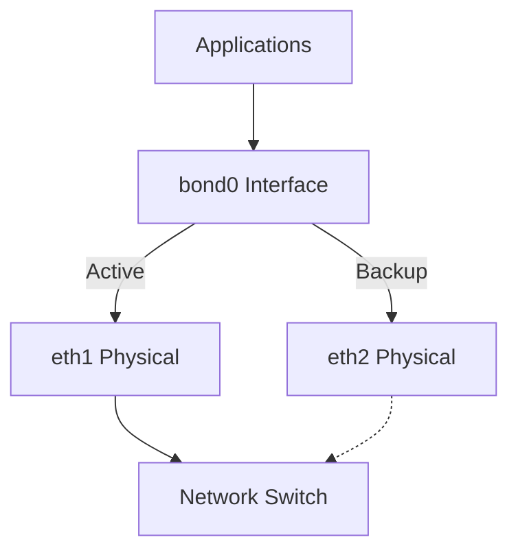
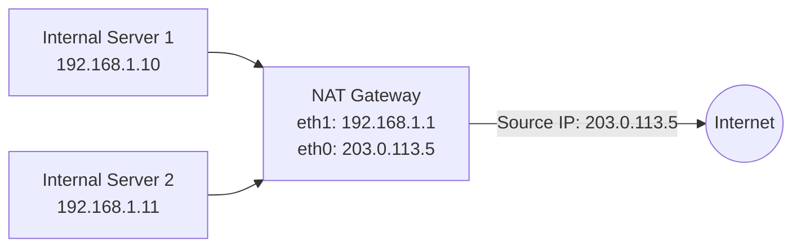

> **Operations — LFCS** | Complexity: `[COMPLEX]` | Time: 45-55 min

## Prerequisites

Before starting this module:
- **Required**: [Module 3.1: TCP/IP Essentials](../foundations/networking/module-3.1-tcp-ip-essentials/) for IP addressing, subnets, and routing
- **Required**: [Module 3.4: iptables & netfilter](../foundations/networking/module-3.4-iptables-netfilter/) for packet filtering fundamentals
- **Helpful**: [Module 1.2: Processes & systemd](../foundations/system-essentials/module-1.2-processes-systemd/) for service management

---

## What You'll Be Able to Do

After this module, you will be able to:
- **Configure** network interfaces, routes, and DNS resolution using nmcli and ip commands
- **Secure** SSH access and manage firewall rules with firewalld
- **Implement** network bonding and VLAN tagging for server redundancy
- **Diagnose** network connectivity failures using a systematic approach (link → IP → route → DNS → firewall)

---

## Why This Module Matters

TCP/IP knowledge tells you how packets flow. This module teaches you how to control that flow — who gets in, who gets out, which interfaces bond together, and how to harden your network services.

Understanding network administration helps you:

- **Secure servers** — Firewalls are your first and last line of defense
- **Build reliable networks** — Bonding and bridging prevent single points of failure
- **Enable routing** — NAT and masquerading let private networks reach the internet
- **Pass the LFCS exam** — Networking is 25% of the exam, the largest single domain

If your server is on the internet without a properly configured firewall, it's not a question of *if* it gets compromised — it's *when*.

---

## Did You Know?

- **firewalld replaced iptables as the default** on RHEL/CentOS 7+ and Fedora. Under the hood, firewalld uses nftables (the successor to iptables) as its backend. Ubuntu uses `ufw` by default but firewalld works there too.

- **Network bonding can survive cable pulls** — With active-backup bonding, you can physically unplug a network cable and traffic seamlessly switches to the other interface. Data centers use this everywhere.

- **NTP matters more than you think** — A time drift of just a few seconds can break Kerberos authentication, cause TLS certificate failures, and make log correlation impossible. Chrony replaced ntpd because it syncs faster and handles virtual machines better.

---

## IPv4/IPv6 Configuration with nmcli

NetworkManager (`nmcli`) is the standard tool for managing network configurations across modern Linux distributions.

### IPv4 Configuration

```bash
# List connections
nmcli connection show

# Show device status
nmcli device status

# Configure static IPv4
sudo nmcli connection modify "Wired connection 1" \
  ipv4.addresses 192.168.1.100/24 \
  ipv4.gateway 192.168.1.1 \
  ipv4.dns "8.8.8.8 1.1.1.1" \
  ipv4.method manual

# Switch to DHCP
sudo nmcli connection modify "Wired connection 1" \
  ipv4.method auto

# Apply changes
sudo nmcli connection up "Wired connection 1"

# Verify
ip addr show
ip route show
```

> **Stop and think**: If your server has an IP address but can't reach the internet, which `nmcli` setting might be missing? (Hint: Think about how packets find their way out of your local network).

### IPv6 Configuration

```bash
# Add static IPv6 address
sudo nmcli connection modify "Wired connection 1" \
  ipv6.addresses "fd00::100/64" \
  ipv6.gateway "fd00::1" \
  ipv6.method manual

# Enable both IPv4 and IPv6
sudo nmcli connection modify "Wired connection 1" \
  ipv4.method manual \
  ipv4.addresses 192.168.1.100/24 \
  ipv6.method manual \
  ipv6.addresses "fd00::100/64"

# Disable IPv6 (if needed)
sudo nmcli connection modify "Wired connection 1" \
  ipv6.method disabled

# Apply
sudo nmcli connection up "Wired connection 1"

# Verify
ip -6 addr show
ip -6 route show
```

### Adding Static Routes

```bash
# Add a static route
sudo nmcli connection modify "Wired connection 1" \
  +ipv4.routes "10.10.0.0/16 192.168.1.254"

# Add route with metric
sudo nmcli connection modify "Wired connection 1" \
  +ipv4.routes "10.10.0.0/16 192.168.1.254 100"

# Apply
sudo nmcli connection up "Wired connection 1"

# Verify
ip route show
```

---

## Network Bonding and Bridging

### Network Bonding (Link Aggregation)

Bonding combines multiple network interfaces for redundancy or throughput:



| Mode | Name | Use Case |
|------|------|----------|
| 0 | balance-rr | Round-robin, increased throughput |
| 1 | active-backup | Failover, one active at a time |
| 2 | balance-xor | Transmit based on hash |
| 4 | 802.3ad (LACP) | Dynamic link aggregation (requires switch support) |
| 6 | balance-alb | Adaptive load balancing |

**Mode 1 (active-backup)** is the most common in production — simple, reliable, no switch configuration needed.

```bash
# Create a bond using nmcli
sudo nmcli connection add type bond \
  con-name bond0 \
  ifname bond0 \
  bond.options "mode=active-backup,miimon=100"

# Add slave interfaces to the bond
sudo nmcli connection add type ethernet \
  con-name bond0-slave1 \
  ifname eth1 \
  master bond0

sudo nmcli connection add type ethernet \
  con-name bond0-slave2 \
  ifname eth2 \
  master bond0

# Configure IP on the bond
sudo nmcli connection modify bond0 \
  ipv4.addresses 192.168.1.10/24 \
  ipv4.gateway 192.168.1.1 \
  ipv4.dns "8.8.8.8 8.8.4.4" \
  ipv4.method manual

# Bring up the bond
sudo nmcli connection up bond0

# Verify
cat /proc/net/bonding/bond0
# Shows which slave is active, link status, etc.

# Test failover: bring down one slave
sudo nmcli connection down bond0-slave1
# Traffic continues on bond0-slave2
```

> **Stop and think**: If you unplug the cable for the active interface in an active-backup bond, what happens to existing TCP connections? Do they drop or stay alive?

### Network Bridging

Bridges connect two network segments at Layer 2. In Linux, they're essential for virtual machines and containers.

```bash
# Create a bridge
sudo nmcli connection add type bridge \
  con-name br0 \
  ifname br0

# Add physical interface to bridge
sudo nmcli connection add type ethernet \
  con-name br0-port1 \
  ifname eth1 \
  master br0

# Configure IP on bridge
sudo nmcli connection modify br0 \
  ipv4.addresses 192.168.1.20/24 \
  ipv4.gateway 192.168.1.1 \
  ipv4.method manual

# Bring up
sudo nmcli connection up br0

# Verify
bridge link show
ip addr show br0
```

> **War story**: A team set up LACP bonding (mode 4) on their servers but forgot to configure the matching port-channel on the network switch. Both interfaces came up, traffic flowed... sort of. Packets were being load-balanced across two independent links, causing out-of-order delivery, TCP retransmissions, and random 50% packet loss. The monitoring showed the interfaces as "up" with good throughput, but applications were timing out. It took two days to figure out because everyone assumed "the network is fine — both links are up." The fix was a 5-minute switch configuration. Lesson: bonding mode 4 (LACP) requires BOTH sides to be configured. Mode 1 (active-backup) is forgiving and needs no switch changes.

---

## VLAN Tagging (802.1Q)

Virtual LANs (VLANs) allow you to segment a single physical network into multiple logical networks. This is essential for isolating traffic (e.g., separating management traffic from public web traffic) without requiring separate physical cables and switches for every network.

```bash
# Create a VLAN interface (VLAN ID 10) on physical interface eth0
sudo nmcli connection add type vlan \
  con-name eth0-vlan10 \
  ifname eth0.10 \
  dev eth0 \
  id 10 \
  ipv4.addresses 10.0.10.50/24 \
  ipv4.method manual

# Bring up the VLAN interface
sudo nmcli connection up eth0-vlan10

# Verify
ip addr show eth0.10
```

> **Stop and think**: If you configure a VLAN interface on your server but cannot ping other devices on the same VLAN, what network infrastructure component might be missing the VLAN configuration?

---

## Time Synchronization with Chrony

Accurate time is critical for log correlation, certificate validation, authentication (Kerberos), and distributed systems.

### Why Chrony Over ntpd

- **Faster initial sync** — Chrony syncs in seconds; ntpd can take minutes
- **Better for VMs** — Handles clock jumps from VM suspend/resume
- **Lower resource usage** — Lightweight and efficient
- **Default on modern distros** — RHEL 8+, Ubuntu 22.04+ use chrony

### Configuration

```bash
# Install chrony
sudo apt install -y chrony

# Check configuration
cat /etc/chrony/chrony.conf
```

Key configuration in `/etc/chrony/chrony.conf`:

```
# NTP servers (pool is preferred — auto-selects nearby servers)
pool ntp.ubuntu.com        iburst maxsources 4
pool 0.ubuntu.pool.ntp.org iburst maxsources 1
pool 1.ubuntu.pool.ntp.org iburst maxsources 1
pool 2.ubuntu.pool.ntp.org iburst maxsources 2

# Record the rate at which the system clock gains/drifts
driftfile /var/lib/chrony/chrony.drift

# Allow NTP clients from local network (if acting as NTP server)
# allow 192.168.1.0/24

# Step the clock if offset is larger than 1 second (first 3 updates)
makestep 1.0 3
```

```bash
# Start and enable
sudo systemctl enable --now chrony

# Check synchronization status
chronyc tracking
# Reference ID    : A9FEA9FE (time.cloudflare.com)
# Stratum         : 3
# Ref time (UTC)  : Sun Mar 22 14:30:00 2026
# System time     : 0.000000123 seconds fast of NTP time
# Last offset     : +0.000000045 seconds

# List NTP sources
chronyc sources -v

# Force immediate sync
sudo chronyc makestep

# Check if chrony is being used
timedatectl
# Look for: NTP service: active
```

### Setting Timezone

```bash
# List timezones
timedatectl list-timezones | grep America

# Set timezone
sudo timedatectl set-timezone UTC

# Verify
timedatectl
date
```

---

## Firewall Management with firewalld

### Why firewalld Over Raw iptables

Raw iptables rules are powerful but fragile. One mistake can lock you out. firewalld adds:
- **Zones**: Group interfaces and rules by trust level
- **Runtime vs permanent**: Test rules before making them permanent
- **Services**: Pre-defined rule sets (ssh, http, https, etc.)
- **Rich rules**: Complex rules without raw iptables syntax

### Installing and Starting firewalld

```bash
# Install (may already be present)
sudo apt install -y firewalld

# Start and enable
sudo systemctl enable --now firewalld

# Check status
sudo firewall-cmd --state
# running

# Check active zones
sudo firewall-cmd --get-active-zones
# public
#   interfaces: eth0
```

### Zones

Zones define the trust level for network connections:

| Zone | Purpose | Default Behavior |
|------|---------|-----------------|
| `drop` | Untrusted networks | Drop all incoming, no reply |
| `block` | Untrusted networks | Reject incoming with ICMP |
| `public` | Public networks (default) | Reject incoming except selected |
| `external` | NAT/masquerading | Masquerade outbound traffic |
| `dmz` | DMZ servers | Limited incoming allowed |
| `work` | Work networks | Trust some services |
| `home` | Home networks | Trust more services |
| `internal` | Internal networks | Similar to work |
| `trusted` | Trust everything | Allow all traffic |

```bash
# List all zones
sudo firewall-cmd --get-zones

# Show default zone
sudo firewall-cmd --get-default-zone
# public

# Change default zone
sudo firewall-cmd --set-default-zone=public

# Assign interface to a zone
sudo firewall-cmd --zone=internal --change-interface=eth1 --permanent
sudo firewall-cmd --reload

# Show zone details
sudo firewall-cmd --zone=public --list-all
```

### Managing Services

```bash
# List available pre-defined services
sudo firewall-cmd --get-services

# List services enabled in current zone
sudo firewall-cmd --list-services
# dhcpv6-client ssh

# Add a service (runtime only — lost on reload)
sudo firewall-cmd --add-service=http
sudo firewall-cmd --add-service=https

# Add a service permanently
sudo firewall-cmd --add-service=http --permanent
sudo firewall-cmd --add-service=https --permanent
sudo firewall-cmd --reload

# Remove a service
sudo firewall-cmd --remove-service=http --permanent
sudo firewall-cmd --reload

# Add a custom port
sudo firewall-cmd --add-port=8080/tcp --permanent
sudo firewall-cmd --add-port=3000-3100/tcp --permanent
sudo firewall-cmd --reload
```

### Rich Rules

Rich rules provide fine-grained control when simple service/port rules aren't enough:

```bash
# Allow SSH only from specific subnet
sudo firewall-cmd --add-rich-rule='rule family="ipv4" source address="192.168.1.0/24" service name="ssh" accept' --permanent

# Block a specific IP
sudo firewall-cmd --add-rich-rule='rule family="ipv4" source address="10.0.0.50" drop' --permanent

# Rate-limit connections (prevent brute force)
sudo firewall-cmd --add-rich-rule='rule family="ipv4" service name="ssh" accept limit value="3/m"' --permanent

# Log and drop traffic from a subnet
sudo firewall-cmd --add-rich-rule='rule family="ipv4" source address="203.0.113.0/24" log prefix="BLOCKED: " level="warning" drop' --permanent

# Apply changes
sudo firewall-cmd --reload

# List rich rules
sudo firewall-cmd --list-rich-rules
```

### Runtime vs Permanent

```bash
# Runtime rule (test it first)
sudo firewall-cmd --add-service=http

# If it works, make it permanent
sudo firewall-cmd --runtime-to-permanent

# Or start over — reload drops runtime-only rules
sudo firewall-cmd --reload

# This workflow prevents lockouts:
# 1. Add rule (runtime)
# 2. Test access
# 3. If good: --runtime-to-permanent
# 4. If bad: --reload to revert
```

> **Pause and predict**: If you add a rich rule to block an IP and reload `firewalld` without using the `--permanent` flag, what will happen to your rule?

---

## nftables (The Modern Backend)

nftables replaces iptables as the Linux kernel packet filtering framework. firewalld uses nftables under the hood, but you should know the basics for the LFCS.

```bash
# Check if nftables is active
sudo nft list ruleset

# List tables
sudo nft list tables

# Create a simple firewall from scratch
sudo nft add table inet filter
sudo nft add chain inet filter input '{ type filter hook input priority 0; policy drop; }'
sudo nft add chain inet filter forward '{ type filter hook forward priority 0; policy drop; }'
sudo nft add chain inet filter output '{ type filter hook output priority 0; policy accept; }'

# Allow established connections
sudo nft add rule inet filter input ct state established,related accept

# Allow loopback
sudo nft add rule inet filter input iifname "lo" accept

# Allow SSH
sudo nft add rule inet filter input tcp dport 22 accept

# Allow ICMP (ping)
sudo nft add rule inet filter input ip protocol icmp accept

# View rules
sudo nft list chain inet filter input

# Save rules persistently
sudo nft list ruleset | sudo tee /etc/nftables.conf
sudo systemctl enable nftables
```

> **Exam tip**: On the LFCS exam (Ubuntu), you'll most likely use `ufw` or `firewalld`. But understanding that nftables is the underlying framework helps when debugging.

---

## NAT and Masquerading

NAT (Network Address Translation) lets machines on a private network access the internet through a gateway machine. Masquerading is a form of NAT where the source address is dynamically replaced with the gateway's address.

> **Analogy**: Think of NAT as a corporate receptionist. An office has 100 employees, each with an internal extension (Private IP). When an employee calls the outside world, the receptionist (NAT gateway) intercepts the call, replaces the internal extension with the company's main public phone number (Masquerading), and forwards it. When the external party replies, the receptionist remembers who made the original call and routes it back to the correct internal extension.



### Enable IP Forwarding

```bash
# Check current status
cat /proc/sys/net/ipv4/ip_forward
# 0 = disabled, 1 = enabled

# Enable temporarily
sudo sysctl -w net.ipv4.ip_forward=1

# Enable permanently
echo "net.ipv4.ip_forward = 1" | sudo tee /etc/sysctl.d/99-ip-forward.conf
sudo sysctl -p /etc/sysctl.d/99-ip-forward.conf
```

### Masquerading with firewalld

```bash
# Enable masquerading on external zone
sudo firewall-cmd --zone=external --add-masquerade --permanent

# Assign external interface to external zone
sudo firewall-cmd --zone=external --change-interface=eth0 --permanent

# Assign internal interface to internal zone
sudo firewall-cmd --zone=internal --change-interface=eth1 --permanent

# Allow forwarding from internal to external
sudo firewall-cmd --zone=internal --add-forward --permanent

sudo firewall-cmd --reload

# Verify masquerading is enabled
sudo firewall-cmd --zone=external --query-masquerade
# yes
```

### Port Forwarding

```bash
# Forward port 8080 on external to internal server 192.168.1.100:80
sudo firewall-cmd --zone=external --add-forward-port=port=8080:proto=tcp:toport=80:toaddr=192.168.1.100 --permanent

sudo firewall-cmd --reload

# Verify
sudo firewall-cmd --zone=external --list-forward-ports
```

---

## SSH Hardening

SSH is the primary remote access method for Linux servers. Default configurations are rarely secure enough for production.

### Key-Based Authentication

```bash
# Generate an SSH key pair (on client machine)
ssh-keygen -t ed25519 -C "admin @company.com"
# Ed25519 is preferred over RSA — shorter, faster, more secure

# Copy public key to server
ssh-copy-id -i ~/.ssh/id_ed25519.pub user@server

# Or manually:
cat ~/.ssh/id_ed25519.pub | ssh user@server "mkdir -p ~/.ssh && chmod 700 ~/.ssh && cat >> ~/.ssh/authorized_keys && chmod 600 ~/.ssh/authorized_keys"

# Test key login
ssh -i ~/.ssh/id_ed25519 user @src/content/docs/uk/prerequisites/zero-to-terminal/module-0.8-servers-and-ssh.md
```

### Hardening sshd_config

Edit `/etc/ssh/sshd_config`:

```bash
# Disable password authentication (key-only)
PasswordAuthentication no

# Disable root login
PermitRootLogin no

# Use only SSH protocol 2
Protocol 2

# Limit to specific users or groups
AllowUsers admin deploy
# Or: AllowGroups sshusers

# Change default port (security through obscurity — helps with noise)
Port 2222

# Disable empty passwords
PermitEmptyPasswords no

# Set idle timeout (disconnect after 5 minutes of inactivity)
ClientAliveInterval 300
ClientAliveCountMax 0

# Limit authentication attempts
MaxAuthTries 3

# Disable X11 forwarding (unless needed)
X11Forwarding no

# Disable TCP forwarding (unless needed)
AllowTcpForwarding no
```

```bash
# Test configuration before restarting
sudo sshd -t
# No output = no errors

# Restart SSH
sudo systemctl restart sshd

# CRITICAL: Test from another terminal BEFORE closing your current session
# If config is wrong, you can still fix it from the existing session
```

> **Stop and think**: If you set `PasswordAuthentication no` but haven't successfully copied your SSH key to the server yet, what will happen when you restart the SSH service and log out?

### Fail2ban for Brute Force Protection

```bash
# Install fail2ban
sudo apt install -y fail2ban

# Create local config (never edit jail.conf directly)
sudo cp /etc/fail2ban/jail.conf /etc/fail2ban/jail.local
```

Edit `/etc/fail2ban/jail.local`:

```ini
[DEFAULT]
bantime  = 1h
findtime = 10m
maxretry = 5

[sshd]
enabled = true
port    = ssh
logpath = %(sshd_log)s
backend = systemd
maxretry = 3
bantime = 24h
```

```bash
# Start fail2ban
sudo systemctl enable --now fail2ban

# Check status
sudo fail2ban-client status sshd
# Status for the jail: sshd
# |- Filter
# |  |- Currently failed: 0
# |  `- Total failed: 12
# `- Actions
#    |- Currently banned: 2
#    `- Total banned: 5

# Unban an IP
sudo fail2ban-client set sshd unbanip 192.168.1.50

# View banned IPs
sudo fail2ban-client get sshd banned
```

---

## Systematic Network Diagnosis

When a network connection fails, don't guess. Follow the OSI model from the bottom up to systematically isolate the issue.

1. **Link (Layer 1/2)**: Is the cable plugged in? Is the interface up?
   ```bash
   ip link show eth0
   # Look for state UP and NO-CARRIER
   ```
2. **IP Configuration (Layer 3)**: Does the interface have the correct IP and subnet mask?
   ```bash
   ip addr show eth0
   ```
3. **Routing (Layer 3)**: Does the system know how to reach the destination? Is there a default gateway?
   ```bash
   ip route show
   ping -c 4 8.8.8.8  # Test routing to the internet
   ```
4. **DNS (Layer 7)**: Can the system resolve domain names to IP addresses?
   ```bash
   resolvectl status
   dig google.com
   ```
5. **Firewall (Layer 4)**: Is a firewall blocking the traffic locally or remotely?
   ```bash
   sudo firewall-cmd --list-all
   telnet destination_ip port  # Test if the port is open
   ```

> **Stop and think**: If `ping 8.8.8.8` works, but `ping google.com` fails, at which step of the systematic diagnosis did the failure occur?

---

## Common Mistakes

| Mistake | What Happens | Fix |
|---------|-------------|-----|
| `firewall-cmd` without `--permanent` | Rule lost on reload/reboot | Add `--permanent` and `--reload` |
| Blocking SSH before adding allow rule | Locked out of server | Always allow SSH first, then set default deny |
| Bonding mode 4 without switch config | Packet loss, retransmissions | Use mode 1 (active-backup) or configure switch |
| `PasswordAuthentication no` without testing key login | Locked out completely | Test key auth in separate session first |
| No `nofail` on network mounts in fstab | Server won't boot if NFS down | Always use `nofail,_netdev` for network mounts |
| Forgetting `sysctl ip_forward` for NAT | Packets arrive but don't get forwarded | Enable `net.ipv4.ip_forward=1` |
| Editing `jail.conf` instead of `jail.local` | Changes overwritten on update | Always create and edit `jail.local` |

---

## Quiz

Test your network administration knowledge:

**Question 1**: A junior admin configured a server's network using `nmcli`. The server can reach other machines in the `10.0.5.0/24` subnet, but it cannot communicate with the internet or any other subnets. What configuration is missing, and how would you verify this using the `ip` command?

<details>
<summary>Show Answer</summary>

The default gateway is missing. You would use `ip route show` to check for a line starting with `default via ...`. Without a default gateway, the system's routing table has no instructions on where to send packets destined for outside its local subnet. Since the local switch handles traffic within the `10.0.5.0/24` subnet, that traffic succeeds, but external requests are immediately dropped by the kernel because there is no known path forward.

</details>

**Question 2**: You are configuring `firewalld` to allow a new application running on port `8443`. You run `sudo firewall-cmd --add-port=8443/tcp --permanent`. However, external clients still cannot connect. What crucial step was forgotten, and why did the traffic fail?

<details>
<summary>Show Answer</summary>

The admin forgot to apply the changes to the running configuration using `sudo firewall-cmd --reload`. The `--permanent` flag only writes the rule to the configuration files on disk, ensuring it survives a reboot. It does not automatically inject the rule into the active, running firewall state. To make it take effect immediately, you must either reload the firewall or apply the rule twice (once without the flag for runtime, once with it for permanence).

</details>

**Question 3**: Your physical server connects to a managed switch that uses 802.1Q to separate guest Wi-Fi traffic (VLAN 20) from internal corporate traffic (VLAN 10). You need to attach a single physical interface (`eth0`) to the internal corporate network. What `nmcli` connection type must you use, and what ID must be specified?

<details>
<summary>Show Answer</summary>

You must use the `vlan` connection type and specify `id 10`. This instructs the Linux kernel to create a logical interface (like `eth0.10`) that automatically tags outgoing packets with VLAN ID 10. It also configures the interface to accept incoming packets tagged with VLAN 10 by the switch, stripping the tag before passing the payload to the operating system. Without this tagging, the managed switch would drop the server's untagged packets or route them to a default, incorrect VLAN.

</details>

**Question 4**: An application team reports that their service intermittently drops connections. You suspect a failing network cable on `eth1`. To prevent downtime during cable replacement, you want to combine `eth1` and `eth2` so that if one fails, the other takes over immediately, without asking the network team to reconfigure the switch. What technology and specific mode should you deploy?

<details>
<summary>Show Answer</summary>

You should deploy Network Bonding using Mode 1 (active-backup). This mode requires no special configuration or support (like LACP) on the network switch, making it foolproof to deploy independently. Only one interface actively transmits and receives traffic at a time. If the primary physical link (`eth1`) drops, the bonding driver immediately shifts the MAC address and all traffic to the backup link (`eth2`), ensuring continuous application availability.

</details>

**Question 5**: A developer states they cannot SSH into a newly provisioned Linux server. You follow the systematic diagnosis approach: you verify the server is powered on, `ip link` shows the interface is UP, `ip addr` shows the correct IP (`192.168.1.50`), and `ip route` has the correct gateway. You can even `ping` the server successfully. What are the next two logical layers/components to check?

<details>
<summary>Show Answer</summary>

Following systematic diagnosis, since Layer 1, 2, and 3 (IP and routing) are working (proven by `ping`), you should next check Layer 4/7 services. First, verify the **Firewall** by checking if `firewalld` or `ufw` is actively dropping TCP port 22 traffic (`sudo firewall-cmd --list-all`). Next, verify the **SSH Service** itself by checking if `sshd` is actually running (`systemctl status sshd`). If the service is running and reachable, it is highly likely that SSH hardening rules (like `AllowUsers` or disabling password authentication before keys were copied) are actively rejecting the developer's login attempts.

</details>

---

## Hands-On Exercise: Secure a Server from Scratch

**Objective**: Configure firewall rules, harden SSH, set up NTP, and configure network interfaces.

**Environment**: A Linux VM (Ubuntu 22.04 preferred) with at least one network interface.

### Task 1: Configure firewalld

```bash
# Install and start firewalld
sudo apt install -y firewalld
sudo systemctl enable --now firewalld

# Set default zone to public
sudo firewall-cmd --set-default-zone=public

# Allow only SSH and HTTPS
sudo firewall-cmd --add-service=ssh --permanent
sudo firewall-cmd --add-service=https --permanent

# Add a custom port for your application
sudo firewall-cmd --add-port=8443/tcp --permanent

# Block a test IP with rich rule
sudo firewall-cmd --add-rich-rule='rule family="ipv4" source address="10.99.99.99" drop' --permanent

# Reload and verify
sudo firewall-cmd --reload
sudo firewall-cmd --list-all
```

**Expected output**: Default zone is public with ssh, https, and port 8443 allowed, plus a rich rule blocking 10.99.99.99.

### Task 2: Harden SSH

```bash
# Backup original config
sudo cp /etc/ssh/sshd_config /etc/ssh/sshd_config.bak

# Generate a key pair (if you don't have one)
ssh-keygen -t ed25519 -N "" -f ~/.ssh/id_ed25519

# Add your key to authorized_keys
mkdir -p ~/.ssh && chmod 700 ~/.ssh
cat ~/.ssh/id_ed25519.pub >> ~/.ssh/authorized_keys
chmod 600 ~/.ssh/authorized_keys

# Harden sshd_config
sudo sed -i 's/#PermitRootLogin.*/PermitRootLogin no/' /etc/ssh/sshd_config
sudo sed -i 's/#MaxAuthTries.*/MaxAuthTries 3/' /etc/ssh/sshd_config
sudo sed -i 's/#ClientAliveInterval.*/ClientAliveInterval 300/' /etc/ssh/sshd_config
sudo sed -i 's/X11Forwarding yes/X11Forwarding no/' /etc/ssh/sshd_config

# Test config
sudo sshd -t

# Restart
sudo systemctl restart sshd
```

### Task 3: Configure Time Synchronization

```bash
# Install and enable chrony
sudo apt install -y chrony
sudo systemctl enable --now chrony

# Set timezone to UTC
sudo timedatectl set-timezone UTC

# Force sync
sudo chronyc makestep

# Verify
chronyc tracking
timedatectl
```

### Task 4: Configure a Static IP with nmcli

```bash
# Show current connections
nmcli connection show

# Create a new connection with static IP (adjust interface name)
sudo nmcli connection add type ethernet \
  con-name static-eth0 \
  ifname eth0 \
  ipv4.addresses 192.168.1.200/24 \
  ipv4.gateway 192.168.1.1 \
  ipv4.dns "8.8.8.8 1.1.1.1" \
  ipv4.method manual

# Verify (don't activate if this is your only connection over SSH!)
nmcli connection show static-eth0
```

### Success Criteria

- [ ] firewalld running with custom rules (ssh, https, 8443, rich rule)
- [ ] SSH hardened: root login disabled, max auth tries limited
- [ ] Chrony running and time synchronized
- [ ] Static IP configured via nmcli
- [ ] All changes persist across reboot (`--permanent`, config files)

### Cleanup

```bash
# Restore SSH config
sudo cp /etc/ssh/sshd_config.bak /etc/ssh/sshd_config
sudo systemctl restart sshd

# Remove firewalld test rules
sudo firewall-cmd --remove-service=https --permanent
sudo firewall-cmd --remove-port=8443/tcp --permanent
sudo firewall-cmd --remove-rich-rule='rule family="ipv4" source address="10.99.99.99" drop' --permanent
sudo firewall-cmd --reload

# Remove test nmcli connection
sudo nmcli connection delete static-eth0
```

---

## Next Module

You've now covered the key LFCS gaps in storage and networking. Return to the [LFCS Learning Path](../../k8s/lfcs/) to review remaining study areas, or continue strengthening your Linux fundamentals with [Module 5.1: The USE Method](performance/module-5.1-use-method/) for performance analysis.