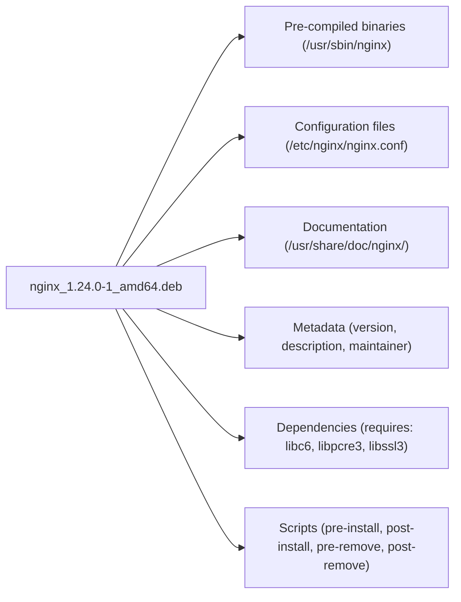

# Module 8.3: Package Management & User Administration

> **Operations - LFCS** | Complexity: `[MEDIUM]` | Time: 40-50 min for administrators who need package state, user identity, and sudo delegation to be explainable under pressure.

## Prerequisites

Before starting this module, make sure you can already read Linux file ownership, recognize systemd service state, and explain why security context changes how much privilege an account should receive:

- **Required**: [Module 1.4: Users & Permissions](/linux/foundations/system-essentials/module-1.4-users-permissions/) for UID/GID fundamentals and file ownership
- **Required**: [Module 1.2: Processes & systemd](/linux/foundations/system-essentials/module-1.2-processes-systemd/) for understanding services and system state
- **Helpful**: [Module 4.1: Kernel Hardening](/linux/security/hardening/module-4.1-kernel-hardening/) for security context

For later KubeDojo labs that touch clusters, assume Kubernetes 1.35+ and define the standard shortcut with `alias k=kubectl` before running any `kubectl` command. This module itself stays on Linux host administration, because a reliable cluster node starts with boring, disciplined package and account management before any workload ever lands on it.

## Learning Outcomes

After this module, you will be able to perform these operational tasks in a way that can be verified by command output, reviewed by another administrator, and repeated safely in automation:

- **Diagnose** package dependency, repository, and ownership problems with `apt`, `dnf`, `dpkg`, and `rpm`.
- **Implement** safe package lifecycle controls for installs, upgrades, removals, holds, and signature verification.
- **Administer** users, groups, password aging, skeleton files, and service accounts with least-privilege defaults.
- **Configure** sudo delegation through validated drop-in files that grant only the commands an operator needs.
- **Evaluate** whether a server's package and account state is auditable, supportable, and ready for automation.

## Why This Module Matters

In 2017, Equifax disclosed a breach that exposed personal information for roughly 145 million people after attackers exploited an Apache Struts vulnerability that already had a public patch. The incident is usually remembered as an application security failure, but it is also a system administration lesson: somebody had to know what was installed, whether the vulnerable package was present, which systems needed updates, and whether access controls allowed the right people to remediate quickly. When package state and user authority are vague, an emergency becomes a treasure hunt.

A similar pattern appears in smaller incidents that never make headlines. A team inherits an Ubuntu host where `nginx` was installed from a vendor repository, a contractor still has password login months after leaving, and the only deployment user has broad passwordless sudo because nobody wanted to debug a narrow rule. Nothing looks broken during normal operations, but the first security advisory or failed deploy reveals that the server has no clear owner, no reversible change trail, and no dependable way to explain what changed.

Package management and user administration are the daily control plane of a Linux server. Packages decide what code is trusted to run, which files belong to which vendor, and how updates move through the machine. Accounts decide who can log in, what identity a process runs as, and which human action appears in the audit log. Mastering these skills is not clerical work; it is how you turn a server from a collection of hopeful commands into an environment that can be patched, delegated, rebuilt, and defended.

This module treats `apt install` and `useradd` as the beginning of the story, not the whole story. You will see how package managers build a local catalog, why low-level tools still matter during investigations, where account data actually lives, and how sudo policies fail when they are edited casually. The examples use Ubuntu and RHEL-family commands side by side because real operations teams often support both, even when the lab environment is Debian-based.

## Package Managers as the Server's Inventory System

A package is not just a compressed file with software inside. It is a contract between the distribution, the package maintainer, and your machine that says which files will be installed, which other packages must exist first, which scripts run during installation or removal, and which signatures prove the payload came from a trusted source. Without that contract, every server becomes a hand-built artifact that can only be understood by remembering who copied which binary into which directory.



The diagram is the reason package managers feel almost invisible when they work well. Installing `nginx` is not just placing `/usr/sbin/nginx` on disk; it is also registering metadata, preserving configuration policy, recording dependencies, and running maintainer scripts in a defined order. When an incident responder asks whether a suspicious binary came from a package, the answer comes from that recorded inventory, not from the filename or from guesswork.

Every mainstream Linux distribution separates package handling into two layers. The low-level layer knows how to install or query an individual package file that is already present on disk. The high-level layer knows how to contact repositories, calculate dependencies, choose versions, and download every package needed to satisfy the requested change. Good administrators understand both layers because routine work belongs to the high-level tool, while investigation and repair often require the low-level database.

| Layer | Debian/Ubuntu | RHEL/Fedora | Purpose |
|-------|--------------|-------------|---------|
| **Low-level** | `dpkg` | `rpm` | Install/remove individual package files |
| **High-level** | `apt` | `dnf` | Resolve dependencies, download from repositories |

Think of `apt` and `dnf` like a pharmacy system that checks whether a prescription conflicts with what the patient already takes. Think of `dpkg` and `rpm` like the label on the bottle and the inventory record on the shelf. The high-level tool prevents bad combinations when it can, but the low-level record tells you exactly what is on the machine after the fact.

The first operational habit is refreshing metadata before you make decisions. `apt update` does not upgrade software; it downloads the current repository indexes so your machine knows what versions and dependencies are available. If you skip this step, the package manager may report stale versions, fail to find a newly published security fix, or try to install a dependency set that no longer matches the repository.

```bash
# Refresh the list of available packages from repositories
# This does NOT upgrade anything - it just downloads the latest catalog
sudo apt update

# Output shows which repositories were fetched:
# Hit:1 http://archive.ubuntu.com/ubuntu jammy InRelease
# Get:2 http://archive.ubuntu.com/ubuntu jammy-updates InRelease [119 kB]
# Fetched 2,345 kB in 3s (782 kB/s)
```

Pause and predict: if a server has not refreshed package metadata for several weeks, what failure would you expect when a security team asks you to install a specific fixed version by name? The important answer is not simply "the command might fail." The deeper risk is that the administrator may conclude the fix is unavailable, when the local machine is only looking at an outdated catalog.

Installing packages is intentionally simple because the hard work happens in dependency resolution. When you ask for `nginx`, the package manager checks the current repository metadata, compares dependencies against installed packages, downloads missing pieces, verifies signatures, unpacks files, and runs package scripts. That convenience is powerful, but it also means you should read the transaction summary before confirming changes on important hosts.

```bash
# Install a single package
sudo apt install nginx

# Install multiple packages at once
sudo apt install nginx curl vim

# Install without interactive confirmation
sudo apt install -y nginx

# Install a specific version
sudo apt install nginx=1.24.0-1ubuntu1
```

The `-y` flag is useful in automation, but it removes a moment where a human would normally notice surprise removals or unexpected repositories. In scripts, compensate by making the package list explicit, pinning versions when needed, and testing on disposable systems before touching production. A package command should be repeatable enough that the next operator can rerun it without needing to remember the conversation that created it.

Searching and inspecting packages is how you convert a vague request into a controlled change. A ticket that says "install a web server" should lead you to compare available packages, inspect dependencies, and confirm the package name, not to guess. `apt show` gives the maintainer, version, dependency list, and description; `apt list --installed` tells you what is already on the host.

```bash
# Search for packages by name or description
apt search "web server"

# Show detailed info about a package (installed or available)
apt show nginx
# Package: nginx
# Version: 1.24.0-1ubuntu1
# Depends: libc6, libpcre2-8-0, libssl3, zlib1g
# Description: small, powerful, scalable web/proxy server

# List installed packages
apt list --installed

# List installed packages matching a pattern
apt list --installed 2>/dev/null | grep nginx
```

Before running this on a real machine, ask what output would convince you that `nginx` is installed from the expected distribution repository rather than from a third-party source. The package name alone is not enough because repositories can provide packages with the same name. Version strings, repository policy, and package metadata together give you a much stronger operational picture.

Removal is where many administrators first learn that package managers distinguish application files from configuration. `apt remove` deletes package-managed binaries and related files, but it deliberately leaves configuration under `/etc` so a reinstall can preserve local policy. That behavior is friendly during accidental removals and frustrating when you are trying to recover from a broken configuration, so choose the removal mode based on intent.

```bash
# Remove the package but keep configuration files
sudo apt remove nginx

# Remove the package AND its configuration files
sudo apt purge nginx

# Remove packages that were installed as dependencies but are no longer needed
sudo apt autoremove

# Nuclear option: purge + autoremove
sudo apt purge -y nginx && sudo apt autoremove -y
```

Use `purge` when the configuration itself is the problem or when decommissioning a service so it cannot be accidentally revived with old settings. Use `remove` when you are temporarily uninstalling software and expect to keep local configuration. The key is to document which intention you chose, because a later operator cannot infer your reason from the absence of the binary alone.

Upgrades need the same discipline. `apt upgrade` tries to move installed packages to newer versions without removing packages, while `apt full-upgrade` may remove packages to satisfy dependency changes. That difference matters during distribution upgrades, kernel transitions, and repository changes where a package split or replacement can cause legitimate removals. On production machines, preview the change set and confirm that the planned removals match the maintenance objective.

```bash
# Upgrade all packages to their latest versions (safe - never removes packages)
sudo apt upgrade

# Upgrade all packages, allowing removal of packages if needed for dependency resolution
sudo apt full-upgrade

# See what would be upgraded without doing it
apt list --upgradable
```

The low-level `dpkg` tool appears when you have a package file in hand or when you need to interrogate the installed package database directly. If `dpkg -i` fails because dependencies are missing, the package may be partially unpacked, and `apt install -f` asks the high-level resolver to repair the dependency graph. This is a common pattern after downloading a vendor `.deb` file instead of installing through a repository.

```bash
# Install a .deb file
sudo dpkg -i google-chrome-stable_current_amd64.deb

# If dpkg fails due to missing dependencies, fix them:
sudo apt install -f

# List all installed packages
dpkg -l

# List installed packages matching a pattern
dpkg -l | grep nginx

# Find which package owns a file on your system
dpkg -S /usr/sbin/nginx
# nginx-core: /usr/sbin/nginx

# List all files installed by a package
dpkg -L nginx-core
```

File ownership queries are one of the most valuable troubleshooting skills in this module. If a binary is owned by a package, you can inspect its version, verify its files, reinstall it, or trace it to a repository. If no package owns it, you are dealing with a manual install, a generated file, a copied artifact, or something more suspicious. That distinction changes the investigation immediately.

Third-party repositories solve a real problem: distributions cannot ship every vendor's latest release on every schedule. They also expand your trust boundary, because you are allowing another signing key and repository policy into the system's update path. Modern Debian-family practice is to store a repository-specific keyring and reference it with `signed-by`, instead of using a global key that can authenticate unrelated packages.

```bash
# Add a PPA (Ubuntu-specific shortcut)
sudo add-apt-repository ppa:deadsnakes/ppa
sudo apt update

# Add a third-party repository manually
# 1. Download and add the GPG key
curl -fsSL https://packages.example.com/gpg.key | sudo gpg --dearmor -o /usr/share/keyrings/example-archive-keyring.gpg

# 2. Add the repository definition
echo "deb [signed-by=/usr/share/keyrings/example-archive-keyring.gpg] https://packages.example.com/apt stable main" | sudo tee /etc/apt/sources.list.d/example.list

# 3. Update and install
sudo apt update
sudo apt install example-package
```

Repository definitions live in `/etc/apt/sources.list` and `/etc/apt/sources.list.d/`, and the `.d` directory is easier to audit because each vendor can have its own file. During incident response, that layout lets you quickly answer which external sources can influence package selection. During cleanup, it lets you remove one repository without editing a shared file and accidentally damaging the base distribution configuration.

Package holds are a controlled exception to the normal upgrade story. You may hold a kernel while investigating a driver regression, pin a database package until an application compatibility test completes, or freeze a vendor package while waiting for a maintenance window. Holds should be visible and temporary, because a forgotten hold silently blocks future security fixes and becomes technical debt with root privileges.

```bash
# Prevent a package from being upgraded
sudo apt-mark hold linux-image-generic

# Show held packages
apt-mark showhold

# Release the hold
sudo apt-mark unhold linux-image-generic
```

A useful review question is "who will remove this hold, and what evidence will tell them it is safe?" If the answer is not written down, the hold is not a control; it is a memory test. Good operations teams pair holds with tickets, expiry reviews, or configuration management so the exception remains visible after the person who created it moves on.

## RHEL-Family Package Workflows and Cross-Distro Reasoning

RHEL, Fedora, CentOS Stream, Amazon Linux, and related systems use `dnf` as the high-level package manager and `rpm` as the low-level package database. The commands differ from Debian-family systems, but the mental model is the same: use the high-level tool for dependency-aware transactions and the low-level tool for package-file installation, ownership queries, verification, and detailed inventory work.

```bash
# Install a package
sudo dnf install nginx

# Install without confirmation
sudo dnf install -y nginx

# Remove a package
sudo dnf remove nginx

# Install a local .rpm file (dnf resolves dependencies, unlike plain rpm)
sudo dnf install ./package-1.0.0.x86_64.rpm
```

The practical difference is that `dnf install ./package.rpm` usually beats `rpm -i package.rpm` for routine local installs because `dnf` can still resolve dependencies from configured repositories. Use plain `rpm` when you need a precise query or verification action, not because it feels more direct. Direct tools are sharp; high-level tools add guardrails without hiding the package database.

```bash
# Search for packages
dnf search "web server"

# Show package details
dnf info nginx

# List all installed packages
dnf list installed

# Find which package provides a file
dnf provides /usr/sbin/nginx
# or for a command you don't have yet:
dnf provides */bin/traceroute
```

The `dnf provides` command is especially useful when you know the command or file path but not the package name. New administrators often search the web and copy package names from a different distribution, then wonder why the install fails. Querying the repository metadata directly lets the distribution tell you which package owns the command in that ecosystem.

```bash
# Update all packages
sudo dnf update

# Update a specific package
sudo dnf update nginx

# Check for available updates
dnf check-update
```

RHEL-family updates are usually described as `update`, while Debian-family documentation often says `upgrade`, but both words describe changing installed packages to newer repository versions. The operational questions are still the same: which repositories are enabled, which packages will change, which services need restarts, and what rollback path exists if a critical dependency behaves differently after the update.

```bash
# Query all installed packages
rpm -qa

# Query a specific package
rpm -qi nginx
# Name        : nginx
# Version     : 1.24.0
# Release     : 1.el9

# List files in an installed package
rpm -ql nginx

# Find which package owns a file
rpm -qf /usr/sbin/nginx
# nginx-core-1.24.0-1.el9.x86_64

# Verify installed package (checks file integrity)
rpm -V nginx
# S.5....T.  c /etc/nginx/nginx.conf
# (S=size, 5=md5, T=time changed - the config was modified)
```

`rpm -V` is a compact way to compare installed files against the package database. It will not tell you whether a configuration change was approved, but it will tell you that a package-managed file no longer matches the recorded metadata. That distinction is perfect for audits: the tool identifies drift, then humans and change records decide whether the drift is legitimate.

```bash
# Add a repository from a URL
sudo dnf config-manager --add-repo https://packages.example.com/example.repo

# List enabled repositories
dnf repolist

# List all repositories (including disabled)
dnf repolist all

# Enable a specific repository
sudo dnf config-manager --set-enabled powertools
```

Cross-distro fluency is less about memorizing command pairs and more about translating intent. If the task is "which package owns this file," you reach for `dpkg -S` on Debian and `rpm -qf` on RHEL. If the task is "which package would provide this missing command," you use repository search through `apt-file` when installed or `dnf provides` on RHEL-family systems. The names change, but the investigation shape stays stable.

| Task | Debian/Ubuntu (apt) | RHEL/Fedora (dnf) |
|------|--------------------|--------------------|
| Update package lists | `apt update` | `dnf check-update` |
| Install package | `apt install nginx` | `dnf install nginx` |
| Remove package | `apt remove nginx` | `dnf remove nginx` |
| Purge (remove + config) | `apt purge nginx` | `dnf remove nginx` (removes configs too) |
| Upgrade all | `apt upgrade` | `dnf update` |
| Search | `apt search term` | `dnf search term` |
| Show info | `apt show nginx` | `dnf info nginx` |
| List installed | `apt list --installed` | `dnf list installed` |
| Which package owns file | `dpkg -S /path/to/file` | `rpm -qf /path/to/file` |
| Install local file | `dpkg -i file.deb` | `dnf install ./file.rpm` |
| Hold/exclude from upgrade | `apt-mark hold pkg` | `dnf versionlock add pkg` |
| Clean cache | `apt clean` | `dnf clean all` |

Use the table as a translation map, not as a memorization exercise. The exam and real incidents both reward the ability to decide what question you are asking: install, remove, inspect, own, verify, or constrain. Once the question is clear, the command family follows naturally from the distribution.

## Trust, Signatures, and Package Security

Package signing exists because repositories are part of your software supply chain. When a package manager downloads metadata and packages, it checks cryptographic signatures against trusted keys so a mirror, proxy, or network attacker cannot silently substitute arbitrary software. The mechanism is automatic during normal installs, but an administrator must still understand key scope, signature warnings, and the danger of bypass flags.

```bash
# --- Debian/Ubuntu ---
# List trusted GPG keys
apt-key list          # deprecated but still works
# Modern approach: keys in /usr/share/keyrings/ or /etc/apt/keyrings/

# Verify a .deb file's signature
dpkg-sig --verify package.deb

# --- RHEL/Fedora ---
# Import a GPG key
sudo rpm --import https://packages.example.com/RPM-GPG-KEY-example

# Verify an RPM's signature
rpm --checksig package.rpm
# package.rpm: digests signatures OK

# Check which keys are trusted
rpm -qa gpg-pubkey*
```

Never treat a signature warning as a cosmetic problem. It may mean the repository rotated keys, your local keyring is stale, a proxy is interfering, or the package is not from the source you think it is. The correct response is to verify the vendor's documented key path and repository configuration, not to add `--nogpgcheck` because the deployment window is closing.

Security auditing also includes knowing what is unnecessary. Every installed package can add files, services, dependencies, and vulnerability surface, so production hosts should not accumulate tools just because someone needed them once. A build host may need compilers and debuggers; a runtime host usually should not. Package inventory gives you the evidence to make that distinction without relying on memory.

A war story from a platform team makes the point. Their image build job installed `curl`, `jq`, and a debugging shell tool into every server image during a migration. Months later, a vulnerability scanner flagged the debugging tool across hundreds of instances even though no application used it. The fix was not heroic security engineering; it was disciplined package ownership, a smaller base image, and a rule that temporary diagnostic packages must be removed before publishing an image.

When evaluating a package change, ask three questions before typing the command. First, which repository and signing key authorize this package? Second, which files and services will the package add or change? Third, how will you prove later that the installed state matches your intent? Those questions turn a one-line install into an auditable operational decision.

## User and Group Databases: Identity as Data

Linux access control starts with identity records stored in plain text databases. Module 1.4 introduced UIDs, GIDs, and file permissions; this module focuses on administration, which means creating accounts intentionally, changing memberships without losing access, aging passwords, and separating human users from service identities. The commands are simple, but the consequences of a wrong UID, group, or shell can last for years in backups and file ownership.

Every user account has a line in `/etc/passwd`. The file is world-readable because many programs need to translate numeric UIDs into names, discover home directories, and identify login shells. The password field is normally just `x`, which means the actual password hash lives elsewhere. That split lets routine tools read account metadata without exposing password hashes to every local user.

```text
username:x:UID:GID:comment:home_directory:login_shell
```

```bash
grep "deploy" /etc/passwd
# deploy:x:1001:1001:Deploy User:/home/deploy:/bin/bash
```

| Field | Value | Meaning |
|-------|-------|---------|
| `username` | deploy | Login name |
| `x` | x | Password stored in /etc/shadow (not here) |
| `UID` | 1001 | Numeric user ID |
| `GID` | 1001 | Primary group ID |
| `comment` | Deploy User | Full name / description (GECOS field) |
| `home` | /home/deploy | Home directory path |
| `shell` | /bin/bash | Login shell |

The UID is what the kernel really uses for ownership checks, and the name is the human-friendly label layered on top. If you delete a user and later reuse the same UID for a different person, old files may appear to belong to the new user. That is why careful environments reserve UID ranges, avoid casual reuse, and treat identity lifecycle as part of data governance rather than just login convenience.

```bash
# View the file (it is world-readable - no passwords here)
cat /etc/passwd

# Count total users
wc -l /etc/passwd

# List only human users (UID >= 1000, excluding nobody)
awk -F: '$3 >= 1000 && $3 < 65534 {print $1, $3}' /etc/passwd
```

Pause and predict: why would a command like `ls -l` need `/etc/passwd` to be readable by normal users? The file permission makes sense once you remember that many tools show owner names instead of raw UIDs. They need identity metadata, but they do not need password hashes.

Password hashes live in `/etc/shadow`, which is readable only by privileged users. Each line stores the username, password hash or lock marker, password aging fields, and optional account expiration. A locked account often has `!` or `*` where a usable hash would be, which prevents password login without necessarily deleting the account or changing file ownership.

```text
username:$hashed_password:last_changed:min:max:warn:inactive:expire:reserved
```

```bash
sudo grep "deploy" /etc/shadow
# deploy:$6$rounds=656000$randomsalt$longHashHere...:19750:0:99999:7:::
```

| Field | Value | Meaning |
|-------|-------|---------|
| `username` | deploy | Login name |
| `password` | `$6$...` | Hashed password (`$6$` = SHA-512) |
| `last_changed` | 19750 | Days since Jan 1 1970 password was last changed |
| `min` | 0 | Minimum days between password changes |
| `max` | 99999 | Maximum days before password must be changed |
| `warn` | 7 | Days before expiry to warn user |
| `inactive` | (empty) | Days after expiry before account is disabled |
| `expire` | (empty) | Date account expires (days since epoch) |

Hash prefixes are useful during audits because they reveal whether the system is using an outdated password hashing scheme. You do not need to know the password to see that `$1$` means MD5 and should be retired. You also need to remember that changing the system default does not magically rehash existing passwords; users generally need to change passwords after the policy is updated.

| Prefix | Algorithm | Status |
|--------|-----------|--------|
| `$1$` | MD5 | Weak - do not use |
| `$5$` | SHA-256 | Acceptable |
| `$6$` | SHA-512 | Current default on most distros |
| `$y$` | yescrypt | Modern default on Debian 12+, Fedora 38+ |
| `!` or `*` | (none) | Account is locked / no password login |

Groups provide a scalable way to grant access without editing every file or sudo rule for every person. A primary group is recorded in `/etc/passwd`, while supplementary memberships live in `/etc/group`. The trap is that group membership changes often require a new login session before processes see the updated group list, so successful administration includes both changing the file and verifying the user's effective identity.

```text
groupname:x:GID:member_list
```

```bash
grep "docker" /etc/group
# docker:x:999:deploy,alice

# List all groups a user belongs to
groups deploy
# deploy : deploy docker sudo

# Same info with GIDs
id deploy
# uid=1001(deploy) gid=1001(deploy) groups=1001(deploy),999(docker),27(sudo)
```

Group-driven access works best when the group name describes a durable role rather than a temporary request. `webteam` or `deployers` can be reviewed later; `alice-temp` usually cannot. If you cannot explain why a group exists, which files or sudo rules depend on it, and who approves membership, the group is drifting from access control into folklore.

## Creating Accounts, Service Identities, and Home Defaults

Creating a user is easy; creating a user that matches policy is the real skill. A good account record has a clear purpose, predictable UID or UID range when required, an appropriate shell, a home directory only when needed, group memberships that match the role, and an expiration date for temporary access. The `useradd` command exposes all of those choices, so do not rely blindly on distribution defaults.

```bash
# Create a user with defaults
sudo useradd alice
# This creates the user but:
#   - No password set (account locked)
#   - Home directory created (if CREATE_HOME=yes in /etc/login.defs)
#   - Shell from /etc/default/useradd

# Create a user with all the options you typically want
sudo useradd -m -s /bin/bash -c "Alice Smith" -G sudo,docker alice
#   -m          Create home directory
#   -s          Set login shell
#   -c          Set comment/full name
#   -G          Add to supplementary groups

# Set password immediately after
sudo passwd alice

# Create a user with a specific UID
sudo useradd -u 2000 -m -s /bin/bash bob

# Create a user with an expiration date
sudo useradd -m -s /bin/bash -e 2026-12-31 contractor
```

The safest habit is to decide whether the account is for a human, automation, or a daemon before choosing flags. Humans usually need a home directory, an interactive shell, and password or SSH policy tied to an identity provider. Automation users may need a home directory for SSH keys but should have narrow sudo. Daemon accounts usually should not have interactive login at all.

Modifying accounts is where a small flag can cause a large outage. `usermod -G` replaces the supplementary group list unless combined with `-a`, so a well-meaning administrator can accidentally remove a user from `sudo`, `docker`, or a shared project group while adding a new membership. Always verify the before and after state with `id username`, especially when changing access for someone who is currently on call.

```bash
# Add user to a supplementary group (APPEND - critical flag!)
sudo usermod -aG docker alice
#   -a   Append to group list (without -a, it REPLACES all groups!)
#   -G   Supplementary group

# Change login shell
sudo usermod -s /bin/zsh alice

# Lock an account (prefix password hash with !)
sudo usermod -L alice

# Unlock an account
sudo usermod -U alice

# Change home directory and move files
sudo usermod -d /home/newalice -m alice

# Change username
sudo usermod -l newalice alice
```

When removing users, decide whether the home directory and mail spool are records to preserve or risks to clean up. A departing employee's home directory may contain evidence, handoff material, or data that belongs in a project directory instead. `userdel -r` is convenient for lab cleanup, but production offboarding often requires archiving or transferring files before deletion.

```bash
# Remove user but keep home directory
sudo userdel alice

# Remove user AND their home directory and mail spool
sudo userdel -r alice
```

Password tooling controls both authentication and lifecycle pressure. `passwd` changes or locks credentials, `chage` manages aging policy, and `chpasswd` is useful in scripts when fed from a protected input source. Avoid putting real passwords in shell history, ticket comments, or command-line arguments; examples here use temporary lab values, but production automation should integrate with a secret manager or identity system.

```bash
# Set or change a user's password (interactive)
sudo passwd alice

# Set password non-interactively (useful in scripts)
echo "alice:NewPassword123!" | sudo chpasswd

# Force password change on next login
sudo passwd -e alice

# View password aging information
sudo chage -l alice
# Last password change                : Mar 15, 2026
# Password expires                    : never
# Account expires                     : never

# Set password to expire every 90 days
sudo chage -M 90 alice

# Set account expiration date
sudo chage -E 2026-12-31 contractor
```

Group commands complete the identity toolkit. `groupadd` creates shared access targets, `gpasswd -d` removes a member safely, and `groupmod` lets you rename a group when the organization changes. Like user deletion, group deletion should be preceded by a search for files, sudo rules, service configs, or automation that reference the group name or GID.

```bash
# Create a new group
sudo groupadd developers

# Create with a specific GID
sudo groupadd -g 3000 devops

# Add existing user to the group
sudo usermod -aG developers alice

# Remove a user from a group (no direct command - use gpasswd)
sudo gpasswd -d alice developers

# Delete a group
sudo groupdel developers

# Rename a group
sudo groupmod -n dev-team developers
```

System accounts deserve different defaults from human accounts. A daemon account exists so a process can run with limited file and network permissions, not so a person can log in. Give it a system UID, a clear comment, a service-specific home only when needed, and `/usr/sbin/nologin` or `/bin/false` as the shell. That way, even if a password is accidentally set, interactive login remains blocked.

| Characteristic | System Account | Regular Account |
|---------------|----------------|-----------------|
| UID range | 1-999 | 1000+ |
| Home directory | Often /var/lib/service or none | /home/username |
| Login shell | `/usr/sbin/nologin` or `/bin/false` | `/bin/bash` or similar |
| Purpose | Run daemons/services | Human users |
| Created by | Package installation | Administrator |
| Example | `www-data`, `mysql`, `postgres` | `alice`, `deploy` |

```bash
# Create a system account (for running a service)
sudo useradd -r -s /usr/sbin/nologin -d /var/lib/myapp -c "MyApp Service" myapp
#   -r   Create a system account (UID < 1000, no aging)
#   -s /usr/sbin/nologin   Prevent interactive login

# Verify it cannot log in
sudo su - myapp
# This account is currently not available.
```

Home directory defaults live in `/etc/skel`, the skeleton directory copied when `useradd -m` creates a new home. This is a simple but powerful standardization point for shell profiles, SSH directory structure, onboarding notes, and local tool configuration. Use it carefully, because changes apply only to future homes and because secrets or personal keys do not belong in a global skeleton.

```bash
# See what's in the skeleton directory
ls -la /etc/skel
# .bash_logout
# .bashrc
# .profile

# Customize the skeleton for new users
sudo cp /path/to/company-bashrc /etc/skel/.bashrc
sudo mkdir /etc/skel/.ssh
sudo touch /etc/skel/.ssh/authorized_keys
sudo chmod 700 /etc/skel/.ssh
sudo chmod 600 /etc/skel/.ssh/authorized_keys

# Now every new user gets these files automatically
sudo useradd -m -s /bin/bash newuser
ls -la /home/newuser/
# drwx------ .ssh/
# -rw-r--r-- .bashrc  (your customized version)
```

A worked example ties these pieces together. Suppose a contractor needs access until the end of the year, must read deployment logs, and must not keep shell access afterward. You would create the account with an expiration date, add only the needed group, force a password change or install approved SSH keys, and document the expiration in the access request. The commands are routine, but the policy thinking is what prevents old accounts from becoming permanent attack paths.

## Sudo Delegation Without Root Sprawl

`sudo` exists because logging in as root hides accountability and grants more power than most tasks require. With sudo, an administrator can run a command as another user, usually root, while the system records who requested it. The important design goal is not "make this person an administrator"; it is "grant this role the narrow command set needed to operate the service, with logs that identify the human who acted."

Running all commands through full root shells feels convenient during emergencies, but it destroys useful audit detail. A log that says `alice` ran `systemctl restart nginx` is actionable. A log that says several people shared a root session is much weaker. Sudo cannot solve every privileged access problem, but it gives local Linux administration a language for command-level delegation.

The classic failure mode is editing `/etc/sudoers` with a normal editor. A single syntax error can prevent sudo from parsing any valid policy, and if root login is disabled, the server may require recovery console access or disk mounting to repair. The failure is painful because the change is tiny and the blast radius is immediate.

```bash
sudo vim /etc/sudoers      # DO NOT DO THIS
```

```text
>>> /etc/sudoers: syntax error near line 42 <<<
sudo: parse error in /etc/sudoers near line 42
sudo: no valid sudoers sources found, quitting
```

The safe tool is `visudo`, which locks the file and validates syntax before writing. It also works with drop-in files through `-f`, which lets you keep team or service rules separate from the main policy. Separation matters because it makes review easier, lets packages and configuration management own their own files, and reduces the chance that one unrelated edit damages every sudo rule.

```bash
# Edit the sudoers file safely
sudo visudo

# visudo does two critical things:
# 1. Locks the file so two admins can't edit simultaneously
# 2. Validates syntax before saving - rejects invalid changes

# Edit a specific sudoers drop-in file
sudo visudo -f /etc/sudoers.d/developers
```

```text
>>> /etc/sudoers: syntax error near line 25 <<<
What now? (e)dit, (x)exit without saving, (Q)quit without saving
```

Before you write a sudo rule, describe the operational task in one sentence. "Developers need root" is not a task. "Members of `webteam` need to check and restart `nginx` during deploys" is a task, and it points to specific commands. That discipline is how sudo remains delegation instead of becoming a second path to unrestricted root access.

```bash
# Basic format:
# WHO  WHERE=(AS_WHOM)  WHAT
# user  host=(runas)    commands

# Give alice full sudo access
alice   ALL=(ALL:ALL) ALL

# Give bob sudo access without password
bob     ALL=(ALL:ALL) NOPASSWD: ALL

# Give the devops group access to restart services only
%devops ALL=(root) /usr/bin/systemctl restart *, /usr/bin/systemctl status *

# Give deploy user access to deploy commands only, no password
deploy  ALL=(root) NOPASSWD: /usr/bin/rsync, /usr/bin/systemctl restart myapp
```

| Part | Meaning |
|------|---------|
| `alice` | This rule applies to user alice |
| First `ALL` | On any host (relevant for shared sudoers via LDAP/NIS) |
| `(ALL:ALL)` | Can run as any user:any group |
| Last `ALL` | Can run any command |

The fully open `alice ALL=(ALL:ALL) ALL` rule is useful for understanding syntax, not for casual delegation. Groups are usually better than per-user rules because membership can be reviewed separately from command policy. Absolute command paths are better than bare names because sudo evaluates the command path, and a writable directory earlier in a user's `PATH` should not influence privileged execution.

Drop-in files under `/etc/sudoers.d/` are the modern way to keep policies modular. File names must avoid dots and tildes, permissions must be restrictive, and the main sudoers file must include the directory. These details sound picky until you troubleshoot a perfectly valid rule that never loaded because the file was named `web.devs` and silently ignored.

```bash
# Create a file for the developers team
sudo visudo -f /etc/sudoers.d/developers

# Contents:
# %developers ALL=(ALL:ALL) ALL

# Create a file for a specific service account
sudo visudo -f /etc/sudoers.d/deploy

# Contents:
# deploy ALL=(root) NOPASSWD: /usr/bin/systemctl restart myapp, /usr/bin/rsync
```

Which approach would you choose here and why: a single `deploy` user with passwordless access to every command, or a `deploy` user limited to `rsync` and `systemctl restart myapp`? The narrow rule takes more thought, but it turns a leaked deployment key from total host compromise into a smaller service-specific problem. Sudo design is security engineering in miniature.

Always test sudo from the target identity, not from your own assumptions. `sudo -l -U username` can show allowed commands, and a controlled test confirms the exact path and arguments work. If the rule grants `systemctl restart nginx` but the service is actually `nginx.service`, or if a wrapper script lives outside the allowed path, the policy may be syntactically valid and operationally useless.

## Patterns & Anti-Patterns

A strong package pattern is "repository first, local file second, manual copy last." Prefer distribution or vendor repositories because they provide metadata, updates, signatures, and ownership records. Use a local `.deb` or `.rpm` when a vendor does not provide a repository, and immediately record where it came from. Manual copies into `/usr/local` are sometimes legitimate, but they should be documented because the package manager cannot update or verify them.

A second pattern is "make exceptions visible." Package holds, third-party repositories, passwordless sudo rules, and contractor expiration dates are all exceptions to the default flow. They are not bad by themselves, but they become dangerous when nobody can list them. Use package queries, `/etc/sudoers.d/`, `chage`, and group reviews to turn exceptions into reviewable objects.

A third pattern is "separate human and service identity." Human accounts should map to people or identity-provider users so audit logs stay meaningful. Service accounts should run daemons with no interactive shell and only the filesystem access the service needs. Deployment users sit between those worlds, so they need especially careful sudo rules and credential rotation.

An anti-pattern is "installing your way out of troubleshooting." When a command is missing, administrators sometimes install broad tool bundles until the immediate error disappears. That leaves production hosts with compilers, network scanners, or debugging utilities that were never needed at runtime. A better approach is to identify the package that provides the command, install the narrow tool if justified, and remove temporary diagnostics after the investigation.

Another anti-pattern is "using groups as a dumping ground." Adding every operator to `sudo`, `docker`, and multiple project groups may unblock work, but it makes access reviews meaningless. The better alternative is to create role-based groups tied to concrete files, services, or sudo rules, then remove memberships when the role ends. If a group has no owner, it should not grant meaningful access.

The most damaging sudo anti-pattern is "NOPASSWD because automation was hard." Passwordless sudo may be appropriate for a tightly scoped deployment command, but it is dangerous when combined with `ALL`. If a non-interactive job needs privilege, give it the smallest command set, use absolute paths, protect the credential that triggers the job, and test failure behavior so operators do not widen the rule during an outage.

## Decision Framework

Start package decisions by naming the source of truth. If the software is available from the distribution repository at an acceptable version, use that repository because updates, signatures, and dependency policy are already integrated. If the vendor repository is required, isolate its signing key with `signed-by` or the RHEL-family equivalent and document why the distribution package is insufficient. If only a local package file exists, install it with the high-level tool when possible and record ownership.

For removals, decide whether you are undoing an install, resetting configuration, or decommissioning a service. Use `remove` when you want to keep configuration for a later reinstall, `purge` when configuration is part of the fault or the service is being retired, and `autoremove` after reviewing dependencies that became unused. The right command depends on whether preserving state is a feature or a liability.

For account work, begin with the actor type. Human users need traceable identity, appropriate groups, and lifecycle dates for temporary access. Service accounts need non-login shells and the minimum home directory required by the daemon. Shared deployment users should be rare, narrowly scoped, and backed by logs that identify which pipeline or person triggered privileged actions.

For sudo, choose the smallest stable role that can complete the task. If the role needs many unrelated commands, it may really be an administrator role and should be reviewed as such. If the role needs one service restart and one status check, write those exact commands in a drop-in file, validate with `visudo -f`, test with `sudo -l`, and keep the file name free of dots so sudo actually reads it.

Evaluate the final state with an audit question: "Could another administrator explain this server tomorrow without asking me?" If the answer is yes, the packages have known sources, the accounts have clear purposes, the sudo rules map to real operational tasks, and exceptions are visible. If the answer is no, slow down and improve the record before automating the same ambiguity across more machines.

## Did You Know?

- **Debian's package archive contains over 60,000 packages** - making it one of the largest curated software collections in the world. Every single one is maintained through a formal process, and `apt` relies on repository metadata to manage the dependency graph automatically.
- **The `/etc/shadow` file exists because `/etc/passwd` was historically world-readable.** Early Unix systems stored password hashes in a file that normal users could read, which made offline cracking far easier. Moving hashes into a root-only database dramatically improved the security model while preserving readable account metadata.
- **`visudo` protects against two failure classes at once.** It validates sudoers syntax before saving, and it locks the policy file so two administrators do not race each other with overlapping edits. That is why it is still the standard tool even though the file is plain text.
- **RPM was created by Red Hat in 1997** and originally stood for "Red Hat Package Manager." The format and tooling still underpin RHEL, Fedora, SUSE-family systems, and many enterprise package workflows.

## Common Mistakes

| Mistake | Why It Happens | How to Fix It |
|---------|----------------|---------------|
| Running `apt install` against stale metadata | The command is familiar, and `apt update` feels like an optional pre-step | Run `sudo apt update` before install or upgrade work, then review the transaction summary |
| Using `usermod -G` without `-a` | The option name reads like "add to groups," but it replaces supplementary groups | Use `sudo usermod -aG group user`, then verify with `id user` |
| Editing `/etc/sudoers` with vim or nano | Sudoers looks like a normal text file until a syntax error breaks privilege escalation | Use `sudo visudo` or `sudo visudo -f /etc/sudoers.d/name` for every sudo policy edit |
| Trusting a repository key globally | Older tutorials used `apt-key add`, which made keys trusted across repositories | Store vendor keys in a dedicated keyring and reference them with `signed-by` |
| Deleting a user before handling their files | Account cleanup is treated as a login problem rather than a data ownership problem | Review and archive home directories, project files, cron jobs, and mail spools before deletion |
| Giving service accounts interactive shells | The account is created quickly with human defaults copied from previous examples | Create daemon users with `useradd -r -s /usr/sbin/nologin` and a service-specific home only if needed |
| Silencing package signature errors | The deployment is urgent, and the warning looks like a repository annoyance | Verify the documented vendor key and repository configuration instead of bypassing signature checks |
| Naming sudoers drop-ins with dots | People use `.conf` out of habit from other config directories | Use names like `webteam` or `deploy`, keep ownership as root, and permissions at `0440` |

## Quiz

<details><summary>Your team reinstalls `nginx` after a bad configuration edit, but the service fails with the same syntax error. What do you check first, and what package action should have been used if the goal was a clean configuration?</summary>

`apt remove` leaves configuration files in place, so a reinstall can reuse the same broken file under `/etc/nginx`. First confirm whether the failed file is package-managed configuration and whether it survived removal. If the goal is to reset package configuration, use `apt purge nginx` before reinstalling, then restore only the known-good configuration. The reasoning matters because preserving configuration is normally protective, but it is the wrong behavior when configuration is the fault.
</details>

<details><summary>A legacy server has `/opt/custom/bin/data-parser`, and nobody knows whether it came from a package. How do you diagnose ownership, and how does the answer shape the next step?</summary>

On a Debian-family host, run `dpkg -S /opt/custom/bin/data-parser`; on a RHEL-family host, use `rpm -qf /opt/custom/bin/data-parser`. A package owner means you can inspect version, repository, installed file list, and verification state through the package database. No owner means the file was likely copied, compiled, extracted from an archive, or generated by another tool. That result changes the investigation from package maintenance to artifact provenance and local change history.
</details>

<details><summary>An audit finds password hashes in `/etc/shadow` beginning with `$1$`. Why is this a serious finding, and what operational work remains after changing the default hash policy?</summary>

The `$1$` prefix indicates MD5-based password hashes, which are weak against modern cracking hardware compared with SHA-512 or yescrypt. Updating the system default prevents future password changes from using the old scheme, but existing hashes do not automatically change. Users must reset passwords, or administrators must force password changes through policy. The audit should verify both the configured default and the actual hash prefixes that remain in `/etc/shadow`.
</details>

<details><summary>A junior admin runs `sudo usermod -G docker alice`, and Alice loses sudo access while gaining Docker access. What exactly happened, and how do you repair the process?</summary>

Without `-a`, `usermod -G` replaces the user's supplementary group list with the groups named on the command line. Alice was removed from groups such as `sudo` and `developers` because the command set her supplementary groups to only `docker`. The correct pattern is `sudo usermod -aG docker alice`, followed by `id alice` to verify membership. The repair process should also restore the missing groups from records or backups rather than guessing.
</details>

<details><summary>A sudoers drop-in created as `/etc/sudoers.d/web.devs` has valid syntax, but the team still cannot restart `nginx`. What should you suspect, and why is the restriction useful?</summary>

Sudo ignores drop-in files with dots or tildes in their names, so the valid rule may never be parsed. The restriction prevents backup files, package-manager leftovers, and editor artifacts from becoming active policy by accident. Rename the file to something like `/etc/sudoers.d/webdevs`, validate it with `visudo -f`, and confirm the rule appears with `sudo -l`. This is a good example of a syntactically correct policy failing because the surrounding operational convention was wrong.
</details>

<details><summary>A database package must stay on its current version during a security patch window for the rest of the host. How do you control the package dependency risk without making the exception invisible?</summary>

On Debian-family systems, use `sudo apt-mark hold postgresql` and verify it with `apt-mark showhold`. The hold tells `apt` not to upgrade that package during normal upgrade operations, which protects the compatibility constraint while allowing other packages to move. The exception should be tied to a ticket, owner, and review date because forgotten holds block future fixes. When compatibility testing passes, remove it with `sudo apt-mark unhold postgresql`.
</details>

<details><summary>A new deployment role needs to copy files and restart one service, but a teammate proposes full passwordless sudo for speed. How would you design the safer sudo rule?</summary>

Create or reuse a deployment identity, then grant only the absolute command paths required for the workflow, such as `rsync` and `systemctl restart myapp`. Put the rule in a dedicated `/etc/sudoers.d/deploy` file through `visudo -f`, avoid dots in the filename, and test from the target identity with `sudo -l`. Full `NOPASSWD: ALL` turns any credential leak into total host control. A narrow rule still supports automation while reducing the damage of a compromised key or pipeline.
</details>

## Hands-On Exercise: User and Package Administration

**Objective**: Practice the full lifecycle of package inspection, user management, sudo delegation, and home-directory defaults on a disposable Linux system.

**Environment**: Any Ubuntu/Debian VM, container, or WSL instance with root access. Do not run this on a shared production host because the exercise intentionally creates users, groups, sudoers files, and package state that you will later remove.

### Task 1: Package Management

This task builds the package-management loop you will use during real maintenance: refresh metadata, install narrow tools, prove package ownership, inspect installed files, hold a package, then cleanly remove lab packages. Read the output after each command instead of treating success as silent; the point is to learn what evidence each tool gives you.

```bash
# Update package lists
sudo apt update

# Install two packages
sudo apt install -y tree jq

# Verify installation
which tree && which jq

# Find which package owns the jq binary
dpkg -S $(which jq)

# List all files installed by the jq package
dpkg -L jq

# Show package information
apt show jq

# Hold jq to prevent upgrades
sudo apt-mark hold jq
apt-mark showhold
# Should show: jq

# Release the hold
sudo apt-mark unhold jq

# Remove jq (keep config) then purge tree (remove everything)
sudo apt remove -y jq
sudo apt purge -y tree
sudo apt autoremove -y
```

<details><summary>Solution notes for Task 1</summary>

Successful output should show both commands on your `PATH`, `dpkg -S` should identify the package that owns the `jq` binary, and `apt-mark showhold` should list `jq` only while the hold is active. If removal leaves dependencies behind, `apt autoremove` should propose cleanup. The important reasoning is that every step produces evidence: availability from the shell, ownership from the package database, metadata from `apt show`, and policy state from `apt-mark`.
</details>

### Task 2: User and Group Management

This task creates two human-style lab users and a shared group, then verifies the identity data from multiple angles. Notice that the commands do not only create accounts; they also check `/etc/passwd`, `/etc/shadow`, and `/etc/group` so you can connect command behavior to the files that define Linux identity.

```bash
# Create a group
sudo groupadd -g 3000 webteam

# Create a user with full options
sudo useradd -m -s /bin/bash -c "Test Developer" -G webteam -u 2000 testdev

# Verify the user
id testdev
# uid=2000(testdev) gid=2000(testdev) groups=2000(testdev),3000(webteam)

grep testdev /etc/passwd
# testdev:x:2000:2000:Test Developer:/home/testdev:/bin/bash

# Set a password
echo "testdev:TempPass123!" | sudo chpasswd

# Verify shadow entry exists
sudo grep testdev /etc/shadow | cut -d: -f1-3

# Force password change on next login
sudo passwd -e testdev

# Verify password aging
sudo chage -l testdev
# Last password change: password must be changed

# Create a second user and add to the same group
sudo useradd -m -s /bin/bash -c "Test Operator" testops
sudo usermod -aG webteam testops

# Verify group membership
grep webteam /etc/group
# webteam:x:3000:testdev,testops
```

<details><summary>Solution notes for Task 2</summary>

The `id` output should show `testdev` with UID `2000` and membership in `webteam`, while `/etc/passwd` should show the shell, home directory, and comment field you selected. The shadow query should reveal that a password record exists without printing the full hash, and `chage -l` should show that the user must change the password. The second user proves why `usermod -aG` matters: it appends the group rather than replacing existing memberships.
</details>

### Task 3: sudoers Configuration

This task grants a role the ability to inspect and restart one service without granting full root. The lab uses `nginx` in the rule because it is a familiar service name, but the key lesson is sudo policy design: use a group, use absolute command paths, keep the drop-in modular, and validate through `visudo`.

```bash
# Create a sudoers drop-in file for the webteam group
sudo visudo -f /etc/sudoers.d/webteam

# Add this line (type it in the editor that opens):
# %webteam ALL=(root) /usr/bin/systemctl restart nginx, /usr/bin/systemctl status nginx

# Verify the file was created with correct permissions
ls -la /etc/sudoers.d/webteam
# -r--r----- 1 root root ... /etc/sudoers.d/webteam

# Test: switch to testdev and try allowed vs denied commands
sudo -u testdev sudo -l
# (root) /usr/bin/systemctl restart nginx, /usr/bin/systemctl status nginx
```

<details><summary>Solution notes for Task 3</summary>

`visudo -f` should reject syntax errors before saving, and the resulting file should be owned by root with restrictive permissions. `sudo -l` should show only the service commands granted to the `webteam` group, not full root access. If the rule does not appear, check that the filename has no dot or tilde and that the main sudoers configuration includes the drop-in directory.
</details>

### Task 4: Skeleton Directory Customization

This task demonstrates how `/etc/skel` standardizes future home directories. You will add a harmless onboarding file, create a user, and verify that the file was copied during home creation. Existing users will not receive the file automatically, which is an important limitation when planning real migrations.

```bash
# Add a custom file to /etc/skel
echo "Welcome to the team! Read /wiki for onboarding docs." | sudo tee /etc/skel/WELCOME.txt

# Create a new user and verify they got the file
sudo useradd -m -s /bin/bash skeltest
ls -la /home/skeltest/WELCOME.txt
cat /home/skeltest/WELCOME.txt
# Welcome to the team! Read /wiki for onboarding docs.
```

<details><summary>Solution notes for Task 4</summary>

The `WELCOME.txt` file should appear in `/home/skeltest` because `useradd -m` copied the skeleton directory at account creation time. If the file is missing, confirm that you created it in `/etc/skel` before creating the user and that the command actually created a home directory. In real environments, keep skeleton content generic and never place shared secrets or personal SSH private keys there.
</details>

### Cleanup

Cleanup is part of the exercise, not an optional courtesy. Removing the lab users, group, sudoers file, and skeleton customization proves that you can reverse your own administrative changes and leave the system in a known state.

```bash
# Remove users
sudo userdel -r testdev
sudo userdel -r testops
sudo userdel -r skeltest

# Remove group
sudo groupdel webteam

# Remove sudoers file
sudo rm /etc/sudoers.d/webteam

# Remove skel customization
sudo rm /etc/skel/WELCOME.txt
```

<details><summary>Cleanup verification</summary>

After cleanup, `id testdev`, `id testops`, and `id skeltest` should fail because the users no longer exist. `getent group webteam` should return no group, and `ls /etc/sudoers.d/webteam` should report that the file is absent. If `groupdel webteam` fails, check whether a remaining user still has it as a primary group, then remove or modify that user before retrying.
</details>

### Success Criteria

- [ ] Diagnosed package ownership and dependency metadata with `apt`, `dpkg -S`, and `dpkg -L`
- [ ] Implemented package lifecycle controls by installing, holding, unholding, removing, purging, and cleaning packages
- [ ] Administered users with specific UID, shell, group membership, home directory, password, and password aging settings
- [ ] Configured group-based sudo delegation through a validated `/etc/sudoers.d/webteam` drop-in
- [ ] Evaluated account and package state through `id`, `/etc/passwd`, `/etc/shadow`, `/etc/group`, and package queries
- [ ] Customized `/etc/skel` and verified the default file appears only for newly created users
- [ ] Cleaned up all lab users, groups, sudoers files, package holds, and skeleton changes

## Next Module

Continue with [Module 8.4: Service Configuration & Scheduling](../module-8.4-scheduling-backups/) to learn about systemd unit files, cron jobs, and timers - the tools that keep Linux services running and tasks executing on schedule.

## Sources

- [Debian Administrator's Handbook: Package Management](https://www.debian.org/doc/manuals/debian-handbook/sect.apt-get.en.html)
- [Debian manpage: apt](https://manpages.debian.org/bookworm/apt/apt.8.en.html)
- [Debian manpage: dpkg](https://manpages.debian.org/bookworm/dpkg/dpkg.1.en.html)
- [Debian manpage: sources.list](https://manpages.debian.org/bookworm/apt/sources.list.5.en.html)
- [Fedora Docs: DNF Command Reference](https://docs.fedoraproject.org/en-US/quick-docs/dnf/)
- [RPM documentation](https://rpm.org/documentation.html)
- [Linux man-pages: passwd file format](https://man7.org/linux/man-pages/man5/passwd.5.html)
- [Linux man-pages: shadow file format](https://man7.org/linux/man-pages/man5/shadow.5.html)
- [Linux man-pages: group file format](https://man7.org/linux/man-pages/man5/group.5.html)
- [Linux man-pages: useradd](https://man7.org/linux/man-pages/man8/useradd.8.html)
- [Sudo manual: sudoers](https://www.sudo.ws/docs/man/sudoers.man/)
- [Sudo manual: visudo](https://www.sudo.ws/docs/man/visudo.man/)
