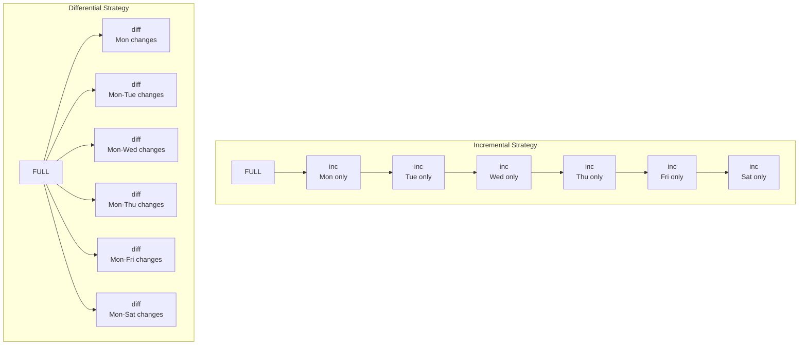

> **Operations — LFCS** | Complexity: `[COMPLEX]` | Time: 45-55 min

## Prerequisites

Before starting this module:
- **Required**: [Module 1.2: Processes & systemd](/linux/foundations/system-essentials/module-1.2-processes-systemd/) for understanding services and unit files
- **Required**: [Module 8.1: Storage Management](../module-8.1-storage-management/) for filesystem and mount point knowledge
- **Helpful**: [Module 2.1: Users & Groups](../module-8.3-package-user-management/) for understanding file ownership and permissions

---

## What You'll Be Able to Do

After this module, you will be able to:
- **Create** cron jobs and systemd timers for recurring tasks and explain when to use each
- **Implement** backup strategies (full, incremental, differential) using rsync, tar, and etcd snapshots
- **Design** a backup schedule with retention policies and verify restore procedures
- **Diagnose** cron job failures by checking logs, permissions, and environment variables

---

## Why This Module Matters

Every sysadmin eventually learns that there are two kinds of people: those who make backups, and those who wish they had. But backups are useless without automation, and automation is useless without scheduling. These two skills form a feedback loop that underpins all of operations.

Understanding scheduling and backups helps you:

- **Automate repetitive tasks** -- Log rotation, certificate renewal, report generation, cleanup scripts
- **Protect against data loss** -- Hardware fails, humans make mistakes, ransomware exists
- **Prove compliance** -- Auditors love documented, automated backup policies
- **Pass the LFCS exam** -- Cron, systemd timers, tar, and rsync appear across multiple exam domains

If you have ever manually run a script every morning because "I'll automate it later," this module is the one that finally makes you do it.

---

## Did You Know?

- **Cron is named after Chronos**, the Greek god of time. It was written by Ken Thompson for Unix Version 7 in 1979. The basic syntax has not changed in over 45 years -- a testament to how well it was designed (or how reluctant sysadmins are to learn something new).

- **The 3-2-1 backup rule was coined by photographer Peter Krogh** in his 2005 book about digital asset management. It spread to IT because photographers, like sysadmins, deal with irreplaceable data and unreliable storage.

- **rsync was created in 1996 by Andrew Tridgell** (who also co-created Samba). Its delta-transfer algorithm was part of his PhD thesis. Instead of copying entire files, rsync checksums blocks and only transfers the differences -- turning a 10GB copy into a 50MB transfer.

- **systemd timers can replace cron entirely** -- and on some modern distributions, the default scheduled tasks (like log rotation and temporary file cleanup) already use timers instead of cron. The transition is happening, but slowly.

---

## Part 1: Task Scheduling

### Cron -- The Classic Scheduler

Cron is the workhorse of Linux automation. It runs in the background, checks its schedule every minute, and executes commands at the times you specify.

#### Cron Syntax

Every cron entry has five time fields followed by the command:


Special characters:
- `*` -- Every value (wildcard)
- `,` -- List of values (`1,15` = 1st and 15th)
- `-` -- Range (`1-5` = Monday through Friday)
- `/` -- Step values (`*/5` = every 5 units)

> **Stop and think**: Want to see what a cron expression translates to in plain English? If you have a browser open, go to `crontab.guru` and type `*/15 9-17 * * 1-5`. It's a lifesaver for checking your work before committing a schedule.

#### Common Cron Patterns

```bash
# Every 5 minutes
*/5 * * * *  /usr/local/bin/check-health.sh

# Every day at 2:30 AM
30 2 * * *  /usr/local/bin/nightly-report.sh

# Every Monday at 9 AM
0 9 * * 1  /usr/local/bin/weekly-digest.sh

# First day of every month at midnight
0 0 1 * *  /usr/local/bin/monthly-cleanup.sh

# Every weekday at 6 PM
0 18 * * 1-5  /usr/local/bin/end-of-day.sh

# Every 15 minutes during business hours
*/15 9-17 * * 1-5  /usr/local/bin/business-check.sh
```

#### Shortcut Strings

Cron supports named shortcuts that are easier to read:

| Shortcut | Equivalent | Meaning |
|----------|-----------|---------|
| `@reboot` | *(runs once at startup)* | After every boot |
| `@yearly` / `@annually` | `0 0 1 1 *` | Midnight, January 1st |
| `@monthly` | `0 0 1 * *` | Midnight, first of month |
| `@weekly` | `0 0 * * 0` | Midnight on Sunday |
| `@daily` / `@midnight` | `0 0 * * *` | Midnight every day |
| `@hourly` | `0 * * * *` | Top of every hour |

#### Managing Crontabs

```bash
# Edit your personal crontab (opens in $EDITOR)
crontab -e

# List your current crontab entries
crontab -l

# Remove your entire crontab (DANGEROUS -- no confirmation!)
crontab -r

# Edit crontab for a specific user (requires root)
sudo crontab -u deploy -e

# List another user's crontab
sudo crontab -u deploy -l
```

> **Pause and predict**: What happens if you run `crontab -r` by accident? It deletes ALL your cron jobs without asking. Many sysadmins have accidentally typed `crontab -r` when they meant `crontab -e` (the keys are adjacent). Some people alias `crontab -r` to `crontab -ri` for safety.

#### System-Wide Cron Directories

Beyond per-user crontabs, Linux provides system-wide cron locations:

```bash
/etc/crontab              # System crontab (includes a username field)
/etc/cron.d/              # Drop-in cron files (same format as /etc/crontab)
/etc/cron.hourly/         # Scripts run every hour
/etc/cron.daily/          # Scripts run once a day
/etc/cron.weekly/         # Scripts run once a week
/etc/cron.monthly/        # Scripts run once a month
```

The `/etc/cron.d/` directory is the cleanest approach for system tasks -- each application can drop in its own file without editing a shared crontab.

The `cron.hourly/`, `cron.daily/`, etc. directories contain executable scripts (not crontab-format lines). The exact time they run depends on the system -- typically controlled by anacron or a cron entry in `/etc/crontab`.

> **Stop and think**: If you put a script in `/etc/cron.hourly/`, how do you pass arguments to it? You can't. Scripts in these directories are executed directly without arguments. If you need arguments, you must use `/etc/crontab` or a file in `/etc/cron.d/`.

```bash
# Example: /etc/cron.d/certbot (auto-renew Let's Encrypt certificates)
# The format includes a user field (root) that personal crontabs don't have
0 */12 * * * root certbot renew --quiet
```

#### Debugging Cron Jobs

When a cron job fails silently (and they will), here is how you investigate:

```bash
# Check syslog for cron execution
grep CRON /var/log/syslog          # Debian/Ubuntu
grep CRON /var/log/cron            # RHEL/Rocky

# Send cron output via email (add to crontab)
MAILTO=admin@example.com
30 2 * * * /usr/local/bin/backup.sh

# Redirect output to a log file (most common approach)
30 2 * * * /usr/local/bin/backup.sh >> /var/log/backup.log 2>&1

# Common cron failures:
# 1. PATH is minimal in cron -- use full paths to commands
# 2. Environment variables from .bashrc are NOT loaded
# 3. Script is not executable (chmod +x)
# 4. Script uses relative paths that don't resolve in cron's context
```

> **Stop and think**: Always test your cron command by running it manually first. Then add `>> /var/log/myscript.log 2>&1` to capture any output when it runs via cron.

---

### Systemd Timers -- The Modern Replacement

Systemd timers are the modern way to schedule tasks. They require two unit files: a `.timer` file (the schedule) and a `.service` file (the task).

#### Why Timers Over Cron

| Feature | Cron | Systemd Timers |
|---------|------|---------------|
| Persistent (runs missed jobs) | No | Yes (`Persistent=true`) |
| Dependency-aware | No | Yes (can require network, mounts, etc.) |
| Logging | Mail or redirect to file | Full journalctl integration |
| Resource control | None | CPU, memory, I/O limits via cgroups |
| Randomized delay | No | Yes (`RandomizedDelaySec`) |
| Calendar expressions | Limited (5 fields) | Rich (`OnCalendar=Mon..Fri *-*-* 09:00`) |
| Status/monitoring | `crontab -l` | `systemctl list-timers`, journal |

#### Creating a Timer

**Step 1**: Create the service file `/etc/systemd/system/backup.service`:

```ini
[Unit]
Description=Daily backup job
Wants=network-online.target
After=network-online.target

[Service]
Type=oneshot
ExecStart=/usr/local/bin/backup.sh
User=root
# Resource limits (timers support this, cron doesn't)
MemoryMax=512M
CPUQuota=50%
```

**Step 2**: Create the timer file `/etc/systemd/system/backup.timer`:

```ini
[Unit]
Description=Run backup daily at 2:30 AM

[Timer]
OnCalendar=*-*-* 02:30:00
Persistent=true
RandomizedDelaySec=300

[Install]
WantedBy=timers.target
```

**Step 3**: Enable and start:

```bash
# Reload systemd to pick up new files
sudo systemctl daemon-reload

# Enable the timer (not the service -- the timer triggers the service)
sudo systemctl enable --now backup.timer

# Verify
systemctl list-timers --all | grep backup
# NEXT                         LEFT       LAST  PASSED  UNIT          ACTIVATES
# Tue 2025-01-14 02:30:00 UTC  8h left    Mon   15h ago backup.timer  backup.service
```

#### OnCalendar Syntax

The `OnCalendar` format is more expressive than cron:

```ini
# Every day at midnight
OnCalendar=daily

# Every Monday and Friday at 9 AM
OnCalendar=Mon,Fri *-*-* 09:00:00

# Every 15 minutes
OnCalendar=*:0/15

# First day of every month
OnCalendar=*-*-01 00:00:00

# Every weekday at 6 PM
OnCalendar=Mon..Fri *-*-* 18:00:00
```

Test your expressions with `systemd-analyze calendar`:

```bash
systemd-analyze calendar "Mon..Fri *-*-* 09:00:00"
# Original form: Mon..Fri *-*-* 09:00:00
# Normalized form: Mon..Fri *-*-* 09:00:00
# Next elapse: Mon 2025-01-13 09:00:00 UTC
# (in UTC) Mon 2025-01-13 09:00:00 UTC
# From now: 2 days left
```

> **Stop and think**: Test this on your own system. Run `systemd-analyze calendar "Fri *-*-13 00:00:00"`. When is the next time Friday the 13th happens? Systemd will calculate it instantly.

#### Monitoring Timers

```bash
# List all active timers with next/last run times
systemctl list-timers

# Check timer status
systemctl status backup.timer

# Check service logs after it runs
journalctl -u backup.service --since today

# Manually trigger the service (for testing)
sudo systemctl start backup.service
```

---

### at -- One-Time Scheduled Tasks

While cron handles recurring schedules, `at` is for one-off tasks: "run this command once at a specific time."

```bash
# Install at (if not present)
sudo apt install -y at          # Debian/Ubuntu
sudo dnf install -y at          # RHEL/Rocky

# Enable the at daemon
sudo systemctl enable --now atd

# Schedule a task for 3 PM today
echo "/usr/local/bin/deploy.sh" | at 15:00

# Schedule for a specific date and time
echo "reboot" | at 02:00 AM December 25

# Schedule relative to now
echo "/usr/local/bin/cleanup.sh" | at now + 30 minutes
echo "/usr/local/bin/report.sh" | at now + 2 hours

# List pending at jobs
atq
# 3   Tue Jan 14 15:00:00 2025 a user
# 4   Thu Dec 25 02:00:00 2025 a user

# View the contents of a pending job
at -c 3

# Remove a pending job
atrm 3
```

> **Pause and predict**: When should you use `at` vs cron? Use `at` for tasks you want to run exactly once -- a scheduled reboot, a one-time data migration, or a reminder. Use cron for anything recurring.

---

### Anacron -- Scheduling for Machines That Sleep

Standard cron assumes the machine is always on. If a cron job is scheduled for 2 AM and the laptop is closed, the job is simply skipped. Anacron solves this.

Anacron does not run continuously. It checks timestamps at boot (and periodically) to determine whether a job is overdue, then runs it. This makes it ideal for laptops, desktops, and any machine with irregular uptime.

```bash
# Anacron configuration: /etc/anacrontab
# Format: period(days)  delay(minutes)  job-id  command

# Run daily jobs, with a 5-minute delay after boot
1   5   daily-backup    /usr/local/bin/backup.sh

# Run weekly jobs, with a 10-minute delay
7   10  weekly-cleanup  /usr/local/bin/cleanup.sh

# Run monthly jobs, with a 15-minute delay
30  15  monthly-report  /usr/local/bin/report.sh
```

```bash
# Check when anacron last ran each job
ls -la /var/spool/anacron/
# -rw------- 1 root root 9 Jan 14 03:05 daily-backup
# The file content is a date stamp: 20250114

# Force anacron to run all overdue jobs now
sudo anacron -f -n
# -f = force (ignore timestamps)
# -n = now (don't wait for delay)

# Test without executing (dry run)
sudo anacron -T
```

On most modern systems, the `cron.daily/`, `cron.weekly/`, and `cron.monthly/` directories are actually triggered by anacron, not by cron itself. This ensures those maintenance tasks run even on machines with variable uptime.

---

## Part 2: Backups and Archives

### A War Story: The Backup That Wasn't

A mid-size e-commerce company ran nightly backups of their PostgreSQL database to a network share. The cron job ran dutifully every night. Nagios showed green. The backup script exited with code 0. Life was good -- for six months.

Then a developer accidentally ran a `DROP TABLE` on the production orders table. No problem, they thought, we have backups. The DBA went to restore and discovered that the backup script had been silently failing since a password rotation six months earlier. The `pg_dump` command returned an authentication error, wrote an empty file, and exited 0 because the script used `pg_dump ... ; gzip` instead of `pg_dump ... && gzip` -- the gzip succeeded on the empty file, so the script exited cleanly. Six months of empty `.sql.gz` files, each about 20 bytes.

They recovered partial data from application logs and read replicas. They lost three months of historical order data.

**The lessons**:
1. **A backup you never test is not a backup** -- it is a hope
2. **Check backup file sizes** -- a 20-byte database dump is not a good sign
3. **Use `set -e` in scripts** or chain commands with `&&`, never `;`
4. **Test restores on a schedule** -- monthly at minimum

---

### tar -- The Universal Archive Tool

`tar` (tape archive) bundles files and directories into a single archive. Despite the name referencing tape drives, it remains the standard archiving tool on Linux.

#### Creating Archives

```bash
# Create a gzip-compressed archive
tar -czf backup.tar.gz /home/user/documents

# Create a bzip2-compressed archive
tar -cjf backup.tar.bz2 /home/user/documents

# Create an xz-compressed archive (best compression, slowest)
tar -cJf backup.tar.xz /home/user/documents

# Create without compression (just bundle files)
tar -cf backup.tar /home/user/documents

# Verbose output (see what's being archived)
tar -czvf backup.tar.gz /home/user/documents
```

The flags break down logically:
- `-c` = **c**reate
- `-z` = g**z**ip, `-j` = b**j**ip2 (bzip2), `-J` = x**J** (xz)
- `-f` = **f**ilename (must be last flag before the filename)
- `-v` = **v**erbose

#### Extracting Archives

```bash
# Extract gzip archive
tar -xzf backup.tar.gz

# Extract to a specific directory
tar -xzf backup.tar.gz -C /tmp/restore

# Extract bzip2 archive
tar -xjf backup.tar.bz2

# Extract xz archive
tar -xJf backup.tar.xz

# Extract a single file from an archive
tar -xzf backup.tar.gz home/user/documents/important.txt
```

#### Listing Archive Contents

```bash
# List contents without extracting
tar -tzf backup.tar.gz

# List with details (like ls -l)
tar -tzvf backup.tar.gz
```

#### Compression Comparison

| Method | Flag | Extension | Speed | Ratio | Best For |
|--------|------|-----------|-------|-------|----------|
| None | *(none)* | `.tar` | Fastest | 1:1 | Already-compressed data |
| gzip | `-z` | `.tar.gz` | Fast | Good | Daily backups (best balance) |
| bzip2 | `-j` | `.tar.bz2` | Slow | Better | Archival storage |
| xz | `-J` | `.tar.xz` | Slowest | Best | Distribution tarballs, long-term storage |

> **Stop and think**: As a rule of thumb, use gzip for daily backups (speed matters), xz for archives you will keep for months or years (ratio matters), and skip compression for data that is already compressed (images, videos, encrypted files).

---

### rsync -- Smart Synchronization

rsync is the Swiss Army knife of file transfer. Unlike `cp`, rsync only transfers what has changed, can resume interrupted transfers, and works over SSH for remote copies.

#### Local Synchronization

```bash
# Sync a directory (trailing slash matters!)
rsync -av /home/user/documents/ /backup/documents/
# -a = archive mode (preserves permissions, timestamps, symlinks, etc.)
# -v = verbose

# IMPORTANT: trailing slash on source means "contents of"
rsync -av /source/  /dest/    # Copies contents of /source into /dest
rsync -av /source   /dest/    # Copies /source directory itself into /dest
# Result: /dest/file.txt  vs  /dest/source/file.txt
```

> **Stop and think**: Experience the trailing slash difference yourself. Open your terminal and run:
> ```bash
> mkdir -p /tmp/source_dir /tmp/dest1 /tmp/dest2
> touch /tmp/source_dir/file.txt
> rsync -av /tmp/source_dir /tmp/dest1/
> rsync -av /tmp/source_dir/ /tmp/dest2/
> ```
> Now run `ls /tmp/dest1` and `ls /tmp/dest2`. The difference will be permanently burned into your memory.

#### Remote Synchronization

```bash
# Push local files to remote server
rsync -avz -e ssh /home/user/documents/ user@backup-server:/backups/documents/
# -z = compress during transfer (saves bandwidth)
# -e ssh = use SSH as the transport

# Pull remote files to local machine
rsync -avz -e ssh user@backup-server:/data/ /local/data/

# Use a specific SSH key
rsync -avz -e "ssh -i ~/.ssh/backup_key" /data/ user@remote:/backups/
```

#### Advanced rsync Options

```bash
# Mirror mode: make destination an exact copy (DELETES files not in source)
rsync -av --delete /source/ /dest/

# Dry run: see what would happen without doing anything
rsync -av --dry-run --delete /source/ /dest/

# Exclude files or directories
rsync -av --exclude='*.log' --exclude='.cache' /home/user/ /backup/user/

# Exclude from a file
rsync -av --exclude-from='/etc/backup-excludes.txt' /home/ /backup/home/

# Bandwidth limit (useful for production servers)
rsync -avz --bwlimit=5000 /data/ user@remote:/backup/
# 5000 = 5000 KB/s (about 5 MB/s)

# Show progress
rsync -av --progress /large-file.iso /backup/
```

#### Why rsync Beats cp

| Scenario | cp | rsync |
|----------|----|----|
| 10GB directory, 50MB changed | Copies all 10GB | Copies only 50MB |
| Transfer interrupted halfway | Start over | Resumes from where it stopped |
| Remote copy | Not possible | Built-in SSH support |
| Preserve hard links | `cp -a` (sometimes) | `rsync -aH` (always) |
| Bandwidth control | None | `--bwlimit` |
| Dry run | Not possible | `--dry-run` |

---

### Backup Strategies

#### Full, Incremental, and Differential

Understanding these three strategies is essential for designing backup systems:



| Strategy | Backup Size | Restore Speed | Restore Complexity |
|----------|------------|---------------|-------------------|
| **Full** | Largest | Fastest | Simplest (1 backup needed) |
| **Incremental** | Smallest | Slowest | Most complex (full + all incrementals) |
| **Differential** | Medium | Medium | Moderate (full + latest differential) |

- **Full backup**: Complete copy of everything. Simple but slow and storage-heavy.
- **Incremental**: Only what changed since the *last backup* (full or incremental). Smallest backups, but restoring requires the full backup plus every incremental in sequence.
- **Differential**: Only what changed since the *last full backup*. Grows over the week, but restoring only needs the full backup plus the latest differential.

#### The 3-2-1 Rule

The gold standard for backup design:

```
3 copies of your data
  (1 primary + 2 backups)

2 different storage types
  (e.g., local disk + cloud, or SSD + tape)

1 copy offsite
  (survives fire, flood, ransomware, theft)
```

This is not paranoia -- it is probability. A single hard drive has roughly a 1-2% annual failure rate. Two independent drives failing simultaneously is rare but not impossible (especially drives from the same batch). Adding an offsite copy protects against correlated failures: the fire that destroys the server room destroys both local copies.

> **Pause and predict**: If you use a cloud sync service to mirror your `Documents` folder, does that count as a backup under the 3-2-1 rule? (Hint: If you accidentally delete a file locally, or a ransomware encrypts it, those changes are immediately synced to the cloud. Sync is not backup!)

#### Testing Restores

A backup strategy is incomplete without regular restore testing. Schedule restore tests at least quarterly:

```bash
# Restore to a temporary location (never overwrite production)
mkdir -p /tmp/restore-test
tar -xzf /backup/daily/2025-01-14.tar.gz -C /tmp/restore-test

# Verify file counts match
find /tmp/restore-test -type f | wc -l

# Verify file integrity (if you stored checksums)
cd /tmp/restore-test && md5sum -c /backup/checksums/2025-01-14.md5

# Clean up
rm -rf /tmp/restore-test
```

---

### Practical: Automated Daily Backup with rsync + Cron

Here is a production-ready backup script that combines everything from this module:

```bash
#!/bin/bash
# /usr/local/bin/daily-backup.sh
# Automated daily backup using rsync with rotation

set -euo pipefail

# Configuration
BACKUP_SOURCE="/home /etc /var/www"
BACKUP_DEST="/backup"
REMOTE_DEST="backupuser@offsite:/backups/$(hostname)"
LOG_FILE="/var/log/daily-backup.log"
RETENTION_DAYS=30
DATE=$(date +%Y-%m-%d)
DAILY_DIR="${BACKUP_DEST}/daily/${DATE}"

# Logging function
log() {
    echo "[$(date '+%Y-%m-%d %H:%M:%S')] $1" >> "${LOG_FILE}"
}

log "=== Backup started ==="

# Create daily backup directory
mkdir -p "${DAILY_DIR}"

# Rsync each source directory
for src in ${BACKUP_SOURCE}; do
    dir_name=$(basename "${src}")
    log "Backing up ${src} ..."
    rsync -a --delete \
        --exclude='*.tmp' \
        --exclude='.cache' \
        --exclude='node_modules' \
        "${src}/" "${DAILY_DIR}/${dir_name}/" 2>> "${LOG_FILE}"
    log "  Done: ${src}"
done

# Create compressed archive of today's backup
log "Compressing backup ..."
tar -czf "${BACKUP_DEST}/archives/${DATE}.tar.gz" -C "${DAILY_DIR}" . 2>> "${LOG_FILE}"
log "  Archive size: $(du -sh "${BACKUP_DEST}/archives/${DATE}.tar.gz" | cut -f1)"

# Verify archive is not empty (lesson from our war story)
ARCHIVE_SIZE=$(stat -c%s "${BACKUP_DEST}/archives/${DATE}.tar.gz" 2>/dev/null || stat -f%z "${BACKUP_DEST}/archives/${DATE}.tar.gz")
if [ "${ARCHIVE_SIZE}" -lt 1024 ]; then
    log "ERROR: Archive suspiciously small (${ARCHIVE_SIZE} bytes). Backup may have failed!"
    echo "BACKUP ALERT: Archive too small on $(hostname)" | mail -s "Backup Failed" admin@example.com
    exit 1
fi

# Copy to offsite (the "1" in 3-2-1)
log "Syncing to offsite ..."
rsync -az -e ssh "${BACKUP_DEST}/archives/${DATE}.tar.gz" "${REMOTE_DEST}/" 2>> "${LOG_FILE}"
log "  Offsite sync complete"

# Rotate old backups (keep RETENTION_DAYS days)
log "Rotating backups older than ${RETENTION_DAYS} days ..."
find "${BACKUP_DEST}/daily/" -maxdepth 1 -type d -mtime +${RETENTION_DAYS} -exec rm -rf {} \;
find "${BACKUP_DEST}/archives/" -name "*.tar.gz" -mtime +${RETENTION_DAYS} -delete
log "  Rotation complete"

log "=== Backup finished successfully ==="
```

Make the script executable and schedule it:

```bash
# Make executable
sudo chmod +x /usr/local/bin/daily-backup.sh

# Create backup directories
sudo mkdir -p /backup/{daily,archives}

# Test manually first
sudo /usr/local/bin/daily-backup.sh

# Check the log
tail -20 /var/log/daily-backup.log

# Schedule via cron (runs at 2:30 AM daily)
sudo crontab -e
# Add this line:
# 30 2 * * * /usr/local/bin/daily-backup.sh
```

Or schedule via systemd timer for better logging and persistence:

```bash
# /etc/systemd/system/daily-backup.service
[Unit]
Description=Daily backup
Wants=network-online.target
After=network-online.target

[Service]
Type=oneshot
ExecStart=/usr/local/bin/daily-backup.sh
```

```bash
# /etc/systemd/system/daily-backup.timer
[Unit]
Description=Run daily backup at 2:30 AM

[Timer]
OnCalendar=*-*-* 02:30:00
Persistent=true
RandomizedDelaySec=600

[Install]
WantedBy=timers.target
```

```bash
sudo systemctl daemon-reload
sudo systemctl enable --now daily-backup.timer
systemctl list-timers | grep backup
```

---

## Common Mistakes

| Mistake | What Happens | Fix |
|---------|-------------|-----|
| No `PATH` in cron | Commands not found; silent failure | Set `PATH=/usr/local/bin:/usr/bin:/bin` at top of crontab, or use full paths |
| `crontab -r` instead of `crontab -e` | All cron jobs deleted instantly, no undo | Back up crontab: `crontab -l > ~/crontab.bak`; alias `-r` to `-ri` |
| Using `;` instead of `&&` in scripts | Later commands run even if earlier ones fail | Use `set -euo pipefail` or chain with `&&` |
| rsync trailing slash confusion | Directory nested inside itself (`/dest/source/files`) | Remember: trailing `/` means "contents of," no slash means "this directory" |
| Never testing restores | Discover backups are corrupt/empty during an actual disaster | Schedule quarterly restore tests; automate verification |
| tar without `-z`, `-j`, or `-J` for compressed files | "This does not look like a tar archive" error | Match the flag to the file extension (`.gz` = `-z`, `.bz2` = `-j`, `.xz` = `-J`) |
| Cron job with `%` in command | `%` is a newline in cron; command is truncated | Escape as `\%` or put the command in a script |
| No log rotation for backup logs | `/var/log/backup.log` grows until disk is full | Add a logrotate config or truncate in the script |
| `--delete` without `--dry-run` first | Files permanently deleted from destination | Always test with `rsync --dry-run --delete` before the real run |
| Forgetting `Persistent=true` on timers | Missed jobs after downtime are never run | Always set `Persistent=true` for important maintenance timers |

---

## Quiz

Test your scheduling and backup knowledge:

**Question 1**: Your company's log server is running out of disk space every weekend. You wrote a script at `/usr/local/bin/cleanup.sh` to archive old logs. To minimize impact on active users, you need this script to execute exactly at 3:15 AM every Sunday. What is the correct crontab entry to achieve this?

<details>
<summary>Show Answer</summary>

```
15 3 * * 0  /usr/local/bin/cleanup.sh
```

The cron format expects five time-and-date fields followed by the command: minute, hour, day of month, month, and day of week. By setting the minute to `15` and the hour to `3`, you specify the exact time of 3:15 AM. Leaving the day of month and month as wildcards (`*`) ensures it runs regardless of the date, while setting the day of week to `0` (or `7`) restricts the execution strictly to Sundays. Using a shortcut like `@weekly` would not work here because it defaults to midnight, missing your specific maintenance window.

</details>

**Question 2**: You manage a fleet of developer laptops that run a daily systemd timer for backing up local code repositories at 2:00 AM. Developers frequently close their laptops and take them home at 6:00 PM, only opening them again at 9:00 AM. What systemd timer configuration directive ensures these backups still happen, and how does it function in this scenario?

<details>
<summary>Show Answer</summary>

The critical directive you need is `Persistent=true` in the `[Timer]` section of your systemd timer unit. When a system is powered off or asleep during a scheduled execution time, standard cron jobs simply miss their window and are skipped until the next occurrence. By setting `Persistent=true`, systemd records the time the timer last triggered on disk. When the developer opens their laptop at 9:00 AM, systemd checks this record, realizes the 2:00 AM backup was missed, and immediately executes the service to catch up, ensuring data is not left unprotected.

</details>

**Question 3**: A junior admin was tasked with migrating the `/var/www/html` directory to a new backup disk mounted at `/mnt/backup`. They executed `rsync -av /var/www/html /mnt/backup/` but then panicked because the backup disk didn't contain `index.html` at the root, but instead had a nested `html` folder. What caused this behavior, and how should the command have been written to avoid it?

<details>
<summary>Show Answer</summary>

The junior admin omitted the trailing slash on the source directory, which fundamentally changes how `rsync` interprets the command. When you run `rsync -av /var/www/html` (without a trailing slash), rsync reads it as "copy this specific directory and place it inside the destination," resulting in `/mnt/backup/html/index.html`. To achieve the intended result of copying the contents directly, the command should have been `rsync -av /var/www/html/ /mnt/backup/`. The trailing slash instructs rsync to copy the *contents* of the source directory rather than the directory itself, ensuring files like `index.html` land directly in `/mnt/backup/`.

</details>

**Question 4**: You are designing a disaster recovery policy for a critical database. Your manager suggests simply copying the database dump to a secondary local hard drive every night to save costs. How would you apply the 3-2-1 backup rule to explain the vulnerabilities in their plan, and what specific scenarios does each component of the rule protect against?

<details>
<summary>Show Answer</summary>

The manager's plan violates almost every tenet of the 3-2-1 backup rule, which requires 3 total copies of data, stored on 2 different media types, with 1 copy kept offsite. Having only 3 copies (the primary data and two backups) ensures that if one backup is found to be corrupted during a restore attempt, a fallback exists. Using 2 different media types (e.g., SSD and cloud object storage, or hard drive and tape) mitigates the risk of a single hardware defect or firmware bug wiping out all copies simultaneously. Finally, requiring 1 copy offsite is critical because the manager's secondary local hard drive would be instantly destroyed or compromised by site-wide disasters like fires, floods, or a ransomware infection spreading across the local network.

</details>

**Question 5**: A database migration script scheduled in cron runs `pg_dump production_db > backup.sql; gzip backup.sql`. After a major database crash, you attempt to restore the backup but find that `backup.sql.gz` is only 20 bytes long. Checking the system logs reveals that the database was restarting exactly when the cron job ran. Why did the script finish without reporting an error, and how should it be rewritten to prevent this silent failure?

<details>
<summary>Show Answer</summary>

The silent failure occurred because the script used a semicolon (`;`) to separate commands, which instructs the shell to execute the second command regardless of whether the first one succeeded or failed. When the database was restarting, `pg_dump` failed to connect and produced an empty `backup.sql` file, but then `gzip` happily compressed that empty file and exited with a successful status code of 0. To fix this, you should chain the commands with the logical AND operator (`&&`), like `pg_dump production_db > backup.sql && gzip backup.sql`, so that compression only occurs if the dump succeeds. Alternatively, using a pipe with `set -o pipefail` (e.g., `pg_dump production_db | gzip > backup.sql.gz`) is even more robust and saves disk space by avoiding the intermediate uncompressed file.

</details>

**Question 6**: The financial compliance team needs a script to pull stock market data at the start of trading hours. They have requested a systemd timer that triggers the data collection service exclusively from Monday through Friday, precisely at 9:00 AM. What `OnCalendar` expression accurately captures this complex scheduling requirement?

<details>
<summary>Show Answer</summary>

```ini
OnCalendar=Mon..Fri *-*-* 09:00:00
```

Systemd timers use a highly expressive calendar event syntax formatted as `DayOfWeek Year-Month-Day Hour:Minute:Second`. By specifying `Mon..Fri`, you instruct the timer to restrict execution to weekdays, entirely skipping the weekend. The `*-*-*` portion acts as a wildcard for the date, meaning it matches every year, month, and day of the month. Finally, `09:00:00` locks the execution to the exact time required by the compliance team. You can always validate such expressions before deploying them by running `systemd-analyze calendar "Mon..Fri *-*-* 09:00:00"`.

</details>

**Question 7**: A developer used the `at` command to schedule an emergency patch deployment script to run at midnight. An hour later, they realize the script contains a critical bug that will corrupt the database. How can they view the queue of scheduled one-off tasks to find their specific job, and what command must they run to cancel the job identified as task number 5 before it executes?

<details>
<summary>Show Answer</summary>

To view the queue of pending one-off tasks, the developer should use the `atq` command, which lists all scheduled jobs along with their job IDs, execution times, and the user who scheduled them. Once they identify the erroneous deployment script as job ID 5, they must execute `atrm 5` to remove it from the queue. If they are unsure whether job 5 is indeed their script, they can inspect the exact commands scheduled to run by typing `at -c 5` before issuing the removal command, preventing accidental deletion of a different critical task.

</details>

---

## Hands-On Exercise: Build an Automated Backup System

**Objective**: Set up a cron-scheduled backup using tar and rsync, verify the backup, and practice restoring from it.

**Environment**: Any Linux system (VM, WSL, or bare metal). No special hardware needed.

### Setup

```bash
# Create a "production" directory with sample data
mkdir -p ~/lab/production/{config,data,logs}
echo "database_url=postgres://localhost/myapp" > ~/lab/production/config/app.conf
echo "secret_key=abc123" > ~/lab/production/config/secrets.conf
dd if=/dev/urandom of=~/lab/production/data/records.db bs=1K count=500
for i in $(seq 1 100); do echo "$(date) Log entry $i" >> ~/lab/production/logs/app.log; done

# Create backup destination
mkdir -p ~/lab/backups/{daily,archives}
```

### Task 1: Create a Backup Script

Create `~/lab/backup.sh`:

```bash
#!/bin/bash
set -euo pipefail

BACKUP_SRC="$HOME/lab/production"
BACKUP_DST="$HOME/lab/backups"
DATE=$(date +%Y-%m-%d_%H%M%S)
LOG="$HOME/lab/backups/backup.log"

echo "[$(date)] Starting backup" >> "$LOG"

# Rsync to daily directory
rsync -a --delete \
    --exclude='*.log' \
    "$BACKUP_SRC/" "$BACKUP_DST/daily/latest/"

# Create dated archive
tar -czf "$BACKUP_DST/archives/backup-${DATE}.tar.gz" \
    -C "$BACKUP_DST/daily/latest" .

# Verify archive size
SIZE=$(wc -c < "$BACKUP_DST/archives/backup-${DATE}.tar.gz")
if [ "$SIZE" -lt 100 ]; then
    echo "[$(date)] ERROR: Archive too small ($SIZE bytes)" >> "$LOG"
    exit 1
fi

echo "[$(date)] Backup complete: backup-${DATE}.tar.gz ($SIZE bytes)" >> "$LOG"
```

```bash
chmod +x ~/lab/backup.sh
```

### Task 2: Test the Script Manually

```bash
# Run it
~/lab/backup.sh

# Verify
ls -la ~/lab/backups/archives/
cat ~/lab/backups/backup.log
tar -tzf ~/lab/backups/archives/backup-*.tar.gz | head -10
```

### Task 3: Schedule with Cron

```bash
# Add a cron job (runs every 2 minutes for testing purposes)
crontab -e
# Add: */2 * * * * /home/$USER/lab/backup.sh
```

Wait 4-5 minutes, then verify:

```bash
# Check that multiple archives were created
ls -la ~/lab/backups/archives/

# Check the log for multiple entries
cat ~/lab/backups/backup.log
```

### Task 4: Simulate Disaster and Restore

```bash
# "Disaster" -- delete production data
rm -rf ~/lab/production/data/records.db

# Verify it's gone
ls ~/lab/production/data/
# (empty)

# Restore from the latest archive
LATEST=$(ls -t ~/lab/backups/archives/*.tar.gz | head -1)
mkdir -p /tmp/restore-test
tar -xzf "$LATEST" -C /tmp/restore-test

# Verify restored data
ls -la /tmp/restore-test/data/
# records.db should be there

# Copy it back to production
cp /tmp/restore-test/data/records.db ~/lab/production/data/

# Verify
ls -la ~/lab/production/data/records.db
```

### Task 5: Clean Up

```bash
# Remove the test cron job
crontab -e
# Delete the line you added

# Verify cron is clean
crontab -l

# Remove lab files
rm -rf ~/lab /tmp/restore-test
```

### Success Criteria

- [ ] Backup script created with `set -euo pipefail` and size verification
- [ ] Script tested manually and produces a valid `.tar.gz` archive
- [ ] Cron job scheduled and confirmed running by checking multiple archives
- [ ] Simulated data loss and successfully restored from archive
- [ ] Cron job removed and lab environment cleaned up

---

## Next Module

You now have the skills to automate anything on a schedule and protect data with proper backups. Return to the [LFCS Learning Path](/k8s/lfcs/) to review remaining study areas, or revisit [Module 8.1: Storage Management](../module-8.1-storage-management/) if you want to combine LVM snapshots with your backup strategy.