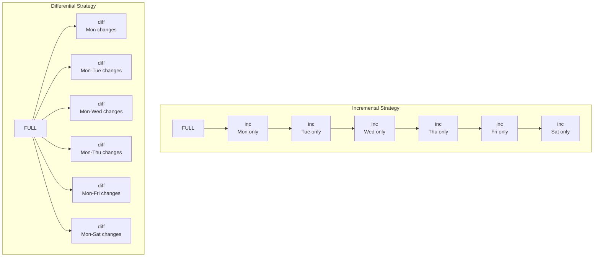

# Module 8.4: Task Scheduling and Backup Strategies

> **Operations — LFCS** | Complexity: `[COMPLEX]` | Time: 45-55 min. This lesson treats scheduling and backups as one reliability practice, because a backup that is not scheduled will be forgotten and a scheduled job that cannot be restored is only noise.

## Prerequisites

Before starting this module, make sure you are comfortable reading service state, interpreting basic filesystem layout, and thinking about Unix permissions. The examples use ordinary Linux paths and commands, but the operational judgment depends on knowing which user owns a job, which mount contains the data, and which service manager starts the work.
- **Required**: [Module 1.2: Processes & systemd](/linux/foundations/system-essentials/module-1.2-processes-systemd/) for understanding services and unit files
- **Required**: [Module 8.1: Storage Management](../module-8.1-storage-management/) for filesystem and mount point knowledge
- **Helpful**: [Module 2.1: Users & Groups](../module-8.3-package-user-management/) for understanding file ownership and permissions

## Learning Outcomes

After this module, you will be able to perform four concrete operations that are visible in the quiz and lab. Each outcome requires applying a tool choice to a scenario rather than recalling a command from memory, because real scheduling and backup failures usually come from mismatched assumptions instead of missing syntax.
- **Design** a scheduling plan that compares cron, systemd timers, `at`, and anacron for recurring, one-time, and intermittent-host workloads.
- **Implement** an automated backup workflow that combines `rsync`, `tar`, full backups, incremental backups, differential backups, retention, and safe offsite copies.
- **Diagnose** failed scheduled jobs by inspecting logs, permissions, shell environment, command output, timer state, archive size, and restore evidence.
- **Evaluate** restore readiness by applying the 3-2-1 rule, testing recovery into a temporary location, and accounting for Kubernetes 1.35+ etcd snapshots where clusters are involved.

## Why This Module Matters

At 02:30 on a quiet Tuesday, an online retailer's order database began returning corrupted records after a storage controller failed during a routine batch job. The on-call engineer was not worried at first because the dashboard showed a green nightly backup, a green network share, and a green cron status line. By sunrise, the team learned that their scheduled backup had been writing empty archives for weeks after a credential rotation, and the last usable restore point was old enough to force manual reconciliation from payment processor exports and application logs.

The painful part of that incident was not that a disk failed or that a human changed a password. Those are ordinary operational events. The expensive failure was that scheduling and backup design were treated as clerical tasks instead of as a control system: no meaningful exit handling, no archive-size check, no restore drill, no offsite copy that could survive local damage, and no schedule that matched how the service actually behaved under maintenance.

This module teaches scheduling and backups as one operational discipline. A scheduler chooses when work should happen, but a backup plan defines what work is worth scheduling, how failure becomes visible, and how recovery will be proven before anyone is desperate. You will start with cron because it is still everywhere, move through systemd timers, `at`, and anacron, then connect those schedulers to archive creation, synchronization, retention, restore testing, and Kubernetes 1.35+ cluster backup boundaries.

## Scheduling Is an Operational Contract

Scheduling looks simple because the visible syntax is small: five cron fields, one `OnCalendar` expression, or a short `at` command. The harder engineering question is not "how do I run this at 02:30?" but "what assumptions must be true when this command runs without a human watching?" A scheduled job inherits a sparse environment, runs with a specific user identity, depends on mounts and network paths that may not be ready, and often fails when logs are least visible. Treat every schedule as an operational contract between time, dependencies, permissions, observability, and recovery.

Cron is the classic scheduler because it solves the common case with very little machinery. The daemon wakes up every minute, compares the current time against crontab entries, and runs matching commands as the owner of that crontab. That simplicity is why cron jobs still power log rotation, report generation, certificate renewal, disk cleanup, and backup scripts on systems that otherwise use modern service managers. The tradeoff is that cron knows almost nothing about dependencies, missed runs, resource limits, or structured logs unless you add those behaviors yourself.

Every cron entry has five time fields followed by the command. The minute field is checked first, then hour, day of month, month, and day of week. This compact shape is easy to memorize, but it is also easy to misread during an outage, so experienced operators keep expressions boring, comment the reason for the schedule, and test the exact command manually before placing it under automation.


Cron's special characters compact a large amount of intent into one line, so read them as scheduling operators rather than punctuation. The list below is small, but each symbol changes how often the command runs and therefore changes load, risk, and alert volume.
- `*` -- Every value (wildcard)
- `,` -- List of values (`1,15` = 1st and 15th)
- `-` -- Range (`1-5` = Monday through Friday)
- `/` -- Step values (`*/5` = every 5 units)

The special characters are not decoration; they are how you express operational intent. A wildcard says the field is irrelevant, a comma says several exact values matter, a range says a continuous window matters, and a step says regular cadence matters more than a particular named moment. When a job is important, write the expression so another engineer can infer the intent from the shape rather than from tribal memory.

```bash
# Every 5 minutes
*/5 * * * *  /usr/local/bin/check-health.sh

# Every day at 2:30 AM
30 2 * * *  /usr/local/bin/nightly-report.sh

# Every Monday at 9 AM
0 9 * * 1  /usr/local/bin/weekly-digest.sh

# First day of every month at midnight
0 0 1 * *  /usr/local/bin/monthly-cleanup.sh

# Every weekday at 6 PM
0 18 * * 1-5  /usr/local/bin/end-of-day.sh

# Every 15 minutes during business hours
*/15 9-17 * * 1-5  /usr/local/bin/business-check.sh
```

Pause and predict: if `*/15 9-17 * * 1-5` runs during business hours, does it fire at 17:45? The answer is yes, because the hour range includes the entire hour whose value is 17, and the minute step continues through that hour. That may be exactly right for a monitoring probe, but it may be wrong for a trading or billing task where the final legal window ends at 17:00 sharp.

Cron also provides shortcut strings that improve readability when the exact minute does not matter. These shortcuts are useful for human-facing maintenance tasks, but they hide some precision. For example, `@weekly` is not "during the weekly maintenance window"; it is midnight on Sunday unless the implementation or surrounding system changes how periodic directories are launched.

| Shortcut | Equivalent | Meaning |
|----------|-----------|---------|
| `@reboot` | *(runs once at startup)* | After every boot |
| `@yearly` / `@annually` | `0 0 1 1 *` | Midnight, January 1st |
| `@monthly` | `0 0 1 * *` | Midnight, first of month |
| `@weekly` | `0 0 * * 0` | Midnight on Sunday |
| `@daily` / `@midnight` | `0 0 * * *` | Midnight every day |
| `@hourly` | `0 * * * *` | Top of every hour |

Crontabs are edited per user, and that detail matters more than beginners expect. A job in your personal crontab runs as you, with your permissions, your home directory, and a reduced environment. A job in root's crontab runs with much broader power, which may be necessary for system backups but dangerous for scripts that have not been reviewed for quoting, path handling, and destructive operations.

```bash
# Edit your personal crontab (opens in $EDITOR)
crontab -e

# List your current crontab entries
crontab -l

# Remove your entire crontab (DANGEROUS -- no confirmation!)
crontab -r

# Edit crontab for a specific user (requires root)
sudo crontab -u deploy -e

# List another user's crontab
sudo crontab -u deploy -l
```

Pause and predict: what happens if you run `crontab -r` when you meant `crontab -e`? It removes the whole crontab for that user, usually without a useful undo path unless you previously exported it. Many production teams add `crontab -l > ~/crontab.bak` to their change procedure or alias removal to interactive mode on personal shells, because a scheduler with no version history is a fragile place to store business logic.

System-wide cron locations exist because some jobs belong to the machine or an installed package rather than to a login user. The file format changes slightly depending on location, and this is a common source of broken schedules. Files under `/etc/cron.d/` and `/etc/crontab` include a username field, while personal crontabs do not, so copying a line between those contexts without adjusting it can make a valid-looking job fail.

```bash
/etc/crontab              # System crontab (includes a username field)
/etc/cron.d/              # Drop-in cron files (same format as /etc/crontab)
/etc/cron.hourly/         # Scripts run every hour
/etc/cron.daily/          # Scripts run once a day
/etc/cron.weekly/         # Scripts run once a week
/etc/cron.monthly/        # Scripts run once a month
```

The `/etc/cron.d/` directory is the cleanest approach for system tasks because each application can own one drop-in file without editing a shared crontab. The periodic directories are different: they contain executable scripts, not crontab expressions, and the exact launch time is often controlled by anacron or a distribution-provided entry. If a command needs arguments, environment variables, or careful output handling, a small wrapper script plus an explicit cron entry is usually easier to operate than a clever one-liner.

```bash
# Example: /etc/cron.d/certbot (auto-renew Let's Encrypt certificates)
# The format includes a user field (root) that personal crontabs don't have
0 */12 * * * root certbot renew --quiet
```

The first debugging rule for cron is that a command that works in your interactive shell has not yet been tested for cron. Your shell probably loads profile files, sets a larger `PATH`, has a working directory you recognize, and may include credentials or agent sockets. Cron starts from a smaller world. Good cron jobs use absolute paths, write output somewhere durable, return nonzero on failure, and avoid assumptions about interactive shell state.

```bash
# Check syslog for cron execution
grep CRON /var/log/syslog          # Debian/Ubuntu
grep CRON /var/log/cron            # RHEL/Rocky

# Send cron output via email (add to crontab)
MAILTO=admin@example.com
30 2 * * * /usr/local/bin/backup.sh

# Redirect output to a log file (most common approach)
30 2 * * * /usr/local/bin/backup.sh >> /var/log/backup.log 2>&1

# Common cron failures:
# 1. PATH is minimal in cron -- use full paths to commands
# 2. Environment variables from .bashrc are NOT loaded
# 3. Script is not executable (chmod +x)
# 4. Script uses relative paths that don't resolve in cron's context
```

A practical debugging habit is to run the exact command manually with the same user and then schedule it with output redirected before trusting it. For example, `sudo -u deploy /usr/local/bin/backup.sh` tests identity, while `>> /var/log/backup.log 2>&1` captures the failure that would otherwise disappear into local mail or syslog. If the job protects data, treat missing output as a defect rather than as a sign that everything is quiet.

Systemd timers solve a different version of the scheduling problem. They pair a `.timer` unit, which describes time, with a `.service` unit, which describes work. That split makes the schedule visible to `systemctl`, gives the job structured logs in the journal, and allows dependencies such as network readiness or mounted filesystems to be expressed in the same model that already controls services.

| Feature | Cron | Systemd Timers |
|---------|------|---------------|
| Persistent (runs missed jobs) | No | Yes (`Persistent=true`) |
| Dependency-aware | No | Yes (can require network, mounts, etc.) |
| Logging | Mail or redirect to file | Full journalctl integration |
| Resource control | None | CPU, memory, I/O limits via cgroups |
| Randomized delay | No | Yes (`RandomizedDelaySec`) |
| Calendar expressions | Limited (5 fields) | Rich (`OnCalendar=Mon..Fri *-*-* 09:00`) |
| Status/monitoring | `crontab -l` | `systemctl list-timers`, journal |

Use cron when you need portability, simple recurring commands, or compatibility with older systems. Use systemd timers when the job is part of system operation and you care about missed-run catch-up, dependencies, resource limits, or normal service observability. The right answer is not that one scheduler is modern and the other is obsolete; the right answer is that the scheduler should match the risk of the task.

```ini
[Unit]
Description=Daily backup job
Wants=network-online.target
After=network-online.target

[Service]
Type=oneshot
ExecStart=/usr/local/bin/backup.sh
User=root
# Resource limits (timers support this, cron doesn't)
MemoryMax=512M
CPUQuota=50%
```

The service file is deliberately boring. A timer-triggered backup should usually be `Type=oneshot` because it starts, performs work, and exits. The dependency on `network-online.target` does not prove that a remote backup server is reachable, but it prevents a known class of early-boot failures where a timer fires before the network stack has finished coming up.

```ini
[Unit]
Description=Run backup daily at 2:30 AM

[Timer]
OnCalendar=*-*-* 02:30:00
Persistent=true
RandomizedDelaySec=300

[Install]
WantedBy=timers.target
```

`Persistent=true` is the directive that changes the operational story for laptops, development workstations, and servers that may be down during a maintenance window. If the machine was asleep when the timer should have fired, systemd records that the scheduled elapse was missed and starts the service soon after the machine returns. `RandomizedDelaySec` spreads load so a fleet of machines does not stampede the backup server at the same second.

```bash
# Reload systemd to pick up new files
sudo systemctl daemon-reload

# Enable the timer (not the service -- the timer triggers the service)
sudo systemctl enable --now backup.timer

# Verify
systemctl list-timers --all | grep backup
# NEXT                         LEFT       LAST  PASSED  UNIT          ACTIVATES
# Tue 2025-01-14 02:30:00 UTC  8h left    Mon   15h ago backup.timer  backup.service
```

Before running this, what output do you expect from `systemctl list-timers --all | grep backup` if the timer is enabled but has never fired? You should still see a `NEXT` time and an activation target, but the `LAST` column may show `n/a`. That difference is useful during first deployment because it separates "the timer is installed" from "the service has proven it can complete."

```ini
# Every day at midnight
OnCalendar=daily

# Every Monday and Friday at 9 AM
OnCalendar=Mon,Fri *-*-* 09:00:00

# Every 15 minutes
OnCalendar=*:0/15

# First day of every month
OnCalendar=*-*-01 00:00:00

# Every weekday at 6 PM
OnCalendar=Mon..Fri *-*-* 18:00:00
```

Systemd calendar expressions are more readable for some schedules because they name weekdays and dates directly. They also deserve testing, because expressive syntax can hide surprising matches. `systemd-analyze calendar` is the safest way to validate a timer before it becomes part of a backup or compliance process.

```bash
systemd-analyze calendar "Mon..Fri *-*-* 09:00:00"
# Original form: Mon..Fri *-*-* 09:00:00
# Normalized form: Mon..Fri *-*-* 09:00:00
# Next elapse: Mon 2025-01-13 09:00:00 UTC
# (in UTC) Mon 2025-01-13 09:00:00 UTC
# From now: 2 days left
```

Monitoring a timer should look like monitoring any other operational unit. You can list upcoming runs, inspect the timer state, inspect service logs after execution, and manually start the service for a controlled test. That last step is important: starting the timer only arms the schedule, while starting the service proves the actual backup command can run.

```bash
# List all active timers with next/last run times
systemctl list-timers

# Check timer status
systemctl status backup.timer

# Check service logs after it runs
journalctl -u backup.service --since today

# Manually trigger the service (for testing)
sudo systemctl start backup.service
```

The `at` command handles work that should happen once rather than forever. It is useful for a planned reboot after office hours, a one-time migration after a release freeze begins, or a temporary cleanup after a large import. The danger is that one-time jobs are easy to forget, so operational use should include listing the queue and inspecting the queued command before the window arrives.

```bash
# Install at (if not present)
sudo apt install -y at          # Debian/Ubuntu
sudo dnf install -y at          # RHEL/Rocky

# Enable the at daemon
sudo systemctl enable --now atd

# Schedule a task for 3 PM today
echo "/usr/local/bin/deploy.sh" | at 15:00

# Schedule for a specific date and time
echo "reboot" | at 02:00 AM December 25

# Schedule relative to now
echo "/usr/local/bin/cleanup.sh" | at now + 30 minutes
echo "/usr/local/bin/report.sh" | at now + 2 hours

# List pending at jobs
atq
# 3   Tue Jan 14 15:00:00 2025 a user
# 4   Thu Dec 25 02:00:00 2025 a user

# View the contents of a pending job
at -c 3

# Remove a pending job
atrm 3
```

Choose `at` when repetition would be a bug. If a database migration should run once after a snapshot is confirmed, cron is the wrong tool because it will keep trying on the next matching time. If the same report must be generated every weekday, `at` is the wrong tool because it creates a queue-management problem where a durable schedule would be clearer.

Anacron exists for machines that sleep through cron windows. Standard cron assumes the machine is on when the minute arrives, which is reasonable for servers but wrong for laptops, desktops, and small lab machines. Anacron stores timestamps, checks whether a job is overdue, and runs it after boot or wake with a configured delay, making it ideal for daily maintenance that should happen eventually rather than at an exact minute.

```bash
# Anacron configuration: /etc/anacrontab
# Format: period(days)  delay(minutes)  job-id  command

# Run daily jobs, with a 5-minute delay after boot
1   5   daily-backup    /usr/local/bin/backup.sh

# Run weekly jobs, with a 10-minute delay
7   10  weekly-cleanup  /usr/local/bin/cleanup.sh

# Run monthly jobs, with a 15-minute delay
30  15  monthly-report  /usr/local/bin/report.sh
```

The delay field is a small but thoughtful protection. If every overdue job ran immediately at boot, a laptop might start a backup, package update, report generator, and cleanup task while the user is trying to join a meeting. A short delay gives the system time to settle and gives network mounts or VPN sessions a chance to appear before the maintenance task begins.

```bash
# Check when anacron last ran each job
ls -la /var/spool/anacron/
# -rw------- 1 root root 9 Jan 14 03:05 daily-backup
# The file content is a date stamp: 20250114

# Force anacron to run all overdue jobs now
sudo anacron -f -n
# -f = force (ignore timestamps)
# -n = now (don't wait for delay)

# Test without executing (dry run)
sudo anacron -T
```

On many distributions, the familiar `cron.daily`, `cron.weekly`, and `cron.monthly` directories are effectively mediated by anacron so maintenance still happens on irregularly powered machines. That means the practical distinction is not always visible from the script path. When diagnosing a missed daily job, inspect both cron configuration and anacron state before assuming the command itself is broken.

## Backup Design Starts With Restore Design

Backups are not files; backups are a promise that a specific recovery can be completed under pressure. A tarball on a disk may be part of that promise, but it is not enough by itself. You need to know what data is included, what data is intentionally excluded, how often it is captured, where it is stored, how old copies expire, who can read it, and how someone proves a restore without overwriting production.

A mid-size e-commerce company ran nightly backups of its PostgreSQL database to a network share. The cron job ran dutifully every night. Nagios showed green. The backup script exited with code 0. Life was good for six months, at least according to every superficial signal the team had chosen to measure.

Then a developer accidentally ran a `DROP TABLE` on the production orders table. No problem, they thought, because there were backups. The DBA went to restore and discovered that the backup script had been silently failing since a password rotation months earlier. The `pg_dump` command returned an authentication error, wrote an empty file, and exited in a way the wrapper script did not treat as fatal because it used `pg_dump ... ; gzip` instead of `pg_dump ... && gzip`.

The gzip command succeeded on the empty file, so the script exited cleanly and produced a tiny `.sql.gz` archive every night. The team recovered partial data from application logs and read replicas, but they lost months of historical order data. The lesson is not merely "use `&&`." The deeper lesson is that every backup workflow needs failure propagation, size or content checks, logs someone reads, and restore tests that exercise the archive exactly as it will be used during an incident.

`tar` remains the universal archive tool on Linux because it bundles many filesystem objects into one stream while preserving names, modes, ownership, and directory structure. Compression is optional, and that choice matters. Compression saves storage and bandwidth for text-heavy data, but it consumes CPU and may produce little benefit for media, encrypted files, database files, or already compressed artifacts.

```bash
# Create a gzip-compressed archive
tar -czf backup.tar.gz /home/user/documents

# Create a bzip2-compressed archive
tar -cjf backup.tar.bz2 /home/user/documents

# Create an xz-compressed archive (best compression, slowest)
tar -cJf backup.tar.xz /home/user/documents

# Create without compression (just bundle files)
tar -cf backup.tar /home/user/documents

# Verbose output (see what's being archived)
tar -czvf backup.tar.gz /home/user/documents
```

The archive flags break down logically once you stop treating them as magic letters and read them as verbs. In review, ask whether the command creates or extracts, which compression format it expects, and whether the filename flag is attached to the archive path you intend.
- `-c` = **c**reate
- `-z` = g**z**ip, `-j` = b**j**ip2 (bzip2), `-J` = x**J** (xz)
- `-f` = **f**ilename (must be last flag before the filename)
- `-v` = **v**erbose

Archive creation should be paired with archive inspection. If a backup script creates a file but no one checks its contents, you have only proven that a command wrote bytes. Listing the archive before extraction is a low-cost habit that catches wrong base directories, missing files, and accidental empty archives before you discover the problem during recovery.

```bash
# Extract gzip archive
tar -xzf backup.tar.gz

# Extract to a specific directory
tar -xzf backup.tar.gz -C /tmp/restore

# Extract bzip2 archive
tar -xjf backup.tar.bz2

# Extract xz archive
tar -xJf backup.tar.xz

# Extract a single file from an archive
tar -xzf backup.tar.gz home/user/documents/important.txt
```

Restoring into a temporary directory is the safest default because it separates proof from replacement. You can count files, inspect permissions, verify checksums, and compare application configuration before copying anything back to a live path. Overwriting production directly from an archive is faster only until the archive turns out to be older, incomplete, or structured differently than expected.

```bash
# List contents without extracting
tar -tzf backup.tar.gz

# List with details (like ls -l)
tar -tzvf backup.tar.gz
```

Compression choice is a resource decision. Daily operational backups usually favor gzip because it is fast and broadly compatible. Long-term archives may justify xz when storage cost matters more than CPU time. No compression can be the right choice when the destination deduplicates blocks or when the source data is already compressed and the extra CPU would only slow the maintenance window.

| Method | Flag | Extension | Speed | Ratio | Best For |
|--------|------|-----------|-------|-------|----------|
| None | *(none)* | `.tar` | Fastest | 1:1 | Already-compressed data |
| gzip | `-z` | `.tar.gz` | Fast | Good | Daily backups (best balance) |
| bzip2 | `-j` | `.tar.bz2` | Slow | Better | Archival storage |
| xz | `-J` | `.tar.xz` | Slowest | Best | Distribution tarballs, long-term storage |

`rsync` is the tool you reach for when the destination should track the source efficiently. Unlike `cp`, it compares file metadata and content so it can transfer only what changed, resume interrupted work, preserve attributes, and move data over SSH. This makes it useful for staging a current copy before archiving, maintaining a local mirror, or sending completed archives to an offsite host.

```bash
# Sync a directory (trailing slash matters!)
rsync -av /home/user/documents/ /backup/documents/
# -a = archive mode (preserves permissions, timestamps, symlinks, etc.)
# -v = verbose

# IMPORTANT: trailing slash on source means "contents of"
rsync -av /source/  /dest/    # Copies contents of /source into /dest
rsync -av /source   /dest/    # Copies /source directory itself into /dest
# Result: /dest/file.txt  vs  /dest/source/file.txt
```

Pause and predict: what does the destination look like after `rsync -av /source /dest/` compared with `rsync -av /source/ /dest/`? The first copies the directory as an object, while the second copies the contents of that directory. This one-character distinction has caused many backups to nest unexpectedly, so test it in `/tmp` until the behavior is automatic.

```bash
mkdir -p /tmp/source_dir /tmp/dest1 /tmp/dest2
touch /tmp/source_dir/file.txt
rsync -av /tmp/source_dir /tmp/dest1/
rsync -av /tmp/source_dir/ /tmp/dest2/
```

Remote synchronization adds network risk to filesystem risk. SSH keys must be readable by the job's user, DNS and routes must exist at the scheduled time, and the remote side must have enough space. For production backup jobs, the remote copy should be logged separately from local archive creation so a temporary network failure does not get confused with a bad archive.

```bash
# Push local files to remote server
rsync -avz -e ssh /home/user/documents/ user@backup-server:/backups/documents/
# -z = compress during transfer (saves bandwidth)
# -e ssh = use SSH as the transport

# Pull remote files to local machine
rsync -avz -e ssh user@backup-server:/data/ /local/data/

# Use a specific SSH key
rsync -avz -e "ssh -i ~/.ssh/backup_key" /data/ user@remote:/backups/
```

Advanced options make rsync powerful enough to be dangerous. `--delete` is required when the destination should be an exact mirror, but it can also delete the only good copy of a file if the source path is wrong or data loss has already happened upstream. `--dry-run` is the guardrail: run it first, read the planned changes, then remove the dry-run flag only when the deletion set makes sense.

```bash
# Mirror mode: make destination an exact copy (DELETES files not in source)
rsync -av --delete /source/ /dest/

# Dry run: see what would happen without doing anything
rsync -av --dry-run --delete /source/ /dest/

# Exclude files or directories
rsync -av --exclude='*.log' --exclude='.cache' /home/user/ /backup/user/

# Exclude from a file
rsync -av --exclude-from='/etc/backup-excludes.txt' /home/ /backup/home/

# Bandwidth limit (useful for production servers)
rsync -avz --bwlimit=5000 /data/ user@remote:/backup/
# 5000 = 5000 KB/s (about 5 MB/s)

# Show progress
rsync -av --progress /large-file.iso /backup/
```

The simplest way to remember the `cp` versus `rsync` distinction is that `cp` is a copy command while `rsync` is a synchronization protocol. For small local copies, either can work. For backups, the ability to preserve attributes, resume transfers, limit bandwidth, perform dry runs, and move over SSH usually makes rsync the safer operational primitive.

| Scenario | cp | rsync |
|----------|----|----|
| 10GB directory, 50MB changed | Copies all 10GB | Copies only 50MB |
| Transfer interrupted halfway | Start over | Resumes from where it stopped |
| Remote copy | Not possible | Built-in SSH support |
| Preserve hard links | `cp -a` (sometimes) | `rsync -aH` (always) |
| Bandwidth control | None | `--bwlimit` |
| Dry run | Not possible | `--dry-run` |

Full, incremental, and differential backups answer the question "changed since when?" A full backup captures everything and gives the simplest restore, but it consumes the most time and storage. An incremental backup captures changes since the previous backup of any kind, which minimizes daily work but creates a restore chain. A differential backup captures changes since the last full backup, so it grows during the cycle but restores with fewer pieces.



| Strategy | Backup Size | Restore Speed | Restore Complexity |
|----------|------------|---------------|-------------------|
| **Full** | Largest | Fastest | Simplest (1 backup needed) |
| **Incremental** | Smallest | Slowest | Most complex (full + all incrementals) |
| **Differential** | Medium | Medium | Moderate (full + latest differential) |

A restore chain should be designed for the person who will be tired, interrupted, and under pressure. If recovery requires a full backup plus six incrementals in exact order, document that order and practice it. If the business requires faster recovery, choose differential or more frequent full backups even if storage use rises, because cheap storage does not help when the recovery procedure is too fragile to execute.

The 3-2-1 rule gives backup design a durable baseline: keep three copies of data, on two different storage types, with one copy offsite. This is not superstition. It protects against independent disk failure, correlated device failure, accidental deletion, ransomware spread, building damage, and administrative mistakes that replicate through a single storage domain.

```
3 copies of your data
  (1 primary + 2 backups)

2 different storage types
  (e.g., local disk + cloud, or SSD + tape)

1 copy offsite
  (survives fire, flood, ransomware, theft)
```

Cloud sync is not automatically backup. If a ransomware process encrypts a local file and the sync tool faithfully uploads the encrypted version, you now have a remote copy of the damage. A real backup plan needs point-in-time history, retention, access controls that limit blast radius, and at least one copy that an attacker or mistaken process cannot rewrite immediately.

Kubernetes adds another boundary to backup thinking because cluster state lives in etcd while application data often lives in PersistentVolumes, object stores, databases, or external services. On Kubernetes 1.35+, define `alias k=kubectl` before cluster examples and use checks such as `k get cronjobs -A` to inspect scheduled cluster work, but do not confuse a Kubernetes CronJob with a complete cluster backup. Etcd snapshots protect API objects and control-plane state; they do not automatically capture application databases stored elsewhere.

Restore testing closes the loop. A backup schedule that never restores is like a fire drill that only checks whether the alarm bell can ring. You want a controlled, repeatable test that restores into a temporary location, verifies file counts or checksums, confirms permissions, and records enough evidence that the next engineer can trust the process.

```bash
# Restore to a temporary location (never overwrite production)
mkdir -p /tmp/restore-test
tar -xzf /backup/daily/2025-01-14.tar.gz -C /tmp/restore-test

# Verify file counts match
find /tmp/restore-test -type f | wc -l

# Verify file integrity (if you stored checksums)
cd /tmp/restore-test && md5sum -c /backup/checksums/2025-01-14.md5

# Clean up
rm -rf /tmp/restore-test
```

## Building a Reliable Daily Backup Workflow

A production backup script should be plain enough to debug at 03:00 and strict enough to fail loudly when a step breaks. The script below stages selected directories with rsync, creates a compressed archive, rejects suspiciously small archives, copies the archive offsite, and rotates old local copies. It is not a complete enterprise backup platform, but it demonstrates the control points that matter in any backup workflow.

```bash
#!/bin/bash
# /usr/local/bin/daily-backup.sh
# Automated daily backup using rsync with rotation

set -euo pipefail

# Configuration
BACKUP_SOURCE="/home /etc /var/www"
BACKUP_DEST="/backup"
REMOTE_DEST="backupuser@offsite:/backups/$(hostname)"
LOG_FILE="/var/log/daily-backup.log"
RETENTION_DAYS=30
DATE=$(date +%Y-%m-%d)
DAILY_DIR="${BACKUP_DEST}/daily/${DATE}"

# Logging function
log() {
    echo "[$(date '+%Y-%m-%d %H:%M:%S')] $1" >> "${LOG_FILE}"
}

log "=== Backup started ==="

# Create daily backup directory
mkdir -p "${DAILY_DIR}"

# Rsync each source directory
for src in ${BACKUP_SOURCE}; do
    dir_name=$(basename "${src}")
    log "Backing up ${src} ..."
    rsync -a --delete \
        --exclude='*.tmp' \
        --exclude='.cache' \
        --exclude='node_modules' \
        "${src}/" "${DAILY_DIR}/${dir_name}/" 2>> "${LOG_FILE}"
    log "  Done: ${src}"
done

# Create compressed archive of today's backup
log "Compressing backup ..."
tar -czf "${BACKUP_DEST}/archives/${DATE}.tar.gz" -C "${DAILY_DIR}" . 2>> "${LOG_FILE}"
log "  Archive size: $(du -sh "${BACKUP_DEST}/archives/${DATE}.tar.gz" | cut -f1)"

# Verify archive is not empty (lesson from our war story)
ARCHIVE_SIZE=$(stat -c%s "${BACKUP_DEST}/archives/${DATE}.tar.gz" 2>/dev/null || stat -f%z "${BACKUP_DEST}/archives/${DATE}.tar.gz")
if [ "${ARCHIVE_SIZE}" -lt 1024 ]; then
    log "ERROR: Archive suspiciously small (${ARCHIVE_SIZE} bytes). Backup may have failed!"
    echo "BACKUP ALERT: Archive too small on $(hostname)" | mail -s "Backup Failed" admin@example.com
    exit 1
fi

# Copy to offsite (the "1" in 3-2-1)
log "Syncing to offsite ..."
rsync -az -e ssh "${BACKUP_DEST}/archives/${DATE}.tar.gz" "${REMOTE_DEST}/" 2>> "${LOG_FILE}"
log "  Offsite sync complete"

# Rotate old backups (keep RETENTION_DAYS days)
log "Rotating backups older than ${RETENTION_DAYS} days ..."
find "${BACKUP_DEST}/daily/" -maxdepth 1 -type d -mtime +${RETENTION_DAYS} -exec rm -rf {} \;
find "${BACKUP_DEST}/archives/" -name "*.tar.gz" -mtime +${RETENTION_DAYS} -delete
log "  Rotation complete"

log "=== Backup finished successfully ==="
```

Several choices in this script are defensive. `set -euo pipefail` makes unset variables and failed pipeline components visible. The archive-size check catches the classic empty-backup failure. Separate log messages before and after major stages make it easier to locate the failed control point. Rotation happens after local archive creation and offsite copy, because deleting old backups before proving the new one exists can reduce resilience at exactly the wrong moment.

```bash
# Make executable
sudo chmod +x /usr/local/bin/daily-backup.sh

# Create backup directories
sudo mkdir -p /backup/{daily,archives}

# Test manually first
sudo /usr/local/bin/daily-backup.sh

# Check the log
tail -20 /var/log/daily-backup.log

# Schedule via cron (runs at 2:30 AM daily)
sudo crontab -e
# Add this line:
# 30 2 * * * /usr/local/bin/daily-backup.sh
```

Testing manually before scheduling separates script defects from scheduler defects. If the script fails when started by hand, cron cannot fix it. If the script succeeds by hand but fails under cron, the investigation should focus on identity, `PATH`, shell environment, working directory, mounted filesystems, or the way output is captured.

```bash
# /etc/systemd/system/daily-backup.service
[Unit]
Description=Daily backup
Wants=network-online.target
After=network-online.target

[Service]
Type=oneshot
ExecStart=/usr/local/bin/daily-backup.sh
```

```bash
# /etc/systemd/system/daily-backup.timer
[Unit]
Description=Run daily backup at 2:30 AM

[Timer]
OnCalendar=*-*-* 02:30:00
Persistent=true
RandomizedDelaySec=600

[Install]
WantedBy=timers.target
```

```bash
sudo systemctl daemon-reload
sudo systemctl enable --now daily-backup.timer
systemctl list-timers | grep backup
```

The same script can be driven by cron or a systemd timer, but the operational experience changes. Cron is simple and portable, while the timer gives you journal logs, dependency management, persistent missed-run handling, and a clean status surface. For a personal lab, cron is fine. For a server where a missed backup must be visible and catch up after downtime, the timer is usually worth the extra unit file.

## Operating the Backup System After Day One

The first successful run is not the end of backup work; it is the beginning of operational ownership. A backup system needs routine evidence that it is still covering the right data, still completing inside the maintenance window, still writing to usable storage, and still producing artifacts that someone can restore. Treat the backup job like a small production service with inputs, outputs, dependencies, logs, capacity limits, and a failure mode that must page or at least create a ticket before the recovery point becomes unacceptable.

Retention is one of the most common places where teams accidentally encode the wrong business decision. Keeping 30 daily archives may be enough for accidental deletion discovered quickly, but it may be weak for compliance investigations, quarterly reporting mistakes, or slow corruption that is noticed weeks later. Longer retention costs money and increases the volume of sensitive data that must be protected, so the decision should be explicit: decide what recovery points the organization needs, then make the script and storage lifecycle enforce that policy rather than relying on someone to delete files manually.

Access control deserves the same attention as scheduling syntax. A backup account often needs read access to sensitive data and write access to backup storage, but it should not need broad interactive privileges or the ability to delete every retained copy. If the same compromised application user can encrypt production data and rewrite every backup, the backup system has inherited the application's blast radius. Separate credentials, append-friendly storage, object lock features, or restricted SSH commands can keep backup writers from becoming backup destroyers.

Monitoring should report outcomes, not just launches. A cron log line proves that cron attempted to start a command, and a timer status proves that systemd knows about the unit, but neither proves the archive contains the expected files. Useful backup monitoring records the start time, finish time, duration, archive name, archive size, source paths, destination path, offsite-copy result, retention action, and restore-test evidence. Over time, those values also reveal drift, such as an archive that suddenly shrinks, a job that starts taking twice as long, or a destination that is filling faster than forecast.

Capacity planning is part of reliability because full disks turn good backup designs into failed backup runs. Local staging areas need enough room for the current mirror plus the archive being created, and remote destinations need enough room for retained history. Compression can reduce storage, but it can also hide growth until CPU time becomes the bottleneck. For large systems, track both logical source size and physical backup size so you can explain whether growth comes from real data, changed compression behavior, duplicate archives, or retention that is not expiring.

Restore drills should be scheduled with the same seriousness as backup creation. A monthly or quarterly restore into an isolated path forces the team to exercise credentials, locate artifacts, read the runbook, verify checksums, and confirm that the documented order still works. The drill does not need to restore every byte of every system each time, but it should rotate through representative data sets and occasionally include the awkward cases: a single-file restore, a full-tree restore, a permissions-sensitive restore, and a restore from the offsite copy rather than the convenient local one.

Documentation should describe decisions, not just commands. A runbook that says "run the backup script" helps less than one that explains why logs are excluded, why archives are kept for a certain number of days, why the offsite copy uses a specific account, how to identify the latest good archive, and when to stop and escalate. The best runbooks are written for a competent engineer who did not build the system and is joining an incident already in progress.

Change management matters because backup coverage can decay when applications move faster than operations documentation. A new directory, database, namespace, mount, or object bucket can appear outside the old backup source list, and the job will still report success because it faithfully backed up the smaller world it was told about. Review backup inputs whenever storage layout changes, whenever a service is deployed, and whenever restore requirements change. The safest teams make backup review part of release readiness rather than an annual cleanup chore, with ownership assigned.

Backups also have privacy and security obligations. Archives may contain configuration files, database exports, user uploads, API keys, SSH keys, or personal data, so storing them casually can create a second data breach path. Encrypt backups when storage is outside the trust boundary, protect encryption keys separately from the data they unlock, and test key recovery as part of restore drills. An encrypted archive with a lost key is just as unrecoverable as a corrupted archive.

Finally, keep the scheduler and the backup design loosely coupled. The script should be runnable by hand, under cron, and under a systemd service without changing its core logic, because manual execution is how you debug and restore confidence after a failure. The scheduler should decide when to run and where logs go; the script should decide what to back up, how to verify artifacts, and which exit code reflects success. That separation makes migrations from cron to timers safer and keeps the recovery workflow understandable.

## Patterns & Anti-Patterns

Patterns are reusable decisions that reduce operational surprise. The best scheduling and backup patterns make failure obvious, keep restores boring, and avoid turning one maintenance task into a hidden distributed system. Use them as defaults, then adjust only when you can explain the tradeoff.

| Pattern | When to Use It | Why It Works | Scaling Considerations |
|---------|----------------|--------------|------------------------|
| Wrapper script plus simple schedule | Any job with arguments, environment, logging, or multiple commands | Keeps the crontab or timer readable and makes the script testable by hand | Store scripts in version control, deploy with permissions, and log each stage |
| Full weekly plus daily incremental or differential copies | File trees where daily change volume is smaller than total data | Balances storage use against restore complexity | Document restore order and periodically test the full chain |
| Restore into a temporary path first | Any recovery that might overwrite live data | Allows inspection before replacement and catches wrong archive structure | Automate checksum, count, and ownership checks for larger estates |
| Timer with `Persistent=true` for important host maintenance | Laptops, edge nodes, and servers that may be offline during the window | Missed runs catch up after boot instead of disappearing silently | Add randomized delay so fleets do not overload shared services |

Anti-patterns usually begin as shortcuts that worked once. A team writes a one-line crontab because the task is small, leaves output unhandled because the first run was clean, or stores only local copies because the backup disk is convenient. Those shortcuts become incidents when the environment changes, the source path is wrong, or the first restore happens during a real outage.

| Anti-Pattern | What Goes Wrong | Better Alternative |
|--------------|-----------------|--------------------|
| Long crontab one-liners | Quoting, `%` handling, environment, and error propagation become hard to review | Put logic in an executable script and schedule the script |
| Backup success measured only by exit code | Empty or incomplete archives can still appear successful | Check size, list contents, verify checksums, and test restores |
| Local mirror treated as immutable backup | Deletions and ransomware can replicate immediately | Keep point-in-time archives with retention and an offsite copy |
| `--delete` used without preview | The destination can lose valid data after a source-side mistake | Run `rsync --dry-run --delete`, review output, then execute deliberately |

## Decision Framework

Choosing a scheduler starts with the shape of time. If the task repeats on a stable cadence and portability matters, use cron. If the task is part of system operation and depends on services, mounts, logs, resource limits, or missed-run catch-up, use a systemd timer. If the task should happen once, use `at`. If the task should happen eventually on a machine that sleeps, use anacron or a systemd timer with persistence.

| Decision Question | Prefer This | Reason |
|-------------------|-------------|--------|
| Does the task repeat on a simple calendar across many Unix-like systems? | Cron | Minimal dependencies and familiar syntax |
| Must the task catch up after downtime or expose journal logs? | Systemd timer | `Persistent=true`, unit status, and dependency handling |
| Should the task run only once at a known future time? | `at` | Queue-based one-time execution avoids accidental repetition |
| Is the machine often asleep during the scheduled window? | Anacron or persistent timer | Overdue work runs after the host returns |
| Is the job destructive or expensive? | Timer or wrapper script with explicit logging | Better status, resource control, and reviewability |

Choosing a backup pattern starts with recovery requirements rather than tool preference. If restore speed is the priority and storage is cheap, use more frequent full backups. If storage or bandwidth is constrained, use incremental backups but document the restore chain. If you need a middle ground, use differential backups between full backups. For any pattern, add retention, offsite storage, access control, and restore tests; otherwise the schedule only creates artifacts, not recoverability.

```bash
# Use this quick checklist before approving a scheduled backup.
# 1. Can the exact command run manually as the scheduled user?
# 2. Does failure produce a nonzero exit and a readable log?
# 3. Is the archive or mirror checked for size, contents, or checksums?
# 4. Is at least one copy isolated from local deletion or ransomware?
# 5. Has a restore been tested into a temporary path recently?
```

Which approach would you choose here and why: a nightly backup for a developer laptop that is often closed at 02:00, or a database dump on a server with a strict maintenance window and a remote backup dependency? The laptop points toward anacron or a persistent systemd timer because exact time matters less than eventual completion. The server points toward a systemd timer with dependencies, logging, resource limits, and alerting because missed windows and hidden failures have larger consequences.

## Did You Know?

- **Cron is named after Chronos**, the Greek god of time. It was written by Ken Thompson for Unix Version 7 in 1979, and the basic five-field syntax has remained recognizable for more than 45 years.
- **The 3-2-1 backup rule was popularized by photographer Peter Krogh** in a 2005 digital asset management book, then spread through IT because photographers and sysadmins share the same fear: irreplaceable data on unreliable storage.
- **rsync was created in 1996 by Andrew Tridgell**, who also co-created Samba. Its delta-transfer algorithm compares blocks so a large tree with a small change does not need to be copied from scratch.
- **Systemd timers can replace many cron jobs**, and several modern distributions already use timers for maintenance such as log rotation or temporary-file cleanup, but cron remains common because its simplicity is valuable.

## Common Mistakes

| Mistake | Why It Happens | How to Fix It |
|---------|----------------|---------------|
| No `PATH` in cron | Interactive shells hide the fact that cron starts with a minimal environment | Set `PATH=/usr/local/bin:/usr/bin:/bin` at the top of the crontab or use full paths |
| `crontab -r` instead of `crontab -e` | The keys are adjacent and removal may not ask for confirmation | Export crontabs before edits and use interactive removal where available |
| Using `;` instead of `&&` in scripts | The shell keeps running later commands even after an earlier failure | Use `set -euo pipefail`, test failure paths, or chain dependent commands with `&&` |
| rsync trailing slash confusion | The source path is read as either the directory itself or its contents | Practice in `/tmp` and review destination layout before adding `--delete` |
| Never testing restores | Teams treat archive creation as proof of recoverability | Schedule restore drills into temporary paths and record file, checksum, and ownership checks |
| Cron job with `%` in command | Cron treats unescaped `%` as a newline and passes the rest to standard input | Escape `%` as `\%` or move the command into a script |
| `--delete` without `--dry-run` first | A wrong source path or upstream deletion can remove valid destination data | Run `rsync --dry-run --delete`, inspect the deletion list, then run intentionally |
| Forgetting `Persistent=true` on timers | A host that was down during the window never catches up | Set `Persistent=true` for important maintenance timers and verify missed-run behavior |

## Quiz

<details>
<summary>Your team needs a scheduling plan for three jobs: a nightly server backup, a one-time midnight reboot, and a daily laptop backup on machines that sleep overnight. Which schedulers do you choose, and why?</summary>

Use a systemd timer for the nightly server backup if dependencies, journal logs, and missed-run handling matter; cron is acceptable only when the job is simple and the host is reliably online. Use `at` for the one-time midnight reboot because repetition would be dangerous. Use anacron or a persistent systemd timer for the laptop backup because the host may miss the exact overnight window. The reasoning is based on workload shape: recurring stable work, one-time work, and eventual catch-up are different scheduling contracts.

```ini
OnCalendar=Mon..Fri *-*-* 09:00:00
```
</details>

<details>
<summary>A cron backup runs manually but fails every night with "command not found" in the log. What do you diagnose first, and what durable fix should you apply?</summary>

Start by comparing the interactive shell environment with cron's minimal environment, especially `PATH`, working directory, and user identity. Cron does not read the same shell startup files you use at a prompt, so commands found interactively may be invisible at schedule time. The durable fix is to use absolute command paths or define a safe `PATH` at the top of the crontab, then keep output redirected to a log. Running the script as the scheduled user before re-enabling the job proves the fix.
</details>

<details>
<summary>A restore test finds that `/mnt/backup/html/index.html` exists, but the application expects `/mnt/backup/index.html`. Which rsync behavior caused this, and how do you prevent it?</summary>

The source path was copied without a trailing slash, so rsync copied the `html` directory itself into the destination instead of copying the contents of `html`. The corrected command uses a trailing slash on the source, such as `rsync -av /var/www/html/ /mnt/backup/`. This is not cosmetic; the slash changes the restore layout. Test destination structure in a temporary directory before combining rsync with `--delete` or production restore steps.
</details>

<details>
<summary>A backup workflow creates a full backup on Sunday and incrementals Monday through Saturday. On Friday, the team needs a restore. What must be available, and what risk does this design create?</summary>

The restore needs the Sunday full backup plus every incremental from Monday through Friday, applied in order. This design minimizes daily backup size, but it increases restore complexity because one missing or corrupt incremental can break the chain. If fast recovery is more important than storage efficiency, a differential strategy or more frequent full backups may be better. The correct decision depends on recovery time objectives, storage budget, and how reliably the team practices chained restores.
</details>

<details>
<summary>A database dump command is written as `pg_dump production_db > backup.sql; gzip backup.sql`, and the resulting archive is tiny after a database restart. Why did the workflow appear successful?</summary>

The semicolon caused `gzip` to run regardless of whether `pg_dump` succeeded. If the dump failed and left an empty or partial file, gzip could still compress that file and return success, making the wrapper appear healthy. Rewrite the workflow so dependent commands are connected with `&&`, or use strict shell settings and pipeline failure handling. Also add archive-size and restore-content checks so the script validates the artifact, not just the process exit.
</details>

<details>
<summary>Your Kubernetes 1.35+ cluster has CronJobs for application exports and an etcd snapshot process. Does `k get cronjobs -A` prove the cluster is backed up?</summary>

No. After introducing `alias k=kubectl`, `k get cronjobs -A` only shows scheduled Kubernetes CronJob objects; it does not prove that jobs succeeded, that artifacts are restorable, or that application data outside etcd was captured. Etcd snapshots protect Kubernetes API state, while application data may live in databases, PersistentVolumes, or external services. A restore-ready design verifies the CronJob history, the snapshot artifact, offsite retention, and an actual recovery test.
</details>

<details>
<summary>A backup disk contains a current rsync mirror and no historical archives. A user deletes a directory on Monday, and the mirror updates overnight. Is this a backup under the 3-2-1 rule?</summary>

It is a useful copy, but it is not sufficient as a backup because the deletion propagated into the mirror. The 3-2-1 rule requires multiple copies across different storage types and at least one offsite copy, but it also assumes point-in-time recovery rather than immediate replication of mistakes. Add dated archives or snapshot retention so Monday's deletion can be rolled back. Keep one copy isolated enough that ransomware or accidental deletion cannot rewrite every version at once.
</details>

## Hands-On Exercise: Build an Automated Backup System

**Objective**: Set up a cron-scheduled backup using tar and rsync, verify the backup, and practice restoring from it.

**Environment**: Any Linux system such as a VM, WSL environment, or bare-metal host is enough for this lab because all data stays under your home directory and `/tmp`. You do not need special hardware, but you do need permission to edit your own crontab and install common tools if your base image is minimal.

This lab deliberately uses a small local dataset so you can focus on the workflow rather than on storage size. You will create production-like directories, write a strict backup script, run it manually, schedule it, simulate data loss, and restore into a temporary path before copying data back. That sequence mirrors real operations: build, test, schedule, break safely, recover, and clean up.

### Setup

```bash
# Create a "production" directory with sample data
mkdir -p ~/lab/production/{config,data,logs}
echo "database_url=postgres://localhost/myapp" > ~/lab/production/config/app.conf
echo "secret_key=abc123" > ~/lab/production/config/secrets.conf
dd if=/dev/urandom of=~/lab/production/data/records.db bs=1K count=500
for i in $(seq 1 100); do echo "$(date) Log entry $i" >> ~/lab/production/logs/app.log; done

# Create backup destination
mkdir -p ~/lab/backups/{daily,archives}
```

### Task 1: Create a Backup Script

Create `~/lab/backup.sh`. The script excludes logs, mirrors the current production tree into a `latest` directory, creates a dated archive, and refuses to accept suspiciously small output. The size check is intentionally simple, but the habit matters because many real backup failures produce a file that exists while containing almost nothing useful.

```bash
#!/bin/bash
set -euo pipefail

BACKUP_SRC="$HOME/lab/production"
BACKUP_DST="$HOME/lab/backups"
DATE=$(date +%Y-%m-%d_%H%M%S)
LOG="$HOME/lab/backups/backup.log"

echo "[$(date)] Starting backup" >> "$LOG"

# Rsync to daily directory
rsync -a --delete \
    --exclude='*.log' \
    "$BACKUP_SRC/" "$BACKUP_DST/daily/latest/"

# Create dated archive
tar -czf "$BACKUP_DST/archives/backup-${DATE}.tar.gz" \
    -C "$BACKUP_DST/daily/latest" .

# Verify archive size
SIZE=$(wc -c < "$BACKUP_DST/archives/backup-${DATE}.tar.gz")
if [ "$SIZE" -lt 100 ]; then
    echo "[$(date)] ERROR: Archive too small ($SIZE bytes)" >> "$LOG"
    exit 1
fi

echo "[$(date)] Backup complete: backup-${DATE}.tar.gz ($SIZE bytes)" >> "$LOG"
```

```bash
chmod +x ~/lab/backup.sh
```

<details>
<summary>Solution notes for Task 1</summary>

The important features are `set -euo pipefail`, the trailing slash on `"$BACKUP_SRC/"`, the archive created from the staged `latest` directory, and the size check before logging success. If your editor changed quotes or line continuations, fix that before continuing. A backup script should be boring to read and strict when something unexpected happens.
</details>

### Task 2: Test the Script Manually

```bash
# Run it
~/lab/backup.sh

# Verify
ls -la ~/lab/backups/archives/
cat ~/lab/backups/backup.log
tar -tzf ~/lab/backups/archives/backup-*.tar.gz | head -10
```

<details>
<summary>Solution notes for Task 2</summary>

You should see at least one `.tar.gz` archive, a log entry showing completion, and archive contents such as `config/app.conf` and `data/records.db`. You should not see `logs/app.log` inside the archive because the rsync command excludes `*.log`. If the archive listing fails, do not schedule the job yet; fix the script while you can still reproduce the problem manually.
</details>

### Task 3: Schedule with Cron

```bash
# Add a cron job (runs every 2 minutes for testing purposes)
crontab -e
# Add: */2 * * * * /home/$USER/lab/backup.sh
```

Wait 4-5 minutes so the two-minute test schedule has more than one opportunity to run, then verify the evidence rather than assuming cron behaved correctly. Multiple archives plus multiple log entries prove both scheduling and script execution for this lab.

```bash
# Check that multiple archives were created
ls -la ~/lab/backups/archives/

# Check the log for multiple entries
cat ~/lab/backups/backup.log
```

<details>
<summary>Solution notes for Task 3</summary>

If no new archives appear, inspect cron logs and confirm that `/home/$USER/lab/backup.sh` was expanded correctly for your environment. Some systems will not expand `$USER` inside a crontab the way you expect, so replacing it with your actual home path can be clearer for a lab. Once the job works, you would change the schedule from every two minutes to a real maintenance window.
</details>

### Task 4: Simulate Disaster and Restore

```bash
# "Disaster" -- delete production data
rm -rf ~/lab/production/data/records.db

# Verify it's gone
ls ~/lab/production/data/
# (empty)

# Restore from the latest archive
LATEST=$(ls -t ~/lab/backups/archives/*.tar.gz | head -1)
mkdir -p /tmp/restore-test
tar -xzf "$LATEST" -C /tmp/restore-test

# Verify restored data
ls -la /tmp/restore-test/data/
# records.db should be there

# Copy it back to production
cp /tmp/restore-test/data/records.db ~/lab/production/data/

# Verify
ls -la ~/lab/production/data/records.db
```

<details>
<summary>Solution notes for Task 4</summary>

The key behavior is that you restore into `/tmp/restore-test` first, inspect the result, and only then copy the file back to production. That is the same pattern you should use with real systems unless a documented disaster procedure says otherwise. If `records.db` is missing from the restore path, inspect the archive layout with `tar -tzf` before copying anything.
</details>

### Task 5: Clean Up

```bash
# Remove the test cron job
crontab -e
# Delete the line you added

# Verify cron is clean
crontab -l

# Remove lab files
rm -rf ~/lab /tmp/restore-test
```

<details>
<summary>Solution notes for Task 5</summary>

Cleanup is part of the exercise because temporary schedules can become permanent surprises. Removing the crontab line stops the two-minute test cadence, and `crontab -l` confirms that you did not leave a hidden job behind. In production, cleanup also includes closing tickets, recording restore evidence, and updating runbooks with anything you learned.
</details>

### Success Criteria

- [ ] Scheduling plan decision explained for cron, systemd timers, `at`, and anacron.
- [ ] Backup script created with `set -euo pipefail` and size verification.
- [ ] Script tested manually and produces a valid `.tar.gz` archive.
- [ ] Cron job scheduled and confirmed running by checking multiple archives.
- [ ] Simulated data loss and successfully restored from archive.
- [ ] Cron job removed and lab environment cleaned up.

## Sources

- [crontab(5), Linux manual page](https://man7.org/linux/man-pages/man5/crontab.5.html)
- [systemd.timer manual](https://www.freedesktop.org/software/systemd/man/latest/systemd.timer.html)
- [systemd.time manual](https://www.freedesktop.org/software/systemd/man/latest/systemd.time.html)
- [systemd.exec manual](https://www.freedesktop.org/software/systemd/man/latest/systemd.exec.html)
- [GNU tar manual](https://www.gnu.org/software/tar/manual/tar.html)
- [rsync manual page](https://download.samba.org/pub/rsync/rsync.1)
- [at POSIX manual page](https://man7.org/linux/man-pages/man1/at.1p.html)
- [anacrontab(5), Linux manual page](https://man7.org/linux/man-pages/man5/anacrontab.5.html)
- [Kubernetes CronJob documentation](https://kubernetes.io/docs/concepts/workloads/controllers/cron-jobs/)
- [Kubernetes etcd backup and restore documentation](https://kubernetes.io/docs/tasks/administer-cluster/configure-upgrade-etcd/)

## Next Module

You now have the skills to automate recurring work and protect data with restore-tested backups. Return to the [LFCS Learning Path](/k8s/lfcs/) to review remaining study areas, or revisit [Module 8.1: Storage Management](../module-8.1-storage-management/) if you want to combine LVM snapshots with your backup strategy.
