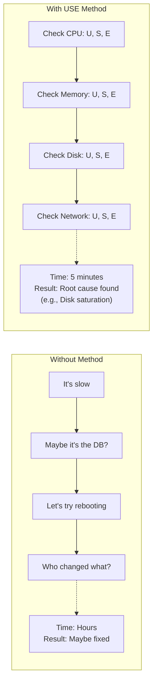

> **Linux Performance** | Complexity: `[MEDIUM]` | Time: 25-30 min

## Prerequisites

Before starting this module:
- **Required**: [Module 1.2: Processes & Systemd](/linux/foundations/system-essentials/module-1.2-processes-systemd/)
- **Required**: [Module 2.2: cgroups](/linux/foundations/container-primitives/module-2.2-cgroups/)
- **Helpful**: Basic understanding of system metrics

---

## What You'll Be Able to Do

After this module, you will be able to:
- **Apply** the USE Method (Utilization, Saturation, Errors) systematically to any resource
- **Diagnose** performance bottlenecks by checking CPU, memory, disk, and network in order
- **Interpret** key metrics (load average, CPU steal, memory pressure) in the context of K8s node health
- **Write** a USE checklist script that automates initial performance triage

---

## Why This Module Matters

When a system is slow, where do you start? Random debugging wastes time. The **USE Method** provides a systematic checklist for analyzing any performance problem.

Understanding the USE Method helps you:

- **Diagnose systematically** — Check every resource in order
- **Find root causes faster** — Don't miss obvious bottlenecks
- **Communicate clearly** — "CPU saturation" is precise, "slow" isn't
- **Set Kubernetes limits** — Know what metrics matter

Performance problems have causes. The USE Method helps you find them.

---

## Did You Know?

- **USE was created by Brendan Gregg** — A Netflix performance engineer who also created DTrace, BPF tools, and flame graphs. His work defines modern observability.

- **USE stands for Utilization, Saturation, Errors** — Three metrics for every resource. If all three are fine, the resource isn't your bottleneck.

- **Most performance issues are simple** — Brendan Gregg estimates 80% of issues are found in the first few USE checks. Complex analysis is rarely needed.

- **The method applies to any system** — Linux, databases, networks, applications. The resources change, but the method stays the same.

---

## The USE Method

### Core Concept

For every **resource**, check:

| Metric | Definition | Example |
|--------|------------|---------|
| **U**tilization | Time resource was busy | CPU 80% utilized |
| **S**aturation | Work queued, waiting | 10 processes waiting for CPU |
| **E**rrors | Error events | Disk I/O errors |

### Why This Works



### Resource Checklist

| Resource | Utilization Tool | Saturation Tool | Errors Tool |
|----------|------------------|-----------------|-------------|
| CPU | `top`, `mpstat` | `vmstat`, load average | `dmesg` |
| Memory | `free`, `vmstat` | `vmstat si/so` | `dmesg` |
| Disk I/O | `iostat %util` | `iostat avgqu-sz` | `smartctl`, `dmesg` |
| Network | `sar -n DEV` | `netstat`, `ss` | `ip -s link` |

---

## CPU Metrics

### Utilization

```bash
# Overall CPU utilization
top -bn1 | head -5
# %Cpu(s): 23.5 us, 5.2 sy, 0.0 ni, 70.1 id, 0.2 wa, 0.0 hi, 1.0 si

# Per-CPU utilization
mpstat -P ALL 1 3
# Shows each CPU core

# CPU breakdown:
# us = user (application code)
# sy = system (kernel)
# ni = nice (low priority)
# id = idle
# wa = iowait (waiting for I/O)
# hi = hardware interrupts
# si = software interrupts
# st = steal (VM overhead)
```

**High utilization isn't bad** — 100% CPU means you're using what you paid for. Problems start with saturation.

### Saturation

```bash
# Load average (processes wanting CPU)
uptime
# load average: 4.52, 3.21, 2.18
# Numbers = 1, 5, 15 minute averages

# Rule of thumb:
# Load < CPU cores = OK
# Load > CPU cores = Saturation

# Check CPU count
nproc
# 4

# Run queue (processes waiting)
vmstat 1
#  r  b   swpd   free   buff  cache ...
#  8  0      0 123456  78910 234567 ...
# r = run queue (waiting for CPU)
# b = blocked (waiting for I/O)
```

### Errors

```bash
# Check kernel messages
dmesg | grep -i "cpu\|mce\|error"

# MCE = Machine Check Exception (hardware error)
# These are rare but critical
```

> **Stop and think**: If `uptime` shows a load average of 10.0 on a 4-core machine, but `top` shows 90% idle CPU, what is happening? (Hint: Check the `wa` or `b` state in `vmstat`).

---

## Memory Metrics

### Utilization

```bash
# Memory overview
free -h
#               total        used        free      shared  buff/cache   available
# Mem:           15Gi       4.2Gi       2.1Gi       512Mi        9.1Gi        10Gi
# Swap:         2.0Gi       100Mi       1.9Gi

# Key insight: "available" matters, not "free"
# buff/cache can be reclaimed when needed

# Detailed memory
cat /proc/meminfo

# Per-process memory
ps aux --sort=-%mem | head -10
```

**"Free" memory isn't wasted** — Linux uses spare RAM for caching. Low "free" with high "available" is normal and efficient.

### Saturation

```bash
# Check for swapping
vmstat 1
#    si   so    bi    bo
#     0    0    50    20
# si = swap in (pages from disk)
# so = swap out (pages to disk)

# Active swapping = memory saturation

# Check swap usage
swapon --show

# OOM killer activity
dmesg | grep -i "out of memory\|oom"
```

### Errors

```bash
# Memory errors
dmesg | grep -i "memory\|ecc\|error"

# ECC = Error Correcting Code (server RAM)
# Uncorrectable errors = hardware failing
```

> **Pause and predict**: If `free -h` shows 100Mi free and 8Gi available, and `vmstat 1` shows `si` and `so` consistently at 0, is the system experiencing memory saturation?

---

## Disk I/O Metrics

### Utilization

```bash
# Disk utilization
iostat -xz 1
# Device            %util  avgqu-sz  await  r/s    w/s
# sda                75.2      2.3    12.5  100    200

# %util = percentage of time disk was busy
# 100% = disk is bottleneck

# Per-disk utilization
iostat -x 1 | grep -E "^sd|^nvm"
```

### Saturation

```bash
# Queue length
iostat -x 1
# avgqu-sz = average queue size
# High queue = requests waiting

# await = average time (ms) for I/O
# High await with high queue = saturation

# iowait from CPU perspective
vmstat 1
# Look at wa column
```

### Errors

```bash
# Disk errors
dmesg | grep -i "error\|fail\|i/o"

# SMART data (disk health)
sudo smartctl -a /dev/sda | grep -i error

# Filesystem errors
sudo fsck -n /dev/sda1
```

> **Stop and think**: You see `%util` at 99% for `/dev/sda`, but `avgqu-sz` is 0.5. Is the disk saturated, or just fully utilized?

---

## Network Metrics

### Utilization

```bash
# Interface statistics
ip -s link show eth0
# TX bytes, RX bytes

# Bandwidth utilization
sar -n DEV 1
# Shows Mbps per interface

# Real-time bandwidth
# Install iftop or nload
sudo iftop -i eth0
```

### Saturation

```bash
# Socket queues
ss -s
# Shows socket statistics

# Dropped packets (queue overflow)
netstat -s | grep -i drop
ip -s link | grep -i drop

# TCP retransmits (network saturation)
netstat -s | grep retrans
```

### Errors

```bash
# Interface errors
ip -s link show eth0
# Look for errors, dropped, overruns

# Network errors in dmesg
dmesg | grep -i "network\|eth\|link"
```

> **Pause and predict**: If `sar -n DEV 1` shows bandwidth well below the interface's maximum capacity, but `netstat -s` shows a rapidly increasing number of TCP retransmits, what USE category does this fall under?

---

## USE Method Checklist

### Quick Reference

```bash
#!/bin/bash
# use-check.sh - Quick USE method scan

echo "=== CPU ==="
echo "Utilization:"
top -bn1 | head -5 | tail -1
echo "Saturation (load):"
uptime
echo ""

echo "=== Memory ==="
echo "Utilization:"
free -h | head -2
echo "Saturation (swap activity):"
vmstat 1 2 | tail -1 | awk '{print "si="$7, "so="$8}'
echo ""

echo "=== Disk ==="
echo "Utilization & Saturation:"
iostat -x 1 2 | grep -E "^sd|^nvm|^Device" | tail -3
echo ""

echo "=== Network ==="
echo "Errors:"
ip -s link show | grep -E "^[0-9]:|errors"
echo ""

echo "=== Recent Errors ==="
dmesg | tail -20 | grep -i "error\|fail\|oom" || echo "None recent"
```

### Systematic Walkthrough

1. **CPU**: High load average? High utilization?
2. **Memory**: Swapping? OOM kills?
3. **Disk**: High %util? High queue depth?
4. **Network**: Drops? Errors? Retransmits?

If all clear, the problem is likely application-level.

---

## Kubernetes Connection

### Node Resources

```bash
# Kubernetes node conditions
kubectl describe node worker-1 | grep -A 5 Conditions
#  MemoryPressure   False
#  DiskPressure     False
#  PIDPressure      False

# These map to USE:
# MemoryPressure = Memory saturation
# DiskPressure = Disk utilization
# PIDPressure = Process saturation
```

### Container Metrics

```bash
# Pod resource usage
kubectl top pod --containers

# Node resource usage
kubectl top node

# These show utilization, not saturation
# For saturation, check node metrics
```

### Resource Limits Connection

```yaml
# Kubernetes resource limits
resources:
  requests:
    cpu: "100m"      # Minimum guaranteed
    memory: "128Mi"
  limits:
    cpu: "500m"      # Maximum allowed
    memory: "512Mi"  # OOM killed if exceeded

# Requests affect scheduling (utilization)
# Limits cause throttling/killing (saturation/errors)
```

---

## Common Mistakes

| Mistake | Problem | Solution |
|---------|---------|----------|
| Focusing only on utilization | High utilization isn't always bad | Check saturation too |
| Ignoring errors | Hardware issues cause performance problems | Always check dmesg |
| Random debugging | Time wasted, root cause missed | Follow USE systematically |
| Checking one metric | Multiple resources can be bottlenecks | Check all resources |
| Confusing "free" memory | Linux caches aggressively | Look at "available" |
| Ignoring steal time | VM overhead on cloud | Check st% in top |

---

## Quiz

### Question 1
You are investigating a slow application and run the `uptime` and `lscpu` commands. 

```bash
$ nproc
8
$ uptime
 14:32:01 up 12 days,  3:14,  2 users,  load average: 14.52, 12.21, 9.18
```
Based on the USE method, what does this output indicate about the CPU, and what should be your next step?

<details>
<summary>Show Answer</summary>

This output clearly indicates **CPU saturation**. The load average represents the number of processes wanting to run. Since the 1-minute load average (14.52) is significantly higher than the number of available CPU cores (8), it means that over 6 processes are constantly waiting in the queue for CPU time. When saturation occurs, latency increases because processes cannot execute immediately. Your next step should be running `top` or `pidstat` to identify exactly which processes are consuming the CPU resources and causing the backlog.

</details>

### Question 2
A Kubernetes node is marked as `NotReady`. You SSH into the node and run `vmstat 1`. 

```bash
$ vmstat 1
procs -----------memory---------- ---swap-- -----io---- -system-- ------cpu-----
 r  b   swpd   free   buff  cache   si   so    bi    bo   in   cs us sy id wa st
 2  0 204800 152432   1024 456789 4500 5200   120  4500 1500 2300 15 25  5 55  0
 3  0 209920 148112    900 455000 5100 6000   100  5100 1450 2400 12 30  3 55  0
```
Diagnose the bottleneck using the USE method. What is happening to this node?

<details>
<summary>Show Answer</summary>

The node is experiencing severe **memory saturation**. The critical indicators here are the `si` (swap in) and `so` (swap out) columns in the `vmstat` output, which show very high, continuous page swapping activity (thousands of blocks per second). This means the system has run out of available RAM and is desperately moving memory pages to and from the slow disk swap space to keep processes running. This phenomenon, known as thrashing, destroys performance and causes the high I/O wait (`wa` at 55%) seen in the CPU columns. To fix this, you need to identify memory-hungry pods or adjust Kubernetes memory limits to trigger the OOM killer before the node starts swapping.

</details>

### Question 3
Users complain about slow database queries. You check the database server and run `iostat -xz 1`.

```bash
$ iostat -xz 1
Device            r/s     w/s     rkB/s     wkB/s   rrqm/s   wrqm/s  %rrqm  %wrqm r_await w_await aqu-sz rareq-sz wareq-sz  svctm  %util
sda             12.00  345.00     48.00  14500.00     0.00    25.00   0.00   6.76    2.50  145.20  45.30     4.00    42.03   2.10 100.00
```
Apply the USE method to this output. What is the state of the disk, and why is it impacting performance?

<details>
<summary>Show Answer</summary>

The disk is experiencing both 100% **utilization** and heavy **saturation**. You can see utilization is maxed out because `%util` is 100.00, meaning the disk is busy servicing I/O requests the entire time. More importantly, the saturation is visible in the `aqu-sz` (average queue size) of 45.30, meaning over 45 requests are constantly backed up waiting for the disk. This saturation directly causes the terrible write latency seen in `w_await` (145.20 ms average wait time per write request). The database is slow because its write operations are getting stuck in the OS storage queue, confirming the disk is the primary bottleneck.

</details>

### Question 4
Your web application occasionally drops connections. You run standard utilization and saturation checks (CPU, Memory, Disk), and all look healthy. You then run the following command:

```bash
$ ip -s link show eth0
2: eth0: <BROADCAST,MULTICAST,UP,LOWER_UP> mtu 1500 qdisc fq_codel state UP mode DEFAULT group default qlen 1000
    link/ether 02:42:ac:11:00:02 brd ff:ff:ff:ff:ff:ff
    RX: bytes  packets  errors  dropped overrun mcast   
    154321234  150432   0       1432    0       0       
    TX: bytes  packets  errors  dropped carrier collsns 
    987654321  854321   0       0       0       0       
```
Based on the USE method, what have you found, and what does it mean?

<details>
<summary>Show Answer</summary>

You have found a clear issue in the **Errors/Drops** category for the network resource. The output shows 1,432 `dropped` packets on the Receive (RX) side of the `eth0` interface. While utilization might be low, a non-zero drop count indicates that the network stack or the interface buffer couldn't process incoming packets fast enough at some point, leading to discarded data. TCP will attempt to retransmit these dropped packets, which explains the intermittent connection drops and latency experienced by the users. This means you need to investigate network ring buffers, interrupt handling, or sudden micro-bursts of traffic.

</details>

### Question 5
An application owner states that their API is taking 5 seconds to respond. You run a comprehensive USE method checklist script. 
- Load average is 0.5 on a 4-core machine.
- Available memory is 12GB out of 16GB, swap usage is 0.
- Disk `%util` is under 5%, and `aqu-sz` is 0.
- Network bandwidth is low, with 0 drops and 0 errors.

According to the USE method philosophy, what is your conclusion and next step?

<details>
<summary>Show Answer</summary>

Your conclusion is that the **OS resources are not the bottleneck**, and the problem lies at the application level. The USE method has successfully ruled out CPU, memory, disk, and network hardware/OS limits, saving you from blindly tweaking system configurations. Since the system has plenty of capacity (low utilization) and no queues (no saturation), the application is likely waiting on something else. Your next step should be using application-level tracing (like APM tools, Jaeger, or profiling) to check for issues like lock contention, slow external API calls, inefficient database queries, or application bugs.

</details>

---

## Hands-On Exercise

### Practicing the USE Method

**Objective**: Apply the USE method systematically to analyze system performance.

**Environment**: Any Linux system

#### Part 1: CPU Analysis

```bash
# 1. Create CPU load
yes > /dev/null &
yes > /dev/null &
yes > /dev/null &
PID1=$!

# 2. Check CPU utilization
top -bn1 | head -8

# 3. Check saturation
uptime
cat /proc/loadavg
nproc

# 4. Check for errors
dmesg | tail -10 | grep -i error

# 5. Clean up
killall yes
```

#### Part 2: Memory Analysis

```bash
# 1. Check current state
free -h

# 2. Check available vs free
cat /proc/meminfo | grep -E "MemTotal|MemFree|MemAvailable|Buffers|Cached"

# 3. Check saturation (swap)
vmstat 1 3

# 4. Check OOM history
dmesg | grep -i "out of memory" || echo "No OOM events"

# 5. Top memory users
ps aux --sort=-%mem | head -5
```

#### Part 3: Disk Analysis

```bash
# 1. Check disk utilization
iostat -x 1 3

# 2. Identify busy disks
iostat -x | awk '$NF > 50 {print "Busy:", $1, $NF"%"}'

# 3. Check for errors
dmesg | grep -i "i/o error\|disk" | tail -5

# 4. Check filesystem usage (different from I/O)
df -h
```

#### Part 4: Network Analysis

```bash
# 1. Check interface errors
ip -s link show | grep -A 6 "^2:"

# 2. Check socket statistics
ss -s

# 3. Check drops
netstat -s | grep -i "drop\|error" | head -10

# 4. Connection states
ss -tan | awk '{print $1}' | sort | uniq -c | sort -rn
```

#### Part 5: Full USE Scan

```bash
# Run complete USE analysis
echo "=== CPU ===" && \
uptime && \
echo "" && \
echo "=== Memory ===" && \
free -h && \
echo "" && \
echo "=== Disk ===" && \
iostat -x 1 1 | grep -E "^sd|^nvm|avg" && \
echo "" && \
echo "=== Errors ===" && \
dmesg | tail -20 | grep -iE "error|fail|oom|drop" || echo "Clean"
```

### Success Criteria

- [ ] Checked CPU utilization, saturation, and errors
- [ ] Checked memory utilization and swap activity
- [ ] Checked disk I/O utilization and queue depth
- [ ] Checked network errors and drops
- [ ] Ran complete USE scan
- [ ] Identified which resources are healthy

---

## Key Takeaways

1. **USE = Utilization, Saturation, Errors** — Check all three for each resource

2. **Systematic beats random** — Follow the checklist, don't guess

3. **Saturation matters more than utilization** — Busy isn't bad, queuing is

4. **Check all resources** — Don't stop at the first issue

5. **If USE is clean, look at the application** — OS isn't always the problem

---

## What's Next?

In **Module 5.2: CPU & Scheduling**, you'll dive deeper into CPU metrics, understand the Linux scheduler, and learn how Kubernetes CPU limits actually work.

---

## Further Reading

- [Brendan Gregg's USE Method](https://www.brendangregg.com/usemethod.html)
- [Linux Performance Analysis in 60s](https://netflixtechblog.com/linux-performance-analysis-in-60-000-milliseconds-accc10403c55)
- [Systems Performance Book](https://www.brendangregg.com/systems-performance-2nd-edition-book.html)
- [Kubernetes Node Conditions](https://kubernetes.io/docs/concepts/architecture/nodes/#condition)