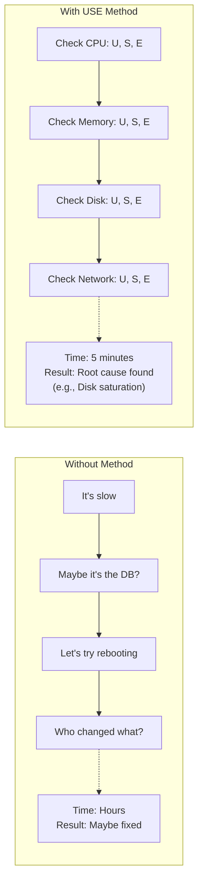

# Module 5.1: USE Method

> **Linux Performance** | Complexity: `[MEDIUM]` | Time: 25-30 min. This module treats performance triage as an operational discipline: you will learn how to inspect resources in a repeatable order, explain the evidence clearly, and know when Linux is not the bottleneck.

## Prerequisites

Before starting this module, you should be comfortable reading process lists, recognizing systemd-managed services, and understanding why containers are constrained by cgroups. The USE Method is not a replacement for those fundamentals; it gives you a disciplined way to apply them when a node, virtual machine, or Kubernetes workload is slow under pressure.

- **Required**: [Module 1.2: Processes & Systemd](/linux/foundations/system-essentials/module-1.2-processes-systemd/)
- **Required**: [Module 2.2: cgroups](/linux/foundations/container-primitives/module-2.2-cgroups/)
- **Helpful**: Basic understanding of system metrics

## Learning Outcomes

After this module, you will be able to:

- **Apply** the USE Method to classify utilization, saturation, and errors for CPU, memory, disk, and network resources.
- **Diagnose** Kubernetes node performance problems by mapping Linux metrics to MemoryPressure, DiskPressure, PIDPressure, throttling, and pod symptoms.
- **Interpret** load average, run queue, swap activity, disk queue depth, packet drops, and CPU steal as operational evidence.
- **Implement** a repeatable USE checklist script that automates initial triage without hiding the reasoning.

## Why This Module Matters

At 09:12 on a Tuesday, an internal payments platform started timing out during a regional promotion. The team had dashboards, container metrics, and a chat room full of guesses, but each person chased a different lead: one engineer restarted pods, another blamed the database, and a third raised CPU limits because the nodes looked busy. The incident lasted more than an hour, checkout failures climbed, and the eventual root cause was not exotic. A single storage volume was queueing writes so badly that healthy application code looked broken from the outside.

That kind of outage hurts because the first minutes are usually spent deciding where to look. A slow request might be waiting for CPU, stuck behind disk I/O, stalled on swap, retransmitting packets, or blocked in application code. If the team jumps straight to the tool they know best, they can make the system noisier without getting closer to the cause. The USE Method gives you a compact question set for every resource: how busy is it, is work waiting, and are errors occurring?

The value is not that USE finds every performance problem by itself. The value is that it quickly rules out large categories of wrong explanations and gives the team precise language. Saying "the node is slow" invites random action; saying "disk utilization is high and queue depth is growing while CPU is mostly waiting on I/O" tells the next engineer exactly what evidence to verify. In Kubernetes 1.35+ environments, that discipline also prevents misleading fixes, because pod-level utilization can look ordinary while the node underneath is saturated.

The method is especially useful for engineers who are still building intuition. You do not need to know every kernel subsystem before you can ask whether a resource is busy, whether work is waiting, and whether errors are accumulating. Those questions create a scaffold for learning because each command has a purpose. Instead of memorizing `vmstat` columns as isolated trivia, you learn which columns prove a queue, which columns prove activity, and which messages change the risk of continuing normal service.

## The USE Method

The USE Method was popularized by Brendan Gregg as a practical way to analyze system performance without turning the first response into a tool hunt. The method asks you to list every relevant resource, then check three categories for each resource: utilization, saturation, and errors. It sounds simple enough to fit on a note card, but that simplicity is the point. During an incident, the team needs a reliable walking route through the system, not a perfect map of every possible failure mode.

Utilization asks whether a resource is busy doing work. A CPU at high utilization is spending most of its time executing instructions, a disk at high utilization is servicing I/O, and a network interface at high utilization is moving bytes near its practical capacity. High utilization is not automatically bad, because many well-tuned systems run expensive resources hard. A quiet database host at three percent disk utilization may be underused, while a batch host at sustained high CPU utilization may be doing exactly what it was designed to do.

Saturation asks whether work is waiting because the resource cannot keep up. This is where performance problems usually become visible to users, because queues turn demand into latency. A CPU run queue means runnable tasks are waiting for a core, disk queue depth means I/O requests are waiting for the device, and swap activity means memory pressure is pushing pages through a much slower layer. Saturation is the line between "busy" and "backed up," which is why it is more useful than utilization alone.

Errors ask whether the resource is reporting failures, drops, resets, or exceptional conditions. This category catches the cases where utilization and saturation do not tell the whole story. A network interface can be lightly utilized while dropping receive packets during bursts, a disk can report I/O errors before the workload looks saturated, and a machine check exception can explain instability that no average metric captures. Always include errors in the pass, because a clean queue does not prove the hardware path is healthy.

| Metric | Definition | Example |
|--------|------------|---------|
| **U**tilization | Time resource was busy | CPU 80% utilized |
| **S**aturation | Work queued, waiting | 10 processes waiting for CPU |
| **E**rrors | Error events | Disk I/O errors |

The most important habit is to separate evidence from interpretation. "CPU is high" is a partial observation; "CPU utilization is high, run queue is low, and there are no CPU errors" is a useful finding. In the second version, you have enough information to say the CPU is busy but probably not the source of queuing. That distinction keeps teams from scaling the wrong component or changing limits simply because one graph looks dramatic.



The diagram shows why the method is useful even before you become an expert in every metric. Without a method, each person follows a private theory and the investigation fragments. With USE, the first pass is shared: CPU, memory, disk, and network each get the same treatment. You may still need deeper tooling afterward, but the early conversation becomes specific enough to hand off cleanly.

| Resource | Utilization Tool | Saturation Tool | Errors Tool |
|----------|------------------|-----------------|-------------|
| CPU | `top`, `mpstat` | `vmstat`, load average | `dmesg` |
| Memory | `free`, `vmstat` | `vmstat si/so` | `dmesg` |
| Disk I/O | `iostat %util` | `iostat avgqu-sz` | `smartctl`, `dmesg` |
| Network | `sar -n DEV` | `netstat`, `ss` | `ip -s link` |

Pause and predict: if every utilization graph looks moderate but the user-facing latency is severe, which USE category would you inspect next and why? A strong answer names saturation first, because queues can grow during short bursts that averages smooth away. It also keeps errors in view, because packet drops or device faults may create latency without a sustained utilization ceiling.

USE is not a rigid order that forbids judgment. If the alert says `DiskPressure=True`, start with disk and then complete the rest of the pass. If a node just received a burst of traffic, start with network and CPU before memory. The discipline is that you do not stop after the first interesting number unless the evidence already explains the symptom and you know what risk remains untested.

The resource list should include the resources that can directly delay the work. For a normal Linux server, CPU, memory, disk, and network cover the first pass. For a database, locks and connection pools become application resources after the host pass is clean. For a Kubernetes node, pod CPU quota, memory limits, image storage, process identifiers, and kubelet health become additional layers. USE scales because you can keep applying the same categories after you move from hardware to software-controlled resources.

Think of the first pass as drawing a boundary around the problem. If CPU, memory, disk, and network are all clean, the boundary moves up toward application behavior. If one resource is saturated, the boundary tightens around the queue and the work that feeds it. If errors are present, the boundary may move down toward hardware, drivers, cloud infrastructure, or a provider incident. That boundary is what helps teams decide whether to tune, scale, shed load, move workloads, or escalate.

## CPU and Memory Evidence

CPU is the easiest resource to misread because high utilization can mean success, not failure. A compression job, compiler, or data processing worker should consume CPU when there is work to do. The operational question is whether runnable tasks are waiting longer than expected. That is why a CPU pass pairs utilization from `top` or `mpstat` with load average and run queue evidence from `uptime` and `vmstat`.

```bash
# Overall CPU utilization
top -bn1 | head -5
# %Cpu(s): 23.5 us, 5.2 sy, 0.0 ni, 70.1 id, 0.2 wa, 0.0 hi, 1.0 si

# Per-CPU utilization
mpstat -P ALL 1 3
# Shows each CPU core

# CPU breakdown:
# us = user (application code)
# sy = system (kernel)
# ni = nice (low priority)
# id = idle
# wa = iowait (waiting for I/O)
# hi = hardware interrupts
# si = software interrupts
# st = steal (VM overhead)
```

The CPU breakdown is a conversation starter, not a verdict. User time points toward application work, system time points toward kernel activity, iowait points toward storage or network-backed waits, interrupt time can point toward packet or device pressure, and steal time can reveal contention from a virtualization layer. When the `st` value is meaningful on a cloud VM, the guest wanted CPU but the hypervisor did not schedule it. Raising a pod CPU limit will not fix that, because the contention lives below Kubernetes.

```bash
# Load average (processes wanting CPU)
uptime
# load average: 4.52, 3.21, 2.18
# Numbers = 1, 5, 15 minute averages

# Rule of thumb:
# Load < CPU cores = OK
# Load > CPU cores = Saturation

# Check CPU count
nproc
# 4

# Run queue (processes waiting)
vmstat 1
#  r  b   swpd   free   buff  cache ...
#  8  0      0 123456  78910 234567 ...
# r = run queue (waiting for CPU)
# b = blocked (waiting for I/O)
```

Load average is often taught as "the number of busy processes," but that shortcut hides the most useful nuance. On Linux, load includes tasks that are runnable and tasks in uninterruptible sleep, which commonly means waiting on I/O. A load average above the core count can be CPU saturation, but if `top` shows high idle time and `vmstat` shows blocked tasks, the queue may really be storage-backed. Interpret load average together with CPU state, run queue, and blocked process counts.

```bash
# Check kernel messages
dmesg | grep -i "cpu\|mce\|error"

# MCE = Machine Check Exception (hardware error)
# These are rare but critical
```

CPU errors are uncommon compared with saturation, but they deserve a quick check because they change the escalation path. Machine check events, thermal throttling reports, or hardware-related kernel messages move the investigation toward the platform team or provider. They also explain why a host may behave poorly even when the usual utilization numbers are not alarming. In a production incident, rare does not mean impossible; it means you check quickly and move on if the evidence is clean.

CPU saturation also needs workload context. A load average above the core count on a batch worker may be acceptable if the service-level objective is throughput and jobs can queue. The same load on an interactive API node can be a user-facing incident because requests wait behind other runnable work. USE tells you what is happening, but the business objective tells you whether that finding is acceptable. Always pair the metric with the promise the system is supposed to keep.

When CPU looks suspicious, resist the habit of sorting by `%CPU` and declaring the top process guilty. A process can be the largest CPU user because it is the only component doing useful work, while another component creates the queue by spawning too many workers or making inefficient calls. Sort output is a lead, not a verdict. Confirm whether the system as a whole is saturated, then inspect the process, thread, or container that best explains the demand pattern.

Memory has the opposite reputation from CPU: people panic when "free" memory is low, even though Linux intentionally uses spare RAM for cache. The useful utilization metric is available memory, because it estimates how much memory can be given to applications without forcing swap or reclaim pain. A system with little free memory and plenty of available memory is healthy; a system with low available memory, active swapping, and OOM messages is not.

```bash
# Memory overview
free -h
#               total        used        free      shared  buff/cache   available
# Mem:           15Gi       4.2Gi       2.1Gi       512Mi        9.1Gi        10Gi
# Swap:         2.0Gi       100Mi       1.9Gi

# Key insight: "available" matters, not "free"
# buff/cache can be reclaimed when needed

# Detailed memory
cat /proc/meminfo

# Per-process memory
ps aux --sort=-%mem | head -10
```

The `buff/cache` column is the part that surprises new operators. Linux keeps recently used file data in memory because serving it from RAM is faster than reading it again from disk. That cache can be reclaimed when applications need memory, so it is not the same as memory permanently consumed by a process. Treat available memory as the main utilization signal, then use process-level views to find which workloads own resident memory.

```bash
# Check for swapping
vmstat 1
#    si   so    bi    bo
#     0    0    50    20
# si = swap in (pages from disk)
# so = swap out (pages to disk)

# Active swapping = memory saturation

# Check swap usage
swapon --show

# OOM killer activity
dmesg | grep -i "out of memory\|oom"
```

Swap activity is memory saturation because the system is moving memory pages through storage to survive. Occasional swap usage in `swapon --show` is less important than continuous nonzero `si` and `so` activity under load. When swap churn is heavy, the machine can look like it has a disk problem because iowait rises, but the root pressure may be memory demand. USE helps you avoid mislabeling that symptom by checking both memory saturation and disk saturation before deciding.

```bash
# Memory errors
dmesg | grep -i "memory\|ecc\|error"

# ECC = Error Correcting Code (server RAM)
# Uncorrectable errors = hardware failing
```

Pause and predict: if `free -h` shows 100Mi free, 8Gi available, and `vmstat 1` shows `si` and `so` consistently at zero, is the system experiencing memory saturation? The evidence says no, because reclaimable cache explains the low free value and there is no queue through swap. A better next step is to continue the USE pass instead of tuning memory blindly.

Memory errors and memory saturation also lead to different actions. Saturation usually means demand exceeds policy or capacity, so you inspect workloads, limits, leaks, cache behavior, and eviction decisions. Errors may mean hardware trouble, firmware issues, or a failing host. Conflating the two wastes time because adding memory to a workload does not repair faulty RAM, and replacing hardware does not fix an application that allocates without bound.

In containerized systems, memory interpretation has one extra trap: the container view and node view can disagree in useful ways. A container can be near its limit and at risk of OOM while the node still has plenty of available memory. A node can be under pressure because many containers are collectively large even though none looks dramatic alone. USE remains useful if you name the resource layer clearly: container memory limit, node memory, or storage-backed swap behavior.

## Disk and Network Evidence

Disk I/O often turns ordinary application behavior into visible latency because many programs wait synchronously for reads or writes. A database commit, container image pull, log flush, or filesystem metadata operation can block a request path even while CPU has spare capacity. Disk utilization tells you whether the device is busy, but saturation tells you whether requests are waiting behind other requests. Modern storage can also make `%util` tricky, especially for devices with internal parallelism, so queue depth and wait time matter.

```bash
# Disk utilization
iostat -xz 1
# Device            %util  avgqu-sz  await  r/s    w/s
# sda                75.2      2.3    12.5  100    200

# %util = percentage of time disk was busy
# 100% = disk is bottleneck

# Per-disk utilization
iostat -x 1 | grep -E "^sd|^nvm"
```

The `%util` column is most useful when it is read with the device type in mind. On a simple virtual disk, sustained high utilization often points to a busy storage path. On a fast NVMe device, one busy queue may not mean the whole device is exhausted. The point is not to memorize one universal threshold; the point is to connect utilization with queue length, wait time, and the workload's latency requirement.

```bash
# Queue length
iostat -x 1
# avgqu-sz = average queue size
# High queue = requests waiting

# await = average time (ms) for I/O
# High await with high queue = saturation

# iowait from CPU perspective
vmstat 1
# Look at wa column
```

Disk saturation becomes compelling when queue depth and wait time rise together. Queue depth says there is a backlog, and `await` says requests are spending time in that path. If CPU `wa` rises at the same time, application threads may be sleeping while the kernel waits for storage. That pattern explains many "CPU is idle but everything is slow" incidents, because idle CPU does not help a process that is blocked on I/O.

```bash
# Disk errors
dmesg | grep -i "error\|fail\|i/o"

# SMART data (disk health)
sudo smartctl -a /dev/sda | grep -i error

# Filesystem errors
sudo fsck -n /dev/sda1
```

Disk errors change the response from tuning to protection. If the kernel reports I/O errors, filesystem errors, or device resets, your first priority is preserving data and moving work away from the unhealthy path. Do not hide those errors by restarting services until you know whether the storage layer is safe. In a Kubernetes cluster, disk errors can also surface as eviction pressure, image pull failures, or pods stuck because the node cannot perform local filesystem work reliably.

Disk saturation often arrives indirectly. A logging change increases write volume, a backup job competes with foreground traffic, a container runtime fills image storage, or a database checkpoint writes more aggressively than usual. The application symptom may be slow requests, not an obvious storage alert. That is why the disk pass should include both service-facing latency and device-facing queue evidence. When those line up, you can explain how an apparently unrelated change created user-visible delay.

Filesystem usage deserves a separate note because full disks and busy disks are different problems. A filesystem at very high capacity can cause write failures, eviction, or cleanup storms even when I/O utilization is low. A disk can also be busy and saturated while the filesystem has plenty of free space. USE treats capacity exhaustion mostly as an error or policy condition, while I/O queueing is saturation. Keeping those separate prevents a cleanup task from being mistaken for an I/O performance fix.

Network analysis has the same USE structure, but the evidence is more distributed. A packet can be delayed by the local interface, the kernel socket queue, a virtual switch, a cloud load balancer, a firewall, or the remote service. USE still helps because it separates local interface activity from local queue pressure and local error counters. If the local node is clean, you have stronger evidence to follow the path outward instead of changing random kernel settings.

```bash
# Interface statistics
ip -s link show eth0
# TX bytes, RX bytes

# Bandwidth utilization
sar -n DEV 1
# Shows Mbps per interface

# Real-time bandwidth
# Install iftop or nload
sudo iftop -i eth0
```

Bandwidth utilization is only one part of the network story. A service can use a small percentage of link capacity and still suffer from packet loss, retransmits, DNS stalls, connection tracking pressure, or upstream throttling. That is why local network utilization should be followed by queue and drop evidence rather than treated as a clean bill of health. Low throughput with rising retransmits is not healthy; it is a sign that useful work is being repeated.

```bash
# Socket queues
ss -s
# Shows socket statistics

# Dropped packets (queue overflow)
netstat -s | grep -i drop
ip -s link | grep -i drop

# TCP retransmits (network saturation)
netstat -s | grep retrans
```

Socket statistics and retransmit counters give you saturation-like evidence for the network path. A full receive queue, growing drops, or repeated TCP retransmits means work is waiting or being repeated even if interface throughput is not high. This distinction matters during microbursts, where a short spike overflows buffers and then disappears before a one-minute graph catches it. USE pushes you to look at counters that accumulate the damage.

```bash
# Interface errors
ip -s link show eth0
# Look for errors, dropped, overruns

# Network errors in dmesg
dmesg | grep -i "network\|eth\|link"
```

Network errors include physical or virtual interface problems, driver messages, link resets, and dropped packets. On bare metal, they can point to cabling, NIC, or switch issues. In virtualized environments, they may point to noisy neighbors, host networking, or limits in the virtual NIC path. Treat error counters as evidence that the local path needs attention even when application logs only show timeouts.

Network saturation is harder to prove from a single host because the queue may be somewhere else. A local interface can show low utilization while an upstream load balancer, firewall, NAT gateway, or remote service is saturated. That does not make the local USE pass useless. It tells you whether the local node is contributing to the problem, and it gives you a clean handoff when you need another team to inspect the next hop.

Packet drops are also not all equal. A counter that increased months ago and stayed flat during the incident is historical evidence, not necessarily the current cause. A counter that rises during each latency spike is much stronger. When possible, take two samples several seconds apart and compare them. USE works best when you distinguish stale counters from active growth, because active growth connects the metric to the symptom window.

Before running this, what output do you expect if a web service is slow because the disk is saturated rather than because the network is dropping packets? You should expect disk queue depth or await to look unhealthy, while interface errors and drops stay flat. If both are bad, write down both findings and resist the temptation to pick the first one that matches your favorite theory.

## Kubernetes Connection

Kubernetes does not remove Linux performance problems; it adds scheduling, isolation, and resource policy on top of them. A pod can be throttled by a CPU limit while the node still has spare CPU, or a node can be under disk pressure while every individual pod looks innocent. For this module, assume Kubernetes 1.35+ behavior and use `kubectl` through the standard short alias by running `alias k=kubectl` once in your shell. After that, commands such as `k describe node` are shorter to read and match the style used in later modules.

```bash
# Kubernetes node conditions
alias k=kubectl
k describe node worker-1 | grep -A 5 Conditions
#  MemoryPressure   False
#  DiskPressure     False
#  PIDPressure      False

# These map to USE:
# MemoryPressure = Memory saturation
# DiskPressure = Disk utilization
# PIDPressure = Process saturation
```

Node conditions are not a full USE report, but they are useful routing hints. `MemoryPressure` tells you the kubelet sees memory stress severe enough to affect scheduling or eviction decisions. `DiskPressure` points toward local filesystem pressure, image storage pressure, or related disk symptoms. `PIDPressure` means the node is running short of process identifiers, which behaves like saturation because new work cannot be created even if CPU and memory look available.

```bash
# Pod resource usage
k top pod --containers

# Node resource usage
k top node

# These show utilization, not saturation
# For saturation, check node metrics
```

The `k top` family is useful, but it mostly reports utilization from the metrics pipeline. That means it can show that a pod is using CPU or memory, but it does not directly prove that other work is waiting. For CPU saturation under a quota, you often need cgroup throttling metrics or application latency evidence. For memory saturation, you need swap, OOM, eviction, or reclaim evidence. For disk saturation, you need node-level I/O data, because most Kubernetes metrics do not expose queue depth directly.

```yaml
# Kubernetes resource limits
resources:
  requests:
    cpu: "100m"      # Minimum guaranteed
    memory: "128Mi"
  limits:
    cpu: "500m"      # Maximum allowed
    memory: "512Mi"  # OOM killed if exceeded

# Requests affect scheduling (utilization)
# Limits cause throttling/killing (saturation/errors)
```

Requests and limits connect directly to USE thinking. Requests influence placement by telling the scheduler how much capacity a workload expects to reserve. Limits define what happens when a container tries to exceed policy: CPU can be throttled, and memory can end in an OOM kill. Those outcomes are not just configuration details; they are saturation and error signals in the container layer. A pod that is slow because it is CPU-throttled needs a different fix from a node that is globally out of CPU.

A practical Kubernetes triage starts by asking where the queue lives. If the node has high load and many runnable tasks, the queue may be on the node. If one container shows throttling while the node is otherwise healthy, the queue may be inside that container's CPU quota. If `DiskPressure` is true and `iostat` shows high await, the node storage path is a better explanation than a bad Deployment rollout. The value of USE is that it keeps node evidence, pod evidence, and policy evidence in the same conversation.

War story: a platform team once raised memory limits for a service because `k top pod` showed high memory utilization during traffic spikes. The change delayed OOM kills but made node-level reclaim worse, and the next spike caused several unrelated pods to slow down. A USE pass would have separated utilization from saturation: the service was using memory, but the node's pain came from reclaim and swap activity. The better fix was right-sizing requests, reducing per-request allocation, and moving the workload away from already pressured nodes.

Kubernetes also changes the social shape of troubleshooting. The application team may own the Deployment, the platform team may own node pools, and the infrastructure team may own storage classes or cloud quotas. USE gives those teams a shared vocabulary. "The pod is CPU-throttled by its limit" points to workload policy. "The node has disk queue growth and `DiskPressure`" points to host or storage pressure. "The USE pass is clean" points the application team toward tracing without implying blame.

When you compare pod metrics with node metrics, use time windows carefully. Metrics pipelines scrape at intervals, kubelet conditions update on their own cadence, and command-line samples show the instant when you ran them. A two-second `vmstat` sample and a five-minute dashboard average can disagree without either being wrong. During incidents, capture the command output with timestamps and compare it with the symptom window. Good timing discipline can turn a confusing disagreement into a useful explanation.

## Building the Checklist

A checklist is useful only if it preserves the reasoning behind the method. A script that prints numbers without labels can create a new problem: it produces output quickly, but the person reading it still has to remember which column maps to which USE category. The goal is a first-pass triage script that groups evidence by resource, names the category, and leaves enough raw output for a human to challenge the conclusion.

```bash
#!/bin/bash
# use-check.sh - Quick USE method scan

echo "=== CPU ==="
echo "Utilization:"
top -bn1 | head -5 | tail -1
echo "Saturation (load):"
uptime
echo ""

echo "=== Memory ==="
echo "Utilization:"
free -h | head -2
echo "Saturation (swap activity):"
vmstat 1 2 | tail -1 | awk '{print "si="$7, "so="$8}'
echo ""

echo "=== Disk ==="
echo "Utilization & Saturation:"
iostat -x 1 2 | grep -E "^sd|^nvm|^Device" | tail -3
echo ""

echo "=== Network ==="
echo "Errors:"
ip -s link show | grep -E "^[0-9]:|errors"
echo ""

echo "=== Recent Errors ==="
dmesg | tail -20 | grep -i "error\|fail\|oom" || echo "None recent"
```

This script is deliberately modest. It does not calculate every threshold, open an incident, or decide which team owns the fix. It creates a shared snapshot that starts with CPU, memory, disk, network, and recent kernel errors. That makes it safe to run early in an incident, paste into a ticket, and compare against later output. The important implementation detail is not shell cleverness; it is keeping the USE categories visible in the output.

A good manual walkthrough follows the same sequence and writes down the finding for each resource. For CPU, compare utilization with load average, run queue, blocked tasks, and errors. For memory, compare available memory with swap activity and OOM history. For disk, compare utilization with queue depth, await, and kernel storage errors. For network, compare bandwidth with socket queues, drops, retransmits, and interface errors. If all four resources are clean, say so confidently and move up the stack.

That final sentence is where many teams hesitate. USE is not a failure when it says Linux is healthy; it has saved time by narrowing the investigation. If CPU, memory, disk, and network show no meaningful utilization pressure, no saturation, and no errors, the next likely causes are application locks, database query plans, remote dependencies, DNS behavior, or code paths that need tracing. The method gives you permission to stop tuning the kernel and start examining the request path.

Your checklist should also be safe under stress. Avoid commands that change state, restart services, fill disks, or require broad privileges unless the incident runbook explicitly allows them. Read-only commands like `uptime`, `free`, `vmstat`, `iostat`, `ip -s link`, and filtered `dmesg` output are appropriate first-pass tools. If a check requires `sudo`, record that requirement and the risk. A triage script that is safe enough to run early is more valuable than a powerful script that operators avoid.

The script output should be easy to paste into a ticket or incident channel. Include host identity, timestamp, kernel version, and cluster context if your environment needs them, but do not bury the core findings under decoration. A useful format is one section per resource, each with utilization, saturation, and errors. When someone reviews the output later, they should be able to see the missing category immediately. Missing evidence is better than invented confidence.

After you automate collection, practice manual interpretation. Automation can hide mistakes in column positions, package versions, or device names. For example, `vmstat` columns are stable, but a quick `awk` one-liner can still extract the wrong field if the command output changes. A senior operator should be able to read the raw output and explain the conclusion without trusting the script blindly. That is how automation becomes an accelerator instead of a new single point of confusion.

## Patterns & Anti-Patterns

The best USE implementations are boring in the right way. They use a fixed first pass, write down evidence in operational language, and then choose deeper tooling based on the first abnormal category. They also keep business symptoms connected to system evidence. A slow checkout, failed image pull, or `NotReady` node should always be tied back to the exact resource and category that explains it.

| Pattern | When to Use It | Why It Works | Scaling Consideration |
|---------|----------------|--------------|-----------------------|
| Resource-by-resource first pass | Any unclear performance incident | It prevents tool-driven guessing and covers CPU, memory, disk, and network | Automate collection, but keep labels and raw evidence visible |
| Saturation before tuning | A graph shows high utilization but the symptom is latency | Queues explain latency better than busyness alone | Track queue depth, throttling, swap, and drops in long-term metrics |
| Evidence handoff | Another team must continue the investigation | Precise USE language reduces repeated checks and blame loops | Store snapshots with timestamps and workload context |
| Clean USE exit | OS resources look healthy after the pass | It redirects effort toward application tracing or external dependencies | Pair with request traces, logs, and service-level objectives |

Anti-patterns usually start with a true observation and then overreach. High CPU becomes "add nodes" without checking run queue. Low free memory becomes "kill processes" without checking available memory. A network timeout becomes "the network is down" without looking at drops or retransmits. The better alternative is to slow down just enough to classify the evidence before changing the system.

| Anti-pattern | What Goes Wrong | Better Alternative |
|--------------|-----------------|--------------------|
| Treating utilization as failure | Busy resources may be healthy, so the team scales or restarts unnecessarily | Pair utilization with saturation and errors before acting |
| Ignoring node evidence in Kubernetes | Pod graphs hide host-level disk, swap, or PID pressure | Check node conditions and Linux metrics together |
| Stopping after the first abnormal metric | A secondary bottleneck or hardware error remains hidden | Finish the first pass unless the system is at immediate risk |
| Automating away interpretation | Scripts produce numbers that no one can explain under pressure | Print categories, labels, and enough context for review |

These patterns apply to small servers and large clusters, but the scaling challenge changes. On one host, you can SSH in and inspect everything directly. In a fleet, you need dashboards, node exporters, eBPF tooling, logs, and incident templates that preserve the same categories. The method remains the same because the questions remain the same: is the resource busy, is work waiting, and are errors happening?

At fleet scale, the biggest mistake is averaging away the node that matters. A cluster dashboard can show moderate CPU, healthy memory, and ordinary network traffic while one node is saturated enough to hurt the pods placed there. USE should therefore be applied at the level where the symptom lives. If only one pod is slow, inspect its container and node. If many pods on one node are slow, inspect that node. If every node in a pool is slow, inspect shared capacity and upstream dependencies.

Another useful pattern is writing the non-finding. Operators often record only the abnormal metric, which makes later review harder. "CPU utilization normal, no run queue growth, no CPU errors" is a meaningful result because it removes CPU from the likely cause list. Clean findings are especially important when an incident crosses teams. They prevent the next team from repeating the same checks and help the incident commander understand why the investigation moved.

## Decision Framework

Use this framework when an alert says a Linux system or Kubernetes node is slow, but the cause is not obvious. Start with the user-visible symptom, then choose the resource pass that best matches the first clue. If there is no clue, run the full CPU, memory, disk, and network pass in that order. The goal is not to make the decision tree perfect; it is to prevent expensive changes before the evidence supports them.

| Symptom | First USE Check | Evidence That Confirms It | Better Next Move |
|---------|-----------------|---------------------------|------------------|
| High latency with high load average | CPU saturation, then blocked tasks | Load exceeds cores and `vmstat r` stays high | Identify runnable processes and inspect CPU limits or demand |
| High latency with idle CPU | Disk or memory saturation | `wa`, blocked tasks, swap activity, or high disk await | Inspect I/O path and memory pressure before scaling CPU |
| Node reports `MemoryPressure` | Memory utilization and saturation | Low available memory, swap activity, OOM, or evictions | Right-size workloads and move pressure off the node |
| Intermittent connection failures | Network errors and saturation | Drops, retransmits, overruns, or socket queue pressure | Inspect local interface, host networking, and upstream path |
| USE pass is clean | Application-level bottleneck | No resource has meaningful utilization, saturation, or errors | Move to tracing, profiling, dependency timing, and logs |

The framework also helps you decide when not to use USE as the main tool. If a deployment introduced a clear application exception, start with the exception. If a provider status page says a storage zone is impaired, use USE to measure impact but do not pretend the node owns the root cause. If the symptom is a single slow SQL query and the host is clean, move quickly to database execution plans. USE is a first-pass systems method, not a universal debugger.

Which approach would you choose here and why: a node has a load average of 18 on 8 cores, `vmstat r` is low, `vmstat b` is high, and CPU idle is still above 60 percent? The framework points away from CPU saturation and toward blocked I/O or memory reclaim. The next useful checks are disk queue depth, await, swap activity, and kernel messages, not raising CPU limits.

The decision framework should be treated as a loop rather than a one-way path. After you make a change, repeat the relevant USE checks and compare before and after evidence. If disk queue depth drops and latency improves, the storage fix probably helped. If CPU limits change but the run queue and latency remain the same, the change did not address the active queue. This feedback loop protects the team from declaring victory because a configuration changed.

Use the same loop when the first hypothesis fails. Suppose you expect network drops, but counters stay flat during the incident. That is not wasted time; it is a useful negative result. Move to disk, memory, CPU, or application tracing with a clearer boundary. A disciplined investigation is not a straight line to the answer. It is a sequence of well-formed eliminations that reduce the search space until the remaining explanation fits the evidence.

## Did You Know?

- **USE was created by Brendan Gregg** — The method was documented in 2012 and became widely used because it fits real incident response: check utilization, saturation, and errors for every resource before jumping into deeper tools.
- **Linux load average includes more than running tasks** — Tasks in uninterruptible sleep can contribute to load, which is why high load with idle CPU often points toward I/O waits instead of pure CPU pressure.
- **Kubernetes node conditions are compressed signals** — `MemoryPressure`, `DiskPressure`, and `PIDPressure` summarize kubelet observations, but they do not replace Linux metrics when you need the category and cause.
- **The famous 60-second Linux checklist is intentionally short** — It proves that a small, ordered set of commands can eliminate many wrong theories before teams spend time on advanced profiling.

## Common Mistakes

| Mistake | Why It Happens | How to Fix It |
|---------|----------------|---------------|
| Focusing only on utilization | High utilization is visually obvious on dashboards, so it gets treated as the whole diagnosis | Check saturation and errors before deciding that a busy resource is unhealthy |
| Ignoring errors | Error counters and kernel logs are less familiar than CPU or memory graphs | Include `dmesg`, device errors, and interface drops in every first pass |
| Random debugging | Incidents create pressure to act, and each engineer reaches for a favorite tool | Follow the same CPU, memory, disk, and network sequence unless a symptom gives a better starting point |
| Checking one metric | A single abnormal number feels like a root cause even when another queue explains the symptom | Pair related metrics, such as load with run queue or disk utilization with await |
| Confusing "free" memory | Linux cache makes free memory look low on healthy systems | Use available memory, swap activity, reclaim signals, and OOM history |
| Ignoring steal time | Cloud VMs can lose CPU time below the guest operating system | Check `st%` in CPU output and escalate host contention separately from pod limits |
| Treating `k top` as saturation proof | Kubernetes utilization metrics are convenient and easy to overread | Combine `k top` with node conditions, cgroup throttling, and Linux queue metrics |

## Quiz

Use the scenarios below to practice classifying evidence. Each answer explains the reasoning, because the goal is not to memorize commands; the goal is to defend the next operational move with USE categories.

<details>
<summary>Question 1: You are investigating a slow application and run `uptime` and `nproc`. What does this indicate, and what should you check next?</summary>

```bash
$ nproc
8
$ uptime
 14:32:01 up 12 days,  3:14,  2 users,  load average: 14.52, 12.21, 9.18
```

This output suggests possible CPU saturation because the load average is above the number of CPU cores. The next step is not to stop at that conclusion, because Linux load can also include tasks blocked on I/O. Check `top` for CPU idle and iowait, then use `vmstat 1` to compare runnable tasks in `r` with blocked tasks in `b`. If `r` is high and CPU idle is low, CPU is the likely queue; if `b` or iowait is high, inspect disk or memory pressure next.

</details>

<details>
<summary>Question 2: A Kubernetes node is `NotReady`, and `vmstat 1` shows heavy `si` and `so`. Diagnose the node performance problem.</summary>

```bash
$ vmstat 1
procs -----------memory---------- ---swap-- -----io---- -system-- ------cpu-----
 r  b   swpd   free   buff  cache   si   so    bi    bo   in   cs us sy id wa st
 2  0 204800 152432   1024 456789 4500 5200   120  4500 1500 2300 15 25  5 55  0
 3  0 209920 148112    900 455000 5100 6000   100  5100 1450 2400 12 30  3 55  0
```

This is memory saturation, and it can explain the node performance problem even though the CPU columns also look ugly. The high `si` and `so` values show that memory pages are moving to and from swap continuously. That swap activity creates I/O pressure, which explains the high iowait value. In Kubernetes, inspect memory-heavy pods, OOM history, eviction events, and requests or limits before assuming the disk itself is the primary root cause.

</details>

<details>
<summary>Question 3: Users report slow database writes, and `iostat -xz 1` shows this row. Apply utilization and saturation reasoning.</summary>

```bash
$ iostat -xz 1
Device            r/s     w/s     rkB/s     wkB/s   rrqm/s   wrqm/s  %rrqm  %wrqm r_await w_await aqu-sz rareq-sz wareq-sz  svctm  %util
sda             12.00  345.00     48.00  14500.00     0.00    25.00   0.00   6.76    2.50  145.20  45.30     4.00    42.03   2.10 100.00
```

The disk is highly utilized and saturated. `%util` at 100.00 says the device is busy throughout the sample, but the stronger performance evidence is `aqu-sz` above 45 and write await above 145 ms. Those values mean write requests are waiting in a queue and taking too long to complete. For a database, that queue can directly increase transaction latency, so the next move is to inspect the storage path, write pattern, and any recent workload change.

</details>

<details>
<summary>Question 4: CPU, memory, and disk look healthy, but users see intermittent connection drops. What USE category does this interface output reveal?</summary>

```bash
$ ip -s link show eth0
2: eth0: <BROADCAST,MULTICAST,UP,LOWER_UP> mtu 1500 qdisc fq_codel state UP mode DEFAULT group default qlen 1000
    link/ether 02:42:ac:11:00:02 brd ff:ff:ff:ff:ff:ff
    RX: bytes  packets  errors  dropped overrun mcast
    154321234  150432   0       1432    0       0
    TX: bytes  packets  errors  dropped carrier collsns
    987654321  854321   0       0       0       0
```

This is network error or drop evidence, even though the `errors` column is zero. The receive side has dropped packets, which means packets reached the interface path but were discarded before useful delivery. TCP may retransmit some of that data, creating latency and intermittent failures rather than a clean outage. The next checks should include retransmit counters, interface queue behavior, bursts, and host networking limits.

</details>

<details>
<summary>Question 5: The USE checklist is clean, but the API still takes 5 seconds to respond. What conclusion should you make?</summary>

The conclusion is that the first-pass Linux resources are probably not the bottleneck. Low load, healthy available memory, no swap activity, low disk utilization with no queue, and clean network counters rule out the common host-level queues. That does not mean users are wrong; it means the delay likely lives in application code, database queries, locks, remote calls, DNS, or another dependency. Move to tracing and profiling instead of changing kernel settings or Kubernetes limits blindly.

</details>

<details>
<summary>Question 6: A pod is slow, `k top pod` shows moderate CPU, and the node load is normal, but cgroup metrics show CPU throttling. How do you classify it?</summary>

This is saturation at the container policy layer rather than global node CPU saturation. The node may have spare CPU, but the container is waiting because its CPU quota prevents it from running more during each scheduling period. The fix might be raising the limit, removing an unnecessary limit, reducing CPU demand, or spreading work differently. The key is to diagnose Kubernetes node performance separately from pod-level quota behavior.

</details>

<details>
<summary>Question 7: You need to implement a repeatable checklist script for on-call triage. What must the script preserve?</summary>

The script must preserve the USE reasoning, not just collect commands. It should group output by CPU, memory, disk, network, and recent errors, and each section should label utilization, saturation, or errors clearly. It should avoid hiding raw evidence behind unexplained pass or fail messages because humans need to review context during incidents. A good script automates initial triage while still making the diagnostic chain easy to challenge.

</details>

## Hands-On Exercise

In this exercise, you will practice a full USE pass on any Linux system. Use a disposable lab VM or local sandbox, because the CPU task intentionally creates load until you clean it up. If a command is missing, install the package that provides it or note the gap in your findings. The point is not perfect tooling; the point is a repeatable evidence trail.

### Setup

Open two terminals if possible. Use the first terminal to create or observe load, and the second terminal to run checks. If you are in a Kubernetes lab, run `alias k=kubectl` before any cluster commands and keep node-level Linux evidence separate from pod-level metrics.

### Tasks

- [ ] Apply the USE Method to classify utilization, saturation, and errors for CPU, memory, disk, and network on your system.
- [ ] Diagnose Kubernetes node performance signals, if a cluster is available, by mapping node conditions to Linux evidence.
- [ ] Interpret load average, run queue, swap activity, disk queue depth, packet drops, and CPU steal in a short incident note.
- [ ] Implement a repeatable USE checklist script that automates initial triage without hiding the reasoning.
- [ ] Compare your script output with manual commands and explain any missing evidence.

#### Part 1: CPU Analysis

```bash
# 1. Create CPU load
yes > /dev/null &
yes > /dev/null &
yes > /dev/null &
PID1=$!

# 2. Check CPU utilization
top -bn1 | head -8

# 3. Check saturation
uptime
cat /proc/loadavg
nproc

# 4. Check for errors
dmesg | tail -10 | grep -i error

# 5. Clean up
killall yes
```

<details>
<summary>Solution guidance for Part 1</summary>

Expect CPU utilization to rise while the `yes` processes run. Compare the load average with the core count and check whether the run queue suggests waiting work. The cleanup command stops all `yes` processes, so avoid running unrelated `yes` commands in the same environment. If CPU is busy but queues are short, record that as utilization without strong saturation.

</details>

#### Part 2: Memory Analysis

```bash
# 1. Check current state
free -h

# 2. Check available vs free
cat /proc/meminfo | grep -E "MemTotal|MemFree|MemAvailable|Buffers|Cached"

# 3. Check saturation (swap)
vmstat 1 3

# 4. Check OOM history
dmesg | grep -i "out of memory" || echo "No OOM events"

# 5. Top memory users
ps aux --sort=-%mem | head -5
```

<details>
<summary>Solution guidance for Part 2</summary>

Use available memory as the main utilization signal and use `si` plus `so` as the saturation signal. A machine with low free memory and high available memory is usually healthy. OOM messages are error evidence and should be tied to the workload that triggered them. If swap is quiet and OOM history is clean, memory is probably not the active bottleneck.

</details>

#### Part 3: Disk Analysis

```bash
# 1. Check disk utilization
iostat -x 1 3

# 2. Identify busy disks
iostat -x | awk '$NF > 50 {print "Busy:", $1, $NF"%"}'

# 3. Check for errors
dmesg | grep -i "i/o error\|disk" | tail -5

# 4. Check filesystem usage (different from I/O)
df -h
```

<details>
<summary>Solution guidance for Part 3</summary>

Treat filesystem fullness and disk I/O saturation as related but different findings. `df -h` can explain `DiskPressure`, but it does not prove that requests are queueing. For saturation, focus on queue size and await in `iostat`. If kernel logs show I/O errors, escalate storage health before spending time on ordinary tuning.

</details>

#### Part 4: Network Analysis

```bash
# 1. Check interface errors
ip -s link show | grep -A 6 "^2:"

# 2. Check socket statistics
ss -s

# 3. Check drops
netstat -s | grep -i "drop\|error" | head -10

# 4. Connection states
ss -tan | awk '{print $1}' | sort | uniq -c | sort -rn
```

<details>
<summary>Solution guidance for Part 4</summary>

Record interface drops and errors even when bandwidth is low, because drops can explain intermittent latency. Use socket state counts to notice unusual buildup, but avoid diagnosing from one snapshot alone. If counters are clean, say that the local network evidence is clean and continue to application or upstream checks. If counters are growing, collect a second sample to prove the issue is active.

</details>

#### Part 5: Full USE Scan

```bash
# Run complete USE analysis
echo "=== CPU ===" && \
uptime && \
echo "" && \
echo "=== Memory ===" && \
free -h && \
echo "" && \
echo "=== Disk ===" && \
iostat -x 1 1 | grep -E "^sd|^nvm|avg" && \
echo "" && \
echo "=== Errors ===" && \
dmesg | tail -20 | grep -iE "error|fail|oom|drop" || echo "Clean"
```

<details>
<summary>Solution guidance for Part 5</summary>

Your final note should name the healthiest and least healthy resource categories. A useful answer might say that CPU utilization is high without saturation, memory has no swap activity, disk has queue growth, and recent kernel errors are clean. That statement is better than pasting raw output alone because it explains why the next investigation step follows from the evidence.

</details>

### Success Criteria

- [ ] Checked CPU utilization, saturation, and errors
- [ ] Checked memory utilization and swap activity
- [ ] Checked disk I/O utilization and queue depth
- [ ] Checked network errors and drops
- [ ] Ran complete USE scan
- [ ] Identified which resources are healthy

## Next Module

[Module 5.2: CPU & Scheduling](/linux/operations/performance/module-5.2-cpu-scheduling/) dives deeper into run queues, scheduler behavior, CPU limits, and why Kubernetes CPU policy can create latency even when a node still has spare capacity.

## Sources

- [Brendan Gregg's USE Method](https://www.brendangregg.com/usemethod.html)
- [Linux Performance Analysis in 60s](https://netflixtechblog.com/linux-performance-analysis-in-60-000-milliseconds-accc10403c55)
- [Systems Performance Book](https://www.brendangregg.com/systems-performance-2nd-edition-book.html)
- [Kubernetes Node Conditions](https://kubernetes.io/docs/concepts/architecture/nodes/#condition)
- [Kubernetes Resource Management for Pods and Containers](https://kubernetes.io/docs/concepts/configuration/manage-resources-containers/)
- [Linux kernel memory management concepts](https://docs.kernel.org/admin-guide/mm/concepts.html)
- [proc_loadavg manual page](https://man7.org/linux/man-pages/man5/proc_loadavg.5.html)
- [top manual page](https://man7.org/linux/man-pages/man1/top.1.html)
- [free manual page](https://man7.org/linux/man-pages/man1/free.1.html)
- [vmstat manual page](https://man7.org/linux/man-pages/man8/vmstat.8.html)
- [ip manual page](https://man7.org/linux/man-pages/man8/ip.8.html)
- [ss manual page](https://man7.org/linux/man-pages/man8/ss.8.html)
