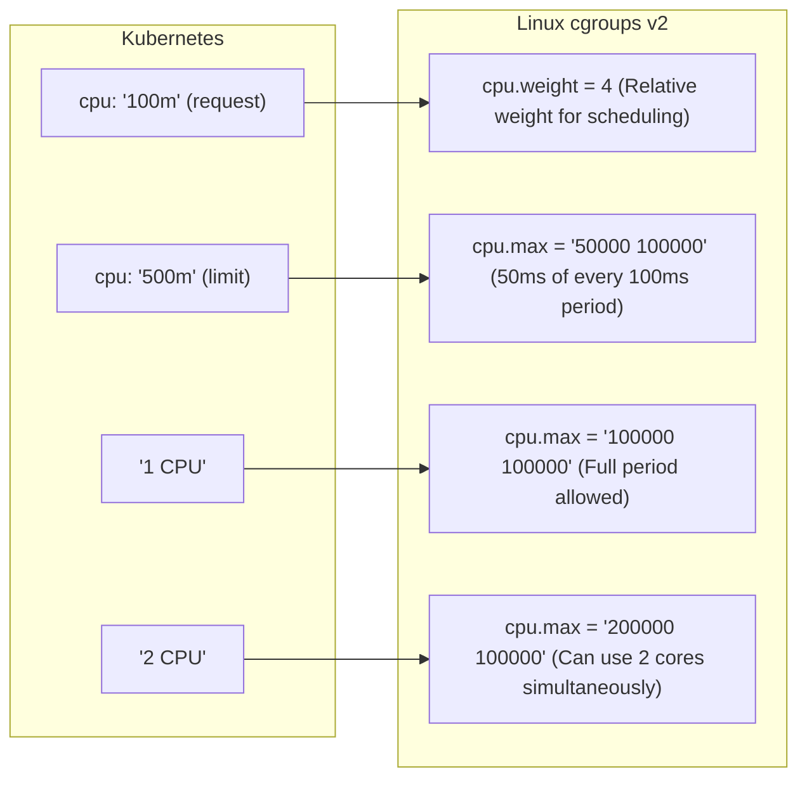
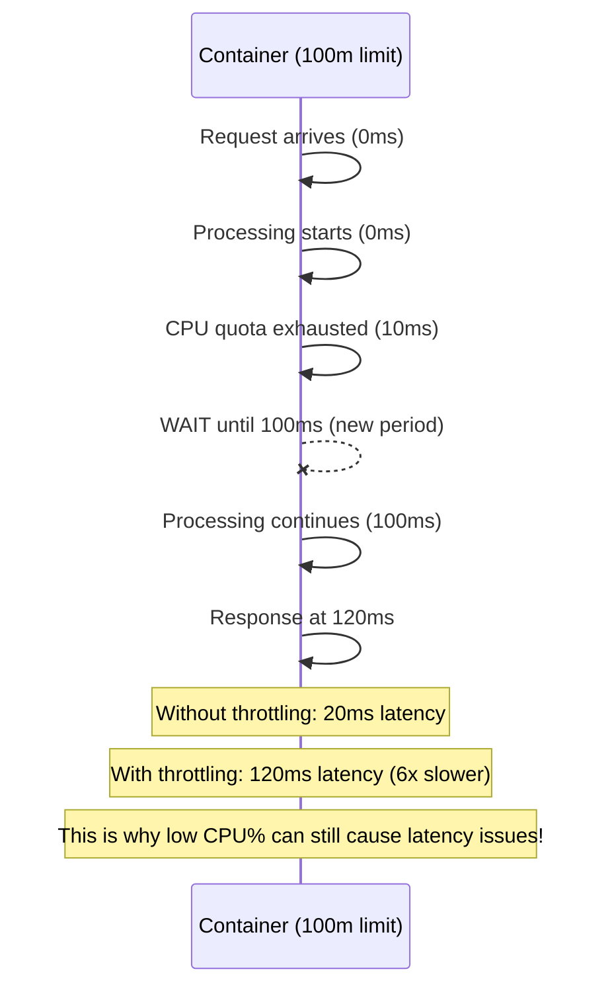
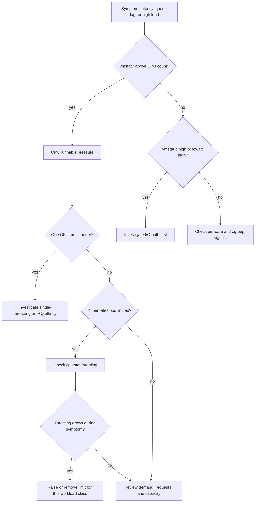

# Module 5.2: CPU & Scheduling

> **Linux Performance** | Complexity: `[MEDIUM]` | Time: 30-35 min, with practical Linux and Kubernetes CPU scheduling diagnostics throughout the lesson.

## Prerequisites

Before starting this module, make sure you can already read basic Linux process output and recognize how containers are mapped onto cgroups.
- **Required**: [Module 5.1: USE Method](../module-5.1-use-method/)
- **Required**: [Module 2.2: cgroups](/linux/foundations/container-primitives/module-2.2-cgroups/)
- **Helpful**: Understanding of processes and threads


## Learning Outcomes

After completing this module, you will be able to connect Linux scheduler evidence to Kubernetes resource policy decisions during realistic production incidents.
- **Diagnose** CPU contention and bottlenecks using standard Linux utilities like `top`, `mpstat`, and `vmstat`.
- **Evaluate** the impact of Kubernetes CPU requests and limits on application performance and throttling.
- **Implement** strategies to optimize CPU resource allocation for containerized workloads in Kubernetes.
- **Compare** the roles of the Completely Fair Scheduler (CFS) and cgroups in managing CPU resources.
- **Troubleshoot** high load averages and unexpected application latency stemming from CPU scheduling issues.


## Why This Module Matters: The Hidden Cost of CPU Throttling

Imagine a major e-commerce platform, anonymized here as MegaMart, preparing for its largest sale of the year. Its service owners have dashboards showing average CPU utilization below 30% across most application nodes, and the autoscaler has already added capacity. When the event begins, customers still see checkout timeouts, search requests pile up, and carts disappear after retries. The incident review later estimates millions of dollars in lost revenue, even though the first dashboard everyone opened made the servers look relaxed.

The root cause was not an absent CPU. The root cause was time that the application was not allowed to use. Several latency-sensitive containers had CPU limits that converted short bursts of request handling into forced pauses, so a request that needed a small amount of compute could still wait for the next cgroup enforcement period before continuing. Average utilization stayed low because averages smear out the exact moments when users were waiting, and the service team spent precious minutes chasing network, cache, and database theories before checking throttling.

This module gives you the operating model needed to avoid that kind of mistake. You will diagnose CPU contention with `top`, `mpstat`, `vmstat`, load averages, context switch counters, cgroup files, and Kubernetes metrics, then connect those observations to scheduler behavior and resource configuration. For Kubernetes examples, define the standard alias `alias k=kubectl`; after that, commands such as `k top pod` are the preferred form, and the target cluster behavior in this module assumes Kubernetes 1.35 or newer.

The deeper lesson is that CPU performance is about permission to make progress, not only about silicon being present. Linux decides which runnable task executes next, cgroups decide how much CPU a group of tasks may consume, and Kubernetes decides where pods land and what constraints the kubelet applies. When those layers agree with the workload's shape, applications feel smooth under load; when they conflict, dashboards can look calm while users wait.


## CPU Fundamentals: Reading What Linux Is Really Saying

Linux performance work starts by separating three ideas that people often collapse into one word: utilization, saturation, and delay. Utilization tells you how busy CPUs were during a measurement interval, saturation tells you whether runnable work was waiting for a CPU, and delay tells you what users or upstream systems actually felt. A host can have moderate utilization with painful delay if a single core is saturated, a cgroup quota is throttling bursts, or runnable work is constantly preempted by higher priority activity.

The first discipline is to treat CPU state as a set of categories rather than one percentage. User time means application code is executing, system time means kernel code is executing on behalf of workloads, idle time means no runnable task needed the CPU, and iowait means the CPU could have done work but the task was blocked on I/O. Interrupt time, soft interrupt time, and steal time each tell a different story about hardware, networking, timers, and virtualized infrastructure, so a responsible diagnosis reads the category mix before naming a bottleneck.

```bash
# View CPU time categories
top -bn1 | grep "Cpu(s)"
# %Cpu(s):  5.2 us,  2.1 sy,  0.0 ni, 92.0 id,  0.5 wa,  0.0 hi,  0.2 si,  0.0 st

# What each means:
```

| Category | Meaning | High Value Indicates |
|----------|---------|---------------------|
| `us` | User - Application code | Application CPU usage |
| `sy` | System - Kernel code | System calls, drivers |
| `ni` | Nice - Low priority user | Nice'd processes running |
| `id` | Idle - Nothing to do | Unused CPU capacity |
| `wa` | I/O Wait - Waiting for disk | I/O bottleneck |
| `hi` | Hardware IRQ - Interrupts | High interrupt load |
| `si` | Software IRQ - Soft interrupts | Network/timer handling |
| `st` | Steal - VM overhead | Hypervisor stealing time |

A high `%us` value usually means application code is consuming processor time, but it does not automatically mean the system is unhealthy. A high `%sy` value points you toward kernel paths such as packet handling, filesystem work, memory management, or very frequent system calls. A high `%wa` value is especially important because it can raise load while CPUs are not actually computing, which is why the USE method from the previous module insists on checking saturation and errors rather than reading one utilization line in isolation.

Load average is the second metric that deserves careful handling. It reports the average number of tasks that were runnable or in uninterruptible sleep over one, five, and fifteen minute windows. That means load includes tasks waiting to run on a CPU and tasks stuck waiting for resources such as disk I/O, so it is closer to a queue length signal than a CPU usage signal. When you compare load to the number of logical CPUs, you get a first approximation of whether runnable demand is exceeding available execution slots.

```bash
# Show load average
uptime
# 10:23:45 up 5 days,  3 users,  load average: 2.15, 1.87, 1.42
#                                              1m    5m    15m

cat /proc/loadavg
# 2.15 1.87 1.42 3/245 12345
# load averages   running/total  last PID
```

On a four CPU system, a load near four can mean the machine is busy but not necessarily falling behind. A load near eight means that, on average, four tasks are running while several more are waiting or blocked, and the next question is whether those waiters are runnable CPU work or I/O sleepers. The trend matters too: a one minute load above the five and fifteen minute values indicates a recent spike, while a fifteen minute value above the short windows suggests the pressure has been slowly clearing.

```mermaid
graph TD
    subgraph "4-core system with load average of 4.0"
        CPU0_P1[P1] --> CPU0(CPU 0)
        CPU1_P2[P2] --> CPU1(CPU 1)
        CPU2_P3[P3] --> CPU2(CPU 2)
        CPU3_P4[P4] --> CPU3(CPU 3)
        subgraph "4 processes running"
            P1_running(P1)
            P2_running(P2)
            P3_running(P3)
            P4_running(P4)
        end
        P1_running --"assigned to"--> CPU0_P1
        P2_running --"assigned to"--> CPU1_P2
        P3_running --"assigned to"--> CPU2_P3
        P4_running --"assigned to"--> CPU3_P4
        PerfUtil(Load = 4.0 = Perfect utilization)
    end
    subgraph "4-core system with load average of 8.0"
        CPU0_P1_8[P1] --> CPU0_8(CPU 0)
        CPU1_P2_8[P2] --> CPU1_8(CPU 1)
        CPU2_P3_8[P3] --> CPU2_8(CPU 2)
        CPU3_P4_8[P4] --> CPU3_8(CPU 3)
        subgraph "4 running"
            P1_running_8(P1)
            P2_running_8(P2)
            P3_running_8(P3)
            P4_running_8(P4)
        end
        P1_running_8 --"assigned to"--> CPU0_P1_8
        P2_running_8 --"assigned to"--> CPU1_P2_8
        P3_running_8 --"assigned to"--> CPU2_P3_8
        P4_running_8 --"assigned to"--> CPU3_P4_8
        Queue_P5(P5)
        Queue_P6(P6)
        Queue_P7(P7)
        Queue_P8(P8)
        subgraph "4 waiting"
            Waiting(Queue: [P5] [P6] [P7] [P8])
        end
        Overload(Load = 8.0 = 100% utilized + 4 waiting)
    end
```

Pause and predict: you have a sixteen CPU system with a load average of twenty-four, but `top` reports substantial iowait and low user time. What conclusion would you avoid, and what would you check next? The conclusion to avoid is "we simply need more CPU," because blocked I/O tasks can inflate load without consuming processor cycles. The next check is `vmstat 1`, especially the `r` and `b` columns, because they separate runnable pressure from tasks blocked in uninterruptible sleep.

CPU count and topology make the load comparison meaningful. `nproc` tells you how many logical CPUs Linux can schedule onto, while `lscpu` shows whether those logical CPUs are spread across sockets, cores, and hardware threads. Hyperthreads are useful scheduling targets, but they are not equivalent to independent physical cores for all workloads, so a latency-sensitive service pinned against one busy hardware thread can still struggle while a dashboard claims the machine has spare logical CPU.

```bash
# Number of CPUs
nproc
# 4

# Detailed CPU info
lscpu
# CPU(s):              4
# Thread(s) per core:  2
# Core(s) per socket:  2
# Socket(s):           1

# Per-CPU info
cat /proc/cpuinfo | grep "processor\|model name" | head -8
```

There is a useful mental model for these first measurements: utilization is the speedometer, load is the line at the counter, and topology is the number of counters that can actually serve customers. If the line is long because every counter is busy, CPU is saturated. If the line is long because customers are waiting for payment authorization, more cashiers will not fix the problem. If one counter has a long line while the rest are empty, the aggregate average is hiding a distribution problem.

That model also explains why the first few minutes of an incident should be deliberately boring. You want to establish CPU count, load trend, CPU state categories, and per-core shape before making a change. A premature restart or a random limit increase can erase the evidence you need, while a measured baseline lets you prove whether the next action actually reduced runnable pressure, I/O wait, or throttling delay.


## The Linux Scheduler: Fairness, Priority, and Preemption

The Linux kernel scheduler answers a question that appears simple but is operationally difficult: when many tasks can run, which task gets which CPU right now? General purpose Linux systems use the Completely Fair Scheduler for normal workloads, and CFS is designed around fairness rather than fixed time slices. Instead of giving every task identical wall clock slices, it tracks how much processor service each runnable task has effectively received, then tries to run the task that is furthest behind its fair share.

Since Linux kernel 2.6.23 in 2007, CFS has used virtual runtime as its central accounting idea. A task that runs accumulates `vruntime`; a task that sleeps or waits stops accumulating it; a task with higher priority accumulates it more slowly. The scheduler keeps runnable tasks in an ordered data structure, traditionally described as a red-black tree, and chooses the task with the smallest virtual runtime. That mechanism favors tasks that have received less CPU service while still allowing priorities to affect the rate at which tasks fall behind or catch up.

```mermaid
graph TD
    A[CFS SCHEDULER] --> B{Goal: Every process gets fair share of CPU}
    B --> C{Process with LOWEST vruntime runs next}
    C --> D[Red-Black Tree]

    subgraph Red-Black Tree
        P3(P3: 5000) --- Highest(Highest vruntime)
        P1(P1: 3000) --- P5(P5: 4500)
        P2(P2: 2000) --- P4(P4: 2800)
        P3 --> P1
        P3 --> P5
        P1 --> P2
        P1 --> P4
    end

    C --> E(Next to run: P2 (lowest vruntime = 2000))
    E --> F(vruntime increases as process uses CPU)
    F --> G(Higher priority = vruntime increases slower)
```

The fairness goal is not the same as a latency guarantee. CFS can make sensible decisions among runnable tasks, but it cannot make a single-threaded program use several cores at once, it cannot make an I/O blocked task proceed before storage responds, and it cannot ignore a cgroup quota that says a container has exhausted its allowed CPU time. The scheduler is one layer in a stack that includes process behavior, kernel work, interrupt handling, cgroup policy, and Kubernetes placement.

Nice values are the everyday interface for adjusting priority among normal CFS tasks. A lower nice value means higher priority, so a task at `-10` receives more favorable scheduling than a task at `10` when both are runnable. This is a hint within the CFS policy, not a hard reservation, and it is most visible when tasks contend for the same CPU. If the machine is mostly idle, a low priority task can still run freely because there is no other runnable work competing for the processor.

```bash
# View process nice values
ps -eo pid,ni,comm | head -10
#   PID  NI COMMAND
#     1   0 systemd
#   123 -20 migration/0
#   456  19 backup

# Nice range: -20 (highest priority) to 19 (lowest priority)
# Default: 0

# Start process with nice value
nice -n 10 ./my-script.sh

# Change running process
renice 10 -p 1234

# Only root can set negative nice (higher priority)
sudo nice -n -10 ./critical-process
```

The practical value of `nice` is that it lets you express intent without rewriting the application. A backup checksum job can be made nice so it yields more readily to interactive or request-serving work, while an emergency maintenance script can be given a higher priority by an operator with the required privileges. The limitation is just as important: in Kubernetes, the container's cgroup CPU weight and quota are usually the stronger controls, so process nice values inside a container cannot compensate for a pod-level CPU limit that is too low.

Stop and think: you run a critical data ingestion process and a weekly reporting job on the same VM, and both are CPU bound during a backfill. Which process would you start with a higher nice value, and what would prove the change worked? The reporting job should receive the higher nice value because higher nice means lower priority, and the proof is a comparison of CPU allocation and nonvoluntary context switches while both jobs are runnable under load.

Real-time scheduling policies are a separate mechanism for workloads that cannot tolerate normal fairness behavior. `SCHED_FIFO` and `SCHED_RR` can preempt ordinary CFS tasks, which makes them useful for specialized domains such as audio, industrial control, or carefully isolated low-latency services. They are also dangerous because a badly behaved real-time task can starve important system work, so they should not be used as a casual fix for application latency in general purpose clusters.

```bash
# Check scheduling policy
chrt -p 1234
# pid 1234's current scheduling policy: SCHED_OTHER
# pid 1234's current scheduling priority: 0

# Policies:
# SCHED_OTHER - Normal (CFS)
# SCHED_FIFO  - Real-time FIFO
# SCHED_RR    - Real-time Round Robin
# SCHED_BATCH - Batch processing
# SCHED_IDLE  - Very low priority

# Set real-time priority (careful!)
sudo chrt -f -p 50 1234
```

A useful war story comes from a media processing team that moved an encoder helper into a real-time policy to remove audio glitches during peak ingest. The change helped in a single host test, but in production one helper process entered a tight loop and starved node agents long enough to cause health checks and restarts. The durable fix was not "make everything real-time"; it was isolating the workload, bounding concurrency, measuring scheduling delay, and reserving real-time policy for the smallest component that truly needed it.

The scheduler's fairness also interacts with application design. A process that spawns hundreds of runnable worker threads on a small host can create pressure even when each thread individually seems harmless, because the scheduler must rotate among all runnable tasks and the application may spend more time contending for locks than doing useful work. When you see high context switches and poor throughput together, ask whether the program has too much runnable concurrency for the CPU it actually owns.

For containerized services, this is where local process tuning meets platform policy. Reducing thread pool size can lower run queue pressure inside a pod, but it will not remove throttling caused by a tight CPU limit. Raising the pod request can improve fair share during node contention, but it will not make a single thread use multiple cores. Good CPU work keeps these layers separate until the evidence shows which one is limiting progress.


## CPU Metrics Deep Dive: Seeing Contention Instead of Averages

Aggregate CPU utilization is a convenient starting point and a frequent source of false comfort. If an eight CPU node shows 12.5% total CPU usage, one logical CPU may still be fully saturated while seven are idle. That pattern appears with single-threaded runtimes, interrupt affinity problems, thread pools with poor work distribution, and workloads constrained to a CPU set. Per-CPU metrics turn the vague question "is the machine busy?" into the useful question "where is runnable work actually landing?"

```bash
# Per-CPU utilization
mpstat -P ALL 1
# 10:30:01  CPU    %usr   %sy  %idle  %iowait
# 10:30:02  all    15.2    3.1   80.5     1.2
# 10:30:02    0    20.0    5.0   74.0     1.0
# 10:30:02    1    10.0    2.0   87.0     1.0
# 10:30:02    2    18.0    3.0   78.0     1.0
# 10:30:02    3    13.0    2.0   83.0     2.0
```

When `mpstat -P ALL 1` shows one CPU doing most of the system and soft interrupt work, the next investigation is often interrupt handling rather than application code. Network drivers, storage controllers, and kernel packet processing can concentrate work on a small number of CPUs if affinity or queue configuration is poor. That explains the frustrating case where a web service cannot keep up with traffic even though the host has many idle cores: the application might be waiting behind a kernel path that is pinned to one hot CPU.

Pause and predict: `CPU 0` is consistently near 100% in `%sy` and `%si`, while `CPU 1` through `CPU 7` are almost idle. What kind of configuration problem would you suspect first? The first suspect is interrupt or soft interrupt concentration, often from network receive processing or storage interrupts landing on one CPU. The fix might involve driver queue configuration, receive packet steering, IRQ affinity, or moving the workload, but the diagnosis starts with proving that the hot core is kernel work rather than balanced user code.

Context switches add another lens. A context switch happens when the scheduler stops running one task and starts another, which requires saving and restoring execution state. Some context switching is normal and healthy because programs block on I/O, sleep, wait for locks, or yield cooperatively. Excessive switching, especially nonvoluntary switching for a CPU-bound process, can indicate that the process wants to run but is repeatedly preempted before making enough progress.

```bash
# System-wide context switches
vmstat 1
#  r  b   swpd   free  ...   in   cs
#  2  0      0 123456  ...  500 2000
#                            │    │
#                            │    └── Context switches/sec
#                            └── Interrupts/sec

# Per-process context switches
cat /proc/1234/status | grep ctxt
# voluntary_ctxt_switches:    1000
# nonvoluntary_ctxt_switches: 500

# Voluntary = Process yielded (I/O, sleep)
# Nonvoluntary = Preempted by scheduler
```

The difference between voluntary and nonvoluntary context switches is operationally useful. Voluntary switches suggest the task is waiting by choice, such as sleeping, waiting on a socket, or blocking on disk. Nonvoluntary switches suggest the scheduler removed the task while it was runnable, commonly because the task exhausted its slice or another runnable task had stronger scheduling priority. If a latency-sensitive process shows a rapidly increasing nonvoluntary counter during an incident, you have evidence of CPU contention even before installing a profiler.

The run queue is the most direct saturation signal in the basic toolkit. In `vmstat`, the `r` column shows tasks that are runnable or currently running, while the `b` column shows tasks blocked in uninterruptible sleep. A run queue persistently above the number of logical CPUs means runnable work is waiting for CPU service. A high blocked column with moderate runnable pressure tells you that load is being driven by I/O waits, lock waits in kernel paths, or other non-CPU stalls.

```bash
# Processes in run queue
vmstat 1
#  r  b   swpd   free ...
#  4  0      0 123456 ...
#  │
#  └── Runnable processes

# Alternative
cat /proc/loadavg
# 4.00 3.50 3.00 2/150 12345
#                 │
#                 └── 2 currently running / 150 total
```

A worked example makes the sequence concrete. Suppose users report intermittent latency on a VM, while the host-level CPU chart sits around 55%. You check `vmstat 1` and see `r` fluctuating between ten and fourteen on an eight CPU host, with `b` near zero, so runnable work is queuing for CPU. Then `ps aux --sort=-%cpu` reveals a backup compression process and the application competing heavily, while `/proc/<PID>/status` shows the application accumulating nonvoluntary context switches quickly. That evidence supports lowering the backup priority, moving the job, or adding capacity, rather than tuning database timeouts.

The same sequence also prevents a common misdiagnosis. If the one minute load average is high but `vmstat` shows `r` near one and `b` near eight, the bottleneck is not raw CPU service. You would pivot to storage latency, network filesystems, disk saturation, or kernel paths holding tasks in uninterruptible sleep. CPU scheduling still appears in the investigation, but it is no longer the primary suspect, and that distinction saves time during production incidents.

You should also preserve the time relationship between metrics. A screenshot of high load without the matching `vmstat`, application latency, and cgroup counters is weak evidence because the workload may have already changed. During a live incident, collect several consecutive samples at a short interval and annotate what was happening at the same time. That habit turns scattered command output into a timeline that can survive review after the immediate pressure has passed.

Another useful habit is to compare symptoms at different scopes. Host metrics tell you whether the node is saturated, process metrics tell you whether a particular program is being preempted, and cgroup metrics tell you whether a container group is being capped. When those scopes disagree, the disagreement is often the diagnosis. A quiet node with a throttled pod points to quota; a busy node with many runnable pods points to capacity or requests; a quiet node with one hot CPU points to imbalance.


## Kubernetes CPU Management: Requests, Limits, and Throttling

Kubernetes does not invent CPU control from scratch. It uses Linux cgroups to express scheduling weight and hard quota, then relies on the node kernel to enforce those controls. In Kubernetes 1.35, the operational model you should use is the cgroups v2 model: CPU requests influence relative weight during contention, while CPU limits translate into `cpu.max`, a quota and period that cap execution even when the node has spare CPU. That distinction is the center of modern CPU tuning.

```yaml
resources:
  requests:
    cpu: "100m"     # Guaranteed minimum
  limits:
    cpu: "500m"     # Maximum allowed
```

A CPU request is primarily a scheduling and fairness signal. The Kubernetes scheduler uses requests to decide whether a pod fits on a node, and the kubelet maps the request into a cgroup weight so the container has a proportional claim when CPU is contested. A CPU limit is a hard cap. When the container consumes its quota for the current period, the kernel throttles it until the next period, and that pause happens even if other CPUs are idle.



The word "millicore" can hide the physical behavior. A limit of `500m` does not mean the container gets a smooth half CPU every millisecond. It usually means the cgroup can consume a total budget of 50 milliseconds of CPU time per 100 millisecond period, and the budget may be consumed quickly by parallel threads. A multi-threaded service, a garbage collector, or a TLS-heavy request burst can burn the period budget early, then sit idle by force while user-facing latency grows.

```bash
# Check container throttling (cgroups v2 example)
cat /sys/fs/cgroup/system.slice/container-id.scope/cpu.stat
# usage_usec 123456
# nr_periods 1000
# nr_throttled 150
# throttled_usec 30000000

# Interpretation:
# 1000 periods (100ms each = 100 seconds)
# 150 throttled (15% of periods had throttling)
# 30,000,000 microseconds = 30 seconds throttled
```

`nr_periods` tells you how many enforcement periods elapsed, `nr_throttled` tells you in how many periods the cgroup hit the cap, and `throttled_usec` tells you total time spent throttled. These counters are better evidence than average CPU usage when investigating latency under limits. A service can average far below its limit over a minute while still suffering frequent short pauses during the hottest milliseconds of request handling.

The request versus limit distinction is easiest to remember through idle capacity. Requests shape who wins under contention, so a pod with only a request can burst above that request when nobody else needs the CPU. Limits enforce a maximum whether or not anyone else needs the CPU, so a pod with a low limit can be paused on an otherwise quiet node. This is why many platform teams avoid CPU limits for latency-sensitive services while still requiring realistic CPU requests.

| Mechanism | Effect | When Applied |
|-----------|--------|--------------|
| **Requests** (`cpu.weight`) | Relative weight | Only under contention |
| **Limits** (`cpu.max`) | Hard cap | Always enforced |

```mermaid
graph TD
    subgraph CPU REQUESTS (Weight)
        A[Pod A: 100m request]
        B[Pod B: 200m request]
        A --- B
        A_contention{"When both compete for CPU"}
        A_gets["Pod A gets: ~33% CPU"]
        B_gets["Pod B gets: ~67% CPU"]
        A_alone{"When only Pod A runs"}
        A_can_use["Pod A can burst to 100% (Weight only matters during contention)"]
        A --> A_contention
        B --> A_contention
        A_contention --> A_gets
        A_contention --> B_gets
        A --> A_alone
        A_alone --> A_can_use
    end

    subgraph CPU LIMITS (Max)
        C[Pod A: 500m limit = 50ms per 100ms]
        D["Even if CPU is idle, Pod A is capped at 50%"]
        E["This causes throttling (latency spikes)"]
        C --> D
        D --> E
    end
```

There are legitimate reasons to keep CPU limits. A hard multi-tenant cluster may need limits to protect tenants from noisy neighbors, support chargeback expectations, or prevent unbounded batch jobs from harming control plane agents and system daemons. The tradeoff is that strict isolation can convert bursty compute into tail latency. A strong platform standard states which workload classes may run without CPU limits, what requests they must set, which namespaces require caps, and what alerts prove throttling is actually happening.

```bash
# Pod CPU usage
alias k=kubectl
k top pod

# Detailed metrics (if metrics-server installed)
k get --raw /apis/metrics.k8s.io/v1beta1/pods

# Equivalent full kubectl forms kept for comparison:
kubectl top pod
kubectl get --raw /apis/metrics.k8s.io/v1beta1/pods

# Viewing direct cgroup v2 stats for a container via the filesystem
# Since container runtimes map paths differently, searching is reliable:
find /sys/fs/cgroup -name cpu.stat -exec awk '/nr_throttled/ {if ($2 > 0) print FILENAME ": " $2}' {} +
```

Metrics Server gives a useful current usage view, but it does not replace cgroup throttling counters. For a Kubernetes 1.35 workload, the operational path is to correlate application latency with pod CPU usage, node CPU saturation, and cgroup `cpu.stat` growth. If latency spikes line up with `nr_throttled` and `throttled_usec` increases while node CPU is not saturated, the limit is a likely cause. If node CPU is saturated and many pods are runnable, the request and placement strategy may be the stronger lever.

Which approach would you choose here and why: a payment API with strict p99 latency gets realistic CPU requests, no CPU limit, horizontal autoscaling, and node capacity alerts; a best-effort image resize queue gets a request and a conservative limit. That split is often healthier than one cluster-wide rule because the payment API is harmed by short forced pauses, while the batch queue can tolerate slower completion in exchange for stronger isolation.

The request value should come from measurement rather than guesswork. A common policy is to start from recent production CPU usage, choose a percentile that reflects steady demand, add headroom for normal bursts, and revisit the number after large releases. If every service requests the minimum because teams fear lower bin packing, the scheduler's fairness signal becomes fiction, and the cluster will eventually reveal that fiction during contention.

The limit value, when present, should have an even clearer reason. It might protect a shared tenant node from runaway batch work, or it might enforce a cost boundary for a namespace that accepts slower jobs. If nobody can name the failure the limit is preventing, the limit is a candidate for removal from latency-sensitive services. The review is not ideological; it is a tradeoff between isolation and the delay caused by quota enforcement.


## Troubleshooting CPU Performance Issues

A reliable CPU investigation moves from broad symptoms to narrow evidence. Start with the user-visible symptom, such as p95 latency, queue lag, request timeouts, or missed cron deadlines. Then determine whether host-level saturation, per-core imbalance, process contention, cgroup throttling, or I/O blocking explains the symptom. The order matters because jumping straight to one tool often confirms the theory you already had, while a structured path protects you from mistaking load, utilization, and quota delay for one another.

```bash
# Diagnosis steps:
# 1. Is it CPU or I/O?
vmstat 1
#  r  b    ← r=CPU, b=I/O
#  8  0    ← High r = CPU bound
#  2  6    ← High b = I/O bound

# 2. What's using CPU?
top -bn1 | head -15
ps aux --sort=-%cpu | head -10
```

The first branch is CPU-bound versus I/O-bound pressure. A high `r` value with low `b` means runnable tasks are waiting for CPU, so you inspect the heaviest processes, per-CPU distribution, and context switches. A high `b` value means tasks are blocked in the kernel, so disk latency, network filesystems, or storage controllers become stronger suspects. If both are high, you may have a feedback loop, such as CPU-heavy compression making storage writes slower while blocked writers accumulate.

For containerized workloads, add cgroup checks early instead of treating Kubernetes as a separate world. A pod can be throttled by `cpu.max` while the node has idle CPU, and that finding changes the remedy from "add nodes" to "adjust or remove the limit for this workload class." Conversely, a pod without a limit can burst freely, but if the node is saturated and requests are too low, the pod may lose scheduling share to other workloads under contention. Requests and limits solve different problems, so the fix has to match the evidence.

The throttling latency pattern is counterintuitive because the wall clock delay can be much larger than the CPU time the application needed. A container limited to `100m` can use only about ten milliseconds of CPU in a typical 100 millisecond period. If a request needs twenty milliseconds of CPU and arrives just after the quota is consumed, the request can be split across periods and wait far longer than its actual compute requirement. This is why low average CPU usage can coexist with sharp tail latency.



A practical Kubernetes playbook has four checks. First, compare application latency with pod CPU usage and node CPU saturation so you know whether the symptom follows demand. Second, inspect throttling counters for the affected cgroup or container. Third, compare CPU requests to observed steady-state demand, because an unrealistically low request can make the pod a weak competitor during node contention. Fourth, examine whether the workload is bursty, multi-threaded, garbage-collector-heavy, or single-threaded, because each shape reacts differently to limits and per-core saturation.

Removing CPU limits is not a universal cure. It can eliminate quota throttling for a latency-sensitive pod, but it also allows that pod to consume idle CPU and potentially starve other workloads when the node becomes saturated. The safer pattern is to remove limits only for classes that need burst behavior, set requests from measured demand plus headroom, use pod and node autoscaling, and keep noisy batch or tenant workloads constrained. Platform policy should also reserve CPU for system components so node agents are not pushed out by application bursts.

One worked example ties the layers together. A Java API reports p99 latency spikes after a deployment, and `k top pod` shows average CPU below the configured two CPU limit. The team checks cgroup `cpu.stat` and sees `nr_throttled` growing during latency spikes, while the node has idle CPU. The application changed garbage collection behavior and now performs short parallel bursts that consume quota quickly. Raising or removing the CPU limit for that service, while keeping a realistic request and autoscaling policy, addresses the actual scheduler delay rather than hiding it behind more replicas.

Another example points the other way. A single-threaded Node.js consumer falls behind on an eight CPU VM, and dashboards show overall CPU near 12.5%. `mpstat -P ALL 1` reveals one core at or near full user time while the others are mostly idle. There is no cgroup throttling problem, and adding a pod CPU limit change would not help. The fix is to shard the queue, run more worker processes, adjust runtime concurrency, or redesign the workload so it can use multiple cores.

When the diagnosis leads to a configuration change, verify the result with the same evidence that justified the change. If you remove a CPU limit, `nr_throttled` should stop increasing during the same traffic pattern, but node saturation and neighbor workloads must remain healthy. If you raise a request, the pod should receive a better share under contention, but scheduling density may drop. If you change thread count, context switches and run queue depth should move in the expected direction.

Avoid treating autoscaling as a substitute for scheduler understanding. Horizontal Pod Autoscaling can add replicas when demand rises, but it reacts to metrics over time and may not fix per-request quota pauses inside each replica. Node autoscaling can add capacity, but it cannot make a low CPU limit stop throttling a single pod on an idle node. Autoscaling is powerful when resource policy is truthful; it is confusing when requests and limits hide the workload's real shape.


## Patterns & Anti-Patterns

Good CPU operations are less about memorizing one command and more about choosing a pattern that matches the workload. Latency-sensitive services need room for short bursts, realistic requests, and alerts that catch throttling before users report it. Batch jobs need fairness, bounded concurrency, and often lower priority. Shared clusters need tenant isolation without silently punishing the workloads that are most sensitive to short scheduler pauses.

| Pattern | When to Use | Why It Works | Scaling Considerations |
|---------|-------------|--------------|------------------------|
| Requests based on measured steady load plus headroom | Long-running services with stable traffic patterns | Gives the scheduler and cgroup weight a truthful baseline during contention | Revisit after major releases, traffic changes, or runtime upgrades |
| No CPU limit for latency-sensitive services | APIs, gateways, and control loops where p99 delay matters | Allows short bursts to use idle node CPU without quota pauses | Requires node saturation alerts, HPA, and protection for system daemons |
| Conservative limits for tolerant batch work | Rendering, indexing, reports, and queue jobs with flexible deadlines | Prevents noisy jobs from consuming all shared CPU | Pair with queue depth alerts and concurrency controls |
| Per-core inspection during imbalance | Single-threaded services, IRQ-heavy nodes, and pinned workloads | Reveals hot CPUs hidden by aggregate utilization | Combine with thread model, affinity, and runtime concurrency review |

These patterns scale when teams document the reason behind each resource policy. A service manifest that says "no CPU limit because p99 latency is quota-sensitive; request set from seven day p95 CPU plus headroom" is much easier to operate than a manifest that simply omits the limit. The comment is not decoration; it tells the next engineer what evidence would justify changing the policy.

| Anti-Pattern | What Goes Wrong | Better Alternative |
|--------------|-----------------|--------------------|
| Setting tiny CPU limits on every pod by default | Bursty services are throttled even on idle nodes | Require requests everywhere, use limits only where isolation matters |
| Treating load average as CPU utilization | I/O-blocked tasks are mistaken for CPU starvation | Compare load with `vmstat` `r` and `b` before deciding |
| Looking only at aggregate CPU | Hot-core bottlenecks disappear into the average | Use `mpstat -P ALL 1` and runtime-specific concurrency checks |
| Raising real-time priority to fix ordinary latency | A runaway task can starve system and application work | Use capacity, isolation, profiling, and bounded concurrency first |

The common thread is that CPU policy should describe a tradeoff explicitly. A limit buys isolation at the cost of possible latency. A missing limit buys burst capacity at the cost of stronger noisy-neighbor risk. A high request buys fair share and placement confidence at the cost of lower packing density. The right answer depends on the service's failure mode, and the evidence should come from the same measurements you use during incidents.

Teams that do this well usually make CPU review part of normal service ownership rather than emergency tuning. They record the reason for each request and limit, alert on throttling where it matters, and compare resource settings after major runtime or traffic changes. The payoff is not only better latency. It is faster incident response because the team already knows which workloads are allowed to burst, which are intentionally capped, and which metrics prove the policy is working.


## Decision Framework

Use this framework when a workload shows CPU-related symptoms or when you are reviewing a Kubernetes resource policy. Begin with the symptom, not the manifest. If the symptom is tail latency or queue lag, verify whether runnable work is waiting, whether one CPU is hot, whether the cgroup is throttled, and whether I/O wait is inflating load. Only then choose between changing requests, changing limits, changing concurrency, adding replicas, or moving the workload.

| Observation | Strongest Next Check | Likely Action |
|-------------|----------------------|---------------|
| High load and high `r` in `vmstat` | `top`, `ps`, per-process context switches | Reduce CPU demand, add capacity, tune priority, or move jobs |
| High load and high `b` in `vmstat` | Storage, filesystem, and network I/O metrics | Investigate I/O instead of buying CPU first |
| Low average CPU but high p99 latency in a limited pod | cgroup `cpu.stat` throttling counters | Raise or remove CPU limit, then protect with requests and autoscaling |
| One CPU saturated while others are idle | `mpstat -P ALL 1`, runtime thread model, IRQ affinity | Shard, add worker processes, tune affinity, or rebalance interrupts |
| Node saturated with many pods contending | Requests versus actual CPU demand | Resize requests, spread workloads, add nodes, or adjust scheduling |



When the framework points to a CPU limit, make the smallest policy change that matches the workload class. For an API, that may mean removing the limit, setting a request based on observed demand, and confirming HPA or node autoscaling behavior. For a tenant batch job, that may mean raising the limit enough to avoid pathological throttling while keeping a cap that protects the rest of the node. For a single-threaded application, the decision may have nothing to do with limits because one thread cannot use a larger quota across many cores.

The framework is also useful during design reviews. Before approving a new workload, ask what happens when it receives a burst, what happens when the node is saturated, and what evidence would show the chosen policy is wrong. Those questions connect the manifest to operations. They also keep teams from copying resource settings across services with completely different latency tolerance, concurrency models, and tenant risk.


## Did You Know?

- **Linux has used CFS for normal tasks since 2007** - Kernel 2.6.23 replaced the older O(1) scheduler with a design based on virtual runtime and fair service.
- **Kubernetes CPU `100m` is a control-plane abstraction** - The node kernel enforces weights and quotas through cgroups; it does not schedule a native unit called a millicore.
- **The common cgroup quota period is 100,000 microseconds** - A `100m` limit can therefore behave like ten milliseconds of CPU budget per 100 millisecond period.
- **Nice values run from -20 to 19** - Lower values are higher priority, and unprivileged users can usually make their own tasks nicer but not more favored than default.


## Common Mistakes

| Mistake | Why It Happens | How to Fix It |
|---------|----------------|---------------|
| Setting CPU limits too low on latency-sensitive pods | Teams want isolation and copy a default limit without testing burst behavior | Use realistic requests, inspect throttling, and remove or raise limits where p99 latency is quota-sensitive |
| Confusing requests and limits | Both appear under `resources`, but one is a scheduling weight and the other is a hard cap | Teach requests as fair-share baseline and limits as quota enforcement, then review each workload class |
| Ignoring `iowait` (`wa%`) in `top` | High load feels like CPU trouble during an incident | Check `vmstat` `r` and `b`; pivot to storage or network I/O when blocked tasks dominate |
| Trusting aggregate CPU on multi-core hosts | Dashboards average away hot-core and single-threaded bottlenecks | Use `mpstat -P ALL 1` and inspect runtime concurrency before adding CPU quota |
| Assuming `nice` values override container policy | Process priority is visible inside the container, but cgroup controls still govern CPU share and quota | Tune Kubernetes requests and limits first, then use nice values only for local process priorities |
| Ignoring nonvoluntary context switches | CPU contention is harder to see than a high usage graph | Inspect `/proc/<PID>/status` and compare voluntary versus nonvoluntary switch growth under load |
| Removing every CPU limit without guardrails | Avoiding throttling can create noisy-neighbor risk on saturated nodes | Pair limit-free services with measured requests, autoscaling, node alerts, and separate treatment for batch work |


## Quiz

<details><summary>Question 1: A Kubernetes API pod has a `200m` request and a `500m` limit. Users report latency spikes while node CPU utilization sits near 40%. What do you check first, and why?</summary>

Check the pod or container cgroup `cpu.stat` counters, especially `nr_throttled` and `throttled_usec`, during the latency window. The `500m` limit is a hard quota, so the container can be paused after consuming its period budget even when the node has idle CPU. Average node utilization cannot reveal those short forced waits. If throttling grows with latency, the limit is a stronger suspect than node capacity.

</details>

<details><summary>Question 2: An eight CPU server shows load averages of 10.0, 8.0, and 6.0. What does the trend suggest, and how would `vmstat` guide your next step?</summary>

The system is currently above its CPU count and the short window is higher than the longer windows, so pressure increased recently. `vmstat 1` tells you whether that pressure is runnable CPU demand or blocked I/O demand. A high `r` value points toward CPU contention, while a high `b` value points toward tasks stuck in uninterruptible waits. That distinction determines whether you inspect processes and priorities or pivot to storage and I/O paths.

</details>

<details><summary>Question 3: A Java service slows down whenever its CPU limit is below two CPUs, but `k top pod` shows average CPU around one and a half CPUs. What is a likely explanation?</summary>

The service may need short parallel bursts, especially during garbage collection, JIT activity, TLS work, or request fanout. Averages can stay below the limit while the process still exhausts quota during brief hot periods. Once the quota is consumed, the kernel throttles the cgroup and stretches application pauses across scheduling periods. Checking `cpu.stat` during the slow windows would confirm whether throttling aligns with the degradation.

</details>

<details><summary>Question 4: A batch worker has only CPU requests, while a web server has requests and a strict CPU limit. During an off-peak web traffic spike, the node is mostly idle. How will the scheduler treat them differently?</summary>

The batch worker can burst above its request because a request is a relative weight that matters during contention. The web server is still capped by its CPU limit because the limit maps to quota enforcement. If the web server needs more CPU than its limit during the spike, it can be throttled even though idle node CPU exists. This is why limits and requests should not be described as two versions of the same guarantee.

</details>

<details><summary>Question 5: A VM-hosted backend has moderate total CPU usage, but you suspect one process is being preempted by noisy neighbors. Which local evidence would support that hypothesis?</summary>

Inspect `/proc/<PID>/status` for `voluntary_ctxt_switches` and `nonvoluntary_ctxt_switches`, then watch how they grow during the symptom. A rapidly increasing nonvoluntary counter means the process wanted to run but the scheduler removed it. If voluntary switches are not growing at the same pace, the process is less likely to be merely sleeping or waiting on I/O. That evidence supports CPU contention before you install heavier profiling tools.

</details>

<details><summary>Question 6: A single-threaded Node.js consumer falls behind on an eight CPU host showing only 12.5% total CPU usage. What tool exposes the likely bottleneck?</summary>

Use `mpstat -P ALL 1` or an equivalent per-CPU view. A single-threaded process can fully occupy one logical CPU while the other seven sit mostly idle, and the aggregate average will hide that shape. If one CPU is hot in user time, increasing a pod limit or buying a larger node may not solve the queue lag. The likely fixes are sharding, more worker processes, or changing the concurrency model.

</details>


## Hands-On Exercise: Exploring CPU Scheduling Dynamics

**Objective**: Gain practical experience observing CPU scheduling, priority, and throttling behavior using common Linux tools and container runtimes.

**Environment**: A Linux system, VM, cloud instance, or local machine running a modern distribution with `stress` and `docker` or `podman` installed. Root access may be required for cgroup steps, and Kubernetes checks assume a Kubernetes 1.35 or newer cluster when you use `alias k=kubectl` and commands such as `k top pod`.

This exercise intentionally moves from observation to controlled pressure. First you record CPU topology and current load so every later number has context. Then you create competing CPU-bound work, inspect scheduling behavior, and finally apply cgroup quotas directly before observing the same concept through a container runtime. The goal is not to memorize one output format, but to build the habit of connecting each metric to the scheduler behavior that produced it.

Before you begin, decide what result would surprise you. For example, if the machine has many CPUs, a small `stress --cpu 4` run may not overload it, and the interesting observation might be per-core distribution rather than a high run queue. If your container runtime uses a slightly different cgroup path, the lesson is to follow the runtime's mapping carefully rather than assume every host arranges cgroup files the same way.

### Part 1: Initial CPU System Metrics

Begin by establishing a baseline understanding of your system's CPU characteristics and current load. Write down the number of logical CPUs before interpreting load average, because a load of four means something very different on a two CPU laptop than on a sixteen CPU build host.

```bash
# 1. Check CPU info: Identify the number of logical CPUs, cores, and sockets.
#    This helps in interpreting load averages and per-CPU statistics.
nproc
lscpu | grep -E "CPU|Thread|Core|Socket"

# 2. View current load: Get a snapshot of the system's load average.
#    Note the 1, 5, and 15-minute averages.
uptime
cat /proc/loadavg

# 3. CPU time breakdown: See how CPU time is categorized (user, system, idle, iowait, etc.).
#    This gives an initial hint if CPU is busy, waiting for I/O, or idle.
top -bn1 | head -8

# 4. Per-CPU statistics: Examine individual CPU core utilization.
#    Look for uneven distribution or saturated individual cores.
mpstat -P ALL 1 3
```

<details><summary>Expected Output and Analysis</summary>

You should see `nproc` print the number of logical CPUs, `lscpu` describe threads, cores, and sockets, and `uptime` show the one, five, and fifteen minute load averages. Compare those load values to the CPU count instead of judging them in isolation. `top` should show CPU time categories such as user, system, idle, and iowait, while `mpstat` should show whether one CPU is doing far more work than the others. If a single CPU is much hotter than the average, keep that observation for later troubleshooting.

</details>

### Part 2: Observing Nice Values in Action

This section demonstrates how `nice` values influence CPU allocation between competing processes. The commands use two infinite hashing jobs so there is clear contention; do not run them on a production host, and clean them up promptly.

```bash
# 1. Start two CPU-intensive processes with different nice values.
#    `sha256sum /dev/zero` is a CPU-bound process that reads from /dev/zero and computes SHA256 hashes indefinitely.
nice -n 19 sha256sum /dev/zero &
PID1=$!

nice -n 0 sha256sum /dev/zero &
PID2=$!

# 2. Check their nice values and CPU usage.
#    Observe the `%cpu` column for PID1 and PID2.
ps -o pid,ni,%cpu,comm -p $PID1,$PID2
sleep 3
ps -o pid,ni,%cpu,comm -p $PID1,$PID2

# 3. Notice the CPU% difference: The process with `nice 0` should get significantly more CPU time.
#    A process with a lower nice value (higher priority) will be favored by the CFS.

# 4. Clean up: Terminate the background processes.
kill $PID1 $PID2
```

<details><summary>Expected Output and Analysis</summary>

The `nice 0` process should usually receive more CPU time than the `nice 19` process while both are CPU bound. The split will not be perfectly stable because other system work also runs, but the direction should be clear. This demonstrates that nice values influence fair-share scheduling under contention rather than imposing an absolute CPU cap. If both processes run on an otherwise idle multi-core machine, you may need to start more competing workers or constrain affinity to make the difference obvious.

</details>

### Part 3: System-Wide Scheduling Behavior

Explore how context switches and the run queue behave under increasing system load. Keep the `vmstat` output visible while you start load, because the transition is more educational than a static snapshot after the system has already settled.

```bash
# 1. Monitor system-wide context switches and run queue depth.
#    The 'cs' column (context switches) shows how many times the CPU switches between processes per second.
#    The 'r' column (run queue) shows the number of runnable processes.
vmstat 1 5
# Watch the 'cs' column for spikes and 'r' column for increases.

# 2. Create significant CPU load using the `stress` tool.
#    `stress --cpu 4` will create 4 processes that spin on CPU, simulating heavy computation.
stress --cpu 4 --timeout 30 &

# 3. Watch the load average change in real-time.
#    Open a new terminal or run this in the background: `watch -n 1 uptime`.
#    Observe how the 1-minute load average gradually increases as the `stress` processes consume CPU.
#    Wait 1-2 minutes to see the 1-minute average rise significantly.
watch -n 1 uptime
```

<details><summary>Expected Output and Analysis</summary>

When `stress` starts, the `r` column should increase because more processes are runnable and competing for CPU service. The `cs` column may also rise as the scheduler switches among active tasks. The one minute load average will climb gradually rather than instantly because load averages are smoothed over time. Compare the load to your `nproc` result so you can decide whether the system is merely busy or actually queuing runnable work.

</details>

### Part 4: Investigating cgroup CPU Quotas (Native Linux)

This part uses the modern cgroups v2 unified hierarchy to demonstrate CPU quotas directly on a Linux system. This is the same family of kernel mechanism Kubernetes uses under the hood, so the lesson transfers directly to pod CPU limits.

```bash
# 1. Create a new CPU cgroup (cgroups v2).
#    Requires root privileges.
sudo mkdir /sys/fs/cgroup/test

# 2. Set a CPU quota for this cgroup (e.g., 10% of a CPU core).
#    `cpu.max`: format is "quota period".
#    "10000 100000" means 10,000us quota per 100,000us period (10% limit).
echo "10000 100000" | sudo tee /sys/fs/cgroup/test/cpu.max

# 3. Run a CPU-intensive process within this cgroup.
#    The `$$` expands to the current shell's PID, moving it into the cgroup.
#    Then, `sha256sum /dev/zero` will run under the imposed limit.
echo $$ | sudo tee /sys/fs/cgroup/test/cgroup.procs
sha256sum /dev/zero &
PID=$! # Store the PID of the background process

# 4. Check for throttling: Observe `nr_throttled` and `throttled_usec`.
#    You should see these values incrementing, indicating active throttling.
sleep 5
cat /sys/fs/cgroup/test/cpu.stat

# 5. Clean up: Terminate the process and remove the cgroup.
kill $PID
echo $$ | sudo tee /sys/fs/cgroup/cgroup.procs # Move shell back to root cgroup
sudo rmdir /sys/fs/cgroup/test
```

<details><summary>Expected Output and Analysis</summary>

After a few seconds of `sha256sum` running, `cpu.stat` should show `nr_throttled` and `throttled_usec` greater than zero. That proves the process is runnable and wants CPU, but the cgroup quota prevents it from consuming more than the configured share during each period. If cleanup fails because the shell is still inside the test cgroup or a child process remains, move the shell back to the root cgroup and make sure the hashing process is stopped before removing the directory.

</details>

### Part 5: Container CPU Limits and Throttling (Docker/Podman)

This section extends the cgroup understanding to container runtimes, showing how `docker` or `podman` applies CPU limits and how to observe their effect via modern cgroups v2. The important connection is that a friendly container flag becomes a kernel quota file, and the kernel is what enforces the pause.

```bash
# 1. Run a container with a CPU limit (e.g., 0.5 CPUs).
#    The `--cpus` flag directly translates to cgroup CPU max quotas.
docker run -d --name cpu-test --cpus="0.5" nginx sleep 3600

# 2. Inspect the cgroup settings applied to the container.
#    These should reflect the `0.5` CPU limit (i.e., 50000 quota for a 100000 period).
docker exec cpu-test cat /sys/fs/cgroup/cpu.max

# 3. Generate CPU load inside the container.
#    This will push the container against its defined CPU limit.
docker exec cpu-test sh -c "sha256sum /dev/zero &"

# 4. Check for throttling after a minute or so.
#    Observe the `nr_throttled` and `throttled_usec` entries in the v2 hierarchy.
sleep 60
docker exec cpu-test cat /sys/fs/cgroup/cpu.stat

# 5. Clean up: Stop and remove the container.
docker rm -f cpu-test
```

<details><summary>Expected Output and Analysis</summary>

The `cpu.max` output inside the container should show a quota and period consistent with half a CPU, commonly `50000 100000`. After the hashing workload runs, `cpu.stat` should show nonzero throttling counters. This is directly analogous to Kubernetes CPU limits, except Kubernetes writes the cgroup settings through the kubelet and container runtime. If you repeat the experiment without the CPU limit, the throttling counters should stop growing under the same local load.

</details>

### Success Criteria Checklist

- [ ] I can explain the difference between `us`, `sy`, `id`, `wa`, and `st` CPU time categories.
- [ ] I can interpret load average values relative to the number of logical CPUs.
- [ ] I have observed how `nice` values impact CPU allocation among competing processes.
- [ ] I have monitored context switches and run queue depth under load.
- [ ] I understand how cgroups v2 `cpu.max` implements CPU limits natively.
- [ ] I have seen evidence of CPU throttling both in native cgroups and within a container.


## Next Module

Continue to [Module 5.3: Memory Management](./module-5.3-memory-management/) to compare CPU throttling with memory pressure, OOM behavior, RSS, cache, swap, and the very different failure mode of Kubernetes memory limits.


## Further Reading

- [Module 5.1: USE Method](../module-5.1-use-method/)
- [Module 2.2: cgroups](/linux/foundations/container-primitives/module-2.2-cgroups/)
- [CFS Scheduler Documentation](https://www.kernel.org/doc/Documentation/scheduler/sched-design-CFS.txt)
- [CPU Bandwidth Control](https://www.kernel.org/doc/Documentation/scheduler/sched-bwc.txt)
- [CFS Scheduler Design](https://www.kernel.org/doc/html/latest/scheduler/sched-design-CFS.html)
- [Cgroup v2 CPU Controller](https://docs.kernel.org/admin-guide/cgroup-v2.html#cpu)
- [Proc Filesystem Load Average](https://docs.kernel.org/filesystems/proc.html)
- [Kubernetes Resource Management for Pods and Containers](https://kubernetes.io/docs/concepts/configuration/manage-resources-containers/)
- [Kubernetes CPU Management Policies](https://kubernetes.io/docs/tasks/administer-cluster/cpu-management-policies/)
- [Kubernetes Metrics Server](https://kubernetes.io/docs/tasks/debug/debug-cluster/resource-metrics-pipeline/)
- [Kubernetes Node Allocatable](https://kubernetes.io/docs/tasks/administer-cluster/reserve-compute-resources/)
- [For the Love of God, Stop Using CPU Limits](https://home.robusta.dev/blog/stop-using-cpu-limits)
