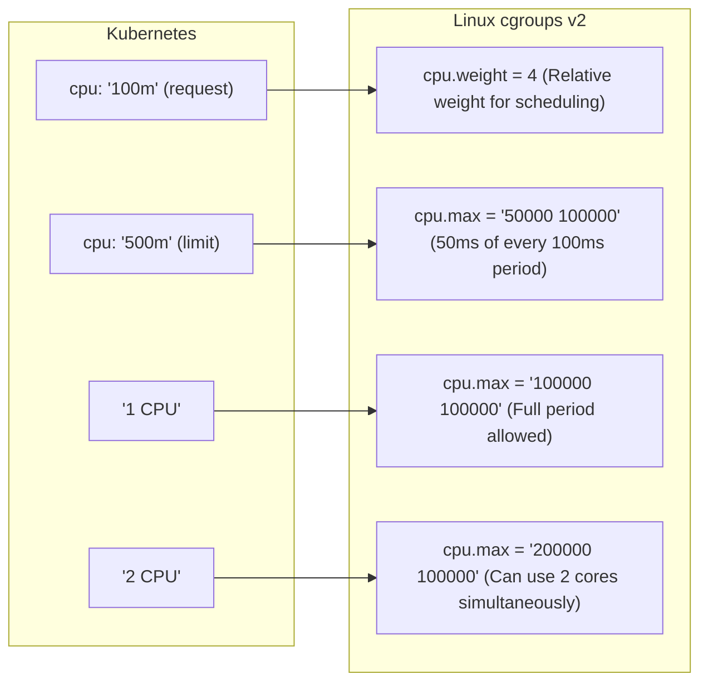
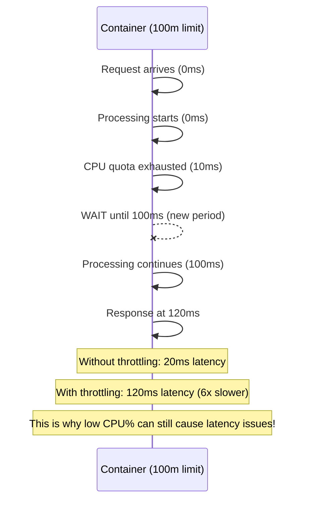

> **Linux Performance** | Complexity: `[MEDIUM]` | Time: 30-35 min

## Prerequisites

Before starting this module:
- **Required**: [Module 5.1: USE Method](../module-5.1-use-method/)
- **Required**: [Module 2.2: cgroups](/linux/foundations/container-primitives/module-2.2-cgroups/)
- **Helpful**: Understanding of processes and threads

---

## Learning Outcomes

After completing this module, you will be able to:
- **Diagnose** CPU contention and bottlenecks using standard Linux utilities like `top`, `mpstat`, and `vmstat`.
- **Evaluate** the impact of Kubernetes CPU requests and limits on application performance and throttling.
- **Implement** strategies to optimize CPU resource allocation for containerized workloads in Kubernetes.
- **Compare** the roles of the Completely Fair Scheduler (CFS) and cgroups in managing CPU resources.
- **Troubleshoot** high load averages and unexpected application latency stemming from CPU scheduling issues.

---

## Why This Module Matters: The Hidden Cost of CPU Throttling

Imagine a major e-commerce platform, let's call it "MegaMart," preparing for its biggest sales event of the year. Their site reliably handles millions of requests per day, and their monitoring dashboards show average CPU utilization well within acceptable limits—never exceeding 30% on most application servers. Yet, when the sales event goes live, customers report slow page loads, transactions time out, and carts mysteriously empty. MegaMart's engineers scramble, checking everything from network latency to database performance, but find no obvious culprits. The CPUs *look* idle on average. What went wrong?

This scenario, tragically common in cloud-native environments, is often caused by an insidious performance killer: **CPU throttling**. Despite seemingly low average utilization, poorly configured CPU limits in Kubernetes can introduce micro-pauses for your applications, turning smooth execution into a stop-and-go crawl. These tiny, forced delays accumulate, dramatically increasing latency for user-facing requests and causing cascading failures across microservices. MegaMart's seemingly "idle" CPUs were actually forcing critical application processes to wait, even when ample capacity was available, leading to a disastrous customer experience and millions in lost revenue. Understanding CPU scheduling isn't just an academic exercise; it's a critical skill for preventing such catastrophes and ensuring your applications perform reliably under pressure.

---

## CPU Fundamentals: Understanding How Linux Sees Your Processor

Before diving into how the CPU is scheduled, it's crucial to understand how Linux perceives and measures its utilization. This section covers the basic tools and concepts for monitoring CPU activity.

### CPU Time Categories

The operating system categorizes CPU time into various states, providing a granular view of where your processor's cycles are being spent. Understanding these categories is the first step in diagnosing CPU-related performance issues.

```bash
# View CPU time categories
top -bn1 | grep "Cpu(s)"
# %Cpu(s):  5.2 us,  2.1 sy,  0.0 ni, 92.0 id,  0.5 wa,  0.0 hi,  0.2 si,  0.0 st

# What each means:
```

| Category | Meaning | High Value Indicates |
|----------|---------|---------------------|
| `us` | User - Application code | Application CPU usage |
| `sy` | System - Kernel code | System calls, drivers |
| `ni` | Nice - Low priority user | Nice'd processes running |
| `id` | Idle - Nothing to do | Unused CPU capacity |
| `wa` | I/O Wait - Waiting for disk | I/O bottleneck |
| `hi` | Hardware IRQ - Interrupts | High interrupt load |
| `si` | Software IRQ - Soft interrupts | Network/timer handling |
| `st` | Steal - VM overhead | Hypervisor stealing time |

A high `%us` means your applications are working hard. A high `%sy` might indicate an issue with system calls or device drivers. Crucially, a high `%wa` signals an I/O bottleneck, meaning the CPU is waiting for data from disk or network, not that the CPU itself is the limiting factor.

### Understanding Load Average

The load average is a metric that gives you a sense of how many processes are either currently running or waiting to run (including those waiting for disk I/O) over 1, 5, and 15-minute intervals. It's often misunderstood, as it doesn't directly represent CPU utilization.

```bash
# Show load average
uptime
# 10:23:45 up 5 days,  3 users,  load average: 2.15, 1.87, 1.42
#                                              1m    5m    15m

cat /proc/loadavg
# 2.15 1.87 1.42 3/245 12345
# load averages   running/total  last PID
```

The load average of `2.15, 1.87, 1.42` means that over the last minute, 2.15 processes were either running or waiting. On a system with `N` CPU cores, a load average equal to `N` indicates perfect utilization without queuing. Anything significantly above `N` indicates that processes are contending for CPU resources, or waiting on I/O.

```mermaid
graph TD
    subgraph "4-core system with load average of 4.0"
        CPU0_P1[P1] --> CPU0(CPU 0)
        CPU1_P2[P2] --> CPU1(CPU 1)
        CPU2_P3[P3] --> CPU2(CPU 2)
        CPU3_P4[P4] --> CPU3(CPU 3)
        subgraph "4 processes running"
            P1_running(P1)
            P2_running(P2)
            P3_running(P3)
            P4_running(P4)
        end
        P1_running --"assigned to"--> CPU0_P1
        P2_running --"assigned to"--> CPU1_P2
        P3_running --"assigned to"--> CPU2_P3
        P4_running --"assigned to"--> CPU3_P4
        PerfUtil(Load = 4.0 = Perfect utilization)
    end
    subgraph "4-core system with load average of 8.0"
        CPU0_P1_8[P1] --> CPU0_8(CPU 0)
        CPU1_P2_8[P2] --> CPU1_8(CPU 1)
        CPU2_P3_8[P3] --> CPU2_8(CPU 2)
        CPU3_P4_8[P4] --> CPU3_8(CPU 3)
        subgraph "4 running"
            P1_running_8(P1)
            P2_running_8(P2)
            P3_running_8(P3)
            P4_running_8(P4)
        end
        P1_running_8 --"assigned to"--> CPU0_P1_8
        P2_running_8 --"assigned to"--> CPU1_P2_8
        P3_running_8 --"assigned to"--> CPU2_P3_8
        P4_running_8 --"assigned to"--> CPU3_P4_8
        Queue_P5(P5)
        Queue_P6(P6)
        Queue_P7(P7)
        Queue_P8(P8)
        subgraph "4 waiting"
            Waiting(Queue: [P5] [P6] [P7] [P8])
        end
        Overload(Load = 8.0 = 100% utilized + 4 waiting)
    end
```

> **Pause and predict**: You have a 16-core system with a load average of 24. What does this tell you about your system's performance and workload?

<details>
<summary>Show Answer</summary>
A load average of 24 on a 16-core system indicates that the system is significantly overloaded. On average, 16 processes are actively utilizing the CPU, and an additional 8 processes are waiting in the run queue for CPU time. This suggests severe CPU contention, where processes are delayed due to a lack of available processing power, leading to reduced application responsiveness and overall system performance degradation.
</details>

### CPU Count and Topology

Understanding the physical and logical CPU count on your system helps interpret metrics like load average and `mpstat`. Modern CPUs often have multiple cores, and each core can have multiple hardware threads (hyperthreading), which appear as separate logical CPUs to the operating system.

```bash
# Number of CPUs
nproc
# 4

# Detailed CPU info
lscpu
# CPU(s):              4
# Thread(s) per core:  2
# Core(s) per socket:  2
# Socket(s):           1

# Per-CPU info
cat /proc/cpuinfo | grep "processor\|model name" | head -8
```

---

## The Linux Scheduler: Orchestrating Processor Time

The Linux kernel is responsible for deciding which process runs on which CPU at any given moment. This complex task is handled by the scheduler, with the Completely Fair Scheduler (CFS) being the default for general-purpose workloads.

### Completely Fair Scheduler (CFS)

Since Linux kernel version 2.6.23 (released in 2007), the Completely Fair Scheduler (CFS) has been the default process scheduler. It replaced older, more complex schedulers by introducing a simpler, elegant approach focused on fairness. CFS aims to give every process a "fair" share of CPU time by tracking a metric called **virtual runtime (vruntime)**.

```mermaid
graph TD
    A[CFS SCHEDULER] --> B{Goal: Every process gets fair share of CPU}
    B --> C{Process with LOWEST vruntime runs next}
    C --> D[Red-Black Tree]

    subgraph Red-Black Tree
        P3(P3: 5000) --- Highest(Highest vruntime)
        P1(P1: 3000) --- P5(P5: 4500)
        P2(P2: 2000) --- P4(P4: 2800)
        P3 --> P1
        P3 --> P5
        P1 --> P2
        P1 --> P4
    end

    C --> E(Next to run: P2 (lowest vruntime = 2000))
    E --> F(vruntime increases as process uses CPU)
    F --> G(Higher priority = vruntime increases slower)
```

CFS maintains a red-black tree (a self-balancing binary search tree) where each leaf node represents a runnable task. The key for each node is its `vruntime`. The scheduler always picks the leftmost node (the one with the smallest `vruntime`) to run next. As a process consumes CPU time, its `vruntime` increases. When a process yields the CPU (e.g., waiting for I/O) or is preempted, its `vruntime` stops increasing, allowing other processes to "catch up." This mechanism naturally prioritizes processes that have received less CPU time, ensuring fairness.

### Nice Values and Process Priority

While CFS strives for fairness, sometimes you need to explicitly tell the scheduler that certain processes are more important than others. This is where "nice values" come in. A nice value (or "niceness") is a user-space priority hint to the CFS.

```bash
# View process nice values
ps -eo pid,ni,comm | head -10
#   PID  NI COMMAND
#     1   0 systemd
#   123 -20 migration/0
#   456  19 backup

# Nice range: -20 (highest priority) to 19 (lowest priority)
# Default: 0

# Start process with nice value
nice -n 10 ./my-script.sh

# Change running process
renice 10 -p 1234

# Only root can set negative nice (higher priority)
sudo nice -n -10 ./critical-process
```

The `ni` column in `ps` output shows the nice value. A lower nice value means a higher priority. A process with a nice value of `-20` is the highest priority, while `19` is the lowest. The default nice value is `0`. The effect of nice values on `vruntime` is inverse: processes with lower nice values (higher priority) have their `vruntime` increased at a slower rate, effectively making them run more often.

> **Stop and think**: You're running a critical real-time data processing service and a low-priority batch job on the same machine. How would you use `nice` and `renice` commands to prioritize the real-time service? What's a key limitation to consider?

<details>
<summary>Show Answer</summary>
To prioritize the real-time data processing service, you would use `sudo nice -n -10 ./real-time-service` to start it with a higher priority (lower nice value). For the batch job, you could use `nice -n 10 ./batch-job` to assign it a lower priority (higher nice value). If the batch job is already running, you'd use `renice 10 -p <batch_job_pid>`. A key limitation is that only the root user can set negative nice values, meaning that without root privileges, you can only *lower* a process's priority, not raise it above the default of 0. Also, nice values only apply to the CFS; real-time schedulers (`SCHED_FIFO`, `SCHED_RR`) have their own priority mechanisms.
</details>

### Real-Time Scheduling Policies

For highly time-sensitive applications where even small delays are unacceptable (e.g., industrial control systems, audio/video processing), Linux offers real-time scheduling policies that bypass the CFS fairness mechanisms. These policies ensure that a real-time process will run as soon as it's ready, preempting any non-real-time processes.

```bash
# Check scheduling policy
chrt -p 1234
# pid 1234's current scheduling policy: SCHED_OTHER
# pid 1234's current scheduling priority: 0

# Policies:
# SCHED_OTHER - Normal (CFS)
# SCHED_FIFO  - Real-time FIFO
# SCHED_RR    - Real-time Round Robin
# SCHED_BATCH - Batch processing
# SCHED_IDLE  - Very low priority

# Set real-time priority (careful!)
sudo chrt -f -p 50 1234
```

Using real-time policies requires extreme caution. A misbehaving real-time process can monopolize the CPU, leading to system unresponsiveness or crashes, as it will prevent even critical kernel tasks from running.

---

## CPU Metrics Deep Dive: Going Beyond Averages

While `top` and `uptime` give you a good overview, diagnosing complex CPU issues requires a deeper look into per-CPU statistics, context switches, and the run queue.

### Per-CPU Statistics

Aggregate CPU utilization can hide problems. One CPU core might be saturated while others are idle, leading to performance bottlenecks for applications tied to the busy core, even if the overall CPU usage looks low. Tools like `mpstat` provide per-CPU breakdowns.

```bash
# Per-CPU utilization
mpstat -P ALL 1
# 10:30:01  CPU    %usr   %sy  %idle  %iowait
# 10:30:02  all    15.2    3.1   80.5     1.2
# 10:30:02    0    20.0    5.0   74.0     1.0
# 10:30:02    1    10.0    2.0   87.0     1.0
# 10:30:02    2    18.0    3.0   78.0     1.0
# 10:30:02    3    13.0    2.0   83.0     2.0
```

The output of `mpstat -P ALL 1` shows the utilization for each individual CPU core (`CPU 0`, `CPU 1`, etc.) as well as the average across all CPUs (`all`). This is invaluable for identifying "hot" cores that might be causing bottlenecks.

### Context Switches

A context switch occurs when the CPU scheduler stops one process from running and starts another. This involves saving the state of the current process and loading the state of the new one, which incurs a performance overhead. A high rate of context switches can indicate that the system is spending a lot of time managing processes rather than doing useful work.

```bash
# System-wide context switches
vmstat 1
#  r  b   swpd   free  ...   in   cs
#  2  0      0 123456  ...  500 2000
#                            │    │
#                            │    └── Context switches/sec
#                            └── Interrupts/sec

# Per-process context switches
cat /proc/1234/status | grep ctxt
# voluntary_ctxt_switches:    1000
# nonvoluntary_ctxt_switches: 500

# Voluntary = Process yielded (I/O, sleep)
# Nonvoluntary = Preempted by scheduler
```

`vmstat` provides system-wide context switch rates (`cs`). For a specific process, `/proc/<PID>/status` shows `voluntary_ctxt_switches` (the process willingly gave up the CPU, e.g., for I/O or sleeping) and `nonvoluntary_ctxt_switches` (the scheduler preempted the process because its time slice expired or a higher-priority process became runnable). A high number of non-voluntary context switches often indicates CPU contention.

### Run Queue Depth

The run queue (or runnable queue) is where processes wait for their turn to be scheduled on a CPU. Its length indicates the immediate demand for CPU resources.

```bash
# Processes in run queue
vmstat 1
#  r  b   swpd   free ...
#  4  0      0 123456 ...
#  │
#  └── Runnable processes

# Alternative
cat /proc/loadavg
# 4.00 3.50 3.00 2/150 12345
#                 │
#                 └── 2 currently running / 150 total
```

In `vmstat`, the `r` column shows the number of runnable processes (those waiting for or currently using a CPU). A persistently high `r` value (greater than the number of CPU cores) signifies CPU saturation and contention.

---

## Kubernetes CPU Management: Requests, Limits, and Throttling

Kubernetes, leveraging Linux cgroups, provides powerful mechanisms to manage CPU resources for pods and containers. However, these mechanisms, particularly CPU limits, come with nuances that are critical to understand for optimal performance. Note that modern Kubernetes environments (v1.30+) exclusively utilize **cgroups v2** (the unified hierarchy), replacing the legacy v1 paths. 

### How CPU Requests and Limits Work

In Kubernetes, you define CPU resources using `requests` and `limits` in your pod specifications. These translate directly into Linux cgroup parameters on the underlying node.

```yaml
resources:
  requests:
    cpu: "100m"     # Guaranteed minimum
  limits:
    cpu: "500m"     # Maximum allowed
```

-   **CPU Requests (`cpu: "100m"`)**: This is a *guaranteed minimum* amount of CPU that the scheduler uses to place your pod on a node. It translates to `cpu.weight` in modern cgroups v2 (or `cpu.shares` in older v1 systems). `cpu.weight` is a relative priority; it determines the proportion of CPU your container gets *when there is contention* for CPU resources.
-   **CPU Limits (`cpu: "500m"`)**: This is a *hard maximum* amount of CPU your container can consume. It translates to `cpu.max` in cgroups v2 (which replaced `cpu.cfs_quota_us` and `cpu.cfs_period_us`). This mechanism *always* enforces a cap, even if the node has abundant idle CPU.



> **Stop and think**: If CPU limits cause throttling and latency, why might a platform engineering team still choose to enforce them across a multi-tenant cluster?

### The Problem with CPU Throttling

CPU limits, while seemingly beneficial for resource isolation, can introduce significant and often subtle performance problems through **throttling**. When a container reaches its CPU limit, the kernel temporarily pauses its execution until the next scheduling period begins.

```bash
# Check container throttling (cgroups v2 example)
cat /sys/fs/cgroup/system.slice/container-id.scope/cpu.stat
# usage_usec 123456
# nr_periods 1000
# nr_throttled 150
# throttled_usec 30000000

# Interpretation:
# 1000 periods (100ms each = 100 seconds)
# 150 throttled (15% of periods had throttling)
# 30,000,000 microseconds = 30 seconds throttled
```

-   `nr_periods`: The number of 100ms enforcement periods that have elapsed.
-   `nr_throttled`: The number of periods where the container was throttled.
-   `throttled_usec`: The total time (in microseconds) that the container was throttled.

A high `nr_throttled` count or `throttled_usec` indicates that your application is frequently being paused, leading to latency spikes and degraded performance, even if average CPU utilization appears low.

### CPU Requests vs. Quotas: A Critical Distinction

It's vital to understand the different implications of CPU requests (which lead to `cpu.weight`) and CPU limits (which lead to `cpu.max`).

| Mechanism | Effect | When Applied |
|-----------|--------|--------------|
| **Requests** (`cpu.weight`) | Relative weight | Only under contention |
| **Limits** (`cpu.max`) | Hard cap | Always enforced |

```mermaid
graph TD
    subgraph CPU REQUESTS (Weight)
        A[Pod A: 100m request]
        B[Pod B: 200m request]
        A --- B
        A_contention{"When both compete for CPU"}
        A_gets["Pod A gets: ~33% CPU"]
        B_gets["Pod B gets: ~67% CPU"]
        A_alone{"When only Pod A runs"}
        A_can_use["Pod A can burst to 100% (Weight only matters during contention)"]
        A --> A_contention
        B --> A_contention
        A_contention --> A_gets
        A_contention --> B_gets
        A --> A_alone
        A_alone --> A_can_use
    end

    subgraph CPU LIMITS (Max)
        C[Pod A: 500m limit = 50ms per 100ms]
        D["Even if CPU is idle, Pod A is capped at 50%"]
        E["This causes throttling (latency spikes)"]
        C --> D
        D --> E
    end
```

**CPU requests** provide a proportional guarantee. If two pods on a node have requests of `100m` and `200m` respectively, and the node is saturated, they will get roughly 1/3 and 2/3 of the available CPU time. However, if one pod is idle, the other can burst and use 100% of the CPU if needed. **CPU limits** impose a strict ceiling. A container with a `500m` limit will *never* use more than 50% of a single CPU core, regardless of how much idle capacity is available on the node. This hard cap is what causes throttling.

### Viewing Container CPU Metrics

Monitoring tools are essential for understanding how your containers are utilizing CPU and whether they are being throttled.

```bash
# Pod CPU usage
kubectl top pod

# Detailed metrics (if metrics-server installed)
kubectl get --raw /apis/metrics.k8s.io/v1beta1/pods

# Viewing direct cgroup v2 stats for a container via the filesystem
# Since container runtimes map paths differently, searching is reliable:
find /sys/fs/cgroup -name cpu.stat -exec awk '/nr_throttled/ {if ($2 > 0) print FILENAME ": " $2}' {} +
```

`kubectl top pod` provides a quick overview of current CPU and memory usage. For more detailed insights, especially into throttling, directly inspecting the cgroup `cpu.stat` file for a specific container is the most accurate method.

---

## Troubleshooting CPU Performance Issues

Diagnosing and resolving CPU-related performance bottlenecks requires a systematic approach, combining observation of high-level metrics with deep dives into kernel-level statistics.

### Diagnosing High Load Average

When your system's load average is consistently high, it's a clear signal of contention. The first step is to determine if the bottleneck is truly CPU or if processes are waiting on other resources, primarily I/O.

```bash
# Diagnosis steps:
# 1. Is it CPU or I/O?
vmstat 1
#  r  b    ← r=CPU, b=I/O
#  8  0    ← High r = CPU bound
#  2  6    ← High b = I/O bound

# 2. What's using CPU?
top -bn1 | head -15
ps aux --sort=-%cpu | head -10
```

-   **`vmstat`**: Observe the `r` (run queue) and `b` (blocked for I/O) columns. A high `r` indicates CPU contention, while a high `b` points to I/O bottlenecks.
-   **`top`/`ps`**: Identify the specific processes consuming the most CPU. This helps pinpoint the problematic applications.
-   **cgroup `cpu.stat`**: For containerized workloads, always check for throttling, as it can be a primary cause of perceived CPU issues even when overall utilization is low.

### Debugging CPU Throttling in Kubernetes

If your containerized applications are experiencing unexplained latency or degraded performance, especially under moderate load, CPU throttling is a prime suspect.

The immediate solutions for CPU throttling are to either increase the CPU `limit` for the affected pod or, in some cases, remove the CPU `limit` entirely to allow the pod to burst freely. Many organizations have moved towards removing CPU limits entirely for latency-sensitive workloads, relying instead on horizontal pod autoscaling and node autoscaling to manage demand, arguing that throttling causes more problems than it solves.

### Visualizing Throttling Latency

The impact of throttling on application latency can be counter-intuitive. Even if a container needs only a small amount of CPU, if its limit is set too low, it will be forced to wait.



This diagram illustrates how a container, limited to `100m` (10ms of CPU per 100ms period), experiences significant latency even if its actual processing time is only 20ms. Once its 10ms quota is exhausted, it's forcibly paused, waiting for the next 100ms period to begin, dramatically increasing the total response time. This is the "hidden cost" of CPU limits.

---

## Did You Know?

-   **Linux uses the Completely Fair Scheduler (CFS) since 2007** — It replaced the O(1) scheduler and uses red-black trees to ensure every process gets a fair share of CPU time, revolutionizing Linux's ability to handle diverse workloads efficiently.
-   **CPU "millicores" are a Kubernetes abstraction** — Linux doesn't natively understand `100m`. Kubernetes translates this into cgroup limits demonstrating the sophisticated layer of resource management Kubernetes builds on top of Linux primitives.
-   **Throttling happens in 100ms periods by default** — The cgroup quota period defaults to 100,000 microseconds (100ms). This means that a container's CPU quota is enforced over these 100ms intervals, leading to the discrete "pauses" that define throttling.
-   **Nice values range from -20 (highest priority) to 19 (lowest priority)** — While the default is 0, only processes running as root can set negative nice values, giving them elevated priority. A difference of one nice unit can correspond to approximately a 10% change in CPU allocation during contention.

---

## Common Mistakes and How to Avoid Them

| Mistake | Problem | Solution |
|---------|---------|----------|
| Setting CPU limits too low | Throttling causes latency, even with low average CPU utilization. | Test under realistic load, consider removing CPU limits, especially for latency-sensitive services. |
| Confusing requests and limits | Leads to either overcommitment (no limits, high contention) or wasted resources (high limits, underutilized) or unnecessary throttling. | Use requests for guaranteed baseline and scheduling. Use limits for safety nets, or remove them for burstable workloads. |
| Ignoring `iowait` (`wa%`) in `top` | Blaming CPU for performance issues when the true bottleneck is disk or network I/O. | Always check `wa%` in `top` or `vmstat`. A high value indicates I/O is the problem, not CPU saturation. |
| Not checking per-CPU statistics | Average CPU utilization can hide a single saturated core, leading to bottlenecks for single-threaded applications. | Use `mpstat -P ALL` to inspect individual CPU core utilization. |
| Assuming `nice` values matter in containers | `nice` values are overridden or irrelevant when cgroups are actively managing CPU resources. | In Kubernetes, rely on CPU requests (which map to `cpu.weight`) for relative priority among containers. |
| High context switches without clear cause | Excessive context switching indicates processes are frequently yielding or being preempted, potentially due to too many active threads or CPU contention. | Analyze `voluntary` vs. `nonvoluntary` context switches via `/proc/<PID>/status`. Reduce thread count if necessary or investigate CPU contention. |

---

## Quiz

### Question 1: Scenario-Based
A Kubernetes pod is configured with `cpu: "200m"` for requests and `cpu: "500m"` for limits. On a node with 4 CPU cores, this pod occasionally experiences performance degradation and high latency, even when the overall node CPU utilization is only 40%.
Explain why this might be happening and what metric you would check first to confirm your hypothesis.

<details>
<summary>Show Answer</summary>
This scenario strongly suggests the application is suffering from CPU throttling. Even though the node's overall CPU utilization is relatively low at 40%, the pod's `500m` CPU limit imposes a strict quota, preventing it from using more than 50% of a single CPU core. If the application handles requests with bursty CPU requirements, it will rapidly exhaust this hard quota and be forcibly paused by the Linux kernel until the next cgroup accounting period begins. This forced waiting introduces significant artificial latency, making the application feel extremely slow to end users despite the abundance of available node resources. To definitively confirm this, you should check the `cpu.stat` file within the container's cgroup specifically looking at `nr_throttled` and `throttled_time` (or `throttled_usec`).
</details>

### Question 2: Scenario-Based
You observe a Linux server with an 8-core CPU reporting a 1-minute load average of 10.0, a 5-minute load average of 8.0, and a 15-minute load average of 6.0.
Describe the current state of the system and its trend, and what you would look for next using `vmstat`.

<details>
<summary>Show Answer</summary>
The system is currently overloaded, which is evident because the 1-minute load average of 10.0 exceeds the total number of available CPU cores (8). This metric indicates that, on average, two active processes are stuck waiting in the run queue for CPU time they cannot immediately get. However, the historical trend (from 10.0 down to 8.0 and then 6.0 over 15 minutes) suggests that the intense load spiked recently but is actively decreasing, slowly returning the system to a state of full utilization or slight underutilization. To diagnose the root cause, you should use `vmstat` to examine the `r` (run queue) and `b` (blocked for I/O) columns. A high `r` value would confirm pure CPU contention, while a spike in the `b` column would indicate that the processes are actually bottlenecked by disk or network I/O rather than raw compute availability.
</details>

### Question 3: Scenario-Based
A legacy Java application is deployed in a Kubernetes cluster. Developers report that setting CPU limits below 2 CPUs for this application consistently leads to severe performance degradation and increased garbage collection pauses, even though `kubectl top pod` shows its average CPU usage rarely exceeds 1.5 CPUs.
Based on your understanding of CPU limits and Java applications, what is a likely explanation for this behavior?

<details>
<summary>Show Answer</summary>
The most likely explanation is that the Java application is highly sensitive to CPU throttling due to its internal garbage collection (GC) mechanisms. Modern Java Virtual Machines (JVMs) attempt to optimize GC by performing bursty, highly concurrent, and CPU-intensive work during collection phases. If the CPU limit is set too low (e.g., restricted to 1.5 CPUs), these aggressive GC bursts will quickly hit the cgroup quota and be severely throttled by the kernel. Because the GC process is artificially stretched out over multiple enforcement periods, the application experiences prolonged "stop-the-world" pauses. This directly impacts application latency and throughput, proving that average CPU usage often masks the brief, high-intensity compute spikes required by runtime environments like the JVM.
</details>

### Question 4: Scenario-Based
You are tasked with deploying a batch processing workload and a web server on a shared Kubernetes node that frequently has ample idle CPU. You configure the batch workload with requests only, and the web server with both requests and strict limits. During an off-peak period where the node is 80% idle, the web server experiences a sudden traffic spike. How will the Linux scheduler treat the CPU allocation for these two pods differently under these idle conditions, and why?

<details>
<summary>Show Answer</summary>
Under these idle conditions, the Linux scheduler will treat the two pods very differently due to how requests and limits are implemented at the cgroup level. The batch workload, relying only on CPU requests, has no upper bound and can freely burst to consume all available idle CPU cycles on the node to finish its tasks faster. Conversely, the web server, which has strict CPU limits, is bound by a hard execution cap regardless of the node's 80% idle state. If the web server's traffic spike requires more compute than its defined limit, the kernel will forcefully throttle its containers, introducing latency despite the abundance of free resources. This illustrates that limits enforce a strict ceiling at all times, whereas requests simply guarantee a proportional minimum during times of active contention.
</details>

### Question 5: Scenario-Based
Users are complaining about intermittent latency in a monolithic backend service running directly on a VM. Upon initial investigation, the overall CPU usage appears moderate, but you suspect the specific application process (PID 54321) is suffering from severe CPU contention with a noisy neighbor process. To prove this hypothesis without installing external profiling tools, which specific system file and metric would you inspect for this process, and how would you interpret the findings?

<details>
<summary>Show Answer</summary>
To prove that the specific process is suffering from CPU contention, you should inspect the `/proc/54321/status` file and look specifically at the `nonvoluntary_ctxt_switches` metric. This counter tracks how many times the Linux scheduler forcibly preempted the process because its time slice expired or a higher-priority task became runnable. A rapidly increasing or unusually high value for this metric strongly indicates that the application is competing heavily for processor time and losing out to other processes. If the value of `voluntary_ctxt_switches` is low while `nonvoluntary_ctxt_switches` is high, it definitively confirms the process wants to compute but is being starved of CPU cycles by the noisy neighbor.
</details>

### Question 6: Scenario-Based
A critical single-threaded Node.js application is failing to process its message queue quickly enough, causing a severe backlog. When the operations team checks the monitoring dashboard for the 8-core host machine, they see a comfortable overall CPU utilization of just 12.5%. They are confused why the application is bottlenecking when the system appears mostly idle. What specific tool and flag should they use to uncover the true nature of this performance issue, and what are they likely to find?

<details>
<summary>Show Answer</summary>
The operations team should immediately use the `mpstat -P ALL` command (or press '1' while inside the `top` utility) to break down the CPU utilization on a per-core basis. Overall CPU averages can easily mask extreme uneven load distribution across multiple cores, which is especially problematic for single-threaded applications. Because a single-threaded Node.js process can only execute on one CPU core at a time, it will max out its assigned core (reaching 100% utilization for that specific core) while the other seven cores remain completely idle. This creates a severe performance bottleneck for the application, even though the aggregate system load mathematically averages out to a seemingly safe 12.5%.
</details>

---

## Hands-On Exercise: Exploring CPU Scheduling Dynamics

**Objective**: Gain practical experience observing CPU scheduling, priority, and throttling behavior using common Linux tools and container runtimes.

**Environment**: A Linux system (VM, cloud instance, or local machine) running a modern distribution with `stress` and `docker` (or `podman`) installed. Root access may be required for some steps.

### Part 1: Initial CPU System Metrics

Begin by establishing a baseline understanding of your system's CPU characteristics and current load.

```bash
# 1. Check CPU info: Identify the number of logical CPUs, cores, and sockets.
#    This helps in interpreting load averages and per-CPU statistics.
nproc
lscpu | grep -E "CPU|Thread|Core|Socket"

# 2. View current load: Get a snapshot of the system's load average.
#    Note the 1, 5, and 15-minute averages.
uptime
cat /proc/loadavg

# 3. CPU time breakdown: See how CPU time is categorized (user, system, idle, iowait, etc.).
#    This gives an initial hint if CPU is busy, waiting for I/O, or idle.
top -bn1 | head -8

# 4. Per-CPU statistics: Examine individual CPU core utilization.
#    Look for uneven distribution or saturated individual cores.
mpstat -P ALL 1 3
```

<details>
<summary>Expected Output and Analysis</summary>
After running these commands, you should see:
- `nproc` will output the number of logical CPUs (e.g., `4`).
- `lscpu` will provide detailed CPU topology, confirming cores and threads.
- `uptime` and `cat /proc/loadavg` will show the current load averages. Compare these to your `nproc` output to understand if your system is under, perfectly, or over-loaded.
- `top` will show the `%Cpu(s)` line with various categories. Pay attention to `us`, `sy`, `id`, and `wa`.
- `mpstat` will display utilization for each CPU (`CPU 0`, `CPU 1`, etc.) and an `all` average. If one core is consistently much higher than others, it suggests uneven workload distribution.
</details>

### Part 2: Observing Nice Values in Action

This section demonstrates how `nice` values influence CPU allocation between competing processes.

```bash
# 1. Start two CPU-intensive processes with different nice values.
#    `sha256sum /dev/zero` is a CPU-bound process that reads from /dev/zero and computes SHA256 hashes indefinitely.
nice -n 19 sha256sum /dev/zero &
PID1=$!

nice -n 0 sha256sum /dev/zero &
PID2=$!

# 2. Check their nice values and CPU usage.
#    Observe the `%cpu` column for PID1 and PID2.
ps -o pid,ni,%cpu,comm -p $PID1,$PID2
sleep 3
ps -o pid,ni,%cpu,comm -p $PID1,$PID2

# 3. Notice the CPU% difference: The process with `nice 0` should get significantly more CPU time.
#    A process with a lower nice value (higher priority) will be favored by the CFS.

# 4. Clean up: Terminate the background processes.
kill $PID1 $PID2
```

<details>
<summary>Expected Output and Analysis</summary>
You should observe that `PID2` (nice value 0) consistently gets a higher percentage of CPU time compared to `PID1` (nice value 19). This demonstrates how `nice` values, as hints to the CFS, can effectively prioritize one CPU-bound workload over another when CPU resources are contended. The difference won't be perfectly proportional to `19` vs `0` due to other system processes and scheduling complexities, but the trend will be clear.
</details>

### Part 3: System-Wide Scheduling Behavior

Explore how context switches and the run queue behave under increasing system load.

```bash
# 1. Monitor system-wide context switches and run queue depth.
#    The 'cs' column (context switches) shows how many times the CPU switches between processes per second.
#    The 'r' column (run queue) shows the number of runnable processes.
vmstat 1 5
# Watch the 'cs' column for spikes and 'r' column for increases.

# 2. Create significant CPU load using the `stress` tool.
#    `stress --cpu 4` will create 4 processes that spin on CPU, simulating heavy computation.
stress --cpu 4 --timeout 30 &

# 3. Watch the load average change in real-time.
#    Open a new terminal or run this in the background: `watch -n 1 uptime`.
#    Observe how the 1-minute load average gradually increases as the `stress` processes consume CPU.
#    Wait 1-2 minutes to see the 1-minute average rise significantly.
watch -n 1 uptime
```

<details>
<summary>Expected Output and Analysis</summary>
- When `stress` starts, you'll see the `r` column in `vmstat` increase, indicating more processes are runnable and waiting for CPU. The `cs` column might also increase as the scheduler works harder to manage the increased contention.
- In `watch -n 1 uptime`, the 1-minute load average will rise, potentially exceeding your CPU count, signaling CPU saturation. This demonstrates that load average reflects both running and waiting processes.
</details>

### Part 4: Investigating cgroup CPU Quotas (Native Linux)

This part uses the modern cgroups v2 unified hierarchy to demonstrate CPU quotas directly on a Linux system. This is the exact mechanism Kubernetes uses under the hood.

```bash
# 1. Create a new CPU cgroup (cgroups v2).
#    Requires root privileges.
sudo mkdir /sys/fs/cgroup/test

# 2. Set a CPU quota for this cgroup (e.g., 10% of a CPU core).
#    `cpu.max`: format is "quota period".
#    "10000 100000" means 10,000us quota per 100,000us period (10% limit).
echo "10000 100000" | sudo tee /sys/fs/cgroup/test/cpu.max

# 3. Run a CPU-intensive process within this cgroup.
#    The `$$` expands to the current shell's PID, moving it into the cgroup.
#    Then, `sha256sum /dev/zero` will run under the imposed limit.
echo $$ | sudo tee /sys/fs/cgroup/test/cgroup.procs
sha256sum /dev/zero &
PID=$! # Store the PID of the background process

# 4. Check for throttling: Observe `nr_throttled` and `throttled_usec`.
#    You should see these values incrementing, indicating active throttling.
sleep 5
cat /sys/fs/cgroup/test/cpu.stat

# 5. Clean up: Terminate the process and remove the cgroup.
kill $PID
echo $$ | sudo tee /sys/fs/cgroup/cgroup.procs # Move shell back to root cgroup
sudo rmdir /sys/fs/cgroup/test
```

<details>
<summary>Expected Output and Analysis</summary>
After a few seconds of `sha256sum` running, `cat /sys/fs/cgroup/test/cpu.stat` will show `nr_throttled` and `throttled_usec` values greater than zero. This directly demonstrates that the process, despite being CPU-bound, is being actively throttled to adhere to the 10% CPU quota imposed by the cgroup. This is the underlying mechanism for Kubernetes CPU limits.
</details>

### Part 5: Container CPU Limits and Throttling (Docker/Podman)

This section extends the cgroup understanding to container runtimes, showing how `docker` (or `podman`) applies CPU limits and how to observe their effect via modern cgroups v2.

```bash
# 1. Run a container with a CPU limit (e.g., 0.5 CPUs).
#    The `--cpus` flag directly translates to cgroup CPU max quotas.
docker run -d --name cpu-test --cpus="0.5" nginx sleep 3600

# 2. Inspect the cgroup settings applied to the container.
#    These should reflect the `0.5` CPU limit (i.e., 50000 quota for a 100000 period).
docker exec cpu-test cat /sys/fs/cgroup/cpu.max

# 3. Generate CPU load inside the container.
#    This will push the container against its defined CPU limit.
docker exec cpu-test sh -c "sha256sum /dev/zero &"

# 4. Check for throttling after a minute or so.
#    Observe the `nr_throttled` and `throttled_usec` entries in the v2 hierarchy.
sleep 60
docker exec cpu-test cat /sys/fs/cgroup/cpu.stat

# 5. Clean up: Stop and remove the container.
docker rm -f cpu-test
```

<details>
<summary>Expected Output and Analysis</summary>
- The `cpu.max` output inside the container should be `50000 100000`.
- After running `sha256sum` inside the container for a minute, `docker exec cpu-test cat /sys/fs/cgroup/cpu.stat` will show non-zero (and likely growing) values for `nr_throttled` and `throttled_usec`. This confirms that Docker, using cgroups, is actively throttling the container's CPU usage according to the `--cpus` limit. This is directly analogous to how Kubernetes CPU limits work.
</details>

### Success Checklist

- [ ] I can explain the difference between `us`, `sy`, `id`, `wa`, `st` CPU time categories.
- [ ] I can interpret load average values relative to the number of CPU cores.
- [ ] I have observed how `nice` values impact CPU allocation among competing processes.
- [ ] I have monitored context switches and run queue depth under load.
- [ ] I understand how cgroups v2 `cpu.max` implement CPU limits natively.
- [ ] I have seen evidence of CPU throttling both in native cgroups and within a container.

---

## Key Takeaways

1.  **Load average ≠ CPU utilization**: Load average includes processes waiting for I/O, while CPU utilization only measures active processing. A high load average can indicate either CPU contention or I/O bottlenecks.
2.  **CFS ensures fairness**: The Completely Fair Scheduler balances CPU time among runnable processes using `vruntime`, prioritizing those that have received less CPU time.
3.  **Requests = weight, Limits = max caps**: In Kubernetes, CPU requests translate to cgroup weights (relative priority during contention), while CPU limits translate to hard maximums.
4.  **Throttling causes latency**: Kubernetes CPU limits, enforced via cgroup quotas, can introduce significant latency spikes by pausing container execution, even if average CPU usage is low.
5.  **Check per-CPU stats**: Aggregate CPU metrics can hide performance bottlenecks caused by a single saturated core. Use `mpstat -P ALL` for a granular view.
6.  **I/O wait is critical**: Don't confuse high `iowait` (`wa%`) with CPU starvation; it indicates processes are waiting for disk or network I/O, shifting the troubleshooting focus.

---

## What's Next?

CPU is only one piece of the performance puzzle. In **Module 5.3: Memory Management**, you'll learn how Linux handles memory, the implications of OOM events, and how Kubernetes memory limits differ fundamentally from CPU limits. Prepare to dive into RSS, VSS, swap, and the dreaded OOM Killer!

---

## Further Reading

-   [Module 5.1: USE Method](../module-5.1-use-method/)
-   [Module 2.2: cgroups](/linux/foundations/container-primitives/module-2.2-cgroups/)
-   [CFS Scheduler Documentation](https://www.kernel.org/doc/Documentation/scheduler/sched-design-CFS.txt)
-   [CPU Bandwidth Control](https://www.kernel.org/doc/Documentation/scheduler/sched-bwc.txt)
-   [Kubernetes CPU Management](https://kubernetes.io/docs/tasks/administer-cluster/cpu-management-policies/)
-   [For the Love of God, Stop Using CPU Limits](https://home.robusta.dev/blog/stop-using-cpu-limits)