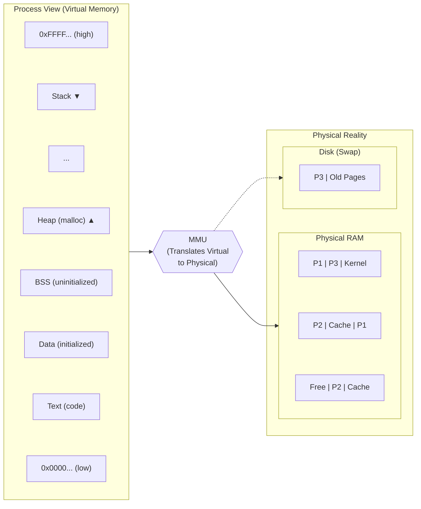
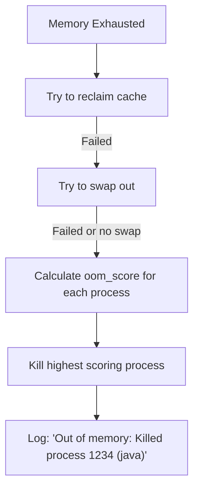
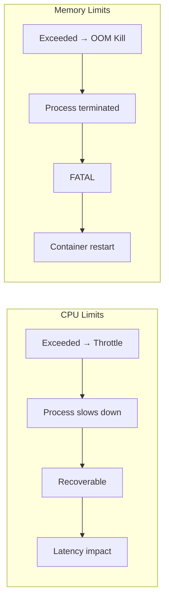

> **Linux Performance** | Complexity: `[MEDIUM]` | Time: 30-35 min

## Prerequisites

Before starting this module:
- **Required**: [Module 5.1: USE Method](../module-5.1-use-method/)
- **Required**: [Module 2.2: cgroups](/linux/foundations/container-primitives/module-2.2-cgroups/)
- **Helpful**: [Module 1.3: Filesystem Hierarchy](/linux/foundations/system-essentials/module-1.3-filesystem-hierarchy/)

---

## What You'll Be Able to Do

After this module, you will be able to:
- **Explain** Linux memory management (virtual memory, page cache, swap, OOM killer)
- **Diagnose** memory issues using free, vmstat, and /proc/meminfo
- **Configure** memory limits and OOM killer behavior for container workloads
- **Predict** when the OOM killer will trigger and which process it will kill

---

## Why This Module Matters

Memory in Linux is more complex than "used vs free." The kernel aggressively caches data, reclaims pages under pressure, and kills processes when memory is exhausted. Understanding this explains why containers get OOM killed.

Understanding memory management helps you:

- **Set proper memory limits** — Know what "used" actually means
- **Debug OOM kills** — Why your pod was terminated
- **Understand caching** — Low "free" memory isn't a problem
- **Tune performance** — When to add swap, when to avoid it

Memory limits in Kubernetes are a kill switch, not a throttle.

---

## Did You Know?

- **"Free" memory is wasted memory** — Linux uses spare RAM for caching. A system showing 100MB "free" but 10GB "available" is healthy, not low on memory.

- **OOM killer scores processes** — Each process has an `oom_score` from 0-1000. Higher scores die first. Kubernetes sets this based on QoS class.

- **Swap thrashing kills performance** — When memory is exhausted, the system can become 1000x slower as it constantly swaps. Some production systems disable swap entirely.

- **Page size is 4KB (usually)** — Memory is managed in pages. Huge pages (2MB/1GB) can improve performance for large-memory applications by reducing page table overhead.

---

## Memory Fundamentals

### Virtual Memory

Every process has its own virtual address space, mapped to physical RAM by the kernel:



### Memory Categories

```bash
# View memory breakdown
free -h
#               total        used        free      shared  buff/cache   available
# Mem:           15Gi       4.2Gi       2.1Gi       512Mi        9.1Gi        10Gi
# Swap:         2.0Gi       100Mi       1.9Gi
```

| Category | Meaning |
|----------|---------|
| **total** | Physical RAM installed |
| **used** | Memory in use (includes cache) |
| **free** | Completely unused (often small) |
| **shared** | tmpfs and shared memory |
| **buff/cache** | Kernel buffers + page cache |
| **available** | Memory available for new allocations |

**Key insight**: `available` is what matters, not `free`.

### Page Cache

```bash
# Page cache stores recently read file data
cat /proc/meminfo | grep -E "Cached|Buffers"
# Buffers:          123456 kB   # Block device metadata
# Cached:          9876543 kB   # File data cache

# Cache improves read performance
# First read: disk → RAM → process (slow)
# Second read: RAM → process (fast)

# Cache is reclaimed when memory is needed
echo 3 | sudo tee /proc/sys/vm/drop_caches  # Drop caches (for testing)
```

> **Stop and think**: If dropping the page cache frees up memory, why shouldn't you run `echo 3 > /proc/sys/vm/drop_caches` as a regular cron job to keep memory "free"?

---

## Memory Metrics

### /proc/meminfo

```bash
cat /proc/meminfo | head -20
# MemTotal:       16384000 kB
# MemFree:         2097152 kB
# MemAvailable:   10485760 kB
# Buffers:          524288 kB
# Cached:          8388608 kB
# SwapCached:        51200 kB
# Active:          4194304 kB
# Inactive:        8388608 kB
# Active(anon):    2097152 kB
# Inactive(anon):  1048576 kB
# Active(file):    2097152 kB
# Inactive(file):  7340032 kB
# Dirty:             10240 kB
# Writeback:             0 kB
# AnonPages:       3145728 kB
# Mapped:           524288 kB
# Shmem:            524288 kB
```

| Key Metrics | Meaning |
|-------------|---------|
| **AnonPages** | Process memory (heap, stack) - not file-backed |
| **Cached** | File data in memory |
| **Active** | Recently used, less likely to reclaim |
| **Inactive** | Not recently used, first to reclaim |
| **Dirty** | Changed but not yet written to disk |
| **Shmem** | Shared memory and tmpfs |

### vmstat for Memory

```bash
vmstat 1
#  r  b   swpd   free   buff  cache   si   so    bi    bo
#  1  0 102400 2097152 524288 8388608  0    0    50   100
#                             ↑    ↑
#                             │    └── Pages swapped out/sec
#                             └── Pages swapped in/sec

# si/so > 0 = Active swapping = Memory pressure
```

### Process Memory

```bash
# Process memory usage
ps aux --sort=-%mem | head -10
# USER  PID %CPU %MEM    VSZ   RSS TTY STAT START   TIME COMMAND
# app  1234  5.0 10.0 2097152 1048576  ?  Sl  10:00  1:00 java

# VSZ = Virtual Size (address space)
# RSS = Resident Set Size (in RAM)
# %MEM = RSS as percentage of total

# Detailed process memory
cat /proc/1234/status | grep -E "VmSize|VmRSS|VmSwap"
# VmSize:  2097152 kB  # Virtual memory
# VmRSS:   1048576 kB  # Physical memory
# VmSwap:    51200 kB  # In swap

# Per-mapping breakdown
cat /proc/1234/smaps_rollup
```

---

## OOM Killer

### How It Works

When memory is exhausted and nothing can be reclaimed, the OOM killer terminates processes:



### OOM Score

```bash
# View process OOM score (0-1000)
cat /proc/1234/oom_score
# 150

# View OOM score adjustment (-1000 to 1000)
cat /proc/1234/oom_score_adj
# 0

# Set adjustment (protect from OOM)
echo -500 | sudo tee /proc/1234/oom_score_adj

# Make immune to OOM (careful!)
echo -1000 | sudo tee /proc/1234/oom_score_adj
```

### Finding OOM Kills

```bash
# Check kernel log
dmesg | grep -i "out of memory\|oom"

# Sample output:
# Out of memory: Killed process 1234 (java) total-vm:2097152kB,
# anon-rss:1048576kB, file-rss:0kB, shmem-rss:0kB, UID:1000

# Check journal
journalctl -k | grep -i oom
```

---

## Swap

### What Swap Does

Swap extends memory by moving inactive pages to disk:

```bash
# View swap status
swapon --show
# NAME      TYPE SIZE  USED PRIO
# /dev/sda2 partition  2G 100M   -2

free -h | grep Swap
# Swap:         2.0Gi       100Mi       1.9Gi

# Swappiness controls swap behavior
cat /proc/sys/vm/swappiness
# 60  (0=avoid swap, 100=swap aggressively)
```

### Swap and Containers

```bash
# Kubernetes historically disabled swap
# Check if swap is disabled
free | grep Swap
# Swap:            0           0           0

# Swap can cause unpredictable latency
# Even with modern Kubernetes swap support (GA in v1.30+),
# it's often better to OOM than to thrash
```

> **Pause and predict**: If a Kubernetes node has swap enabled and a pod starts leaking memory beyond its limit, what impact would this have on other perfectly healthy pods running on the same node?

### Swappiness Tuning

```bash
# Reduce swappiness (keep more in RAM)
echo 10 | sudo tee /proc/sys/vm/swappiness

# Permanent change
# /etc/sysctl.conf:
# vm.swappiness = 10

# For databases: swappiness = 1 (avoid swap)
# For servers: swappiness = 10-30
# Default: 60
```

---

## Kubernetes Memory

### Memory Limits

```yaml
resources:
  requests:
    memory: "256Mi"   # Scheduling decision
  limits:
    memory: "512Mi"   # OOM kill threshold
```



### QoS Classes and OOM

```yaml
# Guaranteed - lowest oom_score_adj
resources:
  requests:
    memory: "256Mi"
  limits:
    memory: "256Mi"   # requests == limits

# Burstable - medium oom_score_adj
resources:
  requests:
    memory: "128Mi"
  limits:
    memory: "256Mi"   # requests < limits

# BestEffort - highest oom_score_adj
# (no resources specified)
```

> **Pause and predict**: When a BestEffort pod is using 100Mi of memory and a Guaranteed pod is using 10Gi, and the node runs out of memory, which pod will the OOM killer target first?

```bash
# OOM score adjustment by QoS:
# Guaranteed: -997
# Burstable: 2 to 999 (scaled by request/limit)
# BestEffort: 1000

# BestEffort pods die first under memory pressure
```

### Container Memory Metrics (cgroup v2)

```bash
# cgroup v2 is the standard for modern Kubernetes (v1.31+)

# cgroup memory stats
cat /sys/fs/cgroup/kubepods.slice/kubepods-pod...slice/memory.stat
# anon 209715200       # Anonymous memory (heap, stack)
# file 104857600       # Page cache
# kernel_stack 36864
# slab 165432

# Current usage
cat /sys/fs/cgroup/kubepods.slice/kubepods-pod...slice/memory.current

# Limit
cat /sys/fs/cgroup/kubepods.slice/kubepods-pod...slice/memory.max

# OOM events
cat /sys/fs/cgroup/kubepods.slice/kubepods-pod...slice/memory.events
# oom 1
# oom_kill 1
```

---

## Memory Pressure

### Detecting Pressure

```bash
# Pressure Stall Information (PSI)
cat /proc/pressure/memory
# some avg10=0.50 avg60=0.25 avg300=0.10 total=12345678
# full avg10=0.10 avg60=0.05 avg300=0.02 total=1234567

# some = at least one task waiting for memory
# full = all tasks waiting for memory
# Higher values = more pressure

# Node conditions in Kubernetes
kubectl describe node | grep -A 5 Conditions
# MemoryPressure   False   # Becomes True under pressure
```

### Node Eviction

```bash
# Kubelet eviction thresholds (defaults)
# memory.available < 100Mi → Eviction starts
# nodefs.available < 10% → Eviction starts

# Check kubelet config
cat /var/lib/kubelet/config.yaml | grep -A 10 evictionHard

# BestEffort pods evicted first
# Then Burstable
# Guaranteed last
```

---

## Tuning and Troubleshooting

### High Memory Usage

```bash
# 1. What's using memory?
ps aux --sort=-%mem | head -10

# 2. Is it cache or actual usage?
free -h
# If available >> 0, you're fine

# 3. Is there swap activity?
vmstat 1
# si/so should be 0

# 4. Any OOM kills?
dmesg | grep -i oom
```

### Memory Leak Detection

```bash
# Track RSS over time
while true; do
  ps -p 1234 -o pid,rss,vsz
  sleep 60
done

# RSS continuously growing = likely leak

# Detailed memory mapping
cat /proc/1234/smaps | grep -E "^[a-f0-9]|Rss:"
```

### Container Memory Issues

```bash
# Find container memory usage
docker stats --no-stream

# Kubernetes equivalent
kubectl top pod

# Check if container was OOM killed
kubectl describe pod <pod> | grep -A 10 "Last State"
# Reason:   OOMKilled

# Increase memory limit or fix the application
```

---

## Common Mistakes

| Mistake | Problem | Solution |
|---------|---------|----------|
| Panicking at low "free" | Normal Linux behavior | Check "available" instead |
| Setting memory limit = request | No burst room | Allow some headroom |
| Ignoring cache in sizing | Over-provisioning | Include cache in analysis |
| Enabling swap in Kubernetes | Unpredictable latency | Disable swap for k8s |
| Not monitoring OOM kills | Silent failures | Alert on OOM events |
| Using 100% of memory for limit | No room for kernel | Leave some headroom |

---

## Quiz

### Question 1
You receive a PagerDuty alert at 3 AM stating that a critical database server has only 150MB of "free" memory out of 64GB total. When you log in, the database is responding normally and no OOM events have occurred. Why is this alert likely a false positive, and what metric should the monitoring system be using instead?

<details>
<summary>Show Answer</summary>

The alert is a false positive because Linux intentionally uses unused RAM to cache file system data, which improves overall read performance. The "free" metric only represents memory that is completely unused, which should naturally be close to zero on a healthy, active system. The monitoring system should instead alert on "available" memory, which represents the true amount of RAM that can be allocated to new processes by instantly reclaiming cache if needed. Triggering alerts on "free" memory demonstrates a fundamental misunderstanding of how the Linux virtual memory subsystem operates.

</details>

### Question 2
A developer complains that since migrating their application to Kubernetes, it randomly crashes and restarts during traffic spikes. Previously, on a traditional VM, the same application would just respond very slowly during these spikes but never crash. Why does the containerized application behave differently under memory pressure?

<details>
<summary>Show Answer</summary>

The containerized application crashes because Kubernetes enforces strict memory limits using cgroups, which results in an immediate OOM (Out of Memory) kill when the limit is exceeded. On the traditional VM without strict cgroup limits, the kernel likely resorted to using swap space when memory was exhausted, which kept the application running but severely throttled its performance due to disk I/O latency. Because memory is a non-compressible resource, the kernel cannot simply "pause" a process to wait for more RAM to become available; it must either page out to disk or terminate the process. In a Kubernetes environment where strict cgroup limits are enforced, the kernel terminates the process once the limit is hit to prevent it from consuming node resources.

</details>

### Question 3
A Kubernetes node experiences sudden, severe memory exhaustion. The node runs a logging daemon configured as a Guaranteed pod, and a batch processing worker configured as a BestEffort pod. Which pod is the OOM killer most likely to terminate first, and what exact factors does the kernel use to make this mathematical decision?

<details>
<summary>Show Answer</summary>

The OOM killer will terminate the BestEffort batch processing pod first because it will have a significantly higher `oom_score`. The kernel calculates this score based on several factors: the percentage of RAM the process is using, its nice value (lower priority processes get higher scores), whether it is a root process (which receives a slight protective bonus), and the crucial `oom_score_adj` value. Kubernetes explicitly configures the `oom_score_adj` for BestEffort pods to 1000 (maximum vulnerability) and Guaranteed pods to -997 (maximum protection). Therefore, regardless of slight variations in actual memory usage, the BestEffort pod's artificially inflated score ensures it is sacrificed to save the node.

</details>

### Question 4
You are troubleshooting a legacy application server that has suddenly become completely unresponsive. The CPU usage is low, but when you run `vmstat 1`, you notice the `si` and `so` columns are consistently showing values in the thousands. What specific state is the system in, and why is this state causing the application to freeze?

<details>
<summary>Show Answer</summary>

The system is in a state known as "swap thrashing," which occurs when active memory demands greatly exceed the available physical RAM. The high `si` (swap in) and `so` (swap out) values indicate the kernel is desperately and continuously moving memory pages between RAM and the much slower disk storage. This causes the application to freeze because the CPU spends almost all its time waiting for these incredibly slow disk I/O operations to complete just to access the data it needs to execute the next instruction. This severe latency multiplier effectively halts forward progress for any process trying to access memory.

</details>

### Question 5
A Java application pod is repeatedly getting OOMKilled by Kubernetes. The pod has a memory limit of 512Mi. The developer shows you a dashboard based on `kubectl top pod` that indicates the pod never uses more than 350Mi of memory before crashing. Why is the pod being killed despite the metric dashboard showing it is well under the limit?

<details>
<summary>Show Answer</summary>

The discrepancy occurs because `kubectl top pod` typically reports the Resident Set Size (RSS), which only accounts for anonymous memory like the application's heap and stack. However, the cgroup memory limit enforced by the kernel applies to the total memory footprint, which also includes the page cache generated by file I/O and kernel memory structures like page tables. If the Java application writes heavily to logs or reads large files, that file cache counts against its 512Mi limit, pushing the total usage over the edge. To see the true usage that triggers the OOM killer, you must check `memory.current` directly from the cgroup v2 filesystem rather than relying on RSS-based metrics.

</details>

---

## Hands-On Exercise

### Understanding Memory Management

**Objective**: Explore Linux memory management, caching, and OOM behavior.

**Environment**: Linux system with root access

#### Part 1: Memory Metrics

```bash
# 1. Overall memory
free -h
cat /proc/meminfo | head -20

# 2. What's available vs free?
free | awk '/Mem:/ {print "Free:", $4, "Available:", $7}'

# 3. Process memory consumers
ps aux --sort=-%mem | head -10

# 4. Check for swap usage
swapon --show
vmstat 1 3
```

#### Part 2: Page Cache Behavior

```bash
# 1. Drop caches (need root)
sync
echo 3 | sudo tee /proc/sys/vm/drop_caches

# 2. Check free memory
free -h

# 3. Read a large file
dd if=/dev/zero of=/tmp/testfile bs=1M count=500

# 4. Check cache grew
free -h
cat /proc/meminfo | grep -E "Cached|Buffers"

# 5. Read file again (from cache - much faster)
time dd if=/tmp/testfile of=/dev/null bs=1M

# 6. Clean up
rm /tmp/testfile
```

#### Part 3: OOM Score

```bash
# 1. Check your shell's OOM score
cat /proc/$$/oom_score
cat /proc/$$/oom_score_adj

# 2. Compare with init
cat /proc/1/oom_score
cat /proc/1/oom_score_adj

# 3. Find highest OOM scores
for pid in /proc/[0-9]*/oom_score; do
  score=$(cat $pid 2>/dev/null)
  [ -n "$score" ] && [ $score -gt 100 ] && echo "$pid: $score"
done | sort -t: -k2 -rn | head -10

# 4. Check for past OOM events
dmesg | grep -i "out of memory\|oom-killer" || echo "No OOM events"
```

#### Part 4: Memory Pressure

```bash
# 1. Check pressure stats (kernel 4.20+)
cat /proc/pressure/memory 2>/dev/null || echo "PSI not available"

# 2. Monitor memory stats
vmstat 1 10

# 3. Understand the columns
# free = free memory
# buff = buffer cache
# cache = page cache
# si = swap in
# so = swap out
```

#### Part 5: Container Memory (if Docker available)

```bash
# 1. Run container with memory limit
docker run -d --name mem-test --memory=100m nginx sleep 3600

# 2. Check cgroup limit (cgroup v2 paths)
docker exec mem-test cat /sys/fs/cgroup/memory.max

# 3. Check current usage
docker exec mem-test cat /sys/fs/cgroup/memory.current

# 4. Check memory stats
docker stats --no-stream mem-test

# 5. Clean up
docker rm -f mem-test
```

### Success Criteria

- [ ] Understood free vs available memory
- [ ] Observed page cache behavior
- [ ] Checked OOM scores for processes
- [ ] Monitored memory pressure
- [ ] (Optional) Explored container memory limits

---

## Key Takeaways

1. **"Available" not "free"** — Free is often small; available is what matters

2. **Cache is good** — Linux caches aggressively; it's reclaimed when needed

3. **Memory limits kill, don't throttle** — Unlike CPU, exceeding memory = OOM

4. **OOM score determines who dies** — BestEffort first, Guaranteed last

5. **Swap = latency disaster** — Production systems often disable swap

---

## What's Next?

In **Module 5.4: I/O Performance**, you'll learn about disk I/O, storage bottlenecks, and how filesystem choice affects performance.

---

## Further Reading

- [Linux Memory Management](https://www.kernel.org/doc/html/latest/admin-guide/mm/index.html)
- [OOM Killer Documentation](https://www.kernel.org/doc/gorman/html/understand/understand016.html)
- [Kubernetes Memory Resources](https://kubernetes.io/docs/concepts/configuration/manage-resources-containers/)
- [cgroup Memory Controller (v2)](https://www.kernel.org/doc/html/latest/admin-guide/cgroup-v2.html#memory)