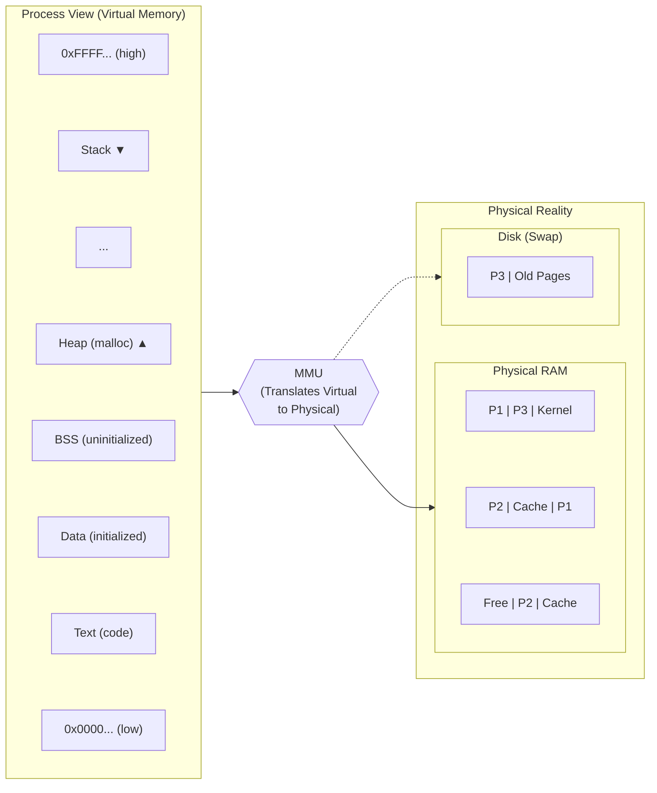
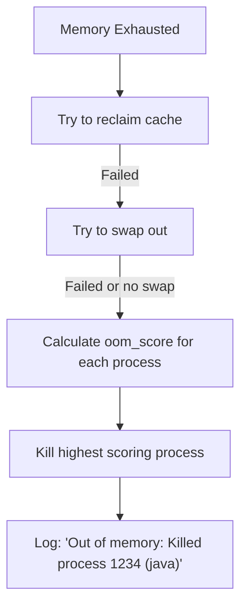
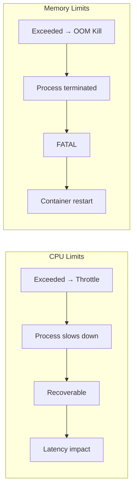

# Module 5.3: Memory Management

> **Linux Performance** | Complexity: `[MEDIUM]` | Time: 30-35 min. This module treats memory as an operational system, not a dashboard number, and connects Linux reclaim behavior to Kubernetes 1.35+ container failures.

## Prerequisites

Before starting this module, you should be comfortable reading Linux command output, navigating `/proc`, and connecting resource symptoms back to workload behavior. The cgroup module matters especially here because Kubernetes memory limits are enforced by kernel memory controllers rather than by a friendly scheduler that can slow an application down.

- **Required**: [Module 5.1: USE Method](../module-5.1-use-method/)
- **Required**: [Module 2.2: cgroups](/linux/foundations/container-primitives/module-2.2-cgroups/)
- **Helpful**: [Module 1.3: Filesystem Hierarchy](/linux/foundations/system-essentials/module-1.3-filesystem-hierarchy/)

## Learning Outcomes

After this module, you will be able to:

- **Diagnose** Linux memory pressure using `free`, `vmstat`, `/proc/meminfo`, PSI, and cgroup v2 counters.
- **Evaluate** page cache, swap, and available-memory signals to separate healthy caching from real exhaustion.
- **Configure** Kubernetes 1.35+ memory requests, limits, QoS classes, and OOM expectations for container workloads.
- **Predict** which process or pod is killed during global OOM, cgroup OOM, and kubelet eviction pressure.
- **Implement** a repeatable memory troubleshooting workflow that distinguishes leaks, cache growth, and node pressure.

## Why This Module Matters

At 03:12 on a payments platform, a senior engineer saw a familiar alert: "free memory below threshold." The host showed only a tiny amount of free RAM, but checkout latency was steady, the database was answering queries, and the kernel had not logged an OOM. The team spent an hour draining traffic, restarting services, and paging the database owner before someone checked `MemAvailable` and realized Linux had simply filled unused RAM with file cache that could be reclaimed on demand.

Two weeks later, a different incident looked almost identical at first glance but ended very differently. A recommendation service deployed into Kubernetes began reading a larger model file during startup, pushed its cgroup past the memory limit, and restarted repeatedly with `OOMKilled`. The node still had memory available, neighboring pods were fine, and CPU throttling charts were quiet because the failure was not node exhaustion; it was a local memory boundary enforced by the kernel.

Those two incidents teach the same lesson from opposite directions. Linux memory management is not a simple "used versus free" ledger, and Kubernetes memory limits are not gentle controls. To operate modern systems well, you need to know which memory is anonymous application state, which memory is reclaimable file cache, when swap turns pressure into latency, and why an application can die even when the node looks healthy.

In this module, you will build that mental model from the bottom up. You will read the same metrics the kernel exposes, map them to real failure modes, and practice the difference between a healthy cache-heavy host and a host or container that is genuinely running out of usable memory.

## Memory Fundamentals

Every Linux process runs inside a private virtual address space, which is a carefully maintained illusion. The process sees a tidy range of addresses for code, heap, stack, libraries, and memory mappings, but the hardware memory-management unit and the kernel translate those addresses into physical pages. This lets Linux isolate processes, share read-only code pages, lazily allocate memory, and move inactive pages between RAM and disk-backed storage without asking the application to rewrite itself.



The practical consequence is that virtual size is not the same thing as physical pressure. A process may reserve a large address range without touching all of it, map a file without loading every byte, or share pages with other processes. When you diagnose memory, you are asking which pages are resident, which pages are anonymous, which pages are file-backed, and which pages the kernel can reclaim without damaging useful work.

Linux manages memory in pages, usually 4KB at a time on common x86 and ARM systems. That sounds small, but it is the unit behind large operational decisions: page cache growth, anonymous heap pressure, copy-on-write behavior after a fork, and swap traffic all happen as page movement. Huge pages can reduce translation overhead for large memory workloads, but they also reduce flexibility because the kernel can no longer reclaim those pages with the same fine granularity.

The most common monitoring mistake is treating `free` memory as the goal. Linux uses spare RAM for page cache because a byte of idle RAM helps no one, while a byte holding recently read file data can save a disk read later. If a new process needs that memory, clean file-backed cache can be discarded quickly, while dirty pages must be written back and anonymous pages usually need to stay in RAM or move to swap.

```bash
# View memory breakdown
free -h
#               total        used        free      shared  buff/cache   available
# Mem:           15Gi       4.2Gi       2.1Gi       512Mi        9.1Gi        10Gi
# Swap:         2.0Gi       100Mi       1.9Gi
```

The `available` column is the first quick sanity check because it estimates how much memory the system can provide to new allocations without severe reclaim work. It includes free pages plus reclaimable cache, adjusted by kernel watermarks and reservations. It is still an estimate, not a contractual guarantee, but it is far closer to operational truth than raw `free`.

| Category | Meaning |
|----------|---------|
| **total** | Physical RAM installed |
| **used** | Memory in use (includes cache) |
| **free** | Completely unused (often small) |
| **shared** | tmpfs and shared memory |
| **buff/cache** | Kernel buffers + page cache |
| **available** | Memory available for new allocations |

Think of page cache like a workshop bench. If no one needs the bench, Linux fills it with tools that were useful recently; if a new job arrives, the tools can be moved aside. The mistake is cleaning the bench every minute because it looks busy, which makes the next job slower and hides the real question of whether there is enough workspace when demand rises.

```bash
# Page cache stores recently read file data
cat /proc/meminfo | grep -E "Cached|Buffers"
# Buffers:          123456 kB   # Block device metadata
# Cached:          9876543 kB   # File data cache

# Cache improves read performance
# First read: disk → RAM → process (slow)
# Second read: RAM → process (fast)

# Cache is reclaimed when memory is needed
echo 3 | sudo tee /proc/sys/vm/drop_caches  # Drop caches (for testing)
```

`drop_caches` is useful in controlled experiments because it lets you compare cold-cache and warm-cache behavior. It is a poor operational habit because it throws away useful data, forces avoidable disk I/O, and can make every service slower at once. If a cron job drops cache to keep a dashboard green, the dashboard is measuring the wrong thing.

Pause and predict: if you drop the page cache on a busy package repository mirror, what changes first: the `free` column, application memory, disk read latency, or the rate of OOM kills? The best answer is that `free` jumps immediately, disk read latency often gets worse, application anonymous memory does not shrink, and OOM behavior only changes if the system was actually blocked on reclaimable cache.

This distinction matters for containers too, because cgroup memory accounting can include file cache charged to the container. A pod that reads or writes many files can grow its cgroup usage even if the application heap is stable. That is why a dashboard based only on process RSS can miss the memory that actually pushes a container over its enforced limit.

Another subtle point is that reclaim has a cost even when it succeeds. Discarding clean file cache is cheap, but writing dirty pages, compacting fragmented memory, scanning page lists, and refaulting data later all take time. A host can avoid OOM and still deliver a bad user experience if it spends too much of every second negotiating which pages may stay in RAM.

## Memory Metrics

The fastest way to diagnose memory is to read metrics in layers instead of grabbing one command and hoping it explains everything. Start with host-level availability, then split memory into anonymous and file-backed categories, then inspect process or cgroup counters, and finally check pressure signals. This order prevents two common errors: blaming cache for a leak, or blaming an application heap when the node is really stalled on reclaim.

```bash
cat /proc/meminfo | head -20
# MemTotal:       16384000 kB
# MemFree:         2097152 kB
# MemAvailable:   10485760 kB
# Buffers:          524288 kB
# Cached:          8388608 kB
# SwapCached:        51200 kB
# Active:          4194304 kB
# Inactive:        8388608 kB
# Active(anon):    2097152 kB
# Inactive(anon):  1048576 kB
# Active(file):    2097152 kB
# Inactive(file):  7340032 kB
# Dirty:             10240 kB
# Writeback:             0 kB
# AnonPages:       3145728 kB
# Mapped:           524288 kB
# Shmem:            524288 kB
```

`/proc/meminfo` is verbose because memory pressure has many causes. `AnonPages` is often the strongest signal for application heap and stack growth because anonymous memory is not backed by a clean file that can simply be dropped. `Cached` and `Buffers` usually represent performance-positive memory, while `Dirty` and `Writeback` tell you whether the kernel is waiting for storage to persist changed data before reclaim can finish.

| Key Metrics | Meaning |
|-------------|---------|
| **AnonPages** | Process memory (heap, stack) - not file-backed |
| **Cached** | File data in memory |
| **Active** | Recently used, less likely to reclaim |
| **Inactive** | Not recently used, first to reclaim |
| **Dirty** | Changed but not yet written to disk |
| **Shmem** | Shared memory and tmpfs |

The active and inactive lists are the kernel's rough memory triage system. Active pages were used recently, so reclaiming them is more likely to hurt performance. Inactive pages are better candidates for reclaim, but the category alone does not mean waste; an inactive file page may still be valuable cache, while inactive anonymous memory may require swap or process termination if pressure rises.

`vmstat` adds motion to the picture. A static memory snapshot tells you where the bytes are now, but it does not show whether the system is fighting to make progress. The `si` and `so` columns are especially important because sustained swap-in and swap-out activity means processes are waiting on storage to access memory that used to be in RAM.

```bash
vmstat 1
#  r  b   swpd   free   buff  cache   si   so    bi    bo
#  1  0 102400 2097152 524288 8388608  0    0    50   100
#                             ↑    ↑
#                             │    └── Pages swapped out/sec
#                             └── Pages swapped in/sec

# si/so > 0 = Active swapping = Memory pressure
```

Short bursts of swap I/O are not automatically an incident, especially on a workstation or mixed-use host. Sustained swap traffic during user-facing work is different because every swapped-in page adds storage latency to ordinary instruction flow. That is the moment when "the CPU is idle" can be misleading: the CPU may be idle because tasks are blocked waiting for memory pages to return from disk.

Process-level metrics are useful after you know the host context. `VSZ` is the virtual address space and can be much larger than the memory actually resident in RAM. `RSS` is resident memory, which is closer to physical use, but even RSS needs interpretation because shared libraries and mapped files complicate attribution across many processes.

```bash
# Process memory usage
ps aux --sort=-%mem | head -10
# USER  PID %CPU %MEM    VSZ   RSS TTY STAT START   TIME COMMAND
# app  1234  5.0 10.0 2097152 1048576  ?  Sl  10:00  1:00 java

# VSZ = Virtual Size (address space)
# RSS = Resident Set Size (in RAM)
# %MEM = RSS as percentage of total

# Detailed process memory
cat /proc/1234/status | grep -E "VmSize|VmRSS|VmSwap"
# VmSize:  2097152 kB  # Virtual memory
# VmRSS:   1048576 kB  # Physical memory
# VmSwap:    51200 kB  # In swap

# Per-mapping breakdown
cat /proc/1234/smaps_rollup
```

For a leak investigation, the shape over time matters more than a single large number. A Java process with a stable 2GiB RSS may simply be sized that way, while a small process that grows by 80MiB every few minutes deserves attention. Compare RSS, cgroup current usage, page cache growth, and application-level heap metrics before concluding that the code leaks memory.

Before running a memory cleanup command, ask which counter should fall if your theory is correct. If you believe the problem is page cache, `Cached` or cgroup `file` should drop. If you believe the problem is a heap leak, `AnonPages`, RSS, or cgroup `anon` should fall only when the process releases memory or restarts.

This prediction habit keeps troubleshooting honest. It also gives you a safer way to communicate during incidents: "I expect `memory.current` to fall after this rollout because the new version stops retaining request buffers" is more useful than "memory looks high." A good memory diagnosis is a falsifiable explanation, not a screenshot of a red line.

When you compare metrics, keep units and accounting boundaries visible. Host memory commands describe the whole machine, process commands describe one process, and cgroup files describe a resource-controlled group that may contain several processes. Many confusing memory incidents come from mixing those scopes, such as comparing a pod limit with a single worker process RSS while ignoring helper processes and charged file cache in the same cgroup.

## OOM Killer

The OOM killer exists because memory is not like CPU. When too many runnable tasks want CPU, the scheduler can divide time more thinly and everything slows down. When a task needs a memory page and the kernel cannot provide one by reclaiming cache, writing dirty pages, compacting memory, or swapping, the system needs to free memory by terminating something.



There are two operationally different OOM stories. A global OOM means the host as a whole cannot satisfy memory allocations, so the kernel selects a victim from the eligible processes. A cgroup OOM means a workload crossed its assigned memory boundary even if the host still has free or reclaimable memory, which is the common Kubernetes pod `OOMKilled` case.

The kernel does not choose a victim randomly. Each process has an `oom_score`, and operators can influence that score with `oom_score_adj`. Kubernetes uses this mechanism to map pod Quality of Service classes to survival priority, so the OOM killer's decision often reflects resource policy rather than only raw memory usage.

```bash
# View process OOM score (0-1000)
cat /proc/1234/oom_score
# 150

# View OOM score adjustment (-1000 to 1000)
cat /proc/1234/oom_score_adj
# 0

# Set adjustment (protect from OOM)
echo -500 | sudo tee /proc/1234/oom_score_adj

# Make immune to OOM (careful!)
echo -1000 | sudo tee /proc/1234/oom_score_adj
```

Changing `oom_score_adj` directly is a sharp tool because it can protect the wrong process and force the kernel to kill something more important. On ordinary hosts, systemd units and service managers may expose safer policy controls. In Kubernetes, you normally adjust requests, limits, and QoS instead of writing to `/proc` by hand.

```bash
# Check kernel log
dmesg | grep -i "out of memory\|oom"

# Sample output:
# Out of memory: Killed process 1234 (java) total-vm:2097152kB,
# anon-rss:1048576kB, file-rss:0kB, shmem-rss:0kB, UID:1000

# Check journal
journalctl -k | grep -i oom
```

An OOM log line is a crime-scene note, not the whole story. It tells you which process died and shows useful memory categories such as anonymous RSS, file RSS, and shared memory RSS. It does not tell you why the workload grew, whether the container limit was too tight, whether a neighboring workload triggered node pressure, or whether the kubelet evicted a pod before the kernel killed it.

Pause and predict: a BestEffort pod uses 100MiB, a Guaranteed pod uses 10GiB, and the node experiences global memory pressure. Which pod is more likely to die first? In Kubernetes, the BestEffort pod is deliberately made the easiest victim because its `oom_score_adj` is set to the highest risk class, even though the Guaranteed pod is using far more memory.

That policy can surprise teams who expect the largest process to die. The largest process is often a candidate, but Kubernetes changes the math because it must protect workloads that made explicit resource commitments. If a small BestEffort sidecar is expendable and a large Guaranteed database is business-critical, this behavior is exactly the point of QoS.

There is also a human factor in OOM response. Restarting the killed process may restore service, but it destroys evidence unless you captured logs, memory trends, and workload timing first. A strong incident response preserves the OOM log, the pod events, the deployment version, and the memory slope before mitigation, because those details determine whether the next action is code repair, limit sizing, placement change, or alert correction.

## Swap

Swap extends the memory system by moving inactive anonymous pages to disk-backed storage. That can keep a host alive during short pressure bursts, but it changes failure mode from clean termination to unpredictable latency. The tradeoff is not "swap good" or "swap bad"; the tradeoff is whether slower progress is better than a restart for the workload in front of you.

```bash
# View swap status
swapon --show
# NAME      TYPE SIZE  USED PRIO
# /dev/sda2 partition  2G 100M   -2

free -h | grep Swap
# Swap:         2.0Gi       100Mi       1.9Gi

# Swappiness controls swap behavior
cat /proc/sys/vm/swappiness
# 60  (0=avoid swap, 100=swap aggressively)
```

On a laptop, swap can be friendly because preserving an interactive session may matter more than keeping latency low. On a database primary or latency-sensitive API node, swap can turn a predictable OOM into minutes of request timeouts. The dangerous state is thrashing, where the working set is larger than RAM and the kernel repeatedly swaps active pages in and out without making useful progress.

```bash
# Kubernetes historically disabled swap
# Check if swap is disabled
free | grep Swap
# Swap:            0           0           0

# Swap can cause unpredictable latency
# Even with modern Kubernetes swap support in Kubernetes 1.35+,
# it's often better to OOM than to thrash
```

Kubernetes 1.35+ can operate with explicit swap behavior, but that does not make swap a universal default for production nodes. You still need to decide whether the workload benefits from survival under pressure or suffers more from tail-latency amplification. Batch jobs, development clusters, and some memory-spiky services may tolerate swap; real-time request paths usually deserve tighter memory sizing and faster failure.

Pause and predict: if a Kubernetes node has swap enabled and a pod leaks memory beyond its intended budget, which workloads feel the pain first? The leaking pod may survive longer, but healthy pods on the same node can experience storage-backed memory latency if global reclaim begins, so swap can spread one workload's memory mistake across the node.

```bash
# Reduce swappiness (keep more in RAM)
echo 10 | sudo tee /proc/sys/vm/swappiness

# Permanent change
# /etc/sysctl.conf:
# vm.swappiness = 10

# For databases: swappiness = 1 (avoid swap)
# For servers: swappiness = 10-30
# Default: 60
```

Swappiness is a tendency, not a hard promise. A low value tells the kernel to prefer reclaiming file cache before swapping anonymous pages, but the kernel can still swap when pressure and reclaim conditions demand it. Treat it as one input in a broader design that includes workload limits, node sizing, storage latency, and alert thresholds for sustained `si` and `so`.

The better operational question is what you want pressure to look like. If you want the service to restart quickly and let orchestration replace it, keep limits honest and avoid hiding leaks behind swap. If you want a batch job to finish slowly rather than fail, controlled swap may be acceptable, but you should still alert on the latency and throughput consequences.

## Kubernetes Memory

Kubernetes memory management is Linux memory management with policy layered on top. The kubelet does not invent a new memory subsystem; it asks the container runtime to place containers in cgroups, sets resource controls, watches node conditions, and reports pod state. The kernel still accounts pages, enforces limits, and performs OOM victim selection.

The convention in this course is to define `alias k=kubectl` before Kubernetes command examples, then use `k describe node`, `k top pod`, and related commands in day-to-day work. That keeps examples compact while still making clear that every Kubernetes observation eventually maps back to kernel memory accounting.

```yaml
resources:
  requests:
    memory: "256Mi"   # Scheduling decision
  limits:
    memory: "512Mi"   # OOM kill threshold
```

A memory request is a scheduling promise. It tells Kubernetes how much memory to reserve when placing the pod, and it influences QoS. A memory limit is an enforcement boundary. If a container crosses the limit, the kernel does not slow it down the way CPU throttling works; it kills a process in that cgroup, and Kubernetes reports the container as terminated.



This CPU-versus-memory difference is one of the most important operational facts in Kubernetes. CPU pressure usually creates slower work and visible latency. Memory pressure at a limit creates process death, possible restart loops, and state loss unless the application handles termination safely. A service can be CPU-throttled for hours and recover, but one allocation over a memory limit can end the process immediately.

```yaml
# Guaranteed - lowest oom_score_adj
resources:
  requests:
    memory: "256Mi"
  limits:
    memory: "256Mi"   # requests == limits

# Burstable - medium oom_score_adj
resources:
  requests:
    memory: "128Mi"
  limits:
    memory: "256Mi"   # requests < limits

# BestEffort - highest oom_score_adj
# (no resources specified)
```

Quality of Service class is Kubernetes' way of saying which pods made explicit resource promises. Guaranteed pods have matching requests and limits for all containers, so they receive the strongest OOM protection. Burstable pods made some promise but may exceed their request. BestEffort pods made no promise, so they are first in line when the node must sacrifice work.

```bash
# OOM score adjustment by QoS:
# Guaranteed: -997
# Burstable: 2 to 999 (scaled by request/limit)
# BestEffort: 1000

# BestEffort pods die first under memory pressure
```

The phrase "BestEffort pods die first" is a simplification, but it is a useful one during incidents. The exact victim selection still depends on process state and memory use, yet the adjustment Kubernetes applies is intentionally strong. If a critical daemon is BestEffort because someone omitted resources, it can lose to a less important workload that was configured with a Guaranteed class.

Container memory accounting can also surprise application teams because the limit is not just the language heap. Cgroup v2 tracks anonymous memory, file cache, kernel stack, slab usage, and events under the cgroup hierarchy. A process can appear below its heap target while the cgroup crosses the limit because file-backed cache or other charged memory grew inside the same boundary.

```bash
# cgroup v2 is the standard for modern Kubernetes 1.35+

# cgroup memory stats
cat /sys/fs/cgroup/kubepods.slice/kubepods-pod...slice/memory.stat
# anon 209715200       # Anonymous memory (heap, stack)
# file 104857600       # Page cache
# kernel_stack 36864
# slab 165432

# Current usage
cat /sys/fs/cgroup/kubepods.slice/kubepods-pod...slice/memory.current

# Limit
cat /sys/fs/cgroup/kubepods.slice/kubepods-pod...slice/memory.max

# OOM events
cat /sys/fs/cgroup/kubepods.slice/kubepods-pod...slice/memory.events
# oom 1
# oom_kill 1
```

When a pod is repeatedly `OOMKilled`, compare the application heap setting, the pod limit, and `memory.current` rather than relying only on `k top pod`. Some metrics pipelines report a useful working-set approximation, but the kernel enforces the cgroup limit based on its own accounting. During a difficult incident, direct cgroup counters settle arguments faster than dashboard labels.

The safest sizing pattern is to leave room between the application runtime's internal memory cap and the container limit. A JVM heap equal to the pod limit is a classic failure because metaspace, thread stacks, direct buffers, native libraries, page cache, and the runtime itself all need memory too. The same principle applies to Go, Node.js, Python, and native services, even though the knobs differ.

For Kubernetes 1.35+ clusters, memory policy also belongs in review with deployment manifests. A service that changes batch size, model size, compression buffers, or concurrency has changed its memory contract even if the YAML stayed the same. Treat memory requests and limits as part of the application interface: they encode how much room the scheduler reserves, how much burst the kernel allows, and which workloads the node should protect when pressure arrives.

## Memory Pressure

Memory pressure is not simply "used memory is high." Pressure means work is delayed because the kernel or kubelet cannot satisfy memory demand cheaply. A node can show high used memory with low pressure because most of that memory is reclaimable cache, while another node can show less total use but still be unhealthy because dirty writeback, swap traffic, or cgroup limits are blocking progress.

```bash
# Pressure Stall Information (PSI)
cat /proc/pressure/memory
# some avg10=0.50 avg60=0.25 avg300=0.10 total=12345678
# full avg10=0.10 avg60=0.05 avg300=0.02 total=1234567

# some = at least one task waiting for memory
# full = all tasks waiting for memory
# Higher values = more pressure

# Node conditions in Kubernetes
k describe node | grep -A 5 Conditions
# MemoryPressure   False   # Becomes True under pressure
```

Pressure Stall Information is valuable because it measures waiting, not allocation size. `some` means at least one task was stalled on memory, while `full` means all non-idle tasks were stalled during the measured window. If `full` rises during a user-facing incident, you have evidence that memory reclaim is stopping forward progress across the workload, not merely filling a chart.

Kubernetes reports node `MemoryPressure` when the kubelet believes allocatable memory has crossed eviction thresholds. That signal is related to kernel pressure but not identical to a cgroup OOM. A pod can be killed by its own limit without node `MemoryPressure`, and a node can evict pods under pressure before the kernel reaches a global OOM.

```bash
# Kubelet eviction thresholds (defaults)
# memory.available < 100Mi → Eviction starts
# nodefs.available < 10% → Eviction starts

# Check kubelet config
cat /var/lib/kubelet/config.yaml | grep -A 10 evictionHard

# BestEffort pods evicted first
# Then Burstable
# Guaranteed last
```

Eviction is kubelet policy, while OOM killing is kernel enforcement. The kubelet tries to protect the node by terminating pods before the host collapses, following QoS and priority rules. The kernel OOM killer acts when allocation cannot proceed. In practice, you should check both pod status and kernel logs because a restart reason can hide the order of events.

Node pressure also interacts with storage. Dirty pages need writeback before they can be reclaimed, so slow disks can make memory pressure worse even when CPU and network look calm. That is one reason memory and I/O troubleshooting often meet: the memory subsystem may be waiting for the storage subsystem to make pages clean enough to discard.

When you see a node pressure event, separate three questions. Did a pod exceed its own limit, did the node run short of available memory, or did reclaim become slow because the working set and writeback behavior were hostile? Each answer points to a different fix, and treating all three as "add memory" wastes money while leaving the design problem intact.

Priority and disruption tolerance add another layer to that decision. A low-priority analytics pod may be the correct eviction target even when its developers dislike the restart, while a node-local logging agent may deserve stronger guarantees because losing it blinds the incident. Memory operations are therefore policy decisions as much as technical ones, and the best clusters make those policies explicit before scarcity tests them.

## Tuning and Troubleshooting

A repeatable workflow beats heroic guessing. Start by confirming whether users are affected, because a healthy cache-heavy host often looks alarming on naive dashboards. Then check `available`, `AnonPages`, cache, swap activity, PSI, recent OOM logs, and the top consumers. Only after those layers agree should you decide whether to restart a process, raise a limit, tune swap, or change the application.

```bash
# 1. What's using memory?
ps aux --sort=-%mem | head -10

# 2. Is it cache or actual usage?
free -h
# If available >> 0, you're fine

# 3. Is there swap activity?
vmstat 1
# si/so should be 0

# 4. Any OOM kills?
dmesg | grep -i oom
```

The command sequence above is intentionally simple because incidents punish cleverness. `ps` identifies obvious consumers, `free` prevents cache panic, `vmstat` reveals active swap movement, and `dmesg` checks whether the kernel has already taken action. If these disagree, believe the disagreement and dig deeper rather than forcing the first theory to fit.

Memory leak detection is mostly trend analysis with good labels. Watch whether RSS grows monotonically, whether cgroup `anon` grows with it, and whether the application workload changed at the same time. A true leak keeps retaining memory that should have been released; a cache warmup grows and then plateaus; a traffic spike grows and falls with demand.

```bash
# Track RSS over time
while true; do
  ps -p 1234 -o pid,rss,vsz
  sleep 60
done

# RSS continuously growing = likely leak

# Detailed memory mapping
cat /proc/1234/smaps | grep -E "^[a-f0-9]|Rss:"
```

`smaps` is expensive on large processes, so use it deliberately rather than scraping it every second. It can still be the right tool when you need to distinguish heap, stacks, mapped files, anonymous mappings, and shared pages. For routine monitoring, prefer lower-cost process metrics, cgroup counters, and application runtime telemetry.

Container diagnosis adds one more layer because the pod status, kubelet events, runtime metrics, and kernel cgroup files may each tell part of the story. `k top pod` is useful for a quick scan, but an `OOMKilled` event should push you toward limits, cgroup `memory.events`, and the application memory configuration. If the pod restarts too quickly, inspect the previous container logs before they disappear from your normal view.

```bash
# Find container memory usage
docker stats --no-stream

# Kubernetes equivalent
k top pod

# Check if container was OOM killed
k describe pod <pod> | grep -A 10 "Last State"
# Reason:   OOMKilled

# Increase memory limit or fix the application
```

Increasing a memory limit is sometimes correct, but it should not be a reflex. If the application needs more memory for legitimate work, the request and limit should be resized together so scheduling remains honest. If the application leaks, a larger limit only buys time. If file cache is charged to the cgroup, the fix may involve I/O behavior, buffering, or separating workloads rather than heap tuning.

The strongest troubleshooting reports include a before-and-after prediction. For example: "The pod limit is 512Mi, `memory.current` reaches the limit during model load, and `memory.stat` shows `file` plus `anon` exceeding the budget; increasing the limit to 768Mi and setting the runtime heap to 512Mi should stop startup OOM while preserving headroom." That statement is testable, keeps mitigation tied to evidence, and teaches the next responder what evidence mattered.

For long-running services, add a steady-state comparison after the immediate fix. Capture the same counters an hour later, then again under normal peak traffic, and verify that the memory shape matches the theory. If the fix was limit sizing, the workload should remain below the new limit with visible overhead. If the fix was leak repair, the anonymous memory slope should flatten rather than merely taking longer to fail.

## Patterns & Anti-Patterns

A good pattern is to alert on pressure and consequences, not just allocation size. Alert when `MemAvailable` approaches a real operational threshold, when PSI `full` rises, when swap in and swap out are sustained, when cgroup `oom_kill` increments, or when kubelet eviction events appear. This focuses the team on memory that is hurting work rather than memory that is merely being used productively.

Another durable pattern is to size containers from measured working sets plus headroom. Observe steady-state anonymous memory, expected cache behavior, startup spikes, runtime overhead, and traffic bursts. Then set a request that reflects normal scheduling demand and a limit that allows legitimate bursts without letting one pod endanger the node. This is less tidy than copying defaults, but it produces fewer restart loops.

For critical Kubernetes workloads, use QoS intentionally. Guaranteed pods are appropriate for node agents, control-plane components, and stateful services where eviction would be more expensive than reserving memory. Burstable pods fit services that need a realistic request but can occasionally exceed it. BestEffort is reasonable for disposable experiments, not for daemons that everyone silently depends on.

Use swap only when its failure mode is acceptable. A batch worker that can finish slowly may tolerate swap better than an API server with strict latency objectives. A development cluster may benefit from swap because uptime matters more than consistent tail latency. A production request path should usually prefer honest sizing and clear restarts over hidden storage-backed memory stalls.

The first anti-pattern is "free-memory gardening," where automation drops cache, restarts services, or clears buffers simply because `free` is low. Teams fall into this because low free memory looks intuitive, but the practice destroys useful cache and masks the difference between reclaimable memory and real pressure. The better alternative is to alert on available memory, PSI, swap motion, and OOM events.

The second anti-pattern is setting runtime heap size equal to the container limit. It feels efficient on paper, but it leaves no room for non-heap memory, stacks, direct buffers, page cache, native libraries, or the runtime itself. The better alternative is to reserve explicit overhead and prove the budget under startup, steady traffic, and peak traffic.

The third anti-pattern is using BestEffort pods for important platform helpers. This usually happens because a small daemon "doesn't use much memory," but QoS is about policy during scarcity, not only normal consumption. A tiny BestEffort logging or security agent can be evicted before a larger workload with stronger resource declarations, which is rarely what the platform team intended.

The fourth anti-pattern is treating every `OOMKilled` as proof that the node needs more RAM. A cgroup OOM can happen on a roomy node, and adding node memory will not change a too-small pod limit. The better alternative is to identify whether the kill was cgroup-local, node-pressure eviction, or global OOM before buying capacity or changing autoscaling rules.

## Decision Framework

When memory looks high, first decide whether the system is healthy, pressured, or constrained by policy. If `available` is healthy, PSI is low, `si` and `so` are quiet, and no OOM or eviction events exist, high used memory is probably cache or normal workload residency. In that case, tune the alert rather than disturbing the host.

If `available` is falling and PSI or swap movement is rising, treat it as node memory pressure. Look for growing anonymous memory, dirty writeback, workload changes, and top consumers. The likely fixes are reducing demand, adding capacity, changing placement, tuning swap policy, or repairing an application that retains memory unexpectedly.

If a pod is `OOMKilled` but the node is not under `MemoryPressure`, treat it as a cgroup-boundary problem. Check the pod limit, runtime heap settings, cgroup `memory.current`, `memory.stat`, and `memory.events`. The likely fixes are changing the application memory profile, leaving overhead below the limit, or resizing requests and limits together.

If the kubelet evicts pods, treat it as node protection rather than application self-destruction. Check eviction thresholds, QoS, priority, node allocatable memory, and whether BestEffort or Burstable workloads are absorbing pressure as designed. The likely fixes are better requests, fewer overcommitted workloads, adjusted thresholds, or separating noisy neighbors.

If swap activity is sustained, decide whether slow survival is acceptable. For interactive or latency-sensitive production services, sustained swap is usually a symptom to remove. For batch or development workloads, controlled swap may be a deliberate choice, but you should still expose it in monitoring because it changes how users experience the system.

## Did You Know?

- **"Free" memory is wasted memory** — Linux uses spare RAM for caching. A system showing 100MB "free" but 10GB "available" is healthy, not low on memory.
- **OOM killer scores processes** — Each process has an `oom_score` from 0-1000. Higher scores die first. Kubernetes sets this based on QoS class.
- **Swap thrashing kills performance** — When memory is exhausted, the system can become 1000x slower as it constantly swaps. Some production systems disable swap entirely.
- **Page size is 4KB (usually)** — Memory is managed in pages. Huge pages of 2MB or 1GB can improve performance for large-memory applications by reducing page table overhead.

## Common Mistakes

| Mistake | Why It Happens | How to Fix It |
|---------|----------------|---------------|
| Panicking at low "free" | Normal Linux cache behavior looks like exhaustion on simplistic dashboards | Alert on `available`, PSI, swap motion, and OOM events instead |
| Setting memory limit equal to request everywhere | Teams want Guaranteed QoS but accidentally remove useful burst room | Use Guaranteed only when reservation is intentional; otherwise size request and limit from measured behavior |
| Ignoring cache in sizing | File-heavy workloads charge cache that dashboards may not label clearly | Compare `memory.stat` `anon` and `file` before changing heap or limits |
| Enabling swap in Kubernetes without a latency policy | Swap makes leaks less visible and can spread delay across healthy pods | Use explicit Kubernetes 1.35+ swap behavior only where slow survival is acceptable |
| Not monitoring OOM kills | Restart loops can look like ordinary deployment churn | Alert on pod `OOMKilled`, cgroup `oom_kill`, kubelet evictions, and kernel OOM logs |
| Using all node memory for pod limits | Kernel, kubelet, runtime, system daemons, and page cache need headroom | Reserve system memory and keep node allocatable below physical RAM |
| Treating every OOMKilled pod as a node-capacity issue | Cgroup limits can kill a pod even when the node has available memory | Check pod limits, cgroup counters, and node pressure separately before scaling nodes |

## Quiz

Use these scenarios to test whether you can connect Linux memory evidence to the right operational decision. Each answer explains the reasoning because memory troubleshooting is mostly about choosing the correct model before choosing the command.

<details><summary>Question 1: A database host has 150MB free out of 64GB, but `MemAvailable` is 21GB and PSI is quiet. What should you change first?</summary>

This is most likely a false positive caused by alerting on raw `free` memory. Linux intentionally fills spare RAM with file cache, and `MemAvailable` estimates the memory that can be reclaimed for new work without serious pressure. The first change should be the alert rule, not the database. A better alert would combine low available memory with pressure signals, swap activity, or OOM evidence.

</details>

<details><summary>Question 2: A Java pod with a 512Mi limit restarts during startup, while the node has several GiB available. How do you diagnose the kill?</summary>

This points to a cgroup OOM rather than global node exhaustion. Check the pod's last state with `k describe pod`, then inspect runtime heap settings and cgroup v2 counters such as `memory.current`, `memory.stat`, and `memory.events` if the node is accessible. The Java heap may be too close to the pod limit, or file cache and native overhead may be charged inside the cgroup. Adding node RAM will not fix a limit that the container itself crosses.

</details>

<details><summary>Question 3: A BestEffort batch pod uses 100MiB, a Guaranteed logging agent uses 700MiB, and the node enters global pressure. Which workload is at greater risk and why?</summary>

The BestEffort pod is at greater risk because Kubernetes assigns it the highest OOM vulnerability through `oom_score_adj`. The Guaranteed pod receives strong protection because it made explicit resource commitments. The kernel still considers memory use, but the QoS adjustment is intentionally large so expendable pods are sacrificed first. This is why important platform daemons should not be left BestEffort just because they are usually small.

</details>

<details><summary>Question 4: `vmstat 1` shows sustained high `si` and `so`, CPU is low, and users report frozen requests. What state is likely?</summary>

The system is likely thrashing because active pages are moving between RAM and swap repeatedly. CPU can look low because tasks are blocked waiting for storage-backed memory pages rather than executing useful work. The immediate diagnosis should include available memory, PSI, top anonymous consumers, and recent workload changes. The durable fix is to reduce the working set, resize capacity, or change swap policy based on workload tolerance.

</details>

<details><summary>Question 5: A pod reads large files and `k top pod` stays below the memory limit, yet the pod is OOMKilled. What metric can explain the gap?</summary>

The missing evidence is cgroup memory accounting, especially `memory.current` and `memory.stat`. Some dashboards emphasize RSS or working set, while the kernel enforces the cgroup limit using the memory charged to that cgroup. File cache can count against the container limit, so heavy file I/O can push the total over the boundary even when application heap looks safe. Compare `anon` and `file` in `memory.stat` before changing only heap settings.

</details>

<details><summary>Question 6: A node reports `MemoryPressure`, then evicts a Burstable pod even though no kernel OOM log appears. Is this contradictory?</summary>

No, because kubelet eviction and kernel OOM killing are different mechanisms. The kubelet can terminate pods proactively when eviction thresholds are crossed so the node stays usable. A kernel OOM log appears when the kernel itself cannot satisfy allocation and must choose a process victim. In this case, inspect kubelet events, eviction thresholds, QoS, and node allocatable memory rather than searching only for kernel OOM lines.

</details>

<details><summary>Question 7: A service's RSS grows for ten minutes after deploy and then plateaus, while `Cached` also grows during warm traffic. Is that enough to call it a leak?</summary>

No, a leak requires retained memory that should have been released, not just growth during warmup. A stable plateau can be normal runtime initialization, cache population, or traffic-driven allocation that reaches a steady state. Continue by comparing RSS, cgroup `anon`, cgroup `file`, application heap telemetry, and request volume. A real leak usually keeps growing under comparable workload until pressure or restart interrupts it.

</details>

## Hands-On Exercise

### Understanding Memory Management

**Objective**: Explore Linux memory management, caching, OOM scoring, pressure signals, and container memory boundaries using safe observations first and optional container experiments last.

**Environment**: Use a Linux system with root access for cache and sysctl experiments, plus Docker if you want to complete the optional container section. In Kubernetes labs, define `alias k=kubectl` before using short `k` commands.

#### Part 1: Memory Metrics

Begin by building a host-level baseline. The goal is to diagnose memory pressure using `free`, `vmstat`, and `/proc/meminfo` before touching anything, because a clean baseline protects you from mistaking healthy page cache for a leak.

```bash
# 1. Overall memory
free -h
cat /proc/meminfo | head -20

# 2. What's available vs free?
free | awk '/Mem:/ {print "Free:", $4, "Available:", $7}'

# 3. Process memory consumers
ps aux --sort=-%mem | head -10

# 4. Check for swap usage
swapon --show
vmstat 1 3
```

<details><summary>Solution guidance for Part 1</summary>

Record `MemAvailable`, `Cached`, `AnonPages`, and the `si` and `so` columns from `vmstat`. If available memory is healthy and swap motion is zero, high used memory alone is not a failure. If anonymous memory is high and available memory is falling, continue toward process and cgroup analysis.

</details>

#### Part 2: Page Cache Behavior

This experiment demonstrates why free memory changes after file reads. Run it only on a lab machine because dropping caches intentionally removes useful data and can make real workloads slower.

```bash
# 1. Drop caches (need root)
sync
echo 3 | sudo tee /proc/sys/vm/drop_caches

# 2. Check free memory
free -h

# 3. Read a large file
dd if=/dev/zero of=/tmp/testfile bs=1M count=500

# 4. Check cache grew
free -h
cat /proc/meminfo | grep -E "Cached|Buffers"

# 5. Read file again (from cache - much faster)
time dd if=/tmp/testfile of=/dev/null bs=1M

# 6. Clean up
rm /tmp/testfile
```

<details><summary>Solution guidance for Part 2</summary>

After the file operation, `Cached` should grow because Linux keeps file data in memory for future reads. The second read should be faster on many systems because it can be served from memory instead of storage. This is healthy behavior, not evidence that an application consumed heap memory.

</details>

#### Part 3: OOM Score

Inspect OOM scoring to connect process policy with victim selection. Do not change production scores during this lab; reading the files is enough to understand how Kubernetes QoS later maps to kernel behavior.

```bash
# 1. Check your shell's OOM score
cat /proc/$$/oom_score
cat /proc/$$/oom_score_adj

# 2. Compare with init
cat /proc/1/oom_score
cat /proc/1/oom_score_adj

# 3. Find highest OOM scores
for pid in /proc/[0-9]*/oom_score; do
  score=$(cat $pid 2>/dev/null)
  [ -n "$score" ] && [ $score -gt 100 ] && echo "$pid: $score"
done | sort -t: -k2 -rn | head -10

# 4. Check for past OOM events
dmesg | grep -i "out of memory\|oom-killer" || echo "No OOM events"
```

<details><summary>Solution guidance for Part 3</summary>

Processes with higher scores are easier OOM victims, but score is policy plus usage rather than a simple ranking by RSS. On Kubernetes nodes, pod QoS changes the adjustment and therefore changes survival priority. If you find past OOM events, connect the killed process to its memory use and service role before deciding whether the kill was appropriate.

</details>

#### Part 4: Memory Pressure

Now look for waiting rather than only allocation. PSI and `vmstat` help you determine whether memory pressure is delaying work, which is the difference between a busy memory system and an unhealthy one.

```bash
# 1. Check pressure stats (kernel 4.20+)
cat /proc/pressure/memory 2>/dev/null || echo "PSI not available"

# 2. Monitor memory stats
vmstat 1 10

# 3. Understand the columns
# free = free memory
# buff = buffer cache
# cache = page cache
# si = swap in
# so = swap out
```

<details><summary>Solution guidance for Part 4</summary>

Low PSI and quiet swap columns usually mean memory is not delaying work, even if used memory is high. Rising `some` or `full` pressure deserves attention because tasks are waiting on memory availability. Sustained `si` and `so` during user traffic suggest swap-backed latency rather than ordinary caching.

</details>

#### Part 5: Container Memory (if Docker available)

Finish by observing cgroup limits directly. This step helps you implement a repeatable container memory workflow by comparing runtime metrics with the files the kernel uses for enforcement.

```bash
# 1. Run container with memory limit
docker run -d --name mem-test --memory=100m nginx sleep 3600

# 2. Check cgroup limit (cgroup v2 paths)
docker exec mem-test cat /sys/fs/cgroup/memory.max

# 3. Check current usage
docker exec mem-test cat /sys/fs/cgroup/memory.current

# 4. Check memory stats
docker stats --no-stream mem-test

# 5. Clean up
docker rm -f mem-test
```

<details><summary>Solution guidance for Part 5</summary>

`memory.max` shows the enforced limit and `memory.current` shows current charged usage. If you also inspect `memory.stat`, separate `anon` from `file` so you can tell whether application memory or file cache dominates. This is the same evidence you need when a Kubernetes pod is killed below what an RSS-only dashboard appears to show.

</details>

### Success Criteria

- [ ] Diagnose memory pressure by comparing `free`, `MemAvailable`, `/proc/meminfo`, `vmstat`, and PSI rather than relying on one number.
- [ ] Evaluate page cache behavior by observing `Cached` growth and explaining why low free memory can be healthy.
- [ ] Predict OOM victim risk by reading `oom_score`, `oom_score_adj`, and Kubernetes QoS policy.
- [ ] Configure a Kubernetes memory plan that leaves overhead between runtime heap, request, limit, and node allocatable memory.
- [ ] Implement a troubleshooting workflow that separates leaks, cache growth, cgroup limit kills, and node pressure.

## Next Module

[Module 5.4: I/O Performance](module-5.4-io-performance/) shows how disk I/O, filesystems, block devices, and storage latency shape the memory symptoms you just learned to read.

## Sources

- [Linux Memory Management](https://www.kernel.org/doc/html/latest/admin-guide/mm/index.html)
- [OOM Killer Documentation](https://www.kernel.org/doc/gorman/html/understand/understand016.html)
- [Kubernetes Memory Resources](https://kubernetes.io/docs/concepts/configuration/manage-resources-containers/)
- [cgroup Memory Controller (v2)](https://www.kernel.org/doc/html/latest/admin-guide/cgroup-v2.html#memory)
- [Kubernetes Node Pressure Eviction](https://kubernetes.io/docs/concepts/scheduling-eviction/node-pressure-eviction/)
- [Kubernetes Pod Quality of Service Classes](https://kubernetes.io/docs/concepts/workloads/pods/pod-qos/)
- [Kubernetes Swap Memory Management](https://kubernetes.io/docs/concepts/cluster-administration/swap-memory-management/)
- [Linux Pressure Stall Information](https://www.kernel.org/doc/html/latest/accounting/psi.html)
- [proc_meminfo manual page](https://man7.org/linux/man-pages/man5/proc_meminfo.5.html)
- [proc_vmstat manual page](https://man7.org/linux/man-pages/man5/proc_vmstat.5.html)
- [proc_pid_oom_score_adj manual page](https://man7.org/linux/man-pages/man5/proc_pid_oom_score_adj.5.html)
- [Linux VM sysctl documentation](https://www.kernel.org/doc/html/latest/admin-guide/sysctl/vm.html)
