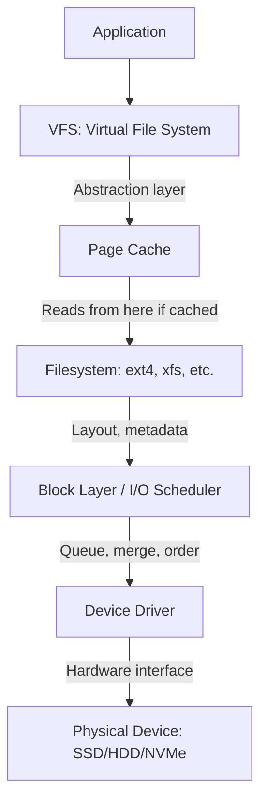
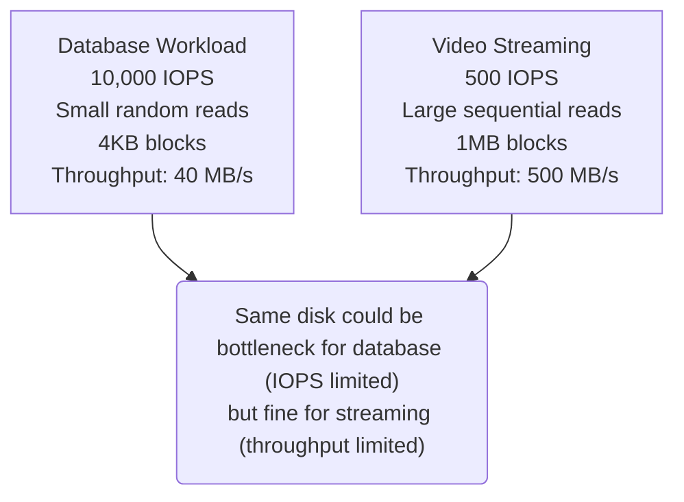

> **Linux Performance** | Complexity: `[MEDIUM]` | Time: 25-30 min

## Prerequisites

Before starting this module:
- **Required**: [Module 5.1: USE Method](../module-5.1-use-method/)
- **Required**: [Module 1.3: Filesystem Hierarchy](/linux/foundations/system-essentials/module-1.3-filesystem-hierarchy/)
- **Helpful**: [Module 5.3: Memory Management](../module-5.3-memory-management/) for page cache understanding

---

## What You'll Be Able to Do

After this module, you will be able to:
- **Measure** disk I/O performance using iostat, iotop, and fio benchmarks
- **Diagnose** I/O bottlenecks by interpreting await, %util, and queue depth metrics
- **Configure** I/O schedulers and cgroup blkio limits for container workloads
- **Evaluate** storage performance requirements for different workload types (database, logging, cache)

---

## Why This Module Matters

When applications are slow but CPU and memory look fine, the disk is often the culprit. I/O performance is harder to analyze than CPU or memory because multiple layers (filesystem, block layer, device) each add latency.

Understanding I/O performance helps you:

- **Diagnose slowness** — Find disk bottlenecks
- **Choose storage** — SSD vs HDD, local vs network
- **Size correctly** — IOPS and throughput requirements
- **Debug containers** — Why volume mounts affect performance

Disk I/O is often the hidden bottleneck.

---

## Did You Know?

- **SSDs and HDDs need different I/O schedulers** — HDDs benefit from elevator algorithms (sorting I/O by location). SSDs don't care about order. Modern Linux auto-selects.

- **iowait is misleading** — High iowait doesn't mean disk is slow. It means CPU is idle AND waiting for I/O. A system doing lots of I/O might show low iowait if CPU is also busy.

- **Page cache hides I/O** — Most reads hit cache, not disk. First read is slow, subsequent reads are fast. This is why benchmarks differ from production.

- **Network filesystems add latency** — NFS, CIFS, and even cloud storage (EBS, GCE PD) add milliseconds per operation. This matters for apps making many small I/O calls.

---

## I/O Fundamentals

### I/O Stack



> **Stop and think**: If an application writes a 1GB file to disk, but the physical disk's write throughput is only 100MB/s, why might the application report that the write completed in under a second? Consider the layers of the I/O stack and what actually happens when a write system call returns.

### IOPS vs Throughput

| Metric | Definition | Good For |
|--------|------------|----------|
| **IOPS** | I/O Operations Per Second | Small, random I/O |
| **Throughput** | MB/s transferred | Large, sequential I/O |



### Latency Components

```bash
# I/O latency = wait time + service time
#
# Wait time: Time in queue
# Service time: Time device spends on I/O

# Measured with iostat:
iostat -x 1
# await = average total time (wait + service)
# svctm = service time (deprecated/removed in newer iostat)
```

---

## I/O Metrics

### iostat

```bash
# Basic I/O stats
iostat -x 1
# Device         r/s     w/s   rkB/s   wkB/s  %util  await  avgqu-sz
# sda          100.0   200.0  4000.0  8000.0   75.2   12.5      2.3
# nvme0n1      500.0   300.0 20000.0 12000.0   45.0    1.5      0.8

# Key columns:
# r/s, w/s     = Reads/writes per second (IOPS)
# rkB/s, wkB/s = Throughput
# %util        = Percentage of time device was busy
# await        = Average I/O time (ms)
# avgqu-sz     = Average queue size (saturation indicator)
```

| Metric | Meaning | Concerning Value |
|--------|---------|-----------------|
| `%util` | Time busy | >80% for HDDs |
| `await` | Total latency | >10ms for SSD, >50ms for HDD |
| `avgqu-sz` | Queue depth | >1 means I/O backing up |
| `r_await/w_await` | Read/write latency separately | Large difference indicates problem |

> **Pause and predict**: You are monitoring a database server and notice that `await` is consistently high (over 50ms), but `%util` is hovering around 30%. What might this combination of metrics tell you about the storage subsystem's characteristics or the nature of the database's I/O patterns?

### iotop

```bash
# Per-process I/O
sudo iotop -o
# Total DISK READ:       10.0 MB/s | Total DISK WRITE:      20.0 MB/s
# TID  PRIO USER     DISK READ  DISK WRITE  SWAPIN      IO%    COMMAND
# 1234 be/4 mysql       5.0 MB/s   15.0 MB/s  0.00%   75.00% mysqld

# -o = Only show processes with I/O
# -a = Accumulated instead of bandwidth
```

### Block Device Stats

```bash
# Raw stats from kernel
cat /proc/diskstats
# 8  0 sda 123456 789 1234567 12345 234567 890 2345678 23456 0 34567 45678

# Fields (for sda):
# 1: reads completed
# 3: sectors read
# 4: time spent reading (ms)
# 5: writes completed
# 7: sectors written
# 8: time spent writing (ms)

# Per-device stats
cat /sys/block/sda/stat
```

---

## I/O Schedulers

### Available Schedulers

```bash
# Check current scheduler
cat /sys/block/sda/queue/scheduler
# [mq-deadline] kyber bfq none

# Available (bracketed = active):
# mq-deadline - Good for HDDs
# kyber - Good for fast devices (NVMe)
# bfq - Fair queuing (good for desktops)
# none - No scheduling (let device handle it)

# Change scheduler (temporary)
echo mq-deadline | sudo tee /sys/block/sda/queue/scheduler
```

### When to Change Scheduler

| Device Type | Recommended Scheduler |
|-------------|----------------------|
| HDD | mq-deadline |
| SSD (SATA) | mq-deadline or none |
| NVMe | none or kyber |
| VM disk | none (host handles it) |

---

## Filesystem Impact

### Filesystem Choice

| Filesystem | Best For | Notes |
|------------|----------|-------|
| **ext4** | General purpose | Default, mature, good for most workloads |
| **XFS** | Large files, high concurrency | Default for RHEL, better parallel writes |
| **Btrfs** | Snapshots, checksums | Copy-on-write, more features, more overhead |
| **tmpfs** | Temp data | RAM-based, very fast, lost on reboot |

### Mount Options

```bash
# View mount options
mount | grep sda
# /dev/sda1 on / type ext4 (rw,relatime,errors=remount-ro)

# Performance-relevant options:
# noatime - Don't update access time (reduces writes)
# nodiratime - Don't update directory access time
# barrier=0 - Disable write barriers (faster, less safe)
# discard - Enable TRIM for SSDs

# Example fstab entry
# /dev/sda1 / ext4 defaults,noatime 0 1
```

### Checking Filesystem Usage

```bash
# Space usage
df -h
# Filesystem      Size  Used Avail Use% Mounted on
# /dev/sda1       100G   60G   40G  60% /

# Inode usage (can exhaust before space)
df -i
# Filesystem      Inodes  IUsed   IFree IUse% Mounted on
# /dev/sda1     6553600 100000 6453600    2% /

# Directory size
du -sh /var/log/
du -sh /var/log/* | sort -rh | head -10
```

---

## Container I/O

### Blkio cgroup

```bash
# View container I/O limits
cat /sys/fs/cgroup/blkio/docker/<container>/blkio.throttle.read_bps_device
cat /sys/fs/cgroup/blkio/docker/<container>/blkio.throttle.write_bps_device

# Format: major:minor bytes_per_second
# 8:0 10485760  = sda limited to 10MB/s

# I/O stats
cat /sys/fs/cgroup/blkio/docker/<container>/blkio.io_service_bytes
```

### Docker I/O Limits

```bash
# Run with I/O limits
docker run -d \
  --device-read-bps /dev/sda:10mb \
  --device-write-bps /dev/sda:10mb \
  --device-read-iops /dev/sda:1000 \
  --device-write-iops /dev/sda:1000 \
  nginx

# Check I/O stats
docker stats --format "{{.Name}}: BlockIO: {{.BlockIO}}"
```

### Kubernetes Storage

```yaml
# StorageClass with I/O parameters targeting v1.35+ best practices
apiVersion: storage.k8s.io/v1
kind: StorageClass
metadata:
  name: fast-storage
provisioner: ebs.csi.aws.com
parameters:
  type: gp3
  iops: "3000"
  throughput: "125"
---
# Pod using PVC
apiVersion: v1
kind: Pod
metadata:
  name: io-test-pod
spec:
  containers:
  - name: app
    image: nginx:latest
    volumeMounts:
    - name: data
      mountPath: /data
  volumes:
  - name: data
    persistentVolumeClaim:
      claimName: my-pvc
```

---

## Troubleshooting I/O

### High %util

```bash
# Disk is busy - find who's using it
sudo iotop -o

# Or check with pidstat
pidstat -d 1
# UID   PID   kB_rd/s  kB_wr/s  Command
#   0  1234    5000.0   2000.0  mysqld

# Check for unnecessary I/O
# - Logging too much?
# - Sync writes that could be async?
# - Reading same data repeatedly (caching issue)?
```

### High await

```bash
# Long I/O times - check queue
iostat -x 1
# If avgqu-sz > 1, requests are queuing
# If avgqu-sz ~ 0 but await high, device is slow

# For HDDs: Could be fragmentation, failing disk
# For network storage: Network latency
# For cloud: Throttling, noisy neighbors

# Check for disk errors
dmesg | grep -i "error\|fault\|reset" | grep -i sd
smartctl -a /dev/sda | grep -i error
```

### High iowait

```bash
# Check what's waiting
ps aux | awk '$8 ~ /D/ {print}'
# D state = Uninterruptible sleep (waiting for I/O)

# Or
top
# Look for processes in 'D' state

# Check if it's read or write
iostat -x 1
# r_await vs w_await shows which is slow
```

### Performance Testing

```bash
# Test sequential write (be careful with of=)
dd if=/dev/zero of=/tmp/testfile bs=1G count=1 conv=fdatasync

# Test sequential read
dd if=/tmp/testfile of=/dev/null bs=1M

# Better tool: fio
fio --name=randread --ioengine=libaio --direct=1 \
    --bs=4k --iodepth=32 --rw=randread \
    --size=1G --numjobs=1 --runtime=60 --filename=/tmp/fiotest

# Clean up
rm /tmp/testfile /tmp/fiotest
```

---

## Common Mistakes

| Mistake | Problem | Solution |
|---------|---------|----------|
| Ignoring iowait context | Misinterpreting CPU stats | Check iostat, not just top |
| Wrong scheduler | Poor performance | Match scheduler to device type |
| Sync writes everywhere | Unnecessary latency | Use async where safe |
| Not monitoring queue depth | Missing saturation | Check avgqu-sz in iostat |
| Log files on slow disk | I/O contention | Separate log volumes |
| No TRIM on SSDs | Performance degradation | Enable discard mount option |

---

## Quiz

### Question 1
You are monitoring a server equipped with a modern NVMe SSD array. During a nightly batch processing job, you observe that `iostat` reports `%util` at 99%, but `await` remains consistently under 1ms and `avgqu-sz` is around 2. A junior engineer panics, stating the disks are completely maxed out and causing a bottleneck. How should you interpret these metrics?

<details>
<summary>Show Answer</summary>

**The storage subsystem is handling the load perfectly and is not a bottleneck.**

The `%util` metric only measures the percentage of time the device had at least one outstanding I/O request, not its total capacity or saturation limit. Because modern NVMe SSDs are designed to be highly parallel, they can efficiently process numerous requests simultaneously without slowing down. The crucial metrics to observe here are `await` (latency) and `avgqu-sz` (queue depth); since latency remains sub-millisecond and the queue is very small, the drives are processing requests as quickly as they arrive. Ultimately, the junior engineer is misinterpreting a "busy" drive for a "saturated" drive, a common mistake when dealing with parallel storage architectures.

</details>

### Question 2
Your team deploys a new read-heavy analytics application. During the first 10 minutes of operation, `iostat` shows massive read throughput (rkB/s) and high disk utilization. However, after an hour, the application is serving queries faster than ever, yet `iostat` shows almost zero disk read activity. The application's code and query volume have not changed. What architectural component of Linux explains this behavior?

<details>
<summary>Show Answer</summary>

**The Linux Page Cache has successfully cached the frequently accessed data in RAM.**

When the application first started, the working data set resided solely on the physical disk, forcing the kernel to perform actual block device reads that surfaced in `iostat`. As this data was sequentially read into memory, the Linux kernel intelligently retained it within the Page Cache using otherwise free RAM. Subsequent queries for the same data are therefore served directly from this extremely fast RAM cache rather than returning to the slower physical disk. Consequently, `iostat` shows no physical block device reads, and the application experiences significantly lower latency because memory access is orders of magnitude faster than disk I/O.

</details>

### Question 3
You are troubleshooting a legacy application running on an older server with spinning Hard Disk Drives (HDDs). Users are complaining about severe intermittent lag. You check `iostat` and notice that while `%util` is only around 60%, the `avgqu-sz` (average queue size) frequently spikes to 15 or 20, and `await` jumps to over 200ms during these spikes. What is the actual bottleneck, and why?

<details>
<summary>Show Answer</summary>

**The physical disks are becoming saturated and cannot process requests fast enough, leading to queuing.**

Unlike modern solid-state drives, spinning HDDs have extremely limited parallel processing capabilities because they must physically move a mechanical read/write head across platters. An `avgqu-sz` of 15 indicates that there are 15 distinct I/O requests waiting in line for the disk head to seek to the correct physical location. This severe mechanical limitation causes the `await` time—which combines the time spent waiting in the queue with the actual service time—to skyrocket to 200ms. Even though the disk isn't busy 100% of the time over the polling interval (`%util`), during sudden bursts of activity, the mechanical hardware simply cannot keep up with the concurrent I/O demands.

</details>

### Question 4
You have just provisioned a high-performance database server on a public cloud provider. The underlying storage is a block storage volume mapped to your VM over a high-speed virtualized NVMe interface. You check the current I/O scheduler and see it is set to `mq-deadline`. Should you change this, and if so, to what and why?

<details>
<summary>Show Answer</summary>

**Yes, you should change the I/O scheduler to `none`.**

The `mq-deadline` scheduler is fundamentally designed to sort and merge I/O requests to optimize the physical movement of HDD read/write heads and prevent starvation. However, in this scenario, your virtual machine is writing to a virtualized NVMe device that is backed by a cloud provider's distributed storage system. This means physical head movement is entirely irrelevant to your guest OS, and the underlying cloud hypervisor already handles storage scheduling optimally. By keeping a complex scheduler active in the guest OS, you are simply adding unnecessary CPU overhead and artificial latency to every storage request. Setting the scheduler to `none` allows the Linux kernel to pass the I/O requests directly to the hypervisor as efficiently and quickly as possible.

</details>

### Question 5
A production web server is suddenly unresponsive. You log in and run `uptime`, seeing a load average of 45.0 on a 4-core machine. You run `top` and notice the CPU usage is mostly idle, but the `%wa` (iowait) is sitting at 95%. When you look at the process list in `top`, you see dozens of processes stuck in the `D` state. How do you systematically determine exactly which process or application is driving the physical disks to saturation?

<details>
<summary>Show Answer</summary>

**You should use a specialized I/O tool like `iotop` or `pidstat -d` to measure per-process disk bandwidth.**

The high `%wa` (iowait) and the presence of processes in the `D` (uninterruptible sleep) state confirm that your CPUs are sitting idle because they are waiting on the storage subsystem to acknowledge data requests. However, standard tools like `top` only display CPU and memory utilization, entirely masking how many bytes a specific process is reading or writing to the disk. By running `sudo iotop -o`, you gain a real-time, top-like interface that sorts active processes by their actual disk read and write bandwidth in MB/s. This visibility will immediately pinpoint the exact PID and command—such as a runaway logging process or an unoptimized database query—that is physically overwhelming the block device.

</details>

---

## Hands-On Exercise

### Analyzing I/O Performance

**Objective**: Use Linux tools to analyze disk I/O behavior.

**Environment**: Linux system with root access

#### Part 1: Basic I/O Metrics

```bash
# 1. Check disk devices
lsblk
df -h

# 2. Current I/O stats
iostat -x 1 3

# 3. Understand the output
# %util = busy time
# await = average latency
# r/s, w/s = IOPS
# rkB/s, wkB/s = throughput
```

#### Part 2: I/O Scheduler

```bash
# 1. Check current scheduler
cat /sys/block/sda/queue/scheduler 2>/dev/null || \
cat /sys/block/vda/queue/scheduler 2>/dev/null || \
echo "Check your disk name with lsblk"

# 2. List available schedulers
# Bracketed one is active

# 3. Check queue depth
cat /sys/block/sda/queue/nr_requests 2>/dev/null
```

#### Part 3: Generate I/O Load

```bash
# 1. Create test file (adjust size for your system)
dd if=/dev/zero of=/tmp/iotest bs=1M count=500 2>&1

# 2. Monitor I/O during write
# In another terminal:
iostat -x 1 10

# 3. Test read
echo 3 | sudo tee /proc/sys/vm/drop_caches  # Clear cache
dd if=/tmp/iotest of=/dev/null bs=1M 2>&1

# 4. Clean up
rm /tmp/iotest
```

#### Part 4: Per-Process I/O

```bash
# 1. Find I/O consumers
sudo iotop -o -b -n 3

# 2. Or with pidstat
pidstat -d 1 5

# 3. Check processes waiting for I/O
ps aux | awk '$8 ~ /D/ {print $2, $11}'
```

#### Part 5: Filesystem Analysis

```bash
# 1. Mount options
mount | grep "^/dev"

# 2. Space usage
df -h
df -i  # Inodes

# 3. Large directories
sudo du -sh /var/* 2>/dev/null | sort -rh | head -10

# 4. Recently accessed files
find /var/log -type f -mmin -5 2>/dev/null
```

#### Part 6: Container I/O (if Docker available)

```bash
# 1. Run container generating I/O
docker run -d --name io-test alpine sh -c "while true; do dd if=/dev/zero of=/tmp/test bs=1M count=10 2>/dev/null; sleep 1; done"

# 2. Monitor container I/O
docker stats --no-stream io-test

# 3. Check from host
sudo iotop -o

# 4. Clean up
docker rm -f io-test
```

### Success Criteria

- [ ] Identified disk devices and current utilization
- [ ] Understood iostat output (util, await, queue)
- [ ] Observed I/O during file operations
- [ ] Found per-process I/O consumers
- [ ] Checked filesystem mount options and usage
- [ ] (Optional) Monitored container I/O

---

## Key Takeaways

1. **%util shows busy time, not capacity** — SSD at 100% util can still accept more I/O

2. **avgqu-sz reveals saturation** — Requests queuing means disk can't keep up

3. **Page cache hides I/O** — Most reads don't hit disk

4. **IOPS vs throughput** — Different workloads need different metrics

5. **Schedulers matter for HDDs** — SSDs usually work best with "none"

---

## What's Next?

In **Module 6.1: Systematic Troubleshooting**, you'll learn methodologies for diagnosing Linux problems systematically, building on the performance analysis skills from this section.

---

## Further Reading

- [Linux Block I/O Layer](https://www.kernel.org/doc/Documentation/block/)
- [I/O Schedulers](https://wiki.archlinux.org/title/Improving_performance#Storage_devices)
- [Brendan Gregg's I/O Analysis](https://www.brendangregg.com/linuxperf.html)
- [fio - Flexible I/O Tester](https://fio.readthedocs.io/)