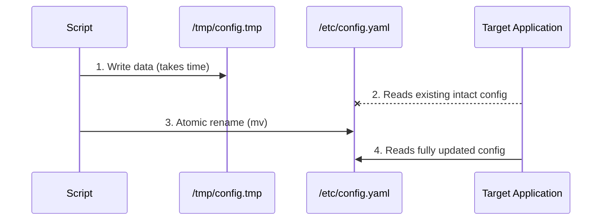
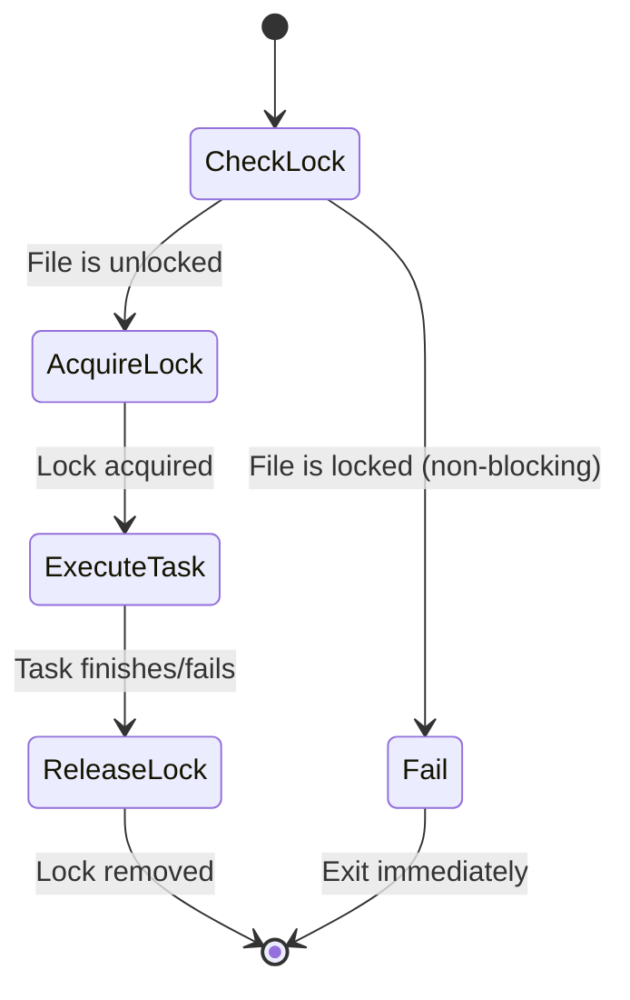

# Module 7.3: Practical Scripts

> **Shell Scripting** | Complexity: `[MEDIUM]` | Time: 25-30 min. This module treats scripts as operational tools that need clear contracts, repeatable behavior, and evidence when something fails.

## Prerequisites

Before starting this module, make sure you can read basic Bash syntax, combine text-processing commands, and recognize when a script is changing shared system state rather than simply printing a local report.
- **Required**: [Module 7.1: Bash Fundamentals](../module-7.1-bash-fundamentals/)
- **Required**: [Module 7.2: Text Processing](../module-7.2-text-processing/)
- **Helpful**: Experience with operational tasks

## Learning Outcomes

After this module, you will be able to turn common shell patterns into practical automation that reviewers, schedulers, and future operators can reason about safely.
- **Implement** production-ready shell scripts with logging, error handling, and configuration.
- **Diagnose** failures in scripts that use traps, strict mode, retries, timeouts, and exit codes.
- **Design** idempotent file and deployment automation using validation, atomic writes, locks, and dry-run modes.
- **Evaluate** health checks and operational scripts for test coverage, edge cases, and safe Kubernetes 1.35+ automation with `k`.

## Why This Module Matters

At 02:13 on a Sunday, a payments team discovered that a maintenance script had quietly turned a routine certificate rotation into a regional outage. The script downloaded a new bundle, rewrote a configuration file in place, and restarted a proxy process while another automation job was reading the same file. For several minutes, instances saw a truncated configuration and rejected healthy traffic. The incident review found no exotic root cause, no kernel bug, and no vendor failure; it found a shell script that worked during the happy-path demo and failed under ordinary production timing.

The financial cost was not only the lost transactions during the outage window. Engineers spent the next business day proving which customer requests were retried, which alerts were noise, and whether any temporary data had been left behind by interrupted jobs. That investigation was harder because the script had no structured logging, no reliable exit codes, no cleanup trap, and no dry-run mode that could reproduce the dangerous path without changing the system. A script that looked small in code review created a large operational blast radius because it had no contract with the environment around it.

This module teaches the difference between a quick command saved in a file and practical automation that other engineers can trust. You will start with a production-ready shell script template, then build the surrounding habits that make scripts safe: strict mode, validation, cleanup, retries, timeouts, atomic writes, file locks, idempotency, health checks, and systematic testing. The goal is not to turn Bash into a full application framework. The goal is to know when Bash is appropriate, how to make it predictable, and how to recognize the point where a real programming language or orchestration tool becomes the better design.

For Kubernetes examples, this course uses Kubernetes 1.35+ behavior and the short alias `alias k=kubectl`; commands such as `k get pods` and `k delete pod nginx` mean the same thing as their longer `kubectl` forms. The alias matters because operational scripts should be readable without being noisy, but the script still needs to validate that the command exists before relying on it. Treat every external command as a dependency, not as a magical built-in.

## Script Template

Practical scripts begin with a contract. The contract says which shell runs the file, which errors stop execution, where configuration comes from, how the script logs, how it exits, and where cleanup happens. Without that contract, every later function inherits ambiguity. One engineer runs the script with Bash, another runs it with `sh`, a cron job runs it without the expected environment, and a systemd unit captures only half of the useful output. A template gives you a boring starting point, and boring is valuable when the script may run during an incident.

The template below is deliberately longer than the smallest possible script because production scripts spend much of their time explaining themselves under stress. A clear usage block prevents guessing. A `main` function keeps global setup separate from work. Small logging helpers make every message look consistent. The cleanup trap makes exit behavior explicit. You can remove pieces for a one-off local helper, but you should do that consciously rather than starting with a brittle file and adding safety only after a failure.

```bash
#!/bin/bash
#
# Script: script-name.sh
# Description: Brief description of what this script does
# Usage: ./script-name.sh [options] <arguments>
#

set -euo pipefail

# === Configuration ===
readonly SCRIPT_NAME=$(basename "$0")
readonly SCRIPT_DIR=$(cd "$(dirname "$0")" && pwd)
readonly LOG_FILE="/var/log/${SCRIPT_NAME%.sh}.log"

# === Logging ===
log() {
    local level=$1
    shift
    local timestamp=$(date '+%Y-%m-%d %H:%M:%S')
    echo "[$timestamp] [$level] $*" | tee -a "$LOG_FILE"
}

log_info() { log "INFO" "$@"; }
log_warn() { log "WARN" "$@"; }
log_error() { log "ERROR" "$@" >&2; }

# === Error Handling ===
die() {
    log_error "$@"
    exit 1
}

# === Cleanup ===
cleanup() {
    local exit_code=$?
    # Add cleanup tasks here
    rm -f "${TEMP_FILE:-}"
    exit $exit_code
}
trap cleanup EXIT

# === Argument Parsing ===
usage() {
    cat << EOF
Usage: $SCRIPT_NAME [options] <argument>

Description:
    Brief description of what this script does.

Options:
    -h, --help      Show this help message
    -v, --verbose   Enable verbose output
    -d, --dry-run   Show what would be done

Arguments:
    argument        Description of required argument

Examples:
    $SCRIPT_NAME -v input.txt
    $SCRIPT_NAME --dry-run /path/to/file
EOF
    exit 0
}

# === Main Logic ===
main() {
    local verbose=false
    local dry_run=false

    # Parse arguments
    while [[ $# -gt 0 ]]; do
        case $1 in
            -h|--help) usage ;;
            -v|--verbose) verbose=true; shift ;;
            -d|--dry-run) dry_run=true; shift ;;
            -*) die "Unknown option: $1" ;;
            *) break ;;
        esac
    done

    # Validate arguments
    [[ $# -lt 1 ]] && die "Missing required argument. Use -h for help."

    local input=$1

    # Validate input
    [[ -f "$input" ]] || die "File not found: $input"

    # Do the work
    log_info "Processing: $input"
    if [[ "$dry_run" == true ]]; then
        log_info "Dry run - would process $input"
    else
        # Actual processing here
        log_info "Done"
    fi
}

main "$@"
```

Notice the order of the template. Configuration appears before behavior because functions should not silently invent defaults in distant lines of the file. Logging appears before `die` because failures should be reported through the same channel as normal progress. `main "$@"` appears at the end so the file can be scanned top to bottom like a small program rather than a pile of commands. That layout sounds cosmetic until a teammate has to patch the script while an alert is firing.

The tradeoff is that a template can make every script look more important than it is. Do not wrap a two-command personal helper in a hundred lines of ceremony. Use the template when the script changes shared state, runs unattended, accepts user input, deletes or rewrites files, calls a network service, talks to Kubernetes, or becomes part of a runbook. Those conditions are where the script stops being a convenience and starts being operational infrastructure.

Pause and predict: if the script is launched by cron with a minimal environment, which values in this template still resolve predictably, and which values might depend on the host? The useful habit is to separate values derived from the script itself, such as `SCRIPT_NAME`, from values supplied by the surrounding system, such as writable log paths and available commands. That separation tells you what to validate before the first destructive action.

## Error Handling Patterns

Error handling in shell is less about catching exceptions and more about refusing to continue after a broken assumption. Bash will happily keep running after many failed commands unless you tell it otherwise. Pipelines add another trap: by default, the pipeline status often reflects the last command, not the command that corrupted the input. A practical script needs strict defaults, narrow exceptions, and exit codes that callers can trust.

Strict mode is the usual starting point, but it is not a magic shield. `set -e` has edge cases around conditionals, subshells, and commands whose non-zero status is expected. That means you should combine strict mode with explicit checks around operations where failure is part of the control flow. The pattern is not "never allow a command to fail"; the pattern is "never let an unexpected failure look like success."

```bash
#!/bin/bash
set -euo pipefail

# -e: Exit on any error
# -u: Exit on undefined variable
# -o pipefail: Exit on pipe failure

# Sometimes you want to handle errors yourself
set +e  # Temporarily disable
command_that_might_fail
exit_code=$?
set -e  # Re-enable

if [[ $exit_code -ne 0 ]]; then
    echo "Command failed with $exit_code"
fi
```

The temporary `set +e` block is useful when a command communicates information through its exit status. For example, `grep -q` returns non-zero when it does not find a match, which may be a normal branch rather than an error. The danger is leaving strict mode disabled after the special case. Keep that window small, capture the status immediately, and re-enable strict behavior before doing more work. If the exception becomes large, move it into a function and make the function's return contract explicit.

> **Pause and predict**: What happens if you run `grep "error" log.txt | wc -l` and `log.txt` doesn't exist? How does `set -o pipefail` change the outcome?

### Knowledge Check

You are writing a deployment script that pipes a configuration file through `sed` and then applies it with `kubectl`. During a test run, the `sed` command fails due to a syntax error, but the script continues and applies an empty configuration, bringing down the application. Which bash setting would have prevented this, and how does it work?

<details>
<summary>Show Answer</summary>

Three separate options are typically combined as `set -euo pipefail` to prevent these exact scenarios.

- **`-e`** (errexit): Causes the script to exit immediately if any command returns a non-zero status.
- **`-u`** (nounset): Causes the script to exit if an undefined variable is referenced.
- **`-o pipefail`**: Ensures that a pipeline returns the exit code of the rightmost command that failed, rather than the last command in the chain.

**Why this matters**: By default, bash pipelines only evaluate the exit code of the final command in the chain. If `sed` fails but `kubectl` succeeds in applying the resulting empty input, the pipeline succeeds and the script continues. This seemingly small configuration detail is the difference between a safely aborted deployment and a catastrophic production outage. Using `set -o pipefail` ensures the script halts and reports the pipeline failure immediately, preventing destructive downstream actions from occurring.

</details>

Cleanup is the other half of error handling because failed scripts usually leave evidence behind. Temporary files, partial downloads, stale locks, and background child processes can become the cause of the next incident. Putting `rm` at the end of a script only handles the happy path. A trap attaches cleanup to the script lifecycle, so normal completion, failure, and interruption all travel through the same exit door.

```bash
# Cleanup on exit, error, or interrupt
cleanup() {
    local exit_code=$?
    log "Cleaning up..."
    rm -f "$TEMP_FILE"
    [[ -d "$TEMP_DIR" ]] && rm -rf "$TEMP_DIR"
    exit $exit_code
}

trap cleanup EXIT       # Normal exit
trap cleanup ERR        # On error
trap cleanup INT TERM   # Ctrl+C, kill
```

There is a subtle design choice in the cleanup function: it records the original exit code before doing cleanup. Without that line, a successful cleanup command can hide the failure that triggered the cleanup in the first place. The caller then sees zero and assumes the script completed correctly. Good cleanup should remove debris while preserving the truth about the work. That is why exit codes are contracts rather than decorative numbers.

### Knowledge Check

You wrote a script that creates a temporary directory using `TEMP_DIR=$(mktemp -d)` to process sensitive user data. At the very end of your script, you have the command `rm -rf "$TEMP_DIR"`. However, during execution, the script receives a `SIGINT` (Ctrl+C) from the user halfway through processing. What happens to the temporary directory, and how can you fix this architectural flaw?

<details>
<summary>Show Answer</summary>

The temporary directory and its sensitive contents will be permanently left on the disk. Because the script was interrupted before reaching the final `rm -rf` command, the cleanup logic was never executed.

**Why this matters**: Hardcoding cleanup commands at the end of a script assumes a flawless "happy path" execution that rarely exists in production environments. Scripts can fail due to syntax errors, user interruption via keyboard, or system-level termination signals. By utilizing `trap 'rm -rf "$TEMP_DIR"' EXIT`, you register a cleanup handler directly with the operating system that is guaranteed to execute on any exit condition. This ensures sensitive temporary data is reliably destroyed regardless of how or why the script terminates, securing your system against data leaks and storage exhaustion.

</details>

Retries belong in the same conversation because many script failures are transient rather than permanent. A network request may fail because of a short routing change, a package mirror may return a temporary error, or the API server may restart while your deployment check runs. Retrying can make automation more resilient, but blind retrying can also hide real faults and multiply load against a struggling service. The script should log each attempt and stop after a bounded number of tries.

```bash
retry() {
    local max_attempts=$1
    local delay=$2
    shift 2
    local cmd="$@"

    local attempt=1
    while [[ $attempt -le $max_attempts ]]; do
        log_info "Attempt $attempt/$max_attempts: $cmd"
        if eval "$cmd"; then
            return 0
        fi
        log_warn "Failed, waiting ${delay}s..."
        sleep "$delay"
        ((attempt++))
    done

    log_error "All $max_attempts attempts failed"
    return 1
}

# Usage
retry 3 5 curl -s http://example.com/api
```

The `retry` helper preserves a simple mental model: the command either succeeds within the allowed attempts or the script reports failure. In higher-risk scripts, avoid `eval` by passing command arguments as an array, because `eval` reinterprets strings and can create quoting or injection problems. The original pattern is easy to read for controlled commands, but production scripts that accept user input should prefer safer argument handling. Safety is not one pattern; it is choosing the right pattern for the data source.

Timeouts protect the opposite edge case: a command that does not fail quickly enough. A hung network call can occupy a cron slot, block a deployment pipeline, or hold a file lock for longer than expected. A timeout turns an unbounded wait into a bounded decision. It does not fix the underlying service, but it gives the script a chance to log, clean up, release locks, and return a status that a scheduler or operator can act on.

```bash
# Using timeout command
timeout 30 long_running_command

# Check result
if timeout 10 curl -s http://example.com > /dev/null; then
    echo "Success"
else
    echo "Timeout or failure"
fi

# Custom timeout with background process
run_with_timeout() {
    local timeout=$1
    shift
    "$@" &
    local pid=$!

    ( sleep "$timeout"; kill -9 $pid 2>/dev/null ) &
    local killer=$!

    wait $pid 2>/dev/null
    local result=$?

    kill $killer 2>/dev/null
    return $result
}
```

Use the standard `timeout` command when it is available because it is clearer and better tested than a custom background killer. The custom function is still useful as a teaching example because it reveals the moving parts: a worker process, a watchdog process, a wait, and cleanup for the watchdog. If your script starts multiple child processes, timeout design becomes more complex because killing one parent process may leave children behind. That is one of the signals that a richer language or supervisor may be appropriate.

## Logging Patterns

Logs are the memory of an unattended script. The operator reading them may not know which host ran the job, which arguments were passed, or whether a warning happened before or after the destructive step. Good logs answer those questions without requiring the reader to rerun the script. They also respect the reader's attention by separating debug detail from normal progress and errors that require action.

Structured logging does not require JSON for every small Bash script. A consistent timestamp, level, and message can be enough for `grep`, `awk`, journald, or a simple ticket comment. The important part is that every function uses the same path. When one command prints raw output, another uses `echo`, and a third writes only to a file, the script becomes harder to diagnose than the system it manages.

```bash
# Log levels
LOG_LEVEL=${LOG_LEVEL:-INFO}

declare -A LOG_LEVELS=([DEBUG]=0 [INFO]=1 [WARN]=2 [ERROR]=3)

log() {
    local level=$1
    shift
    local level_num=${LOG_LEVELS[$level]:-1}
    local threshold=${LOG_LEVELS[$LOG_LEVEL]:-1}

    if [[ $level_num -ge $threshold ]]; then
        local timestamp=$(date '+%Y-%m-%d %H:%M:%S')
        printf '[%s] [%s] %s\n' "$timestamp" "$level" "$*"
    fi
}

# Usage
LOG_LEVEL=DEBUG
log DEBUG "Detailed info"
log INFO "Normal message"
log WARN "Warning!"
log ERROR "Error!"
```

The level table gives the script a single place to decide what "verbose" means. That matters when the same script runs in three modes: quiet cron execution, interactive debugging, and a CI job where log volume costs real review time. `DEBUG` should explain internal decisions, not duplicate every command. `INFO` should describe major progress. `WARN` should identify degraded but recoverable behavior. `ERROR` should explain why the script is about to return a failing status.

Writing to both a console and a log file is useful when humans and machines consume the same run. The console gives the person immediate feedback, while the file gives future investigators a stable record. Be careful with secrets in logs. Even safe example values such as `your-api-token-here` should remind you that real tokens, headers, database URLs, and kubeconfig fragments do not belong in ordinary script output.

```bash
# Redirect all output to log file while keeping console
exec > >(tee -a "$LOG_FILE") 2>&1

# Or for specific commands
echo "This goes to console and log" | tee -a "$LOG_FILE"

# Errors to stderr and log
log_error() {
    echo "[ERROR] $*" | tee -a "$LOG_FILE" >&2
}
```

Progress indicators are useful for interactive scripts but dangerous when copied blindly into automation. A spinner makes a terminal feel alive, yet it can fill CI logs with carriage returns or unreadable characters. A percentage loop can be helpful for a long local operation, but it may be misleading if the script has no real measurement of total work. Use progress output when it reduces uncertainty, and suppress it or simplify it when logs need to be durable evidence.

```bash
# Simple progress
for i in {1..100}; do
    printf "\rProgress: %d%%" "$i"
    sleep 0.1
done
echo

# Spinner
spin() {
    local pid=$1
    local chars="⠋⠙⠹⠸⠼⠴⠦⠧⠇⠏"
    local i=0
    while kill -0 "$pid" 2>/dev/null; do
        printf "\r${chars:i++%${#chars}:1} Working..."
        sleep 0.1
    done
    printf "\r"
}

long_command &
spin $!
wait
echo "Done!"
```

Before running this, what output do you expect in a terminal, and what output would you expect inside a CI log viewer? That small prediction exercise changes how you design logging. The same visual trick that reassures a human at a prompt can become confusing when every carriage return is preserved as text. Practical scripts often need a `--quiet`, `--verbose`, or `--no-progress` mode because the best output depends on where the script runs.

## Input Validation

Validation is the boundary between your assumptions and the world. Arguments can be missing, files can be unreadable, directories can exist without being writable, commands can be absent, and values can be shaped like data while meaning something dangerous. The earlier a script validates inputs, the smaller its failure domain becomes. A validation failure before any state change is a polite refusal; a validation failure after half the work is a cleanup problem.

Argument validation should explain the problem in the user's language rather than exposing an obscure downstream command error. "Missing log file. Use -h for help." is better than an `awk` failure about an empty filename. For dependencies, `command -v` turns a missing tool into a clear preflight error. This is especially important for scripts that call `k`, `jq`, `curl`, or `flock`, because those tools may exist on an engineer's laptop but not on a minimal server image.

```bash
# Required arguments
[[ $# -lt 2 ]] && die "Usage: $0 <source> <dest>"

# Validate file exists
validate_file() {
    local file=$1
    [[ -f "$file" ]] || die "Not a file: $file"
    [[ -r "$file" ]] || die "Cannot read: $file"
}

# Validate directory
validate_dir() {
    local dir=$1
    [[ -d "$dir" ]] || die "Not a directory: $dir"
    [[ -w "$dir" ]] || die "Cannot write to: $dir"
}

# Validate command exists
require_command() {
    local cmd=$1
    command -v "$cmd" &>/dev/null || die "Required command not found: $cmd"
}

require_command kubectl
require_command jq
```

Validation is not the same as sanitization. Validation rejects data that does not meet a contract; sanitization transforms data into a safer shape. Both have uses, but confusing them can create surprising behavior. If a user passes a path and the script silently removes characters, it may operate on a different path than the user intended. For names that become filenames, labels, or report identifiers, a narrow sanitization rule can be appropriate because the output is a generated artifact rather than a user-selected resource.

```bash
# Remove dangerous characters
sanitize() {
    local input=$1
    # Remove everything except alphanumeric, dash, underscore, dot
    echo "${input//[^a-zA-Z0-9._-]/}"
}

# Validate is number
is_number() {
    [[ $1 =~ ^[0-9]+$ ]]
}

# Validate IP address
is_ip() {
    [[ $1 =~ ^[0-9]{1,3}\.[0-9]{1,3}\.[0-9]{1,3}\.[0-9]{1,3}$ ]]
}

# Safe default
port=${1:-8080}
is_number "$port" || die "Invalid port: $port"
```

The IP validation example is intentionally simple, and that is a useful warning. The regular expression checks shape, not whether each octet is within the valid range or whether the address is routable. For a guardrail in a small helper, that may be enough. For a security boundary, it is not. Practical scripting means knowing whether a check is a convenience, a correctness guarantee, or a security control. Label that decision in your own mind before trusting the result.

## File Handling

Files are where many small scripts become dangerous because files outlive the process that created them. A temporary file can expose sensitive data, a partial configuration can be read by another service, and two script instances can overwrite each other. File handling therefore needs three habits: create temporary paths safely, publish finished files atomically, and coordinate concurrent access when more than one process might run.

`mktemp` exists because predictable names in shared directories are unsafe. A path like `/tmp/myscript.tmp` invites collisions between concurrent runs and can be pre-created by another user on a multi-user system. The right fix is not to invent a more obscure filename. The right fix is to let the operating system create a unique path with safe permissions, then register cleanup immediately so interruptions do not leave data behind.

```bash
# Create temp file
TEMP_FILE=$(mktemp)
trap 'rm -f "$TEMP_FILE"' EXIT

# Create temp directory
TEMP_DIR=$(mktemp -d)
trap 'rm -rf "$TEMP_DIR"' EXIT

# With prefix
TEMP_FILE=$(mktemp /tmp/myscript.XXXXXX)

# Never do this (race condition, predictable)
# TEMP_FILE=/tmp/myscript.tmp  # BAD!
```

### Knowledge Check

A junior engineer submits a pull request with a script that processes daily backups. Inside the script, they define a temporary file using `TEMP_FILE=/tmp/backup-processing.tmp`. You immediately reject the PR and request they use `mktemp` instead. What specific production risks does their hardcoded path introduce?

<details>
<summary>Show Answer</summary>

A hardcoded path in a world-writable directory like `/tmp` introduces severe security and reliability flaws into your infrastructure.

**Why this matters**: First, it creates a massive race condition where two concurrent instances of the script will overwrite each other's data, silently corrupting the process. Second, it exposes the system to symlink attacks; a malicious local user could pre-create a symlink at `/tmp/backup-processing.tmp` pointing to a critical file like `/etc/shadow`, tricking your script into overwriting it. Utilizing `TEMP_FILE=$(mktemp)` delegates the file creation to the operating system, which guarantees a unique, unpredictable filename and sets secure default permissions to prevent unauthorized access. This fundamental practice protects against both accidental data loss and intentional privilege escalation.

</details>

Atomic writes solve a different class of problem: readers should never observe a half-written file. Redirection with `>` truncates the destination before writing new content, which creates a window where another process can read incomplete data. The safer pattern writes the full content to a temporary file on the same filesystem and then renames it into place. On the same filesystem, rename is atomic from the reader's perspective: readers see either the old file or the new file, not a torn middle state.



> **War Story**: In 2018, a major SaaS provider had a cronjob that rebuilt their HAProxy configuration every minute using `cat new_config > /etc/haproxy/haproxy.cfg`. Once, the script ran out of memory halfway through the `cat` command. HAProxy automatically reloaded the half-empty configuration file, causing a global load balancer outage that took 45 minutes to resolve. If they had written to a temporary file and used `mv`, the partial file would never have been loaded.

```bash
# Atomic write (write to temp, then move)
atomic_write() {
    local dest=$1
    local temp=$(mktemp "${dest}.XXXXXX")

    cat > "$temp"  # Write stdin to temp

    chmod --reference="$dest" "$temp" 2>/dev/null || chmod 644 "$temp"
    mv "$temp" "$dest"  # Atomic rename
}

# Usage
generate_config | atomic_write /etc/app/config.yaml
```

Atomic write helpers should preserve permissions deliberately. The example copies permissions from the existing destination when possible and falls back to a simple mode otherwise. That fallback is acceptable for teaching, but production scripts should think about ownership, SELinux labels, and whether the destination may not exist yet. If those details matter, make them arguments or preconditions rather than hidden behavior inside the helper.

### Knowledge Check

Your script is responsible for dynamically updating `/etc/nginx/conf.d/upstream.conf` every 10 seconds. Nginx reloads this file frequently. You initially use `echo "server 10.0.0.5;" > /etc/nginx/conf.d/upstream.conf`, but occasionally Nginx crashes complaining about unexpected end of file. How can you update the configuration file without Nginx ever reading a partially written state?

<details>
<summary>Show Answer</summary>

You must use an atomic write pattern by writing the new configuration to a temporary file first, and then renaming it over the active configuration file using the `mv` command.

**Why this matters**: Standard output redirection using `>` or tools like `cat` write data sequentially, meaning there is a fraction of a second where the configuration file exists in an incomplete state. If Nginx reloads the file during this exact microscopic window, it processes truncated syntax and immediately crashes. The `mv` command, when utilized on the same filesystem, executes a `rename` system call which the Linux kernel guarantees is an atomic operation. Consequently, Nginx will either see the old configuration or the fully written new configuration, entirely eliminating the possibility of reading a partial state and ensuring continuous application availability.

</details>

File locking handles concurrency rather than partial publication. Cron, systemd timers, CI jobs, and humans can all start the same script while a previous run is still active. If the script writes shared files, talks to a rate-limited API, or consumes a large amount of memory, overlapping runs can turn a slow dependency into a local outage. A lock gives the script a single-occupancy section where only one instance is allowed to proceed.

Think of file locking like the key to a single-occupancy restroom at a gas station. Only one process can hold the lock at a time. If another process tries to enter the locked section, it must either wait in blocking mode or walk away entirely in non-blocking mode. Operational scripts usually prefer non-blocking mode for scheduled jobs because stacking delayed work often creates more pressure than skipping one run and alerting clearly.



```bash
# Lock file for single instance
LOCK_FILE="/var/run/${SCRIPT_NAME}.lock"

acquire_lock() {
    exec 9>"$LOCK_FILE"
    if ! flock -n 9; then
        die "Another instance is running"
    fi
}

release_lock() {
    flock -u 9
    rm -f "$LOCK_FILE"
}

trap release_lock EXIT
acquire_lock
```

There is an important distinction between the lock file path and the lock itself. The kernel lock is tied to the open file descriptor, not merely to the presence of a file on disk. That is why `exec 9>"$LOCK_FILE"` and `flock -n 9` are paired. Removing a lock file without releasing the descriptor does not mean another process can safely enter. Keep the lock helper small and avoid clever cleanup that makes concurrency harder to reason about.

### Knowledge Check

You have a synchronization script scheduled to run via cron every minute. Usually, it takes 10 seconds to complete. However, when the network is slow, it can take up to 5 minutes, causing multiple cron executions to stack up and eventually crash the server due to high memory usage. How can you modify the script to ensure a new instance immediately exits if another instance is already running?

<details>
<summary>Show Answer</summary>

You should implement robust file locking using the `flock` command to ensure strict mutual exclusion between concurrent script executions.

**Why this matters**: Relying on cron execution timings or checking for existing process IDs using `ps` introduces inherent race conditions, as two script instances might check the process table at the exact same millisecond and both decide to proceed. `flock` leverages kernel-level file locks that are fundamentally race-free by design. By opening a file descriptor to a lock file and using `flock -n` for non-blocking mode, the kernel mathematically guarantees only a single instance acquires the lock. If a subsequent instance attempts acquisition, the command instantly fails, allowing your script to exit cleanly before stacking up and causing a resource bottleneck.

</details>

## Designing Idempotent Automation

Idempotency is the property of an operation that can be applied multiple times without changing the result beyond the initial application. In scripting, this means your script should be safe to run again if it fails halfway through. That property is not academic. Production scripts are rerun constantly after transient failures, host reboots, interrupted SSH sessions, failed deployments, and partial maintenance windows. If the second run makes the system worse, the script is not automation; it is a bet.

The difference is easiest to see in operations that create directories, users, and configuration lines. A plain `mkdir` fails after the first run. A plain `useradd` fails if the account already exists. A blind append creates duplicate configuration every time the script is retried. Each command might be acceptable in a one-time migration with manual supervision, but they are poor defaults for repeatable operations.

```bash
mkdir /app/config
useradd nginx
echo "export ENV=prod" >> /etc/environment
```

The idempotent version checks desired state before making changes. `mkdir -p` says the directory should exist, not that this exact invocation must create it. The `id` check says the user should exist before moving on. The `grep` check says the environment line should be present exactly once. These commands do a little more work, but they convert a fragile sequence into a script that can be resumed after interruption.

```bash
mkdir -p /app/config

if ! id -u nginx >/dev/null 2>&1; then
    useradd nginx
fi

if ! grep -q "^export ENV=prod" /etc/environment; then
    echo "export ENV=prod" >> /etc/environment
fi
```

> **Stop and think**: If your deployment script crashes on step 4 of 10, and you run it again, what happens if steps 1-3 were not written idempotently?

Idempotency does not mean every command must be silent when state already exists. Sometimes the safest behavior is to detect drift and stop. For example, if a user account exists with the wrong UID, blindly continuing may hide a permissions problem. If a configuration line exists with a different value, appending another line may create ambiguous behavior. A good script distinguishes "already correct" from "already present but wrong." That distinction is why validation and idempotency belong together.

Deployment automation adds another layer because scripts often combine local files, remote APIs, and cluster state. A Kubernetes wrapper might render YAML, validate it, run `k apply --dry-run=server`, and then apply it for real only after checks pass. The `k` alias keeps examples compact, but the underlying principle is bigger than Kubernetes: ask the target system what state exists, compare it to the desired state, and avoid destructive work until the comparison makes sense.

Which approach would you choose here and why: a script that always deletes and recreates a resource, or a script that checks current state and updates only when needed? The delete-and-recreate version is simpler, but it often causes downtime, loses runtime metadata, and surprises dependent services. The state-aware version is more verbose, but it gives you a path to safe retries, dry runs, and clear audit logs.

## Automating Health Checks

Health checks are scripts that convert system state into a clear pass or fail signal. They should return standard exit codes because schedulers, load balancers, CI jobs, and systemd units can act on exit status without parsing prose. Human-readable output still matters, but it should explain the status rather than be the status. "Healthy" printed to the screen means little if the script returns zero after a failed dependency.

> **Stop and think**: Why should health checks return standard exit codes (0 for success, non-zero for failure) rather than just printing "Healthy" or "Failed"?

An endpoint check is useful when the service contract includes HTTP availability. The script should compare the actual status to an expected status, log enough context to identify the failing URL, and return non-zero when the result does not match. In more mature checks, you may also verify response time, TLS validity, response body content, or whether the endpoint is served by the expected version.

```bash
check_endpoint() {
    local url=$1
    local expected_status=${2:-200}
    
    local status
    status=$(curl -s -o /dev/null -w "%{http_code}" "$url")
    
    if [[ "$status" != "$expected_status" ]]; then
        log_error "Endpoint $url returned $status (expected $expected_status)"
        return 1
    fi
    log_info "Endpoint $url is healthy"
    return 0
}
```

Disk checks look simple, but they demonstrate the difference between a metric and a decision. `df` reports usage, while the script decides whether that usage is acceptable for the workload. A database host, a log aggregator, and a short-lived test runner may all need different thresholds. Health checks should therefore accept thresholds as configuration instead of burying policy in code where operators cannot adjust it during an incident.

```bash
check_disk_space() {
    local threshold_percent=$1
    local mount_point=$2
    
    local usage
    usage=$(df -h "$mount_point" | awk 'NR==2 {print $5}' | sed 's/%//')
    
    if [[ "$usage" -gt "$threshold_percent" ]]; then
        log_error "Disk usage on $mount_point is at ${usage}% (threshold: ${threshold_percent}%)"
        return 1
    fi
    return 0
}
```

Testing health checks requires both success and failure cases. A check that only passes against today's healthy system may fail noisily when a file is missing, a mount point disappears, a DNS lookup hangs, or an API returns a redirect. Write tests with tiny local fixtures when possible. For commands that touch live systems, use dry-run modes, dependency injection through environment variables, or wrapper functions that can be replaced during testing.

For Kubernetes 1.35+ operations, a practical health script might verify that `k get pods` can reach the API server, confirm that required namespaces exist, and then inspect rollout status for a specific deployment. Each check should report exactly which condition failed. "Cluster unhealthy" is less useful than "deployment api in namespace payments has unavailable replicas after 90 seconds." The latter points the responder toward the next diagnostic command.

## Common Operational Helpers

Some helper functions are small enough to look optional, but they shape the way people use a script. Confirmation prompts protect interactive sessions, dry-run wrappers protect review and rehearsal, and parallel execution helpers protect throughput when a script processes many independent items. Each helper needs a clear boundary. A confirmation prompt is useful for a human at a terminal, but it is harmful in unattended cron. A dry-run wrapper is useful only if the real and preview paths share the same decision logic. Parallel execution is useful only when each item can fail independently without corrupting shared state.

Confirmation is the simplest example because it changes the user experience without changing the underlying operation. It should default toward safety for destructive work, which is why the first helper treats an empty response as "no." The second helper demonstrates the opposite default for low-risk continuation prompts. In both cases, the prompt should name the action clearly. "Continue?" is acceptable for a local demo, but "Delete generated reports under /tmp/kubedojo-demo?" is the kind of prompt that prevents expensive ambiguity.

```bash
confirm() {
    local prompt=${1:-"Continue?"}
    read -rp "$prompt [y/N] " response
    [[ "$response" =~ ^[yY]$ ]]
}

# Usage
if confirm "Delete all files?"; then
    rm -rf /path/to/files
fi

# With default yes
confirm_yes() {
    local prompt=${1:-"Continue?"}
    read -rp "$prompt [Y/n] " response
    [[ ! "$response" =~ ^[nN]$ ]]
}
```

Dry-run mode is more important than a confirmation prompt for shared automation because it creates an inspectable rehearsal path. The key design rule is that dry-run and real execution must use the same function. If a script has a separate paragraph of hand-written dry-run text, that text will eventually drift away from the real command. A `run` helper keeps the decision in one place: either print the exact command and arguments, or execute them.

```bash
DRY_RUN=${DRY_RUN:-false}

run() {
    if [[ "$DRY_RUN" == true ]]; then
        echo "[DRY RUN] $*"
    else
        "$@"
    fi
}

# Usage
run rm -f /tmp/file
run kubectl delete pod nginx
```

Parallel execution is the helper that most needs restraint. It can make a report generator much faster when every item is independent, but it can also overload a weak dependency or make logs harder to read. The example below limits concurrency with a maximum number of jobs and waits for remaining work before returning. In a higher-risk script, each job should write to its own temporary file and the parent should merge results after all children finish, because concurrent writes to a shared output file can interleave unpredictably.

```bash
# Process files in parallel
process_parallel() {
    local max_jobs=$1
    shift

    local pids=()
    for item in "$@"; do
        process_item "$item" &
        pids+=($!)

        if [[ ${#pids[@]} -ge $max_jobs ]]; then
            wait -n  # Wait for any job to finish
            pids=($(jobs -rp))  # Update running pids
        fi
    done
    wait  # Wait for remaining
}

# Usage
process_parallel 4 file1 file2 file3 file4 file5
```

These helpers also show when Bash is reaching its edge. If dry-run mode needs a full dependency graph, if confirmation prompts need roles and approvals, or if parallel jobs need cancellation and structured result aggregation, the script is probably becoming an application. That is not a failure; it is useful evidence. The practical scripting skill is to build the smallest reliable tool now while leaving a clear path to replace it when the operational contract outgrows shell.

## Patterns & Anti-Patterns

Patterns are not decorations; they are responses to repeated operational failure modes. The common thread is that scripts should make state explicit before changing it and make failure visible before it spreads. A good pattern also has a boundary. Dry-run mode is valuable for destructive commands, but it is not a substitute for testing against fixtures. File locks prevent overlap, but they do not make slow jobs fast. Retries absorb transient failures, but they do not fix a bad URL.

| Pattern | When to Use It | Why It Works | Scaling Consideration |
|---|---|---|---|
| Strict script template | Shared scripts, cron jobs, deployment helpers, and runbook automation | Establishes shell, error, logging, cleanup, and usage contracts before work starts | Move complex business logic into functions or another language when the file grows beyond easy review |
| Validate before change | Any script that accepts paths, ports, commands, URLs, or Kubernetes resource names | Stops bad input while the system is still unchanged | Centralize validators so repeated scripts fail consistently |
| Atomic write plus lock | Config generation, cache publication, reports read by other services, and single-instance jobs | Prevents readers from seeing partial files and prevents overlapping writers | Consider a real coordination service when many hosts write shared state |
| Dry-run with logging | Deletes, restarts, migrations, deployments, and permission changes | Lets humans inspect intended actions before irreversible work | Dry-run output must be generated from the same decision path as real execution |
| Exit-code health checks | systemd units, CI gates, load balancer probes, and scheduled validation | Gives automation a reliable machine-readable contract | Add structured output only after the exit status is correct |

Anti-patterns usually start as shortcuts that feel reasonable in a calm terminal. The problem is that production does not preserve the calm terminal. A path may contain spaces, a command may return no rows, a cron job may overlap with itself, and a network dependency may hang instead of failing. The better alternative is rarely complicated; it is usually a small amount of explicitness added before the shortcut becomes shared infrastructure.

| Anti-Pattern | What Goes Wrong | Better Alternative |
|---|---|---|
| Blind append with `>>` | Reruns create duplicate configuration and make rollback unclear | Check for existing state, replace atomically, or render the full file |
| Parsing `ls` output | Spaces, newlines, and unusual filenames break loops | Use globs, `find -print0`, or direct path tests |
| Cleanup only at the end | Interruptions and errors leave temporary files or locks behind | Register `trap` cleanup immediately after allocation |
| Infinite retry loop | A real outage becomes constant load against the failed dependency | Use bounded retries with clear delay and final failure |
| Hidden environment dependency | Works interactively but fails under cron, sudo, or systemd | Validate commands, paths, and required variables during preflight |

The most important pattern is reviewability. Scripts are often reviewed less carefully than application code because they look small, but small scripts can delete data, restart services, and rewrite cluster state. A reviewer should be able to answer four questions quickly: what does the script change, how does it validate input, how does it fail, and how can it be rerun safely? If those answers are not visible, the script is not ready for unattended use.

## Decision Framework

The central decision is not "should I use Bash?" but "what level of operational contract does this task require?" Bash is excellent for gluing existing commands together, inspecting files, and writing small runbook automation. It becomes painful when you need complex data structures, long-lived state, rich tests, concurrency, or non-trivial parsing. The framework below helps you choose between a one-off command, a practical shell script, and a larger tool.

| Situation | Use This Approach | Why |
|---|---|---|
| One-time local inspection with no state change | Interactive command or short shell snippet | The cost of packaging exceeds the risk of the action |
| Repeated local task that reads files or prints reports | Small script with usage, validation, and logging | The script saves time while keeping failure easy to inspect |
| Scheduled job or shared runbook step | Full practical script template with strict mode, traps, tests, and locks | The script runs without a human watching every line |
| Deployment or Kubernetes 1.35+ automation | Idempotent script with dry-run, `k` preflight checks, and clear rollback notes | Cluster state changes need repeatability and diagnostic output |
| Complex parsing, APIs, or long-lived workflows | Python, Go, or a dedicated automation framework | Stronger typing, libraries, and tests reduce script fragility |

Use a dry-run mode when the script changes shared state, deletes data, restarts services, alters permissions, or applies Kubernetes resources. Use atomic writes when another process may read the file while it is being updated. Use a lock when two instances could overlap. Use retries when the dependency is known to fail transiently. Use a timeout when the dependency can hang. These choices are not independent checkboxes; they combine into a design that matches the failure modes of the task.

Here is the practical flow. First, decide whether the script changes anything outside its own temporary workspace. If it does, add validation and dry-run before writing the destructive branch. Second, decide whether a partial result could be observed by another process. If yes, use a temporary file and atomic rename. Third, decide whether two copies can run at the same time. If yes, use `flock` or a scheduler-level concurrency control. Finally, decide whether the script will be maintained by others. If yes, write usage text and tests before the script becomes tribal knowledge.

## Did You Know?

- **ShellCheck was first released in 2012** and still catches quoting, globbing, test-expression, and portability mistakes that experienced engineers miss during review.
- **The POSIX `rename` operation is atomic on a single filesystem**, which is why the temporary-file-and-`mv` pattern protects readers from truncated configuration files.
- **systemd treats exit status as a service contract**, so a shell health check that returns non-zero can drive restart policy, dependency ordering, and alerting without parsing text.
- **Kubernetes 1.35+ still rewards boring scripts**, because `k apply --dry-run=server` and clear rollout checks prevent accidental cluster changes before they reach live workloads.

## Common Mistakes

| Mistake | Why It Happens | How to Fix It |
|---|---|---|
| No shebang | The script happens to work in the author's interactive shell, so nobody notices that another runner may use `sh` | Start shared scripts with `#!/bin/bash` when they use Bash features, and test them through the same entry point used in production |
| Unquoted variables | Early test data has simple names, then a real path contains spaces, glob characters, or an empty value | Quote expansions as `"$var"` unless you deliberately need word splitting, and use ShellCheck to catch misses |
| Missing `set -euo pipefail` | Bash defaults are permissive, and failed commands can be buried inside long pipelines | Enable strict mode, then handle expected non-zero statuses explicitly in small, readable branches |
| Hardcoded paths | The script begins on one host and later moves to cron, systemd, CI, or another distribution | Derive paths from `SCRIPT_DIR`, accept configuration through arguments or environment, and validate write permissions |
| Cleanup only after successful work | The author tests the happy path and forgets interruptions, failed downloads, and killed processes | Register `trap` cleanup immediately after creating temporary files, directories, locks, or background processes |
| Parsing `ls` output | `ls` looks convenient in a terminal, but its output is formatted for humans rather than scripts | Use shell globs, `find`, null-delimited output, or direct file tests so unusual filenames remain safe |
| Blind retries without timeout | A transient-failure fix grows into an infinite loop that hides a real outage | Use bounded retries, add a timeout around each attempt, and log the final failure with enough context |
| Dry-run prints different logic | The dry-run branch is hand-written separately and drifts away from the real action path | Route actions through one `run` helper so dry-run and real execution share decisions and arguments |

## Quiz

<details>
<summary>Your team owns a deployment script that renders YAML with `sed`, pipes it into `k apply`, and sometimes reports success even when the rendered file is empty. What should you inspect first, and why?</summary>

Inspect whether the script uses `set -euo pipefail` and whether the render step is checked before `k apply` runs. Without `pipefail`, the pipeline can appear successful if the final command returns zero even though an earlier command failed. You should also add validation that the rendered YAML is non-empty and structurally plausible before applying it. The fix protects the deployment path by refusing to convert a rendering failure into a cluster change.
</details>

<details>
<summary>A backup script appends a status line to `/etc/environment`, restarts a service, fails during restart, and then appends the same line again on the next run. Which design property is missing?</summary>

The script is missing idempotency in its configuration update. A rerunnable script should check whether the desired line already exists, replace the full managed block, or render the file atomically from a known source of truth. Blind append operations accumulate duplicate state and make later debugging ambiguous. The restart failure is recoverable, but the repeated append turns recovery into configuration drift.
</details>

<details>
<summary>A cron job normally finishes in 20 seconds, but an API slowdown makes each run last several minutes until many copies are active. What change prevents the local resource spiral?</summary>

Add a non-blocking `flock` around the critical section so a new run exits when another instance is active. Cron timing alone is not a concurrency control because slow dependencies can outlive the schedule interval. The script should log that it skipped the run due to an existing lock and return a status appropriate for your monitoring policy. This prevents stacked jobs from consuming memory, file descriptors, or API quota while the underlying dependency is already degraded.
</details>

<details>
<summary>An engineer writes a generated Nginx include directly with `>` while Nginx reloads frequently. Users occasionally see errors caused by truncated config. What safer file pattern should replace it?</summary>

Write the generated content to a temporary file on the same filesystem and then rename it over the active include with `mv`. The temporary file can be validated before publication, and the rename prevents readers from observing a partial write. You should preserve permissions and ownership deliberately as part of the helper. This design ensures Nginx reads either the previous complete file or the new complete file, never an incomplete middle state.
</details>

<details>
<summary>A health check prints "Healthy" when a curl command succeeds, but the script always exits zero because the final `echo` succeeds. Why does this break automation?</summary>

Automation acts on exit codes, not on the author's intention. If the script returns zero after a failed dependency, systemd, CI, cron, or a wrapper script will treat the check as successful. The health check should return non-zero immediately when the endpoint status does not match the expected result. Human-readable output should explain the result, while the exit status should carry the machine-readable contract.
</details>

<details>
<summary>A teammate wants to accept any string as a report name and remove dangerous characters with a sanitizer before writing a file. What question should you ask before approving that behavior?</summary>

Ask whether the name is a generated label or a user-selected path that must remain exact. Sanitization is appropriate when the script creates a safe artifact name from loose input, but it is risky when it silently changes the user's intended target. For paths and resource names where exact identity matters, validation with a clear error is usually safer. The design should make surprising transformations visible rather than hiding them inside a helper.
</details>

<details>
<summary>You are reviewing a shared shell script that has logging, validation, and a lab test, but no dry-run mode before deleting files. What risk remains, and how should the script be changed?</summary>

The remaining risk is that reviewers and operators cannot inspect the planned destructive actions through the same decision path used by real execution. A dry-run mode should route commands through a shared `run` helper that either prints or executes the exact command and arguments. That approach avoids a separate pretend branch that can drift from reality. The script should also log the selected mode so evidence from a run is unambiguous.
</details>

## Hands-On Exercise

### Building a Practical Script

In this exercise, you will build a log analyzer that uses the same production habits taught in the module: strict mode, argument parsing, validation, logging, predictable output, and failure tests. The script is intentionally small enough to understand in one sitting, but it has the shape of a real operational tool. You can run it on any Linux system with Bash, and you can adapt the same structure for health checks, report generators, or deployment preflight scripts.

The objective is not to produce the most advanced log analysis possible. The objective is to practice turning a useful command pipeline into a script with a clear interface and reliable failure behavior. Pay attention to where the script validates input, where it logs progress, and how the test commands exercise both success and failure cases. That review habit is what keeps practical scripts maintainable after they leave your laptop.

```bash
cat > /tmp/log-analyzer.sh << 'SCRIPT'
#!/bin/bash
#
# Script: log-analyzer.sh
# Description: Analyze log files and report statistics
# Usage: ./log-analyzer.sh [-v] [-n TOP] <logfile>
#

set -euo pipefail

# === Configuration ===
readonly SCRIPT_NAME=$(basename "$0")
readonly VERSION="1.0.0"

# === Defaults ===
VERBOSE=false
TOP_COUNT=10

# === Logging ===
log_info() { echo "[INFO] $*"; }
log_debug() { [[ "$VERBOSE" == true ]] && echo "[DEBUG] $*" || true; }
log_error() { echo "[ERROR] $*" >&2; }

# === Error Handling ===
die() {
    log_error "$@"
    exit 1
}

# === Usage ===
usage() {
    cat << EOF
Usage: $SCRIPT_NAME [options] <logfile>

Analyze log files and report statistics.

Options:
    -h, --help      Show this help message
    -v, --verbose   Enable verbose output
    -n, --top NUM   Show top N results (default: 10)
    --version       Show version

Examples:
    $SCRIPT_NAME /var/log/syslog
    $SCRIPT_NAME -v -n 5 app.log
EOF
    exit 0
}

# === Functions ===
count_by_field() {
    local file=$1
    local field=$2
    log_debug "Counting by field $field"
    awk "{print \$$field}" "$file" | sort | uniq -c | sort -rn | head -n "$TOP_COUNT"
}

analyze_log() {
    local file=$1

    log_info "Analyzing: $file"
    echo

    # Basic stats
    local total_lines=$(wc -l < "$file")
    echo "Total lines: $total_lines"
    echo

    # If it looks like a syslog/access log
    if head -1 "$file" | grep -qE '^[A-Z][a-z]{2} [0-9]|^[0-9]{4}-[0-9]{2}'; then
        echo "=== Log Level Distribution ==="
        grep -oE '(INFO|DEBUG|WARN|WARNING|ERROR|FATAL)' "$file" 2>/dev/null | \
            sort | uniq -c | sort -rn || echo "No log levels found"
        echo
    fi

    # Word frequency
    echo "=== Most Common Words ==="
    tr -cs 'A-Za-z' '\n' < "$file" | \
        tr '[:upper:]' '[:lower:]' | \
        sort | uniq -c | sort -rn | head -n "$TOP_COUNT"
    echo

    log_info "Analysis complete"
}

# === Main ===
main() {
    # Parse arguments
    while [[ $# -gt 0 ]]; do
        case $1 in
            -h|--help) usage ;;
            --version) echo "$SCRIPT_NAME $VERSION"; exit 0 ;;
            -v|--verbose) VERBOSE=true; shift ;;
            -n|--top)
                [[ -n "${2:-}" ]] || die "Missing value for $1"
                TOP_COUNT=$2
                shift 2
                ;;
            -*) die "Unknown option: $1. Use -h for help." ;;
            *) break ;;
        esac
    done

    # Validate arguments
    [[ $# -lt 1 ]] && die "Missing log file. Use -h for help."

    local logfile=$1

    # Validate input
    [[ -f "$logfile" ]] || die "File not found: $logfile"
    [[ -r "$logfile" ]] || die "Cannot read: $logfile"
    [[ -s "$logfile" ]] || die "File is empty: $logfile"

    log_debug "TOP_COUNT=$TOP_COUNT"
    log_debug "VERBOSE=$VERBOSE"

    analyze_log "$logfile"
}

main "$@"
SCRIPT

chmod +x /tmp/log-analyzer.sh
```

Before testing, read the argument parser and predict which command should fail first: an unknown option, a missing `-n` value, a nonexistent file, or an empty file. That prediction matters because each failure should stop before the analyzer begins work. If a script performs analysis before validating arguments, its output becomes harder to trust because errors and partial results can be interleaved.

```bash
# Create test log
cat > /tmp/test.log << 'EOF'
2024-01-15 10:00:00 INFO Application started
2024-01-15 10:00:01 DEBUG Loading configuration
2024-01-15 10:00:02 INFO Connected to database
2024-01-15 10:00:03 WARNING Slow query detected
2024-01-15 10:00:04 ERROR Connection timeout
2024-01-15 10:00:05 INFO Retrying connection
2024-01-15 10:00:06 DEBUG Cache miss
2024-01-15 10:00:07 INFO Connection established
2024-01-15 10:00:08 ERROR Authentication failed
2024-01-15 10:00:09 WARN Rate limit exceeded
2024-01-15 10:00:10 INFO Request processed successfully
EOF

# Test runs
/tmp/log-analyzer.sh --help
/tmp/log-analyzer.sh --version
/tmp/log-analyzer.sh /tmp/test.log
/tmp/log-analyzer.sh -v -n 5 /tmp/test.log

# Test error handling
/tmp/log-analyzer.sh /nonexistent 2>&1 || true
/tmp/log-analyzer.sh --invalid 2>&1 || true
```

After the basic tests pass, extend the script in one controlled step rather than editing many branches at once. Add a flag, update usage, set a default, validate any new value, and add one test that proves the new behavior. This mirrors production change control at small scale. The smaller the change, the easier it is to know whether a failure came from argument parsing, validation, or analysis logic.

```bash
# Add these features:
# 1. Output format option (text/json)
# 2. Date range filtering
# 3. Error-only mode

# Example addition for error-only:
# Add to argument parsing:
#   -e|--errors) ERRORS_ONLY=true; shift ;;

# Add to analyze_log:
#   if [[ "$ERRORS_ONLY" == true ]]; then
#       grep -E "ERROR|FATAL" "$file"
#       return
#   fi
```

### Tasks

- [ ] Implement the base log analyzer exactly as shown and run the help, version, normal, verbose, and failure-path commands.
- [ ] Diagnose one intentional failure by changing the input path, then confirm the script logs a useful error and returns non-zero.
- [ ] Design an idempotent extension that adds `--errors` without changing the behavior of the existing default report.
- [ ] Evaluate the script with at least one empty file, one missing file, and one valid file that contains no log levels.
- [ ] Add a short dry-run or preview mode that prints which file would be analyzed and which options are active without reading the full file.
- [ ] Document one operational limitation of the script, such as large-file performance, compressed logs, or multiline stack traces.

### Solution Guidance

<details>
<summary>Show a safe way to add an error-only mode</summary>

Add `ERRORS_ONLY=false` near the defaults, add `-e|--errors) ERRORS_ONLY=true; shift ;;` to the parser, and mention the option in the usage text. In `analyze_log`, put the error-only branch after the file has been validated but before the word-frequency report. That keeps validation shared between normal and error-only modes. Test both a file with errors and a file without errors so you know whether an empty result is acceptable or should return a warning.
</details>

<details>
<summary>Show how to think about preview mode</summary>

A preview mode should share argument parsing and validation decisions with real execution, but it should avoid expensive analysis. Add `PREVIEW=false`, parse `--preview`, and then print the resolved file path, top count, verbose setting, and error-only setting before returning zero. Do not create a separate parser for preview mode. The goal is to let a user inspect the exact choices the script would make during a real run.
</details>

### Success Criteria

- [ ] Script uses `set -euo pipefail`
- [ ] Has proper argument parsing with help
- [ ] Validates input files
- [ ] Has logging functions
- [ ] Handles errors gracefully
- [ ] Runs without errors on valid input
- [ ] Tests at least two failure paths and explains the observed exit behavior
- [ ] Keeps new options in the same parser and usage contract as existing options

## Next Module

[Module 7.4: DevOps Automation](../module-7.4-devops-automation/) applies these scripting patterns to real operational tasks, including Kubernetes wrappers, deployment preflights, and CI/CD automation.

## Sources

- [ShellCheck](https://www.shellcheck.net/) — Lint your scripts before production use.
- [Bash Strict Mode](http://redsymbol.net/articles/unofficial-bash-strict-mode/) — Background on `set -euo pipefail` behavior and tradeoffs.
- [Google Shell Style Guide](https://google.github.io/styleguide/shellguide.html) — Practical shell style guidance for maintainable scripts.
- [Pure Bash Bible](https://github.com/dylanaraps/pure-bash-bible) — Reference examples for Bash-only techniques.
- [GNU Bash Manual: The Set Builtin](https://www.gnu.org/software/bash/manual/html_node/The-Set-Builtin.html) — Primary reference for shell option behavior.
- [GNU Coreutils Manual: timeout invocation](https://www.gnu.org/software/coreutils/manual/html_node/timeout-invocation.html) — Official documentation for bounding command runtime.
- [util-linux flock manual](https://man7.org/linux/man-pages/man1/flock.1.html) — Reference for file-locking behavior in shell scripts.
- [Linux mktemp manual](https://man7.org/linux/man-pages/man1/mktemp.1.html) — Reference for safe temporary file and directory creation.
- [Linux rename manual](https://man7.org/linux/man-pages/man2/rename.2.html) — Kernel-level behavior behind atomic file replacement.
- [Kubernetes kubectl reference](https://kubernetes.io/docs/reference/kubectl/) — Official reference for `kubectl` and the `k` alias examples used in this course.
- [Kubernetes dry-run validation](https://kubernetes.io/docs/reference/using-api/api-concepts/#dry-run) — Server-side dry-run behavior for safe API validation.
- [curl write-out variables](https://curl.se/docs/manpage.html#-w) — Official `curl` reference for endpoint health check status extraction.
