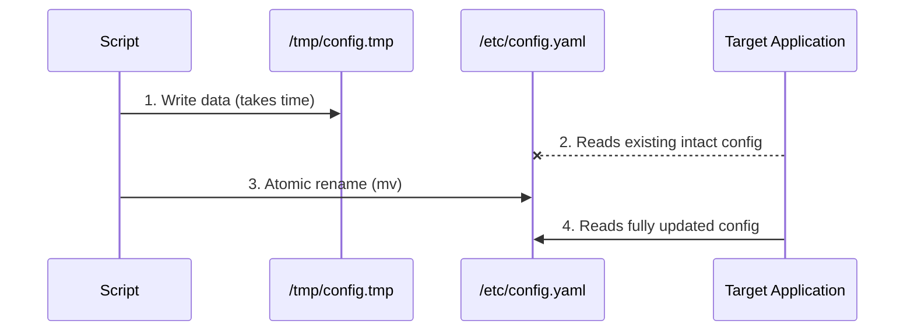
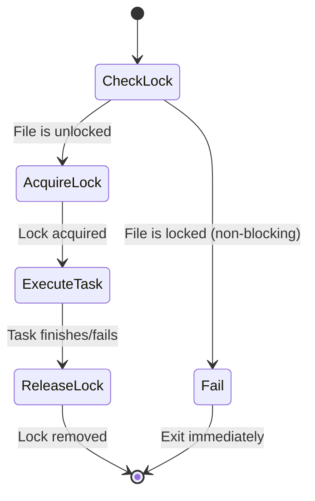

> **Shell Scripting** | Complexity: `[MEDIUM]` | Time: 25-30 min

## Prerequisites

Before starting this module:
- **Required**: [Module 7.1: Bash Fundamentals](../module-7.1-bash-fundamentals/)
- **Required**: [Module 7.2: Text Processing](../module-7.2-text-processing/)
- **Helpful**: Experience with operational tasks

---

## What You'll Be Able to Do

After this module, you will be able to:
- **Write** production-ready scripts with logging, error handling, and configuration
- **Automate** common sysadmin tasks (log rotation, health checks, deployment scripts)
- **Design** scripts that are idempotent (safe to run multiple times)
- **Test** scripts systematically with edge cases and validate output

---

## Why This Module Matters

Writing a script that works once is easy. Writing a script that works reliably in production is harder. This module covers patterns that make scripts maintainable, debuggable, and safe.

Understanding practical scripting helps you:

- **Write reliable automation** — Scripts that don't break at 3 AM
- **Debug issues faster** — Proper logging and error messages
- **Maintain scripts** — Code others (and future you) can understand
- **Handle edge cases** — Empty inputs, missing files, network failures

The difference between a hack and automation is error handling.

---

## Did You Know?

- **Most production scripts are under 100 lines** — Long scripts should be refactored into multiple scripts or a proper programming language.

- **ShellCheck finds 90% of bugs** — A static analysis tool that catches common Bash mistakes before you run the script.

- **Exit codes are contracts** — Returning the right exit code lets other scripts and tools (like systemd) know what happened.

- **Temporary files are dangerous** — Race conditions, leftover files, and security issues. Use `mktemp` and cleanup traps.

---

## Script Template

### Production-Ready Starter

```bash
#!/bin/bash
#
# Script: script-name.sh
# Description: Brief description of what this script does
# Usage: ./script-name.sh [options] <arguments>
#

set -euo pipefail

# === Configuration ===
readonly SCRIPT_NAME=$(basename "$0")
readonly SCRIPT_DIR=$(cd "$(dirname "$0")" && pwd)
readonly LOG_FILE="/var/log/${SCRIPT_NAME%.sh}.log"

# === Logging ===
log() {
    local level=$1
    shift
    local timestamp=$(date '+%Y-%m-%d %H:%M:%S')
    echo "[$timestamp] [$level] $*" | tee -a "$LOG_FILE"
}

log_info() { log "INFO" "$@"; }
log_warn() { log "WARN" "$@"; }
log_error() { log "ERROR" "$@" >&2; }

# === Error Handling ===
die() {
    log_error "$@"
    exit 1
}

# === Cleanup ===
cleanup() {
    local exit_code=$?
    # Add cleanup tasks here
    rm -f "${TEMP_FILE:-}"
    exit $exit_code
}
trap cleanup EXIT

# === Argument Parsing ===
usage() {
    cat << EOF
Usage: $SCRIPT_NAME [options] <argument>

Description:
    Brief description of what this script does.

Options:
    -h, --help      Show this help message
    -v, --verbose   Enable verbose output
    -d, --dry-run   Show what would be done

Arguments:
    argument        Description of required argument

Examples:
    $SCRIPT_NAME -v input.txt
    $SCRIPT_NAME --dry-run /path/to/file
EOF
    exit 0
}

# === Main Logic ===
main() {
    local verbose=false
    local dry_run=false

    # Parse arguments
    while [[ $# -gt 0 ]]; do
        case $1 in
            -h|--help) usage ;;
            -v|--verbose) verbose=true; shift ;;
            -d|--dry-run) dry_run=true; shift ;;
            -*) die "Unknown option: $1" ;;
            *) break ;;
        esac
    done

    # Validate arguments
    [[ $# -lt 1 ]] && die "Missing required argument. Use -h for help."

    local input=$1

    # Validate input
    [[ -f "$input" ]] || die "File not found: $input"

    # Do the work
    log_info "Processing: $input"
    if [[ "$dry_run" == true ]]; then
        log_info "Dry run - would process $input"
    else
        # Actual processing here
        log_info "Done"
    fi
}

main "$@"
```

---

## Error Handling Patterns

### Safe Mode

```bash
#!/bin/bash
set -euo pipefail

# -e: Exit on any error
# -u: Exit on undefined variable
# -o pipefail: Exit on pipe failure

# Sometimes you want to handle errors yourself
set +e  # Temporarily disable
command_that_might_fail
exit_code=$?
set -e  # Re-enable

if [[ $exit_code -ne 0 ]]; then
    echo "Command failed with $exit_code"
fi
```

> **Pause and predict**: What happens if you run `grep "error" log.txt | wc -l` and `log.txt` doesn't exist? How does `set -o pipefail` change the outcome?

### Knowledge Check
You are writing a deployment script that pipes a configuration file through `sed` and then applies it with `kubectl`. During a test run, the `sed` command fails due to a syntax error, but the script continues and applies an empty configuration, bringing down the application. Which bash setting would have prevented this, and how does it work?

<details>
<summary>Show Answer</summary>

Three separate options are typically combined as `set -euo pipefail` to prevent these exact scenarios.

- **`-e`** (errexit): Causes the script to exit immediately if any command returns a non-zero status.
- **`-u`** (nounset): Causes the script to exit if an undefined variable is referenced.
- **`-o pipefail`**: Ensures that a pipeline returns the exit code of the rightmost command that failed, rather than the last command in the chain.

**Why this matters**: By default, bash pipelines only evaluate the exit code of the final command in the chain. If `sed` fails but `kubectl` succeeds in applying the resulting empty input, the pipeline succeeds and the script continues. Using `set -o pipefail` ensures the script halts and reports the pipeline failure immediately, preventing destructive downstream actions from occurring.

</details>

### Trap for Cleanup

```bash
# Cleanup on exit, error, or interrupt
cleanup() {
    local exit_code=$?
    log "Cleaning up..."
    rm -f "$TEMP_FILE"
    [[ -d "$TEMP_DIR" ]] && rm -rf "$TEMP_DIR"
    exit $exit_code
}

trap cleanup EXIT       # Normal exit
trap cleanup ERR        # On error
trap cleanup INT TERM   # Ctrl+C, kill
```

### Knowledge Check
You wrote a script that creates a temporary directory using `TEMP_DIR=$(mktemp -d)` to process sensitive user data. At the very end of your script, you have the command `rm -rf "$TEMP_DIR"`. However, during execution, the script receives a `SIGINT` (Ctrl+C) from the user halfway through processing. What happens to the temporary directory, and how can you fix this architectural flaw?

<details>
<summary>Show Answer</summary>

The temporary directory and its sensitive contents will be permanently left on the disk. Because the script was interrupted before reaching the final `rm -rf` command, the cleanup logic was never executed.

**Why this matters**: Hardcoding cleanup commands at the end of a script assumes a flawless "happy path" execution that rarely exists in production environments. Scripts can fail due to syntax errors, user interruption via keyboard, or system-level termination signals. By utilizing `trap 'rm -rf "$TEMP_DIR"' EXIT`, you register a cleanup handler directly with the operating system that is guaranteed to execute on any exit condition. This ensures sensitive temporary data is reliably destroyed regardless of how or why the script terminates.

</details>

### Retry Logic

```bash
retry() {
    local max_attempts=$1
    local delay=$2
    shift 2
    local cmd="$@"

    local attempt=1
    while [[ $attempt -le $max_attempts ]]; do
        log_info "Attempt $attempt/$max_attempts: $cmd"
        if eval "$cmd"; then
            return 0
        fi
        log_warn "Failed, waiting ${delay}s..."
        sleep "$delay"
        ((attempt++))
    done

    log_error "All $max_attempts attempts failed"
    return 1
}

# Usage
retry 3 5 curl -s http://example.com/api
```

### Timeout

```bash
# Using timeout command
timeout 30 long_running_command

# Check result
if timeout 10 curl -s http://example.com > /dev/null; then
    echo "Success"
else
    echo "Timeout or failure"
fi

# Custom timeout with background process
run_with_timeout() {
    local timeout=$1
    shift
    "$@" &
    local pid=$!

    ( sleep "$timeout"; kill -9 $pid 2>/dev/null ) &
    local killer=$!

    wait $pid 2>/dev/null
    local result=$?

    kill $killer 2>/dev/null
    return $result
}
```

---

## Logging Patterns

### Structured Logging

```bash
# Log levels
LOG_LEVEL=${LOG_LEVEL:-INFO}

declare -A LOG_LEVELS=([DEBUG]=0 [INFO]=1 [WARN]=2 [ERROR]=3)

log() {
    local level=$1
    shift
    local level_num=${LOG_LEVELS[$level]:-1}
    local threshold=${LOG_LEVELS[$LOG_LEVEL]:-1}

    if [[ $level_num -ge $threshold ]]; then
        local timestamp=$(date '+%Y-%m-%d %H:%M:%S')
        printf '[%s] [%s] %s\n' "$timestamp" "$level" "$*"
    fi
}

# Usage
LOG_LEVEL=DEBUG
log DEBUG "Detailed info"
log INFO "Normal message"
log WARN "Warning!"
log ERROR "Error!"
```

### Log to File and Console

```bash
# Redirect all output to log file while keeping console
exec > >(tee -a "$LOG_FILE") 2>&1

# Or for specific commands
echo "This goes to console and log" | tee -a "$LOG_FILE"

# Errors to stderr and log
log_error() {
    echo "[ERROR] $*" | tee -a "$LOG_FILE" >&2
}
```

### Progress Indication

```bash
# Simple progress
for i in {1..100}; do
    printf "\rProgress: %d%%" "$i"
    sleep 0.1
done
echo

# Spinner
spin() {
    local pid=$1
    local chars="⠋⠙⠹⠸⠼⠴⠦⠧⠇⠏"
    local i=0
    while kill -0 "$pid" 2>/dev/null; do
        printf "\r${chars:i++%${#chars}:1} Working..."
        sleep 0.1
    done
    printf "\r"
}

long_command &
spin $!
wait
echo "Done!"
```

---

## Input Validation

### Argument Checking

```bash
# Required arguments
[[ $# -lt 2 ]] && die "Usage: $0 <source> <dest>"

# Validate file exists
validate_file() {
    local file=$1
    [[ -f "$file" ]] || die "Not a file: $file"
    [[ -r "$file" ]] || die "Cannot read: $file"
}

# Validate directory
validate_dir() {
    local dir=$1
    [[ -d "$dir" ]] || die "Not a directory: $dir"
    [[ -w "$dir" ]] || die "Cannot write to: $dir"
}

# Validate command exists
require_command() {
    local cmd=$1
    command -v "$cmd" &>/dev/null || die "Required command not found: $cmd"
}

require_command kubectl
require_command jq
```

### Input Sanitization

```bash
# Remove dangerous characters
sanitize() {
    local input=$1
    # Remove everything except alphanumeric, dash, underscore, dot
    echo "${input//[^a-zA-Z0-9._-]/}"
}

# Validate is number
is_number() {
    [[ $1 =~ ^[0-9]+$ ]]
}

# Validate IP address
is_ip() {
    [[ $1 =~ ^[0-9]{1,3}\.[0-9]{1,3}\.[0-9]{1,3}\.[0-9]{1,3}$ ]]
}

# Safe default
port=${1:-8080}
is_number "$port" || die "Invalid port: $port"
```

---

## File Handling

### Safe Temporary Files

```bash
# Create temp file
TEMP_FILE=$(mktemp)
trap 'rm -f "$TEMP_FILE"' EXIT

# Create temp directory
TEMP_DIR=$(mktemp -d)
trap 'rm -rf "$TEMP_DIR"' EXIT

# With prefix
TEMP_FILE=$(mktemp /tmp/myscript.XXXXXX)

# Never do this (race condition, predictable)
# TEMP_FILE=/tmp/myscript.tmp  # BAD!
```

### Knowledge Check
A junior engineer submits a pull request with a script that processes daily backups. Inside the script, they define a temporary file using `TEMP_FILE=/tmp/backup-processing.tmp`. You immediately reject the PR and request they use `mktemp` instead. What specific production risks does their hardcoded path introduce?

<details>
<summary>Show Answer</summary>

A hardcoded path in a world-writable directory like `/tmp` introduces severe security and reliability flaws into your infrastructure.

**Why this matters**: First, it creates a massive race condition where two concurrent instances of the script will overwrite each other's data, silently corrupting the process. Second, it exposes the system to symlink attacks; a malicious local user could pre-create a symlink at `/tmp/backup-processing.tmp` pointing to a critical file like `/etc/shadow`, tricking your script into overwriting it. Utilizing `TEMP_FILE=$(mktemp)` delegates the file creation to the operating system, which guarantees a unique, unpredictable filename and sets secure default permissions to prevent unauthorized access.

</details>

### Atomic File Operations

Writing directly to a configuration file can cause partial reads if another service loads the file before the write finishes. We prevent this using atomic writes.



> **War Story**: In 2018, a major SaaS provider had a cronjob that rebuilt their HAProxy configuration every minute using `cat new_config > /etc/haproxy/haproxy.cfg`. Once, the script ran out of memory halfway through the `cat` command. HAProxy automatically reloaded the half-empty configuration file, causing a global load balancer outage that took 45 minutes to resolve. If they had written to a temporary file and used `mv`, the partial file would never have been loaded.

```bash
# Atomic write (write to temp, then move)
atomic_write() {
    local dest=$1
    local temp=$(mktemp "${dest}.XXXXXX")

    cat > "$temp"  # Write stdin to temp

    chmod --reference="$dest" "$temp" 2>/dev/null || chmod 644 "$temp"
    mv "$temp" "$dest"  # Atomic rename
}

# Usage
generate_config | atomic_write /etc/app/config.yaml
```

### Knowledge Check
Your script is responsible for dynamically updating `/etc/nginx/conf.d/upstream.conf` every 10 seconds. Nginx reloads this file frequently. You initially use `echo "server 10.0.0.5;" > /etc/nginx/conf.d/upstream.conf`, but occasionally Nginx crashes complaining about unexpected end of file. How can you update the configuration file without Nginx ever reading a partially written state?

<details>
<summary>Show Answer</summary>

You must use an atomic write pattern by writing the new configuration to a temporary file first, and then renaming it over the active configuration file using the `mv` command.

**Why this matters**: Standard output redirection using `>` or tools like `cat` write data sequentially, meaning there is a fraction of a second where the configuration file exists in an incomplete state. If Nginx reloads the file during this exact microscopic window, it processes truncated syntax and immediately crashes. The `mv` command, when utilized on the same filesystem, executes a `rename` system call which the Linux kernel guarantees is an atomic operation. Consequently, Nginx will either see the old configuration or the fully written new configuration, entirely eliminating the possibility of reading a partial state.

</details>

### File Locking

Think of file locking like the key to a single-occupancy restroom at a gas station. Only one process can hold the lock at a time. If another process tries to enter the locked section, it must either wait (blocking) or walk away entirely (non-blocking).



```bash
# Lock file for single instance
LOCK_FILE="/var/run/${SCRIPT_NAME}.lock"

acquire_lock() {
    exec 9>"$LOCK_FILE"
    if ! flock -n 9; then
        die "Another instance is running"
    fi
}

release_lock() {
    flock -u 9
    rm -f "$LOCK_FILE"
}

trap release_lock EXIT
acquire_lock
```

### Knowledge Check
You have a synchronization script scheduled to run via cron every minute. Usually, it takes 10 seconds to complete. However, when the network is slow, it can take up to 5 minutes, causing multiple cron executions to stack up and eventually crash the server due to high memory usage. How can you modify the script to ensure a new instance immediately exits if another instance is already running?

<details>
<summary>Show Answer</summary>

You should implement robust file locking using the `flock` command to ensure strict mutual exclusion between concurrent script executions.

**Why this matters**: Relying on cron execution timings or checking for existing process IDs using `ps` introduces inherent race conditions, as two script instances might check the process table at the exact same millisecond and both decide to proceed. `flock` leverages kernel-level file locks that are fundamentally race-free by design. By opening a file descriptor to a lock file and using `flock -n` for non-blocking mode, the kernel mathematically guarantees only a single instance acquires the lock. If a subsequent instance attempts acquisition, the command instantly fails, allowing your script to exit cleanly before stacking up and causing a resource bottleneck.

</details>

---

## Designing for Idempotency

Idempotency is the property of an operation that can be applied multiple times without changing the result beyond the initial application. In scripting, this means your script should be safe to run again if it fails halfway through.

### Unsafe vs. Idempotent Operations

**Not Idempotent (Fails or duplicates on second run):**
```bash
mkdir /app/config
useradd nginx
echo "export ENV=prod" >> /etc/environment
```

**Idempotent (Safe to run repeatedly):**
```bash
mkdir -p /app/config

if ! id -u nginx >/dev/null 2>&1; then
    useradd nginx
fi

if ! grep -q "^export ENV=prod" /etc/environment; then
    echo "export ENV=prod" >> /etc/environment
fi
```

> **Stop and think**: If your deployment script crashes on step 4 of 10, and you run it again, what happens if steps 1-3 were not written idempotently?

---

## Automating Health Checks

Health checks are automated scripts that verify system state. They should be binary (pass/fail) and output clear diagnostic information when they fail.

> **Stop and think**: Why should health checks return standard exit codes (0 for success, non-zero for failure) rather than just printing "Healthy" or "Failed"?

### Endpoint Health Check
```bash
check_endpoint() {
    local url=$1
    local expected_status=${2:-200}
    
    local status
    status=$(curl -s -o /dev/null -w "%{http_code}" "$url")
    
    if [[ "$status" != "$expected_status" ]]; then
        log_error "Endpoint $url returned $status (expected $expected_status)"
        return 1
    fi
    log_info "Endpoint $url is healthy"
    return 0
}
```

### Disk Space Health Check
```bash
check_disk_space() {
    local threshold_percent=$1
    local mount_point=$2
    
    local usage
    usage=$(df -h "$mount_point" | awk 'NR==2 {print $5}' | sed 's/%//')
    
    if [[ "$usage" -gt "$threshold_percent" ]]; then
        log_error "Disk usage on $mount_point is at ${usage}% (threshold: ${threshold_percent}%)"
        return 1
    fi
    return 0
}
```

---

## Common Patterns

### Confirm Before Action

```bash
confirm() {
    local prompt=${1:-"Continue?"}
    read -rp "$prompt [y/N] " response
    [[ "$response" =~ ^[yY]$ ]]
}

# Usage
if confirm "Delete all files?"; then
    rm -rf /path/to/files
fi

# With default yes
confirm_yes() {
    local prompt=${1:-"Continue?"}
    read -rp "$prompt [Y/n] " response
    [[ ! "$response" =~ ^[nN]$ ]]
}
```

### Dry Run Mode

```bash
DRY_RUN=${DRY_RUN:-false}

run() {
    if [[ "$DRY_RUN" == true ]]; then
        echo "[DRY RUN] $*"
    else
        "$@"
    fi
}

# Usage
run rm -f /tmp/file
run kubectl delete pod nginx
```

### Parallel Execution

```bash
# Process files in parallel
process_parallel() {
    local max_jobs=$1
    shift

    local pids=()
    for item in "$@"; do
        process_item "$item" &
        pids+=($!)

        if [[ ${#pids[@]} -ge $max_jobs ]]; then
            wait -n  # Wait for any job to finish
            pids=($(jobs -rp))  # Update running pids
        fi
    done
    wait  # Wait for remaining
}

# Usage
process_parallel 4 file1 file2 file3 file4 file5
```

---

## Common Mistakes

| Mistake | Problem | Solution |
|---------|---------|----------|
| No shebang | Script might run with wrong shell | Always `#!/bin/bash` |
| Unquoted variables | Breaks on spaces | Always `"$var"` |
| No `set -e` | Errors ignored | Use `set -euo pipefail` |
| Hardcoded paths | Not portable | Use variables, find paths |
| No cleanup | Temp files left behind | Use trap EXIT |
| Parsing ls output | Breaks on special filenames | Use globs or find |

---

## Quiz

### Question 1
You are building a deployment script that needs to append an application database URL to `/etc/environment` and then restart a background service. During the first run, the service restart fails due to a syntax error in your systemd unit, but the database URL is successfully appended. You fix the unit file and run the script again. What will happen if the script is not idempotent?

<details>
<summary>Show Answer</summary>

The database URL will be appended a second time to `/etc/environment`. If your script uses a standard `echo "DB_URL=..." >> /etc/environment`, every subsequent run will add duplicate lines. This can lead to configuration file bloat, unexpected behavior if values conflict, or outright parsing errors.

**Why this matters**: Production scripts must be designed with the assumption that they will fail halfway through execution. To make this operation idempotent, you must check for the existence of the configuration line before appending it:
```bash
if ! grep -q "^DB_URL=" /etc/environment; then
    echo "DB_URL=..." >> /etc/environment
fi
```
By implementing this check, you guarantee that the script can be safely re-run an infinite number of times without degrading the system state. Alternatively, using tools like `sed` allows you to safely replace the value if the key already exists.

</details>

### Question 2
You are writing a critical automated backup script that compresses `/var/www` and copies the archive to a mounted NFS drive at `/mnt/backups`. What specific edge cases must you systematically test to ensure this script won't fail silently or cause damage in production?

<details>
<summary>Show Answer</summary>

You must systematically test the following edge cases:
1. **Missing source:** What happens if `/var/www` doesn't exist? (The script should fail fast and alert).
2. **Unmounted destination:** What happens if the NFS drive drops and `/mnt/backups` is just an empty local directory? (The script might fill up the local root partition).
3. **Full destination disk:** What happens if there is no space left on the NFS drive? (The script must trap the failure and clean up the partially written archive).
4. **Permission denial:** Does the script run as a user with read access to all files inside `/var/www`?

**Why this matters**: A silent failure in a backup script is catastrophic because you only discover the bug months later when you need to restore data during an emergency. Validating inputs, testing bounds, and handling external system failures ensures your automation reports issues proactively rather than failing invisibly. Without these rigorous checks, administrators operate under a dangerous false sense of security, assuming critical data is safe when it is actually unrecoverable.

</details>

---

## Hands-On Exercise

### Building a Practical Script

**Objective**: Create a production-quality script using patterns from this module.

**Environment**: Any Linux system with Bash

#### Build: Log Analyzer Script

```bash
cat > /tmp/log-analyzer.sh << 'SCRIPT'
#!/bin/bash
#
# Script: log-analyzer.sh
# Description: Analyze log files and report statistics
# Usage: ./log-analyzer.sh [-v] [-n TOP] <logfile>
#

set -euo pipefail

# === Configuration ===
readonly SCRIPT_NAME=$(basename "$0")
readonly VERSION="1.0.0"

# === Defaults ===
VERBOSE=false
TOP_COUNT=10

# === Logging ===
log_info() { echo "[INFO] $*"; }
log_debug() { [[ "$VERBOSE" == true ]] && echo "[DEBUG] $*" || true; }
log_error() { echo "[ERROR] $*" >&2; }

# === Error Handling ===
die() {
    log_error "$@"
    exit 1
}

# === Usage ===
usage() {
    cat << EOF
Usage: $SCRIPT_NAME [options] <logfile>

Analyze log files and report statistics.

Options:
    -h, --help      Show this help message
    -v, --verbose   Enable verbose output
    -n, --top NUM   Show top N results (default: 10)
    --version       Show version

Examples:
    $SCRIPT_NAME /var/log/syslog
    $SCRIPT_NAME -v -n 5 app.log
EOF
    exit 0
}

# === Functions ===
count_by_field() {
    local file=$1
    local field=$2
    log_debug "Counting by field $field"
    awk "{print \$$field}" "$file" | sort | uniq -c | sort -rn | head -n "$TOP_COUNT"
}

analyze_log() {
    local file=$1

    log_info "Analyzing: $file"
    echo

    # Basic stats
    local total_lines=$(wc -l < "$file")
    echo "Total lines: $total_lines"
    echo

    # If it looks like a syslog/access log
    if head -1 "$file" | grep -qE '^[A-Z][a-z]{2} [0-9]|^[0-9]{4}-[0-9]{2}'; then
        echo "=== Log Level Distribution ==="
        grep -oE '(INFO|DEBUG|WARN|WARNING|ERROR|FATAL)' "$file" 2>/dev/null | \
            sort | uniq -c | sort -rn || echo "No log levels found"
        echo
    fi

    # Word frequency
    echo "=== Most Common Words ==="
    tr -cs 'A-Za-z' '\n' < "$file" | \
        tr '[:upper:]' '[:lower:]' | \
        sort | uniq -c | sort -rn | head -n "$TOP_COUNT"
    echo

    log_info "Analysis complete"
}

# === Main ===
main() {
    # Parse arguments
    while [[ $# -gt 0 ]]; do
        case $1 in
            -h|--help) usage ;;
            --version) echo "$SCRIPT_NAME $VERSION"; exit 0 ;;
            -v|--verbose) VERBOSE=true; shift ;;
            -n|--top)
                [[ -n "${2:-}" ]] || die "Missing value for $1"
                TOP_COUNT=$2
                shift 2
                ;;
            -*) die "Unknown option: $1. Use -h for help." ;;
            *) break ;;
        esac
    done

    # Validate arguments
    [[ $# -lt 1 ]] && die "Missing log file. Use -h for help."

    local logfile=$1

    # Validate input
    [[ -f "$logfile" ]] || die "File not found: $logfile"
    [[ -r "$logfile" ]] || die "Cannot read: $logfile"
    [[ -s "$logfile" ]] || die "File is empty: $logfile"

    log_debug "TOP_COUNT=$TOP_COUNT"
    log_debug "VERBOSE=$VERBOSE"

    analyze_log "$logfile"
}

main "$@"
SCRIPT

chmod +x /tmp/log-analyzer.sh
```

#### Test the Script

```bash
# Create test log
cat > /tmp/test.log << 'EOF'
2024-01-15 10:00:00 INFO Application started
2024-01-15 10:00:01 DEBUG Loading configuration
2024-01-15 10:00:02 INFO Connected to database
2024-01-15 10:00:03 WARNING Slow query detected
2024-01-15 10:00:04 ERROR Connection timeout
2024-01-15 10:00:05 INFO Retrying connection
2024-01-15 10:00:06 DEBUG Cache miss
2024-01-15 10:00:07 INFO Connection established
2024-01-15 10:00:08 ERROR Authentication failed
2024-01-15 10:00:09 WARN Rate limit exceeded
2024-01-15 10:00:10 INFO Request processed successfully
EOF

# Test runs
/tmp/log-analyzer.sh --help
/tmp/log-analyzer.sh --version
/tmp/log-analyzer.sh /tmp/test.log
/tmp/log-analyzer.sh -v -n 5 /tmp/test.log

# Test error handling
/tmp/log-analyzer.sh /nonexistent 2>&1 || true
/tmp/log-analyzer.sh --invalid 2>&1 || true
```

#### Extend the Script

```bash
# Add these features:
# 1. Output format option (text/json)
# 2. Date range filtering
# 3. Error-only mode

# Example addition for error-only:
# Add to argument parsing:
#   -e|--errors) ERRORS_ONLY=true; shift ;;

# Add to analyze_log:
#   if [[ "$ERRORS_ONLY" == true ]]; then
#       grep -E "ERROR|FATAL" "$file"
#       return
#   fi
```

### Success Criteria

- [ ] Script uses `set -euo pipefail`
- [ ] Has proper argument parsing with help
- [ ] Validates input files
- [ ] Has logging functions
- [ ] Handles errors gracefully
- [ ] Runs without errors on valid input

---

## Key Takeaways

1. **Start with `set -euo pipefail`** — Catch errors early

2. **Use traps for cleanup** — Always clean up temp files

3. **Validate all inputs** — Don't trust arguments or files

4. **Log meaningfully** — Future debugging depends on it

5. **Dry-run mode is essential** — Test safely before executing

---

## What's Next?

In **Module 7.4: DevOps Automation**, you'll apply these patterns to real operational tasks—kubectl wrappers, deployment scripts, and CI/CD automation.

---

## Further Reading

- [ShellCheck](https://www.shellcheck.net/) — Lint your scripts
- [Bash Strict Mode](http://redsymbol.net/articles/unofficial-bash-strict-mode/)
- [Google Shell Style Guide](https://google.github.io/styleguide/shellguide.html)
- [Pure Bash Bible](https://github.com/dylanaraps/pure-bash-bible)