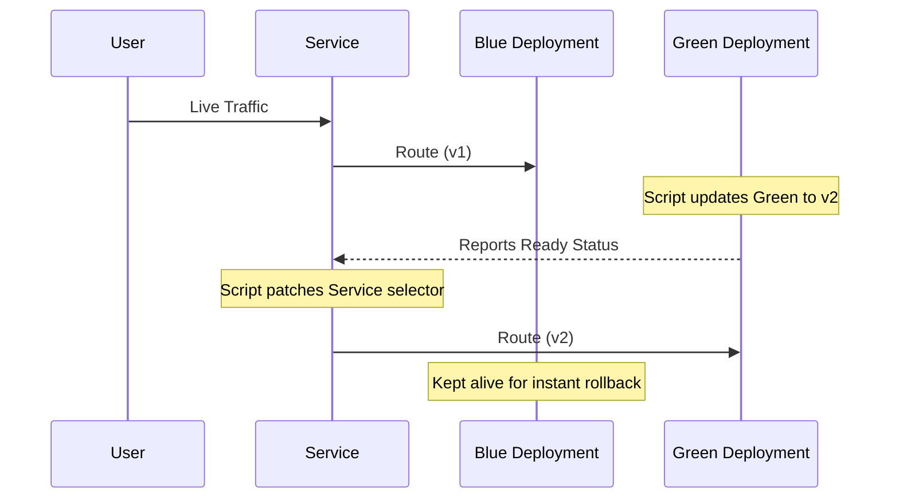

# Module 7.4: DevOps Automation

> **Shell Scripting** | Complexity: `[MEDIUM]` | Time: 30-35 min | Kubernetes: 1.35+

## Prerequisites

Before starting this module, you must have completed the following:

- **Required**: [Module 7.3: Practical Scripts](../module-7.3-practical-scripts/)
- **Required**: Fundamental understanding of Kubernetes architecture and the `kubectl` command-line tool.
- **Helpful**: Previous exposure to continuous integration and continuous deployment paradigms.

In this module, `kubectl` remains visible inside the protected legacy scripts because those examples are meant to run as standalone files on any workstation. For interactive discussion, define the common shortcut with `alias k=kubectl`, then read commands such as `k get`, `k logs`, and `k rollout status` as the same Kubernetes client calls written in shorter form.

## Learning Outcomes

After completing this module, you will be able to:

- **Design** idempotent deployment automation that records state, waits for rollout health, and rolls back failures.
- **Implement** Kubernetes data extraction pipelines using JSONPath, `jq`, labels, and safe namespace parameters.
- **Diagnose** distributed incidents by aggregating logs, filtering error patterns, and comparing resource signals.
- **Evaluate** shell script safeguards including strict mode, dry-run branches, timeouts, and destructive command boundaries.
- **Compare** external shell automation with in-cluster controllers, CI/CD jobs, and GitOps workflows.

## Why This Module Matters

On August 1, 2012, Knight Capital Group deployed new trading software into production using a process that still depended on a technician copying files across eight production servers. Seven servers received the update, one server did not, and the old code path on the missed machine began sending unintended orders when the market opened. In about 45 minutes, the firm accumulated a pre-tax loss of 460 million dollars, sought emergency financing the next day, and became a lasting example of how partial automation can be more dangerous than honest manual work.

The important lesson is not that shell scripts magically prevent incidents. A bad script can repeat a mistake faster than a person can type it, and a script without state checks can create a clean-looking audit trail while the platform is already broken. The lesson is that well-designed automation turns an operational procedure into something reviewable, repeatable, and testable. If the Knight deployment had required every server to report the expected version before trading traffic resumed, the missing machine would have been detected before the financial blast radius expanded.

DevOps automation sits in the middle of several systems that do not naturally share a language: a Git repository, a CI runner, a container registry, the Kubernetes API, an incident chat room, and the engineer's terminal during an emergency. Shell remains the connective tissue because it can call each system with small, composable commands. Your job is to make that tissue strong enough for production by treating every script as an operational control surface, not as a bag of shortcuts copied from a runbook.

## Automation Starts With State, Not Commands

The first mistake many engineers make is writing the command they want to run before deciding what state they need to observe. A deployment script is not mainly a wrapper around `k set image`; it is a small decision engine that asks what is running now, whether the desired change is necessary, whether the cluster accepts the change, and whether the new workload becomes healthy. State-first thinking also makes read-only automation more useful, because diagnostic scripts can gather the same evidence every time instead of relying on whoever is holding the incident keyboard.

Kubernetes is especially automation-friendly because the API can return structured objects instead of terminal tables. The table you see from `k get pods` is useful for a person scanning a screen, but it is a poor contract for a script because columns change, whitespace varies, and human display choices hide fields. JSON, YAML, JSONPath, custom columns, and resource names give you more explicit contracts. Before running the examples, pause and predict which format you would choose if the next command needs only pod identifiers and which format you would choose if it needs nested container images.

```bash
# JSON for full data
kubectl get pods -o json

# JSONPath for specific fields
kubectl get pods -o jsonpath='{.items[*].metadata.name}'

# Custom columns
kubectl get pods -o custom-columns='NAME:.metadata.name,STATUS:.status.phase'

# YAML for config
kubectl get deployment nginx -o yaml

# Name only
kubectl get pods -o name
# pod/nginx-abc123
```

The `-o name` form is compact and stable when a following command accepts resource-qualified names such as `pod/nginx-abc123`. JSONPath is better when the next step expects raw values without the resource type prefix, while custom columns are useful when you need a small human-readable report without committing to full JSON processing. The choice is less about taste than about the next consumer of the data. Good automation reads like a series of contracts between commands, and every formatting flag should make one of those contracts clearer.

```bash
# Using -o name
kubectl get pods -n default -o name
# pod/nginx-abc123
# pod/redis-def456

# Using jsonpath
kubectl get pods -n default -o jsonpath='{.items[*].metadata.name}'
# nginx-abc123 redis-def456

# Using custom-columns
kubectl get pods -n default -o custom-columns=':metadata.name' --no-headers
# nginx-abc123
# redis-def456
```

As scripts become more serious, you also need to decide when Kubernetes-native selection is enough and when to hand the document to a real JSON processor. Field selectors and labels should be your first filter because the API server can do that work before returning data. JSONPath is excellent for extracting a narrow field from a known structure. `jq` becomes the better tool when your script must test optional fields, flatten arrays, group values, calculate counts, or produce a report whose shape differs from the input document.

```bash
# Get all pod names
kubectl get pods -o jsonpath='{.items[*].metadata.name}' | tr ' ' '\n'

# Get images used
kubectl get pods -o jsonpath='{.items[*].spec.containers[*].image}' | tr ' ' '\n' | sort -u

# Get pods not Running
kubectl get pods --field-selector='status.phase!=Running'

# Get pods by label
kubectl get pods -l app=nginx -o name

# Watch for changes
kubectl get pods -w

# Wait for condition
kubectl wait --for=condition=Ready pod -l app=nginx --timeout=60s
```

Pause and predict: if a script executes a Kubernetes read that fails to find a resource, what happens by default when strict mode is absent? Bash normally records the non-zero exit code and continues unless the failing command is explicitly tested or the shell has been told to stop. That means a missing Deployment can become an empty variable, and an empty variable can become a broad command that targets more resources than intended. This is why data extraction and error handling must be designed together.

```bash
kubectl get pods -o jsonpath='{.items[*].metadata.name}'
```

```bash
kubectl get pods -o json | jq -r '.items[].metadata.name'
```

Parameter handling is the next boundary between a useful script and a dangerous one. Hardcoded namespaces, deployment names, and registry prefixes feel convenient during development because they reduce typing, but they smuggle environmental assumptions into code that will eventually be reused somewhere else. A professional automation script makes the target environment explicit, validates required arguments, and chooses defaults that are safe rather than merely convenient. Think of the argument parser as the front door of the tool; it should prevent confused users from walking directly into production changes.

```bash
#!/bin/bash
namespace=${1:-default}

kubectl get pods -n "$namespace"
```

The positional-argument version is acceptable for tiny local helpers because the input shape is obvious and the consequence is read-only. Once a script can mutate workloads, named flags are worth the extra lines because they make command history readable and reduce positional mistakes. A command like `deploy-helper web nginx:1.35 -n staging --dry-run` communicates intent more clearly than a list of bare values. It is also easier to extend later without breaking every user who already depends on the script.

```bash
while [[ $# -gt 0 ]]; do
    case $1 in
        -n|--namespace) namespace=$2; shift 2 ;;
        *) break ;;
    esac
done
namespace=${namespace:-default}

kubectl get pods -n "$namespace"
```

The same state-first habit applies outside Kubernetes. A container build script should know the application name, registry, version, and dirty Git state before it builds. A backup script should know which namespace it is exporting and where the files will land before it reads secrets. An incident script should know the search window and label selector before it starts pulling logs. When those inputs are explicit, the script can print them before doing work, which gives both humans and CI logs a clear record of what was actually attempted.

Idempotence is the practical test for whether the script is modeling state or merely replaying commands. If running the script twice creates two conflicting resources, publishes two different artifacts for the same source, or deletes something that the first run already handled, the script is not safe enough for routine automation. Idempotence does not mean every command is harmless. It means the script can observe the current world, compare it with the desired world, and choose a no-op when there is nothing left to change.

This is why mature scripts often have an early "plan" phase even when they are written in Bash. The plan phase resolves inputs, reads the current state, prints a summary, and exits before mutation when a dry-run flag is present. That structure feels heavier than a command alias, but it pays for itself the first time someone reviews a CI log during an incident. The reviewer can see the intended namespace, resource names, image tag, and decision path without reconstructing the script from memory.

## Health Automation As Diagnostic Equipment

Operational automation should collect evidence before it attempts repair. During an incident, people often ask broad questions such as "is the cluster healthy?" or "is the app down everywhere?" A good script translates those questions into concrete API reads: node conditions, pod phases, ready replica counts, service endpoints, resource usage, and recent error logs. The point is not to replace judgment; the point is to remove the slow, repetitive search steps so the engineer can spend attention on interpreting the results.

Nodes are the foundation under every workload, so a health script must examine more than the single word `Ready`. A node can be present while reporting memory pressure, disk pressure, PID pressure, or network unavailability. Those condition fields are separate because they represent different failure modes with different fixes. Memory pressure may require eviction analysis, disk pressure may require image cleanup, and network unavailability may point to the CNI layer. A script that collapses all of those into one generic failure hides the diagnosis it is supposed to accelerate.

```bash
#!/bin/bash
set -euo pipefail

check_nodes() {
    echo "=== Node Status ==="
    kubectl get nodes

    echo ""
    echo "=== Node Conditions ==="
    local issues=$(kubectl get nodes -o json | jq -r '
        .items[] |
        select(.status.conditions[] | select(.type != "Ready" and .status == "True")) |
        "WARNING: \(.metadata.name) has issues"
    ')
    
    if [[ -z "$issues" ]]; then
        echo "All nodes reporting healthy conditions"
    else
        echo "$issues"
    fi

    echo "=== Resource Usage ==="
    kubectl top nodes 2>/dev/null || echo "Metrics server not available"

    # Check for NotReady nodes
    local not_ready=$(kubectl get nodes --no-headers | awk '$2 != "Ready" {print $1}')
    if [[ -n "$not_ready" ]]; then
        echo ""
        echo "WARNING: NotReady nodes: $not_ready"
        return 1
    fi
}

check_nodes
```

That script intentionally treats metrics as optional while treating NotReady nodes as a failure. This distinction matters because many local clusters and newly created environments do not have Metrics Server installed, so a missing `k top` result should not automatically mean the cluster is broken. In contrast, a NotReady node changes scheduling and availability expectations immediately. The script's return code should communicate the difference between missing observability and an unhealthy control surface, because CI jobs and incident wrappers will react to that return code.

Workload health needs a different lens because individual pods can be replaced as part of normal controller behavior. A single completed Job pod is not a problem, and a pod that is briefly Pending during a scale-up might be expected. A pattern of CrashLoopBackOff, ImagePullBackOff, or widespread non-running pods is different because it suggests a systemic issue with configuration, registry access, scheduling capacity, or application startup. The useful script gives an aggregate summary first, then enough detail to guide the next command.

```bash
#!/bin/bash
set -euo pipefail

check_pods() {
    local namespace=${1:---all-namespaces}

    echo "Checking pod health..."

    # Count by status
    echo "=== Pod Status Summary ==="
    kubectl get pods $namespace --no-headers | awk '{print $3}' | sort | uniq -c | sort -rn

    # List non-running pods
    local unhealthy=$(kubectl get pods $namespace --no-headers | awk '$3 != "Running" && $3 != "Completed" {print $1}')

    if [[ -n "$unhealthy" ]]; then
        echo ""
        echo "=== Unhealthy Pods ==="
        kubectl get pods $namespace | grep -E "^NAME|$(echo $unhealthy | tr ' ' '|')"
        return 1
    fi

    echo ""
    echo "All pods healthy!"
    return 0
}

check_pods "$@"
```

Notice the tradeoff in the pod script: it uses table output and `awk`, which is fast and readable for a simple phase summary, but less robust than JSON when fields become more complex. That is acceptable for a short diagnostic helper because pod phase appears in a stable column and the script is not making destructive decisions. If you later reuse the same logic to delete pods or trigger rollbacks, convert the selection to JSON or field selectors so the action is based on structured data rather than display formatting.

Services create another diagnostic layer because running pods do not guarantee reachable application traffic. A Service may exist without endpoints if labels do not match, readiness probes keep pods out of service, or the selector points at an old version. That failure mode is common during blue-green deployments, where changing a selector is the moment traffic shifts. Before blaming DNS or the network, the script should confirm that the Service object exists, that endpoints are populated, and that the selected port is the one the application expects.

```bash
#!/bin/bash
set -euo pipefail

check_service() {
    local service=$1
    local namespace=${2:-default}

    echo "Checking service: $service in namespace: $namespace"

    # Service exists?
    kubectl get svc "$service" -n "$namespace" > /dev/null 2>&1 || {
        echo "ERROR: Service not found"
        return 1
    }

    # Has endpoints?
    local endpoints=$(kubectl get endpoints "$service" -n "$namespace" -o jsonpath='{.subsets[*].addresses[*].ip}')

    if [[ -z "$endpoints" ]]; then
        echo "ERROR: No endpoints for service"
        kubectl get endpoints "$service" -n "$namespace"
        return 1
    fi

    echo "Endpoints: $endpoints"

    # Try to connect (from inside cluster)
    local cluster_ip=$(kubectl get svc "$service" -n "$namespace" -o jsonpath='{.spec.clusterIP}')
    local port=$(kubectl get svc "$service" -n "$namespace" -o jsonpath='{.spec.ports[0].port}')

    echo "ClusterIP: $cluster_ip:$port"
    echo "Service appears healthy"
}

check_service "$@"
```

Capacity reports are less dramatic than incident scripts, but they prevent many incidents before they start. A recurring report that captures node usage, pod usage, replica counts, and persistent volume claims gives teams a shared baseline. Without that baseline, people discover resource drift only when a rollout stalls or a node begins evicting pods. With it, you can compare today's cluster shape with last week's shape and spot deployments that grew memory demand, storage pressure, or replica count without an architecture review.

```bash
#!/bin/bash
set -euo pipefail

resource_report() {
    local namespace=${1:---all-namespaces}

    echo "=== Resource Report ==="
    echo "Generated: $(date)"
    echo ""

    echo "=== Node Resources ==="
    kubectl top nodes 2>/dev/null || echo "Metrics unavailable"
    echo ""

    echo "=== Pod Resources ==="
    kubectl top pods $namespace 2>/dev/null | head -n 20 || echo "Metrics unavailable"
    echo ""

    echo "=== Deployments ==="
    kubectl get deployments $namespace --no-headers | \
        awk '{printf "%-40s %s/%s\n", $1, $2, $3}'
    echo ""

    echo "=== PVCs ==="
    kubectl get pvc $namespace --no-headers | \
        awk '{printf "%-40s %-10s %s\n", $1, $4, $3}'
}

resource_report "$@"
```

A practical war story illustrates why these small checks matter. A platform team once spent an hour investigating an intermittent checkout outage because every application pod looked Running when viewed one namespace at a time. A scripted report made the pattern obvious: the affected pods were spread across two nodes that had recently crossed disk-pressure thresholds, and image garbage collection was constantly competing with fresh pulls. The fix was not in the application at all. The value of the script was that it compared signals across layers instead of staring at one pod.

Health automation also changes team behavior because it makes evidence cheap. When evidence is expensive, people argue from memory, screenshots, and the last command they happened to run. When evidence is cheap, the team can ask better questions: which namespaces have the same symptom, whether the unhealthy pods share a node, whether Services lost endpoints before or after a rollout, and whether resource pressure appeared before errors increased. The script does not answer every question, but it creates a dependable starting dataset.

Be careful not to turn health scripts into automatic repair scripts too quickly. Detection has a lower blast radius than remediation, and the confidence threshold should be different. It is reasonable for a script to report all non-running pods across a cluster. It is much more dangerous for the same script to delete or restart them without considering Jobs, planned maintenance, StatefulSets, and application-specific recovery rules. Treat the diagnostic script as the instrument panel, then add repair actions only when the decision logic is well understood.

## Safe Deployments Are Conversations With The Cluster

A deployment command changes desired state; it does not prove that the new state is serving users. Kubernetes controllers work asynchronously, so the API server may accept an image update while the Deployment later fails because a probe is wrong, an image cannot be pulled, or a new container crashes immediately. Safe automation treats a rollout as a conversation: request the change, wait for the controller to report progress, inspect the outcome, and choose whether to continue, retry, or roll back. A script that exits immediately after `k set image` ends the conversation too early.

```bash
kubectl rollout status deployment/nginx --timeout=5m
```

Native wait conditions are better than arbitrary sleeps because they wait for evidence rather than time. `sleep 60` assumes the cluster, registry, scheduler, image size, and node capacity will behave like the last successful run. `k rollout status` and `k wait` ask the API for a condition and fail when the condition does not arrive within a bounded timeout. Before running this in a real pipeline, what output do you expect if the new pods never become Ready because a readiness probe points at the wrong path?

```bash
kubectl wait --for=condition=Available deployment/nginx --timeout=300s
```

```bash
kubectl wait --for=condition=Ready pod -l app=nginx --timeout=60s
```

The timeout is not a cosmetic flag. Without it, a CI runner can wait indefinitely, holding locks, blocking later deploys, and making the failure harder to see. With it, the script has a defined decision point. That decision might be rollback, alerting, opening an incident, or simply returning a non-zero exit code so the pipeline stops before running database migrations against an unhealthy application version.

```bash
# Update image
kubectl set image deployment/myapp myapp=myapp:v2

# Wait for rollout
if ! kubectl rollout status deployment/myapp --timeout=5m; then
    echo "Rollout failed, rolling back"
    kubectl rollout undo deployment/myapp
    exit 1
fi
```

Rollback logic should be explicit rather than implied by a pipeline platform. Many CI systems can mark a job failed, but they do not know which Kubernetes object should be restored, which namespace was targeted, or whether the previous ReplicaSet is still safe. The script knows that context because it just performed the change. That makes it the right place to connect failed rollout evidence with `rollout undo`, then wait again so the operator knows whether recovery actually completed.

```bash
#!/bin/bash
set -euo pipefail

deploy() {
    local image=$1
    local deployment=${2:-app}
    local namespace=${3:-default}

    echo "Deploying $image to $deployment in $namespace"

    # Record current image for rollback
    local current_image=$(kubectl get deployment "$deployment" -n "$namespace" \
        -o jsonpath='{.spec.template.spec.containers[0].image}' 2>/dev/null || echo "none")
    echo "Current image: $current_image"

    # Update image
    kubectl set image deployment/"$deployment" \
        "${deployment}=${image}" \
        -n "$namespace"

    # Wait for rollout
    if ! kubectl rollout status deployment/"$deployment" -n "$namespace" --timeout=5m; then
        echo "ERROR: Rollout failed, initiating rollback"
        kubectl rollout undo deployment/"$deployment" -n "$namespace"
        kubectl rollout status deployment/"$deployment" -n "$namespace" --timeout=5m
        return 1
    fi

    echo "Deployment successful"
}

deploy "$@"
```

The reusable function records the current image mostly for observability, because Kubernetes Deployment history is already the rollback source. Printing the current image still helps during review because it confirms the script targeted the object you thought it targeted. It also gives the incident channel a compact record of before and after state. Idempotent deployment automation should avoid doing unnecessary work when the desired image is already running, but even this simpler version demonstrates the main structure: read, mutate, wait, recover, and report.

```bash
#!/bin/bash
# Restart all pods in a deployment

restart_deployment() {
    local deployment=$1
    local namespace=${2:-default}

    echo "Restarting deployment: $deployment in namespace: $namespace"

    kubectl rollout restart deployment "$deployment" -n "$namespace"
    kubectl rollout status deployment "$deployment" -n "$namespace" --timeout=5m

    echo "Restart complete"
}

restart_deployment nginx production
```

Restart helpers are useful when configuration changes are mounted, when a tagged image is reused, or when a stuck application needs to reinitialize under controller supervision. They are also risky if they become a reflexive fix for unknown problems. A restart changes runtime state without explaining why the application entered the bad state. Use it when you already understand the failure mode or when restoring service is the immediate priority, then follow with a diagnostic script so the team does not normalize mystery restarts as operations.

Blue-green deployment raises the safety bar by keeping two parallel environments alive. The active color receives user traffic while the inactive color receives the new image and stabilizes away from users. Once the inactive environment is healthy, a Service selector change moves traffic. The tradeoff is cost and operational complexity: you run duplicate capacity, maintain two Deployments, and must make sure both environments are compatible with shared databases, caches, and external dependencies.



The most important thing in this diagram is that the Service selector is the final switch, not the first step. If you patch routing before validating the inactive Deployment, blue-green becomes a slower version of a risky direct deployment. The script should inspect which color is active, update the inactive color, wait for rollout, run whatever health check is meaningful for the application, and only then patch the Service. In a production variant, replace the fixed stabilization sleep with a real endpoint check against the inactive environment.

```bash
#!/bin/bash
set -euo pipefail

blue_green_deploy() {
    local app=$1
    local new_image=$2
    local namespace=${3:-default}

    local active=$(kubectl get svc "$app" -n "$namespace" \
        -o jsonpath='{.spec.selector.version}')

    local inactive
    if [[ "$active" == "blue" ]]; then
        inactive="green"
    else
        inactive="blue"
    fi

    echo "Active: $active, Deploying to: $inactive"

    # Update inactive deployment
    kubectl set image deployment/"${app}-${inactive}" \
        "${app}=${new_image}" -n "$namespace"

    # Wait for ready
    kubectl rollout status deployment/"${app}-${inactive}" \
        -n "$namespace" --timeout=5m

    # Health check
    echo "Running health check on $inactive..."
    sleep 10  # Wait for pods to stabilize

    # Switch service
    echo "Switching service to $inactive"
    kubectl patch svc "$app" -n "$namespace" \
        -p "{\"spec\":{\"selector\":{\"version\":\"$inactive\"}}}"

    echo "Blue-green deployment complete"
    echo "Previous version ($active) is still running"
    echo "Run: kubectl scale deployment/${app}-${active} --replicas=0"
}

blue_green_deploy "$@"
```

CI/CD helpers often need a final layer beyond controller readiness because Kubernetes can report pods Ready while the user-facing path still fails. Maybe the process is listening but a dependency is unreachable, or maybe the readiness probe is too shallow. A smoke test adds an application-level assertion, such as expecting HTTP 200 from a health endpoint. Which approach would you choose here and why: accepting Deployment availability alone, or requiring an application smoke test before the pipeline proceeds to the next environment?

```bash
#!/bin/bash
set -euo pipefail

# Validate deployment
validate_deploy() {
    local deployment=$1
    local namespace=$2
    local timeout=${3:-300}

    local start=$(date +%s)

    while true; do
        local ready=$(kubectl get deployment "$deployment" -n "$namespace" \
            -o jsonpath='{.status.readyReplicas}' 2>/dev/null || echo 0)
        local desired=$(kubectl get deployment "$deployment" -n "$namespace" \
            -o jsonpath='{.spec.replicas}')

        echo "Ready: $ready / $desired"

        if [[ "$ready" == "$desired" ]] && [[ "$ready" != "0" ]]; then
            echo "Deployment ready!"
            return 0
        fi

        local elapsed=$(($(date +%s) - start))
        if [[ $elapsed -gt $timeout ]]; then
            echo "Timeout waiting for deployment"
            return 1
        fi

        sleep 5
    done
}

# Run smoke tests
smoke_test() {
    local url=$1
    local expected=${2:-200}

    echo "Testing $url"
    local status=$(curl -s -o /dev/null -w '%{http_code}' "$url")

    if [[ "$status" == "$expected" ]]; then
        echo "OK: Got $status"
        return 0
    else
        echo "FAIL: Expected $expected, got $status"
        return 1
    fi
}
```

This helper shows why shell is often still the right outer layer even when the platform is declarative. Kubernetes can converge objects, Docker can build images, and a test runner can make HTTP assertions, but the release process needs a coordinator that chooses the order and stops on failure. The shell script is that coordinator. Its quality depends less on clever Bash syntax and more on whether every external system reports a checked result before the next step begins.

The hardest deployment bugs are often timing bugs. The API server records desired state quickly, controllers react on their own loops, kubelets pull images and start containers, probes run on separate intervals, and load balancers update endpoints after readiness changes. A script that treats those events as a single instant will sometimes pass in a small test cluster and fail in a busy production cluster. Waiting on conditions turns that loose timeline into explicit checkpoints, which is what makes the automation portable across cluster sizes and load conditions.

Rollbacks deserve the same discipline as rollouts. It is not enough to call an undo command and assume recovery happened, because the previous ReplicaSet might also fail under current conditions or the Service might still point at the wrong color. A recovery branch should wait for the rollback, print the resulting image or revision, and return a clear failure to the pipeline so later stages do not continue as though the release succeeded. Good rollback automation restores service while still preserving the fact that the attempted change failed.

## Incident Automation For Logs, Errors, And Evidence

During a distributed incident, the cost of manual log collection grows faster than the number of services. Each pod name changes over time, replicas move across nodes, and failures often appear in only a few instances. An incident script should select pods by labels, collect a bounded time window, label every output block with its source, and avoid failing the entire investigation because one pod restarted or no longer exists. The goal is a coherent evidence bundle, not a perfect forensic archive.

```bash
#!/bin/bash
set -euo pipefail

aggregate_logs() {
    local label=$1
    local namespace=${2:-default}
    local since=${3:-1h}

    echo "Aggregating logs for pods with label: $label"

    local pods=$(kubectl get pods -l "$label" -n "$namespace" -o name)

    if [[ -z "$pods" ]]; then
        echo "No pods found"
        return 1
    fi

    for pod in $pods; do
        echo "=== ${pod} ==="
        kubectl logs "$pod" -n "$namespace" --since="$since" | tail -50
        echo ""
    done
}

aggregate_logs "$@"
```

Label-based aggregation is powerful because labels represent the operator's intent better than pod names do. If the Deployment creates new pods during a rollout, the label selector continues to describe the application tier while individual names churn. That said, label quality becomes a dependency. If teams use inconsistent labels or forget to label supporting workloads, your incident script will miss evidence. Automation exposes metadata discipline; it cannot compensate for a cluster where ownership and application labels are unreliable.

Heuristic error discovery is a triage tool, not a truth machine. Searching for words such as error, exception, fatal, and panic can quickly reveal stack traces, but it can also miss failures logged with different vocabulary or over-report benign messages. Use the result to decide where to inspect next, not as the only signal for declaring an incident resolved. The script remains useful because it compresses an otherwise slow fan-out operation into a repeatable first pass.

```bash
#!/bin/bash
set -euo pipefail

find_errors() {
    local namespace=${1:---all-namespaces}
    local since=${2:-1h}

    echo "Finding errors in pods..."

    local pods=$(kubectl get pods $namespace -o name)

    for pod in $pods; do
        local ns_args="$namespace"
        local pod_name="$pod"
        
        # If querying all namespaces, extract the namespace from the pod string
        if [[ "$namespace" == "--all-namespaces" || "$namespace" == "-A" ]]; then
            local extracted_ns=$(echo "$pod" | cut -d/ -f2)
            pod_name=$(echo "$pod" | cut -d/ -f3)
            ns_args="-n $extracted_ns"
        fi

        local errors=$(kubectl logs "$pod_name" $ns_args --since="$since" 2>/dev/null | \
            grep -iE "error|exception|fatal|panic" | head -5)

        if [[ -n "$errors" ]]; then
            echo "=== $pod_name ==="
            echo "$errors"
            echo ""
        fi
    done
}

find_errors "$@"
```

One subtle design choice in incident automation is deciding which failures should stop the script. Strict mode is still valuable, but log collection often needs local exception handling because pods can disappear while the loop is running. A production-grade version might continue when one `k logs` call fails, record that failure beside the pod name, and return a non-zero code only if the overall collection is incomplete. That gives the responder both useful partial evidence and an honest signal that the evidence set has gaps.

Resource analysis connects incident response to capacity management. A service that fails under load may not have a code defect; it may be running without CPU requests, without memory limits, or with storage assumptions that were never reviewed. Scripts that summarize resource boundaries make those hidden platform contracts visible. They also help reviewers find risky workloads before the scheduler, kubelet, or billing report exposes the problem under pressure.

Evidence scripts should also be careful about ordering. During an outage, a responder often needs the most volatile evidence first: recent logs, current pod placement, recent events, endpoint membership, and rollout status. Historical reports and slower inventory scans can follow after those signals are captured. If your script spends several minutes generating a beautiful capacity table before it collects the logs that are rotating away, it is optimized for presentation rather than incident response. The order of commands is part of the operational design.

Another useful practice is to make every evidence block self-identifying. A log excerpt without the pod name, namespace, container name, and time window becomes hard to use once it is pasted into an incident document. A short header before each block costs almost nothing and prevents later confusion. This is the same habit you saw in the health scripts: automation should not only collect data, it should preserve enough context for someone else to trust and interpret that data after the adrenaline of the incident has passed.

## Supply Chain And Maintenance Automation

DevOps scripts often extend beyond cluster observation into build and release mechanics. Version numbers, container tags, registry pushes, backup files, and cleanup jobs look mundane, but they are part of the same operational chain. If a version bump script creates an ambiguous tag, a deployment script may pull the wrong artifact. If a backup script preserves cluster-generated metadata, a restore may fail or recreate resources with stale identities. Small shell decisions can therefore shape the reliability of the entire release path.

```bash
#!/bin/bash
set -euo pipefail

bump_version() {
    local current=$1
    local type=${2:-patch}

    IFS='.' read -r major minor patch <<< "$current"

    case $type in
        major) ((major++)); minor=0; patch=0 ;;
        minor) ((minor++)); patch=0 ;;
        patch) ((patch++)) ;;
        *) echo "Unknown type: $type"; return 1 ;;
    esac

    echo "${major}.${minor}.${patch}"
}

# Usage
current=$(cat VERSION)
new=$(bump_version "$current" patch)
echo "$new" > VERSION
git add VERSION
git commit -m "Bump version to $new"
```

The version bump script is intentionally small, but it still demonstrates the rule that automation should fail when input does not match the assumed shape. A stronger version would validate that the current version has exactly three numeric components and that the working tree is in an acceptable state before committing. That extra caution is not bureaucratic. It prevents a release tag from being generated from a half-finished local change or an unexpected version file format.

```bash
#!/bin/bash
set -euo pipefail

readonly APP_NAME=${APP_NAME:-myapp}
readonly REGISTRY=${REGISTRY:-docker.io}
readonly VERSION=$(git describe --tags --always --dirty)

build() {
    echo "Building ${APP_NAME}:${VERSION}"

    docker build \
        --build-arg VERSION="$VERSION" \
        --build-arg BUILD_TIME="$(date -u +%Y-%m-%dT%H:%M:%SZ)" \
        -t "${REGISTRY}/${APP_NAME}:${VERSION}" \
        -t "${REGISTRY}/${APP_NAME}:latest" \
        .

    echo "Build complete: ${REGISTRY}/${APP_NAME}:${VERSION}"
}

push() {
    echo "Pushing to registry..."
    docker push "${REGISTRY}/${APP_NAME}:${VERSION}"
    docker push "${REGISTRY}/${APP_NAME}:latest"
}

main() {
    local cmd=${1:-build}
    case $cmd in
        build) build ;;
        push) push ;;
        all) build && push ;;
        *) echo "Usage: $0 {build|push|all}" ;;
    esac
}

main "$@"
```

Tagging both a unique version and `latest` is a common compromise, but the unique tag is the one automation should trust for promotion. `latest` is convenient for humans and some development loops, while a Git-derived version gives deployment logs something specific to reconcile. If the version includes a dirty marker, the script should usually stop before pushing to a shared registry. Reproducibility is a supply-chain property, and reproducibility begins with refusing to publish artifacts whose source cannot be reconstructed.

Maintenance automation has the highest need for dry-run behavior because cleanup scripts often call delete operations. The safest pattern is to list targets, print them, require an explicit flag to mutate, and keep the read path identical to the write path. That way the operator can inspect the exact objects the script would delete. A dry-run branch that uses different selection logic from the real branch provides false comfort because it tests a different script.

```bash
#!/bin/bash
set -euo pipefail

cleanup_namespace() {
    local namespace=$1
    local dry_run=${2:-true}

    echo "Cleaning up namespace: $namespace"

    # Find completed/failed pods
    local pods=$(kubectl get pods -n "$namespace" \
        --field-selector='status.phase!=Running,status.phase!=Pending' \
        -o name 2>/dev/null)

    if [[ -z "$pods" ]]; then
        echo "No pods to clean"
        return 0
    fi

    echo "Pods to delete:"
    echo "$pods"

    if [[ "$dry_run" == "false" ]]; then
        echo "$pods" | xargs -r kubectl delete -n "$namespace"
        echo "Cleanup complete"
    else
        echo "[DRY RUN] Would delete above pods"
    fi
}

cleanup_namespace "${1:-default}" "${2:-true}"
```

The cleanup example also shows the value of narrowing selectors as early as possible. It asks the API for pods in a namespace whose phase is neither Running nor Pending, then deletes exactly the returned names. If you change the script to pipe unstructured table output into a broad delete command, you increase the chance that a formatting change or empty variable expands the target set. Destructive automation should prefer resource-qualified names and commands that do nothing when the input set is empty.

Backups are not only about capturing data; they are about capturing data in a form that can be restored. Kubernetes objects contain fields such as UIDs, resource versions, and creation timestamps that belong to the current cluster state. Copying those fields into a backup file makes the file look complete but can make it harder to apply later. A backup script should preserve intended configuration and remove cluster-assigned identity fields unless the restore process explicitly needs them.

```bash
#!/bin/bash
set -euo pipefail

backup_secrets() {
    local namespace=${1:-default}
    local backup_dir=${2:-./secrets-backup}

    mkdir -p "$backup_dir"

    echo "Backing up secrets from namespace: $namespace"

    local secrets=$(kubectl get secrets -n "$namespace" -o name)

    for secret in $secrets; do
        local name=$(basename "$secret")
        echo "Backing up: $name"

        kubectl get "$secret" -n "$namespace" -o yaml | \
            grep -v "resourceVersion\|uid\|creationTimestamp" > \
            "${backup_dir}/${namespace}-${name}.yaml"
    done

    echo "Backup complete: $backup_dir"
    ls -la "$backup_dir"
}

backup_secrets "$@"
```

Secrets deserve extra caution in examples and real repositories. A backup path should be protected, excluded from casual commits, and handled according to the organization's secret-management policy. For teaching, the example focuses on mechanics, but production automation should prefer sealed secrets, external secret operators, or cloud secret managers when the operational model allows it. Shell can coordinate those tools, but it should not become the long-term storage layer for sensitive material.

Supply-chain scripts should be reviewed with the same seriousness as deployment scripts because they define what will later be deployed. A build helper that tags the wrong source, pushes to the wrong registry, or hides a dirty working tree can create a clean-looking release artifact that nobody can reproduce. The deployment system may behave perfectly and still deliver the wrong thing. That is why the build phase should print source identity, artifact identity, and registry destination before it pushes anything shared.

Maintenance scripts carry a different risk: they often run when nobody is actively watching. A scheduled cleanup job can slowly delete evidence, remove resources that a team expected to inspect, or hide a recurring problem by constantly restarting symptoms away. Before turning a maintenance script into a scheduled job, decide what it should report, what it should refuse to touch, and how someone will notice if it starts doing more work than usual. Automation that is silent when healthy should still be loud when its behavior changes.

## Patterns & Anti-Patterns

The reliable patterns in DevOps automation are mostly ways of preserving context. Scripts should know what they are targeting, what state they observed, what mutation they attempted, and what evidence proves the result. Anti-patterns usually erase one of those pieces: a hardcoded namespace erases target context, an unchecked pipeline erases failure context, and a blind delete erases evidence before a person can review it. Use the following patterns as design habits rather than as a checklist to paste into every file.

| Pattern | When To Use It | Why It Works | Scaling Consideration |
|---------|----------------|--------------|-----------------------|
| Read, mutate, wait, verify | Deployments, restarts, rollbacks, traffic switches | It treats the cluster as asynchronous and waits for observed state | Add application smoke tests when controller readiness is not enough |
| Parameterize environment boundaries | Namespaces, labels, image tags, registry names | It keeps one script reusable without hiding production assumptions | Prefer named flags once scripts have more than two inputs |
| Print planned state before action | Cleanup, backup, migration, destructive repair | It gives humans and CI logs a chance to catch bad targets | Require an explicit write flag for destructive branches |
| Use structured output for decisions | JSONPath, `jq`, custom resource inspection | It avoids brittle parsing of display tables | Keep `jq` filters reviewed like application code when they drive mutations |

| Anti-Pattern | What Goes Wrong | Why Teams Fall Into It | Better Alternative |
|--------------|-----------------|------------------------|--------------------|
| Fire-and-forget deployment commands | The pipeline succeeds while pods fail later | The API accepted the spec update, which looks like success | Wait for rollout status and run smoke tests before continuing |
| Hardcoded production assumptions | A reusable script mutates the wrong namespace | The first version was written during a single urgent task | Require namespace flags and print the resolved target before action |
| Text parsing for destructive selection | Formatting changes alter the resource set | Tables are easy to read during manual testing | Select with labels, field selectors, JSONPath, or `jq`, then act on resource names |
| Silent error suppression | Missing data becomes empty variables and broad commands | Engineers add `|| true` to keep loops moving | Handle expected failures locally and return a meaningful overall status |

The strongest scaling move is to make scripts boring. A boring script validates inputs, prints resolved state, calls stable APIs, uses strict mode, and exits with codes that automation platforms can trust. Clever one-liners can be useful while investigating, but production scripts become team interfaces. Interfaces need predictable behavior more than they need compact syntax.

These patterns also make code review more effective. Reviewers can ask whether the read phase uses structured data, whether the mutation phase is narrow, whether the wait phase has a timeout, and whether the failure phase preserves enough evidence. Without that structure, reviewers end up debating Bash trivia while missing the operational risk. A readable script makes the intended state machine visible, and a visible state machine can be challenged before it becomes a production incident.

## Decision Framework

Choosing the right automation mechanism is an architectural decision. Shell is excellent when you need to coordinate existing command-line tools, run from a CI job, produce a small incident utility, or glue together systems that already expose stable CLIs. It is less attractive when the automation needs continuous reconciliation, high concurrency, complex state machines, or deep Kubernetes watch behavior. In those cases, an in-cluster controller, GitOps reconciler, or purpose-built service may express the problem more safely.

| Situation | Prefer Shell Automation | Prefer A Controller Or GitOps Tool | Key Tradeoff |
|-----------|-------------------------|------------------------------------|--------------|
| One-time release orchestration | Yes, especially inside CI/CD | Sometimes, if releases are fully declarative | Shell is direct; GitOps gives audit and drift correction |
| Continuous drift correction | Rarely | Yes | Controllers reconcile repeatedly; shell runs only when invoked |
| Emergency evidence gathering | Yes | Rarely | Shell can fan out fast from a terminal; controllers are not incident notebooks |
| Complex retry state across hours | Usually no | Yes | Long-running state machines need durable state and watch loops |
| Destructive cleanup | Yes, with dry-run and review | Sometimes | Shell is transparent; controllers need strong guardrails |

Start with three questions. First, does the automation need to run once in response to a human or pipeline event, or must it continuously enforce desired state? Second, is the input state simple enough to read, decide, and exit, or does the logic require durable retries and watches? Third, would a failed run be easier to recover from if the procedure lived in a shell script, a CI job, a Git commit, or a controller reconciliation loop? The answers usually make the tool choice obvious.

For this module's scope, shell remains the right teaching vehicle because it exposes the operational sequence directly. You can see every API read, every mutation, every timeout, and every rollback. As your platform matures, some of these procedures will move into GitOps workflows or controllers. That migration is healthy when it reduces manual triggering and improves reconciliation, but the shell version is still valuable because it clarifies the state machine before you encode it in a heavier system.

One useful rule of thumb is to keep the first implementation close to the operator's mental model. If the human runbook says "check endpoints, deploy inactive color, wait, smoke test, switch selector, keep old color," then a shell script can capture that sequence directly and reveal missing assumptions. Once the sequence is stable, you can decide whether it belongs in a CI template, a reusable internal CLI, or an in-cluster controller. Moving too early can bury an immature process inside a more complex runtime.

## Did You Know?

- The Bourne shell appeared in Version 7 Unix in 1979, and many of its error-handling defaults still influence modern Bash scripts used in CI/CD systems.
- Kubernetes JSONPath support lets `kubectl` extract nested object fields without external tools, but `jq` remains stronger for filtering, restructuring, and calculating reports from full JSON documents.
- The 2012 Knight Capital incident produced a 460 million dollar pre-tax loss in roughly 45 minutes, making deployment consistency a board-level risk rather than a scripting style preference.
- The DORA research program has repeatedly linked elite software delivery performance with automation practices such as reliable deployments, fast recovery, and repeatable change validation.

## Common Mistakes

When engineers move from interactive terminal work to reusable automation, the same failure patterns appear again and again.

| Mistake | Why It Happens | How to Fix It |
|---------|----------------|---------------|
| No error handling in pipelines | Bash continues after failed commands unless strict behavior or explicit checks are used | Use `set -euo pipefail`, test expected failures deliberately, and return meaningful exit codes |
| Hardcoded namespaces | The first script was written for one environment and later reused under pressure | Accept namespace flags, print the resolved target, and choose safe defaults for read-only commands |
| No dry-run mode | Destructive scripts are tested only after they already mutate resources | Add a read-only branch that lists exact targets and require an explicit write flag |
| Ignoring Kubernetes rollout failures | Engineers confuse API acceptance with workload readiness | Use `rollout status`, `wait`, timeouts, and rollback logic before running dependent steps |
| No timeout on waits | Scripts assume the cluster will eventually converge | Put bounded timeouts on waits and decide what failure path should run next |
| Secrets in scripts | Convenience values are copied into files and committed with the script | Read secrets from approved stores or environment variables and keep example values non-realistic |
| Missing executable bit | The script was tested with `bash script.sh` but executed directly in CI | Commit executable permissions where needed and document the intended invocation style |
| Misusing text parsing | Human-readable output is convenient during development | Use structured output for decisions, especially before deletes, rollbacks, and scaling changes |

## Quiz

<details><summary>Your team designs idempotent deployment automation for a payment service. The image update is accepted by the API, but new pods never become Ready. What should the script do before any migration step runs?</summary>

The script should wait on rollout health with a bounded timeout, treat failure as a real deployment failure, and run rollback logic before the migration starts. API acceptance only proves that desired state changed; it does not prove that the controller produced serving pods. A robust answer includes `rollout status` or `wait`, a non-zero exit path, and `rollout undo` or an equivalent recovery plan. This directly tests whether the deployment automation records state, waits, and rolls back rather than firing commands blindly.

```bash
kubectl rollout status deployment/payment-api --timeout=5m
```

</details>

<details><summary>An incident responder needs to implement a Kubernetes data extraction pipeline that feeds pod names into a forensic script. The script must avoid external dependencies on the responder workstation. Which output strategy should they choose and why?</summary>

They should use native `kubectl` output such as `-o name`, JSONPath, or custom columns with `--no-headers`, depending on the exact string format the next command expects. `-o name` is best when resource-qualified names are acceptable, while JSONPath is better when raw names are required. This avoids fragile parsing of human tables and removes dependency on tools that may not be installed. The reasoning matters because the extraction format becomes a contract between the API read and the forensic script.

```bash
kubectl get pods -n default -o jsonpath='{.items[*].metadata.name}'
```

</details>

<details><summary>A service outage spans several replicas, and the on-call engineer must diagnose distributed incidents quickly. Pod names are changing during a rollout. What should the log aggregation script select on, and what evidence should it print?</summary>

The script should select pods by stable labels rather than by individual pod names, because labels continue to describe the application tier as replicas churn. It should print the pod or resource name before each log block, use a bounded `--since` window, and tolerate pods that disappear during collection. Filtering for error patterns is useful as a first pass, but the answer should treat those matches as triage evidence rather than final proof. This aligns diagnosis with aggregation, error filtering, and comparison of signals across workloads.

</details>

<details><summary>A cleanup script evaluates shell safeguards before deleting completed pods. It currently runs `kubectl delete` immediately after building a target list. What changes reduce the blast radius?</summary>

Add strict mode, print the exact target list, keep the selection logic identical between read-only and write branches, and require an explicit flag before deletion. A dry-run mode is useful only if it shows the same objects the real delete would receive. The script should also act on resource-qualified names and handle an empty target set safely. These safeguards make destructive boundaries visible and give both humans and CI systems a reliable exit signal.

```bash
set -euo pipefail
```

</details>

<details><summary>A platform team wants to compare shell automation with an in-cluster controller for namespace cleanup. The cleanup must run continuously and correct drift without a human trigger. Which direction is stronger?</summary>

An in-cluster controller or policy-driven tool is stronger when the desired behavior is continuous reconciliation. Shell is a good choice for one-time cleanup, incident response, or CI-triggered maintenance because it is transparent and direct. A controller is better when the system must watch state over time, retry durably, and correct drift after every change. The tradeoff is that controllers require more engineering discipline, testing, and permissions design than a small shell utility.

</details>

<details><summary>A CI pipeline builds and pushes container artifacts, then deploys by tag. The build script tags both a Git-derived version and `latest`. Which tag should promotion automation trust?</summary>

Promotion automation should trust the unique Git-derived version rather than `latest`. A unique tag can be reconciled with source code, build logs, and deployment history, while `latest` is mutable and can point to different content over time. The script should also reject dirty source state before pushing shared artifacts when reproducibility matters. This answer connects supply-chain automation to the same state-first discipline used inside the cluster.

</details>

<details><summary>A blue-green deployment script updates the inactive color and then immediately patches the Service selector. The new pods are Running, but users see failures. What verification layer was probably missing?</summary>

The script probably relied on a shallow infrastructure signal and skipped an application-level health or smoke test. Running pods are not enough if readiness probes are incomplete, dependencies are unavailable, or the user-facing route fails. A stronger script waits for rollout, validates the inactive color through a meaningful endpoint check, and only then patches the Service selector. Keeping the old color alive also preserves a fast rollback path if the traffic switch exposes a problem.

```bash
kubectl wait --for=condition=Ready pod -l app=web,version=green --timeout=60s
```

</details>

<details><summary>A resource analyzer reports many containers without CPU or memory limits, and a later incident involves node pressure. How should the team use the report?</summary>

The report should be treated as evidence of missing resource contracts, not as a direct root cause by itself. The team should compare the affected workloads with node pressure, eviction events, pod restarts, and recent deployment changes. Containers without requests or limits can destabilize scheduling and runtime behavior, especially under load. The best response is to add reviewed resource policies and keep the analyzer in regular reporting so drift is visible before the next outage.

</details>

## Hands-On Exercise

### Building DevOps Scripts

The lab asks you to build four small tools that mirror the module's teaching arc: read cluster state, deploy with guardrails, gather incident evidence, and analyze resource boundaries. Work on a disposable cluster such as kind, minikube, or an approved training environment. Do not point cleanup or deployment helpers at shared production namespaces while learning. The goal is to make each script explain what it is about to do, then prove that the result matches your expectation.

#### Script 1: Cluster Health Check

Your first task is to build a diagnostic tool that scans for broad cluster anomalies, checking node conditions and locating pods trapped in failure loops.

<details>
<summary>View Implementation</summary>

```bash
cat > /tmp/cluster-health.sh << 'EOF'
#!/bin/bash
set -euo pipefail

echo "=== Cluster Health Check ==="
echo "Time: $(date)"
echo ""

# Nodes
echo "=== Nodes ==="
kubectl get nodes -o wide
echo ""

# Check node conditions
echo "=== Node Issues ==="
issues=$(kubectl get nodes -o json | jq -r '
  .items[] |
  select(.status.conditions[] | select(.type != "Ready" and .status == "True")) |
  "WARNING: \(.metadata.name) has issues"
')
if [[ -z "$issues" ]]; then
    echo "All nodes healthy"
else
    echo "$issues"
fi
echo ""

# Pods not running
echo "=== Non-Running Pods ==="
pods=$(kubectl get pods --all-namespaces --field-selector='status.phase!=Running,status.phase!=Succeeded' 2>/dev/null)
if [[ -z "$pods" || "$pods" == *"No resources found"* ]]; then
    echo "All pods running"
else
    echo "$pods"
fi
echo ""

# Resource usage (if metrics available)
echo "=== Resource Usage ==="
kubectl top nodes 2>/dev/null || echo "Metrics not available"
echo ""

echo "Health check complete"
EOF

chmod +x /tmp/cluster-health.sh
/tmp/cluster-health.sh
```
</details>

#### Script 2: Deployment Helper

Next, construct a deployment utility. This script must accept dynamic inputs, analyze the current running image to prevent redundant operations, gracefully handle dry-runs for safety, and orchestrate the rollout progression.

<details>
<summary>View Implementation</summary>

```bash
cat > /tmp/deploy-helper.sh << 'EOF'
#!/bin/bash
set -euo pipefail

usage() {
    echo "Usage: $0 <deployment> <image> [-n namespace] [--dry-run]"
    exit 1
}

[[ $# -lt 2 ]] && usage

deployment=$1
image=$2
namespace="default"
dry_run=""

shift 2
while [[ $# -gt 0 ]]; do
    case $1 in
        -n) namespace=$2; shift 2 ;;
        --dry-run) dry_run="--dry-run=client"; shift ;;
        *) usage ;;
    esac
done

echo "Deployment: $deployment"
echo "Image: $image"
echo "Namespace: $namespace"
[[ -n "$dry_run" ]] && echo "DRY RUN MODE"

# Current image
current=$(kubectl get deployment "$deployment" -n "$namespace" \
    -o jsonpath='{.spec.template.spec.containers[0].image}' 2>/dev/null || echo "none")
echo "Current image: $current"
echo ""

if [[ "$current" == "$image" ]]; then
    echo "Already running this image"
    exit 0
fi

# Update
echo "Updating deployment..."
kubectl set image deployment/"$deployment" "$deployment=$image" -n "$namespace" $dry_run

if [[ -z "$dry_run" ]]; then
    echo "Waiting for rollout..."
    kubectl rollout status deployment/"$deployment" -n "$namespace" --timeout=5m
fi

echo "Done"
EOF

chmod +x /tmp/deploy-helper.sh

# Test (dry run)
/tmp/deploy-helper.sh nginx nginx:latest -n default --dry-run
```
</details>

#### Script 3: Log Searcher

When an alert fires, you must quickly sift through unstructured textual telemetry. Implement an investigative script that searches across all pod logs in a specific namespace for critical regex patterns.

<details>
<summary>View Implementation</summary>

```bash
cat > /tmp/log-search.sh << 'EOF'
#!/bin/bash
set -euo pipefail

pattern=${1:-"error"}
namespace=${2:---all-namespaces}
since=${3:-1h}

echo "Searching for '$pattern' in logs..."
echo "Namespace: $namespace"
echo "Since: $since"
echo ""

found=0
for pod in $(kubectl get pods $namespace -o name); do
    # Get namespace if all namespaces
    if [[ "$namespace" == "--all-namespaces" || "$namespace" == "-A" ]]; then
        ns=$(echo "$pod" | cut -d'/' -f2)
        pod_name=$(echo "$pod" | cut -d'/' -f3)
        ns_flag="-n $ns"
    else
        pod_name=$(basename "$pod")
        ns_flag="$namespace"
    fi

    matches=$(kubectl logs "$pod_name" $ns_flag --since="$since" 2>/dev/null | \
        grep -i "$pattern" | head -5 || true)

    if [[ -n "$matches" ]]; then
        echo "=== $pod_name ==="
        echo "$matches"
        echo ""
        ((found++)) || true
    fi
done

echo "Found matches in $found pods"
EOF

chmod +x /tmp/log-search.sh
/tmp/log-search.sh "error" default "1h"
```
</details>

#### Script 4: Resource Analyzer

Finally, develop a financial and architectural analysis tool. This script will iterate through container payloads via `jq` to identify misconfigurations, specifically workloads lacking defined CPU or memory constraints, which threaten cluster stability.

<details>
<summary>View Implementation</summary>

```bash
cat > /tmp/resource-analyzer.sh << 'EOF'
#!/bin/bash
set -euo pipefail

namespace=${1:-default}

echo "=== Resource Analysis for namespace: $namespace ==="
echo ""

# CPU and Memory requests/limits
echo "=== Container Resources ==="
kubectl get pods -n "$namespace" -o json | jq -r '
  .items[] |
  .spec.containers[] |
  "\(.name): CPU: \(.resources.requests.cpu // "none")/\(.resources.limits.cpu // "none") MEM: \(.resources.requests.memory // "none")/\(.resources.limits.memory // "none")"
'

echo ""
echo "=== Containers without limits ==="
limits_missing=$(kubectl get pods -n "$namespace" -o json | jq -r '
  .items[] |
  .spec.containers[] |
  select(.resources.limits == null or .resources.limits == {}) |
  .name
' | sort -u)

if [[ -z "$limits_missing" ]]; then
    echo "All containers have limits"
else
    echo "$limits_missing"
fi

echo ""
echo "=== PVC Usage ==="
kubectl get pvc -n "$namespace" --no-headers | \
    awk '{printf "%-30s %-10s %s\n", $1, $4, $3}'
EOF

chmod +x /tmp/resource-analyzer.sh
/tmp/resource-analyzer.sh default
```
</details>

### Success Criteria

- [ ] Created and executed the diagnostic cluster health check script successfully.
- [ ] Engineered the deployment helper script and verified behavior using the integrated dry-run mode.
- [ ] Implemented the log searcher utility and extracted historical errors across isolated namespaces.
- [ ] Deployed the resource analyzer script to identify workloads operating without strict compute boundaries.
- [ ] Ensured all scripts are structurally protected utilizing strict `set -euo pipefail` declarations.

After completing the checklist, review your terminal history as if it were a production change record. You should be able to identify what each script read, what it changed, which namespace it targeted, and what output proved success or failure. If any command line is ambiguous when read later, improve the script's printed context before considering the exercise finished.

## Sources

- [kubectl Cheat Sheet](https://kubernetes.io/docs/reference/kubectl/cheatsheet/)
- [kubectl JSONPath Support](https://kubernetes.io/docs/reference/kubectl/jsonpath/)
- [kubectl Quick Reference](https://kubernetes.io/docs/reference/kubectl/quick-reference/)
- [Kubernetes Deployments](https://kubernetes.io/docs/concepts/workloads/controllers/deployment/)
- [kubectl rollout Reference](https://kubernetes.io/docs/reference/kubectl/generated/kubectl_rollout/)
- [kubectl wait Reference](https://kubernetes.io/docs/reference/kubectl/generated/kubectl_wait/)
- [Kubernetes Labels and Selectors](https://kubernetes.io/docs/concepts/overview/working-with-objects/labels/)
- [Kubernetes Logging Architecture](https://kubernetes.io/docs/concepts/cluster-administration/logging/)
- [jq Manual](https://jqlang.org/manual/)
- [Bash Automation Best Practices](https://bertvv.github.io/cheat-sheets/Bash.html)
- [The Twelve-Factor App](https://12factor.net/)
- [Kustomize](https://kustomize.io/)

## Next Module

[Explore Kubernetes basics next](/prerequisites/kubernetes-basics/) to connect these automation habits with declarative objects, controllers, and cluster-native workflows.
