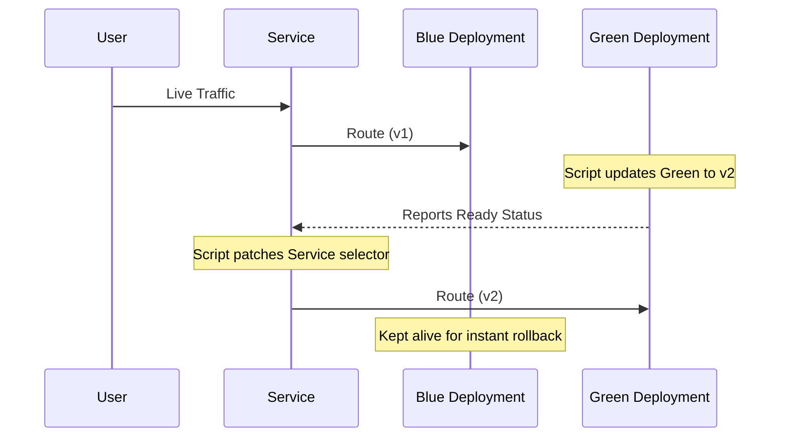

> **Shell Scripting** | Complexity: `[MEDIUM]` | Time: 30-35 min

## Prerequisites

Before starting this module, you must have completed the following:
- **Required**: [Module 7.3: Practical Scripts](../module-7.3-practical-scripts/)
- **Required**: Fundamental understanding of Kubernetes architecture and the `kubectl` command-line tool.
- **Helpful**: Previous exposure to continuous integration and continuous deployment paradigms.

## What You'll Be Able to Do

After completing this extensive module, you will be equipped to:
- **Design** idempotent automation scripts for deployment orchestration, system monitoring, and incident response.
- **Implement** robust data pipelines integrating APIs, JSON processors, and container orchestrators.
- **Diagnose** transient failures in distributed environments by scripting automated log aggregation and anomaly detection.
- **Evaluate** the execution context of shell scripts to implement fail-safes, rollbacks, and protective dry-runs.
- **Compare** the structural trade-offs of in-cluster custom controllers versus external shell-based automation pipelines.

## Why This Module Matters

On August 1, 2012, Knight Capital Group, an American financial services firm, deployed a new trading software update to their production environment. The deployment process involved a technician manually copying the new code onto eight distinct smarx servers. The technician successfully updated seven servers but missed the eighth. When the market opened, the obsolete code on the eighth server began executing anomalous trades, flooded the market with millions of unintended orders, and resulted in a staggering pre-tax loss of 460 million dollars in just 45 minutes. The company narrowly escaped bankruptcy by securing emergency funding the next day. 

This catastrophic incident was fundamentally a failure of operational automation. Had Knight Capital utilized a single, idempotent deployment script that programmatically verified the state of all target servers before routing traffic, the configuration drift would have been caught instantly. In modern DevOps, manual intervention in production systems is an unacceptable risk. Humans are prone to distraction, typos, and fatigue. Shell scripts, when properly engineered, execute with cold, mathematical consistency. 

Mastering DevOps automation transforms you from an operator who reacts to systems into an engineer who orchestrates them. Shell scripts serve as the foundational connective tissue of the cloud-native ecosystem. CI/CD pipelines, container entrypoints, infrastructure-as-code bootstrappers, and emergency response playbooks all rely on the robust execution of shell commands. By learning to harness these tools, you build force multipliers that reduce toil, document complex procedures as executable code, and safeguard your infrastructure against the inevitability of human error.

## Did You Know?

- The `set -e` shell option, crucial for halting execution upon failure, was introduced to the Bourne shell in 1979, yet remains one of the most frequently omitted safety mechanisms in modern scripts.
- Over 80 percent of reported cloud security breaches originate from misconfigurations that could have been prevented by automated, pre-deployment validation scripts.
- Kubernetes outputs can be fully formatted via JSONPath, a query language standardized in 2007, eliminating the need to pipe output through complex sed or awk chains.
- Major tech organizations run millions of automated cron jobs daily; a 2021 industry survey revealed that teams with high automation adoption deploy 973 times more frequently than manual operators.

## Extracting and Structuring Data

The foundation of any automation script is gathering accurate state data. When working with Kubernetes or cloud APIs, you must retrieve data in a machine-readable format rather than parsing human-readable tables.

### Output Formatting Strategies

The `kubectl` command-line tool provides extensive formatting options tailored for automation. Depending on your needs, you can extract full object definitions, specific fields, or custom tabular data.

```bash
# JSON for full data
kubectl get pods -o json

# JSONPath for specific fields
kubectl get pods -o jsonpath='{.items[*].metadata.name}'

# Custom columns
kubectl get pods -o custom-columns='NAME:.metadata.name,STATUS:.status.phase'

# YAML for config
kubectl get deployment nginx -o yaml

# Name only
kubectl get pods -o name
# pod/nginx-abc123
```

When you only need identifiers to pass into another loop, the `-o name` flag is highly efficient, though it prefixes the resource type. 

```bash
# Using -o name
kubectl get pods -n default -o name
# pod/nginx-abc123
# pod/redis-def456

# Using jsonpath
kubectl get pods -n default -o jsonpath='{.items[*].metadata.name}'
# nginx-abc123 redis-def456

# Using custom-columns
kubectl get pods -n default -o custom-columns=':metadata.name' --no-headers
# nginx-abc123
# redis-def456
```

### Advanced Data Extraction

For complex automation, you will frequently need to filter and manipulate lists of resources. You can utilize JSONPath directly within kubectl, or export to JSON and process the data using `jq`.

```bash
# Get all pod names
kubectl get pods -o jsonpath='{.items[*].metadata.name}' | tr ' ' '\n'

# Get images used
kubectl get pods -o jsonpath='{.items[*].spec.containers[*].image}' | tr ' ' '\n' | sort -u

# Get pods not Running
kubectl get pods --field-selector='status.phase!=Running'

# Get pods by label
kubectl get pods -l app=nginx -o name

# Watch for changes
kubectl get pods -w

# Wait for condition
kubectl wait --for=condition=Ready pod -l app=nginx --timeout=60s
```

> **Pause and predict**: If a script executes a kubectl command that fails to find a resource, what will the default Bash behavior be if `set -e` is not declared at the top of the file? The script will silently absorb the non-zero exit code and proceed to the next line, potentially executing destructive commands on empty variables.

When deciding between JSONPath and `jq`, consider the complexity of the transformation. JSONPath is built into kubectl and requires no external dependencies. 

```bash
kubectl get pods -o jsonpath='{.items[*].metadata.name}'
```

However, if you need to perform conditional logic, string manipulation, or array flattening on the data payload, exporting to JSON and piping to `jq` offers significantly more power.

```bash
kubectl get pods -o json | jq -r '.items[].metadata.name'
```

## Designing Robust Input Handling

A hallmark of professional DevOps automation is parameterization. Hardcoding values like namespaces or application names guarantees that your script will become obsolete or cause an incident when executed in the wrong context.

The simplest approach is positional arguments with default fallbacks:

```bash
#!/bin/bash
namespace=${1:-default}

kubectl get pods -n "$namespace"
```

For more complex scripts, implementing a `while` loop with a `case` statement allows for robust flag parsing, making the script self-documenting and easier to use:

```bash
while [[ $# -gt 0 ]]; do
    case $1 in
        -n|--namespace) namespace=$2; shift 2 ;;
        *) break ;;
    esac
done
namespace=${namespace:-default}

kubectl get pods -n "$namespace"
```

## Automating Health and Resource Verification

Before manipulating a distributed system, you must assert its current state. Health check scripts act as automated diagnostic equipment, swiftly identifying anomalies that would take a human operator minutes or hours to collate manually.

### Evaluating Node Constraints

Nodes are the bedrock of your cluster. A script evaluating node health must look beyond basic availability and interrogate the conditions matrix for memory pressure, disk pressure, or network unavailability.

```bash
#!/bin/bash
set -euo pipefail

check_nodes() {
    echo "=== Node Status ==="
    kubectl get nodes

    echo ""
    echo "=== Node Conditions ==="
    kubectl get nodes -o json | jq -r '
        .items[] |
        "Node: \(.metadata.name)",
        (.status.conditions[] | "  \(.type): \(.status)"),
        ""
    '

    echo "=== Resource Usage ==="
    kubectl top nodes 2>/dev/null || echo "Metrics server not available"

    # Check for NotReady nodes
    local not_ready=$(kubectl get nodes --no-headers | awk '$2 != "Ready" {print $1}')
    if [[ -n "$not_ready" ]]; then
        echo ""
        echo "WARNING: NotReady nodes: $not_ready"
        return 1
    fi
}

check_nodes
```

### Analyzing Workload Integrity

Workload health requires analyzing aggregate pod states. A single failed pod might be transient, but a high percentage of `CrashLoopBackOff` statuses indicates a systemic failure. The following script aggregates these states and highlights anomalies.

```bash
#!/bin/bash
set -euo pipefail

check_pods() {
    local namespace=${1:---all-namespaces}

    echo "Checking pod health..."

    # Count by status
    echo "=== Pod Status Summary ==="
    kubectl get pods $namespace --no-headers | awk '{print $3}' | sort | uniq -c | sort -rn

    # List non-running pods
    local unhealthy=$(kubectl get pods $namespace --no-headers | awk '$3 != "Running" && $3 != "Completed" {print $1}')

    if [[ -n "$unhealthy" ]]; then
        echo ""
        echo "=== Unhealthy Pods ==="
        kubectl get pods $namespace | grep -E "^NAME|$(echo $unhealthy | tr ' ' '|')"
        return 1
    fi

    echo ""
    echo "All pods healthy!"
    return 0
}

check_pods "$@"
```

### Validating Network Topologies

Even if pods are running, the application is broken if the routing layer fails. A service health check must verify that the Service object exists, that it has successfully bound to endpoint IPs, and that the internal cluster DNS is resolving the cluster IP.

```bash
#!/bin/bash
set -euo pipefail

check_service() {
    local service=$1
    local namespace=${2:-default}

    echo "Checking service: $service in namespace: $namespace"

    # Service exists?
    kubectl get svc "$service" -n "$namespace" > /dev/null 2>&1 || {
        echo "ERROR: Service not found"
        return 1
    }

    # Has endpoints?
    local endpoints=$(kubectl get endpoints "$service" -n "$namespace" -o jsonpath='{.subsets[*].addresses[*].ip}')

    if [[ -z "$endpoints" ]]; then
        echo "ERROR: No endpoints for service"
        kubectl get endpoints "$service" -n "$namespace"
        return 1
    fi

    echo "Endpoints: $endpoints"

    # Try to connect (from inside cluster)
    local cluster_ip=$(kubectl get svc "$service" -n "$namespace" -o jsonpath='{.spec.clusterIP}')
    local port=$(kubectl get svc "$service" -n "$namespace" -o jsonpath='{.spec.ports[0].port}')

    echo "ClusterIP: $cluster_ip:$port"
    echo "Service appears healthy"
}

check_service "$@"
```

### Generating Capacity Reports

Capacity planning requires point-in-time snapshots of resource utilization. Scripting a resource report ensures you gather consistent metrics across compute nodes, active pods, storage claims, and deployed abstractions.

```bash
#!/bin/bash
set -euo pipefail

resource_report() {
    local namespace=${1:---all-namespaces}

    echo "=== Resource Report ==="
    echo "Generated: $(date)"
    echo ""

    echo "=== Node Resources ==="
    kubectl top nodes 2>/dev/null || echo "Metrics unavailable"
    echo ""

    echo "=== Pod Resources ==="
    kubectl top pods $namespace 2>/dev/null | head -20 || echo "Metrics unavailable"
    echo ""

    echo "=== Deployments ==="
    kubectl get deployments $namespace --no-headers | \
        awk '{printf "%-40s %s/%s\n", $1, $2, $3}'
    echo ""

    echo "=== PVCs ==="
    kubectl get pvc $namespace --no-headers | \
        awk '{printf "%-40s %-10s %s\n", $1, $4, $3}'
}

resource_report "$@"
```

## The Mechanics of Safe Deployments

Deployments are the most critical operations orchestrated by shell scripts. A poorly written deployment script simply issues an update command and exits. A professionally engineered script issues the command, monitors the progression of the rollout, and automatically triggers a rollback if health thresholds are not met.

### Lifecycle Wait Conditions

When orchestrating updates, you must block execution until the cluster confirms the new state is operational. Arbitrary `sleep` commands are fragile and lead to race conditions. Instead, utilize native wait mechanics.

```bash
kubectl rollout status deployment/nginx --timeout=5m
```

You can also wait for specific resource conditions dynamically:

```bash
kubectl wait --for=condition=Available deployment/nginx --timeout=300s
```

```bash
kubectl wait --for=condition=Ready pod -l app=nginx --timeout=60s
```

> **Stop and think**: Why is it dangerous to hardcode wait times (like `sleep 60`) instead of using `kubectl wait` with a timeout? Network latency, image pull times, and node scaling are highly variable. A hardcoded sleep might occasionally succeed but will inevitably fail during high cluster load, causing pipeline unpredictability.

### Basic Rollout and Rollback

At a fundamental level, an automated deployment updates an image specification and verifies the outcome. If the `rollout status` command returns a non-zero exit code indicating failure or timeout, the script must catch this and execute a reversion.

```bash
# Update image
kubectl set image deployment/myapp myapp=myapp:v2

# Wait for rollout
if ! kubectl rollout status deployment/myapp --timeout=5m; then
    echo "Rollout failed, rolling back"
    kubectl rollout undo deployment/myapp
    exit 1
fi
```

### Structuring a Reusable Deployment Function

We can wrap this logic into a comprehensive, parameterized function that records the previous state, updates the workload, validates the progression, and handles failure scenarios automatically.

```bash
#!/bin/bash
set -euo pipefail

deploy() {
    local image=$1
    local deployment=${2:-app}
    local namespace=${3:-default}

    echo "Deploying $image to $deployment in $namespace"

    # Record current image for rollback
    local current_image=$(kubectl get deployment "$deployment" -n "$namespace" \
        -o jsonpath='{.spec.template.spec.containers[0].image}' 2>/dev/null || echo "none")
    echo "Current image: $current_image"

    # Update image
    kubectl set image deployment/"$deployment" \
        "${deployment}=${image}" \
        -n "$namespace"

    # Wait for rollout
    if ! kubectl rollout status deployment/"$deployment" -n "$namespace" --timeout=5m; then
        echo "ERROR: Rollout failed, initiating rollback"
        kubectl rollout undo deployment/"$deployment" -n "$namespace"
        kubectl rollout status deployment/"$deployment" -n "$namespace" --timeout=5m
        return 1
    fi

    echo "Deployment successful"
}

deploy "$@"
```

If you only need to trigger a fresh rollout of an existing configuration (for instance, to pull an updated image tagged as `latest` or force a configuration reload), a simpler restart function suffices:

```bash
#!/bin/bash
# Restart all pods in a deployment

restart_deployment() {
    local deployment=$1
    local namespace=${2:-default}

    echo "Restarting deployment: $deployment in namespace: $namespace"

    kubectl rollout restart deployment "$deployment" -n "$namespace"
    kubectl rollout status deployment "$deployment" -n "$namespace" --timeout=5m

    echo "Restart complete"
}

restart_deployment nginx production
```

### Implementing Blue-Green Deployments

For mission-critical applications, standard rolling updates might pose too much risk. A Blue-Green deployment strategy provisions a completely parallel environment (Green) alongside the active environment (Blue). The script deploys to the inactive environment, waits for stabilization, and then executes a rapid atomic switch of the routing layer.



Here is how this architectural pattern is implemented in Bash:

```bash
#!/bin/bash
set -euo pipefail

blue_green_deploy() {
    local app=$1
    local new_image=$2
    local namespace=${3:-default}

    local active=$(kubectl get svc "$app" -n "$namespace" \
        -o jsonpath='{.spec.selector.version}')

    local inactive
    if [[ "$active" == "blue" ]]; then
        inactive="green"
    else
        inactive="blue"
    fi

    echo "Active: $active, Deploying to: $inactive"

    # Update inactive deployment
    kubectl set image deployment/"${app}-${inactive}" \
        "${app}=${new_image}" -n "$namespace"

    # Wait for ready
    kubectl rollout status deployment/"${app}-${inactive}" \
        -n "$namespace" --timeout=5m

    # Health check
    echo "Running health check on $inactive..."
    sleep 10  # Wait for pods to stabilize

    # Switch service
    echo "Switching service to $inactive"
    kubectl patch svc "$app" -n "$namespace" \
        -p "{\"spec\":{\"selector\":{\"version\":\"$inactive\"}}}"

    echo "Blue-green deployment complete"
    echo "Previous version ($active) is still running"
    echo "Run: kubectl scale deployment/${app}-${active} --replicas=0"
}

blue_green_deploy "$@"
```

### Integrating CI/CD Pipeline Helpers

Within automated pipelines, you often need helper functions that explicitly validate replica counts and perform HTTP smoke tests to ensure the deployment not only started, but is successfully serving web traffic.

```bash
#!/bin/bash
set -euo pipefail

# Validate deployment
validate_deploy() {
    local deployment=$1
    local namespace=$2
    local timeout=${3:-300}

    local start=$(date +%s)

    while true; do
        local ready=$(kubectl get deployment "$deployment" -n "$namespace" \
            -o jsonpath='{.status.readyReplicas}' 2>/dev/null || echo 0)
        local desired=$(kubectl get deployment "$deployment" -n "$namespace" \
            -o jsonpath='{.spec.replicas}')

        echo "Ready: $ready / $desired"

        if [[ "$ready" == "$desired" ]] && [[ "$ready" != "0" ]]; then
            echo "Deployment ready!"
            return 0
        fi

        local elapsed=$(($(date +%s) - start))
        if [[ $elapsed -gt $timeout ]]; then
            echo "Timeout waiting for deployment"
            return 1
        fi

        sleep 5
    done
}

# Run smoke tests
smoke_test() {
    local url=$1
    local expected=${2:-200}

    echo "Testing $url"
    local status=$(curl -s -o /dev/null -w '%{http_code}' "$url")

    if [[ "$status" == "$expected" ]]; then
        echo "OK: Got $status"
        return 0
    else
        echo "FAIL: Expected $expected, got $status"
        return 1
    fi
}
```

## Automated Log Aggregation and Error Triage

When an incident occurs across a distributed microservice architecture, manually checking logs pod by pod is unscalable. Automation scripts excel at fanning out queries and aggregating telemetry data.

### Label-Based Log Aggregation

This script identifies all pods matching a specific label and sequentially dumps their most recent log tails, creating a unified timeline of events for a specific application tier.

```bash
#!/bin/bash
set -euo pipefail

aggregate_logs() {
    local label=$1
    local namespace=${2:-default}
    local since=${3:-1h}

    echo "Aggregating logs for pods with label: $label"

    local pods=$(kubectl get pods -l "$label" -n "$namespace" -o name)

    if [[ -z "$pods" ]]; then
        echo "No pods found"
        return 1
    fi

    for pod in $pods; do
        echo "=== ${pod} ==="
        kubectl logs "$pod" -n "$namespace" --since="$since" | tail -50
        echo ""
    done
}

aggregate_logs "$@"
```

### Heuristic Error Discovery

During a critical outage, you don't need all the logs; you need the stack traces. By iterating through all running workloads and applying a fast grep filter for critical keywords, a script can instantly highlight the epicenters of failure across the cluster.

```bash
#!/bin/bash
set -euo pipefail

find_errors() {
    local namespace=${1:---all-namespaces}
    local since=${2:-1h}

    echo "Finding errors in pods..."

    local pods=$(kubectl get pods $namespace -o name)

    for pod in $pods; do
        local ns=""
        if [[ "$namespace" == "--all-namespaces" ]]; then
            ns=$(echo "$pod" | cut -d/ -f1)
            pod=$(echo "$pod" | cut -d/ -f2)
        fi

        local errors=$(kubectl logs "$pod" ${ns:+-n $ns} --since="$since" 2>/dev/null | \
            grep -iE "error|exception|fatal|panic" | head -5)

        if [[ -n "$errors" ]]; then
            echo "=== $pod ==="
            echo "$errors"
            echo ""
        fi
    done
}

find_errors "$@"
```

## Artifact Generation and Registry Operations

DevOps automation extends beyond the cluster into the software supply chain. Shell scripts manage semantic versioning and coordinate the building and pushing of container artifacts to remote registries.

### Semantic Version Bumping

```bash
#!/bin/bash
set -euo pipefail

bump_version() {
    local current=$1
    local type=${2:-patch}

    IFS='.' read -r major minor patch <<< "$current"

    case $type in
        major) ((major++)); minor=0; patch=0 ;;
        minor) ((minor++)); patch=0 ;;
        patch) ((patch++)) ;;
        *) echo "Unknown type: $type"; return 1 ;;
    esac

    echo "${major}.${minor}.${patch}"
}

# Usage
current=$(cat VERSION)
new=$(bump_version "$current" patch)
echo "$new" > VERSION
git add VERSION
git commit -m "Bump version to $new"
```

### Pipeline Artifact Build Operations

By wrapping Docker commands in a structured script, we can enforce organizational standards like injecting build arguments, tagging conventions, and standardized commit hashes.

```bash
#!/bin/bash
set -euo pipefail

readonly APP_NAME=${APP_NAME:-myapp}
readonly REGISTRY=${REGISTRY:-docker.io}
readonly VERSION=$(git describe --tags --always --dirty)

build() {
    echo "Building ${APP_NAME}:${VERSION}"

    docker build \
        --build-arg VERSION="$VERSION" \
        --build-arg BUILD_TIME="$(date -u +%Y-%m-%dT%H:%M:%SZ)" \
        -t "${REGISTRY}/${APP_NAME}:${VERSION}" \
        -t "${REGISTRY}/${APP_NAME}:latest" \
        .

    echo "Build complete: ${REGISTRY}/${APP_NAME}:${VERSION}"
}

push() {
    echo "Pushing to registry..."
    docker push "${REGISTRY}/${APP_NAME}:${VERSION}"
    docker push "${REGISTRY}/${APP_NAME}:latest"
}

main() {
    local cmd=${1:-build}
    case $cmd in
        build) build ;;
        push) push ;;
        all) build && push ;;
        *) echo "Usage: $0 {build|push|all}" ;;
    esac
}

main "$@"
```

## Maintenance and Housekeeping

Over time, clusters accumulate orphaned resources and completed batch jobs. Furthermore, critical configurations must be backed up before major operations. Scripting these tasks prevents human neglect.

### Namespace State Cleanup

This script safely identifies and removes pods that have terminated but are lingering in the system state. Notice the critical inclusion of a `dry_run` safety toggle.

```bash
#!/bin/bash
set -euo pipefail

cleanup_namespace() {
    local namespace=$1
    local dry_run=${2:-true}

    echo "Cleaning up namespace: $namespace"

    # Find completed/failed pods
    local pods=$(kubectl get pods -n "$namespace" \
        --field-selector='status.phase!=Running,status.phase!=Pending' \
        -o name 2>/dev/null)

    if [[ -z "$pods" ]]; then
        echo "No pods to clean"
        return 0
    fi

    echo "Pods to delete:"
    echo "$pods"

    if [[ "$dry_run" == "false" ]]; then
        echo "$pods" | xargs -r kubectl delete -n "$namespace"
        echo "Cleanup complete"
    else
        echo "[DRY RUN] Would delete above pods"
    fi
}

cleanup_namespace "${1:-default}" "${2:-true}"
```

### Automated Configuration Backup

Before migrating a namespace or tearing down a cluster, you must back up sensitive state. This script systematically loops through all secrets, stripping out ephemeral cluster-specific identifiers like UIDs and timestamps, saving clean YAML definitions to disk.

```bash
#!/bin/bash
set -euo pipefail

backup_secrets() {
    local namespace=${1:-default}
    local backup_dir=${2:-./secrets-backup}

    mkdir -p "$backup_dir"

    echo "Backing up secrets from namespace: $namespace"

    local secrets=$(kubectl get secrets -n "$namespace" -o name)

    for secret in $secrets; do
        local name=$(basename "$secret")
        echo "Backing up: $name"

        kubectl get "$secret" -n "$namespace" -o yaml | \
            grep -v "resourceVersion\|uid\|creationTimestamp" > \
            "${backup_dir}/${namespace}-${name}.yaml"
    done

    echo "Backup complete: $backup_dir"
    ls -la "$backup_dir"
}

backup_secrets "$@"
```

## Common Mistakes

When transitioning from interactive terminal usage to programmatic scripting, engineers frequently stumble into predictable anti-patterns.

| Mistake | Problem | Solution |
|---------|---------|----------|
| No error handling in pipelines | CI passes when it shouldn't, failing silently | Use `set -eo pipefail`, check exit codes explicitly |
| Hardcoded namespaces | Script only works in one rigid environment | Accept namespace as a positional parameter or CLI flag |
| No dry-run mode | Highly dangerous to test destructive actions | Always add `--dry-run` or non-mutating validation logic |
| Ignoring kubectl failures | Partial operations leading to split brain | Check return codes for all orchestration commands |
| No timeout on waits | Infinite loops paralyzing automated runners | Always set `--timeout` attributes for wait statements |
| Secrets in scripts | Severe security risk; credential leakage in git | Extract via environment variables or native Secret stores |
| Missing executable bit | Scripts fail to execute in pipeline contexts | Ensure `chmod +x` is committed to the version control |
| Misusing JSON text parsing | Fragile text extraction breaking on updates | Use robust structural query tools like `jq` or `jsonpath` |

## Quiz

### Question 1
You are writing a pipeline script that orchestrates a mission-critical financial application rollout. After issuing the `kubectl set image` command, the script must ensure the pods are actively serving traffic before proceeding to database migrations. What is the most robust implementation?

<details>
<summary>Show Answer</summary>

```bash
kubectl rollout status deployment/finance-app --timeout=5m
```

Or using precise wait conditions:
```bash
kubectl wait --for=condition=Available deployment/finance-app --timeout=300s
```

You must explicitly invoke `rollout status` or `wait` with a strict timeout parameter. If you fail to utilize these blocking mechanisms, your pipeline will falsely report success the moment the API accepts the specification update, oblivious to any underlying `CrashLoopBackOff` failures happening asynchronously.

</details>

### Question 2
Your incident response team needs a rapid way to extract the exact name strings of all pods residing in the `default` namespace so they can be piped into a forensic isolation script. How do you extract this data natively without relying on external tools like `awk` or `jq`?

<details>
<summary>Show Answer</summary>

You have multiple native options:

```bash
# Using -o name
kubectl get pods -n default -o name
# pod/nginx-abc123
# pod/redis-def456

# Using jsonpath
kubectl get pods -n default -o jsonpath='{.items[*].metadata.name}'
# nginx-abc123 redis-def456

# Using custom-columns
kubectl get pods -n default -o custom-columns=':metadata.name' --no-headers
# nginx-abc123
# redis-def456
```

Using `-o name` is syntactically the simplest, but note that it retains the `pod/` resource prefix. If your subsequent script expects raw identifiers, `jsonpath` or `custom-columns` with `--no-headers` provides cleaner string payloads.

</details>

### Question 3
An automated deployment script updates a frontend web server array, but due to an invalid configuration map, the new pods immediately fail readiness probes. How do you engineer the script to safely handle this scenario and restore service?

<details>
<summary>Show Answer</summary>

```bash
# Update image
kubectl set image deployment/myapp myapp=myapp:v2

# Wait for rollout
if ! kubectl rollout status deployment/myapp --timeout=5m; then
    echo "Rollout failed, rolling back"
    kubectl rollout undo deployment/myapp
    exit 1
fi
```

The script must capture the exit code of the `rollout status` command. If the timeout triggers (yielding a non-zero exit code), the `if !` logical block engages, executing `kubectl rollout undo` to systematically revert the cluster state to the previous, known-good ReplicaSet.

</details>

### Question 4
You need to write a script that analyzes container configurations across hundreds of deployments. The data must be manipulated, filtered based on nested conditional logic, and output as a formatted report. What is the structural difference between leveraging `kubectl ... -o jsonpath` versus `kubectl ... -o json | jq` for this task?

<details>
<summary>Show Answer</summary>

**jsonpath** is a built-in feature of `kubectl`. It requires no external dependencies and is ideal for straightforward extraction of flat fields, utilizing simple bracket syntax:
```bash
kubectl get pods -o jsonpath='{.items[*].metadata.name}'
```

**jq**, conversely, is a powerful external binary dependency. It offers Turing-complete data transformation capabilities, enabling deep conditional queries, arithmetic manipulation, and restructuring of complex JSON payloads. 
```bash
kubectl get pods -o json | jq -r '.items[].metadata.name'
```

For advanced analytical reporting across deep configurations, `jq` is technically superior despite the dependency overhead.

</details>

### Question 5
A junior engineer writes a cleanup script containing the hardcoded command `kubectl delete pods -n production --all`. This script is meant to be reused across development, staging, and UAT environments, but it causes a catastrophic outage because it defaults to the production environment. How do you refactor this to be environmentally agnostic?

<details>
<summary>Show Answer</summary>

You must abstract the target environment into a parameterized variable that accepts user input with a safe fallback:

```bash
#!/bin/bash
namespace=${1:-default}

kubectl get pods -n "$namespace"
```

For professional-grade tooling, parsing named flags provides better user experience and avoids positional argument confusion:
```bash
while [[ $# -gt 0 ]]; do
    case $1 in
        -n|--namespace) namespace=$2; shift 2 ;;
        *) break ;;
    esac
done
namespace=${namespace:-default}

kubectl get pods -n "$namespace"
```
Hardcoding environment identifiers is a major anti-pattern in DevOps engineering.

</details>

### Question 6
You are tasked with engineering a script that aggressively patches node operating systems. Why is it critically important to include `set -euo pipefail` at the absolute top of your bash script for a task of this magnitude?

<details>
<summary>Show Answer</summary>

The `set -euo pipefail` directive fundamentally alters how Bash handles errors. By default, Bash is highly permissive: if a command fails, or a variable is undefined, it attempts to march forward to the next line. In an OS patching script, if a command designed to calculate the target disk partition fails and returns empty data, the subsequent formatting command might accidentally wipe the root drive. 

`set -e` halts execution on any non-zero exit code. `set -u` halts execution on unbound variables. `set -o pipefail` ensures that if any command in a piped sequence fails, the entire pipeline is marked as a failure, rather than just returning the exit code of the final command.

</details>

## Hands-On Exercise

### Building DevOps Scripts

**Objective**: Construct a library of highly practical, production-ready DevOps automation scripts that interact directly with the Kubernetes API to evaluate, mutate, and observe cluster state.

**Environment**: An active Kubernetes cluster (kind, minikube, or a managed cloud instance).

#### Script 1: Cluster Health Check

Your first task is to build a diagnostic tool that scans for broad cluster anomalies, checking node conditions and locating pods trapped in failure loops. 

<details>
<summary>View Implementation</summary>

```bash
cat > /tmp/cluster-health.sh << 'EOF'
#!/bin/bash
set -euo pipefail

echo "=== Cluster Health Check ==="
echo "Time: $(date)"
echo ""

# Nodes
echo "=== Nodes ==="
kubectl get nodes -o wide
echo ""

# Check node conditions
echo "=== Node Issues ==="
kubectl get nodes -o json | jq -r '
  .items[] |
  select(.status.conditions[] | select(.type != "Ready" and .status == "True")) |
  "WARNING: \(.metadata.name) has issues"
' || echo "All nodes healthy"
echo ""

# Pods not running
echo "=== Non-Running Pods ==="
kubectl get pods --all-namespaces --field-selector='status.phase!=Running,status.phase!=Succeeded' 2>/dev/null || echo "All pods running"
echo ""

# Resource usage (if metrics available)
echo "=== Resource Usage ==="
kubectl top nodes 2>/dev/null || echo "Metrics not available"
echo ""

echo "Health check complete"
EOF

chmod +x /tmp/cluster-health.sh
/tmp/cluster-health.sh
```
</details>

#### Script 2: Deployment Helper

Next, construct a deployment utility. This script must accept dynamic inputs, analyze the current running image to prevent redundant operations, gracefully handle dry-runs for safety, and orchestrate the rollout progression.

<details>
<summary>View Implementation</summary>

```bash
cat > /tmp/deploy-helper.sh << 'EOF'
#!/bin/bash
set -euo pipefail

usage() {
    echo "Usage: $0 <deployment> <image> [-n namespace] [--dry-run]"
    exit 1
}

[[ $# -lt 2 ]] && usage

deployment=$1
image=$2
namespace="default"
dry_run=""

shift 2
while [[ $# -gt 0 ]]; do
    case $1 in
        -n) namespace=$2; shift 2 ;;
        --dry-run) dry_run="--dry-run=client"; shift ;;
        *) usage ;;
    esac
done

echo "Deployment: $deployment"
echo "Image: $image"
echo "Namespace: $namespace"
[[ -n "$dry_run" ]] && echo "DRY RUN MODE"

# Current image
current=$(kubectl get deployment "$deployment" -n "$namespace" \
    -o jsonpath='{.spec.template.spec.containers[0].image}' 2>/dev/null || echo "none")
echo "Current image: $current"
echo ""

if [[ "$current" == "$image" ]]; then
    echo "Already running this image"
    exit 0
fi

# Update
echo "Updating deployment..."
kubectl set image deployment/"$deployment" "$deployment=$image" -n "$namespace" $dry_run

if [[ -z "$dry_run" ]]; then
    echo "Waiting for rollout..."
    kubectl rollout status deployment/"$deployment" -n "$namespace" --timeout=5m
fi

echo "Done"
EOF

chmod +x /tmp/deploy-helper.sh

# Test (dry run)
/tmp/deploy-helper.sh nginx nginx:latest -n default --dry-run
```
</details>

#### Script 3: Log Searcher

When an alert fires, you must quickly sift through unstructured textual telemetry. Implement an investigative script that searches across all pod logs in a specific namespace for critical regex patterns.

<details>
<summary>View Implementation</summary>

```bash
cat > /tmp/log-search.sh << 'EOF'
#!/bin/bash
set -euo pipefail

pattern=${1:-"error"}
namespace=${2:---all-namespaces}
since=${3:-1h}

echo "Searching for '$pattern' in logs..."
echo "Namespace: $namespace"
echo "Since: $since"
echo ""

found=0
for pod in $(kubectl get pods $namespace -o name); do
    # Get namespace if all namespaces
    if [[ "$namespace" == "--all-namespaces" ]]; then
        ns=$(echo "$pod" | cut -d'/' -f1)
        pod_name=$(echo "$pod" | cut -d'/' -f2)
        ns_flag="-n $ns"
    else
        pod_name=$(basename "$pod")
        ns_flag="-n $namespace"
    fi

    matches=$(kubectl logs "$pod_name" $ns_flag --since="$since" 2>/dev/null | \
        grep -i "$pattern" | head -5 || true)

    if [[ -n "$matches" ]]; then
        echo "=== $pod_name ==="
        echo "$matches"
        echo ""
        ((found++)) || true
    fi
done

echo "Found matches in $found pods"
EOF

chmod +x /tmp/log-search.sh
/tmp/log-search.sh "error" default "1h"
```
</details>

#### Script 4: Resource Analyzer

Finally, develop a financial and architectural analysis tool. This script will iterate through container payloads via `jq` to identify misconfigurations—specifically, workloads lacking defined CPU or memory constraints, which threaten cluster stability.

<details>
<summary>View Implementation</summary>

```bash
cat > /tmp/resource-analyzer.sh << 'EOF'
#!/bin/bash
set -euo pipefail

namespace=${1:-default}

echo "=== Resource Analysis for namespace: $namespace ==="
echo ""

# CPU and Memory requests/limits
echo "=== Container Resources ==="
kubectl get pods -n "$namespace" -o json | jq -r '
  .items[] |
  .spec.containers[] |
  "\(.name): CPU: \(.resources.requests.cpu // "none")/\(.resources.limits.cpu // "none") MEM: \(.resources.requests.memory // "none")/\(.resources.limits.memory // "none")"
'

echo ""
echo "=== Containers without limits ==="
kubectl get pods -n "$namespace" -o json | jq -r '
  .items[] |
  .spec.containers[] |
  select(.resources.limits == null or .resources.limits == {}) |
  .name
' | sort -u || echo "All containers have limits"

echo ""
echo "=== PVC Usage ==="
kubectl get pvc -n "$namespace" --no-headers | \
    awk '{printf "%-30s %-10s %s\n", $1, $4, $3}'
EOF

chmod +x /tmp/resource-analyzer.sh
/tmp/resource-analyzer.sh default
```
</details>

### Success Criteria

- [ ] Created and executed the diagnostic cluster health check script successfully.
- [ ] Engineered the deployment helper script and verified behavior using the integrated dry-run mode.
- [ ] Implemented the log searcher utility and extracted historical errors across isolated namespaces.
- [ ] Deployed the resource analyzer script to identify workloads operating without strict compute boundaries.
- [ ] Ensured all scripts are structurally protected utilizing strict `set -euo pipefail` declarations.

## Key Takeaways

1. **Kubernetes API Scriptability**: The Kubernetes API is fundamentally designed for programmatic interaction. Mastering extraction mechanics like `-o json`, `jsonpath`, and external parsers like `jq` is mandatory for advanced operators.
2. **Defensive Testing**: Always incorporate and utilize dry-run validation mechanisms within automated tools. Testing destructive logic iteratively prevents catastrophic data loss.
3. **State Rollbacks**: Never assume a deployment command translates to operational success. Always orchestrate conditional checks (`rollout status`) and execute programmatic reversions (`rollout undo`) upon failure.
4. **Time Constraint Enforcement**: Network communication is inherently unreliable. Never construct blocking API calls without defining rigid `--timeout` parameters.
5. **Architectural Reusability**: Hardcoded logic creates technical debt. Parameterize environmental boundaries like namespaces, contextual labels, and image tags to ensure long-term utility.

## Congratulations!

You've completed the **Linux Deep Dive Track**! You have transcended basic administration and now possess a formidable engineering foundation spanning:
- Deep kernel interactions, process isolation, and filesystem management.
- Containerization primitives including namespaces, cgroups, and capabilities.
- Advanced network traversal, TCP/IP analytics, DNS mechanics, and iptables routing.
- Formidable security hardening via AppArmor, SELinux, and seccomp profiles.
- Rigorous performance analytics leveraging the USE method across compute, memory, and I/O boundaries.
- Systematic troubleshooting, forensic log extraction, and anomalous process triage.
- High-level shell scripting, programmatic text processing, and CI/CD automation logic.

These competencies are the absolute bedrock of advanced Kubernetes administration, Site Reliability Engineering, and modern cloud architecture.

## Further Reading

- [kubectl Cheat Sheet](https://kubernetes.io/docs/reference/kubectl/cheatsheet/) — A critical reference for API interactions.
- [Bash Automation Best Practices](https://bertvv.github.io/cheat-sheets/Bash.html) — Structural methodologies for safe scripting.
- [12 Factor App](https://12factor.net/) — The philosophical blueprint for continuous delivery systems.
- [Kustomize](https://kustomize.io/) — [Explore how declarative management supercharges deployment scaling in the upcoming chapters](../kubernetes-foundations).