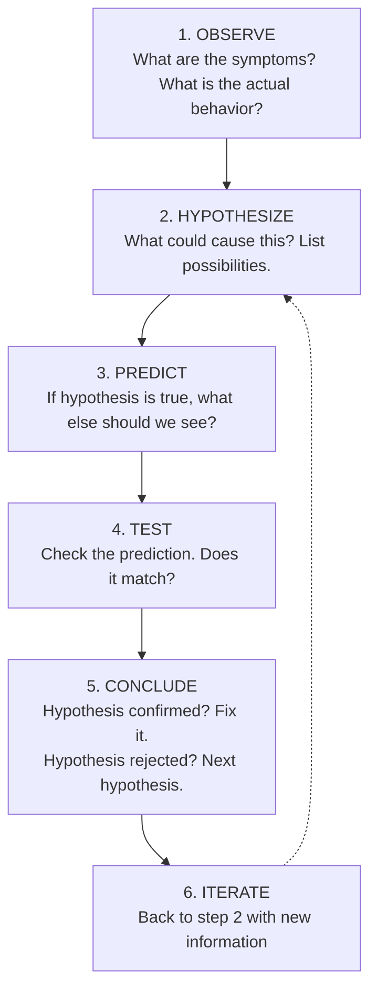
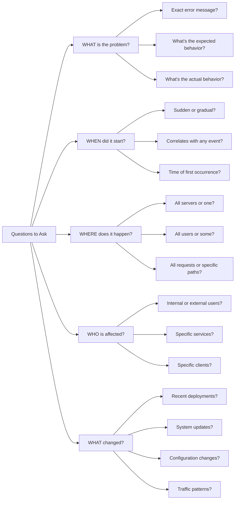
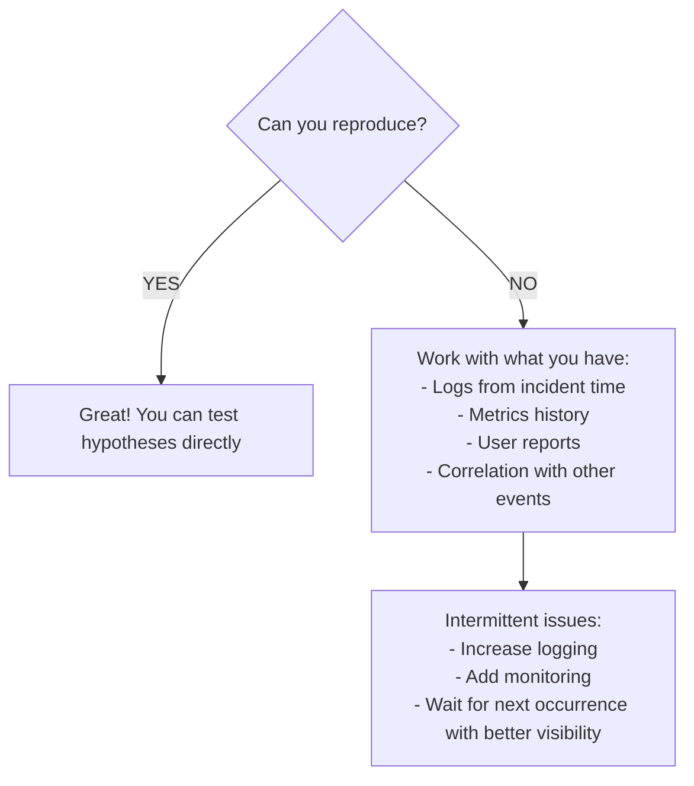

> **Linux Troubleshooting** | Complexity: `[MEDIUM]` | Time: 25-30 min

## Prerequisites

Before starting this module:
- **Required**: [Module 5.1: USE Method](/linux/operations/performance/module-5.1-use-method/)
- **Helpful**: Experience with production issues
- **Helpful**: Basic Linux command line familiarity

---

## What You'll Be Able to Do

After this module, you will be able to:
- **Apply** the scientific method to system debugging (observe → hypothesize → test → conclude)
- **Reproduce** issues systematically and document findings for post-incident reviews
- **Triage** problems by severity and identify the fastest path to resolution
- **Avoid** common debugging anti-patterns (random changes, ignoring evidence, skipping reproduction)

---

## Why This Module Matters

When systems break, panic leads to random fixes. Methodical troubleshooting finds root causes faster and prevents recurrence. The difference between a 5-minute fix and hours of confusion is often just approach.

Systematic troubleshooting helps you:

- **Reduce MTTR** — Mean Time To Recovery
- **Find root causes** — Not just symptoms
- **Avoid making things worse** — Random changes create chaos
- **Document for next time** — Same problem won't take as long

The best troubleshooters aren't luckier—they're more methodical.

---

## Did You Know?

- **Most issues have simple causes** — Disk full, service not running, wrong config. Exotic causes are rare. Check the obvious first.

- **"It worked yesterday" is a clue** — Something changed. Find the change, find the cause. Check deployments, config changes, system updates.

- **Rubber duck debugging works** — Explaining the problem to someone (or something) forces you to think through assumptions. Many bugs are found mid-explanation.

- **Cognitive bias is real** — You'll focus on recent changes you made. The actual cause might be something else entirely. Stay objective.

---

## Troubleshooting Methodologies

### The Scientific Method



> **Stop and think**: You get an alert that users cannot check out their shopping carts. You observe that the checkout service is returning 500 errors. Before randomly restarting the service, what are two distinct hypotheses you could form based on the architecture of a typical web application?

### Divide and Conquer

Binary search for problems:

```bash
# Example: Web request failing
# Full path: Client → DNS → Network → LB → Pod → App → DB

# Step 1: Test middle of path
curl -I http://internal-lb/health
# If this works: problem is before LB (client, DNS, network)
# If this fails: problem is after LB (pod, app, db)

# Step 2: Test half of remaining path
# Continue until isolated
```

> **Pause and predict**: If you run `curl -I http://internal-lb/health` from a client machine and it times out, but running the same command directly from the load balancer node succeeds, which segment of the network path should you investigate first?

### Timeline Analysis

What changed when the problem started?

```bash
# Recent system changes
rpm -qa --last | head -20                    # Package installs
ls -lt /etc/*.conf | head -10                # Config changes
journalctl --since "1 hour ago" | tail -100  # Recent logs
last -10                                      # Recent logins

# Git history for config management
git log --oneline --since="2 hours ago"

# Kubernetes changes
kubectl get events --sort-by='.lastTimestamp' | tail -20
```

---

## Initial Triage

### The First 60 Seconds

Quick system health check:

```bash
# 1. What's happening now?
uptime                    # Load, uptime
dmesg | tail -20          # Kernel messages
journalctl -p err -n 20   # Recent errors

# 2. Resource state
free -h                   # Memory
df -h                     # Disk
top -bn1 | head -15       # CPU and processes

# 3. Network state
ss -tuln                  # Listening ports
ip addr                   # Network interfaces

# 4. What's running?
systemctl --failed        # Failed services
docker ps -a | head -10   # Containers (if applicable)
```

### Problem Categories

| Symptom | Likely Area | First Check |
|---------|-------------|-------------|
| "Can't connect" | Network | `ping`, `ss`, `iptables` |
| "Slow" | Performance | `top`, `iostat`, `vmstat` |
| "Permission denied" | Security | Permissions, SELinux, AppArmor |
| "Service won't start" | Service | `systemctl status`, logs |
| "Out of space" | Storage | `df -h`, `du -sh /*` |
| "Process crashed" | Application | Core dumps, logs, `dmesg` |

---

## Gathering Information

### Questions to Ask



### Reproduce vs Observe



---

## Common Patterns

### "It Was Working Yesterday"

```bash
# Find what changed
# 1. Package changes
rpm -qa --last | head -20           # RHEL/CentOS
dpkg -l --no-pager | head -20       # Debian/Ubuntu

# 2. Config file changes
find /etc -mtime -1 -type f 2>/dev/null

# 3. Recent deployments
kubectl get deployments -A -o json | \
  jq -r '.items[] | select(.metadata.creationTimestamp > "2026-01-01") | .metadata.name'

# 4. Cron jobs that ran
grep CRON /var/log/syslog | tail -20

# 5. System updates
cat /var/log/apt/history.log | tail -50  # Debian
cat /var/log/dnf.log | tail -50           # RHEL
```

> **Stop and think**: If a service fails immediately after a minor package update, but rolling back the package does not fix the issue, what other system changes or dependencies should you investigate to uncover the root cause?

### "It Works On My Machine"

```bash
# Environment differences
env                              # Environment variables
cat /etc/os-release              # OS version
uname -r                         # Kernel version
which python && python --version # Language versions

# Network differences
ip route                         # Routing
cat /etc/resolv.conf             # DNS
iptables -L -n                   # Firewall

# Configuration differences
diff /etc/app/config.yaml /path/to/other/config.yaml
```

### "It's Slow"

Apply USE Method:

```bash
# CPU saturation?
uptime
vmstat 1 5

# Memory pressure?
free -h
vmstat 1 5 | awk '{print $7, $8}'  # si/so

# Disk bottleneck?
iostat -x 1 5

# Network?
ss -s
sar -n DEV 1 5

# If all OK, it's application-level
```

---

## Hypothesis Testing

### Forming Hypotheses

```
Symptom: "API returns 500 errors"

Hypotheses (by likelihood):
1. Database connection failed
2. Service crashed/restarting
3. Disk full (can't write logs/temp)
4. Memory exhausted (OOM)
5. Network partition
6. Bad deployment

Test each:
1. curl localhost:5432    # Can reach DB?
2. systemctl status api   # Service running?
3. df -h                  # Disk space?
4. dmesg | grep oom       # OOM events?
5. ping db-server         # Network?
6. kubectl rollout status # Deployment?
```

### Testing Safely

```bash
# Read-only commands first
cat /var/log/app.log      # Read logs
systemctl status service  # Check status
curl -I endpoint          # Test connectivity

# Non-destructive tests
ping host                 # Network reachability
dig domain                # DNS resolution
telnet host port          # Port connectivity

# Careful with write operations
# - Don't restart unless sure
# - Don't change config without backup
# - Don't delete files without understanding

# If you must change something:
cp config.yaml config.yaml.bak  # Backup first
```

---

## Documentation During Troubleshooting

### Keep a Log

```bash
# Start a script session
script troubleshooting-$(date +%Y%m%d-%H%M).log

# Or use shell history
history | tail -50

# Note your findings
echo "# $(date): Hypothesis: disk full" >> notes.md
echo "# Result: df shows 95% on /var" >> notes.md
```

### Incident Timeline

```
TIME        EVENT
09:00       First alert: API errors
09:02       Checked dashboard: error rate 50%
09:05       SSH to api-server-1
09:06       Checked logs: "Connection refused to db"
09:08       SSH to db-server
09:09       MySQL not running
09:10       dmesg shows OOM kill
09:12       Increased memory limit
09:14       Started MySQL
09:15       API recovering
09:20       Error rate back to normal
```

---

## Common Mistakes

| Mistake | Problem | Solution |
|---------|---------|----------|
| Random restarts | Lose diagnostic info | Check logs/state FIRST |
| Changing multiple things | Don't know what fixed it | One change at a time |
| Not documenting | Same problem takes same time | Keep notes |
| Assuming the obvious | Miss actual cause | Verify assumptions |
| Tunnel vision | Focus on one thing | Step back, consider all |
| Not asking for help | Waste hours alone | Fresh eyes help |

---

## Quiz

### Question 1
Scenario: You receive a PagerDuty alert at 3 AM stating that the payment processing service has crashed. The dashboard shows a complete drop in successful transactions.
Question: What is the most critical first step you must take before attempting to restore the service?

<details>
<summary>Show Answer</summary>

**Gather state and log information before taking any destructive action.**

If you immediately restart the service to restore functionality, you risk destroying the ephemeral evidence (like memory state, temporary files, or specific error logs) needed to determine the root cause. Without this evidence, the service is likely to crash again for the exact same reason. By first capturing the current state (e.g., `systemctl status`, `dmesg`, `journalctl`), you ensure that you have the data necessary to formulate an accurate hypothesis and prevent recurrence.

</details>

### Question 2
Scenario: Customer support reports that "the website is down" for all users. The architecture consists of a CDN, an external load balancer, an internal API gateway, web app pods, and a backend database cluster.
Question: How would you apply the divide-and-conquer strategy to isolate the failure in this specific architecture?

<details>
<summary>Show Answer</summary>

**Test the middle of the request path to eliminate half of the components immediately.**

For example, testing the internal API gateway directly bypasses the CDN and external load balancer. If the API gateway returns a healthy response, you instantly know the problem lies upstream (CDN, external LB, or internet routing) and can stop investigating the application code or database. Conversely, if it fails, you know the issue is at the gateway, the web pods, or the database. This approach allows you to systematically split the remaining path again, drastically reducing the time spent checking healthy components.

</details>

### Question 3
Scenario: A critical background job processing nightly reports has been running successfully for six months. Tonight, it suddenly failed with a "connection timeout" error to the analytics database, despite no scheduled deployments or infrastructure updates occurring today.
Question: Why is asking "What changed?" still the most crucial investigative path in this scenario, even when no planned changes occurred?

<details>
<summary>Show Answer</summary>

**Working systems governed by deterministic code do not spontaneously break without an underlying state change.**

Even if no explicit deployments occurred, environmental factors constantly shift around the application. For instance, SSL certificates expire, databases grow until disks fill, log files rotate, cloud provider network topologies update, or external API rate limits are reached. By aggressively seeking out what changed in the environment—using timeline analysis for package updates, system events, or metric anomalies—you move away from guessing and directly target the catalyst of the failure. This process uncovers the hidden state changes that are ultimately responsible for the outage.

</details>

### Question 4
Scenario: The primary database node for a high-traffic application has unexpectedly stopped running. Your team lead suggests immediately issuing a `systemctl restart mysql` command to minimize downtime.
Question: Under what specific conditions should you push back against immediately restarting the database service?

<details>
<summary>Show Answer</summary>

**You should delay a restart if the root cause of the crash is unknown and the current crashed state holds critical diagnostic data that a restart would wipe out.**

Restarting a database clears process memory, resets active connections, and often rotates or overwrites the very logs needed to understand the failure. If the database crashed due to an Out-Of-Memory (OOM) killer or a corrupted disk sector, restarting it without capturing `dmesg` logs or verifying disk space will likely just cause it to crash again immediately. This prolongs the outage while destroying the evidence needed to fix it permanently. Always gather system state and logs before taking destructive actions like restarting a service.

</details>

### Question 5
Scenario: An application server is exhibiting high latency. A junior engineer logs in and immediately modifies the application's configuration file to double the connection pool size, restarts the application, and then flushes the Redis cache, hoping one of these actions will speed things up.
Question: What core principles of systematic troubleshooting did the engineer violate, and what is the danger of their approach?

<details>
<summary>Show Answer</summary>

**The engineer violated the principles of "read-only first" and "testing one hypothesis at a time."**

By making multiple, unverified changes simultaneously (config change, restart, and cache flush), it becomes impossible to know which action, if any, resolved the issue. Furthermore, flushing a cache under high latency could cause a massive cache stampede, severely degrading database performance and escalating a minor slowdown into a total system outage. Systematic troubleshooting requires forming a hypothesis, making a single, isolated change, and measuring the result before proceeding.

</details>

---

## Hands-On Exercise

### Practicing Systematic Troubleshooting

**Objective**: Apply troubleshooting methodology to a simulated problem.

**Environment**: Any Linux system

#### Part 1: Initial Triage Script

```bash
# Create a triage script
cat > /tmp/triage.sh << 'EOF'
#!/bin/bash
echo "=== System Triage $(date) ==="
echo ""
echo "--- Uptime & Load ---"
uptime
echo ""
echo "--- Memory ---"
free -h
echo ""
echo "--- Disk ---"
df -h | grep -v tmpfs
echo ""
echo "--- Recent Errors ---"
journalctl -p err -n 10 --no-pager 2>/dev/null || dmesg | tail -10
echo ""
echo "--- Failed Services ---"
systemctl --failed 2>/dev/null || echo "N/A"
echo ""
echo "--- Top Processes ---"
ps aux --sort=-%cpu | head -5
echo ""
echo "--- Network Listeners ---"
ss -tuln | head -10
EOF
chmod +x /tmp/triage.sh

# Run it
/tmp/triage.sh
```

#### Part 2: Simulate and Diagnose

```bash
# Simulate: Fill up /tmp (safely)
dd if=/dev/zero of=/tmp/bigfile bs=1M count=100 2>/dev/null

# Now imagine you get alert: "Application failing"
# Apply methodology:

# 1. OBSERVE: What's the symptom?
echo "Symptom: Application reports 'cannot write file'"

# 2. HYPOTHESIZE: What could cause this?
echo "Hypotheses: 1) Disk full, 2) Permissions, 3) Process limit"

# 3. TEST Hypothesis 1
df -h /tmp
# Shows /tmp usage

# 4. CONCLUDE
echo "Root cause: /tmp filled by bigfile"

# 5. FIX
rm /tmp/bigfile
df -h /tmp
```

#### Part 3: Timeline Analysis

```bash
# Find recent changes on your system

# 1. Recent package changes
if command -v rpm &>/dev/null; then
  rpm -qa --last | head -10
elif command -v dpkg &>/dev/null; then
  ls -lt /var/lib/dpkg/info/*.list | head -10
fi

# 2. Recent config changes
find /etc -type f -mtime -7 2>/dev/null | head -10

# 3. Recent logins
last -10

# 4. Recent cron runs
grep CRON /var/log/syslog 2>/dev/null | tail -10 || \
journalctl -u cron -n 10 --no-pager 2>/dev/null
```

#### Part 4: Hypothesis Testing Practice

```bash
# Scenario: "Can't SSH to server"
# Let's test hypotheses systematically

# Hypothesis 1: Network unreachable
ping -c 1 localhost > /dev/null && echo "H1: Network OK" || echo "H1: Network problem"

# Hypothesis 2: SSH not running
systemctl is-active sshd 2>/dev/null || \
  systemctl is-active ssh 2>/dev/null || \
  echo "SSH service check (verify manually)"

# Hypothesis 3: Port not listening
ss -tuln | grep :22 > /dev/null && echo "H3: Port 22 listening" || echo "H3: Port 22 not listening"

# Hypothesis 4: Firewall blocking
iptables -L INPUT -n 2>/dev/null | grep -q "dpt:22" && echo "H4: SSH in firewall rules" || echo "H4: Check firewall"
```

#### Part 5: Document Your Process

```bash
# Start logging
LOGFILE=/tmp/troubleshooting-$(date +%Y%m%d-%H%M).log

# Function to log with timestamp
log() {
  echo "[$(date +%H:%M:%S)] $*" | tee -a $LOGFILE
}

# Example session
log "Starting investigation: high load average"
log "Current load: $(uptime)"
log "Checking top processes..."
ps aux --sort=-%cpu | head -5 >> $LOGFILE
log "Hypothesis: runaway process"
log "Action: None yet, gathering more info"

# Review log
cat $LOGFILE
```

### Success Criteria

- [ ] Created and ran triage script
- [ ] Applied scientific method to simulated problem
- [ ] Performed timeline analysis
- [ ] Tested multiple hypotheses systematically
- [ ] Documented troubleshooting steps

---

## Key Takeaways

1. **Methodology beats guesswork** — Systematic approach finds root causes faster

2. **Gather info before acting** — Don't lose diagnostic data by restarting

3. **What changed?** — Something always changed; find it

4. **One change at a time** — Know what actually fixed it

5. **Document everything** — For yourself and others

---

## What's Next?

In **Module 6.2: Log Analysis**, you'll learn how to effectively use system logs to diagnose issues—the most common source of troubleshooting information.

---

## Further Reading

- [Google SRE Book - Troubleshooting](https://sre.google/sre-book/effective-troubleshooting/)
- [Brendan Gregg's USE Method](https://www.brendangregg.com/usemethod.html)
- [How to Debug Anything](https://www.youtube.com/watch?v=0Vl8i5QwKp8)
- [Rubber Duck Debugging](https://rubberduckdebugging.com/)