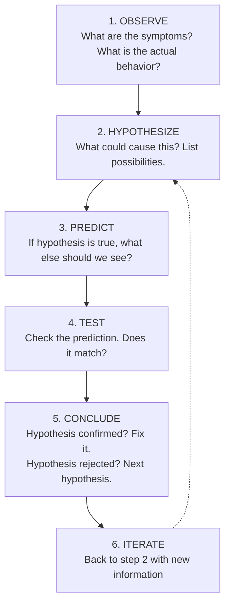
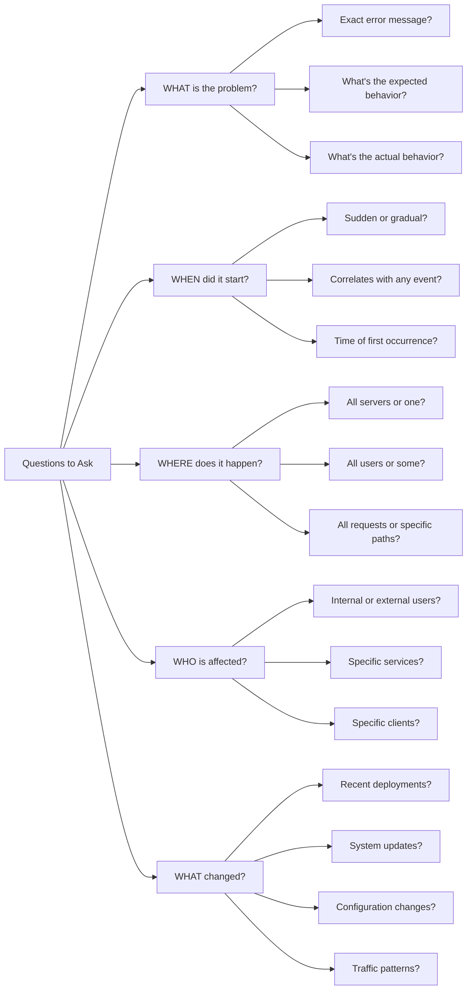
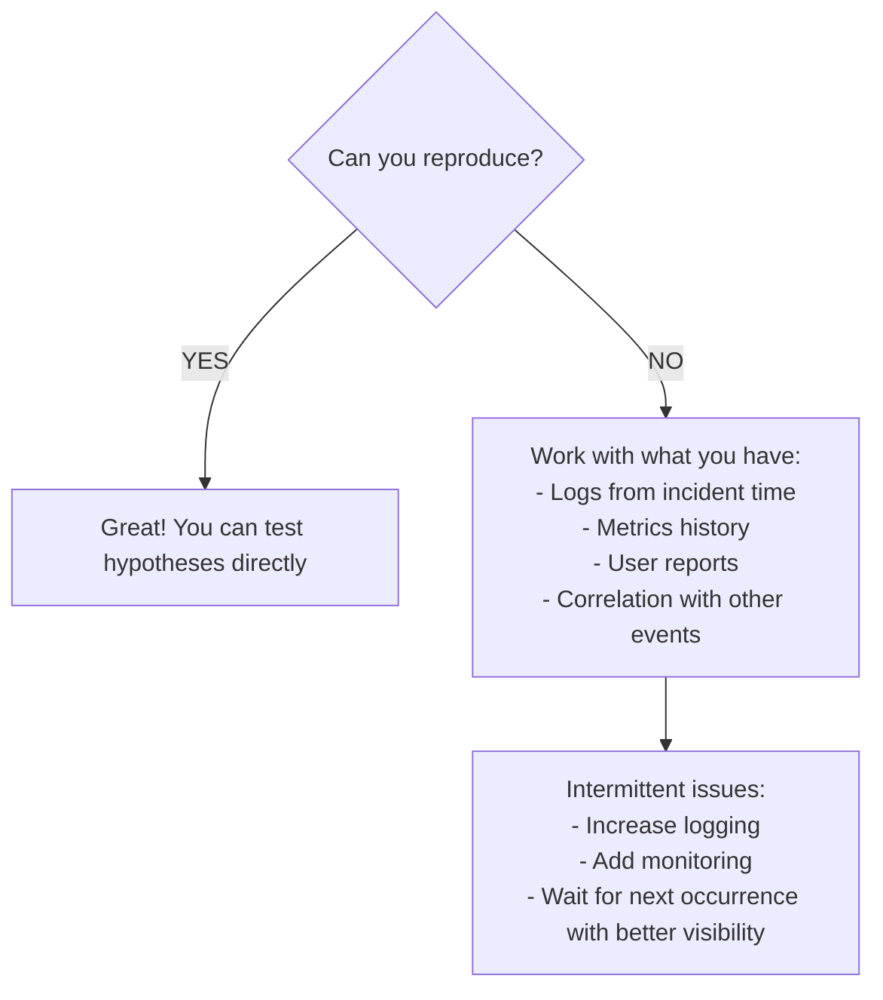

# Module 6.1: Systematic Troubleshooting

**Linux Troubleshooting** | Complexity: `[MEDIUM]` | Time: 25-30 min

This module teaches the operating discipline behind reliable debugging: how to slow down just enough to collect evidence, choose the next useful test, protect diagnostic state, and restore service without turning one fault into several new ones.

## Prerequisites

Before starting this module:

- **Required**: [Module 5.1: USE Method](/linux/operations/performance/module-5.1-use-method/)
- **Helpful**: Experience with production issues
- **Helpful**: Basic Linux command line familiarity

## Learning Outcomes

After this module, you will be able to:

- **Diagnose** Linux service failures by applying the scientific method from observation through conclusion.
- **Triage** severity and resource scope using first minute checks for CPU, memory, disk, network, and failed services.
- **Reproduce** and compare symptoms across users, hosts, pods, and time windows before making changes.
- **Evaluate** hypotheses with read-only tests, one change at a time, and recorded evidence.
- **Document** an incident timeline that supports handoff, post-incident review, and prevention work.

## Why This Module Matters

At 03:12 one Saturday, a regional retailer lost checkout across its web and mobile properties during a promotion that finance had expected to generate several million dollars in same-day revenue. The first responder saw 500 errors, restarted the checkout service, flushed a cache, and rolled back the most recent deployment within the first few minutes. Each action looked reasonable in isolation, but the combined effect erased the logs that showed database connection refusals, caused a cache stampede against an already memory-starved database, and made the later post-incident review depend on guesses instead of evidence.

The incident did not last because the team lacked Linux commands. It lasted because the team lacked a shared method for deciding which command came next and what decision the output should drive. The final root cause was ordinary: a database process had been killed under memory pressure after a batch job consumed more memory than expected. The expensive part was not the bug itself; the expensive part was the unstructured response that destroyed the trail, hid the trigger, and made every engineer argue from a different partial story.

Systematic troubleshooting is the opposite of heroic guessing. It gives you a repeatable loop: observe the real symptom, form a hypothesis, predict what else must be true if that hypothesis is correct, test with the least destructive command available, and update the timeline before you act. That loop is useful on a single Linux server, across a fleet of hosts, and inside a Kubernetes 1.35+ cluster where you should define `alias k=kubectl` once and then use `k` for routine checks.

The goal is not to make incidents feel calm. Production failures are stressful because customers, teammates, and business impact are real. The goal is to keep your thinking inspectable while the pressure is high, so each person joining the response can see what is known, what is merely suspected, what changed, and which next test has the best chance of reducing uncertainty.

## Diagnose Service Failures with the Scientific Method

The scientific method belongs in operations because computers are state machines with hidden context. A service that returns 500 errors is not telling you a root cause; it is exposing a symptom from some deeper mismatch between expected state and actual state. The disciplined move is to treat that symptom as the start of an investigation, not as permission to restart everything within reach.

When you diagnose Linux service failures with the scientific method, you separate evidence from interpretation. "The API returned HTTP 500 for checkout requests" is evidence. "The new deployment broke checkout" is a hypothesis. That distinction matters because evidence can be shared and rechecked, while a hypothesis must earn trust by making predictions that match reality.



This loop is slower than panic for the first minute and much faster for the next hour. Random changes create a confusing system where you no longer know whether the original fault still exists, whether your fix helped, or whether a new symptom was introduced by the response. A good hypothesis narrows the search space, and a good prediction tells you exactly what result would confirm or reject it.

For example, suppose checkout requests return 500 errors. One hypothesis is that the service cannot reach its database. If that is true, you would expect application logs to show connection failures, local health checks to fail when they touch database-backed endpoints, and network tests from the service host to the database port to fail or time out. Another hypothesis is that the process is restarting under memory pressure; that would predict recent OOM messages in `dmesg`, changing process start times, and perhaps failed readiness checks.

Pause and predict: before restarting a failed service, what evidence would disappear if the process exits cleanly and starts again? Write down at least two examples, such as in-memory counters, recent stderr output, open file handles, temporary files, or a distinctive process state visible in `systemctl status`.

A practical way to improve your hypotheses is to list them by likelihood and risk, not by drama. Ordinary causes deserve early checks because they are common, cheap to verify, and often fixable without broad change. Disk full, service not running, wrong configuration, expired certificate, blocked network path, exhausted memory, and permission mismatch are not glamorous, but they explain a large share of real outages.

```text
Symptom: "API returns 500 errors"

Hypotheses (by likelihood):
1. Database connection failed
2. Service crashed/restarting
3. Disk full (can't write logs/temp)
4. Memory exhausted (OOM)
5. Network partition
6. Bad deployment

Test each:
1. curl localhost:5432    # Can reach DB?
2. systemctl status api   # Service running?
3. df -h                  # Disk space?
4. dmesg | grep oom       # OOM events?
5. ping db-server         # Network?
6. k rollout status       # Deployment?
```

Notice that the test list is not a script to run blindly. It is a set of questions with expected implications. If `df -h` shows the relevant filesystem at full capacity, you have a plausible explanation for failed writes, but you still need to connect that evidence to the symptom. If `dmesg` shows the kernel OOM killer terminated the database, the next question becomes why memory pressure grew, not merely how quickly you can start the process again.

The scientific method also protects teams from status games during an incident. Instead of saying "I think the database is fine," you can say "The database accepts TCP connections from the API host, the service account can authenticate, and the slow query log did not spike during the incident window." That is more useful because another engineer can inspect the same evidence and build the next test from it.

War story: a platform team once spent most of an incident chasing a deployment because errors began within minutes of a release. The release was innocent. The real cause was an external certificate bundle update on a subset of hosts, which broke TLS validation only for calls leaving those hosts. The team found it after returning to the method: compare affected and unaffected hosts, predict what should differ, and test the smallest environmental difference first.

## Triage Severity and Resource Scope in the First Minute

Triage is not full diagnosis. It is the fast classification step that determines who must be involved, how loudly the incident should be escalated, and which parts of the system deserve attention first. A good first minute answers three questions: how bad is the customer impact, how wide is the blast radius, and whether the system is in danger of losing more diagnostic state.

The fastest path to resolution is often a fast path to the right boundary. If one host is unhealthy, you investigate that host. If every host in one availability zone fails, you investigate shared network, storage, or control-plane dependencies. If only one user path fails, you inspect the request path for that feature before digging through unrelated system logs.

```bash
# 1. What's happening now?
uptime                    # Load, uptime
dmesg | tail -20          # Kernel messages
journalctl -p err -n 20   # Recent errors

# 2. Resource state
free -h                   # Memory
df -h                     # Disk
top -bn1 | head -15       # CPU and processes

# 3. Network state
ss -tuln                  # Listening ports
ip addr                   # Network interfaces

# 4. What's running?
systemctl --failed        # Failed services
docker ps -a | head -10   # Containers (if applicable)
```

These commands are deliberately boring and mostly read-only. They give you a quick view of load, kernel complaints, recent service errors, memory pressure, disk exhaustion, listening sockets, interfaces, and failed units. You are not looking for every detail; you are looking for a major abnormality that explains the alert or changes the response priority.

The first-minute checks should be interpreted against the symptom. A load average of 12 is not automatically a problem on a host with many CPU cores, but it is meaningful if the host normally runs near idle and the application is timing out. A filesystem at 92% might be fine for a static partition, but it is dangerous if the remaining space is on `/var` and logs are growing quickly during an incident.

| Symptom | Likely Area | First Check |
|---------|-------------|-------------|
| "Can't connect" | Network | `ping`, `ss`, `iptables` |
| "Slow" | Performance | `top`, `iostat`, `vmstat` |
| "Permission denied" | Security | Permissions, SELinux, AppArmor |
| "Service won't start" | Service | `systemctl status`, logs |
| "Out of space" | Storage | `df -h`, `du -sh /*` |
| "Process crashed" | Application | Core dumps, logs, `dmesg` |

This table is a triage map, not a law of nature. "Can't connect" might be a service crash rather than a network issue, and "slow" might be a downstream dependency rather than local CPU. The value of the map is that it prevents you from beginning with a specialized theory before you have checked the common resource and service boundaries.

Before running a full diagnostic script, decide what result would force escalation. If `systemctl --failed` shows a critical database unit down, you may need the database owner immediately. If `df -h` shows the root filesystem full on every node in a pool, you may need incident command and a coordinated cleanup. If only one noncritical worker is unhealthy and traffic has drained away, you can proceed more quietly while preserving evidence.

In Kubernetes 1.35+ environments, the same triage habit applies at a different layer. Use `k get events --sort-by='.lastTimestamp' | tail -20` after defining the alias, but do not let Kubernetes events replace host-level thinking. A pod restart can be a symptom of Linux memory pressure, disk pressure, image pull failures, a bad rollout, or an application crash loop; you still need a hypothesis that connects the cluster event to the underlying mechanism.

## Reproduce and Compare Symptoms Across Boundaries

Reproduction is powerful because it gives you a controlled way to test hypotheses, but it is not always possible during live operations. Some incidents happen only under production traffic, only for a subset of users, or only when a scheduled job overlaps with another dependency. The systematic approach is to reproduce when safe, observe when reproduction is unsafe, and compare boundaries when the problem is intermittent.

The most useful troubleshooting questions are simple because they divide the problem along operational boundaries. What is the exact error message? When did it start? Where does it happen? Who is affected? What changed before the first failure? Each answer reduces ambiguity, especially when the incident is described in vague language such as "the site is down" or "the server is slow."



The "where" question is often the quickest way to escape tunnel vision. If all users fail from all locations, you are likely looking for a shared dependency. If only internal users fail, the public service may be healthy while private DNS, VPN routing, or an internal proxy is broken. If only one host fails, diffing that host against a healthy peer can expose package, kernel, route, certificate, or configuration differences.



If you can reproduce, make the reproduction narrow and repeatable. A vague statement such as "checkout fails sometimes" is hard to test. A useful reproduction says "POST `/checkout` with a saved card fails for users in region A when the cart contains a subscription item, but succeeds with a one-time item." That shape tells you which service path, data path, and dependency path to compare.

If you cannot reproduce, do not pretend you can. Work with logs, metrics history, user reports, event streams, and correlation across systems. Intermittent issues often require adding observability before the next occurrence, but that should be a deliberate action with a rollback plan, not a random burst of debug logging that fills disks or exposes sensitive data.

Pause and predict: if one application server fails a request while another server with the same release succeeds, which three differences would you compare first? Good answers usually include environment variables, OS or kernel version, routing or DNS configuration, local firewall state, package versions, and the exact application config file.

```bash
# Environment differences
env                              # Environment variables
cat /etc/os-release              # OS version
uname -r                         # Kernel version
which python && python --version # Language versions

# Network differences
ip route                         # Routing
cat /etc/resolv.conf             # DNS
iptables -L -n                   # Firewall

# Configuration differences
diff /etc/app/config.yaml /path/to/other/config.yaml
```

Comparison is most effective when you choose a healthy control. If you diff a broken host against a random laptop, you will drown in irrelevant differences. Compare one affected host with one unaffected host in the same role, same environment, and same deployment group whenever possible. The closer the control, the louder the meaningful differences become.

The phrase "it works on my machine" should not end the conversation; it should start a comparison plan. Your machine is a data point with a different environment, network path, credentials, cache state, and dependency graph. The goal is not to prove the reporter wrong. The goal is to identify the boundary where success turns into failure.

## Evaluate Hypotheses with Divide and Conquer

Divide and conquer is the operational version of binary search. Instead of testing every component from the user inward, you choose a point near the middle of the request path and learn which half still contains the fault. This is especially useful when the architecture has many layers and each layer has its own logs, dashboards, owners, and failure modes.

```bash
# Example: Web request failing
# Full path: Client -> DNS -> Network -> LB -> Pod -> App -> DB

# Step 1: Test middle of path
curl -I http://internal-lb/health
# If this works: problem is before LB (client, DNS, network)
# If this fails: problem is after LB (pod, app, db)

# Step 2: Test half of remaining path
# Continue until isolated
```

This technique works only when the test is chosen carefully. A health endpoint that does not touch the database can prove that the load balancer and pod are reachable, but it cannot prove that checkout is healthy. A direct database port test can prove network reachability, but it cannot prove that the application account has permission or that queries are fast enough under load.

Before running this, what output do you expect if DNS is broken for clients but the internal load balancer and application are healthy? You should expect direct tests from inside the network to succeed while client-side name resolution, public routing, or edge-layer tests fail. That expectation keeps you from treating every failed user request as an application bug.

In Kubernetes, divide and conquer usually means moving across layers deliberately. Start outside the cluster if the user sees a public failure, then test the ingress or load balancer, then the service, then the endpoints, then the pod, then the application dependency. With the `k` alias in place, commands such as `k get events`, `k describe pod`, and `k logs` are useful, but they should answer a question rather than become a reflexive sequence.

```bash
# Recent system changes
rpm -qa --last | head -20                    # Package installs
ls -lt /etc/*.conf | head -10                # Config changes
journalctl --since "1 hour ago" | tail -100  # Recent logs
last -10                                      # Recent logins

# Git history for config management
git log --oneline --since="2 hours ago"

# Kubernetes changes
k get events --sort-by='.lastTimestamp' | tail -20
```

Timeline analysis complements divide and conquer because most failures have a trigger. "It worked yesterday" is not a complaint to dismiss; it is a clue that some state changed. That state might be code, config, certificates, package versions, traffic, data size, disk usage, credentials, permissions, network policy, or a scheduled job that only appears under certain timing.

```bash
# Find what changed
# 1. Package changes
rpm -qa --last | head -20           # RHEL/CentOS
dpkg -l --no-pager | head -20       # Debian/Ubuntu

# 2. Config file changes
find /etc -mtime -1 -type f 2>/dev/null

# 3. Recent deployments
k get deployments -A -o json | \
  jq -r '.items[] | select(.metadata.creationTimestamp > "2026-01-01") | .metadata.name'

# 4. Cron jobs that ran
grep CRON /var/log/syslog | tail -20

# 5. System updates
cat /var/log/apt/history.log | tail -50  # Debian
cat /var/log/dnf.log | tail -50           # RHEL
```

The danger in "what changed?" is confirmation bias. If you personally deployed something, you may overfocus on that deployment because it is vivid and embarrassing. If another team changed a dependency, you may underweight it because it feels outside your area. A timeline is useful because it lists candidate changes in time order and lets evidence, not ownership, drive priority.

War story: an API team once rolled back three versions because a latency spike started after a release. The real trigger was a cron job that compressed a large log tree and saturated disk I/O on the database host. The release had merely increased traffic enough to reveal the shared bottleneck. Timeline analysis found the overlap; the USE Method explained the resource saturation.

## Diagnose Slow Systems Without Guessing

"It's slow" is one of the hardest symptoms because slowness can come from resource saturation, lock contention, network latency, retries, garbage collection, cold caches, slow downstream systems, or user perception. A systematic responder refuses to fix "slow" as a single category. They first ask which operation is slow, compared with what baseline, for which users, and during which time window.

The USE Method from the previous module gives you a practical first pass: utilization, saturation, and errors for each major resource. For CPU, ask whether the processors are busy or whether runnable work is queued. For memory, ask whether the system is swapping or killing processes. For disk, ask whether service time and queueing indicate I/O pressure. For network, ask whether connections, retransmits, drops, or interface errors changed.

```bash
# CPU saturation?
uptime
vmstat 1 5

# Memory pressure?
free -h
vmstat 1 5 | awk '{print $7, $8}'  # si/so

# Disk bottleneck?
iostat -x 1 5

# Network?
ss -s
sar -n DEV 1 5

# If all OK, it's application-level
```

The last comment in that block is intentionally cautious. If CPU, memory, disk, and network look normal on one host, the problem might be application-level, but it might also be remote storage, a downstream dependency, a lock in another process, or a problem on only some hosts. "All OK" means "this slice did not explain the symptom," not "Linux is innocent."

Slow systems reward baselines. A one-second response is excellent for a batch export and terrible for a login endpoint. A load average of 8 may be normal for a worker with many CPU cores and alarming for a tiny virtual machine. Without a baseline, you are comparing current behavior against instinct, which is a poor instrument during stress.

When you test a performance hypothesis, keep the measurement tied to the hypothesis. If you suspect disk I/O, run `iostat -x 1 5` while reproducing the slow operation and look for queueing, wait time, and device utilization. If you suspect memory pressure, watch swap-in and swap-out columns during the incident window. If you suspect network pressure, compare interface counters and socket states with normal traffic.

The safest performance fixes are often traffic or blast-radius controls before deep tuning. Draining one bad host, disabling a noncritical batch job, reducing concurrency, or rolling back a risky feature flag can restore enough headroom to investigate. Tuning connection pools, cache sizes, or kernel parameters without evidence can make the system less stable and hide the true bottleneck.

## Test Safely and Change One Thing

Testing safely is a discipline of preserving options. Read-only commands come first because they collect state without changing the system under observation. Non-destructive probes come next because they test reachability, resolution, or service behavior without forcing a restart or deleting evidence. Destructive changes come last, and only when the expected benefit outweighs the diagnostic cost.

```bash
# Read-only commands first
cat /var/log/app.log      # Read logs
systemctl status service  # Check status
curl -I endpoint          # Test connectivity

# Non-destructive tests
ping host                 # Network reachability
dig domain                # DNS resolution
telnet host port          # Port connectivity

# Careful with write operations
# - Don't restart unless sure
# - Don't change config without backup
# - Don't delete files without understanding

# If you must change something:
cp config.yaml config.yaml.bak  # Backup first
```

One change at a time is not bureaucratic neatness; it is how you preserve causality. If you restart the service, change the config, and clear a cache in one motion, a later recovery teaches you almost nothing. You will not know which action helped, whether all were necessary, or whether one action quietly created future risk.

The "one change" rule has exceptions during severe incidents, but the exception should be explicit. If customer impact is high and you must restore service immediately, you may choose a low-risk rollback or traffic shift before root cause is proven. Even then, capture the state first when possible, announce the hypothesis, record the exact action, and measure the result afterward.

Good tests have a predicted outcome and an interpretation plan. "Run `systemctl status`" is weaker than "If the service is crash-looping, `systemctl status` should show a recent exit status and journal lines; if it is running but unhealthy, the process will be active while application health checks fail." That extra sentence prevents you from collecting output without learning from it.

Documentation belongs inside the test loop, not after the incident when memory has decayed. A short note saying "09:06, hypothesis: database unreachable; test: TCP from API host to database; result: connection refused" is enough to help the next responder. You do not need literary detail. You need a timestamped chain from symptom to test to conclusion.

```bash
# Start a script session
script troubleshooting-$(date +%Y%m%d-%H%M).log

# Or use shell history
history | tail -50

# Note your findings
echo "# $(date): Hypothesis: disk full" >> notes.md
echo "# Result: df shows 95% on /var" >> notes.md
```

The `script` command is useful when you need a transcript, but transcripts can capture sensitive output. Be careful with secrets, customer data, and credentials. If you use a shared incident document, summarize important results and link to safe logs rather than pasting private data into a place with broad access.

```text
TIME        EVENT
09:00       First alert: API errors
09:02       Checked dashboard: error rate 50%
09:05       SSH to api-server-1
09:06       Checked logs: "Connection refused to db"
09:08       SSH to db-server
09:09       MySQL not running
09:10       dmesg shows OOM kill
09:12       Increased memory limit
09:14       Started MySQL
09:15       API recovering
09:20       Error rate back to normal
```

This incident timeline is small, but it answers the questions that matter later. It shows the first known impact, the observed error, the path from API to database, the evidence of an OOM kill, the recovery action, and the time service returned to normal. A post-incident review can now ask why memory pressure occurred and why the alert fired only after user impact.

## Document the Incident Timeline for Handoff and Prevention

Handoff is where many investigations lose their shape. The first responder has context in their head, the second responder arrives with fresh energy, and both people accidentally repeat checks because the evidence is scattered across terminals and chat messages. A written timeline turns the incident from a personal memory into a shared artifact.

The timeline should include observation, hypothesis, test, result, action, and impact. That sounds heavy, but each entry can be one sentence. "09:18, tested DB TCP from api-server-1 with `curl localhost:5432`; connection refused, supports database-down hypothesis" is more useful than a long paragraph that says the database "seems broken."

Good incident notes distinguish mitigation from root cause. Starting MySQL may mitigate the outage, but the root cause might be memory pressure from a batch job, a configuration regression, a data growth pattern, or a kernel setting that made the host fragile. If the notes blur mitigation and cause, the post-incident review will produce shallow fixes and the same class of incident will return.

Documentation also protects against cognitive bias. When people are tired, they remember the final theory and forget rejected alternatives. A timeline that records rejected hypotheses is valuable because it prevents the team from revisiting the same dead ends during the incident and helps reviewers understand why the response path was reasonable from the evidence available at the time.

For prevention work, the timeline should end with a few concrete follow-ups. Add an alert on memory pressure before the OOM killer acts. Limit the batch job. Document the database restart procedure. Add a readiness check that exercises the dependency path that actually failed. These are not random tasks; they are direct responses to the chain of evidence.

The best handoff notes also name uncertainty directly. If you do not know whether the database stopped before or after the API error spike, write that down instead of smoothing the story. Clear uncertainty helps the next responder choose a useful test, while false confidence sends them toward confirmation work. A timeline is strongest when it separates "observed," "inferred," and "not yet known" without making the writer look indecisive.

During a long incident, update the timeline when a decision changes the system. Draining a host, scaling a deployment, restarting a service, deleting a large file, or disabling a job should each have a timestamp and a reason. These entries become the map for rollback if the action makes things worse, and they help reviewers distinguish the original fault from side effects introduced during recovery.

## Patterns & Anti-Patterns

Pattern: start with observation and blast radius. Use this when the alert is vague, multiple systems are involved, or customer impact is unclear. It works because you avoid treating the first visible symptom as the whole failure, and it scales because incident command can route owners based on affected boundary rather than personal guesses.

Pattern: test from the middle of the path. Use this when a request crosses several layers such as client, DNS, load balancer, service, pod, application, and database. It works because each test eliminates a large part of the path, and it scales when teams agree on stable health endpoints and known-good vantage points.

Pattern: compare a failing target with a healthy peer. Use this when the problem affects only some users, hosts, pods, or regions. It works because two similar systems should differ in fewer meaningful ways, and it scales when configuration management, image tagging, and inventory data make differences easy to inspect.

Pattern: record every hypothesis-changing observation. Use this when an incident lasts longer than a few minutes or multiple people are joining. It works because the team can build on the same evidence, and it scales because post-incident reviews can turn the timeline into prevention work without relying on memory.

Anti-pattern: random restarts. Teams fall into it because restarts sometimes restore service and feel decisive under pressure. The better alternative is to capture current state first, check recent logs, inspect process status, and restart only when you can explain what evidence you are willing to lose and what success should look like.

Anti-pattern: changing several things at once. Teams fall into it because they want to show progress and because multiple plausible fixes are nearby. The better alternative is to make one reversible change, measure the result, and record the action, unless the incident commander explicitly chooses a broader mitigation because customer impact justifies the diagnostic cost.

Anti-pattern: treating the newest deployment as guilty without evidence. Teams fall into it because recent change is a powerful clue and rollbacks are familiar. The better alternative is timeline analysis that includes deployments, package updates, certificate changes, data growth, cron jobs, traffic shifts, and dependency changes, then tests the highest-value hypotheses in order.

Anti-pattern: stopping at mitigation. Teams fall into it because the dashboard turns green and everyone is tired. The better alternative is to keep the timeline open long enough to identify the trigger, the missing detection, and the smallest prevention work that would reduce recurrence or speed diagnosis next time.

## Decision Framework

Choose the next troubleshooting move by asking which action reduces the most uncertainty for the least risk. If the system is actively losing customer traffic, first identify whether a low-risk mitigation can narrow impact while preserving evidence. If the system is stable enough to inspect, collect read-only state before touching configuration, processes, caches, or data.

When the failure path is long, use divide and conquer. Test a midpoint such as an internal load balancer, service endpoint, or dependency connection, then move toward the failing half. When the problem affects only some targets, use comparison. Pick one affected and one unaffected target with the same role, then compare environment, routing, package versions, config files, logs, and recent changes.

When the symptom is slowness, use resource triage before application tuning. Check CPU, memory, disk, and network with the USE Method, then decide whether the bottleneck is local, remote, or application-specific. If resource signals are inconclusive, move to traces, logs, dependency dashboards, and controlled reproduction rather than guessing at pool sizes or cache settings.

When the proposed action would destroy evidence, require a stronger reason. Restarting a process, deleting files, clearing a cache, or rolling back a deployment may be appropriate, but those actions should have an owner, a prediction, a rollback path, and a note in the incident timeline. This is how you balance recovery pressure with learning.

Use this simple sequence during live work: observe the exact symptom, classify severity and blast radius, capture volatile state, form two or three hypotheses, choose the safest test that distinguishes between them, make at most one change, measure the outcome, and document the result. If a test surprises you, treat the surprise as new evidence, not as a reason to force the old theory.

The framework should also change with the incident phase. In the first few minutes, the dominant question is usually "what is the blast radius and do we need mitigation now?" During active diagnosis, the dominant question becomes "which hypothesis explains the evidence with the fewest unsupported assumptions?" After recovery, the dominant question changes again to "what evidence proves the trigger, and what prevention work follows from that trigger?" Teams that use the same question for every phase either overanalyze during customer impact or stop thinking once the graphs recover.

Choose communication that matches the decision point. A responder running a read-only check can simply post the hypothesis and result. A responder about to restart a database, roll back a deployment, or clear a cache should state the expected benefit, the evidence that supports it, the risk, and the rollback plan. This small discipline prevents silent, high-impact changes and gives incident command a chance to coordinate around customer impact.

When several hypotheses remain plausible, prefer the test that can reject more than one theory. For example, testing from an affected host to a dependency can distinguish network reachability, DNS resolution, and dependency availability more efficiently than reading unrelated application logs. A high-value test is not always the fastest command to type; it is the command whose result will most clearly change the next decision.

Finally, make the framework visible to the team. Saying "I am testing the database-reachability hypothesis from the API host, and I expect connection refused if the database is down" is much more useful than saying "checking DB." Visible reasoning lets other responders spot flawed assumptions, suggest a better vantage point, or take a non-overlapping task without duplicating your work.

If you feel stuck, return to boundaries instead of adding more commands. Ask whether the problem is isolated by user, host, service, dependency, resource, or time window, then choose the boundary with the sharpest contrast between healthy and unhealthy behavior. That reset often reveals a cleaner test than another page of logs.

## Did You Know?

- **Google's SRE guidance treats troubleshooting as hypothesis testing**: the effective troubleshooting chapter emphasizes observing, theorizing, testing, and treating false leads as useful information rather than wasted effort.
- **The Linux OOM killer leaves evidence in kernel logs**: `dmesg` and the journal can show which process was killed, which is why restarting before checking kernel messages can erase the most useful context.
- **The `script` command has existed for decades**: it remains useful because a terminal transcript can preserve exact commands and outputs during stressful incidents, provided sensitive data is handled carefully.
- **Rubber duck debugging works because explanation exposes assumptions**: saying the problem aloud forces your brain to make hidden leaps explicit, which often reveals the next useful test before anyone else replies.

## Common Mistakes

| Mistake | Why It Happens | How to Fix It |
|---------|----------------|---------------|
| Random restarts | Restarting feels fast and sometimes clears symptoms, so responders skip evidence collection. | Capture `systemctl status`, recent logs, kernel messages, and resource state before restarting unless impact demands immediate mitigation. |
| Changing multiple things | Pressure makes every plausible fix feel worth trying at once. | Make one reversible change, record it, measure the result, and only then choose the next action. |
| Not documenting | The responder assumes they will remember the sequence after the incident. | Keep a timestamped timeline with symptom, hypothesis, test, result, action, and impact. |
| Assuming the obvious | Recent deployments, familiar failures, or personal ownership bias dominate attention. | Treat the obvious explanation as a hypothesis and require predictions that match evidence. |
| Tunnel vision | Early evidence points in one direction, and the team stops checking alternatives. | Step back at each rejected hypothesis and ask which boundary or comparison would reduce uncertainty next. |
| Not asking for help | Engineers worry that escalation looks like failure or wastes another person's time. | Escalate when blast radius, business impact, or ownership boundary exceeds your authority or context. |
| Ignoring reproduction limits | Teams try to force a production-only failure into an unrealistic local test. | Reproduce when safe, otherwise use logs, metrics, user reports, and targeted observability for the next occurrence. |

## Quiz

<details><summary>Question 1: Your payment service crashes during peak traffic, and the team lead asks for an immediate restart. How do you diagnose the Linux service failure without losing the most important evidence?</summary>

First capture volatile state with read-only commands such as `systemctl status`, `journalctl -u`, `dmesg`, `free -h`, and `df -h` before restarting. The reason is that a restart can clear process state, rotate logs, change timestamps, and hide whether the process was killed by memory pressure or failed on its own. If customer impact requires a restart, record that tradeoff explicitly and measure whether the symptom returns after the service starts.

</details>

<details><summary>Question 2: A website is down for external users, but an engineer can curl the application from inside the private network. How should you triage severity and resource scope before digging into application code?</summary>

Treat the successful internal curl as evidence that the application may be healthy from that vantage point, then test the external half of the path: DNS, CDN or edge, public load balancer, and routing. You should still check severity by confirming affected users, regions, and business impact, but the scope is probably upstream of the private application path. This prevents a costly distraction where the team reads application logs while the real fault lives at the edge.

</details>

<details><summary>Question 3: Support reports that only some users see timeout errors after no planned deployment. How would you reproduce and compare symptoms across users, hosts, pods, and time windows?</summary>

First define the exact failing request, affected user group, and time window, then compare an affected path with an unaffected path that is otherwise similar. If reproduction is safe, run the same request from different networks, hosts, or pods and record which boundary changes the result. If reproduction is not safe or the fault is intermittent, rely on logs, metrics, and targeted added observability rather than forcing a local reproduction that does not match production.

</details>

<details><summary>Question 4: Your API returns 500 errors, and the newest deployment happened nearby in time. How do you evaluate hypotheses with read-only tests and one change at a time?</summary>

Start by treating the deployment as one candidate, not as a proven cause. Form predictions for several hypotheses, such as bad config, database connection failure, disk full, or OOM kill, then test them with logs, health checks, `df -h`, `dmesg`, and dependency reachability. If you choose a rollback, make it one recorded action and measure the result, because combining rollback with restarts and cache clears destroys causality.

</details>

<details><summary>Question 5: A slow batch job coincides with high API latency, but CPU usage on the API hosts looks normal. What should you check next, and why?</summary>

Normal CPU on the API hosts only rejects one local resource hypothesis. You should check disk I/O, memory pressure, network state, downstream database latency, queue depth, and whether the batch job shares a dependency with the API path. Slowness is often caused by waiting on something remote or contended, so the next test should follow the request path and compare metrics during the same time window.

</details>

<details><summary>Question 6: A junior engineer fixed an issue by increasing a pool size, clearing a cache, and restarting a service together. What is the operational risk in that success?</summary>

The service may recover, but the team has lost the ability to know which action mattered. Increasing a pool might have helped, the restart might have cleared a bad state, or the cache clear might have temporarily hidden a dependency problem while creating future load. The safer practice is one reversible change at a time with a recorded prediction and measurement, unless an explicit incident decision accepts the loss of diagnostic clarity.

</details>

<details><summary>Question 7: After mitigation, the dashboard is green and everyone wants to leave. What should the incident timeline still document for handoff, post-incident review, and prevention?</summary>

The timeline should record the first known impact, key observations, hypotheses tested, rejected paths, mitigation action, recovery time, and the evidence pointing toward root cause. It should also separate mitigation from root cause so the team does not mistake "we restarted the database" for "we fixed memory pressure." Good prevention work comes from that chain: add earlier alerts, limit the triggering job, improve readiness checks, or document the runbook gap revealed by the incident.

</details>

## Hands-On Exercise

### Practicing Systematic Troubleshooting

**Objective**: Apply troubleshooting methodology to a simulated problem.

**Environment**: Any Linux system

This exercise is intentionally local and safe. You will collect a baseline, simulate a small disk-space symptom in `/tmp`, test hypotheses, inspect recent changes, and document the session. The commands should run on a normal Linux workstation or lab VM, though service names and permissions can vary by distribution.

#### Part 1: Initial Triage Script

Create a reusable triage script first, because repeatability matters when you are tired or switching between hosts. The script does not diagnose every possible issue; it captures a fast snapshot of load, memory, disk, recent errors, failed services, top processes, and listening sockets so you can choose the next hypothesis from evidence.

```bash
# Create a triage script
cat > /tmp/triage.sh << 'EOF'
#!/bin/bash
echo "=== System Triage $(date) ==="
echo ""
echo "--- Uptime & Load ---"
uptime
echo ""
echo "--- Memory ---"
free -h
echo ""
echo "--- Disk ---"
df -h | grep -v tmpfs
echo ""
echo "--- Recent Errors ---"
journalctl -p err -n 10 --no-pager 2>/dev/null || dmesg | tail -10
echo ""
echo "--- Failed Services ---"
systemctl --failed 2>/dev/null || echo "N/A"
echo ""
echo "--- Top Processes ---"
ps aux --sort=-%cpu | head -5
echo ""
echo "--- Network Listeners ---"
ss -tuln | head -10
EOF
chmod +x /tmp/triage.sh

# Run it
/tmp/triage.sh
```

<details><summary>Solution notes for Part 1</summary>

The expected result is a readable system snapshot. If some commands require privileges or are unavailable, note that as part of the environment rather than treating it as exercise failure. The important behavior is that you collect read-only state before changing anything.

</details>

#### Part 2: Simulate and Diagnose

The simulation uses a temporary file to create a visible storage change without touching application data. The point is not that every incident is disk space; the point is that the symptom, hypothesis, test, conclusion, and fix are separated so you can see the method.

```bash
# Simulate: Fill up /tmp (safely)
dd if=/dev/zero of=/tmp/bigfile bs=1M count=100 2>/dev/null

# Now imagine you get alert: "Application failing"
# Apply methodology:

# 1. OBSERVE: What's the symptom?
echo "Symptom: Application reports 'cannot write file'"

# 2. HYPOTHESIZE: What could cause this?
echo "Hypotheses: 1) Disk full, 2) Permissions, 3) Process limit"

# 3. TEST Hypothesis 1
df -h /tmp
# Shows /tmp usage

# 4. CONCLUDE
echo "Root cause: /tmp filled by bigfile"

# 5. FIX
rm /tmp/bigfile
df -h /tmp
```

<details><summary>Solution notes for Part 2</summary>

The correct diagnosis is that `/tmp` usage changed because the exercise created `/tmp/bigfile`. In a real incident you would also ask why the file appeared, whether other filesystems are affected, and whether cleanup is safe. Here the file is intentionally known and removable.

</details>

#### Part 3: Timeline Analysis

Recent changes are not limited to application deployments. Package changes, config edits, logins, and scheduled jobs can all explain a failure that appears to arrive "from nowhere." Use these checks to build a change timeline before choosing a fix.

```bash
# Find recent changes on your system

# 1. Recent package changes
if command -v rpm &>/dev/null; then
  rpm -qa --last | head -10
elif command -v dpkg &>/dev/null; then
  ls -lt /var/lib/dpkg/info/*.list | head -10
fi

# 2. Recent config changes
find /etc -type f -mtime -7 2>/dev/null | head -10

# 3. Recent logins
last -10

# 4. Recent cron runs
grep CRON /var/log/syslog 2>/dev/null | tail -10 || \
journalctl -u cron -n 10 --no-pager 2>/dev/null
```

<details><summary>Solution notes for Part 3</summary>

You should produce a short list of candidate changes, not a final root cause. The useful habit is to place changes on a timeline and correlate them with the first symptom. If a command returns no data because of permissions or distribution differences, record that limit.

</details>

#### Part 4: Hypothesis Testing Practice

This practice scenario is "can't SSH to server." The commands test reachability, service state, listening port, and firewall hints in separate steps. Even though localhost is used for safety, the structure mirrors a real remote investigation.

```bash
# Scenario: "Can't SSH to server"
# Let's test hypotheses systematically

# Hypothesis 1: Network unreachable
ping -c 1 localhost > /dev/null && echo "H1: Network OK" || echo "H1: Network problem"

# Hypothesis 2: SSH not running
systemctl is-active sshd 2>/dev/null || \
  systemctl is-active ssh 2>/dev/null || \
  echo "SSH service check (verify manually)"

# Hypothesis 3: Port not listening
ss -tuln | grep :22 > /dev/null && echo "H3: Port 22 listening" || echo "H3: Port 22 not listening"

# Hypothesis 4: Firewall blocking
iptables -L INPUT -n 2>/dev/null | grep -q "dpt:22" && echo "H4: SSH in firewall rules" || echo "H4: Check firewall"
```

<details><summary>Solution notes for Part 4</summary>

The exact output depends on whether SSH is installed and running on your system. The lesson is that each command maps to a different hypothesis. Do not treat a failed SSH service check as proof of firewall trouble, and do not treat a successful ping as proof that SSH should work.

</details>

#### Part 5: Document Your Process

Finish by documenting the investigation as it happens. This small logging function is enough to model the incident habit: timestamp, observation, hypothesis, test, action, and result. In a real incident, share the timeline where responders can see it.

```bash
# Start logging
LOGFILE=/tmp/troubleshooting-$(date +%Y%m%d-%H%M).log

# Function to log with timestamp
log() {
  echo "[$(date +%H:%M:%S)] $*" | tee -a $LOGFILE
}

# Example session
log "Starting investigation: high load average"
log "Current load: $(uptime)"
log "Checking top processes..."
ps aux --sort=-%cpu | head -5 >> $LOGFILE
log "Hypothesis: runaway process"
log "Action: None yet, gathering more info"

# Review log
cat $LOGFILE
```

<details><summary>Solution notes for Part 5</summary>

Your log should show a clear sequence rather than a pile of unrelated output. If another engineer can read it and understand what you observed, what you suspected, what you tested, and what you did not change, it is doing its job.

</details>

### Success Criteria

- [ ] Diagnose Linux service failures by applying the scientific method to the simulated problem.
- [ ] Triage severity and resource scope using the first minute checks for CPU, memory, disk, network, and failed services.
- [ ] Reproduce and compare symptoms across users, hosts, pods, or time windows before making changes.
- [ ] Evaluate hypotheses with read-only tests, one change at a time, and recorded evidence.
- [ ] Document an incident timeline that supports handoff, post-incident review, and prevention work.

## Key Takeaways

Methodology beats guesswork because it converts stress into a sequence of inspectable decisions. You observe the symptom, state the hypothesis, predict what else should be true, test safely, and update the conclusion. That loop does not remove pressure, but it prevents pressure from choosing your commands for you.

Gather information before acting whenever the system allows it. Restarts, rollbacks, cache clears, and file deletion can be legitimate mitigations, but they also change the evidence. If you decide to act before root cause is proven, say why, record the tradeoff, and measure the result.

"What changed?" remains one of the most powerful troubleshooting questions, but it must include more than deployments. Packages, certificates, data size, scheduled jobs, traffic shape, credentials, configuration, and provider behavior can all change the state around a stable application. A timeline keeps that search honest.

## Next Module

Next, continue to [Module 6.2: Log Analysis](/linux/operations/troubleshooting/module-6.2-log-analysis/) to learn how system logs turn symptoms, hypotheses, and incident timelines into stronger evidence.

## Sources

- [Google SRE Book - Effective Troubleshooting](https://sre.google/sre-book/effective-troubleshooting/)
- [Brendan Gregg's USE Method](https://www.brendangregg.com/usemethod.html)
- [How to Debug Anything](https://www.youtube.com/watch?v=0Vl8i5QwKp8)
- [Rubber Duck Debugging](https://rubberduckdebugging.com/)
- [systemd journalctl manual](https://www.freedesktop.org/software/systemd/man/latest/journalctl.html)
- [systemd systemctl manual](https://www.freedesktop.org/software/systemd/man/latest/systemctl.html)
- [Linux kernel OOM documentation](https://docs.kernel.org/mm/oom.html)
- [Linux man-pages: dmesg](https://man7.org/linux/man-pages/man1/dmesg.1.html)
- [Kubernetes docs: Debug Running Pods](https://kubernetes.io/docs/tasks/debug/debug-application/debug-running-pod/)
- [Kubernetes docs: Events](https://kubernetes.io/docs/reference/kubernetes-api/cluster-resources/event-v1/)
- [Red Hat: Getting started with systemd](https://docs.redhat.com/en/documentation/red_hat_enterprise_linux/9/html/configuring_basic_system_settings/assembly_getting-started-with-systemd_configuring-basic-system-settings)
- [Ubuntu Server documentation: Logs](https://documentation.ubuntu.com/server/explanation/logs/)
