```mermaid
graph TD
    classDef category fill:#f9f9f9,stroke:#333,stroke-width:2px;
    classDef item fill:#fff,stroke:#666,stroke-width:1px;

    ROOT[Log Sources]
    
    ROOT --> TRAD[Traditional syslog]
    ROOT --> MOD[Modern journald]
    ROOT --> APP[Application-specific]
    ROOT --> CONT[Container logs]

    TRAD --> T1["/var/log/syslog"]
    TRAD --> T2["/var/log/messages"]
    TRAD --> T3["/var/log/auth.log"]
    TRAD --> T4["/var/log/kern.log"]

    MOD --> M1["journalctl"]
    MOD --> M2["journalctl -u service"]
    MOD --> M3["journalctl _COMM=sshd"]
    MOD --> M4["journalctl -k"]

    APP --> A1["/var/log/nginx/access.log"]
    APP --> A2["/var/log/mysql/error.log"]
    APP --> A3["/var/log/apache2/error.log"]
    APP --> A4["Custom locations"]

    CONT --> C1["docker logs <container>"]
    CONT --> C2["kubectl logs <pod>"]
    CONT --> C3["journalctl CONTAINER_NAME=..."]
    CONT --> C4["Node: /var/log/pods/..."]

    class TRAD,MOD,APP,CONT category;
    class T1,T2,T3,T4,M1,M2,M3,M4,A1,A2,A3,A4,C1,C2,C3,C4 item;
```

# Module 6.2: Log Analysis

> **Linux Troubleshooting** | Complexity: `[MEDIUM]` | Time: 25-30 min for a focused learner, with extra practice time encouraged if you are new to production log formats.

## Prerequisites

Before starting this module, make sure you can navigate a shell, recognize basic systemd service names, and read simple regular expressions without treating every symbol as magic.

- **Required**: [Module 6.1: Systematic Troubleshooting](../module-6.1-systematic-troubleshooting/)
- **Required**: [Module 1.2: Processes & Systemd](/linux/foundations/system-essentials/module-1.2-processes-systemd/)
- **Helpful**: Basic regex knowledge

## Learning Outcomes

After this module, you will be able to make evidence-based troubleshooting decisions instead of scrolling through logs and hoping the right line announces itself.

- **Diagnose** Linux and Kubernetes failures by querying `journalctl`, text logs, and pod logs with time, priority, service, and container filters.
- **Correlate** events across system logs, application logs, kernel messages, and Kubernetes logs to build a defensible incident timeline.
- **Evaluate** recurring log patterns such as connection failures, permission errors, resource exhaustion, and authentication failures to infer likely root causes.
- **Design** a practical log retention and aggregation approach that keeps evidence available without letting logs consume the system.

## Why This Module Matters

In 2017, British Airways suffered a major IT outage that disrupted flights across London airports and forced thousands of passengers into cancellations, delays, and manual recovery work. Public reporting described costs in the tens of millions of pounds, but the operational pain was not only financial: teams had to reconstruct which services failed first, which alarms were symptoms, and which restart actions made recovery better or worse. During incidents like that, logs become the closest thing an engineering team has to a flight recorder, and the team that can read them calmly has a decisive advantage over the team that only reacts to the loudest error message.

Modern Linux systems generate logs from many layers at once. The kernel records device, memory, and networking events; `systemd-journald` indexes service messages; traditional files under `/var/log` hold syslog, authentication, package, web server, and database history; container runtimes collect stdout and stderr; Kubernetes exposes a simplified view through `kubectl logs`, and later examples define `alias k=kubectl` before using the shorter `k logs` form. A single outage might leave useful clues in all of those places, and the important evidence is often not the first scary line you find but the sequence of smaller events that led to it.

This module teaches log analysis as an investigation discipline rather than a list of commands. You will start by choosing the right source, narrow the search with time and service filters, recognize common failure patterns, and then correlate events into a timeline that can support a root-cause hypothesis. The goal is not to memorize every flag; the goal is to debug deliberately when a production system is noisy, partial, and under pressure.

## Log Sources: Choosing the Right Evidence

The first mistake in log analysis is treating "the logs" as one place. Linux actually offers a set of overlapping evidence stores, and each one answers a different kind of question. `journalctl` is best when you need indexed access to systemd units, boot sessions, priorities, and kernel messages. Text files under `/var/log` are best when an application or distribution still writes traditional syslog-style records. Kubernetes pod logs are best when the application streams to stdout and stderr, while node-level logs are necessary when the kubelet, container runtime, or kernel is involved.

Think of log sources as witnesses standing in different rooms. The web server might know that a request returned a 500, the application might know that a database call timed out, the database might know that connections were rejected, and the kernel might know that the host was under memory pressure. A good troubleshooter does not ask every witness every question; they decide which witness is closest to the event, then use timestamps to reconcile the stories.



The diagram preserves the practical map you need during an incident. Traditional syslog locations vary by distribution, so Ubuntu and Debian usually emphasize `/var/log/syslog` and `/var/log/auth.log`, while RHEL-family systems often use `/var/log/messages` and `/var/log/secure`. `journald` exists on most modern systemd hosts and can expose the same events through structured fields. Application-specific paths remain common for NGINX, Apache, MySQL, PostgreSQL, and custom services, especially when a team has not standardized stdout logging.

Notice that the map is organized by ownership as much as by file path. Kernel and runtime logs are usually owned by platform or infrastructure teams, application logs by service teams, and authentication logs by operations or security teams. During a real incident, those ownership boundaries can slow diagnosis because each group sees only the evidence they normally operate. A useful log-analysis habit is to name the boundary explicitly: "this looks like an application symptom, but the next question belongs to the node."

| Log File | Purpose |
|----------|---------|
| `/var/log/syslog` or `/var/log/messages` | General system logs |
| `/var/log/auth.log` or `/var/log/secure` | Authentication events |
| `/var/log/kern.log` | Kernel messages |
| `/var/log/dmesg` | Boot messages |
| `/var/log/apt/` or `/var/log/dnf.log` | Package manager logs |

When an alert fires, start with a hypothesis about the layer. If users see HTTP 500 errors, check the application and web server first, but keep system logs nearby because disk pressure, DNS failures, and OOM kills often masquerade as application defects. If SSH logins fail, authentication logs are closer than web logs. If a pod restarts, Kubernetes events and previous container logs are closer than the current stdout stream. The discipline is to choose a first source intentionally, then let evidence pull you outward.

Time synchronization quietly underpins this whole workflow. If two hosts disagree about the current time, a timeline can make an effect appear before its cause, and engineers may chase impossible sequences. In well-run environments, NTP or another time synchronization service is part of the logging system even though it does not look like one. When evidence from two systems refuses to line up, check timezone, clock skew, and timestamp precision before assuming one component lied.

Pause and predict: if you need to correlate a database error with a web server error, what is the most reliable piece of information to use across both log sources? The answer is not the severity label or the exact wording of the message, because those are application-specific. The answer is a timestamp, ideally with a known timezone and enough precision to compare events that happened within seconds of one another.

A realistic war story looks like this: an API team sees elevated 502 responses from NGINX and immediately restarts the application deployment. The restart lowers the error rate for a few minutes, but the issue returns because the real cause was a kernel-level conntrack table exhaustion on the node. The NGINX access log proved user impact, the application log showed retries, `journalctl -k` showed dropped connections, and the kubelet log showed pods being recreated on the same unhealthy node. No single log source told the whole truth.

That story also shows why logs need interpretation rather than blind trust. The first 502 line was true, but it was not sufficient. The application retries were true, but they were symptoms of network state rather than a bug in retry code. The kubelet messages were true, but they described recovery attempts, not the original trigger. Log analysis is the craft of preserving all of those truths while refusing to promote the first one you found into the root cause.

## Querying journald Without Drowning in Noise

`journalctl` exists because plain text logs are difficult to query when the system is busy. `systemd-journald` stores entries with structured metadata such as unit, priority, boot ID, process ID, executable name, user ID, and monotonic timestamps. That structure lets you ask narrower questions: "show me errors from nginx during the last hour," "show me kernel messages from the previous boot," or "show me messages emitted by a process named sshd." During an outage, that difference matters because printing everything is usually the slowest path to understanding anything.

```bash
# All logs
journalctl

# Follow mode (like tail -f)
journalctl -f

# Last 100 lines
journalctl -n 100

# Since boot
journalctl -b

# Previous boot
journalctl -b -1

# No pager (for piping)
journalctl --no-pager
```

The basic commands are deliberately simple, but the operational choice behind them is important. `journalctl -n 100` is useful when you need recent context without opening a pager. `journalctl -f` is useful while reproducing a failure, but it can seduce you into watching the stream instead of narrowing the question. `journalctl -b -1` is essential after a reboot because the current boot often looks clean while the previous boot contains the panic, OOM kill, storage error, or shutdown sequence that caused the incident.

Boot selection deserves special respect on cloud instances and Kubernetes nodes because replacement and restart are common recovery mechanisms. A node that has just rejoined the cluster may report healthy kubelet status, healthy networking, and normal application scheduling while the previous boot contains the actual failure. If persistent journal storage is disabled, that previous evidence may be gone locally, which is another reason centralized forwarding matters. Always ask whether the log source survived the failure you are investigating.

```bash
# Last hour
journalctl --since "1 hour ago"

# Today
journalctl --since today

# Specific time range
journalctl --since "2024-01-15 10:00" --until "2024-01-15 12:00"

# Relative time
journalctl --since "10 minutes ago"
```

Time filtering should be your default, not an advanced technique. A large host may generate thousands of lines per minute, and old errors often look more dramatic than the current failure. If the alert began at 10:18, searching from midnight invites unrelated warnings into the investigation. A narrow time window also makes correlation possible because you can ask several log sources the same time-bounded question and compare their answers without mixing yesterday's maintenance with today's outage.

Be precise about time language when you hand work to another engineer. "Check the last hour" is acceptable for quick triage, but "check 2024-01-15 from 10:00 through 12:00 local time" is better for a post-incident review because it can be reproduced later. Relative windows shift every time someone reruns the command. Absolute windows let a reviewer confirm that the same evidence supports the same conclusion, which is important when the team needs to defend a root-cause statement.

```bash
# Specific service
journalctl -u nginx
journalctl -u sshd

# Multiple services
journalctl -u nginx -u php-fpm

# Kernel messages only
journalctl -k
journalctl --dmesg
```

Service filtering works best when the failure is close to a systemd unit. NGINX returning upstream errors, `sshd` rejecting logins, `containerd` failing pulls, and `kubelet` reporting pod lifecycle problems all map naturally to units. Kernel filtering is different: it reveals events below the service layer, including device resets, filesystem errors, network driver messages, cgroup memory kills, and sometimes hardware symptoms. When application logs say "connection reset" and kernel logs say "out of memory," the kernel may be the more authoritative witness.

```bash
# Errors and above
journalctl -p err

# Warnings and above
journalctl -p warning

# Priority levels:
# 0: emerg, 1: alert, 2: crit, 3: err
# 4: warning, 5: notice, 6: info, 7: debug

# Range
journalctl -p warning..err
```

Priority filtering is powerful but imperfect because applications choose severity inconsistently. A mature service may log expected retry failures as warnings and only unrecoverable states as errors, while another service logs every client mistake as an error. Use priority as a way to reduce volume, not as a substitute for judgment. If the error-only view is empty but users are affected, widen to warnings and notice-level messages before concluding the system is healthy.

Severity also interacts with alert design. If your alerting system fires on every error-level message, engineers will eventually teach applications to avoid error severity even for important failures. If logs are too quiet, you lose diagnostic richness. If logs are too loud, people stop reading them. During analysis, treat severity as one field among many: combine it with service name, timestamp, frequency, user impact, and whether the message represents a failed operation or an expected retry.

```bash
# By process ID
journalctl _PID=1234

# By executable
journalctl _COMM=nginx

# By user
journalctl _UID=1000

# Combine filters
journalctl -u sshd _UID=0 --since "1 hour ago"

# JSON output
journalctl -o json-pretty -n 5
```

Field filtering turns `journalctl` into an investigative database. `_PID` helps when you captured the process ID from `systemctl status` or `ps`; `_COMM` helps when several units invoke the same executable; `_UID` can separate a user's failing service from root-owned infrastructure. JSON output is not for casual reading, but it is valuable when you need to export structured entries into another tool or preserve evidence in an incident report without losing fields.

Structured journal fields are especially useful when a service forks worker processes. A web server master process may stay healthy while one worker crashes repeatedly, and a naive unit-level view can blend those messages together. Capturing the worker PID from the failure line and querying that PID can reveal a smaller story around one process. The same idea applies to user IDs on shared hosts, where one service account's failure should not be confused with another user's activity.

Before running this, what output do you expect from `journalctl -u sshd -p warning --since today` on a host where no one has attempted a failed login? A quiet result is useful evidence, not a failed command. Empty output means the specific hypothesis was not supported in that source and time range, so you either widen the window, lower the priority threshold, or move to a different source.

## Reading Text Logs With grep and awk

Text logs remain everywhere because they are simple, portable, and easy to ship. Their weakness is that they rarely have the structured fields `journald` gives you, so you must impose structure with tools such as `grep`, `awk`, `sort`, `uniq`, `cut`, `head`, and `tail`. Those tools are fast enough for large files and available on almost every Linux system, but they require care because a pattern that is too broad produces noise while a pattern that is too narrow hides the failure.

Before you write a clever pipeline, sample the format. Many logs look columnar until a quoted request path, user agent, stack trace, or embedded JSON payload shifts the fields. A one-line `awk` command can be excellent on a stable access log and misleading on an application log that mixes human prose with structured fragments. Sampling five or ten representative lines is not wasted time; it is the validation step that keeps your analysis from becoming numerology.

```bash
# View file
less /var/log/syslog
cat /var/log/syslog

# Tail (follow)
tail -f /var/log/syslog
tail -n 100 /var/log/syslog

# Search with grep
grep "error" /var/log/syslog
grep -i "error" /var/log/syslog   # Case insensitive
grep -v "DEBUG" /var/log/app.log  # Exclude

# Multiple patterns
grep -E "error|warning|failed" /var/log/syslog

# Context around matches
grep -B 5 -A 5 "error" /var/log/syslog  # 5 lines before/after
grep -C 3 "error" /var/log/syslog       # 3 lines context

# Count occurrences
grep -c "error" /var/log/syslog
```

Use `less` when you need to inspect interactively, but prefer `grep`, `tail`, and pipelines when you are answering a specific question. `cat` is acceptable for tiny files, but it is often the least useful command for production logs because it floods the terminal and destroys context. Case-insensitive search is usually safer for human-written messages because `ERROR`, `Error`, `error`, and `err` may all appear in different components of the same system.

Context flags are most helpful when the log is single-threaded or when each operation writes a compact block of adjacent lines. They are less helpful for web services, message consumers, and async workers that interleave several operations at once. In those systems, search for request IDs, correlation IDs, job IDs, pod names, connection IDs, or transaction identifiers. If the application does not emit any of those identifiers, that is a design finding for the team, not just an inconvenience for the incident.

Stop and think: if an application writes hundreds of log lines per second, why might using `grep -C 10` be misleading when trying to find the context of a specific error? Ten surrounding lines may represent only a fraction of a second, and they may belong to unrelated requests running concurrently. In high-throughput systems, request IDs, trace IDs, connection IDs, or narrow timestamp windows are more reliable than nearby lines.

```bash
# Extract IPs
grep -oE '[0-9]+\.[0-9]+\.[0-9]+\.[0-9]+' access.log | sort | uniq -c | sort -rn

# Extract timestamps
grep -oE '[0-9]{4}-[0-9]{2}-[0-9]{2} [0-9]{2}:[0-9]{2}:[0-9]{2}' app.log

# Extract error codes
grep -oE 'HTTP [0-9]{3}' access.log | sort | uniq -c
```

Pattern extraction turns raw logs into counts, and counts change the conversation. "There are many failures" is vague; "one source IP generated most of the 401 responses" or "HTTP 503 responses began after 10:21" is actionable. Regular expressions are especially useful when log lines are semi-structured, but they are still approximations. If an application can emit JSON logs, prefer parsing JSON with a structured tool during deeper analysis; use regex for quick triage and simple reports.

Counts should always be paired with a denominator when possible. Ten failed requests may be severe on a service that normally handles twelve requests per hour and irrelevant on a service handling millions. Logs usually show failures more visibly than successes, so compare against access logs, metrics, or request totals when you can. This habit prevents an investigation from overreacting to rare but dramatic lines while ignoring quieter patterns that affect more users.

```bash
# Print specific columns
awk '{print $1, $4}' access.log

# Sum values
awk '{sum+=$10} END {print sum}' access.log

# Filter and count
awk '$9 == 500 {count++} END {print count}' access.log

# Group by field
awk '{count[$1]++} END {for (ip in count) print ip, count[ip]}' access.log
```

`awk` is most useful when log formats have reliable columns. In a common access log, fields can represent remote address, timestamp, request, status, bytes, and user agent; in a custom application log, fields may shift when messages contain spaces. Always validate your field assumptions by printing a few sample lines before trusting a count. A wrong column can produce a beautiful table that answers the wrong question, which is worse than having no table.

When pipelines get longer, save intermediate output to a temporary file only when it helps reproducibility or performance. During active triage, short pipelines are easier to reason about and less likely to hide an error in the middle. For a post-incident report, however, capturing the command, input file, time window, and resulting count can be valuable evidence. The same command run against a later log file may produce a different answer after rotation or retention cleanup.

A worked example makes the workflow concrete. Suppose an application log contains intermittent `database connection timeout` messages after a release. First count the messages to estimate impact, then group them by minute to determine whether the issue is constant or bursty, then compare the first burst with deployment, database, and node logs. That sequence moves from symptom confirmation to timeline construction instead of jumping directly from one error message to a root cause claim.

After you find the first burst, ask what changed immediately before it. A schema migration, connection pool change, DNS update, network policy edit, certificate rotation, or node drain can all manifest as database timeouts. The log phrase names the symptom from the application's point of view, not the responsible subsystem. Good analysis keeps several candidate causes alive until correlation eliminates them, and it records why each eliminated candidate became less likely.

## Recognizing Failure Patterns and Building Timelines

Common patterns are shortcuts, not verdicts. "Connection refused" usually means nothing was listening at the destination, a firewall rejected the connection, or the destination service was restarting. "Connection reset" often means a peer accepted a connection and then closed it unexpectedly. "Permission denied" may involve filesystem ownership, SELinux or AppArmor policy, Unix socket permissions, or application credentials. "No space left on device" may be disk capacity, inode exhaustion, or a full journal. The pattern tells you where to look next, not what to write as the postmortem.

Treat message wording as a clue written from one component's perspective. A client reporting "timeout" may be waiting on a server, a load balancer, a DNS lookup, a full connection pool, or a stalled local thread. A server reporting "broken pipe" may simply be observing that the client gave up first. The same event can produce different words at each layer, so the safest question is often "who observed this, and what could they actually know?"

```bash
# Connection errors
grep -iE "connection refused|connection reset|timeout" /var/log/syslog

# Permission errors
grep -iE "permission denied|access denied|forbidden" /var/log/syslog

# Resource errors
grep -iE "out of memory|no space|too many open files" /var/log/syslog

# Service failures
grep -iE "failed|error|fatal|critical" /var/log/syslog

# Authentication failures
grep -iE "authentication failure|invalid user|failed password" /var/log/auth.log
```

The best log analysts maintain a mental translation table from message family to probable subsystem. Connection errors send you toward service availability, DNS, routing, firewalls, load balancers, and resource pressure. Permission errors send you toward identity, ownership, mode bits, security policy, and mounted volumes. Resource errors send you toward memory, disk, file descriptors, process limits, and cgroups. Authentication errors send you toward user identity, keys, PAM, SSH configuration, and brute-force patterns.

That translation table improves with local knowledge. In one environment, `permission denied` on a mounted path may almost always mean a Kubernetes security context mismatch. In another, it may mean an NFS export or SELinux label issue. Keep a small incident notebook of repeated patterns, commands that proved useful, and misleading messages that cost time. Over months, that local pattern history becomes a practical runbook that is more valuable than generic internet advice.

```bash
# Errors per minute
grep "error" app.log | \
  awk '{print $1, $2}' | \
  cut -d: -f1-2 | \
  sort | uniq -c

# First and last occurrence
grep "error" app.log | head -1  # First
grep "error" app.log | tail -1  # Last

# Error rate over time
grep "error" app.log | \
  awk '{print $1}' | \
  sort | uniq -c | \
  awk '{print $2, $1}'
```

Time-based analysis keeps you honest about causality. If errors began before a deployment, the deployment may be unrelated or may have exposed an existing issue through traffic changes. If errors began after a disk warning, the disk warning deserves attention even when application messages look more familiar. If an error appears every five minutes, look for scheduled jobs, health checks, rotation tasks, backup scripts, token refresh loops, or autoscaler behavior.

First occurrence is not always the same as cause. Logs may be sampled, delayed, buffered, or written only after a retry budget is exhausted. A database driver might log after several failed attempts, while the network failure that triggered those attempts appeared earlier in system logs. Use first occurrence as a pointer, then search slightly before it in adjacent sources. The minutes before the first obvious error often contain the quiet precursor that explains the failure.

```bash
# Find what happened before an error
# (search for 10 lines before the error)
grep -B 10 "FATAL" app.log

# Find related events by timestamp
# 1. Find error timestamp
grep "ERROR" app.log | head -1
# Jan 15 10:23:45 ...

# 2. Search all logs for that time
journalctl --since "10:23:40" --until "10:23:50"

# 3. Check multiple services
journalctl -u nginx -u app -u database --since "10:23:00" --until "10:24:00"
```

Correlation is the step that converts log reading into diagnosis. Begin with the first user-visible symptom, then look backward for precursor events and sideways for related services. A defensible timeline usually has a start time, an impact signal, one or more internal error signals, and a recovery signal. It also includes negative evidence, such as "no kernel OOM messages were present in the incident window," because ruling out plausible causes is part of professional troubleshooting.

Write timelines in plain language while you investigate. A useful note might say, "10:18 alert fires for checkout 500 rate; 10:19 application logs show database timeout; 10:20 kubelet logs show node pressure; 10:24 traffic shifts away from node and errors fall." That is enough structure for another engineer to challenge or extend. If your notes are only copied log lines, the team has to redo the reasoning later when memory is worse.

Which approach would you choose here and why: search every log for the word `error`, or identify the first failing request timestamp and query each likely source around that moment? The timestamp-driven approach is usually stronger because it reduces noise and preserves causality. Broad keyword searches are still useful for discovery, but they should feed a timeline rather than replace one.

## Kubernetes Logs and Node-Level Context

Kubernetes adds a second layer of abstraction over Linux logs. The application writes to stdout and stderr inside a container, the container runtime stores those streams on the node, the kubelet manages pod lifecycle, and the Kubernetes API exposes a convenient `logs` subresource through kubectl; define the local shortcut with `alias k=kubectl` before using commands such as `k logs`. For this module, assume Kubernetes 1.35+ behavior, and after the alias is introduced, examples use `k` to keep commands short while still referring to the standard client.

The stdout convention is more than style. Kubernetes logging works best when applications write operational logs to stdout and stderr because the platform can collect those streams consistently. If a process writes only to an internal file, `k logs` may show nothing useful even though the application is producing logs somewhere inside the container filesystem. That design also makes log loss more likely because container filesystems are ephemeral unless explicitly backed by a volume.

```bash
alias k=kubectl
```

```bash
# Current pod logs
k logs pod-name

# Previous container (after restart)
k logs pod-name --previous

# Specific container
k logs pod-name -c container-name

# Follow
k logs -f pod-name

# Last 100 lines
k logs --tail=100 pod-name

# Since time
k logs --since=1h pod-name
k logs --since-time="2024-01-15T10:00:00Z" pod-name
```

Pod logs are convenient, but they are not a complete incident record. `k logs pod-name` usually shows the current container's stream, so it can hide the exact crash that caused a restart. `k logs pod-name --previous` asks for the terminated container's previous stream and is one of the most important flags for crash-loop investigation. If a pod has multiple containers, you must choose the container explicitly or query all containers, otherwise you may accidentally inspect a sidecar while the application container is the one failing.

The previous-log habit should happen before repeated restarts or rollouts. Each recovery action can change which evidence remains available, especially when restart counts continue climbing. If you see `CrashLoopBackOff`, capture previous logs, pod events, and relevant kubelet entries before applying a speculative fix. A fast restart that hides the crash reason can turn a five-minute diagnosis into a guessing exercise.

Pause and predict: if a pod has crashed and restarted, `k logs pod-name` only shows the logs of the new, running container. Which flag do you need to view the logs of the container that actually crashed? The answer is `--previous`, and the reason is that Kubernetes keeps a limited previous container log for restarted containers, while the current stream begins after the restart.

```bash
# All pods with label
k logs -l app=nginx

# Multiple containers
k logs pod-name --all-containers

# All pods in deployment
k logs deployment/my-deployment
```

Label-based log collection helps when a deployment has several replicas and the failing request could land on any one of them. It also introduces a risk: combining logs from many pods can mix different clocks, request streams, and container names into one noisy output. Use labels for quick triage, but move back to specific pods, containers, and timestamps when you need a precise timeline. For production clusters, centralized logging should attach namespace, pod, container, node, and cluster metadata so this correlation does not depend on manual terminal work.

Be careful with `--all-containers` in service meshes and sidecar-heavy workloads. A proxy sidecar may emit connection errors that are symptoms of application readiness, while the application container may emit the configuration error that caused readiness to fail. Conversely, the sidecar may reveal upstream reset behavior the application never sees. The right question is not "which container is noisy" but "which container had the closest view of the failed operation."

```bash
# Kubelet logs
journalctl -u kubelet

# Container runtime
journalctl -u containerd
journalctl -u docker

# Logs on disk (varies by setup)
ls /var/log/pods/
ls /var/log/containers/
```

Node-level logs matter when the symptom is below the pod. Image pull failures, sandbox creation failures, volume mount errors, CNI networking problems, node pressure, and runtime crashes often appear in kubelet or container runtime logs before they appear in application logs. A pod that "has no logs" may never have started the application process at all. In that case, `k describe pod`, kubelet logs, and runtime logs are closer to the failure than `k logs`.

Node context also helps distinguish bad workload configuration from bad placement. If one pod replica fails only on one node, the application image and configuration may be fine while the node has disk, network, runtime, or kernel problems. If every replica fails on every node after a rollout, the change is more likely in application configuration, secrets, migrations, or dependencies. Logs are strongest when combined with placement facts such as pod name, node name, restart count, and deployment revision.

A practical Kubernetes incident often crosses all layers. Imagine a checkout service starts returning intermittent 503 responses. `k logs deployment/checkout --since=15m` shows database timeouts, `journalctl -u kubelet --since "15 minutes ago"` shows image garbage collection and node pressure warnings, and `journalctl -k --since "15 minutes ago"` shows filesystem latency on the same node. The application symptom is real, but the root cause is resource pressure on a node, and the log analysis has to preserve that chain.

Centralized log platforms reduce the manual work but do not remove the reasoning. They can search across namespaces, attach labels, preserve previous pod logs, and retain data after nodes disappear. They can also make broad searches dangerously easy. The same principles still apply: start with a narrow time window, choose sources close to the symptom, quantify repeated patterns, and correlate before concluding. Tooling changes the speed of retrieval, not the logic of diagnosis.

## Retention, Rotation, and Aggregation

Logs are evidence, but they are also data that consumes disk, memory, CPU, and network bandwidth. A debug-level application can fill a filesystem quickly; a journal with no retention limit can crowd out other services; a Kubernetes cluster without aggregation can lose pod logs when pods are deleted or nodes fail. The operational goal is to keep enough history to investigate likely incidents while limiting the blast radius of noisy components.

Retention choices should reflect detection time. If your team often discovers customer-impacting incidents several hours after they begin, retaining only a tiny local window is a poor fit. If compliance or security investigations require months of audit evidence, local rotation alone is not enough. If cost pressure is real, store high-value logs longer and noisy debug streams for shorter periods. A thoughtful policy is more defensible than keeping everything until the bill hurts.

Stop and think: what happens to the system if `/var/log` fills up completely because logs were not rotated? Package managers may fail, services may be unable to write state, databases may stop accepting writes, and authentication or audit logging can degrade. A logging problem can become the outage, which is why retention settings are part of reliability engineering rather than housekeeping.

```bash
# Check logrotate config
cat /etc/logrotate.conf
ls /etc/logrotate.d/

# Example config
cat /etc/logrotate.d/nginx
# /var/log/nginx/*.log {
#     daily
#     missingok
#     rotate 14
#     compress
#     notifempty
#     create 0640 nginx nginx
#     sharedscripts
#     postrotate
#         systemctl reload nginx
#     endscript
# }

# Force rotation
sudo logrotate -f /etc/logrotate.d/nginx

# Debug rotation
sudo logrotate -d /etc/logrotate.conf
```

`logrotate` handles traditional files by renaming, compressing, retaining, and recreating logs according to policy. The `postrotate` hook is not decoration; services such as NGINX may keep writing to an old file descriptor until they receive a reload signal. Debug mode is safer than forcing rotation when you are learning or auditing a system because it shows what would happen without changing files. In production, forced rotation should be deliberate because it changes evidence during an investigation.

Rotation failure has recognizable symptoms. A file may keep growing after rotation because the process still holds the old descriptor, compressed archives may never appear because the pattern does not match, or permissions may prevent the service from writing to the newly created file. Those are not just storage issues; they affect observability. A service that cannot reopen its log file may fail silently or send critical messages somewhere unexpected.

```bash
# Config file
cat /etc/systemd/journald.conf

# Key settings:
# Storage=persistent  # Keep logs across reboots
# Compress=yes
# SystemMaxUse=500M   # Max disk usage
# MaxRetentionSec=1month

# Current disk usage
journalctl --disk-usage

# Clean old logs
sudo journalctl --vacuum-time=7d
sudo journalctl --vacuum-size=500M
```

`journald` has its own retention model. Persistent storage keeps logs across reboots, compression reduces disk usage, and size or age limits prevent unbounded growth. Vacuum commands are useful for recovery when a host is already under pressure, but they also delete evidence. Before removing old logs during an incident, capture the relevant window or confirm that logs have already been forwarded to a durable system.

Persistent journal storage is a deliberate tradeoff. Keeping logs across reboots improves crash investigation, but it consumes disk and may store sensitive operational details on the host. Disabling persistence reduces local footprint but increases dependence on forwarding. Neither choice is automatically right. The important part is to know which choice your system made before an incident, because discovering that evidence disappeared after the reboot is a painful way to learn your retention policy.

Designing aggregation is about failure assumptions. If a pod can be deleted, a node can be replaced, or an attacker can tamper with a host, then local logs are not enough. Forward application, system, audit, and Kubernetes metadata to a central platform that can retain, index, and search them consistently. At the same time, avoid shipping every debug line forever; high-volume logs raise costs and make important signals harder to find. Retention should match business risk, compliance needs, incident patterns, and the time it normally takes your team to detect problems.

Aggregation design also needs ownership. Someone must decide which fields are required, which logs are sensitive, which teams can access them, how long they are retained, and what happens when the pipeline itself fails. A beautiful logging stack that silently drops data under load can be worse than a simpler system with clear limits. In post-incident reviews, include logging gaps as first-class findings because missing evidence is a reliability problem that can be fixed.

## Patterns & Anti-Patterns

Good log analysis follows repeatable patterns that reduce ambiguity. The most reliable teams do not wait for the perfect observability platform before developing those habits; they practice them with `journalctl`, text tools, and Kubernetes commands. The table below focuses on approaches that scale from a single Linux host to a small cluster and still hold up when logs eventually move into a centralized system.

| Pattern | When to Use It | Why It Works | Scaling Consideration |
|---------|----------------|--------------|-----------------------|
| Time-window first | Any active incident with a known alert or report time | It removes stale errors and supports causality | Standardize timezones and clock sync across hosts |
| Source proximity | When many components emit related errors | It starts with the layer closest to the symptom | Preserve service, pod, container, and node metadata |
| Pattern then quantify | When an error family appears repeatedly | It separates isolated noise from impact | Convert repeated searches into dashboards or saved queries |
| Timeline correlation | When root cause spans services | It joins symptoms, precursors, and recovery evidence | Use trace IDs or request IDs when applications support them |

Anti-patterns usually come from pressure. During an outage, it is tempting to search for the most alarming word, restart the noisiest service, or paste a thousand lines into a chat room and ask someone else to guess. Those actions feel active, but they often erase context or distract the team from the timeline. Better practice is slower for the first minute and faster for the incident because it narrows the search before attention is exhausted.

| Anti-Pattern | What Goes Wrong | Better Alternative |
|--------------|-----------------|--------------------|
| Searching every file for `error` | Old and unrelated failures dominate the screen | Start with incident time, source, and severity filters |
| Trusting severity labels blindly | Applications use warning, error, and debug inconsistently | Validate with impact, frequency, and surrounding events |
| Ignoring previous container logs | Crash evidence disappears behind a restarted process | Use `k logs --previous` before restarting again |
| Deleting logs to free space immediately | Recovery action can destroy root-cause evidence | Export the relevant time window, then vacuum or rotate |

## Decision Framework

Choose the first command by asking what failed, where it failed, and whether the process is still alive. If a systemd service is active but unhealthy, start with `journalctl -u service --since ...`. If a host rebooted, start with `journalctl -b -1` and kernel messages. If a text log records application-specific detail, use `grep` and `awk` against that file. If a Kubernetes pod restarted, use `k logs --previous` and then move to kubelet or runtime logs if the application never reached startup.

```text
+-----------------------------+
| Start With The Symptom      |
+--------------+--------------+
               |
               v
+--------------+--------------+
| Did a host reboot or panic? |
+------+----------------------+
       | yes
       v
  journalctl -b -1
  journalctl -k
       |
       | no
       v
+------+----------------------+
| Is a systemd unit involved? |
+------+----------------------+
       | yes
       v
  journalctl -u <unit> --since ...
       |
       | no
       v
+------+----------------------+
| Is this a Kubernetes pod?   |
+------+----------------------+
       | yes
       v
  k logs <pod> --previous
  journalctl -u kubelet
       |
       | no
       v
  grep, awk, tail, less on /var/log
```

Use the decision flow as a starting point, not a rigid script. Real incidents loop: an application log points to a database timeout, the database log points to authentication failures, and system logs point to a time sync problem that invalidated tokens. Each move should preserve the current hypothesis, the evidence that supports it, and the next question. That habit makes your analysis explainable to teammates and reviewers after the pressure has passed.

| Situation | Best First Source | Follow-Up Source | Decision Risk |
|-----------|-------------------|------------------|---------------|
| Service returns HTTP 500 | Application or web server logs | `journalctl -u` for service and dependencies | The user-facing service may only be reporting a downstream failure |
| Host recently rebooted | `journalctl -b -1` | `journalctl -k` and hardware or cloud events | Current boot logs can hide the crash cause |
| Pod is CrashLooping | `k logs --previous` | `k describe pod`, kubelet, container runtime | Current logs may only show the restarted container |
| Disk usage alert | `journalctl --disk-usage` and `/var/log` sizes | logrotate and journald configuration | Cleanup can remove evidence before it is exported |
| Authentication failures | `/var/log/auth.log` or `/var/log/secure` | `journalctl _COMM=sshd` and PAM logs | Application auth and OS auth may be separate systems |

## Did You Know?

- **journald stores logs in binary format** — The journal format supports indexing, structured fields, compression, and integrity features that plain append-only text files cannot provide by themselves.
- **Syslog severity has a standard lineage** — RFC 5424 defines eight severity levels from Emergency through Debug, but applications still choose labels inconsistently, so priority filtering needs human judgment.
- **Debug logging can become an outage** — A single busy service writing verbose logs can consume disk space fast enough to break unrelated services that also need `/var/log` or journal storage.
- **Kubernetes pod logs are intentionally ephemeral** — Container stdout and stderr are available through the node and API while the pod lifecycle allows it, but durable history requires forwarding or aggregation.

## Common Mistakes

| Mistake | Why It Happens | How to Fix It |
|---------|----------------|---------------|
| Not checking timestamps | The first visible error feels relevant even when it is old | Anchor every search to the alert, report, deployment, or reboot time |
| Case-sensitive search | Teams search for `error` and miss `ERROR`, `Error`, or service-specific wording | Use `grep -i` for discovery, then tighten the pattern after samples are known |
| Ignoring previous boot | The host looks healthy after it restarts, so the crash window disappears from view | Use `journalctl -b -1` and `journalctl --list-boots` during reboot investigations |
| No log forwarding | Pod deletion, node replacement, or local cleanup removes the only copy | Forward application, node, and Kubernetes metadata to a durable aggregation system |
| Searching too broadly | Pressure leads to global keyword searches that mix symptoms from many services | Filter by service, priority, time window, pod, container, or request identifier |
| Not checking all related logs | A team stops at the first application error and misses the lower-layer cause | Correlate application, system, kernel, runtime, and dependency logs by timestamp |
| Forgetting multi-container pods | The default log command may show the wrong container or hide a sidecar interaction | Specify `-c container-name` or use `--all-containers` during initial triage |
| Cleaning logs before exporting evidence | Disk pressure creates urgency and vacuum commands look like an easy fix | Export the incident window first, then rotate or vacuum with an explicit retention decision |

## Quiz

<details><summary>Question 1: A web application started returning 500 errors about 45 minutes ago, and the host is generating a large amount of routine service chatter. What would you query first to diagnose the Linux-side error signal without drowning in info-level messages?</summary>

Run a time-bounded and priority-bounded journal query, then widen to warnings if the error-only view is too quiet.

```bash
journalctl -p err --since "1 hour ago"
```

For warnings and errors combined, you can widen the priority slightly:

```bash
journalctl -p warning --since "1 hour ago"
```

The time filter keeps the investigation aligned to the incident window, while the priority filter reduces background noise. This maps directly to the outcome of diagnosing failures with `journalctl` filters because you are choosing serviceable evidence before reading line by line. If the first query finds relevant entries, preserve their timestamps for correlation with application and dependency logs.

</details>

<details><summary>Question 2: A Kubernetes node rebooted after a kernel panic, and the current boot looks clean. How do you retrieve evidence from before the reboot, and why is that source more useful than current service logs?</summary>

Use `journalctl -b -1` to inspect the immediately previous boot, and add `journalctl -k -b -1` when you want kernel messages from that same boot.

```bash
journalctl -b -1
```

To list all available boot sessions and their IDs, you can run:

```bash
journalctl --list-boots
```

Current service logs mostly show successful startup after the failure, so they can create a false sense that nothing went wrong. The previous boot contains the shutdown, panic, OOM, driver, or filesystem messages that may explain the actual event. This tests timeline correlation because the relevant evidence lives before the recovery point.

</details>

<details><summary>Question 3: A newly deployed service logs `database connection timeout` several times, but the team does not know whether it is a constant failure or a short burst. How would you evaluate the pattern before naming a root cause?</summary>

First count the occurrences with a focused search, then group them by timestamp bucket using tools such as `grep`, `awk`, `sort`, and `uniq -c`.

```bash
# Count occurrences
grep -c "database connection timeout" /var/log/app.log

# Group by time
grep "database connection timeout" /var/log/app.log | awk '{print $1}' | sort | uniq -c
```

A raw count tells you impact, while a per-minute or per-hour distribution tells you whether the issue is continuous, bursty, or tied to a scheduled event. You should compare the first and last occurrence with deployment, database, network, and node logs before calling it a database problem. The reasoning matters because recurring patterns are clues, not final diagnoses.

</details>

<details><summary>Question 4: You find an `Out of Memory` line in an application log, but it does not identify the request that caused it. What should you inspect next to correlate the event across sources?</summary>

Use context around the application line with `grep -C`, then query the same timestamp window in `journalctl`, especially kernel logs with `journalctl -k`.

```bash
# 5 lines before and after
grep -C 5 "Out of Memory" /var/log/app.log
```

The application may report memory failure after the kernel has already recorded cgroup pressure or an OOM kill. If the application uses request IDs, search for that identifier rather than relying only on nearby lines, because high-volume services interleave unrelated requests. This answer evaluates the likely root cause by combining application evidence with lower-layer system evidence.

</details>

<details><summary>Question 5: A developer runs `k logs pod-name` for a pod that restarted twice and sees only normal startup messages. What should they check, and what common assumption caused the misleading result?</summary>

They should run `k logs pod-name --previous` for the terminated container, and specify `-c container-name` if the pod has multiple containers. The misleading assumption is that the current log stream contains the crash, but Kubernetes exposes the restarted container's current stdout by default. Previous container logs often contain the panic, configuration error, or dependency failure that happened before the new process started. If previous logs are unavailable, move to pod events, kubelet logs, and centralized aggregation.

</details>

<details><summary>Question 6: An SSH brute-force alert fires, but the application logs are quiet and the host remains healthy. Which sources would you compare, and what would convince you this is authentication noise rather than an application outage?</summary>

Check `/var/log/auth.log` or `/var/log/secure`, then compare with `journalctl _COMM=sshd` for the same time window. Repeated failed-password or invalid-user messages from external addresses would support an authentication-noise hypothesis, especially if application health checks and service logs remain normal. You should still verify that legitimate administrators are not locked out and that rate limiting or firewall controls are working. This scenario tests the ability to choose the source closest to the symptom instead of searching unrelated application files.

</details>

<details><summary>Question 7: A disk usage alert shows `/var/log` is nearly full during an incident. The quickest fix is to vacuum or delete logs, but what should you do first and why?</summary>

Export or preserve the incident time window before deleting, rotating, or vacuuming logs. Disk recovery may be necessary, but removing evidence too early can make root-cause analysis impossible and may weaken the post-incident review. After preserving evidence, inspect `journalctl --disk-usage`, logrotate configuration, and the largest files under `/var/log` to identify the noisy source. This connects log management design with troubleshooting because retention choices affect whether future evidence exists.

</details>

## Hands-On Exercise

### Log Analysis Practice

**Objective**: Use `journalctl`, traditional text tools, and Kubernetes-style log commands to diagnose, correlate, evaluate, and design a small log-analysis workflow. The commands are safe for a local Linux host with systemd, and the Kubernetes commands can be read as practice if you do not have a cluster available.

**Environment**: Any Linux system with systemd; optional Kubernetes 1.35+ cluster access with `alias k=kubectl` defined before running the pod-log practice commands.

### Task 1: Establish the Journal Baseline

Run a short set of journal queries before you search for any specific failure. The goal is to learn the host's log volume, boot history, and recent error level so later findings have context.

```bash
# 1. View recent logs
journalctl -n 20

# 2. Check disk usage
journalctl --disk-usage

# 3. List boots
journalctl --list-boots

# 4. Current boot only
journalctl -b -n 50
```

<details><summary>Solution notes for Task 1</summary>

Record whether the journal is persistent across boots, how much disk it uses, and whether previous boots are available. If `journalctl --list-boots` shows only the current boot, you know a reboot investigation may require external logs or cloud-provider evidence. If disk usage is unexpectedly high, note it as a possible reliability risk before you start filtering individual errors.

</details>

### Task 2: Filter by Service, Priority, and Time

Practice narrowing the journal as if a user reported a service issue this morning. Replace `sshd` with another unit that exists on your host if needed, such as `systemd`, `NetworkManager`, `cron`, or a local application service.

```bash
# 1. Filter by service
journalctl -u sshd -n 20
# Try other services: systemd, NetworkManager, etc.

# 2. Filter by priority
journalctl -p err -n 20
journalctl -p warning..err -n 20

# 3. Filter by time
journalctl --since "30 minutes ago" -n 50
journalctl --since "09:00" --until "10:00"

# 4. Combine filters
journalctl -u sshd -p warning --since today
```

<details><summary>Solution notes for Task 2</summary>

The combined filter is the most incident-like command because it selects a source, severity, and time window together. If the result is empty, do not treat that as a failure; it means the exact hypothesis did not produce evidence. Widen one dimension at a time, such as priority first or time second, so you know which change made evidence appear.

</details>

### Task 3: Search a Traditional Text Log

Use a distribution-appropriate file and keep each command focused. If your host does not have `/var/log/syslog`, use `/var/log/messages` or another readable file under `/var/log`.

```bash
# 1. Find a log file to analyze
ls -la /var/log/
LOG_FILE="/var/log/syslog"  # or /var/log/messages

# 2. Basic viewing
tail -20 $LOG_FILE
head -20 $LOG_FILE

# 3. Search for errors
grep -i error $LOG_FILE | tail -10
grep -c -i error $LOG_FILE

# 4. Search with context
grep -C 3 -i error $LOG_FILE | tail -30
```

<details><summary>Solution notes for Task 3</summary>

Compare the count with the sample lines. A high count with harmless recurring messages means the word `error` is too broad for diagnosis, while a low count with severe messages may deserve immediate attention. The context command should help you see surrounding events, but remember that line context is less reliable on highly concurrent applications than timestamps or request identifiers.

</details>

### Task 4: Extract and Quantify Patterns

Now convert raw lines into counts. The goal is not to build a permanent parser; it is to practice turning a vague pattern into evidence that can be compared over time.

```bash
# 1. Find unique error types
grep -i error /var/log/syslog 2>/dev/null | \
  awk '{$1=$2=$3=$4=$5=""; print}' | \
  sort | uniq -c | sort -rn | head -10

# 2. Errors by hour
journalctl -p err --since today --no-pager | \
  awk '{print $3}' | \
  cut -d: -f1 | \
  sort | uniq -c

# 3. Find authentication failures
grep -i "authentication failure\|failed password" /var/log/auth.log 2>/dev/null | tail -10
# Or
journalctl _COMM=sshd | grep -i "failed\|invalid" | tail -10
```

<details><summary>Solution notes for Task 4</summary>

The first pipeline strips common prefix fields so repeated message bodies group together, which is useful for spotting dominant error types. The hourly grouping gives you a rough error-rate shape without a monitoring system. Authentication searches should be interpreted with source addresses, timing, and whether legitimate users were affected, because failed login noise is common on internet-exposed hosts.

</details>

### Task 5: Correlate a Known Event

Create a harmless marker with `logger`, find it, and then inspect nearby events. This gives you a controlled version of the same workflow you will use during real incidents.

```bash
# 1. Generate an event
logger "TEST: Exercise event at $(date)"

# 2. Find it
journalctl --since "1 minute ago" | grep TEST

# 3. Find related events (same timestamp)
journalctl --since "1 minute ago"

# 4. Export for analysis
journalctl -u sshd --since "1 hour ago" -o json > /tmp/sshd_logs.json
head -5 /tmp/sshd_logs.json
```

<details><summary>Solution notes for Task 5</summary>

The marker proves that you can generate, find, and time-bound a known event. In a real incident, the marker is replaced by a first error timestamp, deployment event, alert time, or user report. JSON export is useful when you need to preserve structured evidence, but be careful about sensitive data before sharing exported logs outside the team.

</details>

### Task 6: Review Retention and Kubernetes Log Commands

Finish by checking maintenance settings and rehearsing the Kubernetes commands you would use for a restarted pod. Do not delete logs on a shared system unless you own the host and understand the evidence impact.

```bash
# 1. Check journal size
journalctl --disk-usage

# 2. View rotation config (if exists)
cat /etc/logrotate.d/* 2>/dev/null | head -30

# 3. See what would be cleaned
# (Do not actually clean without understanding)
sudo journalctl --vacuum-time=7d --dry-run 2>/dev/null || \
  echo "dry-run not supported, skip cleanup"

# 4. Kubernetes practice commands
alias k=kubectl
k logs pod-name --previous
k logs pod-name -c container-name --since=1h
k logs -l app=nginx --all-containers --tail=100
```

<details><summary>Solution notes for Task 6</summary>

The retention commands help you design rather than merely consume logs. If a journal is large, identify whether the cause is retention policy, debug verbosity, or a noisy service. The Kubernetes commands reinforce the habit of checking previous logs, choosing the correct container, and controlling volume with labels, time filters, and tails.

</details>

### Success Criteria

- [ ] Diagnosed recent system activity with `journalctl` using boot, priority, service, and time filters.
- [ ] Correlated at least one generated or real event across a narrow timestamp window.
- [ ] Evaluated recurring text-log patterns with `grep`, `awk`, `sort`, and `uniq -c`.
- [ ] Checked authentication, resource, or service-failure patterns in an appropriate source.
- [ ] Practiced Kubernetes log commands using the `k` alias, including `--previous` and container selection.
- [ ] Reviewed log retention settings without deleting evidence prematurely.
- [ ] Wrote a short incident-style timeline with symptom time, first supporting log line, likely layer, and next question.

## Next Module

[Module 6.3: Process Debugging](./module-6.3-process-debugging/) shows how to trace process behavior with `strace`, inspect `/proc`, and debug hung or misbehaving processes when logs tell you where to look but not what the process is doing.

## Sources

- [journalctl man page](https://www.freedesktop.org/software/systemd/man/journalctl.html)
- [systemd-journald.service man page](https://www.freedesktop.org/software/systemd/man/systemd-journald.service.html)
- [journald.conf man page](https://www.freedesktop.org/software/systemd/man/journald.conf.html)
- [GNU Grep Manual](https://www.gnu.org/software/grep/manual/)
- [GNU Awk User's Guide](https://www.gnu.org/software/gawk/manual/)
- [AWK One-Liners](https://catonmat.net/awk-one-liners-explained-part-one)
- [Kubernetes Logging Architecture](https://kubernetes.io/docs/concepts/cluster-administration/logging/)
- [Kubernetes `kubectl logs` Reference](https://kubernetes.io/docs/reference/kubectl/generated/kubectl_logs/)
- [Kubernetes Debug Running Pods](https://kubernetes.io/docs/tasks/debug/debug-application/debug-running-pod/)
- [Kubernetes Node Debugging](https://kubernetes.io/docs/tasks/debug/debug-cluster/)
- [Linux logrotate man page](https://man7.org/linux/man-pages/man8/logrotate.8.html)
- [RFC 5424: The Syslog Protocol](https://www.rfc-editor.org/rfc/rfc5424)
